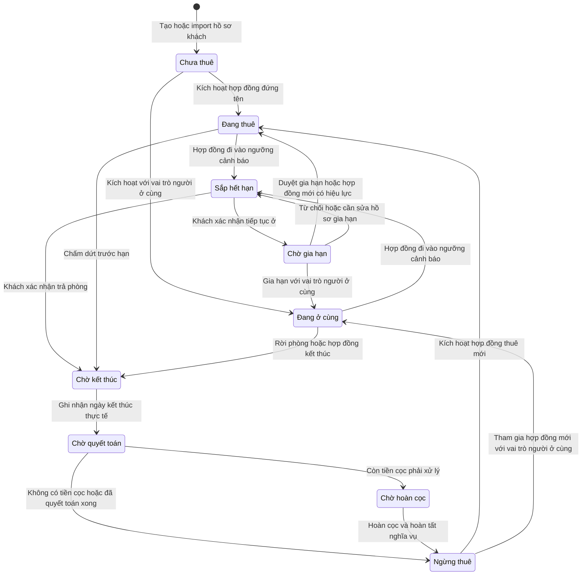
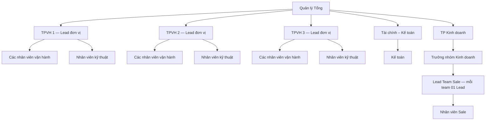
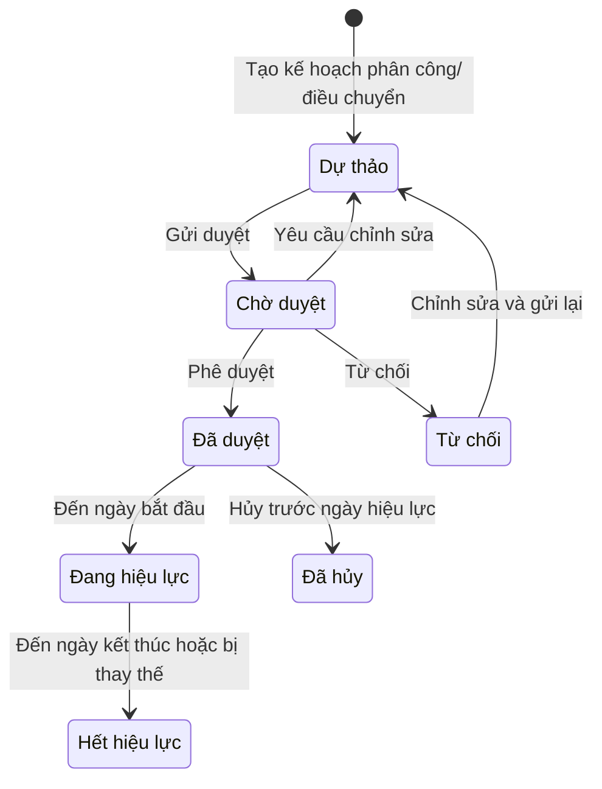

# Đặc tả nghiệp vụ vận hành cho thuê TimoHouse

> Phiên bản: Draft 1.1
>
> Ngày cập nhật: 20/09/2026
>
> Phạm vi: Chủ nhà, tòa nhà, phòng, khách thuê, hợp đồng, OCR hợp đồng, hóa đơn, thu tiền, Zalo, kết thúc/gia hạn hợp đồng, hoàn cọc, chi phí, nhân sự, cơ cấu tổ chức và bảng lương.
>
> Mục đích: Chuẩn hóa các ý tưởng nghiệp vụ ban đầu thành quy trình, quy tắc và trạng thái có thể dùng để phân tích hệ thống, thiết kế UI và kiểm thử.

## 1. Mục tiêu nghiệp vụ

Hệ thống phải quản lý xuyên suốt vòng đời cho thuê:

```text
Chủ nhà và hợp đồng đầu vào
→ Tòa nhà
→ Phòng
→ Khách thuê
→ Hợp đồng thuê phòng
→ Dịch vụ và chỉ số điện nước
→ Hóa đơn
→ Thu tiền và công nợ
→ Gia hạn hoặc kết thúc hợp đồng
→ Quyết toán và hoàn cọc
→ Dọn phòng và đưa phòng về trạng thái sẵn sàng
```

Mọi dữ liệu phát sinh từ hợp đồng phải được lưu thành dữ liệu nghiệp vụ có cấu trúc, có liên kết và có lịch sử thay đổi; tệp hợp đồng chỉ là chứng từ đính kèm, không thay thế dữ liệu quản lý trên hệ thống.

## 2. Tác nhân nghiệp vụ

| Tác nhân | Trách nhiệm chính |
|---|---|
| Quản trị viên | Quản lý danh mục, tài khoản, phân quyền và cấu hình hệ thống. |
| Nhân sự | Quản lý hồ sơ nhân viên, đơn vị tổ chức, chức danh và lịch sử điều chuyển. |
| Quản lý/Vận hành | Quản lý chủ nhà, tòa, phòng, khách thuê, hợp đồng, tình trạng phòng và xác nhận các phát sinh thực tế. |
| Kế toán | Lập/phát hành hóa đơn, ghi nhận thu tiền, quản lý công nợ, chi phí và hoàn cọc. |
| Hệ thống | Kiểm tra dữ liệu, chống trùng, tính toán trạng thái, lập danh sách cần xử lý và lưu nhật ký. |

## 3. Đối tượng dữ liệu và quan hệ

| Đối tượng | Quan hệ nghiệp vụ chính |
|---|---|
| Chủ nhà | Có một hoặc nhiều hợp đồng đầu vào; liên kết với một hoặc nhiều tòa nhà. |
| Hợp đồng đầu vào | Hợp đồng giữa đơn vị vận hành và chủ nhà; có thời hạn, chu kỳ thanh toán và tài liệu đính kèm. |
| Tòa nhà | Thuộc một chủ nhà/hợp đồng đầu vào; có hồ sơ pháp lý và nhiều phòng. |
| Phòng | Thuộc đúng một tòa nhà tại một thời điểm; có trạng thái vận hành và danh sách dịch vụ áp dụng. |
| Khách thuê | Hồ sơ cá nhân/tổ chức; có thể là người đứng tên hợp đồng hoặc người ở cùng. |
| Hợp đồng thuê phòng | Liên kết phòng, người đứng tên, người ở cùng, giá thuê, tiền cọc, thời hạn, chu kỳ thu và dịch vụ. |
| Hóa đơn | Thuộc một hợp đồng, phòng, khách đứng tên và kỳ thanh toán xác định. |
| Khoản thu | Được phân bổ vào một hoặc nhiều hóa đơn; hỗ trợ thu một phần. |
| Hồ sơ hoàn cọc | Thuộc hợp đồng kết thúc; gồm tiền cọc, công nợ, khấu trừ và số thực hoàn. |
| Chi phí | Gắn với tòa nhà, nhóm chi phí, kỳ ghi nhận và chứng từ liên quan. |
| Đơn vị tổ chức | Công ty, phòng/ban hoặc đội/nhóm; có thể thuộc một đơn vị cấp trên. |
| Phân công nhân sự | Liên kết nhân viên với đơn vị tổ chức, chức danh, phạm vi tòa/phòng và thời gian hiệu lực. |

## 4. Quy tắc dữ liệu chung

1. Mỗi bản ghi phải có mã định danh duy nhất, trạng thái, người tạo/cập nhật và thời điểm cập nhật.
2. Không xóa cứng dữ liệu đã phát sinh giao dịch. Khi không còn sử dụng, bản ghi được chuyển sang trạng thái `Ngừng hoạt động`, `Đã kết thúc` hoặc trạng thái tương đương.
3. Các quan hệ phải được kiểm tra trước khi lưu. Ví dụ: phòng phải thuộc đúng tòa; hợp đồng phải tham chiếu đúng phòng và khách thuê; hóa đơn phải tham chiếu đúng hợp đồng đang áp dụng trong kỳ.
4. Dữ liệu trích xuất từ tài liệu chỉ là dữ liệu đề xuất. Người dùng phải kiểm tra và xác nhận trước khi ghi vào dữ liệu chính thức.
5. Khi thông tin trích xuất khác dữ liệu đang có, hệ thống phải hiển thị nội dung chênh lệch để người dùng chọn giữ dữ liệu cũ hoặc cập nhật theo tài liệu.
6. Hệ thống phải phát hiện bản ghi có khả năng trùng dựa trên các khóa phù hợp, ví dụ: số điện thoại/giấy tờ của khách, mã tòa, mã phòng trong tòa và số hợp đồng.
7. Mọi thao tác quan trọng như xác nhận import, kích hoạt/kết thúc hợp đồng, phát hành hóa đơn, ghi nhận thu tiền và hoàn cọc phải có nhật ký thao tác.

## 5. Quy trình thiết lập chủ nhà, tòa nhà và phòng

### 5.1. Luồng chuẩn

```text
Tạo chủ nhà
→ Tạo hợp đồng đầu vào
→ Tải tài liệu hợp đồng lên (nếu có)
→ Tạo tòa nhà thuộc chủ nhà/hợp đồng
→ Tải hồ sơ pháp lý của tòa nhà (sổ đỏ và tài liệu liên quan)
→ Khai báo danh sách phòng
→ Xem trước và kiểm tra dữ liệu
→ Xác nhận lưu
```

### 5.2. Phương thức nhập liệu

- Chủ nhà, hợp đồng đầu vào và tòa nhà: cho phép nhập thủ công.
- Phòng: cho phép nhập từng phòng hoặc import Excel/CSV theo tòa nhà.
- Khách thuê: cho phép nhập từng khách hoặc import Excel/CSV.
- Tệp import phải có bước tải tệp, ánh xạ cột, kiểm tra lỗi, xem trước và xác nhận.
- Chỉ dữ liệu đã qua bước xác nhận mới được ghi vào hệ thống.
- Dòng lỗi phải nêu rõ số dòng, trường lỗi và lý do; không được âm thầm bỏ qua.

### 5.3. Kết quả sau khi xác nhận

- Chủ nhà xuất hiện trong danh sách chủ nhà.
- Tòa nhà được liên kết đúng với chủ nhà và hợp đồng đầu vào.
- Phòng được liên kết đúng với tòa nhà.
- Tài liệu được lưu đúng hồ sơ chủ nhà, hợp đồng hoặc tòa nhà.
- Dữ liệu chỉ được lưu một lần dù người dùng bấm xác nhận lặp lại.

## 6. Quản lý khách thuê và hợp đồng thuê phòng

### 6.1. Tạo hợp đồng

Hợp đồng có thể được tạo theo một trong hai cách:

1. Nhập thủ công toàn bộ thông tin.
2. Tải tài liệu hợp đồng và trích xuất thông tin để người dùng rà soát.

Luồng chuẩn:

```text
Chọn phòng sẵn sàng
→ Chọn hoặc tạo khách đứng tên
→ Khai báo người ở cùng
→ Nhập/trích xuất thông tin hợp đồng
→ Đối chiếu khách, phòng, giá, cọc, thời hạn và dịch vụ
→ Lưu dự thảo
→ Người có thẩm quyền xác nhận
→ Kích hoạt hợp đồng và chuyển phòng sang Đang thuê
```

### 6.2. Quy tắc hợp đồng

- Tại một thời điểm, một phòng không được có nhiều hơn một hợp đồng thuê đang hiệu lực, trừ khi có quy tắc đồng thuê được phê duyệt riêng.
- Chỉ phòng ở trạng thái `Sẵn sàng` mới được kích hoạt hợp đồng mới.
- Thông tin tối thiểu gồm: phòng, khách đứng tên, ngày bắt đầu, ngày kết thúc, giá thuê, tiền cọc, chu kỳ thanh toán, mốc thu tiền và dịch vụ áp dụng.
- Nếu khách đứng tên hoặc người ở cùng chưa tồn tại, hệ thống tạo hồ sơ khách thuê mới sau khi người dùng xác nhận.
- Người ở cùng được lưu thành hồ sơ khách thuê riêng và liên kết với hợp đồng bằng vai trò `Người ở cùng`; không gộp vào hồ sơ người đứng tên.
- Dịch vụ, đơn giá và điều kiện tính phí xác nhận trên hợp đồng phải được lưu để phục vụ lập hóa đơn về sau.
- Khi kích hoạt hợp đồng, hệ thống lưu ảnh chụp dữ liệu đã xác nhận để việc thay đổi danh mục sau này không làm sai dữ liệu lịch sử.

### 6.3. OCR hợp đồng và tạo gói dữ liệu nghiệp vụ

Trong Phase 1, hợp đồng có thể là điểm bắt đầu của quá trình nhập liệu. OCR không chỉ điền form hợp đồng mà phải nhận diện một gói dữ liệu có quan hệ:

- Tòa nhà tương ứng theo mã, tên hoặc địa chỉ.
- Phòng thuộc đúng tòa nhà.
- Khách đứng tên và từng người ở cùng.
- Thông tin hợp đồng, giá, cọc, ngày bắt đầu/kết thúc, chu kỳ và mốc thu.
- Danh sách dịch vụ theo phòng/hợp đồng và đơn giá áp dụng.
- Danh sách tài sản/nội thất bàn giao nếu có trong hợp đồng hoặc phụ lục.
- Phương tiện, biển số và người sử dụng.
- File gốc, phiên bản và bằng chứng trang/vùng cho từng field.

Luồng bắt buộc:

```text
Tải PDF/JPG
→ OCR và chuẩn hóa dữ liệu
→ dò tòa/phòng/khách/HĐ đã có
→ hiển thị field, confidence, bằng chứng và chênh lệch
→ người dùng chọn Tạo mới | Liên kết | Cập nhật | Bỏ qua
→ lưu gói dự thảo
→ người có quyền xác nhận
→ ghi toàn bộ dữ liệu chính thức
```

Quy tắc:

1. OCR chỉ sinh dữ liệu đề xuất; không tự kích hoạt hợp đồng.
2. Nếu tòa/phòng chưa có, hệ thống tạo đề xuất dự thảo và yêu cầu bổ sung field bắt buộc trước khi duyệt.
3. Dò trùng khách ưu tiên giấy tờ và SĐT đã chuẩn hóa; dò phòng theo `tòa + mã phòng`; dò HĐ theo số HĐ và các bên/ngày ký.
4. Mỗi field lưu raw text, giá trị chuẩn hóa, confidence, trang/vùng nguồn và quyết định của người rà soát.
5. Khi khác dữ liệu hiện có, phải hiển thị so sánh cũ–mới; chỉ vai trò có quyền mới được cập nhật master.
6. Ghi dữ liệu theo thứ tự phụ thuộc `tòa → phòng → khách/người ở cùng → xe/tài sản → hợp đồng → dịch vụ → tài liệu` trong một giao dịch nhất quán.
7. Nếu field bắt buộc hoặc liên kết chính thất bại, không để lại nửa gói dữ liệu chính thức.
8. Xác nhận hoặc chạy lại cùng tài liệu không tạo bản ghi trùng; tài liệu/job phải có hash/idempotency key và phiên bản.

Trạng thái tối thiểu:

```text
Đã tải → Đang xử lý → Cần rà soát → Đã xác nhận → Đã ghi dữ liệu
                         ↘ Từ chối
Đang xử lý/Cần rà soát → Lỗi → Xử lý lại
```

Ngày kết thúc hợp đồng sau khi xác nhận phải được lưu thành ngày chuẩn và là nguồn cho danh sách hợp đồng sắp hết hạn.

## 7. Lập hóa đơn theo kỳ

### 7.1. Điều kiện đưa phòng vào danh sách lập hóa đơn

Một phòng được đưa vào danh sách khi đồng thời thỏa mãn:

- Có hợp đồng hiệu lực trong kỳ được chọn.
- Chưa có hóa đơn hợp lệ cho cùng hợp đồng, phòng và kỳ.
- Không thuộc trường hợp đang tạm dừng lập hóa đơn hoặc đã kết thúc trước kỳ.

Khóa chống trùng tối thiểu là `hợp đồng + phòng + kỳ hóa đơn`. Hóa đơn nháp hoặc đã phát hành phải được hiển thị rõ để tránh tạo lần hai.

### 7.2. Luồng lập hóa đơn

```text
Chọn kỳ và tòa nhà
→ Hệ thống liệt kê các phòng đủ điều kiện
→ Nhập/import chỉ số điện, nước và các khoản dịch vụ
→ Hệ thống tính tiền theo cấu hình của hợp đồng
→ Kiểm tra dữ liệu thiếu hoặc bất thường
→ Xem trước hóa đơn theo từng phòng
→ Chỉnh sửa nội dung được phép
→ Lưu nháp
→ Phát hành hóa đơn
```

### 7.3. Quy tắc tính và lưu hóa đơn

- Hóa đơn phải gắn với phòng, hợp đồng và khách đứng tên tại thời điểm lập.
- Nội dung gồm tối thiểu: tiền phòng, dịch vụ, điện nước, khoản điều chỉnh, tổng phải thu, hạn thanh toán và thông tin người nhận.
- Đơn giá và dữ liệu khách/phòng trên hóa đơn là ảnh chụp tại thời điểm phát hành; thay đổi sau đó không được tự động làm đổi hóa đơn cũ.
- Chỉ hóa đơn `Đã phát hành` mới được tính vào công nợ và được gửi thông báo thanh toán.
- Hóa đơn đã phát hành không được sửa trực tiếp. Sai sót phải được xử lý bằng nghiệp vụ điều chỉnh/hủy có lưu lịch sử.

## 8. Gửi thông báo Zalo

Thông báo Zalo sử dụng dữ liệu từ hóa đơn đã phát hành và hồ sơ khách đứng tên.

```text
Chọn hóa đơn đủ điều kiện
→ Kiểm tra số điện thoại/Zalo của khách
→ Xem trước người nhận và nội dung
→ Kiểm tra lại số tiền còn phải thu
→ Xác nhận gửi
→ Lưu kết quả gửi theo từng người nhận
```

Quy tắc:

- Không gửi hóa đơn nháp, hóa đơn đã hủy hoặc hóa đơn đã thu đủ nếu đây là đợt nhắc công nợ.
- Trước khi gửi, hệ thống phải tính lại số còn nợ; nếu khách đã thanh toán một phần thì thông báo số tiền còn lại.
- Phải lưu trạng thái `Chờ gửi`, `Gửi thành công`, `Gửi thất bại` hoặc `Bỏ qua`, kèm thời gian và nguyên nhân.
- Gửi lại chỉ áp dụng cho bản tin thất bại; không gửi trùng cho bản tin đã thành công.

## 9. Theo dõi hợp đồng sắp hết hạn

Đầu mỗi tháng, hệ thống lập danh sách hợp đồng sắp hết hạn theo ngưỡng cảnh báo được cấu hình (phạm vi hiện tại đề xuất là 35 ngày).

Hệ thống kiểm tra hằng ngày và đồng thời chụp danh sách làm việc vào cuối tháng/đầu tháng. Ngày hết hạn có thể đến từ nhập tay, import hoặc OCR nhưng chỉ được dùng sau khi người dùng xác nhận.

Danh sách tối thiểu gồm: mã tòa-phòng, khách đứng tên/SĐT, người ở cùng, quản lý đang phụ trách, ngày bắt đầu/kết thúc, số ngày còn lại, giá thuê, cọc, công nợ, tình trạng gia hạn, lần liên hệ gần nhất, hạn xử lý và hành động tiếp theo. Mỗi dòng phải được giao cho người phụ trách và lưu lịch sử xử lý.

Mỗi hợp đồng phải được phân loại để xử lý:

| Kết quả làm việc với khách | Hướng xử lý |
|---|---|
| Khách tiếp tục thuê | Tạo hồ sơ gia hạn ở trạng thái dự thảo để rà soát. |
| Khách trả phòng đúng hạn | Ghi nhận ngày kết thúc, quyết toán công nợ và lập hồ sơ hoàn cọc. |
| Khách chấm dứt trước hạn | Ghi nhận phá/chấm dứt sớm hợp đồng, công nợ, phí phạt/khấu trừ và hoàn cọc. |
| Chưa có phản hồi | Giữ trong danh sách cần xử lý và nhắc người phụ trách; không tự gia hạn. |

Danh sách sắp hết hạn chỉ là cảnh báo. Hệ thống không được tự động kết thúc hoặc tự động gia hạn hợp đồng chỉ vì đã sang đầu tháng.

## 10. Gia hạn hợp đồng

### 10.1. Luồng xử lý

```text
Hợp đồng sắp hết hạn
→ Chọn Gia hạn
→ Tạo hợp đồng/phụ lục gia hạn dạng dự thảo
→ Kế thừa thông tin từ hợp đồng hiện tại
→ Nhập thời hạn, giá, cọc và dịch vụ của kỳ mới
→ Rà soát
→ Xác nhận gia hạn
```

### 10.2. Quy tắc

- Hồ sơ gia hạn phải liên kết với hợp đồng trước đó để giữ lịch sử.
- Thời hạn mặc định có thể kế thừa thời lượng của hợp đồng cũ nhưng người dùng được phép sửa. Ví dụ, khách chỉ ở thêm một tháng thì có thể nhập thời hạn một tháng.
- Chỉ sau khi được xác nhận, hồ sơ gia hạn mới có hiệu lực.
- Không ghi đè ngày kết thúc hoặc điều khoản của hợp đồng cũ.
- Nếu gia hạn liên tục, phòng giữ trạng thái `Đang thuê`; không chuyển qua `Chờ dọn`.

## 11. Kết thúc trước hạn, công nợ và hoàn cọc

### 11.1. Chấm dứt trước hạn

Không được suy luận khách phá hợp đồng chỉ từ việc thanh toán thiếu. Quản lý phải chủ động xác nhận sự kiện chấm dứt trước hạn và ngày kết thúc thực tế.

```text
Quản lý xác nhận chấm dứt trước hạn
→ Khóa phát sinh mới sau ngày kết thúc
→ Tổng hợp hóa đơn đã thu, thu một phần và chưa thu
→ Tính phí phạt/khấu trừ theo điều khoản
→ Lập phương án hoàn cọc
→ Kết thúc hợp đồng
→ Chuyển phòng sang Chờ dọn
```

Khoản khách chưa thanh toán vẫn phải được giữ là công nợ cho đến khi được thu, khấu trừ hợp lệ hoặc xử lý theo quyết định có thẩm quyền.

### 11.2. Hoàn cọc

```text
Hợp đồng đã kết thúc
→ Chờ lập phương án hoàn cọc
→ Rà soát tiền cọc, công nợ và các khoản khấu trừ
→ Chờ duyệt
→ Đã duyệt
→ Ghi nhận hoàn tiền
→ Đã hoàn
```

Số tiền thực hoàn được tính như sau:

```text
Số tiền thực hoàn = Tiền cọc được ghi nhận
                    - Công nợ được phép bù trừ
                    - Phí phạt
                    - Chi phí sửa chữa/vệ sinh
                    - Các khoản khấu trừ hợp lệ khác
```

Việc bù trừ công nợ vào tiền cọc chỉ được thực hiện khi quy tắc này được doanh nghiệp phê duyệt và phải thể hiện thành từng dòng khấu trừ; không tự động bù trừ ngầm.

### 11.3. Trạng thái sau khi hoàn tất

- Hồ sơ khách thuê không bị xóa sau khi hoàn cọc. Hệ thống giữ hồ sơ và toàn bộ lịch sử giao dịch; khách chỉ chuyển sang trạng thái `Không có hợp đồng hiệu lực` hoặc `Ngừng thuê`.
- Phòng chỉ chuyển từ `Chờ dọn` sang `Sẵn sàng` sau khi người phụ trách xác nhận đã dọn/kiểm tra xong.
- Hoàn cọc xong không đồng nghĩa phòng tự động sẵn sàng cho thuê.

## 12. Quản lý chi phí

- Cho phép nhập thủ công hoặc import chi phí và bắt buộc liên kết với tòa nhà tương ứng.
- Thông tin tối thiểu: tòa nhà, ngày ghi nhận, kỳ, nhóm chi phí, nội dung, số tiền, nhà cung cấp/người nhận, chứng từ và ghi chú.
- Các chi phí điện, nước đầu vào phải được phân biệt với khoản điện, nước thu lại của khách:
  - Hóa đơn điện/nước từ nhà cung cấp là chi phí của tòa nhà.
  - Tiền điện/nước tính cho khách là dòng dịch vụ trên hóa đơn và là khoản phải thu.
- Dòng import lỗi hoặc không xác định được tòa nhà không được ghi nhận chính thức trước khi người dùng sửa và xác nhận.

## 13. Mốc thu tiền M1, M2, M3

Mỗi hợp đồng được gán một mốc thu tiền:

| Mốc | Ngày thanh toán dự kiến trong tháng |
|---|---:|
| M1 | Ngày 05 |
| M2 | Ngày 10 |
| M3 | Ngày 15 |

Mốc thu là thuộc tính của hợp đồng và được dùng để xác định hạn thanh toán trên hóa đơn. Việc khách thanh toán thực tế phải được ghi nhận bằng khoản thu và phân bổ vào hóa đơn.

Trạng thái thu tiền được tính từ số đã phân bổ:

- `Chưa thu`: số đã thu bằng 0.
- `Thu một phần`: số đã thu lớn hơn 0 nhưng nhỏ hơn tổng phải thu.
- `Thu đủ`: số đã thu bằng tổng phải thu.
- `Quá hạn`: đã qua hạn thanh toán và vẫn còn số dư phải thu.

## 14. Phòng/hợp đồng mới phát sinh giữa kỳ

Phòng có hợp đồng bắt đầu sau ngày chạy đợt hóa đơn chuẩn có thể chưa nằm trong đợt hóa đơn đầu tháng. Tuy nhiên, mọi khoản quản lý thu từ khách vẫn phải có chứng từ trên hệ thống.

Đề xuất luồng kiểm soát:

```text
Kích hoạt hợp đồng mới giữa kỳ
→ Đưa vào danh sách Phát sinh mới chưa lập hóa đơn
→ Quản lý/Kế toán chọn phương án tính tiền
→ Lập hóa đơn bổ sung hoặc ghi nhận hoãn sang kỳ kế tiếp
→ Phát hành hóa đơn
→ Ghi nhận thu tiền
```

Hai phương án cần được hệ thống hỗ trợ sau khi doanh nghiệp chốt chính sách:

1. Lập hóa đơn bổ sung trong tháng, tính đủ tháng hoặc theo tỷ lệ số ngày ở thực tế.
2. Hoãn thu sang kỳ kế tiếp nhưng phải ghi rõ kỳ dịch vụ gốc và không được làm mất khoản phải thu.

Chỉ tiêu `Doanh thu phát sinh mới` nên được hiểu là doanh thu từ các hợp đồng bắt đầu trong kỳ và phải được lấy từ hóa đơn đã phát hành; không tính trực tiếp từ danh sách phòng mới để tránh ghi nhận trùng hoặc ghi nhận khoản chưa có chứng từ.

## 15. Ma trận trạng thái chính

| Đối tượng | Luồng trạng thái chuẩn |
|---|---|
| Phòng | `Sẵn sàng` → `Đang thuê` → `Chờ dọn` → `Sẵn sàng` |
| Hợp đồng | `Dự thảo` → `Hiệu lực` → `Đã kết thúc` hoặc `Đã hủy` |
| Gia hạn | `Dự thảo` → `Đã xác nhận` → tạo hiệu lực cho kỳ tiếp theo |
| Hóa đơn | `Nháp` → `Đã phát hành` → `Đã điều chỉnh/Đã hủy` khi cần |
| Tình trạng thu hóa đơn | `Chưa thu` → `Thu một phần` → `Thu đủ`; cờ `Quá hạn` được tính độc lập |
| Hoàn cọc | `Nháp` → `Chờ duyệt` → `Đã duyệt` → `Đã hoàn`; hoặc `Chờ duyệt` → `Từ chối` |
| Tin Zalo | `Chờ gửi` → `Gửi thành công`, `Gửi thất bại` hoặc `Bỏ qua` |

## 16. Sơ đồ trạng thái vòng đời khách thuê

### 16.1. Nguyên tắc xác định trạng thái

Trạng thái vòng đời khách thuê phải được suy ra từ quan hệ của khách với hợp đồng, công nợ và hồ sơ hoàn cọc; không cho phép người dùng sửa tùy ý một trạng thái độc lập làm sai dữ liệu nguồn.



### 16.2. Ý nghĩa trạng thái

| Trạng thái | Điều kiện xác định | Hành động tiếp theo |
|---|---|---|
| `Chưa thuê` | Đã có hồ sơ khách nhưng chưa từng có hợp đồng hiệu lực. | Tạo hợp đồng mới hoặc thêm khách làm người ở cùng. |
| `Đang thuê` | Có ít nhất một hợp đồng hiệu lực mà khách là người đứng tên. | Lập hóa đơn, thu tiền, theo dõi công nợ và thời hạn. |
| `Đang ở cùng` | Khách đang liên kết với hợp đồng hiệu lực bằng vai trò người ở cùng và không phải người đứng tên. | Quản lý thông tin cư trú; nghĩa vụ tài chính mặc định thuộc người đứng tên. |
| `Sắp hết hạn` | Hợp đồng hiệu lực đi vào ngưỡng cảnh báo hết hạn. Đây là cờ cảnh báo được tính theo ngày, không phải trạng thái nhập tay. | Xác nhận gia hạn, trả phòng hoặc tiếp tục theo dõi. |
| `Chờ gia hạn` | Đã có hồ sơ gia hạn/hợp đồng kế tiếp ở trạng thái dự thảo hoặc chờ duyệt. | Rà soát và xác nhận hoặc trả hồ sơ về sửa. |
| `Chờ kết thúc` | Đã xác nhận khách sẽ rời đi hoặc chấm dứt sớm nhưng chưa ghi nhận hoàn tất hợp đồng. | Chốt ngày thực tế, chỉ số, hóa đơn và tình trạng phòng. |
| `Chờ quyết toán` | Hợp đồng đã kết thúc nhưng còn phải tổng hợp công nợ, phí phạt hoặc khoản khấu trừ. | Chốt nghĩa vụ và lập phương án hoàn cọc nếu có. |
| `Chờ hoàn cọc` | Đã chốt quyết toán và còn khoản cọc phải hoàn/xử lý. | Duyệt và ghi nhận hoàn cọc. |
| `Ngừng thuê` | Không còn hợp đồng hiệu lực và đã hoàn tất quy trình kết thúc liên quan. | Giữ lịch sử; có thể tái sử dụng hồ sơ khi khách thuê lại. |

### 16.3. Quy tắc ưu tiên khi một khách có nhiều quan hệ thuê

Một khách có thể thuê lại hoặc xuất hiện trong nhiều hợp đồng theo thời gian. Trạng thái tổng hợp trên danh sách khách được xác định theo thứ tự ưu tiên:

1. Có hợp đồng đứng tên đang hiệu lực → `Đang thuê`.
2. Không đứng tên hợp đồng hiệu lực nhưng đang là người ở cùng → `Đang ở cùng`.
3. Không còn hợp đồng hiệu lực nhưng còn hồ sơ kết thúc, quyết toán hoặc hoàn cọc chưa hoàn tất → trạng thái chờ tương ứng.
4. Đã từng thuê và mọi nghĩa vụ đã hoàn tất → `Ngừng thuê`.
5. Chưa từng có hợp đồng hiệu lực → `Chưa thuê`.

Các cờ cảnh báo như `Sắp hết hạn` và `Còn công nợ` phải được hiển thị riêng khi cần. Công nợ chưa thanh toán không phải lý do để xóa khách hoặc tự động chuyển khách sang trạng thái chấm dứt hợp đồng.

### 16.4. Quy tắc lưu trữ hồ sơ

- Mỗi lần thuê mới tạo một quan hệ/hợp đồng mới; không ghi đè lịch sử thuê cũ.
- Khách quay lại thuê phải dùng lại hồ sơ hiện có nếu trùng số giấy tờ hoặc thông tin định danh đã xác minh.
- Chỉ được chuyển hồ sơ khách sang `Ngừng hoạt động` vì lý do dữ liệu như tạo nhầm, trùng hồ sơ hoặc theo quyết định quản trị; trạng thái này khác với `Ngừng thuê`.
- Không được chuyển hồ sơ sang `Ngừng hoạt động` khi khách còn hợp đồng hiệu lực, công nợ, nghĩa vụ quyết toán hoặc hồ sơ hoàn cọc chưa xử lý xong.

## 17. Cơ cấu tổ chức và phân công nhân sự

### 17.1. Mục tiêu

Phân hệ Nhân sự cần cho phép thiết lập cơ cấu tổ chức theo nhiều cấp và quản lý việc phân công nhân viên vận hành tòa nhà theo thời gian. Bảng tổng hợp phải thể hiện được:

- Tuyến báo cáo từ Quản lý Tổng đến từng phòng, đội/nhóm và nhân viên.
- Nhân viên đang thuộc đội/nhóm nào.
- Chức danh và Lead quản lý trực tiếp của đội/nhóm.
- Số tòa nhà và số phòng đang phụ trách.
- Số tòa nhà và số phòng sẽ phụ trách theo kế hoạch đã có hiệu lực trong tương lai.
- Tổng khối lượng của từng đội/nhóm và toàn công ty.

Các nhóm như `VH5S`, `VHPLUS` trong bảng phân bổ được quản lý dưới dạng **đơn vị tổ chức**, không lưu như một ô tiêu đề tự do trong bảng tính. Các chức danh như `Quản lý Tổng`, `TPVH`, `TP Kinh doanh`, `Trưởng nhóm Kinh doanh` và `Lead Team Sale` được quản lý dưới dạng **vị trí/chức danh** gắn với đơn vị tương ứng.

### 17.2. Mô hình cơ cấu theo sơ đồ hiện tại



Diễn giải các cấp theo sơ đồ:

| Cấp | Đơn vị/vị trí | Quan hệ quản lý |
|---:|---|---|
| 1 | Quản lý Tổng | Quản lý các trưởng phòng/khối trực thuộc. |
| 2 | TPVH 1, TPVH 2, TPVH 3 | Mỗi TPVH là Lead duy nhất của một đơn vị vận hành. |
| 2 | Tài chính – Kế toán | Đơn vị chức năng trực thuộc Quản lý Tổng. |
| 2 | TP Kinh doanh | Quản lý toàn bộ nhánh kinh doanh. |
| 3 | Nhân viên vận hành, Nhân viên kỹ thuật | Thuộc đơn vị vận hành tương ứng. |
| 3 | Kế toán | Thuộc đơn vị Tài chính – Kế toán. |
| 3 | Trưởng nhóm Kinh doanh | Thuộc TP Kinh doanh và quản lý cấp dưới trong phạm vi được giao. |
| 4 | Lead Team Sale | Mỗi team Sale có đúng một Lead. |
| 5 | Sale | Thuộc đúng một team Sale chính tại một thời điểm. |

Hệ thống phải hỗ trợ số cấp linh hoạt để có thể thêm/bớt team mà không sửa cấu trúc phần mềm. Cấu trúc hiện tại được biểu diễn như sau:

```text
Công ty
├─ Quản lý Tổng
│  ├─ Đơn vị vận hành 1 → TPVH 1 → NV vận hành/NV kỹ thuật
│  ├─ Đơn vị vận hành 2 → TPVH 2 → NV vận hành/NV kỹ thuật
│  ├─ Đơn vị vận hành 3 → TPVH 3 → NV vận hành/NV kỹ thuật
│  ├─ Tài chính – Kế toán → Kế toán
│  └─ Phòng Kinh doanh → TP Kinh doanh
│     └─ Nhóm Kinh doanh → Trưởng nhóm Kinh doanh
│        └─ Team Sale → Lead Team Sale → Sale
```

### 17.3. Dữ liệu đơn vị tổ chức

Mỗi đơn vị tổ chức cần có tối thiểu:

| Trường | Ý nghĩa |
|---|---|
| Mã đơn vị | Mã duy nhất, ví dụ `VH5S`, `VHPLUS`. |
| Tên đơn vị | Tên hiển thị chính thức. |
| Loại đơn vị | Công ty, phòng/ban, đơn vị vận hành, nhóm kinh doanh hoặc team Sale. |
| Đơn vị cấp trên | Xác định vị trí trong cây tổ chức. |
| Lead/Trưởng đơn vị | Nhân viên phụ trách đơn vị trong khoảng thời gian hiệu lực. Mỗi đơn vị loại `Đội/Nhóm` bắt buộc có đúng một Lead. |
| Ngày hiệu lực | Ngày đơn vị bắt đầu hoạt động. |
| Ngày kết thúc | Để trống khi đơn vị vẫn hoạt động. |
| Trạng thái | Dự thảo, Hoạt động hoặc Ngừng hoạt động. |

Không được xóa cứng đơn vị đã có nhân viên hoặc lịch sử phân công. Khi giải thể, đơn vị chuyển sang `Ngừng hoạt động` và vẫn được giữ trong dữ liệu lịch sử.

### 17.4. Thành viên và chức danh

- Một nhân viên phải có một đơn vị công tác chính tại cùng một thời điểm.
- Nhân viên có thể kiêm nhiệm đơn vị hoặc vai trò khác nếu khai báo rõ loại quan hệ `Kiêm nhiệm`.
- Mỗi đội/nhóm ở trạng thái `Hoạt động` bắt buộc có **đúng một Lead đang hiệu lực** tại một thời điểm.
- Với đơn vị vận hành, chức danh Lead là `TPVH`; với team Sale, chức danh Lead là `Lead Team Sale`.
- Không cho phép hai nhiệm kỳ Lead của cùng một đội/nhóm bị chồng thời gian.
- Lead phải là nhân viên đang làm việc và là thành viên chính thức của chính đội/nhóm đó.
- Lead cũng được tính là một thành viên trong tổng nhân sự và khối lượng phân công của đội; không tạo thêm một hồ sơ nhân viên riêng cho vai trò Lead.
- Khi bổ nhiệm Lead mới, hệ thống phải kết thúc nhiệm kỳ Lead cũ vào ngày liền trước ngày Lead mới bắt đầu.
- Không được gỡ Lead, điều chuyển Lead sang đội khác hoặc cho Lead nghỉ việc nếu chưa chỉ định người kế nhiệm, trừ khi đội được chuyển sang `Ngừng hoạt động` cùng thời điểm.
- Mỗi lần bổ nhiệm, điều chuyển hoặc thay đổi chức danh phải có ngày hiệu lực và được lưu thành một bản ghi lịch sử mới; không ghi đè dữ liệu cũ.
- Khi điều chuyển nhân viên sang nhóm khác trong tương lai, cơ cấu hiện tại không đổi cho đến ngày hiệu lực.
- Nhân viên ngừng làm việc không được nhận phân công mới sau ngày nghỉ việc.

### 17.5. Phân công quản lý tòa nhà và phòng

Phạm vi vận hành ưu tiên được phân công theo tòa nhà. Số phòng phụ trách được hệ thống cộng từ số phòng thuộc các tòa đã giao, không nhập tay vào bảng tổng hợp.

Trong trường hợp một tòa có nhiều nhân viên cùng tham gia, phân công phải có loại vai trò rõ ràng, ví dụ:

- Người phụ trách chính.
- Người phối hợp.
- Nhân viên kỹ thuật.
- Nhân viên vệ sinh.
- Vai trò khác theo danh mục cấu hình.

Mỗi phân công gồm:

| Trường | Ý nghĩa |
|---|---|
| Nhân viên | Người được giao phụ trách. |
| Đội/nhóm | Đơn vị của nhân viên tại thời điểm phân công. |
| Tòa nhà | Tòa nằm trong phạm vi được giao. |
| Phạm vi phòng | Mặc định là toàn bộ phòng của tòa; chỉ khai báo danh sách phòng khi có ngoại lệ. |
| Vai trò phân công | Phụ trách chính, phối hợp hoặc vai trò chuyên môn. |
| Từ ngày/đến ngày | Khoảng thời gian phân công có hiệu lực. |
| Trạng thái | Dự thảo, Chờ duyệt, Đã duyệt, Đang hiệu lực, Hết hiệu lực hoặc Đã hủy. |
| Người phê duyệt | Người xác nhận kế hoạch phân công. |

### 17.6. Logic “hiện tại” và “sắp tới”

Các số liệu trong bảng phải được tính theo ngày tham chiếu:

```text
Nhà hiện tại = Số tòa có phân công đang hiệu lực tại ngày hôm nay
Phòng hiện tại = Tổng số phòng thuộc các tòa hiện tại

Nhà sắp tới = Số tòa sẽ thuộc phạm vi phụ trách tại ngày kế hoạch được chọn
Phòng sắp tới = Tổng số phòng thuộc các tòa sắp tới
```

Quy tắc tính:

1. Chỉ tính phân công `Đã duyệt` và có hiệu lực tại ngày tham chiếu.
2. Mặc định chỉ vai trò `Phụ trách chính` được tính vào chỉ tiêu phân bổ; vai trò phối hợp không làm tăng tổng để tránh đếm trùng.
3. Một tòa không được có hai người phụ trách chính bị chồng thời gian, trừ khi nghiệp vụ cho phép đồng phụ trách và đã cấu hình tỷ lệ phân bổ.
4. Khi tòa được chuyển từ nhân viên A sang nhân viên B, hệ thống tự kết thúc phân công của A vào ngày liền trước ngày B bắt đầu.
5. Tổng của đội/nhóm được tính từ các phân công của thành viên trong đội tại cùng ngày tham chiếu; không cộng từ số tổng nhập tay.
6. Nếu số lượng phòng của tòa thay đổi, số phòng phụ trách phải được tính theo dữ liệu phòng có hiệu lực tại ngày báo cáo.

### 17.7. Quy trình lập kế hoạch điều chuyển



Kế hoạch đã duyệt nhưng chưa đến ngày áp dụng được dùng để tính cột `Nhà sắp tới` và `Phòng sắp tới`. Kế hoạch dự thảo hoặc bị từ chối không được tính vào số liệu chính thức.

### 17.8. Màn hình và chức năng tối thiểu

1. **Cây cơ cấu tổ chức:** xem, thêm, sửa, di chuyển và ngừng hoạt động đơn vị.
2. **Danh sách thành viên theo đơn vị:** hiển thị duy nhất một Lead của đội, các thành viên, chức danh, ngày vào nhóm và trạng thái làm việc.
3. **Bảng phân bổ vận hành:** hiển thị nhân viên, phòng hiện tại, phòng sắp tới, nhà hiện tại và nhà sắp tới; có dòng tổng theo nhóm.
4. **Lập kế hoạch điều chuyển:** chuyển một hoặc nhiều tòa giữa nhân viên/đội nhóm và chọn ngày hiệu lực.
5. **Kiểm tra xung đột:** cảnh báo tòa thiếu người phụ trách, bị phân công trùng hoặc nhân viên vượt ngưỡng khối lượng cấu hình.
6. **Lịch sử tổ chức và phân công:** tra cứu theo nhân viên, đơn vị, tòa nhà và khoảng thời gian.
7. **Xuất Excel:** xuất đúng dữ liệu theo ngày hiện tại hoặc ngày kế hoạch được chọn.

### 17.9. Phân quyền đề xuất

| Vai trò | Quyền chính |
|---|---|
| Quản trị viên | Toàn quyền cấu hình cơ cấu, phân quyền và xử lý dữ liệu sai. |
| Nhân sự | Tạo/sửa đơn vị, thành viên, chức danh và lịch sử điều chuyển nhân sự. |
| Quản lý Tổng | Xem toàn bộ cơ cấu; phê duyệt thay đổi cơ cấu và điều chuyển liên phòng/đơn vị. |
| TPVH | Quản lý nhân viên và đề xuất/duyệt phân công tòa, phòng trong đơn vị vận hành được giao. |
| TP Kinh doanh | Quản lý các nhóm kinh doanh, Trưởng nhóm Kinh doanh và phạm vi dữ liệu kinh doanh. |
| Trưởng nhóm Kinh doanh | Quản lý các team Sale thuộc nhóm và đề xuất thay đổi Lead. |
| Lead Team Sale | Quản lý thành viên Sale trong đúng team của mình. |
| Tài chính – Kế toán | Xem cơ cấu liên quan; quyền nghiệp vụ tài chính được cấp độc lập với cơ cấu tổ chức. |
| Nhân viên | Xem cơ cấu và phạm vi công việc của bản thân. |

Quyền truy cập dữ liệu tòa nhà có thể được suy ra từ phân công vận hành, nhưng phải tách biệt giữa `được giao phụ trách` và `được phép xem/sửa` để tránh thay đổi phân công vô tình mở rộng quyền hệ thống.

### 17.10. Tiêu chí nghiệm thu riêng

1. Tạo được cây tổ chức nhiều cấp và hiển thị đúng quan hệ cấp trên–cấp dưới.
2. Điều chuyển nhân viên trong tương lai không làm thay đổi cơ cấu hiện tại trước ngày hiệu lực.
3. Chuyển tòa giữa hai nhân viên không tạo khoảng trống hoặc chồng lấn người phụ trách chính.
4. Các cột phòng/nhà hiện tại và sắp tới được tính từ dữ liệu phân công, không phụ thuộc số nhập tay.
5. Tổng theo đội/nhóm bằng tổng các tòa/phòng không trùng của thành viên trong cùng phạm vi ngày.
6. Có thể truy lại người đã phụ trách một tòa tại bất kỳ thời điểm nào trong quá khứ.
7. Không thể ngừng hoạt động nhân viên/đơn vị khi còn phân công tương lai chưa được xử lý.
8. Không thể kích hoạt đội/nhóm khi chưa có Lead hoặc khi có nhiều hơn một Lead cùng hiệu lực.
9. Bổ nhiệm Lead mới tự kết thúc nhiệm kỳ Lead cũ đúng ngày và vẫn giữ được toàn bộ lịch sử lãnh đạo đội.

### 17.11. Bảng lương theo cơ cấu và hiệu suất

Bảng lương là một phần của chuỗi Phase 1 `Tổ chức → Nhân viên → Phân công → Bảng lương`. Kết quả lương phải lấy từ nhân sự và số liệu vận hành đã quản lý, không nhập lại toàn bộ bảng tổng hợp bằng tay.

Đầu vào tối thiểu theo bằng chứng trong `Timohouse.xlsx > Bảng lương`:

- Nhân viên, đơn vị, chức danh và nhiệm kỳ Lead trong kỳ.
- Danh sách tòa/phòng phụ trách theo ngày hiệu lực.
- Lương cơ bản, phụ cấp ăn trưa, xăng xe, lương trưởng nhóm và lương hỗ trợ.
- Số phòng, doanh thu niêm yết, doanh thu phải thu.
- Doanh thu thu được tại M1/M2/M3, tổng sau ba mốc.
- Doanh thu dịch vụ, tỷ lệ dịch vụ/doanh thu và khoản thu thêm.
- Hiệu suất, mức lương/phòng, tổng lương theo phòng, điều chỉnh/khấu trừ và thực nhận.

Luồng xử lý:

```text
Mở kỳ lương
→ chụp cơ cấu và phân công trong kỳ
→ lấy số liệu thu và doanh thu đã khóa
→ áp dụng phiên bản quy tắc lương
→ tính các cấu phần
→ rà soát/điều chỉnh có lý do
→ duyệt và khóa bảng lương
→ ghi nhận chi lương
```

Quy tắc:

1. Quy tắc lương có ngày hiệu lực và phiên bản; thay quy tắc không làm đổi kỳ cũ.
2. Kỳ lương lưu snapshot đầu vào, nguồn số liệu và công thức.
3. Điều chuyển sau ngày chốt không được làm đổi số tòa/phòng hoặc kết quả lương kỳ đã khóa.
4. Điều chỉnh tăng/giảm bắt buộc có loại, lý do, chứng từ và người duyệt.
5. Chỉ bảng lương đã duyệt mới được tạo chứng từ chi; bảng đã khóa chỉ mở lại qua quy trình có audit.
6. Phải chốt chính thức công thức hiệu suất và bậc `hiệu suất → mức lương/phòng` trước nghiệm thu.

## 18. Tiêu chí nghiệm thu nghiệp vụ tối thiểu

1. Có thể tạo đầy đủ chuỗi Chủ nhà → Hợp đồng đầu vào → Tòa nhà → Phòng và truy vết ngược lại.
2. Import phòng/khách có xem trước, báo lỗi và không tạo trùng khi xác nhận lại.
3. Trích xuất hợp đồng không tự ghi dữ liệu trước khi người dùng duyệt.
4. Kích hoạt hợp đồng làm phòng chuyển sang `Đang thuê` và không cho kích hoạt chồng hợp đồng.
5. Một hợp đồng/phòng/kỳ không tạo được hai hóa đơn hợp lệ.
6. Hóa đơn phát hành lưu đúng ảnh chụp khách, phòng, giá và dịch vụ tại thời điểm phát hành.
7. Thu một phần cập nhật đúng số còn nợ; thu đủ đưa số còn nợ về 0.
8. Zalo không gửi nhắc nợ cho hóa đơn đã thu đủ và không gửi trùng bản tin thành công.
9. Gia hạn giữ lịch sử hợp đồng cũ và cho phép nhập thời hạn mới linh hoạt.
10. Kết thúc hợp đồng không xóa khách; phòng phải qua `Chờ dọn` trước khi về `Sẵn sàng`.
11. Hoàn cọc thể hiện rõ từng khoản khấu trừ và lưu bằng chứng thanh toán.
12. Khoản thu của hợp đồng mới giữa kỳ luôn truy vết được về hóa đơn/chứng từ.
13. Khách quay lại thuê được liên kết với hồ sơ cũ mà không làm mất lịch sử và không tạo hồ sơ trùng.
14. OCR có thể tạo/liên kết đúng tòa, phòng, khách, người ở cùng, hợp đồng, dịch vụ, tài sản và xe sau bước duyệt; xác nhận lại không tạo trùng.
15. Mỗi field OCR truy được về file/trang/vùng nguồn và người xác nhận; lỗi bắt buộc không để lại nửa gói dữ liệu.
16. Hợp đồng còn tối đa 35 ngày xuất hiện trong danh sách cuối/đầu tháng, có người phụ trách và kết quả xử lý; hệ thống không tự gia hạn/kết thúc.
17. Vòng đời khách hiển thị đúng theo quan hệ hợp đồng, quyết toán và hoàn cọc; các cờ công nợ/sắp hết hạn hiển thị riêng.
18. Cơ cấu, Lead và phân công tòa hiện tại/sắp tới được tính đúng theo ngày; kế hoạch tương lai không làm thay đổi hiện trạng sớm.
19. Bảng lương đã khóa tái lập được từ snapshot cơ cấu, phân công, doanh thu và số thu trong kỳ.
20. Chi phí ngoài hệ thống được import qua staging/review và không ghi trùng chi phí đã sinh từ hợp đồng đầu vào, điện nước, bảng lương hoặc chứng từ nội bộ.

## 19. Các điểm cần chủ nghiệp vụ xác nhận

| Mã | Nội dung cần xác nhận | Đề xuất hiện tại |
|---|---|---|
| OI-01 | Tòa nhà có cần import hàng loạt hay chỉ nhập thủ công? | Trước mắt chỉ nhập thủ công theo mô tả ban đầu. |
| OI-02 | Khi import có cho lưu các dòng hợp lệ và giữ riêng dòng lỗi không? | Nên cho phép import các dòng hợp lệ sau khi người dùng xác nhận rõ phạm vi. |
| OI-03 | Ngưỡng cảnh báo hợp đồng sắp hết hạn là bao nhiêu ngày? | Dùng 35 ngày theo phạm vi Phase 1 hiện tại. |
| OI-04 | Hợp đồng gia hạn là hợp đồng mới hay phụ lục? | Dùng hồ sơ mới liên kết hợp đồng cũ; loại chứng từ do nghiệp vụ chọn. |
| OI-05 | Công nợ có được tự động bù trừ vào tiền cọc không? | Không tự động; chỉ khấu trừ khi được xác nhận và có dòng chi tiết. |
| OI-06 | Phòng mới giữa kỳ tính đủ tháng, theo ngày hay chuyển sang kỳ sau? | Cho phép chọn theo chính sách, nhưng bắt buộc lập chứng từ trước khi thu. |
| OI-07 | Nếu hạn M1/M2/M3 rơi vào ngày nghỉ thì xử lý thế nào? | Cần quy định giữ nguyên hay chuyển sang ngày làm việc kế tiếp. |
| OI-08 | Ai có quyền xác nhận gia hạn, chấm dứt sớm và duyệt hoàn cọc? | Cần chốt theo ma trận phân quyền chính thức. |
| OI-09 | Zalo dùng ZNS, OA hay cơ chế tích hợp khác? | Luồng nghiệp vụ giữ chung; phương án kỹ thuật xác nhận riêng. |
| OI-10 | Ba đơn vị `TPVH 1`, `TPVH 2`, `TPVH 3` tương ứng thế nào với các nhóm `VH5S`, `VHPLUS` và nhóm còn lại trong bảng phân bổ? | Giữ hai loại mã/tên độc lập cho đến khi có bảng ánh xạ chính thức. |
| OI-11 | “Sắp tới” được tính tại ngày cụ thể nào? | Cho người dùng chọn ngày kế hoạch; mặc định lấy mốc hiệu lực gần nhất sau hôm nay. |
| OI-12 | Có trường hợp chia một tòa cho nhiều người phụ trách chính hoặc chia theo từng phòng không? | Mặc định một người phụ trách chính cho toàn tòa; hỗ trợ ngoại lệ có kiểm soát. |
| OI-13 | Ngưỡng tối đa số tòa/phòng cho một nhân viên là bao nhiêu? | Cho phép cấu hình theo đội hoặc chức danh và chỉ cảnh báo, không tự động chặn khi chưa có quy định. |
| OI-14 | Ai lập và ai duyệt kế hoạch điều chuyển tòa/phòng? | TPVH đề xuất hoặc duyệt trong đơn vị; điều chuyển liên đơn vị do Quản lý Tổng duyệt. Cần xác nhận nguyên tắc tách người lập/người duyệt. |
| OI-15 | Một nhân viên có được đồng thời làm Lead của nhiều đội hay không? | Chưa cho phép cho đến khi có xác nhận; mỗi nhân viên chỉ làm Lead của một đội tại một thời điểm. |
| OI-16 | Nhân viên kỹ thuật thuộc riêng từng đơn vị vận hành hay dùng chung giữa ba đơn vị? | Sơ đồ đang thể hiện dưới từng TPVH; cần xác nhận ghi chú viết tay trước khi chốt quan hệ chính thức. |
| OI-17 | `Trưởng nhóm Kinh doanh` và `Lead Team Sale` là hai cấp quản lý khác nhau hay cùng một vai trò? | Tạm giữ thành hai cấp đúng như sơ đồ; không gộp cho đến khi được xác nhận. |
| OI-18 | Phase 1 OCR chỉ đọc hợp đồng thuê phòng hay cả hợp đồng đầu vào với chủ nhà? | Ưu tiên hợp đồng thuê phòng; dùng loại tài liệu/field map riêng nếu mở rộng hợp đồng đầu vào. |
| OI-19 | Ai được duyệt tạo tòa/phòng mới từ gói OCR? | OCR chỉ tạo dự thảo; quản lý có thẩm quyền xác nhận sau khi đủ field bắt buộc. |
| OI-20 | Có bao nhiêu mẫu hợp đồng, phụ lục và chất lượng scan cần hỗ trợ? | Thu thập bộ mẫu chuẩn và lập bộ test field/confidence trước khi nghiệm thu. |
| OI-21 | Danh sách HĐ sắp hết chụp ngày nào và SLA liên hệ ra sao? | Kiểm tra hằng ngày, có snapshot cuối/đầu tháng; ngày chụp và SLA cần chốt. |
| OI-22 | Công thức hiệu suất và bậc lương/phòng chính thức là gì? | Lưu rule có phiên bản; chưa khóa công thức từ workbook hiện tại. |
| OI-23 | Hai báo cáo Phase 1 phải khớp nguyên mẫu đến mức nào? | Khớp công thức và tổng; bộ cột/bộ lọc nghiệm thu cần chủ nghiệp vụ ký duyệt. |
| OI-24 | Những nhóm chi phí nào được xem là “chưa quản lý” để import? | Dùng danh mục whitelist và khóa chống trùng với chi phí sinh nội bộ. |
| OI-25 | Zalo thực tế thuộc go-live Phase 1 hay triển khai sau lõi hóa đơn–thu tiền? | Giữ nghiệp vụ thông báo trong Phase 1; mốc tích hợp kỹ thuật cần chốt. |

## 20. Phạm vi Phase 1 đã cập nhật

Nguồn ưu tiên: `docs_timonouse/phase1.md`.

### 20.1. Chuỗi vận hành chính

```text
Hợp đồng/OCR
→ Tòa
→ Phòng
→ Khách hàng và vòng đời khách
→ Hóa đơn
→ Thu tiền và công nợ
→ Kết thúc/quyết toán/hoàn cọc
→ Tổng quan
```

Hợp đồng/OCR là điểm vào trên UI. Khi ghi dữ liệu, hệ thống vẫn phải tạo/liên kết các đối tượng theo đúng phụ thuộc và chỉ kích hoạt sau khi được xác nhận.

### 20.2. Chuỗi nội bộ

```text
Tổ chức
→ Đơn vị/chức danh/Lead
→ Nhân viên
→ Phân công tòa/phòng
→ Bảng lương
```

### 20.3. Báo cáo Phase 1

Phase 1 phải tạo được từ dữ liệu hệ thống hai dạng báo cáo có bằng chứng trong `Timohouse.xlsx`:

1. Báo cáo chi tiết một nhà theo mẫu `Báo cáo tháng 6`, gồm doanh thu, giá vốn, chi phí, lợi nhuận và phần chia cổ phần khi áp dụng.
2. Báo cáo kinh doanh tổng hợp theo mẫu `Báo cáo kinh doanh Tháng 8`, gồm toàn hệ thống và phân rã `T/S/G`.

Không nhập tay số tổng ở màn báo cáo; mỗi số phải drill-down được về hóa đơn, khoản thu, phiếu chi, bảng lương, hoàn cọc hoặc chứng từ nguồn.

### 20.4. Chi phí Phase 1

Các chi phí mà hệ thống chưa quản lý bằng phân hệ nguồn được đưa vào bằng import:

```text
Tải file
→ ánh xạ cột
→ chuẩn hóa tòa/kỳ/hạng mục
→ kiểm tra trùng và lỗi
→ xem trước
→ xác nhận
→ tạo phiếu chi/chi phí chính thức
```

Không import lại các khoản đã sinh từ hợp đồng đầu vào, điện/nước nhà cung cấp, bảng lương hoặc phiếu chi đã có. Mỗi dòng import giữ file, sheet, dòng nguồn và người xác nhận để đối soát.

### 20.5. Ngoài phạm vi lõi Phase 1

- CRM/pipeline bán hàng đầy đủ và automation marketing.
- Engine hoa hồng tự động đầy đủ; Phase 1 có thể chỉ đọc/import dữ liệu cần cho báo cáo nếu chưa triển khai engine.
- Bảo trì nâng cao, QR/kiểm kê tài sản đầy đủ.
- Cổng cổ đông, ngân hàng tự động, data warehouse và BI tùy biến.
