# TIMOHOUSE — MÔ TẢ CHỨC NĂNG TỔNG THỂ THEO 3 PHASE

**Phiên bản:** Review Draft 1.8  
**Ngày cập nhật:** 20/09/2026  
**Mục đích:** Tài liệu review phạm vi chức năng tổng thể Web TimoHouse theo 3 giai đoạn triển khai.  
**Nguồn chính:** Phân tích nghiệp vụ và dữ liệu quản trị TimoHouse, đặc tả nghiệp vụ vận hành cho thuê, hợp đồng thuê nhà mẫu và dữ liệu Excel vận hành hiện tại.

**Cập nhật v1.8:** Mở rộng OCR hợp đồng thành luồng `Contract OCR → Data Onboarding`: trích xuất và review đồng thời Khách hàng, Tòa, Phòng, Hợp đồng, Dịch vụ, Cọc, Xe, chỉ số điện/nước đầu kỳ, tài sản bàn giao, điều khoản thanh toán và điều khoản gia hạn; sau khi xác nhận sẽ `Create / Link / Update / Ignore` các entity liên quan trong một transaction, không chỉ điền form Hợp đồng. Bổ sung rule chống duplicate, service-price snapshot, optional update giá tòa, opening meter reading và audit nguồn OCR.

**Cập nhật v1.7:** Bổ sung `Report Specification` ở mức BE/Test có thể triển khai: Report Period, Metric Definition, Allocation, Snapshot/Lock, mapping từng dòng của hai báo cáo Excel, công thức xác định được từ workbook, metric cần business xác nhận, drill-down contract, API contract, Golden Dataset tháng 6 G1 và tháng 8 T/S/G, reconciliation rule và acceptance criteria.

**Cập nhật v1.6:** Chuẩn hóa mô tả theo mẫu `Mục tiêu → Dữ liệu → Search/Filter → Action → Rule → State → Flow → Liên kết → Audit → Nghiệm thu`; bổ sung sơ đồ quan hệ giữa các module, action matrix, event integration, permission/data scope, validation, traceability và tiêu chí nghiệm thu end-to-end. Giữ các quyết định đã chốt: HKD theo tài liệu, loại tòa có lịch sử theo hợp đồng, assignment là nguồn quản lý tòa duy nhất, khách dùng field trạng thái, bulk update/export khách, giá dịch vụ override theo tòa, hiệu suất lương từ M1/M2/M3, hoa hồng/giá gốc dịch vụ đi qua Chi phí và cổ đông/chia lợi nhuận cơ bản ở Phase 1.

---

# 1. Mục tiêu tổng thể

TimoHouse được định hướng thành hệ thống quản lý xuyên suốt các hoạt động:

```text
Chủ nhà / Hợp đồng đầu vào
→ Tòa nhà
→ Phòng
→ Khách thuê
→ Hợp đồng thuê
→ Dịch vụ / Điện nước
→ Hóa đơn
→ Thu tiền / Công nợ
→ Gia hạn / Kết thúc
→ Quyết toán / Hoàn cọc
→ Báo cáo vận hành / tài chính
```

Song song với nghiệp vụ vận hành:

```text
Tổ chức
→ Nhân sự
→ Phân công tòa/phòng
→ Hiệu suất
→ Bảng lương
```

Các giai đoạn sau mở rộng thêm:

```text
Phase 1:
Cổ đông / Cổ phần theo tòa / Góp vốn / Chia lợi nhuận cơ bản

Phase 2:
CRM / Lead / Deal
→ Commission Engine
→ Chi phí nâng cao / Budget
→ Tài sản / Bảo trì

Phase 3:
Investment Analytics
→ Khấu hao
→ Forecast
→ Data Warehouse / BI
→ Cổng cổ đông
```

---

# 2. Tổng quan phân chia 3 Phase

| Phase | Mục tiêu | Phạm vi chính |
|---|---|---|
| **Phase 1 — Core Rental Operations** | Đưa hệ thống vào vận hành thực tế và sinh được 2 báo cáo Excel nguồn | Chủ nhà, tòa, phòng, khách, HĐ/OCR, dịch vụ, điện nước, hóa đơn, thu tiền, công nợ, kết thúc/gia hạn, hoàn cọc, Zalo + Template, tổ chức, nhân sự, phân công, payroll, chi phí, cổ đông/cổ phần/góp vốn/chia lợi nhuận cơ bản, dashboard, báo cáo |
| **Phase 2 — Sales & Advanced Operations** | Quản trị kinh doanh và vận hành chuyên sâu | CRM, lead, lịch xem, giữ phòng, deal, Commission Engine đầy đủ, chi phí nâng cao, budget, đóng kỳ, tài sản, kiểm kê, bảo trì |
| **Phase 3 — Enterprise Analytics & Investment** | Nâng cấp quản trị đầu tư và phân tích doanh nghiệp | Investor analytics, khấu hao, ROI/ROA, forecast, data warehouse, BI dashboard, cổng cổ đông; kế thừa dữ liệu cổ đông/góp vốn/chia lợi nhuận từ Phase 1 |

---

# 3. Kiến trúc chức năng tổng thể

Sau khi hoàn thiện cả 3 Phase, hệ thống gồm các nhóm chức năng chính:

1. Tổng quan & Work Queue.
2. Chủ nhà & Hợp đồng đầu vào.
3. Khu nhà / Tòa nhà.
4. Phòng.
5. Khách thuê.
6. Hợp đồng thuê.
7. OCR hợp đồng.
8. Dịch vụ & bảng giá.
9. Điện / Nước.
10. Hóa đơn.
11. Thu tiền.
12. Công nợ.
13. Gia hạn / Kết thúc / Phá hợp đồng.
14. Cọc / Hoàn cọc.
15. Zalo Integration.
16. Zalo Payment Reminder.
17. Message Template.
18. Notification History.
19. Cơ cấu tổ chức.
20. Nhân sự.
21. Phân công tòa/phòng.
22. Bảng lương.
23. Báo cáo vận hành / tài chính.
24. CRM.
25. Lead / lịch xem phòng.
26. Reservation / giữ phòng.
27. Deal / sổ doanh số.
28. Commission Policy.
29. Commission Case / Payout.
30. Chi phí nâng cao / Budget.
31. Period Close / Snapshot.
32. Tài sản.
33. Kiểm kê.
34. Maintenance / Work Order.
35. Cổ đông (cơ bản từ Phase 1).
36. Góp vốn (cơ bản từ Phase 1).
37. Phân phối lợi nhuận (cơ bản Phase 1, nâng cao Phase 3).
38. Khấu hao.
39. Forecast.
40. Data Warehouse / BI.
41. Cổng cổ đông.
42. Audit / Document / Import / Permission / Master Data.

---

# 4. PHASE 1 — CORE RENTAL OPERATIONS

## 4.1. Mục tiêu

Phase 1 tập trung vào hai chuỗi nghiệp vụ chính.

### Chuỗi vận hành thuê

```text
Hợp đồng / OCR
→ Tòa
→ Phòng
→ Khách hàng
→ Dịch vụ / Điện nước
→ Hóa đơn
→ Thu tiền / Công nợ
→ Gia hạn / Kết thúc
→ Quyết toán / Hoàn cọc
→ Tổng quan / Báo cáo
```

### Chuỗi nội bộ

```text
Tổ chức
→ Nhân viên
→ Phân công tòa nhà
→ Hiệu suất thu tiền
→ Bảng lương
→ Chi lương
```

---

## 4.2. Dashboard điều hành

Dashboard là màn hình tổng hợp tình trạng vận hành theo ngày/kỳ.

### KPI phòng

- Tổng số tòa.
- Tổng số phòng.
- Phòng đang thuê.
- Phòng sẵn sàng.
- Phòng giữ chỗ.
- Phòng chờ dọn.
- Phòng bảo trì.
- Phòng sắp trống.
- Tỷ lệ lấp đầy.

### KPI hợp đồng

- Hợp đồng đang hiệu lực.
- Hợp đồng sắp hết hạn.
- Hợp đồng còn tối đa 35 ngày.
- Chờ gia hạn.
- Chờ kết thúc.
- Chờ quyết toán.
- Phá hợp đồng trong kỳ.

### KPI tài chính

- Tổng phải thu.
- Đã thu.
- Còn phải thu.
- Quá hạn.
- Thu M1.
- Thu M2.
- Thu M3.
- Thu thừa.
- Cọc đang giữ.
- Cọc chờ hoàn.

### Work Queue

Hiển thị các việc cần xử lý:

- OCR chờ review.
- Hợp đồng sắp hết hạn.
- Hóa đơn chưa phát hành.
- Khách còn công nợ.
- Zalo gửi lỗi.
- Hợp đồng chờ quyết toán.
- Hồ sơ hoàn cọc chờ duyệt.
- Phòng chờ dọn.
- Import chi phí lỗi.

---

## 4.3. Tìm kiếm và tổng hợp theo cây tổ chức

Đây là chức năng dùng chung cho Dashboard, Phòng, Hợp đồng, Hóa đơn, Công nợ, Payroll và Báo cáo.

### Nguyên tắc

Khi chọn một đơn vị tổ chức cha, hệ thống tự lấy:

```text
Đơn vị được chọn
→ Toàn bộ đơn vị con
→ Toàn bộ nhân sự thuộc các đơn vị đó
→ Toàn bộ tòa/phòng do các nhân sự đó phụ trách
→ Tổng hợp dữ liệu trong phạm vi
```

Ví dụ:

```text
Quản lý Tổng
├─ TPVH 1
│  ├─ NV A → T01, T02
│  ├─ NV B → T05
│  └─ NV C → T07
│
├─ TPVH 2
│  ├─ NV D → T09
│  └─ NV E → T11
│
└─ TPVH 3
```

Chọn `TPVH 1` thì scope dữ liệu là:

```text
T01 + T02 + T05 + T07
```

### Cascading Filter

```text
Kỳ
[ 09/2026 ]

Tổ chức
[ TPVH 1 ]

Nhân sự
[ Tất cả nhân sự TPVH 1 ]

Khu vực
[ Tất cả ]

Tòa
[ Chỉ tòa thuộc scope TPVH 1 ]

Phòng
[ Chỉ phòng thuộc các tòa trên ]
```

### Quy tắc theo thời gian

Phạm vi phải dựa vào ngày/kỳ báo cáo.

Ví dụ:

```text
01/09 - 30/09:
T01 → NV A → TPVH 1

Từ 01/10:
T01 → NV D → TPVH 2
```

Khi xem tháng 9, T01 vẫn thuộc TPVH 1.  
Khi xem tháng 10, T01 thuộc TPVH 2.

### Drill-down

```text
Tổ chức
→ Nhân sự
→ Tòa
→ Phòng
→ Hợp đồng
→ Hóa đơn / Công nợ
```

### Chống đếm trùng

Nếu một tòa có:

- NV A: phụ trách chính.
- NV B: phối hợp.
- NV C: kỹ thuật.

thì khi tổng hợp tòa cho đơn vị chỉ tính một lần. Mặc định vai trò `Phụ trách chính` quyết định chỉ tiêu phân bổ.

---

## 4.4. Chủ nhà

### Danh sách

- Mã chủ nhà.
- Họ tên / tên pháp nhân.
- SĐT.
- CCCD/MST.
- Email.
- Địa chỉ.
- Số tòa.
- Số hợp đồng.
- Hợp đồng đang hiệu lực.
- Trạng thái.

### Chi tiết

Tabs:

- Tổng quan.
- Tòa nhà.
- Hợp đồng đầu vào.
- Lịch thanh toán.
- Tài liệu.
- Lịch sử.

---

## 4.5. Hợp đồng đầu vào

Là hợp đồng giữa TimoHouse và chủ nhà/tòa nhà.

### Quản lý dữ liệu

- Số hợp đồng.
- Chủ nhà.
- Tòa.
- Ngày ký.
- Ngày bắt đầu.
- Ngày kết thúc.
- Giá thuê.
- Tiền cọc.
- Chu kỳ thanh toán.
- Lịch tăng giá.
- Ngày đến hạn thanh toán.
- Ký hiệu/loại tòa áp dụng theo hợp đồng.
- Tình trạng đăng ký HKD.
- PCCC.
- Hồ sơ pháp lý.
- Tài sản bàn giao.
- File hợp đồng.
- Trạng thái.

### Đăng ký hộ kinh doanh (HKD)

Hợp đồng đầu vào phải có trường trạng thái đăng ký HKD tối thiểu:

```text
Chưa đăng ký
Đã đăng ký
```

Trong khu vực **Tài liệu/Hồ sơ pháp lý** có loại tài liệu `Giấy đăng ký hộ kinh doanh`.

Quy tắc:

```text
Chưa đăng ký HKD
→ Upload tài liệu loại "Giấy đăng ký hộ kinh doanh"
→ Lưu tài liệu thành công
→ Trạng thái HKD chuyển sang "Đã đăng ký"
```

- Tài liệu phải được liên kết đúng hợp đồng/tòa tương ứng.
- Người dùng có quyền được phép cập nhật lại trạng thái HKD khi cần.
- Mọi lần thay đổi trạng thái và tài liệu phải có audit log.
- File cũ không bị ghi đè khi thay thế; hệ thống lưu phiên bản/lịch sử tài liệu.

### Chức năng

- Tạo/sửa dự thảo.
- Upload tài liệu.
- Quản lý tài liệu theo từng loại hồ sơ pháp lý.
- Tự cập nhật trạng thái HKD khi thêm đúng loại tài liệu.
- Theo dõi lịch thanh toán chủ nhà.
- Theo dõi sắp hết hạn.
- Lưu lịch sử điều chỉnh giá.
- Lưu hồ sơ pháp lý.
- Cập nhật ký hiệu/loại tòa theo hợp đồng với ngày hiệu lực.

---

## 4.6. Khu nhà / Tòa nhà

### Danh sách

- Mã tòa.
- Tên.
- Khu vực.
- Ký hiệu/loại tòa.
- Địa chỉ.
- Chủ nhà.
- Hợp đồng đầu vào đang áp dụng.
- Số phòng.
- Số phòng đang thuê.
- Số phòng trống.
- Quản lý đang phụ trách.
- Quản lý sắp tới (nếu đã có kế hoạch điều chuyển).
- Trạng thái.

### Ký hiệu/loại tòa

Ký hiệu loại tòa không được viết cứng chỉ theo master ban đầu. Giá trị này phụ thuộc vào hợp đồng/từng giai đoạn vận hành và **được phép cập nhật**.

Quy tắc:

```text
Hợp đồng đầu vào
→ xác định/đề xuất ký hiệu loại tòa
→ ghi vào tòa theo ngày hiệu lực
→ người có quyền được chỉnh sửa
```

- Có thể sử dụng các ký hiệu hiện tại như `T/S/G` và mở rộng danh mục khi cần.
- Khi sửa ký hiệu loại tòa phải nhập ngày hiệu lực.
- Hệ thống lưu lịch sử thay đổi, không ghi đè dữ liệu quá khứ.
- Báo cáo kỳ cũ sử dụng ký hiệu loại tòa có hiệu lực tại đúng kỳ báo cáo.
- Nếu thay đổi hợp đồng đầu vào, người dùng được rà soát và cập nhật lại loại tòa.

### Quản lý đang phụ trách tòa

Thông tin `Quản lý hiện tại` và `Quản lý sắp tới` trên màn Tòa nhà **không được lưu thành một nguồn dữ liệu độc lập**.

Nguồn chuẩn duy nhất là:

```text
Nhân sự
→ Phân công tòa nhà
→ Assignment theo thời gian hiệu lực
```

Màn chi tiết Tòa chỉ đọc dữ liệu từ module Phân công để hiển thị:

- Quản lý hiện tại.
- Quản lý sắp tới.
- Vai trò phân công.
- Ngày hiệu lực.
- Lịch sử quản lý.

Nếu người dùng bấm action `Thay đổi quản lý` từ chi tiết Tòa thì hệ thống điều hướng/mở chức năng tương ứng của module:

```text
Nhân sự → Phân công tòa nhà
```

không tạo một cơ chế thay quản lý riêng tại module Tòa.

### Chi tiết

Tabs:

- Tổng quan.
- Phòng.
- Khách thuê.
- Hợp đồng.
- Hóa đơn.
- Công nợ.
- Chi phí.
- Nhân sự / Phân công.
- Tài liệu.
- Báo cáo.

Action chính tại chi tiết tòa:

- Sửa thông tin.
- Cập nhật ký hiệu/loại tòa.
- Mở `Thay đổi quản lý` trong module Nhân sự → Phân công tòa nhà.
- Xem lịch sử phân công.
- Xem phân công sắp tới.

> Tòa nhà chỉ hiển thị dữ liệu quản lý; mọi thao tác thêm/sửa/đổi quản lý đều thực hiện trên cùng nguồn dữ liệu `Phân công tòa nhà`.

---

## 4.7. Phòng

### Dữ liệu chính

- Mã phòng.
- Tòa.
- Tầng.
- Loại phòng.
- Diện tích.
- Giá niêm yết.
- Sức chứa.
- Ngày sẵn sàng.
- Trạng thái.

### Trạng thái

```text
Sẵn sàng
→ Giữ chỗ
→ Đang thuê
→ Sắp trống
→ Chờ dọn
→ Bảo trì
→ Sẵn sàng
```

### Chức năng

- CRUD phòng.
- Import Excel/CSV.
- Lịch sử giá.
- Lịch sử trạng thái.
- Xem khách hiện tại.
- Xem hợp đồng hiện tại.
- Xem hóa đơn.
- Xem công nợ.
- Xem lịch sử thuê.

---

## 4.8. Khách thuê

### Hồ sơ

- Mã khách.
- Họ tên.
- SĐT.
- CCCD.
- Ngày sinh.
- Giới tính.
- Nghề nghiệp.
- Phân khúc.
- Liên hệ khẩn cấp.
- Zalo ID/trạng thái liên kết.
- **Trạng thái khách hàng**.

### Trạng thái khách hàng

Khách thuê chỉ có một field `Trạng thái`, **không sử dụng field "Trạng thái vòng đời"**.

- Trạng thái là danh mục cho phép cấu hình.
- Người có quyền được cập nhật trạng thái trực tiếp.
- Không tự động đổi trạng thái khách chỉ vì hợp đồng sắp hết, còn công nợ hoặc đang chờ hoàn cọc.
- Các thông tin như `Đang có HĐ hiệu lực`, `Sắp hết hạn`, `Còn công nợ`, `Chờ hoàn cọc`, `Đã liên kết Zalo` được hiển thị dưới dạng dữ liệu/cờ riêng, không thay thế field trạng thái.

### Người ở cùng

Người ở cùng phải là một hồ sơ khách riêng và liên kết với hợp đồng bằng vai trò `Người ở cùng`.

### Danh sách khách hàng

Các cột/filter tối thiểu:

- Mã khách.
- Họ tên.
- SĐT.
- CCCD.
- Trạng thái.
- Tòa/phòng hiện tại.
- Có/không có hợp đồng hiệu lực.
- Có/không có công nợ.
- Zalo.
- Quản lý/tổ chức phụ trách.
- Ngày tạo/cập nhật.

Bộ lọc phải hỗ trợ kết hợp nhiều điều kiện như:

```text
Trạng thái
+ Tổ chức
+ Quản lý
+ Tòa
+ Phòng
+ Có hợp đồng / Không có hợp đồng
+ Có công nợ / Không công nợ
+ Zalo
+ Từ khóa tên/SĐT/CCCD
```

### Cập nhật trạng thái hàng loạt

Cho phép chọn nhiều khách trên danh sách:

```text
Chọn nhiều khách
→ Cập nhật trạng thái
→ Chọn trạng thái mới
→ Xác nhận
→ Update toàn bộ bản ghi được chọn
```

Yêu cầu:

- Hiển thị số lượng khách sẽ bị ảnh hưởng trước khi xác nhận.
- Chỉ update field `Trạng thái`.
- Lưu audit theo từng khách hoặc batch.
- Nếu người dùng chọn `Tất cả kết quả tìm kiếm`, phải hiển thị rõ tổng số bản ghi bị ảnh hưởng.

### Xuất danh sách khách hàng

Cho phép export theo **đúng điều kiện tìm kiếm/filter hiện tại**.

Ví dụ:

```text
Tổ chức = TPVH 1
Trạng thái = Active
Tòa = T01, T02
Có công nợ = Có

→ Export
→ chỉ xuất tập khách thỏa mãn toàn bộ điều kiện trên
```

Hỗ trợ:

- Export Excel.
- Export CSV nếu cần.
- Export các dòng đang chọn hoặc toàn bộ kết quả filter.
- File export lưu thông tin thời điểm xuất và điều kiện lọc.
- Quyền export tuân theo data scope của người dùng.

### Tabs chi tiết khách

- Thông tin.
- Hợp đồng.
- Nơi ở.
- Người ở cùng.
- Xe.
- Hóa đơn.
- Thanh toán.
- Công nợ.
- Zalo.
- Tài liệu.
- Lịch sử.

---

## 4.9. Hợp đồng thuê phòng

### Dữ liệu

- Số hợp đồng.
- Tòa.
- Phòng.
- Khách đứng tên.
- Người ở cùng.
- Giá niêm yết.
- Giá chốt.
- Cọc.
- Ngày ký.
- Ngày bắt đầu.
- Ngày kết thúc.
- Thời hạn.
- Lần hợp đồng/gia hạn.
- Mốc thu M1/M2/M3.
- Dịch vụ.
- Xe.
- Tài sản bàn giao.
- File hợp đồng.
- Trạng thái.

### Trạng thái

```text
Dự thảo
→ Chờ duyệt
→ Hiệu lực
→ Sắp hết hạn
→ Gia hạn
```

hoặc:

```text
Hiệu lực
→ Chờ kết thúc
→ Chờ quyết toán
→ Đã kết thúc
```

### Tabs chi tiết

- Tổng quan.
- Người thuê.
- Dịch vụ.
- Hóa đơn.
- Thanh toán.
- Công nợ.
- Cọc.
- Gia hạn.
- Tài liệu.
- Lịch sử.

---

## 4.10. OCR hợp đồng

### Mục tiêu

Cho phép bắt đầu nghiệp vụ từ file hợp đồng.

### Luồng

```text
Upload PDF/JPG
→ OCR
→ Chuẩn hóa
→ Match dữ liệu có sẵn
→ Review từng field
→ Create / Link / Update / Ignore
→ Confirm
→ Commit dữ liệu
```

### OCR có thể nhận diện

- Tòa.
- Phòng.
- Khách đứng tên.
- Người ở cùng.
- SĐT/CCCD.
- Giá thuê.
- Cọc.
- Ngày ký.
- Ngày bắt đầu.
- Ngày kết thúc.
- Thời hạn.
- Dịch vụ.
- Xe.
- Tài sản bàn giao.

### Mỗi field lưu

- Raw text.
- Normalized value.
- Confidence.
- Trang nguồn.
- Vùng nguồn.
- Quyết định accept/edit/reject.
- Người xác nhận.

### Trạng thái

```text
Đã tải
→ Đang xử lý
→ Cần rà soát
→ Đã xác nhận
→ Đã ghi dữ liệu
```

Nhánh lỗi:

```text
Đang xử lý / Cần rà soát
→ Lỗi
→ Xử lý lại
```

---

## 4.11. Hợp đồng sắp hết hạn

### Điều kiện

Mặc định cảnh báo khi còn tối đa 35 ngày.

### Danh sách

- Tòa/phòng.
- Khách.
- SĐT.
- Người ở cùng.
- Quản lý.
- Ngày bắt đầu.
- Ngày kết thúc.
- Số ngày còn lại.
- Giá.
- Cọc.
- Công nợ.
- Lần liên hệ gần nhất.
- Kết quả.
- Deadline xử lý.

### Action

- Gia hạn.
- Trả phòng đúng hạn.
- Chấm dứt sớm.
- Chưa phản hồi.

Hệ thống chỉ tạo work queue; không tự gia hạn hay tự kết thúc hợp đồng.

---

## 4.12. Dịch vụ & bảng giá

### Danh mục

- Điện.
- Nước.
- Internet.
- Vệ sinh.
- Thang máy.
- Xe.
- Máy giặt.
- Điện chung.
- Dịch vụ khác.

### Nguyên tắc giá dịch vụ

Hệ thống phải hỗ trợ **giá dịch vụ riêng theo từng tòa** vì một số tòa có đơn giá khác với mức mặc định.

Mô hình áp dụng:

```text
Giá mặc định toàn hệ thống
        ↓
Có cấu hình riêng theo tòa?
   ├─ Không → dùng giá mặc định
   └─ Có   → dùng giá của tòa
        ↓
Khi hợp đồng/hóa đơn được tạo
→ snapshot đơn giá áp dụng
```

### Cấu hình giá

Mỗi giá dịch vụ gồm:

- Dịch vụ.
- Đơn vị tính.
- Cách tính.
- Giá bán.
- Ngày bắt đầu hiệu lực.
- Ngày kết thúc hiệu lực.
- Phạm vi:
  - `Mặc định toàn hệ thống`.
  - `Theo tòa`.
- Tòa áp dụng nếu là giá riêng.
- Trạng thái.

### Quy tắc

- Một tòa có thể có đơn giá điện/nước/mạng/vệ sinh/... khác các tòa khác.
- Nếu tòa không có giá riêng đang hiệu lực thì dùng giá mặc định.
- Nếu tòa có giá riêng thì giá tòa được ưu tiên.
- Thay đổi giá phải có ngày hiệu lực và lưu lịch sử.
- Hóa đơn đã phát hành không thay đổi khi bảng giá được sửa.
- Khi kích hoạt hợp đồng, hệ thống lưu snapshot các dịch vụ/đơn giá áp dụng; việc cập nhật giá sau đó phải tuân theo ngày hiệu lực.
- Giá vốn đầu vào điện/nước/mạng/rác/... vẫn được nhập vào module `Chi phí`, không trộn với bảng giá bán dịch vụ cho khách.

### Màn hình

Có thể xem/cấu hình theo hai cách:

```text
Dịch vụ
→ Giá mặc định
→ Danh sách giá riêng theo tòa
```

hoặc từ chi tiết tòa:

```text
Tòa
→ Tab Dịch vụ & Bảng giá
→ Xem giá đang áp dụng
→ Override giá cho tòa
→ Xem lịch sử giá
```

---

## 4.13. Điện / Nước

### Theo từng kỳ

```text
Tòa
→ Phòng
→ Công tơ
→ Chỉ số cũ
→ Chỉ số mới
→ Sản lượng
→ Ảnh
```

### Validation

- Chỉ số mới nhỏ hơn chỉ số cũ.
- Thiếu chỉ số.
- Trùng kỳ.
- Tiêu thụ bất thường.

### Chức năng

- Nhập trực tiếp.
- Import Excel.
- Lưu ảnh.
- Xác nhận chỉ số.
- Lịch sử theo kỳ.

---

## 4.14. Hóa đơn

### Luồng

```text
Chọn kỳ
→ Chọn tòa
→ Lấy hợp đồng hiệu lực
→ Nhập chỉ số
→ Tính dịch vụ
→ Preview
→ Lưu nháp
→ Phát hành
```

### Dòng hóa đơn

- Tiền phòng.
- Điện.
- Nước.
- Internet.
- Vệ sinh.
- Thang máy.
- Xe.
- Máy giặt.
- Điện chung.
- Phạt.
- Điều chỉnh.
- Khoản khác.

### Quy tắc

- Một `contract + room + billing period` chỉ có một hóa đơn hợp lệ.
- Hóa đơn phát hành mới tính vào công nợ.
- Hóa đơn phát hành không sửa trực tiếp.
- Sai sót xử lý bằng điều chỉnh hoặc hủy có audit.

---

## 4.15. Thu tiền

Mỗi khoản khách trả là một transaction riêng.

### Hỗ trợ

- Chuyển khoản.
- Tiền mặt.
- Thu một phần.
- Một payment phân bổ nhiều hóa đơn.
- Một hóa đơn nhận nhiều payment.
- Thu thừa.
- Tạm ứng.
- Tiền chưa xác định.

### Quan hệ

```text
Payment
→ Payment Allocation
   ├─ Invoice tháng trước
   ├─ Invoice tháng hiện tại
   └─ Khoản khác
```

---

## 4.16. Công nợ

### Trạng thái

- Chưa thu.
- Thu một phần.
- Thu đủ.
- Thu thừa.
- Quá hạn.

### Bộ lọc

- Kỳ.
- Tổ chức.
- Nhân sự.
- Khu vực.
- Tòa.
- Phòng.
- Khách.
- M1/M2/M3.
- Trạng thái.
- Hạn thanh toán.

### Drill-down

```text
Tổ chức
→ Tòa
→ Phòng
→ Khách
→ Hóa đơn
→ Payment
```

---

## 4.17. Kết thúc / Phá hợp đồng

### Luồng

```text
Khách báo trả
→ Xác nhận ngày ra
→ Chốt điện nước
→ Lập hóa đơn cuối
→ Xác định công nợ
→ Xác định cọc
→ Khấu trừ
→ Quyết toán
→ Hoàn cọc
→ Kết thúc HĐ
→ Phòng Chờ dọn
→ Nghiệm thu
→ Sẵn sàng
```

### Dữ liệu cần lưu

- Lý do kết thúc.
- Ngày kết thúc thực tế.
- Chỉ số cuối.
- Công nợ.
- Phạt.
- Khấu trừ.
- Tình trạng tài sản.
- Ghi chú.
- Bằng chứng.

---

## 4.18. Cọc / Hoàn cọc

### Deposit Ledger

- Cọc phải thu.
- Cọc đã thu.
- Cọc điều chuyển.
- Khấu trừ.
- Hoàn.
- Giữ lại.

### Công thức

```text
Thực hoàn
= Cọc đang giữ
- Công nợ được phép bù trừ
- Phí phạt
- Sửa chữa
- Vệ sinh
- Khoản khấu trừ khác
```

### Workflow

```text
Nháp
→ Chờ duyệt
→ Đã duyệt
→ Đã hoàn
```

hoặc:

```text
Chờ duyệt
→ Từ chối
```

---

## 4.19. Zalo Integration

### Menu

```text
Cài đặt
→ Integrations
→ Zalo
```

### Cấu hình

- Channel.
- OA / ZNS tùy phương án triển khai.
- OA ID.
- App ID.
- Credential/token.
- Environment.
- Connection status.
- Webhook status.
- Test connection.
- Send test.

Credential chỉ Admin được thao tác.

---

## 4.20. Cấu hình nhắc thanh toán qua Zalo

### Cấu hình

- Bật/tắt nhắc thanh toán.
- Gửi sau khi phát hành hóa đơn.
- Nhắc trước hạn X ngày.
- Nhắc đúng ngày hạn.
- Nhắc sau hạn +1/+3/+5...
- Giờ gửi.
- Retry.
- Số lần retry.
- Khoảng cách retry.
- Yêu cầu xác nhận thủ công hoặc gửi tự động.
- Template cho từng event.

### Logic trước gửi

```text
Scheduled Reminder
→ Load Invoice
→ Recalculate Payment Allocation
→ remaining_amount
→ Nếu = 0 → Skip
→ Nếu > 0 → Render Template
→ Send Zalo
```

Nếu khách đã thanh toán một phần, message phải dùng số còn nợ hiện tại.

---

## 4.21. Message Template

### Template mặc định đề xuất

- `PAYMENT_NEW`
- `PAYMENT_BEFORE_DUE`
- `PAYMENT_DUE`
- `PAYMENT_OVERDUE`
- `PAYMENT_PARTIAL`
- `PAYMENT_SUCCESS`

### Biến template

- `{{customer_name}}`
- `{{building_name}}`
- `{{room_code}}`
- `{{invoice_code}}`
- `{{billing_period}}`
- `{{rent_amount}}`
- `{{service_amount}}`
- `{{electric_amount}}`
- `{{water_amount}}`
- `{{total_amount}}`
- `{{paid_amount}}`
- `{{remaining_amount}}`
- `{{due_date}}`
- `{{bank_name}}`
- `{{bank_account}}`
- `{{transfer_content}}`
- `{{support_phone}}`

### Chức năng

- Template editor.
- Live preview.
- Preview với dữ liệu hóa đơn thật.
- Test send.
- Version.
- Effective date.
- Draft / Active / Inactive.

---

## 4.22. Danh sách gửi và lịch sử Zalo

### Danh sách cần gửi

- Khách.
- Tòa/phòng.
- Hóa đơn.
- Loại thông báo.
- Hạn thanh toán.
- Phải thu.
- Đã thu.
- Còn nợ.
- Template.
- Thời gian gửi.
- Trạng thái.

### Action

- Preview.
- Send.
- Skip.
- Retry.

### Lịch sử gửi

Lưu:

- Customer.
- Invoice.
- Template.
- Template version.
- Nội dung đã render.
- Số tiền tại thời điểm gửi.
- Sent at.
- Provider message ID.
- Status.
- Error code.
- Error message.
- Retry count.

### Trạng thái

```text
Scheduled
→ Sending
→ Success
```

hoặc:

```text
Sending
→ Failed
→ Retry
```

Không retry message đã thành công.

---

## 4.23. Cơ cấu tổ chức

### Cây tổ chức

Hỗ trợ số cấp linh hoạt.

Ví dụ:

```text
Công ty
└─ Quản lý Tổng
   ├─ Đơn vị vận hành
   │  ├─ TPVH
   │  ├─ NV vận hành
   │  └─ Kỹ thuật
   ├─ Tài chính – Kế toán
   └─ Kinh doanh
      └─ Nhóm Kinh doanh
         └─ Team Sale
```

### Dữ liệu Org Unit

- Mã.
- Tên.
- Loại đơn vị.
- Đơn vị cha.
- Lead.
- Ngày hiệu lực.
- Ngày kết thúc.
- Trạng thái.

### Quy tắc Lead

- Mỗi đội/nhóm có đúng một Lead hiệu lực tại một thời điểm.
- Thay Lead phải lưu lịch sử.
- Không ghi đè nhiệm kỳ cũ.

---

## 4.24. Nhân sự

### Hồ sơ

- Mã nhân viên.
- Thông tin cá nhân.
- Ngày vào.
- Ngày nghỉ.
- Trạng thái.
- Tài khoản ngân hàng.

### Quan hệ tổ chức

- Đơn vị chính.
- Chức danh.
- Kiêm nhiệm.
- Lead.
- Ngày hiệu lực.
- Lịch sử điều chuyển.

---

## 4.25. Phân công tòa nhà

`Nhân sự → Phân công tòa nhà` là **nguồn dữ liệu chuẩn duy nhất (single source of truth)** cho việc xác định nhân viên/quản lý nào đang hoặc sẽ phụ trách một tòa.

Không tạo thêm `manager_id` độc lập trên Tòa nhà để tránh sai lịch sử khi điều chuyển nhân sự.

### 4.25.1. Dữ liệu phân công

```text
Employee
+ Org Unit
+ Building
+ Assignment Role
+ Effective From
+ Effective To
+ Status
```

Dữ liệu tối thiểu:

- Nhân viên.
- Đơn vị tổ chức tại thời điểm phân công.
- Tòa nhà.
- Vai trò phân công.
- Phạm vi phòng nếu có ngoại lệ.
- Từ ngày.
- Đến ngày.
- Trạng thái.
- Người tạo.
- Người duyệt.
- Lý do thay đổi/điều chuyển.
- Ghi chú.

### 4.25.2. Vai trò phân công

- Phụ trách chính.
- Phối hợp.
- Kỹ thuật.
- Vệ sinh.
- Vai trò khác theo danh mục cấu hình.

Mặc định chỉ assignment `Phụ trách chính` được dùng để xác định `Quản lý tòa` trong Dashboard, báo cáo, công nợ và bảng lương.

### 4.25.3. Các chức năng

```text
Nhân sự
→ Phân công tòa nhà
```

Bao gồm:

- Xem phân công hiện tại.
- Xem phân công sắp tới.
- Tạo phân công mới.
- Thay đổi quản lý tòa.
- Điều chuyển một tòa giữa hai nhân viên.
- Điều chuyển nhiều tòa hàng loạt.
- Thay đổi vai trò phân công.
- Kết thúc phân công.
- Lập kế hoạch phân công trong tương lai.
- Duyệt điều chuyển/phân công.
- Hủy kế hoạch chưa hiệu lực.
- Cảnh báo tòa thiếu người phụ trách.
- Cảnh báo phân công trùng thời gian.
- Xem lịch sử phân công theo nhân viên.
- Xem lịch sử phân công theo tòa.
- Tìm kiếm theo quản lý hiện tại.
- Tìm kiếm theo quản lý sắp tới.
- Tổng hợp theo node cha của cây tổ chức.
- Export danh sách phân công theo điều kiện lọc.

### 4.25.4. Thay đổi quản lý tòa

Luồng chuẩn:

```text
T01 đang do NV A phụ trách
→ Chọn "Thay đổi quản lý"
→ Chọn NV B
→ Chọn vai trò "Phụ trách chính"
→ Chọn ngày hiệu lực
→ Nhập lý do
→ Gửi duyệt / Xác nhận
→ Kết thúc assignment của NV A
→ Tạo assignment mới cho NV B
```

Ví dụ:

```text
NV A:
T01 — Phụ trách chính — đến 30/09/2026

NV B:
T01 — Phụ trách chính — từ 01/10/2026
```

Trước 01/10:

```text
Quản lý hiện tại = NV A
Quản lý sắp tới = NV B
```

Từ 01/10:

```text
Quản lý hiện tại = NV B
```

### 4.25.5. Quy tắc thay đổi phân công

- Assignment mới có vai trò `Phụ trách chính` phải kết thúc assignment chính cũ trước ngày hiệu lực mới.
- Không cho phép hai người `Phụ trách chính` cùng hiệu lực cho một tòa, trừ khi có ngoại lệ nghiệp vụ được cấu hình.
- Phân công tương lai không làm thay đổi quản lý hiện tại trước ngày hiệu lực.
- Khi điều chuyển tòa từ đơn vị A sang đơn vị B, scope dữ liệu của hai đơn vị chỉ thay đổi từ đúng ngày hiệu lực.
- Không xóa cứng assignment đã từng có hiệu lực.
- Mọi thay đổi phải lưu audit.
- Nếu phân công ảnh hưởng kỳ lương đã khóa thì không làm thay đổi snapshot payroll cũ.

### 4.25.6. Workflow phân công / điều chuyển

```text
Dự thảo
→ Chờ duyệt
→ Đã duyệt
→ Đang hiệu lực
→ Hết hiệu lực
```

Nhánh phụ:

```text
Chờ duyệt → Từ chối
Đã duyệt → Đã hủy (trước ngày hiệu lực)
```

### 4.25.7. Dữ liệu hiển thị ở các module khác

Các module khác **chỉ đọc dữ liệu từ Phân công tòa nhà**.

#### Tòa nhà

Hiển thị:

- Quản lý hiện tại.
- Quản lý sắp tới.
- Vai trò.
- Ngày hiệu lực.
- Lịch sử quản lý.

#### Dashboard

Dùng assignment để:

- Lọc theo quản lý.
- Tổng hợp tòa/phòng theo tổ chức.
- Tổng hợp công nợ.
- Tổng hợp hợp đồng.
- Tổng hợp doanh thu.

#### Khách / Hợp đồng / Hóa đơn / Công nợ

Scope quản lý được suy ra:

```text
Nhân sự
→ Assignment tòa
→ Tòa
→ Phòng
→ Dữ liệu nghiệp vụ
```

#### Bảng lương

Bảng lương không có chức năng phân công riêng.

```text
Phân công tòa nhà
→ Payroll Period Snapshot
→ Thu tiền từng tòa
→ Hiệu suất
→ Tính lương
```

### 4.25.8. Tìm kiếm theo cây tổ chức

Khi chọn đơn vị cha:

```text
Đơn vị cha
→ Các đơn vị con
→ Nhân sự con
→ Assignment đang hiệu lực
→ Tòa
→ Phòng
```

Ví dụ chọn `TPVH 1`:

```text
TPVH 1
├─ NV A → T01, T02
├─ NV B → T05
└─ NV C → T07

Scope:
T01 + T02 + T05 + T07
```

Các màn Dashboard, Khách, Hợp đồng, Hóa đơn, Công nợ, Hiệu suất và Báo cáo sử dụng cùng scope này.

### 4.25.9. Hiện tại và sắp tới

Màn phân công cần có hai view:

#### Hiện tại

Assignment có hiệu lực tại ngày hiện tại.

#### Sắp tới

Assignment đã được duyệt nhưng có `effective_from` trong tương lai.

Ví dụ:

| Nhân viên | Nhà hiện tại | Phòng hiện tại | Nhà sắp tới | Phòng sắp tới |
|---|---:|---:|---:|---:|
| NV A | 2 | 75 | 1 | 40 |
| NV B | 1 | 35 | 2 | 70 |

Các số liệu này được tính từ assignment và danh mục phòng, không nhập tay.

---

## 4.26. Bảng lương, hiệu suất thu tiền & Chi lương nhân viên

Phần **tính lương, hiệu suất thu tiền và chi lương nhân viên thuộc module Nhân sự**. Không nhập lại lương vào module Chi phí.

Cấu trúc này bám theo sheet `Bảng lương` trong `Timohouse.xlsx`, trong đó hiệu suất nhân viên vận hành được tính theo từng tòa/phòng phụ trách và dữ liệu thu tiền theo các đợt/mốc.

### 4.26.1. Dữ liệu hiệu suất theo từng tòa/phân công

Mỗi nhân viên trong một kỳ lương cần có dữ liệu chi tiết theo từng tòa đang phụ trách:

- Mã tòa.
- Số phòng.
- Doanh thu niêm yết.
- Doanh thu phải thu.
- Doanh thu thu tại Mốc 1.
- Doanh thu thu tại Mốc 2.
- Doanh thu thu tại Mốc 3.
- Tổng doanh thu sau 3 mốc.
- Doanh thu dịch vụ.
- Tỷ lệ dịch vụ/doanh thu.
- Doanh thu thu thêm.
- Tổng doanh thu thu được dùng tính hiệu suất.
- Hiệu suất (%).
- Mức lương/phòng.
- Tổng lương theo phòng.

Các số liệu này phải được snapshot theo `nhân viên + tòa + kỳ`, để thay đổi phân công sau này không làm đổi bảng lương đã chốt.

### 4.26.2. Luồng dữ liệu từ thu tiền sang hiệu suất

```text
Hóa đơn / Công nợ theo tòa
→ Thu tiền Mốc 1
→ Thu tiền Mốc 2
→ Thu tiền Mốc 3
→ Tổng sau 3 mốc
→ Tách phần dịch vụ
→ Cộng khoản thu thêm
→ Tổng doanh thu thu được dùng tính hiệu suất
→ Hiệu suất
→ Mức lương/phòng
→ Tổng lương hiệu suất
```

Mốc thu hiện tại:

| Mốc | Ngày dự kiến |
|---|---:|
| M1 | Ngày 05 |
| M2 | Ngày 10 |
| M3 | Ngày 15 |

Ngày/mốc có thể được cấu hình nếu nghiệp vụ thay đổi.

### 4.26.3. Công thức có thể xác định từ sheet `Bảng lương`

Sheet nguồn thể hiện trực tiếp các cột:

```text
Số phòng
DT NIÊM YẾT
DT PHẢI THU
DT MỐC 1
DT MỐC 2
DT MỐC 3
TỔNG DT SAU 3 MỐC
DỊCH VỤ
TỈ LỆ DV/DT
DT THU THÊM
TỔNG DT THU ĐƯỢC
HIỆU SUẤT (%)
MỨC LƯƠNG / PHÒNG
TỔNG
THỰC NHẬN
```

Các quan hệ dữ liệu xác định được từ số liệu nguồn:

```text
TỔNG DT SAU 3 MỐC
= DT MỐC 1 + DT MỐC 2 + DT MỐC 3

TỈ LỆ DV/DT
= DỊCH VỤ / DT PHẢI THU

HIỆU SUẤT (%)
= TỔNG DT THU ĐƯỢC / DT NIÊM YẾT × 100

TỔNG LƯƠNG THEO PHÒNG
= SỐ PHÒNG × MỨC LƯƠNG / PHÒNG
```

Sheet cho thấy `TỔNG DT THU ĐƯỢC` được hình thành từ số thu theo các mốc, phần dịch vụ và khoản thu thêm. Công thức chi tiết cuối cùng cần được cấu hình thành Payroll Rule để tái lập đúng với nghiệp vụ đã duyệt.

**Lưu ý quan trọng:** mẫu số tính `HIỆU SUẤT (%)` trong sheet nguồn là `DT NIÊM YẾT`, không phải `DT PHẢI THU`.

### 4.26.4. Quy tắc mức lương/phòng

`MỨC LƯƠNG / PHÒNG` phải được tính từ hiệu suất theo bảng/rule lương có version.

Nguồn Excel hiện chứa giá trị kết quả nhưng không lưu công thức gốc ở các ô, và mức lương/phòng có dấu hiệu thay đổi theo nhóm/quy tắc áp dụng. Vì vậy hệ thống không được viết cứng một công thức suy đoán.

Cấu hình đề xuất:

```text
Payroll Rule Version
├─ Đối tượng áp dụng: đơn vị / chức danh / nhóm nhân sự
├─ Từ ngày hiệu lực
├─ Đến ngày hiệu lực
└─ Các bậc:
   ├─ Hiệu suất từ A đến B → Mức lương/phòng hoặc công thức
   ├─ Hiệu suất từ B đến C → ...
   └─ ...
```

Khi tính lương, hệ thống lưu snapshot version rule đã áp dụng.

### 4.26.5. Các cấu phần lương

Theo sheet `Bảng lương`, bảng tổng hợp nhân viên có các cấu phần:

- Lương cơ bản.
- Phụ cấp ăn trưa.
- Phụ cấp xăng xe.
- Lương trưởng nhóm.
- Lương hỗ trợ.
- Tổng lương hiệu suất theo phòng.
- Điều chỉnh tăng/giảm nếu có.
- Thực nhận.

Công thức tổng quát:

```text
THỰC NHẬN
= Lương cơ bản
+ Phụ cấp ăn trưa
+ Phụ cấp xăng xe
+ Lương trưởng nhóm
+ Lương hỗ trợ
+ Tổng lương hiệu suất theo phòng
+ Điều chỉnh tăng
- Khấu trừ
```

Công thức chính thức phải được version hóa để không làm thay đổi kỳ lương cũ.

### 4.26.6. Luồng tính lương

> Bảng lương **không tạo hoặc sửa phân công**. Khi mở kỳ, hệ thống chỉ snapshot dữ liệu từ `Nhân sự → Phân công tòa nhà` có hiệu lực trong kỳ.

```text
Mở kỳ lương
→ Đọc cơ cấu tổ chức có hiệu lực
→ Đọc Phân công tòa nhà có hiệu lực trong kỳ
→ Tạo Payroll Assignment Snapshot
→ Lấy doanh thu niêm yết / phải thu
→ Lấy số thu M1 / M2 / M3
→ Lấy doanh thu dịch vụ / thu thêm
→ Tính hiệu suất từng tòa
→ Tổng hợp hiệu suất nhân viên
→ Áp dụng Payroll Rule
→ Tính lương theo phòng
→ Cộng lương cơ bản / phụ cấp / hỗ trợ
→ Review
→ Điều chỉnh có lý do
→ Duyệt
→ Khóa bảng lương
```

### 4.26.7. Drill-down bảng lương

Từ một nhân viên phải xem được:

```text
Nhân viên
→ Danh sách tòa phụ trách trong kỳ
→ Số phòng từng tòa
→ DT niêm yết
→ DT phải thu
→ Thu M1 / M2 / M3
→ Dịch vụ
→ Thu thêm
→ Tổng DT thu được
→ Hiệu suất
→ Mức lương/phòng
→ Lương từng tòa
→ Tổng lương nhân viên
```

Điều này cho phép đối soát trực tiếp với sheet `Bảng lương`.

### 4.26.8. Chi lương nhân viên

Sau khi bảng lương được duyệt/khóa:

```text
Bảng lương đã khóa
→ Tạo danh sách chi lương
→ Kiểm tra tài khoản nhận
→ Ghi nhận lần chi
→ Theo dõi trạng thái
→ Hoàn tất kỳ lương
```

Mỗi khoản chi lương lưu:

- Kỳ lương.
- Nhân viên.
- Tổng thực nhận.
- Số đã chi.
- Số còn phải chi.
- Ngày chi.
- Phương thức chi.
- Ngân hàng/tài khoản nhận snapshot.
- Mã tham chiếu giao dịch.
- Chứng từ thanh toán.
- Người thực hiện.
- Trạng thái.
- Ghi chú.

### 4.26.9. Trạng thái chi lương

```text
Chưa chi
→ Chi một phần
→ Đã chi
```

Có thể có:

- Chi lỗi.
- Đã hủy.
- Đã điều chỉnh.

### 4.26.10. Quy tắc

- Hiệu suất lương phải lấy từ số thu thực tế theo từng mốc.
- Mỗi số thu phải truy được về Payment/Payment Allocation hoặc snapshot thu đã khóa.
- Không nhập lại thủ công tổng M1/M2/M3 nếu dữ liệu thu đã có trên hệ thống.
- Phân công tòa phải được snapshot theo kỳ.
- Quy tắc lương có version.
- Kỳ cũ không thay đổi khi đổi rule.
- Điều chỉnh bắt buộc có lý do.
- Bảng lương đã khóa chỉ mở lại qua quy trình có audit.
- Chỉ bảng lương đã duyệt/khóa mới được chi.
- Chi lương xuất hiện trong báo cáo tài chính qua Payroll/Salary Payment, không nhập lại vào Expense.

### 4.26.11. Màn hình trong module Nhân sự

```text
Nhân sự
├─ Cơ cấu tổ chức
├─ Nhân viên
├─ Phân công tòa nhà
│  ├─ Hiện tại
│  ├─ Sắp tới
│  ├─ Thay đổi quản lý
│  └─ Lịch sử phân công
├─ Hiệu suất thu tiền
├─ Bảng lương
└─ Chi lương
```

Màn `Hiệu suất thu tiền` hỗ trợ:

- Chọn kỳ.
- Lọc tổ chức.
- Lọc nhân viên.
- Lọc tòa.
- Xem M1/M2/M3.
- Xem tổng sau 3 mốc.
- Xem doanh thu dịch vụ.
- Xem thu thêm.
- Xem tổng DT thu được.
- Xem hiệu suất.
- Drill-down về giao dịch thu tiền.

Màn `Chi lương` hỗ trợ:

- Lọc theo kỳ.
- Lọc theo đơn vị.
- Lọc theo nhân viên.
- Lọc theo trạng thái chi.
- Xem tổng phải chi / đã chi / còn phải chi.
- Ghi nhận chi từng người.
- Ghi nhận chi hàng loạt nếu được cấp quyền.
- Import kết quả giao dịch nếu có.
- Export danh sách chi lương.
- Xem chứng từ và lịch sử chi.

---

## 4.27. Chi phí Phase 1

Module **Chi phí** là nguồn dữ liệu chính thức cho các khoản chi phí không được sinh tự động từ phân hệ khác.

### 4.27.1. Chức năng

- Nhập chi phí thủ công.
- Import Excel/CSV.
- Mapping cột.
- Validation dữ liệu.
- Preview trước khi ghi chính thức.
- Phát hiện dòng trùng.
- Review/correct dòng lỗi.
- Confirm import.
- Phân bổ chi phí cho một hoặc nhiều tòa.
- Đính kèm chứng từ.
- Xem lịch sử điều chỉnh.
- Drill-down từ báo cáo về phiếu chi phí.

### 4.27.2. Dữ liệu tối thiểu

- Mã phiếu.
- Ngày chứng từ.
- Ngày ghi nhận.
- Kỳ hạch toán.
- Tòa nhà hoặc phạm vi phân bổ.
- Nhóm chi phí.
- Hạng mục chi phí.
- Nội dung.
- Số tiền.
- Nhà cung cấp/người nhận.
- Phương thức thanh toán.
- Chứng từ.
- Ghi chú.
- Nguồn dữ liệu: `Nhập tay / Import / Sinh từ hệ thống`.
- Người tạo/xác nhận.

### 4.27.3. Danh mục chi phí Phase 1

```text
GIÁ VỐN
├─ Tiền thuê nhà
├─ Mua thêm thiết bị
├─ Giá gốc điện
├─ Giá gốc nước
├─ Giá gốc mạng / Internet
├─ Phí rác
├─ Phí môi trường
└─ Bảo trì thang máy

CHI PHÍ BÁN HÀNG
├─ Marketing
└─ Hoa hồng

CHI PHÍ VẬN HÀNH
├─ Sửa chữa
├─ Thay thế
├─ Văn phòng
└─ Chi phí khác
```

### 4.27.4. Quy tắc nguồn chi phí

Phase 1 có ba nhóm nguồn:

```text
1. Chi phí sinh từ phân hệ khác
   ├─ Payroll / Chi lương trong module Nhân sự
   └─ Các chứng từ nội bộ đã được hệ thống quản lý

2. Chi phí nhập/import
   ├─ Hoa hồng
   ├─ Mua thêm thiết bị
   ├─ Giá gốc điện
   ├─ Giá gốc nước
   ├─ Giá gốc mạng
   ├─ Phí rác
   ├─ Phí môi trường
   ├─ Bảo trì thang máy
   ├─ Marketing
   ├─ Sửa chữa
   └─ Chi phí khác

3. Chi phí chung cần phân bổ
   ├─ Văn phòng
   ├─ Quản lý chung
   └─ Các khoản dùng chung cho nhiều tòa
```

**Không nhập lại** lương/chi lương vào module Chi phí. Báo cáo lấy chi phí nhân sự trực tiếp từ Payroll/Chi lương đã được duyệt/khóa để tránh double count.

### 4.27.5. Hoa hồng trong Phase 1

Phase 1 **không triển khai Commission Engine**.

Hoa hồng được nhập hoặc import vào Chi phí:

```text
Nhóm: Chi phí bán hàng
Hạng mục: Hoa hồng
Tòa
Kỳ
Số tiền
```

Có thể bổ sung dữ liệu tham chiếu:

- Sale/người nhận.
- Phòng.
- Tòa.
- Ngày thanh toán.
- Ghi chú.
- Chứng từ.

Phase 2 mới triển khai đầy đủ:

```text
Deal
→ Commission Policy
→ Commission Case
→ Split / Adjustment
→ Approval
→ Payout
```

### 4.27.6. Mua thêm thiết bị và giá gốc dịch vụ

Các khoản sau được nhập/import trực tiếp vào Chi phí của đúng tòa/kỳ:

- Mua thêm thiết bị.
- Giá gốc điện.
- Giá gốc nước.
- Giá gốc mạng.
- Phí rác.
- Phí môi trường.
- Bảo trì thang máy.
- Các giá gốc dịch vụ khác.

Doanh thu dịch vụ của khách vẫn đến từ `Invoice Line`; báo cáo có thể đối chiếu doanh thu với giá gốc theo đúng tòa/kỳ.

### 4.27.7. Phân bổ chi phí chung

Một khoản chi có thể:

- Gắn trực tiếp một tòa.
- Phân bổ cho nhiều tòa.
- Phân bổ theo nhóm `T/S/G`.

Phương thức phân bổ:

- Theo số phòng.
- Theo doanh thu.
- Theo số tòa.
- Theo tỷ lệ nhập tay.
- Phân bổ trực tiếp.

Mỗi lần phân bổ lưu phiếu nguồn, tòa nhận chi phí, số tiền/tỷ lệ, phương thức, kỳ và người xác nhận.

---

## 4.28. Báo cáo Phase 1

Phase 1 phải đủ dữ liệu để sinh trực tiếp hai loại báo cáo có trong workbook nguồn, không nhập số tổng bằng tay.

### 4.28.1. Báo cáo chi tiết một tòa

Theo cấu trúc mẫu `Báo cáo tháng 6`, gồm:

- Tổng doanh thu.
- Cọc phòng mới.
- Cọc khách bỏ không ở / khoản cọc được ghi nhận theo rule.
- Hoàn cọc.
- Phòng phá hợp đồng.
- Phòng mới.
- Phòng trống.
- Doanh thu tiền phòng.
- Doanh thu điện/nước/mạng/vệ sinh/thang máy/xe/máy giặt/dịch vụ khác.
- Tiền thuê nhà.
- Mua thêm thiết bị.
- Giá gốc điện/nước/mạng/rác/môi trường/thang máy.
- Chi phí lương.
- Marketing.
- Hoa hồng.
- Sửa chữa/bảo trì.
- Chi phí khác.
- Giá vốn.
- Lợi nhuận gộp.
- Lợi nhuận ròng.
- Các tỷ lệ quản trị.
- Bảng cổ phần/vốn/lợi nhuận phân bổ của tòa.

### 4.28.2. Báo cáo kinh doanh toàn hệ thống

Theo cấu trúc mẫu `Báo cáo kinh doanh Tháng 8`.

```text
Toàn hệ thống
├─ Nhà T
├─ Nhà S
└─ Nhà G
```

Các chỉ tiêu sử dụng cùng nguồn dữ liệu với báo cáo từng tòa và aggregate theo `building_type`.

### 4.28.3. Nguồn dữ liệu báo cáo

```text
Invoice / Invoice Line
→ Doanh thu tiền phòng
→ Doanh thu dịch vụ

Contract / Contract Event / Room Status History
→ Phòng mới
→ Phòng phá hợp đồng
→ Phòng trống

Deposit Ledger / Refund Case
→ Cọc mới
→ Cọc giữ lại/cọc bỏ theo rule
→ Hoàn cọc

Expense / Expense Allocation
→ Tiền thuê
→ Mua thiết bị
→ Giá gốc điện/nước/mạng/rác/môi trường/thang máy
→ Hoa hồng
→ Marketing
→ Sửa chữa
→ Chi phí khác

Payroll / Salary Payment
→ Chi phí lương
→ Thực tế đã chi lương (khi báo cáo cần góc nhìn dòng tiền)

Shareholder / Building Share / Capital
→ Tỷ lệ cổ phần
→ Vốn
→ Lợi nhuận được chia
```

### 4.28.4. Drill-down bắt buộc

Mọi số tổng phải truy ngược được về chứng từ chi tiết.

### 4.28.5. Metric Definition

Các metric cần quản lý version/công thức:

- `TOTAL_REVENUE`.
- `RENT_REVENUE`.
- `SERVICE_REVENUE`.
- `COGS`.
- `GROSS_PROFIT`.
- `OPERATING_EXPENSE`.
- `NET_PROFIT`.
- `OCCUPANCY_RATE`.
- `NEW_ROOM_COUNT`.
- `VACANT_ROOM_COUNT`.
- `EARLY_TERMINATION_COUNT`.

### 4.28.6. Các rule phải chốt trước nghiệm thu báo cáo

1. `Tổng doanh thu` gồm chính xác các khoản nào.
2. Cọc khách bỏ/giữ lại được ghi nhận vào doanh thu ở thời điểm nào.
3. Định nghĩa `phòng mới`.
4. Định nghĩa `phòng trống`.
5. Định nghĩa `phòng phá hợp đồng`.
6. Phương pháp phân bổ chi phí chung cho tòa hoặc nhóm `T/S/G`.
7. Các tỷ lệ lợi nhuận trên báo cáo.
8. Cách xử lý khoản điều chỉnh kỳ sau.

---

## 4.29. Cổ đông Phase 1

Phần cổ đông được đưa vào Phase 1 để báo cáo chi tiết một tòa sinh đầy đủ từ dữ liệu hệ thống.

### Master cổ đông

- Mã cổ đông.
- Họ tên / pháp nhân.
- CCCD/MST.
- SĐT.
- Email.
- Tài khoản ngân hàng.
- Trạng thái.

### Chức năng

- Thêm/sửa hồ sơ.
- Ngừng hoạt động.
- Xem tòa/dự án tham gia.
- Xem lịch sử tỷ lệ.
- Xem vốn góp.
- Xem phần lợi nhuận được phân bổ.

---

## 4.30. Cổ phần theo tòa

```text
Building
+ Shareholder
+ Percentage
+ Effective From
+ Effective To
```

### Quy tắc

- Tổng tỷ lệ hiệu lực của một tòa tại một thời điểm phải bằng 100% theo nghiệp vụ được duyệt.
- Không ghi đè tỷ lệ lịch sử.
- Thay đổi cổ phần tạo record mới theo ngày hiệu lực.
- Báo cáo kỳ cũ dùng tỷ lệ đúng kỳ, không lấy tỷ lệ hiện tại.

### Màn hình

- Danh sách cổ đông theo tòa.
- Tỷ lệ hiện tại.
- Tỷ lệ theo ngày/kỳ.
- Lịch sử thay đổi.
- Kiểm tra tổng 100%.

---

## 4.31. Góp vốn Phase 1

```text
Tòa / Dự án
→ Đợt góp vốn
→ Tổng cần góp
→ Phân bổ theo cổ đông
```

Theo dõi:

- Cổ đông.
- Tỷ lệ.
- Phải góp.
- Đã góp.
- Còn thiếu.
- Hạn góp.
- Ngày góp.
- Chứng từ.
- Ghi chú.

---

## 4.32. Phân phối lợi nhuận cơ bản Phase 1

```text
Lợi nhuận được phân phối
× Tỷ lệ cổ phần snapshot
= Phần lợi nhuận của cổ đông
```

### Dữ liệu

- Kỳ.
- Tòa.
- Cổ đông.
- Tỷ lệ snapshot.
- Vốn liên quan.
- Lợi nhuận được chia.
- Tổng nhận nếu báo cáo yêu cầu `Vốn + Lợi nhuận`.
- Trạng thái.
- Ngày xác nhận.

### Quy tắc

- Chỉ dùng tỷ lệ có hiệu lực trong đúng kỳ.
- Kết quả đã chốt phải lưu snapshot.
- Thay đổi tỷ lệ sau này không làm thay đổi báo cáo cũ.
- Payout/cổng cổ đông nâng cao để Phase 3.

---

## 4.33. Tiêu chí đủ dữ liệu cho 2 báo cáo Excel

1. Doanh thu tiền phòng và dịch vụ lấy từ `Invoice Line`.
2. Phòng mới/phá HĐ/trống lấy từ Contract Event và Room Status History.
3. Cọc/hoàn cọc lấy từ Deposit Ledger và Refund Case.
4. Hoa hồng lấy từ Expense category `Chi phí bán hàng / Hoa hồng`.
5. Mua thêm thiết bị lấy từ Expense.
6. Giá gốc điện/nước/mạng/rác/môi trường/thang máy lấy từ Expense.
7. Chi phí lương lấy từ Payroll đã khóa; dữ liệu chi thực tế lấy từ chức năng Chi lương trong module Nhân sự, không nhập lại vào Expense.
8. Chi phí chung có allocation về đúng tòa/nhóm T/S/G.
9. Cổ phần/vốn/lợi nhuận phân bổ lấy từ module Cổ đông Phase 1.
10. Mọi số trên báo cáo drill-down được về chứng từ.
11. Hai báo cáo dùng chung Metric Definition.
12. Có đối soát workbook nguồn và danh sách chênh lệch.

---

# 5. PHASE 2 — SALES & ADVANCED OPERATIONS

## 5.1. Mục tiêu

Phase 2 mở rộng từ hệ thống vận hành cho thuê sang quản trị kinh doanh và vận hành chuyên sâu.

---

## 5.2. CRM / Lead Management

### Hồ sơ Lead

- Tên.
- SĐT.
- Nguồn.
- Khu vực quan tâm.
- Budget.
- Loại phòng.
- Sale.
- Team.
- Ngày nhận.
- Trạng thái.

### Pipeline

```text
Lead mới
→ Đã liên hệ
→ Có nhu cầu
→ Hẹn xem
→ Đã xem
→ Giữ phòng
→ Chốt
```

Nhánh khác:

```text
→ Không phù hợp
→ Mất lead
```

---

## 5.3. Nguồn khách

Danh mục:

- Facebook.
- TikTok.
- Website.
- Zalo.
- Partner.
- CTV.
- Sale tự tìm.
- Nguồn khác.

Báo cáo:

- Lead/source.
- Viewing/source.
- Deal/source.
- Conversion.
- Chi phí nguồn.

---

## 5.4. Lịch xem phòng

### Luồng

```text
Lead
→ Chọn phòng
→ Hẹn thời gian xem
→ Giao sale
→ Kết quả
```

### Kết quả

- Đã xem.
- Không đến.
- Không phù hợp.
- Muốn phòng khác.
- Chốt.

---

## 5.5. Reservation / Giữ phòng

### Dữ liệu

- Lead/khách.
- Phòng.
- Ngày giữ.
- Hạn giữ.
- Tiền giữ.
- Người phụ trách.
- Trạng thái.

Reservation phải ảnh hưởng availability của phòng.

---

## 5.6. Deal / Sổ doanh số

### Dữ liệu

- Lead.
- Sale.
- Team.
- Tòa/phòng.
- Giá niêm yết.
- Giá chốt.
- Cọc.
- Ngày chốt.
- Ngày tính tiền.
- Ngày vào.
- Thời hạn hợp đồng.
- Trạng thái tiền.
- Trạng thái ký.
- Nguồn khách.

---

## 5.7. Commission Policy — Engine đầy đủ từ Phase 2

Không hard-code mức hoa hồng.

### Policy có version

- Loại nguồn.
- Loại người nhận.
- Building type.
- Contract term.
- Base rate.
- Standard months.
- Proration.
- Điều kiện đủ hưởng.
- Effective from.
- Effective to.

---

## 5.8. Commission Case

### Luồng

```text
Deal
→ Xác định căn cứ
→ Chọn policy
→ Prorate
→ Duplicate split
→ Adjustment
→ Approval
→ Net payable
```

### Hỗ trợ

- HĐ ngắn hạn.
- Bỏ cọc.
- Trùng sale.
- Chia hai.
- Chia ba.
- Partner.
- CTV.
- Hỗ trợ khách.
- Override.
- Thu hồi hoa hồng.

---

## 5.9. Commission Payout

> Phase 1 chỉ ghi nhận/import hoa hồng như một khoản chi phí. Từ Phase 2, hoa hồng được quản lý đầy đủ theo deal, policy, phần hưởng, phê duyệt và lần chi.

### Hỗ trợ

Một lần chi trả nhiều phần hoa hồng:

```text
Payout
├─ Commission A
├─ Commission B
└─ Commission C
```

Một commission cũng có thể trả nhiều lần:

```text
Lần 1
Lần 2
...
```

### Theo dõi

- Gross.
- Adjustment.
- Net payable.
- Paid.
- Remaining.
- Recovered.

---

## 5.10. Chi phí nâng cao

Phase 2 mở rộng phần chi phí của Phase 1:

- Approval.
- Allocation nhiều tòa.
- Recurring expense.
- Supplier.
- Cost center.
- Accrual.
- Payment status.
- Attachment.
- Audit.

---

## 5.11. Budget

Thiết lập ngân sách theo:

- Tháng.
- Tòa.
- Department.
- Expense category.

Theo dõi:

```text
Budget
Actual
Variance
% Used
```

---

## 5.12. Period Close

### Trạng thái

```text
Open
→ Reviewing
→ Closed
```

### Khi Closed

- Invoice bị khóa.
- Payment allocation bị kiểm soát.
- Expense không sửa tự do.
- Payroll không sửa.
- Báo cáo lưu snapshot.

---

## 5.13. Snapshot M5/M10/M15

Lưu snapshot theo:

- M5.
- M10.
- M15.
- End of Month.

Mục đích:

- So sánh tiến độ thu.
- Không làm thay đổi số liệu lịch sử khi payment phát sinh sau thời điểm snapshot.
- Đánh giá hiệu suất theo mốc.

---

## 5.14. Tài sản

### Danh mục

- Điều hòa.
- Bình nóng lạnh.
- Máy giặt.
- Tủ lạnh.
- Giường.
- Bàn.
- PCCC.
- Công tơ.
- Thiết bị mạng.
- Tài sản khác.

### Dữ liệu

- Mã tài sản.
- Tòa/phòng.
- Chủ sở hữu.
- Nguyên giá.
- Ngày mua.
- Bảo hành.
- Tình trạng.
- Người sử dụng.

---

## 5.15. Kiểm kê

### Luồng

```text
Lập đợt kiểm kê
→ Kiểm kê thực tế
→ Ghi số lượng/tình trạng
→ Phát hiện chênh lệch
→ Xử lý mất/hỏng
→ Điều chỉnh
```

Có ảnh và bằng chứng.

---

## 5.16. Maintenance

### Maintenance Plan

- Asset/thiết bị.
- Chu kỳ.
- Ngày gần nhất.
- Ngày tiếp theo.
- Đơn vị thực hiện.
- Checklist.

### Work Order

```text
Issue
→ Assign
→ Processing
→ Completed
→ Verified
```

Dữ liệu:

- Tòa.
- Phòng.
- Asset.
- Mức độ.
- Người xử lý.
- Chi phí.
- Ảnh.
- Ghi chú.

---

## 5.17. Báo cáo Phase 2

- Funnel khách.
- Conversion.
- Nguồn khách.
- Doanh số sale.
- Doanh số team.
- Commission payable.
- Commission payout.
- Effective commission rate.
- Budget vs Actual.
- Expense by building.
- Asset cost.
- Maintenance cost.
- Collection snapshot.
- Employee/team performance.

---

# 6. PHASE 3 — ENTERPRISE ANALYTICS & INVESTMENT

## 6.1. Mục tiêu

Phase 3 không xây lại dữ liệu cổ đông. Hệ thống kế thừa từ Phase 1:

- Cổ đông.
- Cổ phần theo tòa.
- Góp vốn.
- Phân bổ lợi nhuận cơ bản.

Phase 3 mở rộng:

- Investor Statement nâng cao.
- Lịch sử payout.
- Hiệu quả vốn.
- ROI/ROA.
- Khấu hao.
- Forecast.
- Data Warehouse.
- BI.
- Cổng cổ đông.

---

## 6.2. Quản trị đầu tư nâng cao

- Nhiều đợt góp vốn.
- Điều chỉnh vốn.
- Chuyển nhượng tỷ lệ.
- Lịch sử ownership.
- Lợi nhuận đã phân bổ / đã trả / còn phải trả.
- Đối soát vốn và lợi nhuận.
- Chứng từ payout.
- Phân tích hiệu quả theo cổ đông/tòa/dự án.

---

## 6.3. Investor Statement

- Vốn góp đầu kỳ.
- Góp thêm/rút/chuyển nhượng.
- Tỷ lệ sở hữu theo tòa.
- Lợi nhuận kỳ.
- Lợi nhuận lũy kế.
- Đã phân phối.
- Đã trả.
- Chưa trả.
- ROI.
- Lịch sử giao dịch vốn/lợi nhuận.

---

## 6.4. Khấu hao tài sản

Phase 2 quản lý Asset, Phase 3 bổ sung:

- Useful life.
- Depreciation method.
- Monthly depreciation.
- Accumulated depreciation.
- Book value.

---

## 6.5. Profitability nâng cao

Phân tích theo:

- Tòa.
- Khu.
- T/S/G.
- Investor.
- Năm.
- Cohort.

KPI:

- Revenue.
- COGS.
- Gross Profit.
- Operating Expense.
- Management Profit.
- Net Profit.
- Margin.
- ROI.
- ROA.

---

## 6.6. Forecast

Dự báo:

- Doanh thu.
- Occupancy.
- Phòng trống.
- Hợp đồng hết hạn.
- Collection.
- Expense.
- Profit.
- Capital requirement.

So sánh:

```text
Actual
Budget
Forecast
Variance
```

---

## 6.7. Data Warehouse / BI

### Dimension

- Time.
- Building.
- Room.
- Customer.
- Employee.
- Organization.
- Service.
- Expense Category.
- Sales Channel.
- Investor.

### Fact

- Invoice.
- Payment.
- Expense.
- Commission.
- Payroll.
- Occupancy.
- Maintenance.
- Investment.

---

## 6.8. BI Dashboard

### Portfolio

- Revenue.
- Profit.
- Occupancy.
- Debt.
- Cashflow.

### Property Performance

- Profit/tòa.
- Revenue/phòng.
- Cost/phòng.
- Vacancy days.

### Sales

- Lead.
- Conversion.
- Commission.
- Cost/source.

### HR

- Collection performance.
- Cost/employee.
- Rooms/employee.

### Investment

- Capital.
- Profit distribution.
- ROI.

---

## 6.9. Cổng cổ đông

Cổ đông có tài khoản riêng và chỉ xem phần dữ liệu thuộc quyền:

- Tòa đầu tư.
- Tỷ lệ.
- Vốn góp.
- Lợi nhuận.
- Lịch sử thanh toán.
- Tài liệu.
- Báo cáo đầu tư.

Không nhìn được dữ liệu cổ đông/tòa khác nếu không được cấp quyền.

---

# 7. Chức năng nền dùng xuyên cả 3 Phase

## 7.1. Permission / RBAC

Phân quyền theo:

- Role.
- Org Unit.
- Assignment.
- Building.
- Business function.

Ví dụ:

```text
Quản lý Tổng
→ xem toàn bộ nhánh bên dưới

TPVH
→ xem toàn bộ nhân sự/tòa/phòng của đơn vị

Lead
→ xem toàn team

Nhân viên
→ xem đúng phạm vi được giao
```

Cần tách:

- Được phân công.
- Được xem.
- Được sửa.
- Được duyệt.

---

## 7.2. Audit Log

Ghi:

- User.
- Time.
- Action.
- Entity.
- Before.
- After.
- Reason.

Bắt buộc với:

- Giá.
- Hóa đơn.
- Payment.
- Allocation.
- Cọc.
- Hoàn cọc.
- Commission.
- Payroll.
- Shareholder.
- Permission.
- Period Close.

---

## 7.3. Document Center

Quản lý:

- Hợp đồng.
- Phụ lục.
- Hồ sơ pháp lý.
- PCCC.
- CCCD.
- Hóa đơn/chứng từ.
- Ảnh.
- File OCR.
- Phiên bản.
- Quyền xem.

---

## 7.4. Import Center

Theo dõi:

- File.
- Sheet.
- Mapping.
- Total rows.
- Valid.
- Warning.
- Error.
- Confirmed.
- Người import.
- Thời gian.
- Source row.

---

## 7.5. Master Data

Danh mục chung:

- Building type / ký hiệu loại tòa.
- Room type.
- Customer status.
- Service.
- Expense category.
- Contract reason.
- Termination reason.
- Payment method.
- Position.
- Org type.
- Asset type.
- Lead source.
- Commission recipient type.
- Notification event.

---

## 7.6. Metric Registry

Mỗi KPI cần có:

- Code.
- Name.
- Formula.
- Data source.
- Version.
- Effective date.
- Owner.
- Exception.

Mục tiêu là Dashboard và Report dùng chung một công thức.

---

## 7.7. Report Snapshot

Từ Phase 2:

- Report.
- Period.
- Filters.
- Formula version.
- Run at.
- Result.
- Run by.

Dùng để tái lập số đã báo cáo.

---

# 8. Menu đề xuất sau khi hoàn thiện cả 3 Phase

```text
Tổng quan

Vận hành
 ├─ Hợp đồng
 ├─ Tòa & Phòng
 ├─ Khách thuê
 └─ Kết thúc / Hoàn cọc

Tài chính
 ├─ Hóa đơn
 ├─ Thu tiền & Công nợ
 ├─ Chi phí
 └─ Kỳ tài chính

Kinh doanh
 ├─ CRM
 ├─ Deal
 └─ Hoa hồng

Nhân sự
 ├─ Tổ chức
 ├─ Nhân viên
 ├─ Phân công
 ├─ Bảng lương
 └─ Chi lương

Tài sản
 ├─ Tài sản
 ├─ Kiểm kê
 └─ Bảo trì

Đầu tư
 ├─ Cổ đông                    [P1]
 ├─ Góp vốn                    [P1]
 ├─ Phân phối lợi nhuận        [P1 cơ bản / P3 nâng cao]
 └─ Investor Analytics         [P3]

Thông báo
 ├─ Danh sách gửi
 ├─ Lịch sử gửi
 └─ Message Template

Báo cáo

Cài đặt
 ├─ Zalo Integration
 ├─ Reminder Rules
 ├─ Dịch vụ & Bảng giá
 ├─ Master Data
 ├─ Permission
 └─ System
```

---

# 9. Ma trận Phase theo phân hệ

| Phân hệ | P1 | P2 | P3 |
|---|:---:|:---:|:---:|
| Dashboard | ✓ | Nâng cấp | BI |
| Chủ nhà | ✓ |  |  |
| HĐ đầu vào | ✓ |  |  |
| Tòa / Phòng | ✓ | Nâng cấp asset | BI |
| Khách thuê | ✓ | CRM liên kết | BI |
| Hợp đồng | ✓ |  |  |
| OCR | ✓ | Mở rộng |  |
| Điện nước | ✓ | Snapshot | BI |
| Hóa đơn | ✓ | Close kỳ | BI |
| Thu tiền | ✓ | Snapshot | Cashflow BI |
| Công nợ | ✓ | Snapshot | BI |
| Kết thúc / hoàn cọc | ✓ |  |  |
| Zalo | ✓ | Automation nâng cao |  |
| Message Template | ✓ | Đa kênh |  |
| Tổ chức | ✓ |  | BI |
| Nhân sự | ✓ |  | BI |
| Phân công | ✓ | Nâng cấp capacity | BI |
| Payroll / Chi lương | ✓ | Close/advanced | BI |
| Báo cáo cơ bản | ✓ | Nâng cấp | BI |
| CRM |  | ✓ | BI |
| Lead / Viewing |  | ✓ | BI |
| Reservation |  | ✓ | BI |
| Deal |  | ✓ | BI |
| Hoa hồng | Nhập/import vào Chi phí | Commission Engine đầy đủ | BI |
| Chi phí nâng cao |  | ✓ | BI |
| Budget |  | ✓ | Forecast |
| Period Close |  | ✓ |  |
| Asset |  | ✓ | Depreciation |
| Inventory |  | ✓ |  |
| Maintenance |  | ✓ | BI |
| Cổ đông | ✓ Cơ bản |  | Analytics/Portal |
| Góp vốn | ✓ Cơ bản |  | Nâng cao/đối soát |
| Phân phối lợi nhuận | ✓ Cơ bản |  | Nâng cao/Payout/Portal |
| Khấu hao |  |  | ✓ |
| Forecast |  |  | ✓ |
| Data Warehouse |  |  | ✓ |
| BI Dashboard |  |  | ✓ |
| Cổng cổ đông |  |  | ✓ |

---

# 10. Các nguyên tắc bắt buộc khi thiết kế

1. Không sao chép mô hình Excel “một dòng chứa mọi nghiệp vụ”.
2. Hóa đơn, payment, cọc, expense, payroll, commission phải là chứng từ riêng.
3. Mọi số tổng phải drill-down được về chứng từ.
4. Quan hệ tổ chức và phân công phải có ngày hiệu lực.
5. Tìm kiếm scope theo tổ chức phải bao gồm toàn bộ node con.
6. Báo cáo lịch sử phải dùng assignment tại thời điểm báo cáo, không dùng assignment hiện tại.
7. Zalo phải lấy lại công nợ ngay trước khi gửi.
8. Message Template phải có version.
9. OCR chỉ tạo dữ liệu đề xuất, không tự động commit/kích hoạt.
10. Hóa đơn phát hành không sửa trực tiếp.
11. Cọc phải có ledger.
12. Payroll đã khóa không đổi khi nhân sự điều chuyển sau đó.
13. Phase 1 ghi nhận hoa hồng qua Expense; từ Phase 2 Commission Engine mới phải có policy version, approval và payout allocation.
14. Cổ phần theo tòa phải có hiệu lực theo thời gian; báo cáo kỳ cũ dùng snapshot đúng kỳ.
15. Period đã khóa phải có quy trình mở lại có audit.
16. Permission phải tách với assignment nghiệp vụ.
17. `Nhân sự → Phân công tòa nhà` là single source of truth cho quản lý tòa; không lưu một `manager_id` độc lập trên Tòa.
18. Tất cả dữ liệu quan trọng phải có audit log.

---

# 10.1. Các cập nhật nghiệp vụ đã chốt trong Review Draft 1.2

| Nội dung | Quyết định |
|---|---|
| Đăng ký HKD của HĐ chủ nhà | Có field trạng thái; thêm tài liệu đúng loại `Giấy đăng ký hộ kinh doanh` thì chuyển sang `Đã đăng ký`; có audit/lịch sử |
| Ký hiệu loại tòa | Phụ thuộc hợp đồng/giai đoạn, cho phép sửa và có ngày hiệu lực/lịch sử |
| Đổi quản lý tòa | Thực hiện tập trung tại `Nhân sự → Phân công tòa nhà`; chi tiết Tòa chỉ mở action tới chức năng này và đọc quản lý hiện tại/sắp tới từ assignment |
| Khách hàng | Dùng field `Trạng thái`, không dùng `Trạng thái vòng đời` |
| Bulk update khách | Chọn nhiều khách hoặc tập kết quả được phép để cập nhật trạng thái |
| Export khách | Xuất Excel/CSV theo đúng filter/search và data scope hiện tại |
| Giá dịch vụ | Có giá mặc định và override riêng theo từng tòa; lưu lịch sử hiệu lực |
| Giá vốn dịch vụ | Không nằm trong bảng giá bán; nhập qua module Chi phí |
| Lương/chi lương nhân viên | Quản lý trong module Nhân sự; hiệu suất lấy từ thu tiền M1/M2/M3 theo từng tòa/phòng; không nhập lại trong module Chi phí |

---


# 11. ĐẶC TẢ CHI TIẾT CHỨC NĂNG, DỮ LIỆU, ACTION VÀ FLOW

Phần này là lớp đặc tả chi tiết dùng để review trước khi tách thành SRS, Screen List, API List, Permission Matrix và Test Case.

## 11.1. Quy ước đọc tài liệu

Mỗi phân hệ được mô tả theo các nhóm:

| Nhóm | Ý nghĩa |
|---|---|
| **Mục tiêu** | Phân hệ giải quyết nghiệp vụ gì |
| **Tác nhân** | Vai trò trực tiếp sử dụng hoặc phê duyệt |
| **Dữ liệu** | Các trường chính cần lưu/hiển thị |
| **Search / Filter** | Điều kiện tìm kiếm và phạm vi dữ liệu |
| **Action** | Nút/thao tác người dùng có thể thực hiện |
| **Business Rule** | Quy tắc bắt buộc của nghiệp vụ |
| **State / Status** | Trạng thái và điều kiện chuyển trạng thái |
| **Flow** | Luồng chính và các luồng ngoại lệ |
| **Liên kết** | Phân hệ khác đọc/ghi dữ liệu nào |
| **Audit / Notification** | Nhật ký, cảnh báo và thông báo |
| **Nghiệm thu** | Điều kiện tối thiểu để coi chức năng hoàn thành |

Các nội dung được chia theo ba mức:

- **Đã chốt:** quyết định đã thống nhất trong quá trình review.
- **Có bằng chứng nguồn:** có dữ liệu/luồng tương ứng trong workbook hoặc tài liệu nguồn.
- **Cần chốt:** nguồn chưa đủ để xác định duy nhất một công thức/quy tắc.

---

## 11.2. Sơ đồ quan hệ nghiệp vụ toàn hệ thống

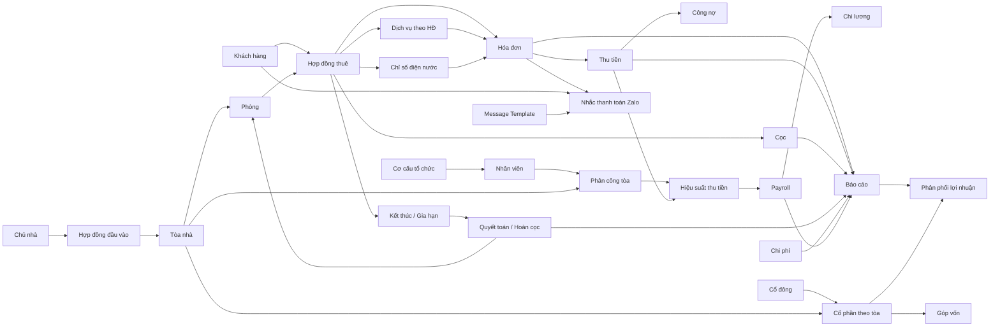

---

## 11.3. Sơ đồ dữ liệu lõi Phase 1

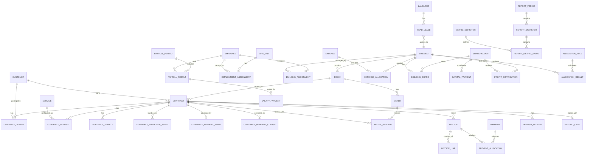

---

# 12. PHASE 1 — ĐẶC TẢ CHI TIẾT THEO PHÂN HỆ

## 12.1. Dashboard & Work Queue

### 12.1.1. Mục tiêu

Cung cấp một màn hình điều hành để người dùng biết ngay:

- Tình trạng tòa/phòng.
- Hợp đồng sắp hết hạn.
- Hóa đơn/công nợ.
- Tiến độ thu M1/M2/M3.
- Việc cần xử lý.
- Phạm vi dữ liệu theo tổ chức/quản lý.
- Báo cáo tổng hợp nhanh.

### 12.1.2. Tác nhân

- Admin.
- Quản lý Tổng.
- TPVH / Lead.
- Kế toán.
- Quản lý/Vận hành.
- Nhân sự với dashboard HR riêng khi cần.

### 12.1.3. Bộ lọc chung

| Filter | Mô tả |
|---|---|
| Kỳ / ngày tham chiếu | Tháng hoặc ngày dùng tính dữ liệu |
| Tổ chức | Node trong cây tổ chức |
| Nhân sự | Tự giới hạn theo tổ chức đã chọn |
| Khu vực | Khu vực/khu nhà |
| Loại tòa | Ký hiệu có hiệu lực trong kỳ |
| Tòa | Chỉ hiện tòa trong scope |
| Trạng thái phòng | Sẵn sàng/Đang thuê/... |
| Trạng thái HĐ | Hiệu lực/Sắp hết/... |
| Mốc thu | M1/M2/M3 |

### 12.1.4. Action

- Đổi kỳ/ngày tham chiếu.
- Drill-down KPI.
- Mở Work Queue.
- Mở HĐ sắp hết.
- Mở danh sách công nợ.
- Mở danh sách Zalo lỗi.
- Export dữ liệu theo filter.
- Lưu bộ lọc cá nhân nếu sau này cần.

### 12.1.5. Flow dữ liệu

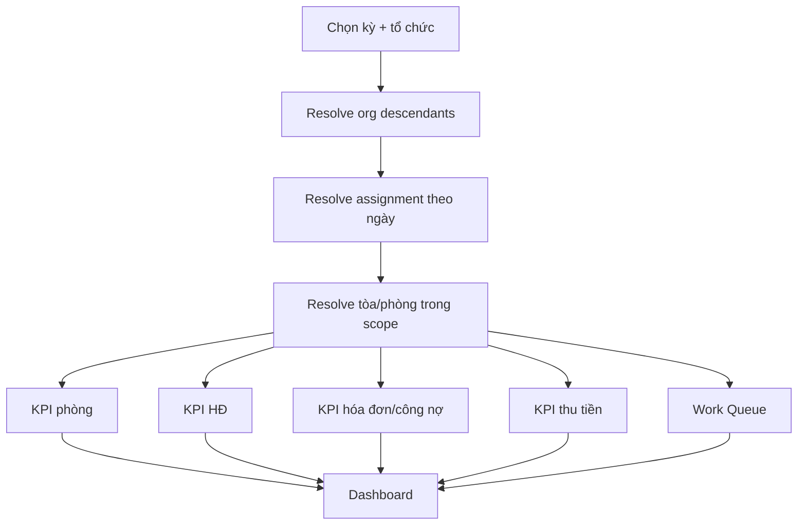

### 12.1.6. Business Rules

- Không cộng trùng tòa/phòng khi nhiều người cùng tham gia.
- Mặc định dùng assignment `Phụ trách chính` để tính scope vận hành.
- Báo cáo lịch sử dùng assignment và ký hiệu loại tòa có hiệu lực trong kỳ.
- Mọi KPI phải drill-down về dữ liệu chi tiết.

---

## 12.2. Chủ nhà

### 12.2.1. Dữ liệu

| Trường | Bắt buộc | Ghi chú |
|---|:---:|---|
| Mã chủ nhà | Có | Sinh tự động hoặc mã nghiệp vụ |
| Loại | Có | Cá nhân / Tổ chức |
| Họ tên/Tên pháp nhân | Có |  |
| CCCD/MST | Tùy loại | Dùng hỗ trợ chống trùng |
| Ngày cấp/Nơi cấp | Không | Nếu cá nhân |
| Điện thoại | Có | Chuẩn hóa |
| Email | Không |  |
| Địa chỉ | Có |  |
| Người đại diện | Không | Nếu tổ chức |
| Ngân hàng/STK | Không | Phục vụ thanh toán |
| Trạng thái | Có | Hoạt động / Ngừng hoạt động |
| Ghi chú | Không |  |

### 12.2.2. Search / Filter

- Tên.
- SĐT.
- CCCD/MST.
- Tòa.
- Trạng thái.
- Hợp đồng đang hiệu lực/sắp hết.

### 12.2.3. Action

- Tạo.
- Sửa.
- Xem chi tiết.
- Ngừng hoạt động.
- Thêm hợp đồng đầu vào.
- Xem các tòa.
- Xem lịch thanh toán.
- Upload tài liệu.
- Export danh sách.

### 12.2.4. Rule

- Không xóa cứng chủ nhà đã có hợp đồng/tòa.
- Cảnh báo trùng theo CCCD/MST/SĐT.
- Tài khoản ngân hàng thay đổi phải giữ lịch sử nếu đã có giao dịch.

---

## 12.3. Hợp đồng đầu vào với chủ nhà

### 12.3.1. Mục tiêu

Quản lý hợp đồng TimoHouse thuê tòa/căn nhà từ chủ nhà, làm nguồn cho:

- Giá vốn tiền thuê.
- Thời hạn khai thác.
- Ký hiệu loại tòa.
- Lịch thanh toán chủ nhà.
- Cọc đầu vào.
- Hồ sơ pháp lý/HKD/PCCC.
- Tài sản bàn giao.

### 12.3.2. Dữ liệu

| Nhóm | Trường |
|---|---|
| Nhận diện | Số HĐ, Chủ nhà, Tòa, trạng thái |
| Thời gian | Ngày ký, bắt đầu, kết thúc, thời gian giữ giá |
| Giá | Giá thuê, lịch tăng giá, tiền cọc |
| Thanh toán | Chu kỳ trả, ngày đến hạn, tài khoản người nhận |
| Phân loại | Ký hiệu/loại tòa theo HĐ |
| Pháp lý | HKD, PCCC, sổ đỏ/tài liệu liên quan |
| Chứng từ | File HĐ, phụ lục, biên bản bàn giao |
| Audit | Người tạo/sửa/xác nhận |

### 12.3.3. Trạng thái HKD

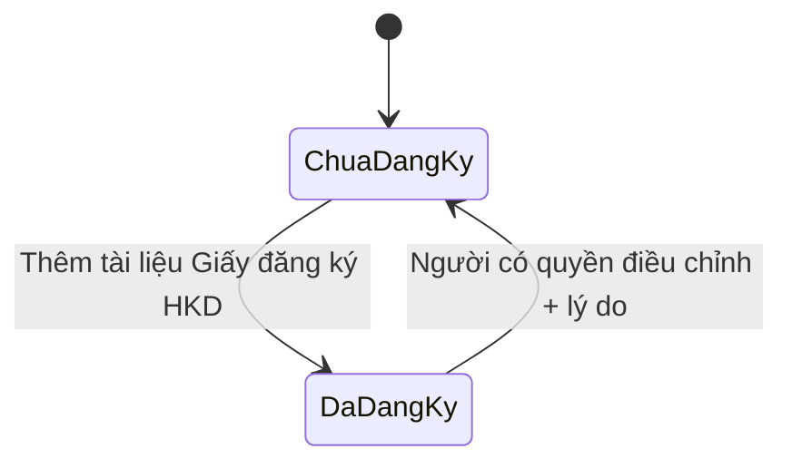

Quy tắc đã chốt:

- Có field `Trạng thái HKD`.
- Tài liệu `Giấy đăng ký hộ kinh doanh` liên kết đúng HĐ/tòa sẽ chuyển trạng thái sang `Đã đăng ký`.
- Xóa/thay file không được âm thầm đổi trạng thái lịch sử.
- Mọi thay đổi có audit.

### 12.3.4. Ký hiệu/loại tòa


- Loại tòa có ngày hiệu lực.
- Cho phép sửa.
- Không ghi đè lịch sử.
- Báo cáo cũ dùng loại tòa của đúng kỳ.

### 12.3.5. Action

- Tạo hợp đồng.
- Sửa dự thảo.
- Kích hoạt.
- Upload/replace tài liệu.
- Thêm phụ lục.
- Cập nhật giá/lịch tăng giá.
- Cập nhật ký hiệu loại tòa.
- Cập nhật trạng thái HKD.
- Tạo lịch thanh toán chủ nhà.
- Gia hạn HĐ đầu vào.
- Kết thúc.
- Export/Download.
- Xem lịch sử.

### 12.3.6. Flow

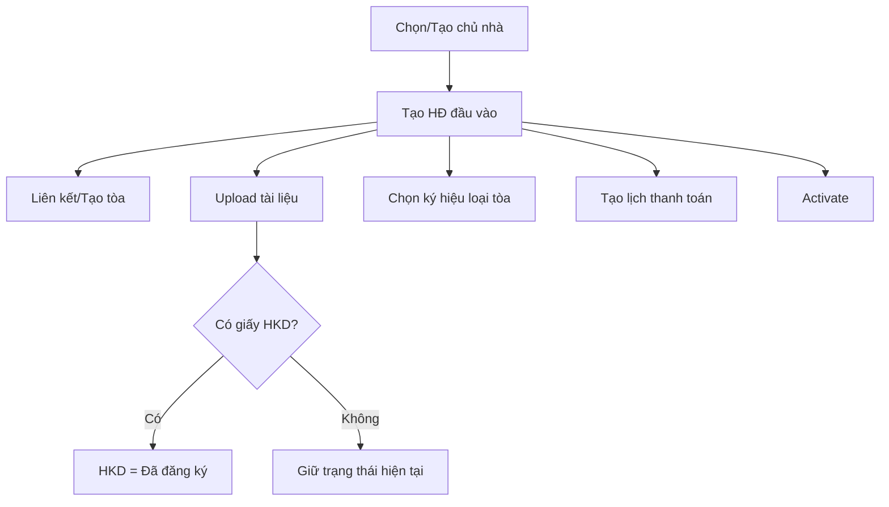

---

## 12.4. Khu vực / Khu nhà / Tòa nhà

### 12.4.1. Dữ liệu tòa

- Mã tòa.
- Tên.
- Khu vực.
- Địa chỉ.
- Diện tích/số tầng nếu quản lý.
- Chủ nhà.
- HĐ đầu vào hiện tại.
- Ký hiệu loại tòa hiện tại.
- Trạng thái khai thác.
- Ngày bắt đầu vận hành.
- Quản lý hiện tại — **đọc từ Assignment**.
- Quản lý sắp tới — **đọc từ Assignment**.
- Số phòng.
- Số phòng đang thuê/trống.
- Hồ sơ pháp lý.
- Ghi chú.

### 12.4.2. Action

- Tạo/sửa tòa.
- Xem phòng.
- Thêm/import phòng.
- Xem HĐ đầu vào.
- Cập nhật ký hiệu loại tòa.
- Mở chức năng thay đổi quản lý trong HR Assignment.
- Xem lịch sử quản lý.
- Xem dịch vụ/giá riêng của tòa.
- Xem khách/HĐ/hóa đơn/công nợ/chi phí.
- Export dữ liệu tòa.

### 12.4.3. Rule quan trọng

- Không lưu `manager_id` độc lập làm nguồn chuẩn.
- Quản lý tòa lấy từ `Building Assignment`.
- Một tòa có thể có nhiều assignment vai trò khác nhau, nhưng một `Phụ trách chính` tại một thời điểm nếu không có ngoại lệ.
- Loại tòa là history có ngày hiệu lực.
- Giá dịch vụ có thể override theo tòa.

---

## 12.5. Phòng

### 12.5.1. Dữ liệu

- Mã phòng.
- Tòa.
- Tầng.
- Loại phòng.
- Diện tích.
- Giá niêm yết hiện tại.
- Sức chứa.
- Trạng thái.
- Ngày sẵn sàng dự kiến.
- Ghi chú.
- Lịch sử giá.
- Lịch sử trạng thái.

### 12.5.2. Action

- Tạo.
- Sửa.
- Import nhiều phòng.
- Bulk update dữ liệu được phép.
- Cập nhật giá.
- Chuyển trạng thái.
- Xem HĐ hiện tại.
- Xem lịch sử khách.
- Xem chỉ số điện nước.
- Xem hóa đơn/công nợ.
- Export theo filter.

### 12.5.3. State

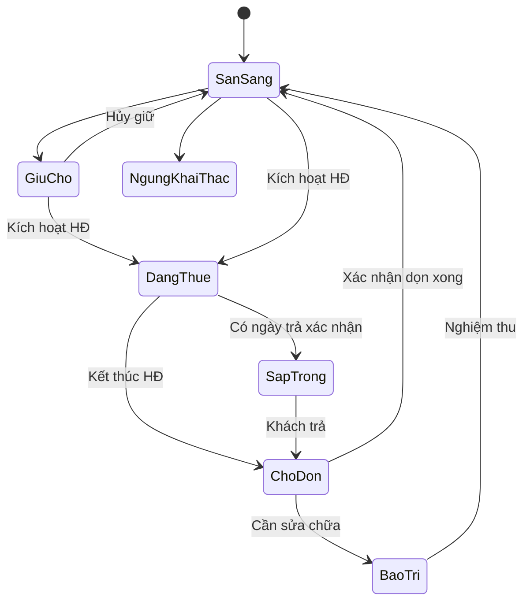

### 12.5.4. Rules

- Không kích hoạt hai HĐ hiệu lực chồng nhau cho một phòng.
- Không tự chuyển `Sẵn sàng` chỉ vì đã hoàn cọc.
- Room Status History là nguồn tính vacancy/occupancy.

---

## 12.6. Khách hàng / Khách thuê

### 12.6.1. Dữ liệu

- Mã khách.
- Họ tên.
- SĐT.
- CCCD.
- Ngày sinh.
- Giới tính.
- Nghề nghiệp/phân khúc nếu có.
- Địa chỉ/liên hệ.
- Liên hệ khẩn cấp.
- Trạng thái khách hàng.
- Zalo ID/trạng thái liên kết.
- Ngày tạo/cập nhật.
- Ghi chú.

### 12.6.2. Trạng thái khách

**Đã chốt:** chỉ có field `Trạng thái`, không dùng field `Trạng thái vòng đời`.

- Danh mục trạng thái cho phép cấu hình.
- Người có quyền update trực tiếp.
- Cờ `Có HĐ hiệu lực`, `Có công nợ`, `Sắp hết HĐ`, `Chờ hoàn cọc`, `Đã liên kết Zalo` là thuộc tính suy ra, không phải trạng thái khách.

### 12.6.3. Search / Filter

- Từ khóa tên/SĐT/CCCD.
- Trạng thái.
- Tổ chức/quản lý.
- Tòa/phòng.
- Có HĐ hiệu lực.
- Có công nợ.
- Có Zalo.
- Ngày tạo.
- Khách đứng tên/người ở cùng.

### 12.6.4. Actions

- Tạo/sửa.
- Xem chi tiết.
- Gắn vào HĐ.
- Thêm người ở cùng.
- Thêm xe.
- Liên kết Zalo.
- Cập nhật trạng thái.
- **Bulk update trạng thái**.
- Merge khách trùng nếu triển khai.
- Export selected.
- **Export toàn bộ kết quả filter**.
- Xem HĐ/hóa đơn/payment/công nợ.

### 12.6.5. Bulk update

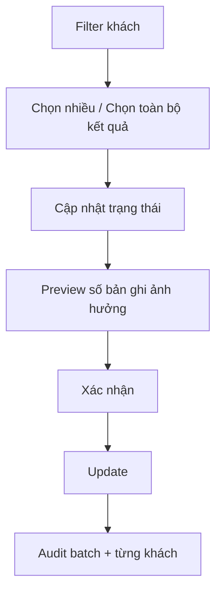

### 12.6.6. Export

- Export theo quyền dữ liệu hiện tại.
- Export selected hoặc all filtered.
- Lưu điều kiện lọc/thời điểm/người export vào audit nếu cần.
- Không export cột nhạy cảm nếu role không có quyền.

---

## 12.7. Hợp đồng thuê phòng

### 12.7.1. Dữ liệu

| Nhóm | Trường |
|---|---|
| Nhận diện | Số HĐ, loại HĐ, trạng thái |
| Đối tượng | Tòa, phòng, khách đứng tên, người ở cùng |
| Thời gian | Ngày ký, bắt đầu, kết thúc, thời hạn |
| Giá | Giá niêm yết snapshot, giá chốt |
| Cọc | Cọc phải thu, thông tin cọc |
| Thu tiền | M1/M2/M3, hạn thu |
| Dịch vụ | Danh sách dịch vụ + giá snapshot |
| Xe | Danh sách xe/biển số |
| Tài sản | Bàn giao nếu áp dụng |
| Tài liệu | File HĐ, phụ lục |
| Quan hệ | HĐ trước nếu là gia hạn |

### 12.7.2. Action

- Tạo thủ công.
- Tạo từ OCR.
- Sửa draft.
- Review.
- Kích hoạt.
- Upload tài liệu.
- Thêm/sửa người ở cùng.
- Thêm/sửa dịch vụ.
- Gia hạn.
- Xác nhận trả phòng.
- Chấm dứt sớm.
- Xem hóa đơn/công nợ/cọc.
- Download/Export.
- Xem lịch sử.

### 12.7.3. State

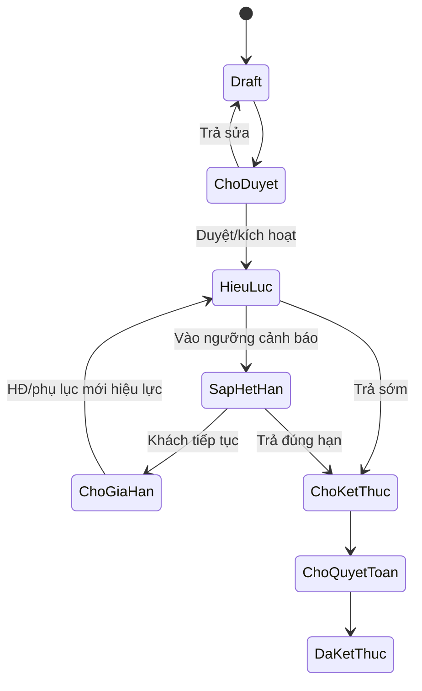

### 12.7.4. Rule

- Chỉ phòng đủ điều kiện mới kích hoạt.
- Một phòng không có hai HĐ chính chồng hiệu lực.
- Giá/dịch vụ được snapshot.
- Gia hạn không ghi đè HĐ cũ.
- Ngày kết thúc là nguồn cho Work Queue sắp hết.

---

## 12.8. OCR hợp đồng & Data Onboarding

### 12.8.1. Mục tiêu

OCR hợp đồng trong TimoHouse **không chỉ dùng để điền form Hợp đồng**.

Mục tiêu chính thức:

```text
Contract PDF/Image
→ OCR / Extract
→ Chuẩn hóa dữ liệu
→ Tách theo entity nghiệp vụ
→ Match dữ liệu hiện có
→ Review
→ Create / Link / Update / Ignore
→ Validate toàn bộ
→ Commit
→ Tạo Hợp đồng và đồng thời ghi dữ liệu sang các module liên quan
```

Một hợp đồng thuê phòng có thể là nguồn đầu vào cho:

- Khách hàng.
- Tòa nhà.
- Phòng.
- Hợp đồng thuê.
- Người ở cùng.
- Dịch vụ theo hợp đồng.
- Giá dịch vụ snapshot.
- Cọc.
- Xe.
- Chỉ số điện/nước đầu kỳ.
- Tài sản bàn giao.
- Điều khoản thanh toán.
- Điều khoản gia hạn/thông báo trước.
- Tài liệu hợp đồng.

### 12.8.2. Ví dụ dữ liệu trích xuất từ hợp đồng mẫu

Từ hợp đồng demo có thể trích xuất các nhóm sau:

| Nhóm | Dữ liệu ví dụ | Entity đích |
|---|---|---|
| Hợp đồng | `DEMO-TH-2026-001` | Contract |
| Ngày ký | `17/09/2026` | Contract |
| Khách thuê | `TRẦN MINH AN` | Customer |
| Ngày sinh | `15/06/1998` | Customer |
| SĐT | `0988 123 456` | Customer |
| CCCD | `001098000001` | Customer |
| Địa chỉ thường trú | `123 Minh Khai...` | Customer |
| Tòa | `TH01` | Building |
| Địa chỉ tòa | `25 Nguyễn Cơ Thạch...` | Building |
| Phòng | `P302` | Room |
| Mục đích thuê | `Để ở` | Contract |
| Số người | `02` | Contract occupancy |
| Số người tối đa | `02` | Contract occupancy rule |
| Số xe | `01 xe máy` | Contract Vehicle |
| Ngày nhận phòng | `01/10/2026` | Contract |
| Ngày tính tiền | `01/10/2026` | Contract |
| Thời hạn | `12 tháng` | Contract |
| Ngày kết thúc | `30/09/2027` | Contract |
| Giá thuê | `4.500.000đ/tháng` | Contract price snapshot |
| Cọc | `4.500.000đ` | Deposit Ledger |
| Điện | `4.000đ/số` | Contract Service |
| Nước | `120.000đ/người` | Contract Service |
| Internet | `100.000đ/tháng` | Contract Service |
| Dịch vụ chung | `120.000đ/người` | Contract Service |
| Xe đạp điện | `150.000đ/xe` | Contract Service |
| Xe điện Xanh SM | `400.000đ/xe` | Contract Service |
| Chỉ số điện đầu kỳ | `1.250 kWh` | Meter Reading Opening |
| Chỉ số nước đầu kỳ | `85 m³` | Meter Reading Opening |
| Ngày gửi thông báo | `Ngày 25 hàng tháng` | Payment Terms |
| Hạn thanh toán | `25–30 của kỳ trước` | Payment Terms |
| Ngân hàng | `BIDV` | Payment Terms |
| Nội dung CK | `P302 - TH01 - TRAN MINH AN` | Payment Terms |
| Tự gia hạn | `12 tháng` | Renewal Clause |
| Báo trước | `30 ngày` | Renewal Clause |
| Tài sản bàn giao | Giường, tủ, điều hòa, máy giặt, tủ lạnh... | Handover Asset Lines |

### 12.8.3. OCR Job

- File.
- File hash.
- Loại tài liệu.
- Engine/version.
- Idempotency key.
- Thời gian xử lý.
- Trạng thái.
- Error.
- Người upload.

Trạng thái:

```text
UPLOADED
→ PROCESSING
→ READY_FOR_REVIEW
→ REVIEWING
→ VALIDATED
→ COMMITTED
```

Nhánh lỗi:

```text
PROCESSING → FAILED
VALIDATED → COMMIT_FAILED
```

### 12.8.4. OCR Field

Mỗi field OCR phải lưu:

- Field path.
- Entity group.
- Raw text.
- Normalized value.
- Confidence.
- Trang.
- Bounding box/vùng.
- Candidate dữ liệu hiện có.
- Match score.
- Quyết định review.
- Người review.
- Giá trị cuối.

`entity_group` ví dụ:

```text
CUSTOMER
BUILDING
ROOM
CONTRACT
CONTRACT_SERVICE
DEPOSIT
VEHICLE
METER_READING
HANDOVER_ASSET
PAYMENT_TERM
RENEWAL_CLAUSE
DOCUMENT
```

### 12.8.5. Quyết định Review

Mỗi entity hoặc field hỗ trợ:

```text
CREATE
LINK
UPDATE
IGNORE
```

Ý nghĩa:

- `CREATE`: tạo entity mới.
- `LINK`: liên kết entity hiện có.
- `UPDATE`: cập nhật entity hiện có sau khi người dùng xác nhận.
- `IGNORE`: không ghi field/entity đó.

Không được tự động `CREATE` mọi dữ liệu OCR phát hiện.

### 12.8.6. Entity Matching & Duplicate Prevention

#### Customer

Ưu tiên match:

```text
CCCD
→ SĐT
→ Họ tên + Ngày sinh
```

Nếu match mạnh:

```text
Customer đã tồn tại
→ đề xuất LINK
```

Nếu có xung đột:

```text
OCR CCCD giống
nhưng tên/SĐT khác
→ cảnh báo
→ bắt buộc review
```

#### Building

Match theo:

- Mã tòa.
- Tên.
- Địa chỉ.

Ví dụ:

```text
TH01 đã tồn tại
→ LINK
```

Không tạo thêm `TH01` mới.

#### Room

Match theo:

```text
Building + Room Code
```

Ví dụ:

```text
TH01 + P302
→ LINK phòng hiện có
```

#### Contract

Chống duplicate theo:

- Số hợp đồng.
- File hash.
- Khách + phòng + start date.
- Idempotency key.

### 12.8.7. Review UI theo nhóm Entity

Màn Review không chỉ hiển thị danh sách field phẳng.

Cấu trúc đề xuất:

```text
OCR Review
├─ Khách hàng
├─ Tòa nhà
├─ Phòng
├─ Hợp đồng
├─ Người ở
├─ Dịch vụ & Giá
├─ Cọc
├─ Xe
├─ Điện/Nước đầu kỳ
├─ Tài sản bàn giao
├─ Điều khoản thanh toán
├─ Gia hạn / Báo trước
└─ Tài liệu
```

Mỗi section hiển thị:

- Dữ liệu OCR.
- Confidence.
- Candidate hệ thống.
- Diff hiện tại ↔ OCR.
- Action `Create / Link / Update / Ignore`.

### 12.8.8. Flow tổng thể

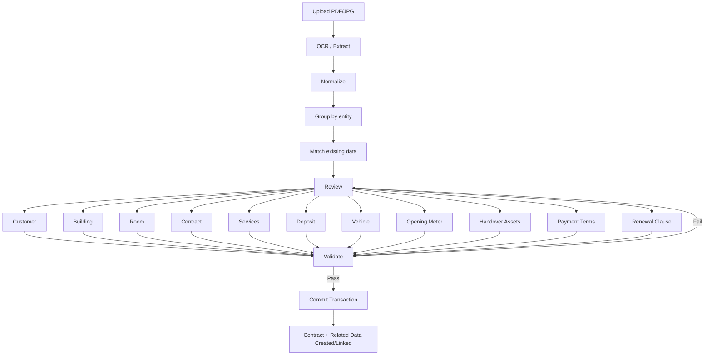

### 12.8.9. Commit Transaction

Sau khi user bấm `Xác nhận tạo hợp đồng`, hệ thống thực hiện một transaction nghiệp vụ:

```text
Customer
        ↓
Building → Room
        ↓
Contract
├─ Contract Tenant
├─ Contract Services
├─ Deposit Ledger
├─ Contract Vehicle
├─ Opening Meter Readings
├─ Handover Asset Lines
├─ Payment Terms
├─ Renewal Clause
└─ Contract Document
```

Nếu một entity bắt buộc commit lỗi:

```text
Rollback toàn bộ transaction
```

Không để trạng thái:

```text
Customer đã tạo
nhưng Contract chưa tạo
```

trừ khi nghiệp vụ sau này quyết định hỗ trợ partial commit có kiểm soát.

### 12.8.10. Contract Service & Giá dịch vụ OCR

Giá dịch vụ đọc từ hợp đồng phải mặc định lưu thành:

```text
Contract Service Price Snapshot
```

Ví dụ:

```text
Điện = 4.000đ/kWh
Nước = 120.000đ/người
Internet = 100.000đ/tháng
```

Nếu bảng giá tòa đang khác:

```text
OCR: 4.000
Building Price: 3.800
```

UI phải yêu cầu lựa chọn:

```text
[Chỉ áp dụng cho HĐ này]
[Cập nhật giá tòa từ ngày ...]
[Ignore]
```

**Không tự động cập nhật bảng giá của cả tòa chỉ vì OCR một hợp đồng.**

Nếu chọn `Cập nhật giá tòa`:

- Tạo Service Price record mới.
- Có ngày hiệu lực.
- Không ghi đè lịch sử.
- Audit đầy đủ.

### 12.8.11. Opening Meter Reading

Các chỉ số xuất hiện tại thời điểm ký/nhận phòng được lưu là:

```text
reading_type = OPENING
```

Dữ liệu:

- Contract.
- Room.
- Meter.
- Reading date.
- Reading value.
- Unit.
- Source document.
- Source page.
- OCR confidence.

Ví dụ:

```text
Điện: 1.250 kWh
Nước: 85 m³
```

Kỳ chốt điện/nước tiếp theo có thể dùng giá trị này làm chỉ số cũ nếu đúng meter.

### 12.8.12. Tài sản bàn giao từ OCR

Danh sách tài sản trong hợp đồng được chuyển thành các dòng:

```text
Contract Handover
→ Handover Asset Line
```

Mỗi dòng:

- Tên tài sản.
- Nhóm.
- Số lượng.
- Đơn vị.
- Tình trạng.
- Ghi chú.
- Source page.
- OCR confidence.

Ví dụ:

```text
Giường | 1 | Bình thường
Tủ quần áo | 1 | Bình thường
Điều hòa và điều khiển | 1 | Bình thường
Máy giặt | 1 | Bình thường
Tủ lạnh | 1 | Bình thường
Công tơ điện | 1 | Bình thường
Đồng hồ nước | 1 | Bình thường
Chìa khóa | 2 bộ | Bình thường
```

### 12.8.13. Điều khoản thanh toán

OCR có thể tạo `Contract Payment Terms`:

- Ngày thông báo.
- Khoảng ngày thanh toán.
- Hình thức.
- Ngân hàng.
- Chủ tài khoản.
- Số tài khoản.
- Nội dung chuyển khoản template.
- Phạt chậm trả.
- Grace period nếu có.

Các điều khoản này:

- Không tự biến thành Payment thực tế.
- Dùng làm cấu hình/nguồn tham khảo cho billing/reminder.
- Các khoản phạt chỉ phát sinh khi rule nghiệp vụ được duyệt.

### 12.8.14. Điều khoản gia hạn

Hợp đồng có thể chứa:

```text
Tự gia hạn 12 tháng
Báo trước 30 ngày
```

OCR lưu:

```text
renewal_type
renewal_period_months
notice_days
raw_clause
```

Ví dụ:

```text
renewal_type = AUTO_RENEW_CLAUSE
renewal_period_months = 12
notice_days = 30
```

Tuy nhiên hệ thống Phase 1:

- Dùng clause này để tạo cảnh báo/Work Queue.
- **Không tự động tạo hợp đồng gia hạn mới chỉ dựa vào OCR.**
- Gia hạn vẫn phải có người dùng xác nhận.

### 12.8.15. Dữ liệu sau khi Commit xuất hiện ở đâu

Sau khi commit thành công:

```text
Khách hàng
→ xuất hiện Customer mới hoặc liên kết Customer cũ

Tòa nhà
→ liên kết Building

Phòng
→ liên kết Room

Khách hàng > Hợp đồng
→ xuất hiện Contract

Tòa/Phòng > Hợp đồng
→ xuất hiện Contract

Hợp đồng > Dịch vụ
→ xuất hiện service snapshot

Cọc
→ xuất hiện Deposit Ledger

Điện/Nước
→ xuất hiện Opening Meter Reading

Hợp đồng > Tài sản bàn giao
→ xuất hiện Handover Asset Lines

Hợp đồng > Xe
→ xuất hiện Vehicle

Hợp đồng > Thanh toán
→ hiển thị Payment Terms

Work Queue
→ sử dụng end date / notice days / renewal clause
```

### 12.8.16. Actions

#### Upload

- Chọn file.
- Drag/drop.
- Kiểm tra duplicate/hash.
- Chọn loại tài liệu.
- Chạy OCR.

#### Review

- Accept field.
- Edit field.
- Link entity.
- Create entity.
- Update entity.
- Ignore.
- Resolve conflict.
- Preview final payload.

#### Confirm

- Validate.
- Xác nhận tạo hợp đồng.
- Commit all.
- Retry nếu lỗi kỹ thuật.
- Xem kết quả entity đã tạo/liên kết.

### 12.8.17. Audit & Traceability

Mỗi dữ liệu từ OCR cần truy được:

```text
Entity/Field
→ OCR Job
→ File
→ Trang
→ Bounding box
→ Raw text
→ Normalized value
→ Review decision
→ Reviewer
```

Audit bắt buộc với:

- Link customer/building/room.
- Update master data.
- Update giá tòa.
- Create deposit.
- Create opening meter.
- Create handover asset.
- Commit contract.

### 12.8.18. Acceptance Criteria

1. Upload cùng một file lại không tạo contract/entity trùng.
2. Tòa/phòng đã có phải đề xuất `LINK`.
3. Khách có CCCD trùng phải được match/cảnh báo.
4. Giá dịch vụ OCR không tự ghi đè giá tòa.
5. Service price của HĐ phải snapshot.
6. Opening meter được tạo đúng room/contract.
7. Tài sản bàn giao được tạo thành line item.
8. Contract creation phải đồng thời tạo/link các entity đã được user xác nhận.
9. Commit lỗi entity bắt buộc phải rollback.
10. Mọi field quan trọng truy được về file/trang nguồn.
11. OCR không tự kích hoạt HĐ nếu workflow yêu cầu review/approve.
12. OCR không tự gia hạn HĐ.
13. Sau commit, dữ liệu phải xuất hiện đúng module liên quan.
14. Không tạo duplicate building/room/customer nếu đã link entity hiện có.

---

## 12.9. Dịch vụ & bảng giá theo tòa

### 12.9.1. Data model

**Service Catalog**
- Mã.
- Tên.
- Nhóm.
- Đơn vị.
- Cách tính.
- Trạng thái.

**Service Price**
- Service.
- Scope `GLOBAL/BUILDING`.
- Building nếu override.
- Giá bán.
- Effective from/to.
- Trạng thái.
- Người duyệt.

**Contract Service**
- Contract.
- Service.
- Số lượng.
- Giá snapshot/công thức.
- Effective from/to.

### 12.9.2. Rule ưu tiên giá

```text
Nếu có giá theo tòa đang hiệu lực
→ dùng giá theo tòa
Ngược lại
→ dùng giá mặc định toàn hệ thống
```

### 12.9.3. Flow

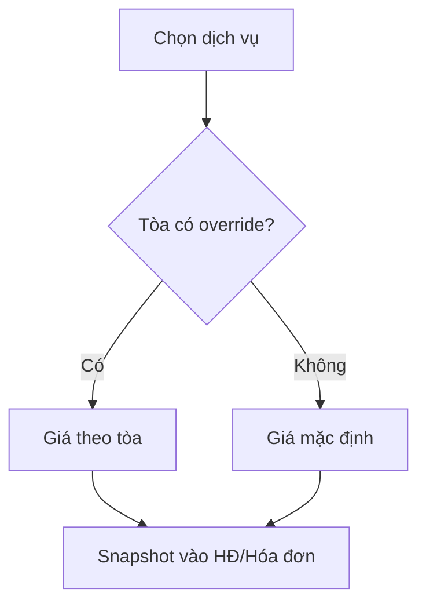

### 12.9.4. Actions

- CRUD dịch vụ.
- Thiết lập giá mặc định.
- Override giá theo tòa.
- Bulk import bảng giá.
- Xem lịch sử giá.
- Ngừng hiệu lực.
- Preview tòa nào đang dùng giá nào.

### 12.9.5. Rule

- Giá bán dịch vụ khác hoàn toàn với giá gốc đầu vào.
- Giá gốc điện/nước/mạng/rác/... nhập qua Chi phí.
- Sửa bảng giá không làm đổi hóa đơn phát hành.

---

## 12.10. Điện / Nước / Meter Reading

### 12.10.1. Dữ liệu

- Tòa.
- Phòng.
- Công tơ.
- Loại điện/nước.
- Kỳ.
- Chỉ số cũ.
- Chỉ số mới.
- Sản lượng.
- Ngày chốt.
- Ảnh.
- Người nhập.
- Trạng thái xác nhận.

### 12.10.2. Action

- Nhập từng dòng.
- Import Excel.
- Upload ảnh.
- Copy chỉ số kỳ trước làm chỉ số cũ.
- Validate.
- Confirm.
- Reopen nếu được phép.
- Export.

### 12.10.3. Rule

- New >= Old nếu không có trường hợp rollover được duyệt.
- Một công tơ/kỳ có một reading hợp lệ.
- Dữ liệu đã dùng phát hành HĐ không sửa âm thầm.

---

## 12.11. Kỳ hóa đơn & Hóa đơn

### 12.11.1. Billing Period

- Mã kỳ.
- Từ ngày/đến ngày.
- Ngày chốt.
- Ngày phát hành.
- Trạng thái.
- Lock status.

### 12.11.2. Invoice

- Số HĐơn.
- Kỳ.
- Tòa/phòng.
- Contract/customer snapshot.
- Issue date.
- Due date.
- M1/M2/M3.
- Tổng kỳ này.
- Nợ chuyển sang nếu hiển thị.
- Điều chỉnh.
- Tổng phải thu.
- Trạng thái.

### 12.11.3. Invoice Line

- Loại tiền phòng/dịch vụ/phạt/điều chỉnh.
- Service.
- Quantity.
- Unit.
- Unit price.
- Amount.
- Source reading nếu có.

### 12.11.4. Actions

- Tạo batch theo tòa.
- Preview.
- Edit draft.
- Add adjustment.
- Issue one/many.
- Cancel/adjust.
- Export PDF/Excel.
- Gửi Zalo.
- Xem payment/công nợ.

### 12.11.5. Flow

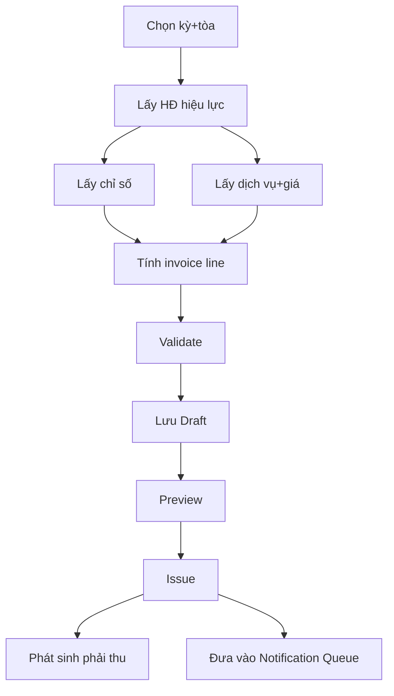

### 12.11.6. Rule

- `Contract + Room + Billing Period` không có hai invoice hợp lệ.
- Chỉ invoice `Issued` tính vào công nợ.
- Issued không sửa trực tiếp.
- Điều chỉnh có chứng từ đối ứng.

---

## 12.12. Thu tiền & Payment Allocation

### 12.12.1. Payment data

- Mã giao dịch.
- Ngày giờ.
- Số tiền.
- Phương thức.
- Tài khoản nhận.
- Nội dung chuyển khoản.
- Bank reference.
- Người nộp.
- Chứng từ.
- Trạng thái.

### 12.12.2. Allocation data

- Payment.
- Invoice.
- Số tiền phân bổ.
- Loại phân bổ.
- Thời điểm.
- Người thực hiện.

### 12.12.3. Actions

- Ghi nhận payment.
- Import payment nếu có nguồn.
- Match khách/phòng/invoice.
- Phân bổ tự động đề xuất.
- Phân bổ thủ công.
- Reallocate có audit.
- Mark unidentified.
- Reverse/cancel.
- Export.

### 12.12.4. Flow

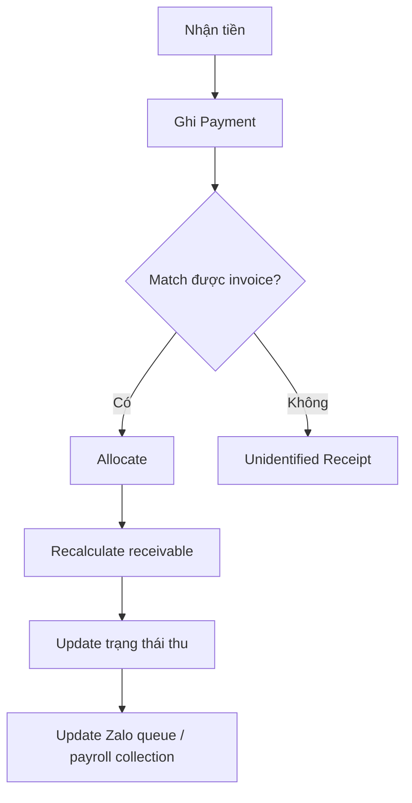

### 12.12.5. Rule

- Tổng allocation không vượt payment trừ cơ chế cho phép rõ ràng.
- Thu một phần được hỗ trợ.
- Một payment → nhiều invoice.
- Một invoice → nhiều payment.
- Tiền chưa match không tính vào invoice cụ thể.

---

## 12.13. Công nợ

### 12.13.1. Chỉ tiêu

- Phải thu.
- Đã thu.
- Còn phải thu.
- Quá hạn.
- Thu thừa/tạm ứng.
- Thu theo M1/M2/M3.
- Nợ theo khách/phòng/tòa/quản lý.

### 12.13.2. Action

- Filter.
- Drill-down.
- Mở invoice.
- Mở payment.
- Gửi nhắc Zalo.
- Export.
- Snapshot theo mốc/kỳ nếu áp dụng.

### 12.13.3. Formula chuẩn

```text
Còn phải thu
= Tổng phải thu hợp lệ
- Payment Allocation hợp lệ
- Credit/Adjustment được duyệt
```

---

## 12.14. Nhắc thanh toán qua Zalo

### 12.14.1. Cấu hình Integration

- Channel.
- OA/App.
- Credentials.
- Environment.
- Webhook.
- Connection status.

### 12.14.2. Reminder Rule

- Event.
- Trước hạn X ngày.
- Đúng hạn.
- Sau hạn X ngày.
- Giờ gửi.
- Retry.
- Số lần.
- Manual confirmation / automatic.
- Template.

### 12.14.3. Message Template

- Code.
- Name.
- Event.
- Content.
- Variables.
- Version.
- Effective date.
- Status.
- Preview/test.

### 12.14.4. Flow

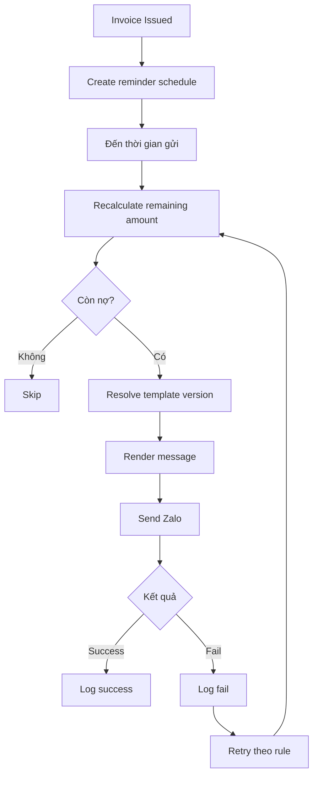

### 12.14.5. Rule

- Không gửi invoice draft/cancelled.
- Không nhắc nếu đã thu đủ.
- Retry phải render lại số dư mới nhất.
- Success không gửi trùng cùng event nếu không có rule mới.
- Lưu rendered message thực tế để audit.

---

## 12.15. Hợp đồng sắp hết / Gia hạn

### 12.15.1. Work Queue data

- Contract.
- Tòa/phòng.
- Khách/SĐT.
- Người ở cùng.
- Quản lý hiện tại.
- Start/end date.
- Days remaining.
- Giá/cọc.
- Công nợ.
- Last contact.
- Result.
- SLA/deadline nếu chốt.

### 12.15.2. Actions

- Ghi nhận liên hệ.
- Chọn gia hạn.
- Chọn trả đúng hạn.
- Chọn kết thúc sớm.
- Mark chưa phản hồi.
- Assign người xử lý.
- Export danh sách.

### 12.15.3. Flow gia hạn

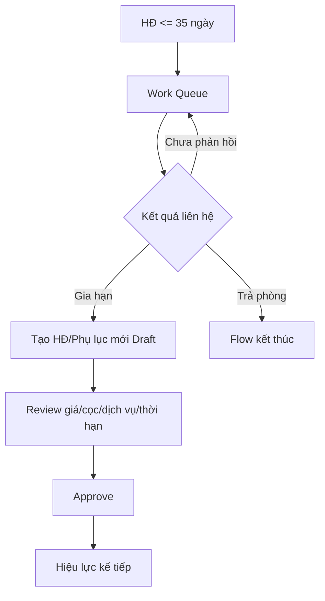

---

## 12.16. Kết thúc / Phá hợp đồng / Quyết toán / Hoàn cọc

### 12.16.1. Dữ liệu kết thúc

- Contract.
- Loại kết thúc.
- Ngày thông báo.
- Ngày kết thúc thực tế.
- Lý do chuẩn.
- Mô tả.
- Chỉ số cuối.
- Tình trạng tài sản.
- Công nợ.
- Phí phạt.
- Khấu trừ.

### 12.16.2. Refund Case

- Cọc gốc.
- Công nợ được bù.
- Phạt.
- Sửa chữa.
- Vệ sinh.
- Khoản khác.
- Số thực hoàn.
- Trạng thái duyệt.
- Ngày hoàn.
- Chứng từ.

### 12.16.3. Flow

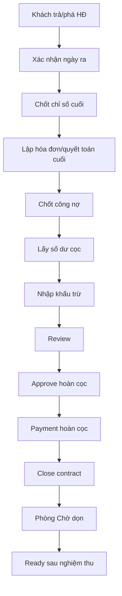

### 12.16.4. Rule

- Không suy luận phá HĐ từ việc thanh toán thiếu.
- Mọi khấu trừ phải có dòng chi tiết.
- Hoàn cọc không tự làm phòng Ready.
- Cọc và doanh thu phải tách theo rule kế toán được duyệt.

---

## 12.17. Cơ cấu tổ chức

### 12.17.1. Org Unit data

- Code.
- Name.
- Type.
- Parent.
- Lead.
- Effective from/to.
- Status.

### 12.17.2. Position data

- Code.
- Name.
- Management level.
- Unit types allowed.
- Effective date.

### 12.17.3. Actions

- Tạo/sửa unit.
- Move unit.
- Bổ nhiệm/thay Lead.
- Ngừng hoạt động.
- Xem cây theo ngày.
- Xem lịch sử.
- Export.

### 12.17.4. Rules

- Team hoạt động có đúng một Lead nếu business yêu cầu.
- Lead history không ghi đè.
- Cây không có cycle.
- Future change không tác động trước effective date.

---

## 12.18. Nhân viên

### 12.18.1. Data

- Employee code.
- Name.
- Contact.
- Start/end date.
- Employment status.
- Main org unit.
- Position.
- Concurrent assignment nếu có.
- Bank account.
- Payroll settings.
- Documents.

### 12.18.2. Actions

- Tạo/sửa.
- Gán đơn vị/chức danh.
- Điều chuyển tổ chức.
- Bổ nhiệm Lead.
- Nghỉ việc.
- Xem assignment tòa.
- Xem hiệu suất.
- Xem bảng lương.
- Export.

---

## 12.19. Phân công tòa nhà — Single Source of Truth

### 12.19.1. Data

- Employee.
- Org Unit snapshot.
- Building.
- Role.
- Optional room scope.
- Effective from/to.
- Status.
- Reason.
- Creator/approver.

### 12.19.2. Actions

- Tạo phân công.
- Thay đổi quản lý.
- Điều chuyển.
- Bulk transfer.
- Lập kế hoạch tương lai.
- Duyệt/từ chối/hủy.
- Kết thúc.
- Search current/upcoming.
- Export.

### 12.19.3. State

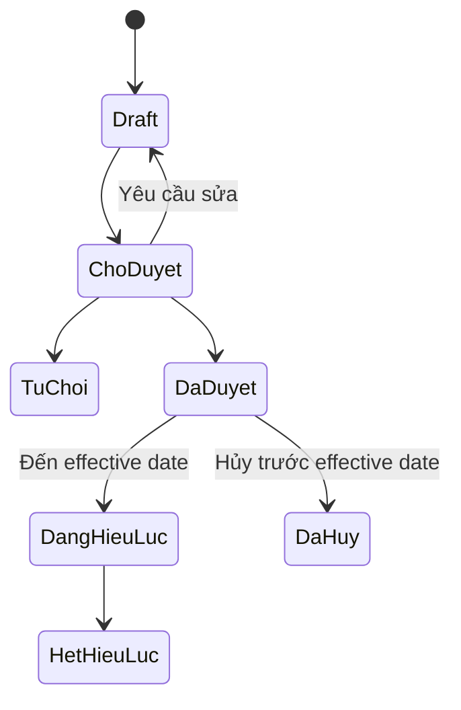

### 12.19.4. Flow đổi quản lý

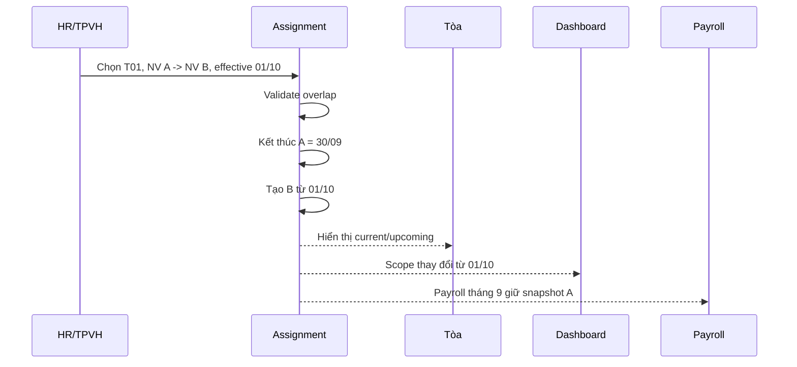

---

## 12.20. Hiệu suất thu tiền & Bảng lương

### 12.20.1. Nguồn dữ liệu

```text
Phân công tòa
→ Số phòng
→ DT niêm yết
→ DT phải thu
→ Thu M1
→ Thu M2
→ Thu M3
→ Tổng sau 3 mốc
→ Dịch vụ
→ Thu thêm
→ Tổng DT thu được
→ Hiệu suất
→ Mức lương/phòng
→ Tổng lương
```

### 12.20.2. Data snapshot

Theo `Employee + Building + Payroll Period`:

- Assignment.
- Số phòng.
- DT niêm yết.
- DT phải thu.
- M1/M2/M3.
- Dịch vụ.
- Tỷ lệ DV/DT.
- Thu thêm.
- Tổng DT thu được.
- Hiệu suất.
- Rule version.
- Mức lương/phòng.
- Lương theo tòa.

### 12.20.3. Công thức xác định được từ nguồn

```text
TỔNG DT SAU 3 MỐC = M1 + M2 + M3

TỈ LỆ DV/DT = DỊCH VỤ / DT PHẢI THU

HIỆU SUẤT = TỔNG DT THU ĐƯỢC / DT NIÊM YẾT × 100

LƯƠNG THEO PHÒNG = SỐ PHÒNG × MỨC LƯƠNG/PHÒNG
```

### 12.20.4. Action

- Mở kỳ lương.
- Snapshot assignment.
- Refresh dữ liệu khi kỳ chưa khóa.
- Tính hiệu suất.
- Apply payroll rule.
- Review.
- Adjustment.
- Approve.
- Lock.
- Reopen có quyền.
- Export bảng lương.
- Drill-down từng tòa và payment.

### 12.20.5. Chi lương

- Generate danh sách từ payroll locked.
- Ghi nhận chi từng người.
- Bulk payment.
- Import kết quả.
- Partial payment.
- Attach proof.
- Export.

### 12.20.6. Flow

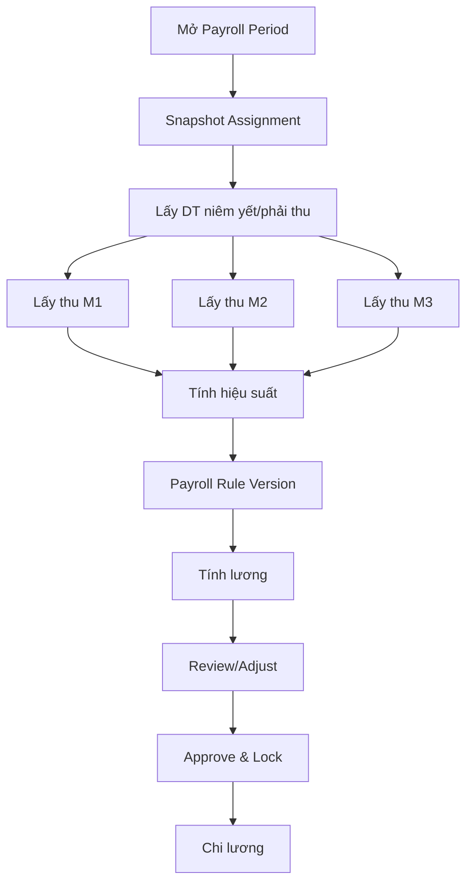

---

## 12.21. Chi phí

### 12.21.1. Data

- Expense code.
- Document date.
- Accounting period.
- Building/direct scope.
- Category/subcategory.
- Description.
- Amount.
- Supplier/recipient.
- Payment method.
- Document.
- Source `manual/import/system`.
- Status.

### 12.21.2. Categories Phase 1

- Tiền thuê nhà.
- Mua thêm thiết bị.
- Giá gốc điện.
- Giá gốc nước.
- Giá gốc mạng.
- Rác.
- Môi trường.
- Bảo trì thang máy.
- Marketing.
- Hoa hồng.
- Sửa chữa.
- Văn phòng.
- Khác.

Lương/chi lương **không nhập lại** ở Expense.

### 12.21.3. Actions

- Create/edit draft.
- Import.
- Mapping.
- Validate.
- Detect duplicate.
- Preview.
- Confirm.
- Attach document.
- Allocate.
- Reverse/adjust.
- Export.

### 12.21.4. Expense Allocation

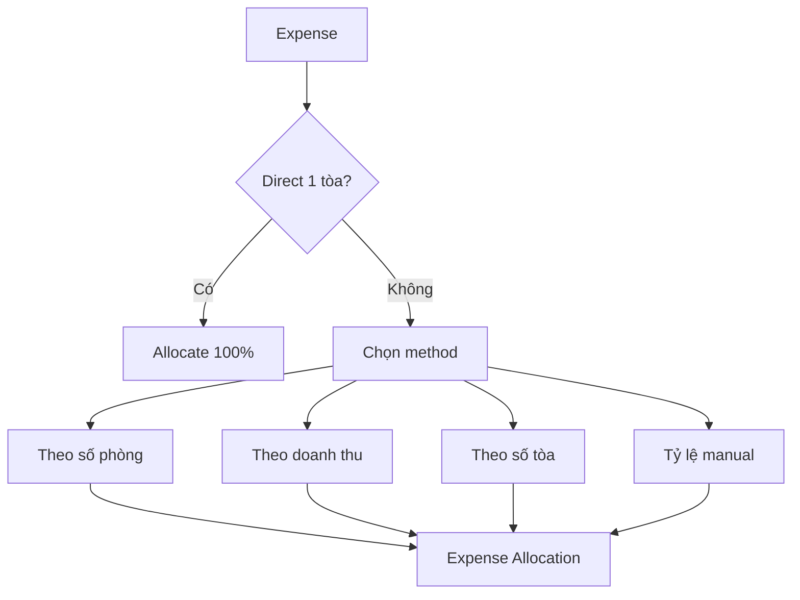

---

## 12.22. Cổ đông / Cổ phần / Góp vốn / Phân phối lợi nhuận

### 12.22.1. Shareholder data

- Code.
- Name.
- Identity/tax.
- Contact.
- Bank.
- Status.

### 12.22.2. Building Share

- Building.
- Shareholder.
- Percentage.
- Effective from/to.
- Basis/document.

### 12.22.3. Capital

- Building/project.
- Capital call.
- Shareholder.
- Required.
- Paid.
- Outstanding.
- Due date.
- Payment date.
- Proof.

### 12.22.4. Profit Distribution

- Period.
- Building.
- Profit distributable.
- Shareholder.
- Share % snapshot.
- Capital snapshot if report needs.
- Profit allocated.
- Total receive if applicable.
- Status.

### 12.22.5. Actions

- CRUD shareholder.
- Configure shares.
- Validate total %.
- Create capital call.
- Record capital payment.
- Generate distribution from locked report.
- Review/confirm.
- Export share table.

### 12.22.6. Flow

```mermaid
flowchart TD
    B[Building] --> S[Share structure]
    S --> C[Capital contribution]
    R[Locked P&L] --> P[Profit distributable]
    S --> SNAP[Share snapshot of period]
    P --> D[Calculate distribution]
    SNAP --> D
    D --> RV[Review]
    RV --> LK[Lock distribution]
```

---

## 12.23. Báo cáo Phase 1 — Report Specification cho BE

Phần này là đặc tả triển khai cho hai loại báo cáo có trong workbook nguồn:

1. `Báo cáo tháng 6` — báo cáo chi tiết một tòa, trong dữ liệu mẫu là G1.
2. `Báo cáo kinh doanh Tháng 8` — báo cáo tổng toàn hệ thống và phân rã theo nhóm `T / S / G`.

Mục tiêu của Phase 1:

```text
Dữ liệu nghiệp vụ
→ Allocation
→ Metric Engine
→ Report Snapshot
→ Báo cáo chi tiết tòa
→ Báo cáo tổng T/S/G
→ Drill-down
→ Export
→ Reconciliation với Excel nguồn
```

BE **không được nhập trực tiếp các số tổng vào báo cáo**. Mọi metric phải có nguồn dữ liệu, công thức, filter kỳ và drill-down rõ ràng.

---

## 12.23.1. Data model cho Report Engine

### `report_period`

```text
id
code
period_type              MONTH
year
month
from_date
to_date
cutoff_at
status                   OPEN / REVIEWING / LOCKED / REOPENED
metric_definition_version
allocation_version
generated_at
locked_at
locked_by
note
```

### `metric_definition`

```text
id
metric_code
metric_name
report_group
unit                     MONEY / COUNT / PERCENT
formula_type             SOURCE / FORMULA / AGGREGATE
formula_expression
source_entity
date_field
effective_from
effective_to
version
status
business_confirmation_status
note
```

`business_confirmation_status`:

```text
CONFIRMED
NEED_BUSINESS_CONFIRMATION
DEPRECATED
```

### `report_snapshot`

```text
id
report_period_id
report_type
building_id              nullable
building_type            nullable
generated_at
generated_by
status
source_version
```

### `report_metric_value`

```text
report_snapshot_id
metric_code
total_value
t_value                  nullable
s_value                  nullable
g_value                  nullable
calculation_detail_json
drilldown_count
```

### `allocation_rule`

```text
id
rule_code
name
scope
method                   DIRECT / ROOM_COUNT / REVENUE / BUILDING_COUNT / MANUAL_RATIO
effective_from
effective_to
version
status
```

### `allocation_result`

```text
source_type
source_id
report_period_id
building_id
building_type
allocated_amount
rule_version
calculated_at
```

---

## 12.23.2. Quy tắc xác định kỳ báo cáo

Mỗi metric phải có `date_basis` rõ ràng.

| Nhóm dữ liệu | Date basis đề xuất | Trạng thái |
|---|---|---|
| Invoice revenue | `billing_period` | CONFIRMED theo mô hình hệ thống |
| Payment | `paid_at` / payment date | CONFIRMED cho cash collection |
| Contract start | `start_date` | Dùng cho phòng mới, cần chốt definition |
| Early termination | `actual_end_date` hoặc event date | NEED_BUSINESS_CONFIRMATION |
| Deposit received | `received_at` | CONFIRMED |
| Deposit refund | `refund_date` | CONFIRMED |
| Expense | `accounting_period` | CONFIRMED |
| Payroll | `payroll_period` | CONFIRMED |
| Building type | effective date của Building Type History | CONFIRMED |
| Building Assignment | effective date của Assignment | CONFIRMED |
| Share percentage | effective date của Building Share | CONFIRMED |
| Profit distribution | report period đã lock | CONFIRMED |

Nguyên tắc:

- Không dùng ngày tạo record để quyết định record thuộc báo cáo tháng nào, trừ khi nghiệp vụ yêu cầu.
- Report period phải lưu cutoff.
- Report đã `LOCKED` không tự thay đổi khi master data hoặc assignment thay đổi sau đó.

---

## 12.23.3. Report A — Báo cáo chi tiết một tòa

### Input

```text
period
building_id
```

### Output

Các nhóm chỉ tiêu chính:

```text
DOANH THU
CỌC / HOÀN CỌC
SỐ LƯỢNG PHÒNG
DOANH THU TIỀN NHÀ
DOANH THU DỊCH VỤ
GIÁ VỐN
CHI PHÍ BÁN HÀNG / VẬN HÀNH
TỔNG CHI PHÍ
LỢI NHUẬN GỘP
LỢI NHUẬN RÒNG
CÁC TỶ LỆ
CỔ ĐÔNG / VỐN / CHIA LỢI NHUẬN
```

### Mapping metric chi tiết

| Metric Code | Dòng báo cáo | Nguồn | Công thức / Điều kiện | Status |
|---|---|---|---|---|
| `TOTAL_REVENUE` | Tổng doanh thu | Metric tổng hợp | Theo Revenue Recognition Rule | NEED_BUSINESS_CONFIRMATION |
| `NEW_DEPOSIT` | Cọc phòng mới | Deposit Ledger | Sum giao dịch cọc mới thuộc kỳ | CONFIRMED |
| `FORFEITED_DEPOSIT` | Cọc khách bỏ không ở | Settlement/Deposit Ledger | Phần cọc chính thức bị giữ theo quyết toán | NEED_BUSINESS_CONFIRMATION |
| `REFUND_AMOUNT` | Hoàn cọc | Refund Case | Sum số thực hoàn theo refund date | CONFIRMED |
| `EARLY_TERMINATION_COUNT` | Phòng phá HĐ | Contract Event | Count early termination thuộc kỳ | NEED_BUSINESS_CONFIRMATION về date basis |
| `NEW_ROOM_COUNT` | Phòng mới | Contract | Count contract bắt đầu trong kỳ | NEED_BUSINESS_CONFIRMATION về definition |
| `VACANT_ROOM_COUNT` | Phòng trống | Room Status History | Theo vacancy definition đã duyệt | NEED_BUSINESS_CONFIRMATION |
| `RENT_REVENUE` | Doanh thu tiền nhà | Invoice Line | Sum line type `RENT` của invoice issued trong kỳ | CONFIRMED |
| `ELECTRIC_REVENUE` | Điện | Invoice Line | Sum service `ELECTRIC` | CONFIRMED |
| `WATER_REVENUE` | Nước | Invoice Line | Sum service `WATER` | CONFIRMED |
| `CLEANING_REVENUE` | Vệ sinh | Invoice Line | Sum service `CLEANING` | CONFIRMED |
| `INTERNET_REVENUE` | Mạng | Invoice Line | Sum service `INTERNET` | CONFIRMED |
| `ELECTRIC_VEHICLE_REVENUE` | Xe điện | Invoice Line | Sum service tương ứng | CONFIRMED |
| `ELEVATOR_REVENUE` | Thang máy | Invoice Line | Sum service tương ứng | CONFIRMED |
| `WASHING_REVENUE` | Máy giặt | Invoice Line | Sum service tương ứng | CONFIRMED |
| `SERVICE_REVENUE` | Tổng doanh thu dịch vụ | Invoice Line | Sum các service revenue metric | CONFIRMED |
| `HEAD_LEASE_COST` | Tiền thuê nhà | Head Lease/Expense | Chi phí thuê nhà ghi nhận kỳ | CONFIRMED nguồn, cần rule nếu phân bổ kỳ |
| `EQUIPMENT_PURCHASE_COST` | Mua thêm thiết bị | Expense | Category `Mua thêm thiết bị` | CONFIRMED |
| `ELECTRIC_INPUT_COST` | Giá gốc điện | Expense | Category `Giá gốc điện` | CONFIRMED |
| `WATER_INPUT_COST` | Giá gốc nước | Expense | Category `Giá gốc nước` | CONFIRMED |
| `INTERNET_INPUT_COST` | Giá gốc mạng | Expense | Category `Giá gốc mạng` | CONFIRMED |
| `GARBAGE_COST` | Phí rác | Expense | Category `Phí rác` | CONFIRMED |
| `ENVIRONMENT_COST` | Phí môi trường | Expense | Category `Phí môi trường` | CONFIRMED |
| `ELEVATOR_MAINT_COST` | Bảo trì thang máy | Expense | Category `Bảo trì thang máy` | CONFIRMED |
| `COGS` | Giá vốn | Metric tổng hợp | Tổng các metric giá vốn được duyệt | CONFIRMED structure |
| `SALARY_COST` | Chi phí lương | Payroll | Sum payroll allocation theo tòa/kỳ | CONFIRMED |
| `OFFICE_COST` | Thuê & DV văn phòng | Expense Allocation | Expense category tương ứng | CONFIRMED |
| `MARKETING_COST` | Marketing | Expense | Category `Marketing` | CONFIRMED |
| `COMMISSION_COST` | Hoa hồng | Expense | Category `Hoa hồng` | CONFIRMED |
| `REPAIR_COST` | Sửa chữa/bảo trì | Expense | Category sửa chữa/bảo trì | CONFIRMED |
| `OTHER_COST` | Chi phí khác | Expense | Các category được map vào CPK | CONFIRMED data, mapping cần chốt |
| `OPERATING_SELLING_COST` | Tổng CPBH | Metric tổng hợp | Sum các dòng CPBH đã map | CONFIRMED structure |
| `TOTAL_COST` | Tổng chi phí | Metric tổng hợp | `COGS + OPERATING_SELLING_COST` | CONFIRMED |
| `GROSS_PROFIT` | Lợi nhuận gộp | Metric formula | `TOTAL_REVENUE - COGS` | CONFIRMED |
| `NET_PROFIT` | Lợi nhuận ròng | Metric formula | `TOTAL_REVENUE - TOTAL_COST` | CONFIRMED |

---

## 12.23.4. Các công thức đã xác định được từ sheet `Báo cáo tháng 6`

Trong workbook nguồn, các công thức sau xác định được trực tiếp:

```text
COGS
= SUM(C22:C33)

OPERATING_SELLING_COST
= SUM(C35:C70)

TOTAL_COST
= COGS + OPERATING_SELLING_COST

GROSS_PROFIT
= TOTAL_REVENUE - COGS

NET_PROFIT
= TOTAL_REVENUE - TOTAL_COST
```

Các tỷ lệ:

```text
NET_MARGIN
= NET_PROFIT / TOTAL_REVENUE

GROSS_MARGIN
= GROSS_PROFIT / TOTAL_REVENUE

NET_PROFIT_OVER_COGS
= NET_PROFIT / COGS

NET_PROFIT_OVER_GROSS_PROFIT
= NET_PROFIT / GROSS_PROFIT

TOTAL_COST_OVER_GROSS_PROFIT
= TOTAL_COST / GROSS_PROFIT

COGS_OVER_REVENUE
= COGS / TOTAL_REVENUE

OPERATING_SELLING_COST_OVER_REVENUE
= OPERATING_SELLING_COST / TOTAL_REVENUE

TOTAL_COST_OVER_REVENUE
= TOTAL_COST / TOTAL_REVENUE

SALARY_OVER_OPERATING_SELLING_COST
= Tổng nhóm lương / OPERATING_SELLING_COST

COMMISSION_GROUP_OVER_OPERATING_SELLING_COST
= Nhóm metric được map vào HH / OPERATING_SELLING_COST

OTHER_COST_OVER_OPERATING_SELLING_COST
= Nhóm chi phí khác / OPERATING_SELLING_COST
```

**Lưu ý:** tên hiển thị của Excel có một số ký hiệu ngắn như `LNR/DT`, `LNG/DT`, `HH/CPBH`, `CPK/CPBH`; hệ thống nên dùng `metric_code` ổn định và chỉ dùng label Excel để hiển thị.

---

## 12.23.5. Metric còn cần chủ nghiệp vụ xác nhận

### `TOTAL_REVENUE`

Nguồn hiện tại chưa đủ để khẳng định `TOTAL_REVENUE` chỉ bằng:

```text
RENT_REVENUE + SERVICE_REVENUE
```

Trong `Báo cáo kinh doanh Tháng 8`, tổng này không khớp tuyệt đối với `Tổng doanh thu`.

Vì vậy cần chốt Revenue Recognition Rule:

```text
TOTAL_REVENUE
= ?
```

Các candidate cần business xác nhận:

- Tiền phòng.
- Dịch vụ.
- Cọc bị giữ.
- Khoản thu khác.
- Điều chỉnh.
- Khoản phạt.
- Khoản khác.

### `FORFEITED_DEPOSIT`

Phải chốt:

```text
Cọc bị giữ
→ ghi nhận khi khách bỏ phòng?
hay
→ chỉ ghi nhận khi settlement được approve?
```

Khuyến nghị hệ thống: chỉ ghi nhận sau settlement/approval.

### `NEW_ROOM_COUNT`

Cần chọn một definition duy nhất, ví dụ:

```text
Count phòng có HĐ bắt đầu trong kỳ
```

hoặc definition khác do business duyệt.

### `VACANT_ROOM_COUNT`

Cần chốt:

```text
Phòng trống tại ngày cuối kỳ
```

hay:

```text
Phòng từng trống trong kỳ
```

hay:

```text
Vacant room-days
```

### `EARLY_TERMINATION_COUNT`

Cần chốt event/date:

```text
actual_end_date
```

hay:

```text
approved_termination_date
```

### `HH/CPBH`

Nguồn Excel chưa cho phép kết luận chắc chắn `HH` nghĩa là:

```text
chỉ Hoa hồng
```

hay:

```text
Marketing + Hoa hồng
```

hay một nhóm chi phí khác.

Metric này phải để:

```text
NEED_BUSINESS_CONFIRMATION
```

### `DT_DV_OVER_INPUT_COST`

`DT DV/GIÁ NHẬP` chưa xác định được duy nhất từ workbook hiện tại.

Không hard-code trước khi business xác nhận tử số và mẫu số.

---

## 12.23.6. Mapping các tỷ lệ cho Report Engine

| Metric Code | Label Excel | Formula | Status |
|---|---|---|---|
| `NET_MARGIN` | LNR/DT | `NET_PROFIT / TOTAL_REVENUE` | CONFIRMED |
| `GROSS_MARGIN` | LNG/DT | `GROSS_PROFIT / TOTAL_REVENUE` | CONFIRMED |
| `NET_PROFIT_OVER_COGS` | LNR/GV | `NET_PROFIT / COGS` | CONFIRMED |
| `NET_PROFIT_OVER_GROSS_PROFIT` | LNR/LNG | `NET_PROFIT / GROSS_PROFIT` | CONFIRMED |
| `TOTAL_COST_OVER_GROSS_PROFIT` | CP/LNG | `TOTAL_COST / GROSS_PROFIT` | CONFIRMED |
| `COGS_OVER_REVENUE` | GV/DT | `COGS / TOTAL_REVENUE` | CONFIRMED |
| `OPERATING_SELLING_COST_OVER_REVENUE` | CPBH/DT | `OPERATING_SELLING_COST / TOTAL_REVENUE` | CONFIRMED |
| `TOTAL_COST_OVER_REVENUE` | TCP/DT | `TOTAL_COST / TOTAL_REVENUE` | CONFIRMED |
| `SALARY_OVER_OPERATING_SELLING_COST` | LƯƠNG/CPBH | `SALARY_GROUP / OPERATING_SELLING_COST` | CONFIRMED structure |
| `HH_OVER_OPERATING_SELLING_COST` | HH/CPBH | `HH_GROUP / OPERATING_SELLING_COST` | NEED_BUSINESS_CONFIRMATION |
| `OTHER_COST_OVER_OPERATING_SELLING_COST` | CPK/CPBH | `OTHER_COST_GROUP / OPERATING_SELLING_COST` | CONFIRMED structure |
| `SERVICE_REVENUE_OVER_INPUT_COST` | DT DV/GIÁ NHẬP | Chưa chốt | NEED_BUSINESS_CONFIRMATION |
| `RENT_REVENUE_OVER_HEAD_LEASE` | DT TIỀN NHÀ/GIÁ THUÊ NHÀ | `RENT_REVENUE / HEAD_LEASE_COST` | CONFIRMED |

---

## 12.23.7. Chi phí chung & Allocation

### Direct expense

Nếu expense gắn trực tiếp tòa:

```text
Expense
→ Building
→ Allocate 100%
```

### Shared expense

```mermaid
flowchart TD
    E[Chi phí chung] --> M{Allocation Method}
    M --> R1[ROOM_COUNT]
    M --> R2[REVENUE]
    M --> R3[BUILDING_COUNT]
    M --> R4[MANUAL_RATIO]
    R1 --> A[Allocation Result]
    R2 --> A
    R3 --> A
    R4 --> A
    A --> B1[Tòa]
    A --> B2[T/S/G]
    A --> REP[Report]
```

### Payroll Cost Allocation

Payroll không được chia tùy ý tại lúc render report.

Nguồn:

```text
Employee
→ Assignment snapshot
→ Building/Room scope
→ Payroll Result
→ Payroll Cost Allocation
```

Với nhân sự trực tiếp quản lý tòa:

```text
Dùng assignment snapshot
```

Với vai trò dùng chung như quản lý tổng/kế toán/văn phòng:

```text
Dùng Allocation Rule được cấu hình/version hóa
```

Dữ liệu lưu:

```text
payroll_result_id
building_id
amount
allocation_rule_version
report_period_id
```

---

## 12.23.8. Report B — Báo cáo kinh doanh tổng T/S/G

### Input

```text
period
optional organization scope
optional building filters
```

### Logic

```mermaid
flowchart TD
    B[Danh sách tòa thuộc scope] --> H[Resolve Building Type History tại kỳ]
    H --> T[T]
    H --> S[S]
    H --> G[G]
    T --> M[Calculate metrics per building]
    S --> M
    G --> M
    M --> AG[Aggregate Total / T / S / G]
```

### Quy tắc

- Không lấy `building.current_type` để tính báo cáo kỳ cũ.
- Phải resolve loại tòa tại đúng kỳ.
- Chi phí chung phải allocation trước khi aggregate.
- Payroll phải allocation về tòa/nhóm trước khi aggregate.
- Tổng phải bằng:

```text
TOTAL = T + S + G
```

cho metric additive.

Các metric tỷ lệ **không được** tính bằng trung bình cộng các tỷ lệ con.

Ví dụ:

```text
NET_MARGIN_TOTAL
= NET_PROFIT_TOTAL / TOTAL_REVENUE_TOTAL
```

không phải:

```text
AVG(NET_MARGIN_T, NET_MARGIN_S, NET_MARGIN_G)
```

---

## 12.23.9. Bảng cổ phần trong báo cáo một tòa

Nguồn:

```text
Building Share History
+ Capital Contribution
+ Locked Report Metrics
```

### Mapping

| Cột | Formula |
|---|---|
| Cổ đông | Shareholder |
| Tỷ lệ % | Share % snapshot |
| Vốn | Capital amount theo rule/report |
| LN Gộp | `GROSS_PROFIT × share_percentage` |
| LN ròng | `NET_PROFIT × share_percentage` |
| LNR/GV | Theo metric/report nếu cần |
| CP/LNG | Theo metric/report nếu cần |
| Tổng nhận | `Capital component + Net Profit Share` nếu đúng cấu trúc report |

Các công thức xác định được từ sheet nguồn:

```text
GROSS_PROFIT_SHARE
= share_percentage × GROSS_PROFIT

NET_PROFIT_SHARE
= share_percentage × NET_PROFIT
```

Sheet nguồn cũng có mô hình:

```text
TOTAL_RECEIVE
= CAPITAL_COMPONENT + NET_PROFIT_SHARE
```

Phải lưu `share snapshot` khi report/profit distribution được lock.

---

## 12.23.10. Drill-down contract cho từng metric

BE phải cung cấp drill-down theo chuẩn:

```text
Report
→ Metric
→ Group T/S/G nếu có
→ Building
→ Source entity
→ Source document
```

Ví dụ:

### Revenue

```text
RENT_REVENUE
→ Building
→ Room
→ Invoice
→ Invoice Line
```

### Service

```text
ELECTRIC_REVENUE
→ Building
→ Room
→ Invoice
→ Electric Invoice Line
→ Meter Reading
```

### Expense

```text
ELECTRIC_INPUT_COST
→ Building
→ Expense Allocation
→ Expense
→ Attachment
```

### Payroll

```text
SALARY_COST
→ Building
→ Payroll Cost Allocation
→ Payroll Result
→ Employee
→ Assignment Snapshot
→ M1/M2/M3 Performance
```

### Contract event

```text
EARLY_TERMINATION_COUNT
→ Building
→ Room
→ Contract
→ Contract Event
```

### Shareholder

```text
NET_PROFIT_SHARE
→ Shareholder
→ Building Share Snapshot
→ Report Metric
```

---

## 12.23.11. API Contract đề xuất

### Báo cáo một tòa

```http
GET /api/reports/building-profit
    ?period=2026-06
    &buildingId={id}
```

Response:

```json
{
  "period": "2026-06",
  "buildingId": "G1",
  "buildingType": "G",
  "status": "LOCKED",
  "metrics": [
    {
      "metricCode": "TOTAL_REVENUE",
      "label": "Tổng doanh thu",
      "value": 0,
      "unit": "MONEY",
      "status": "CONFIRMED",
      "drilldownAvailable": true
    }
  ],
  "shareholders": [
    {
      "shareholderId": "",
      "name": "",
      "percentage": 0,
      "capital": 0,
      "grossProfitShare": 0,
      "netProfitShare": 0,
      "totalReceive": 0
    }
  ]
}
```

### Báo cáo tổng

```http
GET /api/reports/business-summary
    ?period=2026-08
```

Response:

```json
{
  "period": "2026-08",
  "metrics": [
    {
      "metricCode": "TOTAL_REVENUE",
      "label": "Tổng doanh thu",
      "total": 0,
      "T": 0,
      "S": 0,
      "G": 0,
      "unit": "MONEY",
      "sortOrder": 1,
      "drilldownAvailable": true
    }
  ]
}
```

### Drill-down

```http
GET /api/reports/{snapshotId}/metrics/{metricCode}/drilldown
```

Hỗ trợ:

```text
groupType
buildingId
page
pageSize
sort
```

### Export

```http
GET /api/reports/{snapshotId}/export?format=xlsx
```

---

## 12.23.12. Golden Dataset — Reconciliation với workbook nguồn

Hai sheet nguồn được dùng làm **golden dataset** cho migration/reconciliation.

### Golden Report A — G1 tháng 6

Các giá trị nguồn đã quan sát được:

```text
TOTAL_REVENUE             = 79,912,000
NEW_DEPOSIT               = 3,800,000
FORFEITED_DEPOSIT         = 1,000,000
NEW_ROOM_COUNT            = 2
EARLY_TERMINATION_COUNT   = 3
VACANT_ROOM_COUNT         = 1

RENT_REVENUE              = 47,760,000
ELECTRIC_REVENUE          = 12,460,000
WATER_REVENUE             = 3,304,000
CLEANING_REVENUE          = 1,352,000
INTERNET_REVENUE          = 853,333.333
ELECTRIC_VEHICLE_REVENUE  = 450,000
ELEVATOR_REVENUE          = 1,292,000
WASHING_REVENUE           = 1,352,000
SERVICE_REVENUE           = 21,063,333.333

HEAD_LEASE_COST           = 48,000,000
EQUIPMENT_PURCHASE_COST   = 500,000
ELECTRIC_INPUT_COST       = 17,258,594
WATER_INPUT_COST          = 300,000
INTERNET_INPUT_COST       = 0
GARBAGE_COST              = 300,000

COGS                      = 66,358,594
OPERATING_SELLING_COST    = 10,476,125.04
TOTAL_COST                = 76,834,719.04
GROSS_PROFIT              = 13,553,406
NET_PROFIT                = 3,077,280.96
NET_MARGIN                 ≈ 3.85%
```

Shareholder source:

```text
9 cổ đông
Tổng tỷ lệ = 100%
```

Golden test không chỉ check số tổng mà phải check cả từng line và share allocation.

### Golden Report B — Tháng 8 toàn hệ thống

```text
TOTAL_REVENUE             = 7,036,256,236
T                          = 2,527,702,129
S                          = 3,551,745,507
G                          =   956,808,600

NEW_DEPOSIT               = 371,850,000
FORFEITED_DEPOSIT         = 18,400,000
REFUND_AMOUNT              = 104,968,774

EARLY_TERMINATION_COUNT   = 39
NEW_ROOM_COUNT            = 95
VACANT_ROOM_COUNT         = 11

RENT_REVENUE              = 5,021,511,225.80645
SERVICE_REVENUE           = 1,745,169,586.02

HEAD_LEASE_COST           = 4,086,483,333.33
EQUIPMENT_PURCHASE_COST   = 35,380,000
ELECTRIC_INPUT_COST       = 935,197,739
WATER_INPUT_COST          = 202,388,331.67
INTERNET_INPUT_COST       = 33,982,034.58
GARBAGE_COST              = 20,593,333.33
ENVIRONMENT_COST          = 1,904,000
ELEVATOR_MAINT_COST       = 1,000,000

COGS                      = 5,316,928,771.92
OPERATING_SELLING_COST    =   696,928,495.37
TOTAL_COST                = 6,013,857,267.28
GROSS_PROFIT              = 1,719,327,464.08
NET_PROFIT                = 1,022,398,968.72
NET_MARGIN                 ≈ 14.53%
```

### Reconciliation rule

Mỗi kỳ migration/test phải xuất bảng:

```text
metric_code
excel_value
system_value
difference
difference_percent
status
note
```

Status:

```text
MATCH
ROUNDING_DIFFERENCE
RULE_DIFFERENCE
SOURCE_DATA_DIFFERENCE
NEED_BUSINESS_CONFIRMATION
```

### Tolerance

- Count: phải khớp tuyệt đối.
- Tiền: mặc định tolerance theo rule làm tròn đã chốt.
- Percentage: tolerance cấu hình.
- Không dùng tolerance để che lỗi mapping hoặc missing source.

---

## 12.23.13. Snapshot / Lock / Reopen

```mermaid
stateDiagram-v2
    [*] --> Open
    Open --> Reviewing
    Reviewing --> Open: Có lỗi dữ liệu
    Reviewing --> Locked: Duyệt
    Locked --> Reopened: Quyền đặc biệt + lý do
    Reopened --> Reviewing
```

Khi lock:

- Freeze Metric Definition Version.
- Freeze Allocation Version.
- Freeze Building Type theo kỳ.
- Freeze Payroll Cost Allocation.
- Freeze Building Share Snapshot.
- Freeze metric values.
- Ghi người/time lock.

Reopen bắt buộc audit.

---

## 12.23.14. Report Acceptance Criteria cho BE/Test

Báo cáo chỉ được nghiệm thu khi:

1. Mọi metric có `metric_code`.
2. Mọi metric có nguồn dữ liệu.
3. Mọi metric có date basis.
4. Mọi metric có công thức/version.
5. Shared cost đã qua allocation.
6. Payroll cost đã qua allocation/snapshot.
7. Building Type dùng đúng lịch sử theo kỳ.
8. Share percentage dùng đúng snapshot.
9. Tổng `T + S + G` khớp Total với metric additive.
10. Tỷ lệ được tính lại từ numerator/denominator, không average tỷ lệ con.
11. Drill-down về được chứng từ.
12. Export ra được layout tương ứng.
13. Golden Report G1 tháng 6 đối soát được.
14. Golden Report tháng 8 đối soát được.
15. Các metric chưa chốt được hiển thị/tag `NEED_BUSINESS_CONFIRMATION`, không hard-code suy đoán.
16. Report locked không thay đổi khi dữ liệu master sau kỳ thay đổi.

---

## 12.23.15. Các câu hỏi bắt buộc phải được business ký xác nhận trước khi freeze Report Formula

```text
Q-RPT-001 Tổng doanh thu gồm chính xác những khoản nào?
Q-RPT-002 Cọc bị giữ được ghi nhận vào doanh thu ở thời điểm nào?
Q-RPT-003 Định nghĩa chính thức của "phòng mới"?
Q-RPT-004 Định nghĩa chính thức của "phòng trống"?
Q-RPT-005 Định nghĩa chính thức của "phòng phá hợp đồng" và date basis?
Q-RPT-006 "HH/CPBH" gồm những category nào?
Q-RPT-007 "DT DV/GIÁ NHẬP" lấy tử số và mẫu số nào?
Q-RPT-008 Mua thêm thiết bị ghi nhận 100% chi phí kỳ hay có rule khác?
Q-RPT-009 Chi phí chung phân bổ T/S/G theo rule nào?
Q-RPT-010 Lương quản lý tổng/kế toán/văn phòng phân bổ theo rule nào?
Q-RPT-011 Tiền thuê nhà đầu vào theo chu kỳ 3 tháng được report theo cash hay phân bổ theo tháng?
Q-RPT-012 Rule làm tròn tiền và percentage?
```

Khi các câu hỏi trên được chốt, cập nhật `Metric Definition Version` và chuyển metric từ:

```text
NEED_BUSINESS_CONFIRMATION
```

sang:

```text
CONFIRMED
```

---

# 13. PHASE 2 — ĐẶC TẢ CHI TIẾT MỞ RỘNG

## 13.1. CRM / Lead

### Data

- Lead code.
- Name/phone.
- Source.
- Interested area/building/room type.
- Budget.
- Assigned sale/team.
- Received at.
- Status.
- Lost reason.
- Notes.

### Actions

- Create/import lead.
- Assign/reassign.
- Log activity.
- Schedule viewing.
- Convert to reservation/deal.
- Mark lost.
- Bulk update.
- Export.

### State

```mermaid
stateDiagram-v2
    [*] --> LeadMoi
    LeadMoi --> DaLienHe
    DaLienHe --> CoNhuCau
    CoNhuCau --> HenXem
    HenXem --> DaXem
    DaXem --> GiuPhong
    GiuPhong --> Chot
    DaLienHe --> MatLead
    CoNhuCau --> MatLead
    DaXem --> MatLead
```

---

## 13.2. Viewing / Reservation

### Viewing Actions

- Schedule.
- Re-schedule.
- Assign sale.
- Record result.
- Select alternative room.

### Reservation Data

- Lead/customer.
- Room.
- Hold from/to.
- Hold fee.
- Status.
- Owner.

### Reservation State

```text
Draft → Holding → Converted
             ↘ Expired
             ↘ Cancelled
```

Reservation ảnh hưởng availability phòng.

---

## 13.3. Deal / Sales

### Data

- Lead.
- Sale/team.
- Room/building.
- List price.
- Closing price.
- Deposit.
- Deal date.
- Contract term.
- Move-in date.
- Payment status.
- Contract status.
- Source.

### Actions

- Create from lead.
- Update negotiation.
- Mark deposit.
- Link contract.
- Cancel.
- Export sales book.

---

## 13.4. Commission Engine

### Data flow

```mermaid
flowchart TD
    D[Deal] --> B[Basis]
    B --> P[Policy Version]
    P --> PR[Prorate]
    PR --> SP[Split duplicate/recipient]
    SP --> ADJ[Adjustment]
    ADJ --> AP[Approval]
    AP --> NET[Net payable]
    NET --> PAY[Payout]
```

### Actions

- Configure policy.
- Calculate.
- Override with reason.
- Split recipients.
- Approve.
- Payout.
- Recover/clawback.
- Reconcile.

---

## 13.5. Budget / Period Close

### Budget

- Period/building/department/category.
- Budget amount.
- Version.
- Approval.

### Close Flow

```mermaid
stateDiagram-v2
    [*] --> Open
    Open --> Reviewing
    Reviewing --> Open: Trả sửa
    Reviewing --> Closed
    Closed --> Reopened: Quyền đặc biệt + audit
    Reopened --> Reviewing
```

Close period kiểm soát Invoice, Expense, Payroll, Commission và Report Snapshot.

---

## 13.6. Asset / Inventory / Maintenance

### Asset Data

- Asset code/name/type.
- Building/room.
- Owner.
- Purchase date/cost.
- Warranty.
- Status.
- Serial.
- Documents.

### Maintenance Flow

```mermaid
flowchart TD
    A[Asset] --> P[Maintenance Plan]
    P --> D[Due]
    D --> W[Work Order]
    W --> AS[Assign technician/vendor]
    AS --> C[Complete]
    C --> V[Verify]
    V --> COST[Record cost]
```

---

# 14. PHASE 3 — ĐẶC TẢ CHI TIẾT MỞ RỘNG

## 14.1. Investment Analytics

Kế thừa dữ liệu cổ đông Phase 1 và bổ sung:

- Chuyển nhượng vốn.
- Rút/góp thêm.
- Lịch sử ownership.
- Payout tracking.
- Investor statement.
- ROI/ROA.
- Phân tích theo tòa/dự án.

## 14.2. Khấu hao

- Asset.
- Method.
- Useful life.
- Start date.
- Monthly depreciation.
- Accumulated depreciation.
- Book value.

## 14.3. Forecast

Input:

- HĐ hiện tại.
- HĐ hết hạn.
- Occupancy.
- Giá thuê.
- Budget.
- Chi phí lịch sử.
- Collection trend.

Output:

- Revenue forecast.
- Vacancy forecast.
- Cash collection.
- Expense.
- Profit.
- Capital need.

## 14.4. Data Warehouse & BI

```mermaid
flowchart LR
    OPS[Operational DB] --> ETL[ETL/ELT]
    ETL --> DW[Data Warehouse]
    DW --> BI[BI Dashboard]
    DW --> FS[Forecast]
    DW --> INV[Investor Analytics]
```

---

# 15. ACTION MATRIX TOÀN HỆ THỐNG

| Module | Create | Edit | Bulk | Import | Export | Approve | Close/Lock | Special |
|---|:---:|:---:|:---:|:---:|:---:|:---:|:---:|---|
| Chủ nhà | ✓ | ✓ |  |  | ✓ |  |  | Ngừng hoạt động |
| HĐ đầu vào | ✓ | ✓ |  |  | ✓ | ✓ | ✓ | HKD/Legal |
| Tòa | ✓ | ✓ |  |  | ✓ |  |  | Type history |
| Phòng | ✓ | ✓ | ✓ | ✓ | ✓ |  |  | Status history |
| Khách | ✓ | ✓ | ✓ trạng thái | ✓ | ✓ |  |  | Zalo link |
| HĐ thuê | ✓ | Draft |  | OCR | ✓ | ✓ | ✓ | Gia hạn/Kết thúc |
| Meter | ✓ | ✓ trước lock | ✓ | ✓ | ✓ | ✓ | ✓ |  |
| Invoice | ✓ | Draft | ✓ issue |  | ✓ | ✓ | ✓ | Adjust/Cancel |
| Payment | ✓ | hạn chế |  | ✓ | ✓ |  |  | Allocation/Reverse |
| Refund | ✓ | Draft |  |  | ✓ | ✓ | ✓ |  |
| Zalo | config | template | batch send |  | log |  |  | Retry |
| Org | ✓ | ✓ |  |  | ✓ | ✓ |  | Move/Lead |
| Employee | ✓ | ✓ | ✓ | ✓ | ✓ |  |  | Transfer |
| Assignment | ✓ | ✓ draft | ✓ transfer |  | ✓ | ✓ |  | Future plan |
| Payroll | generate | adjust | batch |  | ✓ | ✓ | ✓ | Reopen |
| Salary Payment | ✓ |  | ✓ | ✓ result | ✓ |  |  | Partial |
| Expense | ✓ | draft |  | ✓ | ✓ | ✓ nếu có | ✓ theo kỳ | Allocation |
| Shareholder | ✓ | ✓ |  |  | ✓ |  |  | Share history |
| Profit Distribution | generate | draft |  |  | ✓ | ✓ | ✓ | Snapshot |

---

# 16. PERMISSION / DATA SCOPE ĐỀ XUẤT

| Vai trò | Scope dữ liệu | Quyền chính |
|---|---|---|
| Admin | Toàn hệ thống | Config, user, permission, master |
| Quản lý Tổng | Toàn cây trực thuộc | Dashboard/report, approve điều chuyển |
| TPVH/Lead | Đơn vị + descendants | Tòa/phòng/HĐ/công nợ trong scope |
| Quản lý/Vận hành | Assignment của bản thân | Khách/HĐ/chỉ số/công việc vận hành |
| Kế toán | Theo quyền tòa hoặc toàn hệ thống | Invoice, payment, debt, expense, refund |
| Nhân sự | HR scope | Org, employee, assignment, payroll |
| Kinh doanh | Team/lead scope | Phase 2 CRM/deal |
| Kỹ thuật/Vệ sinh | Assignment chuyên môn | Work order/checklist |
| Cổ đông | Tòa/phần sở hữu | Phase 3 portal/read-only |

Quy tắc:

- `Business Assignment != System Permission`.
- Việc nhân viên được phân công tòa không mặc định cho mọi quyền sửa tài chính.
- Permission phải kiểm tra cả action permission và data scope.

---

# 17. CÁC EVENT LIÊN KẾT GIỮA MODULE

| Event | Phát sinh từ | Tác động |
|---|---|---|
| `HEAD_LEASE_ACTIVATED` | HĐ đầu vào | Cập nhật tòa/loại tòa/lịch trả |
| `HKD_DOCUMENT_ADDED` | Document | Cập nhật trạng thái HKD |
| `BUILDING_ASSIGNMENT_CHANGED` | HR Assignment | Scope dashboard, payroll kỳ tương lai |
| `OCR_CONTRACT_COMMITTED` | OCR/Data Onboarding | Tạo/link Customer, Building, Room, Contract, Service snapshot, Deposit, Vehicle, Opening Meter, Handover Asset, Payment Terms |
| `CONTRACT_ACTIVATED` | Contract | Room → Đang thuê; billing eligible |
| `CONTRACT_EXPIRING` | Scheduler | Work Queue sắp hết |
| `INVOICE_ISSUED` | Billing | Receivable + Zalo schedule |
| `PAYMENT_ALLOCATED` | Payment | Debt + Zalo + payroll collection |
| `CONTRACT_TERMINATED` | Contract | Final settlement/refund/room cleaning |
| `REFUND_COMPLETED` | Refund | Deposit ledger, nhưng không tự Ready phòng |
| `ROOM_READY` | Operation | Available for new contract |
| `PAYROLL_LOCKED` | HR | Report expense available |
| `EXPENSE_CONFIRMED` | Expense | P&L updated |
| `PROFIT_REPORT_LOCKED` | Report | Profit distribution can be generated |

---

# 18. VALIDATION & ERROR HANDLING

## 18.1. Validation chung

- Required fields.
- Format phone/CCCD/date/money.
- Referential integrity.
- Effective date overlap.
- Duplicate detection.
- Permission/data scope.
- Period lock.

## 18.2. Import

```text
Upload
→ Mapping
→ Normalize
→ Validate
→ Duplicate Check
→ Preview
→ Confirm
→ Commit
```

Mỗi dòng:

- `valid`
- `warning`
- `error`
- `approved_override`

## 18.3. Idempotency

Áp dụng cho:

- OCR extraction/review commit.
- OCR entity create/link batch.
- Contract + related entity onboarding transaction.
- Invoice batch.
- Zalo send event.
- Import confirm.
- Payment import.
- Payroll generation.
- Profit distribution generation.

---

# 19. AUDIT & TRACEABILITY

Bắt buộc audit với:

- Đổi giá.
- Đổi loại tòa.
- HKD/legal status.
- Đổi quản lý/phân công.
- Bulk update trạng thái khách.
- OCR confirm.
- Kích hoạt/kết thúc HĐ.
- Invoice issue/cancel/adjust.
- Payment allocation/reverse.
- Refund approve/pay.
- Zalo send/retry.
- Payroll adjust/lock/reopen.
- Salary payment.
- Expense allocation.
- Share percentage.
- Profit distribution.

Audit tối thiểu:

```text
actor
timestamp
action
entity_type
entity_id
before
after
reason
batch_id nếu có
source/ip/device nếu hệ thống yêu cầu
```

---

# 20. SEARCH / FILTER / EXPORT CHUẨN

Mọi màn danh sách lớn nên có:

- Search text.
- Filter nâng cao.
- Sort.
- Pagination.
- Saved views nếu Phase sau cần.
- Column show/hide.
- Export selected.
- Export all filtered.
- Hiển thị số lượng kết quả.

Các filter tổ chức/tòa/phòng phải cascading theo scope.

---

# 21. TIÊU CHÍ NGHIỆM THU END-TO-END PHASE 1

## 21.1. Luồng thuê

```text
Tạo/nhận HĐ
→ OCR hoặc nhập tay
→ OCR Data Onboarding
   ├─ Khách
   ├─ Tòa
   ├─ Phòng
   ├─ Dịch vụ
   ├─ Cọc
   ├─ Xe
   ├─ Chỉ số đầu kỳ
   ├─ Tài sản bàn giao
   └─ Điều khoản thanh toán/gia hạn
→ Review Create / Link / Update / Ignore
→ Commit Contract + related entities
→ Kích hoạt
→ Lập hóa đơn
→ Thu một phần
→ Gửi nhắc số còn lại
→ Thu đủ
→ Gia hạn hoặc kết thúc
→ Quyết toán/hoàn cọc
→ Dọn phòng
→ Ready
```

Nghiệm thu khi toàn bộ lịch sử truy ngược được.

## 21.2. Luồng HR

```text
Tạo org
→ Tạo nhân viên
→ Phân công tòa
→ Đổi quản lý tương lai
→ Kỳ lương snapshot đúng assignment
→ Thu M1/M2/M3
→ Hiệu suất
→ Tính lương
→ Lock
→ Chi lương
```

Nghiệm thu khi đổi assignment tháng sau không làm thay đổi payroll tháng cũ.

## 21.3. Luồng báo cáo

```text
Invoice + Payment + Deposit + Expense + Payroll
→ Báo cáo từng tòa
→ Share snapshot
→ Chia lợi nhuận
→ Aggregate theo T/S/G
```

Nghiệm thu khi số tổng drill-down được về chứng từ và đối soát được với hai sheet báo cáo nguồn.

---

# 22. CÁC ĐIỂM CÒN CẦN CHỐT TRƯỚC KHI FREEZE SRS

Các điểm dưới đây không nên tự viết cứng khi nguồn chưa đủ:

1. Công thức chính thức của `Tổng doanh thu`.
2. Thời điểm cọc bị giữ trở thành doanh thu.
3. Định nghĩa chính thức `phòng trống` trên hai báo cáo.
4. Bảng bậc `Hiệu suất → Mức lương/phòng`.
5. Công thức chính xác hình thành `Tổng DT thu được` nếu có ngoại lệ ngoài các mốc/dịch vụ/thu thêm.
6. Ngày nghỉ ảnh hưởng M1/M2/M3 như thế nào.
7. Rule phân bổ chi phí chung cho T/S/G/tòa.
8. Cách xử lý thiết bị: ghi chi phí toàn bộ trong kỳ hay vốn hóa ở Phase 3.
9. SLA xử lý HĐ sắp hết.
10. OA/ZNS/phương án Zalo kỹ thuật cuối cùng.
11. Danh mục trạng thái khách chính thức.
12. Danh mục ký hiệu loại tòa ngoài T/S/G nếu phát sinh.
13. Quyền duyệt cụ thể cho hoàn cọc, assignment, payroll và profit distribution.


# 23. Kết luận phạm vi

## 23.1. Phase 1

Hoàn thiện hệ thống lõi để vận hành thuê nhà thực tế:

```text
Property
+ Tenant
+ Contract/OCR
+ Billing
+ Collection
+ Debt
+ Deposit
+ Zalo
+ Organization
+ Payroll
+ Expense
+ Shareholder / Building Share
+ Capital Contribution
+ Basic Profit Distribution
+ Core Reporting
```

## 23.2. Phase 2

Mở rộng quản trị kinh doanh và hiệu quả vận hành:

```text
CRM
+ Sales
+ Commission Engine
+ Advanced Expense
+ Budget
+ Period Close
+ Asset
+ Maintenance
```

## 23.3. Phase 3

Hoàn thiện lớp quản trị doanh nghiệp và đầu tư:

```text
Advanced Investment Management
+ Investor Statement
+ Depreciation
+ ROI / ROA
+ Forecast
+ Data Warehouse
+ BI
+ Investor Portal
```

Thiết kế tổng thể phải bảo đảm dữ liệu của Phase 1 không cần làm lại khi triển khai Phase 2 và Phase 3.
