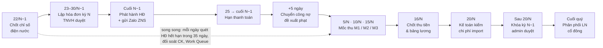
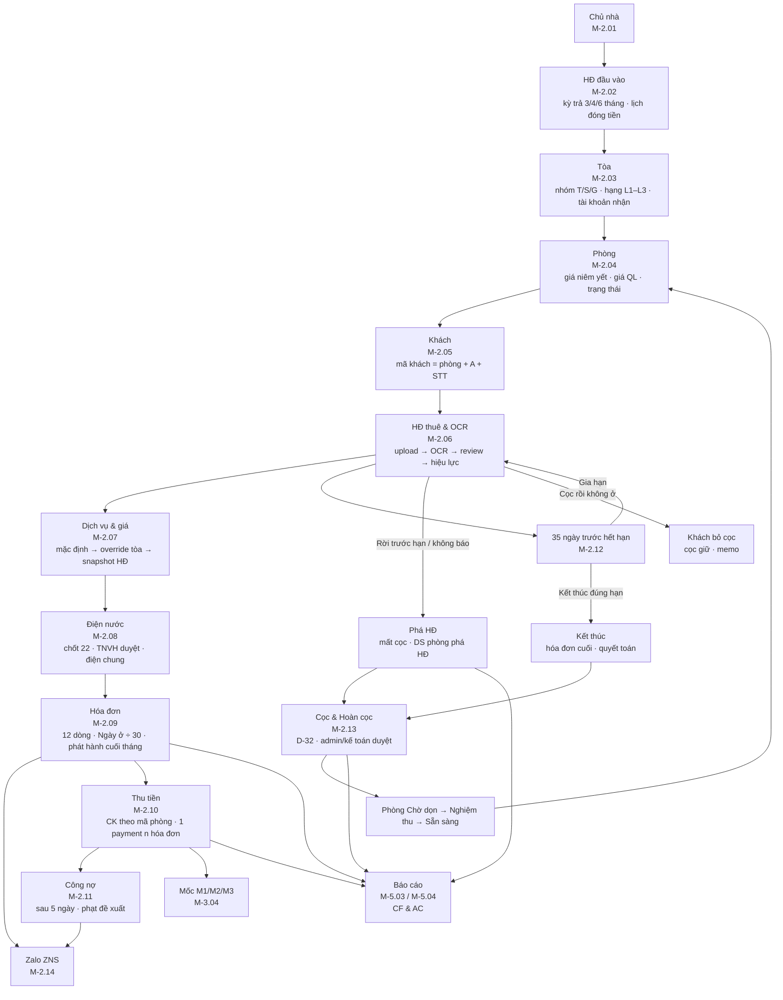
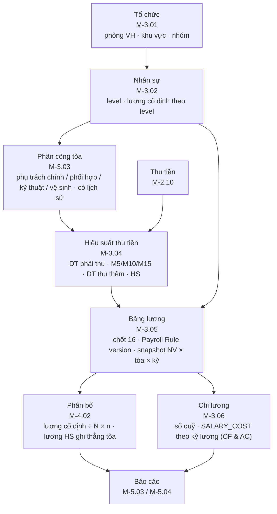
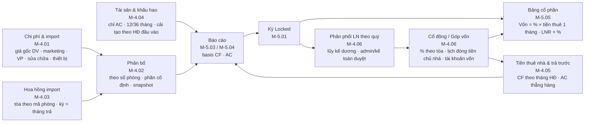
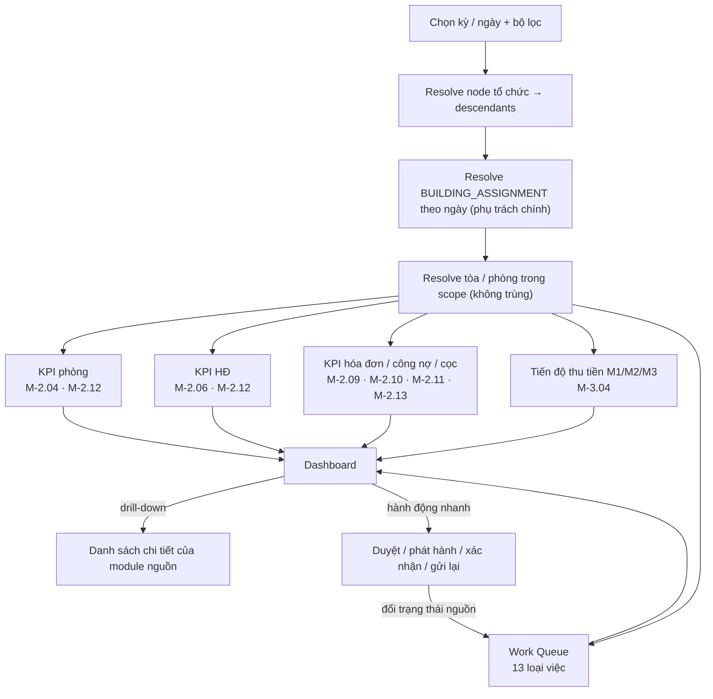

# 1. Tổng quan quy trình

> Chương này mô tả **bức tranh toàn cảnh** Phase 1 của TimoHouse: phạm vi, tác nhân, lịch tháng vận hành, sơ đồ end-to-end, ma trận việc – vai trò – module, Dashboard & Work Queue và các nguyên tắc thiết kế bắt buộc. Mọi thuật ngữ (D-xx), rule chuẩn (R-xx), tham số (P-xx), hạng mục ngoài phạm vi (X-xx) được định nghĩa **duy nhất** tại `00_shared_brief.md`; chương này chỉ tham chiếu bằng mã, không định nghĩa lại.
>
> Chương 1 có đúng **một module** là `M-1.01 Dashboard & Work Queue` (§1.6). Mọi Business Rule trong chương này đánh số liên tục `BR-1.01.x` và gắn nhãn tin cậy theo §0.1 của brief.

---

## 1.1 Phạm vi Phase 1

### 1.1.1 Năm dòng yêu cầu gốc của khách hàng (phase1.md)

| # | Yêu cầu gốc (nguyên văn) | Diễn giải phạm vi | Chương / module |
|---|---|---|---|
| 1 | *HĐ → tòa → phòng → khách hàng → hóa đơn → thu tiền → hoàn cọc → tổng quan* | Chuỗi vận hành thuê từ HĐ đầu vào với chủ nhà đến hoàn cọc và tổng quan điều hành | Chương 2 (M-2.01 → M-2.14) + M-1.01 |
| 2 | *Nhân sự → tổ chức → nhân viên → bảng lương* | Chuỗi nội bộ: cơ cấu tổ chức, hồ sơ nhân viên, phân công tòa, hiệu suất thu tiền, bảng lương, chi lương | Chương 3 (M-3.01 → M-3.06) |
| 3 | *Làm báo cáo: 2 loại báo cáo đã mô tả phân tích trong file excel Timohouse.xlsx* | Report A (từng tòa + bảng cổ phần) và Report B (tổng theo nhóm T/S/G), mỗi báo cáo có 2 biến thể CF/AC (R-01) | Chương 5 (M-5.01 → M-5.06) |
| 4 | *Xử lý phần đọc OCR hợp đồng để trích xuất các thông tin* | OCR/upload HĐ thuê phòng → tự điền HĐ, người thuê, điều khoản, bảng giá DV theo HĐ (R-36) | M-2.06 |
| 5 | *Chi phí sẽ import các chi phí mà mình chưa quản lý* | Mọi chi phí không sinh tự động đi qua module Chi phí bằng import (R-25), kể cả hoa hồng (R-30) | Chương 4 (M-4.01 → M-4.06; import trực tiếp tại M-4.01 Chi phí và M-4.03 Hoa hồng; M-4.02 Phân bổ, M-4.04 Khấu hao, M-4.05 Tiền thuê nhà, M-4.06 Cổ đông phục vụ báo cáo) |

### 1.1.2 Quyết định phạm vi đã chốt với khách hàng

| Quyết định | Nội dung | Rule | Nhãn |
|---|---|---|---|
| Hai biến thể báo cáo | Cả Report A và Report B đều xuất được **CF – Lợi nhuận dòng tiền** (khớp Excel hiện tại, đối soát golden) và **AC – Kinh doanh** (theo kỳ phát sinh) | R-01 | [Đã chốt] |
| Khấu hao kéo về Phase 1 | Vì biến thể AC cần khấu hao thiết bị / đầu tư ban đầu, module Tài sản & khấu hao (M-4.04) làm ngay Phase 1 thay vì để Phase 3; chỉ ảnh hưởng basis AC | R-28, P-02 | [Cần chốt] |
| Tiền thuê nhà thẳng hàng | Tiền thuê chủ nhà trả kỳ 3/4/6 tháng: CF ghi **theo tháng hợp đồng** (tiền thuê 1 tháng mỗi tháng hiệu lực, khớp Excel; tháng miễn = 0), AC phân bổ đều kể cả tháng miễn (chi phí trả trước) | R-27 | [Có bằng chứng nguồn CF / Cần chốt AC] |
| Zalo nằm trong Phase 1 | Gửi hóa đơn / nhắc nợ qua **ZNS**, có rule điều kiện + thời điểm, log lỗi, phản hồi về trưởng phòng phụ trách | R-35 | [Đã chốt] |
| OCR hợp đồng | Upload file HĐ → OCR → màn hình review → tạo HĐ; tự cập nhật bảng giá DV theo HĐ | R-36 | [Đã chốt] |
| Hoa hồng chỉ import | Không có Commission Engine; Phase 1 import dòng hoa hồng đã tính sẵn, gắn tòa theo mã phòng, kỳ = tháng trả | R-30, X-02 | [Đã chốt] |
| Lương chỉ phòng Vận hành | Bảng lương Phase 1 tính cho NVVH / TNVH / TPVH theo hiệu suất thu tiền; lương các phòng khác nhập cố định theo level | R-19 → R-23, X-05 | [Đã chốt] |
| Cổ đông theo tòa | Cổ phần %, góp vốn, lịch đóng tiền chủ nhà, tài khoản vốn lũy kế, phân phối theo quý | R-31, R-32, P-10 | [Đã chốt / Cần chốt phân phối] |
| Work Queue thay Work Order | Phase 1 không có giao việc có tiến độ cho kỹ thuật/vệ sinh; Lead theo dõi qua Work Queue lọc theo cây tổ chức | X-03 | [Đã chốt] |

### 1.1.3 Menu khách hàng mong muốn và cách đáp ứng trong Phase 1

Nguồn: sheet `menu chính` của file `nội dung làm web Timehouse 31.8.2026(2).xlsx`.

| # | Menu KH | Phase 1 đáp ứng bằng | Phần để lại |
|---|---|---|---|
| 1 | Tổng quan | M-1.01 Dashboard & Work Queue (KPI phòng / HĐ / tài chính, tiến độ thu tiền, việc tồn) | Biểu đồ dự báo (X-06) |
| 2 | Thông tin tòa nhà | M-2.01 Chủ nhà, M-2.02 HĐ đầu vào, M-2.03 Tòa, M-2.04 Phòng | Công thức "Hiệu suất / Lợi nhuận / Thời gian vận hành" trên màn Tòa (X-07) — hiển thị từ báo cáo tháng gần nhất |
| 3 | Thông tin KH | M-2.05 Khách, M-2.06 HĐ thuê & OCR, M-2.12 Sắp hết hạn/Gia hạn/Kết thúc/Phá HĐ | Phân khúc khách hàng nâng cao (X-06) |
| 4 | Tài chính chung | M-2.07 Dịch vụ & giá, M-2.08 Điện nước, M-2.09 Hóa đơn, M-2.10 Thu tiền, M-2.11 Công nợ, M-2.13 Cọc & Hoàn cọc, M-4.01 Chi phí & import, M-4.02 Phân bổ | Budget (X-04) |
| 5 | Kinh doanh | Chỉ phần người nhận hoa hồng trong M-4.03 Hoa hồng (import) | CRM / Lead / Lịch xem / Sổ doanh số (X-01), Commission Engine (X-02) |
| 6 | Nhân sự | M-3.01 Tổ chức, M-3.02 Nhân sự, M-3.03 Phân công, M-3.04 Hiệu suất thu tiền, M-3.05 Bảng lương, M-3.06 Chi lương | Lương phòng KD / KT / Thị trường / TC-KT (X-05) |
| 7 | Tài liệu | Tệp đính kèm trên HĐ đầu vào, HĐ thuê (bản OCR), phiếu hoàn cọc, dòng chi phí; quyền tải theo R-34 | Kho tài liệu độc lập (Phase 2) |
| 8 | Báo cáo | M-5.01 Kỳ báo cáo, M-5.02 Hai biến thể, M-5.03 Report A, M-5.04 Report B, M-5.05 Bảng cổ phần, M-5.06 Golden & đối soát | Dự kiến lợi nhuận, ROI/ROA, DW/BI (X-06) |
| 9 | Cổ đông | M-4.06 Cổ đông / Góp vốn / Phân phối (danh sách, % theo tòa, lịch đóng tiền, tài khoản vốn) | Cổng cổ đông tự phục vụ (X-06) |
| 10 | Bảo trì, bảo dưỡng | Không có module riêng; việc "phòng chờ dọn" xuất hiện trong Work Queue của M-1.01 | Work Order / lịch bảo dưỡng / kiểm kê (X-03) |

### 1.1.4 Ngoài phạm vi

Bảy hạng mục X-01 … X-07 (brief §0.9, chi tiết tại §6.2) **không** được mô tả tính năng ở bất kỳ chương nào; nếu một module cần dữ liệu thuộc X-xx thì chỉ ghi "đầu vào nhập tay / import" và ghi chú Phase dự kiến.

---

## 1.2 Tác nhân & vai trò

Nguyên tắc chung theo R-33 và R-34: **phân công tòa** (Business Assignment) là nguồn duy nhất xác định ai phụ trách tòa nào; **quyền hệ thống** (System Permission) là lớp riêng, được phân công không đồng nghĩa được sửa dữ liệu tài chính. Mọi màn hình danh sách đều lọc được theo khu vực / trưởng nhóm / quản lý / tòa / loại nhà T-S-G.

| Vai trò | Việc chính trong Phase 1 | Quyền (R-34) & phạm vi dữ liệu | Màn hình chính |
|---|---|---|---|
| **Admin** | Cấu hình hệ thống, tham số kỳ (ngày chốt 22, hạn TT, mốc M1/M2/M3), user & quyền, master data; duyệt khóa kỳ và mở khóa kỳ (R-08); duyệt hoàn cọc, phân phối lợi nhuận | Toàn hệ thống; sửa dữ liệu nhạy cảm (công nợ, lương, hoa hồng); xem mọi báo cáo | Cấu hình, Kỳ báo cáo (M-5.01), Dashboard toàn hệ thống (M-1.01) |
| **Kế toán** | Đối soát thanh toán theo mã phòng + tài khoản nhận (R-12); duyệt điều chỉnh/hủy hóa đơn (R-11); duyệt phạt trễ hạn (R-13); import chi phí, hoa hồng (R-25, R-30); kiểm chi phí ngày 20; khóa kỳ (R-08); duyệt hoàn cọc (D-32); chi lương; đối soát golden | Theo quyền tòa hoặc toàn hệ thống; sửa dữ liệu nhạy cảm; xem báo cáo; tải tài liệu | Thu tiền (M-2.10), Công nợ (M-2.11), Chi phí (M-4.01), Bảng lương (M-3.05), Kỳ báo cáo (M-5.01) |
| **TPVH – Trưởng phòng vận hành** | Quản lý toàn bộ NVVH; duyệt giá chốt dưới Giá QL (D-11); xem hiệu suất & bảng lương phòng vận hành; nhận phản hồi Zalo (R-35); lương trưởng nhóm theo số phòng dưới quyền (R-22) | Đơn vị + toàn bộ cấp dưới; xem báo cáo; tải tài liệu; **không** sửa công nợ/lương/hoa hồng | Dashboard theo phòng VH, Work Queue cấp dưới, Hiệu suất (M-3.04) |
| **TNVH / Trưởng nhóm / Trưởng khu vực** | Lead trực tiếp của NVVH theo khu vực; duyệt chỉ số điện nước (R-11); xác nhận HĐ sắp hết (R-15); xác nhận/miễn phạt (R-13); theo dõi Work Queue của nhóm | Đơn vị + descendants; tải tài liệu; không sửa dữ liệu tài chính | Dashboard khu vực, Điện nước (M-2.08), Sắp hết hạn (M-2.12) |
| **NVVH – Quản lý tòa (D-05)** | Phụ trách chính 3–12 tòa: nhập chỉ số điện nước, số người, thu khác; tạo HĐ (upload OCR → review); lập hóa đơn; ghi nhận thu tiền/ báo CK; xử lý HĐ sắp hết, kết thúc, phá HĐ; lập phiếu hoàn cọc; xác nhận phòng chờ dọn | Chỉ tòa được phân công (assignment phụ trách chính + phối hợp); tải tài liệu | Work Queue cá nhân, Phòng (M-2.04), HĐ thuê (M-2.06), Điện nước (M-2.08), Hóa đơn (M-2.09) |
| **NV nguồn** | Tìm nguồn tòa nhà mới, cung cấp thông tin chủ nhà và HĐ đầu vào để tạo hồ sơ Tòa; lương cố định phân bổ theo số phòng (R-26) | Tạo/sửa Chủ nhà, HĐ đầu vào ở trạng thái nháp; không xem tài chính | Chủ nhà (M-2.01), HĐ đầu vào (M-2.02) |
| **NVKD / Sale (D-07)** | Chốt khách và ký HĐ; trong Phase 1 chỉ xuất hiện là **người nhận hoa hồng** trên dòng import; không có CRM (X-01) | Xem deal hoa hồng của bản thân; không sửa | Hoa hồng (M-4.03) — chỉ đọc |
| **Kỹ thuật** | Sửa chữa, nghiệm thu phòng sau khi khách trả; cung cấp chi phí sửa chữa cho phiếu hoàn cọc (D-32) | Assignment chuyên môn theo tòa (R-33); không sửa tài chính | Work Queue "phòng chờ dọn / nghiệm thu" (M-1.01) |
| **Vệ sinh** | Dọn phòng sau trả, xác nhận hoàn tất để phòng về Sẵn sàng (R-17); lương cố định 550.000/tòa (R-26) | Assignment chuyên môn theo tòa; chỉ đổi trạng thái dọn | Work Queue "phòng chờ dọn" (M-1.01) |
| **Cổ đông (D-08)** | Xem báo cáo tòa mình có cổ phần, bảng cổ phần, tài khoản vốn, lịch đóng tiền chủ nhà; nhận thông báo đến hạn góp | Read-only theo tòa/phần sở hữu; xem báo cáo (R-34) | Report A + Bảng cổ phần (M-5.03, M-5.05), Cổ đông (M-4.06) |
| **Chủ nhà** | Đối tác cho thuê tòa; **không đăng nhập**; hồ sơ, HĐ đầu vào, lịch đóng tiền thuê nhà được quản lý hộ | Không có tài khoản | (Đối tượng dữ liệu tại M-2.01, M-2.02) |
| **Khách thuê** | Nhận hóa đơn / nhắc nợ qua Zalo ZNS, chuyển khoản theo mã phòng (R-12); **không đăng nhập** Phase 1 | Không có tài khoản | (Đối tượng dữ liệu tại M-2.05, M-2.14) |

Ghi chú:
- Vai trò **Nhân sự (HR)** trong spec §16 được gộp vào Admin/Kế toán ở Phase 1 (công ty chưa có phòng HR riêng trên file lương); tách riêng khi cần bằng cấu hình quyền, không đổi nghiệp vụ. [Cần chốt → P-22]
- **Quản lý Tổng** trong spec §16 = Admin có thêm quyền xem toàn cây; Phase 1 không tách vai trò riêng. [Cần chốt → P-22]

---

## 1.3 Lịch tháng vận hành

Quy ước: **kỳ N** là tháng dương lịch đang báo cáo (D-09). Chuỗi thời gian một kỳ kéo dài từ ngày 22 của tháng N−1 (chốt chỉ số cho hóa đơn kỳ N) đến sau ngày 20 của tháng N+1 (khóa kỳ N). Lịch dưới đây xếp theo ngày trong tháng để người vận hành dùng như checklist.

### 1.3.1 Dòng thời gian một kỳ

> Lưu ý về kỳ: hóa đơn **phát hành cuối tháng N−1** gồm tiền phòng tháng N (trả trước) + dịch vụ chốt 22/N−1 (trả sau) + nợ cũ (D-09, R-09). Việc thu tiền cho hóa đơn này diễn ra chủ yếu trong tháng N (mốc 5/10/15), nên **hiệu suất & lương kỳ N** đo bằng tiền thu trong tháng N (R-20), còn **báo cáo CF kỳ N** là tiền thực thu trong tháng N (R-02) và **báo cáo AC kỳ N** là hóa đơn phát hành trong tháng N (R-03).

### 1.3.2 Bảng lịch theo ngày

| Ngày | Việc | Ai làm | Đầu vào | Đầu ra | Module | Rule / nhãn |
|---|---|---|---|---|---|---|
| Hàng ngày | Đối soát chuyển khoản theo nội dung CK = mã phòng + tài khoản nhận; phân bổ 1 payment ↔ n hóa đơn | Kế toán (NVVH báo CK) | Sao kê, hóa đơn mở | PAYMENT + PAYMENT_ALLOCATION, cập nhật D-20 | M-2.10 | R-12 [Có bằng chứng nguồn] |
| Hàng ngày | Quét HĐ có ngày hết hạn trong **35 ngày** tới → Work Queue "HĐ sắp hết"; NVVH xác nhận Kết thúc / Gia hạn | Hệ thống → NVVH → TNVH | CONTRACT.end_date | CONTRACT_EVENT (renew / end) | M-2.12, M-1.01 | R-15 [Đã chốt] |
| Hàng ngày | Xử lý Work Queue: OCR chờ review, hoàn cọc chờ duyệt, phòng chờ dọn, Zalo lỗi, import lỗi | Theo vai trò §1.6 | Hàng đợi | Việc đóng | M-1.01 | BR-1.01.x |
| 1–5 | Thu tiền đợt 1; **ngày 5** hệ thống chụp mốc **M1** = thu lũy kế đến 5/N theo NV × tòa | Hệ thống (NVVH đôn đốc) | PAYMENT đã đối soát | COLLECTION_MILESTONE_SNAPSHOT(M5) | M-3.04 | R-20, D-47 [Đã chốt] |
| 6–10 | Thu tiền đợt 2; **ngày 10** chụp mốc **M2**; DT mốc 2 = (M10 − M5) × 90% | Hệ thống | PAYMENT | Snapshot M10 | M-3.04 | R-20 [Đã chốt] |
| 11–15 | Thu tiền đợt 3; **ngày 15** chụp mốc **M3**; DT mốc 3 = (M15 − M10) × 70%; ngày 15 cũng là ngày xác định **người phụ trách chính** của tòa cho kỳ lương (P-21) | Hệ thống | PAYMENT, BUILDING_ASSIGNMENT | Snapshot M15; NV × tòa × kỳ | M-3.04, M-3.03 | R-20, R-23 [Đã chốt / Cần chốt ngày 15 → P-21] |
| 16 | **Chốt thu tiền & bảng lương** kỳ N: tính DT thu thêm (D-48), Tổng DT thu được (D-49), HS thực tế (D-50), mức lương/phòng (R-21), lương trưởng nhóm (R-22); tiền thu sau 16 vào công nợ, không vào HS kỳ N | Hệ thống tính → Kế toán khóa bảng lương | Snapshot 3 mốc, DT phải thu, DT niêm yết, Payroll Rule version | PAYROLL_RESULT kỳ N (snapshot) | M-3.04, M-3.05 | R-23, P-06 [Cần chốt] |
| 16–20 | Import chi phí kỳ N: giá gốc điện/nước/mạng/rác/môi trường/thang máy, marketing, thiết bị, sửa chữa, VP, hoa hồng đã trả; gắn kỳ hạch toán (AC) + ngày thanh toán (CF) | Kế toán | File Excel/CSV nhà cung cấp, sổ chi | EXPENSE, COMMISSION_IMPORT_LINE, ASSET | M-4.01, M-4.03, M-4.04 | R-25, R-30 [Đã chốt] |
| 20 | **Kế toán kiểm chi phí**: đối chiếu tổng chi phí import với sổ; chạy phân bổ theo số phòng (N = tổng phòng quản lý cuối tháng); chuyển kỳ sang **Reviewing** | Kế toán | EXPENSE, ROOM count | ALLOCATION_RESULT (snapshot), kỳ Reviewing | M-4.02, M-5.01 | R-26, P-05, P-06 [Có bằng chứng nguồn / Cần chốt] |
| Sau 20 | **Khóa kỳ**: kế toán khóa (Locked), admin duyệt; đóng băng metric version, allocation, loại tòa, snapshot lương, % cổ đông; sinh REPORT_SNAPSHOT cho Report A/B × CF/AC; đối soát golden nếu có | Kế toán → Admin | Kỳ Reviewing, sổ giao dịch | REPORT_SNAPSHOT, kỳ Locked | M-5.01, M-5.06 | R-08 [Cần chốt] |
| Sau khóa | Chi lương kỳ N theo bảng lương đã khóa; ngày chi lương thực tế là tham số (P-18) và chỉ là dòng tiền sổ quỹ — `SALARY_COST` trên báo cáo tòa dùng **kỳ lương** cho cả CF và AC (BR-5.02.7) | Kế toán | PAYROLL_RESULT Locked | SALARY_PAYMENT (sổ quỹ / đối chiếu) | M-3.06 | R-25, P-18 [Cần chốt] |
| 22 | **Chốt chỉ số điện nước** kỳ N+1 (tham số theo tòa): NVVH nhập chỉ số cũ/mới, số người; TNVH duyệt; công tơ **khu vực chung** (điện vệ sinh chung) chia theo số người (D-18); công tơ **tổng** `000<tòa>` chỉ để đối chiếu giá gốc (D-03) | NVVH → TNVH | METER, ảnh công tơ | METER_READING đã duyệt | M-2.08 | R-11, D-18 [Cần chốt] |
| 23–30 | **Lập hóa đơn** kỳ N+1: 12 dòng cố định, hệ số Ngày ở ÷ 30, kỳ TT, nợ cũ, thu khác, cọc; kiểm tra chênh lệch bất thường so với kỳ trước | Hệ thống sinh → NVVH kiểm → TNVH duyệt | METER_READING, CONTRACT, bảng giá theo HĐ | INVOICE (Draft → Approved) | M-2.09, M-2.07 | R-09, R-14 [Có bằng chứng nguồn] |
| Cuối tháng | **Phát hành hóa đơn** và **gửi Zalo ZNS** theo rule (lấy lại công nợ ngay trước khi gửi); hóa đơn đã phát hành không sửa, chỉ điều chỉnh/hủy có audit | Hệ thống / NVVH | INVOICE Approved | INVOICE Issued, ZALO_MESSAGE_LOG | M-2.09, M-2.14 | R-11, R-35 [Đã chốt] |
| Cuối tháng | Đếm **phòng trống** 3 loại (trống ở luôn / trống hết tháng / đang chờ), phòng mới, phá HĐ theo tòa cho báo cáo | Hệ thống | ROOM_STATUS_HISTORY, CONTRACT_EVENT | NEW_ROOM_COUNT, VACANT_ROOM_COUNT, EARLY_TERMINATION_COUNT | M-2.04, M-5.03 | R-06, D-24 [Đã chốt một phần] |
| 25 → cuối tháng | **Hạn thanh toán** hóa đơn; Zalo nhắc hạn theo rule | Khách thuê | INVOICE Issued | PAYMENT | M-2.10, M-2.14 | D-09 [Có bằng chứng nguồn] |
| Phát hành + 5 ngày | Hóa đơn chưa đủ chuyển **Công nợ** (D-21: 5 ngày kể từ khi có hóa đơn; mốc tính → P-17); hệ thống đề xuất phạt 200.000/ngày → NVVH xác nhận/miễn → kế toán duyệt | Hệ thống → NVVH → Kế toán | INVOICE Thiếu / Chưa TT | Dòng công nợ, dòng phạt (đề xuất) | M-2.11 | R-13, P-09, P-17 [Đã chốt / Cần chốt phạt] |
| Theo HĐ đầu vào | **Lịch đóng tiền chủ nhà** kỳ 3/4/6 tháng: nhắc hạn trước ngày đến hạn (P-23); cổ đông đóng theo % (R-31); CF ghi tiền thuê **theo tháng hợp đồng**, AC thẳng hàng (R-27) | Kế toán, Cổ đông | HEAD_LEASE_PAYMENT_SCHEDULE | CAPITAL_PAYMENT, EXPENSE(head lease) | M-4.05, M-4.06 | R-27, R-31 [Đã chốt / Cần chốt AC] |
| Khi khách trả phòng | Chốt điện nước ngày ra → hóa đơn cuối → quyết toán → phiếu hoàn cọc (D-32) → admin/kế toán duyệt → chi hoàn → phòng Chờ dọn → nghiệm thu → Sẵn sàng | NVVH → Kế toán/Admin → Vệ sinh/Kỹ thuật | CONTRACT, DEPOSIT_LEDGER | REFUND_CASE, ROOM_STATUS_HISTORY | M-2.12, M-2.13 | R-16, R-17 [Đã chốt] |
| Cuối quý | **Phân phối lợi nhuận** cổ đông trên lợi nhuận lũy kế dương của tòa (bù lỗ trước), theo % tại ngày cuối kỳ; admin/kế toán duyệt; nguồn = báo cáo Locked | Kế toán → Admin | REPORT_SNAPSHOT Locked, BUILDING_SHARE | PROFIT_DISTRIBUTION, SHAREHOLDER_CAPITAL_ACCOUNT | M-4.06, M-5.05 | R-32, P-10 [Cần chốt] |

### 1.3.3 Rule về lịch kỳ

- **BR-1.01.1** Mọi ngày mốc (22, 25–cuối tháng, 5/10/15, 16, 20) là **tham số hệ thống** có ngày hiệu lực; ngày chốt chỉ số cấu hình được theo tòa, các ngày còn lại toàn hệ thống. [Cần chốt]
- **BR-1.01.2** Thứ tự bắt buộc trong tháng: chốt chỉ số → lập & duyệt hóa đơn → phát hành → gửi Zalo; không phát hành hóa đơn khi chỉ số chưa được TNVH duyệt. [Cần chốt]
- **BR-1.01.3** Snapshot mốc M1/M2/M3 do hệ thống chụp tự động lúc 23:59 ngày 5/10/15 theo NV × tòa; không chỉnh tay; thu sau mốc tính vào mốc kế tiếp, thu sau 16 vào công nợ kỳ. [Đã chốt trọng số / Cần chốt giờ chụp → P-19]
- **BR-1.01.4** Kỳ chỉ được khóa khi: bảng lương kỳ đã khóa, không còn hóa đơn Draft của kỳ, không còn import chi phí ở trạng thái lỗi, phân bổ đã chạy với rule version hiện hành. [Cần chốt]
- **BR-1.01.5** Sau khi kỳ Locked, mọi phát sinh (thu thừa, hoàn, sửa hóa đơn, chi phí về muộn) ghi vào **kỳ hiện tại** dưới dạng dòng điều chỉnh có tham chiếu chứng từ gốc; mở khóa chỉ admin, giữ snapshot cũ. [Cần chốt] (answer §A10, §H6)
- **BR-1.01.6** Phân phối lợi nhuận chỉ chạy trên kỳ đã Locked của cả 3 tháng trong quý. [Cần chốt]

---

## 1.4 Sơ đồ quy trình end-to-end

### 1.4.1 Chuỗi vận hành thuê (Chương 2 → Chương 5)

Ngoại lệ chính của chuỗi:
- Khách **đổi phòng nội bộ** = 1 sự kiện trên cùng HĐ, cọc chuyển theo, không đếm phòng mới/phá HĐ (R-18).
- Khách mới **vào giữa tháng**: tiền phòng tháng đầu theo ngày (R-10, P-03), ghi ở dòng Thu khác của hóa đơn kỳ kế tiếp (D-17); cọc phòng mới ghi CF tháng vào ở (R-05).
- Hóa đơn đã phát hành có sai sót → **điều chỉnh/hủy** có audit, không sửa tại chỗ (R-11).
- Hoàn cọc âm (khấu trừ > cọc) → phần âm thành **công nợ khách** (D-32).

### 1.4.2 Chuỗi nội bộ (Chương 3)

### 1.4.3 Nhánh chi phí và cổ đông (Chương 4 → Chương 5)

---

## 1.5 Ma trận việc – vai trò – thời điểm – module

Ký hiệu vai trò: **AD** Admin · **KT** Kế toán · **TP** TPVH · **TN** TNVH/Trưởng khu vực · **QL** NVVH quản lý tòa · **NG** NV nguồn · **KD** NVKD · **KTh** Kỹ thuật · **VS** Vệ sinh · **CĐ** Cổ đông · **HT** Hệ thống tự động. Ký hiệu quyền: **T** thực hiện · **D** duyệt · **X** xem · **N** nhận thông báo.

| # | Việc | AD | KT | TP | TN | QL | NG | KD | KTh | VS | CĐ | HT | Thời điểm | Module | Rule |
|---|---|---|---|---|---|---|---|---|---|---|---|---|---|---|---|
| 1 | Tạo/sửa hồ sơ chủ nhà | T | X | X | | | T | | | | | | Khi có tòa mới | M-2.01 | — |
| 2 | Tạo HĐ đầu vào, kỳ trả, lịch đóng tiền, tài khoản nhận mặc định | T | T | X | | | T | | | | X | N | Khi ký với chủ nhà | M-2.02 | D-35, R-12, R-31 |
| 3 | Tạo tòa, gán nhóm T/S/G, hạng L1–L3 (có ngày hiệu lực) | T | | X | X | X | | | | | | | Khi nhận tòa | M-2.03 | D-02, D-59, P-04 |
| 4 | Tạo phòng, giá niêm yết, giá QL, nội thất bàn giao | T | | D | T | T | | | | | | | Khi nhận tòa / đổi giá | M-2.04 | D-10, D-11 |
| 5 | Phân công tòa: phụ trách chính, phối hợp, kỹ thuật, vệ sinh | T | | T | T | | | | | | | | Khi thay đổi; ngày 15 chốt cho lương | M-3.03 | R-33, R-23 |
| 6 | Tạo khách, upload HĐ, OCR, review, kích hoạt HĐ thuê | | | | D | T | | | | | | T | Khi khách ký | M-2.05, M-2.06 | D-04, R-36 |
| 7 | Chốt giá thấp hơn Giá QL | | | D | D | T | | | | | | | Khi ký HĐ | M-2.06 | D-11 [Cần chốt] |
| 8 | Ghi nhận cọc thu / cọc bổ sung vào Deposit Ledger | | T | | | T | | | | | | | Khi khách đóng cọc | M-2.13 | D-22, R-05 |
| 9 | Cấu hình giá DV mặc định, override theo tòa | T | T | X | | | | | | | | | Khi đổi giá; snapshot vào HĐ | M-2.07 | R-14 |
| 10 | Nhập chỉ số điện nước, số người, điện chung | | | | D | T | | | | | | | Ngày 22 (tham số tòa) | M-2.08 | R-11, D-18 |
| 11 | Sinh hóa đơn kỳ, kiểm chênh lệch, duyệt | | X | | D | T | | | | | | T | 23–30 | M-2.09 | R-09 |
| 12 | Phát hành hóa đơn, gửi Zalo ZNS | | | | | T | | | | | | T | Cuối tháng | M-2.09, M-2.14 | R-11, R-35 |
| 13 | Điều chỉnh / hủy hóa đơn đã phát hành (có audit) | D | D | | | T | | | | | | | Khi phát hiện sai | M-2.09 | R-11 |
| 14 | Đối soát CK theo mã phòng + tài khoản, phân bổ payment | | T | | | N | | | | | | T | Hàng ngày | M-2.10 | R-12 |
| 15 | Chụp mốc M1/M2/M3 theo NV × tòa | | | X | X | X | | | | | | T | 5 / 10 / 15 | M-3.04 | R-20 |
| 16 | Chuyển công nợ, đề xuất phạt, xác nhận/miễn, duyệt | | D | | X | T | | | | | | T | Hạn + 5 ngày | M-2.11 | R-13, P-09 |
| 17 | Nhắc nợ Zalo theo rule, xử lý Zalo lỗi, phản hồi khách | | | N | | T | | | | | | T | Theo rule | M-2.14 | R-35 |
| 18 | Xác nhận HĐ sắp hết: Gia hạn (HĐ phiên bản mới) / Kết thúc | | | | D | T | | | | | | T | 35 ngày trước hết hạn | M-2.12 | R-15 |
| 19 | Ghi nhận phá HĐ, khách bỏ cọc, đổi phòng nội bộ | | X | | D | T | | | | | | | Khi phát sinh | M-2.12 | R-16, R-18, D-27 |
| 20 | Chốt điện nước ngày ra, hóa đơn cuối, quyết toán | | X | | D | T | | | | | | T | Ngày khách trả | M-2.12, M-2.09 | R-17 |
| 21 | Lập phiếu hoàn cọc (khấu trừ D-32), duyệt, chi hoàn | D | D | | | T | | | T | T | | | Sau quyết toán | M-2.13 | D-32, R-29 |
| 22 | Đổi trạng thái phòng Chờ dọn → Nghiệm thu → Sẵn sàng | | | | | T | | | T | T | | | Sau hoàn cọc | M-2.04 | R-17 |
| 23 | Đếm phòng mới / trống 3 loại / phá HĐ | | | X | X | X | | | | | X | T | Cuối tháng | M-2.04, M-5.03 | R-06 |
| 24 | Tạo đơn vị tổ chức, level, lương cố định theo level (hiệu lực theo ngày) | T | T | X | | | | | | | | | Khi thay đổi | M-3.01, M-3.02 | R-19 |
| 25 | Tính DT phải thu, DT thu thêm, Tổng DT thu được, HS tạm tính | | | X | X | X | | | | | | T | Liên tục đến 16 | M-3.04 | R-20, D-46 → D-50 |
| 26 | Chốt bảng lương: mức lương/phòng, lương trưởng nhóm, lương hỗ trợ (nhập tay), snapshot | D | T | X | X | X | | | | | | T | Ngày 16 | M-3.05 | R-21, R-22, R-23, P-01, P-08 |
| 27 | Chi lương theo bảng lương khóa | | T | | | | | | | | | | Sau khóa lương | M-3.06 | answer §H1 |
| 28 | Import chi phí (preview → validate → trùng → confirm) | | T | | | | | | | | | T | 16–20 | M-4.01 | R-25 |
| 29 | Import hoa hồng đã trả, gắn tòa theo mã phòng | | T | | | | | X | | | | T | Tháng trả | M-4.03 | R-30, D-55 |
| 30 | Ghi nhận tài sản, chạy khấu hao AC | | T | | | | | | | | | T | Tháng đưa vào dùng | M-4.04 | R-28, P-02 |
| 31 | Ghi tiền thuê nhà: CF theo tháng HĐ (48.000.000/tháng dù trả quý), AC thẳng hàng | | T | | | | | | | | X | T | Theo lịch HĐ đầu vào | M-4.05 | R-27, P-15 |
| 32 | Chạy phân bổ chi phí chung theo số phòng, lưu snapshot | | T | | | | | | | | | T | Ngày 20 | M-4.02 | R-26, P-05 |
| 33 | Kiểm chi phí, chuyển kỳ Reviewing | | T | | | | | | | | | | Ngày 20 | M-5.01 | P-06 |
| 34 | Khóa kỳ (Locked), duyệt, mở khóa (Reopened) | D | T | | | | | | | | | T | Sau 20 | M-5.01 | R-08 |
| 35 | Đối soát golden (G1 06/2026) và đối chiếu CF với Excel | | T | | | | | | | | | T | Sau khóa | M-5.06 | R-01 |
| 36 | Xem Report A (tòa + bảng cổ phần), Report B (T/S/G → tổng), drill-down | X | X | X | | | | | | | X | | Sau khóa (và tạm tính trước khóa) | M-5.03, M-5.04, M-5.05 | R-01, R-07, R-37 |
| 37 | Quản lý cổ đông, % theo tòa (ngày hiệu lực), góp vốn, lịch đóng tiền chủ nhà | T | T | | | | | | | | X, N | T | Khi thay đổi / theo lịch | M-4.06 | R-31 |
| 38 | Phân phối lợi nhuận theo quý, cập nhật tài khoản vốn | D | T | | | | | | | | X, N | T | Cuối quý | M-4.06 | R-32, P-10 |
| 39 | Xem Dashboard, xử lý Work Queue theo phạm vi | X | X | X | X | T | | | T | T | X | T | Hàng ngày | M-1.01 | R-34 |
| 40 | Cấu hình tham số ngày mốc, user, quyền, data scope | T | | | | | | | | | | | Khi cần | Cấu hình | BR-1.01.1 |

---

## 1.6 M-1.01 Dashboard & Work Queue

### 1.6.1 Mục tiêu

Một màn hình điều hành duy nhất để mỗi vai trò biết ngay, trong phạm vi dữ liệu của mình: tình trạng phòng / HĐ / hóa đơn / công nợ, **tiến độ thu tiền theo mốc M1/M2/M3** (thay cho biểu đồ doanh thu – công nợ theo yêu cầu KH sheet `Tổng quan`), và **danh sách việc tồn** cần xử lý hôm nay. Không phải màn hình báo cáo: số liệu là tạm tính đến thời điểm xem, báo cáo chính thức nằm ở chương 5.

### 1.6.2 Tác nhân

| Vai trò | Dùng để |
|---|---|
| Admin | Nhìn toàn hệ thống; theo dõi kỳ chưa khóa, import lỗi, Zalo lỗi; duyệt hoàn cọc / mở khóa |
| Kế toán | Hóa đơn chưa phát hành, công nợ, hoàn cọc chờ duyệt, import chi phí lỗi, lịch đóng tiền chủ nhà, kỳ chờ khóa |
| TPVH / TNVH / Trưởng khu vực | Tiến độ thu tiền của cấp dưới theo NV × tòa; queue của cấp dưới; HĐ sắp hết chưa xác nhận; chỉ số chờ duyệt |
| NVVH quản lý tòa | Việc của tòa mình: OCR chờ review, chỉ số chưa nhập, hóa đơn chưa phát hành, công nợ, HĐ sắp hết, phòng chờ dọn |
| Kỹ thuật / Vệ sinh | Chỉ Work Queue "phòng chờ dọn / nghiệm thu" theo tòa được phân công |
| Cổ đông | Dashboard rút gọn read-only: KPI tòa có cổ phần, lịch đóng tiền, báo cáo gần nhất |

### 1.6.3 Dữ liệu

**Khối KPI phòng** (nguồn M-2.04, M-2.12; đếm theo R-06):

| KPI | Định nghĩa (tham chiếu) | Drill-down về |
|---|---|---|
| Tổng phòng đang quản lý | Số phòng của tòa còn HĐ đầu vào hiệu lực tại ngày tham chiếu (= N phân bổ, P-05) | Danh sách phòng |
| Đang thuê | Phòng có HĐ hiệu lực | Danh sách HĐ |
| Phòng trống – trống ở luôn | D-24 loại 1 | Danh sách phòng |
| Phòng trống – trống hết tháng | D-24 loại 2 (HĐ hết cuối tháng, đã xác nhận Kết thúc) | Danh sách HĐ |
| Phòng trống – đang chờ | D-24 loại 3 (đã cọc chưa vào) | Deposit Ledger |
| Phòng mới trong tháng | D-23 | CONTRACT_EVENT(new) |
| Phòng phá HĐ trong tháng | D-25 | DS phòng phá HĐ |
| Phòng chờ dọn / chờ nghiệm thu | ROOM_STATUS_HISTORY | Work Queue |
| Tỷ lệ lấp đầy | Đang thuê ÷ Tổng phòng (tính lại từ tổng, R-07) | — |

**Khối KPI hợp đồng** (nguồn M-2.06, M-2.12):

| KPI | Định nghĩa |
|---|---|
| HĐ hiệu lực | CONTRACT trạng thái hiệu lực |
| HĐ sắp hết trong 35 ngày | R-15, tách: chưa xác nhận / đã xác nhận Gia hạn / đã xác nhận Kết thúc |
| HĐ chờ OCR review | Upload xong, chưa duyệt |
| HĐ chờ quyết toán | Đã kết thúc, chưa có hóa đơn cuối / phiếu hoàn cọc |

**Khối KPI tài chính tạm tính** (nguồn M-2.09, M-2.10, M-2.11, M-2.13; đơn vị VND):

| KPI | Định nghĩa |
|---|---|
| Tổng cần đóng kỳ | Σ INVOICE.total_due hóa đơn phát hành cho kỳ (D-46) |
| Tổng đã đóng | Σ PAYMENT_ALLOCATION trong kỳ |
| Công nợ | D-21, tách theo tuổi nợ: ≤ 5 ngày / 6–15 / > 15 |
| Tổng DT tạm tính (CF) | R-02 đến thời điểm xem, **tách mục nhỏ**: DT tiền nhà (D-33), DT cọc mới (D-30), DT phá HĐ / cọc giữ (D-31, D-53) — theo yêu cầu KH sheet `Tổng quan` |
| Hoàn cọc đã chi / chờ duyệt | REFUND_CASE theo trạng thái |
| Hóa đơn theo tình trạng | D-20: Chưa TT / Thiếu / Đủ |

**Khối "Cập nhật tiến độ thu tiền"** (thay biểu đồ; nguồn M-3.04, cấu trúc theo sheet `cập nhật thu tiền`; hai chế độ xem **theo quản lý** và **theo tòa**):

| Cột | Nguồn |
|---|---|
| Quản lý / Tòa | BUILDING_ASSIGNMENT phụ trách chính tại ngày tham chiếu |
| Số phòng | ROOM count |
| DT niêm yết | D-45 |
| DT phải thu | D-46 |
| M1 (đến ngày 5) · M2 (đến 10) · M3 (đến 15) | COLLECTION_MILESTONE_SNAPSHOT; mốc chưa tới hiển thị số lũy kế hiện tại kèm nhãn "đang chạy" |
| DT 3 mốc có trọng số | D-47 (100 / 90 / 70%) |
| DT thu thêm | D-48 |
| Tổng DT thu được | D-49 |
| Hiệu suất tạm tính (%) | D-50 *Tạm tính*; sau ngày 16 hiển thị *Thực tế* từ bảng lương khóa |
| Còn phải thu | DT phải thu − đã thu |

**Khối Work Queue** — mỗi dòng: loại việc · đối tượng (tòa/phòng/HĐ/hóa đơn) · người phụ trách (theo R-33) · ngày phát sinh · tuổi (ngày) · mức ưu tiên · hành động nhanh · trạng thái (Mở / Đang xử lý / Đã xong / Bỏ qua có lý do).

| Loại việc tồn | Điều kiện phát sinh | Người xử lý mặc định | Nguồn | Hành động nhanh |
|---|---|---|---|---|
| OCR chờ review | HĐ upload đã OCR xong, chưa duyệt | NVVH tòa | M-2.06 | Mở màn review |
| HĐ sắp hết 35 ngày chưa xác nhận | end_date − hôm nay ≤ 35 và chưa có CONTRACT_EVENT renew/end | NVVH tòa; TNVH thấy toàn nhóm | M-2.12 | Xác nhận Gia hạn / Kết thúc |
| Chỉ số điện nước chưa nhập / chưa duyệt | Đến ngày chốt (22) mà METER_READING kỳ thiếu hoặc chờ duyệt | NVVH / TNVH | M-2.08 | Nhập / duyệt |
| Hóa đơn chưa phát hành | Sau ngày lập hóa đơn mà còn INVOICE Draft/Approved của kỳ | NVVH / TNVH | M-2.09 | Duyệt / phát hành |
| Công nợ quá 5 ngày | INVOICE Thiếu / Chưa TT quá 5 ngày kể từ phát hành (mốc → P-17) | NVVH; kế toán duyệt phạt | M-2.11 | Nhắc Zalo, đề xuất phạt |
| Zalo lỗi | ZALO_MESSAGE_LOG trạng thái lỗi / khách chưa liên kết | NVVH; TPVH nhận phản hồi | M-2.14 | Gửi lại / phương án dự phòng |
| HĐ chờ quyết toán | HĐ đã kết thúc / phá HĐ nhưng chưa có hóa đơn cuối | NVVH | M-2.12 | Chốt điện nước ngày ra |
| Hoàn cọc chờ duyệt | REFUND_CASE trạng thái chờ duyệt | Admin / Kế toán | M-2.13 | Duyệt / trả lại |
| Phòng chờ dọn / chờ nghiệm thu | ROOM trạng thái Chờ dọn / Chờ nghiệm thu | Vệ sinh / Kỹ thuật / NVVH | M-2.04 | Xác nhận xong |
| Import chi phí lỗi | Batch import có dòng validate lỗi / nghi trùng chưa xử lý | Kế toán | M-4.01 | Mở batch |
| Lịch đóng tiền chủ nhà sắp đến hạn | HEAD_LEASE_PAYMENT_SCHEDULE đến hạn trong X ngày (tham số) và chưa có CAPITAL_PAYMENT đủ | Kế toán; cổ đông nhận thông báo | M-4.05, M-4.06 | Ghi nhận đã đóng |
| Kỳ chờ khóa | Kỳ Reviewing quá ngày 20 chưa Locked, hoặc kỳ Locked chờ admin duyệt | Kế toán / Admin | M-5.01 | Mở kỳ báo cáo |
| Giá chốt dưới Giá QL chờ duyệt | CONTRACT.rent < ROOM.floor_price, chưa duyệt | TNVH / TPVH | M-2.06 | Duyệt |

### 1.6.4 Search / Filter

| Bộ lọc | Ghi chú |
|---|---|
| Kỳ / ngày tham chiếu | Mặc định hôm nay; KPI lịch sử dùng assignment và loại tòa hiệu lực trong kỳ |
| Khu vực | Theo cây tổ chức (M-3.01) |
| Trưởng nhóm / Trưởng khu vực | Node tổ chức → resolve descendants |
| Quản lý (NVVH) | Giới hạn theo tổ chức đã chọn |
| Tòa | Chỉ tòa trong scope |
| Loại nhà T/S/G | Ký hiệu hiệu lực trong kỳ (D-02) |
| Hạng tòa L1/L2/L3 | D-59 |
| Trạng thái phòng / HĐ / hóa đơn | Theo state của module nguồn |
| Mốc thu | M1 / M2 / M3 |
| Loại việc tồn, tuổi việc, trạng thái việc | Chỉ khối Work Queue |

Phạm vi mặc định theo vai trò: NVVH = tòa phụ trách chính + phối hợp; TNVH/TPVH = đơn vị + descendants; Kế toán = theo quyền tòa hoặc toàn hệ thống; Admin = toàn hệ thống; Cổ đông = tòa có cổ phần (R-34).

### 1.6.5 Action

- Đổi kỳ / ngày tham chiếu; đổi chế độ xem tiến độ thu tiền (theo quản lý ↔ theo tòa).
- Drill-down từ mọi KPI về danh sách chi tiết (R-37).
- Mở Work Queue; nhận việc, chuyển việc cho người khác trong scope (có lý do), đánh dấu xong, bỏ qua có lý do.
- Hành động nhanh ngay trên dòng việc (duyệt, phát hành, xác nhận, gửi lại Zalo).
- Xuất Excel theo bộ lọc hiện tại (KPI + tiến độ thu tiền + Work Queue).
- Lưu bộ lọc cá nhân (tùy chọn, không bắt buộc Phase 1).

### 1.6.6 Business Rule

- **BR-1.01.7** Phạm vi dữ liệu Dashboard tính bằng: chọn kỳ + node tổ chức → resolve descendants → resolve BUILDING_ASSIGNMENT theo ngày tham chiếu → resolve tòa/phòng; mặc định dùng assignment **phụ trách chính** (R-33). [Đã chốt]
- **BR-1.01.8** Không cộng trùng tòa/phòng khi nhiều người cùng tham gia một tòa (phối hợp, kỹ thuật, vệ sinh); KPI của Lead = tập hợp tòa duy nhất của cấp dưới. [Đã chốt]
- **BR-1.01.9** Mọi KPI trên Dashboard phải drill-down được về dữ liệu chi tiết (danh sách phòng, HĐ, hóa đơn, payment, phiếu hoàn cọc, dòng import). [Đã chốt]
- **BR-1.01.10** Khối "Cập nhật tiến độ thu tiền" dùng đúng công thức R-20; số M1/M2/M3 sau ngày mốc lấy từ snapshot, không tính lại; trước ngày mốc hiển thị lũy kế hiện tại có nhãn "đang chạy". [Đã chốt / Cần chốt giờ chụp]
- **BR-1.01.11** Hiệu suất hiển thị là *Tạm tính* cho tới khi bảng lương kỳ khóa; sau đó hiển thị *Thực tế* và khóa lại (D-50). [Đã chốt]
- **BR-1.01.12** Tổng DT tạm tính trên Dashboard theo basis CF (R-02) và bắt buộc tách 3 mục nhỏ DT tiền nhà / DT cọc mới / DT phá HĐ; số này không thay thế báo cáo chính thức chương 5. [Đã chốt]
- **BR-1.01.13** Phòng trống hiển thị tách 3 loại theo D-24; tổng phòng trống = tổng 3 loại; đếm tại ngày tham chiếu (mặc định cuối tháng cho KPI tháng). [Đã chốt]
- **BR-1.01.14** Work Queue là **dẫn xuất** từ trạng thái dữ liệu nguồn: hệ thống tự sinh và tự đóng việc khi điều kiện không còn; người dùng không tạo việc tự do trong Phase 1. [Cần chốt]
- **BR-1.01.15** Người xử lý mặc định của việc theo R-33 (phụ trách chính tòa) và loại việc; Lead thấy và có thể chuyển việc trong scope; chuyển việc ghi audit. [Đã chốt]
- **BR-1.01.16** Việc "Bỏ qua" bắt buộc có lý do, ghi audit; việc tự đóng khi dữ liệu nguồn đổi trạng thái không cần lý do. [Cần chốt]
- **BR-1.01.17** Ngưỡng tuổi việc để tô màu ưu tiên (ví dụ công nợ > 5 / > 15 ngày, HĐ sắp hết < 7 ngày, lịch đóng tiền chủ nhà ≤ 7 ngày) là tham số cấu hình (P-20). [Cần chốt]
- **BR-1.01.18** Dashboard **không** hiển thị biểu đồ doanh thu – công nợ; vị trí đó là bảng tiến độ thu tiền (yêu cầu KH sheet `Tổng quan`). [Đã chốt]
- **BR-1.01.19** Mọi màn hình danh sách và Dashboard lọc được theo khu vực / trưởng nhóm / quản lý / tòa / loại nhà; bộ lọc chỉ liệt kê giá trị trong scope của người dùng (R-34). [Đã chốt]
- **BR-1.01.20** KPI lịch sử (kỳ đã khóa) đọc từ REPORT_SNAPSHOT, không tính lại từ dữ liệu sống; KPI kỳ hiện tại tính sống. [Cần chốt]
- **BR-1.01.21** Cổ đông chỉ thấy Dashboard rút gọn read-only cho tòa có cổ phần; không thấy Work Queue vận hành, không thấy lương. [Đã chốt]
- **BR-1.01.22** Công thức "Hiệu suất / Lợi nhuận / Thời gian vận hành" trên màn Tòa (X-07) Phase 1 hiển thị từ REPORT_SNAPSHOT tháng gần nhất, có nhãn kỳ nguồn. [Đã chốt]

### 1.6.7 State / Status

Dashboard không có state riêng. Work Queue item:

| Trạng thái | Điều kiện vào | Điều kiện ra |
|---|---|---|
| Mở | Điều kiện phát sinh (bảng §1.6.3) thỏa | Người xử lý nhận việc → Đang xử lý; điều kiện hết → Đã xong (tự động) |
| Đang xử lý | Người dùng nhận việc | Điều kiện hết → Đã xong; người dùng bỏ qua → Bỏ qua |
| Đã xong | Dữ liệu nguồn đổi trạng thái | (kết thúc) — nếu điều kiện phát sinh lại → tạo item mới |
| Bỏ qua | Người dùng bỏ qua có lý do | Tái mở khi điều kiện vẫn còn sau X ngày (tham số) |

### 1.6.8 Flow

Ngoại lệ: người dùng không có assignment nào (NV mới) → Dashboard trống kèm hướng dẫn liên hệ Lead; kỳ được chọn đã Locked → KPI đọc từ snapshot, Work Queue chỉ hiển thị việc còn mở của kỳ hiện tại.

### 1.6.9 Liên kết

| Module | Dashboard đọc | Dashboard ghi |
|---|---|---|
| M-2.04 Phòng | Trạng thái phòng, giá niêm yết | Đổi trạng thái Chờ dọn → Sẵn sàng (hành động nhanh) |
| M-2.06 HĐ thuê & OCR | HĐ, trạng thái OCR | — (mở màn review) |
| M-2.08 Điện nước | Chỉ số kỳ, trạng thái duyệt | Duyệt (hành động nhanh của TNVH) |
| M-2.09 Hóa đơn | Draft / Approved / Issued, total_due | Phát hành (hành động nhanh) |
| M-2.10 / M-2.11 | Payment, công nợ, tuổi nợ | — |
| M-2.12 | HĐ sắp hết, sự kiện HĐ | Xác nhận Gia hạn / Kết thúc |
| M-2.13 | REFUND_CASE | Duyệt hoàn cọc |
| M-2.14 Zalo | Log gửi, lỗi | Gửi lại |
| M-3.03 Phân công | Assignment theo ngày | — |
| M-3.04 Hiệu suất | Snapshot M1/M2/M3, HS | — |
| M-4.01 Chi phí | Batch import lỗi | — (mở batch) |
| M-4.05 / M-4.06 | Lịch đóng tiền chủ nhà | Ghi nhận đã đóng |
| M-5.01 Kỳ báo cáo | Trạng thái kỳ, REPORT_SNAPSHOT | — (mở kỳ) |

### 1.6.10 Audit / Notification

- Ghi audit: nhận việc, chuyển việc, bỏ qua (kèm lý do), mọi hành động nhanh (ghi tại module nguồn kèm nguồn = Dashboard).
- Thông báo trong ứng dụng: việc mới trong scope; việc quá ngưỡng tuổi; kỳ chờ khóa; lịch đóng tiền chủ nhà đến hạn (cổ đông + kế toán).
- Zalo lỗi đẩy thông báo cho NVVH tòa và TPVH (R-35).
- Không gửi thông báo ra ngoài hệ thống cho khách thuê từ Dashboard (đi qua M-2.14).

### 1.6.11 Nghiệm thu

- Đăng nhập 5 vai trò (Admin, Kế toán, TNVH, NVVH, Cổ đông) → mỗi vai trò chỉ thấy tòa trong scope; NVVH có 2 tòa thì KPI đúng tổng 2 tòa; Lead có 3 NVVH chung 1 tòa thì tòa đếm 1 lần.
- Bảng tiến độ thu tiền tháng 06/2026 khớp sheet `cập nhật thu tiền` (theo quản lý và theo tòa) từng cột M5 / M10 / M15 / 3 mốc / thu thêm / Tổng DT thu được / HS.
- Phòng trống hiển thị 3 loại, tổng bằng "Tổng số phòng trống" của báo cáo tháng.
- 13 loại việc tồn phát sinh và tự đóng đúng điều kiện với bộ dữ liệu kiểm thử; drill-down từ mỗi KPI mở đúng danh sách.
- Không có biểu đồ doanh thu – công nợ; xuất Excel theo bộ lọc chạy được.

---

## 1.7 Nguyên tắc thiết kế bắt buộc

Các nguyên tắc dưới đây áp dụng cho **mọi module** ở chương 2–5; agent viết chương chỉ tham chiếu mã BR-1.01.x, không viết lại.

### 1.7.1 Nguồn sự thật duy nhất

- **BR-1.01.23** Quản lý tòa của mọi màn hình, báo cáo, lương, hiệu suất đều đọc từ **BUILDING_ASSIGNMENT** (R-33); không có cột "Quản lý" nhập tay ở bất kỳ sổ nào; cột Quản lý trên sổ Excel cũ là trường đọc. [Đã chốt]
- **BR-1.01.24** Giá dịch vụ áp cho hóa đơn đọc từ snapshot giá theo HĐ (R-14), không đọc bảng giá hiện hành tại thời điểm lập hóa đơn. [Có bằng chứng nguồn]
- **BR-1.01.25** Mã khách, mã phòng, mã tòa là khóa tra cứu nghiệp vụ (D-01, D-03, D-04); tòa gắn với dòng hoa hồng / chi phí resolve qua master phòng, không cắt chuỗi. [Có bằng chứng nguồn]
- **BR-1.01.26** Nhóm T/S/G, hạng L1–L3, % cổ đông, level lương, Payroll Rule, Allocation Rule, Metric Definition đều **có phiên bản / ngày hiệu lực**; kỳ nào dùng phiên bản hiệu lực kỳ đó. [Đã chốt]

### 1.7.2 Snapshot khi khóa

- **BR-1.01.27** Khóa kỳ (R-08) đóng băng: metric version, allocation result, loại tòa, bảng lương, % cổ đông, số phòng N; báo cáo kỳ Locked luôn tái hiện được y hệt từ REPORT_SNAPSHOT. [Cần chốt]
- **BR-1.01.28** Mốc M1/M2/M3, bảng lương NV × tòa × kỳ, phân bổ chi phí là **snapshot**; thay đổi phân công hay chi phí sau thời điểm chụp không làm đổi số đã chụp. [Đã chốt / Cần chốt]
- **BR-1.01.29** Mở khóa kỳ (Reopened) chỉ Admin, phải tạo snapshot mới và giữ snapshot cũ để đối chiếu; mặc định ưu tiên bút toán điều chỉnh kỳ hiện tại thay vì mở khóa. [Cần chốt]

### 1.7.3 Không nhập số tổng tay

- **BR-1.01.30** Mọi số tổng trên hóa đơn, bảng lương, báo cáo, bảng cổ phần đều là số **tính từ chứng từ**; không có ô nhập số tổng; các khoản "điều chỉnh tay" trong Excel (trừ phòng trả, cộng bổ sung, lương hỗ trợ) trở thành **dòng chứng từ điều chỉnh** có lý do và người nhập. [Đã chốt]
- **BR-1.01.31** Lương hỗ trợ và lương trưởng nhóm nhập/tính theo R-21, R-22 nhưng vẫn là dòng PAYROLL_RESULT có audit, không sửa tổng. [Có bằng chứng nguồn]
- **BR-1.01.32** Chi phí chỉ vào hệ thống qua import hoặc phát sinh tự động (R-25); lương không import (tránh double count). [Đã chốt]

### 1.7.4 Drill-down

- **BR-1.01.33** Mọi số tổng trên báo cáo và Dashboard drill-down được về chứng từ gốc: hóa đơn, payment, phiếu chi phí/dòng import, dòng lương, deal hoa hồng, bút toán khấu hao, phiếu hoàn cọc (R-37). [Đã chốt]
- **BR-1.01.34** Tỷ lệ trên báo cáo tổng tính lại từ tổng các thành phần, không lấy trung bình tỷ lệ của tòa (R-07). [Có bằng chứng nguồn]

### 1.7.5 Không bù trừ

- **BR-1.01.35** Chi phí sửa chữa / vệ sinh / sơn ghi đủ ở chi phí; khoản khấu trừ cọc tương ứng ghi **thu nhập khác**, không trừ chéo (R-29). [Cần chốt]
- **BR-1.01.36** Hoàn cọc trừ khỏi doanh thu CF của tháng thực chi; cọc khách bỏ không cộng lại (memo) — không có bút toán bù trừ giữa cọc mới và hoàn cọc (R-02, R-05, D-31). [Đã chốt]

### 1.7.6 Hai basis CF / AC

- **BR-1.01.37** Mỗi giao dịch có đủ 2 chiều thời gian: **ngày thanh toán** (CF) và **kỳ hạch toán** (AC); mỗi metric có chiều `basis ∈ {CF, AC}`, không tạo hai họ mã (R-01, R-25, §0.5). [Đã chốt]
- **BR-1.01.38** Biến thể CF phải khớp golden G1 06/2026 và Excel tháng hiện tại; biến thể AC không cần khớp Excel nhưng phải giải trình được chênh lệch với CF bằng bảng đối chiếu (cọc, khấu hao, trả trước, doanh thu chưa thực hiện). [Đã chốt / Cần chốt AC]
- **BR-1.01.39** Khấu hao, chi phí trả trước, doanh thu chưa thực hiện, thu nhập khác từ cọc giữ **chỉ tồn tại ở basis AC**; basis CF không đọc các bút toán này (R-27, R-28, R-03, R-05). [Cần chốt]

### 1.7.7 Quyền và phạm vi

- **BR-1.01.40** `Business Assignment ≠ System Permission`: mọi action kiểm tra cả quyền hành động và data scope; được phân công tòa không mặc định được sửa công nợ / lương / hoa hồng (R-34, spec §16). [Đã chốt]
- **BR-1.01.41** Mọi thao tác duyệt (chỉ số, hóa đơn, phạt, hoàn cọc, bảng lương, khóa kỳ, phân phối) tách người lập và người duyệt; không tự duyệt việc mình lập, trừ Admin trong môi trường 1 người (cảnh báo audit). [Cần chốt]

### 1.7.8 Tổng hợp nhãn tin cậy chương 1

Đếm theo nhãn **đứng trước** khi rule có nhãn kép (ví dụ "[Đã chốt / Cần chốt giờ chụp]" tính là Đã chốt).

| Nhãn | Số rule |
|---|---|
| [Đã chốt] (gồm 4 rule nhãn kép "Đã chốt / Cần chốt …", phần còn lại → P-xx) | 23 |
| [Có bằng chứng nguồn] | 4 |
| [Cần chốt] | 14 |
| **Tổng** | **41** |
