# 2. Vận hành thuê

> Chương này mô tả chuỗi nghiệp vụ **Chủ nhà → HĐ đầu vào → Tòa → Phòng → Khách → HĐ thuê/OCR → Dịch vụ & giá → Điện nước → Hóa đơn → Thu tiền → Công nợ → Sắp hết hạn/Gia hạn/Kết thúc/Phá HĐ → Cọc/Hoàn cọc → Zalo** (14 module M-2.01 … M-2.14). Mọi thuật ngữ D-xx, rule R-xx, công thức F-xx, tham số P-xx, hạng mục ngoài phạm vi X-xx được tham chiếu theo `00_shared_brief.md`, **không định nghĩa lại**. Mẫu 11 nhóm theo §0.1; nhãn tin cậy gắn cuối mỗi rule. Ví dụ số lấy từ sổ `Hoá đơn tiền nhà tháng 9 và dịch vụ tháng 9 năm 2026.xlsx` (gọi tắt: *sổ T9*).

Sơ đồ dữ liệu chạy xuyên chương:

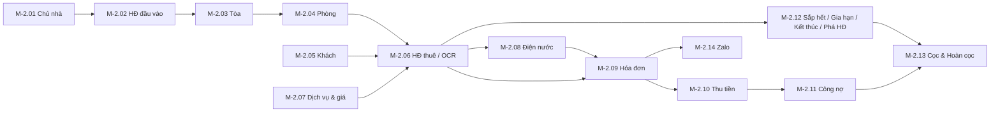

---

## 2.1 M-2.01 Chủ nhà

### 2.1.1 Mục tiêu
Quản lý hồ sơ chủ nhà (cá nhân/tổ chức) mà Timehouse thuê tòa; là gốc của HĐ đầu vào (M-2.02), lịch trả tiền nhà và hồ sơ pháp lý (sổ đỏ, PCCC). Một chủ nhà có thể cho thuê **nhiều tòa** và có nhiều HĐ theo thời gian.

### 2.1.2 Tác nhân
| Vai trò | Quyền |
|---|---|
| Admin, Kế toán | Tạo/sửa/ngừng hoạt động, upload hồ sơ, xem lịch thanh toán |
| TPVH / Trưởng khu vực | Xem toàn bộ; đề xuất sửa |
| NVVH (quản lý tòa) | Xem chủ nhà của tòa mình phụ trách (R-33) |
| Cổ đông | Không truy cập (chỉ xem báo cáo, R-34) |

### 2.1.3 Dữ liệu
Entity `LANDLORD` (+ `DOCUMENT`). Chủ nhà **không xuất hiện trong sổ tháng** → không có cột sổ Excel.

| Trường | Bắt buộc | Ghi chú |
|---|:---:|---|
| Mã chủ nhà | Có | Sinh tự động `LL-0001`, cho phép nhập mã nghiệp vụ |
| Loại | Có | Cá nhân / Tổ chức |
| Họ tên / Tên pháp nhân | Có | |
| CCCD / MST | Tùy loại | Khóa chống trùng |
| Ngày cấp / Nơi cấp | Không | Cá nhân |
| Người đại diện | Không | Tổ chức |
| Điện thoại, Email | ĐT có | Chuẩn hóa số |
| Địa chỉ | Có | |
| Ngân hàng / STK nhận tiền nhà | Không | Có lịch sử; dùng cho lịch đóng tiền M-2.02 |
| Hồ sơ đính kèm | Không | Sổ đỏ, CCCD, giấy ủy quyền, **PCCC của tòa** (gắn tòa), biên bản bàn giao |
| Trạng thái | Có | Hoạt động / Ngừng hoạt động |
| Danh sách tòa & HĐ đầu vào | Suy ra | Đọc từ M-2.02 |
| Ghi chú | Không | |

### 2.1.4 Search / Filter
- Từ khóa: tên, SĐT, CCCD/MST.
- Tòa; nhóm T/S/G (qua tòa); trạng thái.
- Có HĐ đầu vào hiệu lực / sắp hết (≤ 6 tháng — P-23, xem M-2.02).
- Phạm vi theo vai trò: NVVH chỉ thấy chủ nhà của tòa được phân công (R-34).

### 2.1.5 Action
Tạo · Sửa · Xem chi tiết · Ngừng hoạt động · Thêm HĐ đầu vào (mở M-2.02) · Xem các tòa · Xem lịch thanh toán chủ nhà · Upload/replace hồ sơ · Export danh sách.

### 2.1.6 Business Rule
- **BR-2.01.1** Không xóa cứng chủ nhà đã có HĐ đầu vào hoặc tòa; chỉ Ngừng hoạt động. [Đã chốt]
- **BR-2.01.2** Cảnh báo trùng khi CCCD/MST hoặc SĐT trùng bản ghi hiện có; cho phép tiếp tục có lý do. [Đã chốt]
- **BR-2.01.3** Đổi STK ngân hàng sau khi đã có kỳ thanh toán → tạo bản ghi STK mới có ngày hiệu lực, giữ STK cũ trong lịch sử. [Đã chốt]
- **BR-2.01.4** Một chủ nhà có nhiều tòa, một tòa có nhiều HĐ theo thời gian; quan hệ chủ nhà–tòa suy ra từ HĐ đầu vào, không nhập tay ở tòa. [Cần chốt]
- **BR-2.01.5** Hồ sơ PCCC/sổ đỏ gắn với **tòa** (không gắn chủ nhà) để tòa đổi chủ vẫn giữ hồ sơ. [Cần chốt]
- **BR-2.01.6** Ngừng hoạt động chỉ khi không còn HĐ đầu vào hiệu lực. [Cần chốt]

### 2.1.7 State / Status
`Hoạt động` → `Ngừng hoạt động` (điều kiện BR-2.01.6); ngược lại khi có HĐ mới (admin).

### 2.1.8 Flow
1. Admin/Kế toán tạo chủ nhà (kiểm trùng BR-2.01.2). 2. Upload hồ sơ. 3. Thêm HĐ đầu vào → M-2.02. Ngoại lệ: trùng CCCD → hiển thị bản ghi cũ, chọn "Dùng bản ghi có sẵn" hoặc "Vẫn tạo" kèm lý do.

### 2.1.9 Liên kết
| Module | Đọc/Ghi |
|---|---|
| M-2.02 HĐ đầu vào | Ghi HĐ, lịch thanh toán; đọc STK chủ nhà |
| M-2.03 Tòa | Đọc chủ nhà hiện tại của tòa |
| Chương 4 (Tiền thuê nhà) | Đọc STK để lập phiếu chi tiền nhà |

### 2.1.10 Audit / Notification
Audit tạo/sửa/ngừng, thay STK, thay file hồ sơ (giữ phiên bản). Không có notification riêng (nhắc hạn nằm ở M-2.02).

### 2.1.11 Nghiệm thu
- Tạo chủ nhà cá nhân & tổ chức; trùng CCCD cảnh báo đúng.
- Chủ nhà có 2 tòa hiển thị đủ 2 tòa và HĐ tương ứng.
- Đổi STK giữ lịch sử; ngừng hoạt động bị chặn khi còn HĐ hiệu lực.

---

## 2.2 M-2.02 Hợp đồng đầu vào

### 2.2.1 Mục tiêu
Lưu HĐ Timehouse thuê tòa từ chủ nhà: giá thuê/tháng (D-35), cọc chủ nhà, kỳ trả 3/4/6 tháng, giữ giá, tháng miễn, thời hạn, PCCC, HKD, người nhập nguồn; sinh **lịch đóng tiền chủ nhà** có nhắc hạn; xác định nhóm T/S/G (D-02) của tòa; liên kết cổ đông đóng tiền theo % (R-31). Là nguồn của `HEAD_LEASE_COST` (chương 4/5) và thời hạn khấu hao cải tạo (R-28).

### 2.2.2 Tác nhân
| Vai trò | Quyền |
|---|---|
| Admin | Tạo, kích hoạt, gia hạn, kết thúc, sửa giá/lịch |
| Kế toán | Tạo lịch thanh toán, ghi nhận đã trả, duyệt phân bổ nhiều tòa |
| TPVH | Xem, cập nhật hồ sơ HKD/PCCC |
| NVVH | Xem HĐ của tòa mình (không thấy giá thuê nếu không có quyền — R-34) |

### 2.2.3 Dữ liệu
Entity `HEAD_LEASE`, `HEAD_LEASE_PAYMENT_SCHEDULE`, `BUILDING_TYPE_HISTORY`, `DOCUMENT`. Không có cột sổ tháng; giá trị ví dụ từ HĐ mẫu "Hợp đồng thuê nhà 2026 (Mẫu)".

| Nhóm | Trường | Ví dụ HĐ mẫu | Ghi chú |
|---|---|---|---|
| Nhận diện | Số HĐ, Chủ nhà, Danh sách tòa (1..n), Trạng thái | | 1 HĐ nhiều tòa: S19A/S19B/S19C |
| Thời gian | Ngày ký, Ngày bắt đầu, Ngày kết thúc, Thời hạn (tháng) | 5 năm = 60 tháng | Thời hạn còn lại → R-28 |
| Giá | Tiền thuê/tháng, Thời gian giữ giá (tháng), Lịch tăng giá (% hoặc số tiền, từ ngày), Tháng miễn (số tháng, từ ngày) | 114.000.000/tháng | D-35 |
| Cọc | Cọc chủ nhà (số tiền, ngày trả, ngày hoàn) | 1 tháng = 114.000.000 | Vốn trình bày bảng cổ phần D-43 |
| Thanh toán | Kỳ trả (3/4/6 tháng), Khoảng ngày đến hạn trong kỳ, STK chủ nhà | 3 tháng/lần, ngày 1–10 | Sinh lịch |
| Phân loại | Nhóm T/S/G đề xuất, Hạng L1–L3 (tùy chọn) | | Ghi vào BUILDING_TYPE_HISTORY khi xác nhận |
| Pháp lý | PCCC (Có/Không + file), Trạng thái HKD (Chưa/Đã đăng ký + giấy), Sổ đỏ (file) | | |
| Nguồn | Người nhập nguồn (nhân viên tìm tòa), Ngày | | Hoa hồng nguồn tòa → X-02 |
| Điều khoản | Bên B tự tổ chức quản lý/bảo vệ/vệ sinh; được cải tạo; phụ lục người góp vốn 3 bên | | Phụ lục góp vốn → link cổ đông R-31 |
| Chứng từ | File HĐ, phụ lục, biên bản bàn giao, ảnh hiện trạng | | |

**Lịch đóng tiền chủ nhà** (`HEAD_LEASE_PAYMENT_SCHEDULE`, 1 dòng = 1 kỳ trả):

| Trường | Ghi chú |
|---|---|
| Kỳ số, Từ tháng – Đến tháng | Kỳ 1: 10/2026–12/2026 |
| Ngày đến hạn | = ngày cuối khoảng đến hạn (10) của tháng đầu kỳ |
| Số tiền phải trả | = Tiền thuê × số tháng − tháng miễn trong kỳ |
| Trạng thái | Chưa đến hạn / Sắp đến hạn / Đã trả / Trả một phần / Quá hạn |
| Ngày trả thực tế, Số tiền đã trả, Chứng từ | Ghi từ phiếu chi (chương 4) |
| Phần từng cổ đông | = Số tiền × % cổ phần tại ngày đến hạn (R-31) |

Ví dụ: HĐ 114.000.000/tháng, trả 3 tháng/lần, miễn 1 tháng đầu → Kỳ 1 (10–12/2026) = 114.000.000 × 2 = **228.000.000**, hạn 10/10/2026; Kỳ 2 (01–03/2027) = 342.000.000, hạn 10/01/2027. Cổ đông A 40% → phần đóng kỳ 1 = 91.200.000.

### 2.2.4 Search / Filter
Chủ nhà · Tòa · Nhóm T/S/G · Trạng thái HĐ · Trạng thái HKD · PCCC Có/Không · Sắp hết (≤ 6 tháng) · Kỳ trả sắp đến hạn (≤ 15 ngày) · Người nhập nguồn.

### 2.2.5 Action
Tạo HĐ · Sửa nháp · Kích hoạt · Upload/replace tài liệu · Thêm phụ lục · Cập nhật giá / lịch tăng giá · Cập nhật nhóm T/S/G (ghi lịch sử) · Cập nhật HKD · Sinh/sửa lịch thanh toán · Ghi nhận đã trả (mở phiếu chi chương 4) · Gia hạn (HĐ mới nối tiếp) · Kết thúc / Thanh lý sớm · Phân bổ tiền thuê cho nhiều tòa · Export · Xem lịch sử.

### 2.2.6 Business Rule
- **BR-2.02.1** Một tòa tại một thời điểm chỉ thuộc **một** HĐ đầu vào hiệu lực; HĐ mới của cùng tòa phải bắt đầu sau ngày kết thúc HĐ cũ. [Cần chốt]
- **BR-2.02.2** Một HĐ có thể gắn nhiều tòa (S19A/S19B/S19C); tiền thuê/tháng phải được **phân bổ về từng tòa** theo tỷ lệ số phòng (mặc định) hoặc tỷ lệ nhập tay trên HĐ đầu vào (P-15) để ra `HEAD_LEASE_COST` theo tòa; tổng phân bổ = 100% tiền thuê HĐ; tỷ lệ có ngày hiệu lực. [Cần chốt → P-15]
- **BR-2.02.3** Lịch đóng tiền sinh tự động từ kỳ trả + ngày đến hạn + tháng miễn; kế toán được sửa từng kỳ có lý do, không sửa kỳ đã trả. [Cần chốt]
- **BR-2.02.4** Tháng miễn: CF ghi 0 tại tháng miễn; AC thẳng hàng theo R-27 — module này chỉ lưu dữ liệu, chương 4 tính. [Cần chốt]
- **BR-2.02.5** Nhắc hạn trả chủ nhà trước 15/7/1 ngày cho kế toán + admin (và cổ đông qua M-4.06); quá hạn cảnh báo đỏ trên dashboard; mốc nhắc là tham số (P-23), M-4.05 dùng cùng bộ mốc. [Cần chốt → P-23]
- **BR-2.02.6** Phần đóng của từng cổ đông trên mỗi kỳ = số tiền kỳ × % hiệu lực tại ngày đến hạn (R-31); % thay đổi sau đó không tính lại kỳ đã đóng. [Đã chốt]
- **BR-2.02.7** Nhóm T/S/G do HĐ đề xuất, người dùng xác nhận, ghi `BUILDING_TYPE_HISTORY` có ngày hiệu lực; không ghi đè lịch sử (D-02). [Đã chốt]
- **BR-2.02.8** Trạng thái HKD chuyển `Đã đăng ký` chỉ khi có tài liệu "Giấy đăng ký HKD" gắn đúng HĐ/tòa; gỡ file không tự đổi trạng thái, cần người có quyền + lý do. [Đã chốt]
- **BR-2.02.9** PCCC là trường Có/Không + file; Không → cảnh báo trên hồ sơ tòa, không chặn nghiệp vụ. [Cần chốt]
- **BR-2.02.10** Cọc chủ nhà ghi theo dõi riêng (không phải chi phí); là cơ sở trình bày Vốn bảng cổ phần D-43. [Có bằng chứng nguồn]
- **BR-2.02.11** Kết thúc sớm HĐ đầu vào → tòa chuyển Ngừng khai thác, mọi phòng phải hết HĐ thuê hiệu lực; khấu hao còn lại xử lý theo R-28. [Cần chốt]
- **BR-2.02.12** Gia hạn = HĐ đầu vào mới liên kết HĐ trước; không sửa ngày kết thúc HĐ cũ. [Cần chốt]
- **BR-2.02.13** Lịch tăng giá có ngày hiệu lực; lịch thanh toán các kỳ sau ngày đó tự tính lại nếu chưa trả. [Cần chốt]

### 2.2.7 State / Status
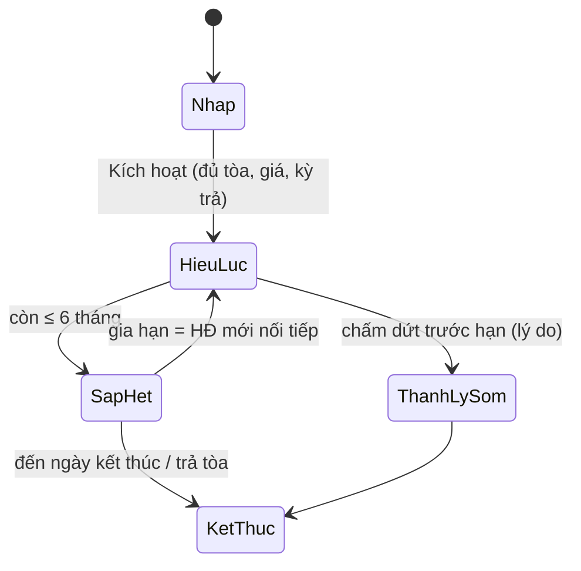
Trạng thái kỳ thanh toán: `Chưa đến hạn` → `Sắp đến hạn` (≤ 15 ngày) → `Đã trả` / `Trả một phần` / `Quá hạn`.

### 2.2.8 Flow
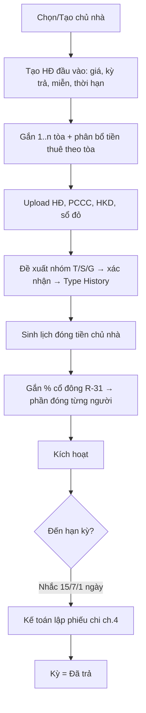
Ngoại lệ: trả một phần → kỳ `Trả một phần`, phần còn lại giữ hạn cũ; HĐ nhiều tòa mà tổng phân bổ ≠ tiền thuê → chặn kích hoạt.

### 2.2.9 Liên kết
| Module | Đọc/Ghi |
|---|---|
| M-2.03 Tòa | Ghi nhóm T/S/G, HKD, PCCC, ngày bắt đầu vận hành; tòa đọc HĐ hiện tại |
| Chương 4 Tiền thuê nhà | Đọc lịch thanh toán → `HEAD_LEASE_COST` basis **CF** (ghi theo tháng hợp đồng, tháng miễn = 0) và `HEAD_LEASE_COST_AC` basis **AC** thẳng hàng (R-27); HĐ nhiều tòa chia theo P-15; thời hạn còn lại → khấu hao cải tạo R-28 |
| Chương 4 Cổ đông | Đọc phần đóng theo % (R-31); phụ lục góp vốn 3 bên là nguồn khai báo cổ đông ban đầu |
| Chương 5 | `HEAD_LEASE_COST` (CF/AC), `RENT_REVENUE_OVER_HEAD_LEASE` dùng tiền thuê 1 tháng (F-30); bảng cổ phần Vốn = % × tiền thuê 1 tháng (F-26) |

### 2.2.10 Audit / Notification
Audit: tạo/kích hoạt/sửa giá/sửa lịch/đổi nhóm/đổi HKD/kết thúc (ai, khi nào, giá trị cũ–mới). Notification: nhắc hạn kỳ trả (BR-2.02.5); HĐ còn ≤ 6 tháng → admin.

### 2.2.11 Nghiệm thu
- Tạo HĐ 60 tháng, 114tr, trả 3 tháng/lần, miễn 1 tháng → lịch 20 kỳ, kỳ 1 = 228.000.000, hạn 10/10/2026.
- HĐ gắn 3 tòa S19A/B/C, phân bổ tổng đúng 100% tiền thuê; báo cáo tòa đọc đúng phần của mình.
- Tòa G1 có 2 HĐ nối tiếp không chồng ngày; báo cáo tháng thuộc HĐ nào lấy tiền thuê HĐ đó.
- Nhắc hạn gửi đúng 15/7/1 ngày; cổ đông 40% thấy phần đóng 91.200.000 kỳ 1.

---

## 2.3 M-2.03 Tòa nhà

### 2.3.1 Mục tiêu
Master tòa (D-01): nhóm T/S/G + hạng L1–L3 có lịch sử (D-02, D-59), địa chỉ, đặc điểm, ĐK kinh doanh, tài khoản nhận tiền mặc định (R-12), công tơ tổng `000<tòa>` (D-03) và công tơ khu vực chung "điện vệ sinh chung" (D-18), ngày chốt chỉ số (R-11); nhân sự phụ trách **đọc từ phân công** (R-33); hiển thị hiệu suất/lợi nhuận tháng gần nhất từ báo cáo (X-07 — không định nghĩa công thức ở đây).

### 2.3.2 Tác nhân
Admin/Kế toán: tạo/sửa, đổi tài khoản nhận, đổi nhóm/hạng. TPVH/Trưởng khu vực: xem toàn bộ, sửa đặc điểm. NVVH: xem tòa được phân công, cập nhật ghi chú/ảnh. Kỹ thuật/Vệ sinh: xem tòa được phân công (chỉ đọc).

### 2.3.3 Dữ liệu
Entity `BUILDING`, `BUILDING_TYPE_HISTORY`, `METER` (common), `BUILDING_ASSIGNMENT` (đọc).

| Trường | Cột sổ Excel | Ghi chú |
|---|---|---|
| Mã tòa (`T17`, `S19A`, `G1`) | B | D-01; khóa chính nghiệp vụ, không đổi sau khi có HĐ thuê |
| Tên, Địa chỉ, Khu vực, Số tầng, Số phòng | | Số phòng = đếm M-2.04 |
| Nhóm T/S/G hiện tại + lịch sử (từ ngày) | Sheet NHÀ T / NHÀ S / NHÀ G | D-02; nghĩa → P-04 |
| Hạng L1/L2/L3 hiện tại + lịch sử | Dòng 3 sheet BC DT | D-59 (cũ/trung bình/mới) |
| Chủ nhà, HĐ đầu vào hiện tại | | Đọc M-2.02 |
| Đã ĐK kinh doanh (HKD), PCCC | | Đọc M-2.02 |
| Đặc điểm: thang máy, máy giặt chung, chỗ sạc xe điện, camera, bảo vệ | | Quyết định dịch vụ áp dụng (M-2.07) |
| Tài khoản nhận tiền mặc định | Sheet `HĐ (VP-HẰNG)` / `HĐ (VP)` / `HĐ (TECH)` / `HĐ G1 (TECH)` | R-12; chọn mẫu in hóa đơn |
| Ngày chốt chỉ số | Hóa đơn "Ngày chốt số liệu 22/08/2026" | Mặc định 22, R-11 |
| Công tơ **tổng** tòa `000<tòa>` (đơn giá gốc, có Tổng đã đóng) | Dòng `000G1`, `000G6` sheet NHÀ G | D-03; đơn giá riêng (000G1 3.500, 000G6 2.700) = giá EVN để đối chiếu sản lượng tòa với hóa đơn NCC / giá gốc (D-37), thống kê thất thoát; **không** lập hóa đơn khách, **không** chia cho phòng |
| Công tơ **khu vực chung** ("điện vệ sinh chung", 3.800/kWh) + Đơn giá điện chung/người (tháng) | CB–CH | D-18: chia theo số người → dòng 12 hóa đơn; là công tơ khác `000<tòa>` |
| Trạng thái khai thác, Ngày bắt đầu vận hành | | Tòa mới → lương 100k (R-21, P-08) |
| Quản lý phụ trách chính / phối hợp / kỹ thuật / vệ sinh (hiện tại & sắp tới) | D (Quản lý) | **Đọc** từ BUILDING_ASSIGNMENT (R-33), không lưu manager_id |
| Hiệu suất %, Lợi nhuận ròng, Thời gian vận hành (tháng gần nhất) | | Đọc `REPORT_SNAPSHOT` kỳ Locked gần nhất (X-07) |
| Thống kê: phòng đang thuê / trống 3 loại / sắp hết HĐ / công nợ | | Suy ra |

### 2.3.4 Search / Filter
Mã/tên · Nhóm T/S/G · Hạng L1–L3 · Khu vực · Trưởng nhóm / Quản lý (qua phân công) · Tài khoản nhận · Trạng thái khai thác · Có công tơ chung · HKD/PCCC (R-34: mọi màn hình lọc khu vực/trưởng nhóm/quản lý/tòa/loại nhà).

### 2.3.5 Action
Tạo/sửa tòa · Đổi nhóm T/S/G, hạng L (ghi lịch sử) · Đổi tài khoản nhận mặc định (từ ngày) · Cấu hình ngày chốt · Tạo công tơ tổng `000<tòa>` / công tơ khu vực chung · Thêm/import phòng · Mở màn phân công (chương 3) · Xem HĐ đầu vào / khách / HĐ / hóa đơn / công nợ / chi phí · Xem giá dịch vụ override · Export.

### 2.3.6 Business Rule
- **BR-2.03.1** Quản lý tòa là người có phân công `Phụ trách chính` hiệu lực tại ngày xem; tòa không lưu trường quản lý độc lập (R-33). [Đã chốt]
- **BR-2.03.2** Nhóm T/S/G và hạng L1–L3 là 2 thuộc tính riêng, mỗi loại có lịch sử ngày hiệu lực; báo cáo kỳ nào dùng giá trị hiệu lực ngày cuối kỳ đó (D-02, D-59, P-04). [Đã chốt một phần]
- **BR-2.03.3** Mã tòa phải khớp ký hiệu nhóm (chữ đầu T/S/G) tại thời điểm tạo; đổi nhóm sau đó không đổi mã (mã là khóa mã phòng D-03). [Cần chốt]
- **BR-2.03.4** Mỗi tòa có đúng 1 tài khoản nhận tiền mặc định có ngày hiệu lực; hóa đơn phát hành snapshot tài khoản tại ngày phát hành (R-12). [Có bằng chứng nguồn]
- **BR-2.03.5** Tòa có 2 loại công tơ ngoài phòng: (a) công tơ **tổng** mã `000<tòa>` — sản lượng × đơn giá gốc EVN (3.500 / 2.700) dùng đối chiếu với hóa đơn NCC / `ELECTRIC_INPUT_COST` và thống kê thất thoát, không tạo hóa đơn phòng, không chia cho khách (D-03); (b) công tơ **khu vực chung** ("điện vệ sinh chung", 3.800/kWh) — chia theo số người thành dòng 12 hóa đơn (D-18). Hai công tơ là 2 METER khác nhau, không gộp. [Có bằng chứng nguồn]
- **BR-2.03.6** Ngày chốt chỉ số mặc định 22, cấu hình theo tòa; đổi ngày chốt chỉ áp dụng kỳ chưa chốt (R-11). [Cần chốt]
- **BR-2.03.7** Hiệu suất/lợi nhuận trên màn Tòa chỉ hiển thị từ báo cáo tháng gần nhất đã khóa, kèm nhãn kỳ; không tính realtime (X-07). [Đã chốt]
- **BR-2.03.8** Tòa chuyển `Ngừng khai thác` chỉ khi không còn HĐ thuê hiệu lực và HĐ đầu vào đã kết thúc; tòa ngừng không tính vào N phân bổ (R-26, P-05). [Cần chốt]
- **BR-2.03.9** Đặc điểm "không thang máy" → dịch vụ thang máy không được thêm vào HĐ của tòa (validation M-2.07). [Cần chốt]
- **BR-2.03.10** Không xóa tòa đã có phòng/HĐ; chỉ ngừng khai thác. [Đã chốt]

### 2.3.7 State / Status
`Chuẩn bị` (đã ký HĐ đầu vào, đang cải tạo) → `Đang khai thác` (ngày bắt đầu vận hành) → `Ngừng khai thác` (trả chủ nhà). Tòa `Chuẩn bị`/`Đang khai thác` mới cho tạo HĐ thuê.

### 2.3.8 Flow
1. Tạo tòa từ HĐ đầu vào (M-2.02) hoặc trực tiếp. 2. Chọn nhóm T/S/G, hạng L, tài khoản nhận, ngày chốt. 3. Tạo công tơ chung. 4. Import phòng (M-2.04). 5. Phân công quản lý (chương 3). 6. Đặt `Đang khai thác`. Ngoại lệ: tòa chưa có phụ trách chính → cảnh báo, hóa đơn vẫn lập nhưng hiệu suất không gán được (chương 3).

### 2.3.9 Liên kết
| Module | Đọc/Ghi |
|---|---|
| M-2.02 | Đọc HĐ đầu vào, HKD, PCCC, nhóm T/S/G đề xuất |
| M-2.04, M-2.07, M-2.08, M-2.09 | Cung cấp phòng, override giá, công tơ chung, tài khoản nhận, ngày chốt |
| Chương 3 | Đọc phân công (R-33); số phòng tòa → lương HS (R-21), lương trưởng nhóm (R-22) |
| Chương 4 | Số phòng tòa `n` cho phân bổ (R-26); tòa mới 100k (P-08) |
| Chương 5 | Chiều tòa → nhóm T/S/G (Report B); hiển thị ngược `NET_PROFIT`, hiệu suất tháng gần nhất (X-07) |

### 2.3.10 Audit / Notification
Audit đổi nhóm/hạng/tài khoản nhận/ngày chốt/trạng thái khai thác. Cảnh báo: tòa không có phụ trách chính; PCCC = Không; HĐ đầu vào ≤ 6 tháng.

### 2.3.11 Nghiệm thu
- Tòa G1 đổi hạng L2 → L3 từ 01/09/2026: báo cáo 08/2026 vẫn L2, 09/2026 là L3.
- Màn tòa hiển thị đúng quản lý theo phân công có hiệu lực; đổi phân công giữa tháng hiển thị "sắp tới".
- Tòa T17 tài khoản VP-Hằng → hóa đơn in mẫu VP-Hằng; G1 → mẫu G1 TECH.
- Dòng 000G1 tồn tại (công tơ tổng, 3.500/kWh), không sinh hóa đơn phòng, không chia điện chung; công tơ khu vực chung G1 (3.800/kWh) chia theo người thành dòng 12 hóa đơn.

---

## 2.4 M-2.04 Phòng

### 2.4.1 Mục tiêu
Master phòng với **3 lớp giá** (D-10 niêm yết, D-11 QL, D-12 hiện tại), sức chứa/số người, nội thất bàn giao, công tơ, trạng thái có lịch sử (`ROOM_STATUS_HISTORY`) — nguồn đếm `VACANT_ROOM_COUNT` 3 loại (D-24, R-06) và `DT niêm yết` (D-45).

### 2.4.2 Tác nhân
Admin/Kế toán: tạo/import, sửa giá niêm yết & giá QL. TPVH/TNVH: duyệt giá chốt dưới giá QL, đổi giá niêm yết trong thẩm quyền. NVVH: cập nhật trạng thái (Chờ dọn → Sẵn sàng), nội thất, ảnh, ghi chú. Kỹ thuật/Vệ sinh: cập nhật Bảo trì/Chờ dọn của tòa được phân công.

### 2.4.3 Dữ liệu
Entity `ROOM`, `ROOM_STATUS_HISTORY`, `METER`, `CONTRACT_HANDOVER_ASSET` (mẫu mặc định theo phòng).

| Trường | Cột sổ Excel | Ghi chú |
|---|---|---|
| Mã phòng (`101T17`, `401S4A`) | A | D-03; = số phòng + mã tòa; không cắt chuỗi, lưu 2 trường riêng |
| Tòa, Số phòng, Tầng | B, C | |
| Loại phòng, Diện tích, Hướng | | |
| Giá niêm yết + lịch sử | G | D-10 — mẫu số hiệu suất (D-45) |
| Giá QL + lịch sử | H | D-11 — sàn tự chốt |
| Giá hiện tại | I | D-12 — **đọc từ HĐ hiệu lực**, không nhập ở phòng |
| Sức chứa (tối đa), Số người hiện tại | O | D-15 (số người từ HĐ) |
| Nội thất bàn giao mặc định | BD | Mẫu để copy vào HĐ (CONTRACT_HANDOVER_ASSET) |
| Công tơ điện, công tơ nước (có/không) | P–T, U–Y | Không có đồng hồ nước → nước tính theo người (R-14) |
| Trạng thái + lịch sử (từ–đến, lý do, người) | | ROOM_STATUS_HISTORY |
| Ngày sẵn sàng dự kiến | | Khi Chờ dọn/Bảo trì |
| Ngày trống từ | | Tính thất thoát điện phòng trống (M-2.08) |
| Ghi chú, Ảnh | | |

Ví dụ sổ T9: `101T17` niêm yết 3.800.000 · QL 3.600.000 · hiện tại 3.600.000 · 1 người; `101S19A` niêm yết 4.200.000 · QL 3.600.000 · hiện tại 3.600.000 · 3 người.

### 2.4.4 Search / Filter
Tòa · Nhóm T/S/G · Quản lý · Trạng thái (đa chọn) · Loại trống (ở luôn / hết tháng / đang chờ) · Khoảng giá niêm yết · Số người · Có đồng hồ nước · Sắp trống trong N ngày · Trống quá N ngày.

### 2.4.5 Action
Tạo · Sửa · Import nhiều phòng (Excel: mã, tòa, số phòng, tầng, giá niêm yết, giá QL, sức chứa) · Bulk update (giá niêm yết/QL theo tòa, nội thất mặc định) · Chuyển trạng thái (có lý do) · Xem HĐ hiện tại / lịch sử khách / chỉ số / hóa đơn / công nợ · Export theo filter.

### 2.4.6 Business Rule
- **BR-2.04.1** Mã phòng duy nhất toàn hệ thống; sinh từ `số phòng + mã tòa`, ngoại lệ có chữ (`401S4A`) nhập tay và giữ nguyên (D-03). [Có bằng chứng nguồn]
- **BR-2.04.2** Giá hiện tại của phòng luôn = giá chốt của HĐ hiệu lực (D-12); phòng không có HĐ → giá hiện tại trống. [Đã chốt]
- **BR-2.04.3** Giá chốt trên HĐ < Giá QL → bắt buộc duyệt TNVH/TPVH trước khi kích hoạt HĐ (D-11). [Cần chốt]
- **BR-2.04.4** Đổi giá niêm yết có ngày hiệu lực, giữ lịch sử; DT niêm yết (D-45) của kỳ dùng giá hiệu lực ngày cuối kỳ. [Cần chốt]
- **BR-2.04.5** Một phòng không có 2 HĐ hiệu lực chồng ngày; `Đang thuê` chỉ do kích hoạt HĐ đặt, không đặt tay. [Đã chốt]
- **BR-2.04.6** Hoàn cọc/kết thúc HĐ **không** tự chuyển phòng về `Sẵn sàng`; phải qua `Chờ dọn` → nghiệm thu (R-17). [Đã chốt]
- **BR-2.04.7** `Giữ chỗ` chỉ tạo khi có DEPOSIT_LEDGER(collect) của HĐ Nháp/Chờ ký; hủy giữ → cọc xử lý theo D-27/R-05 (bỏ cọc) hoặc hoàn nếu lỗi công ty. [Cần chốt]
- **BR-2.04.8** `Trống hết tháng` = phòng Đang thuê có HĐ kết thúc ≤ ngày cuối tháng và quản lý đã xác nhận "Kết thúc" ở Work Queue (R-15); dùng để đếm loại 2 của D-24. [Đã chốt]
- **BR-2.04.9** `VACANT_ROOM_COUNT` cuối tháng = phòng có trạng thái ∈ {Sẵn sàng, Chờ dọn, Bảo trì} (trống ở luôn) + {Trống hết tháng} + {Giữ chỗ} (đang chờ), đếm theo tòa rồi cộng (D-24, R-06). [Đã chốt một phần]
- **BR-2.04.10** ROOM_STATUS_HISTORY là nguồn duy nhất cho occupancy/vacancy; mọi chuyển trạng thái ghi từ–đến, lý do, người. [Đã chốt]
- **BR-2.04.11** Số người hiện tại của phòng = `occupant_count` HĐ hiệu lực; vượt sức chứa → cảnh báo, không chặn (phụ thu thêm người ghi Thu khác D-17). [Cần chốt]
- **BR-2.04.12** Phòng `Ngừng khai thác` không tính vào N phân bổ (R-26) và không tính trống. [Cần chốt]
- **BR-2.04.13** Số phòng tòa dùng cho lương/phân bổ = phòng không ở trạng thái Ngừng khai thác tại ngày cuối tháng (kể cả trống) (P-05). [Cần chốt]

### 2.4.7 State / Status
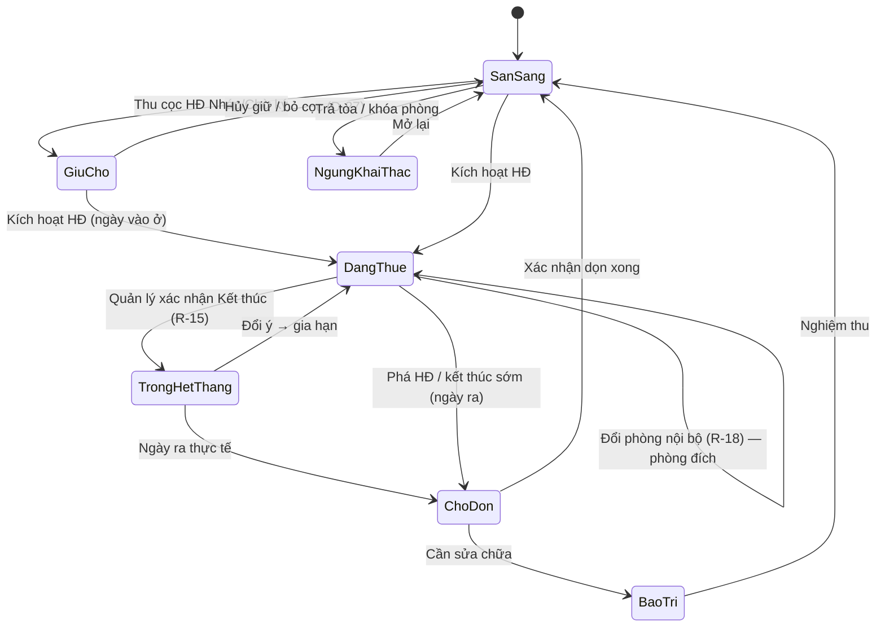
Bảng đối chiếu D-24: **trống ở luôn** = Sẵn sàng / Chờ dọn / Bảo trì; **trống hết tháng** = Trống hết tháng; **đang chờ** = Giữ chỗ.

### 2.4.8 Flow
Chính: Import phòng → gán công tơ → Sẵn sàng → (HĐ) Đang thuê → … → Chờ dọn → Sẵn sàng. Ngoại lệ: HĐ kết thúc nhưng khách chưa bàn giao → giữ Đang thuê, cảnh báo "quá ngày kết thúc"; phòng Bảo trì > 15 ngày → cảnh báo TPVH.

### 2.4.9 Liên kết
| Module | Đọc/Ghi |
|---|---|
| M-2.06 | Ghi Đang thuê/Giữ chỗ; đọc giá niêm yết/QL để validate giá chốt; copy nội thất mặc định |
| M-2.08 | Công tơ phòng; ngày trống từ → điện phòng trống |
| M-2.12, M-2.13 | Ghi Trống hết tháng / Chờ dọn / Sẵn sàng |
| Chương 3 | Σ giá niêm yết phòng đang thuê → DT niêm yết (D-45); số phòng tòa → lương HS |
| Chương 4 | N, n phân bổ (R-26, P-05) |
| Chương 5 | `VACANT_ROOM_COUNT` (đếm, cả CF/AC) từ ROOM_STATUS_HISTORY ngày cuối kỳ; drill-down danh sách phòng trống 3 loại |

### 2.4.10 Audit / Notification
Audit đổi giá (3 lớp), đổi trạng thái, import batch. Cảnh báo: phòng trống > 30 ngày; Chờ dọn > 3 ngày; giá chốt < giá QL chờ duyệt.

### 2.4.11 Nghiệm thu
- Import 50 phòng tòa T17 đúng mã, giá; trùng mã bị từ chối.
- Chuỗi trạng thái đầy đủ cho 1 phòng: Sẵn sàng → Giữ chỗ → Đang thuê → Trống hết tháng → Chờ dọn → Sẵn sàng có lịch sử.
- Cuối tháng 9/2026 đếm trống 3 loại theo tòa khớp sổ (ví dụ `304G4` Trống ở BÁO CÁO CHECK THU TIỀN).
- HĐ giá 3.400.000 khi giá QL 3.600.000 → chờ duyệt.

---

## 2.5 M-2.05 Khách thuê

### 2.5.1 Mục tiêu
Hồ sơ khách đứng tên (D-04), người ở cùng, xe (không giới hạn, liên kết phí gửi xe), nghề nghiệp → phân khúc, trạng thái nghiệp vụ, liên kết Zalo; hỗ trợ bulk update/export theo quyền.

### 2.5.2 Tác nhân
NVVH: tạo/sửa khách tòa mình, thêm người ở cùng/xe, liên kết Zalo. TNVH/TPVH: xem toàn team, bulk update. Admin/Kế toán: toàn quyền, merge trùng, export cột nhạy cảm (CCCD).

### 2.5.3 Dữ liệu
Entity `CUSTOMER`, `CONTRACT_TENANT`, `CONTRACT_VEHICLE`.

| Trường | Cột sổ Excel | Ghi chú |
|---|---|---|
| Mã khách `606T42A001` | Mẫu in `Mã KH` (=CONCATENATE(phòng,"A001")) | D-04; sinh khi HĐ mới của phòng; đổi phòng nội bộ giữ số |
| Họ tên, SĐT (chuẩn hóa), CCCD, ngày sinh, giới tính | DS phá HĐ: SĐT | Khóa match OCR: CCCD → SĐT → tên+ngày sinh |
| Địa chỉ thường trú, liên hệ khẩn cấp | | |
| Nghề nghiệp → Phân khúc | | Danh mục: Sinh viên / Đi làm / Thợ – công trình / Gia đình / Khác; phân khúc suy ra từ nghề, sửa được |
| Người ở cùng (n): tên, SĐT, CCCD, quan hệ, từ–đến | | CONTRACT_TENANT; Σ = số người D-15 |
| Xe (n): loại (xe máy / xe đạp điện / xe máy điện / ô tô), biển số, màu, dịch vụ gửi xe gắn | AI–AK (XE ĐIỆN) | CONTRACT_VEHICLE; mỗi xe map 1 dịch vụ M-2.07 |
| Trạng thái khách | | Danh mục cấu hình; mặc định: Đang thuê / Sắp hết HĐ / Phá HĐ / Hoàn cọc / Đã rời |
| Cờ suy ra: Có HĐ hiệu lực, Có công nợ, Chờ hoàn cọc, Đã liên kết Zalo | | Không nhập tay |
| Zalo: ZaloID/số đã follow OA, ngày liên kết, trạng thái | | R-35 |
| Tài liệu: ảnh CCCD, giấy tạm trú | | |

### 2.5.4 Search / Filter
Tên/SĐT/CCCD · Mã khách · Tòa/phòng · Quản lý / trưởng nhóm / khu vực · Trạng thái · Phân khúc · Có HĐ hiệu lực · Có công nợ · Sắp hết HĐ ≤ 35 ngày · Có Zalo · Đứng tên / ở cùng · Có xe (loại).

### 2.5.5 Action
Tạo/sửa · Xem chi tiết (HĐ, hóa đơn, payment, công nợ, cọc) · Gắn vào HĐ · Thêm người ở cùng · Thêm/xóa xe · Liên kết Zalo · Cập nhật trạng thái · **Bulk update trạng thái** (preview số bản ghi → xác nhận → audit batch) · Merge trùng · Export selected / **Export toàn bộ kết quả filter**.

### 2.5.6 Business Rule
- **BR-2.05.1** Mã khách = mã phòng + `A` + số thứ tự 3 chữ số; số thứ tự = số HĐ mới đã từng có của phòng + 1; sinh khi HĐ chuyển `Chờ ký` (D-04). [Có bằng chứng nguồn / Cần chốt thời điểm sinh → P-24]
- **BR-2.05.2** Đổi phòng nội bộ (R-18) → khách nhận mã mới theo phòng đích nhưng giữ số thứ tự, mã cũ lưu lịch sử. [Cần chốt → P-24]
- **BR-2.05.3** Gia hạn (R-15) giữ nguyên mã khách. [Đã chốt]
- **BR-2.05.4** Trùng CCCD → chặn tạo mới, đề xuất dùng bản ghi cũ; trùng SĐT → cảnh báo. [Đã chốt]
- **BR-2.05.5** Số người của HĐ = 1 (đứng tên) + số người ở cùng đang hiệu lực; thay đổi người ở cùng giữa kỳ áp dụng từ kỳ hóa đơn kế tiếp (D-15). [Cần chốt]
- **BR-2.05.6** Xe không giới hạn số lượng; mỗi xe gắn 1 dịch vụ gửi xe (xe máy / xe điện / xe điện Xanh SM…) → sinh dòng dịch vụ số lượng = số xe cùng loại. [Đã chốt]
- **BR-2.05.7** Trạng thái khách là danh mục cấu hình; các trạng thái `Sắp hết HĐ`, `Phá HĐ`, `Hoàn cọc` được hệ thống đề xuất từ sự kiện HĐ (M-2.12/M-2.13), người dùng có thể ghi đè có lý do. [Cần chốt]
- **BR-2.05.8** Bulk update giới hạn theo phạm vi dữ liệu của người thao tác; ghi audit batch + từng khách. [Đã chốt]
- **BR-2.05.9** Export không gồm CCCD/ngày sinh nếu vai trò không có quyền; lưu điều kiện lọc, thời điểm, người export. [Đã chốt]
- **BR-2.05.10** Merge 2 khách: giữ ID đích, chuyển toàn bộ HĐ/payment/cọc, không xóa nguồn (đánh dấu merged). [Cần chốt]
- **BR-2.05.11** Liên kết Zalo 1 khách ↔ 1 ZaloID; khách chưa liên kết được gắn cờ để M-2.14 dùng phương án dự phòng (R-35). [Đã chốt]

### 2.5.7 State / Status
`Đang thuê` (có HĐ hiệu lực) → `Sắp hết HĐ` (≤ 35 ngày) → `Hoàn cọc` (HĐ Chờ quyết toán) → `Đã rời`; `Đang thuê`/`Sắp hết HĐ` → `Phá HĐ` (CONTRACT_EVENT early_termination) → `Hoàn cọc`/`Đã rời`. Gia hạn: `Sắp hết HĐ` → `Đang thuê`.

### 2.5.8 Flow
Tạo khách (tay hoặc OCR M-2.06) → gắn HĐ → thêm người ở cùng, xe → liên kết Zalo → trạng thái tự đề xuất theo HĐ. Ngoại lệ: khách cũ quay lại thuê phòng khác → dùng lại CUSTOMER, mã khách mới theo phòng mới.

### 2.5.9 Liên kết
| Module | Đọc/Ghi |
|---|---|
| M-2.06 | Ghi/link CUSTOMER từ OCR; đọc số người, xe → CONTRACT_SERVICE |
| M-2.09 | Số người → nước/vệ sinh/máy giặt/combo/điện chung; số xe → gửi xe |
| M-2.12, M-2.13 | Đề xuất trạng thái; SĐT vào DS phòng phá HĐ |
| M-2.14 | ZaloID, cờ liên kết |
| Chương 5 | Không có metric trực tiếp; drill-down hóa đơn/payment về khách |

### 2.5.10 Audit / Notification
Audit tạo/sửa/merge/bulk/export/liên kết Zalo. Cảnh báo: khách có công nợ > 5 ngày (M-2.11); khách chưa liên kết Zalo khi HĐ kích hoạt.

### 2.5.11 Nghiệm thu
- Phòng 204S12 khách thứ nhất → `204S12A001`; khách thứ hai → `204S12A002`; gia hạn giữ mã.
- Thêm 3 xe (2 xe máy, 1 xe đạp điện) → dịch vụ gửi xe SL 2 + xe điện SL 1 trên HĐ.
- Bulk update 120 khách `Sắp hết HĐ` có preview và audit batch.
- Export của NVVH không có cột CCCD.

---

## 2.6 M-2.06 Hợp đồng thuê & OCR

### 2.6.1 Mục tiêu
Quản lý HĐ thuê phòng: dữ liệu HĐ, **phiên bản** gia hạn (`CONTRACT_VERSION`), **sự kiện** vòng đời (`CONTRACT_EVENT`: new / renew / transfer / end / early_termination / abandon), snapshot giá dịch vụ (R-14, R-36), cọc phải thu, chỉ số đầu kỳ; tạo tay hoặc từ **OCR → Data Onboarding** (spec §12.8, tóm tắt). Là nguồn của `NEW_ROOM_COUNT`, `EARLY_TERMINATION_COUNT`, giá hiện tại D-12, số người D-15.

### 2.6.2 Tác nhân
NVVH: tạo nháp/OCR, review, gửi duyệt, thêm người ở cùng/dịch vụ. TNVH/TPVH: duyệt giá dưới giá QL, kích hoạt. Admin/Kế toán: sửa HĐ hiệu lực có audit, hủy, điều chỉnh cọc. Khách: ký (ngoài hệ thống, upload bản scan).

### 2.6.3 Dữ liệu
Entity `CONTRACT`, `CONTRACT_VERSION`, `CONTRACT_EVENT`, `CONTRACT_TENANT`, `CONTRACT_SERVICE`, `CONTRACT_VEHICLE`, `CONTRACT_HANDOVER_ASSET`, `CONTRACT_PAYMENT_TERM`, `CONTRACT_RENEWAL_CLAUSE`, `DEPOSIT_LEDGER`, `METER_READING(OPENING)`, `DOCUMENT`, OCR: `OCR_JOB`, `OCR_FIELD`.

**CONTRACT (đầu HĐ, bất biến qua các phiên bản)**

| Trường | Cột sổ Excel | Ghi chú |
|---|---|---|
| Số HĐ, Loại (thuê ở / thuê kinh doanh) | | |
| Tòa, Phòng, Mã khách | A, B, C; Mẫu in `Mã KH` | D-03, D-04 |
| Khách đứng tên, Người ở cùng (n) | O (Số người) | D-15 |
| Ngày vào ở (move_in), Ngày tính tiền | BA (NGÀY VÀO Ở) | D-23: phòng mới nếu trong tháng |
| Trạng thái, Phiên bản hiện hành | | |
| HĐ trước (nếu là gia hạn nối tiếp), HĐ sau | | |
| Nguồn tạo: Tay / OCR (OCR_JOB id) | | |

**CONTRACT_VERSION (1 dòng = 1 lần ký/gia hạn)**

| Trường | Cột sổ Excel | Ghi chú |
|---|---|---|
| Số phiên bản, Loại (new / renew) | | Phiên bản 1 = ký mới |
| Ngày ký, Từ ngày, Đến ngày, Thời hạn (tháng) | BB (THỜI HẠN "12th"), BC (NGÀY HẾT HẠN) | |
| Giá niêm yết snapshot, Giá QL snapshot, **Giá chốt** | G, H, I | D-10/11/12; D-54 cho hoa hồng |
| Kỳ TT (1/2/3 tháng) | E | D-13 |
| Cọc phải thu, Cọc đã thu (đọc DEPOSIT_LEDGER) | F (cọc khách cũ), J (cọc mới) | D-22 |
| Danh sách dịch vụ + đơn giá snapshot + số lượng + cách tính | P–AT | R-14 "mỗi HĐ 1 loại giá" |
| Xe (n) | AI–AK | |
| Nội thất bàn giao (dòng: tên, SL, tình trạng) | BD | |
| Điều khoản thanh toán: ngày thông báo, hạn 25–cuối tháng, STK nhận, nội dung CK = mã phòng, phạt chậm | Mẫu in dòng "Nội dung chuyển khoản" | R-12, R-13 |
| Điều khoản gia hạn: tự gia hạn (tháng), báo trước (ngày), raw clause | | Chỉ tạo Work Queue, không tự gia hạn |
| File HĐ (scan), phụ lục | | |

**CONTRACT_EVENT (sự kiện đếm báo cáo)**

| Loại | Ngày sự kiện | Ảnh hưởng đếm | Ghi chú |
|---|---|---|---|
| `new` | Ngày vào ở | `NEW_ROOM_COUNT` +1 tại tháng vào ở (D-23) | Sheet PHÒNG MỚI THÁNG x |
| `renew` | Ngày hiệu lực phiên bản mới | Không đếm | D-28 |
| `transfer` | Ngày đổi phòng | Không đếm phòng mới/phá HĐ | D-26, R-18 |
| `end` | Ngày ra thực tế | Không đếm | Hết hạn đúng ngày / khách báo trước |
| `early_termination` | Ngày ra thực tế (hoặc ngày phát hiện bỏ trốn) | `EARLY_TERMINATION_COUNT` +1 tại tháng có ngày ra (D-25) | Lý do chuẩn (M-2.12) |
| `abandon` | Ngày báo bỏ | Không đếm phòng mới nếu chưa vào ở; cọc forfeit (D-27, D-31) | HĐ Nháp/Chờ ký → Hủy |

**OCR (tóm tắt spec §12.8)**: `OCR_JOB` (file, hash, engine, idempotency key, trạng thái UPLOADED → PROCESSING → READY_FOR_REVIEW → REVIEWING → VALIDATED → COMMITTED; lỗi FAILED / COMMIT_FAILED); `OCR_FIELD` (field path, entity group, raw, normalized, confidence, trang/bbox, candidate hệ thống, match score, quyết định **Create / Link / Update / Ignore**, người review, giá trị cuối). Nhóm entity review: Khách hàng · Tòa · Phòng · HĐ · Người ở · Dịch vụ & giá · Cọc · Xe · Điện/Nước đầu kỳ · Tài sản bàn giao · Điều khoản thanh toán · Gia hạn/Báo trước · Tài liệu.

### 2.6.4 Search / Filter
Số HĐ · Mã khách · Tòa/phòng · Quản lý / trưởng nhóm / khu vực · Trạng thái · Loại sự kiện gần nhất · Ngày vào ở (khoảng) · Ngày hết hạn (khoảng) · Sắp hết ≤ 35 ngày · Kỳ TT · Giá chốt < giá QL · Nguồn tạo OCR/Tay · OCR job trạng thái.

### 2.6.5 Action
Tạo tay · Upload OCR → Review → Xác nhận tạo HĐ (commit) · Sửa nháp · Gửi ký (in HĐ) · Kích hoạt · Thêm/sửa người ở cùng, dịch vụ, xe, nội thất · Ghi chỉ số đầu kỳ · Gia hạn (tạo phiên bản) · Đổi phòng · Xác nhận trả phòng / Chấm dứt sớm / Bỏ cọc (mở M-2.12, M-2.13) · Xem hóa đơn/công nợ/cọc · Download/Export · Xem lịch sử phiên bản & sự kiện.

### 2.6.6 Business Rule
- **BR-2.06.1** Một phòng không có 2 HĐ hiệu lực chồng ngày; kích hoạt bị chặn nếu phòng không ở Sẵn sàng/Giữ chỗ hoặc còn HĐ hiệu lực. [Đã chốt]
- **BR-2.06.2** Kích hoạt yêu cầu: khách đứng tên, giá chốt, kỳ TT, ngày vào ở, cọc phải thu, ≥ 1 dịch vụ điện, chỉ số đầu kỳ điện (và nước nếu có đồng hồ), file HĐ ký. [Cần chốt]
- **BR-2.06.3** Đơn giá dịch vụ **snapshot** vào CONTRACT_SERVICE tại kích hoạt (ưu tiên: giá theo HĐ/OCR → override tòa → mặc định hệ thống); đổi bảng giá sau đó không đổi HĐ đang hiệu lực (R-14). [Có bằng chứng nguồn]
- **BR-2.06.4** Gia hạn tạo `CONTRACT_VERSION` mới nối tiếp (từ ngày = ngày kết thúc cũ + 1), được đổi thời hạn/giá/điều khoản/dịch vụ; giữ mã khách và số dư cọc; không ghi đè phiên bản cũ (R-15, D-28). [Đã chốt]
- **BR-2.06.5** Cọc phải thu mặc định = giá chốt × 1 tháng; được sửa; HĐ chỉ kích hoạt khi cọc đã thu ≥ cọc phải thu hoặc TPVH duyệt "thiếu cọc" có hạn bổ sung (ghi chú sổ "thiếu cọc"). [Cần chốt]
- **BR-2.06.6** Sự kiện `new` ghi ngày vào ở; `NEW_ROOM_COUNT` đếm HĐ có move_in trong kỳ, kể cả phòng cũ có khách mới; không đếm renew/transfer (D-23, R-06). [Cần chốt]
- **BR-2.06.7** Tiền phòng tháng đầu của khách vào giữa tháng = giá chốt ÷ 30 × số ngày ở (R-10, P-03); ghi vào hóa đơn đầu (sheet PHÒNG MỚI: `=(giá/30)×ngày`). [Có bằng chứng nguồn / Cần chốt P-03]
- **BR-2.06.8** OCR không tự CREATE mọi entity; tòa/phòng/khách đã tồn tại phải đề xuất LINK; CCCD trùng nhưng tên/SĐT khác → bắt buộc review. [Đã chốt]
- **BR-2.06.9** Cùng file (hash) hoặc cùng khách + phòng + ngày bắt đầu → không tạo HĐ trùng (idempotency). [Đã chốt]
- **BR-2.06.10** Giá dịch vụ OCR khác giá tòa → người review chọn: chỉ áp HĐ này / cập nhật giá tòa từ ngày… / bỏ qua; không tự ghi đè bảng giá tòa. [Đã chốt]
- **BR-2.06.11** Commit OCR là 1 transaction: lỗi entity bắt buộc → rollback toàn bộ; OCR không tự kích hoạt HĐ và không tự gia hạn. [Đã chốt]
- **BR-2.06.12** Chỉ số điện/nước tại ký/nhận phòng lưu `reading_type = OPENING`, là "chỉ số cũ" của kỳ chốt đầu tiên (M-2.08). [Đã chốt]
- **BR-2.06.13** Mọi trường từ OCR truy được về job → file → trang → bbox → raw → quyết định review → người review. [Đã chốt]
- **BR-2.06.14** Giá chốt < giá QL → HĐ ở `Chờ ký` cho tới khi TNVH/TPVH duyệt (D-11). [Cần chốt]
- **BR-2.06.15** HĐ `Hiệu lực` không sửa giá/kỳ TT/ngày trực tiếp; thay đổi qua phụ lục = phiên bản mới có ngày hiệu lực (audit). [Cần chốt]
- **BR-2.06.16** Đổi phòng nội bộ = sự kiện `transfer` trên cùng HĐ: phòng cũ → Chờ dọn, phòng mới → Đang thuê, cọc `transfer` theo, chỉ số OPENING mới cho phòng đích; không thu cọc mới, hoa hồng giữ nguyên (D-26, R-18). [Cần chốt]
- **BR-2.06.17** Kỳ TT > 1: hóa đơn thu `giá × kỳ TT`; số tháng đã trả trước ghi trên HĐ để kỳ sau không lập lại tiền phòng (D-13). [Có bằng chứng nguồn]
- **BR-2.06.18** Ngày kết thúc phiên bản hiện hành là nguồn Work Queue "HĐ sắp hết" (R-15); điều khoản báo trước OCR chỉ để cảnh báo. [Đã chốt]

### 2.6.7 State / Status
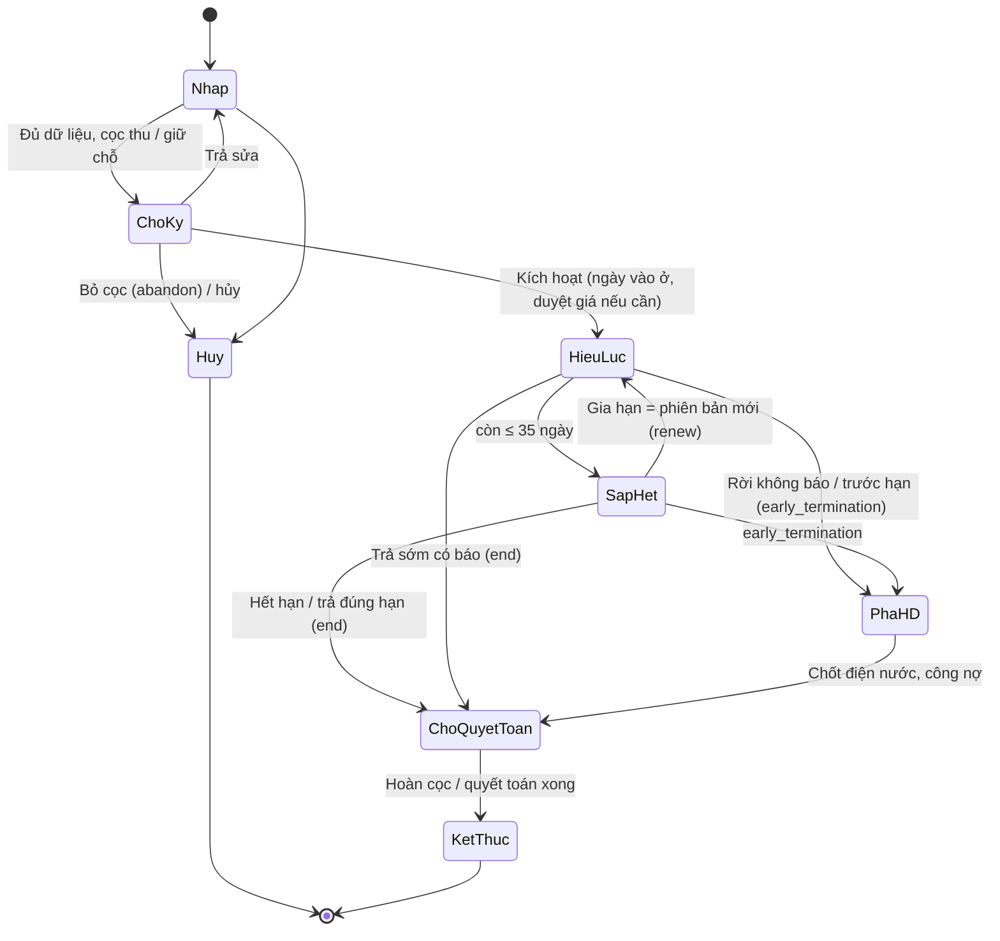
Mapping trạng thái phòng: `HieuLuc` ⇒ Đang thuê; `SapHet` + xác nhận Kết thúc ⇒ Trống hết tháng; `ChoQuyetToan` ⇒ Chờ dọn (từ ngày ra); `Huy` ⇒ Giữ chỗ → Sẵn sàng.

### 2.6.8 Flow
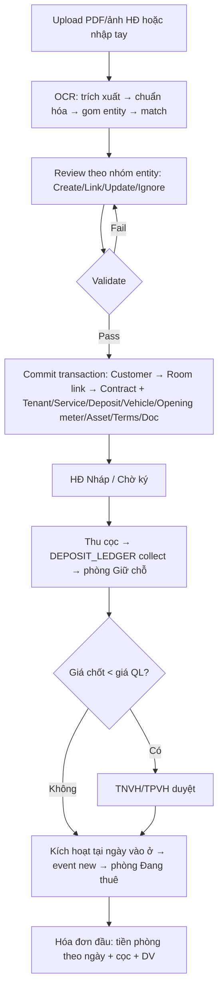
Ngoại lệ: khách bỏ cọc trước ngày vào ở → `abandon` (M-2.13); OCR FAILED → nhập tay, giữ file; commit lỗi → COMMIT_FAILED, retry.

### 2.6.9 Liên kết
| Module | Đọc/Ghi |
|---|---|
| M-2.04 | Ghi trạng thái phòng; đọc giá niêm yết/QL |
| M-2.05 | Tạo/link khách, người ở cùng, xe |
| M-2.07 | Đọc giá để snapshot; ghi override tòa khi review chọn |
| M-2.08 | Ghi OPENING reading |
| M-2.09 | Cung cấp giá chốt, kỳ TT, số người, dịch vụ snapshot, ngày vào ở (prorate) |
| M-2.12, M-2.13 | Sự kiện end/early_termination/abandon/transfer; cọc phải thu |
| Chương 3 | Hiệu suất: giá niêm yết snapshot → DT niêm yết; HĐ mới giữa tháng → DT thu thêm (D-48) |
| Chương 4 | Hoa hồng import đối chiếu số HĐ, giá chốt D-54, thời hạn (D-55), điều kiện đủ D-56 |
| Chương 5 | `NEW_ROOM_COUNT` (đếm), `EARLY_TERMINATION_COUNT` (đếm) từ CONTRACT_EVENT theo tháng sự kiện; `DEFERRED_REVENUE` (AC) khi kỳ TT > 1 |

### 2.6.10 Audit / Notification
Audit mọi chuyển trạng thái, phiên bản, sự kiện, quyết định OCR (bắt buộc với LINK/UPDATE master, cập nhật giá tòa, tạo cọc, tạo OPENING, commit). Notification: HĐ chờ duyệt giá → TNVH; OCR READY_FOR_REVIEW → người upload; HĐ ≤ 35 ngày → Work Queue (M-2.12).

### 2.6.11 Nghiệm thu
- Upload HĐ 302G6 (01/09/2026–30/08/2027, 4.000.000, 3 người) → OCR link tòa G6, phòng 302, tạo khách, snapshot điện 4.000 / nước 35.000/m³ / combo 120.000; upload lại cùng file không tạo trùng.
- Kích hoạt 505G6 vào ở 01/09 → event `new`, phòng Đang thuê, hóa đơn đầu 7.830.000 (tiền phòng 3.700.000 + cọc 3.700.000 + DV 430.000).
- Gia hạn tạo phiên bản 2 với giá mới, mã khách và cọc không đổi; HĐ cũ đọc được.
- Giá chốt 2.916.667 (202T24 tháng đầu) không bị coi là dưới giá QL vì so sánh trên giá chốt tháng đủ 3.500.000.

---

## 2.7 M-2.07 Dịch vụ & bảng giá

### 2.7.1 Mục tiêu
Danh mục dịch vụ bán cho khách (8 dịch vụ + điện chung) với giá **mặc định hệ thống + override theo tòa** có hiệu lực (R-14), tách vệ sinh/máy giặt khỏi combo (D-19), nước theo người hoặc đồng hồ, snapshot theo HĐ. Giá bán ≠ giá gốc đầu vào (giá gốc import ở chương 4, D-37).

### 2.7.2 Tác nhân
Admin/Kế toán: CRUD dịch vụ, giá mặc định, duyệt override. TPVH: đề xuất override tòa. NVVH: xem giá tòa mình; chọn dịch vụ cho HĐ.

### 2.7.3 Dữ liệu
Entity `SERVICE`, `SERVICE_PRICE` (scope GLOBAL/BUILDING, từ–đến, người duyệt), `CONTRACT_SERVICE`.

**Danh mục (Service Catalog) — mã dùng thống nhất với metric chương 5**

| Mã | Tên | Đơn vị | Cách tính | Giá mặc định (R-14) | Cột sổ Excel | Metric doanh thu |
|---|---|---|---|---|---|---|
| `ELECTRIC` | Điện | kWh | (CS mới − CS cũ) × đơn giá | 4.000/kWh | P–T | `ELECTRIC_REVENUE` |
| `WATER` | Nước | người **hoặc** m³ | số người × giá, hoặc (CS mới − CS cũ) × giá | 120.000/người · 35.000/m³ | U–Y | `WATER_REVENUE` |
| `CLEANING` | Vệ sinh | người | số người × giá | 60.000/người | Z–AB | `CLEANING_REVENUE` |
| `INTERNET` | Mạng | phòng | 1 × giá | 100.000/phòng | AC–AE | `INTERNET_REVENUE` |
| `ELEVATOR` | Thang máy | người | số người × giá | 50.000–60.000/người | AF–AH | `ELEVATOR_REVENUE` |
| `PARKING_EV` | Xe điện / gửi xe | xe | số xe × giá | 150.000/xe (Xanh SM 400.000) | AI–AK | `ELECTRIC_VEHICLE_REVENUE` |
| `WASHING` | Máy giặt | người | số người × giá | 50.000–60.000/người | AL–AN | `WASHING_REVENUE` |
| `COMBO_OTHER` | DV khác / Combo | người | số người × giá | 120.000/người = 60.000 vệ sinh + 60.000 máy giặt | AO–AQ | Chia: `CLEANING_REVENUE` + `WASHING_REVENUE` (F-06) |
| `COMMON_ELECTRIC` | Điện chung | người | số người × (thành tiền công tơ chung ÷ Σ người) | tự tính (D-18) | AR–AT, CB–CH | `ELECTRIC_REVENUE` |

**Override theo tòa (ví dụ sổ T9)**

| Tòa | Dịch vụ | Giá tòa | Bằng chứng |
|---|---|---|---|
| T18 | Nước theo người 100.000; Vệ sinh 30.000/người; Máy giặt 60.000/người | `101T18`: nước 2 × 100.000; VS 2 × 30.000; máy giặt 2 × 60.000 | [Có bằng chứng nguồn] |
| G6 | Nước theo **đồng hồ** 35.000/m³; Combo 130.000/người (`101G6`) hoặc 120.000 (`302G6`); Thang máy 60.000 | `101G6` nước 5 m³ × 35.000 = 175.000; combo 2 × 130.000 | [Có bằng chứng nguồn] — cùng tòa 2 mức combo ⇒ giá theo HĐ |
| S42 | Nước đồng hồ 35.000/m³; Internet 100.000; Combo 120.000 | `502S42` | [Có bằng chứng nguồn] |
| S19A | Thang máy 30.000/người | `101S19A` 3 × 30.000 | [Có bằng chứng nguồn] |
| T17 | Nước theo người 120.000; combo 120.000 | `101T17` | [Có bằng chứng nguồn] |

### 2.7.4 Search / Filter
Dịch vụ · Scope (mặc định / tòa) · Tòa · Hiệu lực tại ngày · Trạng thái · "Tòa nào đang dùng giá nào" (preview).

### 2.7.5 Action
CRUD dịch vụ · Đặt giá mặc định (từ ngày) · Override theo tòa (từ ngày, người duyệt) · Bulk import bảng giá · Ngừng hiệu lực · Xem lịch sử · Preview bảng giá áp dụng cho tòa tại ngày · Tách combo (migration: chuyển dòng DV khác cũ thành vệ sinh + máy giặt).

### 2.7.6 Business Rule
- **BR-2.07.1** Ưu tiên giá: giá snapshot trên HĐ → override tòa hiệu lực → mặc định hệ thống; hóa đơn chỉ đọc giá snapshot HĐ (R-14). [Có bằng chứng nguồn]
- **BR-2.07.2** Mỗi dịch vụ × scope × tòa tại một ngày chỉ có 1 giá hiệu lực; giá mới có từ ngày, không sửa giá cũ. [Đã chốt]
- **BR-2.07.3** Sửa bảng giá không đổi hóa đơn đã phát hành và không đổi CONTRACT_SERVICE của HĐ đang hiệu lực; muốn áp giá mới cho HĐ cũ → phụ lục (phiên bản mới, BR-2.06.15). [Đã chốt]
- **BR-2.07.4** Combo 120.000/người tách thành `CLEANING` 60.000 + `WASHING` 60.000 khi tạo HĐ mới; HĐ cũ đang ghi `COMBO_OTHER` vẫn chia đôi khi lên metric (D-19, F-06). [Có bằng chứng nguồn]
- **BR-2.07.5** Nước: nếu phòng có đồng hồ → tính theo m³ (35.000/m³), ngược lại theo người (120.000/người); loại tính lưu trên CONTRACT_SERVICE. [Có bằng chứng nguồn]
- **BR-2.07.6** `COMMON_ELECTRIC` không có giá cố định; đơn giá/người mỗi kỳ = thành tiền công tơ chung ÷ tổng số người sử dụng của tòa trong kỳ (D-18, F-55). [Có bằng chứng nguồn]
- **BR-2.07.7** Dịch vụ theo người lấy số người từ HĐ tại ngày chốt kỳ (D-15). [Cần chốt]
- **BR-2.07.8** Giá bán dịch vụ không dùng để tính giá gốc; giá gốc điện/nước/mạng import ở chương 4 (D-37, R-25). [Đã chốt]
- **BR-2.07.9** Tòa không có thang máy/máy giặt chung (M-2.03) → dịch vụ tương ứng không được chọn vào HĐ. [Cần chốt]
- **BR-2.07.10** Override tòa cần kế toán/admin duyệt trước khi hiệu lực. [Cần chốt]
- **BR-2.07.11** Từ OCR chọn "Cập nhật giá tòa" → tạo SERVICE_PRICE mới có ngày hiệu lực + audit (R-36). [Đã chốt]

### 2.7.7 State / Status
SERVICE: `Hoạt động` / `Ngừng`. SERVICE_PRICE: `Nháp` → `Chờ duyệt` → `Hiệu lực` → `Hết hiệu lực` (khi có giá mới từ ngày sau hoặc ngừng).

### 2.7.8 Flow
Chọn dịch vụ cho HĐ → hệ thống tra override tòa → không có thì mặc định → hiển thị giá đề xuất → người dùng xác nhận/sửa (sửa = giá theo HĐ) → snapshot. Ngoại lệ: dịch vụ chưa có giá ở cả 2 scope → chặn thêm vào HĐ.

### 2.7.9 Liên kết
| Module | Đọc/Ghi |
|---|---|
| M-2.06 | Snapshot giá vào HĐ; OCR ghi override |
| M-2.08 | Cách tính điện/nước theo đồng hồ |
| M-2.09 | Đơn giá dòng hóa đơn từ CONTRACT_SERVICE; combo chia đôi |
| M-2.13 | Đơn giá 7 dịch vụ trên phiếu hoàn cọc (giá snapshot HĐ) |
| Chương 4 | Không ghi; giá gốc riêng (D-37) |
| Chương 5 | 7 metric `*_REVENUE` + `SERVICE_REVENUE` (basis AC: hóa đơn phát hành; CF: phần đã thu) map theo mã dịch vụ ở bảng 2.7.3; `SERVICE_REVENUE_OVER_INPUT_COST` (F-29) |

### 2.7.10 Audit / Notification
Audit tạo/duyệt/ngừng giá; cảnh báo tòa có HĐ đang dùng giá khác override (để rà soát).

### 2.7.11 Nghiệm thu
- T18 override nước 100.000/người, VS 30.000 → HĐ mới của T18 snapshot đúng; HĐ T17 vẫn 120.000.
- G6 có đồng hồ nước → dòng nước theo m³; T17 không → theo người.
- Đổi giá điện mặc định lên 4.200 từ 01/10 → hóa đơn tháng 10 HĐ cũ vẫn 4.000.
- Combo 120.000 tách thành 2 dòng 60.000 trên HĐ mới; báo cáo `CLEANING_REVENUE` = `WASHING_REVENUE` cho HĐ cũ dùng combo.

---

## 2.8 M-2.08 Điện nước & chỉ số

### 2.8.1 Mục tiêu
Ghi chỉ số công tơ phòng và công tơ chung theo kỳ chốt (ngày 22, R-11), chỉ số đầu/cuối HĐ, validation, ảnh công tơ; sinh sản lượng cho hóa đơn (M-2.09) và hóa đơn cuối (M-2.13); tách điện nước **phòng trống / không thu được** thành chi phí (R-04, chương 4) và thống kê thất thoát.

### 2.8.2 Tác nhân
NVVH: nhập chỉ số, upload ảnh. TNVH: duyệt chỉ số tòa của team (R-11). Kế toán/Admin: mở lại kỳ, duyệt rollover. Kỹ thuật: thay công tơ (ghi chỉ số cuối/đầu).

### 2.8.3 Dữ liệu
Entity `METER`, `METER_READING`, `BILLING_PERIOD` (đọc).

| Trường | Cột sổ Excel | Ghi chú |
|---|---|---|
| Công tơ: mã, loại (điện / nước), phạm vi (`ROOM` phòng / `COMMON` khu vực chung — điện vệ sinh chung / `MAIN` công tơ tổng `000<tòa>`), đơn giá gốc (MAIN), ngày lắp, chỉ số lắp, trạng thái | Dòng `000G1` (MAIN); cột CB–CH (COMMON) | D-03, D-18 |
| Kỳ (tháng), Ngày chốt | Mẫu in "Ngày chốt số liệu 22/08/2026" | R-11, cấu hình tòa |
| Chỉ số cũ, Chỉ số mới, Sản lượng | Điện P/Q/R; Nước U/V/W; Chung CB/CC/CD | Sản lượng = mới − cũ |
| Loại reading: `OPENING` (đầu HĐ) / `PERIODIC` (kỳ) / `CLOSING` (ngày ra) / `VACANT` (phòng trống) | BD–BR (phòng hết HĐ); sheet ĐIỆN NƯỚC PHÒNG TRỐNG | |
| Ảnh công tơ, Người nhập, Thời điểm nhập | | Bắt buộc ảnh với OPENING/CLOSING [Cần chốt] |
| Trạng thái: Nháp / Chờ duyệt / Đã duyệt / Đã dùng hóa đơn | | |
| Số người sử dụng điện chung (tòa, kỳ), Đơn giá/người | CF, CG | D-18 |
| Ghi chú (ví dụ "kh phá hd", "PT") | G, M sheet phòng trống | |

Ví dụ: `101T17` kỳ 9/2026: điện 5.725 → 6.041 = **316 kWh**; `101G6`: nước 25 → 30 = 5 m³. Điện chung G1 (dòng `201G1` CA–CG): 1.935 → 1.967 = 32 kWh × 3.800 = 121.600 ÷ 3 người = **40.533/người**. Phòng trống `401G3`: 907 → 1.028 = 121 kWh × 4.000 = 484.000 ghi chú "kh phá hd".

### 2.8.4 Search / Filter
Kỳ · Tòa · Quản lý · Loại công tơ · Loại reading · Trạng thái · Chưa nhập (phòng có HĐ nhưng thiếu reading) · Sản lượng bất thường (> X% kỳ trước) · Phòng trống có tiêu thụ.

### 2.8.5 Action
Nhập từng phòng · Nhập theo tòa (grid) · Import Excel · Upload ảnh · Copy chỉ số kỳ trước làm chỉ số cũ · Validate · Gửi duyệt · Duyệt (TNVH) · Mở lại (kế toán, chưa phát hành) · Ghi CLOSING khi kết thúc HĐ · Ghi VACANT cho phòng trống · Thay công tơ · Export.

### 2.8.6 Business Rule
- **BR-2.08.1** Chỉ số mới ≥ chỉ số cũ; ngược lại chỉ chấp nhận khi có duyệt "rollover/thay công tơ" kèm ảnh. [Đã chốt]
- **BR-2.08.2** Một công tơ × kỳ chỉ có 1 reading `PERIODIC` hợp lệ. [Đã chốt]
- **BR-2.08.3** Chỉ số cũ kỳ N = chỉ số mới kỳ N−1 đã duyệt (hoặc OPENING nếu HĐ mới); sửa chỉ số cũ tay cần lý do + duyệt. [Đã chốt]
- **BR-2.08.4** Reading đã dùng phát hành hóa đơn không sửa; sai → hóa đơn điều chỉnh (M-2.09) với reading điều chỉnh có tham chiếu. [Đã chốt]
- **BR-2.08.5** Ngày chốt theo tòa (mặc định 22); kỳ dịch vụ = (ngày chốt tháng N−1 + 1) → ngày chốt tháng N; hóa đơn tháng N+1 dùng kỳ này (D-09). [Có bằng chứng nguồn / Cần chốt]
- **BR-2.08.6** Quản lý tòa nhập, TNVH duyệt trước khi tạo hóa đơn batch; hóa đơn chỉ lấy reading `Đã duyệt` (R-11). [Cần chốt]
- **BR-2.08.7** Sản lượng lệch > 50% so với trung bình 3 kỳ trước → cảnh báo, yêu cầu ảnh. [Cần chốt]
- **BR-2.08.8** Kết thúc HĐ/phá HĐ: ghi `CLOSING` tại ngày ra; sản lượng từ chỉ số cũ kỳ hiện tại → CLOSING lên hóa đơn cuối (R-17); CLOSING trở thành OPENING/chỉ số cũ cho khách kế tiếp hoặc reading VACANT. [Đã chốt]
- **BR-2.08.9** Phòng trống (không HĐ hiệu lực trong khoảng đọc): sản lượng ghi `VACANT`, không tạo hóa đơn, tự sinh dòng EXPENSE "điện/nước phòng trống" (giá gốc) tại chương 4 và vào thống kê thất thoát (R-04, D-37). [Đã chốt]
- **BR-2.08.10** Điện nước của khách phá HĐ **đã lên hóa đơn cuối** = doanh thu (R-04); phần chưa thu → công nợ DS phòng phá HĐ (M-2.11); không chuyển thành chi phí. [Đã chốt]
- **BR-2.08.11** Công tơ chung: thành tiền = sản lượng × đơn giá công tơ chung của tòa (ví dụ 3.800); chia cho các phòng theo số người tại ngày chốt (D-18). [Có bằng chứng nguồn]
- **BR-2.08.12** Nước không có đồng hồ → không có reading, tính theo người (BR-2.07.5). [Có bằng chứng nguồn]
- **BR-2.08.13** Ảnh công tơ bắt buộc với OPENING và CLOSING (tranh chấp hoàn cọc); PERIODIC khuyến nghị. [Cần chốt → P-25]
- **BR-2.08.14** Công tơ tổng `000<tòa>` (`MAIN`) ghi reading PERIODIC như phòng nhưng **không** sinh dòng hóa đơn và **không** chia cho phòng; thành tiền = sản lượng × đơn giá gốc (3.500/2.700) chỉ để đối chiếu với `ELECTRIC_INPUT_COST` (M-4.01) và tính thất thoát = sản lượng tổng − Σ sản lượng phòng − sản lượng khu vực chung (D-03, D-37). [Có bằng chứng nguồn]

### 2.8.7 State / Status
Reading: `Nháp` → `Chờ duyệt` → `Đã duyệt` → `Đã dùng hóa đơn`; `Chờ duyệt` → `Nháp` (trả lại). Kỳ chốt của tòa: `Đang nhập` → `Đã duyệt` → `Đã lập hóa đơn`.

### 2.8.8 Flow
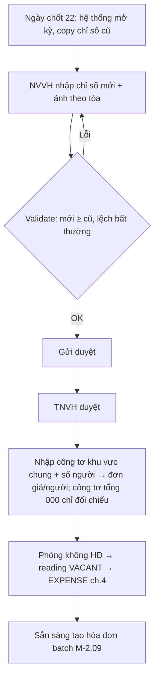
Ngoại lệ: HĐ kết thúc giữa kỳ → CLOSING riêng, không đợi ngày 22; thay công tơ → 2 reading (cuối công tơ cũ, đầu công tơ mới) cộng sản lượng.

### 2.8.9 Liên kết
| Module | Đọc/Ghi |
|---|---|
| M-2.06 | Đọc OPENING từ HĐ/OCR |
| M-2.09 | Cung cấp sản lượng điện/nước/điện chung cho dòng hóa đơn |
| M-2.13 | CLOSING → dòng điện/nước phiếu hoàn cọc |
| Chương 4 | Ghi EXPENSE điện/nước phòng trống (giá gốc; nằm trong `ELECTRIC_INPUT_COST`/`WATER_INPUT_COST` basis CF theo ngày trả NCC, AC theo kỳ tiêu thụ) — module này chỉ sinh dòng đề xuất số lượng, đơn giá gốc do chi phí import quyết định |
| Chương 5 | Không có metric riêng; drill-down `ELECTRIC_REVENUE` → dòng hóa đơn → reading; thống kê thất thoát điện phòng trống (báo cáo phụ, không phải metric) |

### 2.8.10 Audit / Notification
Audit nhập/sửa/duyệt/mở lại; lưu ảnh. Nhắc: ngày 20 nhắc NVVH chuẩn bị; ngày 23 tòa chưa nhập → TNVH; reading bất thường.

### 2.8.11 Nghiệm thu
- Kỳ 9/2026 tòa T17: nhập 316 kWh cho 101T17, sản lượng khớp sổ; nhập 5.700 < 5.725 bị chặn.
- Điện chung G1: 32 kWh × 3.800 ÷ 3 người = 40.533/người, dòng phòng 201G1 = 2 × 40.533.
- 401G3 trống: reading VACANT 121 kWh → dòng chi phí đề xuất 484.000, không có hóa đơn.
- Sửa reading đã phát hành bị từ chối; đi qua hóa đơn điều chỉnh.

---

## 2.9 M-2.09 Kỳ hóa đơn & Hóa đơn

### 2.9.1 Mục tiêu
Lập hóa đơn tháng theo tòa từ HĐ hiệu lực + chỉ số đã duyệt + giá snapshot: 12 dòng cố định, công thức R-09, hệ số ngày ở ÷ 30 (R-10, D-14), kỳ TT 1/2/3 (D-13), nợ cũ (D-16), thu khác (D-17), điện chung (D-18); in theo mẫu tài khoản nhận (R-12); hạn thanh toán 25 → cuối tháng; là nguồn `RENT_REVENUE`, 7 `*_REVENUE`, `TOTAL_REVENUE` (AC) và DT phải thu (D-46, chương 3).

### 2.9.2 Tác nhân
NVVH: tạo batch tòa, xem preview, thêm thu khác/ghi chú, phát hành (nếu được ủy quyền). TNVH: duyệt batch trước phát hành. Kế toán/Admin: điều chỉnh, hủy, mở kỳ, cấu hình mẫu in. Khách: nhận hóa đơn qua Zalo/in.

### 2.9.3 Dữ liệu
Entity `BILLING_PERIOD`, `INVOICE`, `INVOICE_LINE`.

**Kỳ hóa đơn (BILLING_PERIOD)**

| Trường | Ví dụ | Ghi chú |
|---|---|---|
| Mã kỳ | `2026-09` ("HÓA ĐƠN THÁNG 9/2026") | D-09 |
| Tiền phòng cho tháng | 09/2026 (trả trước) | |
| Kỳ dịch vụ (từ–đến) | 23/07/2026 → 22/08/2026 | Ngày chốt 22 (BR-2.08.5) |
| Ngày chốt số liệu | 22/08/2026 | In trên hóa đơn |
| Ngày phát hành dự kiến | 23–25/08/2026 | |
| Hạn thanh toán | 25/08 → 31/08/2026 | R-13 |
| Trạng thái, Lock | Mở / Đã phát hành / Khóa | Khóa theo R-08 |

**Hóa đơn (INVOICE) — 1 dòng sổ = 1 hóa đơn phòng/tháng**

| Trường | Cột sổ Excel | Ghi chú |
|---|---|---|
| Số hóa đơn, Kỳ, Tòa, Phòng, Mã khách (snapshot), Quản lý (snapshot phân công) | A, B, C, D | |
| Kỳ TT | E | D-13 |
| Cọc khách cũ (hiển thị), Cọc thu kỳ này | F, J | D-22 |
| Giá niêm yết, Giá QL, Giá hiện tại (snapshot) | G, H, I | |
| Ngày ở, Ngày DV | K, L | D-14; mặc định 30 |
| Nợ cũ | M | D-16 |
| Thu khác + diễn giải | N | D-17 |
| Số người | O | D-15 |
| 12 dòng (INVOICE_LINE) | P–AT | Bảng dưới |
| Tổng DV, Tổng cần đóng | AU, AV | R-09 |
| Ghi chú hóa đơn | AW | Ví dụ "thừa 200k phạt khách cũ bẩn tường cộng vào tổng cần đóng" |
| Tổng đã đóng, Tình trạng, Công nợ | AX, AY, AZ | Từ M-2.10/M-2.11 (D-20, D-21) |
| Ngày phát hành, Hạn TT, Tài khoản nhận (snapshot), Mẫu in | Sheet HĐ (VP-HẰNG)/(VP)/(TECH)/(G1 TECH) | R-12 |
| Trạng thái | | 2.9.7 |
| Hóa đơn gốc (nếu là điều chỉnh) | | |

**12 dòng cố định (INVOICE_LINE) — thứ tự in**

| # | Dòng | Số lượng | Đơn giá | Hệ số | Cột sổ |
|---|---|---|---|---|---|
| 1 | Tiền phòng | Kỳ TT | Giá hiện tại | Ngày ở ÷ 30 | I × E × K/30 |
| 2 | Tiền cọc (KH mới / bổ sung) | 1 | Cọc phải thu − đã thu | 1 | J |
| 3 | Điện | CS mới − CS cũ | 4.000 | 1 | P–T |
| 4 | Nước | m³ hoặc số người | 35.000 / 120.000 | Ngày DV ÷ 30 (theo người) | U–Y |
| 5 | Vệ sinh | số người | 60.000 | Ngày DV ÷ 30 | Z–AB |
| 6 | Internet | 1 | 100.000 | Ngày DV ÷ 30 | AC–AE |
| 7 | Thang máy | số người | 50–60.000 | Ngày DV ÷ 30 | AF–AH |
| 8 | Gửi xe / xe điện | số xe | 150.000 | Ngày DV ÷ 30 | AI–AK |
| 9 | Máy giặt | số người | 60.000 | Ngày DV ÷ 30 | AL–AN |
| 10 | Combo / DV khác | số người | 120.000 | Ngày DV ÷ 30 | AO–AQ |
| 11 | Nợ cũ | 1 | Số dư kỳ trước | 1 | M |
| 12 | Điện chung | số người | Đơn giá/người kỳ này | 1 | AR–AT |
| + | Thu khác (dòng bổ sung có diễn giải: thêm người, phạt, ngày lẻ khách mới) | | | | N |

**Ví dụ `101T17` kỳ 9/2026** [Có bằng chứng nguồn]: Tiền phòng 3.600.000 × 1 × 30/30 = 3.600.000; Điện (6.041 − 5.725) = 316 × 4.000 = 1.264.000; Nước 1 người × 120.000 = 120.000; Internet 100.000; Combo 1 × 120.000 = 120.000 → Tổng DV = 1.604.000; **Tổng cần đóng = 3.600.000 + 1.604.000 = 5.204.000**; đã đóng 5.204.000 → `Đủ`, công nợ 0.

Ví dụ khách mới `202T24` vào 06/09 (sheet PHÒNG MỚI THÁNG 9): tiền phòng tháng đầu 3.500.000 ÷ 30 × 25 = 2.916.667 (cột H) + cọc 3.500.000 + DV 483.333 (= 580.000 × 25/30) → 6.900.000.

### 2.9.4 Search / Filter
Kỳ · Tòa · Quản lý / trưởng nhóm / khu vực · Trạng thái · Tình trạng thu (Chưa TT / Thiếu / Đủ / Thừa) · Có nợ cũ · Kỳ TT · Tài khoản nhận · Có điều chỉnh · Chưa gửi Zalo · Khoảng tổng cần đóng.

### 2.9.5 Action
Tạo batch theo kỳ + tòa · Preview (grid giống sổ) · Sửa nháp (ngày ở, thu khác, ghi chú, số người) · Thêm dòng thu khác / phạt đề xuất (P-09) · Validate · Gửi duyệt · Phát hành 1/nhiều · Điều chỉnh (tạo hóa đơn điều chỉnh có đối ứng) · Hủy (có lý do) · In PDF theo mẫu tài khoản nhận · Export Excel (đúng cột A–AZ) · Gửi Zalo (M-2.14) · Xem payment/công nợ.

### 2.9.6 Business Rule
- **BR-2.09.1** Tổng cần đóng = Tổng DV + Giá hiện tại × Kỳ TT × (Ngày ở ÷ 30) + Nợ cũ + Cọc + Thu khác; mỗi dòng = Đơn giá × Số lượng × Hệ số (R-09). [Có bằng chứng nguồn]
- **BR-2.09.2** Hệ số ngày ở = Ngày ở ÷ 30 cố định mẫu số 30 cho tiền phòng và dịch vụ theo người/phòng; điện/nước theo đồng hồ hệ số 1 (D-14, R-10, P-03). [Có bằng chứng nguồn / Cần chốt P-03]
- **BR-2.09.3** `Contract + Room + Kỳ` chỉ có 1 hóa đơn hợp lệ (không tính hóa đơn điều chỉnh/hủy). [Đã chốt]
- **BR-2.09.4** Hóa đơn tháng N gồm tiền phòng tháng N (trả trước) + dịch vụ kỳ chốt ngày 22 tháng N−1 + nợ cũ + cọc/thu khác (D-09). [Có bằng chứng nguồn]
- **BR-2.09.5** Kỳ TT = k > 1: dòng tiền phòng = giá × k; các (k−1) kỳ kế tiếp không lập dòng tiền phòng, chỉ dịch vụ; AC ghi `DEFERRED_REVENUE` chia đều (R-03). [Có bằng chứng nguồn / Cần chốt AC]
- **BR-2.09.6** Nợ cũ = số dư còn thiếu của hóa đơn kỳ trước tại ngày lập (D-16); sau khi lập, hóa đơn kỳ trước đóng lại, công nợ chuyển sang hóa đơn kỳ này (tránh đếm 2 lần). [Đã chốt]
- **BR-2.09.7** Thu khác: mỗi khoản 1 dòng có loại (thêm người/xe, phạt, đền bù, ngày lẻ khách mới) và diễn giải; ngày lẻ tháng trước của khách mới = (giá + DV tháng) ÷ 31 × số ngày (D-17). [Có bằng chứng nguồn — mâu thuẫn ÷31 vs ÷30 → P-03]
- **BR-2.09.8** Phát hành chỉ khi mọi reading điện (và nước nếu đồng hồ) của phòng đã duyệt và điện chung tòa đã tính. [Cần chốt]
- **BR-2.09.9** Hóa đơn `Phát hành` không sửa; sai → `Điều chỉnh` tạo hóa đơn điều chỉnh (âm/dương) tham chiếu gốc, hoặc `Hủy` khi chưa có payment (R-11). [Đã chốt]
- **BR-2.09.10** Tài khoản nhận và mẫu in snapshot tại phát hành theo tài khoản mặc định của tòa (R-12); nội dung CK in = mã phòng. [Có bằng chứng nguồn]
- **BR-2.09.11** Hạn thanh toán = 25 → ngày cuối tháng phát hành; quá 5 ngày kể từ phát hành → công nợ (R-13). [Đã chốt]
- **BR-2.09.12** Phạt trễ 200.000/ngày: hệ thống **đề xuất** dòng thu khác trên hóa đơn kỳ sau, quản lý xác nhận/miễn, kế toán duyệt (P-09). [Cần chốt]
- **BR-2.09.13** Chỉ hóa đơn `Phát hành` trở đi tính công nợ, DT phải thu (D-46) và metric AC; `Nháp` không tính. [Đã chốt]
- **BR-2.09.14** Hóa đơn đầu của khách mới lập ngay khi kích hoạt HĐ (không đợi ngày 22): tiền phòng theo ngày + cọc + DV theo ngày; ghi sheet PHÒNG MỚI. [Có bằng chứng nguồn]
- **BR-2.09.15** Hóa đơn cuối (kết thúc/phá HĐ) lập từ M-2.13 với CLOSING reading; tiền phòng theo ngày nếu hết HĐ giữa tháng; dòng "Tiền phòng cọc" hiển thị cọc khấu trừ (R-17). [Đã chốt]
- **BR-2.09.16** Dòng 12 Điện chung dùng đơn giá/người của kỳ; tòa không có công tơ chung → dòng = 0. [Có bằng chứng nguồn]
- **BR-2.09.17** Số người trên hóa đơn = số người HĐ tại ngày chốt; sửa tay trên hóa đơn nháp phải ghi lý do và không cập nhật ngược HĐ. [Cần chốt]
- **BR-2.09.18** Kỳ đã khóa (R-08) không phát hành/điều chỉnh vào kỳ đó; điều chỉnh ghi kỳ hiện tại tham chiếu chứng từ gốc. [Cần chốt]

### 2.9.7 State / Status
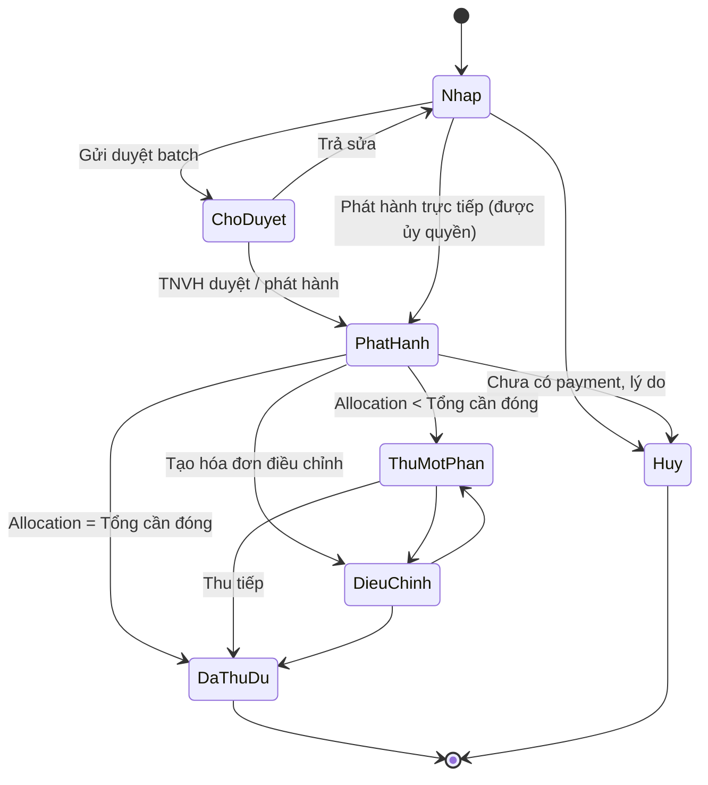
Tình trạng thu hiển thị (D-20, cột AY): `Chưa TT` (đã đóng = 0) / `Thiếu` / `Đủ` / `Thừa` (đã đóng > cần đóng, xem M-2.10).

### 2.9.8 Flow
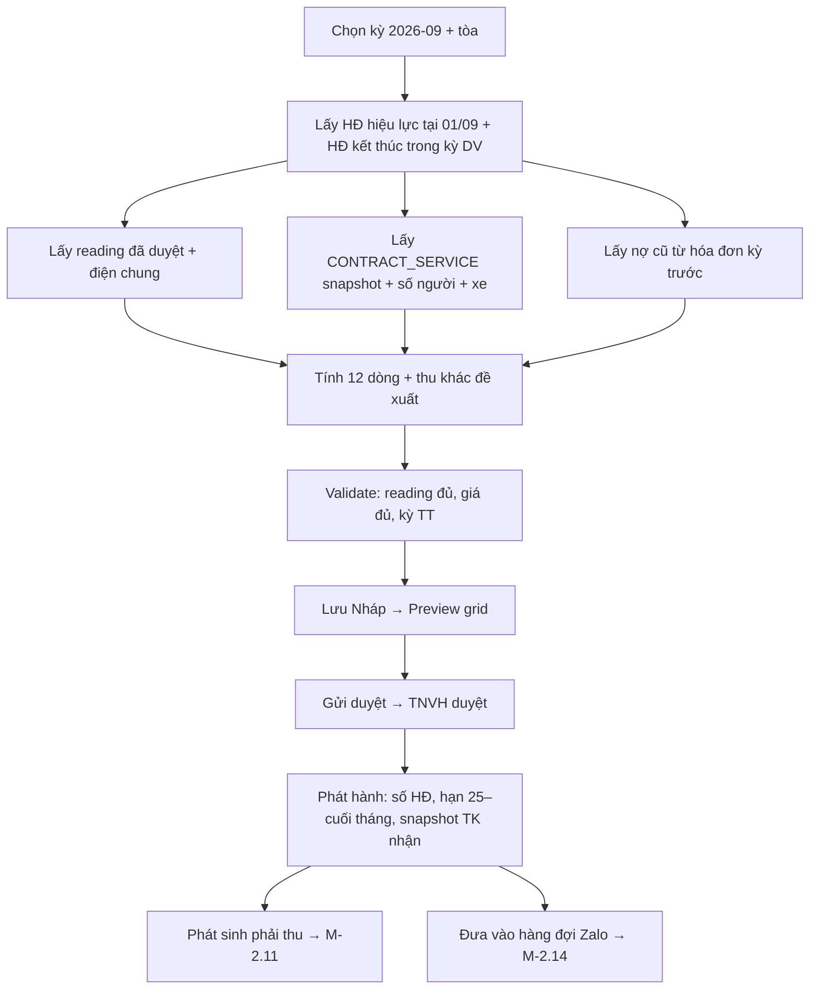
Ngoại lệ: phòng thiếu reading → hóa đơn phòng đó giữ Nháp, batch vẫn phát hành phần còn lại; khách vào 28/08 (sau ngày chốt) → hóa đơn đầu riêng + hóa đơn tháng 9 chỉ tiền phòng.

### 2.9.9 Liên kết
| Module | Đọc/Ghi |
|---|---|
| M-2.06, M-2.07, M-2.08 | Đọc HĐ, giá snapshot, reading |
| M-2.10 | Nhận allocation → cập nhật Tổng đã đóng, tình trạng |
| M-2.11 | Số dư → công nợ, nợ cũ kỳ sau |
| M-2.13 | Hóa đơn cuối; phạt/khấu trừ |
| M-2.14 | Sự kiện phát hành → lịch nhắc |
| Chương 3 | DT phải thu = Σ Tổng cần đóng tòa trong kỳ (D-46, R-20); DV ÷ DT phải thu (F-40); DT thu thêm từ hóa đơn đầu khách mới (D-48) |
| Chương 4 | Thu khác loại "khấu trừ/đền bù" → thu nhập khác (R-29) |
| Chương 5 | Basis **AC**: `RENT_REVENUE` = Σ dòng 1 hóa đơn phát hành trong kỳ; `ELECTRIC_REVENUE` = dòng 3 + 12; `WATER_REVENUE`, `CLEANING_REVENUE`, `INTERNET_REVENUE`, `ELEVATOR_REVENUE`, `ELECTRIC_VEHICLE_REVENUE`, `WASHING_REVENUE` = dòng tương ứng (combo chia đôi F-06); `SERVICE_REVENUE` = Σ 7 dòng; `TOTAL_REVENUE` (AC) = Σ hóa đơn phát hành + `OTHER_INCOME`, không gồm dòng 2 cọc và dòng 11 nợ cũ; `DEFERRED_REVENUE` khi kỳ TT > 1. Basis **CF**: các metric trên tính từ phần đã thu (M-2.10) phân bổ về dòng |

### 2.9.10 Audit / Notification
Audit tạo/sửa nháp/phát hành/điều chỉnh/hủy (giá trị cũ–mới, lý do). Notification: batch chờ duyệt → TNVH; phòng thiếu reading → NVVH; hóa đơn phát hành → hàng đợi Zalo.

### 2.9.11 Nghiệm thu
- Batch T17 kỳ 9/2026: 101T17 = 5.204.000 khớp sổ; export Excel đúng cột A–AZ.
- Kỳ TT 3 → tiền phòng × 3; 2 kỳ sau không có dòng tiền phòng.
- Hóa đơn phát hành không sửa được; điều chỉnh tạo chứng từ đối ứng.
- In mẫu VP-Hằng cho 204S12 hiển thị Mã KH `204S12A001`, ngày chốt 22/08/2026, nội dung CK `204S12`.

---

## 2.10 M-2.10 Thu tiền

### 2.10.1 Mục tiêu
Ghi nhận payment (ngày, số tiền, tài khoản nhận, nội dung CK = mã phòng, phương thức), phân bổ vào 1..n hóa đơn (allocation), xử lý thu thừa/tạm ứng và tiền chưa xác định; log **ngày thanh toán** (sheet BÁO CÁO CHECK THU TIỀN) là nguồn M5/M10/M15 (D-47, chương 3) và `TOTAL_REVENUE` basis CF (R-02).

### 2.10.2 Tác nhân
Kế toán: ghi/import payment, match, phân bổ, reverse. NVVH: xem thu của tòa mình, ghi nhận tiền mặt (chờ kế toán xác nhận), ghi chú "đã CK". TNVH/TPVH: xem tiến độ M5/M10/M15. Admin: reallocate có audit.

### 2.10.3 Dữ liệu
Entity `PAYMENT`, `PAYMENT_ALLOCATION`.

| Trường | Cột sổ Excel | Ghi chú |
|---|---|---|
| Mã giao dịch, Ngày giờ nhận | BÁO CÁO CHECK THU TIỀN: NGÀY THANH TOÁN; sổ: BU/BW "ND và ngày ck" | Ngày dùng cho M5/M10/M15 và CF |
| Số tiền | AX (Σ) | |
| Phương thức: Chuyển khoản / Tiền mặt / Khấu trừ cọc | | |
| Tài khoản nhận (VP-Hằng / VP / Techcombank / G1 TECH) | Sheet HĐ (…) | R-12 |
| Nội dung CK (raw), Mã phòng nhận diện | Mẫu in "Nội dung chuyển khoản: 204S12" | R-12 |
| Bank reference, Người nộp (khách), Chứng từ (ảnh CK) | | |
| Trạng thái: Chờ xác nhận / Đã xác nhận / Chưa xác định / Đã đảo | | |
| Allocation: Payment, Hóa đơn, Dòng (tùy chọn), Số tiền, Loại (thanh toán / tạm ứng / cọc / hoàn nợ phá HĐ), Thời điểm, Người | AX theo hóa đơn | |
| Ghi chú | GHI CHÚ ("M10 cọc thêm 2tr", "thiếu cọc") | |

Ví dụ (BÁO CÁO CHECK THU TIỀN 08/2026) [Có bằng chứng nguồn]: `401G1` cần 4.784.000, đã đóng 4.784.000 ngày 07/08 → `Đủ`, vào mốc M10; `202G10` cần 4.395.000, đóng 4.175.000 → công nợ −220.000 `Thiếu`; `101G4` cần 5.419.000, đóng 5.659.000 → +240.000 `Thừa` (tạm ứng kỳ sau); `402G5` 10.048.000 chưa đóng → `Chưa TT` (sau đó phá HĐ, M-2.12).

### 2.10.4 Search / Filter
Kỳ · Tòa · Quản lý / trưởng nhóm · Tài khoản nhận · Phương thức · Ngày (khoảng; mốc ≤ 5 / ≤ 10 / ≤ 15) · Trạng thái · Chưa xác định · Thu thừa · Khách/phòng.

### 2.10.5 Action
Ghi payment · Import sao kê (CSV ngân hàng: ngày, số tiền, nội dung, tài khoản) · Auto-match theo mã phòng + tài khoản → đề xuất allocation vào hóa đơn mở cũ nhất trước · Phân bổ tay · Reallocate (audit) · Đánh dấu Chưa xác định · Xác nhận tiền mặt · Reverse/hủy (chứng từ đảo) · Ghi tạm ứng · Export · Xem tiến độ thu theo tòa/quản lý (M5/M10/M15).

### 2.10.6 Business Rule
- **BR-2.10.1** Σ allocation của 1 payment ≤ số tiền payment; phần dư = tạm ứng (credit) gắn khách/HĐ. [Đã chốt]
- **BR-2.10.2** 1 payment → nhiều hóa đơn; 1 hóa đơn → nhiều payment; thu một phần hợp lệ (R-12). [Đã chốt]
- **BR-2.10.3** Match tự động: nội dung CK chứa mã phòng + đúng tài khoản nhận của tòa → đề xuất; không match → `Chưa xác định`, không tính vào hóa đơn nào. [Có bằng chứng nguồn]
- **BR-2.10.4** Thứ tự phân bổ mặc định vào dòng hóa đơn (thống nhất với BR-5.02.9, tham số P-14): **nợ cũ (hóa đơn cũ nhất) → 7 dịch vụ + điện chung → thu khác → tiền phòng → cọc**; nhờ đó phòng phá HĐ chỉ đóng phần dịch vụ sẽ tự loại khỏi `RENT_REVENUE` (CF) nhưng vẫn vào doanh thu dịch vụ (đúng cách Excel trừ tay); kế toán được đổi thứ tự cho từng payment có lý do. [Cần chốt → P-14]
- **BR-2.10.5** Ngày thanh toán = ngày tiền vào tài khoản (sao kê) hoặc ngày nhận tiền mặt; là cơ sở M5/M10/M15 và tháng CF; không dùng ngày nhập liệu (D-47). [Đã chốt]
- **BR-2.10.6** Thu thừa → tình trạng `Thừa`, tạo credit tự động khấu trừ vào hóa đơn kỳ sau (dòng thu khác âm hoặc giảm nợ cũ); không hoàn tiền mặc định. [Cần chốt]
- **BR-2.10.7** Tiền cọc thu theo dòng 2 hóa đơn đầu → allocation loại `cọc` đồng thời ghi DEPOSIT_LEDGER(collect) (M-2.13); CF ghi `NEW_DEPOSIT` tại tháng khách vào ở (R-05, D-30). [Đã chốt]
- **BR-2.10.8** Payment cho hóa đơn kỳ trước ghi doanh thu CF tại tháng nộp; AC chỉ giảm công nợ (R-03). [Đã chốt / Cần chốt AC]
- **BR-2.10.9** Reverse payment tạo bản ghi đảo âm cùng ngày đảo, không xóa; allocation liên quan hủy theo. [Đã chốt]
- **BR-2.10.10** Payment tiền mặt do NVVH ghi ở trạng thái `Chờ xác nhận` cho tới khi kế toán xác nhận nộp về công ty; chỉ payment `Đã xác nhận` tính M5/M10/M15. [Cần chốt → P-26]
- **BR-2.10.11** Thu nợ của HĐ đã phá (DS phòng phá HĐ) phân bổ vào hóa đơn cuối của HĐ đó; tính doanh thu CF tháng thu; không tính hiệu suất tháng cũ (R-23). [Cần chốt → P-27]
- **BR-2.10.12** Tình trạng hóa đơn (D-20): `Chưa TT` (Σ allocation = 0, cần đóng > 0) / `Thiếu` (0 < Σ < cần đóng) / `Đủ` (=) / `Thừa` (>). [Có bằng chứng nguồn]
- **BR-2.10.13** Sau ngày chốt lương (16, P-06) payment vẫn ghi ngày thật; snapshot mốc chương 3 không tính lại (R-23). [Cần chốt]
- **BR-2.10.14** Kỳ báo cáo đã khóa: payment ghi ngày trong kỳ khóa được lưu nhưng đưa vào kỳ hiện tại dạng điều chỉnh (R-08). [Cần chốt]

### 2.10.7 State / Status
Payment: `Chờ xác nhận` → `Đã xác nhận` → (`Đã đảo`); `Đã xác nhận` ↔ `Chưa xác định` (chưa có allocation). Allocation: `Hiệu lực` / `Đã hủy`.

### 2.10.8 Flow
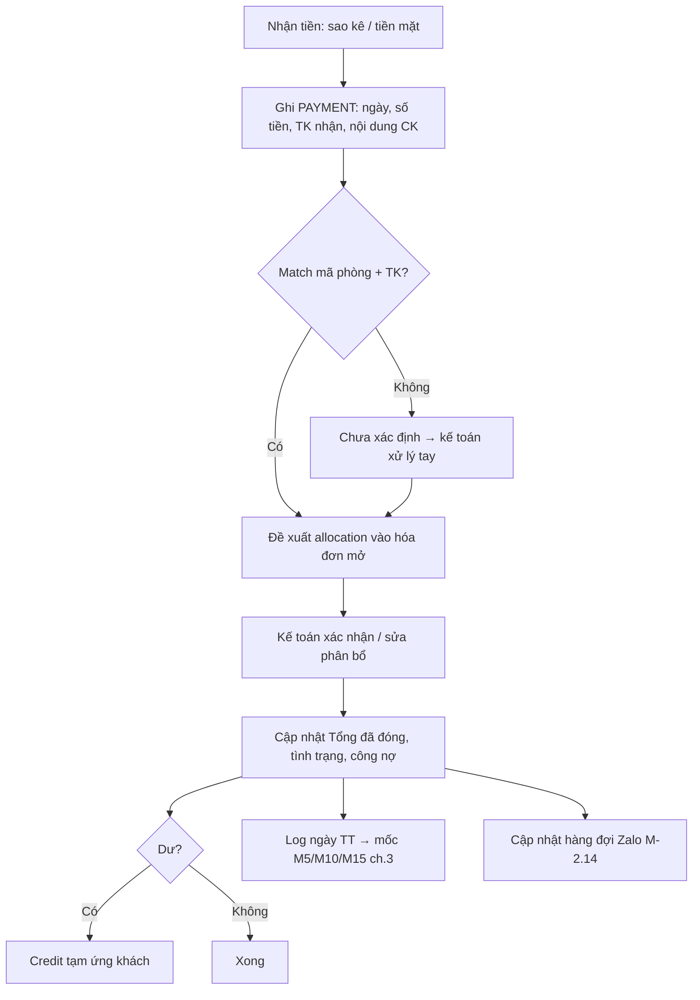
Ngoại lệ: chuyển nhầm tài khoản tòa khác → vẫn match theo mã phòng, gắn cờ "sai TK"; khách chuyển gộp 2 phòng → 1 payment 2 allocation.

### 2.10.9 Liên kết
| Module | Đọc/Ghi |
|---|---|
| M-2.09 | Cập nhật đã đóng/tình trạng |
| M-2.11 | Số dư, tuổi nợ |
| M-2.13 | Allocation loại cọc → DEPOSIT_LEDGER collect; payment hoàn cọc là chi (REFUND_CASE), không phải payment âm |
| M-2.14 | Đã thu đủ → skip nhắc |
| Chương 3 | Ngày thanh toán → `COLLECTION_MILESTONE_SNAPSHOT` M5/M10/M15 theo tòa và quản lý (R-20, D-47); DT thu thêm (D-48) |
| Chương 5 | Basis **CF**: `TOTAL_REVENUE` = Σ allocation `Đã xác nhận` có ngày trong tháng (gồm cọc mới) − `REFUND_AMOUNT` (R-02); `RENT_REVENUE` (CF) = phần allocation vào dòng tiền phòng; `NEW_DEPOSIT` (CF) = allocation loại cọc của HĐ có move_in trong tháng; drill-down mọi số về payment (R-37) |

### 2.10.10 Audit / Notification
Audit ghi/sửa/reallocate/reverse/xác nhận. Notification: payment chưa xác định > 2 ngày → kế toán; tiền mặt chờ xác nhận > 1 ngày → TNVH; tiến độ thu ngày 5/10/15 gửi TPVH.

### 2.10.11 Nghiệm thu
- Import sao kê có dòng "204S12" 6.466.000 vào TK VP-Hằng → tự match hóa đơn 204S12 kỳ 9 → `Đủ`.
- 1 payment 10.000.000 phân bổ 2 hóa đơn (nợ cũ 220.000 + kỳ này) đúng thứ tự.
- 101G4 thu thừa 240.000 → credit, hóa đơn kỳ sau giảm 240.000.
- Tổng allocation theo tòa G1 tháng 8 khớp cột AX sổ; ngày TT 07/08 tính vào M10.

---

## 2.11 M-2.11 Công nợ

### 2.11.1 Mục tiêu
Theo dõi công nợ khách (D-21) theo hóa đơn, khách, phòng, tòa, quản lý, kỳ và mốc M1–M3; chuyển công nợ sau 5 ngày (R-13); đề xuất phạt (P-09); drill-down chứng từ; danh sách **phòng phá HĐ** với tổng phải thu / đã thu; công nợ từ hoàn cọc âm (D-32).

### 2.11.2 Tác nhân
NVVH: xem công nợ tòa mình, gọi/nhắn nhắc, ghi nhận liên hệ. TNVH/TPVH: theo dõi team, xác nhận/miễn phạt. Kế toán/Admin: sửa dữ liệu nhạy cảm (R-34), duyệt phạt, xóa nợ (write-off) có duyệt, snapshot.

### 2.11.3 Dữ liệu
Không entity riêng — view trên `INVOICE`, `PAYMENT_ALLOCATION`, `REFUND_CASE`, `CONTRACT_EVENT`; snapshot mốc ở chương 3.

| Chỉ tiêu | Công thức | Cột sổ Excel |
|---|---|---|
| Phải thu | Σ Tổng cần đóng hóa đơn Phát hành (+ điều chỉnh) | AV |
| Đã thu | Σ allocation hiệu lực | AX |
| Còn phải thu (Công nợ) | Đã thu − Phải thu (âm = nợ) (D-21) | AZ |
| Thu thừa / tạm ứng | Σ credit chưa dùng | AY "Thừa" |
| Quá hạn | Còn phải thu của hóa đơn quá 5 ngày kể từ phát hành | |
| Tuổi nợ | 1–5 / 6–15 / 16–30 / > 30 ngày | |
| Thu theo M1/M2/M3 | Σ allocation ngày ≤ 5 / ≤ 10 / ≤ 15 | Sheet cập nhật thu tiền (chương 3) |
| Phạt đề xuất | 200.000 × số ngày quá hạn (P-09) | |
| Công nợ KH từ hoàn cọc | Tổng hoàn < 0 (M-2.13) | HOÀN CỌC: Công nợ KH |
| DS phòng phá HĐ: mã, quản lý, ngày vào ở, số tháng ở, lý do, SĐT, Tổng phải thu, Tổng đã thu | | Sheet DS phòng phá hđ |

Ví dụ DS phòng phá HĐ (sổ T9) [Có bằng chứng nguồn]: tổng phải thu **16.048.000**, đã thu **3.662.000**; `403G5` vào 16/07/2026, lý do "không đủ tài chính", phải thu 1.580.000, đã thu 0; `304T35` "nghỉ học về quê" phải thu 536.000, đã thu 500.000; `101T21` phải thu 940.000, đã thu 1.664.000 (thu vượt → cần đối chiếu).

### 2.11.4 Search / Filter
Kỳ · Tổ chức (khu vực / trưởng nhóm / quản lý) · Tòa / nhóm T/S/G · Mốc M1/M2/M3 · Tình trạng (Chưa TT / Thiếu / Đủ / Thừa) · Tuổi nợ · Loại nợ (hoạt động / phá HĐ / hoàn cọc âm) · Có phạt đề xuất · Khách có Zalo · Khoảng số tiền.

### 2.11.5 Action
Xem tổng hợp → drill-down khách → hóa đơn → payment · Ghi nhận liên hệ (ngày, kết quả) · Gửi nhắc Zalo (M-2.14) · Xác nhận/miễn phạt · Đề nghị xóa nợ (kế toán duyệt) · Chuyển nợ sang DS phá HĐ (tự động khi event early_termination) · Snapshot theo mốc/kỳ · Export.

### 2.11.6 Business Rule
- **BR-2.11.1** Công nợ = Σ đã thu − Σ phải thu theo hóa đơn Phát hành; hóa đơn Nháp/Hủy không tính (D-21, R-13). [Đã chốt]
- **BR-2.11.2** Hóa đơn chưa thu đủ sau 5 ngày kể từ ngày phát hành → cờ `Công nợ` (quá hạn); trước đó chỉ là "chưa đến hạn" (D-21; mốc tính 5 ngày sau phát hành hay sau hạn TT → P-17). [Đã chốt]
- **BR-2.11.3** Phạt 200.000/ngày quá hạn do hệ thống đề xuất; quản lý xác nhận/miễn; kế toán duyệt → dòng thu khác kỳ sau; không tự cộng vào công nợ (R-13, P-09). [Cần chốt]
- **BR-2.11.4** Nợ của HĐ có event `early_termination` chuyển sang DS phòng phá HĐ; tổng phải thu = Σ hóa đơn (kể cả hóa đơn cuối) − cọc bị giữ đã khấu trừ; đã thu = Σ allocation (R-16). [Đã chốt]
- **BR-2.11.5** Nợ phá HĐ không tính vào DT phải thu của tháng sau (D-46), nhưng DT phá HĐ tháng đó = tiền phòng mất (D-53) tính chương 3. [Có bằng chứng nguồn]
- **BR-2.11.6** Hoàn cọc âm (Tổng hoàn < 0) → công nợ KH loại "hoàn cọc", theo dõi cùng khách, không tạo hóa đơn mới (D-32). [Đã chốt]
- **BR-2.11.7** Chỉ admin/kế toán sửa/xóa nợ; xóa nợ (write-off) cần lý do + duyệt, ghi thành điều chỉnh có chứng từ (R-34). [Đã chốt]
- **BR-2.11.8** Mọi số tổng drill-down được về hóa đơn/payment/refund (R-37). [Đã chốt]
- **BR-2.11.9** Snapshot công nợ theo mốc 5/10/15 và cuối kỳ lưu bất biến; sửa payment sau đó không đổi snapshot đã khóa (R-23). [Cần chốt]
- **BR-2.11.10** Thu vượt phải thu trên DS phá HĐ (ví dụ `101T21`) → cảnh báo đối chiếu, không tự bù. [Cần chốt]

### 2.11.7 State / Status
Theo hóa đơn: `Chưa đến hạn` (< 5 ngày) → `Quá hạn` → `Đã thu đủ` / `Xóa nợ`. Theo khoản phạt: `Đề xuất` → `Xác nhận` / `Miễn` → `Đã duyệt` → `Đã lên hóa đơn`. Theo nợ phá HĐ: `Đang theo dõi` → `Đã thu` / `Xóa nợ`.

### 2.11.8 Flow
Phát hành hóa đơn → ngày +5 chưa đủ → cờ Quá hạn → NVVH nhận Work Queue "công nợ" → nhắc Zalo / gọi → ghi nhận liên hệ → thu (M-2.10) hoặc đề xuất phạt → kế toán duyệt → lên hóa đơn kỳ sau. Ngoại lệ: khách phá HĐ → nợ chuyển DS phá HĐ; khách hoàn cọc âm → nợ hoàn cọc.

### 2.11.9 Liên kết
| Module | Đọc/Ghi |
|---|---|
| M-2.09, M-2.10 | Đọc phải thu/đã thu; ghi dòng phạt kỳ sau |
| M-2.12 | Nhận event early_termination → DS phá HĐ; công nợ hiển thị trên Work Queue HĐ sắp hết |
| M-2.13 | Nợ hoàn cọc âm; bù công nợ trước khi hoàn |
| M-2.14 | Nguồn số dư nhắc |
| Chương 3 | Snapshot M5/M10/M15, tỷ lệ thu (F-47), DT phá HĐ / tỷ lệ phá HĐ (D-53, F-48) |
| Chương 5 | Không có metric công nợ trong 2 báo cáo (D-29 loại trừ); báo cáo công nợ riêng; drill-down |

### 2.11.10 Audit / Notification
Audit xóa nợ, miễn phạt, sửa số. Notification: hóa đơn quá 5 ngày → NVVH; nợ > 15 ngày → TNVH; nợ > 30 ngày hoặc > 5.000.000 → TPVH/kế toán.

### 2.11.11 Nghiệm thu
- Hóa đơn phát hành 25/08 chưa thu đến 31/08 → Quá hạn từ 31/08; phạt đề xuất 200.000/ngày, không tự cộng.
- Lọc theo quản lý Đỗ Thanh Hương tháng 8 hiện 402G5, 403G5 Chưa TT; sau event phá HĐ chuyển sang DS phá HĐ với tổng đúng.
- Tổng DS phá HĐ = 16.048.000 / 3.662.000 khớp sổ khi nhập cùng dữ liệu.
- Drill-down từ số công nợ tòa G5 ra từng hóa đơn và payment.

---

## 2.12 M-2.12 Sắp hết hạn / Gia hạn / Kết thúc / Phá HĐ

### 2.12.1 Mục tiêu
Vòng đời cuối HĐ theo R-15 → R-18: Work Queue "HĐ sắp hết" 35 ngày → quản lý xác nhận Gia hạn / Kết thúc; gia hạn = phiên bản mới; kết thúc đúng hạn: chốt điện nước → hóa đơn cuối → quyết toán; phá HĐ: lý do chuẩn, ngày ra, mất cọc, nợ theo dõi; đổi phòng nội bộ. Nguồn `EARLY_TERMINATION_COUNT`, `FORFEITED_DEPOSIT`, DT phá HĐ (D-53).

### 2.12.2 Tác nhân
NVVH: liên hệ khách, ghi kết quả, tạo phiên bản gia hạn nháp, xác nhận ngày ra, ghi CLOSING. TNVH/TPVH: duyệt gia hạn (giá), duyệt phá HĐ và mất cọc, phân công người xử lý. Kế toán/Admin: duyệt hoàn cọc/quyết toán (M-2.13). Khách: xác nhận qua Zalo (ghi nhận tay).

### 2.12.3 Dữ liệu
Entity `CONTRACT_EVENT`, `CONTRACT_VERSION`, Work Queue item (view), `METER_READING(CLOSING)`.

**Work Queue "HĐ sắp hết"**

| Trường | Cột sổ Excel | Ghi chú |
|---|---|---|
| HĐ, Tòa/Phòng, Khách/SĐT, Người ở cùng | A–C, DS phá HĐ: SĐT | |
| Quản lý hiện tại (phân công) | D | R-33 |
| Ngày vào ở, Ngày kết thúc, Số ngày còn lại | BA, BC | ≤ 35 → vào queue |
| Giá hiện tại, Cọc đang giữ, Công nợ | I, F, AZ | |
| Lần liên hệ gần nhất, Kết quả (Gia hạn / Kết thúc / Chưa phản hồi) | | |
| Người xử lý, Hạn xử lý | | |

**Sự kiện kết thúc (CONTRACT_EVENT end / early_termination / abandon / transfer)**

| Trường | Cột sổ Excel | Ghi chú |
|---|---|---|
| Loại kết thúc | | end (đúng hạn / báo trước) · early_termination (phá HĐ) · abandon (bỏ cọc) |
| Ngày thông báo, Ngày ra thực tế | DS phá HĐ: SỐ THÁNG Ở (suy ra) | D-25: tháng có ngày ra |
| Lý do chuẩn (danh mục) + mô tả | DS phá HĐ: LÝ DO PHÁ HĐ | Danh mục từ sổ: Bỏ trốn · Về quê / nghỉ học về quê · Chuyển chỗ làm / chuyển cơ sở học · Không đủ tài chính / vỡ nợ · Báo tăng giá không ở · Thợ xong công trình · Khác |
| Chỉ số cuối điện/nước | BD–BR | CLOSING (M-2.08) |
| Tình trạng tài sản bàn giao (đối chiếu CONTRACT_HANDOVER_ASSET) | | Khấu trừ M-2.13 |
| Công nợ tại ngày ra, Cọc bị giữ (forfeit) | | |
| Phòng đích (transfer) | | R-18 |

Ví dụ [Có bằng chứng nguồn]: `302G6` HĐ 01/09/2026 → 30/08/2027 → vào Work Queue **26/07/2027**. `403G5` vào ở 16/07/2026, phá HĐ lý do "không đủ tài chính", phải thu 1.580.000; `505G6` "bỏ trốn" phải thu 1.068.000 đã thu 0; `203S8` "báo tăng giá không ở".

### 2.12.4 Search / Filter
Còn ≤ 35 / ≤ 15 / ≤ 7 ngày · Quá ngày kết thúc chưa xử lý · Tòa / quản lý / trưởng nhóm / khu vực · Kết quả liên hệ · Loại kết thúc · Lý do phá HĐ · Tháng có ngày ra · Có công nợ.

### 2.12.5 Action
Ghi nhận liên hệ · Chọn **Gia hạn** (tạo CONTRACT_VERSION nháp: thời hạn, giá, dịch vụ, điều khoản) · Chọn **Kết thúc đúng hạn** (xác nhận ngày ra dự kiến → phòng Trống hết tháng) · Chọn **Kết thúc sớm có báo** · **Phá HĐ** (lý do, ngày ra, xác nhận mất cọc) · **Bỏ cọc** (HĐ chưa hiệu lực) · **Đổi phòng** (chọn phòng đích Sẵn sàng, ngày đổi) · Ghi CLOSING · Lập hóa đơn cuối · Mở quyết toán/hoàn cọc (M-2.13) · Mark chưa phản hồi · Assign · Export.

### 2.12.6 Business Rule
- **BR-2.12.1** HĐ vào Work Queue khi còn ≤ 35 ngày đến ngày kết thúc phiên bản hiện hành (toàn hệ thống, R-15); mỗi HĐ 1 item, đóng khi có kết quả. [Đã chốt]
- **BR-2.12.2** Gia hạn = CONTRACT_VERSION mới nối tiếp, duyệt như HĐ mới về giá (BR-2.06.14); hiệu lực từ ngày kết thúc cũ + 1; giữ mã khách, cọc; không hoa hồng (R-30). [Đã chốt]
- **BR-2.12.3** Quá ngày kết thúc mà chưa có kết quả → HĐ vẫn `Sắp hết`, cảnh báo đỏ, hóa đơn kỳ sau vẫn lập (không tự gia hạn, không tự kết thúc). [Cần chốt]
- **BR-2.12.4** Kết thúc đúng hạn/báo trước: ngày ra = ngày kết thúc HĐ (hoặc sớm hơn nếu khách báo và quản lý chấp nhận); tiền phòng tháng cuối = giá ÷ 30 × số ngày ở nếu ra giữa tháng (R-17, R-10). [Đã chốt]
- **BR-2.12.5** Phá HĐ = rời không báo hoặc rời trước ngày kết thúc mà không được chấp nhận là "kết thúc sớm có báo"; ngày sự kiện = ngày ra thực tế (bỏ trốn: ngày phát hiện); đếm `EARLY_TERMINATION_COUNT` tháng đó (D-25, R-16). [Đã chốt]
- **BR-2.12.6** Phá HĐ: cọc bị giữ (DEPOSIT_LEDGER forfeit) theo điều khoản HĐ; không tính tiền phòng các tháng còn lại; điện nước đến ngày ra lên hóa đơn cuối; phần chưa thu → DS phòng phá HĐ (R-16). [Đã chốt]
- **BR-2.12.7** Không suy luận phá HĐ từ việc thanh toán thiếu; phải có người xác nhận sự kiện. [Đã chốt]
- **BR-2.12.8** Lý do phá HĐ bắt buộc chọn từ danh mục (2.12.3) + mô tả tự do; danh mục cấu hình. [Cần chốt]
- **BR-2.12.9** Phân biệt "kết thúc sớm có báo, công ty chấp nhận" (event `end`, không đếm phá HĐ, cọc xử lý theo HĐ) và "phá HĐ" (event `early_termination`); người duyệt: TNVH. [Cần chốt]
- **BR-2.12.10** Bỏ cọc (D-27): HĐ Nháp/Chờ ký → Hủy, event `abandon` ngày báo bỏ; cọc forfeit = cọc − giá ÷ 30 × ngày đã ở (nếu có); không đếm phòng mới; phòng Giữ chỗ → Sẵn sàng (D-31, D-54, F-36). [Đã chốt / Cần chốt mẫu số]
- **BR-2.12.11** Đổi phòng nội bộ (R-18): 1 event `transfer`, cùng HĐ; phòng cũ → Chờ dọn với CLOSING, phòng mới → Đang thuê với OPENING; cọc transfer; giá/dịch vụ theo phòng mới ghi phiên bản mới nếu đổi; không đếm phòng mới/phá HĐ; mã khách đổi theo phòng giữ số thứ tự (BR-2.05.2). [Cần chốt]
- **BR-2.12.12** Trình tự kết thúc bắt buộc: xác nhận ngày ra → CLOSING → hóa đơn cuối → chốt công nợ → REFUND_CASE → hoàn/giữ cọc → HĐ Kết thúc → phòng Chờ dọn (R-17); không bỏ bước. [Đã chốt]
- **BR-2.12.13** DT phá HĐ tháng = Σ tiền phòng tháng của HĐ phá trong tháng (theo sổ trừ tay) → chương 3 (D-53). [Có bằng chứng nguồn]
- **BR-2.12.14** Đổi phòng/gia hạn/kết thúc ghi ROOM_STATUS_HISTORY và CONTRACT_EVENT trong cùng transaction. [Đã chốt]
- **BR-2.12.15** Khách đã phá HĐ quay lại thuê → HĐ mới, mã khách mới, nợ cũ hiển thị cảnh báo khi tạo HĐ. [Cần chốt]

### 2.12.7 State / Status
Work Queue item: `Mới` → `Đã liên hệ` → `Gia hạn` / `Kết thúc` / `Phá HĐ` (đóng) hoặc `Chưa phản hồi` (quay lại `Mới` sau X ngày). Trạng thái HĐ theo §2.6.7.

### 2.12.8 Flow
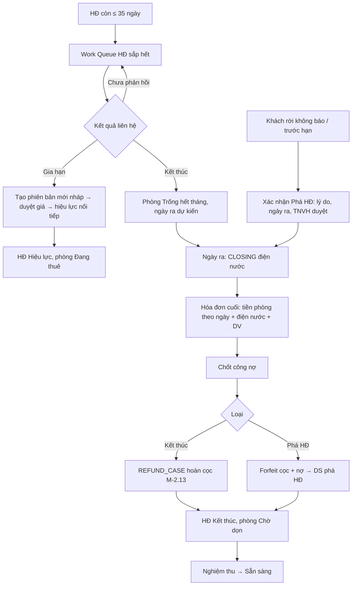
Đổi phòng: chọn phòng đích → CLOSING phòng cũ + OPENING phòng mới → event transfer → phòng cũ Chờ dọn, phòng mới Đang thuê. Bỏ cọc: HĐ Chờ ký → Hủy → forfeit → phòng Sẵn sàng.

### 2.12.9 Liên kết
| Module | Đọc/Ghi |
|---|---|
| M-2.04 | Ghi Trống hết tháng / Chờ dọn / Đang thuê (transfer) |
| M-2.05 | Đề xuất trạng thái khách Sắp hết HĐ / Phá HĐ / Hoàn cọc |
| M-2.06 | Ghi CONTRACT_VERSION (renew), CONTRACT_EVENT |
| M-2.08, M-2.09 | CLOSING; hóa đơn cuối |
| M-2.11 | DS phòng phá HĐ |
| M-2.13 | REFUND_CASE; forfeit |
| Chương 1 | Work Queue tổng hợp |
| Chương 3 | DT phá HĐ / tỷ lệ phá HĐ (D-53, F-48); trừ tiền phòng phòng trả khỏi DT phải thu (D-46) |
| Chương 4 | Không hoa hồng gia hạn (R-30); bỏ cọc → cơ sở HH (F-36) |
| Chương 5 | `EARLY_TERMINATION_COUNT` (đếm theo tháng ngày ra, cả CF/AC); `FORFEITED_DEPOSIT` (CF: memo, không cộng; AC: `OTHER_INCOME` tháng bỏ/phá — R-05, D-31) |

### 2.12.10 Audit / Notification
Audit mọi kết quả liên hệ, duyệt gia hạn, xác nhận phá HĐ (lý do, người). Notification: item mới ≤ 35 ngày → NVVH; ≤ 7 ngày chưa kết quả → TNVH; quá ngày kết thúc → TPVH; phá HĐ → kế toán (forfeit).

### 2.12.11 Nghiệm thu
- HĐ kết thúc 30/08/2027 xuất hiện trong queue ngày 26/07/2027 đúng quản lý; chọn Gia hạn tạo phiên bản 2.
- Phá HĐ `403G5` ngày ra 10/08/2026, lý do "Không đủ tài chính" → `EARLY_TERMINATION_COUNT` tháng 8 +1, cọc forfeit, nợ 1.580.000 vào DS phá HĐ.
- Kết thúc giữa tháng ngày 15 → hóa đơn cuối tiền phòng = giá ÷ 30 × 15.
- Đổi phòng 302 → 303 cùng tòa: không tăng phòng mới/phá HĐ, cọc chuyển, mã khách `303G6A00n` giữ n.

---

## 2.13 M-2.13 Cọc & Hoàn cọc

### 2.13.1 Mục tiêu
Sổ cọc (`DEPOSIT_LEDGER`: collect / transfer / forfeit / deduct / refund) theo HĐ; phiếu hoàn cọc (`REFUND_CASE`) theo công thức D-32 với các dòng khấu trừ; workflow Nháp → Chờ duyệt → Đã duyệt (admin/kế toán) → Đã hoàn; cọc khách bỏ (D-31, R-05); in "Hóa đơn hoàn cọc". Nguồn `NEW_DEPOSIT`, `REFUND_AMOUNT`, `FORFEITED_DEPOSIT`, `OTHER_INCOME` (AC).

### 2.13.2 Tác nhân
NVVH: lập phiếu hoàn cọc nháp (khấu trừ, ảnh hiện trạng), gửi duyệt. TNVH: kiểm tra. Kế toán/Admin: duyệt, chi hoàn, ghi ngày hoàn; sửa/hủy có audit. Khách: nhận tiền, ký biên bản (upload).

### 2.13.3 Dữ liệu
**DEPOSIT_LEDGER (1 dòng = 1 biến động cọc của HĐ)**

| Trường | Cột sổ Excel | Ghi chú |
|---|---|---|
| HĐ, Mã khách, Phòng | | |
| Loại: `collect` (thu) / `transfer` (chuyển phòng/HĐ gia hạn) / `forfeit` (giữ do bỏ/phá) / `deduct` (khấu trừ khi hoàn) / `refund` (hoàn thực chi) / `adjust` (điều chỉnh có duyệt) | F (cọc khách cũ), J (cọc mới), BT–BX (khách mới: cọc, ND & ngày CK) | |
| Số tiền (+ thu / − chi, giữ), Ngày, Chứng từ (payment / refund) | | |
| Số dư sau giao dịch | F | D-22 |
| Ghi chú | "thiếu cọc", "M10 cọc thêm 2tr" | |

**REFUND_CASE (phiếu hoàn cọc) — theo sheet HOÀN CỌC**

| Trường | Cột sổ HOÀN CỌC | Ghi chú |
|---|---|---|
| Mã, Tòa, Phòng, Quản lý, Kỳ TT | A–E | |
| Cọc gốc (số dư ledger) | Cọc | |
| Tiền phòng theo ngày (nếu ở thêm ngày chưa lên hóa đơn) | tiền phòng, Ngày ở | R-10 |
| Nợ cũ, Thu khác | Nợ cũ, Thu khác | Công nợ được bù |
| 7 dịch vụ: Điện (CS cũ/mới/SL/ĐG/TT), Nước, Vệ sinh, Mạng, Thang máy, Xe điện, Máy giặt | Điện … Máy giặt | Giá snapshot HĐ; CLOSING (M-2.08) |
| Khấu hao (200.000/phòng) | KHẤU HAO | D-32 |
| Sửa chữa, Dọn vệ sinh (100.000), Sơn phòng (500.000), DV khác | SỬA CHỮA, DỌN VỆ SINH, DV SƠN PHÒNG, DV KHÁC | Có ảnh/biên bản |
| Tổng khấu trừ (Tổng DV) | Tổng DV | |
| **Tổng hoàn lại** = Cọc − Tổng khấu trừ | Tổng hoàn lại | Âm → công nợ KH |
| Trạng thái, Ngày duyệt, Người duyệt, Ngày hoàn, Chứng từ chi, STK khách | Tình trạng ("Đã hoàn") | |
| Công nợ KH | Công nợ KH | Khi Tổng hoàn < 0 |
| Ghi chú | Ghi chú ("150k tiền sơn") | |

**Ví dụ công thức D-32** [Có bằng chứng nguồn — sheet HOÀN CỌC sổ T9]:
- `302G3`: cọc 4.500.000 − điện (520 − 415 = 105 kWh × 4.000) 420.000 − nước (15 − 11 = 4 m³ × 35.000) 140.000 − khấu hao 200.000 = **3.740.000** (Đã hoàn).
- `501T17`: cọc 3.800.000 − điện (7.877 − 7.777 = 100 × 4.000) 400.000 − khấu hao 200.000 − dọn VS 100.000 − sơn 500.000 = **2.600.000** (ghi chú "150k tiền sơn" — sơn thực 500.000 ghi trên phiếu).
- `205T25`: cọc 3.600.000 − điện 1.176.000 − khấu hao 200.000 − sửa chữa 500.000 − dọn VS 500.000 − sơn 300.000 = 924.000.
- Mẫu in `HĐ (HOÀN CỌC)` 701S21A001: Tiền phòng cọc 3.800.000 − Điện (4.868 − 4.638 = 230 × 4.000) 920.000 − Khấu hao 200.000 = **2.680.000** "TỔNG TIỀN HOÀN CỌC".

### 2.13.4 Search / Filter
Trạng thái phiếu · Tòa / quản lý / trưởng nhóm · Tháng hoàn (ngày chi) · Tháng kết thúc HĐ · Tổng hoàn âm · Loại ledger · Có forfeit · HĐ/khách/phòng.

### 2.13.5 Action
Xem sổ cọc theo HĐ · Ghi thu cọc (từ allocation M-2.10) · Ghi bổ sung cọc · Transfer (tự động từ đổi phòng/gia hạn) · Forfeit (từ phá HĐ/bỏ cọc, TNVH duyệt) · Lập phiếu hoàn cọc (tự điền cọc, CLOSING, nợ) · Thêm dòng khấu trừ + ảnh · Gửi duyệt · Duyệt / trả lại · Ghi đã hoàn (ngày, chứng từ, STK) · In Hóa đơn hoàn cọc · Hủy phiếu (chưa hoàn) · Export.

### 2.13.6 Business Rule
- **BR-2.13.1** Số dư cọc HĐ = Σ collect + transfer(vào) + adjust − transfer(ra) − forfeit − deduct − refund; không âm. [Đã chốt]
- **BR-2.13.2** Cọc thu ghi `collect` tại ngày payment; CF ghi `NEW_DEPOSIT` tại tháng khách vào ở (không phải tháng thu) (D-30, R-05). [Đã chốt]
- **BR-2.13.3** Tổng hoàn = Cọc − (tiền phòng theo ngày + 7 dịch vụ + khấu hao 200.000 + sửa chữa + dọn vệ sinh + sơn phòng + DV khác + nợ cũ + thu khác) (D-32). [Đã chốt + Có bằng chứng nguồn]
- **BR-2.13.4** Khấu hao 200.000/phòng mặc định luôn có trên phiếu, quản lý được sửa/bỏ có lý do; dọn vệ sinh mặc định 100.000; sơn phòng mặc định 500.000 (sổ có 300.000–500.000) — tham số theo tòa (P-16). [Có bằng chứng nguồn / Cần chốt mức mặc định → P-16]
- **BR-2.13.5** Tổng hoàn < 0 → refund = 0, phần âm → công nợ KH loại hoàn cọc (M-2.11). [Đã chốt]
- **BR-2.13.6** Mọi khấu trừ phải có dòng chi tiết (loại, số lượng, đơn giá, ảnh/biên bản); không nhập tổng gộp. [Đã chốt]
- **BR-2.13.7** Workflow: Nháp (NVVH) → Chờ duyệt → Đã duyệt (admin/kế toán) → Đã hoàn (ngày chi thực); trả lại → Nháp; chỉ Đã duyệt mới chi. [Đã chốt]
- **BR-2.13.8** `REFUND_AMOUNT` (CF) ghi tại tháng có **ngày hoàn thực chi**, không phải tháng kết thúc HĐ (R-02, R-05). [Đã chốt]
- **BR-2.13.9** Khấu trừ dịch vụ điện/nước trên phiếu là doanh thu dịch vụ (R-04); khấu hao/sửa chữa/dọn VS/sơn/DV khác → `OTHER_INCOME` (AC), không bù trừ chi phí sửa chữa (R-29). [Đã chốt / Cần chốt AC]
- **BR-2.13.10** Cọc khách bỏ / phá HĐ → `forfeit` toàn bộ số dư còn lại sau khấu trừ; CF: dòng memo `FORFEITED_DEPOSIT`, không cộng lại (đã trong `NEW_DEPOSIT`), hoàn cọc = 0; AC: `OTHER_INCOME` tháng bỏ/phá (D-31, R-05). [Đã chốt / Cần chốt AC]
- **BR-2.13.11** Hoàn cọc không tự chuyển phòng Sẵn sàng (BR-2.04.6). [Đã chốt]
- **BR-2.13.12** Không tạo phiếu hoàn khi HĐ chưa có CLOSING và hóa đơn cuối; phiếu tự điền từ 2 nguồn đó, sửa tay có lý do. [Cần chốt]
- **BR-2.13.13** Gia hạn: cọc giữ nguyên trên cùng HĐ (không transfer); thay đổi mức cọc → collect bổ sung hoặc refund phần chênh. [Đã chốt]
- **BR-2.13.14** Đổi phòng: `transfer` ra phòng cũ / vào phòng mới cùng ngày, cùng số tiền; không thu cọc mới (R-18). [Cần chốt]
- **BR-2.13.15** Cọc tiền mặt chưa nộp về công ty vẫn ghi collect nhưng payment `Chờ xác nhận` (BR-2.10.10). [Cần chốt]
- **BR-2.13.16** Phiếu hoàn thuộc kỳ báo cáo đã khóa không sửa; điều chỉnh vào kỳ hiện tại (R-08). [Cần chốt]
- **BR-2.13.17** Dòng "tiền phòng theo ngày" trên phiếu hoàn cọc chỉ trừ vào cọc khi khách **chưa đóng** tiền phòng các ngày ở thêm (số ngày ở sau kỳ hóa đơn cuối); tính theo giá ÷ 30 × ngày (R-10, P-03). Sổ HOÀN CỌC `301T41` ghi tiền phòng ÷ 31 nhưng Tổng hoàn không trừ tiền phòng (khách đã đóng) → đối soát ghi RULE_DIFFERENCE, giữ D-32 & ÷ 30. [Có bằng chứng nguồn / Cần chốt P-03]

### 2.13.7 State / Status
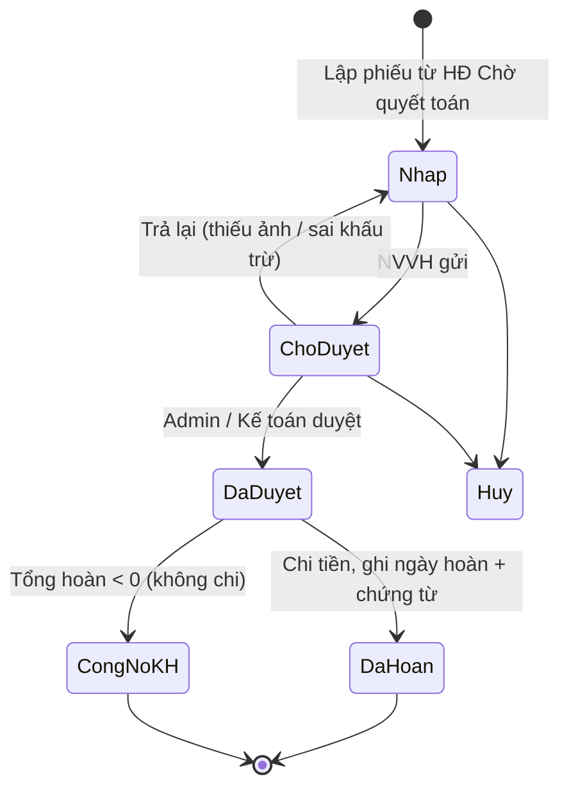
Ledger không có trạng thái; mỗi dòng bất biến, sửa bằng `adjust`.

### 2.13.8 Flow
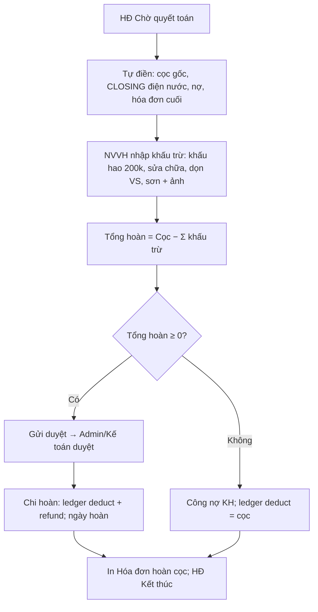
Nhánh phá HĐ/bỏ cọc: không lập phiếu hoàn; ledger `deduct` (điện nước, khấu trừ) + `forfeit` phần còn lại; TNVH duyệt.

### 2.13.9 Liên kết
| Module | Đọc/Ghi |
|---|---|
| M-2.06 | Cọc phải thu; kích hoạt yêu cầu đủ cọc |
| M-2.08, M-2.09 | CLOSING, hóa đơn cuối |
| M-2.10 | Allocation cọc → collect; chi hoàn là phiếu chi (không phải payment) |
| M-2.11 | Bù công nợ; công nợ KH âm |
| M-2.12 | Nhận sự kiện end / early_termination / abandon / transfer |
| Chương 4 | Chi phí sửa chữa thực tế ghi đủ qua Chi phí, độc lập với khấu trừ (R-29); hoa hồng bỏ cọc tính trên forfeit (D-54, F-36) |
| Chương 5 | Basis **CF**: `NEW_DEPOSIT` = Σ collect của HĐ có move_in trong tháng; `REFUND_AMOUNT` = Σ refund có ngày hoàn trong tháng; `FORFEITED_DEPOSIT` = Σ forfeit trong tháng (memo, không vào `TOTAL_REVENUE`); `TOTAL_REVENUE` (CF) trừ `REFUND_AMOUNT` (R-02). Basis **AC**: cọc không vào doanh thu; `OTHER_INCOME` = forfeit + khấu trừ ngoài dịch vụ (khấu hao, sửa chữa, dọn VS, sơn, DV khác) tháng phát sinh; dịch vụ khấu trừ vào `*_REVENUE` |

### 2.13.10 Audit / Notification
Audit mọi dòng ledger (không xóa), duyệt/trả lại/hủy phiếu, sửa mức khấu trừ mặc định. Notification: phiếu chờ duyệt → kế toán; đã duyệt > 3 ngày chưa hoàn → TNVH; HĐ Chờ quyết toán > 7 ngày chưa có phiếu → TPVH.

### 2.13.11 Nghiệm thu
- Phiếu `302G3` tự điền điện 105 kWh, nước 4 m³, khấu hao 200.000 → 3.740.000; duyệt → Đã hoàn ngày 05/09 → `REFUND_AMOUNT` tháng 9.
- Phiếu `501T17` với dọn VS 100.000 + sơn 500.000 → 2.600.000; in mẫu Hóa đơn hoàn cọc đúng dòng.
- Khấu trừ vượt cọc → Tổng hoàn âm → công nợ KH, không có refund.
- Phá HĐ `403G5` → forfeit, `FORFEITED_DEPOSIT` tháng 8 memo, không cộng `TOTAL_REVENUE`.

---

## 2.14 M-2.14 Zalo nhắc thanh toán

### 2.14.1 Mục tiêu
Gửi nhắc thanh toán chủ động qua **ZNS** (R-35) theo rule điều kiện + thời điểm, template có biến, lấy công nợ ngay trước gửi, lưu lịch sử gửi, chuyển phản hồi về trưởng phòng phụ trách, phương án dự phòng cho khách chưa liên kết.

### 2.14.2 Tác nhân
Admin: cấu hình OA/ZNS, template, rule. TPVH: duyệt rule/template, nhận phản hồi. NVVH: gửi tay theo hóa đơn/khách, xử lý dự phòng (gọi/SMS/nhắn tay). Khách: nhận tin, phản hồi.

### 2.14.3 Dữ liệu
Entity `ZALO_REMINDER_RULE`, `ZALO_MESSAGE_LOG`, Template, Integration config.

| Nhóm | Trường |
|---|---|
| Integration | OA id, App id, credentials (mã hóa), môi trường, webhook, trạng thái kết nối |
| Rule | Mã, Sự kiện (Phát hành / Trước hạn X ngày / Đúng hạn / Sau hạn X ngày / Mốc 5-10-15 / Thủ công), Giờ gửi, Điều kiện (còn nợ > 0, tòa, nhóm T/S/G, tuổi nợ, số tiền ≥), Số lần tối đa, Retry, Cần xác nhận tay?, Template, Trạng thái, Hiệu lực |
| Template | Mã, Tên, Sự kiện, Nội dung (ZNS template id), Biến: `{ten_khach}`, `{ma_phong}`, `{ky}`, `{tong_can_dong}`, `{da_dong}`, `{con_no}`, `{han_tt}`, `{tk_nhan}`, `{noi_dung_ck}`, `{sdt_quan_ly}`, Phiên bản, Hiệu lực |
| Log | Khách, HĐ, Hóa đơn, Rule, Template version, Số dư lúc gửi, Nội dung đã render, Kênh (ZNS / dự phòng), Thời điểm, Kết quả (Success / Fail / Skip + lý do), Retry count, Phản hồi khách (nếu có) |

### 2.14.4 Search / Filter
Kỳ · Tòa / quản lý · Rule · Kết quả · Kênh · Khách chưa liên kết · Có phản hồi chưa xử lý.

### 2.14.5 Action
Cấu hình kết nối · CRUD rule/template (preview/test) · Bật/tắt rule · Gửi tay 1/nhiều hóa đơn · Xem log & nội dung đã gửi · Retry · Đánh dấu phản hồi đã xử lý · Xử lý dự phòng (ghi "đã gọi/nhắn") · Export.

### 2.14.6 Business Rule
- **BR-2.14.1** Chỉ gửi cho hóa đơn `Phát hành`/`Thu một phần`; không gửi Nháp/Hủy/Đã thu đủ. [Đã chốt]
- **BR-2.14.2** Ngay trước khi gửi (và mỗi lần retry) tính lại số dư từ M-2.11; còn nợ = 0 → Skip có log (R-35). [Đã chốt]
- **BR-2.14.3** Rule do công ty tự đặt điều kiện + thời điểm; mặc định: khi phát hành, ngày 25, ngày cuối tháng, sau hạn 3 ngày, mốc 5/10/15; giờ gửi 8:00–20:00. [Đã chốt / Cần chốt mặc định]
- **BR-2.14.4** Cùng khách + cùng sự kiện + cùng hóa đơn không gửi trùng nếu lần trước Success, trừ khi rule mới. [Đã chốt]
- **BR-2.14.5** Nội dung đã render (số tiền, hạn) lưu nguyên văn để đối chiếu. [Đã chốt]
- **BR-2.14.6** Khách chưa liên kết Zalo hoặc ZNS thất bại sau retry → tạo việc dự phòng cho NVVH (gọi/SMS/nhắn tay) trong Work Queue, log kênh "dự phòng" (R-35). [Đã chốt]
- **BR-2.14.7** Phản hồi của khách (qua OA) định tuyến về **trưởng phòng phụ trách** tòa (TPVH theo phân công R-33) và hiển thị hội thoại đồng bộ; NVVH được xem. [Đã chốt]
- **BR-2.14.8** Template có phiên bản và ngày hiệu lực; tin đã gửi giữ phiên bản lúc gửi. [Đã chốt]
- **BR-2.14.9** Không gửi tin cho khách có cờ "không nhắn" (khiếu nại/pháp lý) — admin đặt. [Cần chốt]
- **BR-2.14.10** Rule "cần xác nhận tay" → tin vào hàng đợi chờ NVVH bấm gửi; rule tự động gửi theo lịch. [Đã chốt]

### 2.14.7 State / Status
Message: `Scheduled` → `Sent` / `Failed` → `Retrying` → `Sent` / `Gave up` → `Fallback`; `Skipped` (đã thu đủ). Rule: `Nháp` → `Hiệu lực` → `Tắt`.

### 2.14.8 Flow
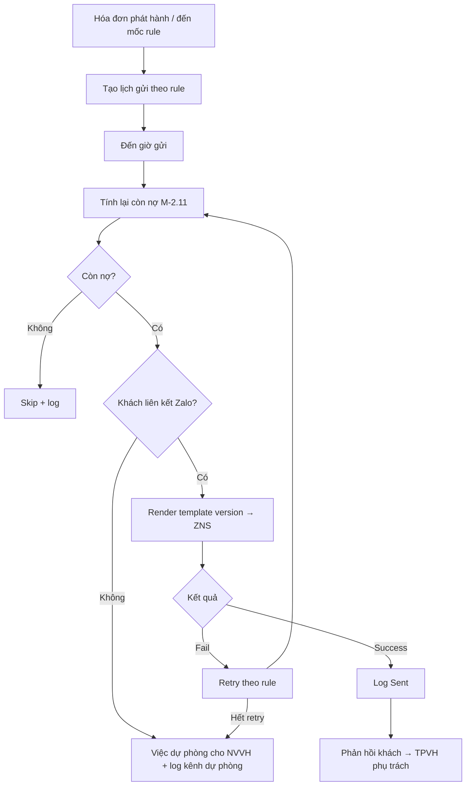

### 2.14.9 Liên kết
| Module | Đọc/Ghi |
|---|---|
| M-2.05 | ZaloID, cờ liên kết |
| M-2.09, M-2.11 | Hóa đơn, số dư |
| M-2.10 | Đã thu đủ → skip |
| Chương 1 | Work Queue việc dự phòng |
| Chương 3 | Phân công → người nhận phản hồi (R-33) |
| Chương 5 | Không có metric; báo cáo tỷ lệ gửi/thu sau nhắc là báo cáo phụ |

### 2.14.10 Audit / Notification
Audit cấu hình, rule, template, gửi tay. Notification: kết nối OA lỗi → admin; tỷ lệ Fail > 20% batch → TPVH; phản hồi mới → TPVH phụ trách.

### 2.14.11 Nghiệm thu
- Hóa đơn 204S12 phát hành 25/08 → ZNS ngay với `{con_no}` = 6.466.000; khách trả 27/08 → tin ngày 31/08 Skip.
- Khách chưa liên kết → việc dự phòng xuất hiện cho NVVH; ghi "đã gọi".
- Phản hồi khách hiển thị cho TPVH phụ trách tòa và NVVH.
- Đổi template ngày 01/09: tin gửi 31/08 vẫn xem được phiên bản cũ.

---

## 2.15 Tổng hợp chương 2

### 2.15.1 Ma trận metric chương 5 lấy từ chương 2

| Metric | Basis CF (M-2.xx) | Basis AC (M-2.xx) |
|---|---|---|
| `TOTAL_REVENUE` | Σ allocation trong tháng − `REFUND_AMOUNT` (M-2.10, M-2.13) | Σ hóa đơn phát hành (trừ dòng cọc, nợ cũ) + `OTHER_INCOME` (M-2.09, M-2.13) |
| `RENT_REVENUE` | Allocation vào dòng tiền phòng (M-2.10) | Dòng 1 hóa đơn phát hành (M-2.09); kỳ TT > 1 → `DEFERRED_REVENUE` |
| 7 `*_REVENUE`, `SERVICE_REVENUE` | Allocation vào dòng DV (M-2.10) | Dòng 3–10, 12 hóa đơn + dòng DV phiếu hoàn cọc (M-2.09, M-2.13) |
| `NEW_DEPOSIT` | collect của HĐ move_in trong tháng (M-2.13) | Không (cọc ngoài doanh thu) |
| `REFUND_AMOUNT` | refund theo ngày hoàn (M-2.13) | Không |
| `FORFEITED_DEPOSIT` | memo (M-2.13) | → `OTHER_INCOME` tháng bỏ/phá |
| `OTHER_INCOME` | — | forfeit + khấu trừ ngoài DV + thu khác loại phạt/đền bù (M-2.09, M-2.13) |
| `HEAD_LEASE_COST` / `HEAD_LEASE_COST_AC` | Lịch trả M-2.02 (chương 4 ghi phiếu chi) | Thẳng hàng R-27 từ M-2.02 |
| `NEW_ROOM_COUNT` | CONTRACT_EVENT new theo tháng move_in (M-2.06) | như CF |
| `EARLY_TERMINATION_COUNT` | CONTRACT_EVENT early_termination theo tháng ngày ra (M-2.12) | như CF |
| `VACANT_ROOM_COUNT` | ROOM_STATUS_HISTORY ngày cuối tháng, 3 loại (M-2.04) | như CF |

### 2.15.2 Liên kết chương 3 và 4
- Chương 3 đọc: DT niêm yết (M-2.04/M-2.06), DT phải thu (M-2.09), M5/M10/M15 (M-2.10), DT thu thêm (M-2.09 hóa đơn đầu), DT phá HĐ (M-2.12), phân công (R-33) để gán tòa cho người.
- Chương 4 đọc: lịch trả chủ nhà (M-2.02), điện nước phòng trống VACANT (M-2.08) → chi phí giá gốc, khấu trừ cọc → thu nhập khác không bù trừ (M-2.13), giá chốt/thời hạn/forfeit cho hoa hồng import (M-2.06, M-2.13), thời hạn HĐ đầu vào còn lại cho khấu hao (M-2.02).

### 2.15.3 Điểm chờ chốt phát sinh riêng chương 2 (đã cấp mã P-xx chính thức tại §6.1)

| Mã P | Nội dung | Module |
|---|---|---|
| P-15 | Phân bổ tiền thuê 1 HĐ nhiều tòa (S19A/B/C): theo số phòng hay tỷ lệ nhập tay | M-2.02, M-4.05 |
| P-23 | Ngưỡng "HĐ đầu vào sắp hết" (6 tháng) và mốc nhắc trả chủ nhà 15/7/1 ngày | M-2.02, M-4.05 |
| P-16 | Mức khấu trừ mặc định hoàn cọc: khấu hao 200.000, dọn VS 100.000, sơn 300.000–500.000 — theo tòa | M-2.13 |
| P-24 | Thời điểm sinh mã khách (Chờ ký hay kích hoạt) và mã khi đổi phòng | M-2.05 |
| P-25 | Ảnh công tơ bắt buộc với OPENING/CLOSING | M-2.08 |
| P-26 | Tiền mặt do NVVH thu: trạng thái Chờ xác nhận có tính mốc M5/M10/M15 không | M-2.10 |
| P-14 | Thứ tự phân bổ payment vào dòng hóa đơn (nợ cũ → DV → thu khác → tiền phòng → cọc) | M-2.10, M-5.02 |
| (đã chốt bằng bằng chứng nguồn) | Dòng `000<tòa>` (công tơ tổng, 3.500/2.700) và cột CB–CH "điện vệ sinh chung" (3.800 chia theo người) là **2 công tơ khác nhau** — D-03/D-18, BR-2.03.5, BR-2.08.14 | M-2.03, M-2.08 |
