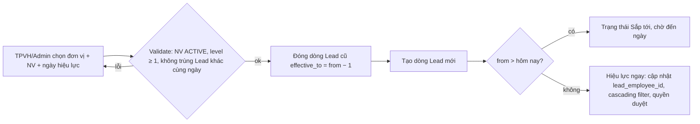
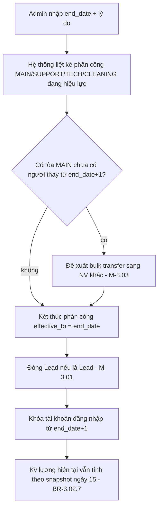
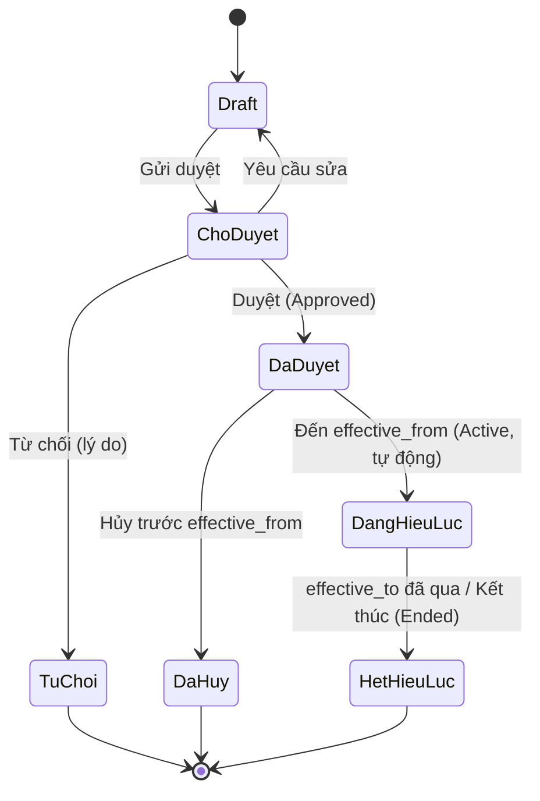
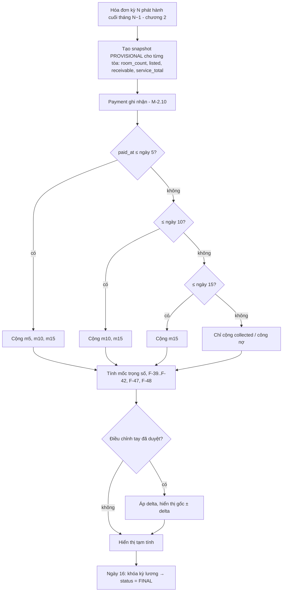
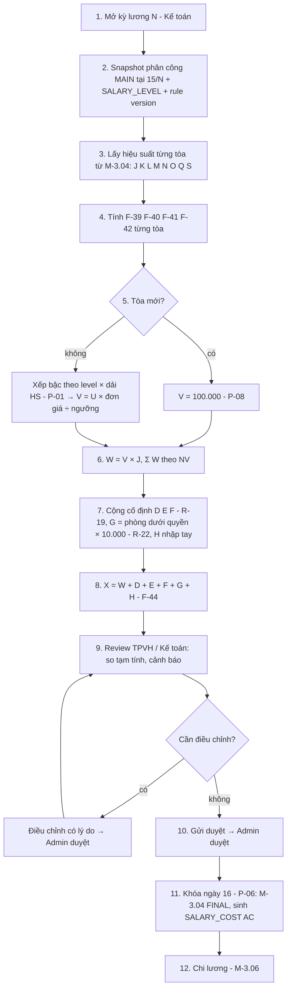
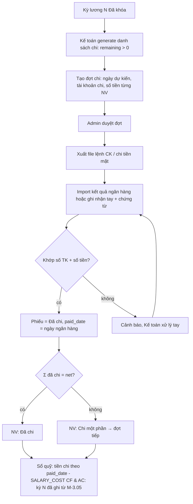

# 3. Nội bộ: tổ chức, nhân sự, hiệu suất, lương

> Chương này mô tả 6 module khối nội bộ của TimoHouse Phase 1 theo mẫu 11 nhóm §0.1 của `00_shared_brief.md`. Mọi thuật ngữ (D-xx), rule chung (R-xx), công thức (F-xx), tham số (P-xx), hạng mục ngoài phạm vi (X-xx) **chỉ tham chiếu bằng mã**, không định nghĩa lại. Nguồn bằng chứng số liệu: `bảng lương tháng 8.xlsx` sheet `THÁNG 8` (đọc công thức gốc) và `Hoá đơn tiền nhà tháng 9 và dịch vụ tháng 9 năm 2026.xlsx` sheet `cập nhật thu tiền` (cập nhật ngày 16/9/2026); spec v1.8 §12.17–12.20 cho trường dữ liệu / trạng thái.

Chuỗi module: **M-3.01 Cơ cấu tổ chức → M-3.02 Nhân sự → M-3.03 Phân công tòa nhà → M-3.04 Hiệu suất thu tiền → M-3.05 Bảng lương → M-3.06 Chi lương**. Đầu ra của chương này là 2 dòng chi phí lương đi vào chương 4 (lương cố định phân bổ theo số phòng R-26; lương hiệu suất ghi thẳng tòa D-39) và metric `SALARY_COST` (basis CF / AC) ở chương 5.

Ghi chú phạm vi: chương này chỉ mô tả lương của **khối Vận hành** (TPVH, TNVH/trưởng khu vực, NVVH). Lương các phòng Kinh doanh, Kỹ thuật, Thị trường, Tài chính – Kế toán thuộc **X-05** ("gặp trực tiếp"); Phase 1 chỉ giữ chỗ 1 dòng "lương cố định nhập tay" cho các chức danh này để phân bổ chi phí (R-26) và chi lương (M-3.06).

Quy ước ký hiệu trong công thức: `J K L M N O P Q R S T U V W X` = cột tương ứng của sheet `THÁNG 8` (bảng 3.5.3); `M5 / M10 / M15` = số thu lũy kế đến 23:59 ngày 5 / 10 / 15 (D-47).

---

## 3.1 M-3.01 Cơ cấu tổ chức

### 3.1.1 Mục tiêu

Quản lý cây tổ chức của công ty có lịch sử theo ngày hiệu lực, để (1) xác định Lead của từng đơn vị (ai là trưởng nhóm của NVVH nào → lương trưởng nhóm R-22, quyền duyệt), (2) làm trục cho **cascading filter** trên mọi màn hình (R-34: khu vực → trưởng nhóm → quản lý → tòa → loại nhà) và (3) phân quyền theo đơn vị. Cây tổ chức **không** quyết định ai quản lý tòa nào — việc đó thuộc M-3.03 (R-33).

### 3.1.2 Tác nhân

| Vai trò | Quyền trong module |
|---|---|
| Admin (Quản lý tổng) | Tạo/sửa/di chuyển/ngừng đơn vị; bổ nhiệm Lead mọi cấp; xem lịch sử |
| Kế toán / HR (nếu có) | Tạo nháp thay đổi; xem cây; export |
| TPVH | Đề xuất bổ nhiệm TNVH / trưởng khu vực, đề xuất tách nhóm; xem cây khối Vận hành |
| TNVH / trưởng khu vực | Xem cây nhóm mình; xem lịch sử Lead |
| NVVH và các vai trò khác | Chỉ xem đơn vị của mình (tên đơn vị, Lead) |

### 3.1.3 Dữ liệu

**Cây tổ chức Phase 1** (đọc từ bảng lương tháng 8 và file "nội dung làm web"):

```
Công ty (HT CCMN TIMEHOUSE)
├─ Quản lý tổng (Admin)
├─ Phòng Vận hành ── Lead: TPVH (Đặng Đình Mạnh)
│  ├─ Nhóm vận hành / Khu vực 1 ── Lead: TNVH (Trần Quang Huy) ── NVVH: Huyền, Linh, Khải, …
│  ├─ Nhóm vận hành / Khu vực 2 ── Lead: TNVH hoặc trưởng khu vực ── NVVH: …
│  ├─ Tổ Kỹ thuật
│  └─ Tổ Vệ sinh
├─ Phòng Tài chính – Kế toán
├─ Phòng Kinh doanh (TNKD, NVKD, SALE) — lương ngoài phạm vi X-05
└─ Phòng Thị trường — lương ngoài phạm vi X-05
```

**ORG_UNIT** (spec §12.17.1)

| Trường | Kiểu | Ghi chú |
|---|---|---|
| `code` | text, duy nhất | `OPS`, `OPS-KV1`, `TECH`, `CLEAN`, `FIN`, `SALES`, `MKT` |
| `name` | text | Tên hiển thị |
| `type` | enum | `COMPANY` / `DEPARTMENT` / `TEAM` / `AREA` |
| `parent_id` | FK ORG_UNIT | null với cấp Công ty |
| `area_code` | text, tùy chọn | Khu vực địa lý (Mỹ Đình, Cầu Giấy…) — dùng cho bộ lọc "Khu vực" R-34 |
| `lead_employee_id` | FK EMPLOYEE | Lead **đang hiệu lực** (denormalize từ ORG_UNIT_LEAD_HISTORY) |
| `effective_from` / `effective_to` | date | Đơn vị có hiệu lực từ–đến |
| `status` | enum | `ACTIVE` / `INACTIVE` / `PLANNED` |

**ORG_UNIT_LEAD_HISTORY** (bổ sung để thỏa "Lead history không ghi đè")

| Trường | Ghi chú |
|---|---|
| `org_unit_id`, `employee_id` | |
| `effective_from` / `effective_to` | Không chồng lấn trên cùng `org_unit_id` |
| `decision_ref`, `reason` | Số quyết định / lý do |
| `created_by`, `approved_by`, `created_at` | |

**POSITION** (spec §12.17.2)

| Trường | Ghi chú |
|---|---|
| `code`, `name` | `TPVH`, `TNVH`, `TKV` (trưởng khu vực), `NVVH`, `KT` (kỹ thuật), `VS` (vệ sinh), `KETOAN`, `TNKD`, `NVKD`, `SALE`, `ADMIN` |
| `management_level` | 0 = nhân viên, 1 = trưởng nhóm/khu vực, 2 = trưởng phòng, 3 = quản lý tổng |
| `unit_types_allowed` | Loại đơn vị được gán chức danh này |
| `is_ops_payroll` | `true` với TPVH/TNVH/TKV/NVVH → tính lương ở M-3.05; `false` → X-05 |
| `effective_date` | |

### 3.1.4 Search / Filter

- Xem cây **tại một ngày** (mặc định hôm nay; chọn ngày quá khứ/tương lai để xem cây có hiệu lực tại ngày đó).
- Lọc theo: loại đơn vị, khu vực, trạng thái, Lead, chức danh; tìm theo mã/tên đơn vị, tên Lead.
- Phạm vi theo vai trò: Admin/Kế toán thấy toàn cây; TPVH thấy khối Vận hành; TNVH thấy nhóm của mình và các nhóm con; NVVH chỉ thấy nhánh của mình.
- Danh sách "Khu vực / Trưởng nhóm / Quản lý" của cascading filter ở mọi màn hình khác đọc từ module này + M-3.03 tại ngày xem.

### 3.1.5 Action

| Action | Ai | Kết quả |
|---|---|---|
| Tạo / sửa đơn vị | Admin | Tạo ORG_UNIT với `effective_from` (mặc định hôm nay; cho phép tương lai) |
| Di chuyển đơn vị (đổi parent) | Admin | Ghi lịch sử parent theo ngày hiệu lực |
| Bổ nhiệm / thay Lead | Admin (TPVH đề xuất) | Đóng dòng Lead cũ (`effective_to = from − 1`), mở dòng mới |
| Ngừng hoạt động | Admin | `status = INACTIVE`, `effective_to` = ngày ngừng |
| Xem cây theo ngày | Mọi vai trò theo phạm vi | Render cây có hiệu lực tại ngày chọn |
| Xem lịch sử | Admin/Kế toán/TPVH | Timeline đơn vị + Lead |
| Export | Admin/Kế toán | Excel cây + lịch sử Lead |

### 3.1.6 Business Rule

- **BR-3.01.1** Mỗi đơn vị có **đúng một Lead** đang hiệu lực tại một thời điểm; bổ nhiệm Lead mới tự động kết thúc Lead cũ vào ngày liền trước ngày hiệu lực. [Đã chốt]
- **BR-3.01.2** Lịch sử Lead **không ghi đè**: mọi thay đổi tạo dòng mới trong ORG_UNIT_LEAD_HISTORY, giữ nguyên dòng cũ. [Đã chốt]
- **BR-3.01.3** Cây không có chu trình; đơn vị cha phải `ACTIVE` tại ngày hiệu lực của đơn vị con. [Đã chốt]
- **BR-3.01.4** Thay đổi có ngày hiệu lực tương lai **không tác động** trước ngày đó (cây hôm nay, quyền, cascading filter vẫn theo trạng thái cũ). [Đã chốt]
- **BR-3.01.5** Không được ngừng hoạt động đơn vị còn đơn vị con hoặc nhân viên có `EMPLOYMENT_ASSIGNMENT` hiệu lực; phải điều chuyển trước. [Cần chốt]
- **BR-3.01.6** "Khu vực" (R-34, D-06) là thuộc tính `area_code` gắn với đơn vị cấp `TEAM`/`AREA` của khối Vận hành; trưởng khu vực = Lead của đơn vị đó; một NVVH thuộc đúng một khu vực tại một thời điểm. [Cần chốt]
- **BR-3.01.7** Cascading filter chuẩn cho mọi màn hình: Khu vực → Trưởng nhóm (Lead đơn vị) → Quản lý (NVVH phụ trách chính) → Tòa → Loại nhà (T/S/G, L1–L3); chọn cấp trên thu hẹp danh sách cấp dưới; dữ liệu Quản lý → Tòa lấy từ M-3.03 tại ngày xem. [Đã chốt]
- **BR-3.01.8** Các đơn vị Kinh doanh / Kỹ thuật / Thị trường / TC-KT có trong cây để phân quyền và lọc; **lương** của các chức danh thuộc đơn vị này ngoài phạm vi (X-05). [Đã chốt]
- **BR-3.01.9** Chỉ Admin sửa cây và bổ nhiệm Lead; TPVH chỉ tạo đề xuất (bản nháp) trong khối Vận hành. [Cần chốt]
- **BR-3.01.10** Lead của đơn vị phải là nhân viên `ACTIVE` (đang làm hoặc thử việc) có chức danh `management_level ≥ 1`. [Cần chốt]
- **BR-3.01.11** Số phòng "dưới quyền" của một Lead (dùng cho R-22) = Σ **tổng phòng đang quản lý (kể cả trống)** của các tòa mà NVVH phụ trách chính thuộc đơn vị do Lead đó đứng đầu (đệ quy xuống đơn vị con) tại snapshot ngày 15 của kỳ lương (R-23); TPVH tính trên **toàn hệ thống**. Đây là mẫu số riêng, khác số phòng tính hiệu suất (774 + 408 = 1.182 > 1.079 tháng 8) → P-12. [Cần chốt → P-12]

### 3.1.7 State / Status

| Trạng thái ORG_UNIT | Điều kiện vào | Chuyển đi |
|---|---|---|
| `PLANNED` | `effective_from` > hôm nay | → `ACTIVE` khi đến ngày hiệu lực (tự động) |
| `ACTIVE` | Đang hiệu lực | → `INACTIVE` khi ngừng (BR-3.01.5) |
| `INACTIVE` | Đã ngừng, giữ lịch sử | Không quay lại; tạo đơn vị mới nếu cần |

Dòng Lead: `Hiệu lực` (từ ≤ hôm nay ≤ đến hoặc đến = null) / `Sắp tới` / `Đã kết thúc`.

### 3.1.8 Flow

Luồng bổ nhiệm / thay Lead (4 bước, có ngoại lệ):



Ngoại lệ: Lead nghỉ việc (M-3.02) trước khi có người thay → đơn vị ở trạng thái "thiếu Lead", Work Queue cảnh báo Admin; phân công tòa và lương HS của NVVH không bị ảnh hưởng, riêng lương trưởng nhóm kỳ đó = 0 cho vị trí trống.

### 3.1.9 Liên kết

| Module | Đọc / ghi |
|---|---|
| M-3.02 Nhân sự | Đọc `main_org_unit`, `position` của NV; ghi Lead |
| M-3.03 Phân công | Đọc `org_unit_snapshot` khi tạo phân công; cascading filter |
| M-3.05 Bảng lương | Đọc Lead + cây con để tính số phòng dưới quyền (R-22, BR-3.01.11) |
| Chương 1 Work Queue | Cảnh báo đơn vị thiếu Lead |
| Chương 2, 4, 5 | Mọi màn hình dùng cascading filter R-34 (BR-3.01.7) |

### 3.1.10 Audit / Notification

- Audit log: tạo/sửa/di chuyển/ngừng đơn vị, mọi dòng Lead (ai, khi nào, giá trị cũ → mới, lý do).
- Thông báo: Lead mới (cho người được bổ nhiệm + TPVH), đơn vị thiếu Lead (Admin), thay đổi có hiệu lực tương lai đến hạn (Admin).

### 3.1.11 Nghiệm thu

- Nhập được cây 6 nhánh ở 3.1.3 với Lead TPVH, TNVH và ít nhất 2 nhóm/khu vực; xem cây tại ngày 01/08/2026 và 01/10/2026 cho kết quả khác nhau khi có bổ nhiệm hiệu lực 01/09.
- Thay Lead một nhóm → lịch sử có 2 dòng không chồng ngày; màn hình tòa lọc theo "Trưởng nhóm" trả về đúng danh sách NVVH mới từ ngày hiệu lực.
- Không tạo được chu trình cha–con; không ngừng được đơn vị còn NV.

---

## 3.2 M-3.02 Nhân sự

### 3.2.1 Mục tiêu

Quản lý hồ sơ nhân viên, chức danh, **level** và bảng lương cố định theo level (R-19) có ngày hiệu lực, trạng thái làm việc, tài khoản ngân hàng nhận lương; hiển thị các chỉ số vận hành gắn với nhân viên (số tòa & phòng đang quản lý, hiệu suất, bảng lương) mà không tính lại ở đây.

### 3.2.2 Tác nhân

| Vai trò | Quyền |
|---|---|
| Admin | Toàn quyền hồ sơ, level, SALARY_LEVEL, nghỉ việc |
| Kế toán | Sửa SALARY_LEVEL, tài khoản ngân hàng, lương hỗ trợ; xem toàn bộ (R-34) |
| TPVH | Tạo hồ sơ NVVH mới (nháp), đề xuất level, xem toàn khối Vận hành |
| TNVH / trưởng khu vực | Xem NV trong nhóm (hồ sơ, phân công, hiệu suất; **không** thấy lương cố định người khác) |
| NVVH | Xem hồ sơ, phân công, hiệu suất, bảng lương **của mình** |

### 3.2.3 Dữ liệu

**EMPLOYEE** (spec §12.18.1 + bổ sung)

| Trường | Ghi chú |
|---|---|
| `code` | Mã NV duy nhất, không tái sử dụng |
| `full_name`, `phone`, `email`, `id_number`, `address` | Liên hệ / CCCD |
| `start_date`, `end_date` | Ngày vào / ngày nghỉ |
| `employment_status` | `PROBATION` (thử việc) / `ACTIVE` (đang làm) / `RESIGNED` (nghỉ việc) |
| `main_org_unit_id`, `position_code` | Đơn vị chính, chức danh (denormalize từ EMPLOYMENT_ASSIGNMENT `is_main`) |
| `level_code` | Level dùng cho lương cố định **và** cột đơn giá/phòng (BR-3.02.11) |
| `bank_accounts[]` | Ngân hàng, số TK, tên chủ TK, `is_default`, hiệu lực |
| `documents[]` | HĐ lao động, CCCD, quyết định |
| `is_shareholder` (computed) | `true` nếu có dòng trong SHAREHOLDER (chương 4) — chỉ đọc, R-24 |
| `seniority` (computed) | `today − start_date` (năm, tháng) |
| `buildings_managed` / `rooms_managed` (computed) | COUNT / Σ số phòng các tòa có BUILDING_ASSIGNMENT `MAIN` hiệu lực hôm nay (M-3.03) |

**EMPLOYMENT_ASSIGNMENT** (gán đơn vị/chức danh, có lịch sử)

| Trường | Ghi chú |
|---|---|
| `employee_id`, `org_unit_id`, `position_code`, `level_code` | |
| `is_main` | Đúng 1 dòng `true` tại một thời điểm |
| `effective_from` / `effective_to` | |
| `reason`, `decision_ref`, `created_by`, `approved_by` | |

**SALARY_LEVEL** (lương cố định theo level, R-19)

| Trường | Ghi chú |
|---|---|
| `level_code` | `TPVH`, `TNVH`, `NVVH-1`, `NVVH-2`, … (level = chức danh + bậc) |
| `position_code` | Chức danh áp dụng |
| `base_salary` | Lương cơ bản (cột D bảng lương) |
| `lunch_allowance` | Phụ cấp ăn trưa (cột E) |
| `fuel_allowance` | Phụ cấp xăng xe (cột F) |
| `support_default` | Lương hỗ trợ mặc định (cột H) — có thể 0, nhập tay theo kỳ vẫn được (BR-3.02.5) |
| `perf_unit_price_column` | Cột đơn giá/phòng trong bảng bậc PAYROLL_RULE_VERSION (M-3.05) |
| `effective_from` / `effective_to`, `version` | Sửa = tạo phiên bản mới |

Giá trị hiện hành đọc từ bảng lương tháng 8 [Có bằng chứng nguồn]:

| Level | LCB (D) | Ăn trưa (E) | Xăng xe (F) | Trưởng nhóm (G) | Hỗ trợ (H) | Ví dụ |
|---|---|---|---|---|---|---|
| TPVH | 10.000.000 | 500.000 | 700.000 | `=774*10000` = 7.740.000 (R-22) | 0 | Đặng Đình Mạnh, thực nhận 18.940.000 |
| TNVH | 10.000.000 | 500.000 | 700.000 | `=408*10000` = 4.080.000 (R-22) | 0 | Trần Quang Huy, thực nhận 15.280.000 |
| NVVH bậc 1 (đơn giá gốc 130k) | 0 | 500.000 | 500.000 | 0 | nhập tay (Huyền 2.000.000) | Huyền, Linh, Khải, Trường, Lâm, Kiên, Hương |
| NVVH bậc 2 (đơn giá gốc 120k) | 0 | 500.000 | 500.000 | 0 | nhập tay | Phương, Thủy, Nụ, Giang, Tú |
| TNKD / NVKD / SALE | 10.000.000 / 5.000.000 / 1.400.000–3.000.000 | 500.000 | 500.000 | — | — | X-05, chỉ giữ chỗ |

Tổng cột cố định toàn bảng tháng 8: D = 91.434.616; E = 17.919.231; F = 9.400.000; G = 11.820.000 (bao gồm cả khối KD).

### 3.2.4 Search / Filter

- Tìm theo mã, tên, SĐT; lọc theo đơn vị (cascading BR-3.01.7), chức danh, level, trạng thái, khu vực, trưởng nhóm, "đang quản lý tòa X", ngày vào (thâm niên ≥ n tháng), là cổ đông.
- Phạm vi theo vai trò như 3.2.2; NVVH chỉ thấy mình.
- Cột hiển thị danh sách: mã, tên, chức danh, level, đơn vị, trưởng nhóm, trạng thái, số tòa / số phòng đang quản lý, thâm niên, HS tạm tính kỳ hiện tại (đọc M-3.04).

### 3.2.5 Action

| Action | Ai | Ghi chú |
|---|---|---|
| Tạo / sửa hồ sơ | Admin, TPVH (nháp), Kế toán | |
| Gán đơn vị / chức danh / level | Admin | Tạo EMPLOYMENT_ASSIGNMENT mới có ngày hiệu lực |
| Điều chuyển tổ chức | Admin | Đóng dòng cũ, mở dòng mới; phân công tòa **không** tự đổi (M-3.03 xử lý) |
| Bổ nhiệm Lead | Admin | Gọi M-3.01 |
| Chuyển thử việc → đang làm | Admin/Kế toán | Có thể kèm đổi level |
| Nghỉ việc | Admin | Nhập `end_date`; kích hoạt BR-3.02.6 |
| Quản lý SALARY_LEVEL | Kế toán/Admin | Tạo phiên bản mới có hiệu lực |
| Thêm/đổi tài khoản ngân hàng | Kế toán/Admin | Ghi lịch sử |
| Xem phân công tòa / hiệu suất / bảng lương | Theo phạm vi | Mở tab dữ liệu từ M-3.03/M-3.04/M-3.05 |
| Export | Admin/Kế toán | Danh sách NV, bảng level |

### 3.2.6 Business Rule

- **BR-3.02.1** Mã NV duy nhất và không tái sử dụng sau khi nghỉ việc; NV quay lại làm = hồ sơ cũ mở lại với `start_date` mới, giữ lịch sử. [Cần chốt]
- **BR-3.02.2** Mỗi NV có đúng một đơn vị chính (`is_main`) tại một thời điểm; kiêm nhiệm được phép qua dòng EMPLOYMENT_ASSIGNMENT phụ. [Đã chốt]
- **BR-3.02.3** Lương cố định (LCB, ăn trưa, xăng xe) của kỳ lương = giá trị SALARY_LEVEL **hiệu lực tại ngày chốt kỳ** (ngày 16, P-06); Phase 1 không prorate theo ngày công. [Cần chốt]
- **BR-3.02.4** Sửa SALARY_LEVEL luôn tạo phiên bản mới có `effective_from`; kỳ lương đã khóa giữ giá trị snapshot, không tính lại. [Đã chốt]
- **BR-3.02.5** Lương hỗ trợ là khoản nhập tay theo NV × kỳ lương, có lý do; SALARY_LEVEL chỉ giữ giá trị mặc định gợi ý. [Có bằng chứng nguồn]
- **BR-3.02.6** Khi nhập `end_date`, hệ thống tự kết thúc mọi phân công tòa hiệu lực (`effective_to = end_date`) và tạo cảnh báo Work Queue "tòa chưa có phụ trách chính từ ngày X" cho TPVH. [Cần chốt]
- **BR-3.02.7** NV nghỉ giữa kỳ vẫn có dòng lương kỳ đó nếu còn là phụ trách chính của ít nhất một tòa tại snapshot ngày 15 (R-23); lương cố định tính đủ, không prorate. [Cần chốt]
- **BR-3.02.8** Chỉ một tài khoản ngân hàng `is_default` tại một thời điểm; đổi tài khoản mặc định cần Kế toán/Admin thực hiện và ghi audit; phiếu chi lương (M-3.06) snapshot số tài khoản tại thời điểm chi. [Cần chốt]
- **BR-3.02.9** Cờ "là cổ đông" chỉ đọc từ module Cổ đông (chương 4); phần cổ phần **không** xuất hiện trong bảng lương hay chi phí lương (R-24). [Đã chốt]
- **BR-3.02.10** Lương cố định và lương thực nhận là dữ liệu nhạy cảm: NV chỉ xem của mình; TNVH xem tổng lương HS của NV dưới quyền (không xem cố định); Admin/Kế toán xem và sửa (R-34). [Cần chốt]
- **BR-3.02.11** Level NVVH quyết định **cột đơn giá/phòng** trong bảng bậc (bậc 1: 130k ở ngưỡng 100; bậc 2: 120k ở ngưỡng 100 — bảng 3.5.3); tiêu chí xếp/lên bậc chưa có (Q31) → Phase 1 Admin nhập tay có lý do. [Cần chốt]
- **BR-3.02.12** NV thử việc vẫn được phân công tòa và tính lương HS như NV chính thức; khác biệt chỉ ở SALARY_LEVEL (nếu công ty đặt level thử việc riêng). [Cần chốt]
- **BR-3.02.13** "Số tòa & phòng đang quản lý" là giá trị tính động từ M-3.03 (vai trò `MAIN`, hiệu lực hôm nay), không lưu tay. [Đã chốt]

### 3.2.7 State / Status

| Trạng thái | Vào | Ra |
|---|---|---|
| `PROBATION` | Tạo hồ sơ với ngày vào | → `ACTIVE` khi Admin xác nhận hết thử việc |
| `ACTIVE` | Chính thức | → `RESIGNED` khi nhập `end_date` |
| `RESIGNED` | `end_date` ≤ hôm nay | Không phân công mới; còn được chi lương kỳ cuối; → `ACTIVE` khi quay lại (BR-3.02.1) |

Nếu `end_date` ở tương lai: trạng thái hiển thị "Sắp nghỉ (dd/mm)"; mọi ràng buộc theo ngày.

### 3.2.8 Flow

Luồng nghỉ việc (ngoại lệ chính của module):



Luồng thay đổi SALARY_LEVEL: Kế toán tạo phiên bản mới (`effective_from` = đầu tháng kế) → Admin duyệt → kỳ lương có ngày chốt ≥ `effective_from` dùng phiên bản mới; kỳ đã khóa không đổi.

### 3.2.9 Liên kết

| Module | Quan hệ |
|---|---|
| M-3.01 | Đọc đơn vị/chức danh; ghi Lead |
| M-3.03 | Đọc phân công để tính số tòa/phòng; nhận sự kiện nghỉ việc |
| M-3.05 | Đọc SALARY_LEVEL (snapshot), `level_code`, lương hỗ trợ |
| M-3.06 | Đọc tài khoản ngân hàng mặc định |
| Chương 4 Cổ đông | Đọc SHAREHOLDER để hiện cờ `is_shareholder` (R-24) |
| Chương 4 Phân bổ | Tổng lương chức danh (LCB + phụ cấp) là đầu vào R-26 |
| Chương 2 | Cột "Quản lý" của sổ tòa/hóa đơn hiển thị tên NV (qua M-3.03) |

### 3.2.10 Audit / Notification

- Audit mọi thay đổi hồ sơ, level, SALARY_LEVEL, tài khoản ngân hàng, trạng thái (giá trị cũ → mới, người, thời điểm, lý do).
- Thông báo: hết thử việc sắp đến hạn (Admin, trước 7 ngày); nghỉ việc (TPVH, Kế toán); đổi tài khoản ngân hàng (Kế toán); SALARY_LEVEL mới sắp hiệu lực (Kế toán).

### 3.2.11 Nghiệm thu

- Nhập đủ 14 NV khối Vận hành tháng 8 (2 trưởng + 12 NVVH) với level và SALARY_LEVEL đúng bảng 3.2.3; màn hình hồ sơ Huyền hiển thị "9 tòa / 135 phòng đang quản lý".
- Tạo phiên bản SALARY_LEVEL NVVH ăn trưa 600.000 hiệu lực 01/10/2026 → bảng lương kỳ 9 vẫn 500.000, kỳ 10 là 600.000.
- Nhập nghỉ việc một NVVH có 3 tòa → 3 cảnh báo Work Queue, phân công kết thúc đúng ngày.

---

## 3.3 M-3.03 Phân công tòa nhà

### 3.3.1 Mục tiêu

Là **nguồn duy nhất** (R-33) trả lời "ai phụ trách tòa nào, vai trò gì, từ ngày nào đến ngày nào". Mọi nơi khác (cột Quản lý trong sổ tòa/hóa đơn, sheet cập nhật thu tiền, bảng lương, báo cáo, cascading filter, quyền xem tòa) đều đọc từ đây; lịch sử phân công quyết định người hưởng lương hiệu suất của tòa trong từng kỳ (R-23).

### 3.3.2 Tác nhân

| Vai trò | Quyền |
|---|---|
| TPVH | Tạo phân công / đổi quản lý / bulk transfer cho NVVH, kỹ thuật, vệ sinh; duyệt phân công do TNVH tạo |
| TNVH / trưởng khu vực | Tạo đề xuất phân công trong nhóm mình; xem current/upcoming |
| Admin | Duyệt phân công cấp trưởng nhóm / liên nhóm; hủy; sửa hiệu lực đã duyệt |
| Kế toán | Xem, export; đối chiếu snapshot lương |
| NVVH / KT / VS | Xem phân công của mình |

### 3.3.3 Dữ liệu

**BUILDING_ASSIGNMENT** (spec §12.19.1 + bổ sung)

| Trường | Ghi chú |
|---|---|
| `employee_id` | NV được phân công |
| `org_unit_snapshot_id` | Đơn vị của NV tại ngày tạo (để truy trưởng nhóm khi tính R-22 nếu NV đã chuyển đơn vị) |
| `building_id` | Tòa |
| `role` | `MAIN` (phụ trách chính) / `SUPPORT` (phối hợp) / `TECH` (kỹ thuật) / `CLEANING` (vệ sinh) |
| `room_scope[]` | Tùy chọn, danh sách phòng — Phase 1 chỉ để ghi chú, không dùng tính lương (BR-3.03.11) |
| `effective_from` / `effective_to` | `effective_to` null = vô thời hạn |
| `status` | Xem 3.3.7 |
| `reason` | Bắt buộc khi đổi quản lý / kết thúc |
| `replaces_assignment_id` | Trỏ về dòng bị thay (đổi quản lý) |
| `created_by`, `approved_by`, `approved_at` | |

**Bảng "Quản lý" trong sổ Excel → field**

| Nguồn Excel | Trường |
|---|---|
| Sổ `NHÀ T/S/G` cột D "Quản lý" | BUILDING_ASSIGNMENT(`MAIN`, hiệu lực tháng) → EMPLOYEE.full_name |
| Sheet `cập nhật thu tiền` cột A (theo quản lý) và M (theo tòa) | Cùng nguồn; SUMIF theo tên = GROUP BY `employee_id` |
| Bảng lương cột I "Mã Toà" dưới tên NV | Danh sách tòa `MAIN` tại snapshot ngày 15 của kỳ |

Ví dụ tháng 8/2026 [Có bằng chứng nguồn]: Huyền `MAIN` 9 tòa T3, T10, T20, T22, T24, T41, S26, G3, G6 (135 phòng); Linh `MAIN` 12 tòa T5, T21, S3, S6, S7, S8, S9, S10, S34, S9B, S37, G4 (180 phòng). Sheet cập nhật thu tiền tháng 9 cho thấy T2 → Giang, T3 → Huyền, T5 → Thủy, T7/T8 → Phương — tức T5 đã đổi quản lý từ Linh (tháng 8) sang Thủy (tháng 9): đây chính là trường hợp đổi quản lý cần lịch sử.

### 3.3.4 Search / Filter

- Tab **Hiện tại** (hiệu lực hôm nay) / **Sắp tới** (đã duyệt, chưa đến ngày) / **Lịch sử** (đã kết thúc) / **Chờ duyệt**.
- Lọc: tòa, nhóm tòa T/S/G, khu vực, trưởng nhóm, NV, vai trò, trạng thái, khoảng ngày hiệu lực; "tòa chưa có phụ trách chính tại ngày X".
- Xem theo tòa (ai đang/sắp phụ trách, 4 vai trò) hoặc theo NV (danh sách tòa + số phòng).
- Phạm vi: TNVH thấy tòa của NV trong nhóm; NVVH thấy tòa của mình.

### 3.3.5 Action

| Action | Ai | Kết quả |
|---|---|---|
| Tạo phân công | TPVH/TNVH | Dòng `Draft` → gửi duyệt |
| Thay đổi quản lý | TPVH | Một giao dịch: kết thúc dòng `MAIN` cũ (`effective_to = from − 1`) + tạo dòng mới `replaces_assignment_id` (spec §12.19.4) |
| Điều chuyển (đổi tòa giữa 2 NV) | TPVH | 2 cặp kết thúc/tạo mới trong một giao dịch |
| Bulk transfer | TPVH/Admin | Chuyển toàn bộ tòa `MAIN` của A sang B từ ngày X (dùng khi nghỉ việc BR-3.02.6) |
| Lập kế hoạch tương lai | TPVH | `effective_from` tương lai; hiển thị tab Sắp tới |
| Duyệt / từ chối / yêu cầu sửa | TPVH (cho TNVH tạo), Admin | Chuyển trạng thái 3.3.7 |
| Hủy | Admin/TPVH | Chỉ khi chưa đến `effective_from` |
| Kết thúc | TPVH | Đặt `effective_to`, lý do |
| Search current/upcoming, Export | Theo phạm vi | |

### 3.3.6 Business Rule

- **BR-3.03.1** Mỗi tòa có **đúng một** phụ trách chính (`MAIN`) hiệu lực tại mọi ngày trong thời gian tòa đang vận hành: không chồng ngày, không hở ngày; tạo dòng `MAIN` mới chồng ngày → hệ thống tự kết thúc dòng cũ vào `from − 1` và yêu cầu xác nhận. [Đã chốt]
- **BR-3.03.2** Vai trò `SUPPORT` / `TECH` / `CLEANING` cho phép nhiều người trên cùng tòa, không bắt buộc có; không tham gia tính lương hiệu suất Phase 1. [Đã chốt]
- **BR-3.03.3** Cột "Quản lý" ở sổ tòa, hóa đơn, thu tiền, công nợ, báo cáo và cascading filter **đọc** từ module này theo ngày dữ liệu; không có ô nhập tay tên quản lý ở bất kỳ màn hình nào khác (R-33). [Đã chốt]
- **BR-3.03.4** NV được phân công phải `PROBATION`/`ACTIVE` trong suốt khoảng hiệu lực và thuộc đơn vị phù hợp vai trò: `MAIN`/`SUPPORT` → khối Vận hành; `TECH` → Tổ Kỹ thuật; `CLEANING` → Tổ Vệ sinh. [Cần chốt]
- **BR-3.03.5** Ngày hiệu lực mặc định là ngày 1 tháng kế; cho phép đổi giữa tháng, khi đó hiệu suất và lương HS **cả tháng** của tòa tính cho người là `MAIN` tại **ngày 15** của tháng thu tiền (snapshot R-23, P-21); không chia theo ngày. [Cần chốt → P-21]
- **BR-3.03.6** Không được tạo/sửa phân công có `effective_from` rơi vào kỳ lương đã **Đã khóa**; kỳ đã khóa giữ snapshot cũ; muốn sửa phải mở khóa kỳ lương (M-3.05 BR-3.05.12). [Cần chốt]
- **BR-3.03.7** Người tạo ≠ người duyệt; TPVH duyệt phân công NVVH/KT/VS; Admin duyệt phân công có NV là Lead hoặc chuyển giữa 2 nhóm; phân công do TPVH tự tạo cho NVVH trong khối được duyệt tự động nếu Admin bật cấu hình "TPVH tự duyệt". [Cần chốt]
- **BR-3.03.8** Đổi quản lý là một giao dịch nguyên tử: kết thúc A và tạo B cùng `reason`, cùng thời điểm; thất bại một bước → rollback cả hai. [Đã chốt]
- **BR-3.03.9** Bulk transfer tạo n cặp kết thúc/tạo mới, cùng ngày hiệu lực, một lần duyệt; từng dòng vẫn có thể bị từ chối riêng. [Đã chốt]
- **BR-3.03.10** Hủy chỉ áp dụng cho dòng `DaDuyet` chưa đến ngày hiệu lực; dòng `DangHieuLuc` chỉ được **Kết thúc** với lý do. [Đã chốt]
- **BR-3.03.11** `room_scope` Phase 1 chỉ để ghi chú; số phòng tính lương luôn là toàn bộ phòng đang thuê của tòa (D-45, BR-3.04.2). [Cần chốt]
- **BR-3.03.12** Tòa `ACTIVE` (chương 2) mà không có `MAIN` hiệu lực tại ngày bất kỳ → Work Queue cảnh báo TPVH; bảng lương kỳ đó bỏ tòa ra khỏi mọi NV và ghi cảnh báo "tòa không có người hưởng HS". [Cần chốt]
- **BR-3.03.13** Thay đổi phân công có hiệu lực tương lai không ảnh hưởng dashboard/quyền/hiệu suất tạm tính trước ngày hiệu lực (spec §12.19.4: "Payroll tháng 9 giữ snapshot A"). [Đã chốt]
- **BR-3.03.14** Phân công `MAIN` lùi ngày (backdate) chỉ được phép trong kỳ lương chưa khóa và cần Admin duyệt; hiệu suất tạm tính được tính lại. [Cần chốt]

### 3.3.7 State / Status

Theo spec §12.19.3, đối chiếu nhãn rút gọn (Draft → Approved → Active → Ended):



| Trạng thái | Điều kiện chuyển |
|---|---|
| `Draft` | Người tạo còn sửa được mọi trường |
| `ChoDuyet` | Đã validate BR-3.03.1/4; chờ người duyệt |
| `DaDuyet` | Đã duyệt; hiển thị tab "Sắp tới"; chưa tác động dữ liệu |
| `DangHieuLuc` | `effective_from ≤ hôm nay ≤ effective_to`; job hằng ngày 00:05 chuyển trạng thái |
| `HetHieuLuc` | `effective_to < hôm nay` hoặc Kết thúc thủ công |
| `TuChoi` / `DaHuy` | Kết thúc vòng đời, giữ lịch sử |

### 3.3.8 Flow

Luồng đổi quản lý (spec §12.19.4, bổ sung duyệt và snapshot lương):

```mermaid
sequenceDiagram
    participant HR as TPVH
    participant AS as Phân công (M-3.03)
    participant AP as Người duyệt (Admin)
    participant B as Tòa / Sổ (chương 2)
    participant P as Bảng lương (M-3.05)
    HR->>AS: Chọn T5, MAIN: Linh → Thủy, hiệu lực 01/09/2026, lý do
    AS->>AS: Validate BR-3.03.1 (không chồng), BR-3.03.4, BR-3.03.6 (kỳ 8 chưa khóa?)
    AS->>AP: Gửi duyệt (ChoDuyet)
    AP-->>AS: Duyệt (DaDuyet)
    AS->>AS: Kết thúc dòng Linh effective_to = 31/08; tạo dòng Thủy từ 01/09
    AS-->>B: Từ 01/09 cột Quản lý T5 = Thủy; tab current/upcoming
    AS-->>P: Kỳ 8 giữ snapshot Linh; kỳ 9 snapshot ngày 15/09 = Thủy
```

Ngoại lệ: (a) ngày hiệu lực rơi vào kỳ lương đã khóa → từ chối, hướng dẫn chọn ngày sau ngày chốt; (b) NV mới chưa `ACTIVE` tại ngày hiệu lực → chặn; (c) đổi giữa tháng sau ngày 15 → cảnh báo "HS tháng này vẫn tính cho người cũ" (BR-3.03.5).

### 3.3.9 Liên kết

| Module | Quan hệ |
|---|---|
| M-3.01 / M-3.02 | Đọc đơn vị, trạng thái NV; nhận sự kiện nghỉ việc → bulk transfer |
| M-3.04 | Snapshot `MAIN` ngày 15 → `main_employee_id` của COLLECTION_MILESTONE_SNAPSHOT |
| M-3.05 | "Snapshot assignment" khi mở kỳ; số phòng dưới quyền (R-22) |
| Chương 2 (Tòa, Phòng, Hóa đơn, Thu tiền, Công nợ, HĐ sắp hết) | Đọc `MAIN` để hiển thị cột Quản lý, gán Work Queue cho đúng người, phạm vi dữ liệu |
| Chương 4 | Không đọc trực tiếp; lương HS đã gắn tòa từ M-3.05 |
| Chương 5 | Drill-down "tòa → quản lý kỳ đó" đọc lịch sử phân công |

### 3.3.10 Audit / Notification

- Audit: mọi chuyển trạng thái, thay đổi ngày hiệu lực, lý do, người tạo/duyệt; giao dịch đổi quản lý có `transaction_id` chung.
- Thông báo: phân công mới cho NV nhận; chờ duyệt cho người duyệt; phân công sắp hiệu lực (trước 3 ngày) cho NV cũ & mới; tòa thiếu `MAIN` (Work Queue TPVH); NV có > 12 tòa `MAIN` (D-05, cảnh báo mềm).

### 3.3.11 Nghiệm thu

- Import phân công tháng 8 (12 NVVH × tòa) → cột Quản lý trên sổ tòa và bảng lương khớp 100% file gốc; Huyền 9 tòa/135 phòng, Linh 12 tòa/180 phòng.
- Đổi T5 Linh → Thủy hiệu lực 01/09: tab Sắp tới hiện Thủy, tab Hiện tại hiện Linh đến 31/08; bảng lương kỳ 8 vẫn ghi T5 cho Linh; kỳ 9 cho Thủy.
- Không tạo được 2 `MAIN` chồng ngày trên T5; không tạo được phân công hiệu lực 10/08 khi kỳ 8 đã khóa.

---

## 3.4 M-3.04 Hiệu suất thu tiền

### 3.4.1 Mục tiêu

Tự động hóa sheet `cập nhật thu tiền` và cột J–U của bảng lương: theo từng **tòa × kỳ**, lấy DT niêm yết, DT phải thu, số thu lũy kế M5/M10/M15 từ log thanh toán (chương 2 M-2.10), tính DT mốc có trọng số (R-20/D-47), tỷ lệ thu, DT phá HĐ / tỷ lệ phá HĐ (D-53), DT thu thêm (D-48), Tổng DT thu được (D-49) và Hiệu suất (D-50) ở 2 trạng thái **tạm tính** (đến thời điểm xem) và **thực tế** (sau chốt), có điều chỉnh tay kèm lý do; gộp theo quản lý và toàn hệ thống.

### 3.4.2 Tác nhân

| Vai trò | Quyền |
|---|---|
| NVVH | Xem HS tạm tính các tòa mình phụ trách chính; drill-down đến payment |
| TNVH / trưởng khu vực | Xem HS nhóm; đề xuất điều chỉnh |
| TPVH | Xem toàn khối; tạo điều chỉnh tay (có lý do) |
| Kế toán | Duyệt điều chỉnh; chốt snapshot thực tế; đối chiếu với sổ |
| Admin | Mọi quyền; mở lại snapshot đã chốt |

### 3.4.3 Dữ liệu

**COLLECTION_MILESTONE_SNAPSHOT** — 1 dòng / tòa / kỳ

| Trường | Nguồn / công thức | Cột Excel |
|---|---|---|
| `period` | Kỳ (tháng) — kỳ N gắn với đợt hóa đơn "tiền phòng tháng N" (phát hành cuối tháng N−1, D-09); mốc 5/10/15 tháng N | Tên sheet / dòng 1 "ngày 16/9/2026" |
| `building_id` | Tòa | `cập nhật thu tiền` L; bảng lương I |
| `main_employee_id` | `MAIN` tại ngày 15 tháng N (M-3.03, R-23) | `cập nhật thu tiền` M; bảng lương B |
| `room_count` | Số phòng có hóa đơn kỳ N của tòa (BR-3.04.2) | bảng lương J |
| `listed_revenue` | D-45: Σ `ROOM.list_price` các phòng đó | K |
| `receivable` | D-46: `SUMIF(sổ tòa, tòa, Tổng cần đóng)` = Σ INVOICE.total_due kỳ N | `cập nhật thu tiền` N; bảng lương L |
| `collected` | Σ PAYMENT_ALLOCATION vào hóa đơn kỳ N (`SUMIF(Tổng đã đóng)`) tính đến thời điểm xem | `cập nhật thu tiền` O |
| `early_term_revenue` | D-53: Σ Tổng cần đóng của hóa đơn kỳ N thuộc HĐ có CONTRACT_EVENT `early_termination` trong kỳ (sheet `DS phòng phá hđ`) | P (`='NHÀ T'!AV109`) |
| `early_term_collected` | Σ đã đóng của các hóa đơn đó | Q (`='NHÀ T'!AX109`) |
| `m5`, `m10`, `m15` | Σ PAYMENT.paid_at ≤ 23:59 ngày 5 / 10 / 15 tháng N, phân bổ vào hóa đơn kỳ N (lũy kế) | T, U, V |
| `milestone_1/2/3` | D-47: `m5` / `(m10 − m5) × 90%` / `(m15 − m10) × 70%` | W, X, Y; bảng lương M, N, O |
| `milestone_total` | F-39 = Σ 3 mốc | bảng lương P |
| `service_total` | Σ INVOICE.service_total kỳ N (Tổng DV) | bảng lương Q |
| `service_ratio` | F-40 = `service_total ÷ receivable` | R |
| `extra_revenue` | D-48: tự tính từ hóa đơn đầu của khách mới trong kỳ + dòng nhập tay | S |
| `collected_for_perf` | F-41 (D-49) | T |
| `efficiency_pct` | F-42 (D-50) | U |
| `collection_rate` | F-47 = `collected ÷ receivable × 100` | `cập nhật thu tiền` R |
| `early_term_rate` | F-48 = `early_term_revenue ÷ receivable × 100` | S |
| `receivable_after_early_term` | `receivable − collected − (early_term_revenue − early_term_collected)` | `cập nhật thu tiền` D (theo quản lý) |
| `status` | `PROVISIONAL` (tạm tính) / `FINAL` (thực tế, đóng băng khi khóa kỳ lương) | |
| `computed_at`, `rule_version_id` | | |

**PERFORMANCE_ADJUSTMENT** — điều chỉnh tay

| Trường | Ghi chú |
|---|---|
| `snapshot_id`, `field` | Trường bị điều chỉnh: `receivable`, `m5`, `m10`, `m15`, `room_count`, `extra_revenue`, `listed_revenue` |
| `amount` | Delta (âm/dương) |
| `reason` | Bắt buộc (vd "trừ phòng 305 trả giữa tháng", "cộng phòng chuyển từ T3 sang G3") |
| `created_by`, `approved_by`, `created_at` | |

Bằng chứng điều chỉnh tay trong sheet gốc [Có bằng chứng nguồn]: T3 `L = 141896000 − 4500000`, `M = 137386000 − 4500000`; G3 `L = 94204000 + 4500000`, `M = 88073000 + 4500000` (cùng 4.500.000 chuyển từ T3 sang G3); S3 `L = 78993903 − 7250000 − 3650000 − 1338613`; S9 `J = 18 + 1`; S9B `K = 4500000 × 18`; S37 `S = 4700000 + 2000000`; bảng theo quản lý `D3 = B3 − C3 − (F3 − G3) + 'NHÀ T'!AZ216` (cộng công nợ một phòng cụ thể). Hệ thống phải lưu **số gốc + delta + lý do**, hiển thị dạng `141.896.000 − 4.500.000`.

**Bảng theo quản lý** (sheet `cập nhật thu tiền` cột A–I) = GROUP BY `main_employee_id` của snapshot: `SUMIF` → Σ `receivable`, Σ `collected`, Σ `early_term_revenue`, Σ `early_term_collected`; tỷ lệ tính lại từ tổng (R-07). Ví dụ 16/9/2026: Huyền phải thu 496.854.893, thực thu 497.458.881 (tỷ lệ 100,12% — có thu nợ cũ), DT phá HĐ 2.894.000, thu được 0, tỷ lệ phá HĐ 0,58%; Giang phải thu 839.098.839, thực thu 792.461.800 (94,44%), phá HĐ 24.057.000, thu được 584.000 (2,43%).

**Ví dụ theo tòa** (16/9/2026) [Có bằng chứng nguồn]: T7 (Phương): phải thu 35.488.000, thu được 32.290.000 → tỷ lệ thu 90,99%; phá HĐ 3.248.000, thu được 50.000 → tỷ lệ phá HĐ 9,15%; M5 = 32.240.000, M10 = 32.290.000, M15 = 32.290.000 → mốc 1 = 32.240.000; mốc 2 = (32.290.000 − 32.240.000) × 90% = 45.000; mốc 3 = 0. T5 (Thủy): phải thu 63.398.000, thu 59.214.000 (93,40%), phá HĐ 4.184.000 (6,60%).

**Ví dụ bảng lương T24 tháng 8** [Có bằng chứng nguồn]: J = 10, K = 36.200.000, L = 50.261.000, M = 47.261.000, N = 2.700.000 (= (55.092.000 − 52.092.000) × 90%), O = 0, Q = 14.561.000 → R = 28,97%; T = 49.961.000 × (1 − 0,2897) = 35.486.912; U = 98,03%.

### 3.4.4 Search / Filter

- Kỳ (mặc định kỳ hiện tại), cascading filter BR-3.01.7, trạng thái tạm tính/thực tế, ngưỡng HS (< 90%, 90–95, ≥ 95), tòa mới (P-08), có điều chỉnh tay, có phá HĐ.
- Chế độ xem: theo tòa / theo quản lý / theo trưởng nhóm / toàn hệ thống (dòng 9 bảng lương: 1.079 phòng, HS 93,22%); so sánh kỳ trước.
- Drill-down: tòa → hóa đơn kỳ → payment (ngày, số tiền, mốc rơi vào).

### 3.4.5 Action

| Action | Ai | Ghi chú |
|---|---|---|
| Tính lại tạm tính | Hệ thống (job mỗi giờ + khi có payment) / người dùng bấm "Refresh" | Chỉ khi `status = PROVISIONAL` |
| Xem chi tiết mốc | Theo phạm vi | Bảng payment theo ngày, đánh dấu ≤ 5 / ≤ 10 / ≤ 15 / sau 15 |
| Tạo điều chỉnh tay | TPVH, Kế toán | Bắt buộc lý do; Kế toán duyệt nếu TPVH tạo |
| Nhập DT thu thêm tay | TPVH, Kế toán | Dòng riêng, lý do |
| Chốt thực tế | Hệ thống khi khóa kỳ lương (M-3.05) | `status = FINAL`, đóng băng |
| Mở lại | Admin | Chỉ khi kỳ lương được mở khóa |
| Export | Kế toán/TPVH | Excel đúng layout sheet `cập nhật thu tiền` + bảng lương J–U |

### 3.4.6 Business Rule

- **BR-3.04.1** Snapshot theo **tòa × kỳ**; người hưởng = `MAIN` tại ngày 15 tháng N (R-23, P-21); đổi quản lý giữa tháng không chia hiệu suất theo ngày (BR-3.03.5). [Cần chốt → P-21]
- **BR-3.04.2** `room_count` = số phòng của tòa có hóa đơn kỳ N (phòng đang thuê tại ngày phát hành); điều chỉnh tay được (sheet có `J = 18 + 1`). [Có bằng chứng nguồn / Cần chốt]
- **BR-3.04.3** `listed_revenue` = Σ giá niêm yết các phòng trong `room_count` (D-45); khi tòa chưa có giá niêm yết từng phòng, dùng giá niêm yết chuẩn × số phòng (S9B `K = 4.500.000 × 18`). [Có bằng chứng nguồn]
- **BR-3.04.4** `receivable` = Σ INVOICE.total_due của hóa đơn kỳ N (D-46, R-20) gồm tiền phòng, DV, nợ cũ, cọc, thu khác đúng như `Tổng cần đóng`; không loại dòng nào. [Có bằng chứng nguồn]
- **BR-3.04.5** M5/M10/M15 là số **lũy kế** Σ PAYMENT_ALLOCATION có `paid_at` ≤ 23:59 ngày 5/10/15 tháng N, phân bổ vào hóa đơn kỳ N; payment phân bổ vào hóa đơn kỳ cũ (thu nợ) không vào M5/M10/M15 nhưng vẫn vào `collected`. [Cần chốt]
- **BR-3.04.6** DT mốc = D-47: mốc 1 = M5; mốc 2 = (M10 − M5) × 90%; mốc 3 = (M15 − M10) × 70%; trọng số lưu trong PAYROLL_RULE_VERSION. [Đã chốt]
- **BR-3.04.7** `service_ratio` = Tổng DV ÷ DT phải thu (F-40); Tổng DV = Σ INVOICE.service_total (7 dịch vụ + combo + điện chung, không gồm tiền phòng/cọc/nợ cũ). [Có bằng chứng nguồn]
- **BR-3.04.8** DT thu thêm (D-48) gồm: (a) tự động = Σ tiền phòng theo ngày trên hóa đơn đầu của khách mới vào giữa kỳ (sổ dùng ÷ 31: 3.150.000 ÷ 31 × 10 = 1.016.129; hệ thống dùng tham số P-03) **đã thu** đến ngày 15; (b) dòng nhập tay có lý do (S9 4.600.000; S37 4.700.000 + 2.000.000); không nhân trọng số, không nhân (1 − tỷ lệ DV). [Có bằng chứng nguồn / Cần chốt]
- **BR-3.04.9** Tổng DT thu được = F-41 = Tổng 3 mốc × (1 − tỷ lệ DV) + DT thu thêm; Hiệu suất = F-42 = Tổng DT thu được ÷ DT niêm yết × 100, cho phép > 100% (S35 103,21%; S42 105,74%). [Đã chốt]
- **BR-3.04.10** Tiền thu sau 23:59 ngày 15 không vào M15, không vào HS kỳ N; đi vào công nợ và `collected` (tỷ lệ thu), ngoại trừ dòng DT thu thêm nhập tay được Kế toán duyệt trước ngày chốt 16. [Cần chốt]
- **BR-3.04.11** DT phá HĐ = Σ Tổng cần đóng hóa đơn kỳ N của HĐ có sự kiện `early_termination` trong kỳ; DT phá HĐ thu được = Σ đã đóng của các hóa đơn đó; DT phải thu sau phá HĐ = phải thu − thực thu − (phá HĐ − phá HĐ thu được); tỷ lệ phá HĐ = F-48. [Có bằng chứng nguồn]
- **BR-3.04.12** Nợ phá HĐ thu hồi ở tháng sau ghi vào `collected` của kỳ gốc (giảm công nợ) nhưng **không** vào M5/M10/M15 hay HS của bất kỳ kỳ nào (Q36); doanh thu CF ghi tháng thu (BR-2.10.11). [Cần chốt → P-27]
- **BR-3.04.13** Điều chỉnh tay chỉ TPVH/Kế toán tạo, Kế toán duyệt; lưu số gốc + delta + lý do; snapshot hiển thị `gốc ± delta`; không sửa đè số hệ thống. [Có bằng chứng nguồn]
- **BR-3.04.14** Tỷ lệ theo quản lý, trưởng nhóm, toàn hệ thống tính lại từ tổng (R-07): HS hệ thống tháng 8 = 3.941.997.932 ÷ 4.228.800.000 = 93,22%, không phải trung bình HS 12 NV. [Có bằng chứng nguồn]
- **BR-3.04.15** Tạm tính cập nhật mỗi khi có payment mới hoặc điều chỉnh; thực tế (`FINAL`) đóng băng đúng lúc khóa kỳ lương ngày 16 (P-06); sau đó payment mới chỉ đổi `collected`/công nợ ở màn công nợ, không đổi snapshot. [Cần chốt]
- **BR-3.04.16** Tòa mới (cờ `is_new_building` theo P-08) vẫn có snapshot đầy đủ để theo dõi tỷ lệ thu, nhưng M-3.05 bỏ qua HS khi áp 100.000/phòng. [Đã chốt]
- **BR-3.04.17** Hệ thống **không** cho nhập tay M5/M10/M15 thay số tính; chỉ điều chỉnh qua PERFORMANCE_ADJUSTMENT (sheet gốc có lỗi tham chiếu `#REF!`, dòng 6 tham chiếu dòng 3, dòng 120 tham chiếu lệch V110/U106 — lý do phải tự động hóa). [Có bằng chứng nguồn]

### 3.4.7 State / Status

| Trạng thái snapshot | Điều kiện |
|---|---|
| `PROVISIONAL` (tạm tính) | Từ khi hóa đơn kỳ N phát hành đến khi khóa kỳ lương; tự cập nhật |
| `FINAL` (thực tế) | Khi kỳ lương `Đã khóa`; chỉ Admin mở lại cùng kỳ lương |

Trạng thái điều chỉnh: `Chờ duyệt` → `Đã duyệt` / `Từ chối`; điều chỉnh chỉ tác động snapshot khi `Đã duyệt`.

### 3.4.8 Flow



Ngoại lệ: hóa đơn bị điều chỉnh/hủy sau khi phát hành (R-11) → snapshot PROVISIONAL tính lại `receivable`; nếu snapshot đã FINAL → ghi nhận ở kỳ sau, không sửa kỳ đã khóa.

### 3.4.9 Liên kết

| Module | Quan hệ |
|---|---|
| Chương 2 M-2.09 Hóa đơn | Đọc INVOICE (total_due, service_total, rent_days, khách mới) |
| Chương 2 M-2.10 Thu tiền | Đọc PAYMENT / PAYMENT_ALLOCATION theo `paid_at` (log ngày thanh toán, sheet `BÁO CÁO CHECK THU TIỀN`) |
| Chương 2 M-2.11 Công nợ | Cùng nguồn `collected`; thu sau ngày 15 hiển thị ở đây |
| Chương 2 Phá HĐ | Đọc CONTRACT_EVENT `early_termination` cho D-53 |
| M-3.03 | Snapshot `MAIN` ngày 15 |
| M-3.05 | Đọc snapshot FINAL để tính lương HS; kích hoạt đóng băng |
| Chương 5 | Không phải metric báo cáo tài chính; hiển thị "Hiệu suất" trên màn Tòa từ kỳ gần nhất (X-07) |

### 3.4.10 Audit / Notification

- Audit: mọi lần tính lại (thời điểm, người/job, delta số liệu), điều chỉnh tay, chốt/mở lại.
- Thông báo: sau 23:59 ngày 5/10/15 gửi NVVH + TNVH bảng tạm tính từng tòa; ngày 14 cảnh báo tòa HS tạm tính < 90% (TNVH, TPVH); ngày 16 thông báo đã chốt.

### 3.4.11 Nghiệm thu

- Với dữ liệu hóa đơn + payment tháng 8 nhập vào chương 2, snapshot 12 NV × tòa khớp cột J–U bảng lương tháng 8 (sai số làm tròn ≤ 1 đồng) bao gồm T24 (U = 98,03) và tổng hệ thống (1.079 phòng, 93,22%); bảng theo tòa T7 khớp 32.240.000 / 45.000 / 0.
- Điều chỉnh −4.500.000 trên T3 và +4.500.000 trên G3 có lý do, hiển thị dạng gốc ± delta, tổng hệ thống không đổi.
- Payment ngày 16 không làm đổi HS kỳ đã FINAL nhưng làm giảm công nợ.

---

## 3.5 M-3.05 Bảng lương

### 3.5.1 Mục tiêu

Tính bảng lương khối Vận hành hằng tháng từ (1) snapshot phân công, (2) hiệu suất thực tế từng tòa (M-3.04), (3) bảng bậc Payroll Rule có phiên bản (R-21, P-01, P-08, R-22), (4) lương cố định theo level (R-19); có review, điều chỉnh có lý do, duyệt, khóa (ngày 16, P-06); mọi số drill-down được NV → tòa → mốc → payment (R-37); xuất đúng layout bảng lương Excel.

### 3.5.2 Tác nhân

| Vai trò | Quyền |
|---|---|
| Kế toán | Mở kỳ, refresh, tạo điều chỉnh, gửi duyệt, khóa (sau khi Admin duyệt); export |
| TPVH | Review bảng lương khối Vận hành, đề xuất điều chỉnh, nhập lương hỗ trợ |
| Admin | Duyệt, mở khóa có lý do, quản lý PAYROLL_RULE_VERSION |
| TNVH / trưởng khu vực | Xem lương HS của NV dưới quyền; xem dòng lương của mình |
| NVVH | Xem dòng lương của mình (sau `Đã duyệt`) + drill-down |

### 3.5.3 Dữ liệu

**PAYROLL_PERIOD**

| Trường | Ghi chú |
|---|---|
| `period` (YYYY-MM) | Kỳ N (định nghĩa 3.4.3) |
| `status` | `Nháp` / `Chờ duyệt` / `Đã duyệt` / `Đã khóa` (+ `Mở lại`) |
| `cutoff_date` | Ngày chốt (mặc định 16/N, P-06) |
| `rule_version_id` | PAYROLL_RULE_VERSION áp dụng |
| `assignment_snapshot_at` | Ngày 15/N |
| `opened_by/at`, `submitted_by/at`, `approved_by/at`, `locked_by/at`, `reopened_by/at/reason` | |

**PAYROLL_RULE_VERSION** (bảng bậc và tham số, có hiệu lực)

| Trường | Ghi chú |
|---|---|
| `version`, `effective_from`, `effective_to`, `approved_by` | |
| `milestone_weights` | {M1: 100%, M2: 90%, M3: 70%} (D-47) |
| `tiers[]` | {`level_column` (bậc 1 / bậc 2), `hs_from`, `hs_to`, `unit_price`, `threshold`} — ranh giới theo P-01 |
| `new_building_rate` | 100.000/phòng (P-08) |
| `new_building_rule` | "2 tháng đầu hoặc lấp đầy ≥ 70%" (P-08) |
| `lead_rate_per_room` | 10.000 (R-22) |
| `min_hs_for_pay` | < 75 → 0 (P-01) |
| `prorate_days` | 30 / 31 (P-03) |
| `rounding` | Lưu thập phân, hiển thị làm tròn đồng (BR-3.05.13) |

Cặp (đơn giá / ngưỡng) đang dùng theo R-21: 130k/100 · 120k/95 · 119k/95 · 110k/90 · 109k/90 · 75k/75; tòa mới 100k. Đọc toàn bộ 122 dòng tòa tháng 8 còn thấy các cặp trung gian sau, cho thấy bảng bậc thực tế là **ma trận level × dải HS** [Có bằng chứng nguồn — cần đưa vào P-01]:

| Ngưỡng | Đơn giá NVVH bậc 1 | Đơn giá NVVH bậc 2 | Dải HS quan sát |
|---|---|---|---|
| 100 | 130.000 | 120.000 | ≥ ~97,3 |
| 95 | 120.000 / 119.000 | 110.000 / 109.000 | ~92,7 – ~97,3 (119k/109k ở nửa dưới < 95) |
| 90 | 110.000 / 109.000 | 100.000 / 99.000 | ~87,6 – ~92,3 |
| 85 | 100.000 / 94.000 / 90.000 / 89.000 | 90.000 / 89.000 | ~83 – ~87 |
| 80 | 84.000 | — | ~78 |
| 75 | 75.000 | — | ~75,7 |

**PAYROLL_RESULT** — 1 dòng / NV / kỳ

| Trường | Cột Excel | Ghi chú |
|---|---|---|
| `employee_id`, `position_code`, `level_code` (snapshot) | B, C | |
| `base_salary` | D | SALARY_LEVEL snapshot |
| `lunch_allowance` | E | |
| `fuel_allowance` | F | |
| `lead_salary` | G | R-22: `rooms_under_lead × 10.000` (TPVH `=774*10000`, TNVH `=408*10000`) |
| `support_salary` | H | Nhập tay (Huyền 2.000.000) |
| `perf_salary_total` | W (dòng tổng NV) | Σ `perf_salary` các tòa |
| `adjustment_total` | — | Σ PAYROLL_ADJUSTMENT |
| `net_salary` | X | F-44 |
| `status` | | Theo kỳ |

**PAYROLL_RESULT_BUILDING** — 1 dòng / NV / tòa / kỳ (spec §12.20.2)

| Trường | Cột Excel | Nguồn |
|---|---|---|
| `building_id` | I "Mã Toà" | Snapshot phân công |
| `room_count` | J "Số phòng" | M-3.04 |
| `listed_revenue` | K "DT NIÊM YẾT" | M-3.04 |
| `receivable` | L "DT PHẢI THU" | M-3.04 (gốc ± delta) |
| `milestone_1/2/3` | M/N/O "DT MỐC 1/2/3" | M-3.04 |
| `milestone_total` | P "TỔNG DT SAU 3 MỐC" `=SUM(M:O)` | F-39 |
| `service_total` | Q "DỊCH VỤ" | M-3.04 |
| `service_ratio` | R "TỈ LỆ DV/DT" `=Q/L` | F-40 |
| `extra_revenue` | S "DT THU THÊM" | M-3.04 |
| `collected_for_perf` | T "TỔNG DT THU ĐƯỢC" `=P−P×R+S` | F-41 |
| `efficiency_pct` | U "HIỆU SUẤT(%)" `=(T/K)×100` | F-42 |
| `tier_unit_price`, `tier_threshold`, `is_new_building` | (hằng số trong V) | Rule version |
| `rate_per_room` | V "MỨC LƯƠNG /PHÒNG" `=U×đơn_giá/ngưỡng` | F-45 / D-51 |
| `perf_salary` | W "TỔNG" `=V×J` | F-43 |
| `snapshot_id` | | Drill-down |

**PAYROLL_ADJUSTMENT**: `payroll_result_id`, `component` (cố định / HS tòa / hỗ trợ / khác), `amount`, `reason`, `created_by`, `approved_by`.

### 3.5.4 Công thức (F-39 … F-48, R-21, R-22) và ví dụ số

Ví dụ tòa **T24** (Huyền, tháng 8/2026) [Có bằng chứng nguồn]:

| Mã | Công thức | Áp dụng T24 |
|---|---|---|
| F-46 (D-47) | mốc 1 = M5; mốc 2 = (M10 − M5) × 90%; mốc 3 = (M15 − M10) × 70% | M = 47.261.000; N = (55.092.000 − 52.092.000) × 90% = 2.700.000; O = 0 |
| F-39 | P = M + N + O | 47.261.000 + 2.700.000 + 0 = **49.961.000** |
| F-40 | R = Q ÷ L | 14.561.000 ÷ 50.261.000 = **0,2897** (28,97%) |
| F-41 (D-49) | T = P × (1 − R) + S | 49.961.000 × 0,7103 + 0 = **35.486.912** |
| F-42 (D-50) | U = T ÷ K × 100 | 35.486.912 ÷ 36.200.000 × 100 = **98,03** |
| F-45 / D-51 (R-21) | V = U × đơn giá bậc ÷ ngưỡng bậc | 98,03 ≥ 98 → bậc 130.000/100 → 98,03 × 130.000 ÷ 100 = **127.439** |
| F-43 (R-21) | W = V × J | 127.439 × 10 = **1.274.392** |

Ví dụ tòa **T3** cùng NV: U = 94,27 → bậc 119.000/95 → V = 94,27 × 119.000 ÷ 95 = 118.088; W = 118.088 × 22 = 2.597.925 (có điều chỉnh −4.500.000 trên L và M). Ví dụ **T5** (Linh): U = 75,74 → bậc 75.000/75 → V = 75.744; W = 75.744 × 12 = 908.929.

Ví dụ **Huyền** (9 tòa, 135 phòng) [Có bằng chứng nguồn]:

| Mã | Công thức | Giá trị |
|---|---|---|
| Σ theo NV | J = 135; K = 539.200.000; L = 692.010.267; P = 684.817.134; Q = 182.722.267; S = 8.380.645; T = 512.281.171 | HS gộp U = 512.281.171 ÷ 539.200.000 × 100 = 95,01 (chỉ hiển thị, **không** dùng tính lương — lương tính theo từng tòa) |
| F-43 Σ | W = Σ W tòa | **16.152.297** |
| F-44 | X = W + D + E + F + G + H | 16.152.297 + 0 + 500.000 + 500.000 + 0 + 2.000.000 = **19.152.297** |

Ví dụ **trưởng nhóm** (R-22): TPVH Mạnh G = 774 × 10.000 = 7.740.000 → X = 10.000.000 + 500.000 + 700.000 + 7.740.000 + 0 = 18.940.000; TNVH Huy G = 408 × 10.000 = 4.080.000 → X = 15.280.000 (W = 0 vì không phụ trách chính tòa nào).

Toàn hệ thống tháng 8 [Có bằng chứng nguồn]: 1.079 phòng; K = 4.228.800.000; T = 3.941.997.932; HS = 93,22%; Σ lương HS (W9) = 146.302.950; Σ D = 91.434.616, Σ E = 17.919.231, Σ F = 9.400.000, Σ G = 11.820.000 (bao gồm khối KD ở dòng 136–139).

Kiểm tra F-47/F-48 (dùng ở M-3.04, hiển thị lại trên bảng lương dạng cột phụ): T7 tỷ lệ thu = 32.290.000 ÷ 35.488.000 = 90,99%; tỷ lệ phá HĐ = 3.248.000 ÷ 35.488.000 = 9,15%.

### 3.5.5 Search / Filter

- Kỳ; trạng thái kỳ; cascading filter BR-3.01.7; chức danh/level; NV có điều chỉnh; NV có tòa mới; HS tòa < ngưỡng; so sánh với kỳ trước (delta thực nhận).
- Chế độ xem: theo NV (dòng tổng + các dòng tòa như layout Excel), theo tòa (ai hưởng, bao nhiêu), theo trưởng nhóm, tổng hệ thống.
- Drill-down 4 cấp: **NV → tòa → mốc (M1/M2/M3, DT thu thêm) → payment** (ngày, số tiền, hóa đơn, nội dung CK).

### 3.5.6 Action

| Action | Ai | Ghi chú |
|---|---|---|
| Mở kỳ lương | Kế toán | Tạo PAYROLL_PERIOD kỳ N, chọn rule version hiệu lực |
| Snapshot phân công | Hệ thống lúc mở kỳ (và refresh) | `MAIN` tại 15/N cho từng tòa; số phòng dưới quyền cho Lead |
| Refresh dữ liệu | Kế toán/TPVH | Lấy lại snapshot M-3.04, SALARY_LEVEL; chỉ khi chưa khóa |
| Tính hiệu suất | Hệ thống | F-39 … F-42 từng tòa |
| Áp Payroll Rule | Hệ thống | Xếp bậc, V, W, G |
| Nhập lương hỗ trợ | TPVH (Kế toán duyệt) | Cột H |
| Review | TPVH, Kế toán | Xem chênh lệch với tạm tính, cảnh báo |
| Điều chỉnh | Kế toán (Admin duyệt) | PAYROLL_ADJUSTMENT có lý do |
| Gửi duyệt / Duyệt / Trả lại | Kế toán / Admin | |
| Khóa | Kế toán sau khi Admin duyệt (ngày 16) | Đóng băng, M-3.04 → FINAL, sinh dòng SALARY_COST |
| Mở khóa | Admin | Lý do; tạo phiên bản mới, giữ phiên bản cũ; chặn nếu kỳ báo cáo đã Locked (R-08) |
| Export | Kế toán | Excel đúng layout `THÁNG N` (header dòng 7–8, dòng tổng NV, dòng tòa) |

### 3.5.7 Business Rule

- **BR-3.05.1** Kỳ lương = tháng N gắn với đợt hóa đơn "tiền phòng tháng N" (phát hành cuối tháng N−1), mốc thu 5/10/15 của tháng N, chốt 16/N (P-06); mở kỳ sau khi hóa đơn phát hành; tại một thời điểm chỉ một kỳ ở trạng thái chưa khóa. [Cần chốt → P-06]
- **BR-3.05.2** Mở kỳ → snapshot: phân công `MAIN` tại 15/N, SALARY_LEVEL hiệu lực tại ngày chốt, PAYROLL_RULE_VERSION hiệu lực tại ngày chốt; snapshot lưu trong kỳ, refresh được đến khi khóa. [Cần chốt]
- **BR-3.05.3** Refresh dữ liệu chỉ khi kỳ chưa `Đã khóa`; sau khóa mọi số là bất biến. [Đã chốt]
- **BR-3.05.4** Lương HS tính **theo từng tòa** (bậc xếp theo HS của tòa đó) rồi cộng; không xếp bậc theo HS gộp của NV (Huyền HS gộp 95,01 nhưng T3 dùng 119k/95, T24 dùng 130k/100). [Có bằng chứng nguồn]
- **BR-3.05.5** Bậc = hàm (level NV, dải HS tòa) theo PAYROLL_RULE_VERSION; cặp đang dùng R-21, ranh giới P-01; bảng thực tế có cặp trung gian (3.5.3) → Admin nhập ma trận đầy đủ khi cấu hình rule. [Có bằng chứng nguồn / Cần chốt]
- **BR-3.05.6** Tòa mới: `rate_per_room` = 100.000 cố định, bỏ qua HS, cờ `is_new_building` theo P-08; hết điều kiện → tự chuyển sang bậc HS từ kỳ kế. [Đã chốt / Cần chốt P-08]
- **BR-3.05.7** HS tòa < ngưỡng tối thiểu (P-01: < 75) → `rate_per_room` = 0, dòng tòa vẫn hiển thị để đối chiếu. [Cần chốt]
- **BR-3.05.8** Lương trưởng nhóm = `rooms_under_lead × 10.000` (R-22), `rooms_under_lead` theo BR-3.01.11 / P-12 tại snapshot 15/N; cho phép Kế toán ghi đè có lý do (Phase 1 sheet nhập hằng số 774 / 408). [Có bằng chứng nguồn / Cần chốt → P-12]
- **BR-3.05.9** Trưởng nhóm chỉ có lương HS tòa khi đồng thời là `MAIN` của tòa (công thức X11 = W18 + …, với W18 = 0 tháng 8). [Có bằng chứng nguồn]
- **BR-3.05.10** Điều chỉnh lương bắt buộc lý do, do Kế toán tạo, Admin duyệt (R-34); lưu dòng riêng, không sửa số tính; điều chỉnh HS phải đi qua M-3.04 (PERFORMANCE_ADJUSTMENT), không sửa trực tiếp V/W. [Đã chốt]
- **BR-3.05.11** Luồng duyệt: TPVH review → Kế toán gửi duyệt → Admin duyệt → Kế toán khóa; ngày khóa mặc định 16/N (P-06); khóa trễ phải ghi lý do. [Cần chốt]
- **BR-3.05.12** Mở khóa chỉ Admin, có lý do; tạo phiên bản kỳ mới, giữ phiên bản cũ đối chiếu; **không** mở khóa nếu REPORT_PERIOD tháng N đã `Locked` (R-08) — khi đó xử lý bằng điều chỉnh ở kỳ lương kế. [Cần chốt]
- **BR-3.05.13** Lưu số thập phân đầy đủ (sheet: 19.152.297,12); hiển thị và chi lương làm tròn đến đồng theo `rounding` của rule; tổng kiểm = Σ dòng làm tròn. [Cần chốt]
- **BR-3.05.14** NV không có tòa `MAIN` tại 15/N (mới vào, nghỉ, chỉ `SUPPORT`) vẫn có dòng lương gồm cố định + hỗ trợ; W = 0. [Cần chốt]
- **BR-3.05.15** Lương các chức danh không phải khối Vận hành (TNKD, NVKD, SALE, KT, VS, Kế toán…) chỉ có một dòng "thực nhận nhập tay" để phân bổ (R-26) và chi (M-3.06); công thức thuộc X-05. [Đã chốt]
- **BR-3.05.16** Mọi số trên bảng lương drill-down được NV → tòa → mốc → payment; dòng tòa liên kết `snapshot_id` M-3.04 (R-37). [Đã chốt]
- **BR-3.05.17** Kiểm tra chéo trước khóa: Σ `perf_salary` theo tòa = Σ theo NV; Σ `room_count` bảng lương (1.079 tháng 8) đối chiếu với N phân bổ chương 4 (1.303 tháng 6, P-05) — chênh lệch = phòng trống + tòa mới, hiển thị để Kế toán xác nhận. [Cần chốt]
- **BR-3.05.18** Khóa kỳ lương tự sinh dòng chi phí `SALARY_COST` (basis AC, kỳ N) theo 2 phần: lương HS ghi thẳng tòa (W từng tòa), lương cố định + trưởng nhóm + hỗ trợ gửi chương 4 phân bổ (R-26); không import lại (R-25). [Đã chốt]
- **BR-3.05.19** Rule version mới chỉ hiệu lực từ kỳ chưa mở; đổi rule cho kỳ đang mở = refresh có Admin duyệt và ghi audit. [Cần chốt]

### 3.5.8 State / Status

| Trạng thái kỳ | Điều kiện vào | Cho phép |
|---|---|---|
| `Nháp` | Mở kỳ | Refresh, điều chỉnh, nhập hỗ trợ |
| `Chờ duyệt` | Kế toán gửi | Admin duyệt / trả lại `Nháp` |
| `Đã duyệt` | Admin duyệt | NV xem dòng của mình; chỉ còn khóa hoặc trả lại |
| `Đã khóa` | Kế toán khóa (ngày 16) | Chỉ đọc; M-3.06 tạo phiếu chi; M-3.04 FINAL; SALARY_COST AC |
| `Mở lại` | Admin mở khóa có lý do | Như `Nháp`, giữ phiên bản cũ; khóa lại → phiên bản +1 |

### 3.5.9 Flow



Ngoại lệ: (a) tòa không có `MAIN` tại 15/N → cảnh báo, W của tòa = 0 không gán ai (BR-3.03.12); (b) Admin trả lại → về `Nháp`, giữ điều chỉnh đã có; (c) mở khóa sau khi đã chi lương một phần → phiếu chi đã có giữ nguyên, chênh lệch tạo phiếu chi bổ sung/thu hồi ở M-3.06.

### 3.5.10 Liên kết

| Module | Quan hệ |
|---|---|
| M-3.02 | Đọc SALARY_LEVEL, level, lương hỗ trợ mặc định |
| M-3.03 | Snapshot phân công; số phòng dưới quyền |
| M-3.04 | Đọc snapshot HS; ra lệnh FINAL khi khóa |
| M-3.06 | Kỳ `Đã khóa` là điều kiện tạo phiếu chi |
| Chương 4 M-4.02 Phân bổ | Nhận tổng lương cố định + trưởng nhóm + hỗ trợ (theo chức danh) để phân bổ theo số phòng (R-26: TPVH +10.000/phòng, kế toán 10.000 × n phòng + 10.000/tòa, vệ sinh 550.000/tòa); nhận lương HS đã gắn tòa (D-39, ghi thẳng, không phân bổ) |
| Chương 4 Cổ đông | Không nhận gì (R-24) |
| Chương 5 | Metric `SALARY_COST` **cả CF và AC** = kỳ lương N (bảng lương khóa, BR-5.02.7; khớp golden G1); drill-down về PAYROLL_RESULT_BUILDING / PAYROLL_RESULT; `SALARY_OVER_OPERATING_SELLING_COST` dùng cùng nguồn; khóa REPORT_PERIOD đóng băng snapshot lương (R-08) |

### 3.5.11 Audit / Notification

- Audit: mở kỳ, mọi refresh (delta từng dòng), điều chỉnh, duyệt/trả lại, khóa/mở khóa (phiên bản), export.
- Thông báo: ngày 15 nhắc Kế toán mở kỳ/refresh; ngày 16 nhắc khóa; kỳ chờ duyệt cho Admin; sau `Đã duyệt` gửi từng NV "bảng lương kỳ N đã sẵn sàng"; cảnh báo dòng lương chênh > 20% so kỳ trước.

### 3.5.12 Nghiệm thu

- Với dữ liệu tháng 8/2026 (phân công, hóa đơn, payment, SALARY_LEVEL, rule version có đủ cặp bảng 3.5.3), bảng lương tính ra khớp file gốc: T24 V = 127.439 / W = 1.274.392; Huyền W = 16.152.297, X = 19.152.297; Mạnh X = 18.940.000; Huy X = 15.280.000; tổng W hệ thống 146.302.950 (sai số ≤ 1 đồng/dòng).
- Export Excel mở được, đúng thứ tự cột D–X, dòng tổng NV rồi dòng tòa.
- Khóa kỳ → M-3.04 chuyển FINAL, chương 4 nhận đúng 2 dòng SALARY_COST (HS theo tòa, cố định để phân bổ); không thể sửa gì sau khóa trừ Admin mở khóa có lý do.

---

## 3.6 M-3.06 Chi lương

### 3.6.1 Mục tiêu

Ghi nhận việc **chi thực tế** bảng lương đã khóa: phiếu chi lương theo NV (ngày chi, tài khoản, số tiền, đợt), chi nhiều đợt, đối chiếu với kết quả ngân hàng. Là **sổ quỹ / dòng tiền phụ**: `SALARY_COST` trên báo cáo tòa dùng **kỳ lương** cho cả CF lẫn AC (BR-5.02.7 — khớp golden G1, Excel chưa bao giờ ghi lương theo ngày chi); ngày chi (`paid_date`) chỉ phục vụ đối chiếu sổ quỹ, dòng tiền dự kiến và bảng chênh lệch "kỳ lương ↔ tháng chi". Là nguồn duy nhất của tiền lương đã chi, không import lại vào module Chi phí (R-25).

### 3.6.2 Tác nhân

| Vai trò | Quyền |
|---|---|
| Kế toán | Tạo đợt chi, phiếu chi, import kết quả ngân hàng, đính chứng từ, hủy (có lý do) |
| Admin | Duyệt đợt chi; xem toàn bộ |
| TPVH | Xem tình trạng chi khối Vận hành |
| NV | Xem phiếu chi của mình |

### 3.6.3 Dữ liệu

**SALARY_PAYMENT_BATCH** (đợt chi)

| Trường | Ghi chú |
|---|---|
| `period` | Kỳ lương (PAYROLL_PERIOD `Đã khóa`) |
| `batch_no` | Đợt 1, 2… (tạm ứng, chính, bổ sung) |
| `planned_date`, `paid_date` | |
| `pay_account` | Tài khoản công ty chi (vd BIDV 2120368058 NGUYEN THI HANG trên header bảng lương) |
| `total_amount`, `status`, `approved_by`, `bank_result_file` | |

**SALARY_PAYMENT** (phiếu chi từng NV, spec §12.20.5)

| Trường | Ghi chú |
|---|---|
| `batch_id`, `payroll_result_id`, `employee_id` | |
| `amount` | ≤ phần chưa chi của `net_salary` |
| `paid_date` | Ngày tiền đi (CF) |
| `bank_account_snapshot` | Ngân hàng / số TK / chủ TK của NV tại thời điểm chi (BR-3.02.8) |
| `method` | Chuyển khoản / tiền mặt |
| `reference`, `proof_file` | Số giao dịch, ảnh UNC |
| `status` | `Chưa chi` / `Chi một phần` / `Đã chi` (theo NV, tính từ Σ phiếu) ; phiếu: `Nháp` / `Đã duyệt` / `Đã chi` / `Hủy` |
| `note` | |

Trạng thái tổng hợp theo NV × kỳ: `paid_total = Σ amount (phiếu Đã chi)`; `remaining = net_salary − paid_total`.

**Đối chiếu Excel**: file bảng lương không có cột chi thực tế → dữ liệu mới, Q39 ❌ chưa hỏi; các trường trên là đề xuất theo spec §12.20.5.

### 3.6.4 Search / Filter

- Kỳ lương, đợt, trạng thái (Chưa chi / Chi một phần / Đã chi), NV, đơn vị/cascading filter, ngày chi (khoảng), phương thức, tài khoản chi; "NV còn thiếu > 0".
- Tổng hợp: Σ đã chi theo tháng chi (sổ quỹ) vs Σ thực nhận theo kỳ lương (`SALARY_COST` báo cáo), chênh lệch chưa chi/chi trước.

### 3.6.5 Action

| Action | Ai | Ghi chú |
|---|---|---|
| Generate danh sách chi | Kế toán | Từ PAYROLL_RESULT kỳ `Đã khóa`, `remaining > 0`; mỗi NV 1 phiếu, số tiền mặc định = remaining |
| Tạo đợt tạm ứng / chi một phần | Kế toán | Số tiền tự nhập ≤ remaining |
| Bulk payment | Kế toán → Admin duyệt | Xuất file lệnh chuyển khoản theo mẫu ngân hàng |
| Ghi nhận chi từng người | Kế toán | Nhập `paid_date`, `reference`, chứng từ |
| Import kết quả ngân hàng | Kế toán | Đối chiếu số TK + số tiền; phiếu khớp → `Đã chi`; lệch → cảnh báo |
| Attach proof | Kế toán | |
| Hủy phiếu | Kế toán (Admin duyệt) | Chỉ phiếu chưa `Đã chi`; phiếu đã chi sai → phiếu thu hồi (số âm) |
| Export | Kế toán | Danh sách chi, đối chiếu |

### 3.6.6 Business Rule

- **BR-3.06.1** Chỉ tạo phiếu chi từ kỳ lương `Đã khóa`; kỳ mở lại → phiếu đã `Đã chi` giữ nguyên, chênh lệch sau khóa lại tạo phiếu bổ sung hoặc thu hồi. [Đã chốt]
- **BR-3.06.2** Σ `amount` phiếu `Đã chi` của một NV × kỳ ≤ `net_salary`; vượt → chặn; trạng thái NV: `Chưa chi` (Σ = 0) / `Chi một phần` (0 < Σ < net) / `Đã chi` (Σ = net). [Cần chốt]
- **BR-3.06.3** Cho phép nhiều đợt (tạm ứng, chính, bổ sung) trong cùng kỳ; mỗi phiếu thuộc đúng một đợt; đợt cần Admin duyệt trước khi ghi `Đã chi`. [Đã chốt / Cần chốt duyệt → P-28]
- **BR-3.06.4** `SALARY_COST` trên báo cáo tòa (**cả CF và AC**) = bảng lương **kỳ lương N** đã khóa (M-3.05 BR-3.05.18, BR-5.02.7) — khớp golden G1 (Excel ghi lương theo kỳ, không theo ngày chi). Tháng của `paid_date` chỉ dùng cho sổ quỹ / dòng tiền thực và màn đối chiếu "kỳ lương ↔ tháng chi"; answer §H1 "Lương: tháng chi lương" được hiểu là dòng tiền sổ quỹ (P-18). [Cần chốt]
- **BR-3.06.5** Phiếu chi lương là nguồn duy nhất của tiền lương đã chi; **không** import dòng lương vào module Chi phí (R-25); import Chi phí phát hiện dòng có hạng mục "lương" → từ chối. [Đã chốt]
- **BR-3.06.6** Dòng tiền sổ quỹ theo tòa (chỉ để đối chiếu, không đổi `SALARY_COST`): số tiền chi của một NV chia theo tỷ lệ cấu phần trên PAYROLL_RESULT (phần HS → tòa tương ứng theo W từng tòa; phần cố định/trưởng nhóm/hỗ trợ → theo rule phân bổ R-26); chi một phần chia theo tỷ lệ. [Cần chốt]
- **BR-3.06.7** `bank_account_snapshot` lấy tài khoản mặc định của NV tại thời điểm tạo phiếu; đổi tài khoản sau đó không đổi phiếu đã tạo. [Cần chốt]
- **BR-3.06.8** Import kết quả ngân hàng khớp theo (số TK, số tiền, ngày); không khớp → phiếu ở `Đã duyệt` kèm cảnh báo, Kế toán xử lý tay; không tự sửa số tiền. [Cần chốt → P-28]
- **BR-3.06.9** Hủy phiếu cần lý do; phiếu `Đã chi` không hủy — tạo phiếu thu hồi số âm cùng kỳ, CF ghi theo ngày thu hồi. [Cần chốt]
- **BR-3.06.10** Lương các chức danh X-05 (nhập tay 1 dòng ở M-3.05) vẫn chi qua module này để sổ quỹ đầy đủ. [Cần chốt]
- **BR-3.06.11** Kỳ báo cáo tháng M `Locked` → phiếu có `paid_date` trong tháng M không được sửa/hủy; điều chỉnh sang tháng hiện tại (R-08). [Cần chốt]
- **BR-3.06.12** Phiếu chi NV đã `RESIGNED` vẫn hợp lệ cho kỳ cuối; sau khi Σ = net, hệ thống đánh dấu "đã quyết toán". [Cần chốt]

### 3.6.7 State / Status

Theo NV × kỳ:

| Trạng thái | Điều kiện |
|---|---|
| `Chưa chi` | Chưa có phiếu `Đã chi` |
| `Chi một phần` | 0 < Σ đã chi < net_salary |
| `Đã chi` | Σ đã chi = net_salary |

Phiếu: `Nháp` → `Đã duyệt` (Admin duyệt đợt) → `Đã chi` (có `paid_date` + đối chiếu) ; `Nháp`/`Đã duyệt` → `Hủy` (lý do). Phiếu thu hồi (âm) chỉ tạo từ phiếu `Đã chi`.

### 3.6.8 Flow



Ngoại lệ: chi trước khi khóa (tạm ứng) → cho phép tạo đợt `Tạm ứng` với `payroll_result_id` null, gắn kỳ N; khi khóa kỳ, hệ thống liên kết và trừ vào remaining [Cần chốt → P-28].

### 3.6.9 Liên kết

| Module | Quan hệ |
|---|---|
| M-3.05 | Đọc PAYROLL_RESULT `Đã khóa`; phản hồi trạng thái chi lên bảng lương |
| M-3.02 | Đọc tài khoản ngân hàng mặc định |
| Chương 4 M-4.01 Chi phí | Không import lương (R-25); dòng chi lương xuất hiện trong sổ chi phí dạng "tham chiếu" chỉ đọc |
| Chương 4 M-4.02 Phân bổ | Không nhận gì từ phiếu chi; phân bổ lương lấy từ bảng lương khóa (M-3.05) cho cả 2 basis; phiếu chi chỉ cung cấp bảng đối chiếu sổ quỹ theo tòa (BR-3.06.6) |
| Chương 5 | `SALARY_COST` **cả CF và AC** = bảng lương khóa kỳ N (M-3.05, BR-5.02.7); phiếu chi chỉ dùng cho drill-down "đã chi / chưa chi" và sổ quỹ; đóng băng khi REPORT_PERIOD Locked (R-08) |

### 3.6.10 Audit / Notification

- Audit: tạo/duyệt/hủy phiếu, import ngân hàng (file, kết quả khớp), thay đổi `paid_date`/số tiền, phiếu thu hồi.
- Thông báo: đợt chờ duyệt (Admin); NV còn `Chi một phần` sau 5 ngày kể từ đợt chính (Kế toán); NV nhận thông báo "đã chi lương kỳ N, số tiền, ngày" sau khi phiếu `Đã chi`.

### 3.6.11 Nghiệm thu

- Từ kỳ 8/2026 `Đã khóa` generate 14 phiếu chi khối Vận hành với số tiền = thực nhận (Huyền 19.152.297 làm tròn); chi 2 đợt cho Huyền (10.000.000 ngày 18/9 + phần còn lại 25/9) → trạng thái chuyển Chưa chi → Chi một phần → Đã chi đúng.
- Báo cáo tòa tháng 8 (cả CF và AC) ghi `SALARY_COST` = Σ thực nhận kỳ 8; sổ quỹ tháng 9 ghi Σ tiền chi ngày 18–25/9; màn đối chiếu "kỳ lương ↔ tháng chi" hiển thị chênh lệch = phần chưa chi.
- Import Chi phí có dòng hạng mục "lương" bị từ chối; drill-down `SALARY_COST` từ chương 5 về đúng phiếu chi / dòng lương.

---

## 3.7 Tổng hợp chương 3

### 3.7.1 Bảng đếm rule theo nhãn

| Module | Đã chốt | Có bằng chứng nguồn | Cần chốt | Tổng |
|---|---|---|---|---|
| M-3.01 Cơ cấu tổ chức | 6 | 0 | 5 | 11 |
| M-3.02 Nhân sự | 4 | 1 | 8 | 13 |
| M-3.03 Phân công tòa nhà | 7 | 0 | 7 | 14 |
| M-3.04 Hiệu suất thu tiền | 3 | 9 | 5 | 17 |
| M-3.05 Bảng lương | 6 | 4 | 9 | 19 |
| M-3.06 Chi lương | 3 | 0 | 9 | 12 |
| **Tổng** | **29** | **14** | **43** | **86** |

(Rule có nhãn kép tính theo nhãn đứng trước.)

### 3.7.2 Điểm chờ chốt phát sinh từ chương này

Bảng bậc thực tế là ma trận level × dải HS (đã bổ sung vào P-01); định nghĩa kỳ lương N và ngày chốt (đã bổ sung vào P-06); "số phòng dưới quyền" cho R-22 (774 + 408 = 1.182 > 1.079) → **P-12**; phạm vi DT thu thêm và prorate ÷ 31 → P-03 (mở rộng); nợ phá HĐ thu hồi tháng sau (Q36) → **P-27**; tạm ứng / duyệt đợt / đối chiếu ngân hàng khi chi lương (Q39) → **P-28**; ngày tham chiếu phụ trách chính (ngày 15) → P-21; ngày chi lương thực tế → P-18 (chỉ sổ quỹ). Mã P chính thức tại §6.1.
