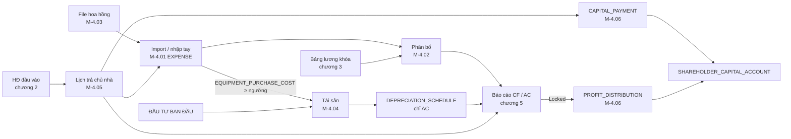
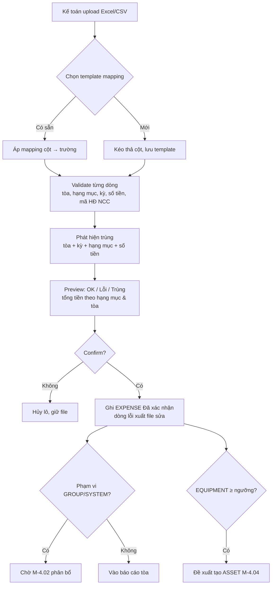
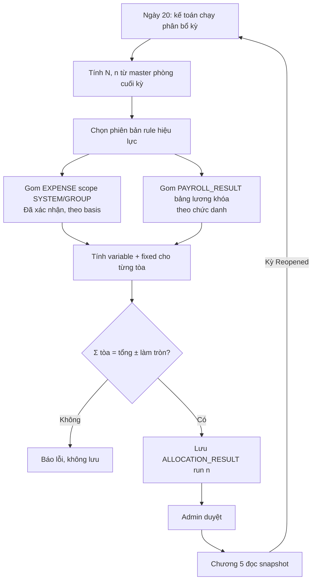
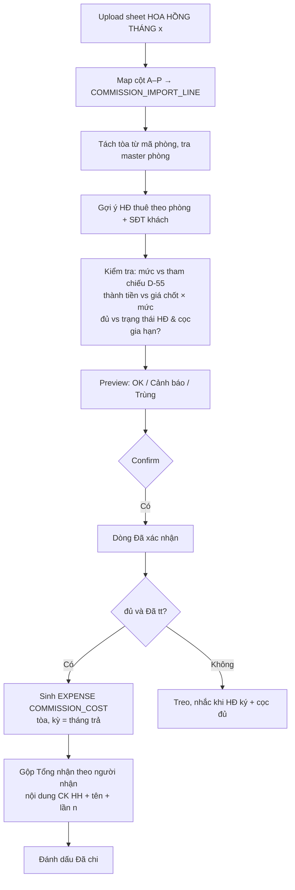
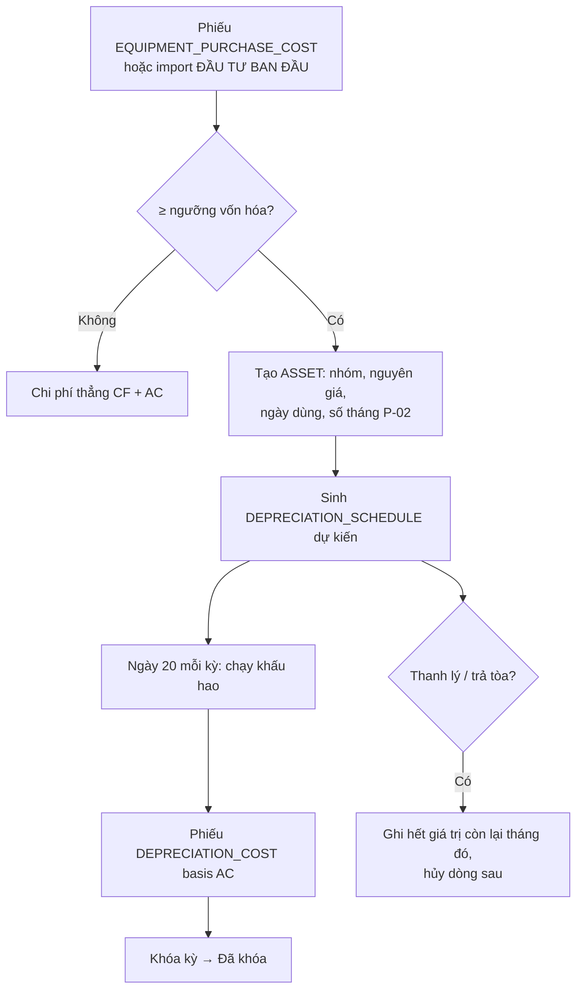
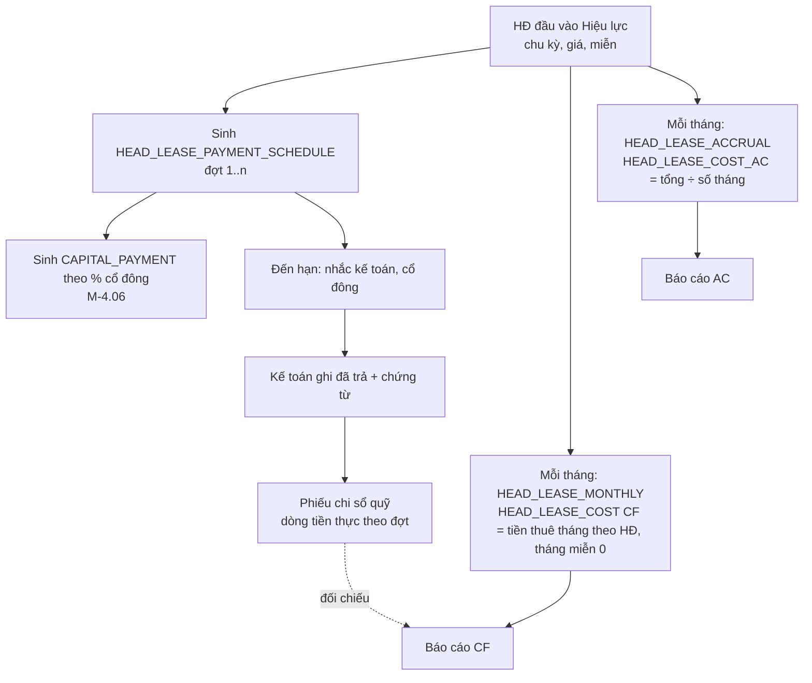
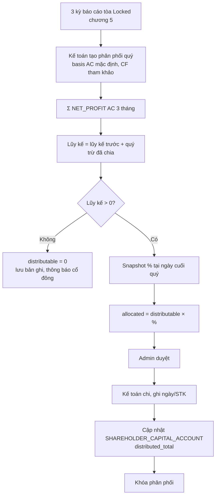
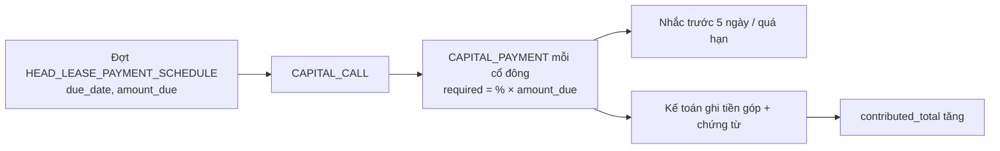

# 4. Chi phí, phân bổ, hoa hồng, tài sản & khấu hao, cổ đông

> Chương này mô tả 6 module thuộc nhóm **"chi phí và vốn"** của TimoHouse Phase 1. Mọi thuật ngữ (D-xx), rule chuẩn (R-xx), công thức (F-xx), tham số (P-xx), ngoài phạm vi (X-xx) đều **tham chiếu theo mã** tại `00_shared_brief.md`; chương này không định nghĩa lại. Nguồn số liệu ví dụ: `G1.31.8.26.xlsx` (sheet `BÁO CÁO THÁNG 6`, `ĐẦU TƯ BAN ĐẦU`, `THU CHI BAN ĐẦU`), `Hoa hồng năm 2025-2026 (1).xlsx` (sheet `HOA HỒNG THÁNG 8.26`), `Danh sách mã HĐ điện nước mạng.xlsx`, `answer.md` §B/§D/§E/§H, `clarification-checklist.md` F-08–F-17, F-26–F-28, F-31–F-38, spec v1.8 §12.21, §12.22, §12.23.7.

## 4.0 Tổng quan chương

### 4.0.1 Danh sách module

| Mã | Module | Nghiệp vụ cốt lõi | Entity chính |
|---|---|---|---|
| M-4.01 | Chi phí & Import | Sổ chi phí duy nhất cho mọi khoản chi không sinh tự động; import Excel/CSV; kỳ hạch toán (AC) và ngày thanh toán (CF) | `EXPENSE`, `EXPENSE_CATEGORY`, `SUPPLIER_CONTRACT` |
| M-4.02 | Phân bổ chi phí & lương | Chia chi phí chung và lương cố định về tòa theo rule có phiên bản; snapshot theo kỳ | `ALLOCATION_RULE`, `ALLOCATION_RESULT`, `EXPENSE_ALLOCATION` |
| M-4.03 | Hoa hồng (import) | Nhận dòng hoa hồng từ file kinh doanh, gắn tòa/HĐ, ghi chi phí `COMMISSION_COST` theo tháng trả | `COMMISSION_IMPORT_LINE` |
| M-4.04 | Tài sản & Khấu hao | Vốn hóa thiết bị/đầu tư ban đầu, sinh bút toán khấu hao tháng cho biến thể AC | `ASSET`, `DEPRECIATION_SCHEDULE` |
| M-4.05 | Tiền thuê nhà & chi phí trả trước | Lịch trả chủ nhà theo kỳ 3/4/6 tháng; CF ghi tiền thuê theo tháng hợp đồng (R-27), AC thẳng hàng cả tháng miễn | `HEAD_LEASE_PAYMENT_SCHEDULE`, `PREPAID_EXPENSE_SCHEDULE` |
| M-4.06 | Cổ đông / Cổ phần / Góp vốn / Phân phối | % theo tòa, tài khoản vốn lũy kế, lịch góp theo kỳ tiền nhà, phân phối lợi nhuận theo quý | `SHAREHOLDER`, `BUILDING_SHARE`, `SHAREHOLDER_CAPITAL_ACCOUNT`, `CAPITAL_PAYMENT`, `PROFIT_DISTRIBUTION` |

### 4.0.2 Vị trí trong lịch tháng (D-09)

| Ngày | Việc của chương 4 | Module |
|---|---|---|
| 1 → 20 | Import giá gốc điện/nước/mạng/rác (theo hóa đơn NCC), marketing, VP, sửa chữa, chi phí khác; nhập tay chi phí lẻ | M-4.01 |
| 1 → 20 | Import file hoa hồng tháng (các dòng "Đã tt") | M-4.03 |
| 16 | Bảng lương khóa → lương cố định sẵn sàng để phân bổ, lương HS ghi thẳng tòa | M-4.02 (đọc chương 3) |
| 20 | Kế toán kiểm chi phí: mọi phiếu ở trạng thái `Đã xác nhận`; chạy phân bổ + khấu hao + tiền thuê nhà thẳng hàng | M-4.02, M-4.04, M-4.05 |
| Sau 20 | Khóa kỳ báo cáo (chương 5) → đóng băng `ALLOCATION_RESULT`, `DEPRECIATION_SCHEDULE`, % cổ đông | M-4.02, M-4.04, M-4.06 |
| Cuối quý | Sinh `PROFIT_DISTRIBUTION` từ báo cáo đã khóa 3 tháng | M-4.06 |

### 4.0.3 Sơ đồ dòng dữ liệu của chương

---

## 4.1 M-4.01 Chi phí & Import

### 4.1.1 Mục tiêu

Tạo **sổ chi phí duy nhất** (`EXPENSE`) cho mọi khoản chi không được phân hệ khác sinh ra tự động (R-25): giá gốc điện/nước/mạng/rác/môi trường/thang máy, marketing, thiết bị, sửa chữa, văn phòng, chi phí khác, hoa hồng, tiền thuê nhà. Mỗi dòng có đủ hai chiều thời gian — **kỳ hạch toán** (AC) và **ngày thanh toán** (CF) — để một sổ phục vụ cả hai biến thể báo cáo (R-01). Thay thế cách nhập tay từng ô vào sheet `BÁO CÁO THÁNG x` của từng tòa (G1: các ô C22–C69).

### 4.1.2 Tác nhân

| Vai trò | Quyền |
|---|---|
| Kế toán | Tạo/sửa nháp, import, xác nhận, điều chỉnh/đảo, khóa theo kỳ; xem toàn hệ thống |
| Admin | Như kế toán + cấu hình danh mục, ngưỡng vốn hóa, mở khóa |
| Quản lý tòa (NVVH) | Tạo nháp chi phí gắn tòa mình phụ trách (sửa chữa nhỏ, dọn phòng, biển xe…), đính chứng từ; không xác nhận |
| TPVH / TNVH | Xem chi phí các tòa dưới quyền; tạo nháp phạm vi nhóm |
| Cổ đông | Chỉ xem qua drill-down báo cáo tòa mình có cổ phần (R-34, R-37) |

### 4.1.3 Dữ liệu

**`EXPENSE` (1 dòng = 1 phiếu chi phí)** — theo spec §12.21.1 mở rộng:

| Trường | Kiểu | Bắt buộc | Ghi chú |
|---|---|---|---|
| `expense_code` | `CP-YYYYMM-NNNNN` | hệ thống | Mã phiếu, sinh tự động |
| `document_date` | date | có | Ngày chứng từ (ngày trên hóa đơn NCC / phiếu chi) |
| `accounting_period` | `YYYY-MM` | có | **Kỳ hạch toán** — tháng phát sinh (AC). Mặc định = tháng của `document_date`; điện/nước theo tháng hóa đơn NCC (answer §B4) |
| `payment_date` | date | có khi `payment_status = Đã trả` | **Ngày thanh toán** — tháng của ngày này là kỳ CF |
| `scope_type` | enum | có | `BUILDING` (1 tòa) / `GROUP` (nhóm T/S/G, D-02) / `SYSTEM` (toàn hệ thống) |
| `building_id` | FK | khi `BUILDING` | Tòa |
| `group_code` | enum T/S/G | khi `GROUP` | |
| `room_id` | FK | không | Phòng liên quan (dọn VS P601, sơn P401…) |
| `category_code` | metric code | có | Danh mục = metric code chương 5 (bảng 4.1.3.b) |
| `subcategory_code` | text | không | Danh mục con (bảng 4.1.3.c) |
| `description` | text | có | Nội dung |
| `amount` | số nguyên VND | có | > 0; đảo/điều chỉnh dùng phiếu riêng |
| `supplier_id` / `supplier_name` | FK/text | không | NCC hoặc người nhận |
| `supplier_contract_code` | text | không | Mã HĐ điện/nước/mạng của tòa (bảng `SUPPLIER_CONTRACT`) |
| `payment_method` | enum | có | `CK` / `TM` / `Tự động` (`tt tự động` trong file mã HĐ) |
| `bank_account` | text | không | Tài khoản trả |
| `document_url[]` | file | không | Ảnh/PDF hóa đơn, phiếu chi |
| `source` | enum | hệ thống | `manual` / `import` / `system` (sinh từ M-4.03, M-4.04, M-4.05, chương 3) |
| `import_batch_id` | FK | khi `import` | Lô import |
| `source_ref` | text | khi `system` | Mã đối tượng gốc (deal HH, lịch trả chủ nhà, dòng lương) |
| `status` | enum | hệ thống | `Nháp` / `Đã xác nhận` / `Đã phân bổ` / `Đã khóa` / `Đã hủy` |
| `allocation_rule_version_id` | FK | khi phân bổ | Phiên bản rule đã dùng (M-4.02) |
| `asset_id` | FK | khi vốn hóa | Tài sản sinh ra (M-4.04) |
| `reversal_of` | FK | khi đảo | Phiếu bị đảo |
| `created_by / confirmed_by / locked_period_id` | audit | | |

**Bảng 4.1.3.b — Danh mục chi phí Phase 1 = metric code (spec §12.21.2 ↔ §0.5):**

| Nhóm | Hạng mục (tên Việt trên UI) | `category_code` | Basis mặc định | Ô Excel G1 T6 |
|---|---|---|---|---|
| GV | Tiền thuê nhà | `HEAD_LEASE_COST` | CF: tiền thuê 1 tháng theo HĐ, ghi mỗi tháng hiệu lực (R-27); AC: `HEAD_LEASE_COST_AC` (M-4.05) | C22 = 48.000.000 |
| GV | Mua thêm thiết bị | `EQUIPMENT_PURCHASE_COST` | CF: tháng mua; AC: qua `DEPRECIATION_COST` nếu ≥ ngưỡng (M-4.04) | C23 = 500.000 (thùng rác 120L) |
| GV | Giá gốc điện | `ELECTRIC_INPUT_COST` | AC: kỳ hóa đơn NCC; CF: ngày trả | C28 = 17.258.594 |
| GV | Giá gốc nước | `WATER_INPUT_COST` | như trên | C29 = 300.000 |
| GV | Giá gốc mạng | `INTERNET_INPUT_COST` | như trên (mạng trả 6 tháng → M-4.05 trả trước) | C30 = 0 |
| GV | Phí thu rác | `GARBAGE_COST` | như trên | C31 = 300.000 |
| GV | Phí môi trường | `ENVIRONMENT_COST` | như trên | C32 = trống |
| GV | Bảo trì thang máy | `ELEVATOR_MAINT_COST` | như trên | C33 = trống |
| CPBH | Phí marketing | `MARKETING_COST` | phạm vi `SYSTEM` → phân bổ | C46 = (30.188.000/1303)×15 |
| CPBH | Hoa hồng | `COMMISSION_COST` | `source = system` từ M-4.03; kỳ = tháng trả | C47–C49 |
| CPBH | Sửa chữa, thay thế, bảo trì | `REPAIR_COST` | tòa/phòng | C50 = trống T6 |
| CPBH | Thuê & DV văn phòng | `OFFICE_COST` | phạm vi `SYSTEM` → phân bổ | C45 = (60.785.000/1303)×15 |
| CPBH | Chi phí khác | `OTHER_COST` | tòa/phòng, có danh mục con | C65–C69 |
| CPBH | Lương (mọi dòng) | `SALARY_COST` | **không nhập ở Expense** — lấy từ bảng lương khóa (R-25, M-4.02) | C35–C44 |

**Bảng 4.1.3.c — Danh mục con của `OTHER_COST` và `REPAIR_COST` (từ dữ liệu G1 T6 và ĐẦU TƯ BAN ĐẦU):**

| `category_code` | `subcategory_code` | Ví dụ G1 |
|---|---|---|
| `OTHER_COST` | `ROOM_CLEANING` (dọn vệ sinh phòng) | Dọn VS P601 150.000 |
| `OTHER_COST` | `ROOM_PAINT` (sơn điểm + dọn) | P401 200.000; P402 200.000 |
| `OTHER_COST` | `RESIDENCE_REG` (công an tạm trú) | 1.000.000 |
| `OTHER_COST` | `SIGNAGE_SECURITY` (biển, khóa xe, an ninh) | Biển khóa cổ xe 45.000 |
| `OTHER_COST` | `TECH_OPENING` (công mở mới kỹ thuật) | THU CHI BAN ĐẦU dòng 22 |
| `OTHER_COST` | `MISC` | mặc định |
| `REPAIR_COST` | `REPLACE` / `MAINTAIN` / `REPAIR` | thay thế / bảo trì / sửa chữa |

**`SUPPLIER_CONTRACT` (mã HĐ nhà cung cấp theo tòa)** — từ file `Danh sách mã HĐ điện nước mạng.xlsx`:

| Trường | Ghi chú |
|---|---|
| `building_id` | T2, T3, T5… |
| `service` | `ELECTRIC` / `WATER` / `INTERNET` |
| `contract_code` | `PD05000162909` (EVN), `511135799` (Viwaco), `HNJ018416` (mạng); 1 tòa có thể 2 mã điện |
| `holder_name` | Tên chủ HĐ trên hóa đơn NCC |
| `auto_pay` | `tt tự động` → `payment_method = Tự động` |
| `default_category_code` | `ELECTRIC_INPUT_COST` / `WATER_INPUT_COST` / `INTERNET_INPUT_COST` |

**`EXPENSE_IMPORT_BATCH`**: `batch_id`, `file_name`, `uploaded_by`, `uploaded_at`, `mapping_template_id`, `row_total`, `row_ok`, `row_error`, `row_duplicate`, `status` (`Đang mapping` / `Đã preview` / `Đã confirm` / `Hủy`).

**Schema file import chuẩn (cột tối thiểu, thứ tự tự do, map bằng template):**

| Cột file | Trường đích | Validate |
|---|---|---|
| Mã phiếu (tùy chọn) | `external_ref` | dùng để phát hiện trùng |
| Ngày chứng từ | `document_date` | ngày hợp lệ |
| Kỳ hạch toán | `accounting_period` | `MM/YYYY`; kỳ chưa khóa |
| Ngày thanh toán | `payment_date` | trống → `payment_status = Chưa trả` |
| Tòa / Phạm vi | `scope_type` + `building_id`/`group_code` | mã tòa tồn tại; `TOÀN HỆ THỐNG`, `NHÓM T` … |
| Nhóm (GV / CPBH) | kiểm tra chéo với hạng mục | |
| Hạng mục | `category_code` | trong bảng 4.1.3.b (chấp nhận tên Việt) |
| Danh mục con | `subcategory_code` | trong 4.1.3.c hoặc trống |
| Nội dung | `description` | |
| Số tiền | `amount` | số nguyên > 0 |
| NCC / Người nhận | `supplier_name` | |
| Mã HĐ NCC | `supplier_contract_code` | khớp `SUPPLIER_CONTRACT` của tòa (nếu có) |
| Phương thức | `payment_method` | CK / TM / Tự động |
| Chứng từ | `document_url` | link hoặc tên file trong zip |
| Phòng | `room_id` | mã phòng D-03 thuộc tòa |

### 4.1.4 Search / Filter

- Theo kỳ hạch toán, tháng thanh toán, khoảng ngày chứng từ.
- Theo phạm vi: toàn hệ thống / nhóm T-S-G / tòa / phòng; theo khu vực, trưởng nhóm, quản lý tòa (R-34).
- Theo nhóm GV/CPBH, hạng mục, danh mục con, NCC, mã HĐ NCC, phương thức, nguồn (`manual/import/system`), lô import, trạng thái.
- Theo người tạo/xác nhận; theo "có chứng từ / thiếu chứng từ".
- Phạm vi dữ liệu: NVVH chỉ thấy tòa mình có phân công (chương 3 R-33); kế toán/admin thấy toàn bộ.

### 4.1.5 Action

| Action | Ai | Kết quả |
|---|---|---|
| Tạo nháp / sửa nháp | NVVH, kế toán | `EXPENSE.status = Nháp` |
| Upload file → chọn template mapping → validate → preview → confirm | Kế toán | Lô import; các dòng OK thành phiếu `Đã xác nhận` (hoặc `Nháp` nếu chọn) |
| Lưu template mapping | Kế toán | Dùng lại cho file cùng cấu trúc (file điện nước, file VP, file hoa hồng) |
| Xác nhận | Kế toán | `Nháp → Đã xác nhận` |
| Đính chứng từ | Mọi người tạo | Thêm `document_url` |
| Phân bổ (chạy tự động khi tính kỳ) | Hệ thống | `Đã xác nhận → Đã phân bổ` (chỉ phạm vi `GROUP`/`SYSTEM`) |
| Đảo / điều chỉnh | Kế toán | Phiếu mới `reversal_of`, kỳ hiện tại nếu kỳ gốc đã khóa (R-08) |
| Hủy | Kế toán (Nháp/Đã xác nhận, kỳ chưa khóa) | `Đã hủy` |
| Vốn hóa | Hệ thống + kế toán xác nhận | Sinh `ASSET` (M-4.04) |
| Export | Kế toán | Excel theo bộ lọc, đúng cột schema import |

### 4.1.6 Business Rule

- **BR-4.01.1** Mọi chi phí không sinh tự động phải nằm trong `EXPENSE`; lương không nhập ở đây mà lấy từ bảng lương khóa (R-25). [Đã chốt]
- **BR-4.01.2** Mỗi phiếu bắt buộc có `accounting_period` (kỳ AC) và, khi đã trả, `payment_date` (kỳ CF); hai kỳ được phép khác nhau. [Đã chốt]
- **BR-4.01.3** `category_code` phải là metric code trong bảng 4.1.3.b; không cho tạo hạng mục ngoài danh mục (danh mục con mở rộng được). [Có bằng chứng nguồn]
- **BR-4.01.4** Giá gốc điện/nước/mạng/rác/môi trường/thang máy nhập theo **tháng hóa đơn NCC** làm kỳ AC; CF theo ngày thực trả (answer §B4, §H6). [Cần chốt]
- **BR-4.01.5** Điện nước phòng trống/không thu được không tách dòng: đã nằm trong giá gốc của tòa (R-04, answer §B4); sheet `ĐIỆN NƯỚC PHÒNG TRỐNG` chỉ dùng để thống kê thất thoát ở chương 2. [Đã chốt]
- **BR-4.01.6** Phiếu `scope_type = BUILDING` đi thẳng vào báo cáo tòa 100%; `GROUP`/`SYSTEM` bắt buộc qua M-4.02 trước khi lên báo cáo. [Đã chốt]
- **BR-4.01.7** Marketing và Thuê & DV VP mặc định `scope_type = SYSTEM` (R-26); file import có cột phạm vi để ghi đè theo nhóm hoặc tòa (answer §B4, Q28). [Cần chốt]
- **BR-4.01.8** Phát hiện trùng khi import: cùng `building_id` (hoặc phạm vi) + `accounting_period` + `category_code` + `amount`; nếu có `external_ref` thì thêm điều kiện cùng mã; dòng trùng bị đánh dấu, người dùng chọn bỏ qua / ghi đè / giữ cả hai có lý do. [Đã chốt]
- **BR-4.01.9** Dòng import lỗi validate không chặn cả lô: chỉ các dòng OK được confirm; dòng lỗi xuất lại thành file để sửa. [Cần chốt]
- **BR-4.01.10** Phiếu `source = system` (hoa hồng, tiền thuê nhà, khấu hao, lương) không sửa tay; muốn đổi phải sửa ở module gốc. [Cần chốt]
- **BR-4.01.11** `EQUIPMENT_PURCHASE_COST` có `amount ≥ ngưỡng vốn hóa` (P-11, đề xuất 2.000.000 VND/đơn vị) tự đề xuất tạo `ASSET`; dưới ngưỡng ghi chi phí cả CF và AC trong tháng mua (thùng rác 500.000). [Cần chốt → P-11]
- **BR-4.01.12** Phiếu `HEAD_LEASE_COST` (CF, theo tháng HĐ) và `HEAD_LEASE_COST_AC` chỉ sinh từ M-4.05 (`HEAD_LEASE_MONTHLY` / `HEAD_LEASE_ACCRUAL`); không import tay để tránh trùng. [Cần chốt]
- **BR-4.01.13** Chi phí sửa chữa/dọn/sơn do khách gây ra vẫn ghi chi phí đủ; khoản khấu trừ cọc ghi thu nhập khác, không bù trừ (R-29). [Cần chốt]
- **BR-4.01.14** `document_date`, `accounting_period` không được thuộc kỳ đã `Locked`; nếu chứng từ về muộn → kỳ AC = kỳ hiện tại, ghi chú "chứng từ kỳ MM/YYYY" (R-08). [Cần chốt]
- **BR-4.01.15** Mã HĐ NCC (`supplier_contract_code`) nếu nhập phải thuộc đúng tòa; hệ thống gợi ý hạng mục từ `SUPPLIER_CONTRACT.default_category_code`. [Có bằng chứng nguồn]
- **BR-4.01.16** Phiếu có `room_id` phải có phòng thuộc `building_id`; phòng đổi tòa không được (D-03). [Có bằng chứng nguồn]
- **BR-4.01.17** Kỳ hạch toán cho khoản trả trước nhiều tháng (mạng 6 tháng 3.000.000) là **kỳ bắt đầu**; việc dàn đều theo tháng cho AC do M-4.05 xử lý. [Cần chốt]
- **BR-4.01.18** Số tiền lưu bằng VND nguyên; không cho nhập số thập phân (Excel đang có 1.385.173,38 do công thức — hệ thống làm tròn ở bước phân bổ M-4.02). [Cần chốt]

### 4.1.7 State / Status

| Từ | Đến | Điều kiện | Ai |
|---|---|---|---|
| — | `Nháp` | Tạo tay hoặc import chọn "để nháp" | NVVH, kế toán |
| `Nháp` | `Đã xác nhận` | Đủ trường bắt buộc, kỳ chưa khóa | Kế toán |
| Import confirm | `Đã xác nhận` | Dòng validate OK | Kế toán |
| `Đã xác nhận` | `Đã phân bổ` | M-4.02 chạy cho kỳ, phạm vi `GROUP`/`SYSTEM` | Hệ thống |
| `Đã xác nhận` / `Đã phân bổ` | `Đã khóa` | Kỳ báo cáo `Locked` (chương 5) | Hệ thống |
| `Đã khóa` | (không đổi) | Chỉ tạo phiếu đảo/điều chỉnh ở kỳ hiện tại | Kế toán |
| `Nháp` / `Đã xác nhận` | `Đã hủy` | Kỳ chưa khóa, có lý do | Kế toán |
| Kỳ `Reopened` | `Đã khóa → Đã xác nhận` | Admin mở khóa; phân bổ chạy lại | Admin |

### 4.1.8 Flow

**Luồng chính — import chi phí tháng:**

**Ngoại lệ:**
- Chứng từ kỳ đã khóa → tạo ở kỳ hiện tại với ghi chú (BR-4.01.14).
- File hoa hồng → luồng riêng M-4.03 (schema khác) nhưng kết quả cuối vẫn là phiếu `COMMISSION_COST` `source = system`.
- Hóa đơn EVN gộp 2 mã điện của 1 tòa (T2 có `PD05000162909, PD05000125565`) → 2 phiếu, mỗi phiếu 1 mã.

### 4.1.9 Liên kết

| Module | Đọc / Ghi | Nội dung |
|---|---|---|
| M-4.02 | Đọc `EXPENSE` phạm vi `GROUP`/`SYSTEM` | Phân bổ về tòa |
| M-4.03 | Ghi `EXPENSE(COMMISSION_COST, source=system)` | Mỗi dòng hoa hồng đã trả |
| M-4.04 | Đọc `EQUIPMENT_PURCHASE_COST`; ghi `EXPENSE(DEPRECIATION_COST, source=system, basis=AC)` | Vốn hóa và khấu hao |
| M-4.05 | Ghi `EXPENSE(HEAD_LEASE_COST)` theo tháng HĐ (R-27); `HEAD_LEASE_COST_AC` thẳng hàng; phiếu chi sổ quỹ theo đợt trả | Tiền thuê nhà |
| Chương 2 M-2.xx Điện nước | Đọc `ELECTRIC_INPUT_COST`/`WATER_INPUT_COST` để so với doanh thu điện nước đã lên hóa đơn (thống kê thất thoát) | |
| Chương 3 M-3.06 Chi lương | Ghi `SALARY_COST` từ bảng lương khóa (không qua import) | |
| Chương 5 M-5.02 Metric mapping | Đọc `EXPENSE` theo `category_code` + `basis` | `COGS = HEAD_LEASE_COST + EQUIPMENT_PURCHASE_COST + Σ *_INPUT_COST + GARBAGE + ENVIRONMENT + ELEVATOR_MAINT` (F-08); `OPERATING_SELLING_COST = SALARY + OFFICE + MARKETING + COMMISSION + REPAIR + OTHER` |
| Chương 5 M-5.06 Drill-down | Đọc phiếu theo mã | R-37 |

**Bảng basis cho từng dòng chi phí (tổng hợp, chương 5 dùng làm metric mapping):**

| `category_code` | CF (tháng nào) | AC (tháng nào) | Metric AC tương ứng |
|---|---|---|---|
| `HEAD_LEASE_COST` | tiền thuê 1 tháng theo HĐ ghi mỗi tháng hiệu lực — **theo tháng hợp đồng**, không theo `payment_date` (0 ở tháng miễn) (R-27) | dàn đều theo tháng HĐ đầu vào kể cả tháng miễn (R-27) | `HEAD_LEASE_COST_AC` |
| `EQUIPMENT_PURCHASE_COST` | tháng mua (D-36) | 0 nếu vốn hóa; = CF nếu dưới ngưỡng | `DEPRECIATION_COST` |
| `ELECTRIC_INPUT_COST`, `WATER_INPUT_COST`, `INTERNET_INPUT_COST`, `GARBAGE_COST`, `ENVIRONMENT_COST`, `ELEVATOR_MAINT_COST` | tháng `payment_date` | `accounting_period` (tháng hóa đơn NCC); trả trước nhiều tháng → dàn đều (M-4.05) | cùng mã, `basis = AC` |
| `MARKETING_COST`, `OFFICE_COST` | tháng `payment_date`, sau phân bổ | `accounting_period`, sau phân bổ | cùng mã |
| `COMMISSION_COST` | tháng trả HH (R-30) | tháng trả HH (Phase 1 đồng nhất) | cùng mã |
| `REPAIR_COST`, `OTHER_COST` | tháng `payment_date` | `accounting_period` | cùng mã |
| `SALARY_COST` | kỳ lương (bảng lương khóa, chương 3; BR-5.02.7) | kỳ lương (chương 3) | cùng mã — ngày chi lương chỉ là sổ quỹ (P-18) |
| `DEPRECIATION_COST` | không có | tháng khấu hao (M-4.04) | chỉ AC |

### 4.1.10 Audit / Notification

- Nhật ký: tạo / sửa / xác nhận / hủy / đảo / import (lô, người, số dòng, file gốc lưu 24 tháng).
- Cảnh báo ngày 18 hàng tháng: tòa chưa có phiếu `ELECTRIC_INPUT_COST` / `WATER_INPUT_COST` kỳ hiện tại (đối chiếu `SUPPLIER_CONTRACT`).
- Cảnh báo phiếu `Đã xác nhận` thiếu chứng từ > 7 ngày.
- Cảnh báo `EQUIPMENT_PURCHASE_COST ≥ ngưỡng` chưa tạo tài sản trước ngày khóa.
- Thông báo kế toán khi NVVH tạo nháp mới.

### 4.1.11 Nghiệm thu

1. Import được file chi phí VP tháng và file điện nước theo template; preview đúng số dòng OK/lỗi/trùng; sau confirm số tiền theo hạng mục khớp file.
2. Tái tạo được toàn bộ khối chi phí `BÁO CÁO THÁNG 6` của G1 (C22–C69) từ `EXPENSE` + M-4.02: GV = 66.358.594, CPBH = 10.476.125.
3. Mỗi phiếu có đủ kỳ AC và ngày CF; báo cáo CF và AC của cùng tháng cho ra 2 số khác nhau khi kỳ khác nhau.
4. Phiếu kỳ đã khóa không sửa được; phiếu đảo ghi vào kỳ hiện tại kèm liên kết.
5. Drill-down từ ô chi phí trên báo cáo về đúng phiếu.

---

## 4.2 M-4.02 Phân bổ chi phí & lương

### 4.2.1 Mục tiêu

Thay thế công thức tay `=(Tổng chi phí / 1303) × 15` trong từng sheet tòa bằng **rule phân bổ có phiên bản** + **kết quả snapshot theo kỳ**, để mọi tòa dùng cùng mẫu số N, cùng tổng chi phí, cùng phần cố định; chạy lại được khi kỳ Reopened; drill-down được về từng phiếu / dòng lương gốc. Bao gồm cả lương cố định theo chức danh (spec §12.23.7 Payroll Cost Allocation).

### 4.2.2 Tác nhân

| Vai trò | Quyền |
|---|---|
| Admin | Tạo/sửa phiên bản `ALLOCATION_RULE`; duyệt kết quả |
| Kế toán | Chạy phân bổ kỳ, xem/so sánh kết quả, đề xuất phiên bản |
| TPVH, cổ đông | Xem kết quả tòa liên quan (chỉ đọc) |

### 4.2.3 Dữ liệu

**`ALLOCATION_RULE` (có phiên bản):**

| Trường | Ghi chú |
|---|---|
| `rule_code` | ví dụ `ALLOC-OFFICE`, `ALLOC-SAL-GM`, `ALLOC-SAL-TPVH` |
| `version`, `effective_from`, `effective_to` | phiên bản theo ngày; kỳ dùng phiên bản hiệu lực tại ngày cuối kỳ |
| `target` | `EXPENSE_CATEGORY` (ví dụ `OFFICE_COST`) hoặc `SALARY_POSITION` (chức danh/level từ `SALARY_LEVEL` chương 3) |
| `method` | `ROOM_COUNT` (mặc định) / `DIRECT` / `MANUAL_RATIO`; `REVENUE`, `BUILDING_COUNT` có trong spec nhưng **không dùng Phase 1** |
| `denominator_source` | `MANAGED_ROOMS_EOM` (N = tổng phòng đang quản lý cuối tháng kể cả trống, P-05) |
| `fixed_per_room` | phần cố định × n phòng tòa (TPVH: 10.000; kế toán: 10.000 — sheet T1/2026 `10.000×15`) |
| `fixed_per_building` | phần cố định mỗi tòa (kế toán: 10.000; vệ sinh: 550.000) |
| `fixed_base` | phần cố định không nhân (Phase 1 = 0; "150.000" của G1 T6 thực chất là 10.000 × 15 phòng) |
| `manual_ratio[]` | `{building_id, ratio}` khi `MANUAL_RATIO`, tổng = 100% |
| `note`, `approved_by` | |

**`ALLOCATION_RESULT` (snapshot mỗi lần chạy, mỗi kỳ):**

| Trường | Ghi chú |
|---|---|
| `report_period_id` | kỳ |
| `run_no`, `run_at`, `run_by` | lần chạy; kỳ Reopened tạo run mới, giữ run cũ |
| `rule_version_id` | phiên bản áp dụng |
| `source_type` / `source_id` | `EXPENSE` (phiếu) hoặc `PAYROLL_RESULT` (dòng lương) |
| `total_amount` | tổng chi phí đem chia |
| `denominator_N` | 1.303 (T6/2026); 1.204 (T1/2026) |
| `building_id`, `room_count_n` | tòa và số phòng n |
| `variable_amount` | `(total / N) × n` |
| `fixed_amount` | `fixed_base + fixed_per_building + fixed_per_room × n` |
| `allocated_amount` | `variable + fixed`, làm tròn VND |
| `category_code`, `basis` | metric + CF/AC |
| `status` | `Nháp` / `Đã duyệt` / `Đã khóa` |

**`EXPENSE_ALLOCATION`** (spec ERD): liên kết `expense_id ↔ allocation_result_id` cho phiếu chi phí; **`PAYROLL_COST_ALLOCATION`**: `payroll_result_id, building_id, amount, allocation_rule_version, report_period_id` (spec §12.23.7).

**Bảng rule mặc định Phase 1 (từ công thức G1 T6/2026, N = 1.303, n = 15):**

| Rule | Target | Method | Tổng chi phí tháng | Phần cố định | Kết quả G1 T6 | F |
|---|---|---|---|---|---|---|
| `ALLOC-SAL-GM` | Lương quản lý tổng | `ROOM_COUNT` | 12.000.000 | — | 138.143 | F-09 |
| `ALLOC-SAL-TPVH` | Lương TPVH | `ROOM_COUNT` | 21.000.000 | +10.000/phòng | 241.750 + 150.000 = 391.750 | F-10 |
| `ALLOC-SAL-SRC` | Lương NV nguồn | `ROOM_COUNT` | 3.000.000 | — | 34.536 | F-11 |
| `ALLOC-SAL-NVKD` | Lương NVKD part-time | `ROOM_COUNT` | 47.600.001 (Σ bảng lương) | — | 547.966 | F-12 |
| `ALLOC-SAL-CLEAN` | Lương vệ sinh | `DIRECT` cố định | — | 550.000/tòa | 550.000 | F-13 |
| `ALLOC-SAL-ACC` | Lương kế toán | `ROOM_COUNT` | 2.000.000 | 10.000/phòng + 10.000/tòa | 23.024 + 150.000 + 10.000 = 183.024 | F-14 |
| `ALLOC-SAL-REPAIR` | Lương sửa chữa (kỹ thuật) | `ROOM_COUNT` | 22.000.000 | — | 253.262 | F-15 |
| `ALLOC-OFFICE` | `OFFICE_COST` | `ROOM_COUNT` | 60.785.000 | — | 699.751 | F-16 |
| `ALLOC-MKT` | `MARKETING_COST` | `ROOM_COUNT` | 30.188.000 | — | 347.521 | F-17 |
| (không rule) | Lương HS quản lý tòa | ghi thẳng tòa | — | — | 1.385.173 | R-26 |
| (không rule) | Lương phó phòng VH, bảo vệ | — | 0 (T6) | — | 0 | |

Tổng khối lương G1 T6 (C35–C44) = 1.385.173 + 138.143 + 391.750 + 34.536 + 547.966 + 550.000 + 183.024 + 253.262 = 3.483.854; + VP 699.751 + marketing 347.521 + hoa hồng 4.350.000 + chi phí khác 1.595.000 = **CPBH 10.476.125** (khớp C71).

**Bằng chứng phiên bản rule:** sheet `THU CHI BAN ĐẦU` (T1/2026) dùng N = 1.204, lương QL tổng 10.000.000, TPVH `(10.000.000/1204)×15 + 7.000×15`, phó phòng `(8.000.000/1204)×15 + 5.000×15`, kế toán `10.000×15 + 10.000 + (2.000.000/1204)×15` — khác T6/2026. Vì vậy `ALLOCATION_RULE` bắt buộc có phiên bản theo ngày hiệu lực.

### 4.2.4 Search / Filter

- Theo kỳ, lần chạy, phiên bản rule, tòa, nhóm T/S/G, hạng mục/chức danh, nguồn (chi phí / lương).
- So sánh 2 lần chạy cùng kỳ (Reopened) — chênh lệch theo tòa.
- Xem N và danh sách phòng đếm vào N (drill-down về master phòng cuối tháng).

### 4.2.5 Action

| Action | Ai | Kết quả |
|---|---|---|
| Tạo phiên bản rule mới (copy từ phiên bản hiện hành, đổi tổng/phần cố định/method) | Admin | `effective_from` = ngày đầu kỳ áp dụng |
| Chạy phân bổ kỳ | Kế toán (ngày 20) hoặc tự động khi tính báo cáo | `ALLOCATION_RESULT` run mới |
| Duyệt kết quả | Admin | `Đã duyệt` |
| Chạy lại | Kế toán khi kỳ `Reopened` hoặc trước khóa | run mới, run cũ giữ để so sánh |
| Ghi đè tỷ lệ tay 1 kỳ (`MANUAL_RATIO`) | Admin, có lý do | áp cho 1 kỳ, không đổi rule gốc |
| Export bảng phân bổ | Kế toán | theo tòa × hạng mục |

### 4.2.6 Business Rule

- **BR-4.02.1** Công thức phân bổ mặc định `allocated = (Tổng chi phí ÷ N) × n + phần cố định` với N = tổng phòng đang quản lý cuối tháng kể cả trống, n = số phòng tòa cuối tháng (R-26, P-05). [Có bằng chứng nguồn / N → P-05]
- **BR-4.02.2** N và n tính tự động từ master phòng + phân công tại **ngày cuối kỳ**; không cho nhập tay N (T6/2026 = 1.303; bảng lương 1.079 là số phòng tính hiệu suất — khác N). [Cần chốt]
- **BR-4.02.3** Tổng chi phí đem chia lấy từ Σ `EXPENSE` `Đã xác nhận` cùng `category_code`, `scope_type = SYSTEM`, kỳ AC (hoặc tháng CF) tương ứng; không nhập tay tổng. [Đã chốt]
- **BR-4.02.4** Lương cố định theo chức danh (quản lý tổng, TPVH, NV nguồn, NVKD, kế toán, kỹ thuật/sửa chữa, vệ sinh) lấy Σ `PAYROLL_RESULT` của **bảng lương đã khóa** theo level (R-19); lương HS của quản lý tòa ghi thẳng tòa theo `COLLECTION_MILESTONE_SNAPSHOT` (R-26, answer §B3). [Đã chốt]
- **BR-4.02.5** Phần cố định: TPVH +10.000 × n; kế toán **10.000 × n + 10.000/tòa** (G1 T6 `150.000 + 10.000` = 10.000 × 15 + 10.000; sheet THU CHI BAN ĐẦU T1/2026 ghi rõ `10.000×15 + 10.000`); vệ sinh 550.000/tòa; là tham số của phiên bản rule, không hard-code. [Có bằng chứng nguồn]
- **BR-4.02.6** Số 12tr/21tr/3tr/2tr/22tr trong Excel là Σ lương chức danh tháng đó; hệ thống lấy từ bảng lương, nếu bảng lương khóa cho số khác thì dùng số bảng lương (Q23). [Cần chốt]
- **BR-4.02.7** Phiên bản rule áp dụng cho kỳ = phiên bản hiệu lực tại ngày cuối kỳ; không cho sửa phiên bản đã dùng bởi kỳ `Locked` — chỉ tạo phiên bản mới. [Cần chốt]
- **BR-4.02.8** Kết quả phân bổ mỗi kỳ là snapshot (`ALLOCATION_RESULT`) lưu tổng, N, n, phiên bản; báo cáo đọc snapshot, không tính lại lúc render (spec §12.23.7). [Đã chốt]
- **BR-4.02.9** Σ `allocated_amount` của mọi tòa cho 1 nguồn phải = `total_amount` ± sai số làm tròn ≤ số tòa VND; phần dư làm tròn gán vào tòa có n lớn nhất. [Cần chốt]
- **BR-4.02.10** Tòa đã trả chủ nhà trước cuối tháng (n = 0) không nhận phân bổ và không đếm vào N; tòa mới nhận từ tháng có phòng đưa vào quản lý. [Cần chốt]
- **BR-4.02.11** Chi phí `scope_type = GROUP` chia theo `ROOM_COUNT` trong phạm vi các tòa của nhóm (N_nhóm). [Cần chốt]
- **BR-4.02.12** `MANUAL_RATIO` chỉ dùng khi admin nhập tỷ lệ theo tòa tổng 100% và ghi lý do; `REVENUE`/`BUILDING_COUNT` (spec) tắt ở Phase 1. [Cần chốt]
- **BR-4.02.13** Kỳ `Reopened` bắt buộc chạy lại phân bổ trước khi khóa lại; chênh lệch với run cũ hiển thị để duyệt (R-08). [Cần chốt]
- **BR-4.02.14** Phân bổ chạy riêng cho 2 basis: CF theo tháng thanh toán, AC theo kỳ hạch toán; cùng phiên bản rule, khác tập phiếu đầu vào. [Cần chốt]
- **BR-4.02.15** Lương phân bổ về tòa dùng **kỳ lương** cho cả CF và AC (bảng lương khóa; BR-5.02.7, khớp golden G1); tháng chi lương chỉ là sổ quỹ (M-3.06, P-18). [Cần chốt]
- **BR-4.02.16** Làm tròn VND ở cấp dòng tòa; Excel giữ số lẻ (138.142,75) — golden (chương 5) so khớp với dung sai ≤ 1 VND/dòng. [Cần chốt]

### 4.2.7 State / Status

| Đối tượng | Trạng thái | Chuyển |
|---|---|---|
| `ALLOCATION_RULE` phiên bản | `Nháp` → `Hiệu lực` → `Hết hiệu lực` | Admin duyệt; hết hiệu lực khi phiên bản sau có `effective_from` |
| `ALLOCATION_RESULT` run | `Nháp` → `Đã duyệt` → `Đã khóa` | Chạy → admin duyệt → kỳ khóa; `Reopened` → run mới `Nháp`, run cũ `Lưu trữ` |

### 4.2.8 Flow

**Ví dụ đầy đủ G1 T6/2026 (N = 1.303, n = 15):**

| Dòng | Công thức | Kết quả (VND, làm tròn) |
|---|---|---|
| Lương quản lý (HS, ghi thẳng) | từ chương 3 | 1.385.173 |
| Lương quản lý tổng | (12.000.000 ÷ 1.303) × 15 | 138.143 |
| Lương TPVH | (21.000.000 ÷ 1.303) × 15 + 10.000 × 15 | 391.750 |
| Lương NV nguồn | (3.000.000 ÷ 1.303) × 15 | 34.536 |
| Lương NVKD | (47.600.001 ÷ 1.303) × 15 | 547.966 |
| Lương vệ sinh | 550.000 | 550.000 |
| Lương kế toán | 10.000 × 15 + 10.000 + (2.000.000 ÷ 1.303) × 15 | 183.024 |
| Lương sửa chữa | (22.000.000 ÷ 1.303) × 15 | 253.262 |
| Thuê & DV VP | (60.785.000 ÷ 1.303) × 15 | 699.751 |
| Marketing | (30.188.000 ÷ 1.303) × 15 | 347.521 |
| **Σ phân bổ + lương HS** | | **4.531.126** |

Cộng hoa hồng 4.350.000 (M-4.03) + chi phí khác 1.595.000 (M-4.01) = CPBH 10.476.125 (khớp golden).

### 4.2.9 Liên kết

| Module | Đọc / Ghi |
|---|---|
| M-4.01 | Đọc `EXPENSE` `SYSTEM`/`GROUP`; ghi `EXPENSE_ALLOCATION`, đổi trạng thái `Đã phân bổ` |
| Chương 3 M-3.05 Bảng lương | Đọc `PAYROLL_RESULT` khóa theo level và `COLLECTION_MILESTONE_SNAPSHOT` (lương HS theo tòa) |
| Chương 2 Phòng | Đọc số phòng quản lý cuối kỳ theo tòa (N, n) |
| Chương 5 M-5.02 / M-5.03 | Đọc `ALLOCATION_RESULT` → `SALARY_COST`, `OFFICE_COST`, `MARKETING_COST` theo tòa; gộp T/S/G |
| Chương 5 M-5.01 Kỳ báo cáo | Khóa/mở khóa run |

Metric tương ứng: `SALARY_COST` (basis CF/AC), `OFFICE_COST`, `MARKETING_COST`; tỷ lệ `SALARY_OVER_OPERATING_SELLING_COST` = Σ dòng lương (C35–C44) ÷ CPBH.

### 4.2.10 Audit / Notification

- Nhật ký phiên bản rule (ai đổi, trường nào, từ → đến).
- Nhật ký run: thời điểm, N, tổng theo nguồn, sai số làm tròn.
- Cảnh báo: N thay đổi > 5% so với kỳ trước; tòa có n = 0 nhưng còn phiếu chi phí; bảng lương kỳ chưa khóa khi chạy phân bổ (chạy tạm, đánh dấu "lương tạm").

### 4.2.11 Nghiệm thu

1. Với dữ liệu T6/2026, kết quả phân bổ G1 khớp 9 dòng bảng ví dụ ± 1 VND.
2. Tạo phiên bản rule mới có hiệu lực T7 → kỳ T6 không đổi, T7 dùng phiên bản mới.
3. Reopen T6, thêm 1 phiếu marketing, chạy lại → run 2, chênh lệch hiển thị theo tòa; run 1 vẫn xem được.
4. Σ phân bổ mọi tòa = tổng nguồn.

---

## 4.3 M-4.03 Hoa hồng (import Phase 1)

### 4.3.1 Mục tiêu

Đưa dữ liệu hoa hồng đang quản lý trong file `Hoa hồng năm 2025-2026.xlsx` (1 sheet/tháng) vào hệ thống bằng import, để: (1) ghi chi phí `COMMISSION_COST` đúng tòa, đúng tháng trả; (2) gắn deal với HĐ thuê để drill-down; (3) kiểm tra mức hoa hồng so với mức tham chiếu D-55; (4) gộp tổng nhận theo người nhận để chi. **Không** tính hoa hồng tự động, không policy/split engine — thuộc X-02.

### 4.3.2 Tác nhân

| Vai trò | Quyền |
|---|---|
| Kế toán | Import file tháng, sửa dòng, xác nhận, gộp tổng nhận, đánh dấu đã chi |
| Admin | Như kế toán + cấu hình mức tham chiếu, mở khóa |
| Kinh doanh (người lập file) | Xem dòng của mình, phản hồi sai lệch; không sửa |
| Quản lý tòa | Xem dòng hoa hồng phòng thuộc tòa mình (chỉ đọc) |

### 4.3.3 Dữ liệu

**`COMMISSION_IMPORT_LINE`** — theo cột sheet `HOA HỒNG THÁNG 8.26`:

| Cột file | Trường | Ghi chú |
|---|---|---|
| A `Tình trạng tt` | `eligibility_status` | `đủ` / `chưa đủ` (D-56); chuẩn hóa chữ hoa/thường |
| B `QL` | `building_manager_name` → `manager_employee_id` | Quản lý tòa; **không** phải người nhận (answer §D5) |
| C `Tình trạng tt` (cột 2, công thức `IF(RIGHT(Team,6)="(LEAD)","50%","35%")`) | `reference_rate` | Mức tham chiếu D-55 do file tính; chỉ để so sánh |
| D `Phòng` | `room_code` → `room_id` | D-03 |
| E `Tòa` (`=RIGHT(D, LEN−3)`) | `building_code` → `building_id` | F-31; phòng có chữ dùng master phòng |
| F `giá chốt` | `closing_price` | D-54; bỏ cọc: cơ sở = cọc − giá/31 × ngày ở (F-36) |
| G `Thời hạn HĐ` | `term_text` → `term_months` / `is_abandon` | `12th`, `9th`, `3th`, `BỎ CỌC` |
| H `Mức HH` | `rate` | 0.5 / 0.35 / 0.25 / 0.65 … (tỷ lệ) |
| I `Thành tiền` (`=F×H`) | `amount` | F-32; nếu trống → hệ thống tính `closing_price × rate` và đánh dấu "tính lại" |
| J `TỔNG NHẬN` (`=SUM(I các dòng cùng người nhận)`) | `payout_group_total` | F-38, D-58; hệ thống tính lại từ nhóm |
| K `Chú thích` | `note` | "Trùng", "đã tt trc 1325k", ngày tính tiền nhà/ngày bỏ |
| L `Team` | `recipient_name` → `recipient_id` | D-07: cá nhân sale, `(LEAD)`, đối tác (90 LAND, ANHOME, TL21…) |
| M `Ngày TT` | `paid_status` (`Đã tt`) + `paid_date` | D-57; kỳ ghi nhận = tháng của `paid_date` (R-30); file chỉ ghi "Đã tt" → mặc định tháng của sheet |
| N/P `STK THANH TOÁN` | `recipient_bank_account` | |
| O `SĐT khách` | `customer_phone` → gợi ý `contract_id` | Gắn deal ↔ HĐ thuê |
| (thêm) | `contract_id` | HĐ thuê khớp phòng + khách (chương 2) |
| (thêm) | `installment_no`, `installment_total` | Đợt trả (P-07): mặc định 1/1 |
| (thêm) | `support_deduction` | Tiền hỗ trợ CTV trừ khỏi thành tiền (F-37) |
| (thêm) | `duplicate_source_count` | Trùng n nguồn (F-35) |
| (thêm) | `sheet_month` | Tháng của sheet (`8.26`) |
| (thêm) | `expense_id` | Phiếu `COMMISSION_COST` sinh ra |
| (thêm) | `status` | `Nháp` / `Đã xác nhận` / `Đã ghi chi phí` / `Đã chi` / `Đã khóa` |

**`COMMISSION_PAYOUT_GROUP`** (gộp Tổng nhận): `recipient_id`, `period`, `line_ids[]`, `total_amount`, `transfer_content` (`HH + tên + lần n`), `transfer_date`, `bank_account`, `status`.

**Mức tham chiếu (cấu hình, chỉ để kiểm tra — D-55):**

| Nguồn | Mức | HĐ < 6 tháng | Trùng n nguồn |
|---|---|---|---|
| Đối tác / môi giới / `(LEAD)` | 50% | 50% ÷ 6 × số tháng (3 tháng → 25%) | 50% ÷ n |
| Nhân viên nội bộ | 35% | 35% ÷ 6 × số tháng | 35% ÷ n |
| Bỏ cọc | 50% × (cọc − tiền phòng theo ngày ở) | — | — |

### 4.3.4 Search / Filter

- Theo tháng sheet, tháng trả, tòa, nhóm T/S/G, phòng, người nhận (Team), quản lý tòa, tình trạng đủ/chưa đủ, đã chi/chưa chi, có/không gắn HĐ, mức ≠ tham chiếu, bỏ cọc, trùng nguồn, đợt.
- Tổng hợp theo người nhận (Tổng nhận), theo tòa (`COMMISSION_COST`), theo nguồn khách (tham khảo, không phải X-01).

### 4.3.5 Action

| Action | Ai | Kết quả |
|---|---|---|
| Import sheet tháng (template hoa hồng) | Kế toán | Dòng `Nháp`; tự tách tòa, gợi ý HĐ theo phòng + SĐT |
| Gắn / đổi HĐ thuê cho dòng | Kế toán | `contract_id` |
| Nhập trừ CTV hỗ trợ, số nguồn trùng, đợt | Kế toán | tính lại `amount` đề xuất, người dùng chọn giữ số file hay số tính |
| Xác nhận dòng | Kế toán | `Đã xác nhận`; nếu `paid_status = Đã tt` → sinh `EXPENSE(COMMISSION_COST)` |
| Gộp tổng nhận & tạo nội dung CK | Kế toán | `COMMISSION_PAYOUT_GROUP` |
| Đánh dấu đã chi (ngày, STK) | Kế toán | `Đã chi`; đồng bộ `paid_date` |
| Đảo dòng (trả nhầm) | Kế toán | Phiếu đảo kỳ hiện tại |
| Export lại theo mẫu file gốc | Kế toán | |

### 4.3.6 Business Rule

- **BR-4.03.1** Phase 1 hoa hồng chỉ import; hệ thống không tự tính mức, không split theo policy (X-02). [Đã chốt]
- **BR-4.03.2** Dòng chỉ được ghi chi phí khi `eligibility_status = đủ` = HĐ thuê `Đã ký/Hiệu lực` và Deposit Ledger cọc đã thu = cọc phải thu (D-56); nếu file ghi "đủ" nhưng hệ thống chưa thấy HĐ ký → cảnh báo, kế toán xác nhận thủ công. [Đã chốt]
- **BR-4.03.3** Kỳ ghi nhận `COMMISSION_COST` (cả CF và AC) = tháng của `paid_date`; chưa trả → treo, không vào chi phí (R-30, Q25). [Cần chốt]
- **BR-4.03.4** Tòa của dòng = `RIGHT(mã phòng, LEN−3)` nếu mã phòng thuần số + tòa; mã có chữ (`401S4A`) tra master phòng (F-31, answer §D4). [Có bằng chứng nguồn]
- **BR-4.03.5** `amount` mặc định lấy số trong file; hệ thống tính `closing_price × rate − support_deduction` để so sánh; lệch > 1.000 VND → cảnh báo, không tự ghi đè (F-32, F-37). [Có bằng chứng nguồn]
- **BR-4.03.6** Mức tham chiếu D-55 (50%/35%, ÷6×tháng, ÷n) chỉ để **cảnh báo** dòng có mức khác (ví dụ 404S22 mức 65%); không chặn import (P-07). [Cần chốt → P-07]
- **BR-4.03.7** Bỏ cọc: `is_abandon = true`, cơ sở = cọc − giá ÷ 30 × ngày đã ở (chuẩn hóa R-10, P-03; file đang ÷ 31), hoa hồng = cơ sở × 50%; số file giữ nguyên, số chuẩn hóa hiển thị cạnh để đối chiếu. [Có bằng chứng nguồn / Cần chốt ÷30]
- **BR-4.03.8** Không thu hồi hoa hồng đã trả khi khách bỏ/phá HĐ sau đó (answer §D3, Q43). [Cần chốt]
- **BR-4.03.9** Không có hoa hồng cho HĐ gia hạn (`CONTRACT_EVENT = renew`); dòng import gắn HĐ gia hạn → cảnh báo (R-30, Q46). [Cần chốt]
- **BR-4.03.10** Trả nhiều đợt (P-07): mỗi đợt 1 dòng, cùng `deal_key` (phòng + HĐ), `installment_no/total`; mỗi đợt là 1 phiếu chi phí riêng ở tháng trả đợt (ví dụ 202G13: đợt 1 1.325.000 tháng trước, đợt 2 sau khi đủ). [Cần chốt]
- **BR-4.03.11** Hoa hồng theo **cá nhân người nhận** (`Team`); QLY chỉ là quản lý tòa, không nhận trừ khi Team trống hoặc ghi tên QLY (D-07, answer §D5). [Đã chốt]
- **BR-4.03.12** Tổng nhận = Σ `amount` các dòng cùng `recipient_id` trong cùng kỳ chi (F-38, D-58); nội dung CK chuẩn `HH + tên người nhận + lần n`. [Có bằng chứng nguồn]
- **BR-4.03.13** Trùng n nguồn: mỗi nguồn 1 dòng, `rate = mức ÷ n` (203S5: 25% ghi "Trùng"); kế toán nhập n, hệ thống chỉ kiểm tra (F-35, Q42). [Cần chốt]
- **BR-4.03.14** Khách đổi phòng sau chốt: hoa hồng giữ theo phòng chốt (`room_id` gốc), ghi chú phòng thực ở (202G13/402G13, Q48). [Cần chốt]
- **BR-4.03.15** Mỗi dòng phải gắn được `contract_id` trước khi khóa kỳ; không gắn được → giữ `Đã xác nhận` với cờ "chưa gắn HĐ", vẫn tính chi phí tòa. [Cần chốt]
- **BR-4.03.16** Phát hiện trùng khi import: cùng phòng + người nhận + số tiền + tháng sheet, hoặc cùng `deal_key` + `installment_no`. [Cần chốt]
- **BR-4.03.17** Hoa hồng là chi phí bán hàng `COMMISSION_COST`, không thuộc `SALARY_COST` dù người nhận là nhân viên (answer §B3). [Đã chốt]

### 4.3.7 State / Status

| Từ | Đến | Điều kiện |
|---|---|---|
| — | `Nháp` | Import / tạo tay |
| `Nháp` | `Đã xác nhận` | Có tòa, phòng, người nhận, số tiền; kỳ chưa khóa |
| `Đã xác nhận` | `Đã ghi chi phí` | `eligibility = đủ` và `paid_status = Đã tt` → sinh `EXPENSE` |
| `Đã ghi chi phí` | `Đã chi` | Có `COMMISSION_PAYOUT_GROUP` với ngày chuyển |
| `Đã chi` | `Đã khóa` | Kỳ Locked |
| `Đã xác nhận` (chưa đủ) | `Đã ghi chi phí` | Khi HĐ ký + cọc đủ ở tháng sau → kỳ = tháng trả |
| bất kỳ (chưa khóa) | `Đã hủy` | Kế toán, có lý do |

### 4.3.8 Flow

**Ví dụ tháng 8/2026 (sheet có tổng giá chốt 499.258.064 → hoa hồng 227.476.935):**

| Phòng | Tòa | Giá chốt | Thời hạn | Mức | Thành tiền (file) | Ghi chú / kiểm tra |
|---|---|---|---|---|---|---|
| 402G13 | G13 | 5.200.000 | 12th | 50% | 2.600.000 | Team 90 LAND (đối tác) → khớp tham chiếu |
| 203S5 | S5 | 3.500.000 | 12th | 25% | 875.000 | "Trùng" → 50% ÷ 2, gộp Tổng nhận với 402S16 (HÀ THÀNH) = 2.100.000 + 875.000 = 2.975.000 |
| 703S50 | S50 | 1.000.000 − 4.100.000/31 × 6 = 206.452 | BỎ CỌC | 50% | 103.226 | Chuẩn hóa ÷30: cơ sở 180.000 → 90.000 (hiển thị cạnh, không ghi đè) |
| 201T45 | T45 | 4.100.000 − 4.100.000/31 = 3.967.742 | BỎ CỌC | 50% | 1.983.871 | 1 ngày ở; chuẩn hóa ÷30: 3.963.333 → 1.981.667 |
| 404S22 | S22 | 3.200.000 | 12th | 65% | 2.080.000 | Cảnh báo: mức ngoài tham chiếu (MOITHUE) |
| 401S20 | S20 | 3.200.000 | 12th | 35% | 1.120.000 | Team ÁNH SAO không `(LEAD)` → 35% khớp |
| 202G13 | G13 | 2.650.000 | (chưa đủ) | 50% | — | "đã tt trc 1.325k" → đợt 1/2 đã trả; đợt 2 treo |
| 305T25 + 501G13 + 401T32 | T25/G13/T32 | 3.500.000 / 4.300.000 / 5.400.000 | 12th | 50% | 1.750.000 + 2.150.000 + 2.700.000 | Cùng Team TL21 → Tổng nhận 6.600.000, 1 lệnh CK |

G1 T6/2026 (từ báo cáo tòa): P401 1.900.000, P402 1.950.000, P601 bỏ cọc 500.000 → `COMMISSION_COST` G1 T6 = 4.350.000; `HH_OVER_OPERATING_SELLING_COST` = 4.350.000 ÷ 10.476.125 = 41,5%.

### 4.3.9 Liên kết

| Module | Đọc / Ghi |
|---|---|
| M-4.01 | Ghi `EXPENSE(COMMISSION_COST, source=system, source_ref=line_id)`; CF và AC cùng tháng trả |
| Chương 2 HĐ thuê / Deposit Ledger | Đọc trạng thái HĐ, cọc đã thu, `CONTRACT_EVENT` (new/renew/abandon) để kiểm tra "đủ", gia hạn, bỏ cọc |
| Chương 2 Phòng | Đọc master phòng để tách tòa |
| Chương 3 Nhân sự | Đọc `EMPLOYEE` để map người nhận nội bộ; hoa hồng **không** vào bảng lương |
| Chương 5 | `COMMISSION_COST` theo tòa; tỷ lệ `HH_OVER_OPERATING_SELLING_COST`; drill-down về dòng import |
| Phase 2 X-02 | `COMMISSION_IMPORT_LINE` là dữ liệu lịch sử cho Commission Engine sau này (không mô tả ở đây) |

### 4.3.10 Audit / Notification

- Nhật ký import (file, sheet, số dòng, cảnh báo), sửa dòng, gắn HĐ, đánh dấu chi.
- Cảnh báo: dòng "đủ" nhưng HĐ chưa ký / cọc chưa đủ; mức ≠ tham chiếu; thành tiền ≠ giá chốt × mức; dòng gắn HĐ gia hạn; dòng "chưa đủ" quá 30 ngày; Tổng nhận file ≠ Σ hệ thống.
- Thông báo người lập file khi kế toán sửa số tiền.

### 4.3.11 Nghiệm thu

1. Import sheet `HOA HỒNG THÁNG 8.26` → tổng thành tiền = 227.476.935, tổng giá chốt = 499.258.064; số dòng cảnh báo mức ngoài tham chiếu và trùng đúng như file.
2. G1 T6 sinh 3 phiếu `COMMISSION_COST` tổng 4.350.000, drill-down từ báo cáo về đúng 3 dòng.
3. Dòng "chưa đủ" không vào chi phí; khi HĐ ký + cọc đủ ở tháng sau, phiếu sinh ở tháng trả.
4. Tổng nhận gộp theo người nhận và nội dung CK đúng mẫu.

---

## 4.4 M-4.04 Tài sản & Khấu hao (mới, Phase 1)

### 4.4.1 Mục tiêu

Theo dõi thiết bị và đầu tư cải tạo ban đầu của từng tòa dưới dạng **tài sản** và sinh **bút toán khấu hao tháng** cho biến thể AC (R-28, D-36), thay cho cách ghi hết vào tháng mua của Excel. CF không đổi (vẫn `EQUIPMENT_PURCHASE_COST` tháng mua). Cũng là nguồn cho "thống kê tài sản theo tòa" ở M-4.06 và phần đầu tư ban đầu của cổ đông (R-31). Không có kiểm kê/bảo trì định kỳ (X-03).

### 4.4.2 Tác nhân

| Vai trò | Quyền |
|---|---|
| Kế toán | Tạo tài sản (từ phiếu chi phí hoặc nhập tay từ ĐẦU TƯ BAN ĐẦU), chọn nhóm/số tháng, chạy khấu hao, thanh lý |
| Admin | Cấu hình ngưỡng vốn hóa, số tháng mặc định (P-02); duyệt thanh lý |
| Quản lý tòa | Xem danh sách tài sản tòa, báo hỏng/mất (ghi chú) |
| Cổ đông | Xem tổng tài sản tòa mình có cổ phần |

### 4.4.3 Dữ liệu

**`ASSET`:**

| Trường | Ghi chú |
|---|---|
| `asset_code` | `TS-G1-0001` |
| `building_id`, `room_id` | Tòa; phòng (giường tủ P604) hoặc trống (máy bơm sân thượng) |
| `asset_group` | `EQUIPMENT` (thiết bị: điều hòa, tủ lạnh, máy giặt, rèm, giường tủ, máy bơm) / `INITIAL_RENOVATION` (cải tạo ban đầu: thạch cao ngăn phòng, tủ bếp gắn tường, hệ thống điện nước) |
| `name`, `quantity`, `unit_cost` | "2 tủ lạnh Aqua" → quantity 2, unit_cost 2.500.000 |
| `original_cost` | Nguyên giá = Σ chi phí mua + lắp (5.355.000 gồm "điều hòa và vật tư lắp") |
| `in_service_date` | Ngày đưa vào dùng (mặc định = ngày chứng từ) |
| `depreciation_months` | Theo R-28/P-02: < 10tr → 12; ≥ 10tr → 36; cải tạo → tháng còn lại HĐ đầu vào tại `in_service_date`, ≤ 60 |
| `monthly_depreciation` | `original_cost ÷ depreciation_months`, làm tròn; tháng cuối nhận phần dư |
| `source_type` / `source_id` | `EXPENSE` (phiếu `EQUIPMENT_PURCHASE_COST` ≥ ngưỡng) / `INITIAL_INVESTMENT` (import sheet ĐẦU TƯ BAN ĐẦU) / `MANUAL` |
| `head_lease_id` | HĐ đầu vào của tòa (để tính tháng còn lại và xử lý khi trả tòa) |
| `is_capital_contribution` | `true` nếu thuộc đầu tư ban đầu góp vốn (M-4.06) |
| `status` | `Đang dùng` / `Đã khấu hao hết` / `Đã thanh lý` / `Đã chuyển tòa` |
| `disposal_date`, `disposal_value`, `disposal_reason` | Thanh lý / trả tòa / hỏng |

**`DEPRECIATION_SCHEDULE` (1 dòng = 1 tháng × 1 tài sản):**

| Trường | Ghi chú |
|---|---|
| `asset_id`, `period` (`YYYY-MM`) | |
| `seq_no` / `total_months` | 1/36 … 36/36 |
| `amount` | Khấu hao tháng; tháng thanh lý = giá trị còn lại |
| `accumulated`, `net_book_value` | Lũy kế; giá trị còn lại sau tháng |
| `expense_id` | Phiếu `EXPENSE(DEPRECIATION_COST, basis=AC, source=system)` sinh ra |
| `status` | `Dự kiến` / `Đã ghi` / `Đã khóa` / `Hủy` |
| `run_id`, `rule_version` | Phiên bản tham số P-02 đã dùng |

**Ví dụ G1 — sheet ĐẦU TƯ BAN ĐẦU (1/10/2025 → 30/11/2025, tổng 38.862.000), giả định HĐ đầu vào G1 60 tháng từ 1/10/2025:**

| Hạng mục | Nguyên giá | Nhóm | Tháng KH | KH/tháng | Ghi chú |
|---|---|---|---|---|---|
| Lắp máy bơm áp sân thượng | 1.175.000 | `EQUIPMENT` | 12 | 97.917 | < 10tr |
| Điều hòa + vật tư lắp tầng 6 | 5.355.000 | `EQUIPMENT` | 12 | 446.250 | |
| Thạch cao ngăn phòng tầng 6 | 3.200.000 | `INITIAL_RENOVATION` | 60 | 53.333 | theo HĐ đầu vào còn lại |
| 2 tủ lạnh Aqua | 5.000.000 (2 × 2.500.000) | `EQUIPMENT` | 12 | 416.667 | tách 2 đơn vị để thanh lý riêng |
| Rèm G1 | 4.782.000 | `EQUIPMENT` | 12 | 398.500 | |
| Tủ bếp trên | 12.600.000 | `EQUIPMENT` (≥ 10tr) | 36 | 350.000 | |
| 1 máy giặt Aqua 8kg | 4.150.000 | `EQUIPMENT` | 12 | 345.833 | |
| 1 bộ giường tủ P604 | 2.600.000 | `EQUIPMENT` | 12 | 216.667 | gắn `room_id = 604G1` |
| **Tổng** | **38.862.000** | | | **2.325.167/tháng** (T10/2025 → T9/2026 thiết bị 12 tháng; tủ bếp đến T9/2028; thạch cao đến T9/2030) | |

Tháng 6/2026: `DEPRECIATION_COST` G1 = 2.325.167 (AC); CF ghi 0 (đã ghi 38.862.000 ở T10–T11/2025). Thùng rác 120L 500.000 (T6) dưới ngưỡng → chi phí thẳng cả CF lẫn AC, không thành tài sản.

### 4.4.4 Search / Filter

- Theo tòa, nhóm T/S/G, phòng, nhóm tài sản, trạng thái, nguồn, khoảng ngày đưa vào dùng, còn/hết khấu hao, thuộc đầu tư ban đầu góp vốn.
- Lịch khấu hao theo kỳ (tất cả tài sản 1 tháng) và theo tài sản (36 dòng).
- Tổng nguyên giá / lũy kế / giá trị còn lại theo tòa và theo thời điểm.

### 4.4.5 Action

| Action | Ai | Kết quả |
|---|---|---|
| Tạo tài sản từ phiếu chi phí (đề xuất tự động) | Kế toán | `ASSET` + phiếu gốc gắn `asset_id` |
| Import sheet ĐẦU TƯ BAN ĐẦU | Kế toán | Nhiều `ASSET`, `source = INITIAL_INVESTMENT`, `is_capital_contribution = true` |
| Sửa nhóm / số tháng trước khi ghi kỳ đầu | Kế toán | Tính lại lịch dự kiến |
| Sinh lịch khấu hao | Hệ thống khi tạo | `DEPRECIATION_SCHEDULE` trạng thái `Dự kiến` |
| Chạy khấu hao kỳ (ngày 20 hoặc khi tính báo cáo AC) | Kế toán / hệ thống | Dòng kỳ → `Đã ghi` + phiếu `DEPRECIATION_COST` |
| Thanh lý / báo hỏng / trả tòa | Kế toán, admin duyệt | Ghi hết giá trị còn lại tháng thanh lý; các dòng sau `Hủy` |
| Chuyển tòa/phòng | Kế toán | Đổi `building_id`; khấu hao từ tháng sau về tòa mới |
| Export bảng tài sản | Kế toán | |

### 4.4.6 Business Rule

- **BR-4.04.1** Khấu hao chỉ áp cho biến thể AC (`DEPRECIATION_COST`); CF vẫn ghi toàn bộ `EQUIPMENT_PURCHASE_COST` ở tháng mua (D-36, R-28). [Đã chốt]
- **BR-4.04.2** Số tháng khấu hao: thiết bị < 10.000.000 → 12; ≥ 10.000.000 → 36; cải tạo ban đầu → số tháng còn lại của HĐ đầu vào tại ngày đưa vào dùng, tối đa 60 (R-28, P-02). [Cần chốt → P-02]
- **BR-4.04.3** Khấu hao bắt đầu từ **tháng đưa vào dùng** (trọn tháng, không prorate ngày); tháng cuối nhận phần dư làm tròn. [Cần chốt]
- **BR-4.04.4** Ngưỡng 10tr xét trên `original_cost` của **1 đơn vị**; dòng nhiều đơn vị (2 tủ lạnh 5.000.000) tách theo `quantity`, mỗi đơn vị 2.500.000. [Cần chốt]
- **BR-4.04.5** Nguyên giá gồm chi phí mua + vật tư + công lắp cùng chứng từ ("điều hòa và vật tư lắp tầng 6"). [Có bằng chứng nguồn]
- **BR-4.04.6** Phiếu `EQUIPMENT_PURCHASE_COST` ≥ ngưỡng vốn hóa (P-11: 2.000.000 VND/đơn vị) bắt buộc tạo tài sản trước khi khóa kỳ AC; dưới ngưỡng ghi chi phí thẳng cả 2 basis. [Cần chốt → P-11]
- **BR-4.04.7** Tài sản `INITIAL_RENOVATION` gắn `head_lease_id`; khi HĐ đầu vào gia hạn, số tháng còn lại **không** kéo dài tự động (giữ lịch cũ); khi trả tòa sớm → ghi hết giá trị còn lại vào tháng trả (R-28). [Cần chốt]
- **BR-4.04.8** Thanh lý có thu tiền: tiền thu ghi `OTHER_INCOME` (AC) và vào Tổng đã thu (CF, dòng thu khác) — không bù trừ với giá trị còn lại (R-29). [Cần chốt]
- **BR-4.04.9** Thiết bị chuyển phòng trong cùng tòa không đổi lịch; chuyển sang tòa khác → từ tháng sau khấu hao ghi tòa mới, lịch không đổi. [Cần chốt]
- **BR-4.04.10** Dòng khấu hao kỳ `Locked` không sửa; sửa nguyên giá/số tháng sau khóa → tính lại phần còn lại chia đều các tháng còn lại từ kỳ hiện tại (điều chỉnh tiến, không hồi tố). [Cần chốt]
- **BR-4.04.11** Tài sản đầu tư ban đầu (`is_capital_contribution`) tính vào "Đã góp" của cổ đông theo % tại ngày đưa vào dùng (M-4.06); khấu hao không ảnh hưởng tài khoản vốn. [Cần chốt]
- **BR-4.04.12** Khấu hao 200.000/phòng trong hoàn cọc (D-32) là khoản **thu nhập khác** của chương 2, không liên quan `DEPRECIATION_SCHEDULE`. [Đã chốt]
- **BR-4.04.13** Khi tài sản khấu hao hết vẫn giữ ở trạng thái `Đã khấu hao hết` với `net_book_value = 0` để thống kê tài sản tòa. [Cần chốt]

### 4.4.7 State / Status

| Đối tượng | Trạng thái |
|---|---|
| `ASSET` | `Nháp` → `Đang dùng` → (`Đã khấu hao hết` \| `Đã thanh lý` \| `Đã chuyển tòa`) |
| `DEPRECIATION_SCHEDULE` dòng | `Dự kiến` → `Đã ghi` → `Đã khóa`; `Hủy` khi thanh lý sớm |

### 4.4.8 Flow

### 4.4.9 Liên kết

| Module | Đọc / Ghi |
|---|---|
| M-4.01 | Đọc `EXPENSE(EQUIPMENT_PURCHASE_COST)`; ghi `EXPENSE(DEPRECIATION_COST, AC)` |
| M-4.06 | Cung cấp "thống kê tài sản theo tòa" (nguyên giá, còn lại) và phần đầu tư ban đầu góp vốn |
| Chương 2 HĐ đầu vào | Đọc ngày hết hạn để tính tháng còn lại; sự kiện trả tòa → thanh lý hàng loạt |
| Chương 2 HĐ thuê (bàn giao) | `CONTRACT_HANDOVER_ASSET` có thể tham chiếu `asset_id` (tùy chọn) |
| Chương 5 | `DEPRECIATION_COST` (chỉ AC, thuộc `COGS` cùng vị trí `EQUIPMENT_PURCHASE_COST`); drill-down về dòng lịch |

### 4.4.10 Audit / Notification

- Nhật ký tạo/sửa tài sản, thay đổi số tháng, thanh lý (người duyệt).
- Cảnh báo: phiếu ≥ ngưỡng chưa vốn hóa trước ngày khóa; tài sản gắn HĐ đầu vào sắp hết hạn (trước 35 ngày, cùng Work Queue chương 1) mà còn giá trị; tài sản `Đang dùng` ở tòa đã trả.

### 4.4.11 Nghiệm thu

1. Import ĐẦU TƯ BAN ĐẦU G1 → 8 tài sản (9 đơn vị), tổng nguyên giá 38.862.000, khấu hao tháng 2.325.167 với giả định HĐ đầu vào 60 tháng.
2. Báo cáo AC G1 T6/2026 có `DEPRECIATION_COST` = 2.325.167; báo cáo CF không có dòng này.
3. Thanh lý tủ bếp tại T9/2026 → tháng 9 ghi giá trị còn lại 12.600.000 − 12 × 350.000 = 8.400.000; các dòng sau hủy.
4. Tủ bếp 12.600.000 ≥ 10tr → 36 tháng = 350.000/tháng; rèm 4.782.000 → 12 tháng = 398.500/tháng.

---

## 4.5 M-4.05 Tiền thuê nhà & chi phí trả trước

### 4.5.1 Mục tiêu

Quản lý khoản chi lớn nhất của GV — tiền trả chủ nhà theo HĐ đầu vào (D-35) — bằng **lịch trả có kỳ 3/4/6 tháng** (dòng tiền thực, nhắc hạn, góp vốn cổ đông), ghi `HEAD_LEASE_COST` basis CF **theo tháng hợp đồng** (tiền thuê 1 tháng mỗi tháng hiệu lực, tháng miễn = 0 — đúng cách Excel ghi 48.000.000/tháng dù trả quý, R-27), đồng thời ghi `HEAD_LEASE_COST_AC` **thẳng hàng theo tháng** kể cả tháng miễn. Mở rộng cho các khoản trả trước khác (mạng 6 tháng). Tách rõ: phí môi giới chủ nhà và cọc chủ nhà là **đầu tư ban đầu / vốn góp**, không phải chi phí tháng (P-29).

### 4.5.2 Tác nhân

| Vai trò | Quyền |
|---|---|
| Kế toán | Sinh lịch từ HĐ đầu vào, ghi nhận đã trả, điều chỉnh khi HĐ đầu vào thay đổi |
| Admin | Duyệt lịch, duyệt thay đổi |
| Quản lý tòa | Xem lịch trả tòa mình (nhắc chủ nhà, giấy tờ) |
| Cổ đông | Xem lịch và phần phải góp của mình (M-4.06) |

### 4.5.3 Dữ liệu

**`HEAD_LEASE_PAYMENT_SCHEDULE` (1 dòng = 1 đợt trả chủ nhà):**

| Trường | Ghi chú |
|---|---|
| `head_lease_id`, `building_id` | HĐ đầu vào (chương 2) |
| `installment_no` | Đợt 1, 2, … |
| `period_from`, `period_to` | Các tháng đợt này chi trả (ví dụ 01/2026–03/2026) |
| `months_covered` | 3 / 4 / 6 (chu kỳ HĐ) |
| `free_months` | Số tháng miễn trong đợt (theo HĐ) |
| `monthly_rent` | Tiền thuê tháng theo HĐ tại kỳ (G1: 48.000.000) |
| `amount_due` | = `monthly_rent × (months_covered − free_months)` − giảm giá đợt (G1 đợt đầu: 132.000.000 − 4.000.000 = 128.000.000) |
| `due_date` | Ngày đến hạn trả chủ nhà |
| `paid_date`, `paid_amount`, `payment_method`, `document_url` | Thực trả |
| `expense_id` | Phiếu chi tiền nhà (sổ quỹ / dòng tiền thực) sinh ra khi trả; `HEAD_LEASE_COST` báo cáo CF lấy từ `HEAD_LEASE_MONTHLY` bên dưới, không lấy từ phiếu này |
| `building_split[]` | HĐ nhiều tòa: `{building_id, ratio}` theo số phòng hoặc nhập tay (P-15), tổng 100% |
| `capital_call_id` | Đợt góp vốn cổ đông tương ứng (M-4.06, R-31) |
| `status` | `Dự kiến` / `Đến hạn` / `Đã trả` / `Trả thiếu` / `Hủy` |

**`HEAD_LEASE_MONTHLY` (bút toán CF theo tháng hợp đồng, sinh tự động):** `head_lease_id`, `building_id`, `period`, `amount = monthly_rent` hiệu lực tại tháng (0 ở tháng miễn; giảm giá đợt trừ vào tháng đầu đợt), `expense_id (HEAD_LEASE_COST, basis CF)`, `status`. Đây là nguồn của dòng "Tiền thuê nhà" biến thể CF (R-27, golden 48.000.000/tháng).

**`HEAD_LEASE_ACCRUAL` (bút toán AC theo tháng, sinh tự động):** `head_lease_id`, `building_id`, `period`, `amount = monthly_rent chuẩn hóa` (tổng tiền HĐ ÷ tổng tháng hiệu lực, kể cả tháng miễn), `expense_id (HEAD_LEASE_COST_AC)`, `status`.

**`PREPAID_EXPENSE_SCHEDULE` (chi phí trả trước khác):** `expense_id gốc` (mạng 6 tháng 3.000.000, `INTERNET_INPUT_COST`), `period_from/to`, `monthly_amount` (500.000), dòng con theo tháng với `basis = AC`.

**Khoản đầu tư ban đầu của tòa (từ `THU CHI BAN ĐẦU` G1, không phải chi phí tháng):**

| Khoản | Số tiền G1 | Xử lý |
|---|---|---|
| Tiền nhà kỳ đầu | 128.000.000 | `HEAD_LEASE_PAYMENT_SCHEDULE` đợt 1 (dòng tiền thực T1/2026, góp vốn cổ đông); báo cáo CF ghi theo tháng HĐ (T1–T3 mỗi tháng 48.000.000 trừ giảm giá đợt); AC dàn theo tháng |
| Cọc chủ nhà | 48.000.000 (= 46.000.000 + 2.000.000) | `HEAD_LEASE.deposit` — tài sản/khoản phải thu chủ nhà, **không** vào chi phí ở cả 2 basis; vào "Đã góp" cổ đông (P-29) |
| Phí môi giới chủ nhà | 14.400.000 (= 6.200.000 + 8.200.000) | **Đầu tư ban đầu** (vào "Đã góp" cổ đông), không phải chi phí tháng CF; AC phân bổ đều theo thời hạn HĐ đầu vào như `INITIAL_RENOVATION` (M-4.04) (P-29) |
| Mạng 6 tháng | 3.000.000 | `INTERNET_INPUT_COST` CF tháng trả; AC 500.000 × 6 |
| Đầu tư ban đầu thiết bị/cải tạo | 38.862.000 | M-4.04 |

### 4.5.4 Search / Filter

- Theo tòa, nhóm T/S/G, chủ nhà, tháng đến hạn, trạng thái, đợt; lịch 12 tháng tới toàn hệ thống (dòng tiền dự kiến).
- Đối chiếu 3 chiều theo tòa/tháng: tiền thực trả (lịch đợt) ↔ `HEAD_LEASE_COST` (theo tháng HĐ) ↔ `HEAD_LEASE_COST_AC` (thẳng hàng); tiền thực trả − `HEAD_LEASE_COST_AC` lũy kế = chi phí trả trước còn lại.

### 4.5.5 Action

| Action | Ai | Kết quả |
|---|---|---|
| Sinh lịch từ HĐ đầu vào (khi HĐ đầu vào `Hiệu lực`) | Hệ thống, kế toán xác nhận | Dòng `Dự kiến` cho toàn thời hạn |
| Ghi nhận đã trả (ngày, số, chứng từ) | Kế toán | `Đã trả`; sinh phiếu chi sổ quỹ (dòng tiền thực) |
| Sinh bút toán CF tháng (theo tháng HĐ) | Hệ thống ngày 20 | `HEAD_LEASE_MONTHLY` + phiếu `HEAD_LEASE_COST` (CF) — 0 ở tháng miễn |
| Sinh bút toán AC tháng | Hệ thống ngày 20 | `HEAD_LEASE_ACCRUAL` + phiếu `HEAD_LEASE_COST_AC` |
| Điều chỉnh lịch khi HĐ đầu vào đổi giá / gia hạn / chấm dứt | Kế toán, admin duyệt | Dòng tương lai tính lại; dòng đã trả giữ |
| Tạo lịch trả trước cho phiếu nhiều tháng | Kế toán | `PREPAID_EXPENSE_SCHEDULE` |
| Nhắc hạn | Hệ thống | Theo mốc P-23 (15/7/1 ngày trước `due_date`, thống nhất với BR-2.02.5) → kế toán, quản lý tòa, cổ đông (M-4.06) |

### 4.5.6 Business Rule

- **BR-4.05.1** CF: `HEAD_LEASE_COST` ghi **theo tháng hợp đồng** — mỗi tháng hiệu lực = tiền thuê 1 tháng theo HĐ đầu vào (giảm giá đợt trừ vào tháng đầu của đợt), **không** ghi dồn vào tháng `paid_date`; tháng miễn = 0 (R-27; golden G1 `C22` = 48.000.000 mỗi tháng dù trả quý; Report B T8 `HEAD_LEASE_COST` = Σ tiền thuê tháng các tòa, số lẻ …333,33 do HĐ theo quý ÷ 3). Số thực trả theo đợt chỉ là dòng tiền sổ quỹ / lịch góp vốn. [Có bằng chứng nguồn]
- **BR-4.05.2** AC: `HEAD_LEASE_COST_AC` mỗi tháng = tổng tiền thuê toàn HĐ ÷ tổng số tháng hiệu lực (kể cả tháng miễn) — thẳng hàng; giảm giá đợt (−4.000.000) chia đều các tháng còn lại từ đợt đó (R-27). [Cần chốt]
- **BR-4.05.3** Lịch trả sinh từ `HEAD_LEASE` (chương 2): chu kỳ 3/4/6 tháng, ngày đến hạn theo điều khoản; kế toán không tạo tay đợt ngoài HĐ. [Đã chốt]
- **BR-4.05.4** Cọc chủ nhà **không phải chi phí** ở cả 2 basis; theo dõi ở `HEAD_LEASE.deposit` (tài sản / khoản phải thu chủ nhà), hoàn/khấu trừ khi trả tòa; vào "Đã góp" cổ đông (M-4.06). [Cần chốt → P-29]
- **BR-4.05.5** Phí môi giới chủ nhà (G1: 14.400.000) là **đầu tư ban đầu**, không phải chi phí tháng ở cả CF lẫn AC theo dòng chi phí thường; CF: ghi nhận vào "Đã góp" cổ đông / sổ đầu tư ban đầu (như THU CHI BAN ĐẦU), không vào `OTHER_COST` tháng; AC: phân bổ đều theo thời hạn HĐ đầu vào còn lại (≤ 60 tháng) qua `ASSET(INITIAL_RENOVATION)` → `DEPRECIATION_COST` (M-4.04). [Cần chốt → P-29]
- **BR-4.05.6** Phiếu trả trước nhiều tháng (mạng 6 tháng) tạo `PREPAID_EXPENSE_SCHEDULE`: CF tháng trả; AC chia đều từ kỳ hạch toán gốc. [Cần chốt]
- **BR-4.05.7** Trả thiếu / trả nhiều đợt cho 1 kỳ → nhiều phiếu chi sổ quỹ, mỗi phiếu theo ngày trả; `HEAD_LEASE_COST` (CF theo tháng HĐ) và AC không đổi. [Cần chốt]
- **BR-4.05.8** Mỗi đợt trả chủ nhà sinh 1 `CAPITAL_PAYMENT` cho từng cổ đông theo % hiệu lực (R-31); đợt trả không thể `Đã trả` nếu chưa có ghi nhận tiền góp (cảnh báo, không chặn). [Cần chốt]
- **BR-4.05.9** Tỷ lệ `RENT_REVENUE_OVER_HEAD_LEASE` (chương 5) dùng `HEAD_LEASE_COST` ở CF và `HEAD_LEASE_COST_AC` ở AC; báo cáo tổng tính lại từ tổng (R-07). [Có bằng chứng nguồn]
- **BR-4.05.10** Chấm dứt HĐ đầu vào sớm: dòng lịch tương lai `Hủy`; chi phí trả trước còn lại (đã trả CF nhưng chưa ghi AC) ghi hết vào tháng chấm dứt; cọc chủ nhà hoàn/mất ghi thu nhập khác/chi phí khác. [Cần chốt]
- **BR-4.05.11** Dòng `Vốn` trên bảng cổ phần tháng (D-43) lấy `monthly_rent` hiệu lực tại kỳ từ lịch này (G1: 48.000.000). [Có bằng chứng nguồn]
- **BR-4.05.12** HĐ đầu vào gắn nhiều tòa (S19A/S19B/S19C): `HEAD_LEASE_COST` và `HEAD_LEASE_COST_AC` chia về từng tòa theo `building_split[]` (tỷ lệ số phòng mặc định, hoặc tỷ lệ nhập tay trên HĐ đầu vào, tổng 100%, có ngày hiệu lực — P-15; BR-2.02.2); lịch trả và góp vốn cổ đông vẫn theo HĐ. [Cần chốt → P-15]
- **BR-4.05.13** Mốc nhắc hạn trả chủ nhà dùng chung tham số với M-2.02 (P-23: 15/7/1 ngày); trạng thái `Đến hạn` bật từ mốc nhắc đầu tiên. [Cần chốt → P-23]

### 4.5.7 State / Status

| Từ | Đến | Điều kiện |
|---|---|---|
| — | `Dự kiến` | Sinh từ HĐ đầu vào |
| `Dự kiến` | `Đến hạn` | `due_date − mốc nhắc đầu tiên (P-23, mặc định 15 ngày)` |
| `Đến hạn` / `Dự kiến` | `Đã trả` | `paid_amount ≥ amount_due` |
| `Đến hạn` | `Trả thiếu` | `0 < paid_amount < amount_due` |
| `Dự kiến` / `Đến hạn` | `Hủy` | HĐ đầu vào chấm dứt / điều chỉnh |

### 4.5.8 Flow

**Ví dụ G1 (giả định HĐ đầu vào 48.000.000/tháng, kỳ 3 tháng, đợt đầu giảm 4.000.000):**

| Tháng | Tiền thực trả chủ nhà (lịch đợt, sổ quỹ) | CF `HEAD_LEASE_COST` (theo tháng HĐ, R-27) | AC `HEAD_LEASE_COST_AC` |
|---|---|---|---|
| 01/2026 | 128.000.000 (đợt 1, T1–T3) | 44.000.000 (48.000.000 − giảm giá đợt 4.000.000) | 48.000.000 − 4.000.000 ÷ 3 = 46.666.667 |
| 02/2026 | 0 | 48.000.000 | 46.666.667 |
| 03/2026 | 0 | 48.000.000 | 46.666.667 |
| 04/2026 | 144.000.000 (đợt 2, T4–T6) | 48.000.000 | 48.000.000 |
| 05/2026 | 0 | 48.000.000 | 48.000.000 |
| 06/2026 | 0 | 48.000.000 | 48.000.000 |

Lưu ý: sheet `BÁO CÁO THÁNG 6` G1 ghi C22 = 48.000.000 mỗi tháng — Excel hiện tại trình bày **theo tháng hợp đồng** dù trả quý (D-35). Vì vậy R-27 chốt: biến thể CF của báo cáo ghi `HEAD_LEASE_COST` theo tháng HĐ (khớp golden); cột "tiền thực trả" chỉ là dòng tiền sổ quỹ / lịch góp vốn, hiển thị thêm ở M-4.05, không vào Report A/B. Cách xử lý giảm giá đợt ở CF (trừ tháng đầu đợt hay chia đều) là chi tiết còn để [Cần chốt] cùng AC.

### 4.5.9 Liên kết

| Module | Đọc / Ghi |
|---|---|
| Chương 2 HĐ đầu vào (`HEAD_LEASE`) | Đọc giá, chu kỳ, tháng miễn, cọc, ngày hết hạn; nhận sự kiện gia hạn/chấm dứt |
| M-4.01 | Ghi `EXPENSE(HEAD_LEASE_COST, CF)` từ `HEAD_LEASE_MONTHLY`, `EXPENSE(HEAD_LEASE_COST_AC, AC)` từ `HEAD_LEASE_ACCRUAL`, phiếu chi sổ quỹ theo đợt, dòng con trả trước |
| M-4.06 | Ghi `CAPITAL_PAYMENT` theo đợt; cung cấp `monthly_rent` cho D-43 |
| M-4.04 | Phí môi giới chủ nhà (nếu chọn vốn hóa) |
| Chương 5 | `HEAD_LEASE_COST` / `HEAD_LEASE_COST_AC` trong `COGS`; `RENT_REVENUE_OVER_HEAD_LEASE`; drill-down về đợt trả |
| Chương 1 Work Queue | Đợt đến hạn trong 10 ngày |

### 4.5.10 Audit / Notification

- Nhật ký sinh/điều chỉnh lịch, ghi trả, hủy.
- Nhắc theo mốc P-23 (15/7/1 ngày) trước đến hạn (kế toán, quản lý tòa, cổ đông); cảnh báo quá hạn; cảnh báo lệch giữa `amount_due` và `paid_amount`; cảnh báo HĐ đầu vào hết hạn còn dòng `Dự kiến`.

### 4.5.11 Nghiệm thu

1. Từ HĐ đầu vào G1 sinh đúng lịch đợt 3 tháng; đợt 1 = 128.000.000 sau giảm.
2. Báo cáo CF T1/2026 ghi 44.000.000, T2–T3 ghi 48.000.000 mỗi tháng (theo tháng HĐ; sổ quỹ ghi 128.000.000 ở T1); báo cáo AC ghi 46.666.667 mỗi tháng; báo cáo G1 T6/2026 CF = 48.000.000 khớp golden.
3. Cọc chủ nhà 48.000.000 không xuất hiện ở chi phí bất kỳ tháng nào.
4. Mạng 6 tháng 3.000.000: CF 1 tháng, AC 500.000 × 6.

---

## 4.6 M-4.06 Cổ đông / Cổ phần / Góp vốn / Phân phối lợi nhuận

### 4.6.1 Mục tiêu

Số hóa khối `BẢNG CHIA CỔ PHẦN` (cột F–N sheet báo cáo tháng) và bảng cổ đông ở `THU CHI BAN ĐẦU` (cột K–U): danh sách cổ đông, % theo tòa có hiệu lực, tài khoản vốn lũy kế từng cổ đông theo tòa, lịch góp theo đợt trả chủ nhà, phân phối lợi nhuận theo quý trên lũy kế dương từ báo cáo đã khóa (R-31, R-32, P-10). Bảng cổ phần tháng trong báo cáo (D-43/D-44) do chương 5 M-5.05 trình bày; module này cung cấp % snapshot và số vốn.

### 4.6.2 Tác nhân

| Vai trò | Quyền |
|---|---|
| Admin | CRUD cổ đông, cấu hình % theo tòa, duyệt phân phối, mở khóa |
| Kế toán | Ghi nhận góp vốn, tạo đợt góp, sinh phân phối, xác nhận đã chi |
| Cổ đông | Xem tòa mình có cổ phần: %, tài khoản vốn, lịch góp, phân phối, báo cáo tòa (R-34) |
| Nhân viên là cổ đông | Như cổ đông; phần chia **không** vào bảng lương (R-24) |

### 4.6.3 Dữ liệu

**`SHAREHOLDER` (spec §12.22.1):** `code`, `name`, `identity_no`, `tax_no`, `phone`, `email`, `bank_account`, `bank_name`, `employee_id` (nếu là nhân viên, R-24), `status` (`Hoạt động` / `Ngừng`).

**`BUILDING_SHARE` (spec §12.22.2):**

| Trường | Ghi chú |
|---|---|
| `building_id`, `shareholder_id` | |
| `percentage` | Nhập tay, 2 số lẻ; G1: Chung 10, Hằng 20, Tùng 15, Ngọc 5, Mạnh 15, Hào 10, A Điệp 5, Lâm 10, Huy Anh 10 = 100 |
| `effective_from`, `effective_to` | Lịch sử; kỳ dùng % hiệu lực tại ngày cuối kỳ (R-32, answer §E3) |
| `basis_document` | Thỏa thuận góp vốn |
| `version_no` | Mỗi lần đổi cơ cấu = 1 phiên bản, tổng luôn 100% |

**`SHAREHOLDER_CAPITAL_ACCOUNT` (tài khoản vốn lũy kế theo tòa × cổ đông):**

| Trường | Ghi chú |
|---|---|
| `building_id`, `shareholder_id` | |
| `contributed_total` | Đã góp lũy kế = Σ `CAPITAL_PAYMENT.paid_amount` (cọc chủ nhà, tiền nhà kỳ, môi giới, đầu tư ban đầu, góp thêm) |
| `distributed_total` | Đã chia lũy kế = Σ `PROFIT_DISTRIBUTION` đã chi |
| `withdrawn_total` | Đã rút/thoái vốn |
| `balance` | = `contributed − distributed − withdrawn` |
| `cumulative_share_of_result` | Lũy kế (Thu − Chi) × % — tham khảo (Excel "Thực nhận" = Đã đóng + (Thu − Chi) × %) |
| `as_of_period` | Kỳ tính |

**`CAPITAL_CALL` + `CAPITAL_PAYMENT` (spec §12.22.3), theo lịch trả chủ nhà:**

| Trường | Ghi chú |
|---|---|
| `capital_call_id`, `building_id`, `call_type` | `HEAD_LEASE_INSTALLMENT` (đợt tiền nhà) / `LANDLORD_DEPOSIT` / `BROKER_FEE` / `INITIAL_INVESTMENT` / `ADDITIONAL` (Q53) |
| `schedule_id` | Đợt `HEAD_LEASE_PAYMENT_SCHEDULE` (M-4.05) |
| `total_required` | = `amount_due` của đợt |
| `due_date` | = `due_date` đợt − số ngày đệm (mặc định 5) |
| `CAPITAL_PAYMENT.shareholder_id` | |
| `required_amount` | = `% hiệu lực × total_required` |
| `paid_amount`, `paid_date`, `proof_url` | Thực góp |
| `outstanding` | = required − paid |
| `status` | `Chưa góp` / `Góp một phần` / `Đủ` / `Quá hạn` |

**`PROFIT_DISTRIBUTION` (spec §12.22.4):**

| Trường | Ghi chú |
|---|---|
| `distribution_id`, `building_id`, `quarter` (`2026-Q2`) | Theo quý (P-10) |
| `period_ids[]` | 3 kỳ báo cáo `Locked` |
| `basis` | `AC` (mặc định — Báo cáo kinh doanh, R-32); `CF` chỉ hiển thị cột tham khảo; đổi mặc định cần admin + ghi rõ (P-10) |
| `net_profit_quarter` | Σ `NET_PROFIT` (basis AC) 3 tháng từ báo cáo khóa; cột tham khảo Σ `NET_PROFIT` (CF) |
| `cumulative_before` | Lũy kế LNR đến hết quý trước (sau khi đã chia) |
| `cumulative_after` | = before + quarter |
| `distributable` | = max(0, cumulative_after) − đã chia trước đó; = 0 nếu lũy kế âm (R-32) |
| dòng con: `shareholder_id`, `percentage_snapshot`, `capital_snapshot`, `allocated_amount`, `paid_date`, `status` | % tại ngày cuối quý |
| `status` | `Nháp` / `Đã duyệt` / `Đã chi` / `Đã khóa` |

**Bảng cổ phần tháng (D-43/D-44) — chỉ tham chiếu, chương 5 M-5.05 sở hữu:** `Tỷ lệ %`, `Vốn = % × monthly_rent` (F-26), `LN gộp = % × LNG`, `LN ròng = % × LNR` (F-27), `LNR/GV`, `CP/LNG`, `Tổng nhận = Vốn + LN ròng` (F-28). Ví dụ G1 T6/2026, Hằng 20%: Vốn 9.600.000; LNG 13.553.406 × 20% = 2.710.681; LNR 3.077.281 × 20% = **615.456**; Tổng nhận = 10.215.456 (tham khảo, không phải số chi).

### 4.6.4 Search / Filter

- Theo cổ đông (tất cả tòa của người đó), theo tòa (tất cả cổ đông), theo nhóm T/S/G, theo thời gian (kỳ, quý, từ–đến), theo trạng thái góp/chia.
- Cổ đông đăng nhập chỉ thấy tòa mình có `BUILDING_SHARE` hiệu lực (hoặc từng có, với lịch sử).
- Thống kê theo tòa: tổng tài sản (M-4.04: nguyên giá, còn lại), tiền cọc khách đang giữ (Deposit Ledger chương 2), cọc chủ nhà (M-4.05), vốn đã góp, đã chia, số dư.

### 4.6.5 Action

| Action | Ai | Kết quả |
|---|---|---|
| CRUD cổ đông | Admin | `SHAREHOLDER` |
| Cấu hình cổ phần tòa (phiên bản mới, ngày hiệu lực) | Admin | `BUILDING_SHARE`; validate tổng 100% |
| Sinh đợt góp từ lịch trả chủ nhà | Hệ thống (M-4.05) | `CAPITAL_CALL` + `CAPITAL_PAYMENT` mỗi cổ đông |
| Tạo đợt góp thêm (thiết bị lớn, bù lỗ) | Admin | `call_type = ADDITIONAL` |
| Ghi nhận tiền góp (ngày, số, chứng từ) | Kế toán | `paid_amount`; cập nhật tài khoản vốn |
| Nhắc hạn góp | Hệ thống | Zalo/email trước 5 ngày và khi quá hạn |
| Sinh phân phối quý từ 3 báo cáo khóa | Kế toán | `PROFIT_DISTRIBUTION` `Nháp` |
| Duyệt phân phối | Admin | `Đã duyệt` |
| Ghi đã chi (ngày, STK) | Kế toán | `Đã chi`; cập nhật `distributed_total` |
| Ghi rút vốn / thoái vốn | Admin | `withdrawn_total` |
| Export bảng cổ phần tháng, sao kê tài khoản vốn | Kế toán, cổ đông | |

### 4.6.6 Business Rule

- **BR-4.06.1** Cổ phần theo **từng tòa**; 1 cổ đông nhiều tòa; % nhập tay; Σ % của tòa tại mọi ngày = 100% (D-08, R-31). [Đã chốt]
- **BR-4.06.2** Đổi cơ cấu = phiên bản `BUILDING_SHARE` mới với `effective_from`; không sửa phiên bản đã dùng bởi kỳ khóa; kỳ/quý dùng % hiệu lực tại **ngày cuối kỳ**, không prorate (R-32, Q52). [Cần chốt]
- **BR-4.06.3** Nhân viên là cổ đông: phần chia đi qua module này, không vào `SALARY_COST`, không vào bảng lương (R-24). [Đã chốt]
- **BR-4.06.4** Mỗi đợt trả chủ nhà (M-4.05) sinh 1 `CAPITAL_CALL`; `required_amount` = % hiệu lực tại `due_date` × `amount_due` (R-31). [Đã chốt]
- **BR-4.06.5** "Đã góp" của cổ đông gồm: cọc chủ nhà, tiền nhà các kỳ, phí môi giới, đầu tư ban đầu, góp thêm — theo Excel `Đã đóng = % × 230.400.000` (G1); các khoản này theo dõi lũy kế, không phải chi phí tháng; tổng 230.400.000 chưa khớp Σ khoản liệt kê (232.262.000) → P-29. [Có bằng chứng nguồn / Cần chốt thành phần → P-29]
- **BR-4.06.6** Phân phối lợi nhuận theo **quý**, trên **lũy kế LNR dương** sau bù lỗ các kỳ trước và trừ phần đã chia; lũy kế âm → `distributable = 0`, vẫn lập bản ghi để lưu vết (R-32, P-10, Q51). [Cần chốt → P-10]
- **BR-4.06.7** Phân phối chỉ sinh từ 3 kỳ báo cáo `Locked` (spec §12.22.5); kỳ Reopened → phân phối quý đó chuyển `Nháp` và tính lại nếu chưa chi; đã chi → chênh lệch điều chỉnh vào quý sau. [Cần chốt]
- **BR-4.06.8** Basis của phân phối = **AC (Báo cáo kinh doanh)** — lợi nhuận theo kỳ phát sinh, đã khấu hao, không gồm cọc (R-32); `NET_PROFIT` CF chỉ hiển thị cột tham khảo vì CF đang dựa vào cọc mới và thu ngoài hóa đơn (xem §5.3.10). Không trộn basis trong 1 quý; đổi basis mặc định phải là quyết định của KH (P-10). [Cần chốt → P-10]
- **BR-4.06.9** Bảng cổ phần tháng (chương 5) trình bày `Vốn = % × tiền thuê 1 tháng`, `LNR × %`, `Tổng nhận = Vốn + LNR × %` là **tham khảo**, không sinh lệnh chi (D-43, D-44, answer §E2). [Có bằng chứng nguồn / Cần chốt]
- **BR-4.06.10** Đã chia lũy kế tăng khi phân phối `Đã chi`; số dư tài khoản vốn = đã góp − đã chia − đã rút; số âm → cảnh báo (rút quá vốn). [Cần chốt]
- **BR-4.06.11** Hoàn vốn góp chỉ khi kết thúc HĐ đầu vào hoặc thoái vốn; ghi `withdrawn`; cọc chủ nhà hoàn về được chia theo % tại ngày hoàn. [Cần chốt]
- **BR-4.06.12** Cổ đông chỉ xem tòa có `BUILDING_SHARE` hiệu lực hoặc lịch sử; không xem tòa khác, không xem lương (R-34). [Đã chốt]
- **BR-4.06.13** Phase 1 chỉ có cổ đông theo tòa; cổ đông cấp công ty (chia trên báo cáo tổng) không hỗ trợ; cổ đông không xem Report B (Q54, P-10). [Cần chốt → P-10]
- **BR-4.06.14** Góp thiếu/quá hạn không chặn trả chủ nhà (công ty ứng trước); `outstanding` hiển thị và nhắc; không tính lãi Phase 1. [Cần chốt]
- **BR-4.06.15** Thống kê tài sản & tiền cọc liên kết tòa cho cổ đông: nguyên giá và giá trị còn lại (M-4.04), cọc khách đang giữ (chương 2), cọc chủ nhà (M-4.05) — chỉ đọc, lọc theo nhà & thời gian. [Cần chốt]
- **BR-4.06.16** Cột "Thực nhận" trong `THU CHI BAN ĐẦU` (= Đã đóng + (Thu − Chi lũy kế) × %) được tái hiện là `cumulative_share_of_result` tham khảo, không phải số chi. [Có bằng chứng nguồn]

### 4.6.7 State / Status

| Đối tượng | Trạng thái |
|---|---|
| `BUILDING_SHARE` phiên bản | `Nháp` → `Hiệu lực` → `Hết hiệu lực` |
| `CAPITAL_PAYMENT` | `Chưa góp` → `Góp một phần` → `Đủ`; `Quá hạn` khi quá `due_date` chưa đủ |
| `PROFIT_DISTRIBUTION` | `Nháp` → `Đã duyệt` → `Đã chi` → `Đã khóa`; `Hủy` khi lũy kế âm/đổi basis trước duyệt |

### 4.6.8 Flow

**Luồng phân phối lợi nhuận quý:**

**Luồng góp vốn theo đợt trả chủ nhà:**

**Ví dụ G1:**

*Bảng góp vốn (từ `THU CHI BAN ĐẦU`, tổng đã đóng 230.400.000):*

| Cổ đông | % | Đã góp (= % × 230.400.000) | (Thu − Chi) lũy kế × % (lũy kế −164.987.348) | "Thực nhận" tham khảo |
|---|---|---|---|---|
| Chung | 10 | 23.040.000 | −16.498.735 | 6.541.265 |
| Hằng | 20 | 46.080.000 | −32.997.470 | 13.082.530 |
| Tùng | 15 | 34.560.000 | −24.748.102 | 9.811.898 |
| Ngọc | 5 | 11.520.000 | −8.249.367 | 3.270.633 |
| Mạnh | 15 | 34.560.000 | −24.748.102 | 9.811.898 |
| Hào | 10 | 23.040.000 | −16.498.735 | 6.541.265 |
| A Điệp | 5 | 11.520.000 | −8.249.367 | 3.270.633 |
| Lâm | 10 | 23.040.000 | −16.498.735 | 6.541.265 |
| Huy Anh | 10 | 23.040.000 | −16.498.735 | 6.541.265 |
| **Tổng** | **100** | **230.400.000** | **−164.987.348** | **65.412.652** |

*Đợt góp theo lịch trả chủ nhà (đợt 2, 144.000.000, giả định):* Hằng phải góp 20% × 144.000.000 = 28.800.000; đã góp 20.000.000 → còn thiếu 8.800.000, trạng thái `Góp một phần`, nhắc trước hạn 5 ngày.

*Phân phối quý (minh họa với số T6/2026):*

| Chỉ tiêu | Giá trị |
|---|---|
| LNR T6/2026 — CF (tham khảo) / AC (basis phân phối, minh họa §5.3.10) | 3.077.281 / −9.336.553 |
| Lũy kế (Thu − Chi) đến 31/8/2026 theo `THU CHI BAN ĐẦU` (cơ sở CF của KH) | −164.987.348 |
| `distributable` Q2/2026 | 0 (lũy kế âm → chưa chia; LNR T6 chỉ giảm lỗ lũy kế ở cả 2 basis) |
| Phần Hằng nếu chia theo tháng (tham khảo bảng cổ phần) | 3.077.281 × 20% = 615.456 |
| Khi nào chia | Quý đầu tiên có lũy kế > 0: `distributable = lũy kế dương − đã chia trước` |

*Trường hợp giả định lũy kế dương:* lũy kế trước quý = −5.000.000; LNR quý = +20.000.000 → lũy kế sau = 15.000.000; `distributable` = 15.000.000; Hằng 20% = 3.000.000; Chung 10% = 1.500.000; … tổng = 15.000.000.

### 4.6.9 Liên kết

| Module | Đọc / Ghi |
|---|---|
| M-4.05 | Đọc đợt trả chủ nhà → sinh `CAPITAL_CALL`; đọc `monthly_rent` cho D-43; cọc chủ nhà vào đã góp |
| M-4.04 | Đọc tài sản `is_capital_contribution` → đã góp; thống kê tài sản tòa |
| Chương 2 Deposit Ledger | Đọc tổng cọc khách đang giữ theo tòa (thống kê) |
| Chương 3 Nhân sự | Đọc `EMPLOYEE` để gắn `employee_id` (R-24) |
| Chương 5 M-5.01 Kỳ báo cáo | Đọc trạng thái `Locked`; snapshot % khi khóa (R-08) |
| Chương 5 M-5.03 Metric | Đọc `NET_PROFIT`, `GROSS_PROFIT` theo tòa × basis |
| Chương 5 M-5.05 Bảng cổ phần | Cung cấp % snapshot, `monthly_rent`, vốn đã góp (nếu báo cáo cần "Capital snapshot") |
| Chương 5 M-5.06 Drill-down | Từ dòng phân phối về báo cáo 3 kỳ |

Metric liên quan: `NET_PROFIT` (basis CF/AC) là đầu vào duy nhất của phân phối; `GROSS_PROFIT` chỉ để trình bày cột LN gộp. Không có metric chi phí nào ghi ở module này (phân phối lợi nhuận **không** phải chi phí).

### 4.6.10 Audit / Notification

- Nhật ký: đổi % (phiên bản, ai, lý do), ghi góp, sinh/duyệt/chi phân phối, rút vốn.
- Thông báo cổ đông (Zalo ZNS / email, R-35): đợt góp mới, nhắc trước 5 ngày, quá hạn; báo cáo tòa đã khóa; phân phối đã duyệt / đã chi; lũy kế âm không chia.
- Cảnh báo admin: tổng % ≠ 100 khi lưu; số dư vốn âm; đợt trả chủ nhà đã trả nhưng góp thiếu > 30 ngày.

### 4.6.11 Nghiệm thu

1. Nhập cơ cấu G1 (9 cổ đông) → tổng 100%; đổi % có hiệu lực T7 → báo cáo T6 vẫn dùng % cũ.
2. Tài khoản vốn G1 sau import `THU CHI BAN ĐẦU`: tổng đã góp 230.400.000, Hằng 46.080.000.
3. Đợt trả chủ nhà sinh đúng 9 dòng `CAPITAL_PAYMENT` với `required_amount` theo %; nhắc hạn gửi trước 5 ngày.
4. Phân phối Q2/2026 với lũy kế âm → `distributable = 0`; với dữ liệu giả định lũy kế dương → chia đúng theo %.
5. Cổ đông đăng nhập chỉ thấy tòa mình; nhân viên là cổ đông không thấy phần chia trên bảng lương.

---

## 4.7 Tổng hợp liên kết chương 4 → chương 5 (metric & basis)

| Nguồn (module) | Metric code | Basis CF | Basis AC | Thuộc nhóm |
|---|---|---|---|---|
| M-4.05 | `HEAD_LEASE_COST` | theo tháng HĐ (tiền thuê 1 tháng mỗi tháng hiệu lực, tháng miễn 0) | — | `COGS` |
| M-4.05 | `HEAD_LEASE_COST_AC` | — | thẳng hàng tháng | `COGS` |
| M-4.01 | `EQUIPMENT_PURCHASE_COST` | tháng mua | chỉ phần dưới ngưỡng | `COGS` |
| M-4.04 | `DEPRECIATION_COST` | — | tháng khấu hao | `COGS` |
| M-4.01 | `ELECTRIC_INPUT_COST`, `WATER_INPUT_COST`, `INTERNET_INPUT_COST`, `GARBAGE_COST`, `ENVIRONMENT_COST`, `ELEVATOR_MAINT_COST` | ngày trả | kỳ hóa đơn NCC / trả trước dàn đều | `COGS` |
| M-4.02 (từ chương 3) | `SALARY_COST` | kỳ lương (BR-5.02.7) | kỳ lương | `OPERATING_SELLING_COST` |
| M-4.02 | `OFFICE_COST`, `MARKETING_COST` | ngày trả, sau phân bổ | kỳ hạch toán, sau phân bổ | `OPERATING_SELLING_COST` |
| M-4.03 | `COMMISSION_COST` | tháng trả HH | tháng trả HH | `OPERATING_SELLING_COST` |
| M-4.01 | `REPAIR_COST`, `OTHER_COST` | ngày trả | kỳ hạch toán | `OPERATING_SELLING_COST` |
| M-4.04 (thanh lý), chương 2 | `OTHER_INCOME` | — | tháng phát sinh | Thu nhập khác |
| M-4.06 | `NET_PROFIT` (đọc) | tham khảo | **đầu vào phân phối** (R-32) | — |

Tỷ lệ chương 5 dùng số của chương 4: `COGS_OVER_REVENUE`, `OPERATING_SELLING_COST_OVER_REVENUE`, `TOTAL_COST_OVER_REVENUE`, `SALARY_OVER_OPERATING_SELLING_COST`, `HH_OVER_OPERATING_SELLING_COST`, `OTHER_COST_OVER_OPERATING_SELLING_COST`, `SERVICE_REVENUE_OVER_INPUT_COST`, `RENT_REVENUE_OVER_HEAD_LEASE`, `NET_PROFIT_OVER_COGS`, `TOTAL_COST_OVER_GROSS_PROFIT`.

## 4.8 Điểm chương 4 đã phát hiện và cách chương 6 xử lý (đã cấp mã P-xx tại §6.1)

| # | Nội dung | Xử lý khi gộp |
|---|---|---|
| 1 | Ngưỡng vốn hóa thiết bị (`EQUIPMENT_PURCHASE_COST` → `ASSET`) chưa có trong P-01…P-10 | **P-11** = 2.000.000 VND/đơn vị (BR-4.01.11, BR-4.04.6) |
| 2 | R-26 ghi "kế toán 150.000 + 10.000/tòa" nhưng công thức T1/2026 là `10.000 × 15 + 10.000 + …` → 150.000 thực chất = 10.000 × n phòng | Đã sửa R-26, BR-4.02.5, F-14: kế toán = 10.000 × n + 10.000/tòa [Có bằng chứng nguồn]; golden G1 (n = 15) không đổi |
| 3 | D-35/R-27: Excel ghi tiền thuê nhà 48.000.000 **mỗi tháng** dù trả quý → golden CF không phải "theo ngày trả" | Đã sửa R-27, BR-4.05.1, §5.2: CF ghi **theo tháng hợp đồng**; số thực trả chỉ là sổ quỹ |
| 4 | Thành phần "Đã đóng" 230.400.000 của G1 không khớp tổng các khoản đầu tư ban đầu liệt kê (128 + 48 + 14,4 + 3 + 38,862 = 232,262 triệu) | **P-29**; BR-4.06.5 giữ [Cần chốt] |
| 5 | Phí môi giới chủ nhà: chi phí tháng hay đầu tư ban đầu (AC dàn theo HĐ) | BR-4.05.5: đầu tư ban đầu, không phải chi phí tháng; AC phân bổ theo HĐ đầu vào → **P-29** |
| 6 | Mức hoa hồng 65% (404S22 T8/2026) ngoài D-55 | Gộp vào **P-07**; Phase 1 chỉ cảnh báo (BR-4.03.6) |
| 7 | Basis của phân phối lợi nhuận (CF hay AC) — R-32 chưa nêu | Đã chốt hướng: **AC** (R-32, BR-4.06.8), CF tham khảo → **P-10** [Cần chốt] |
| 8 | R-25 liệt kê "tiền thuê nhà" không nằm trong danh sách import nhưng spec §12.21.2 có hạng mục "Tiền thuê nhà" | Sinh từ M-4.05, không import tay (BR-4.01.12) |
| 9 | 1 HĐ đầu vào nhiều tòa (S19A/B/C) — chia `HEAD_LEASE_COST` | **P-15**; BR-4.05.12, BR-2.02.2 |
| 10 | Mốc nhắc trả chủ nhà: M-2.02 dùng 15/7/1 ngày, M-4.05 dùng 10 ngày | Thống nhất 15/7/1 theo **P-23** (BR-4.05.13) |
