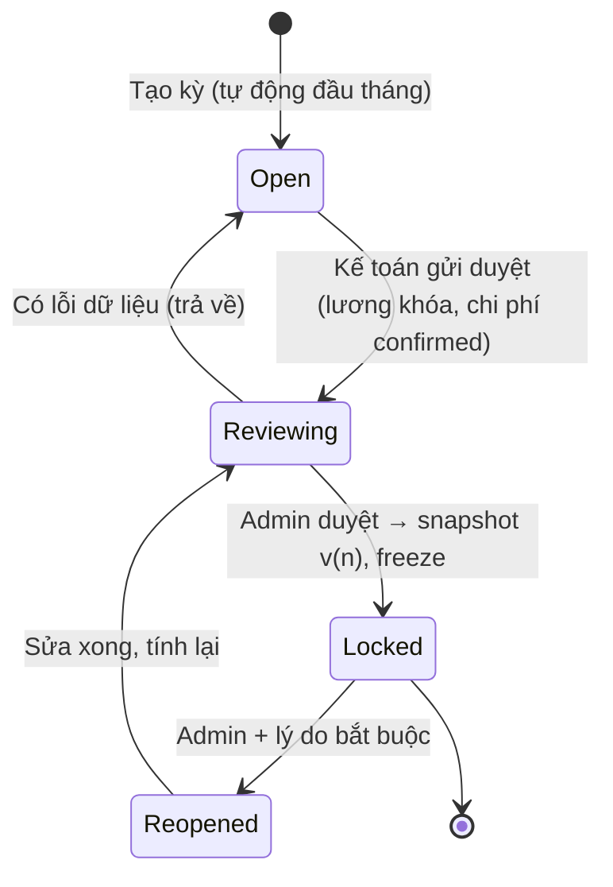
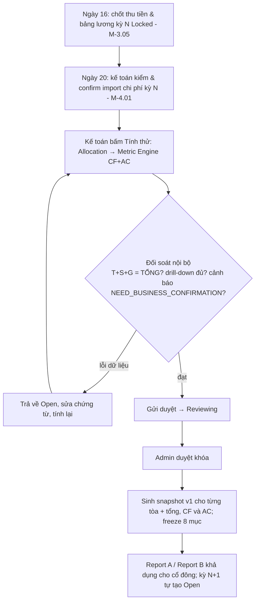
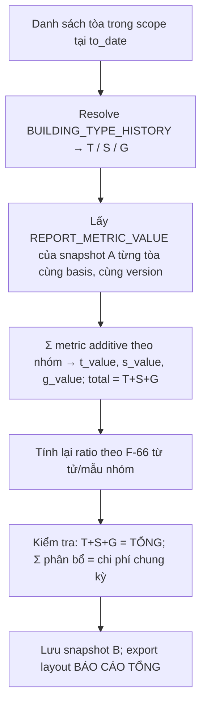

# 5. Báo cáo

> Chương này mô tả nghiệp vụ để Backend (BE) **tính được** hai báo cáo tài chính của TimoHouse từ sổ giao dịch, không nhập số tổng tay:
> - **Report A – Báo cáo tòa** (mẫu sheet `Báo cáo tháng 6` của tòa G1, file `Timohouse.xlsx` / `G1.31.8.26.xlsx`).
> - **Report B – Báo cáo tổng T/S/G** (mẫu sheet `Báo cáo kinh doanh Tháng 8` / `BÁO CÁO TỔNG THÁNG 8`, file `BÁO CÁO KINH DOANH THÁNG 8.xlsx`).
>
> Mỗi báo cáo có 2 biến thể (R-01): **CF – Lợi nhuận dòng tiền** (thực thu/thực chi, phải khớp golden Excel) và **AC – Kinh doanh** (theo kỳ phát sinh, có khấu hao, không cọc). Mọi thuật ngữ D-xx, rule R-xx, tham số P-xx, metric code dùng đúng chính tả của `00_shared_brief.md`; chương này **không định nghĩa lại** mà chỉ tham chiếu. Chương 5 được phép định nghĩa 4 metric mới cho biến thể AC (`DEPRECIATION_COST`, `HEAD_LEASE_COST_AC`, `DEFERRED_REVENUE`, `OTHER_INCOME`) và công thức từ **F-57** trở đi.

## 5.0 Phạm vi, pipeline và quy ước riêng của chương

### 5.0.1 Pipeline báo cáo Phase 1 (spec §12.23)


Nguyên tắc xuyên suốt:
- BE **không được nhập trực tiếp số tổng** vào báo cáo; mọi metric phải có `metric_code`, nguồn entity, `date_basis`, công thức có version và drill-down về chứng từ (R-37, spec §12.23.14).
- Một họ metric code duy nhất (§0.5); biến thể CF/AC là **chiều `basis`** của cùng metric, không tạo hai họ mã.
- Báo cáo tính **theo tòa trước**, rồi gộp theo nhóm T/S/G và tổng (R-01); tỷ lệ tính lại từ tổng (R-07).
- Kỳ báo cáo đã `Locked` không thay đổi khi master data thay đổi sau đó (R-08).

### 5.0.2 Bảng tham chiếu module nguồn dữ liệu (mã module theo thứ tự chương ở §0.2)

| Mã | Module (tên) | Chương 5 đọc gì |
|---|---|---|
| M-2.02 | HĐ đầu vào (chủ nhà) | Tiền thuê nhà, kỳ trả 3/4/6 tháng, tháng miễn, thời hạn còn lại (khấu hao cải tạo) |
| M-2.03 | Tòa | `BUILDING`, `BUILDING_TYPE_HISTORY` (nhóm T/S/G, hạng L1–L3), số phòng n của tòa |
| M-2.04 | Phòng | `ROOM`, `ROOM_STATUS_HISTORY` (đếm phòng trống cuối kỳ) |
| M-2.06 | HĐ thuê / OCR | `CONTRACT`, `CONTRACT_VERSION`, `CONTRACT_EVENT` (new / renew / transfer / end / early_termination / abandon) |
| M-2.07 | Dịch vụ & giá | `SERVICE` (service_code 7 loại + combo tách đôi D-19) |
| M-2.08 | Điện nước | `METER_READING` (drill-down dòng điện/nước) |
| M-2.09 | Hóa đơn | `INVOICE`, `INVOICE_LINE` (12 dòng cố định R-09, `billing_period`) |
| M-2.10 | Thu tiền | `PAYMENT`, `PAYMENT_ALLOCATION` (`paid_at`, tài khoản nhận R-12) |
| M-2.11 | Công nợ | Số dư hóa đơn (không vào báo cáo, chỉ đối chiếu) |
| M-2.12 | Sắp hết hạn / Gia hạn / Kết thúc / Phá HĐ | `CONTRACT_EVENT.actual_end_date`, hóa đơn cuối |
| M-2.13 | Cọc / Hoàn cọc | `DEPOSIT_LEDGER` (collect / forfeit / transfer / refund), `REFUND_CASE` (deductions, `paid_at`) |
| M-3.03 | Phân công tòa | `BUILDING_ASSIGNMENT` (drill-down lương hiệu suất) |
| M-3.04 | Hiệu suất thu tiền | `COLLECTION_MILESTONE_SNAPSHOT` (chỉ drill-down, không vào metric) |
| M-3.05 | Bảng lương | `PAYROLL_PERIOD`, `PAYROLL_RESULT` đã khóa; lương hiệu suất theo tòa; lương cố định theo level |
| M-3.06 | Chi lương | `SALARY_PAYMENT` (ngày chi – chỉ để đối chiếu sổ quỹ; `SALARY_COST` cả CF và AC lấy theo kỳ lương, BR-5.02.7) |
| M-4.01 | Chi phí & import | `EXPENSE` (category, `accounting_period`, `paid_at`, scope tòa / nhóm / toàn hệ thống) |
| M-4.02 | Phân bổ | `ALLOCATION_RULE`, `ALLOCATION_RESULT` (N = tổng phòng, n = phòng tòa) |
| M-4.03 | Hoa hồng | `COMMISSION_IMPORT_LINE` → `EXPENSE` category Hoa hồng |
| M-4.04 | Tài sản & Khấu hao | `ASSET`, `DEPRECIATION_SCHEDULE` (chỉ AC) |
| M-4.05 | Tiền thuê nhà & chi phí trả trước | `HEAD_LEASE_MONTHLY` (CF theo tháng HĐ, R-27), `HEAD_LEASE_ACCRUAL` (AC thẳng hàng); `HEAD_LEASE_PAYMENT_SCHEDULE` chỉ để drill-down đợt trả |
| M-4.06 | Cổ đông / Góp vốn / Phân phối | `SHAREHOLDER`, `BUILDING_SHARE`, `SHAREHOLDER_CAPITAL_ACCOUNT`, `PROFIT_DISTRIBUTION` |

### 5.0.3 Danh sách module chương 5

| Mã | Module | Mục tiêu ngắn |
|---|---|---|
| M-5.01 | Kỳ báo cáo & khóa kỳ | REPORT_PERIOD theo tháng, cutoff, Open → Reviewing → Locked → Reopened, freeze list, điều chỉnh sau khóa |
| M-5.02 | Hai biến thể CF / AC | Bảng nguyên tắc ghi nhận từng dòng; 4 metric AC mới; một họ mã + chiều basis |
| M-5.03 | Report A – Báo cáo tòa | 12 khối theo mẫu G1; metric mapping; F-01…F-30; ví dụ G1 T6 CF + AC minh họa |
| M-5.04 | Report B – Báo cáo tổng T/S/G | Gộp theo BUILDING_TYPE_HISTORY; additive vs ratio; 2 tỷ lệ thêm; biến thể KH đã làm |
| M-5.05 | Bảng cổ phần trong báo cáo tòa | F-26…F-28; snapshot %; chỉ hiển thị |
| M-5.06 | Golden dataset, đối soát & nghiệm thu | Bảng đối soát A/B; dung sai; drill-down contract; export; tiêu chí nghiệm thu |

---

## 5.1 M-5.01 Kỳ báo cáo & khóa kỳ

### 5.1.1 Mục tiêu
Quản lý **kỳ báo cáo** (`REPORT_PERIOD`) theo tháng dương lịch (D-09) làm khung thời gian duy nhất cho Metric Engine, snapshot, Report A/B và phân phối lợi nhuận; bảo đảm số liệu đã khóa không đổi khi dữ liệu nguồn thay đổi sau đó (R-08, spec §12.23.13). Kỳ báo cáo là **một đối tượng chung cho cả 2 biến thể CF và AC** – khóa một lần, sinh hai snapshot.

### 5.1.2 Tác nhân

| Vai trò | Quyền trong module |
|---|---|
| Kế toán | Tạo kỳ, chạy tính thử (Open), chuyển Reviewing, thực hiện khóa (Locked) sau khi admin duyệt; lập bút toán điều chỉnh |
| Admin | Duyệt khóa; **duy nhất** được mở khóa (Reopened) kèm lý do; cấu hình cutoff, tham số P-06 |
| TPVH / Trưởng khu vực | Xem báo cáo ở trạng thái Reviewing trở đi, ghi nhận sai lệch (không sửa số) |
| Cổ đông | Chỉ xem báo cáo tòa mình có cổ phần khi kỳ đã Locked (R-34) |
| Hệ thống | Tự tạo kỳ tháng kế tiếp, tự sinh snapshot khi khóa, ghi audit |

### 5.1.3 Dữ liệu

**`REPORT_PERIOD`** (spec §12.23.1):

| Trường | Ý nghĩa | Nguồn / giá trị |
|---|---|---|
| `code` | `2026-06` | Tự sinh |
| `period_type` | `MONTH` | Cố định Phase 1 |
| `year`, `month`, `from_date`, `to_date` | 01 → ngày cuối tháng | D-09 |
| `cutoff_at` | Thời điểm chốt dữ liệu để tính (mặc định 23:59:59 ngày cuối tháng; có thể đặt muộn hơn cho CF để gom payment ghi nhận trễ) | P-06 |
| `status` | `OPEN / REVIEWING / LOCKED / REOPENED` | State §5.1.7 |
| `metric_definition_version` | Phiên bản METRIC_DEFINITION dùng cho kỳ | Freeze khi khóa |
| `allocation_version` | Phiên bản ALLOCATION_RULE dùng cho kỳ | Freeze khi khóa |
| `payroll_period_id` | Kỳ lương đã khóa (M-3.05) gắn với kỳ báo cáo | R-23 |
| `room_count_total` (N) | Tổng phòng đang quản lý cuối tháng kể cả trống (tháng 6/2026 = 1.303; tháng 8/2026 = 1.382) | R-26, P-05 |
| `generated_at`, `locked_at`, `locked_by`, `reopened_at`, `reopened_by`, `reopen_reason` | Audit | |
| `note` | | |

**`REPORT_SNAPSHOT`**: 1 kỳ × 1 biến thể × (1 tòa **hoặc** tổng) = 1 snapshot; trường `report_type ∈ {A_BUILDING, B_SUMMARY}`, `basis ∈ {CF, AC}`, `building_id` (nullable), `building_type` (nullable), `version_no` (tăng khi Reopen → khóa lại), `status`, `source_version`, `generated_by`.

**`REPORT_METRIC_VALUE`**: `report_snapshot_id`, `metric_code`, `total_value`, `t_value`, `s_value`, `g_value`, `calculation_detail_json` (numerator/denominator, N, n, danh sách id chứng từ hoặc số lượng), `drilldown_count`, `business_confirmation_status`.

**Freeze list khi khóa** (đóng băng bằng snapshot, không tham chiếu bảng sống):

| # | Đối tượng đóng băng | Entity snapshot | Ref |
|---|---|---|---|
| 1 | Phiên bản Metric Definition | `REPORT_PERIOD.metric_definition_version` | R-08 |
| 2 | Phiên bản Allocation Rule + kết quả phân bổ (N, n, số tiền từng tòa) | `ALLOCATION_RESULT` gắn `report_period_id` | R-26 |
| 3 | Loại tòa T/S/G và hạng L theo kỳ | `BUILDING_TYPE_HISTORY` resolve tại `to_date` → lưu vào `REPORT_SNAPSHOT.building_type` | D-02 |
| 4 | Snapshot lương (bảng lương kỳ đã khóa + phân bổ lương về tòa) | `PAYROLL_RESULT` + `ALLOCATION_RESULT(source_type=PAYROLL)` | R-23 |
| 5 | % cổ đông tại ngày cuối kỳ | `BUILDING_SHARE` snapshot (bảng con của REPORT_SNAPSHOT) | R-32 |
| 6 | Giá trị mọi metric (CF và AC) | `REPORT_METRIC_VALUE` | spec §12.23.13 |
| 7 | Phân công tòa (drill-down lương hiệu suất) | `BUILDING_ASSIGNMENT` snapshot ngày 15 | R-23 |
| 8 | Người/thời điểm khóa | `locked_by`, `locked_at` | |


**Lịch tháng của một kỳ báo cáo** (chi tiết ở chương 1; đây là các mốc mà M-5.01 dùng làm điều kiện chuyển trạng thái):

| Ngày (tháng N / N+1) | Sự kiện | Module | Ảnh hưởng tới kỳ N |
|---|---|---|---|
| 22/N | Chốt chỉ số điện nước (tham số theo tòa) | M-2.08 | Dịch vụ kỳ N chốt xong |
| Cuối tháng N | Phát hành hóa đơn: tiền phòng N+1 + dịch vụ kỳ 22/N−1 → 22/N | M-2.09 | `billing_period` xác định; `to_date` kỳ N = cutoff mặc định |
| 25/N → cuối tháng N | Hạn thanh toán hóa đơn | M-2.10 | Payment vào CF kỳ N |
| 5, 10, 15 / N+1 | Mốc thu M1/M2/M3 của hóa đơn phát hành cuối tháng N (hiệu suất kỳ N+1) | M-3.04 | Không đổi metric kỳ N (chỉ drill-down lương) |
| 16/N+1 | Chốt thu tiền & bảng lương kỳ N+1 (kỳ N đã chốt từ 16/N) | M-3.05 | Điều kiện Reviewing của kỳ **N** là bảng lương kỳ N Locked (16/N) |
| 20/N+1 | Kế toán kiểm & confirm chi phí kỳ N (giá gốc điện nước NCC về trễ) | M-4.01 | Điều kiện Reviewing |
| Sau 20/N+1 | Khóa kỳ N | M-5.01 | Snapshot; mở phân phối quý (M-4.06) nếu là tháng cuối quý |
| Tự động | Tạo kỳ N+1 `OPEN` ngay khi tạo kỳ N (tồn tại song song) | M-5.01 | Payment tháng N+1 ghi vào kỳ N+1 dù kỳ N chưa khóa |

**`REPORT_ADJUSTMENT`** (bút toán điều chỉnh sau khóa – entity bổ sung của chương 5):

| Trường | Ý nghĩa |
|---|---|
| `id`, `report_period_id` (kỳ hiện tại đang Open) | Kỳ nhận điều chỉnh |
| `origin_period_id` | Kỳ gốc đã Locked |
| `origin_document_type`, `origin_document_id` | INVOICE / PAYMENT / EXPENSE / REFUND_CASE / PAYROLL_RESULT / COMMISSION_IMPORT_LINE |
| `building_id`, `metric_code`, `basis` (CF / AC / BOTH) | Dòng báo cáo bị ảnh hưởng |
| `amount` (± VND hoặc ± đếm) | Số điều chỉnh |
| `reason`, `created_by`, `approved_by`, `approved_at` | Kế toán lập, admin duyệt |
| `status` | `DRAFT → APPROVED → POSTED`; chỉ POSTED mới vào metric |

### 5.1.4 Search / Filter
- Theo năm, tháng, trạng thái kỳ, biến thể (CF / AC), tòa, nhóm T/S/G, khu vực / trưởng nhóm / quản lý (R-34).
- Danh sách kỳ hiển thị: mã kỳ, trạng thái, N phòng, số tòa có snapshot, ngày khóa, người khóa, số lần reopen, phiên bản hiện hành.

### 5.1.5 Action

| Action | Ai | Điều kiện | Kết quả |
|---|---|---|---|
| Tạo kỳ | Hệ thống / Kế toán | Kỳ trước tồn tại | `OPEN`, cutoff mặc định |
| Tính thử (Generate) | Kế toán | `OPEN` hoặc `REVIEWING` | Chạy Allocation → Metric Engine → snapshot tạm (không version) cho cả CF và AC |
| Gửi duyệt (→ Reviewing) | Kế toán | Đã tính thử; bảng lương kỳ đã khóa (M-3.05); kiểm chi phí ngày 20 hoàn tất (P-06) | `REVIEWING` |
| Trả về (→ Open) | Admin / Kế toán | Phát hiện lỗi dữ liệu | `OPEN`, xóa snapshot tạm |
| Khóa (→ Locked) | Kế toán thực hiện, Admin duyệt | Checklist khóa §5.1.6 đạt | Sinh snapshot chính thức version n, freeze list, khóa sửa chứng từ thuộc kỳ |
| Mở khóa (→ Reopened) | Admin | Có lý do bắt buộc; kỳ sau chưa Locked (khuyến nghị) | Giữ nguyên snapshot cũ (read-only), cho phép sửa chứng từ kỳ |
| Khóa lại | Kế toán + Admin | Sau Reopened → Reviewing → Locked | Snapshot version n+1; bảng so sánh version n ↔ n+1 |
| Bút toán điều chỉnh | Kế toán | Kỳ gốc đã Locked | Ghi `ADJUSTMENT` vào kỳ hiện tại (đang Open), tham chiếu chứng từ gốc và kỳ gốc |
| Xem lịch tháng | Mọi vai trò | | Timeline: 22 chốt chỉ số → cuối tháng phát hành HĐ → 5/10/15 mốc thu → 16 chốt lương → 20 kiểm chi phí → khóa (chương 1) |

### 5.1.6 Business Rule

- **BR-5.01.1** Kỳ báo cáo = tháng dương lịch; mỗi tháng đúng 1 `REPORT_PERIOD`, dùng chung cho Report A, Report B, cả 2 biến thể CF/AC và phân phối lợi nhuận (D-09, R-01). [Đã chốt]
- **BR-5.01.2** Trạng thái chuyển đúng thứ tự Open → Reviewing → Locked → Reopened → Reviewing → Locked; không nhảy cóc, không xóa kỳ đã có snapshot (R-08). [Cần chốt]
- **BR-5.01.3** Chỉ được chuyển Reviewing khi: bảng lương kỳ đã Locked (M-3.05), mọi import chi phí kỳ đã Confirmed (M-4.01), không còn hóa đơn kỳ ở trạng thái Nháp, tiền thuê nhà kỳ đã có lịch (M-4.05). [Cần chốt]
- **BR-5.01.4** Khi Locked, hệ thống đóng băng đủ 8 mục freeze list §5.1.3; báo cáo đã khóa **không tự tính lại** khi master data, phân công, % cổ đông, loại tòa thay đổi sau đó (R-08, spec §12.23.14 mục 16). [Đã chốt]
- **BR-5.01.5** Mọi chứng từ có `date_basis` rơi vào kỳ Locked bị khóa sửa/xóa; sửa sau khóa chỉ qua **bút toán điều chỉnh kỳ hiện tại** có tham chiếu chứng từ gốc (answer.md §A10, §H6). [Đã chốt]
- **BR-5.01.6** Chỉ admin được Reopen, bắt buộc nhập lý do; snapshot cũ giữ nguyên, read-only, có `version_no`; khóa lại sinh version mới và bảng chênh lệch từng metric giữa 2 version (R-08). [Cần chốt]
- **BR-5.01.7** Lịch khóa mặc định: 16 chốt thu tiền & lương → 20 kế toán kiểm chi phí → khóa sau ngày 20 (P-06); ngày là tham số hệ thống, không hard-code. [Cần chốt]
- **BR-5.01.8** `cutoff_at` là mốc lấy dữ liệu để tính; record có ngày basis trong kỳ nhưng được nhập sau cutoff (ví dụ payment ghi trễ) → cảnh báo "phát sinh sau cutoff" và chỉ vào kỳ nếu kỳ chưa Locked; nếu đã Locked → điều chỉnh kỳ hiện tại (spec §12.23.2). [Cần chốt]
- **BR-5.01.9** Không dùng ngày tạo record (`created_at`) để xác định kỳ; mỗi metric dùng đúng `date_basis` của M-5.02 (spec §12.23.2). [Đã chốt]
- **BR-5.01.10** N phân bổ (`room_count_total`) chốt tại `to_date` của kỳ, kể cả phòng trống, không kể tòa đã trả chủ nhà (R-26, P-05); là mẫu số **khác** với số phòng tính hiệu suất của bảng lương (1.079 T8 vs N 1.382); một N duy nhất cho mọi dòng phân bổ trong kỳ (Excel T8 dùng 1.343 ở lương sửa chữa → RULE_DIFFERENCE §5.6.3); được lưu vào kỳ và không tính lại sau khóa. [Có bằng chứng nguồn]
- **BR-5.01.11** Kỳ báo cáo tháng N chỉ được Locked khi kỳ N−1 đã Locked (đảm bảo công nợ, cọc, doanh thu chưa thực hiện lũy kế đúng). [Cần chốt]
- **BR-5.01.12** Cổ đông chỉ nhìn thấy snapshot Locked của tòa mình có cổ phần; số ở trạng thái Open/Reviewing gắn nhãn "tạm tính" cho nội bộ (R-34). [Đã chốt]

### 5.1.7 State / Status



| Trạng thái | Sửa chứng từ kỳ | Tính lại metric | Ai thấy | Snapshot |
|---|---|---|---|---|
| Open | Được | Tự do (tạm) | Nội bộ | Tạm, không version |
| Reviewing | Không (khóa mềm, admin có thể trả về Open) | Chỉ khi trả về Open | Nội bộ + TPVH | Tạm |
| Locked | Không | Không | Tất cả (kể cả cổ đông) | Chính thức, version n |
| Reopened | Được (có audit) | Khi quay lại Reviewing | Nội bộ; cổ đông vẫn thấy version cũ | Version cũ read-only |

### 5.1.8 Flow

Luồng chính "khóa kỳ tháng N":



Ngoại lệ:
- **Phát hiện sai sau khóa (nhỏ)**: không Reopen; lập bút toán điều chỉnh kỳ hiện tại (BR-5.01.5); drill-down của kỳ hiện tại hiển thị dòng điều chỉnh với link kỳ gốc.
- **Phát hiện sai sau khóa (lớn, đã chia lợi nhuận)**: admin Reopen kèm lý do → sửa → khóa lại v2; module M-4.06 nhận sự kiện "snapshot đổi version" để cảnh báo phân phối đã duyệt (không tự hoàn/sửa phân phối).
- **Bảng lương chưa khóa đến ngày 20**: kỳ không thể sang Reviewing; Work Queue (chương 1) hiển thị việc chặn.

### 5.1.9 Liên kết

| Module | Đọc | Ghi |
|---|---|---|
| M-3.05 Bảng lương | `PAYROLL_PERIOD.status = Locked` | – |
| M-4.01 Chi phí | Trạng thái import kỳ | Khóa sửa EXPENSE kỳ Locked |
| M-4.02 Phân bổ | `ALLOCATION_RULE` version hiệu lực | `ALLOCATION_RESULT` gắn kỳ |
| M-4.06 Cổ đông | `BUILDING_SHARE` tại `to_date` | Snapshot % vào REPORT_SNAPSHOT; phát sự kiện "kỳ Locked" để mở phân phối quý |
| M-2.09 / M-2.10 / M-2.13 | Hóa đơn, payment, cọc theo basis | Khóa sửa chứng từ kỳ Locked |
| Chương 1 (lịch tháng, Work Queue) | Mốc 16/20/khóa | Việc "Kỳ N chờ khóa" |

### 5.1.10 Audit / Notification
- Audit: mọi chuyển trạng thái (ai, khi nào, lý do), version snapshot, danh sách chứng từ bị khóa, bút toán điều chỉnh (chứng từ gốc, kỳ gốc, số tiền, lý do).
- Notification: ngày 16 nhắc chốt lương; ngày 20 nhắc kiểm chi phí; kỳ sang Reviewing → thông báo admin; kỳ Locked → thông báo cổ đông (báo cáo tòa sẵn sàng); Reopen → thông báo admin, kế toán, TPVH và M-4.06.

### 5.1.11 Nghiệm thu
- Tạo được kỳ, chuyển đủ 4 trạng thái theo đúng điều kiện; không nhảy trạng thái.
- Khóa kỳ tạo snapshot CF và AC cho mọi tòa đang quản lý + snapshot tổng; sau khi đổi % cổ đông / loại tòa / phân công / rule phân bổ, mở lại báo cáo Locked → số **không đổi**.
- Reopen bắt buộc lý do; khóa lại sinh version 2 và bảng chênh lệch.
- Bút toán điều chỉnh xuất hiện ở drill-down kỳ hiện tại với link kỳ gốc.

---

## 5.2 M-5.02 Hai biến thể CF / AC

### 5.2.1 Mục tiêu
Định nghĩa **nguyên tắc ghi nhận theo từng dòng báo cáo** cho 2 biến thể (R-01, answer.md §H1): CF – Lợi nhuận dòng tiền (khớp Excel hiện tại) và AC – Kinh doanh (accrual). Mỗi metric có chiều `basis ∈ {CF, AC}` với `date_basis` và filter riêng nhưng **cùng metric_code, cùng công thức tổng hợp** (GV, CPBH, TCP, LNG, LNR, tỷ lệ). Bổ sung 4 metric chỉ có ý nghĩa ở AC.

### 5.2.2 Tác nhân
- Kế toán: chọn biến thể khi xem/xuất; duy trì METRIC_DEFINITION (đề xuất version mới); xác nhận các dòng NEED_BUSINESS_CONFIRMATION.
- Admin: duyệt version METRIC_DEFINITION; bật/tắt biến thể AC cho cổ đông.
- Cổ đông / TPVH: xem; mặc định thấy CF (khớp Excel quen thuộc), AC là tab thứ hai có nhãn "Kinh doanh (accrual)".

### 5.2.3 Dữ liệu

**`METRIC_DEFINITION`** (spec §12.23.1) bổ sung cột `basis` và `date_field` theo basis:

| Trường | Ghi chú |
|---|---|
| `metric_code` | Đúng chính tả §0.5 |
| `basis` | `CF` / `AC` / `BOTH` (metric công thức như `GROSS_PROFIT` là `BOTH`, tính trên input cùng basis) |
| `report_group` | 12 khối §5.3.3 |
| `unit` | `MONEY / COUNT / PERCENT` |
| `formula_type` | `SOURCE / FORMULA / AGGREGATE` |
| `formula_expression` | Ví dụ `TOTAL_REVENUE - COGS` |
| `source_entity`, `date_field`, `filter_expression` | Theo bảng §5.2.3-B |
| `additive` | true/false (T+S+G = TỔNG) |
| `excel_cell_a`, `excel_cell_b` | Vị trí ô trên mẫu A (`Báo cáo tháng 6`) và B (`BÁO CÁO TỔNG`) để export |
| `version`, `effective_from/to`, `status`, `business_confirmation_status` | `CONFIRMED / NEED_BUSINESS_CONFIRMATION / DEPRECATED` |

**Bảng §5.2.3-B – Nguyên tắc ghi nhận theo dòng báo cáo**

| Dòng báo cáo | CF: basis ngày & nguồn entity | AC: basis & nguồn | Nhãn |
|---|---|---|---|
| Tổng doanh thu (`TOTAL_REVENUE`) | `PAYMENT.paid_at` trong kỳ, Σ tiền khách thực đóng (mọi dòng: tiền phòng, DV, cọc mới, nợ cũ, thu khác) **− hoàn cọc** (`REFUND_CASE.paid_at` trong kỳ); Excel `C2 = 'HĐ'!AX2` (T6) / `AX2 − C7` (T8) (R-02, D-29) | `INVOICE.billing_period = kỳ`, Σ dòng tiền phòng + 7 DV + thu khác của hóa đơn phát hành trong kỳ **+ `OTHER_INCOME`** ; không gồm cọc thu/hoàn; phần đóng trước nhiều tháng chuyển `DEFERRED_REVENUE` (R-03) | CF [Đã chốt + Có bằng chứng nguồn] / AC [Cần chốt] |
| Doanh thu tiền phòng (`RENT_REVENUE`) | `INVOICE_LINE(rent)` của hóa đơn `billing_period = kỳ` **có PAYMENT_ALLOCATION** (đã thu, theo thứ tự phân bổ BR-5.02.9); tự loại phòng đã trả không đóng tiền phòng; gồm prorate phòng mới (D-33, answer.md §A9) | `INVOICE_LINE(rent)` của hóa đơn `billing_period = kỳ`, không phụ thuộc đã thu; hóa đơn cuối phòng phá HĐ chỉ tính đến ngày ra (R-16) | CF [Đã chốt] / AC [Cần chốt] |
| 7 dòng dịch vụ (`ELECTRIC_REVENUE` … `WASHING_REVENUE`) | `INVOICE_LINE(service_code)` của hóa đơn `billing_period = kỳ` (kỳ chốt 22/N−1 → 22/N), kể cả hóa đơn cuối phòng đã trả và phần khấu trừ cọc (R-04, D-34); combo tách đôi vệ sinh / máy giặt (D-19) | Như CF (dịch vụ đã lên hóa đơn từng phòng = doanh thu); khác CF chỉ khi hóa đơn kỳ được điều chỉnh/hủy sau khóa | [Đã chốt] |
| Cọc phòng mới (`NEW_DEPOSIT`) | `DEPOSIT_LEDGER(type=collect).received_at` trong kỳ **và** `CONTRACT.move_in` trong kỳ (D-30, R-05); đã nằm trong `TOTAL_REVENUE` – dòng hiển thị tách | Không ghi doanh thu; hiển thị memo "cọc đang giữ" (R-05) | CF [Đã chốt] / AC [Cần chốt] |
| Cọc khách bỏ (`FORFEITED_DEPOSIT`) | `DEPOSIT_LEDGER(type=forfeit).event_date` trong kỳ; **dòng memo, không cộng lại** vào tổng (D-31, R-02, answer.md §H5) | Vào `OTHER_INCOME` tại tháng khách bỏ (`CONTRACT_EVENT(abandon).event_date`) với số = cọc bị giữ (D-54) (R-05) | CF [Đã chốt] / AC [Cần chốt] |
| Hoàn cọc (`REFUND_AMOUNT`) | `REFUND_CASE.paid_at` trong kỳ, số thực chi; trừ khỏi `TOTAL_REVENUE` (D-32, answer.md §A5) | Không ảnh hưởng doanh thu (trả lại nợ phải trả); các khoản khấu trừ (sửa chữa, vệ sinh, sơn, khấu hao 200k) → `OTHER_INCOME` kỳ quyết toán (R-29) | CF [Đã chốt] / AC [Cần chốt] |
| Thu khác (D-17) | Nằm trong `TOTAL_REVENUE` khi đã thu (không có dòng riêng trên mẫu) | Vào `TOTAL_REVENUE` AC theo hóa đơn phát hành; phạt trễ hạn (P-09) tính khi phát hành dòng phạt | [Cần chốt] |
| Doanh thu đóng quý (Kỳ TT = 2/3, D-13) | Ghi **cả kỳ** vào tháng thu (answer.md §H6) | Chia đều theo tháng: tháng thu ghi 1/k, phần còn lại vào `DEFERRED_REVENUE` và giải phóng dần (R-03) | CF [Đã chốt] / AC [Cần chốt] |
| Tiền thuê nhà (`HEAD_LEASE_COST` / `HEAD_LEASE_COST_AC`) | **Theo tháng hợp đồng** (`HEAD_LEASE_MONTHLY`, M-4.05): mỗi tháng hiệu lực = tiền thuê 1 tháng theo HĐ đầu vào (D-35), không theo ngày trả; tháng miễn = 0 (R-27; golden G1 48.000.000/tháng dù trả quý) | `HEAD_LEASE_COST_AC` = tổng tiền thuê toàn HĐ đầu vào ÷ số tháng HĐ (thẳng hàng cả tháng miễn, M-4.05); trả quý = chi phí trả trước (R-27) | CF [Có bằng chứng nguồn] / AC [Cần chốt] |
| Mua thêm thiết bị (`EQUIPMENT_PURCHASE_COST`) | `EXPENSE(category=Mua thêm thiết bị).paid_at` trong kỳ, ghi hết (D-36) | = 0; thay bằng `DEPRECIATION_COST` từ `DEPRECIATION_SCHEDULE` (R-28) | CF [Đã chốt] / AC [Cần chốt → P-02] |
| Đầu tư ban đầu / cải tạo (sheet ĐẦU TƯ BAN ĐẦU) | Không vào báo cáo tháng (thuộc góp vốn, R-31) | `DEPRECIATION_COST` theo thời hạn HĐ đầu vào còn lại ≤ 60 tháng, từ tháng đưa vào dùng (R-28) | [Cần chốt → P-02] |
| Giá gốc điện / nước / mạng / rác / môi trường / thang máy (`*_INPUT_COST`, `GARBAGE_COST`, `ENVIRONMENT_COST`, `ELEVATOR_MAINT_COST`) | `EXPENSE.paid_at` trong kỳ (ngày trả NCC) (answer.md §H6) | `EXPENSE.accounting_period = kỳ` (kỳ tiêu thụ trên hóa đơn NCC) (R-25, D-37) | [Đã chốt] |
| Lương (`SALARY_COST`, 10 dòng) | Bảng lương **kỳ lương N** đã khóa — **không theo ngày chi** (khớp golden G1; answer.md §H1 "tháng chi lương" được hiểu là sổ quỹ M-3.06, P-18) — xem BR-5.02.7 | `PAYROLL_PERIOD = kỳ`; lương cố định phân bổ theo phòng, lương hiệu suất ghi thẳng tòa (D-39, R-26) | [Cần chốt] |
| Thuê & DV VP, Marketing (`OFFICE_COST`, `MARKETING_COST`) | `EXPENSE.paid_at`; phạm vi toàn hệ thống → phân bổ theo phòng | `EXPENSE.accounting_period`; phân bổ như CF (R-26) | [Có bằng chứng nguồn] |
| Hoa hồng (`COMMISSION_COST`) | `COMMISSION_IMPORT_LINE.paid_at` (tháng trả, "Đã tt") gắn tòa theo mã phòng (R-30, answer.md §D4) | Tháng deal **đủ điều kiện** (khách đóng đủ cọc + ký HĐ, D-56); Phase 1 nếu thiếu ngày đủ → dùng tháng trả (fallback) | CF [Đã chốt] / AC [Cần chốt] |
| Sửa chữa, thay thế, bảo trì (`REPAIR_COST`) & khấu trừ cọc | `EXPENSE.paid_at`; ghi đủ, không bù trừ với khấu trừ cọc (R-29) | `EXPENSE.accounting_period`; khấu trừ cọc → `OTHER_INCOME` (R-29) | [Cần chốt] |
| Chi phí khác (`OTHER_COST`) | `EXPENSE(category → CPK).paid_at` | `EXPENSE.accounting_period` | [Đã chốt data / mapping cần chốt] |
| Đếm phòng (`NEW_ROOM_COUNT`, `EARLY_TERMINATION_COUNT`, `VACANT_ROOM_COUNT`) | Cùng định nghĩa 2 biến thể: `CONTRACT.move_in` trong kỳ; `CONTRACT_EVENT(early_termination).actual_end_date` trong kỳ; `ROOM_STATUS_HISTORY` tại `to_date` (D-23, D-25, D-24, R-06) | Như CF | [Đã chốt / Cần chốt D-23] |
| Bảng cổ phần | % tại `to_date`; Vốn = % × tiền thuê 1 tháng (D-43); LNG/LNR theo snapshot CF | Cùng %, LNG/LNR theo snapshot AC; cột "Vốn" giữ nguyên (trình bày) | [Có bằng chứng nguồn / Cần chốt] |

**4 metric mới cho biến thể AC** (chỉ chương này định nghĩa; §0.5):

| Metric code | Đơn vị | basis | Khối | Định nghĩa | Nguồn | Công thức | Nhãn |
|---|---|---|---|---|---|---|---|
| `DEPRECIATION_COST` | MONEY | AC | Giá vốn (thay dòng "Mua sắm thêm thiết bị") | Khấu hao tháng của thiết bị mua thêm + đầu tư ban đầu/cải tạo của tòa | `DEPRECIATION_SCHEDULE` (M-4.04) `period = kỳ`, `building_id` | F-59 | [Cần chốt → P-02] |
| `HEAD_LEASE_COST_AC` | MONEY | AC | Giá vốn (thay `HEAD_LEASE_COST` ở AC) | Tiền thuê nhà phân bổ thẳng hàng theo tháng HĐ đầu vào, kể cả tháng miễn | `HEAD_LEASE` (M-2.02) + lịch phân bổ (M-4.05) | F-60 | [Cần chốt] |
| `DEFERRED_REVENUE` | MONEY | AC | Memo dưới khối Doanh thu (không cộng vào `TOTAL_REVENUE`) | Số dư doanh thu chưa thực hiện cuối kỳ do khách đóng trước nhiều tháng (Kỳ TT > 1) | `INVOICE_LINE(rent)` có `months_covered > 1` + `PAYMENT_ALLOCATION` | F-61 | [Cần chốt] |
| `OTHER_INCOME` | MONEY | AC | Doanh thu (dòng "Thu nhập khác", cộng vào `TOTAL_REVENUE` AC) | Cọc bị giữ (bỏ cọc, phá HĐ) + khoản khấu trừ cọc (sửa chữa, vệ sinh, sơn, khấu hao 200k) tại kỳ sự kiện/quyết toán | `DEPOSIT_LEDGER(forfeit)`, `REFUND_CASE.deductions` | F-62 | [Cần chốt] |


**Bảng §5.2.3-C – `date_basis` theo entity nguồn** (spec §12.23.2 mở rộng cho 2 basis):

| Entity | Trường ngày CF | Trường ngày AC | Trạng thái |
|---|---|---|---|
| `PAYMENT` | `paid_at` | – (chỉ giảm công nợ) | CONFIRMED |
| `INVOICE` / `INVOICE_LINE` | `billing_period` (kết hợp `PAYMENT_ALLOCATION`) | `billing_period` | CONFIRMED |
| `DEPOSIT_LEDGER(collect)` | `received_at` + `CONTRACT.move_in` | – | CONFIRMED |
| `DEPOSIT_LEDGER(forfeit)` | `event_date` (memo) | `event_date` → OTHER_INCOME | NEED_BUSINESS_CONFIRMATION (AC) |
| `REFUND_CASE` | `paid_at` | `settled_at` (khấu trừ → OTHER_INCOME) | CONFIRMED (CF) / NEED (AC) |
| `CONTRACT` (phòng mới) | `move_in` | `move_in` | NEED_BUSINESS_CONFIRMATION (D-23) |
| `CONTRACT_EVENT(early_termination)` | `actual_end_date` | `actual_end_date` | CONFIRMED (D-25) |
| `ROOM_STATUS_HISTORY` | trạng thái tại `to_date` | như CF | CONFIRMED (D-24) |
| `EXPENSE` | `paid_at` | `accounting_period` | CONFIRMED |
| `HEAD_LEASE_MONTHLY` / `HEAD_LEASE_ACCRUAL` (M-4.05) | `period` theo tháng HĐ (`HEAD_LEASE_MONTHLY`) | `period` lịch phân bổ đều (`HEAD_LEASE_ACCRUAL`) | CONFIRMED (CF, golden) / NEED_BUSINESS_CONFIRMATION (AC, R-27) |
| `PAYROLL_RESULT` | `payroll_period` | `payroll_period` | CONFIRMED (BR-5.02.7) |
| `COMMISSION_IMPORT_LINE` | `paid_at` | `eligible_at` (fallback `paid_at`) | CONFIRMED (CF) / NEED (AC) |
| `DEPRECIATION_SCHEDULE` | – | `period` | NEED_BUSINESS_CONFIRMATION (P-02) |
| `BUILDING_TYPE_HISTORY`, `BUILDING_ASSIGNMENT`, `BUILDING_SHARE` | hiệu lực tại `to_date` (assignment: ngày 15) | như CF | CONFIRMED |

**Ví dụ 1 – Kỳ TT = 3 (đóng quý), giá 5.000.000/tháng, hóa đơn phát hành cuối tháng 6 cho tháng 7–9, khách đóng đủ 15.000.000 ngày 28/6:**

| Kỳ | CF `RENT_REVENUE` | AC `RENT_REVENUE` | AC `DEFERRED_REVENUE` cuối kỳ |
|---|---|---|---|
| 06/2026 | 0 (hóa đơn `billing_period` = 07; payment 15.000.000 vào `TOTAL_REVENUE` kỳ 6 theo F-57) | 0 | 15.000.000 (nhận trước) |
| 07/2026 | 15.000.000 (dòng rent hóa đơn kỳ 7 đã thu) | 5.000.000 | 10.000.000 |
| 08/2026 | 0 | 5.000.000 | 5.000.000 |
| 09/2026 | 0 | 5.000.000 | 0 |

Ghi chú: CF ghi `TOTAL_REVENUE` ở tháng thu (6) nhưng dòng tiền phòng ở kỳ hóa đơn (7) – đây là đặc thù mẫu Excel (tổng theo payment, dòng theo hóa đơn), được giữ nguyên để khớp golden (BR-5.03.2). [Cần chốt]

**Ví dụ 2 – Tiền thuê nhà có tháng miễn: HĐ đầu vào 60 tháng, 48.000.000/tháng, trả theo quý, miễn 2 tháng đầu (tháng 1–2/2026):**

| Kỳ | CF `HEAD_LEASE_COST` | AC `HEAD_LEASE_COST_AC` (F-60) |
|---|---|---|
| 01/2026, 02/2026 | 0 (tháng miễn) | 48.000.000 × 58 ÷ 60 = 46.400.000 |
| 03/2026 → 12/2030 | 48.000.000/tháng (theo tháng hợp đồng dù trả quý, R-27) | 46.400.000 |
| Tổng 60 tháng | 2.784.000.000 | 2.784.000.000 |

CF: tháng miễn 0 đúng như Excel của KH (tòa mới lãi cao tháng đầu); AC: thẳng hàng nên so sánh tòa cùng kỳ công bằng hơn. [Cần chốt R-27]

### 5.2.4 Search / Filter
- Chọn biến thể CF / AC là tham số bắt buộc của mọi màn báo cáo, drill-down, export; mặc định CF.
- Lọc METRIC_DEFINITION theo `basis`, `report_group`, `business_confirmation_status`, version hiệu lực tại kỳ.

### 5.2.5 Action
- Xem song song CF ↔ AC cùng kỳ, cùng tòa: bảng 3 cột `Dòng | CF | AC | Chênh lệch | Lý do (mã rule)`.
- Đề xuất / duyệt version METRIC_DEFINITION (ví dụ chốt mapping `OTHER_COST`), có ngày hiệu lực; kỳ đã Locked giữ version cũ.
- Đánh dấu metric `NEED_BUSINESS_CONFIRMATION` → hiển thị nhãn trên báo cáo, không hard-code suy đoán (spec §12.23.14 mục 15).

### 5.2.6 Business Rule

- **BR-5.02.1** Một metric = một `metric_code`; CF/AC là chiều `basis`; công thức tổng hợp (F-08, F-18…F-25, F-29, F-30) **giống hệt nhau** ở 2 biến thể, chỉ khác giá trị input (§0.5, R-01). [Đã chốt]
- **BR-5.02.2** CF: `TOTAL_REVENUE` = Σ `PAYMENT.amount` có `paid_at` trong kỳ và thuộc tòa (theo mã phòng của hóa đơn/HĐ được phân bổ) − Σ `REFUND_CASE.amount_paid` có `paid_at` trong kỳ; gồm cọc mới; cọc khách bỏ không cộng lại (R-02). [Đã chốt + Có bằng chứng nguồn]
- **BR-5.02.3** AC: `TOTAL_REVENUE` = `RENT_REVENUE` + `SERVICE_REVENUE` + thu khác trên hóa đơn `billing_period = kỳ` + `OTHER_INCOME` − phần chuyển `DEFERRED_REVENUE`; không gồm `NEW_DEPOSIT`, `REFUND_AMOUNT` (R-03, R-05). [Cần chốt]
- **BR-5.02.4** Dịch vụ đã lên hóa đơn từng phòng là doanh thu ở cả 2 biến thể, kể cả hóa đơn cuối của phòng đã trả và phần được khấu trừ vào cọc; điện nước phòng trống / không thu được là chi phí trong `ELECTRIC_INPUT_COST` / `WATER_INPUT_COST` (R-04). [Đã chốt]
- **BR-5.02.5** CF ghi tiền thuê nhà **theo tháng hợp đồng** (tiền thuê 1 tháng theo HĐ đầu vào cho mỗi tháng hiệu lực, không theo ngày trả), tháng miễn = 0; AC dùng `HEAD_LEASE_COST_AC` thẳng hàng cả tháng miễn (R-27). Trên báo cáo AC, dòng "Tiền thuê nhà" hiển thị `HEAD_LEASE_COST_AC`. [Có bằng chứng nguồn CF / Cần chốt AC]
- **BR-5.02.6** AC: phần thiết bị **≥ ngưỡng vốn hóa** (P-11, đề xuất 2.000.000/đơn vị) không vào `EQUIPMENT_PURCHASE_COST` mà chuyển sang `DEPRECIATION_COST`; phần **dưới ngưỡng** vẫn ghi `EQUIPMENT_PURCHASE_COST` ở cả CF và AC (G1 T6: thùng rác 500.000). Số tháng khấu hao: thiết bị rời < 10 triệu → 12 tháng, ≥ 10 triệu → 36 tháng (xét trên 1 đơn vị), hạng mục cải tạo ban đầu → thời hạn HĐ đầu vào còn lại ≤ 60 tháng, từ tháng đưa vào dùng; trả tòa sớm ghi hết phần còn lại (R-28, P-02). [Cần chốt]
- **BR-5.02.7** Lương trên báo cáo tòa tháng N (**cả CF và AC**) = bảng lương kỳ N đã khóa, không theo ngày chi (answer.md §C5; khớp golden G1 T6 và Report B T8); ngày chi (`SALARY_PAYMENT.paid_at`, M-3.06) chỉ dùng cho sổ quỹ / đối chiếu, không đổi số báo cáo — answer.md §H1 "Lương: tháng chi lương" được hiểu là dòng tiền sổ quỹ (P-18). [Cần chốt]
- **BR-5.02.8** Cọc khách bỏ: CF = memo (không cộng vào tổng, hoàn cọc = 0); AC = `OTHER_INCOME` tại tháng khách bỏ với số = cọc bị giữ sau trừ tiền phòng theo ngày đã ở (D-31, D-54, R-05). [Đã chốt CF / Cần chốt AC]
- **BR-5.02.9** Thứ tự phân bổ payment vào dòng hóa đơn (dùng cho CF dòng-level): **nợ cũ → 7 dịch vụ + điện chung → thu khác → tiền phòng → cọc**; nhờ đó phòng phá HĐ chỉ đóng phần dịch vụ sẽ tự nhiên bị loại khỏi `RENT_REVENUE` nhưng vẫn vào `ELECTRIC_REVENUE` – đúng cách Excel trừ tay I13/I14/I17 nhưng giữ T2 (answer.md §A9); thống nhất với BR-2.10.4; tham số P-14. [Cần chốt → P-14]
- **BR-5.02.10** Doanh thu đóng quý: CF ghi cả kỳ vào tháng thu; AC ghi 1/k mỗi tháng, phần còn lại là `DEFERRED_REVENUE` (k = Kỳ TT, D-13; answer.md §H6). [Cần chốt]
- **BR-5.02.11** Không bù trừ: chi phí sửa chữa ghi đủ vào `REPAIR_COST`; khoản khấu trừ cọc ghi `OTHER_INCOME` (AC); ở CF khoản khấu trừ đã nằm trong việc hoàn cọc ít đi, không ghi riêng (R-29). [Cần chốt]
- **BR-5.02.12** Hoa hồng: CF theo tháng trả (`paid_at`), AC theo tháng đủ điều kiện; cả hai gắn tòa theo master phòng (không cắt chuỗi với mã có chữ) (R-30, D-03). [Đã chốt CF / Cần chốt AC]
- **BR-5.02.13** Giá gốc dịch vụ: CF theo ngày trả NCC, AC theo kỳ tiêu thụ trên hóa đơn NCC (`accounting_period`); mỗi dòng import bắt buộc có cả 2 ngày (R-25). [Đã chốt]
- **BR-5.02.14** Metric có `business_confirmation_status = NEED_BUSINESS_CONFIRMATION` vẫn được tính theo công thức đề xuất nhưng hiển thị nhãn cảnh báo trên báo cáo, export và API (spec §12.23.14 mục 15). [Đã chốt]
- **BR-5.02.15** `DEFERRED_REVENUE` là metric memo (không additive vào `TOTAL_REVENUE`), số dư lũy kế = số dư kỳ trước + phát sinh − giải phóng; kỳ N chỉ khóa được khi kỳ N−1 Locked (BR-5.01.11). [Cần chốt]

### 5.2.7 State / Status
- METRIC_DEFINITION: `DRAFT → ACTIVE → DEPRECATED`; chỉ `ACTIVE` tại `to_date` kỳ được dùng khi tính; kỳ Locked giữ version đã freeze.
- `business_confirmation_status`: `NEED_BUSINESS_CONFIRMATION → CONFIRMED` khi kế toán xác nhận có văn bản (ghi nguồn: answer.md mục, ngày); `DEPRECATED` khi thay bằng metric khác.

### 5.2.8 Flow
1. Metric Engine nhận (kỳ, tòa, basis) → tra METRIC_DEFINITION version hiệu lực.
2. Với metric `SOURCE`: áp `source_entity` + `date_field(basis)` + `filter_expression(basis)` → Σ / COUNT; lưu danh sách id chứng từ vào `calculation_detail_json`.
3. Với metric `AGGREGATE` / `FORMULA`: tính theo `formula_expression` trên giá trị cùng basis.
4. Ghi `REPORT_METRIC_VALUE`; nếu bất kỳ input có nhãn NEED_BUSINESS_CONFIRMATION → metric kế thừa nhãn.
5. Bảng so sánh CF ↔ AC được sinh từ 2 snapshot cùng kỳ, gắn mã rule giải thích chênh lệch (BR-5.02.2 … BR-5.02.13).

### 5.2.9 Liên kết
- Đọc: M-2.09/M-2.10 (hóa đơn, payment), M-2.13 (cọc, hoàn cọc), M-2.12 (sự kiện HĐ), M-3.05 (lương), M-4.01–M-4.05 (chi phí, phân bổ, hoa hồng, khấu hao, tiền thuê nhà).
- Ghi: METRIC_DEFINITION version; nhãn NEED_BUSINESS_CONFIRMATION lên báo cáo; danh sách chênh lệch CF ↔ AC.

### 5.2.10 Audit / Notification
- Audit đổi version METRIC_DEFINITION (ai, ngày, diff công thức/filter), đổi trạng thái xác nhận.
- Cảnh báo khi tổng số metric NEED_BUSINESS_CONFIRMATION > 0 trong kỳ chuẩn bị khóa (không chặn khóa CF; chặn công bố AC cho cổ đông nếu admin cấu hình).

### 5.2.11 Nghiệm thu
- Cùng một kỳ và tòa, sinh được 2 snapshot CF/AC từ **cùng** sổ giao dịch; bảng so sánh giải thích mọi chênh lệch bằng mã rule.
- CF G1 06/2026 khớp golden (§5.6); AC G1 06/2026 tính ra bản minh họa §5.3.10 với nhãn NEED_BUSINESS_CONFIRMATION đúng dòng.
- 4 metric AC mới có METRIC_DEFINITION, drill-down về `DEPRECIATION_SCHEDULE` / `HEAD_LEASE` / `INVOICE_LINE` / `DEPOSIT_LEDGER`–`REFUND_CASE`.

---
## 5.3 M-5.03 Report A – Báo cáo tòa

### 5.3.1 Mục tiêu
Sinh tự động **báo cáo kinh doanh một tòa theo tháng** đúng cấu trúc sheet `Báo cáo tháng 6` (G1, `A1:N86`), gồm 12 khối chỉ tiêu và bảng cổ phần, cho cả 2 biến thể CF/AC, từ hóa đơn – payment – cọc – chi phí – lương – phân bổ; khớp golden G1 06/2026 (spec §12.23.12). Thay mọi công thức "trừ tay phòng đã trả / cộng tay phòng mới" của Excel bằng Σ dòng hóa đơn có filter (R-04, D-33).

### 5.3.2 Tác nhân
- Kế toán: chạy, đối soát, khóa (qua M-5.01), xuất Excel.
- Admin / TPVH / Trưởng khu vực: xem mọi tòa trong phạm vi (R-34).
- Quản lý tòa (NVVH): xem báo cáo tòa mình phụ trách (tham số bật/tắt; mặc định chỉ khối doanh thu – dịch vụ – số phòng, ẩn lương/hoa hồng).
- Cổ đông: xem tòa có cổ phần, kỳ Locked.

### 5.3.3 Dữ liệu — cấu trúc 12 khối theo mẫu G1

| # | Khối (spec §12.23.3) | Ô mẫu `Báo cáo tháng 6` | Metric |
|---|---|---|---|
| 1 | DOANH THU | `A2:C2` (ghi chú `D2` "DT TRÊN HĐ − HOÀN CỌC") | `TOTAL_REVENUE` (+ AC: `OTHER_INCOME`, memo `DEFERRED_REVENUE`) |
| 2 | CỌC / HOÀN CỌC | `A3:D7` (cọc mới từng phòng `C3:C5`, cọc bỏ `C6`, hoàn cọc `C7`) | `NEW_DEPOSIT`, `FORFEITED_DEPOSIT` (memo), `REFUND_AMOUNT` |
| 3 | SỐ LƯỢNG PHÒNG | `B9:C11` | `EARLY_TERMINATION_COUNT`, `NEW_ROOM_COUNT`, `VACANT_ROOM_COUNT` |
| 4 | DOANH THU TIỀN NHÀ | `B12:C12` | `RENT_REVENUE` |
| 5 | DOANH THU DỊCH VỤ | `B13:C20` | 7 metric dịch vụ + `SERVICE_REVENUE` |
| 6 | GIÁ VỐN | `A22:C34` (thuê nhà `C22`, thiết bị `C23`, giá gốc `C28:C33`, GV `C34`) | `HEAD_LEASE_COST`(/`_AC`), `EQUIPMENT_PURCHASE_COST` (AC: `DEPRECIATION_COST`), 6 metric giá gốc, `COGS` |
| 7 | CHI PHÍ BÁN HÀNG / VẬN HÀNH | `A35:C70` (lương `C35:C44`, VP `C45`, marketing `C46`, hoa hồng `C47:C49`, sửa chữa `C50:C64`, CP khác `C65:C70`), CPBH `C71` | `SALARY_COST` (10 dòng con), `OFFICE_COST`, `MARKETING_COST`, `COMMISSION_COST`, `REPAIR_COST`, `OTHER_COST`, `OPERATING_SELLING_COST` |
| 8 | TỔNG CHI PHÍ | `A72:C72` | `TOTAL_COST` |
| 9 | LỢI NHUẬN GỘP | `A73:C73` | `GROSS_PROFIT` |
| 10 | LỢI NHUẬN RÒNG | `A74:C74` | `NET_PROFIT` |
| 11 | CÁC TỶ LỆ | `A75:C86` (`C75` lặp lại GV) | 11 ratio code (13 trừ 2 tỷ lệ chỉ có ở Report B) |
| 12 | CỔ ĐÔNG / VỐN / CHIA LỢI NHUẬN | `F1:N13` | Bảng cổ phần (M-5.05) |

Số phòng của tòa (n) dùng cho phân bổ lấy từ M-2.03 tại `to_date` (G1 = 15 phòng, N tháng 6/2026 = 1.303).

### 5.3.4 Bảng metric mapping (Report A)

Quy ước cột: *Filter CF / Filter AC* là điều kiện ngày & trạng thái áp lên entity nguồn; *Additive* = có cộng T+S+G = TỔNG ở Report B; *Golden G1 T6* = giá trị ô mẫu (VND, 2 số lẻ nếu có).

| Metric code | Dòng Excel (ô) | Khối | Entity nguồn | Filter CF | Filter AC | Công thức | Additive T+S+G | Golden G1 T6 | Nhãn | Ref |
|---|---|---|---|---|---|---|---|---|---|---|
| `TOTAL_REVENUE` | Tổng doanh thu (`C2`) | 1 | PAYMENT, PAYMENT_ALLOCATION, REFUND_CASE | `paid_at ∈ kỳ`, tòa theo hóa đơn/HĐ; − `REFUND_CASE.paid_at ∈ kỳ` | INVOICE `billing_period = kỳ` + OTHER_INCOME − chuyển DEFERRED | F-01 / F-57 (CF), F-58 (AC) | Có | 79.912.000 | CF [Có bằng chứng nguồn] / AC [Cần chốt] | D-29, R-02, R-03 |
| `NEW_DEPOSIT` | Cọc phòng mới (`C3:C5`, 1 dòng/phòng) | 2 | DEPOSIT_LEDGER(collect), CONTRACT | `received_at ∈ kỳ` AND `CONTRACT.move_in ∈ kỳ` | Không tính (memo cọc đang giữ) | Σ amount | Có | 3.800.000 (P401) + 3.800.000 (P402) = 7.600.000 | [Đã chốt] | D-30, R-05 |
| `FORFEITED_DEPOSIT` | Cọc khách bỏ không ở (`C6`) | 2 | DEPOSIT_LEDGER(forfeit), CONTRACT_EVENT(abandon) | `event_date ∈ kỳ`; **memo** | → `OTHER_INCOME` | Σ forfeited_amount | Có (memo) | 1.000.000 (P601) | [Đã chốt] | D-31, R-02 |
| `REFUND_AMOUNT` | Hoàn cọc (`C7`) | 2 | REFUND_CASE | `paid_at ∈ kỳ`, status Đã chi | Không ảnh hưởng DT | Σ amount_paid | Có | 0 (T6); 2.940.000 (T8, P203) | [Đã chốt] | D-32, R-05 |
| `EARLY_TERMINATION_COUNT` | Tổng số phòng phá HĐ (`C9`) | 3 | CONTRACT_EVENT(early_termination) | `actual_end_date ∈ kỳ` | Như CF | COUNT DISTINCT contract | Có | 3 | [Đã chốt] | D-25, R-06, R-16 |
| `NEW_ROOM_COUNT` | Tổng số phòng mới (`C10`) | 3 | CONTRACT_EVENT(new), CONTRACT | `move_in ∈ kỳ`, loại transfer/renew | Như CF | COUNT DISTINCT contract | Có | 2 | [Cần chốt] | D-23, R-06 |
| `VACANT_ROOM_COUNT` | Tổng số phòng trống (`C11`) | 3 | ROOM_STATUS_HISTORY | Trạng thái tại `to_date` ∈ {trống ở luôn, trống hết tháng, đang chờ} | Như CF | COUNT room | Có | 1 | [Đã chốt] | D-24, R-06 |
| `RENT_REVENUE` | Doanh thu tiền phòng (`C12`) | 4 | INVOICE_LINE(rent), PAYMENT_ALLOCATION | `billing_period = kỳ` AND đã có allocation (BR-5.02.9) | `billing_period = kỳ` | F-02 / F-63 | Có | 47.760.000 | [Đã chốt] | D-33, R-04 |
| `ELECTRIC_REVENUE` | Doanh thu điện (`C13`) | 5 | INVOICE_LINE(electric + common_electric) | `billing_period = kỳ` (không trừ phòng đã trả) | Như CF | F-03 | Có | 12.460.000 (T6 không gồm điện chung 100.000 – xem BR-5.03.6) | [Đã chốt / Có bằng chứng nguồn] | D-34, D-18 |
| `WATER_REVENUE` | Doanh thu nước (`C14`) | 5 | INVOICE_LINE(water) | `billing_period = kỳ` | Như CF | F-04 | Có | 3.304.000 | [Đã chốt] | D-34 |
| `CLEANING_REVENUE` | Doanh thu phí vệ sinh (`C15`) | 5 | INVOICE_LINE(cleaning) (+ combo ÷ 2) | `billing_period = kỳ` | Như CF | F-06 | Có | 1.352.000 | [Có bằng chứng nguồn] | D-19 |
| `INTERNET_REVENUE` | Doanh thu mạng (`C16`) | 5 | INVOICE_LINE(internet) | `billing_period = kỳ` | Như CF | F-04 | Có | 853.333,33 | [Đã chốt] | D-34 |
| `ELECTRIC_VEHICLE_REVENUE` | Doanh thu xe điện (`C17`) | 5 | INVOICE_LINE(electric_vehicle) | `billing_period = kỳ` | Như CF | F-05 | Có | 450.000 | [Đã chốt] | D-34 |
| `ELEVATOR_REVENUE` | Doanh thu phí thang máy (`C18`) | 5 | INVOICE_LINE(elevator) | `billing_period = kỳ` | Như CF | F-04 | Có | 1.292.000 | [Đã chốt] | D-34 |
| `WASHING_REVENUE` | Doanh thu máy giặt (`C19`) | 5 | INVOICE_LINE(washing) (+ combo ÷ 2) | `billing_period = kỳ` | Như CF | F-06 | Có | 1.352.000 | [Có bằng chứng nguồn] | D-19 |
| `SERVICE_REVENUE` | Doanh thu tổng dịch vụ nhà (`C20`) | 5 | AGGREGATE | – | – | F-07 | Có | 21.063.333,33 | [Có bằng chứng nguồn] | D-34 |
| `HEAD_LEASE_COST` | Tiền thuê nhà (`C22`) | 6 | HEAD_LEASE, HEAD_LEASE_MONTHLY (M-4.05) | Theo tháng hợp đồng: tiền thuê 1 tháng mỗi tháng hiệu lực; tháng miễn = 0; HĐ nhiều tòa chia theo P-15 | (AC dùng `HEAD_LEASE_COST_AC`) | Σ tiền thuê tháng | Có | 48.000.000 | [Có bằng chứng nguồn] | D-35, R-27 |
| `HEAD_LEASE_COST_AC` | Tiền thuê nhà (`C22`, bản AC) | 6 | HEAD_LEASE + lịch phân bổ | – | Tổng HĐ ÷ số tháng HĐ | F-60 | Có | 48.000.000 (không có tháng miễn) | [Cần chốt] | R-27 |
| `EQUIPMENT_PURCHASE_COST` | Mua sắm thêm thiết bị (`C23`) | 6 | EXPENSE(category Mua thêm thiết bị) | `paid_at ∈ kỳ`, `building_id` | chỉ phần **dưới ngưỡng vốn hóa P-11**; phần ≥ ngưỡng = 0 (chuyển `DEPRECIATION_COST`) | Σ amount | Có | 500.000 (1 thùng rác 120L — dưới ngưỡng P-11 nên AC cũng 500.000) | [Đã chốt / Cần chốt → P-11] | D-36 |
| `DEPRECIATION_COST` | (AC) dòng thêm dưới `C23` | 6 | DEPRECIATION_SCHEDULE, ASSET | – | `period = kỳ`, `building_id` | F-59 | Có | n/a (minh họa 2.325.167 theo P-02 tách hạng mục) | [Cần chốt → P-02] | R-28 |
| `ELECTRIC_INPUT_COST` | Giá gốc Điện (`C28`) | 6 | EXPENSE(category Giá gốc điện) | `paid_at ∈ kỳ` | `accounting_period = kỳ` | Σ amount | Có | 17.258.594 | [Đã chốt] | D-37 |
| `WATER_INPUT_COST` | Giá gốc Nước (`C29`) | 6 | EXPENSE(Giá gốc nước) | như trên | như trên | Σ amount | Có | 300.000 | [Đã chốt] | D-37 |
| `INTERNET_INPUT_COST` | Giá gốc Mạng (`C30`) | 6 | EXPENSE(Giá gốc mạng) | như trên | như trên | Σ amount | Có | 0 | [Đã chốt] | D-37 |
| `GARBAGE_COST` | Phí thu rác (`C31`) | 6 | EXPENSE(Phí rác) | như trên | như trên | Σ amount | Có | 300.000 | [Đã chốt] | D-37 |
| `ENVIRONMENT_COST` | Phí môi trường (`C32`) | 6 | EXPENSE(Phí môi trường) | như trên | như trên | Σ amount | Có | 0 (trống) | [Đã chốt] | D-37 |
| `ELEVATOR_MAINT_COST` | Phí bảo trì thang máy (`C33`) | 6 | EXPENSE(Bảo trì thang máy) | như trên | như trên | Σ amount | Có | 0 (trống) | [Đã chốt] | D-37 |
| `COGS` | Giá vốn GV (`C34`, lặp `C75`) | 6 | AGGREGATE | – | – | F-08 | Có | 66.358.594 | [Có bằng chứng nguồn] | D-38 |
| `SALARY_COST` | Σ 10 dòng lương (`C35:C44`) | 7 | PAYROLL_RESULT + ALLOCATION_RESULT(PAYROLL) | Kỳ lương = kỳ (BR-5.02.7) | Kỳ lương = kỳ | F-70 = Σ dòng con | Có | 3.483.853,36 | [Đã chốt] | D-39, R-26 |
| `SALARY_COST[MANAGER_PERF]` | Lương quản lý (`C35`) | 7 | PAYROLL_RESULT (lương hiệu suất theo tòa, M-3.05) | Ghi thẳng tòa, không phân bổ | như CF | n × mức lương/phòng (R-21) | Có | 1.385.173,38 | [Đã chốt] | D-51, answer §B3 |
| `SALARY_COST[GENERAL_MANAGER]` | Lương quản lý tổng (`C36`) | 7 | SALARY_LEVEL (lương cố định) + phân bổ | Phân bổ theo phòng | như CF | F-09 | Có | 138.142,75 | [Có bằng chứng nguồn] | R-26 |
| `SALARY_COST[OPS_HEAD]` | Lương trưởng phòng vận hành (`C37`) | 7 | SALARY_LEVEL + phân bổ + phần cố định 10.000/phòng | Phân bổ theo phòng | như CF | F-10 | Có | 391.749,81 | [Có bằng chứng nguồn] | R-22, R-26 |
| `SALARY_COST[OPS_DEPUTY]` | Lương phó phòng / trưởng nhóm vận hành (`C38`) | 7 | SALARY_LEVEL + phân bổ | Phân bổ theo phòng | như CF | F-09 (tổng lương phó phòng ÷ N × n) | Có | 0 (T6); T8 = (4.000.000 ÷ 1.382) × 15 | [Có bằng chứng nguồn] | R-26 |
| `SALARY_COST[SOURCING]` | Lương nhân viên nguồn (`C39`) | 7 | SALARY_LEVEL + phân bổ | Phân bổ theo phòng | như CF | F-11 | Có | 34.535,69 | [Có bằng chứng nguồn] | R-26 |
| `SALARY_COST[SALES_PARTTIME]` | Lương NVKD partime (`C40`) | 7 | PAYROLL_RESULT (Σ lương NVKD tháng) + phân bổ | Phân bổ theo phòng | như CF | F-12 | Có | 547.966,24 | [Có bằng chứng nguồn] | R-26 |
| `SALARY_COST[CLEANING]` | Lương vệ sinh (`C41`) | 7 | ALLOCATION_RULE (cố định/tòa) | 550.000/tòa | như CF | F-13 | Có | 550.000 | [Có bằng chứng nguồn] | R-26 |
| `SALARY_COST[ACCOUNTING]` | Lương kế toán (`C42`) | 7 | SALARY_LEVEL + phân bổ + phần cố định | 10.000 × n phòng + 10.000/tòa + phân bổ | như CF | F-14 | Có | 183.023,79 | [Có bằng chứng nguồn] | R-26 |
| `SALARY_COST[REPAIR]` | Lương sửa chữa (`C43`) | 7 | SALARY_LEVEL + phân bổ | Phân bổ theo phòng | như CF | F-15 | Có | 253.261,70 | [Có bằng chứng nguồn] | R-26 |
| `SALARY_COST[SECURITY]` | Lương bảo vệ (`C44`) | 7 | PAYROLL_RESULT / EXPENSE gắn tòa | Ghi thẳng tòa có bảo vệ | như CF | Σ | Có | 0 (trống) | [Có bằng chứng nguồn] | R-26 |
| `OFFICE_COST` | Thuê và DV VP (`C45`) | 7 | EXPENSE(scope toàn hệ thống) + ALLOCATION_RESULT | `paid_at ∈ kỳ`, phân bổ theo phòng | `accounting_period = kỳ`, phân bổ | F-16 | Có | 699.750,58 | [Có bằng chứng nguồn] | R-25, R-26 |
| `MARKETING_COST` | Phí marketing (`C46`) | 7 | EXPENSE(Marketing, scope toàn hệ thống) + ALLOCATION_RESULT | như trên | như trên | F-17 | Có | 347.521,11 | [Có bằng chứng nguồn] | R-25, R-26 |
| `COMMISSION_COST` | Hoa hồng (`C47:C49`, 1 dòng/phòng) | 7 | COMMISSION_IMPORT_LINE → EXPENSE(Hoa hồng) | `paid_at ∈ kỳ` | Tháng đủ điều kiện | Σ amount | Có | 1.900.000 (P401) + 1.950.000 (P402) + 500.000 (P601 bỏ cọc) = 4.350.000 | [Đã chốt CF] | R-30 |
| `REPAIR_COST` | Sửa chữa, thay thế, bảo trì (`C50:C64`) | 7 | EXPENSE(Sửa chữa/thay thế/bảo trì) | `paid_at ∈ kỳ` | `accounting_period = kỳ` | Σ amount | Có | 0 (T6); 100.000 (T8, sửa tủ P304) | [Đã chốt] | D-40, R-29 |
| `OTHER_COST` | Chi phí khác (`C65:C70`) | 7 | EXPENSE(category map → CPK) | `paid_at ∈ kỳ` | `accounting_period = kỳ` | Σ amount | Có | 150.000 + 200.000 + 200.000 + 1.000.000 + 45.000 = 1.595.000 | [Đã chốt data / mapping cần chốt] | D-40 |
| `OPERATING_SELLING_COST` | Tổng CPBH (`C71`) | 7 | AGGREGATE | – | – | F-18 | Có | 10.476.125,04 | [Có bằng chứng nguồn] | D-41 |
| `TOTAL_COST` | TỔNG CHI PHÍ TCP (`C72`) | 8 | FORMULA | – | – | F-19 | Có | 76.834.719,04 | [Có bằng chứng nguồn] | D-42 |
| `GROSS_PROFIT` | Lợi nhuận gộp LNG (`C73`) | 9 | FORMULA | – | – | F-20 | Có | 13.553.406 | [Có bằng chứng nguồn] | D-42 |
| `NET_PROFIT` | Lợi nhuận ròng LNR (`C74`) | 10 | FORMULA | – | – | F-21 | Có | 3.077.280,96 | [Có bằng chứng nguồn] | D-42 |
| `NET_MARGIN` | Tỷ lệ LNR/DT (`C76`) | 11 | FORMULA | – | – | F-22a | **Không** (tính lại) | 3,8508 % | [Có bằng chứng nguồn] | R-07 |
| `GROSS_MARGIN` | Tỷ lệ LNG/DT (`C77`) | 11 | FORMULA | – | – | F-22b | Không | 16,9604 % | [Có bằng chứng nguồn] | R-07 |
| `NET_PROFIT_OVER_COGS` | Tỷ lệ LNR/GV (`C78`) | 11 | FORMULA | – | – | F-22c | Không | 4,6374 % | [Có bằng chứng nguồn] | R-07 |
| `NET_PROFIT_OVER_GROSS_PROFIT` | Tỷ lệ LNR/LNG (`C79`) | 11 | FORMULA | – | – | F-22d | Không | 22,7049 % | [Có bằng chứng nguồn] | R-07 |
| `TOTAL_COST_OVER_GROSS_PROFIT` | CP/LNG (`C80`) | 11 | FORMULA | – | – | F-22e | Không | 5,6690 (lần) | [Có bằng chứng nguồn] | R-07 |
| `COGS_OVER_REVENUE` | GV/DT (`C81`) | 11 | FORMULA | – | – | F-22f | Không | 83,0396 % | [Có bằng chứng nguồn] | R-07 |
| `OPERATING_SELLING_COST_OVER_REVENUE` | CPBH/DT (`C82`) | 11 | FORMULA | – | – | F-22g | Không | 13,1096 % | [Có bằng chứng nguồn] | R-07 |
| `TOTAL_COST_OVER_REVENUE` | TCP/DT (`C83`) | 11 | FORMULA | – | – | F-22h | Không | 96,1492 % | [Có bằng chứng nguồn] | R-07 |
| `SALARY_OVER_OPERATING_SELLING_COST` | LƯƠNG/CPBH (`C84`) | 11 | FORMULA | – | – | F-23 | Không | 33,2552 % | [Có bằng chứng nguồn] | R-07 |
| `HH_OVER_OPERATING_SELLING_COST` | HH/CPBH (`C85`) | 11 | FORMULA | – | – | F-24 | Không | 44,8403 % | [Có bằng chứng nguồn – tử số = marketing + hoa hồng] | R-07 |
| `OTHER_COST_OVER_OPERATING_SELLING_COST` | CPK/CPBH (`C86`) | 11 | FORMULA | – | – | F-25 | Không | 15,2251 % | [Có bằng chứng nguồn] | R-07 |
| `SERVICE_REVENUE_OVER_INPUT_COST` | DT DV/GIÁ NHẬP (chỉ Report B `C59`) | 11 | FORMULA | – | – | F-29 / F-67 | Không | n/a tòa (G1 T6 = 21.063.333,33 ÷ (17.858.594 + 550.000) = 1,1442) | [Có bằng chứng nguồn] | R-07 |
| `RENT_REVENUE_OVER_HEAD_LEASE` | DT TIỀN NHÀ/GIÁ THUÊ NHÀ (chỉ Report B `C60`) | 11 | FORMULA | – | – | F-30 | Không | n/a tòa (G1 T6 = 47.760.000 ÷ 48.000.000 = 0,9950) | [Có bằng chứng nguồn] | R-07 |
| `OTHER_INCOME` | (AC) Thu nhập khác – dòng thêm dưới `C2` | 1 | DEPOSIT_LEDGER(forfeit), REFUND_CASE.deductions | – | `event_date` / `settled_at ∈ kỳ` | F-62 | Có | n/a (minh họa 1.000.000) | [Cần chốt] | R-05, R-29 |
| `DEFERRED_REVENUE` | (AC) memo dưới khối 1 | 1 | INVOICE_LINE(rent, months_covered > 1), PAYMENT_ALLOCATION | – | Số dư cuối kỳ | F-61 | Có (memo) | n/a (G1 T6 = 0, không có Kỳ TT > 1) | [Cần chốt] | R-03 |

Tổng cộng **62 dòng mapping** (52 metric code + 10 dòng con của `SALARY_COST`).

### 5.3.5 Công thức F-01 … F-30 (đọc từ ô công thức, giữ số của checklist) và công thức mới F-57 trở đi

Ký hiệu: `HĐ` = sổ hóa đơn tháng của tòa (sheet `HĐ T6.26`), `PM` = sheet `PHÒNG MỚI THÁNG 6`, dòng 2 = dòng tổng cột, dòng 13/14/17 = phòng đã trả trong tháng (401, 402, 601), `N` = tổng phòng hệ thống, `n` = số phòng tòa.

| Mã | Chỉ tiêu | Công thức Excel gốc (G1 T6) | Công thức phần mềm (Metric Engine) | Nhãn |
|---|---|---|---|---|
| F-01 | `TOTAL_REVENUE` (CF) | `C2 = 'HĐ'!AX2` (Σ Tổng đã đóng); T8: `= 'HĐ'!AX2 − C7` | = F-57 | [Có bằng chứng nguồn] |
| F-02 | `RENT_REVENUE` | `C12 = HĐ!I2 − I13 − I14 − I17 + PM!H37 + PM!H63` (Σ giá hiện tại − giá phòng đã trả + prorate phòng mới) | = F-63: Σ `INVOICE_LINE(rent).amount` với `billing_period = kỳ` và (CF) có `PAYMENT_ALLOCATION`; prorate phòng mới = `giá ÷ 30 × ngày ở` đã nằm trong dòng hóa đơn đầu (R-10, P-03) | [Có bằng chứng nguồn] |
| F-03 | `ELECTRIC_REVENUE` | `C13 = HĐ!T2` (T6, không trừ phòng đã trả, không cộng điện chung); T8: `= T2 − T17 + AT2 + 'HOÀN CỌC'!S9` | Σ `INVOICE_LINE(electric).amount` + Σ `INVOICE_LINE(common_electric).amount` với `billing_period = kỳ`, gồm hóa đơn cuối/quyết toán cọc của phòng đã trả (R-04, D-18) | [Có bằng chứng nguồn] |
| F-04 | `WATER_REVENUE` / `INTERNET_REVENUE` / `ELEVATOR_REVENUE` | `C14 = HĐ!Y2 + PM!X37 + PM!X63`; `C16 = AE2 − AE13 − AE14 − AE17 + PM!AD37 + PM!AD63`; `C18 = AH2 − AH13 − AH14 − AH17 + PM!AG37 + PM!AG63` | Σ `INVOICE_LINE(service_code).amount`, `billing_period = kỳ` (phòng đã trả có hóa đơn cuối riêng nên không cần trừ tay; phòng mới có hóa đơn đầu nên không cần cộng tay) | [Có bằng chứng nguồn] |
| F-05 | `ELECTRIC_VEHICLE_REVENUE` | `C17 = HĐ!AK2 − AK14` | Σ `INVOICE_LINE(electric_vehicle).amount`, `billing_period = kỳ` | [Có bằng chứng nguồn] |
| F-06 | `CLEANING_REVENUE` = `WASHING_REVENUE` | `C15 = C19 = (AQ2 − AQ13 − AQ14 − AQ17) ÷ 2 + (PM!AP37 + PM!AP63) ÷ 2` (combo DV khác 120k chia đôi) | Σ `INVOICE_LINE(cleaning)` và Σ `INVOICE_LINE(washing)` riêng; combo lịch sử tách 2 dòng 60k/người tại M-2.07 (D-19); tòa có giá vệ sinh riêng (T18: 30k) dùng đúng dòng của tòa | [Có bằng chứng nguồn] |
| F-07 | `SERVICE_REVENUE` | `C20 = SUM(C13:C19)` | `ELECTRIC_REVENUE + WATER_REVENUE + CLEANING_REVENUE + INTERNET_REVENUE + ELECTRIC_VEHICLE_REVENUE + ELEVATOR_REVENUE + WASHING_REVENUE` | [Có bằng chứng nguồn] |
| F-08 | `COGS` | `C34 = SUM(C22:C33)` | `HEAD_LEASE_COST` (AC: `HEAD_LEASE_COST_AC`) `+ EQUIPMENT_PURCHASE_COST` (AC: `DEPRECIATION_COST`) `+ ELECTRIC_INPUT_COST + WATER_INPUT_COST + INTERNET_INPUT_COST + GARBAGE_COST + ENVIRONMENT_COST + ELEVATOR_MAINT_COST` | [Có bằng chứng nguồn] |
| F-09 | Lương quản lý tổng | `C36 = (12.000.000 ÷ 1303) × 15` | `SALARY_COST[GENERAL_MANAGER] = Σ lương cố định level Quản lý tổng (kỳ lương) ÷ N × n` = F-64 | [Có bằng chứng nguồn] |
| F-10 | Lương TPVH | `C37 = (21.000.000 ÷ 1303) × 15 + 10.000 × 15` | `SALARY_COST[OPS_HEAD] = Σ lương cố định level TPVH ÷ N × n + 10.000 × n` (R-22, R-26) | [Có bằng chứng nguồn] |
| F-11 | Lương NV nguồn | `C39 = (3.000.000 ÷ 1303) × 15` | `SALARY_COST[SOURCING] = Σ lương level NV nguồn ÷ N × n` | [Có bằng chứng nguồn] |
| F-12 | Lương NVKD partime | `C40 = ('bảng lương'!Y131 ÷ 1303) × 15` (Y131 = 47.600.000) | `SALARY_COST[SALES_PARTTIME] = Σ PAYROLL_RESULT(level NVKD) ÷ N × n` | [Có bằng chứng nguồn] |
| F-13 | Lương vệ sinh | `C41 = 550.000` | `SALARY_COST[CLEANING] = ALLOCATION_RULE(FIXED_PER_BUILDING, 550.000)` — có version | [Có bằng chứng nguồn / Cần chốt F-54 checklist] |
| F-14 | Lương kế toán | `C42 = 150.000 + 10.000 + (2.000.000 ÷ 1303) × 15` (T1/2026: `10.000×15 + 10.000 + …`) | `SALARY_COST[ACCOUNTING] = 10.000 × n + 10.000 × (số tòa = 1) + Σ lương level kế toán ÷ N × n` (R-26: "150.000" = 10.000 × 15 phòng) | [Có bằng chứng nguồn] |
| F-15 | Lương sửa chữa | `C43 = (22.000.000 ÷ 1303) × 15` (T8 dùng 25.000.000 ÷ **1343** – lệch N, xem §5.6.2) | `SALARY_COST[REPAIR] = Σ lương level sửa chữa ÷ N × n` | [Có bằng chứng nguồn] |
| F-16 | Thuê & DV VP | `C45 = ('chi phí VP'!B35 ÷ 1303) × 15` (B35 = 60.785.000) | `OFFICE_COST = Σ EXPENSE(Thuê & DV VP, scope hệ thống) ÷ N × n` = F-64 | [Có bằng chứng nguồn] |
| F-17 | Marketing | `C46 = ('chi phí VP'!F10 ÷ 1303) × 15` (F10 = 30.188.000) | `MARKETING_COST = Σ EXPENSE(Marketing, scope hệ thống) ÷ N × n` (+ chi phí marketing gắn thẳng tòa nếu có) | [Có bằng chứng nguồn] |
| F-18 | `OPERATING_SELLING_COST` | `C71 = SUM(C35:C70)` | `SALARY_COST + OFFICE_COST + MARKETING_COST + COMMISSION_COST + REPAIR_COST + OTHER_COST` | [Có bằng chứng nguồn] |
| F-19 | `TOTAL_COST` | `C72 = C34 + C71` | `COGS + OPERATING_SELLING_COST` | [Có bằng chứng nguồn] |
| F-20 | `GROSS_PROFIT` | `C73 = C2 − C34` | `TOTAL_REVENUE − COGS` | [Có bằng chứng nguồn] |
| F-21 | `NET_PROFIT` | `C74 = C2 − C72` | `TOTAL_REVENUE − TOTAL_COST` | [Có bằng chứng nguồn] |
| F-22a | `NET_MARGIN` | `C76 = C74 ÷ C2` | `NET_PROFIT ÷ TOTAL_REVENUE` | [Có bằng chứng nguồn] |
| F-22b | `GROSS_MARGIN` | `C77 = C73 ÷ C2` | `GROSS_PROFIT ÷ TOTAL_REVENUE` | [Có bằng chứng nguồn] |
| F-22c | `NET_PROFIT_OVER_COGS` | `C78 = C74 ÷ C75` | `NET_PROFIT ÷ COGS` | [Có bằng chứng nguồn] |
| F-22d | `NET_PROFIT_OVER_GROSS_PROFIT` | `C79 = C74 ÷ C73` | `NET_PROFIT ÷ GROSS_PROFIT` | [Có bằng chứng nguồn] |
| F-22e | `TOTAL_COST_OVER_GROSS_PROFIT` | `C80 = C72 ÷ C73` | `TOTAL_COST ÷ GROSS_PROFIT` | [Có bằng chứng nguồn] |
| F-22f | `COGS_OVER_REVENUE` | `C81 = C75 ÷ C2` | `COGS ÷ TOTAL_REVENUE` | [Có bằng chứng nguồn] |
| F-22g | `OPERATING_SELLING_COST_OVER_REVENUE` | `C82 = C71 ÷ C2` | `OPERATING_SELLING_COST ÷ TOTAL_REVENUE` | [Có bằng chứng nguồn] |
| F-22h | `TOTAL_COST_OVER_REVENUE` | `C83 = C72 ÷ C2` | `TOTAL_COST ÷ TOTAL_REVENUE` | [Có bằng chứng nguồn] |
| F-23 | `SALARY_OVER_OPERATING_SELLING_COST` | `C84 = SUM(C35:C44) ÷ C71` (không gồm VP) | `SALARY_GROUP ÷ OPERATING_SELLING_COST`, `SALARY_GROUP` = F-70 | [Có bằng chứng nguồn] |
| F-24 | `HH_OVER_OPERATING_SELLING_COST` | `C85 = SUM(C46:C49) ÷ C71` (marketing + 3 dòng hoa hồng) | `HH_GROUP ÷ OPERATING_SELLING_COST`, `HH_GROUP` = F-71 = `MARKETING_COST + COMMISSION_COST` | [Có bằng chứng nguồn – spec để NEED_BUSINESS_CONFIRMATION, ô công thức đã chứng minh] |
| F-25 | `OTHER_COST_OVER_OPERATING_SELLING_COST` | `C86 = SUM(C65:C70) ÷ C71` | `OTHER_COST ÷ OPERATING_SELLING_COST` | [Có bằng chứng nguồn] |
| F-26 | Vốn cổ đông | `H = G × $C$22 ÷ 100` | `CAPITAL_DISPLAY(sh) = share_pct(sh) × HEAD_LEASE_COST` (snapshot) | [Có bằng chứng nguồn / Cần chốt D-43] |
| F-27 | LN gộp / LN ròng cổ đông | `I = G × $C$73 ÷ 100`; `J = G × $C$74 ÷ 100` | `GROSS_PROFIT_SHARE(sh) = share_pct × GROSS_PROFIT`; `NET_PROFIT_SHARE(sh) = share_pct × NET_PROFIT` | [Có bằng chứng nguồn] |
| F-28 | Tổng nhận cổ đông | `M = H + J` | `TOTAL_RECEIVE_DISPLAY(sh) = CAPITAL_DISPLAY + NET_PROFIT_SHARE` (tham khảo) | [Có bằng chứng nguồn / Cần chốt D-44] |
| F-29 | `SERVICE_REVENUE_OVER_INPUT_COST` (Report B) | `C59 = C18 ÷ (SUM(C22:C27) + C35)` = DT tổng DV ÷ (Σ 6 giá gốc DV **+ Lương vệ sinh**) | = F-67 | [Có bằng chứng nguồn – sửa so với checklist: mẫu số có lương vệ sinh] |
| F-30 | `RENT_REVENUE_OVER_HEAD_LEASE` (Report B) | `C60 = C10 ÷ C20` | `RENT_REVENUE ÷ HEAD_LEASE_COST` (AC: ÷ `HEAD_LEASE_COST_AC`) | [Có bằng chứng nguồn] |

Công thức mới (từ F-57):

| Mã | Công thức | Diễn giải | Nhãn |
|---|---|---|---|
| F-57 | `TOTAL_REVENUE(CF) = Σ PAYMENT.amount [paid_at ∈ kỳ, tòa] − Σ REFUND_CASE.amount_paid [paid_at ∈ kỳ, tòa]` | Gồm mọi dòng khách đóng (tiền phòng, DV, cọc mới, nợ cũ, thu khác); cọc khách bỏ không cộng lại; đối chiếu Excel: `AX2` (− `C7` từ T8) | [Đã chốt + Có bằng chứng nguồn] |
| F-58 | `TOTAL_REVENUE(AC) = RENT_REVENUE + SERVICE_REVENUE + OTHER_ON_INVOICE + OTHER_INCOME − ΔDEFERRED_REVENUE` | `OTHER_ON_INVOICE` = Σ `INVOICE_LINE(other)` `billing_period = kỳ`; `ΔDEFERRED_REVENUE` = phát sinh − giải phóng trong kỳ (F-61) | [Cần chốt] |
| F-59 | `DEPRECIATION_COST = Σ DEPRECIATION_SCHEDULE.amount [period = kỳ, building]`, với `amount = ASSET.cost ÷ months`; `months = 12` nếu cost < 10.000.000; `36` nếu ≥ 10.000.000; đầu tư ban đầu/cải tạo: `months = min(60, số tháng HĐ đầu vào còn lại tại ngày đưa vào dùng)` | Bắt đầu từ tháng đưa vào dùng; trả tòa sớm: kỳ cuối ghi hết phần còn lại | [Cần chốt → P-02] |
| F-60 | `HEAD_LEASE_COST_AC = Σ tiền thuê phải trả toàn HĐ đầu vào ÷ số tháng HĐ` (tháng miễn tính vào số tháng, không trừ) | Với HĐ có bậc giá theo năm: dùng tổng toàn HĐ ÷ tổng tháng (thẳng hàng) | [Cần chốt] |
| F-61 | `DEFERRED_REVENUE(kỳ) = DEFERRED_REVENUE(kỳ−1) + Σ rent_line.amount × (k−1)/k [hóa đơn Kỳ TT = k > 1 phát hành trong kỳ] − Σ giải phóng (mỗi tháng sau: amount ÷ k)` | Memo; `k` = D-13 | [Cần chốt] |
| F-62 | `OTHER_INCOME = Σ DEPOSIT_LEDGER(forfeit).amount [event_date ∈ kỳ] + Σ REFUND_CASE.deductions.amount [settled_at ∈ kỳ] (khấu hao 200k, sửa chữa, vệ sinh, sơn, DV khác)` | Chỉ AC; drill-down về HĐ/khách | [Cần chốt] |
| F-63 | `RENT_REVENUE(CF) = Σ INVOICE_LINE(rent).amount × allocated_ratio`, `allocated_ratio = min(1, Σ PAYMENT_ALLOCATION.amount vào dòng ÷ line.amount)`, allocation theo thứ tự BR-5.02.9; `RENT_REVENUE(AC) = Σ INVOICE_LINE(rent).amount [billing_period = kỳ]` | Thay công thức trừ tay `I13 + I14 + I17` và cộng tay `PM!H37 + H63` | [Đã chốt / Cần chốt thứ tự phân bổ] |
| F-64 | `ALLOCATED(X, tòa) = X × n(tòa) ÷ N`, `N = REPORT_PERIOD.room_count_total`, `n = số phòng tòa tại to_date`; tổng phân bổ mọi tòa = X (chênh lệch làm tròn dồn vào tòa có n lớn nhất) | Áp cho F-09, F-11, F-12, F-15, F-16, F-17 và phần phân bổ của F-10, F-14 | [Có bằng chứng nguồn / P-05] |
| F-65 | `METRIC(nhóm g) = Σ METRIC(tòa b) với BUILDING_TYPE_HISTORY(b, to_date) = g`; `METRIC(TỔNG) = METRIC(T) + METRIC(S) + METRIC(G)` cho metric additive | Report B | [Có bằng chứng nguồn] |
| F-66 | `RATIO(g) = NUMERATOR(g) ÷ DENOMINATOR(g)`; `RATIO(TỔNG) = NUMERATOR(TỔNG) ÷ DENOMINATOR(TỔNG)`; **không** = trung bình `RATIO(T,S,G)` | Report B, R-07 | [Có bằng chứng nguồn] |
| F-67 | `SERVICE_REVENUE_OVER_INPUT_COST = SERVICE_REVENUE ÷ (ELECTRIC_INPUT_COST + WATER_INPUT_COST + INTERNET_INPUT_COST + GARBAGE_COST + ENVIRONMENT_COST + ELEVATOR_MAINT_COST + SALARY_COST[CLEANING])` | Mẫu số đọc từ ô `C59` của `BÁO CÁO TỔNG THÁNG 8`; tháng 8: 1.745.169.586,02 ÷ (1.195.065.438,58 + 43.200.000) = 1,4094 ✓ | [Có bằng chứng nguồn] |
| F-68 | Biến thể KH "BÁO CÁO KINH DOANH THÁNG 8": `TOTAL_REVENUE_ADJ = TOTAL_REVENUE − NEW_DEPOSIT`; `COGS_ADJ = COGS − EQUIPMENT_PURCHASE_COST`; các dòng khác giữ nguyên; LNG/LNR/tỷ lệ tính lại (`*_ADJ` chỉ là nhãn hiển thị của cờ `variant = KH_ADJ` trên basis CF, **không** phải metric_code mới) | Bước trung gian giữa CF và AC (§5.4.6) | [Có bằng chứng nguồn] |
| F-69 | `difference = system_value − excel_value`; `difference_percent = difference ÷ excel_value` (excel_value = 0 → n/a); `status` theo §5.6.4 | Reconciliation | [Đã chốt (spec)] |
| F-70 | `SALARY_GROUP = Σ SALARY_COST[*]` (10 dòng con `C35:C44`, không gồm `OFFICE_COST`) | Tử số F-23 | [Có bằng chứng nguồn] |
| F-71 | `HH_GROUP = MARKETING_COST + COMMISSION_COST` | Tử số F-24; tháng 8 Report B chỉ có dòng marketing (hoa hồng đã gộp trong marketing) → `C57 = C40 ÷ C43` | [Có bằng chứng nguồn] |
| F-72 | `OTHER_COST_GROUP = OTHER_COST` | Tử số F-25 | [Có bằng chứng nguồn] |


### 5.3.5-bis Bản đồ sổ Excel tháng → entity → metric (dùng khi onboarding dữ liệu golden, tham chiếu §0.7)

| Nguồn Excel (sheet!cột/ô) | Entity hệ thống (module) | Metric nhận | Ghi chú onboarding |
|---|---|---|---|
| `HĐ Tx.26`!AX (Tổng đã đóng, từng phòng) + `BÁO CÁO CHECK THU TIỀN` (ngày thanh toán) | `PAYMENT` + `PAYMENT_ALLOCATION` (M-2.10) | `TOTAL_REVENUE` (CF) | 1 dòng sổ có thể thành nhiều payment (nhiều đợt); ngày lấy từ sheet check thu tiền; thiếu ngày → mặc định `to_date` kỳ và gắn cờ |
| `HĐ`!I (Giá phòng hiện tại) × K/30 (Ngày ở) | `INVOICE_LINE(rent)` (M-2.09) | `RENT_REVENUE` | Phòng trả trong tháng: hóa đơn cuối với `rent_days` thực; sổ ghi 30 → phần mềm tính lại theo ngày ra |
| `PHÒNG MỚI THÁNG x`!H (giá tháng đầu `=(giá/30)×ngày`) | `INVOICE_LINE(rent)` hóa đơn đầu (M-2.09) + `CONTRACT_EVENT(new)` (M-2.06) | `RENT_REVENUE`, `NEW_ROOM_COUNT` | `move_in` từ ghi chú AW ("kh mới 25/6") hoặc cột BA |
| `HĐ`!T, Y, AB, AE, AH, AK, AN, AQ, AT (thành tiền từng DV, điện chung) | `INVOICE_LINE(service_code)` (M-2.09) | 7 metric dịch vụ | AQ (DV khác/combo) tách 2 dòng cleaning + washing mỗi 50 %; AT (điện chung) → `common_electric` |
| `HĐ`!P–S, U–X (chỉ số cũ/mới, SL, đơn giá) | `METER_READING` (M-2.08) | drill-down điện/nước | |
| `HĐ`!J (Cọc mới) + `PHÒNG MỚI`!BO–BV | `DEPOSIT_LEDGER(collect)` (M-2.13) | `NEW_DEPOSIT` | Chỉ những dòng có `move_in` trong kỳ; cọc giữ chỗ chưa vào → không tính (D-27) |
| Ghi chú `HĐ`!AW "bỏ cọc" / file hoa hồng "báo bỏ" | `CONTRACT_EVENT(abandon)` + `DEPOSIT_LEDGER(forfeit)` | `FORFEITED_DEPOSIT` (memo), `OTHER_INCOME` (AC) | Số = cọc − giá ÷ 30 × ngày đã ở (D-54) |
| `HOÀN CỌC` (cọc, tiền phòng theo ngày, 7 DV, khấu hao 200k, sửa chữa, dọn VS, sơn, DV khác, Tổng hoàn, Tình trạng) | `REFUND_CASE` + `deductions[]` (M-2.13) | `REFUND_AMOUNT` (CF), `OTHER_INCOME` (AC), dòng DV hóa đơn cuối | Cột S9 (điện phòng hoàn cọc) được G1 T8 cộng vào DT điện → hệ thống: dòng điện hóa đơn cuối |
| `DS phòng phá hđ` (mã, ngày vào, số tháng ở, lý do, tổng phải thu, đã thu) | `CONTRACT_EVENT(early_termination)` (M-2.12) | `EARLY_TERMINATION_COUNT` | `actual_end_date` từ ghi chú/ngày ra |
| `HĐ` dòng không có khách tại cuối tháng / `ĐIỆN NƯỚC PHÒNG TRỐNG` | `ROOM_STATUS_HISTORY` (M-2.04) + `EXPENSE` (giá gốc) | `VACANT_ROOM_COUNT`; điện nước phòng trống vào `*_INPUT_COST` | |
| `Báo cáo tháng 6`!C22 (Tiền thuê nhà 1 tháng) | `HEAD_LEASE` (M-2.02) + `HEAD_LEASE_PAYMENT_SCHEDULE` (M-4.05) | `HEAD_LEASE_COST` | Số lẻ ở Report B (…333,33) do HĐ trả quý ÷ 3 → nhập tiền quý + kỳ trả |
| `Báo cáo tháng 6`!C23, C28:C33, C50:C64, C65:C70 (giá trị + ghi chú cột D) | `EXPENSE` import (M-4.01) | `EQUIPMENT_PURCHASE_COST`, 6 giá gốc, `REPAIR_COST`, `OTHER_COST` | Ghi chú D → `EXPENSE.description`; kỳ = tháng báo cáo; `paid_at` = ngày CT nếu có |
| `Báo cáo tháng 6`!C47:C49 (hoa hồng từng phòng) + file `Hoa hồng năm 2025-2026` | `COMMISSION_IMPORT_LINE` (M-4.03) | `COMMISSION_COST` | Tòa theo master phòng; ngày trả = "Đã tt" |
| `bảng lương tháng x` (lương hiệu suất theo tòa; Y131 Σ NVKD; lương cố định theo level) | `PAYROLL_RESULT` (M-3.05) + `SALARY_LEVEL` | 10 dòng con `SALARY_COST` | Hằng số 12tr/21tr/3tr/2tr/22tr trong ô công thức = Σ lương cố định theo level tại tháng đó → nhập SALARY_LEVEL |
| `chi phí VP`!B35 (Thuê & DV VP), F10 (Marketing) | `EXPENSE` scope toàn hệ thống (M-4.01) | `OFFICE_COST`, `MARKETING_COST` | Phân bổ F-64 |
| `Báo cáo tháng 6`!F3:G11 (cổ đông, %) | `SHAREHOLDER`, `BUILDING_SHARE` (M-4.06) | Bảng cổ phần | `effective_from` = ngày bắt đầu tòa |
| `ĐẦU TƯ BAN ĐẦU` (38.862.000, 8 hạng mục) | `ASSET` + `DEPRECIATION_SCHEDULE` (M-4.04); góp vốn (M-4.06) | `DEPRECIATION_COST` (AC) | Ngày đưa vào dùng = tháng khai trương tòa |
| `BÁO CÁO TỔNG THÁNG 8`!D:F (cột nhóm) | `BUILDING_TYPE_HISTORY` (M-2.03) | Cột T/S/G | Cần danh sách tòa ↔ nhóm (Q63) |

### 5.3.5-ter Ví dụ phân bổ payment theo BR-5.02.9 (phòng 601G1 và 401G1, sổ `HĐ T6.26`)

| Phòng | Hóa đơn kỳ 6 (Tổng cần đóng) | Payment tháng 6 (Tổng đã đóng) | Phân bổ theo thứ tự nợ cũ → DV → thu khác → tiền phòng → cọc | Vào metric |
|---|---|---|---|---|
| 601G1 (khách cũ phá HĐ; khách mới bỏ cọc 1.000.000) | Tiền phòng 3.800.000 + điện 496.000 + nước 120.000 + mạng 100.000 + thang máy 60.000 + combo 120.000 = 4.696.000 | 1.496.000 = 496.000 (khách cũ trả điện) + 1.000.000 (cọc khách mới, sau đó bỏ) | 496.000 → dòng điện (đủ); nước/mạng/thang máy/combo chưa thu → công nợ 400.000; tiền phòng 3.800.000 chưa thu → công nợ; 1.000.000 → `DEPOSIT_LEDGER(collect)` rồi `forfeit` | `TOTAL_REVENUE` +1.496.000; `RENT_REVENUE` +0 (đúng như Excel trừ `I17`); `ELECTRIC_REVENUE` +496.000 (Excel giữ trong `T2`); `FORFEITED_DEPOSIT` memo 1.000.000; `NEW_DEPOSIT` +0 (chưa vào ở, D-27); sổ ghi công nợ −3.200.000 |
| 401G1 (khách cũ phá HĐ; khách mới vào 25/6 giá 3.800.000, cọc 3.800.000) | Khách cũ (`401G1A001`): tiền phòng 4.100.000 + DV 2.148.000; khách mới (`401G1A002`): cọc 3.800.000 + prorate 1.300.000 | 6.888.000 (sổ gộp 2 khách trên 1 dòng, ghi "Thừa 640.000") | Hệ thống tách 2 khách: khách mới 5.100.000 → cọc 3.800.000 + tiền phòng 1.300.000; khách cũ 1.788.000 → DV theo thứ tự dòng (điện 1.448.000, nước 240.000, mạng 100.000); phần DV/tiền phòng còn lại của khách cũ → công nợ/khấu trừ cọc | `TOTAL_REVENUE` +6.888.000; `RENT_REVENUE` +1.300.000 (Excel: −`I13` 4.100.000 + `PM!H37` 1.300.000); `NEW_DEPOSIT` +3.800.000; `NEW_ROOM_COUNT` +1; `EARLY_TERMINATION_COUNT` +1; không còn khái niệm "Thừa" vì 2 mã khách khác nhau (D-04) |

Bài học cho onboarding: 1 dòng sổ có thể chứa 2 hợp đồng (khách cũ + khách mới) – khi import phải tách theo mã khách `A001/A002`; số golden dòng-level vẫn khớp vì Excel đã trừ/cộng tay đúng theo cùng logic.

### 5.3.6 Search / Filter
- Bắt buộc: kỳ, tòa, biến thể (CF/AC). Tùy chọn: phiên bản snapshot, so sánh với kỳ trước (Δ và %), so sánh CF ↔ AC.
- Phạm vi theo vai trò (R-34): admin/kế toán mọi tòa; TPVH/TNVH/trưởng khu vực theo cây phân công; NVVH tòa phụ trách; cổ đông tòa có cổ phần.
- Drill-down từ bất kỳ ô số: lọc theo phòng, khách, chứng từ, ngày.

### 5.3.7 Action

| Action | Mô tả |
|---|---|
| Xem báo cáo tòa | Render 12 khối theo layout mẫu; ô có nhãn NEED_BUSINESS_CONFIRMATION hiển thị dấu cảnh báo |
| Tính lại (kỳ chưa Locked) | Chạy Allocation → Metric Engine cho 1 tòa hoặc mọi tòa |
| Drill-down | Bấm số → danh sách chứng từ theo contract §5.6.5, có tổng kiểm tra = giá trị metric |
| So sánh | Kỳ trước / cùng kỳ năm trước / CF ↔ AC / version snapshot |
| Xuất xlsx | Đúng layout `Báo cáo tháng 6` (ô, nhãn, bảng cổ phần) + sheet drill-down kèm |
| Ghi chú dòng | Kế toán nhập ghi chú cột D (ví dụ "P401", "1 thùng rác 120L") – lấy tự động từ chứng từ, cho phép sửa ghi chú hiển thị, không sửa số |

### 5.3.8 Business Rule

- **BR-5.03.1** Report A tính cho từng tòa × kỳ × basis; input duy nhất là `(period, building_id, basis)`; không có ô nhập tay số tổng (spec §12.23). [Đã chốt]
- **BR-5.03.2** `TOTAL_REVENUE(CF)` lấy theo payment (F-57), còn các dòng tiền phòng/dịch vụ lấy theo dòng hóa đơn kỳ (F-63, F-03…F-06); vì vậy `TOTAL_REVENUE ≠ RENT_REVENUE + SERVICE_REVENUE` là **bình thường** (chênh = cọc mới − hoàn cọc + nợ cũ/thu khác đã thu − hóa đơn kỳ chưa thu); hệ thống hiển thị dòng đối chiếu này ở drill-down, không "ép" bằng nhau (spec §12.23.5). [Có bằng chứng nguồn]
- **BR-5.03.3** Dòng tiền phòng: phần mềm **không** trừ tay phòng đã trả và **không** cộng tay phòng mới; hóa đơn cuối (kết thúc/phá HĐ) và hóa đơn đầu (prorate) là dòng hóa đơn bình thường của kỳ; CF loại tự nhiên phần tiền phòng chưa thu qua PAYMENT_ALLOCATION (R-04, D-33, answer.md §A9). [Đã chốt]
- **BR-5.03.4** Combo "DV khác" lịch sử (120k/người) được tách thành 2 dòng vệ sinh + máy giặt tại hóa đơn (M-2.07); Report A không có phép chia đôi; dữ liệu onboarding từ Excel cũ phải tách khi import (D-19). [Có bằng chứng nguồn]
- **BR-5.03.5** Cọc phòng mới hiển thị **từng phòng một dòng** (`C3:C5`, ghi chú cột D = mã phòng) và metric `NEW_DEPOSIT` = tổng các dòng; golden spec liệt kê 3.800.000 là giá trị 1 dòng, tổng thực = 7.600.000 (§5.6.2). [Có bằng chứng nguồn]
- **BR-5.03.6** `ELECTRIC_REVENUE` **luôn gồm** dòng điện chung (D-18, D-34); mẫu G1 T6 (`C13 = T2`) chưa cộng điện chung 100.000 nhưng mẫu G1 T8 (`C13 = T2 − T17 + AT2 + …`) đã cộng → hệ thống theo T8; đối soát T6 ghi `RULE_DIFFERENCE +100.000`; KH có thể chọn tách "điện chung" thành dòng riêng dưới doanh thu điện (P-13). [Có bằng chứng nguồn / Cần chốt → P-13]
- **BR-5.03.7** Dòng "Cọc khách bỏ không ở" là memo: hiển thị, drill-down được, **không** cộng vào `TOTAL_REVENUE`, không sinh hoàn cọc; ở AC chuyển thành `OTHER_INCOME` (R-02, R-05, BR-5.02.8). [Đã chốt]
- **BR-5.03.8** Hoàn cọc trừ khỏi `TOTAL_REVENUE(CF)` ở tháng thực chi (`REFUND_CASE.paid_at`), không phải tháng kết thúc HĐ; số hoàn = số thực chuyển sau khấu trừ D-32; hoàn cọc âm (khách còn nợ) → công nợ, không âm hóa doanh thu (answer.md §A5). [Đã chốt]
- **BR-5.03.9** Đếm phòng: 1 phòng vừa phá HĐ vừa có khách mới trong tháng đếm cả 2 (G1 T6: P401, P402); đổi phòng nội bộ, gia hạn không đếm; phòng trống đếm tại `to_date` gồm 3 loại D-24 (R-06, R-18). [Đã chốt một phần]
- **BR-5.03.10** Giá vốn: tiền thuê nhà, thiết bị, 6 giá gốc dịch vụ đều là EXPENSE/HEAD_LEASE gắn thẳng tòa (không phân bổ); giá gốc điện đã gồm điện phòng trống/không thu được (R-04, D-37, answer.md §B4). [Đã chốt]
- **BR-5.03.11** 10 dòng lương là dòng con của `SALARY_COST` theo `salary_line`; lương hiệu suất quản lý tòa (`C35`) ghi thẳng tòa từ M-3.05; các dòng lương cố định theo level phân bổ theo F-64 với phần cố định của F-10, F-13, F-14; danh sách level ↔ dòng con cấu hình trong ALLOCATION_RULE có version (R-19, R-26, answer.md §B3). [Đã chốt / Có bằng chứng nguồn]
- **BR-5.03.12** Hoa hồng hiển thị 1 dòng/phòng với ghi chú "P401", "P601 bỏ cọc" lấy từ `COMMISSION_IMPORT_LINE.room_code` + loại deal; metric `COMMISSION_COST` = tổng (R-30). [Đã chốt]
- **BR-5.03.13** `OTHER_COST` gồm các category được map vào CPK (Phase 1 quan sát: dọn vệ sinh phòng, sơn điểm + dọn phòng, công an tạm trú, biển khóa cổ xe); mapping category → dòng báo cáo lưu trong METRIC_DEFINITION, thay đổi = version mới (spec: mapping cần chốt). [Cần chốt]
- **BR-5.03.14** 11 tỷ lệ của Report A tính từ metric cùng snapshot theo F-22a…F-25; đơn vị `PERCENT` hiển thị 2 số lẻ, `CP/LNG` hiển thị dạng "lần"; mẫu số = 0 → hiển thị "n/a", không chia cho 0. [Có bằng chứng nguồn]
- **BR-5.03.15** Giá trị tiền lưu số thực (không làm tròn) trong `REPORT_METRIC_VALUE`; làm tròn chỉ khi hiển thị/xuất (0 số lẻ VND, 2 số lẻ cho dòng có phép chia như mạng 853.333,33). [Cần chốt]
- **BR-5.03.16** Report A biến thể AC dùng cùng layout, thay `C22` bằng `HEAD_LEASE_COST_AC`, giữ `C23` cho phần thiết bị dưới ngưỡng vốn hóa (P-11) và thêm dòng `DEPRECIATION_COST` ngay dưới, thêm dòng "Thu nhập khác" (`OTHER_INCOME`) dưới `C2` và dòng memo "Doanh thu chưa thực hiện" (`DEFERRED_REVENUE`); mọi dòng AC chưa được KH xác nhận mang nhãn NEED_BUSINESS_CONFIRMATION. [Cần chốt]
- **BR-5.03.17** Tòa mới chưa có HĐ đầu vào hiệu lực hoặc chưa có phòng tại `to_date` → không sinh Report A (tránh chia cho 0 ở phân bổ); tòa đã trả chủ nhà trong kỳ vẫn sinh báo cáo kỳ đó, kỳ sau ngừng (R-26). [Cần chốt]

### 5.3.9 Ví dụ tính đủ – G1 tháng 6/2026, biến thể CF (khớp golden)

Dữ liệu vào: sổ `HĐ T6.26` (15 phòng, dòng 2 = tổng), sheet `PHÒNG MỚI THÁNG 6` (P401 vào 25/6 giá 3.800.000, P402 vào 21/6 giá 3.900.000), chi phí import, bảng lương kỳ 6 khóa, N = 1.303, n = 15.

| Khối | Dòng | Cách tính (dữ liệu hệ thống ↔ ô Excel) | Giá trị |
|---|---|---|---|
| 1 | `TOTAL_REVENUE` | Σ payment tháng 6 của 15 phòng G1 = `AX2` = 79.912.000; hoàn cọc tháng 6 = 0 | **79.912.000** |
| 2 | `NEW_DEPOSIT` | DEPOSIT_LEDGER collect: P401 3.800.000 (move_in 25/6), P402 3.800.000 (move_in 21/6) | 7.600.000 (2 dòng 3.800.000) |
| 2 | `FORFEITED_DEPOSIT` (memo) | CONTRACT_EVENT abandon P601, cọc giữ 1.000.000 | 1.000.000 |
| 2 | `REFUND_AMOUNT` | Không có REFUND_CASE chi trong tháng | 0 |
| 3 | `EARLY_TERMINATION_COUNT` | early_termination: 401, 402, 601 (ghi chú sổ "kh phá hd") | 3 |
| 3 | `NEW_ROOM_COUNT` | move_in tháng 6: 401 (25/6), 402 (21/6) | 2 |
| 3 | `VACANT_ROOM_COUNT` | ROOM_STATUS_HISTORY 30/6: 601 trống | 1 |
| 4 | `RENT_REVENUE` | Σ rent line kỳ 6 đã thu: 57.500.000 (I2) − 4.100.000 (401 cũ, không thu) − 3.900.000 (402 cũ) − 3.800.000 (601) + 1.300.000 (401 mới, prorate) + 760.000 (402 mới, prorate) | **47.760.000** |
| 5 | `ELECTRIC_REVENUE` | Σ electric line kỳ 6 = `T2` = 12.460.000 (điện chung 100.000 xem BR-5.03.6) | 12.460.000 |
| 5 | `WATER_REVENUE` | `Y2` 3.240.000 + phòng mới 64.000 | 3.304.000 |
| 5 | `CLEANING_REVENUE` | (3.240.000 − 240.000 − 240.000 − 120.000) ÷ 2 + 64.000 ÷ 2 = 1.320.000 + 32.000 | 1.352.000 |
| 5 | `INTERNET_REVENUE` | 1.100.000 − 3 × 100.000 + 53.333,33 | 853.333,33 |
| 5 | `ELECTRIC_VEHICLE_REVENUE` | 850.000 − 400.000 (402) | 450.000 |
| 5 | `ELEVATOR_REVENUE` | 1.560.000 − 120.000 − 120.000 − 60.000 + 32.000 | 1.292.000 |
| 5 | `WASHING_REVENUE` | = vệ sinh (combo tách đôi) | 1.352.000 |
| 5 | `SERVICE_REVENUE` | F-07 | **21.063.333,33** |
| 6 | `HEAD_LEASE_COST` | HĐ đầu vào G1: 48.000.000/tháng (theo tháng hợp đồng, R-27; không phụ thuộc đợt trả quý) | 48.000.000 |
| 6 | `EQUIPMENT_PURCHASE_COST` | EXPENSE "1 thùng rác 120L" | 500.000 |
| 6 | `ELECTRIC_INPUT_COST` / `WATER_INPUT_COST` / `INTERNET_INPUT_COST` / `GARBAGE_COST` / `ENVIRONMENT_COST` / `ELEVATOR_MAINT_COST` | Import chi phí G1 kỳ 6 | 17.258.594 / 300.000 / 0 / 300.000 / 0 / 0 |
| 6 | `COGS` | F-08 | **66.358.594** |
| 7 | `SALARY_COST[MANAGER_PERF]` | Lương hiệu suất G1 kỳ 6 (M-3.05) | 1.385.173,38 |
| 7 | `SALARY_COST[GENERAL_MANAGER]` | 12.000.000 ÷ 1.303 × 15 | 138.142,75 |
| 7 | `SALARY_COST[OPS_HEAD]` | 21.000.000 ÷ 1.303 × 15 + 10.000 × 15 | 391.749,81 |
| 7 | `SALARY_COST[OPS_DEPUTY]` | 0 | 0 |
| 7 | `SALARY_COST[SOURCING]` | 3.000.000 ÷ 1.303 × 15 | 34.535,69 |
| 7 | `SALARY_COST[SALES_PARTTIME]` | 47.600.000 ÷ 1.303 × 15 | 547.966,24 |
| 7 | `SALARY_COST[CLEANING]` | Cố định | 550.000 |
| 7 | `SALARY_COST[ACCOUNTING]` | 10.000 × 15 + 10.000 + 2.000.000 ÷ 1.303 × 15 | 183.023,79 |
| 7 | `SALARY_COST[REPAIR]` | 22.000.000 ÷ 1.303 × 15 | 253.261,70 |
| 7 | `SALARY_COST` (Σ) | F-70 | 3.483.853,36 |
| 7 | `OFFICE_COST` | 60.785.000 ÷ 1.303 × 15 | 699.750,58 |
| 7 | `MARKETING_COST` | 30.188.000 ÷ 1.303 × 15 | 347.521,11 |
| 7 | `COMMISSION_COST` | P401 1.900.000 + P402 1.950.000 + P601 bỏ cọc 500.000 | 4.350.000 |
| 7 | `REPAIR_COST` | – | 0 |
| 7 | `OTHER_COST` | Dọn VS P601 150.000 + sơn/dọn P401 200.000 + P402 200.000 + công an tạm trú 1.000.000 + biển khóa cổ xe 45.000 | 1.595.000 |
| 7 | `OPERATING_SELLING_COST` | F-18 | **10.476.125,04** |
| 8 | `TOTAL_COST` | 66.358.594 + 10.476.125,04 | **76.834.719,04** |
| 9 | `GROSS_PROFIT` | 79.912.000 − 66.358.594 | **13.553.406** |
| 10 | `NET_PROFIT` | 79.912.000 − 76.834.719,04 | **3.077.280,96** |
| 11 | `NET_MARGIN` | 3.077.280,96 ÷ 79.912.000 | **3,85 %** |
| 11 | `GROSS_MARGIN` | 13.553.406 ÷ 79.912.000 | 16,96 % |
| 11 | `NET_PROFIT_OVER_COGS` | 3.077.280,96 ÷ 66.358.594 | 4,64 % |
| 11 | `NET_PROFIT_OVER_GROSS_PROFIT` | 3.077.280,96 ÷ 13.553.406 | 22,70 % |
| 11 | `TOTAL_COST_OVER_GROSS_PROFIT` | 76.834.719,04 ÷ 13.553.406 | 5,67 lần |
| 11 | `COGS_OVER_REVENUE` | 66.358.594 ÷ 79.912.000 | 83,04 % |
| 11 | `OPERATING_SELLING_COST_OVER_REVENUE` | 10.476.125,04 ÷ 79.912.000 | 13,11 % |
| 11 | `TOTAL_COST_OVER_REVENUE` | 76.834.719,04 ÷ 79.912.000 | 96,15 % |
| 11 | `SALARY_OVER_OPERATING_SELLING_COST` | 3.483.853,36 ÷ 10.476.125,04 | 33,26 % |
| 11 | `HH_OVER_OPERATING_SELLING_COST` | (347.521,11 + 4.350.000) ÷ 10.476.125,04 | 44,84 % |
| 11 | `OTHER_COST_OVER_OPERATING_SELLING_COST` | 1.595.000 ÷ 10.476.125,04 | 15,23 % |
| 12 | Bảng cổ phần | Xem ví dụ §5.5.9 | 9 cổ đông, Σ 100 % |

Đối chiếu tổng: `RENT_REVENUE + SERVICE_REVENUE + NEW_DEPOSIT` = 47.760.000 + 21.063.333,33 + 7.600.000 = 76.423.333,33; `TOTAL_REVENUE` = 79.912.000; chênh 3.488.666,67 = tiền đã thu ngoài dòng hóa đơn kỳ (nợ cũ, thu thừa của P401/P402 ghi "Thừa", thu khác) – hiển thị tại drill-down `TOTAL_REVENUE` như dòng "Đối chiếu payment ↔ hóa đơn" (BR-5.03.2).

### 5.3.10 Bản AC minh họa cùng tháng (G1 06/2026) — **toàn bộ NEED_BUSINESS_CONFIRMATION**

Giả định minh họa: (a) hóa đơn kỳ 6 đã thu đủ nên các dòng tiền phòng/dịch vụ AC = CF; (b) cọc mới 7.600.000 **không** vào doanh thu; (c) cọc bỏ P601 1.000.000 → `OTHER_INCOME`; (d) thùng rác 500.000 **dưới ngưỡng vốn hóa P-11 (2.000.000)** → ghi `EQUIPMENT_PURCHASE_COST` ở cả CF và AC, không khấu hao; (e) đầu tư ban đầu G1 (sheet `ĐẦU TƯ BAN ĐẦU`, tổng 38.862.000, chi 10–11/2025) khấu hao **tách từng hạng mục** theo P-02: thiết bị rời < 10tr → 12 tháng, tủ bếp gắn tường 12.600.000 → 36 tháng, thạch cao ngăn phòng 3.200.000 → theo HĐ đầu vào còn lại (60 tháng) ⇒ **2.325.167/tháng** (bảng M-4.04); (f) HĐ đầu vào G1 không có tháng miễn → `HEAD_LEASE_COST_AC` = 48.000.000; (g) không có Kỳ TT > 1 → `DEFERRED_REVENUE` = 0.

| Dòng | CF (golden) | AC (minh họa) | Chênh lệch | Rule |
|---|---|---|---|---|
| `TOTAL_REVENUE` | 79.912.000 | 47.760.000 + 21.063.333,33 + 1.000.000 = **69.823.333,33** | −10.088.666,67 | BR-5.02.2/3 (bỏ cọc mới 7.600.000, bỏ phần thu ngoài hóa đơn 3.488.666,67, cộng thu nhập khác 1.000.000) |
| `OTHER_INCOME` | – | 1.000.000 | | F-62 |
| `NEW_DEPOSIT` | 7.600.000 | memo (cọc đang giữ) | | R-05 |
| `RENT_REVENUE` / `SERVICE_REVENUE` | 47.760.000 / 21.063.333,33 | như CF | 0 | giả định (a) |
| `HEAD_LEASE_COST` / `HEAD_LEASE_COST_AC` | 48.000.000 | 48.000.000 | 0 | R-27, F-60 |
| `EQUIPMENT_PURCHASE_COST` | 500.000 | 500.000 (dưới ngưỡng P-11) | 0 | BR-5.02.6, P-11 |
| `DEPRECIATION_COST` | – | 2.325.167 (đầu tư ban đầu, P-02) | +2.325.167 | F-59 |
| 6 giá gốc dịch vụ | 17.858.594 | 17.858.594 (giả định kỳ tiêu thụ = kỳ trả) | 0 | BR-5.02.13 |
| `COGS` | 66.358.594 | **68.683.761** | +2.325.167 | F-08 |
| `OPERATING_SELLING_COST` | 10.476.125,04 | 10.476.125,04 (lương kỳ 6; hoa hồng tháng đủ = tháng trả) | 0 | BR-5.02.7/12 |
| `TOTAL_COST` | 76.834.719,04 | **79.159.886,04** | +2.325.167 | F-19 |
| `GROSS_PROFIT` | 13.553.406 | **1.139.572,33** | −12.413.833,67 | F-20 |
| `NET_PROFIT` | 3.077.280,96 | **−9.336.552,71** | −12.413.833,67 | F-21 |
| `NET_MARGIN` | 3,85 % | **−13,37 %** | | F-22a |

Kết luận minh họa: biến thể AC của G1 tháng 6 **lỗ** vì doanh thu CF của tháng đang dựa vào cọc mới (7.600.000) + tiền thu ngoài hóa đơn kỳ, và vì AC phải gánh khấu hao đầu tư ban đầu 2.325.167; đây chính là lý do KH cần AC để đánh giá "kinh doanh thật" (answer.md §H1) và là lý do phân phối lợi nhuận dùng basis AC (R-32). Tất cả dòng AC ở trên gắn nhãn NEED_BUSINESS_CONFIRMATION cho tới khi KH xác nhận R-03, R-05, R-27, R-28, P-02, P-11.

### 5.3.11 State / Status, Flow, Liên kết, Audit, Nghiệm thu

- **State**: Report A không có state riêng; kế thừa state kỳ (M-5.01) và `version_no` snapshot.
- **Flow** (mỗi tòa): resolve `building_type` & n tại `to_date` → chạy F-64 cho các khoản chung → tính metric SOURCE theo basis → AGGREGATE/FORMULA → ratio → bảng cổ phần (M-5.05) → lưu snapshot → kiểm tra nội bộ: `COGS` = Σ 8 dòng, `OPERATING_SELLING_COST` = Σ 6 nhóm, `TOTAL_COST = COGS + OPERATING_SELLING_COST`, mọi ô có `drilldown_count ≥ 0`. Ngoại lệ: thiếu bảng lương khóa → chặn; thiếu HĐ đầu vào → `HEAD_LEASE_COST` = 0 kèm cảnh báo; N = 0 → chặn.
- **Liên kết**: đọc M-2.02…M-2.13, M-3.05, M-4.01…M-4.05 (bảng §5.0.2); ghi REPORT_SNAPSHOT/REPORT_METRIC_VALUE; cung cấp `GROSS_PROFIT`, `NET_PROFIT` cho M-5.05 và M-4.06.
- **Audit / Notification**: log mỗi lần tính (ai, kỳ, tòa, basis, version rule, thời gian, số metric NEED_BUSINESS_CONFIRMATION); cảnh báo khi `TOTAL_REVENUE(CF)` lệch > X % so với `RENT_REVENUE + SERVICE_REVENUE + NEW_DEPOSIT − REFUND_AMOUNT` (X cấu hình, gợi ý 10 %) để phát hiện payment gắn sai tòa.
- **Nghiệm thu**: G1 06/2026 CF ra đúng 27 metric golden §5.6.2 (trừ dòng có status ghi rõ); mọi ô drill-down được; export xlsx đúng ô; AC sinh được bản minh họa với nhãn; đổi N hoặc n sau khi khóa không làm đổi số đã khóa.

---
## 5.4 M-5.04 Report B – Báo cáo tổng T/S/G

### 5.4.1 Mục tiêu
Gộp Report A của mọi tòa trong kỳ thành **báo cáo kinh doanh toàn hệ thống** với 4 cột `TỔNG | NHÀ T | NHÀ S | NHÀ G` đúng layout sheet `BÁO CÁO TỔNG THÁNG 8` (`A1:F61`), nhóm tòa theo `BUILDING_TYPE_HISTORY` tại kỳ (D-02), metric additive cộng thẳng, metric tỷ lệ tính lại từ tổng (R-07), thêm 2 tỷ lệ chỉ có ở báo cáo tổng; khớp golden tháng 8/2026 (spec §12.23.12). Đồng thời hỗ trợ biến thể KH đã tự làm (`BÁO CÁO KINH DOANH THÁNG 8`: TỔNG − cọc mới, bỏ mua sắm thiết bị) như bước trung gian CF → AC.

### 5.4.2 Tác nhân
Admin, kế toán, TPVH (xem toàn hệ thống); trưởng khu vực / TNVH (scope tòa trong quyền, cột TỔNG tính trên scope đã lọc, có ghi rõ "TỔNG theo scope"); cổ đông **không** xem Report B (Q54: chưa có cổ đông cấp công ty, P-10) [Cần chốt].

### 5.4.3 Dữ liệu

Input: `period`, `basis`, scope tùy chọn (khu vực, trưởng nhóm, quản lý, danh sách tòa, hạng L1–L3). Output: `REPORT_SNAPSHOT(report_type = B_SUMMARY)` + `REPORT_METRIC_VALUE(total_value, t_value, s_value, g_value)`.

Layout dòng (ô cột A/B nhãn, C = TỔNG, D = T, E = S, F = G):

| Dòng Excel | Nhãn | Metric | Additive |
|---|---|---|---|
| 3 | Tổng doanh thu tháng 8 | `TOTAL_REVENUE` | Có |
| 4 | Cọc phòng mới | `NEW_DEPOSIT` | Có |
| 5 | Cọc khách bỏ không ở | `FORFEITED_DEPOSIT` (memo) | Có |
| 6 | Hoàn cọc | `REFUND_AMOUNT` | Có |
| 7–9 | Tổng số phòng phá HĐ / mới / trống | 3 metric COUNT | Có |
| 10 | Doanh thu tiền phòng | `RENT_REVENUE` | Có |
| 11–17 | 7 dòng DOANH THU DỊCH VỤ | 7 metric dịch vụ | Có |
| 18 | Doanh thu tổng dịch vụ nhà | `SERVICE_REVENUE` (`=SUM(11:17)`) | Có |
| 20 | Tiền thuê nhà | `HEAD_LEASE_COST` / AC `HEAD_LEASE_COST_AC` | Có |
| 21 | Mua sắm thêm thiết bị | `EQUIPMENT_PURCHASE_COST` / AC `DEPRECIATION_COST` | Có |
| 22–27 | Giá gốc Điện, Nước, Mạng, Phí thu rác, Phí môi trường, Phí bảo trì thang máy | 6 metric giá gốc | Có |
| 28 (và 47) | Giá vốn (GV) | `COGS` (`=SUM(20:27)`) | Có |
| 29–38 | Lương quản lý, quản lý tổng, TPVH, **trưởng nhóm vận hành** (= dòng "phó phòng" của Report A), NV nguồn, NVKD, vệ sinh, kế toán, sửa chữa, bảo vệ | 10 dòng con `SALARY_COST` | Có |
| 39 | Thuê và DV VP | `OFFICE_COST` | Có |
| 40 | Phí marketing (tháng 8 đã gộp hoa hồng) | `MARKETING_COST` (+ `COMMISSION_COST` hiển thị dòng riêng khi có) | Có |
| 41 | Sửa chữa, thay thế, bảo trì | `REPAIR_COST` | Có |
| 42 | Chi phí khác | `OTHER_COST` | Có |
| 43 | Tổng CPBH | `OPERATING_SELLING_COST` (`=SUM(29:42)`) | Có |
| 44 | TỔNG CHI PHÍ | `TOTAL_COST` | Có |
| 45 | LNG | `GROSS_PROFIT` | Có |
| 46 | LNR | `NET_PROFIT` | Có |
| 48–58 | 11 tỷ lệ (LNR/DT … CPK/CPBH) | 11 ratio | **Không** |
| 59 | DT DV/GIÁ NHẬP | `SERVICE_REVENUE_OVER_INPUT_COST` (F-67) | Không |
| 60 | DT TIỀN NHÀ/GIÁ THUÊ NHÀ | `RENT_REVENUE_OVER_HEAD_LEASE` (F-30) | Không |
| 61 | LNR/DT (lặp lại) | `NET_MARGIN` | Không |


**Phân loại additive / ratio toàn bộ metric (Report B):**

| Nhóm | Metric | Cách gộp T/S/G → TỔNG |
|---|---|---|
| Tiền – additive (31) | `TOTAL_REVENUE`, `NEW_DEPOSIT`, `FORFEITED_DEPOSIT`, `REFUND_AMOUNT`, `RENT_REVENUE`, 7 dịch vụ, `SERVICE_REVENUE`, `HEAD_LEASE_COST`, `EQUIPMENT_PURCHASE_COST`, 6 giá gốc, `COGS`, `SALARY_COST` (+10 dòng con), `OFFICE_COST`, `MARKETING_COST`, `COMMISSION_COST`, `REPAIR_COST`, `OTHER_COST`, `OPERATING_SELLING_COST`, `TOTAL_COST`, `GROSS_PROFIT`, `NET_PROFIT` | Σ tòa → nhóm; Σ nhóm → TỔNG (F-65) |
| Tiền AC – additive (4) | `DEPRECIATION_COST`, `HEAD_LEASE_COST_AC`, `OTHER_INCOME`, `DEFERRED_REVENUE` (memo) | Σ |
| Đếm – additive (3) | `EARLY_TERMINATION_COUNT`, `NEW_ROOM_COUNT`, `VACANT_ROOM_COUNT` | Σ (R-06) |
| Tỷ lệ – không additive (13) | 8 tỷ lệ F-22a…h, F-23, F-24, F-25, F-67, F-30 | Tính lại từ tử/mẫu nhóm (F-66); TỔNG tính từ tử/mẫu TỔNG |

**Ví dụ tòa đổi nhóm:** tòa `G16` khai trương 7/2026 thuộc nhóm G; ngày 15/9/2026 KH chuyển sang nhóm S (`BUILDING_TYPE_HISTORY`: G từ 01/7/2026 → 14/9/2026; S từ 15/9/2026). Report B kỳ 08/2026 (đã Locked) vẫn xếp G16 vào cột NHÀ G; kỳ 09/2026 xếp vào NHÀ S (nhóm tại `to_date` 30/9). Xem lại kỳ 08 sau khi đổi → số không thay đổi (BR-5.04.2, BR-5.01.4). Nếu KH muốn kỳ 09 vẫn tính G (vì phần lớn tháng ở nhóm G) → phải đặt `effective_from` = 01/10/2026; hệ thống không prorate theo ngày trong tháng.

**Ví dụ tỷ lệ tính lại (tháng 8, `SALARY_OVER_OPERATING_SELLING_COST`):** T = 131.399.502,86 ÷ 273.748.426,90 = 48,00 %; S = 175.661.556,04 ÷ 345.020.393,43 = 50,91 %; G = 41.601.679,86 ÷ 78.159.675,04 = 53,23 %; TỔNG = 348.662.738,77 ÷ 696.928.495,37 = **50,03 %** (trung bình 3 nhóm = 50,71 % – sai).

### 5.4.4 Search / Filter
- Kỳ, basis, scope; chọn hiển thị thêm cột theo hạng L1/L2/L3 (P-04) hoặc theo khu vực (không thay đổi công thức, chỉ đổi chiều nhóm).
- Drill-down cột T/S/G → danh sách tòa thuộc nhóm với giá trị metric từng tòa (Σ = ô nhóm).

### 5.4.5 Action
- Xem / tính lại (kỳ chưa Locked) / xuất xlsx đúng layout / xem bảng "tòa theo nhóm tại kỳ" (bằng chứng resolve `BUILDING_TYPE_HISTORY`) / bật biến thể KH (F-68) / so sánh kỳ trước.

### 5.4.6 Biến thể KH đã làm – "BÁO CÁO KINH DOANH THÁNG 8" (bước trung gian CF → AC)

Sheet này của KH giữ nguyên mọi dòng của `BÁO CÁO TỔNG THÁNG 8` nhưng: `D3 = 2.527.702.129 − D4` (Tổng DT − Cọc phòng mới, từng nhóm), dòng 21 "Mua sắm thêm thiết bị" bỏ trống. Hệ thống tái hiện bằng F-68 với nhãn "Biến thể KH (không cọc mới, không thiết bị)":

| Chỉ tiêu | TỔNG | NHÀ T | NHÀ S | NHÀ G |
|---|---|---|---|---|
| `TOTAL_REVENUE_ADJ` = DT − cọc mới | 6.664.406.236 | 2.375.102.129 | 3.364.295.507 | 925.008.600 |
| `COGS_ADJ` = GV − thiết bị | 5.281.548.771,92 | 1.889.251.248,33 | 2.667.232.868,58 | 725.064.655 |
| `OPERATING_SELLING_COST` (giữ) | 696.928.495,37 | 273.748.426,90 | 345.020.393,43 | 78.159.675,04 |
| `TOTAL_COST_ADJ` | 5.978.477.267,28 | 2.162.999.675,23 | 3.012.253.262,01 | 803.224.330,04 |
| `GROSS_PROFIT_ADJ` | 1.382.857.464,08 | 485.850.880,67 | 697.062.638,42 | 199.943.945 |
| `NET_PROFIT_ADJ` | 685.928.968,72 | 212.102.453,77 | 352.042.244,99 | 121.784.269,96 |
| `NET_MARGIN_ADJ` | 10,29 % | 8,93 % | 10,46 % | 13,17 % |

So với AC đầy đủ, biến thể KH còn thiếu: hoàn cọc vẫn đang trừ khỏi DT (AC không trừ), chưa có `OTHER_INCOME`, chưa có `DEPRECIATION_COST`, tiền thuê nhà chưa thẳng hàng, lương/chi phí theo ngày trả. Hệ thống cung cấp biến thể này như một `basis = CF` + cờ `exclude_new_deposit, exclude_equipment` (không tạo họ mã mới) để KH đối chiếu trong giai đoạn chuyển tiếp.

### 5.4.7 Golden Report B – tháng 8/2026 (spec §12.23.12, lấy nguyên; cột T/S/G từ `BÁO CÁO TỔNG THÁNG 8`)

| Metric | TỔNG | NHÀ T | NHÀ S | NHÀ G |
|---|---|---|---|---|
| `TOTAL_REVENUE` | 7.036.256.236 | 2.527.702.129 | 3.551.745.507 | 956.808.600 |
| `NEW_DEPOSIT` | 371.850.000 | 152.600.000 | 187.450.000 | 31.800.000 |
| `FORFEITED_DEPOSIT` | 18.400.000 | 9.500.000 | 7.900.000 | 1.000.000 |
| `REFUND_AMOUNT` | 104.968.774 | 32.671.000 | 67.345.774 | 4.952.000 |
| `EARLY_TERMINATION_COUNT` | 39 | 18 | 15 | 6 |
| `NEW_ROOM_COUNT` | 95 | 41 | 47 | 7 |
| `VACANT_ROOM_COUNT` | 11 | 6 | 4 | 1 |
| `RENT_REVENUE` | 5.021.511.225,80645 | 1.769.319.354,84 | 2.539.543.161,29 | 712.648.709,68 |
| `ELECTRIC_REVENUE` | 1.097.824.306,45 | 410.023.400 | 566.431.806,45 | 121.369.100 |
| `WATER_REVENUE` | 233.501.129,03 | 83.974.354,84 | 122.013.225,81 | 27.513.548,39 |
| `CLEANING_REVENUE` | 117.643.376,34 | 40.420.258,06 | 59.399.569,89 | 17.823.548,39 |
| `INTERNET_REVENUE` | 104.264.193,55 | 38.452.258,06 | 54.599.032,26 | 11.212.903,23 |
| `ELECTRIC_VEHICLE_REVENUE` | 10.516.129,03 | 6.758.064,52 | 2.458.064,52 | 1.300.000 |
| `ELEVATOR_REVENUE` | 55.920.301,08 | 15.558.989,25 | 29.633.892,47 | 10.727.419,35 |
| `WASHING_REVENUE` | 125.500.150,54 | 44.778.000 | 60.799.569,89 | 19.922.580,65 |
| `SERVICE_REVENUE` | 1.745.169.586,02 | 639.965.324,73 | 895.335.161,29 | 209.869.100 |
| `HEAD_LEASE_COST` | 4.086.483.333,33 | 1.459.650.000 | 2.045.333.333,33 | 581.500.000 |
| `EQUIPMENT_PURCHASE_COST` | 35.380.000 | 17.370.000 | 12.570.000 | 5.440.000 |
| `ELECTRIC_INPUT_COST` | 935.197.739 | 329.077.851 | 482.783.854 | 123.336.034 |
| `WATER_INPUT_COST` | 202.388.331,67 | 77.626.060 | 109.083.951,67 | 15.678.320 |
| `INTERNET_INPUT_COST` | 33.982.034,58 | 14.310.004 | 17.521.729,58 | 2.150.301 |
| `GARBAGE_COST` | 20.593.333,33 | 6.683.333,33 | 11.510.000 | 2.400.000 |
| `ENVIRONMENT_COST` | 1.904.000 | 1.904.000 | 0 | 0 |
| `ELEVATOR_MAINT_COST` | 1.000.000 | 0 | 1.000.000 | 0 |
| `COGS` | 5.316.928.771,92 | 1.906.621.248,33 | 2.679.802.868,58 | 730.504.655 |
| `SALARY_COST` (Σ 10 dòng) | 348.662.738,77 | 131.399.502,86 | 175.661.556,04 | 41.601.679,86 |
| – `[MANAGER_PERF]` Lương quản lý | 151.758.523,78 | 54.521.982,47 | 78.660.237,79 | 18.576.303,52 |
| – `[CLEANING]` Lương vệ sinh | 43.200.000 | 15.750.000 | 22.450.000 | 5.000.000 |
| `OFFICE_COST` | 52.721.212,40 | 19.989.639,29 | 26.341.123,12 | 6.390.449,99 |
| `MARKETING_COST` (gồm hoa hồng) | 212.504.545,19 | 86.804.284,54 | 105.255.715,36 | 20.444.545,29 |
| `REPAIR_COST` | 37.376.000 | 12.923.000 | 16.835.000 | 7.618.000 |
| `OTHER_COST` | 45.663.999 | 22.632.000 | 20.926.999 | 2.105.000 |
| `OPERATING_SELLING_COST` | 696.928.495,37 | 273.748.426,90 | 345.020.393,43 | 78.159.675,04 |
| `TOTAL_COST` | 6.013.857.267,28 | 2.180.369.675,23 | 3.024.823.262,01 | 808.664.330,04 |
| `GROSS_PROFIT` | 1.719.327.464,08 | 621.080.880,67 | 871.942.638,42 | 226.303.945 |
| `NET_PROFIT` | 1.022.398.968,72 | 347.332.453,77 | 526.922.244,99 | 148.144.269,96 |
| `NET_MARGIN` | ≈ 14,53 % | 13,74 % | 14,84 % | 15,48 % |
| `SALARY_OVER_OPERATING_SELLING_COST` | 50,03 % | 48,00 % | 50,91 % | 53,23 % |
| `HH_OVER_OPERATING_SELLING_COST` | 30,49 % | 31,71 % | 30,51 % | 26,16 % |
| `OTHER_COST_OVER_OPERATING_SELLING_COST` | 6,55 % | 8,27 % | 6,07 % | 2,69 % |
| `SERVICE_REVENUE_OVER_INPUT_COST` | 1,4094 | 1,4370 | 1,3895 | 1,4126 |
| `RENT_REVENUE_OVER_HEAD_LEASE` | 1,2288 | 1,2122 | 1,2416 | 1,2255 |

Kiểm tra additive: `2.527.702.129 + 3.551.745.507 + 956.808.600 = 7.036.256.236` ✓; `39 = 18 + 15 + 6` ✓. Kiểm tra tỷ lệ tính lại: `NET_MARGIN(TỔNG) = 1.022.398.968,72 ÷ 7.036.256.236 = 14,53 %` ≠ trung bình (13,74 + 14,84 + 15,48) ÷ 3 = 14,69 % ✓ (R-07).

### 5.4.8 Business Rule

- **BR-5.04.1** Report B = Σ Report A của các tòa trong scope; không có nguồn dữ liệu nào chỉ tồn tại ở Report B (mọi số drill-down được về tòa) (R-01, spec §12.23.8). [Đã chốt]
- **BR-5.04.2** Nhóm T/S/G của tòa resolve từ `BUILDING_TYPE_HISTORY` hiệu lực tại `to_date` của kỳ, **không** dùng `BUILDING.current_type`; tòa đổi nhóm giữa tháng tính cho nhóm tại `to_date` (D-02, spec §12.23.8). [Đã chốt]
- **BR-5.04.3** Metric additive: `TỔNG = T + S + G` tuyệt đối (sai lệch làm tròn = 0 vì cộng số thực); metric tỷ lệ: tính lại theo F-66 từ tử số/mẫu số cùng nhóm (R-07). [Có bằng chứng nguồn]
- **BR-5.04.4** Đếm phòng ở Report B = Σ đếm theo tòa (R-06); không đếm lại theo sự kiện toàn hệ thống; phòng đổi tòa (transfer giữa 2 tòa) không đếm phòng mới/phá HĐ ở cả 2 tòa (R-18). [Đã chốt một phần]
- **BR-5.04.5** Chi phí chung và lương cố định phải qua ALLOCATION_RESULT **trước** khi gộp; Report B không tự phân bổ lại; Σ phân bổ mọi tòa = tổng chi phí chung kỳ (F-64). [Đã chốt]
- **BR-5.04.6** `SERVICE_REVENUE_OVER_INPUT_COST` mẫu số gồm 6 giá gốc dịch vụ **+ lương vệ sinh** (F-67, ô `C59`); `RENT_REVENUE_OVER_HEAD_LEASE` = tiền phòng ÷ tiền thuê nhà (F-30); cả 2 chỉ hiển thị ở Report B (Report A vẫn tính để drill-down). [Có bằng chứng nguồn]
- **BR-5.04.7** Tháng 8/2026 dòng "Phí marketing" của KH đã gộp hoa hồng; hệ thống hiển thị 2 dòng riêng (`MARKETING_COST`, `COMMISSION_COST`) và `HH_GROUP` = tổng 2 dòng (F-71) để `HH/CPBH` khớp golden. [Có bằng chứng nguồn]
- **BR-5.04.8** Dòng "Lương trưởng nhóm vận hành" (Report B) và "Lương phó phòng vận hành" (Report A) cùng map `SALARY_COST[OPS_DEPUTY]`; nhãn hiển thị theo mẫu từng báo cáo. [Có bằng chứng nguồn]
- **BR-5.04.9** Scope lọc (khu vực/trưởng nhóm/quản lý) làm cột TỔNG = Σ tòa trong scope và ghi rõ "TỔNG (n tòa)"; chi phí chung vẫn là phần đã phân bổ cho các tòa đó (không phân bổ lại theo scope). [Cần chốt]
- **BR-5.04.10** Biến thể KH (F-68) chỉ là cờ hiển thị trên basis CF; không lưu thành họ metric riêng; export ghi rõ tiêu đề "không gồm cọc mới, không gồm thiết bị". [Có bằng chứng nguồn]
- **BR-5.04.11** Tòa không có nhóm T/S/G hiệu lực tại kỳ → chặn khóa kỳ (Work Queue "Tòa thiếu nhóm"); không được gộp vào cột nào. [Cần chốt]

### 5.4.9 State / Flow / Liên kết / Audit / Nghiệm thu

- **State**: theo kỳ (M-5.01); snapshot B có `version_no` đồng bộ với snapshot A cùng kỳ (khóa lại A → sinh lại B).
- **Flow**:


  Ngoại lệ: tòa thiếu snapshot A → chặn và liệt kê; tòa thiếu nhóm → BR-5.04.11.
- **Liên kết**: đọc snapshot A (M-5.03), `BUILDING_TYPE_HISTORY` (M-2.03), ALLOCATION_RESULT (M-4.02); cung cấp số cho chương 1 (dashboard) và X-06 (Phase 3).
- **Audit / Notification**: log danh sách tòa theo nhóm tại kỳ; cảnh báo khi Σ phân bổ ≠ tổng chi phí chung (lỗi làm tròn > 1 VND).
- **Nghiệm thu**: tháng 8/2026 CF khớp bảng §5.4.7 theo dung sai §5.6.4; T+S+G = TỔNG mọi metric additive; tỷ lệ tính lại; biến thể KH ra đúng bảng §5.4.6; drill-down cột nhóm ra danh sách tòa.

---

## 5.5 M-5.05 Bảng cổ phần trong báo cáo tòa

### 5.5.1 Mục tiêu
Hiển thị bảng "BẢNG CHIA CỔ PHẦN <tòa>" (`F1:N13` mẫu G1) trong Report A: mỗi cổ đông một dòng với Tỷ lệ %, Vốn, LN Gộp, LN ròng, Tổng nhận; dòng tổng; 2 ô tham chiếu `LNR/GV`, `CP/LNG`. Bảng **chỉ trình bày** (D-43, D-44); việc chia tiền thực hiện ở M-4.06 theo quý trên lợi nhuận lũy kế dương (R-32).

### 5.5.2 Tác nhân
Kế toán (xem, xuất), admin, cổ đông (xem dòng của mình và dòng tổng; tùy cấu hình có thấy dòng cổ đông khác hay không – mặc định thấy toàn bảng như Excel) [Cần chốt].

### 5.5.3 Dữ liệu

| Cột mẫu | Nội dung | Nguồn | Công thức |
|---|---|---|---|
| F | Tên cổ đông | `SHAREHOLDER.name` | – |
| G | Tỷ lệ % | `BUILDING_SHARE.percent` hiệu lực tại `to_date`, **snapshot khi khóa** | Σ = 100 |
| H | Vốn | `HEAD_LEASE_COST` của kỳ (C22) | F-26: `G × C22 ÷ 100` |
| I | LN Gộp | `GROSS_PROFIT` snapshot cùng basis | F-27: `G × C73 ÷ 100` |
| J | LN ròng | `NET_PROFIT` snapshot cùng basis | F-27: `G × C74 ÷ 100` |
| K | LNR/GV (chỉ dòng tổng `K13`) | `NET_PROFIT_OVER_COGS × 100` | `= C78 × 100` |
| L | CP/LNG (chỉ dòng tổng `L13`) | `TOTAL_COST_OVER_GROSS_PROFIT` | `= C80` |
| M | Tổng nhận | | F-28: `H + J` |
| Dòng 13 | Tổng | | `SUM(G3:G12)` … `SUM(M3:M12)`; `N8 = N9 = H13 + J13` (ô phụ của Excel, hệ thống hiển thị 1 lần) |

Snapshot lưu tại `REPORT_SNAPSHOT.share_snapshot[]`: `shareholder_id, name, percent, capital_display, gross_profit_share, net_profit_share, total_receive_display, effective_from`.

### 5.5.4 Search / Filter
Theo tòa, kỳ, basis, cổ đông (cổ đông xem nhiều tòa → bảng gộp "các tòa tôi có cổ phần" với cột tòa, %, LNR × %).

### 5.5.5 Action
Xem trong Report A; xuất cùng Report A; mở M-4.06 để xem tài khoản vốn lũy kế / lịch đóng tiền nhà / phân phối quý (link, không tính ở đây).

### 5.5.6 Business Rule

- **BR-5.05.1** Tỷ lệ % dùng tại ngày cuối kỳ (`to_date`), không prorate theo ngày trong Phase 1; cổ đông vào/ra giữa kỳ dùng tỷ lệ cuối kỳ (R-32, answer.md §E3). [Cần chốt]
- **BR-5.05.2** Σ % của tòa phải = 100 tại `to_date`; khác 100 → chặn khóa kỳ với thông báo "Tòa X: tổng cổ phần = y %" (R-31). [Đã chốt]
- **BR-5.05.3** Vốn (cột H) = % × tiền thuê nhà 1 tháng của kỳ (`HEAD_LEASE_COST`; AC vẫn dùng `HEAD_LEASE_COST`, không dùng `_AC`) – là số trình bày, không phải vốn góp lũy kế (D-43, answer.md §E1). [Có bằng chứng nguồn / Cần chốt]
- **BR-5.05.4** LN Gộp / LN ròng cổ đông = % × `GROSS_PROFIT` / `NET_PROFIT` của **snapshot cùng basis**; Σ dòng = đúng `GROSS_PROFIT` / `NET_PROFIT` (F-27). [Có bằng chứng nguồn]
- **BR-5.05.5** Tổng nhận = Vốn + LN ròng × % (F-28): giá trị tham khảo, không phải số chi; số chi thực theo M-4.06 (R-32, D-44, answer.md §E2). [Cần chốt]
- **BR-5.05.6** Khi khóa kỳ, % và 5 cột giá trị được snapshot; đổi % sau đó không thay đổi bảng đã khóa; Reopen → tính lại theo % tại `to_date` (vẫn là ngày cuối kỳ, không phải ngày tính lại) (R-08). [Đã chốt]
- **BR-5.05.7** Phân phối lợi nhuận (M-4.06) chỉ được tạo từ snapshot **Locked**; LNR âm → không có dòng phân phối, bảng vẫn hiển thị số âm (bù lỗ lũy kế ở M-4.06) (R-32). [Cần chốt]
- **BR-5.05.8** Nhân viên là cổ đông: dòng cổ phần hiển thị như cổ đông khác; không đưa vào chi phí lương (R-24). [Đã chốt]

### 5.5.7 State
Không có state riêng; theo kỳ. `share_snapshot` có trạng thái `DRAFT` (kỳ Open/Reviewing) → `LOCKED`.

### 5.5.8 Flow
Tính Report A xong → lấy `BUILDING_SHARE` tại `to_date` → kiểm Σ = 100 → tính H/I/J/M từng cổ đông → dòng tổng → lưu snapshot (DRAFT) → khi khóa kỳ chuyển LOCKED → phát sự kiện cho M-4.06. Ngoại lệ: tòa chưa có cổ đông → bảng trống + cảnh báo (không chặn khóa nếu admin cấu hình "tòa 100 % công ty").

### 5.5.9 Ví dụ – 9 cổ đông G1 tháng 6/2026 (CF; `C22` = 48.000.000, `C73` = 13.553.406, `C74` = 3.077.280,96)

| Cổ đông | Tỷ lệ % | Vốn (H) | LN Gộp (I) | LN ròng (J) | Tổng nhận (M) |
|---|---|---|---|---|---|
| CHUNG | 10 | 4.800.000 | 1.355.340,60 | 307.728,10 | 5.107.728,10 |
| HẰNG | 20 | 9.600.000 | 2.710.681,20 | 615.456,19 | 10.215.456,19 |
| TÙNG | 15 | 7.200.000 | 2.033.010,90 | 461.592,14 | 7.661.592,14 |
| NGỌC | 5 | 2.400.000 | 677.670,30 | 153.864,05 | 2.553.864,05 |
| MẠNH | 15 | 7.200.000 | 2.033.010,90 | 461.592,14 | 7.661.592,14 |
| HÀO | 10 | 4.800.000 | 1.355.340,60 | 307.728,10 | 5.107.728,10 |
| A ĐIỆP | 5 | 2.400.000 | 677.670,30 | 153.864,05 | 2.553.864,05 |
| LÂM | 10 | 4.800.000 | 1.355.340,60 | 307.728,10 | 5.107.728,10 |
| HUY ANH | 10 | 4.800.000 | 1.355.340,60 | 307.728,10 | 5.107.728,10 |
| **Tổng** | **100** | **48.000.000** | **13.553.406** | **3.077.280,96** | **51.077.280,96** |
| `K13` LNR/GV | 4,6374 (= `C78 × 100`) | | `L13` CP/LNG | 5,6690 (= `C80`) | |

Cùng bảng ở biến thể AC minh họa (§5.3.10): LN Gộp × % trên 1.139.572,33; LN ròng × % trên −9.336.552,71 (ví dụ HẰNG 20 %: LN Gộp 227.914,47; LN ròng −1.867.310,54; Tổng nhận = 9.600.000 − 1.867.310,54 = 7.732.689,46) – gắn nhãn NEED_BUSINESS_CONFIRMATION. Phân phối lợi nhuận quý (M-4.06) dùng **basis AC** (R-32) nên lấy cột LN ròng AC, không lấy CF.

### 5.5.10 Liên kết / Audit / Nghiệm thu
- Liên kết: đọc M-4.06 (`BUILDING_SHARE`), M-5.03 (metric); ghi `share_snapshot`; phát sự kiện "snapshot Locked" cho M-4.06.
- Audit: lưu % và ngày hiệu lực dùng tại mỗi snapshot; log chênh lệch khi Reopen.
- Nghiệm thu: bảng G1 T6 khớp 100 % bảng §5.5.9 (9 dòng + tổng + K13/L13); Σ % ≠ 100 chặn khóa; đổi % sau khóa không đổi bảng; AC cùng snapshot ra cùng % nhưng LNG/LNR khác.

---

## 5.6 M-5.06 Golden dataset, đối soát & nghiệm thu

### 5.6.1 Mục tiêu
Bảo đảm Report Engine tái tạo đúng 2 báo cáo Excel gốc (golden) sau migration/onboarding, có bảng đối soát chuẩn `metric_code | excel_value | system_value | difference | difference_percent | status | note` (spec §12.23.12), dung sai rõ ràng, drill-down về chứng từ cho mọi số, export đúng layout, và bộ tiêu chí nghiệm thu chương 5.

### 5.6.2 Bảng đối soát A – G1 tháng 6/2026 (CF)

`CF expected` = giá trị hệ thống tính theo rule chương này từ dữ liệu onboarding; `status` dự kiến khi dữ liệu nguồn nhập đúng.

| # | Metric | Giá trị Excel (`Báo cáo tháng 6`) | CF expected | Status | Ghi chú |
|---|---|---|---|---|---|
| 1 | `TOTAL_REVENUE` | 79.912.000 | 79.912.000 | MATCH | F-57 = `AX2`; hoàn cọc T6 = 0 |
| 2 | `NEW_DEPOSIT` | 3.800.000 (spec ghi 1 dòng) / 7.600.000 (Σ `C3:C4`) | 7.600.000 | SOURCE_DATA_DIFFERENCE → note | Spec golden lấy 1 dòng; đối soát theo Σ 2 dòng; cần KH xác nhận cách trình bày |
| 3 | `FORFEITED_DEPOSIT` | 1.000.000 | 1.000.000 | MATCH | memo |
| 4 | `REFUND_AMOUNT` | (trống) | 0 | MATCH | |
| 5 | `EARLY_TERMINATION_COUNT` | 3 | 3 | MATCH | 401, 402, 601 |
| 6 | `NEW_ROOM_COUNT` | 2 | 2 | MATCH | phụ thuộc D-23 |
| 7 | `VACANT_ROOM_COUNT` | 1 | 1 | MATCH | 601 tại 30/6 |
| 8 | `RENT_REVENUE` | 47.760.000 | 47.760.000 | MATCH | cần thứ tự phân bổ BR-5.02.9 / P-14; nếu KH chọn thứ tự khác → RULE_DIFFERENCE |
| 9 | `ELECTRIC_REVENUE` | 12.460.000 | 12.560.000 | RULE_DIFFERENCE (+100.000) | Hệ thống **luôn cộng** điện chung `AT2` theo D-34/BR-5.03.6; nếu KH chọn tách dòng riêng (P-13) → cấu hình loại `common_electric` khỏi metric → MATCH |
| 10 | `WATER_REVENUE` | 3.304.000 | 3.304.000 | MATCH | |
| 11 | `CLEANING_REVENUE` | 1.352.000 | 1.352.000 | MATCH | combo tách đôi khi onboarding |
| 12 | `INTERNET_REVENUE` | 853.333,33 | 853.333,33 | ROUNDING_DIFFERENCE ≤ 0,01 | prorate 100.000 ÷ 30 × 16 |
| 13 | `ELECTRIC_VEHICLE_REVENUE` | 450.000 | 450.000 | MATCH | |
| 14 | `ELEVATOR_REVENUE` | 1.292.000 | 1.292.000 | MATCH | |
| 15 | `WASHING_REVENUE` | 1.352.000 | 1.352.000 | MATCH | |
| 16 | `SERVICE_REVENUE` | 21.063.333,33 | 21.163.333,33 | RULE_DIFFERENCE (+100.000) | kế thừa #9 |
| 17 | `HEAD_LEASE_COST` | 48.000.000 | 48.000.000 | MATCH | theo tháng hợp đồng (R-27), không phụ thuộc đợt trả quý |
| 18 | `EQUIPMENT_PURCHASE_COST` | 500.000 | 500.000 | MATCH | dưới ngưỡng P-11 nên AC cũng 500.000 |
| 19 | `ELECTRIC_INPUT_COST` | 17.258.594 | 17.258.594 | MATCH | import kỳ 6 |
| 20 | `WATER_INPUT_COST` / `INTERNET_INPUT_COST` / `GARBAGE_COST` | 300.000 / 0 / 300.000 | 300.000 / 0 / 300.000 | MATCH | |
| 21 | `COGS` | 66.358.594 | 66.358.594 | MATCH | |
| 22 | `SALARY_COST` (Σ `C35:C44`) | 3.483.853,36 | 3.483.853,36 | ROUNDING_DIFFERENCE ≤ 1 | 10 dòng con đối soát riêng; theo **kỳ lương** cho cả CF/AC (BR-5.02.7); `C35` phụ thuộc M-3.05 tính đúng 1.385.173,38; `C42` = 10.000 × 15 + 10.000 + phân bổ (R-26) |
| 23 | `OFFICE_COST` / `MARKETING_COST` | 699.750,58 / 347.521,11 | 699.750,58 / 347.521,11 | ROUNDING_DIFFERENCE ≤ 1 | F-64 với N = 1.303, n = 15 |
| 24 | `COMMISSION_COST` | 4.350.000 | 4.350.000 | MATCH | 3 dòng import |
| 25 | `REPAIR_COST` / `OTHER_COST` | 0 / 1.595.000 | 0 / 1.595.000 | MATCH (mapping CPK cần chốt) | 5 dòng chi phí khác |
| 26 | `OPERATING_SELLING_COST` | 10.476.125,04 | 10.476.125,04 | ROUNDING_DIFFERENCE ≤ 1 | |
| 27 | `TOTAL_COST` | 76.834.719,04 | 76.834.719,04 | ROUNDING_DIFFERENCE ≤ 1 | |
| 28 | `GROSS_PROFIT` | 13.553.406 | 13.553.406 | MATCH | |
| 29 | `NET_PROFIT` | 3.077.280,96 | 3.077.280,96 | ROUNDING_DIFFERENCE ≤ 1 | |
| 30 | `NET_MARGIN` | 3,8508 % | 3,8508 % | MATCH (dung sai % cấu hình) | |
| 31 | `HH_OVER_OPERATING_SELLING_COST` | 44,8403 % | 44,8403 % | MATCH | tử số = marketing + hoa hồng |
| 32 | Bảng cổ phần (9 dòng × 4 cột + tổng) | §5.5.9 | §5.5.9 | MATCH | |
| 33 | AC – mọi metric | không có golden | §5.3.10 | NEED_BUSINESS_CONFIRMATION | |

Lưu ý: nếu KH xác nhận giữ cách T6 cho điện chung, #9 và #16 chuyển MATCH; nếu xác nhận theo T8 (đã cộng điện chung), `SERVICE_REVENUE` golden thực chất phải là 21.163.333,33 và ghi note "Excel T6 thiếu điện chung".

### 5.6.3 Bảng đối soát B – tháng 8/2026 T/S/G (CF)

| # | Metric | Excel TỔNG (`BÁO CÁO TỔNG THÁNG 8`) | CF expected | Status | Ghi chú |
|---|---|---|---|---|---|
| 1 | `TOTAL_REVENUE` | 7.036.256.236 | = Σ 3 nhóm (T 2.527.702.129 / S 3.551.745.507 / G 956.808.600) | MATCH nếu payment onboarding đủ; ngược lại SOURCE_DATA_DIFFERENCE | Cột nhóm là số nhập tay của KH trong Excel → phải đối soát từng tòa |
| 2 | `NEW_DEPOSIT` | 371.850.000 | 371.850.000 | MATCH | |
| 3 | `FORFEITED_DEPOSIT` | 18.400.000 | 18.400.000 | MATCH | memo |
| 4 | `REFUND_AMOUNT` | 104.968.774 | 104.968.774 | MATCH | |
| 5 | `EARLY_TERMINATION_COUNT` | 39 | 39 | MATCH (đếm tuyệt đối) | |
| 6 | `NEW_ROOM_COUNT` | 95 | 95 | MATCH | phụ thuộc D-23 |
| 7 | `VACANT_ROOM_COUNT` | 11 | 11 | MATCH | tại 31/8 |
| 8 | `RENT_REVENUE` | 5.021.511.225,80645 | 5.021.511.225,81 | ROUNDING_DIFFERENCE | số lẻ do prorate ÷ 31 trong sổ tháng 8 (P-03: hệ thống ÷ 30 → có thể RULE_DIFFERENCE nhỏ) |
| 9 | `SERVICE_REVENUE` | 1.745.169.586,02 | 1.745.169.586,02 | ROUNDING_DIFFERENCE | 7 dòng con đối soát riêng (§5.4.7) |
| 10 | `HEAD_LEASE_COST` | 4.086.483.333,33 | 4.086.483.333,33 | MATCH | tổng tiền thuê tháng các tòa (số lẻ do HĐ theo quý ÷ 3) |
| 11 | `EQUIPMENT_PURCHASE_COST` | 35.380.000 | 35.380.000 | MATCH | |
| 12 | `ELECTRIC_INPUT_COST` | 935.197.739 | 935.197.739 | MATCH | |
| 13 | `WATER_INPUT_COST` | 202.388.331,67 | 202.388.331,67 | ROUNDING_DIFFERENCE | |
| 14 | `INTERNET_INPUT_COST` | 33.982.034,58 | 33.982.034,58 | ROUNDING_DIFFERENCE | |
| 15 | `GARBAGE_COST` / `ENVIRONMENT_COST` / `ELEVATOR_MAINT_COST` | 20.593.333,33 / 1.904.000 / 1.000.000 | như Excel | MATCH / ROUNDING | |
| 16 | `COGS` | 5.316.928.771,92 | 5.316.928.771,92 | ROUNDING_DIFFERENCE | |
| 17 | `SALARY_COST` | 348.662.738,77 | 348.662.738,77 | ROUNDING_DIFFERENCE / RULE_DIFFERENCE | Excel T8 dùng N = 1.382 cho đa số dòng nhưng **1.343** cho lương sửa chữa → hệ thống dùng **1 N duy nhất/kỳ** (P-05) → RULE_DIFFERENCE ở dòng lương sửa chữa, ghi ngoại lệ có xác nhận (BR-5.06.7); lương theo kỳ lương (BR-5.02.7) |
| 18 | `OFFICE_COST` | 52.721.212,40 | 52.721.212,40 | ROUNDING_DIFFERENCE | |
| 19 | `MARKETING_COST` (+ `COMMISSION_COST`) | 212.504.545,19 | Σ 2 metric = 212.504.545,19 | MATCH nếu import hoa hồng tách được; nếu không tách → SOURCE_DATA_DIFFERENCE về cấu trúc, tổng vẫn MATCH | |
| 20 | `REPAIR_COST` / `OTHER_COST` | 37.376.000 / 45.663.999 | như Excel | MATCH | |
| 21 | `OPERATING_SELLING_COST` | 696.928.495,37 | 696.928.495,37 | ROUNDING_DIFFERENCE | |
| 22 | `TOTAL_COST` | 6.013.857.267,28 | 6.013.857.267,28 | ROUNDING_DIFFERENCE | |
| 23 | `GROSS_PROFIT` / `NET_PROFIT` | 1.719.327.464,08 / 1.022.398.968,72 | như Excel | ROUNDING_DIFFERENCE | |
| 24 | `NET_MARGIN` | 14,5304 % | 14,5304 % | MATCH | |
| 25 | `SERVICE_REVENUE_OVER_INPUT_COST` | 1,40937 | 1,40937 | MATCH | F-67 (mẫu số + lương vệ sinh) |
| 26 | `RENT_REVENUE_OVER_HEAD_LEASE` | 1,22881 | 1,22881 | MATCH | |
| 27 | Cột T / S / G của mọi metric additive | theo §5.4.7 | Σ tòa theo `BUILDING_TYPE_HISTORY` 31/8 | MATCH nếu danh sách tòa–nhóm đúng | Cần KH cung cấp danh sách tòa theo nhóm tháng 8 (Q63) |
| 28 | Biến thể KH (F-68) | §5.4.6 | §5.4.6 | MATCH | |
| 29 | AC – mọi metric | không có golden | – | NEED_BUSINESS_CONFIRMATION | |

### 5.6.3-bis Chênh lệch cấu trúc `TOTAL_REVENUE(CF)` ↔ tổng các dòng (bắt buộc hiển thị, không phải lỗi)

`TOTAL_REVENUE(CF)` lấy theo **payment** (F-57) còn các dòng tiền phòng / dịch vụ lấy theo **dòng hóa đơn kỳ** (F-63, F-03…F-06), nên đẳng thức `TOTAL_REVENUE = RENT_REVENUE + SERVICE_REVENUE + NEW_DEPOSIT − REFUND_AMOUNT` **không đúng** và **không được ép bằng nhau** (BR-5.03.2, spec §12.23.5). Golden G1 T6: 47.760.000 + 21.063.333,33 + 7.600.000 − 0 = 76.423.333,33 so với `TOTAL_REVENUE` 79.912.000 → chênh **3.488.666,67** = tiền đã thu ngoài dòng hóa đơn kỳ (nợ cũ, thu thừa P401/P402, thu khác).

Yêu cầu đối soát: mỗi snapshot CF phải có **dòng đối chiếu "payment ↔ hóa đơn"** trong drill-down `TOTAL_REVENUE` với đủ 5 thành phần chênh lệch: (1) nợ cũ kỳ trước đã thu, (2) thu khác/phạt đã thu, (3) thu thừa (credit), (4) cọc mới đã thu, (5) hóa đơn kỳ chưa thu (âm). Chênh lệch ghi status `RULE_DIFFERENCE` đã xác nhận (BR-5.06.7), không phải `SOURCE_DATA_DIFFERENCE`; nếu chênh > X % (mặc định 10 %) → cảnh báo payment gắn sai tòa (§5.3.11).

### 5.6.4 Dung sai & trạng thái đối soát

| Loại metric | Dung sai | Ghi chú |
|---|---|---|
| COUNT (3 metric đếm) | 0 – phải khớp tuyệt đối | spec §12.23.12 |
| MONEY | ≤ 1 VND/dòng sau làm tròn hiển thị (số thực lưu không làm tròn); Σ nhiều dòng ≤ số dòng × 0,5 VND | Rule làm tròn BR-5.03.15 |
| PERCENT / ratio | ≤ 0,01 điểm % (cấu hình `reconciliation.percent_tolerance`) | |
| Tỷ lệ dạng "lần" (CP/LNG, DT DV/GIÁ NHẬP) | ≤ 0,0001 | |

Status (F-69):
- `MATCH`: |difference| ≤ dung sai.
- `ROUNDING_DIFFERENCE`: chênh chỉ do làm tròn/số lẻ chia (≤ 1 VND hoặc ≤ 0,01 %).
- `RULE_DIFFERENCE`: chênh do rule hệ thống khác cách Excel (ví dụ điện chung, N phân bổ 1.343 vs 1.382, prorate ÷ 30 vs ÷ 31); ghi rõ mã rule/BR và số chênh.
- `SOURCE_DATA_DIFFERENCE`: chênh do dữ liệu nguồn onboarding thiếu/sai (payment thiếu, tòa thiếu nhóm); phải sửa dữ liệu, không sửa rule.
- `NEED_BUSINESS_CONFIRMATION`: metric chưa được KH chốt (mọi metric AC; mapping `OTHER_COST`; D-23).
- Không dùng dung sai để che lỗi mapping hoặc thiếu nguồn (spec §12.23.12).

### 5.6.5 Drill-down contract (R-37, spec §12.23.10)

Chuẩn đường dẫn: `Report → Metric → Nhóm T/S/G (Report B) → Tòa → Entity nguồn → Chứng từ`. API: `GET /api/reports/{snapshotId}/metrics/{metricCode}/drilldown?groupType&buildingId&page&pageSize&sort` (spec §12.23.11). Mỗi cấp trả về `sum_check` = Σ dòng con và phải = giá trị cấp trên.

| Loại metric | Đường drill-down | Ví dụ (G1 06/2026 hoặc tháng 8) |
|---|---|---|
| Doanh thu tổng CF (`TOTAL_REVENUE`) | → Tòa → PAYMENT (ngày, số tiền, tài khoản nhận, nội dung CK) → PAYMENT_ALLOCATION → INVOICE / DEPOSIT_LEDGER; dòng trừ: REFUND_CASE | 79.912.000 → 15 phòng → payment 401G1 6.888.000 (CK "401G1", VP Bank) → allocation: DV 2.148.000, cọc mới 3.800.000, prorate 1.300.000, thừa 640.000 |
| Tiền phòng (`RENT_REVENUE`) | → Tòa → Phòng → INVOICE → INVOICE_LINE(rent) (+ allocation ở CF) | 47.760.000 → 402G1 → hóa đơn đầu khách mới 21/6 → dòng tiền phòng 760.000 = 3.900.000 ÷ 30 × ~6 ngày (P-03) |
| Dịch vụ (`ELECTRIC_REVENUE` …) | → Tòa → Phòng → INVOICE → INVOICE_LINE(service) → METER_READING (điện/nước) hoặc số người (vệ sinh, máy giặt) | 12.460.000 → 401G1 → dòng điện 1.448.000 = (1.156 − 794) × 4.000 → chỉ số 22/5 → 22/6 |
| Cọc (`NEW_DEPOSIT`, `FORFEITED_DEPOSIT`, `REFUND_AMOUNT`) | → Tòa → CONTRACT/khách → DEPOSIT_LEDGER (collect / forfeit) hoặc REFUND_CASE (deductions[]) | 1.000.000 → P601 → CONTRACT_EVENT abandon → forfeit 1.000.000; T8: hoàn cọc P203 2.940.000 → REFUND_CASE khấu trừ |
| Đếm (`EARLY_TERMINATION_COUNT`, `NEW_ROOM_COUNT`, `VACANT_ROOM_COUNT`) | → Tòa → Phòng → CONTRACT → CONTRACT_EVENT / ROOM_STATUS_HISTORY | 3 → 401, 402, 601 → early_termination (actual_end_date, lý do) |
| Tiền thuê nhà (`HEAD_LEASE_COST`) | → Tòa → HEAD_LEASE → HEAD_LEASE_PAYMENT_SCHEDULE (kỳ trả, ngày trả, số tiền, tháng miễn); AC → dòng phân bổ tháng | 48.000.000 → HĐ đầu vào G1 → lịch tháng 6 |
| Chi phí trực tiếp (`*_INPUT_COST`, `EQUIPMENT_PURCHASE_COST`, `REPAIR_COST`, `OTHER_COST`) | → Tòa → EXPENSE (dòng import: ngày CT, kỳ, hạng mục, NCC, số tiền, file đính kèm) | 17.258.594 → EXPENSE "Giá gốc điện G1 kỳ 6/2026" → hóa đơn EVN đính kèm |
| Chi phí phân bổ (`OFFICE_COST`, `MARKETING_COST`, lương cố định) | → Tòa → ALLOCATION_RESULT (X, N, n, rule version) → EXPENSE / PAYROLL_RESULT gốc | 699.750,58 → allocation (60.785.000 × 15 ÷ 1.303, rule v1) → 60.785.000 Thuê & DV VP tháng 6 |
| Lương hiệu suất (`SALARY_COST[MANAGER_PERF]`) | → Tòa → PAYROLL_RESULT → EMPLOYEE → BUILDING_ASSIGNMENT snapshot (ngày 15) → COLLECTION_MILESTONE_SNAPSHOT (M5/M10/M15, HS %) | 1.385.173,38 → Đỗ Thanh Hương → 15 phòng × 92.344,89 → HS tháng 6 |
| Hoa hồng (`COMMISSION_COST`) | → Tòa → COMMISSION_IMPORT_LINE (phòng, người nhận, giá chốt, mức %, đợt, ngày trả) | 4.350.000 → P401 1.900.000 (Team, 50 %), P402 1.950.000, P601 bỏ cọc 500.000 (cơ sở = cọc mất) |
| Khấu hao (`DEPRECIATION_COST`, AC) | → Tòa → DEPRECIATION_SCHEDULE (tháng) → ASSET (nguyên giá, ngày dùng, số tháng) → EXPENSE mua | 2.325.167 → 8 tài sản đầu tư ban đầu (tủ bếp 12.600.000/36 = 350.000; thạch cao 3.200.000/60 = 53.333; thiết bị rời /12 …); thùng rác 500.000 dưới ngưỡng P-11 nên không có dòng khấu hao |
| Thu nhập khác (`OTHER_INCOME`, AC) | → Tòa → DEPOSIT_LEDGER(forfeit) / REFUND_CASE.deductions → CONTRACT | 1.000.000 → P601 forfeit |
| Doanh thu chưa thực hiện (`DEFERRED_REVENUE`, AC) | → Tòa → INVOICE_LINE(rent, k > 1) → lịch giải phóng theo tháng | (G1 T6 = 0) |
| Tỷ lệ (11 + 2) | → Tử số metric + mẫu số metric (mỗi cái drill-down tiếp) | `NET_MARGIN` 3,85 % → `NET_PROFIT` 3.077.280,96 ÷ `TOTAL_REVENUE` 79.912.000 |
| Cổ đông (`NET_PROFIT_SHARE`) | → Cổ đông → share_snapshot (%, hiệu lực) → `NET_PROFIT` snapshot | HẰNG 615.456,19 → 20 % × 3.077.280,96 |
| Report B cột nhóm | → Nhóm → danh sách tòa (giá trị tòa, `building_type` tại 31/8) → Report A tòa | T 2.527.702.129 → các tòa nhóm T |
| Bút toán điều chỉnh kỳ | → dòng ADJUSTMENT (kỳ gốc, chứng từ gốc, lý do) | |

### 5.6.6 Export xlsx đúng layout 2 mẫu

| Mẫu | Layout | Quy tắc |
|---|---|---|
| Report A | Sheet `Báo cáo <tòa> tháng <M>` theo `A1:N86` của `Báo cáo tháng 6`: `A1` tiêu đề "BÁO CÁO KINH DOANH G1 THÁNG 6/2026"; `C2` tổng DT, `D2` ghi chú; `C3:C5` cọc mới từng phòng (`D` = mã phòng); `C6` cọc bỏ; `C7` hoàn cọc; `C9:C11` đếm; `C12:C20` doanh thu; `C22:C34` giá vốn; `C35:C71` CPBH (hoa hồng `C47:C49` + `D` ghi chú; sửa chữa từ `C50`; CP khác từ `C65`); `C72:C86` tổng/tỷ lệ; `F1:N13` bảng cổ phần | Xuất **giá trị** đã tính; ô tổng/tỷ lệ có thể xuất công thức Excel tương đương (`=SUM(C22:C33)`, `=C74/C2`) để KH kiểm; ô NEED_BUSINESS_CONFIRMATION tô màu + comment; AC xuất sheet thứ hai "Báo cáo kinh doanh (AC)" cùng layout với dòng thêm |
| Report B | Sheet `BÁO CÁO TỔNG THÁNG <M>` theo `A1:F61`: `C2:F2` = TỔNG / NHÀ T / NHÀ S / NHÀ G; dòng 3–61 như §5.4.3; cột C xuất `=SUM(D:F)` cho metric additive và công thức tỷ lệ cho dòng 48–61 | Tùy chọn sheet phụ "Tòa theo nhóm" (mã tòa, nhóm, hạng, n phòng, giá trị từng metric) và sheet "Đối soát" (bảng §5.6.2/§5.6.3) |
| Drill-down | Sheet phụ mỗi metric được chọn: danh sách chứng từ + `sum_check` | |
| Biến thể KH | Sheet `BÁO CÁO KINH DOANH THÁNG <M>` với `D3 = <DT> − D4`, dòng 21 trống (F-68) | Tiêu đề ghi rõ biến thể |

Định dạng số: VND không số lẻ khi giá trị nguyên, 2 số lẻ khi có phép chia; % 2 số lẻ; giữ nhãn tiếng Việt y mẫu (kể cả "Gía vốn( GV)").


### 5.6.6-bis Hợp đồng API (mở rộng spec §12.23.11 với `basis`, `version_no`, nhãn xác nhận)

Báo cáo một tòa – `GET /api/reports/building-profit?period=2026-06&buildingId=G1&basis=CF`:

```json
{
  "period": "2026-06",
  "buildingId": "G1",
  "buildingType": "G",
  "basis": "CF",
  "status": "LOCKED",
  "versionNo": 1,
  "roomCount": 15,
  "roomCountTotal": 1303,
  "metrics": [
    { "metricCode": "TOTAL_REVENUE", "label": "Tổng doanh thu tháng 6", "excelCell": "C2",
      "value": 79912000, "unit": "MONEY", "confirmation": "CONFIRMED", "drilldownAvailable": true, "drilldownCount": 23 },
    { "metricCode": "NEW_DEPOSIT", "label": "Cọc phòng mới", "excelCell": "C3:C5", "value": 7600000,
      "lines": [ { "room": "401G1", "value": 3800000 }, { "room": "402G1", "value": 3800000 } ],
      "unit": "MONEY", "confirmation": "CONFIRMED", "drilldownAvailable": true },
    { "metricCode": "FORFEITED_DEPOSIT", "label": "Cọc khách bỏ không ở", "excelCell": "C6", "value": 1000000,
      "memo": true, "unit": "MONEY", "confirmation": "CONFIRMED" },
    { "metricCode": "SALARY_COST", "label": "Chi phí vận hành (lương)", "excelCell": "C35:C44", "value": 3483853.36,
      "components": [ { "line": "MANAGER_PERF", "excelCell": "C35", "value": 1385173.38 },
                      { "line": "GENERAL_MANAGER", "excelCell": "C36", "value": 138142.75 } ],
      "unit": "MONEY", "confirmation": "CONFIRMED" },
    { "metricCode": "NET_MARGIN", "label": "Tỷ lệ LNR /DT", "excelCell": "C76", "value": 0.038508,
      "numerator": "NET_PROFIT", "denominator": "TOTAL_REVENUE", "unit": "PERCENT", "confirmation": "CONFIRMED" }
  ],
  "shareholders": [
    { "shareholderId": "SH-002", "name": "HẰNG", "percentage": 20, "capital": 9600000,
      "grossProfitShare": 2710681.20, "netProfitShare": 615456.19, "totalReceive": 10215456.19 }
  ],
  "shareTotal": { "percentage": 100, "capital": 48000000, "grossProfitShare": 13553406,
                  "netProfitShare": 3077280.96, "totalReceive": 51077280.96, "lnrOverGv": 4.6374, "cpOverLng": 5.6690 },
  "warnings": [ { "metricCode": "ELECTRIC_REVENUE", "type": "RULE_DIFFERENCE", "note": "Điện chung 100.000 – BR-5.03.6" } ]
}
```

Báo cáo tổng – `GET /api/reports/business-summary?period=2026-08&basis=CF&variant=STANDARD|KH_ADJ`:

```json
{
  "period": "2026-08", "basis": "CF", "variant": "STANDARD", "status": "LOCKED", "versionNo": 1,
  "groups": [ { "code": "T", "buildingCount": 0 }, { "code": "S", "buildingCount": 0 }, { "code": "G", "buildingCount": 0 } ],
  "metrics": [
    { "metricCode": "TOTAL_REVENUE", "label": "Tổng doanh thu tháng 8", "excelRow": 3, "additive": true,
      "total": 7036256236, "T": 2527702129, "S": 3551745507, "G": 956808600, "unit": "MONEY", "sortOrder": 1 },
    { "metricCode": "NET_MARGIN", "label": "Tỷ lệ LNR /DT", "excelRow": 48, "additive": false,
      "total": 0.145304, "T": 0.137410, "S": 0.148356, "G": 0.154832, "unit": "PERCENT", "sortOrder": 46 },
    { "metricCode": "SERVICE_REVENUE_OVER_INPUT_COST", "label": "DT DV/ GIÁ NHẬP", "excelRow": 59, "additive": false,
      "total": 1.409366, "T": 1.436990, "S": 1.389518, "G": 1.412645, "unit": "RATIO",
      "denominatorNote": "6 giá gốc DV + SALARY_COST[CLEANING] (F-67)" }
  ]
}
```

Drill-down – `GET /api/reports/{snapshotId}/metrics/RENT_REVENUE/drilldown?buildingId=G1&page=1&pageSize=50`:

```json
{
  "metricCode": "RENT_REVENUE", "basis": "CF", "value": 47760000, "sumCheck": 47760000,
  "path": ["Report A G1 2026-06", "RENT_REVENUE", "Building G1", "INVOICE_LINE(rent)"],
  "rows": [
    { "room": "402G1", "customerCode": "402G1A002", "invoiceId": "INV-2026-06-402G1-2", "billingPeriod": "2026-06",
      "lineType": "rent", "unitPrice": 3900000, "days": 6, "amount": 760000, "allocatedAmount": 760000, "paymentIds": ["PAY-…"] },
    { "room": "601G1", "customerCode": "601G1A001", "invoiceId": "INV-2026-06-601G1-1", "billingPeriod": "2026-06",
      "lineType": "rent", "unitPrice": 3800000, "days": 30, "amount": 3800000, "allocatedAmount": 0, "excludedReason": "chưa thu (BR-5.02.9)" }
  ],
  "reconciliation": { "invoiceLinesTotal": 59560000, "unallocated": 11800000, "excelFormula": "I2 - I13 - I14 - I17 + PM!H37 + PM!H63" }
}
```

Đối soát – `GET /api/reports/reconciliation?period=2026-06&scope=G1&basis=CF` trả về bảng §5.6.2 (cột `metric_code, excel_value, system_value, difference, difference_percent, status, note`).

### 5.6.6-ter Bộ test golden tối thiểu (BE/Test)

| # | Test | Dữ liệu | Kỳ vọng |
|---|---|---|---|
| G-01 | Report A G1 06/2026 CF – tất cả dòng | Onboarding sổ T6 + PM + chi phí + lương + cổ phần | Bảng §5.6.2 |
| G-02 | Report A G1 08/2026 CF – kiểm công thức T8 (`C2 = AX2 − C7`, điện cộng `AT2` + `HOÀN CỌC!S9`) | Sổ `HĐ T8.26`, HOÀN CỌC P203 2.940.000 | `TOTAL_REVENUE` 84.186.000; `REFUND_AMOUNT` 2.940.000; `ELECTRIC_REVENUE` 12.099.500; `NET_PROFIT` 14.664.969,25; `NET_MARGIN` 17,42 % |
| G-03 | Report B 08/2026 CF – TỔNG + T/S/G | Snapshot A mọi tòa tháng 8 | Bảng §5.4.7 / §5.6.3 |
| G-04 | Biến thể KH tháng 8 | Cờ F-68 | Bảng §5.4.6 |
| G-05 | Ratio không average | Report B | `NET_MARGIN(TỔNG)` = 14,5304 %, ≠ 14,69 % |
| G-06 | Phân bổ F-64 | X = 60.785.000, N = 1.303, n = 15 | 699.750,58; Σ mọi tòa = 60.785.000 |
| G-07 | Khóa kỳ đóng băng | Đổi % HẰNG 20 → 25 sau khóa | Bảng cổ phần kỳ 06 không đổi; kỳ 07 dùng 25 % |
| G-08 | Reopen + version | Reopen 06, sửa EXPENSE điện 17.258.594 → 17.000.000, khóa lại | v2 `COGS` 66.100.000; bảng chênh lệch v1↔v2 = −258.594 |
| G-09 | Điều chỉnh sau khóa | Không reopen; ADJUSTMENT −258.594 kỳ 07 | Kỳ 06 giữ nguyên; kỳ 07 `ELECTRIC_INPUT_COST` giảm, drill-down có dòng ADJ link kỳ 06 |
| G-10 | Đếm phòng 1 phòng 2 sự kiện | 401G1: phá HĐ 24/6 + khách mới 25/6 | `EARLY_TERMINATION_COUNT` +1, `NEW_ROOM_COUNT` +1 |
| G-11 | Đổi phòng nội bộ | 302 → 303 cùng HĐ | Không đếm; cọc chuyển theo; hoa hồng giữ |
| G-12 | Cọc khách bỏ | 601G1 1.000.000 | CF memo; `TOTAL_REVENUE` đã gồm qua payment; AC `OTHER_INCOME` 1.000.000 |
| G-13 | Kỳ TT = 3 | Ví dụ 1 §5.2.3 | CF/AC/DEFERRED theo bảng |
| G-14 | Tháng miễn tiền nhà | Ví dụ 2 §5.2.3 | CF 0 / AC 46.400.000 |
| G-15 | Khấu hao + ngưỡng vốn hóa | Thùng rác 500.000 (06/2026) + đầu tư ban đầu 38.862.000 | Thùng rác < ngưỡng P-11 → `EQUIPMENT_PURCHASE_COST` cả CF và AC, không khấu hao; AC 06/2026 `DEPRECIATION_COST` = 2.325.167 (tách hạng mục theo P-02; nếu KH chọn gộp 60 tháng → 647.700) |
| G-16 | Σ % ≠ 100 | Tòa X tổng 95 % | Chặn khóa, thông báo |
| G-17 | Tòa đổi nhóm sau khóa | G16 G → S từ 15/9 | Kỳ 08 vẫn G; kỳ 09 S |
| G-18 | Export | Report A/B xlsx | Ô và nhãn khớp file mẫu (so sánh ô-ô tự động) |
| G-19 | Drill-down toàn bộ ô | 2 mẫu | 100 % ô có `sumCheck` = giá trị |
| G-20 | NEED_BUSINESS_CONFIRMATION | AC 06/2026 | Mọi metric AC có nhãn trên UI/API/export |

### 5.6.7 Business Rule

- **BR-5.06.1** Hai golden dataset bắt buộc: Report A G1 06/2026 và Report B 08/2026 (CF); mỗi lần deploy/migration chạy lại đối soát và lưu bảng kết quả theo phiên bản rule (spec §12.23.12). [Đã chốt]
- **BR-5.06.2** Golden test kiểm **từng dòng** (kể cả 10 dòng lương, 7 dịch vụ, 6 giá gốc, bảng cổ phần), không chỉ tổng. [Đã chốt]
- **BR-5.06.3** Dung sai theo §5.6.4; đếm khớp tuyệt đối; mọi chênh phải có status và note, không được "MATCH" nhờ nới dung sai. [Đã chốt]
- **BR-5.06.4** Mọi ô số trên 2 báo cáo (kể cả tỷ lệ, bảng cổ phần, cột nhóm) drill-down được về chứng từ với `sum_check` bằng giá trị ô; ô không drill-down được → lỗi nghiệm thu (R-37). [Đã chốt]
- **BR-5.06.5** Export xlsx dùng đúng vị trí ô và nhãn của 2 mẫu; số xuất = số snapshot (không tính lại lúc export); tên file `BC_<tòa|TONG>_<YYYY-MM>_<CF|AC>_v<n>.xlsx`. [Cần chốt]
- **BR-5.06.6** Metric AC không có golden → luôn NEED_BUSINESS_CONFIRMATION cho tới khi KH ký xác nhận bộ rule R-03, R-05, R-27, R-28, R-29, P-02; sau đó tạo golden AC từ kỳ đầu tiên KH duyệt. [Cần chốt]
- **BR-5.06.7** Chênh lệch dạng RULE_DIFFERENCE đã được KH chấp nhận (ví dụ điện chung T6, N = 1.343 ở lương sửa chữa T8) được lưu thành "ngoại lệ golden có xác nhận" để lần đối soát sau tự MATCH với note. [Cần chốt]
- **BR-5.06.8** Dữ liệu onboarding cho golden (sổ tháng, phòng mới, hoàn cọc, chi phí, lương, HĐ đầu vào, cổ phần, nhóm tòa) import qua các module nguồn (M-2.x, M-3.05, M-4.x), không nhập thẳng vào REPORT_METRIC_VALUE. [Đã chốt]

### 5.6.8 State / Flow
- Bảng đối soát có trạng thái `RUNNING → DONE`; từng dòng có status §5.6.4; kỳ golden được gắn cờ `is_golden` để không bị Reopen vô ý.
- Flow: import dữ liệu nguồn kỳ golden → tính Report A/B (CF) → so với bảng giá trị Excel (lưu trong hệ thống dưới dạng `GOLDEN_VALUE(metric_code, scope, value)`) → xuất bảng đối soát → kế toán/KH xác nhận từng RULE_DIFFERENCE → lưu ngoại lệ → chạy lại → tất cả MATCH/ROUNDING/ngoại lệ đã xác nhận → nghiệm thu.

### 5.6.9 Liên kết / Audit / Notification
- Liên kết: đọc mọi module nguồn (§5.0.2), M-5.03/M-5.04 snapshot; ghi `RECONCILIATION_RESULT` (kỳ, metric, scope, excel_value, system_value, difference, status, note, rule_version, confirmed_by).
- Audit: ai xác nhận ngoại lệ, khi nào; lịch sử các lần đối soát theo version rule.
- Notification: đối soát có dòng SOURCE_DATA_DIFFERENCE → thông báo kế toán kèm link drill-down; có RULE_DIFFERENCE chưa xác nhận → chặn nghiệm thu.

### 5.6.10 Tiêu chí nghiệm thu chương 5 (≥ 12 điểm; gộp spec §12.23.14)

| # | Tiêu chí | Cách kiểm |
|---|---|---|
| 1 | Golden Report A G1 06/2026 (CF) đối soát được: 27+ metric MATCH/ROUNDING; RULE_DIFFERENCE chỉ ở dòng đã ghi nhận (§5.6.2) và được KH xác nhận | Chạy đối soát tự động, xuất bảng |
| 2 | Golden Report B 08/2026 (CF) đối soát được: TỔNG và 3 cột T/S/G theo §5.6.3 | Chạy đối soát tự động |
| 3 | Mọi metric có `metric_code` đúng §0.5, nguồn entity, `date_basis` theo basis, công thức có version | Kiểm METRIC_DEFINITION |
| 4 | Tỷ lệ tính lại từ tổng (F-66); test: `NET_MARGIN(TỔNG)` ≠ trung bình 3 nhóm và = LNR ÷ DT | Unit test |
| 5 | `T + S + G = TỔNG` cho mọi metric additive; nhóm tòa resolve theo `BUILDING_TYPE_HISTORY` tại kỳ (đổi nhóm sau kỳ không đổi số) | Test đổi nhóm sau khóa |
| 6 | Chi phí chung và lương cố định qua ALLOCATION_RESULT có version; Σ phân bổ = tổng chi phí chung; lương hiệu suất ghi thẳng tòa | Test F-64 với N = 1.303, n = 15 |
| 7 | Khóa kỳ đóng băng 8 mục freeze list; sau khi đổi % cổ đông, phân công, rule phân bổ, giá dịch vụ → snapshot Locked không đổi | Test regression |
| 8 | Reopen bắt buộc lý do + admin; khóa lại sinh version mới; bảng chênh lệch version | Test flow |
| 9 | Drill-down mọi số (kể cả tỷ lệ, bảng cổ phần, cột nhóm) về chứng từ với `sum_check` đúng | Kiểm tự động toàn bộ ô của 2 mẫu |
| 10 | Hai biến thể CF/AC sinh từ cùng snapshot kỳ, cùng sổ giao dịch; bảng so sánh CF ↔ AC gắn mã rule; AC G1 06/2026 ra bản minh họa §5.3.10 với nhãn NEED_BUSINESS_CONFIRMATION | Test |
| 11 | Bảng cổ phần G1 T6 khớp §5.5.9; Σ % ≠ 100 chặn khóa; % dùng tại `to_date` và snapshot | Test |
| 12 | Export xlsx đúng layout 2 mẫu (ô, nhãn, bảng cổ phần, cột T/S/G) + biến thể KH (F-68) | So khớp ô với file mẫu |
| 13 | Metric chưa chốt hiển thị/tag NEED_BUSINESS_CONFIRMATION trên UI, export, API; không hard-code suy đoán | Kiểm UI/API |
| 14 | Kỳ N chỉ khóa khi N−1 Locked; bảng lương khóa và chi phí confirmed là điều kiện Reviewing | Test flow |
| 15 | Bút toán điều chỉnh sau khóa vào kỳ hiện tại, có link chứng từ & kỳ gốc; drill-down kỳ hiện tại hiển thị | Test |
| 16 | `TOTAL_REVENUE(CF)` không bị ép bằng `RENT + SERVICE`; dòng đối chiếu payment ↔ hóa đơn hiển thị ở drill-down | Test G1 T6 (chênh 3.488.666,67) |
| 17 | Cảnh báo lệch doanh thu > X % giữa payment và hóa đơn kỳ; Work Queue "Kỳ chờ khóa", "Tòa thiếu nhóm" | Kiểm thông báo |
| 18 | API `GET /api/reports/building-profit`, `/business-summary`, `/{snapshotId}/metrics/{code}/drilldown`, `/export` trả đúng cấu trúc spec §12.23.11, có `status`, `basis`, `version_no` | Contract test |

---

## 5.7 Tổng hợp tham chiếu của chương 5

### 5.7.1 Điểm cần chốt thêm phát hiện khi viết chương (đề xuất bổ sung vào P-xx / chương 6)

| # | Nội dung | Ảnh hưởng | Đề xuất |
|---|---|---|---|
| 1 | Thứ tự phân bổ payment vào dòng hóa đơn (nợ cũ → DV → thu khác → tiền phòng → cọc) để CF dòng-level khớp cách Excel trừ tay | `RENT_REVENUE(CF)`, F-63 | **P-14**; đồng bộ BR-2.10.4 |
| 2 | Điện chung có nằm trong `ELECTRIC_REVENUE` không: G1 T6 không cộng, G1 T8 cộng; D-34 nói "điện gồm điện chung" | Golden T6 lệch 100.000 | Rule: hệ thống **luôn cộng** (D-34, BR-5.03.6); golden T6 ghi RULE_DIFFERENCE +100.000; **P-13** (cộng vào DT điện hay dòng riêng) |
| 3 | Golden `NEW_DEPOSIT` G1 T6: spec ghi 3.800.000 (1 dòng) nhưng sheet có 2 dòng (Σ 7.600.000) | Đối soát #2 | Đối soát theo Σ dòng = 7.600.000 |
| 4 | N phân bổ tháng 8: 1.382 cho đa số dòng, 1.343 cho lương sửa chữa (G1 T8 `C43`); ngoài ra bảng lương dùng 1.079 phòng tính HS | Golden B lương sửa chữa | **P-05** mô tả 2 mẫu số; hệ thống 1 N/kỳ; lệch ghi RULE_DIFFERENCE |
| 5 | Lương CF theo "tháng chi lương" (answer.md §H1) hay "kỳ lương" (answer.md §C5) | `SALARY_COST` basis CF | Chốt hướng: **kỳ lương cho cả CF và AC** (BR-5.02.7, BR-3.06.4, BR-4.02.15 — khớp golden); ngày chi = sổ quỹ (**P-18**) |
| 6 | `HH/CPBH`: spec để NEED_BUSINESS_CONFIRMATION nhưng ô công thức `C85 = SUM(C46:C49)/C71` chứng minh = marketing + hoa hồng | F-24 | **CONFIRMED** (Có bằng chứng nguồn), ghi chú vào brief §0.5 |
| 7 | `DT DV/GIÁ NHẬP`: spec "chưa chốt", checklist F-29 ghi mẫu số = Σ giá gốc DV; ô công thức `C59 = C18/(SUM(C22:C27)+C35)` cho thấy mẫu số **+ lương vệ sinh** | F-29/F-67 | Giữ F-29/F-67 theo ô công thức [Có bằng chứng nguồn]; đã sửa ghi chú brief §0.5 |
| 8 | Khấu hao đầu tư ban đầu G1 38.862.000: theo HĐ đầu vào còn lại (≤ 60 tháng) cho hạng mục cải tạo, thiết bị rời theo ngưỡng 10 triệu | `DEPRECIATION_COST` | **P-02** mở rộng (cách tách hạng mục → 2.325.167/tháng); ngưỡng vốn hóa **P-11** |
| 9 | Cổ đông có xem Report B không; có cổ đông cấp công ty không (Q54) | Quyền M-5.04 | Gộp vào **P-10**; Phase 1: không |
| 10 | Cutoff CF cho payment ghi nhận trễ sau ngày cuối tháng | BR-5.01.8 | Gộp vào **P-06** |
| 11 | `TOTAL_REVENUE(CF)` ≠ `RENT + SERVICE + cọc − hoàn` (chênh 3.488.666,67 ở G1 T6 do payment vs hóa đơn kỳ) | BR-5.03.2 | Giữ BR-5.03.2 + dòng đối chiếu payment ↔ hóa đơn ở drill-down; **không** ép bằng nhau (§5.6.10 tiêu chí 16) |
| 12 | Basis phân phối lợi nhuận cổ đông | M-4.06, M-5.05 | **AC** (R-32, BR-4.06.8), CF tham khảo → **P-10** |

### 5.7.2 Đếm rule chương 5

| Module | Số BR | [Đã chốt] | [Có bằng chứng nguồn] | [Cần chốt] |
|---|---|---|---|---|
| M-5.01 | 12 | 5 | 1 | 6 |
| M-5.02 | 15 | 7 | 1 | 7 |
| M-5.03 | 17 | 8 | 5 | 4 |
| M-5.04 | 11 | 4 | 5 | 2 |
| M-5.05 | 8 | 3 | 2 | 3 |
| M-5.06 | 8 | 5 | 0 | 3 |
| **Tổng** | **71** | **32** | **14** | **25** |

(Rule có nhãn kép, ví dụ "[Đã chốt / Cần chốt AC]", đếm theo nhãn đầu tiên.)
