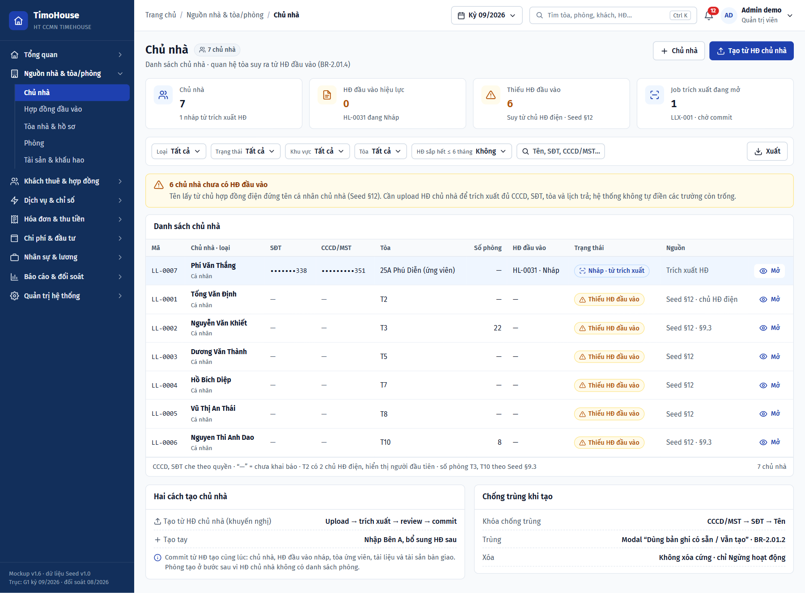
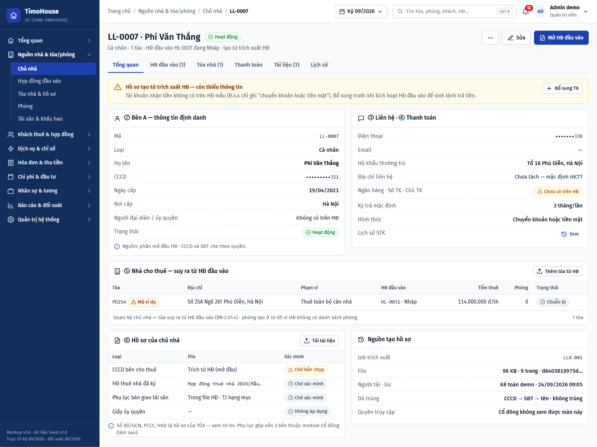
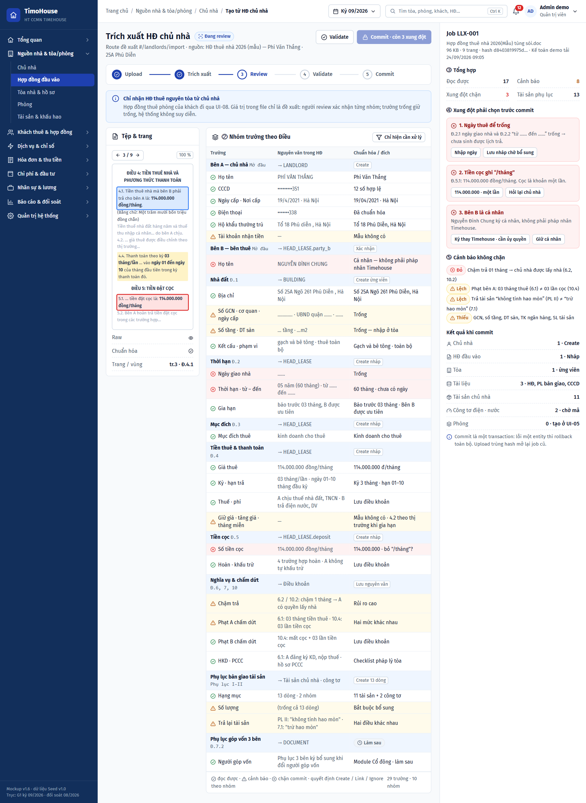
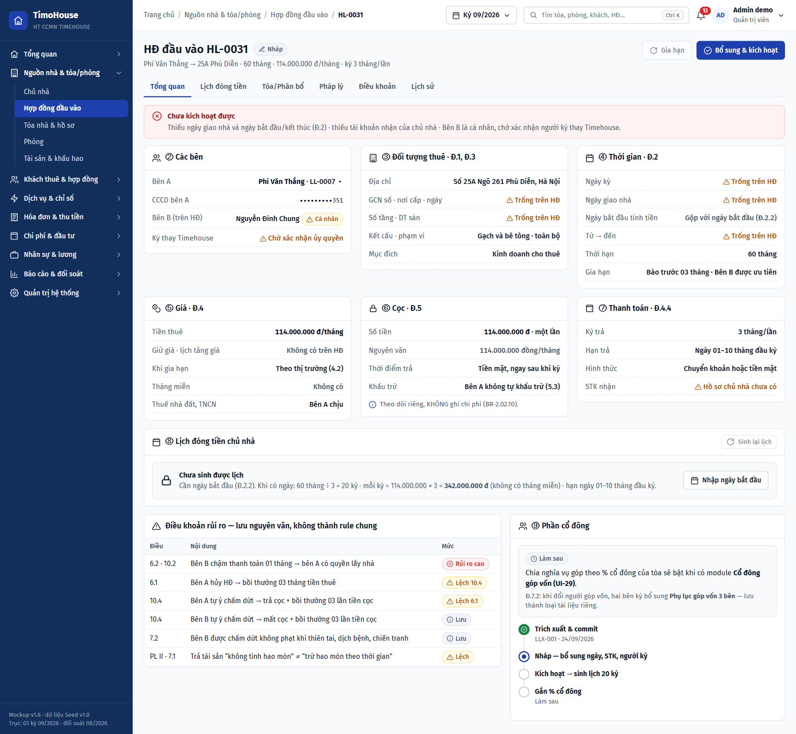
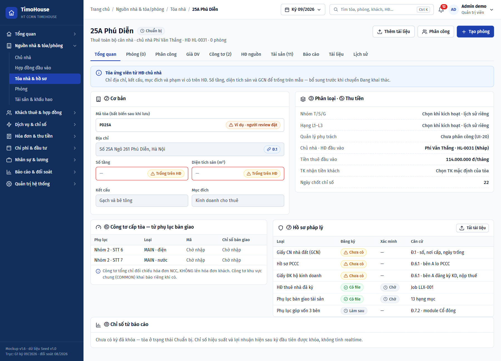
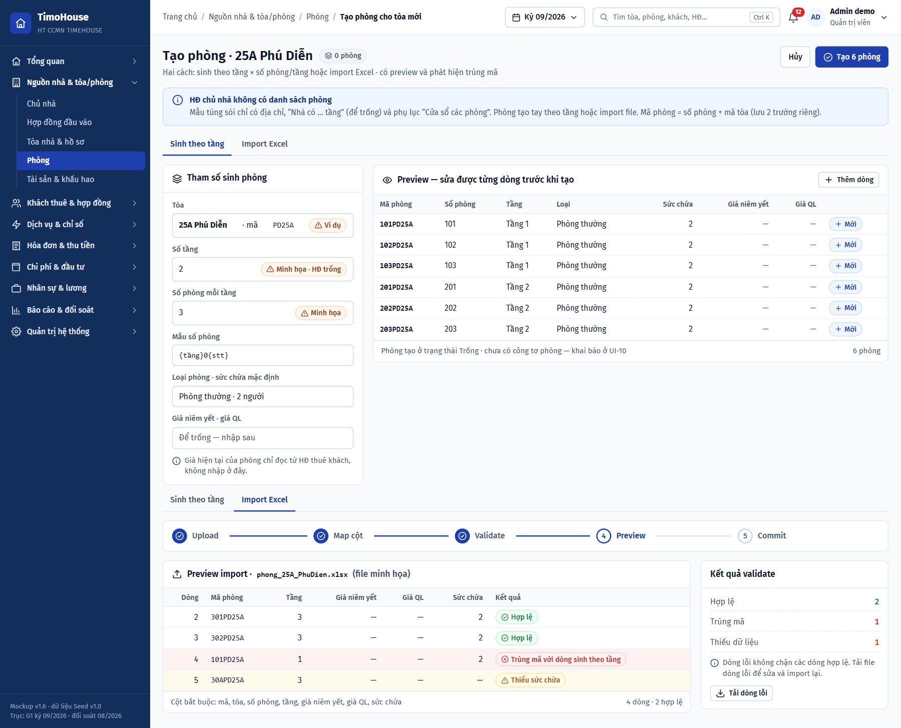

# TIMOHOUSE — SOFTWARE REQUIREMENT SPECIFICATION (SRS)

**Phiên bản:** 1.0 · **Ngày lập:** 25/09/2026 · **Trạng thái:** DRAFT, chờ khách hàng xác nhận
**Phạm vi bản này:** file này chứa phần chung (Quy ước, Common Rules) và cụm **Nguồn nhà & tòa/phòng** FR02–FR05. Các cụm khác nằm ở file riêng cùng thư mục, dùng chung Common Rules ở đây:

| File | Cụm | FR |
|---|---|---|
| [`TimoHouse_SRS_v1.0_01-truy-cap-tong-quan.md`](TimoHouse_SRS_v1.0_01-truy-cap-tong-quan.md) | Truy cập & tổng quan | FR00, FR01 |
| **File này** | Nguồn nhà & tòa/phòng | FR02–FR05 |
| [`TimoHouse_SRS_v1.0_03-khach-thue-hop-dong.md`](TimoHouse_SRS_v1.0_03-khach-thue-hop-dong.md) | Khách thuê & hợp đồng | FR06, FR07, FR08, FR15, FR16 |
| [`TimoHouse_SRS_v1.0_04-dich-vu-chi-so.md`](TimoHouse_SRS_v1.0_04-dich-vu-chi-so.md) | Dịch vụ & chỉ số | FR09, FR10 |
| [`TimoHouse_SRS_v1.0_05-hoa-don-thu-tien.md`](TimoHouse_SRS_v1.0_05-hoa-don-thu-tien.md) | Hóa đơn & thu tiền | FR11, FR12, FR13, FR14, FR17 |
| [`TimoHouse_SRS_v1.0_06-chi-phi-dau-tu.md`](TimoHouse_SRS_v1.0_06-chi-phi-dau-tu.md) | Chi phí, tài sản & cổ đông | FR24–FR29 |
| [`TimoHouse_SRS_v1.0_07-nhan-su-luong.md`](TimoHouse_SRS_v1.0_07-nhan-su-luong.md) | Nhân sự & lương | FR18–FR23 |
| [`TimoHouse_SRS_v1.0_08-bao-cao-he-thong.md`](TimoHouse_SRS_v1.0_08-bao-cao-he-thong.md) | Báo cáo, đối soát & quản trị | FR30–FR33 |

**Nguồn:** [`TimoHouse_UI_Mockup_Spec_v1.0.md`](TimoHouse_UI_Mockup_Spec_v1.0.md) bản 1.9 (§4, §6, §7, mục *Chuỗi Nguồn nhà*, UI-02…UI-05); dữ liệu mẫu ở [`TimoHouse_Mockup_Seed_Data_v1.0.md`](TimoHouse_Mockup_Seed_Data_v1.0.md) §4, §6, §17; ảnh mockup ở [`ui-imagegen-v1/02-nguon-nha-toa-phong/`](ui-imagegen-v1/02-nguon-nha-toa-phong/README.md).

> Tài liệu viết theo khung SRS Ekotek (skill `srs-generator`). Mỗi FR gồm đúng ba phần theo thứ tự: **Business Rule** → **Screen description** (một hoặc nhiều màn) → **User Steps**. Tiêu chí nghiệm thu và bảng truy vết đầy đủ vẫn nằm ở spec gốc; tài liệu này không lặp lại chúng.

---

## Quy ước đọc tài liệu

| Quy ước | Ý nghĩa |
|---|---|
| `FR##` | Số FR trùng số UI của spec gốc: UI-02 → FR02. Màn con đánh `Screen ##.N`, trạng thái khác nhau của cùng màn đánh `Screen ##.N.case` |
| `->` | Mũi tên hành động: *thao tác* -> *kết quả* |
| 🟧 | Dòng tiêu đề section (nền cam `#FCE4D6` khi xuất Word): một khối/thẻ/tab trên màn hình |
| 🟦 | Dòng quy tắc chung của bảng/danh sách (nền xanh `#DDEBF7` khi xuất Word): no-data, sắp xếp, phân trang, click dòng |
| Chữ đỏ | **Cần BA/khách hàng bổ sung hoặc xác nhận**: mã lỗi `E##`, màn chưa có capture, hành vi spec chưa mô tả |
| `BR-x.yy.z`, `D-xx`, `R-xx`, `P-xx` | Mã truy vết về `nghiep_vu/`, giữ nguyên từ spec. `ASSUMED` = giả định chưa được khách hàng xác nhận |
| Format | Giữ từ vựng chuẩn: `Text`, `Textbox`, `Dropdown`, `Datepicker`, `Checkbox`, `Button`, `Icon`, `Tab`, `Tag`, `File uploader`, `Image`, `Menu Item` |

**Platform:** web, desktop-first. Mọi capture là màn ngang có sidebar. Hành vi responsive theo spec gốc §5.3.

---

## Common Rules (dùng chung cho mọi FR)

Các FR bên dưới dẫn chiếu `Common Rule N` thay vì lặp lại. Nguồn: spec gốc §4, §5.4, §6, §7.

| Mã | Nội dung | Nguồn |
|---|---|---|
| Common Rule 1 | **Application shell**: Left Menu và Header mô tả ở bảng ngay dưới | §6, §6.1, §6.2 |
| Common Rule 2 | CCCD, SĐT, số tài khoản hiển thị dạng che theo quyền, giữ 3 số cuối (ví dụ `•••••••338`) | §UI-02, Chuỗi Nguồn nhà nguyên tắc 5 |
| Common Rule 3 | Giá trị chưa khai báo hiển thị `—`. Trường để trống trên hợp đồng thì **giữ trống, không suy diễn**, hiển thị nhãn cảnh báo `Trống trên HĐ`. Mọi giá trị người dùng tự điền đều ghi audit (người, lúc, nguồn) | Chuỗi Nguồn nhà nguyên tắc 1 |
| Common Rule 4 | Chip trạng thái luôn gồm icon + chữ; không phân biệt trạng thái chỉ bằng màu | §7.5 |
| Common Rule 5 | Mọi thao tác tạo/sửa/duyệt/đảo/hủy ghi actor, thời điểm, giá trị trước/sau và lý do | §7.5 |
| Common Rule 6 | Danh sách: bộ lọc phản ánh lên URL; click dòng mở chi tiết; action nhanh trên dòng không kích hoạt click dòng; trên 50 dòng thì phân trang; ô tìm kiếm debounce 300ms | §7.1, §5.4 |
| Common Rule 7 | Action người dùng không có quyền: hiển thị disabled kèm tooltip nêu quyền còn thiếu. Phạm vi dữ liệu áp ở server theo `BUILDING_ASSIGNMENT` | §4 |
| Common Rule 8 | Tiền hiển thị định dạng VND (dấu chấm phân cách nghìn) nhưng lưu số; phần trăm tối đa 2 chữ số thập phân | §7.3 |
| Common Rule 9 | Rời form/wizard khi có thay đổi chưa lưu -> hiển thị popup xác nhận rời trang | §7.3 |
| Common Rule 10 | Ngày hiển thị `DD/MM/YYYY`, thời điểm `DD/MM/YYYY hh:mm` | Capture mockup |
| Common Rule 11 | **Duyệt chứng từ**: Gửi duyệt -> confirm nhẹ kèm checklist lỗi còn lại; Duyệt -> popup tóm tắt thay đổi và tác động; Trả sửa -> bắt buộc lý do, chọn field/dòng liên quan nếu có; Từ chối/Hủy -> danger popup, bắt buộc lý do; Mở khóa -> danger popup, bắt buộc lý do và liệt kê snapshot bị ảnh hưởng | §7.4 |
| Common Rule 12 | **Kỳ đã khóa**: dữ liệu thuộc kỳ Locked chỉ đọc, hiển thị banner persistent kèm lý do, vẫn cho copy/xuất. Sửa sai sau khóa chỉ bằng bút toán điều chỉnh/đối ứng ở kỳ hiện tại; mở khóa kỳ chỉ Admin, bắt buộc lý do và tạo version mới. Các action bắt buộc confirm + lý do: hủy/đảo chứng từ, xóa nợ, miễn phạt, trả sửa, giá dưới sàn, mở khóa kỳ, đổi phân công, đổi % cổ phần, điều chỉnh vốn, ghi đè phân bổ | §14, §7.5 |
| Common Rule 13 | **Trạng thái màn hình**: Loading = skeleton giữ kích thước; Empty lần đầu = giải thích + CTA theo quyền; Empty do lọc = hiển thị bộ lọc đang áp + `Reset filter`; Lỗi = nguyên nhân, correlation ID, `Thử lại`; Không có quyền = nêu quyền thiếu + link quay lại; Xung đột (409) = so sánh bản người dùng với bản mới. Toast thành công tự đóng sau 4 giây. Validate format tại field, validate nghiệp vụ khi blur/submit; lỗi nêu nguyên nhân và cách sửa; form nhiều lỗi có summary ở đầu | §16.1, §16.2, §7.5 |
| Common Rule 14 | **Import file**: luồng Upload → Map cột → Validate → Preview → Commit. Preview phân loại từng dòng Hợp lệ / Cảnh báo / Lỗi / Trùng; chỉ commit dòng hợp lệ; cho tải file dòng lỗi; mỗi lần import là một job có mã, ghi nguồn và người thực hiện | §UI-05, §UI-24, §UI-33 |

**Common Rule 1 — Application shell**

| **Fields** | **Format** | **Required?** | **Description** |
|:-:|:-:|:-:|:-:|
| 🟧 Left Menu | | | • Menu chia theo cụm nghiệp vụ; mỗi cụm là một nhóm đóng/mở • Click tên cụm -> Expand / Collapse danh sách màn con của cụm • Cụm chứa màn đang mở mặc định ở trạng thái Expanded • Màn hình nhỏ (375–767px): menu chuyển thành drawer |
| Logo TimoHouse | Icon + Text | No | • Hiển thị logo và dòng phụ "HT CCMN TIMEHOUSE" • Click on -> ## (cần xác nhận: về Dashboard FR01?) |
| Tổng quan | Menu Item | No | • Default tab khi đăng nhập (Dashboard theo vai trò) • Highlight khi đang chọn • Click on -> Display Dashboard & Work Queue (refer to FR01) |
| Nguồn nhà & tòa/phòng | Menu Item | No | • Nhóm gồm 5 màn con theo thứ tự thao tác: &nbsp;&nbsp;◦ Chủ nhà: Click on -> Display Danh sách chủ nhà (Screen 02.1) &nbsp;&nbsp;◦ Hợp đồng đầu vào: Click on -> ## (spec chưa có màn danh sách HĐ đầu vào độc lập; route hiện là tab của chủ nhà `#/landlords/:id?tab=head-leases`) &nbsp;&nbsp;◦ Tòa nhà & hồ sơ: Click on -> Display Danh sách tòa nhà (Screen 04.1) &nbsp;&nbsp;◦ Phòng: Click on -> Display Danh sách phòng (Screen 05.2) &nbsp;&nbsp;◦ Tài sản & khấu hao: Click on -> Display Tài sản & khấu hao (refer to FR27) • Màn con đang mở được highlight |
| Khách thuê & hợp đồng | Menu Item | No | • Nhóm: Khách thuê → OCR hợp đồng khách → Hợp đồng thuê → Sắp hết hạn/Gia hạn/Kết thúc → Cọc/Hoàn cọc (refer to FR06, FR08, FR07, FR15, FR16) |
| Dịch vụ & chỉ số | Menu Item | No | • Nhóm: Dịch vụ/Bảng giá theo tòa → Điện nước & lịch sử công tơ (refer to FR09, FR10) |
| Hóa đơn & thu tiền | Menu Item | No | • Nhóm: Kỳ hóa đơn → Hóa đơn phòng → Thu tiền → Công nợ/Phạt → Zalo nhắc thanh toán (refer to FR11, FR12, FR13, FR14, FR17) |
| Chi phí & đầu tư | Menu Item | No | • Nhóm: Chi phí/Import → Phân bổ → Hoa hồng → Tiền thuê nhà đầu vào/Trả trước → Cổ đông/Góp vốn (refer to FR24, FR25, FR26, FR28, FR29) |
| Nhân sự & lương | Menu Item | No | • Nhóm: Cơ cấu tổ chức → Nhân sự → Phân công tòa → Hiệu suất thu tiền → Bảng lương → Chi lương (refer to FR18–FR23) |
| Báo cáo & đối soát | Menu Item | No | • Nhóm: Kỳ báo cáo/Khóa kỳ → Report A/B, CF/AC → Đối soát (refer to FR30–FR32) |
| Quản trị hệ thống | Menu Item | No | • Nhóm: Danh mục, tham số, user/quyền, import jobs, audit (refer to FR33) |
| 🟧 Header | | | |
| Breadcrumb | Text | No | • Format: `Trang chủ / [Cụm] / [Màn] / [Mã bản ghi]` (nếu có) • Bắt buộc hiển thị khi màn sâu từ 3 cấp • Cấp cuối không click được • Click on một cấp cha -> Quay lại màn tương ứng, giữ bộ lọc và vị trí cuộn trước đó |
| Kỳ | Dropdown | No | • Default selection: kỳ hiện tại (ví dụ `Kỳ 09/2026`) • Click on -> Display danh sách kỳ • Allow single selection only • Select an option -> Đồng bộ kỳ cho bộ lọc của trang đang mở • Kỳ đã khóa hiển thị biểu tượng khóa và version |
| Tìm kiếm toàn cục | Textbox | No | • Placeholder: "Tìm tòa, phòng, khách, HĐ..." • Phím tắt `Ctrl K` -> Focus vào ô tìm kiếm • Tìm theo mã tòa/phòng/khách/HĐ/hóa đơn; kết quả nhóm theo loại đối tượng • Click on một kết quả -> Go to màn chi tiết của đối tượng đó |
| Chuông việc | Icon | No | • Hiển thị số việc Work Queue trong phạm vi quyền bằng badge đỏ trên icon • Click on -> Mở Work Queue với bộ lọc đã áp (refer to FR01) |
| Tài khoản | Icon + Text | No | • Hiển thị avatar viết tắt, tên người dùng và vai trò hiện tại (ví dụ "Admin demo · Quản trị viên") • Click on -> Display dropdown gồm: &nbsp;&nbsp;◦ Vai trò hiện tại &nbsp;&nbsp;◦ Chuyển vai trò demo: chỉ có trong mockup &nbsp;&nbsp;◦ Đổi mật khẩu: Click on -> Display popup Đổi mật khẩu (Screen ##) &nbsp;&nbsp;◦ Đăng xuất: Click on -> Đăng xuất, chuyển về màn Đăng nhập (refer to FR00) |

---
---

# FR02 - Quản lý chủ nhà

## 1. Business Rule

| | |
|:-:|---|
| **Authorization** | • Admin, Kế toán: toàn quyền • TPVH, Trưởng khu vực: xem toàn bộ • NVVH: chỉ xem chủ nhà của tòa được phân công (R-33/R-34) • NV nguồn: tạo và sửa hồ sơ do mình tạo, trước khi HĐ đầu vào được kích hoạt • Cổ đông: không truy cập • Chủ nhà không có tài khoản đăng nhập trong Phase 1 |
| **Management Rule** | • Người dùng xem danh sách, xem chi tiết, tạo và cập nhật hồ sơ chủ nhà (Bên A của HĐ thuê nguyên tòa). Đây là điểm vào của chuỗi Nguồn nhà: Chủ nhà → HĐ đầu vào → Tòa → Phòng • Chức năng chỉ thực hiện được khi người dùng đã đăng nhập với vai trò thuộc Authorization ## • Có hai cách tạo chủ nhà: &nbsp;&nbsp;◦ Tạo từ HĐ chủ nhà (cách chính): đi theo job trích xuất HĐ chủ nhà (refer to FR03, Screen 03.1). Một lần commit tạo cùng lúc chủ nhà, HĐ đầu vào Nháp, tòa ứng viên, tài liệu, tài sản bàn giao và công tơ cấp tòa &nbsp;&nbsp;◦ Nhập tay (cách phụ): wizard 4 bước (Screen 02.3). Có thể tạo chủ nhà trước, bổ sung HĐ và tòa sau &nbsp;&nbsp;◦ Không dùng OCR hợp đồng khách (FR08) để tạo chủ nhà • Loại chủ nhà quyết định bộ trường bắt buộc: &nbsp;&nbsp;◦ Cá nhân: họ tên, CCCD, ngày cấp, nơi cấp &nbsp;&nbsp;◦ Tổ chức: tên pháp nhân, MST, người đại diện • SĐT là trường bắt buộc và được chuẩn hóa khi lưu • Dò trùng khi tạo theo thứ tự khóa CCCD/MST → SĐT → Tên. Trùng thì cảnh báo và cho phép tiếp tục kèm lý do qua popup `Dùng bản ghi có sẵn / Vẫn tạo` (BR-2.01.2, Đã chốt) • Đổi số tài khoản sau khi đã có kỳ thanh toán -> tạo bản ghi tài khoản mới có ngày hiệu lực; tài khoản cũ giữ trong lịch sử, không sửa đè (BR-2.01.3, Đã chốt) • Quan hệ chủ nhà ↔ tòa **suy ra từ HĐ đầu vào**, không có trường nhập tay (BR-2.01.4, Cần chốt) • Hồ sơ của chủ nhà chỉ gồm giấy tờ của con người: CCCD, giấy ủy quyền, HĐ đã ký, phụ lục bàn giao. GCN nhà đất, PCCC, HKD là hồ sơ của tòa và chỉ hiển thị dạng liên kết sang FR04 (BR-2.01.5, Cần chốt) • Không xóa cứng chủ nhà đã có HĐ hoặc tòa; chỉ cho `Ngừng hoạt động` (BR-2.01.1, Đã chốt) • Chặn `Ngừng hoạt động` khi chủ nhà còn HĐ đầu vào hiệu lực (BR-2.01.6, Cần chốt) • Trạng thái chủ nhà: &nbsp;&nbsp;◦ Hoạt động: được sửa, bổ sung tài khoản, tải tài liệu, thêm tòa từ HĐ, xuất &nbsp;&nbsp;◦ Ngừng hoạt động: chỉ xem; Admin mở lại được, bắt buộc lý do • Nhãn hiển thị trên danh sách (suy ra, không lưu): &nbsp;&nbsp;◦ Nháp · từ trích xuất: chủ nhà tạo từ job trích xuất, HĐ đầu vào đang ở trạng thái Nháp &nbsp;&nbsp;◦ Thiếu HĐ đầu vào: chủ nhà chưa có HĐ đầu vào nào • Mã chủ nhà tự sinh theo định dạng `LL-xxxx`, ví dụ `LL-0007` (cần xác nhận cách sinh phần xxxx: số tăng dần 4 chữ số?) • Dữ liệu nhạy cảm che theo Common Rule 2 • Phần cổ đông góp vốn: **làm sau**, chỉ hiển thị nhãn `Làm sau` |
| **Management Impact** | • Xem danh sách/chi tiết, tìm kiếm, lọc và xuất không làm thay đổi dữ liệu; tìm kiếm và lọc chỉ tác động tới hiển thị hiện tại • Tạo tay thành công: &nbsp;&nbsp;◦ Tạo `LANDLORD` với mã `LL-xxxx`, trạng thái `Hoạt động`, nguồn tạo = Tạo tay &nbsp;&nbsp;◦ Nếu người dùng chọn `Vẫn tạo` khi trùng: lưu lý do vào audit • Tạo từ HĐ chủ nhà: xem Creation Impact của FR03; nguồn tạo = mã job trích xuất (ví dụ `LLX-001`) • Bổ sung/đổi tài khoản nhận tiền: tạo bản ghi tài khoản mới kèm ngày hiệu lực; bản ghi cũ chuyển vào Lịch sử STK • Tải tài liệu: tạo `DOCUMENT` với trạng thái xác minh `Chờ xác minh` • Ngừng hoạt động: `Hoạt động` -> `Ngừng hoạt động`, lưu lý do • Admin mở lại: `Ngừng hoạt động` -> `Hoạt động`, lưu lý do • Mọi thao tác ghi audit theo Common Rule 5 |

## 2. Screen 02.1: Danh sách chủ nhà

<b>Screen 02.1: Danh sách chủ nhà</b>

| **Fields** | **Format** | **Required?** | **Description** |
|:-:|:-:|:-:|:-:|
| Left Menu, Header | | | • Display follows Common Rule 1 • Highlight menu `Chủ nhà` • Breadcrumb: `Trang chủ / Nguồn nhà & tòa/phòng / Chủ nhà` |
| 🟧 Quản lý chủ nhà | | | |
| Tiêu đề trang | Text | No | • Hiển thị "Chủ nhà" kèm chip `{n} chủ nhà` = tổng chủ nhà trong phạm vi quyền • Dòng phụ: "Danh sách chủ nhà · quan hệ tòa suy ra từ HĐ đầu vào (BR-2.01.4)" |
| + Chủ nhà | Button | No | • Always display • Enabled only when người dùng có quyền tạo chủ nhà (Common Rule 7) • Click on -> Go to Tạo chủ nhà nhập tay (Screen 02.3) |
| Tạo từ HĐ chủ nhà | Button | No | • Always display. Đây là CTA chính của màn • Enabled only when người dùng có quyền tạo chủ nhà • Click on -> Go to Trích xuất HĐ chủ nhà (Screen 03.1, refer to FR03) |
| 🟧 KPI | | | • Mọi số đếm theo phạm vi quyền của người dùng |
| Chủ nhà | Text | No | • Hiển thị tổng số chủ nhà • Dòng phụ: "{n} nháp từ trích xuất HĐ" |
| HĐ đầu vào hiệu lực | Text | No | • Hiển thị số HĐ đầu vào ở trạng thái `Hiệu lực` • Dòng phụ: liệt kê HĐ đang Nháp, ví dụ "HL-0031 đang Nháp" |
| Thiếu HĐ đầu vào | Text | No | • Hiển thị số chủ nhà chưa có HĐ đầu vào nào • Click on -> Lọc danh sách chỉ còn chủ nhà thiếu HĐ đầu vào |
| Job trích xuất đang mở | Text | No | • Hiển thị số job trích xuất chưa commit • Dòng phụ: mã job và trạng thái, ví dụ "LLX-001 · chờ commit" • Click on -> ## (cần xác nhận: mở Screen 03.1 của job đó?) |
| 🟧 Filter section | | | • Bộ lọc luôn hiển thị, không có icon đóng/mở • Tiêu chí được áp ngay khi chọn và phản ánh lên URL (Common Rule 6) • Spec liệt kê thêm bộ lọc "Nhóm T/S/G (qua tòa)" và "Có HĐ hiệu lực" nhưng capture chưa có — cần xác nhận |
| Loại | Dropdown | No | • Default selection: Tất cả • Click on -> Display the list of options: Tất cả, Cá nhân, Tổ chức • Allow single selection only. Selecting an option automatically deselects the previous selection • Select an option -> Search for all records with Loại = selected option |
| Trạng thái | Dropdown | No | • Default selection: Tất cả • Click on -> Display the list of options: Tất cả, Hoạt động, Ngừng hoạt động (cần xác nhận có lọc theo nhãn "Nháp · từ trích xuất" và "Thiếu HĐ đầu vào" không) • Allow single selection only • Select an option -> Search for all records with Trạng thái = selected option |
| Khu vực | Dropdown | No | • Default selection: Tất cả • Click on -> Display the list of options: Tất cả + danh mục khu vực • Allow single selection only • Select an option -> Search for all records có tòa thuộc khu vực đã chọn |
| Tòa | Dropdown | No | • Default selection: Tất cả • Click on -> Display the list of options: Tất cả + các tòa trong phạm vi quyền • Allow single selection only • Select an option -> Search for all records có HĐ đầu vào gắn với tòa đã chọn |
| HĐ sắp hết ≤ 6 tháng | Dropdown | No | • Default selection: Không • Click on -> Display the list of options: Không, Có • Có: HĐ đầu vào còn ≤ 6 tháng tới ngày kết thúc. Ngưỡng 6 tháng là tham số chờ chốt (P-23) • Select an option -> Search for all records có HĐ đầu vào thỏa điều kiện |
| Search box | Textbox | No | • Placeholder: "Tên, SĐT, CCCD/MST..." • Max length: 255 characters • Allow entering all types of characters • Cut off the spaces before and after the keyword before performing search • Nhập từ khóa -> sau 300ms (Common Rule 6) Search for all records which satisfy at least one of the following criteria: &nbsp;&nbsp;◦ Tên chủ nhà contains keyword (Relative search) &nbsp;&nbsp;◦ SĐT = keyword (Absolute search) &nbsp;&nbsp;◦ CCCD/MST = keyword (Absolute search) |
| Xuất | Button | No | • Always display • Always enabled • Click on -> Xuất toàn bộ kết quả đang lọc ra file ## (định dạng CSV/XLSX?) |
| 🟧 Băng cảnh báo | | | |
| Cảnh báo thiếu HĐ đầu vào | Text | No | • Display only when có ít nhất 1 chủ nhà thiếu HĐ đầu vào hoặc 1 job trích xuất chưa commit • Content format: "{n} chủ nhà chưa có HĐ đầu vào" + "Cần upload HĐ chủ nhà để trích xuất đủ CCCD, SĐT, tòa và lịch trả; hệ thống không tự điền các trường còn trống." |
| 🟦 Danh sách chủ nhà | | | • Display the list of chủ nhà trong phạm vi quyền • Giá trị trống hiển thị `—` (Common Rule 3) • If there are no chủ nhà in the system, display error message E## • If no record matches the search and filter criteria, display error message E## • Default sorting: ## (capture đặt bản ghi mới tạo từ trích xuất lên đầu — cần xác nhận khóa sắp xếp và cột sortable) • Phân trang theo Common Rule 6 • Click on một dòng -> Go to Chi tiết chủ nhà (Screen 02.2) • Footer: "CCCD, SĐT che theo quyền · "—" = chưa khai báo" và tổng `{n} chủ nhà` • Spec liệt kê thêm cột "Kỳ trả gần nhất" và "Cập nhật" nhưng capture chưa có — cần xác nhận |
| Mã | Text | No | • Mã chủ nhà `LL-xxxx` |
| Chủ nhà · loại | Text | No | • Dòng 1: họ tên hoặc tên pháp nhân • Dòng 2: loại Cá nhân/Tổ chức |
| SĐT | Text | No | • Số điện thoại chủ nhà, che theo Common Rule 2 |
| CCCD/MST | Text | No | • CCCD (cá nhân) hoặc MST (tổ chức), che theo Common Rule 2 |
| Tòa | Text | No | • Tòa suy ra từ HĐ đầu vào của chủ nhà • Tòa chưa kích hoạt khai thác hiển thị kèm "(ứng viên)", ví dụ "25A Phú Diễn (ứng viên)" • Nhiều tòa: ## (cần xác nhận cách hiển thị) |
| Số phòng | Number | No | • Tổng số phòng của các tòa thuộc chủ nhà; chưa có phòng hiển thị `—` |
| HĐ đầu vào | Text | No | • Mã HĐ đầu vào kèm trạng thái, ví dụ "HL-0031 · Nháp" |
| Trạng thái | Tag | No | • Hiển thị một trong các nhãn (Common Rule 4): &nbsp;&nbsp;◦ Nháp · từ trích xuất: chủ nhà tạo từ job trích xuất, HĐ đầu vào đang Nháp &nbsp;&nbsp;◦ Thiếu HĐ đầu vào: chưa có HĐ đầu vào nào &nbsp;&nbsp;◦ Hoạt động &nbsp;&nbsp;◦ Ngừng hoạt động |
| Nguồn | Text | No | • Nguồn tạo hồ sơ: Trích xuất HĐ, Tạo tay hoặc lô import |
| Mở | Icon + Text | No | • Click on -> Go to Chi tiết chủ nhà (Screen 02.2) |
| Page number | Text | No | • Click on a page number -> Go to the corresponding page |
| 🟧 Hai cách tạo chủ nhà | | | • Khối hướng dẫn tĩnh bên dưới danh sách |
| Nội dung hướng dẫn | Text | No | • "Tạo từ HĐ chủ nhà (khuyến nghị): Upload → trích xuất → review → commit" • "Tạo tay: Nhập Bên A, bổ sung HĐ sau" • Ghi chú: "Commit từ HĐ tạo cùng lúc: chủ nhà, HĐ đầu vào nháp, tòa ứng viên, tài liệu và tài sản bàn giao. Phòng tạo ở bước sau vì HĐ chủ nhà không có danh sách phòng." |
| 🟧 Chống trùng khi tạo | | | • Khối hướng dẫn tĩnh |
| Nội dung hướng dẫn | Text | No | • Khóa chống trùng: CCCD/MST → SĐT → Tên • Trùng: Modal "Dùng bản ghi có sẵn / Vẫn tạo" (BR-2.01.2) • Xóa: Không xóa cứng, chỉ Ngừng hoạt động |

## 3. Screen 02.2: Chi tiết chủ nhà

<b>Screen 02.2: Chi tiết chủ nhà</b>

| **Fields** | **Format** | **Required?** | **Description** |
|:-:|:-:|:-:|:-:|
| Left Menu, Header | | | • Display follows Common Rule 1 • Breadcrumb: `Trang chủ / Nguồn nhà & tòa/phòng / Chủ nhà / {Mã chủ nhà}` |
| Tiêu đề | Text | No | • Hiển thị "{Mã} · {Họ tên}" và Tag trạng thái chủ nhà (Hoạt động / Ngừng hoạt động) • Dòng phụ: "{Loại} · {n} tòa · HĐ đầu vào {mã HĐ} đang {trạng thái} · {nguồn tạo}" |
| ⋯ | Button | No | • Always display • Always enabled • Click on -> Display a dropdown for actions: &nbsp;&nbsp;◦ Ngừng hoạt động: Display only when trạng thái = Hoạt động. Disabled kèm tooltip lý do khi còn HĐ đầu vào hiệu lực (BR-2.01.6). Click on -> Display Ngừng hoạt động confirmation popup (Screen 02.5) &nbsp;&nbsp;◦ Mở lại: Display only when trạng thái = Ngừng hoạt động và người dùng là Admin. Click on -> Display popup nhập lý do mở lại (Screen ##) &nbsp;&nbsp;◦ Các action khác trong menu: ## (cần capture dropdown) |
| Sửa | Button | No | • Display only when trạng thái = Hoạt động • Enabled only when người dùng có quyền sửa (Common Rule 7) • Click on -> Go to Sửa chủ nhà screen (Screen ##) |
| Mở HĐ đầu vào | Button | No | • Display only when chủ nhà có ít nhất 1 HĐ đầu vào. Đây là CTA chính • Always enabled • Click on -> Go to Chi tiết HĐ đầu vào (Screen 03.2, refer to FR03) • Chủ nhà có nhiều HĐ: ## (mở HĐ nào?) |
| Tổng quan | Tab | No | • Default tab • Highlight the tab while being selected • Click on -> Go to Tổng quan |
| HĐ đầu vào (n) | Tab | No | • Hiển thị số HĐ trong ngoặc. Dữ liệu suy ra từ FR03, không nhập tay tại đây • Highlight the tab while being selected • Click on -> Go to HĐ đầu vào • Cần capture nội dung tab |
| Tòa nhà (n) | Tab | No | • Dữ liệu suy ra từ HĐ đầu vào, không nhập tay • Highlight the tab while being selected • Click on -> Go to Tòa nhà • Cần capture nội dung tab |
| Thanh toán | Tab | No | • Highlight the tab while being selected • Click on -> Go to Thanh toán • Cần capture nội dung tab |
| Tài liệu (n) | Tab | No | • Highlight the tab while being selected • Click on -> Go to Tài liệu • Cần capture nội dung tab |
| Lịch sử | Tab | No | • Highlight the tab while being selected • Click on -> Go to Lịch sử (audit theo Common Rule 5) • Cần capture nội dung tab |
| 🟧 Tab Tổng quan | | | |
| Băng thiếu thông tin | Text | No | • Display only when hồ sơ còn thiếu thông tin cần cho việc kích hoạt HĐ đầu vào, ví dụ thiếu tài khoản nhận tiền • Content format: "Hồ sơ tạo từ trích xuất HĐ — còn thiếu thông tin" + lý do cụ thể, ví dụ "Tài khoản nhận tiền không có trên HĐ mẫu (Đ.4.4 chỉ ghi "chuyển khoản hoặc tiền mặt"). Bổ sung trước khi kích hoạt HĐ đầu vào để sinh lệnh trả tiền." |
| Bổ sung TK | Button | No | • Display only when chủ nhà chưa có tài khoản nhận tiền • Enabled only when người dùng có quyền sửa • Click on -> Display popup Bổ sung tài khoản (Screen ##) |
| 🟧 ② Bên A — thông tin định danh | | | • Loại = Tổ chức: thay CCCD/Ngày cấp/Nơi cấp bằng MST, tên pháp nhân, người đại diện |
| Mã | Text | No | • Display mã chủ nhà |
| Loại | Text | No | • Display loại chủ nhà: Cá nhân / Tổ chức |
| Họ tên | Text | No | • Display họ tên chủ nhà |
| CCCD | Text | No | • Display số CCCD, che theo Common Rule 2 |
| Ngày cấp | Text | No | • Display ngày cấp CCCD. Format: DD/MM/YYYY |
| Nơi cấp | Text | No | • Display nơi cấp CCCD |
| Người đại diện / ủy quyền | Text | No | • Display người đại diện hoặc người được ủy quyền • Không có trên HĐ: hiển thị "Không có trên HĐ" |
| Trạng thái | Tag | No | • Display trạng thái chủ nhà (Common Rule 4) |
| Ghi chú nguồn | Text | No | • Content format: "Nguồn: phần mở đầu HĐ · CCCD và SĐT che theo quyền" |
| 🟧 ③ Liên hệ · ④ Thanh toán | | | |
| Điện thoại | Text | No | • Display SĐT, che theo Common Rule 2 |
| Email | Text | No | • Display email; trống hiển thị `—` |
| Hộ khẩu thường trú | Text | No | • Display địa chỉ HKTT (tổ chức: địa chỉ trụ sở) |
| Địa chỉ liên hệ | Text | No | • Display địa chỉ liên hệ • Chưa khai báo riêng: hiển thị "Chưa tách — mặc định HKTT" |
| Ngân hàng · Số TK · Chủ TK | Text | No | • Display tài khoản nhận tiền đang hiệu lực, số TK che theo Common Rule 2 • Chưa có: hiển thị Tag cảnh báo "Chưa có trên HĐ" |
| Kỳ trả mặc định | Text | No | • Display chu kỳ trả tiền thuê mặc định, ví dụ "3 tháng/lần" |
| Hình thức | Text | No | • Display hình thức thanh toán, ví dụ "Chuyển khoản hoặc tiền mặt" |
| Lịch sử STK | Button | No | • Always display • Always enabled • Click on -> Display popup Lịch sử tài khoản (Screen ##) |
| 🟧 ⑤ Nhà cho thuê — suy ra từ HĐ đầu vào | | | |
| Thêm tòa từ HĐ | Button | No | • Display only when trạng thái = Hoạt động • Enabled only when người dùng có quyền tạo • Click on -> Go to Trích xuất HĐ chủ nhà (Screen 03.1, refer to FR03). Không gán tòa trực tiếp tại đây |
| 🟦 Bảng nhà cho thuê | | | • Display the list of tòa gắn với chủ nhà qua HĐ đầu vào • Footer: "Quan hệ chủ nhà ↔ tòa suy ra từ HĐ đầu vào (BR-2.01.4) · phòng tạo ở UI-05 vì HĐ không có danh sách phòng" và tổng `{n} tòa` • Chưa có tòa: E## • Click on một dòng -> ## (cần xác nhận: mở Chi tiết tòa Screen 04.2?) |
| Tòa | Text | No | • Mã tòa • Mã chưa được lưu chính thức: hiển thị kèm Tag cảnh báo "Mã ví dụ" |
| Địa chỉ | Text | No | • Địa chỉ nhà đất theo HĐ |
| Phạm vi | Text | No | • Phạm vi thuê, ví dụ "Thuê toàn bộ căn nhà" |
| HĐ đầu vào | Text | No | • Mã HĐ kèm trạng thái |
| Tiền thuê | Number | No | • Tiền thuê/tháng theo HĐ, định dạng Common Rule 8, hậu tố "đ/th" |
| Phòng | Number | No | • Số phòng đã tạo của tòa |
| Trạng thái | Tag | No | • Trạng thái tòa: Chuẩn bị / Đang khai thác / Ngừng khai thác |
| 🟧 ⑥ Hồ sơ của chủ nhà | | | |
| Tải tài liệu | Button | No | • Display only when trạng thái = Hoạt động • Enabled only when người dùng có quyền tải tài liệu • Click on -> Display popup Tải tài liệu (Screen 04.3, refer to FR04), danh sách loại tài liệu giới hạn ở nhóm của chủ nhà |
| 🟦 Bảng hồ sơ | | | • Hiển thị cố định 4 loại hồ sơ của chủ nhà, mỗi loại một dòng |
| Loại | Text | No | • Một trong: CCCD bên cho thuê, HĐ thuê nhà đã ký, Phụ lục bàn giao tài sản, Giấy ủy quyền |
| File | Text | No | • Tên file hoặc nguồn, ví dụ "Trích từ HĐ (mở đầu)", "Trong file HĐ · 13 hạng mục" • Chưa có: `—` |
| Xác minh | Tag | No | • Trạng thái xác minh: &nbsp;&nbsp;◦ Chờ bản chụp: dữ liệu trích từ HĐ, chưa có ảnh chụp giấy tờ &nbsp;&nbsp;◦ Chờ xác minh: đã có file, chờ người có quyền duyệt &nbsp;&nbsp;◦ Đã xác minh &nbsp;&nbsp;◦ Không áp dụng |
| Ghi chú hồ sơ | Text | No | • Content format: "Sổ đỏ/GCN, PCCC, HKD là hồ sơ của TÒA — xem UI-04. Phụ lục góp vốn 3 bên thuộc module Cổ đông (làm sau)." |
| 🟧 Nguồn tạo hồ sơ | | | • Display only when chủ nhà tạo từ job trích xuất |
| Job trích xuất | Text | No | • Mã job, ví dụ `LLX-001` |
| File | Text | No | • Dung lượng · số trang · hash rút gọn, ví dụ "96 KB · 9 trang · d8403819975d..." |
| Người tải · lúc | Text | No | • Người tải file và thời điểm. Format: DD/MM/YYYY hh:mm |
| Dò trùng | Text | No | • Thứ tự khóa dò trùng và kết quả, ví dụ "CCCD → SĐT → tên · không trùng" |
| Quyền truy cập | Text | No | • Content format: "Cổ đông không xem được màn này" |

## 4. Screen 02.3: Tạo chủ nhà nhập tay

Chưa có capture — cần bổ sung ảnh cho 4 bước wizard. Nội dung dưới đây dựng từ spec, chỉ mô tả bước 1.

<b>Screen 02.3: Tạo chủ nhà nhập tay</b>

| **Fields** | **Format** | **Required?** | **Description** |
|:-:|:-:|:-:|:-:|
| Left Menu, Header | | | • Display follows Common Rule 1 |
| Back | Button | No | • Always appear • Always enabled • Click on -> check if there are any changes made to input &nbsp;&nbsp;◦ If there are not -> go back to the previous screen &nbsp;&nbsp;◦ If there are -> display a confirmation popup (Common Rule 9) (Provide screen capture ##) (Screen ##) |
| Progress Bar | Image | No | • Display the current progress in the creation process: (1) Bên A và người đại diện → (2) Nhà đất/tòa, GCN và tài sản bàn giao → (3) HĐ đầu vào: Bên B, thời hạn, giá, cọc, kỳ trả → (4) Đính kèm file và xem trước liên kết Chủ nhà → HĐ → Tòa → Phòng • All current and completed steps are highlighted • Wizard luôn có `Lưu nháp`, `Quay lại`, `Tiếp tục`, `Hủy`; nháp tự lưu theo từng bước (spec §7.3) |
| 🟧 Step 1: Bên A và người đại diện | | | |
| Loại | Dropdown | Yes | • Always display • Default selection: Cá nhân • Click on -> Display the list of following options: Cá nhân, Tổ chức • Allow single selection only • Select an option -> Đổi bộ trường bắt buộc: Cá nhân dùng CCCD/ngày cấp/nơi cấp; Tổ chức dùng MST/tên pháp nhân/người đại diện |
| Họ tên / Tên pháp nhân | Textbox | Yes | • Always display • Placeholder: ## • Allow entering all types of characters • Max length: 255 • If clicking out of the field while it is blank -> Show error message E## |
| CCCD / MST | Textbox | Yes | • Always display; nhãn đổi theo Loại • Allow entering numeric values • Max length: ## (CCCD 12 số; MST 10 hoặc 13 số — cần xác nhận) • If clicking out of the field while it is blank -> Show error message E## • Rời field -> dò trùng theo CCCD/MST; trùng -> Display popup Chủ nhà có thể bị trùng (Screen 02.4) |
| Ngày cấp | Datepicker | Yes | • Display only when Loại = Cá nhân • Default selection: None • Disable future dates • If clicking out of the field while it is blank -> Show error message E## |
| Nơi cấp | Textbox | Yes | • Display only when Loại = Cá nhân • Allow entering all types of characters. Max length: 255 • If clicking out of the field while it is blank -> Show error message E## |
| Người đại diện / ủy quyền | Textbox | No | • Always display; bắt buộc khi Loại = Tổ chức • Allow entering all types of characters. Max length: 255 |
| SĐT | Textbox | Yes | • Always display • Allow entering numeric values. Max length: ## • Chuẩn hóa khi lưu • If clicking out of the field while it is blank -> Show error message E## • Rời field -> dò trùng theo SĐT; trùng -> Display popup Chủ nhà có thể bị trùng (Screen 02.4) |
| Email | Textbox | No | • Always display. Max length: 255 • Sai định dạng -> Show error message E## |
| Địa chỉ thường trú / trụ sở | Textbox | No | • Always display. Max length: 255 |
| Địa chỉ liên hệ | Textbox | No | • Always display. Max length: 255. Để trống thì mặc định bằng địa chỉ thường trú |
| Ngân hàng · Số TK · Chủ TK · Hiệu lực từ | Textbox | No | • Always display • Không bắt buộc khi tạo, nhưng bắt buộc trước khi kích hoạt HĐ đầu vào (FR03) |
| Kỳ trả mặc định | Dropdown | No | • Click on -> Display the list of following options: 3 tháng/lần, 4 tháng/lần, 6 tháng/lần (cần xác nhận danh sách) |
| 🟧 Step 2–4 | | | • Cần capture và mô tả riêng từng bước (mỗi bước là một screen theo chuẩn input form) |
| Lưu nháp | Button | No | • Always appear • Always enabled • Click on -> Lưu dữ liệu đã nhập ở trạng thái nháp |
| Tiếp tục | Button | No | • Only appear when the current step is not the last step • Always enabled • Click on -> Validate các field của bước hiện tại; hợp lệ -> Go to the next step |
| Hủy | Button | No | • Always appear • Always enabled • Click on -> Giống nút Back |

## 5. Screen 02.4: Popup chủ nhà có thể bị trùng

Chưa có capture — cần bổ sung.

<b>Screen 02.4: Popup chủ nhà có thể bị trùng</b>

| **Fields** | **Format** | **Required?** | **Description** |
|:-:|:-:|:-:|:-:|
| 🟧 The popup can be closed by the X icon or by clicking out of the popup. Closing the popup redirects the user to the underlying screen without any changes saved. (cần xác nhận popup có X icon) | | | |
| Message | Text | No | • Content format: "##" (cần nội dung chính xác) • Nêu khóa bị trùng (CCCD/MST, SĐT hoặc Tên) |
| Bản ghi trùng | Text | No | • Hiển thị mã, tên, SĐT/CCCD (che) của chủ nhà đang có trong hệ thống |
| Lý do | Textbox | Yes | • Display only when người dùng chọn `Vẫn tạo` • Allow entering all types of characters. Max length: 255 • If clicking out of the field while it is blank -> Show error message E## |
| Dùng bản ghi có sẵn | Button | No | • Always appear • Always enabled • Click on -> Đóng popup, liên kết dữ liệu đang nhập với chủ nhà có sẵn, không tạo bản ghi mới |
| Vẫn tạo | Button | No | • Always appear • Enabled only when đã nhập Lý do • Click on -> Đóng popup, tiếp tục tạo chủ nhà mới; lưu lý do vào audit (BR-2.01.2) |

## 6. Screen 02.5: Popup xác nhận ngừng hoạt động

Chưa có capture — cần bổ sung.

<b>Screen 02.5: Popup xác nhận ngừng hoạt động</b>

| **Fields** | **Format** | **Required?** | **Description** |
|:-:|:-:|:-:|:-:|
| 🟧 The popup can be closed by the X icon or by clicking out of the popup. Closing the popup redirects the user to the underlying screen without any changes saved. | | | |
| Message | Text | No | • Danger modal (spec §7.4) • Content format: "##" (cần nội dung chính xác) |
| Lý do | Textbox | Yes | • Always display • Allow entering all types of characters. Max length: 255 • If clicking out of the field while it is blank -> Show error message E## |
| Hủy | Button | No | • Always appear • Always enabled • Click on -> Đóng popup, không thay đổi dữ liệu |
| Ngừng hoạt động | Button | No | • Always appear • Enabled only when đã nhập Lý do • Click on -> Chuyển chủ nhà sang `Ngừng hoạt động`, lưu lý do, đóng popup và cập nhật Screen 02.2 |

## 7. User Steps

| | |
|:-:|---|
| **Pre-condition** | Người dùng đã đăng nhập với vai trò thuộc Authorization của FR02 |
| **User steps** | **Step 1:** Click menu `Chủ nhà` -> display Danh sách chủ nhà (Screen 02.1) **Step 2:** Click `Mở` trên một dòng -> display Chi tiết chủ nhà (Screen 02.2) **Step 3:** Tại Screen 02.2, click `⋯` → `Ngừng hoạt động` -> display Popup xác nhận ngừng hoạt động (Screen 02.5) |

| | |
|:-:|---|
| **Pre-condition** | Người dùng đã đăng nhập với quyền tạo chủ nhà, không có file HĐ chủ nhà |
| **User steps** | **Step 1:** Tại Screen 02.1, click `+ Chủ nhà` -> display Tạo chủ nhà nhập tay (Screen 02.3) **Step 2:** Nhập CCCD/SĐT trùng với chủ nhà có sẵn rồi rời field -> display Popup chủ nhà có thể bị trùng (Screen 02.4) **Step 3:** Click `Vẫn tạo` hoặc `Dùng bản ghi có sẵn` -> quay lại Screen 02.3 để hoàn tất các bước còn lại (màn đích sau bước 4: ##) |

Tạo chủ nhà từ file HĐ: xem User Steps của FR03.

---
---

# FR03 - Hợp đồng đầu vào

## 1. Business Rule

| | |
|:-:|---|
| **Authorization** | • Admin, Kế toán: trích xuất, commit, bổ sung và kích hoạt, điều chỉnh lịch đóng tiền, gia hạn, thanh lý • NV nguồn: tạo và sửa HĐ đầu vào Nháp do mình tạo • TPVH, Trưởng khu vực, NVVH: ## (spec chưa nêu quyền xem HĐ đầu vào — cần xác nhận) • Cổ đông: không truy cập |
| **Creation Rule** | • Người dùng tạo HĐ đầu vào (HĐ thuê **nguyên tòa** từ chủ nhà) bằng job trích xuất HĐ chủ nhà, bổ sung thông tin còn thiếu, rồi kích hoạt để sinh lịch đóng tiền cho chủ nhà • Chức năng chỉ thực hiện được khi người dùng đã đăng nhập với vai trò thuộc Authorization ## • Job trích xuất HĐ chủ nhà tách riêng khỏi OCR hợp đồng khách (FR08), gồm 5 bước: &nbsp;&nbsp;◦ Upload: nhận file `.doc`, `.docx`, `.pdf` hoặc ảnh; lưu hash. Upload file trùng hash -> mở lại job cũ &nbsp;&nbsp;◦ Trích xuất: đọc lớp chữ (OCR nếu là bản scan), đề xuất trường theo Điều 1–12 và Phụ lục I–II, giữ trang/vùng làm bằng chứng &nbsp;&nbsp;◦ Review: người dùng quyết định theo từng nhóm trường (Create / Link / Ignore); hệ thống dò trùng chủ nhà theo CCCD → SĐT → Tên &nbsp;&nbsp;◦ Validate: xung đột chặn phải được chọn hướng xử lý; cảnh báo không chặn được ghi nhận để bổ sung sau &nbsp;&nbsp;◦ Commit: một transaction duy nhất; lỗi một entity thì rollback toàn bộ • Hệ thống **không tự chọn** hướng xử lý cho xung đột. Nút Commit bị khóa cho tới khi mọi xung đột đã được chọn • Giá trị để trống trên HĐ giữ trống (Common Rule 3) • Trường hệ thống có nhưng mẫu HĐ không có thì để trống, người nhập tự điền và hệ thống ghi audit: Thời gian giữ giá, Lịch tăng giá, Tháng miễn tiền nhà, Phân bổ tiền thuê cho nhiều tòa, Nhóm T/S/G, Hạng L1–L3, Phí môi giới • Mâu thuẫn nội tại của mẫu HĐ chỉ hiển thị cảnh báo, không tự chọn: &nbsp;&nbsp;◦ Phạt bên A khi chấm dứt: 03 tháng tiền thuê (Đ.6.1) ≠ 03 lần tiền cọc (Đ.10.4) &nbsp;&nbsp;◦ Trả tài sản: "không tính hao mòn" (PL II) ≠ "trừ hao mòn theo thời gian" (Đ.7.1) &nbsp;&nbsp;◦ Cọc ghi "đồng/tháng" (Đ.5.1) trong khi cọc là khoản một lần • Điều khoản rủi ro lưu nguyên văn và gắn mức (Rủi ro cao / Lệch / Lưu); không biến thành rule chung của hệ thống • `Ngày giao nhà` và `Ngày bắt đầu tính tiền` là 2 trường riêng; HĐ gộp hai mốc thì ngày tính tiền = ngày bắt đầu • Điều kiện kích hoạt (Nháp -> Hiệu lực): &nbsp;&nbsp;◦ Có ngày bắt đầu và ngày kết thúc &nbsp;&nbsp;◦ Chủ nhà có tài khoản nhận tiền &nbsp;&nbsp;◦ Có người ký phía Timehouse &nbsp;&nbsp;◦ Tòa không thuộc HĐ đầu vào hiệu lực khác trùng thời gian; HĐ mới phải bắt đầu sau ngày kết thúc HĐ cũ (BR-2.02.1, Cần chốt) &nbsp;&nbsp;◦ HĐ nhiều tòa: phân bổ tiền thuê về từng tòa đủ 100 %, có ngày hiệu lực; mặc định phân bổ theo số phòng (BR-2.02.2 → P-15, Cần chốt) • Trạng thái HĐ: &nbsp;&nbsp;◦ Nháp: vừa commit hoặc đang bổ sung; được sửa và bổ sung trường trống &nbsp;&nbsp;◦ Hiệu lực: đã kích hoạt; ghi nhận trả, điều chỉnh lịch có lý do, gia hạn, thanh lý sớm &nbsp;&nbsp;◦ Sắp hết: còn ≤ 6 tháng tới ngày kết thúc (P-23); hành vi như Hiệu lực kèm cảnh báo &nbsp;&nbsp;◦ Kết thúc: chỉ xem. Nhánh Hiệu lực/Sắp hết → Thanh lý sớm → Kết thúc • Trạng thái kỳ trả: Chưa đến hạn → Sắp đến hạn (≤ 15 ngày) → Đã trả / Trả một phần / Quá hạn • Lịch đóng tiền (`HEAD_LEASE_PAYMENT_SCHEDULE`): &nbsp;&nbsp;◦ Số kỳ = thời hạn (tháng) ÷ kỳ trả (3/4/6 tháng), tính từ ngày bắt đầu &nbsp;&nbsp;◦ Ngày đến hạn = ngày cuối của khoảng đến hạn trong tháng đầu kỳ (mẫu: ngày 10) &nbsp;&nbsp;◦ Số tiền kỳ = tiền thuê/tháng × số tháng trong kỳ − tháng miễn nằm trong kỳ &nbsp;&nbsp;◦ Ví dụ mẫu tùng sói: 114.000.000 đ/tháng, 60 tháng, 3 tháng/lần → 20 kỳ × 342.000.000 đ, hạn ngày 10. Có miễn 1 tháng đầu → kỳ 1 = 228.000.000 đ &nbsp;&nbsp;◦ Kế toán sửa từng kỳ phải có lý do; **không sửa kỳ đã trả** (BR-2.02.3) • Lịch tăng giá có ngày hiệu lực; các kỳ chưa trả sau ngày đó tự tính lại (BR-2.02.13) • Tháng miễn: màn này chỉ lưu dữ liệu; CF ghi 0, AC thẳng hàng do FR28 tính (BR-2.02.4, R-27) • Cọc chủ nhà theo dõi riêng, **không ghi chi phí** (BR-2.02.10, D-43) • Nhắc hạn trả chủ nhà trước 15/7/1 ngày cho Kế toán và Admin, cho phép override từng HĐ (**ASSUMED**); quá hạn cảnh báo đỏ trên FR01 (BR-2.02.5 → P-23) • Gia hạn = tạo HĐ mới liên kết HĐ trước; không sửa ngày kết thúc HĐ cũ (BR-2.02.12) • Nhóm T/S/G do HĐ đề xuất → người dùng xác nhận → ghi `BUILDING_TYPE_HISTORY` có ngày hiệu lực (BR-2.02.7, D-02) • Phần đóng của cổ đông = số tiền kỳ × % cổ phần hiệu lực tại ngày đến hạn (BR-2.02.6, R-31). **Làm sau**, chỉ hiển thị khi có module Cổ đông (FR29) |
| **Creation Impact** | • COMMIT job trích xuất (một transaction), với mẫu tùng sói: &nbsp;&nbsp;◦ Chủ nhà: tạo mới trạng thái `Hoạt động`, hoặc liên kết bản ghi có sẵn nếu chọn `Dùng bản ghi có sẵn` &nbsp;&nbsp;◦ HĐ đầu vào: tạo `HEAD_LEASE` trạng thái `Nháp`, mã `HL-xxxx` (cần xác nhận cách sinh mã) &nbsp;&nbsp;◦ Tòa: tạo `BUILDING` trạng thái `Chuẩn bị` (ứng viên từ HĐ) &nbsp;&nbsp;◦ Tài liệu: HĐ đã ký, phụ lục bàn giao, CCCD với trạng thái `Chờ xác minh` &nbsp;&nbsp;◦ Tài sản bàn giao của chủ nhà (`ownership = Chủ nhà`) trạng thái `Chờ xác nhận` (FR27) &nbsp;&nbsp;◦ Công tơ cấp tòa MAIN điện và nước, chờ nhập mã (FR04) &nbsp;&nbsp;◦ Phòng: **0**. HĐ chủ nhà không sinh phòng; phòng tạo ở FR05 &nbsp;&nbsp;◦ Job: ## (cần danh sách trạng thái job: Đang review, Chờ commit, Đã commit...) • KÍCH HOẠT thành công: &nbsp;&nbsp;◦ HĐ `Nháp` -> `Hiệu lực` &nbsp;&nbsp;◦ Sinh lịch đóng tiền; mọi kỳ ở trạng thái `Chưa đến hạn` • Điều chỉnh kỳ: lưu giá trị mới, lý do và audit • Gia hạn: tạo HĐ mới liên kết HĐ trước; HĐ cũ giữ nguyên ngày kết thúc • Thanh lý sớm: HĐ -> `Kết thúc`; tòa -> `Ngừng khai thác`, mọi phòng phải hết HĐ thuê; khấu hao còn lại xử lý ở FR27 (BR-2.02.11, R-28) |

## 2. Screen 03.1: Trích xuất HĐ chủ nhà

<b>Screen 03.1: Trích xuất HĐ chủ nhà (bước Review)</b>

| **Fields** | **Format** | **Required?** | **Description** |
|:-:|:-:|:-:|:-:|
| Left Menu, Header | | | • Display follows Common Rule 1 • Highlight menu `Hợp đồng đầu vào` • Breadcrumb: `Trang chủ / Nguồn nhà & tòa/phòng / Chủ nhà / Tạo từ HĐ chủ nhà` |
| Tiêu đề | Text | No | • Hiển thị "Trích xuất HĐ chủ nhà" kèm Tag trạng thái job, ví dụ "Đang review" • Dòng phụ: route và nguồn file, ví dụ "nguồn: HĐ thuê nhà 2026 (mẫu) — Phí Văn Thắng · 25A Phú Diễn" |
| Validate | Button | No | • Always display • Enabled only when ## • Click on -> Chạy kiểm tra toàn bộ nhóm trường và chuyển sang bước Validate (Screen ## — chưa có capture) |
| Commit | Button | No | • Always display • Enabled only when mọi xung đột chặn đã được chọn hướng xử lý • Khi disabled: nhãn "Commit · còn {n} xung đột", tooltip liệt kê các xung đột còn lại • Click on -> Validate in the following order: &nbsp;&nbsp;◦ If there are any fields with invalid values, display error messages as mentioned above &nbsp;&nbsp;◦ Chủ nhà trùng CCCD/SĐT chưa chọn `Dùng bản ghi có sẵn` hoặc `Vẫn tạo` kèm lý do -> Display Popup chủ nhà có thể bị trùng (Screen 02.4) &nbsp;&nbsp;◦ If all conditions above are satisfied, display confirmation popup (Screen ##) |
| Progress Bar | Image | No | • Display the current progress: Upload → Trích xuất → Review → Validate → Commit • Bước đã xong có dấu check; bước hiện tại được highlight • Chưa có capture các bước Upload, Trích xuất, Validate, Commit |
| Băng phạm vi | Text | No | • Always display • Content format: "Chỉ nhận HĐ thuê nguyên tòa từ chủ nhà" + "Hợp đồng thuê phòng của khách đi qua UI-08. Giá trị trong file chỉ là đề xuất: người review xác nhận từng nhóm; trường trống giữ trống, hệ thống không suy diễn." (refer to FR08) |
| 🟧 ① Tệp & trang | | | • Giữ file gốc và vị trí trang/vùng làm bằng chứng |
| Chuyển trang | Icon | No | • Hiển thị "{trang hiện tại} / {tổng trang}" • Click on ← / → -> Hiển thị trang trước / trang sau |
| Tỷ lệ | Text | No | • Hiển thị tỷ lệ phóng, mặc định 100 % • Click on -> ## (cần xác nhận cách đổi tỷ lệ) |
| Trang HĐ | Image | No | • Display trang của file gốc • Chọn một trường ở ② -> tô sáng vùng tương ứng trên trang: xanh = đọc được, vàng = cảnh báo, đỏ = xung đột |
| Raw | Icon | No | • Click on -> ## (hiển thị lớp chữ thô?) |
| Chuẩn hóa | Icon | No | • Click on -> ## |
| Trang / vùng | Text | No | • Display vị trí của trường đang chọn, ví dụ "tr.3 · Đ.4.1" |
| 🟧 ② Nhóm trường theo Điều | | | |
| Chỉ hiện cần xử lý | Button | No | • Always display • Always enabled • Click on -> Chỉ hiển thị trường có dấu cảnh báo △ hoặc xung đột ✕; click lần nữa -> hiển thị lại tất cả |
| 🟦 Bảng nhóm trường | | | • Trường gom theo nhóm; mỗi nhóm là một dòng tiêu đề gồm tên nhóm, Điều của HĐ, entity đích và quyết định của nhóm • Quyết định nhóm: Create / Link / Ignore; các nhãn khác trên capture (Xác nhận, Create ứng viên, Create nháp, Lưu nguyên văn, Create 13 dòng, Làm sau) là biến thể theo đích (cần xác nhận đây là Dropdown hay Tag chỉ đọc) • 10 nhóm với mẫu tùng sói: &nbsp;&nbsp;◦ Bên A — chủ nhà (Mở đầu) → `LANDLORD` &nbsp;&nbsp;◦ Bên B — bên thuê (Mở đầu) → `HEAD_LEASE.party_b` &nbsp;&nbsp;◦ Nhà đất (Đ.1) → `BUILDING` &nbsp;&nbsp;◦ Thời hạn (Đ.2) → `HEAD_LEASE` &nbsp;&nbsp;◦ Mục đích (Đ.3) → `HEAD_LEASE` &nbsp;&nbsp;◦ Tiền thuê & thanh toán (Đ.4) → `HEAD_LEASE` &nbsp;&nbsp;◦ Tiền cọc (Đ.5) → `HEAD_LEASE.deposit` &nbsp;&nbsp;◦ Nghĩa vụ & chấm dứt (Đ.6, 7, 10) → Điều khoản &nbsp;&nbsp;◦ Phụ lục bàn giao tài sản (PL I–II) → Tài sản chủ nhà và công tơ &nbsp;&nbsp;◦ Phụ lục góp vốn 3 bên (Đ.7.2) → `DOCUMENT`, **Làm sau** • Footer: chú giải ký hiệu và tổng "{n} trường · {m} nhóm" |
| Trường | Text | No | • Tên trường kèm ký hiệu kết quả: ✓ đọc được, △ cảnh báo không chặn, ✕ xung đột chặn commit • Dòng △ nền vàng, dòng ✕ nền đỏ; ký hiệu luôn đi cùng màu (Common Rule 4) |
| Nguyên văn trong HĐ | Text | No | • Giá trị đọc được từ file, giữ nguyên chính tả; dữ liệu nhạy cảm che theo Common Rule 2 • Không đọc được: `—` |
| Chuẩn hóa / đích | Text | No | • Giá trị sau chuẩn hóa hoặc ghi chú xử lý, ví dụ "12 số hợp lệ", "Trống", "Mẫu không có" • Cần xác nhận người review có sửa trực tiếp giá trị chuẩn hóa được không |
| 🟧 Thông tin job | | | |
| Job | Text | No | • Mã job, tên file, dung lượng · số trang · hash rút gọn, người tải và thời điểm (Common Rule 10) |
| 🟧 ③ Tổng hợp | | | |
| Đọc được | Text | No | • Số trường có dấu ✓ |
| Cảnh báo | Text | No | • Số trường có dấu △ |
| Xung đột chặn | Text | No | • Số trường có dấu ✕ |
| Tài sản phụ lục | Text | No | • Số dòng tài sản đọc được từ Phụ lục I–II |
| 🟧 ④ Xung đột phải chọn trước commit | | | • Mỗi xung đột là một thẻ gồm tiêu đề, mô tả căn cứ trên HĐ và các nút lựa chọn • Chọn một nút -> đánh dấu xung đột đã xử lý theo hướng đó, giảm bộ đếm trên nút Commit • Hệ thống không tự chọn |
| 1. Ngày thuê để trống | Button | No | • Display only when Đ.2.1 ngày giao nhà và Đ.2.2 "từ … đến …" để trống • Lựa chọn: &nbsp;&nbsp;◦ Nhập ngày: Click on -> ## (mở ô nhập ngày?) &nbsp;&nbsp;◦ Lưu nháp chờ bổ sung: Click on -> Commit với ngày trống; lịch đóng tiền chưa sinh cho tới khi bổ sung |
| 2. Tiền cọc ghi "/tháng" | Button | No | • Display only when Đ.5.1 ghi cọc theo đơn vị tháng • Lựa chọn: &nbsp;&nbsp;◦ 114.000.000 · một lần: Click on -> Chuẩn hóa cọc thành khoản một lần &nbsp;&nbsp;◦ Hỏi lại chủ nhà: Click on -> ## (xung đột còn chặn commit không?) |
| 3. Bên B là cá nhân | Button | No | • Display only when Bên B trên HĐ là cá nhân, không phải pháp nhân Timehouse • Lựa chọn: &nbsp;&nbsp;◦ Ký thay Timehouse · cần ủy quyền: Click on -> Ghi nhận người ký thay; điều kiện kích hoạt bổ sung giấy ủy quyền &nbsp;&nbsp;◦ Giữ cá nhân: Click on -> ## |
| 🟧 ⑤ Cảnh báo không chặn | | | |
| Danh sách cảnh báo | Tag | No | • Mỗi dòng gồm Tag mức và nội dung: &nbsp;&nbsp;◦ Đỏ: rủi ro cao, ví dụ "Chậm trả 01 tháng → chủ nhà được lấy nhà (6.2, 10.2)" &nbsp;&nbsp;◦ Lệch: hai điều khoản mâu thuẫn, ví dụ "Phạt bên A: 03 tháng thuê (6.1) ≠ 03 lần cọc (10.4)" &nbsp;&nbsp;◦ Thiếu: trường trống, ví dụ "GCN, số tầng, DT sàn, TK ngân hàng, SL tài sản" |
| 🟧 Kết quả khi commit | | | |
| Danh sách entity | Text | No | • Liệt kê entity sẽ tạo và trạng thái: Chủ nhà 1 · Create; HĐ đầu vào 1 · Nháp; Tòa 1 · ứng viên; Tài liệu 3 · HĐ, PL bàn giao, CCCD; Tài sản chủ nhà 11; Công tơ điện · nước 2 · chờ mã; Phòng 0 · tạo ở UI-05 • Ghi chú: "Commit là một transaction: lỗi một entity thì rollback toàn bộ. Upload trùng hash mở lại job cũ." |

## 3. Screen 03.2: Chi tiết HĐ đầu vào

<b>Screen 03.2.1: Chi tiết HĐ đầu vào (Nháp)</b>

Screen 03.2.2: Chi tiết HĐ đầu vào (Hiệu lực) — chưa có capture

| **Fields** | **Format** | **Required?** | **Description** |
|:-:|:-:|:-:|:-:|
| Left Menu, Header | | | • Display follows Common Rule 1 • Breadcrumb: `Trang chủ / Nguồn nhà & tòa/phòng / Hợp đồng đầu vào / {Mã HĐ}` |
| Tiêu đề | Text | No | • Hiển thị "HĐ đầu vào {Mã HĐ}" kèm Tag trạng thái (Nháp / Hiệu lực / Sắp hết / Kết thúc) • Dòng phụ: "{Chủ nhà} → {Tòa} · {thời hạn} tháng · {tiền thuê} đ/tháng · kỳ {n} tháng/lần" |
| Gia hạn | Button | No | • Always display • Enabled only when trạng thái = Hiệu lực hoặc Sắp hết • Click on -> Go to tạo HĐ đầu vào mới liên kết HĐ hiện tại (Screen ##) |
| Bổ sung & kích hoạt | Button | No | • Display only when trạng thái = Nháp. Đây là CTA chính • Enabled only when đủ điều kiện kích hoạt (Business Rule); khi disabled, tooltip liệt kê điều kiện còn thiếu • Click on -> Display Kích hoạt HĐ confirmation popup (Screen ##) |
| Ghi nhận trả, Điều chỉnh lịch, Tải chứng từ, Thanh lý sớm | Button | No | • Display only when trạng thái = Hiệu lực hoặc Sắp hết • Cần capture và đặc tả hành vi từng nút |
| Tổng quan | Tab | No | • Default tab • Highlight the tab while being selected • Click on -> Go to Tổng quan |
| Lịch đóng tiền | Tab | No | • Highlight the tab while being selected • Click on -> Go to Lịch đóng tiền • Cần capture nội dung tab |
| Tòa/Phân bổ | Tab | No | • Highlight the tab while being selected • Click on -> Go to Tòa/Phân bổ |
| Pháp lý | Tab | No | • Highlight the tab while being selected • Click on -> Go to Pháp lý • Cần capture nội dung tab |
| Điều khoản | Tab | No | • Highlight the tab while being selected • Click on -> Go to Điều khoản • Cần capture nội dung tab |
| Lịch sử | Tab | No | • Highlight the tab while being selected • Click on -> Go to Lịch sử (audit theo Common Rule 5) • Cần capture nội dung tab |
| 🟧 Tab Tổng quan | | | |
| Băng chưa kích hoạt được | Text | No | • Display only when trạng thái = Nháp và còn thiếu điều kiện kích hoạt • Content format: "Chưa kích hoạt được" + liệt kê **mọi** điều kiện còn thiếu, ví dụ "Thiếu ngày giao nhà và ngày bắt đầu/kết thúc (Đ.2) · thiếu tài khoản nhận của chủ nhà · Bên B là cá nhân, chờ xác nhận người ký thay Timehouse." |
| 🟧 ② Các bên | | | |
| Bên A | Text | No | • Display "{Họ tên} · {Mã chủ nhà}" • Click on -> Go to Chi tiết chủ nhà (Screen 02.2, refer to FR02) |
| CCCD bên A | Text | No | • Display CCCD chủ nhà, che theo Common Rule 2 |
| Bên B (trên HĐ) | Text | No | • Display bên thuê theo HĐ • Bên B là cá nhân: kèm Tag cảnh báo "Cá nhân" |
| Ký thay Timehouse | Text | No | • Display người ký phía Timehouse • Chưa có: Tag cảnh báo "Chờ xác nhận ủy quyền" |
| 🟧 ③ Đối tượng thuê · Đ.1, Đ.3 | | | • Trường trống trên HĐ hiển thị Tag "Trống trên HĐ" (Common Rule 3) |
| Địa chỉ | Text | No | • Display địa chỉ nhà đất |
| GCN số · nơi cấp · ngày | Text | No | • Display số giấy chứng nhận, cơ quan cấp, ngày cấp |
| Số tầng · DT sàn | Text | No | • Display số tầng và diện tích mặt sàn |
| Kết cấu · phạm vi | Text | No | • Display kết cấu và phạm vi thuê, ví dụ "Gạch và bê tông · toàn bộ" |
| Mục đích | Text | No | • Display mục đích thuê, ví dụ "Kinh doanh cho thuê" |
| 🟧 ④ Thời gian · Đ.2 | | | |
| Ngày ký | Text | No | • Display ngày ký, là mốc hiệu lực (Đ.12.1). Format: DD/MM/YYYY |
| Ngày giao nhà | Text | No | • Display ngày giao nhà (Đ.2.1) |
| Ngày bắt đầu tính tiền | Text | No | • Display ngày bắt đầu tính tiền • HĐ gộp với ngày bắt đầu: hiển thị "Gộp với ngày bắt đầu (Đ.2.2)" |
| Từ → đến | Text | No | • Display ngày bắt đầu và ngày kết thúc |
| Thời hạn | Text | No | • Display thời hạn theo tháng |
| Gia hạn | Text | No | • Display điều khoản gia hạn, ví dụ "Báo trước 03 tháng · Bên B được ưu tiên" |
| 🟧 ⑤ Giá · Đ.4 | | | |
| Tiền thuê | Text | No | • Display tiền thuê/tháng (Common Rule 8) |
| Giữ giá · lịch tăng giá | Text | No | • `Giữ giá` = số tháng chủ nhà không được tăng giá • Không có trên HĐ: hiển thị "Không có trên HĐ" |
| Khi gia hạn | Text | No | • Display cách điều chỉnh giá khi gia hạn, ví dụ "Theo thị trường (4.2)" |
| Tháng miễn | Text | No | • Display số tháng miễn tiền nhà; không có: "Không có" |
| Thuế nhà đất, TNCN | Text | No | • Display bên chịu thuế, ví dụ "Bên A chịu" |
| 🟧 ⑥ Cọc · Đ.5 | | | |
| Số tiền | Text | No | • Display số tiền cọc sau chuẩn hóa, ví dụ "114.000.000 đ · một lần" |
| Nguyên văn | Text | No | • Display nguyên văn trên HĐ, ví dụ "114.000.000 đồng/tháng" |
| Thời điểm trả | Text | No | • Display thời điểm và hình thức trả cọc |
| Khấu trừ | Text | No | • Display điều kiện khấu trừ, ví dụ "Bên A không tự khấu trừ (5.3)" |
| Ghi chú cọc | Text | No | • Always display • Content format: "Theo dõi riêng, KHÔNG ghi chi phí (BR-2.02.10)." |
| 🟧 ⑦ Thanh toán · Đ.4.4 | | | |
| Kỳ trả | Text | No | • Display chu kỳ trả, ví dụ "3 tháng/lần" |
| Hạn trả | Text | No | • Display khoảng ngày đến hạn, ví dụ "Ngày 01–10 tháng đầu kỳ" |
| Hình thức | Text | No | • Display hình thức thanh toán |
| STK nhận | Text | No | • Display tài khoản nhận của chủ nhà (Common Rule 2) • Chưa có: Tag cảnh báo "Hồ sơ chủ nhà chưa có" |
| 🟧 ⑧ Lịch đóng tiền chủ nhà | | | |
| Sinh lại lịch | Button | No | • Always display • Enabled only when đã có ngày bắt đầu (cần xác nhận điều kiện khác) • Click on -> ## (cần xác nhận: sinh lại toàn bộ hay chỉ kỳ chưa trả?) |
| Khối lịch bị khóa | Text | No | • Display only when HĐ chưa có ngày bắt đầu • Content format: "Chưa sinh được lịch" + "Cần ngày bắt đầu (Đ.2.2). Khi có ngày: {thời hạn} tháng ÷ {kỳ} = {số kỳ} kỳ · mỗi kỳ = {tiền thuê} × {kỳ} = {số tiền kỳ} (không có tháng miễn) · hạn ngày {khoảng hạn} tháng đầu kỳ." |
| Nhập ngày bắt đầu | Button | No | • Display only when HĐ chưa có ngày bắt đầu • Enabled only when người dùng có quyền sửa • Click on -> ## (popup nhập ngày?) |
| Bảng lịch đóng tiền | Text | No | • Display only when lịch đã sinh • Cột: Kỳ số, Từ tháng – Đến tháng, Ngày đến hạn, Số tiền phải trả, Đã trả, Còn lại, Chứng từ (ghi từ phiếu chi ở FR28), Trạng thái kỳ, Phần từng cổ đông (**Làm sau**) • Cần capture trạng thái đã sinh lịch để đặc tả từng cột |
| 🟧 Điều khoản rủi ro — lưu nguyên văn, không thành rule chung | | | |
| 🟦 Bảng điều khoản rủi ro | | | • Display the list of điều khoản rủi ro đọc từ HĐ; không phân trang |
| Điều | Text | No | • Số Điều trên HĐ, ví dụ "6.2 · 10.2", "PL II · 7.1" |
| Nội dung | Text | No | • Nội dung điều khoản tóm tắt từ nguyên văn |
| Mức | Tag | No | • Mức cảnh báo: &nbsp;&nbsp;◦ Rủi ro cao: điều khoản có thể khiến Timehouse mất nhà &nbsp;&nbsp;◦ Lệch {Điều}: mâu thuẫn với Điều được nêu &nbsp;&nbsp;◦ Lưu: chỉ lưu tham khảo |
| 🟧 ⑨ Phần cổ đông | | | |
| Phần cổ đông | Text | No | • Always display Tag "Làm sau" • Content format: "Chia nghĩa vụ góp theo % cổ đông của tòa sẽ bật khi có module Cổ đông góp vốn (UI-29)." + "Đ.7.2: khi đổi người góp vốn, hai bên ký bổ sung Phụ lục góp vốn 3 bên — lưu thành loại tài liệu riêng." (refer to FR29) |
| Tiến trình HĐ | Text | No | • Display các mốc: Trích xuất & commit (mã job, ngày) → Nháp — bổ sung ngày, STK, người ký → Kích hoạt → sinh lịch {n} kỳ → Gắn % cổ đông (Làm sau) • Mốc đã qua có dấu check; mốc hiện tại được highlight |
| 🟧 Tab Tòa/Phân bổ | | | • Chưa có capture; nội dung từ spec |
| Bảng phân bổ | Text | No | • Display tòa gắn với HĐ và tỷ lệ phân bổ, ví dụ "HL-0031 → 25A Phú Diễn 100 %" • HĐ gắn nhiều tòa: tổng phân bổ bắt buộc = 100 %; mặc định theo số phòng, override theo phụ lục, có ngày hiệu lực • Tổng phân bổ ≠ tiền thuê -> chặn kích hoạt (BR-2.02.2 → P-15) |

## 4. User Steps

| | |
|:-:|---|
| **Pre-condition** | Người dùng đã đăng nhập với vai trò Admin, Kế toán hoặc NV nguồn và có file HĐ chủ nhà |
| **User steps** | **Step 1:** Tại Danh sách chủ nhà (Screen 02.1), click `Tạo từ HĐ chủ nhà` -> display Trích xuất HĐ chủ nhà ở bước Upload (Screen ## — chưa có capture) **Step 2:** Upload file HĐ -> hệ thống trích xuất -> display bước Review (Screen 03.1) **Step 3:** Chọn hướng xử lý cho mọi xung đột, click `Validate` -> display bước Validate (Screen ##) **Step 4:** Click `Commit` và xác nhận -> display ## (màn đích sau commit cần xác nhận; dự kiến Chi tiết HĐ đầu vào Screen 03.2 trạng thái Nháp) **Step 5:** Tại Screen 03.2, bổ sung đủ điều kiện rồi click `Bổ sung & kích hoạt` -> display Kích hoạt HĐ confirmation popup (Screen ##) |

---
---

# FR04 - Tòa nhà

## 1. Business Rule

| | |
|:-:|---|
| **Authorization** | • Admin, Kế toán: toàn quyền trên tòa được cấp • TPVH, Trưởng khu vực: xem tòa thuộc đơn vị và cấp dưới • NVVH: tòa được phân công (cần xác nhận quyền sửa hồ sơ tòa) • Cổ đông: không truy cập chuỗi màn Nguồn nhà |
| **Management Rule** | • Người dùng quản lý hồ sơ vận hành của một tòa: thông tin cơ bản, phân loại, tiện ích, thu tiền, công tơ cấp tòa, hồ sơ pháp lý và chỉ số từ báo cáo • Chức năng chỉ thực hiện được khi người dùng đã đăng nhập với vai trò thuộc Authorization ## • Ba cách tạo tòa: &nbsp;&nbsp;◦ Commit trích xuất HĐ chủ nhà (cách chính, FR03): tòa ở trạng thái `Chuẩn bị`, danh sách hiển thị chip "Chuẩn bị · từ HĐ" &nbsp;&nbsp;◦ Tạo tay &nbsp;&nbsp;◦ Import: map mã, tên, chủ nhà/HĐ nguồn, tầng; có preview, dò trùng và báo lỗi theo dòng trước khi ghi • Tòa tạo từ HĐ chỉ có những gì HĐ ghi: địa chỉ, kết cấu, mục đích, phạm vi. Địa chỉ bị khóa và gắn nhãn nguồn `Đ.1`. Số tầng, DT sàn, GCN trống thì giữ trống (Common Rule 3) • Mã tòa do người review đặt, **bất biến sau khi lưu** vì là khóa của mã phòng. Mã khớp ký hiệu nhóm khi tạo; đổi nhóm sau đó không đổi mã (BR-2.03.3, D-03, Cần chốt) • Quan hệ chủ nhà ↔ tòa suy ra từ HĐ đầu vào; màn tòa không có ô chọn chủ nhà (BR-2.01.4) • Quản lý tòa chỉ đọc, lấy từ phân công `Phụ trách chính` hiệu lực tại ngày xem; đổi quản lý luôn qua Phân công tòa (FR20); không sửa `manager_id` trực tiếp (BR-2.03.1, R-33) • Phân loại là 2 thuộc tính độc lập, mỗi loại có lịch sử riêng; báo cáo kỳ dùng giá trị hiệu lực ngày cuối kỳ (BR-2.03.2 → P-04): &nbsp;&nbsp;◦ Nhóm T/S/G: dòng sản phẩm &nbsp;&nbsp;◦ Hạng L1/L2/L3: L1 = cũ, L2 = trung bình, L3 = mới • Tiện ích quyết định dịch vụ nào được thêm vào HĐ khách. Tòa không có thang máy -> dịch vụ thang máy không được chọn vào HĐ (validate ở FR09, FR07; BR-2.03.9) • Mỗi tòa có đúng 1 tài khoản nhận tiền khách mặc định, có ngày hiệu lực; hóa đơn snapshot tài khoản tại ngày phát hành (BR-2.03.4, R-12) • Ngày chốt chỉ số mặc định ngày 22, cấu hình theo tòa; đổi ngày chỉ áp cho kỳ chưa chốt (BR-2.03.6, R-11) • Hai loại công tơ cấp tòa, **không gộp**: &nbsp;&nbsp;◦ MAIN (công tơ tổng): mã `000<mã tòa>`, đơn giá gốc EVN; chỉ đối chiếu hóa đơn nhà cung cấp và tính thất thoát = SL tổng − Σ SL phòng − SL khu vực chung; **không** lên hóa đơn khách, không chia cho phòng (D-03, BR-2.03.5, BR-2.08.14) &nbsp;&nbsp;◦ COMMON (khu vực chung): đơn giá 3.800 đ/kWh; chia theo số người thành dòng 12 của hóa đơn phòng (D-18, BR-2.03.5, BR-2.08.11) • Hồ sơ pháp lý là checklist theo loại tài liệu; **trạng thái đăng ký** và **trạng thái xác minh** là 2 giá trị khác nhau: &nbsp;&nbsp;◦ Upload Giấy ĐK HKD -> trạng thái đăng ký của tòa = "Đã đăng ký (theo tài liệu)"; trạng thái xác minh vẫn "Chờ xác minh" tới khi người có quyền duyệt. HKD chỉ chuyển Đã đăng ký khi tài liệu đúng loại gắn đúng HĐ/tòa; gỡ file không tự đổi trạng thái (BR-2.02.8) &nbsp;&nbsp;◦ PCCC = Không -> cảnh báo trên hồ sơ tòa, không chặn nghiệp vụ (BR-2.02.9) &nbsp;&nbsp;◦ Thay hoặc gỡ file đã xác nhận: cần quyền và lý do, giữ version, đánh giá lại trạng thái &nbsp;&nbsp;◦ File chưa phân loại không được tính là đạt chuẩn • Chỉ số từ báo cáo đọc `REPORT_SNAPSHOT` của kỳ Locked gần nhất, bắt buộc hiện nhãn kỳ, không tính realtime (BR-2.03.7 → X-07) • Trạng thái tòa: &nbsp;&nbsp;◦ Chuẩn bị: tòa mới, đang hoàn thiện hồ sơ; được tạo phòng; được nhận HĐ thuê khách &nbsp;&nbsp;◦ Đang khai thác: đang vận hành; được nhận HĐ thuê khách &nbsp;&nbsp;◦ Ngừng khai thác: chỉ đọc dữ liệu lịch sử; không vào mẫu số N phân bổ • Điều kiện `Chuẩn bị -> Đang khai thác` (**ASSUMED** 1.9, chờ xác nhận): HĐ đầu vào `Hiệu lực`; có ít nhất 1 phòng; có quản lý phụ trách chính; có tài khoản nhận mặc định; T/S/G và L1–L3 đã xác nhận • `Ngừng khai thác` chỉ khi hết HĐ thuê hiệu lực và HĐ đầu vào đã kết thúc (BR-2.03.8 → P-05) • Không xóa tòa đã có phòng hoặc HĐ (BR-2.03.10) |
| **Management Impact** | • Xem, tìm kiếm, lọc không làm thay đổi dữ liệu • Lưu mã tòa: mã bị khóa vĩnh viễn • Đổi Nhóm hoặc Hạng: ghi bản ghi mới vào `BUILDING_TYPE_HISTORY` có ngày hiệu lực, không ghi đè lịch sử • Đổi tài khoản nhận: tạo bản ghi mới có ngày hiệu lực; hóa đơn đã phát hành giữ snapshot cũ • Tải tài liệu: tạo `DOCUMENT` có version, người tải, ngày tải, trạng thái xác minh `Chờ xác minh`; Giấy ĐK HKD cập nhật trạng thái đăng ký của tòa • Chuyển Đang khai thác: `Chuẩn bị` -> `Đang khai thác` • Ngừng khai thác: `Đang khai thác` -> `Ngừng khai thác` • Mọi thao tác ghi audit theo Common Rule 5 |

## 2. Screen 04.1: Danh sách tòa nhà

Chưa có capture — cần bổ sung. Nội dung dựng từ spec.

<b>Screen 04.1: Danh sách tòa nhà</b>

| **Fields** | **Format** | **Required?** | **Description** |
|:-:|:-:|:-:|:-:|
| Left Menu, Header | | | • Display follows Common Rule 1 • Highlight menu `Tòa nhà & hồ sơ` |
| 🟧 Filter section | | | • Cần capture để xác định dạng bộ lọc (inline hay popup) và danh sách giá trị |
| Bộ lọc | Dropdown | No | • Tiêu chí theo spec: phạm vi, trạng thái khai thác, nhóm T/S/G, hạng L1/L2/L3, chủ nhà, quản lý, HKD/PCCC, tỷ lệ lấp đầy • Mỗi tiêu chí: Default selection: Tất cả. Select an option -> Search for all records with [tiêu chí] = selected option |
| 🟦 Danh sách tòa nhà | | | • Display the list of tòa trong phạm vi quyền • Tòa tạo từ trích xuất hiển thị chip "Chuẩn bị · từ HĐ" • No data / no match: E## • Default sorting: ## • Click on một dòng -> Go to Chi tiết tòa nhà (Screen 04.2) |
| Cột | Text | No | • Theo spec: mã, tên, khu vực, nhóm/hạng, tổng phòng, đang thuê/trống, quản lý tại kỳ, HĐ đầu vào, ngày đến hạn gần nhất, PCCC, trạng thái • Cần capture để đặc tả từng cột |

## 3. Screen 04.2: Chi tiết tòa nhà

<b>Screen 04.2.1: Chi tiết tòa nhà (Chuẩn bị)</b>

Screen 04.2.2: Chi tiết tòa nhà (Đang khai thác) — chưa có capture verified; mô tả lấy từ phác họa 4.2 của spec (dữ liệu G1)

| **Fields** | **Format** | **Required?** | **Description** |
|:-:|:-:|:-:|:-:|
| Left Menu, Header | | | • Display follows Common Rule 1 • Highlight menu `Tòa nhà & hồ sơ` • Breadcrumb: `Trang chủ / Nguồn nhà & tòa/phòng / Tòa nhà / {Tên tòa}` |
| Tiêu đề | Text | No | • Hiển thị tên tòa kèm Tag trạng thái (Chuẩn bị / Đang khai thác / Ngừng khai thác) • Dòng phụ khi Chuẩn bị: "{Phạm vi} · chủ nhà {Tên} · HĐ {Mã HĐ} · {n} phòng" • Dòng phụ khi Đang khai thác: "Nhóm {T/S/G} · Hạng {L} · {n} phòng · QL: {Tên}". Quản lý chỉ đọc, lấy từ phân công phụ trách chính hiệu lực tại ngày xem |
| Sửa | Button | No | • Display only when trạng thái = Đang khai thác • Enabled only when người dùng có quyền sửa • Click on -> ## (bật chế độ sửa tại chỗ hay mở màn sửa?) |
| Thêm tài liệu | Button | No | • Display only when trạng thái ≠ Ngừng khai thác • Enabled only when người dùng có quyền tải tài liệu • Click on -> Display Popup tải tài liệu (Screen 04.3) |
| Phân công | Button | No | • Display only when trạng thái ≠ Ngừng khai thác • Enabled only when người dùng có quyền phân công • Click on -> Go to Phân công tòa với tòa hiện tại đã chọn (refer to FR20) |
| Tạo phòng | Button | No | • Display only when trạng thái = Chuẩn bị. Đây là CTA chính của tòa Chuẩn bị • Enabled only when tòa đã được lưu mã (BR-2.03.3, BR-2.04.1) • Click on -> Go to Tạo phòng cho tòa mới (Screen 05.1, refer to FR05) |
| Chuyển Đang khai thác | Button | No | • Display only when trạng thái = Chuẩn bị • Enabled only when đủ điều kiện `Chuẩn bị -> Đang khai thác` (Business Rule, **ASSUMED**); khi disabled liệt kê điều kiện còn thiếu ngay trên màn • Chưa có trên capture — cần xác nhận vị trí nút và popup xác nhận (Screen ##) |
| Tabs | Tab | No | • Danh sách tab: Tổng quan (Default tab), Phòng ({n}), Phân công, Giá DV, Công tơ ({n}), HĐ nguồn, Tài sản ({n}), Báo cáo, Tài liệu, Lịch sử • Highlight the tab while being selected • Click on -> Go to tab tương ứng • Chỉ có capture tab Tổng quan — cần capture các tab còn lại |
| 🟧 Tab Tổng quan | | | |
| Băng tòa ứng viên | Text | No | • Display only when tòa ở trạng thái Chuẩn bị và tạo từ trích xuất HĐ • Content format: "Tòa ứng viên từ HĐ chủ nhà" + "Chỉ địa chỉ, kết cấu, mục đích và phạm vi có trên HĐ. Số tầng, diện tích sàn và GCN để trống trên mẫu — bổ sung trước khi chuyển Đang khai thác." |
| 🟧 ② Cơ bản | | | |
| Mã tòa | Textbox | Yes | • Always display. Nhãn: "Mã tòa (bất biến sau khi lưu)" • Enable only when mã chưa được lưu; sau khi lưu chuyển sang chỉ đọc • Mã đang là đề xuất chưa lưu: hiển thị Tag "Ví dụ · người review đặt" • Allow entering ## (ký tự cho phép). Max length: ## • If clicking out of the field while it is blank -> Show error message E## • Trùng mã tòa khác -> Show error message E## |
| Tên tòa | Textbox | No | • Display only when ## (có trên phác họa Đang khai thác, không có trên capture Chuẩn bị) • Max length: 255 |
| Địa chỉ | Textbox | Yes | • Always display • Tòa tạo từ HĐ: chỉ đọc, kèm nhãn nguồn `Đ.1` • Click on nhãn Đ.1 -> ## (mở vùng Đ.1 trên file HĐ?) |
| Khu vực | Dropdown | No | • Display only when ## (có trên phác họa Đang khai thác) • Click on -> Display danh mục khu vực. Allow single selection only |
| Số tầng | Textbox | No | • Always display • Allow entering numeric values. Max length: 12 • Trống trên HĐ: viền đỏ kèm Tag "Trống trên HĐ" • Bắt buộc trước khi chuyển Đang khai thác (cần xác nhận) • Nếu nhập 0 -> display error message E## |
| Diện tích sàn (m²) | Textbox | No | • Always display • Allow entering integer and decimal values. Max length: 16 • Trống trên HĐ: viền đỏ kèm Tag "Trống trên HĐ" • Nếu nhập 0 -> display error message E## |
| Kết cấu | Textbox | No | • Always display. Tòa tạo từ HĐ: chỉ đọc, lấy từ Đ.1 |
| Mục đích | Textbox | No | • Always display. Tòa tạo từ HĐ: chỉ đọc, lấy từ Đ.3 |
| Ngày bắt đầu vận hành | Datepicker | No | • Display only when ## • Default selection: None |
| 🟧 ③ Phân loại · ⑤ Thu tiền | | | |
| Nhóm T/S/G | Dropdown | No | • Khi Chuẩn bị: hiển thị text "Chọn khi kích hoạt · lịch sử riêng" • Khi Đang khai thác: Dropdown với options T, S, G. Allow single selection only. Select an option -> ghi bản ghi lịch sử mới có ngày hiệu lực • Icon Lịch sử: Click on -> Display popup lịch sử phân loại (Screen ##) |
| Hạng L1–L3 | Dropdown | No | • Khi Chuẩn bị: hiển thị text "Chọn khi kích hoạt · lịch sử riêng" • Khi Đang khai thác: Dropdown với options L1 – cũ, L2 – trung bình, L3 – mới. Allow single selection only. Select an option -> ghi bản ghi lịch sử mới có ngày hiệu lực • Icon Lịch sử: như Nhóm T/S/G |
| Quản lý phụ trách | Text | No | • Display quản lý phụ trách chính hiệu lực tại ngày xem; chỉ đọc • Chưa có: "Chưa phân công (UI-20)" • Phân công tương lai hiển thị nhãn "sắp tới" |
| Chủ nhà · HĐ đầu vào | Text | No | • Display "{Tên chủ nhà} · {Mã HĐ} ({trạng thái})" • Click on -> ## (mở FR02/FR03?) |
| Tiền thuê đầu vào | Text | No | • Display tiền thuê/tháng theo HĐ đầu vào (Common Rule 8) |
| TK nhận tiền khách | Dropdown | Yes | • Placeholder: "Chọn TK mặc định của tòa" • Default selection: None • Click on -> Display danh sách tài khoản nhận của công ty (cần nguồn danh mục) • Allow single selection only • Select an option -> Ghi tài khoản mặc định mới có ngày hiệu lực • Bắt buộc trước khi chuyển Đang khai thác |
| Mẫu in hóa đơn | Textbox | No | • Display only when ## (có trên phác họa Đang khai thác, ví dụ "G1 TECH") |
| Ngày chốt chỉ số | Textbox | No | • Default: 22 • Allow entering numeric values, từ 1 đến 31 (cần xác nhận khoảng) • Đổi giá trị -> chỉ áp cho kỳ chưa chốt |
| 🟧 ④ Tiện ích | | | • Display only when ## (có trên phác họa Đang khai thác, không có trên capture Chuẩn bị) |
| Tiện ích | Checkbox | No | • Danh sách: Thang máy, Máy giặt chung, Sạc xe điện, Camera, Bảo vệ • Default status: Unchecked • Untick Thang máy -> dịch vụ thang máy bị chặn khi tạo HĐ; hiển thị ghi chú "Bỏ tick thang máy → dịch vụ thang máy bị chặn ở HĐ" |
| 🟧 ⑥ Công tơ cấp tòa | | | |
| Bảng công tơ từ phụ lục | Text | No | • Display only when trạng thái = Chuẩn bị • Cột: Phụ lục (nhóm · STT), Loại (MAIN · điện / MAIN · nước), Mã, Chỉ số bàn giao • Mã và chỉ số chưa có: "Chờ nhập" (cần xác nhận cách nhập: sửa tại dòng hay chuyển FR10) • Ghi chú: "Công tơ tổng chỉ đối chiếu hóa đơn NCC, KHÔNG lên hóa đơn khách. Công tơ khu vực chung (COMMON) khai báo riêng khi có." |
| Khung MAIN | Text | No | • Display only when trạng thái = Đang khai thác • Hiển thị mã `000<mã tòa>`, đơn giá, sản lượng kỳ × đơn giá, ví dụ "Kỳ 09: 882 kWh × 3.500 = 3.087.000" • Luôn kèm câu "KHÔNG lên hóa đơn khách, KHÔNG chia cho phòng" |
| Khung COMMON | Text | No | • Display only when trạng thái = Đang khai thác • Hiển thị chỉ số cũ → mới, sản lượng ÷ số người = đơn giá/người, ví dụ "Tầng 2: 1.935 → 1.967 = 32 kWh ÷ 3 người = 40.533,33 đ/người → dòng 12" |
| 🟧 ⑦ Hồ sơ pháp lý | | | |
| Tải tài liệu | Button | No | • Display only when trạng thái ≠ Ngừng khai thác • Enabled only when người dùng có quyền tải tài liệu • Click on -> Display Popup tải tài liệu (Screen 04.3) |
| 🟦 Bảng hồ sơ pháp lý | | | • Mỗi loại tài liệu một dòng, cố định theo checklist • Click on một dòng -> ## (xem file / version?) |
| Loại | Text | No | • Một trong: Giấy CN nhà đất (GCN), Hồ sơ PCCC, Giấy ĐK hộ kinh doanh, HĐ thuê nhà đã ký, Phụ lục bàn giao tài sản, Phụ lục góp vốn 3 bên |
| Đăng ký | Tag | No | • Trạng thái hồ sơ: &nbsp;&nbsp;◦ Chưa có: chưa có tài liệu &nbsp;&nbsp;◦ Có file: đã có tài liệu đúng loại &nbsp;&nbsp;◦ Đã đăng ký (theo tài liệu): riêng Giấy ĐK HKD sau khi upload &nbsp;&nbsp;◦ Làm sau: Phụ lục góp vốn 3 bên |
| Xác minh | Tag | No | • Trạng thái xác minh: Chờ / Đã xác minh; chưa có file hiển thị `—` |
| Căn cứ | Text | No | • Căn cứ trên HĐ hoặc nguồn, ví dụ "Đ.6.1 · bên A lo PCCC", "Job LLX-001", "13 hạng mục" |
| 🟧 ⑧ Chỉ số từ báo cáo | | | |
| Chỉ số từ báo cáo | Text | No | • Khi chưa có kỳ đã khóa: "Chưa có kỳ đã khóa — tòa ở trạng thái Chuẩn bị. Chỉ số hiệu suất và lợi nhuận hiện sau kỳ đầu tiên được khóa, không tính realtime." • Khi có kỳ đã khóa: hiển thị nhãn kỳ (ví dụ "kỳ 08/2026 (đã khóa)"), Doanh thu, LN ròng, Phòng trống · mới · phá HĐ; kèm ghi chú "không tính realtime" |

## 4. Screen 04.3: Popup tải tài liệu

Chưa có capture — cần bổ sung. Nội dung dựng từ spec.

<b>Screen 04.3: Popup tải tài liệu</b>

| **Fields** | **Format** | **Required?** | **Description** |
|:-:|:-:|:-:|:-:|
| 🟧 The popup can be closed by the X icon or by clicking out of the popup. Closing the popup redirects the user to the underlying screen without any changes saved. (cần xác nhận popup có X icon) | | | |
| Loại tài liệu | Dropdown | Yes | • Always display • Placeholder: ## • Default selection: None • If clicking out of field while it is blank -> Show error message E## • Click on -> Display the list of following options: Giấy chứng nhận nhà đất/sổ đỏ, Hồ sơ PCCC, Giấy đăng ký hộ kinh doanh, Hợp đồng thuê nhà đầu vào đã ký, Phụ lục hợp đồng, Biên bản bàn giao/kiểm kê tài sản, CCCD/ủy quyền bên cho thuê, Phụ lục góp vốn 3 bên (Làm sau), Chứng từ thuế/phí, Minh chứng khác • Allow single selection only • Select an option -> Loại tài liệu quyết định checklist, mốc hạn và nơi hiển thị; hiện/ẩn Ngày cấp và Ngày hết hạn |
| Tòa / HĐ liên quan | Dropdown | Yes | • Always display • Default selection: tòa đang mở • If clicking out of field while it is blank -> Show error message E## • Click on -> Display danh sách tòa và HĐ đầu vào liên quan. Allow single selection only |
| File | File uploader | Yes | • Instruction text: ## • Allow dragging and dropping file, as well as uploading from local device • Click on "Upload" -> Display a popup to select file from local device (Screen capture ##) • If clicking out of field while it is blank -> Show error message E## • Supported file format: ##. If the selected file is in an unsupported format, display error message E## • Maximum file size: ##. If the file size exceeds the limit, show error message E## • If the file is of valid format and size, display the selected file in the frame kèm preview |
| Ngày cấp | Datepicker | No | • Display only when loại tài liệu có ngày cấp (cần danh sách loại) • Default selection: None • Disable future dates • If an end date is selected, disable all dates after the specified end date |
| Ngày hết hạn | Datepicker | No | • Display only when loại tài liệu có hạn, ví dụ Hồ sơ PCCC • Default selection: None • If a start date is selected, disable all dates before the specified start date |
| Ghi chú | Textbox | No | • Always display • Allow entering all types of characters. Max length: 255 |
| Lý do thay thế | Textbox | Yes | • Display only when đang thay thế một tài liệu đã xác nhận • If clicking out of field while it is blank -> Show error message E## |
| Hủy | Button | No | • Always appear • Always enabled • Click on -> Đóng popup, không lưu |
| Lưu | Button | No | • Always appear • Enabled only when đã chọn file hợp lệ • Click on -> Validate in the following order: &nbsp;&nbsp;◦ If there are any fields with invalid values, display error messages as mentioned above &nbsp;&nbsp;◦ ## &nbsp;&nbsp;◦ If all conditions above are satisfied -> lưu tài liệu với trạng thái xác minh `Chờ xác minh`, giữ version cũ nếu thay thế, đóng popup và cập nhật checklist |

## 5. User Steps

| | |
|:-:|---|
| **Pre-condition** | Người dùng đã đăng nhập với quyền quản lý tòa; tòa đã được tạo (qua commit FR03, tạo tay hoặc import) |
| **User steps** | **Step 1:** Click menu `Tòa nhà & hồ sơ` -> display Danh sách tòa nhà (Screen 04.1) **Step 2:** Click một dòng -> display Chi tiết tòa nhà (Screen 04.2) **Step 3:** Click `Thêm tài liệu` hoặc `Tải tài liệu` -> display Popup tải tài liệu (Screen 04.3) **Step 4:** Tại tòa Chuẩn bị, click `Tạo phòng` -> display Tạo phòng cho tòa mới (Screen 05.1, refer to FR05) **Step 5:** Click `Phân công` -> display Phân công tòa (refer to FR20) |

---
---

# FR05 - Phòng

## 1. Business Rule

| | |
|:-:|---|
| **Authorization** | • NVVH: phòng của tòa được phân công • Admin, Kế toán, TPVH, Trưởng khu vực: ## (spec chưa nêu quyền riêng cho màn Phòng — cần xác nhận) • Cổ đông: không truy cập |
| **Management Rule** | • Người dùng tạo và vận hành từng phòng cho thuê. Màn Phòng là **nguồn duy nhất** của trạng thái phòng trống • Chức năng chỉ thực hiện được khi người dùng đã đăng nhập với vai trò thuộc Authorization ## • HĐ chủ nhà không có danh sách phòng nên không sinh phòng. Có ba cách tạo phòng: &nbsp;&nbsp;◦ Sinh theo tầng: mặc định cho tòa mới từ HĐ &nbsp;&nbsp;◦ Import Excel: Upload → Map cột → Validate → Preview → Commit &nbsp;&nbsp;◦ + Thêm: tạo từng phòng ở danh sách • Chỉ tạo phòng khi tòa đã có mã; mã tòa bất biến sau khi lưu (BR-2.03.3, BR-2.04.1) • Mã phòng = số phòng + mã tòa, lưu **2 trường riêng**, không cắt chuỗi. Mã có chữ (ví dụ `401S4A`) nhập tay và giữ nguyên (BR-2.04.1, D-03) • Sinh theo tầng và import cùng kiểm tra trùng mã trong tòa trước khi ghi, kể cả trùng giữa dòng import và dòng vừa sinh theo tầng (**ASSUMED**) • Import: cột bắt buộc gồm mã, tòa, số phòng, tầng, giá niêm yết, giá QL, sức chứa. Dòng lỗi không chặn dòng hợp lệ; người dùng tải file dòng lỗi để sửa và import lại • Ba lớp giá: &nbsp;&nbsp;◦ Giá niêm yết: mẫu số tính hiệu suất; đổi có ngày hiệu lực và giữ lịch sử; doanh thu niêm yết của kỳ dùng giá hiệu lực ngày cuối kỳ (BR-2.04.4, D-45) &nbsp;&nbsp;◦ Giá QL: giá sàn; có lịch sử và ngày hiệu lực. Giá QL > giá niêm yết -> cảnh báo &nbsp;&nbsp;◦ Giá hiện tại: **chỉ đọc** từ HĐ hiệu lực; phòng không có HĐ thì để trống, không cho nhập (BR-2.04.2, D-12) • Giá chốt HĐ < giá QL -> bắt buộc TNVH/TPVH duyệt trước khi kích hoạt HĐ (BR-2.04.3, D-11) • Số người hiện tại = `occupant_count` của HĐ hiệu lực; vượt sức chứa chỉ cảnh báo, không chặn; phần vượt thu qua dòng Thu khác của hóa đơn (BR-2.04.11, D-17) • Công tơ phòng khai báo ở FR10. Phòng có đồng hồ nước thì tính nước theo m³; không có thì tính theo đầu người (P-31) • Trạng thái phòng: &nbsp;&nbsp;◦ Sẵn sàng: có thể cho thuê &nbsp;&nbsp;◦ Giữ chỗ: đã có bút toán cọc của HĐ Nháp/Chờ ký, chưa vào ở (BR-2.04.7, D-27) &nbsp;&nbsp;◦ Đang thuê: **chỉ do kích hoạt HĐ đặt**, không có action đặt tay (BR-2.04.5) &nbsp;&nbsp;◦ Trống hết tháng: HĐ hết vào cuối tháng và quản lý đã xác nhận Kết thúc ở Work Queue &nbsp;&nbsp;◦ Chờ dọn: sau ngày khách ra &nbsp;&nbsp;◦ Bảo trì: cần sửa chữa &nbsp;&nbsp;◦ Ngừng khai thác: không tính vào mẫu số N phân bổ và không tính trống (BR-2.04.12 → P-05) • Chuyển trạng thái hợp lệ: Sẵn sàng –cọc→ Giữ chỗ –kích hoạt HĐ→ Đang thuê –xác nhận kết thúc→ Trống hết tháng –ngày ra→ Chờ dọn –(cần sửa)→ Bảo trì –nghiệm thu→ Sẵn sàng. Có nhánh hủy giữ, gia hạn, ngừng/mở lại khai thác • Không cho 2 HĐ hiệu lực chồng ngày trên một phòng (BR-2.04.5) • Hoàn cọc hoặc kết thúc HĐ **không** tự đưa phòng về Sẵn sàng; bắt buộc qua Chờ dọn → nghiệm thu (BR-2.04.6, R-17) • Ba loại phòng trống (D-24), dùng thống nhất ở FR01, FR05 và Report A; đếm tại ngày cuối tháng theo tòa rồi cộng lên (R-06); UI không hiển thị một con số trống gộp thiếu 3 loại: &nbsp;&nbsp;◦ Trống ở luôn = Sẵn sàng, Chờ dọn, Bảo trì &nbsp;&nbsp;◦ Trống hết tháng = Trống hết tháng &nbsp;&nbsp;◦ Đang chờ = Giữ chỗ • Cảnh báo bắt buộc: phòng trống > 30 ngày; Chờ dọn > 3 ngày; Bảo trì > 15 ngày thì báo TPVH; giá chốt < giá QL đang chờ duyệt; giá QL > giá niêm yết |
| **Management Impact** | • Tạo phòng (sinh theo tầng, import hoặc thêm tay): &nbsp;&nbsp;◦ Tạo `ROOM` với trạng thái `Sẵn sàng`, chưa có công tơ phòng (capture ghi "Phòng tạo ở trạng thái Trống" — cần thống nhất với spec "Sẵn sàng") &nbsp;&nbsp;◦ Lưu nguồn tạo: sinh theo tầng / tạo tay / lô import &nbsp;&nbsp;◦ Ghi bản ghi đầu tiên vào `ROOM_STATUS_HISTORY` • Import: chỉ ghi các dòng hợp lệ; dòng lỗi không ghi • Đổi trạng thái: ghi `ROOM_STATUS_HISTORY` gồm từ ngày – đến ngày, lý do, người thực hiện • Đổi giá niêm yết / giá QL: tạo bản ghi giá mới có ngày hiệu lực, giữ lịch sử • Xem danh sách, sơ đồ tầng, lọc không làm thay đổi dữ liệu |

## 2. Screen 05.1: Tạo phòng cho tòa mới

<b>Screen 05.1: Tạo phòng cho tòa mới</b>

| **Fields** | **Format** | **Required?** | **Description** |
|:-:|:-:|:-:|:-:|
| Left Menu, Header | | | • Display follows Common Rule 1 • Highlight menu `Phòng` • Breadcrumb: `Trang chủ / Nguồn nhà & tòa/phòng / Phòng / Tạo phòng cho tòa mới` |
| Tiêu đề | Text | No | • Hiển thị "Tạo phòng · {Tên tòa}" kèm chip "{n} phòng" = số phòng hiện có của tòa • Dòng phụ: "Hai cách: sinh theo tầng × số phòng/tầng hoặc import Excel · có preview và phát hiện trùng mã" |
| Hủy | Button | No | • Always appear • Always enabled • Click on -> check if there are any changes made to input &nbsp;&nbsp;◦ If there are not -> go back to the previous screen &nbsp;&nbsp;◦ If there are -> display a confirmation popup (Common Rule 9) (Provide screen capture ##) (Screen ##) |
| Tạo {n} phòng | Button | No | • Always appear. Nhãn hiển thị số phòng sẽ tạo = số dòng hợp lệ trong preview • Enabled only when có ít nhất 1 dòng hợp lệ • Click on -> Validate in the following order: &nbsp;&nbsp;◦ If there are any fields with invalid values, display error messages as mentioned above &nbsp;&nbsp;◦ Trùng mã phòng trong tòa -> display error message E## tại dòng trùng &nbsp;&nbsp;◦ If all conditions above are satisfied, display confirmation popup (Screen ##) • Cần xác nhận nút này áp cho cả tab Import Excel hay tab Import dùng bước Commit riêng |
| Băng thông tin | Text | No | • Always display • Content format: "HĐ chủ nhà không có danh sách phòng" + "Phòng tạo tay theo tầng hoặc import file. Mã phòng = số phòng + mã tòa (lưu 2 trường riêng)." |
| Sinh theo tầng | Tab | No | • Default tab • Highlight the tab while being selected • Click on -> Go to Sinh theo tầng |
| Import Excel | Tab | No | • Highlight the tab while being selected • Click on -> Go to Import Excel |
| 🟧 Tab Sinh theo tầng | | | |
| 🟧 Tham số sinh phòng | | | • Đổi bất kỳ tham số nào -> preview bên phải được sinh lại (cần xác nhận: tự động hay có nút "Sinh") |
| Tòa | Text | No | • Display "{Tên tòa} · mã {Mã tòa}" • Mã tòa chưa lưu chính thức: kèm Tag "Ví dụ" |
| Số tầng | Textbox | Yes | • Always display • Default: số tầng trong hồ sơ tòa; hồ sơ trống thì người dùng nhập, kèm Tag "HĐ trống" • Allow entering numeric values. Max length: 12 • If clicking out of the field while it is blank -> Show error message E## • If entering 0, display error message E## |
| Số phòng mỗi tầng | Textbox | Yes | • Always display • Allow entering numeric values. Max length: 12 • If clicking out of the field while it is blank -> Show error message E## • If entering 0, display error message E## |
| Mẫu số phòng | Textbox | Yes | • Always display • Default: `{tầng}0{stt}` (tầng 1, stt 1 → 101) • Biến hỗ trợ: `{tầng}`, `{stt}` (cần xác nhận danh sách biến) • Max length: 255 • If clicking out of the field while it is blank -> Show error message E## • Mẫu không sinh ra số phòng hợp lệ -> Show error message E## |
| Loại phòng · sức chứa mặc định | Dropdown | Yes | • Always display • Default selection: "Phòng thường · 2 người" • Cần xác nhận đây là một Dropdown gộp hay hai field Loại phòng (Dropdown) + Sức chứa (Textbox), và danh mục loại phòng • Select an option -> Áp loại và sức chứa mặc định cho mọi dòng preview |
| Giá niêm yết · giá QL | Textbox | No | • Always display • Placeholder: "Để trống — nhập sau" • Allow entering numeric values (VND, Common Rule 8). Max length: 12 • Ghi chú: "Giá hiện tại của phòng chỉ đọc từ HĐ thuê khách, không nhập ở đây." |
| 🟧 Preview — sửa được từng dòng trước khi tạo | | | |
| Thêm dòng | Button | No | • Always appear • Always enabled • Click on -> Add a new row without data entered at the bottom of the table |
| 🟦 Bảng preview | | | • Default: các dòng sinh từ tham số; mỗi dòng sửa được • Footer: "Phòng tạo ở trạng thái Trống · chưa có công tơ phòng — khai báo ở UI-10" và tổng `{n} phòng` (xem ghi chú trạng thái ở Management Impact) |
| Mã phòng | Text | No | • Tự tính = Số phòng + Mã tòa, ví dụ `101PD25A`; không sửa trực tiếp |
| Số phòng | Textbox | Yes | • Default: theo mẫu số phòng • Allow entering all types of characters (cho phép mã có chữ). Max length: ## • Trùng số phòng khác trong tòa -> Show error message E## |
| Tầng | Text | No | • Tầng của phòng, ví dụ "Tầng 1" |
| Loại | Dropdown | Yes | • Default selection: loại mặc định ở tham số • Click on -> Display danh mục loại phòng. Allow single selection only |
| Sức chứa | Textbox | Yes | • Default: sức chứa mặc định ở tham số • Allow entering numeric values. Max length: 12 • If entering 0, display error message E## |
| Giá niêm yết | Textbox | No | • Default: giá ở tham số; trống hiển thị `—` • Allow entering numeric values (VND). Max length: 12 |
| Giá QL | Textbox | No | • Default: giá ở tham số; trống hiển thị `—` • Allow entering numeric values (VND). Max length: 12 • Giá QL > giá niêm yết -> hiển thị cảnh báo, không chặn |
| Mới | Tag | No | • Đánh dấu dòng sẽ được tạo mới |
| 🟧 Tab Import Excel | | | |
| Progress Bar | Image | No | • Display the current progress: Upload → Map cột → Validate → Preview → Commit • Bước đã xong có dấu check; bước hiện tại được highlight • Chưa có capture các bước Upload, Map cột, Commit |
| 🟧 Preview import | | | • Tiêu đề kèm tên file đang import, ví dụ `phong_25A_PhuDien.xlsx` |
| 🟦 Bảng preview import | | | • Display mọi dòng đọc được từ file, giữ số dòng gốc • Dòng trùng nền đỏ, dòng thiếu dữ liệu nền vàng; luôn kèm Tag kết quả (Common Rule 4) • Footer: "Cột bắt buộc: mã, tòa, số phòng, tầng, giá niêm yết, giá QL, sức chứa" và "{n} dòng · {m} hợp lệ" |
| Dòng | Number | No | • Số dòng trong file gốc |
| Mã phòng | Text | No | • Mã phòng đọc từ file |
| Tầng | Number | No | • Tầng đọc từ file |
| Giá niêm yết | Number | No | • Giá niêm yết đọc từ file; trống hiển thị `—` |
| Giá QL | Number | No | • Giá QL đọc từ file; trống hiển thị `—` |
| Sức chứa | Number | No | • Sức chứa đọc từ file; trống hiển thị `—` |
| Kết quả | Tag | No | • Kết quả validate từng dòng: &nbsp;&nbsp;◦ Hợp lệ: dòng sẽ được tạo &nbsp;&nbsp;◦ Trùng mã với dòng sinh theo tầng / với phòng đã có: dòng không được tạo &nbsp;&nbsp;◦ Thiếu {trường}: thiếu cột bắt buộc, dòng không được tạo |
| 🟧 Kết quả validate | | | |
| Hợp lệ | Text | No | • Số dòng hợp lệ |
| Trùng mã | Text | No | • Số dòng trùng mã |
| Thiếu dữ liệu | Text | No | • Số dòng thiếu cột bắt buộc |
| Ghi chú | Text | No | • Content format: "Dòng lỗi không chặn các dòng hợp lệ. Tải file dòng lỗi để sửa và import lại." |
| Tải dòng lỗi | Button | No | • Display only when có ít nhất 1 dòng lỗi • Always enabled • Click on -> Tải file chứa các dòng lỗi kèm lý do (định dạng file ##) |

## 3. Screen 05.2: Danh sách phòng và sơ đồ tầng

Chưa có capture verified — ảnh ImageGen nháp UI-05-rooms.png dùng dữ liệu không có nguồn, không dùng. Nội dung dựng từ spec (phác họa 5.2, dữ liệu G1).

<b>Screen 05.2: Danh sách phòng và sơ đồ tầng</b>

| **Fields** | **Format** | **Required?** | **Description** |
|:-:|:-:|:-:|:-:|
| Left Menu, Header | | | • Display follows Common Rule 1 • Highlight menu `Phòng` |
| 🟧 Quản lý phòng | | | |
| Chế độ xem | Button | No | • Hai lựa chọn: Bảng (mặc định), Sơ đồ tầng • Click on -> Chuyển chế độ xem, giữ nguyên bộ lọc |
| + Thêm | Button | No | • Always display • Enabled only when người dùng có quyền tạo phòng • Click on -> Display form thêm một phòng (Screen ##) |
| Import | Button | No | • Always display • Enabled only when người dùng có quyền tạo phòng • Click on -> Go to Tạo phòng, tab Import Excel (Screen 05.1) |
| 🟧 Filter section | | | • Tiêu chí theo spec: tòa/tầng, trạng thái, loại phòng, loại trống, khoảng giá, có đồng hồ, ngày sẵn sàng, HĐ sắp hết • Mỗi tiêu chí: Default selection: Tất cả. Select an option -> Search for all records with [tiêu chí] = selected option • Cần capture để xác định control và giá trị từng bộ lọc |
| 🟦 Bảng phòng | | | • Display only when chế độ xem = Bảng • Display the list of phòng trong phạm vi quyền • No data / no match: E## • Default sorting: ## • Click on một dòng -> Display Chi tiết phòng (Screen 05.3) |
| Mã phòng | Text | No | • Mã = số phòng + mã tòa |
| Tòa / tầng | Text | No | • Tòa và tầng của phòng |
| Loại / diện tích | Text | No | • Loại phòng và diện tích |
| Giá niêm yết | Number | No | • Giá niêm yết đang hiệu lực |
| Giá QL | Number | No | • Giá QL đang hiệu lực • Giá QL > giá niêm yết -> hiển thị cảnh báo △ (ví dụ 303G1) |
| Giá HĐ | Number | No | • Giá của HĐ thuê đang hiệu lực • Trống khi phòng chưa có HĐ; đây là dấu hiệu phòng trống |
| Sức chứa / người hiện tại | Text | No | • Sức chứa và số người theo HĐ hiệu lực • Vượt sức chứa -> cảnh báo, không chặn |
| Trạng thái | Tag | No | • Trạng thái phòng theo Business Rule, gồm icon và chữ (Common Rule 4) |
| Khách / HĐ | Text | No | • Khách đứng tên và mã HĐ hiệu lực |
| Công nợ | Number | No | • Công nợ hiện tại của phòng |
| Ngày sẵn sàng | Text | No | • Ngày phòng sẵn sàng / dự kiến sẵn sàng |
| Quản lý | Text | No | • Quản lý phụ trách tòa tại ngày xem |
| Page number | Text | No | • Click on a page number -> Go to the corresponding page |
| 🟧 Sơ đồ tầng | | | • Display only when chế độ xem = Sơ đồ tầng |
| Sơ đồ tầng | Image | No | • Mỗi hàng là một tầng, mỗi ô là một phòng • Mỗi ô có ký hiệu và tooltip trạng thái; màu **không phải dấu hiệu duy nhất** • Legend đủ 6 trạng thái: Đang thuê, Sẵn sàng, Chờ dọn, Giữ chỗ, Trống hết tháng, Bảo trì • Click on một ô -> Display Chi tiết phòng (Screen 05.3) |

## 4. Screen 05.3: Chi tiết phòng

Chưa có capture verified — cần bổ sung. Nội dung dựng từ spec (phác họa 5.2, phòng 304G1).

<b>Screen 05.3: Chi tiết phòng</b>

| **Fields** | **Format** | **Required?** | **Description** |
|:-:|:-:|:-:|:-:|
| Tiêu đề | Text | No | • Hiển thị "Chi tiết phòng {Mã phòng}" • Dòng phụ: "Mã = số phòng {số} + mã tòa {mã tòa} (lưu 2 trường riêng)" |
| Đổi trạng thái | Button | No | • Always display • Enabled only when phòng có ít nhất 1 transition hợp lệ mà người dùng được làm • Click on -> Display dropdown **chỉ gồm các transition hợp lệ** từ trạng thái hiện tại; không bao giờ có "Đang thuê" • Chọn một transition -> Display popup mô tả tác động và xác nhận (Screen ##) |
| Xem HĐ | Button | No | • Display only when phòng có HĐ Nháp/Chờ ký/hiệu lực • Always enabled • Click on -> Go to Chi tiết hợp đồng thuê (refer to FR07) |
| Tạo HĐ | Button | No | • Display only when trạng thái = Sẵn sàng và tòa ở trạng thái Chuẩn bị hoặc Đang khai thác • Enabled only when phòng có giá niêm yết và giá QL • Click on -> Go to tạo HĐ thuê khách (refer to FR07, FR08) |
| 🟧 Giá | | | |
| Giá niêm yết | Textbox | No | • Display giá niêm yết đang hiệu lực • Đổi giá -> tạo bản ghi mới có ngày hiệu lực • Lịch sử: Click on -> Display popup lịch sử giá (Screen ##) |
| Giá QL | Textbox | No | • Display giá QL đang hiệu lực; đổi và lịch sử như Giá niêm yết |
| Giá hiện tại | Text | No | • Đọc từ HĐ hiệu lực, hiển thị biểu tượng khóa; phòng không có HĐ để trống |
| 🟧 Sử dụng | | | |
| Sức chứa | Textbox | No | • Allow entering numeric values. Max length: 12 |
| Đang ở | Text | No | • Số người hiện tại = `occupant_count` của HĐ hiệu lực; kèm ngày khách vào • Vượt sức chứa -> cảnh báo, không chặn |
| Trống từ · Sẵn sàng dự kiến | Text | No | • Ngày bắt đầu trống và ngày dự kiến sẵn sàng; không có hiển thị `—` |
| 🟧 Bàn giao | | | |
| Nội thất mặc định | Text | No | • Danh sách tên, số lượng, tình trạng; là mẫu được copy vào HĐ khách khi tạo HĐ • Cần capture để đặc tả thêm/sửa dòng |
| 🟧 Công tơ | | | |
| Điện | Text | No | • Mã công tơ điện và chỉ số gần nhất, ví dụ "304G1-E · CS 1.159" |
| Nước | Text | No | • Ghi rõ phòng **có** hay **không có** đồng hồ nước • Có: mã công tơ và chỉ số, tính theo m³ (P-31) • Không có: "tính theo đầu người" |
| 🟧 Trạng thái | | | |
| Trạng thái hiện tại | Text | No | • Tag trạng thái, ngày bắt đầu và lý do, ví dụ "Đang thuê từ 01/09/2026 · lý do: kích hoạt HĐ" • Trạng thái Đang thuê hiển thị biểu tượng khóa |
| Xem toàn bộ lịch sử trạng thái | Button | No | • Always display • Always enabled • Click on -> Display lịch sử trạng thái (Screen ##). Mỗi dòng gồm từ – đến, lý do, người thực hiện |

## 5. User Steps

| | |
|:-:|---|
| **Pre-condition** | Người dùng đã đăng nhập với quyền tạo phòng; tòa ở trạng thái Chuẩn bị, đã lưu mã tòa và chưa có phòng |
| **User steps** | **Step 1:** Tại Chi tiết tòa nhà (Screen 04.2), click `Tạo phòng` -> display Tạo phòng cho tòa mới, tab Sinh theo tầng (Screen 05.1) **Step 2:** Nhập tham số, sửa preview rồi click `Tạo {n} phòng` và xác nhận -> display ## (màn đích sau khi tạo cần xác nhận; dự kiến Danh sách phòng Screen 05.2 lọc theo tòa) |

| | |
|:-:|---|
| **Pre-condition** | Người dùng đã đăng nhập với quyền xem phòng |
| **User steps** | **Step 1:** Click menu `Phòng` -> display Danh sách phòng và sơ đồ tầng (Screen 05.2) **Step 2:** Click một dòng trong bảng hoặc một ô trên sơ đồ tầng -> display Chi tiết phòng (Screen 05.3) **Step 3:** Tại phòng Sẵn sàng, click `Tạo HĐ` -> display tạo HĐ thuê khách (refer to FR07) |
