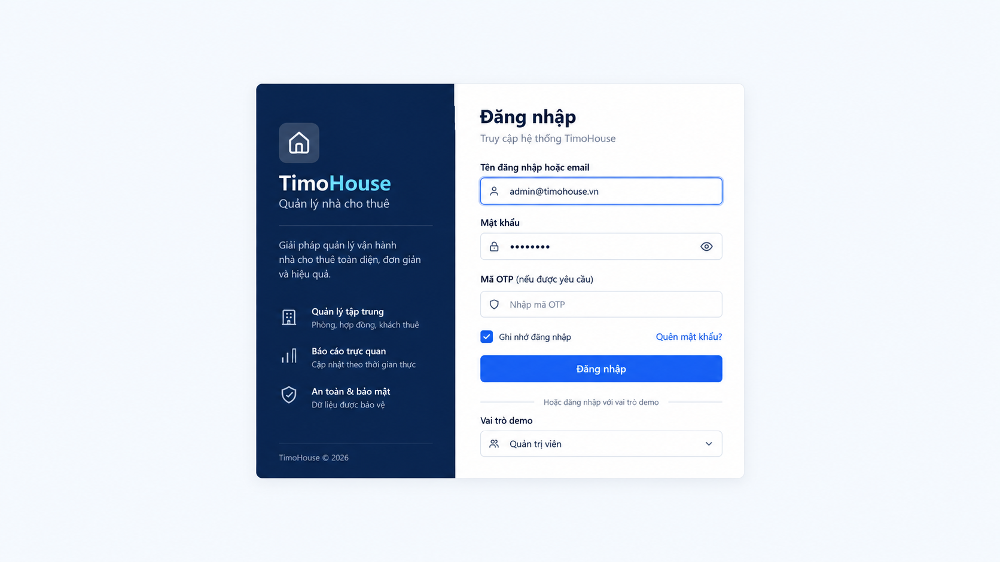
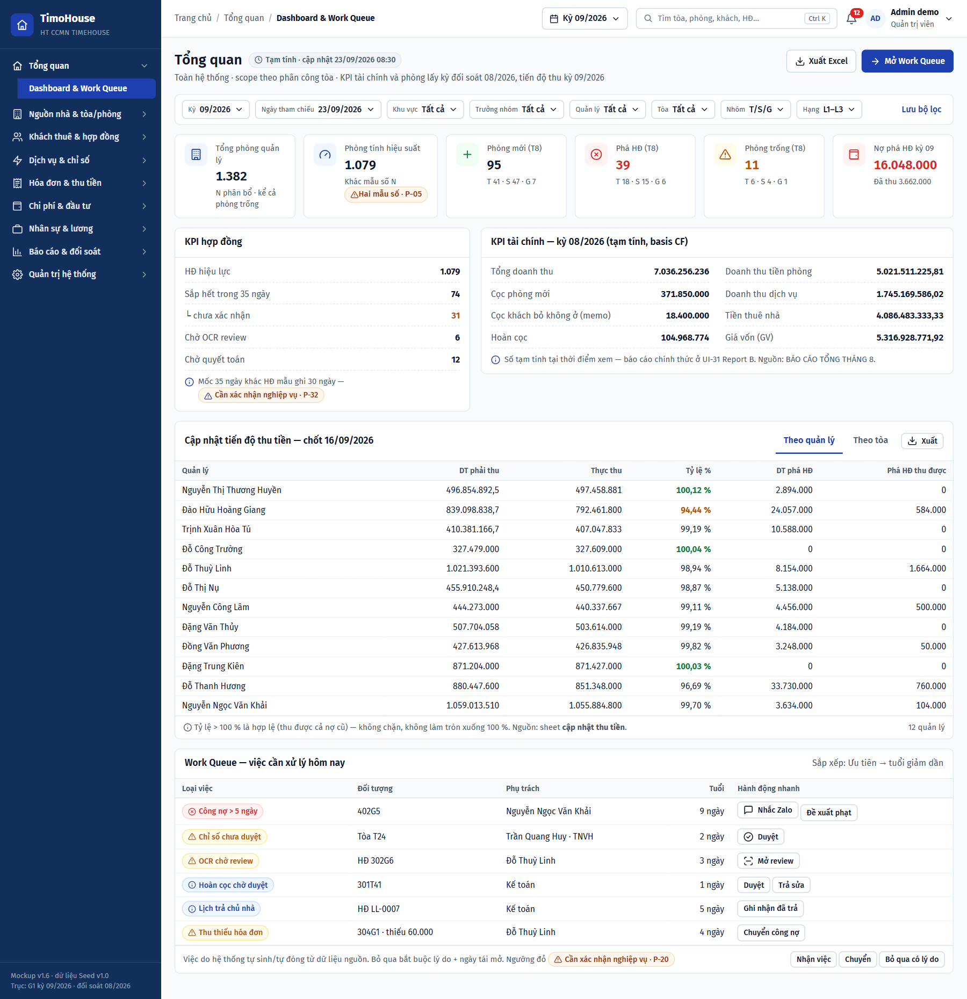

# TIMOHOUSE — SRS · Cụm Truy cập & tổng quan

**Phiên bản:** 1.0 · **Ngày lập:** 25/09/2026 · **Trạng thái:** DRAFT, chờ khách hàng xác nhận
**Phạm vi:** FR00 Đăng nhập, FR01 Dashboard & Work Queue.

**Nguồn:** [`TimoHouse_UI_Mockup_Spec_v1.0.md`](TimoHouse_UI_Mockup_Spec_v1.0.md) bản 1.9 (§3.2, §4, §5.3, §5.4, §6, §6.1, §6.2, §7.5, UI-00, UI-01, §13 F-03/F-08, §15, §16, §18 P-05/P-17/P-20/P-23/P-32/P-36); dữ liệu mẫu ở [`TimoHouse_Mockup_Seed_Data_v1.0.md`](TimoHouse_Mockup_Seed_Data_v1.0.md) §8, §9, §10, §14; ảnh mockup `ui-imagegen-v1/09-quan-tri-he-thong/UI-00-login.png`, `ui-imagegen-v1/01-tong-quan/UI-01-dashboard-work-queue.png` và bảng tham khảo `ui-imagegen-v1/responsive/R-01-dashboard-breakpoints.png`; kết luận ảnh theo [`ui-imagegen-v1/AUDIT.md`](ui-imagegen-v1/AUDIT.md).

Quy ước đọc tài liệu và Common Rules 1–14 xem [`TimoHouse_SRS_v1.0.md`](TimoHouse_SRS_v1.0.md#common-rules-dùng-chung-cho-mọi-fr); tài liệu này chỉ dẫn chiếu, không lặp lại.

> Tài liệu viết theo khung SRS Ekotek (skill `srs-generator`). Mỗi FR gồm đúng ba phần theo thứ tự: **Business Rule** → **Screen description** → **User Steps**. Hai ảnh của cụm đều kết luận **ĐẠT CÓ LƯU Ý** nên được nhúng; chỗ ảnh lệch spec được ghi đỏ tại field liên quan và mô tả theo spec. `R-01` chỉ dùng tham khảo hành vi responsive, không nhúng.

---
---

# FR00 - Đăng nhập

## 1. Business Rule

| | |
|:-:|---|
| **Authorization** | • Tất cả tài khoản nội bộ: Admin, Kế toán, TPVH, TNVH/Trưởng khu vực, NVVH, NV nguồn, NVKD/Sale, Kỹ thuật, Vệ sinh • Cổ đông • HR và Quản lý Tổng chưa tách vai trò riêng, gộp vào Admin/Kế toán (P-22) • Chủ nhà và khách thuê **không** đăng nhập trong Phase 1; portal riêng cho hai đối tượng này nằm ngoài phạm vi (§3.2) |
| **Login Rule** | • Người dùng đăng nhập vào hệ thống bằng tên đăng nhập hoặc email và mật khẩu; tài khoản bật MFA phải nhập thêm mã OTP • Chức năng chỉ thực hiện được khi ## • Ô tên đăng nhập cho phép trình duyệt autocomplete username • Ô mật khẩu cho phép paste và password manager; có nút hiện/ẩn mật khẩu với accessible name (§5.4) • Mã OTP chỉ hiển thị khi tài khoản bật MFA. Cờ MFA của tài khoản cấu hình ở màn User & quyền (refer to FR33) • `Gửi lại OTP` có đếm ngược chống spam (thời gian đếm ngược, số lần gửi lại tối đa, hiệu lực của OTP: ##) • `Ghi nhớ đăng nhập` chỉ lưu session token, **không** lưu mật khẩu (thời hạn session khi có/không ghi nhớ: ##) • Đăng nhập thành công -> mở deep link người dùng truy cập ban đầu; không có deep link -> mở Dashboard theo vai trò (refer to FR01) • Đăng nhập thất bại -> giữ tên đăng nhập đã nhập, hiển thị lý do an toàn: **không tiết lộ tài khoản có tồn tại hay không** • `Quên mật khẩu` mở luồng đặt lại mật khẩu qua email (spec chỉ nêu một dòng; chưa có phác họa, field, nội dung email, hạn link đặt lại — cần BA bổ sung) • Spec chưa mô tả: khóa tài khoản sau N lần sai, chính sách độ mạnh mật khẩu, tài khoản không còn active (cờ active ở FR33) đăng nhập thì báo gì • Popup Đổi mật khẩu (mục `Đổi mật khẩu` của menu Tài khoản, Common Rule 1): spec chỉ nêu tên action ở §6.1 "User menu: … đổi mật khẩu …", không có phác họa, field hay rule. Chưa viết thành Screen — cần BA bổ sung đặc tả (các ô mật khẩu, chính sách, hành vi sau khi đổi) • Mockup bắt buộc hiển thị băng `△ Dữ liệu mô phỏng` và cho chọn vai trò demo để kiểm thử phạm vi dữ liệu (cần xác nhận băng và ô chọn vai trò demo bị ẩn ở bản production) • Đăng xuất (menu Tài khoản, Common Rule 1) -> kết thúc phiên, chuyển về Đăng nhập (Screen 00.1) |
| **Login Impact** | • Đăng nhập thành công: &nbsp;&nbsp;◦ Tạo phiên đăng nhập (session token) cho người dùng với vai trò và phạm vi dữ liệu theo `BUILDING_ASSIGNMENT` (Common Rule 7) &nbsp;&nbsp;◦ `Ghi nhớ đăng nhập` được tick: lưu session token để giữ phiên; không lưu mật khẩu &nbsp;&nbsp;◦ Cập nhật thời điểm đăng nhập gần nhất (cột last login ở màn User & quyền, refer to FR33) • Đăng nhập thất bại: không tạo phiên, không thay đổi dữ liệu (cần xác nhận có ghi log lần đăng nhập thất bại không) • Gửi lại OTP: sinh và gửi mã OTP mới (kênh gửi OTP: ##; mã cũ còn hiệu lực không: ##) • Đăng xuất: hủy phiên hiện tại • Cần xác nhận đăng nhập/đăng xuất có ghi audit theo §16.3 không (Common Rule 5 chỉ nêu tạo/sửa/duyệt/đảo/hủy) |

## 2. Screen 00.1: Đăng nhập

<b>Screen 00.1: Đăng nhập</b>

| **Fields** | **Format** | **Required?** | **Description** |
|:-:|:-:|:-:|:-:|
| Left Menu, Header | | | • Không hiển thị. Màn nằm ngoài application shell (Common Rule 1 không áp dụng) • Route: `#/login` • Truy cập route cần đăng nhập khi chưa có phiên -> chuyển về màn này, giữ deep link ban đầu để mở lại sau khi đăng nhập |
| 🟧 Khối giới thiệu | | | • Khối tĩnh bên trái form |
| Logo và tên hệ thống | Icon + Text | No | • Hiển thị logo và tên "TimoHouse", dòng phụ theo spec: "Quản lý vận hành cho thuê" • Unclickable • Capture lệch spec: dòng phụ ghi "Quản lý nhà cho thuê"; mô tả theo spec |
| Nội dung giới thiệu | Text | No | • Đoạn giới thiệu và danh sách điểm nổi bật của hệ thống (spec không có vùng này; nội dung cần BA chốt) • Capture lệch spec: câu "Báo cáo trực quan · Cập nhật theo thời gian thực" trái BR-2.03.7 (chỉ số từ báo cáo đọc snapshot kỳ đã khóa, không tính realtime) — không dùng câu này |
| 🟧 Form đăng nhập | | | • Nhiều lỗi cùng lúc -> hiển thị summary ở đầu form (Common Rule 13) |
| Tiêu đề | Text | No | • Hiển thị "Đăng nhập" • Dòng phụ: "Truy cập hệ thống TimoHouse" |
| Tên đăng nhập hoặc email | Textbox | Yes | • Always display • Always enable • Placeholder: ## • Cho phép trình duyệt autocomplete username • Allow entering all types of characters • Max length: ## • If clicking out of the field while it is blank -> Show error message E## • Đăng nhập thất bại -> giữ nguyên giá trị đã nhập |
| Mật khẩu | Textbox | Yes | • Always display • Always enable • Giá trị nhập hiển thị dạng ẩn (•) • Cho phép paste và password manager • Allow entering all types of characters • Max length: ## • If clicking out of the field while it is blank -> Show error message E## • Đăng nhập thất bại -> ## (xóa hay giữ mật khẩu đã nhập?) |
| Hiện/ẩn mật khẩu | Icon | No | • Always display, nằm trong ô Mật khẩu • Default: ẩn mật khẩu • Click on -> Chuyển giữa hiện và ẩn mật khẩu • Có accessible name và tooltip (§5.4) |
| Mã OTP | Textbox | Yes | • Display only when tài khoản bật MFA; Required khi hiển thị • Capture lệch spec: ô OTP luôn hiển thị với nhãn "Mã OTP (nếu được yêu cầu)"; mô tả theo spec • Thời điểm hiển thị ô OTP: ## (sau khi nhập đúng tên đăng nhập và mật khẩu, hay ngay khi nhận diện tài khoản?) • Placeholder: "Nhập mã OTP" • Allow entering ## (chỉ số?). Max length: ## (số chữ số OTP) • If clicking out of the field while it is blank -> Show error message E## • Mã sai hoặc hết hạn -> Show error message E## |
| Gửi lại OTP | Button | No | • Display only when ô Mã OTP đang hiển thị • Enabled only when hết thời gian đếm ngược chống spam; trong thời gian đếm ngược hiển thị số giây còn lại (thời gian: ##) • Click on -> Gửi mã OTP mới, bắt đầu lại đếm ngược • Capture thiếu nút này; mô tả theo spec |
| Ghi nhớ đăng nhập | Checkbox | No | • Always display • Default status: ## (capture: Checked; spec không nêu) • Tick the checkbox -> Khi đăng nhập thành công, lưu session token để giữ phiên; không lưu mật khẩu • Untick the checkbox -> Phiên kết thúc theo mặc định của hệ thống (##) |
| Quên mật khẩu? | Button | No | • Always display, dạng link • Always enabled • Click on -> Mở luồng đặt lại mật khẩu qua email (Screen ## — spec chưa có phác họa, cần bổ sung) |
| Đăng nhập | Button | No | • Always appear. Đây là CTA chính của màn • Always enabled; khi đang xử lý chuyển sang loading và disabled để chống bấm lặp (§5.4) • Click on -> Validate in the following order: &nbsp;&nbsp;◦ If there are any fields with invalid values, display error messages as mentioned above &nbsp;&nbsp;◦ Tên đăng nhập/email hoặc mật khẩu không đúng -> giữ tên đăng nhập, display error message E##; nội dung không tiết lộ tài khoản có tồn tại hay không &nbsp;&nbsp;◦ Tài khoản bật MFA mà chưa nhập hoặc nhập sai OTP -> display ô Mã OTP / error message E## &nbsp;&nbsp;◦ ## (tài khoản bị khóa/không active, vượt số lần sai: spec chưa mô tả) &nbsp;&nbsp;◦ If all conditions above are satisfied -> mở deep link ban đầu; không có deep link -> Go to Dashboard & Work Queue theo vai trò (Screen 01.1, refer to FR01) |
| 🟧 Băng dữ liệu mô phỏng | | | • Bắt buộc hiển thị trong mockup (vùng ⑦ của spec) • Capture lệch spec: thiếu nhãn "△ Dữ liệu mô phỏng"; capture chỉ có dòng "Hoặc đăng nhập với vai trò demo" và ô Vai trò demo. Mô tả theo spec |
| Nhãn Dữ liệu mô phỏng | Text | No | • Always display trong mockup • Content format: "△ Dữ liệu mô phỏng — chọn vai trò demo:" kèm biểu tượng cảnh báo (Common Rule 4) |
| Vai trò demo | Dropdown | No | • Always display trong mockup • Default selection: Admin (capture hiển thị "Quản trị viên") • Click on -> Display the list of following options: Admin, Kế toán, TPVH, TNVH/Trưởng khu vực, NVVH, NV nguồn, NVKD/Sale, Kỹ thuật, Vệ sinh, Cổ đông (vai trò theo §4) • Allow single selection only. Selecting an option automatically deselects the previous selection • Select an option -> ## (đăng nhập ngay bằng tài khoản demo của vai trò, hay chỉ chọn vai trò rồi bấm Đăng nhập?) • Vai trò demo dùng để kiểm thử phạm vi dữ liệu; đổi được sau khi đăng nhập qua menu Tài khoản → Chuyển vai trò demo (Common Rule 1) |

## 3. User Steps

| | |
|:-:|---|
| **Pre-condition** | Người dùng có tài khoản nội bộ hoặc tài khoản cổ đông, chưa đăng nhập |
| **User steps** | **Step 1:** Mở hệ thống hoặc một deep link khi chưa có phiên -> display Đăng nhập (Screen 00.1) **Step 2:** Nhập tên đăng nhập/email và mật khẩu, click `Đăng nhập`; tài khoản bật MFA -> display ô Mã OTP trên Đăng nhập (Screen 00.1) **Step 3:** Nhập mã OTP (nếu có), click `Đăng nhập` -> display deep link ban đầu hoặc Dashboard & Work Queue (Screen 01.1, refer to FR01) |

| | |
|:-:|---|
| **Pre-condition** | Người dùng quên mật khẩu |
| **User steps** | **Step 1:** Tại Đăng nhập (Screen 00.1), click `Quên mật khẩu?` -> display luồng đặt lại mật khẩu qua email (Screen ## — spec chưa đặc tả) |

| | |
|:-:|---|
| **Pre-condition** | Người dùng đã đăng nhập |
| **User steps** | **Step 1:** Tại Header, click Tài khoản → `Đăng xuất` -> display Đăng nhập (Screen 00.1) **Step 2:** Tại Header, click Tài khoản → `Đổi mật khẩu` -> display popup Đổi mật khẩu (Screen ## — spec chưa đặc tả) |

---
---

# FR01 - Dashboard & Work Queue

## 1. Business Rule

| | |
|:-:|---|
| **Authorization** | • Admin: toàn hệ thống • Kế toán: toàn hệ thống hoặc tòa được cấp • TPVH: đơn vị và toàn bộ cấp dưới; quyền chính gồm Dashboard, Work Queue (§4) • TNVH/Trưởng khu vực: đơn vị và cấp dưới • NVVH: tòa được phân công • Kỹ thuật, Vệ sinh: việc trong Work Queue của tòa được phân công chuyên môn (việc dọn phòng/nghiệm thu nằm trong Work Queue, X-03); Vệ sinh không xem dữ liệu tài chính (cần xác nhận ẩn khối ③ KPI tài chính và ④ Tiến độ thu với vai trò này) • NV nguồn, NVKD/Sale, Cổ đông: ## (spec chỉ nói đăng nhập mở "Dashboard theo vai trò" nhưng không mô tả Dashboard của các vai trò này) • Phạm vi dữ liệu áp ở server theo `BUILDING_ASSIGNMENT` tại ngày tham chiếu (R-33/R-34, Common Rule 7) |
| **Management Rule** | • Người dùng xem một màn điều hành theo phạm vi và kỳ, gồm KPI phòng, KPI hợp đồng, KPI tài chính, tiến độ thu tiền và Work Queue các việc cần xử lý; không phải ghép số thủ công • Chức năng chỉ thực hiện được khi người dùng đã đăng nhập với vai trò thuộc Authorization ## • Bộ lọc: kỳ, ngày tham chiếu, khu vực (đơn vị tổ chức), trưởng nhóm, quản lý, tòa, nhóm T/S/G, hạng L1–L3 &nbsp;&nbsp;◦ Cascading chuẩn: Khu vực → Trưởng nhóm → Quản lý → Tòa → Loại nhà (T/S/G, L1–L3); chọn cấp trên thu hẹp cấp dưới; cặp Quản lý → Tòa lấy từ Phân công tòa tại ngày xem (BR-3.01.7, R-34, refer to FR20) &nbsp;&nbsp;◦ Bộ lọc phản ánh lên URL và áp cho **cả KPI, bảng và export** &nbsp;&nbsp;◦ Kỳ của bộ lọc đồng bộ với bộ chọn Kỳ ở Header (Common Rule 1) • Mọi số KPI là **tạm tính đến thời điểm xem**, hiển thị kèm thời điểm cập nhật; không thay thế báo cáo chính thức (refer to FR31) • KPI phòng: &nbsp;&nbsp;◦ Phòng trống **bắt buộc tách 3 loại** theo D-24: Trống ở luôn = Sẵn sàng, Chờ dọn, Bảo trì; Trống hết tháng = Trống hết tháng; Đang chờ = Giữ chỗ. Không hiển thị một con số trống gộp thiếu 3 loại (refer to FR05) &nbsp;&nbsp;◦ Phòng trống đếm tại ngày cuối tháng, theo tòa rồi cộng lên (R-06) &nbsp;&nbsp;◦ Một phòng vừa phá HĐ vừa có khách mới trong tháng đếm cả 2; đổi phòng nội bộ và gia hạn không đếm (BR-5.03.9) &nbsp;&nbsp;◦ Hai mẫu số phòng khác nhau: N phân bổ (kể cả phòng trống, ví dụ 1.382) và số phòng tính hiệu suất (ví dụ 1.079); hiển thị chip `Cần xác nhận nghiệp vụ · P-05` &nbsp;&nbsp;◦ Công thức Tỷ lệ lấp đầy chưa có trong spec (wireframe 78,1 % ≈ 1.079 ÷ 1.382?) — cần xác nhận tử số/mẫu số • KPI hợp đồng: "Sắp hết 35 ngày" tách thành chưa xác nhận / đã gia hạn / đã kết thúc. Mốc 35 ngày khác HĐ mẫu ghi 30 ngày, hiển thị chip `Cần xác nhận nghiệp vụ · P-32`. Hệ thống không tự gia hạn (BR-2.06.18, R-15) • KPI tài chính: công nợ tách theo tuổi nợ (nợ 6–15 ngày, nợ > 15 ngày); công nợ tính sau 5 ngày từ ngày phát hành (P-17) • Tiến độ thu tiền: bảng thay cho biểu đồ doanh thu–công nợ (BR-1.01.18) &nbsp;&nbsp;◦ Mốc đã qua lấy từ snapshot; mốc chưa tới hiện lũy kế hiện tại kèm nhãn "đang chạy" &nbsp;&nbsp;◦ Tỷ lệ > 100 % là hợp lệ (thu được cả nợ cũ): không chặn, không làm tròn xuống 100 % &nbsp;&nbsp;◦ Hai chế độ xem Theo quản lý / Theo tòa, giữ nguyên bộ lọc • Work Queue: &nbsp;&nbsp;◦ Việc do hệ thống **tự sinh và tự đóng** từ trạng thái dữ liệu nguồn; Phase 1 người dùng không tạo việc tự do (BR-1.01.14) &nbsp;&nbsp;◦ Trạng thái việc: `Mở → Đang xử lý → Đã xong`; `Mở/Đang xử lý → Bỏ qua`. Điều kiện nguồn phát sinh lại -> tạo việc mới &nbsp;&nbsp;◦ Nguồn sinh việc theo spec: công nợ quá hạn (F-03); chỉ số chưa duyệt (refer to FR10); OCR chờ review (F-01, refer to FR08); hoàn cọc chờ duyệt (refer to FR16); lịch trả chủ nhà đến hạn/quá hạn (BR-2.02.5 → P-23, refer to FR03); HĐ thuê sắp hết theo ngày kết thúc của phiên bản hiện hành (BR-2.06.18, refer to FR15); xác nhận Kết thúc để phòng vào "Trống hết tháng" (refer to FR05); đơn vị "thiếu Lead" cảnh báo Admin (refer to FR18); tòa đang vận hành không có phụ trách chính cảnh báo TPVH (BR-3.03.12, refer to FR20); việc dọn phòng/nghiệm thu (X-03) &nbsp;&nbsp;◦ Cảnh báo đỏ bắt buộc trên Dashboard: lịch trả chủ nhà quá hạn (BR-2.02.5); điều khoản HĐ đầu vào Đ.6.2/10.2 "chậm thanh toán 01 tháng → bên A có quyền lấy nhà" (refer to FR03) (vị trí hiển thị trên Screen 01.1 chưa có trong phác họa) &nbsp;&nbsp;◦ Ngưỡng đỏ mặc định (**ASSUMED**, P-20): công nợ > 5 ngày, nghiêm trọng > 15 ngày; HĐ thuê còn < 7 ngày; lịch trả chủ nhà ≤ 7 ngày; OCR chờ review > 2 ngày. Hiển thị chip `Cần xác nhận nghiệp vụ · P-20` &nbsp;&nbsp;◦ SLA hoàn cọc 10 ngày (P-36) chưa có deadline trên phiếu hoàn cọc, chưa sinh việc (chờ chốt P-36) &nbsp;&nbsp;◦ Sắp xếp mặc định: Ưu tiên → tuổi việc giảm dần &nbsp;&nbsp;◦ Hành động: nhận việc, chuyển người xử lý **trong phạm vi**, mở đối tượng, hành động nhanh trên dòng, bỏ qua **bắt buộc lý do + ngày tái mở** • Lỗi của từng khối không làm hỏng toàn trang; khối lỗi có `Thử lại` riêng (Common Rule 13) |
| **Management Impact** | • Xem Dashboard, lọc, đổi chế độ xem, sắp xếp không làm thay đổi dữ liệu; chỉ tác động tới hiển thị hiện tại • Xuất Excel / Xuất: tạo file theo bộ lọc đang áp, không thay đổi dữ liệu • Lưu bộ lọc: ## (lưu saved view theo người dùng? đặt tên?) • Nhận việc: việc `Mở` -> `Đang xử lý`, người phụ trách = người nhận • Chuyển việc: người phụ trách = người được chọn trong phạm vi (trạng thái sau khi chuyển: ##) • Bỏ qua: việc `Mở/Đang xử lý` -> `Bỏ qua`, lưu lý do và ngày tái mở; đến ngày tái mở mà điều kiện nguồn còn -> ## (mở lại việc cũ hay tạo việc mới?) • Dữ liệu nguồn hết điều kiện -> hệ thống tự đóng việc (`Đã xong`) • Hành động nhanh: tác động theo FR đích (Duyệt, Trả sửa, Nhắc Zalo, Đề xuất phạt, Ghi nhận đã trả…) • Mọi thao tác trên việc ghi audit theo Common Rule 5 |

## 2. Screen 01.1: Dashboard & Work Queue

<b>Screen 01.1: Dashboard & Work Queue</b>

| **Fields** | **Format** | **Required?** | **Description** |
|:-:|:-:|:-:|:-:|
| Left Menu, Header | | | • Display follows Common Rule 1 • Highlight menu `Dashboard & Work Queue` (cụm Tổng quan) • Breadcrumb: `Trang chủ / Tổng quan / Dashboard & Work Queue` • Route: `#/dashboard` • Chuông việc ở Header -> mở màn này, cuộn tới Work Queue với bộ lọc đã áp • §6.2 ghi cụm Tổng quan có 2 mục menu "Dashboard, Work Queue" nhưng capture chỉ có 1 mục "Dashboard & Work Queue" — cần xác nhận Work Queue có mục menu/màn riêng không |
| 🟧 Tiêu đề trang | | | |
| Tiêu đề | Text | No | • Hiển thị "Tổng quan" kèm chip "Tạm tính · cập nhật {DD/MM/YYYY hh:mm}" (Common Rule 10) • Dòng phụ: phạm vi và kỳ nguồn của từng khối, ví dụ "Toàn hệ thống · scope theo phân công tòa · KPI tài chính và phòng lấy kỳ đối soát 08/2026, tiến độ thu kỳ 09/2026" • Kỳ áp cho từng khối chưa rõ: phác họa và capture trộn kỳ 08/2026 (KPI phòng, KPI tài chính) với kỳ 09/2026 (tiến độ thu, nợ phá HĐ) trong khi bộ lọc chọn Kỳ 09/2026 — cần xác nhận quy tắc kỳ của từng khối |
| Xuất Excel | Button | No | • Always display • Enabled only when người dùng có quyền xuất (Common Rule 7) • Click on -> Xuất dashboard theo bộ lọc đang áp ra file XLSX (nội dung file: toàn bộ khối hay từng khối? ##) |
| Lưu bộ lọc | Button | No | • Always display • Always enabled • Click on -> ## (lưu saved view; có popup đặt tên không? — spec chưa mô tả) |
| Mở Work Queue | Button | No | • Capture lệch spec: capture có nút primary "Mở Work Queue", phác họa UI-01 không có. Cần xác nhận giữ hay bỏ; nếu giữ: Click on -> ## (cuộn tới ⑥ hay mở màn Work Queue riêng?) |
| 🟧 ⓪ Filter section | | | • Bộ lọc luôn hiển thị, áp ngay khi chọn và phản ánh lên URL (Common Rule 6) • Áp cho cả KPI, bảng và export • Cascading theo BR-3.01.7: chọn cấp trên -> danh sách cấp dưới chỉ còn giá trị thuộc cấp trên (giá trị cấp dưới đã chọn không còn hợp lệ thì reset về Tất cả? ##) |
| Kỳ | Dropdown | No | • Default selection: kỳ hiện tại (ví dụ `09/2026`) • Click on -> Display danh sách kỳ; kỳ đã khóa hiển thị biểu tượng khóa và version • Allow single selection only. Selecting an option automatically deselects the previous selection • Select an option -> Cập nhật mọi khối theo kỳ đã chọn; đồng bộ với bộ chọn Kỳ ở Header |
| Ngày tham chiếu | Datepicker | No | • Default selection: ngày hiện tại (capture `23/09/2026`) (cần xác nhận) • Format: DD/MM/YYYY (Common Rule 10) • Click on -> Display a datepicker • Select a date -> Resolve phạm vi (tổ chức → nhân sự → tòa) và phân công theo ngày đã chọn (§6.1, F-08) • Có cho chọn ngày tương lai / ngoài kỳ đang chọn không: ## |
| Khu vực | Dropdown | No | • Default selection: Tất cả • Click on -> Display the list of options: Tất cả + danh mục khu vực (đơn vị tổ chức, refer to FR18) trong phạm vi quyền • Allow single selection only • Select an option -> Search for all records with Khu vực = selected option; thu hẹp danh sách Trưởng nhóm |
| Trưởng nhóm | Dropdown | No | • Default selection: Tất cả • Click on -> Display the list of options: Tất cả + trưởng nhóm thuộc khu vực đã chọn • Allow single selection only • Select an option -> Search for all records with Trưởng nhóm = selected option; thu hẹp danh sách Quản lý |
| Quản lý | Dropdown | No | • Default selection: Tất cả • Click on -> Display the list of options: Tất cả + quản lý thuộc trưởng nhóm đã chọn • Allow single selection only • Select an option -> Search for all records with Quản lý = selected option; thu hẹp danh sách Tòa theo Phân công tòa tại ngày tham chiếu |
| Tòa | Dropdown | No | • Default selection: Tất cả • Click on -> Display the list of options: Tất cả + tòa thuộc quản lý đã chọn, trong phạm vi quyền • Allow single selection only • Select an option -> Search for all records with Tòa = selected option |
| Nhóm T/S/G | Dropdown | No | • Default selection: Tất cả • Click on -> Display the list of options: Tất cả, T, S, G (P-04: T/S/G là dòng sản phẩm) • Allow single selection only • Select an option -> Search for all records có tòa thuộc nhóm đã chọn, theo giá trị hiệu lực tại kỳ đang chọn |
| Hạng L1–L3 | Dropdown | No | • Default selection: Tất cả • Click on -> Display the list of options: Tất cả, L1, L2, L3 • Allow single selection only • Select an option -> Search for all records có tòa thuộc hạng đã chọn |
| 🟧 ① KPI phòng | | | • Mọi số theo phạm vi quyền và bộ lọc • Click on một ô -> Mở danh sách đã filter sẵn theo chỉ tiêu của ô (màn đích của từng ô: ##; dự kiến Danh sách phòng refer to FR05) • Capture lệch spec: thiếu các ô Đang thuê, Trống ở luôn, Trống hết tháng, Đang chờ, Chờ dọn/bảo trì, Tỷ lệ lấp đầy (78,1 %); mô tả theo spec |
| Tổng phòng quản lý | Text | No | • Tổng số phòng quản lý = N phân bổ, kể cả phòng trống, ví dụ 1.382 • Dòng phụ: "N phân bổ · kể cả phòng trống" |
| Phòng tính hiệu suất | Text | No | • Số phòng dùng làm mẫu số hiệu suất, ví dụ 1.079 • Dòng phụ: "Khác mẫu số N" kèm chip `△ Hai mẫu số · P-05` |
| Đang thuê | Text | No | • Số phòng trạng thái Đang thuê • Capture thiếu |
| Trống ở luôn · Trống hết tháng · Đang chờ | Text | No | • Ba ô riêng theo D-24 (xem Management Rule), đếm tại ngày cuối tháng theo tòa rồi cộng lên (R-06) • Mâu thuẫn: phác họa và capture chỉ có một ô "Trống 11 (T 6 · S 4 · G 1)" tách theo nhóm T/S/G, trái quy tắc "không hiển thị một con số trống gộp thiếu 3 loại" (D-24, R-06). Mô tả theo quy tắc; cần xác nhận có giữ thêm dòng tách T/S/G |
| Phòng mới | Text | No | • Số phòng có khách mới trong kỳ, ví dụ 95 • Dòng phụ: tách theo nhóm, ví dụ "T 41 · S 47 · G 7" |
| Phá HĐ | Text | No | • Số phòng phá HĐ trong kỳ, ví dụ 39 • Dòng phụ: tách theo nhóm, ví dụ "T 18 · S 15 · G 6" |
| Chờ dọn / bảo trì | Text | No | • Số phòng trạng thái Chờ dọn và Bảo trì • Capture thiếu |
| Tỷ lệ lấp đầy | Text | No | • Tỷ lệ phần trăm, tối đa 2 chữ số thập phân (Common Rule 8), ví dụ 78,1 % • Capture thiếu; công thức chưa có trong spec |
| Nợ phá HĐ | Text | No | • Tổng phải thu nợ phá HĐ của kỳ và số đã thu, ví dụ "16.048.000" · "Đã thu 3.662.000" (Common Rule 8) • Capture đặt ô này ở hàng KPI phòng; phác họa đặt ở ③ KPI tài chính — cần xác nhận vị trí • Click on -> ## (dự kiến Công nợ & phạt, refer to FR14) |
| 🟧 ② KPI hợp đồng | | | • Mỗi chỉ tiêu drill-down sang danh sách HĐ đã lọc sẵn |
| HĐ hiệu lực | Text | No | • Số HĐ thuê đang hiệu lực, ví dụ 1.079 • Click on -> Go to Danh sách hợp đồng thuê lọc trạng thái hiệu lực (refer to FR07) |
| Sắp hết trong 35 ngày | Text | No | • Số HĐ còn ≤ 35 ngày tới ngày kết thúc, ví dụ 74 • Click on -> Go to HĐ sắp hết/Gia hạn/Kết thúc (refer to FR15) |
| └ chưa xác nhận / đã gia hạn / đã kết thúc | Text | No | • Ba dòng con của "Sắp hết trong 35 ngày", ví dụ chưa xác nhận 31 • Capture chỉ có dòng "chưa xác nhận"; thiếu "đã gia hạn", "đã kết thúc" — mô tả theo spec • Click on -> Go to HĐ sắp hết (refer to FR15) lọc theo trạng thái xác nhận tương ứng |
| Chờ OCR review | Text | No | • Số job OCR hợp đồng khách chờ review, ví dụ 6 • Click on -> Go to OCR/Data Onboarding (refer to FR08) |
| Chờ quyết toán | Text | No | • Số HĐ đang chờ quyết toán, ví dụ 12 • Click on -> ## (FR15 hay Cọc & hoàn cọc FR16?) |
| Ghi chú mốc 35 ngày | Text | No | • Always display • Content format: "Mốc 35 ngày khác HĐ mẫu ghi 30 ngày —" kèm chip `△ Cần xác nhận nghiệp vụ · P-32` |
| 🟧 ③ KPI tài chính | | | • Tiêu đề: "KPI tài chính — kỳ {kỳ} (tạm tính, basis CF)" • Giá trị VND theo Common Rule 8, kèm thời điểm cập nhật • Mâu thuẫn trong spec: phác họa ③ gồm Tổng doanh thu, Cọc phòng mới, Cọc khách bỏ (memo), Hoàn cọc, Nợ phá HĐ; bảng "Khối dữ liệu" gồm Tổng cần đóng, Đã đóng, Còn nợ, Nợ 6–15, Nợ > 15, Cọc đang giữ, Hoàn cọc chờ duyệt; chú giải ③ yêu cầu công nợ tách theo tuổi nợ. Cần chốt bộ chỉ tiêu. Dưới đây liệt kê cả hai • Capture lệch spec: có thêm Doanh thu tiền phòng, Doanh thu dịch vụ, Tiền thuê nhà, Giá vốn (GV) không có trong spec; thiếu toàn bộ nhóm công nợ theo tuổi nợ |
| Tổng doanh thu | Text | No | • Tổng doanh thu tạm tính của kỳ, ví dụ 7.036.256.236 |
| Cọc phòng mới | Text | No | • Tổng cọc thu của phòng mới, ví dụ 371.850.000 |
| Cọc khách bỏ không ở (memo) | Text | No | • Cọc giữ lại khi khách bỏ không vào ở, chỉ ghi nhớ (memo), ví dụ 18.400.000 |
| Hoàn cọc | Text | No | • Tổng tiền đã hoàn cọc trong kỳ, ví dụ 104.968.774 |
| Tổng cần đóng · Đã đóng · Còn nợ | Text | No | • Theo bảng "Khối dữ liệu" của spec • Capture thiếu |
| Nợ 6–15 ngày · Nợ > 15 ngày | Text | No | • Công nợ tách theo tuổi nợ; tuổi nợ tính từ ngày thứ 6 sau phát hành (P-17) • Capture thiếu. Click on -> ## (dự kiến Công nợ & phạt lọc theo tuổi nợ, refer to FR14) |
| Cọc đang giữ · Hoàn cọc chờ duyệt | Text | No | • Theo bảng "Khối dữ liệu" của spec • Capture thiếu. Click on -> ## (dự kiến refer to FR16) |
| Ghi chú tạm tính | Text | No | • Always display • Content format: "Số tạm tính tại thời điểm xem — báo cáo chính thức ở UI-31 Report B." (refer to FR31) |
| 🟧 ④ Cập nhật tiến độ thu tiền | | | • Tiêu đề: "Cập nhật tiến độ thu tiền — chốt {DD/MM/YYYY}", ví dụ "chốt 16/09/2026" • Mốc đã qua lấy từ snapshot; mốc chưa tới hiện lũy kế hiện tại kèm nhãn "đang chạy" (BR-1.01.18) |
| Theo quản lý | Tab | No | • Default tab • Highlight the tab while being selected • Click on -> Hiển thị bảng tiến độ theo quản lý, giữ nguyên bộ lọc |
| Theo tòa | Tab | No | • Highlight the tab while being selected • Click on -> Hiển thị bảng tiến độ theo tòa, giữ nguyên bộ lọc • Chưa có capture chế độ Theo tòa; danh sách cột chưa được đặc tả |
| Xuất | Button | No | • Always display • Enabled only when người dùng có quyền xuất • Click on -> Xuất bảng tiến độ đang xem (theo bộ lọc và chế độ xem) ra file CSV/XLSX (§5.4) (định dạng mặc định: ##) |
| Mở chi tiết NV | Button | No | • Always display • Always enabled • Click on -> ## (dự kiến Hiệu suất thu tiền, refer to FR21) • Capture thiếu nút này; mô tả theo spec |
| 🟦 Bảng tiến độ thu tiền | | | • Display one row per quản lý (hoặc tòa) trong phạm vi quyền và bộ lọc • Giá trị trống hiển thị `—` (Common Rule 3) • No data: E## • Default sorting: ## • Click on một dòng -> ## • Footer: "ⓘ Tỷ lệ > 100 % là hợp lệ (thu được cả nợ cũ) — không chặn, không làm tròn xuống 100 %." và tổng `{n} quản lý` • Mâu thuẫn trong spec: phác họa và capture có 6 cột (dưới đây); bảng "Khối dữ liệu" liệt kê số phòng, DT niêm yết, phải thu, M1/M2/M3, thu thêm, tổng thu, HS %, còn phải thu — cần chốt bộ cột |
| Quản lý | Text | No | • Tên quản lý phụ trách, đọc từ Phân công tòa (refer to FR20); không nhập tay |
| DT phải thu | Number | No | • Doanh thu phải thu của kỳ (Common Rule 8), giữ phần lẻ như nguồn, ví dụ 496.854.892,5 |
| Thực thu | Number | No | • Số đã thu tới mốc chốt (Common Rule 8) |
| Tỷ lệ % | Number | No | • = Thực thu ÷ DT phải thu × 100, tối đa 2 chữ số thập phân, ví dụ 100,12 % • Được phép > 100 % • Capture tô màu tỷ lệ (xanh khi ≥ 100 %, cam ở 94,44 %); spec không nêu ngưỡng màu |
| DT phá HĐ | Number | No | • Doanh thu phải thu từ phòng phá HĐ (Common Rule 8) |
| Phá HĐ thu được | Number | No | • Số đã thu từ phòng phá HĐ (Common Rule 8); có thể lớn hơn phải thu (ca thu vượt, Seed §8) |
| 🟧 ⑥ Work Queue — việc cần xử lý hôm nay | | | • Empty: hiển thị trạng thái tốt và link xem dữ liệu (nội dung và đích của link: ##) • Lỗi khối: hiển thị lỗi và `Thử lại` tại khối, không làm hỏng toàn trang (Common Rule 13) |
| Sắp xếp | Dropdown | No | • Default selection: Ưu tiên → tuổi giảm dần • Click on -> Display the list of options: ## (spec chỉ có "Ưu tiên") • Allow single selection only • Select an option -> Sắp xếp lại danh sách việc |
| 🟦 Bảng Work Queue | | | • Display việc trong phạm vi quyền và bộ lọc, trạng thái Mở hoặc Đang xử lý (việc Đã xong/Bỏ qua có hiển thị không: ##) • Mỗi dòng có chấm màu theo mức ưu tiên; dòng vượt ngưỡng đỏ (P-20, **ASSUMED**) tô đỏ, luôn kèm chữ/icon (Common Rule 4) • Default sorting: Ưu tiên, rồi tuổi việc giảm dần • Click on một dòng -> Go to đối tượng của việc (hành động "mở đối tượng") • Hành động nhanh trên dòng không kích hoạt click dòng (Common Rule 6) • Phân trang theo Common Rule 6 • No data: xem Empty ở dòng khối trên • Capture lệch spec: thiếu cột Phát sinh, Ưu tiên, Trạng thái; mô tả theo spec |
| Loại việc | Tag | No | • Chip loại việc gồm icon + chữ (Common Rule 4), ví dụ Công nợ > 5 ngày, Chỉ số chưa duyệt, OCR chờ review, Hoàn cọc chờ duyệt, Lịch trả chủ nhà • Capture có thêm loại "Thu thiếu hóa đơn" (304G1 · thiếu 60.000) không có trong phác họa spec — cần xác nhận |
| Đối tượng | Text | No | • Mã đối tượng của việc, ví dụ `402G5`, `Tòa T24`, `HĐ 302G6`, `301T41`, `HĐ HL-0021` • Capture lệch spec: dòng Lịch trả chủ nhà ghi "HĐ LL-0007 · 5 ngày"; spec 1.7 là "HĐ HL-0021 · 13 ngày" (LL là tiền tố chủ nhà). Mô tả theo spec |
| Phụ trách | Text | No | • Người đang phụ trách việc; việc chưa nhận hiển thị người/nhóm được giao theo nguồn, ví dụ "Kế toán" • Capture lệch spec: 402G5 gán "Nguyễn Ngọc Văn Khải"; spec 1.7 và Seed §8 là Đỗ Thanh Hương. Mô tả theo spec |
| Phát sinh | Text | No | • Thời điểm việc được sinh. Format: DD/MM/YYYY hh:mm (Common Rule 10) • Capture thiếu |
| Tuổi | Text | No | • Số ngày kể từ khi việc phát sinh, ví dụ "9 ngày" • Cần xác nhận mốc tính tuổi: lúc sinh việc hay mốc nguồn (ví dụ ngày phát hành hóa đơn) |
| Ưu tiên | Tag | No | • Mức ưu tiên của việc theo ngưỡng P-20 • Capture thiếu; danh sách mức ưu tiên: ## |
| Trạng thái | Tag | No | • Mở / Đang xử lý / Đã xong / Bỏ qua (Common Rule 4) • Capture thiếu |
| Hành động nhanh | Button | No | • Nút theo loại việc; Enabled only when người dùng có quyền với hành động đó (Common Rule 7): &nbsp;&nbsp;◦ Công nợ > 5 ngày: `Nhắc Zalo`: Click on -> ## (refer to FR17); `Phạt`: Click on -> ## (refer to FR14). Capture ghi "Đề xuất phạt" — khớp F-03 (hệ thống đề xuất, quản lý xác nhận) nhưng khác nhãn phác họa "Phạt" &nbsp;&nbsp;◦ Chỉ số chưa duyệt: `Duyệt`: Click on -> Display popup Duyệt theo Common Rule 11 (refer to FR10) &nbsp;&nbsp;◦ OCR chờ review: `Mở review`: Click on -> Go to job OCR tương ứng (refer to FR08) &nbsp;&nbsp;◦ Hoàn cọc chờ duyệt: `Duyệt`, `Trả sửa`: Click on -> Display popup Duyệt / Trả sửa theo Common Rule 11 (refer to FR16) &nbsp;&nbsp;◦ Lịch trả chủ nhà: `Ghi nhận đã trả`: Click on -> ## (refer to FR03 hay FR28?) &nbsp;&nbsp;◦ Thu thiếu hóa đơn (chỉ có trên capture): `Chuyển công nợ` — mâu thuẫn F-03 (hóa đơn chưa đủ tự vào công nợ sau 5 ngày); cần xác nhận &nbsp;&nbsp;◦ Các loại việc khác trong Management Rule (HĐ sắp hết, xác nhận kết thúc, thiếu Lead, tòa thiếu phụ trách, dọn phòng/nghiệm thu): hành động nhanh chưa được đặc tả |
| Page number | Text | No | • Click on a page number -> Go to the corresponding page |
| 🟧 ⑦ Hành động trên việc | | | • Cách chọn việc để áp ba nút dưới chưa rõ: capture không có checkbox chọn dòng; cần xác nhận chọn một/nhiều dòng hay đặt nút trên từng dòng |
| Nhận việc | Button | No | • Always display • Enabled only when đã chọn việc ở trạng thái `Mở` và người dùng thuộc phạm vi của việc • Click on -> Gán việc cho người dùng hiện tại, chuyển `Mở` -> `Đang xử lý`, cập nhật dòng |
| Chuyển | Button | No | • Always display • Enabled only when đã chọn việc ở trạng thái `Mở` hoặc `Đang xử lý` • Click on -> Display Popup chuyển việc (Screen 01.2) |
| Bỏ qua có lý do | Button | No | • Always display • Enabled only when đã chọn việc ở trạng thái `Mở` hoặc `Đang xử lý` • Click on -> Display Popup bỏ qua việc (Screen 01.3) |
| Ghi chú Work Queue | Text | No | • Always display • Content format: "Việc do hệ thống tự sinh/tự đóng từ dữ liệu nguồn. Bỏ qua bắt buộc lý do + ngày tái mở. Ngưỡng đỏ" kèm chip `△ Cần xác nhận nghiệp vụ · P-20` |
| 🟧 Responsive | | | • Theo §5.3: 375–767px sidebar thành drawer, bộ lọc vào bottom sheet, bảng quan trọng chuyển card-list, action bar sticky dưới; 768–1023px sidebar thu gọn, bảng cuộn trong vùng bảng với nhãn cột cố định; 1024–1439px layout desktop chuẩn, sidebar 240px; ≥ 1440px bảng tài chính full-width • Bảng tham khảo `R-01-dashboard-breakpoints.png` (ĐẠT CÓ LƯU Ý, không nhúng): lưới KPI 4 → 3 → 2 → 1 cột theo 1440 / 1024 / 768 / 375px • R-01 thu gọn sidebar ở 1024px, trái §5.3 (sidebar 240px); nội dung và số liệu R-01 không theo UI-01, chỉ dùng tham khảo bố cục |

## 3. Screen 01.2: Popup chuyển việc

Chưa có capture — cần bổ sung. Nội dung dựng từ spec.

<b>Screen 01.2: Popup chuyển việc</b>

| **Fields** | **Format** | **Required?** | **Description** |
|:-:|:-:|:-:|:-:|
| 🟧 The popup can be closed by the X icon or by clicking out of the popup. Closing the popup redirects the user to the underlying screen without any changes saved. (cần xác nhận popup có X icon) | | | |
| Việc được chọn | Text | No | • Display loại việc, đối tượng và người đang phụ trách của (các) việc được chọn |
| Người xử lý mới | Dropdown | Yes | • Always display • Placeholder: ## • Default selection: None • If clicking out of field while it is blank -> Show error message E## • Click on -> Display the list of following options: nhân sự trong phạm vi của việc (theo tòa/đơn vị của đối tượng tại ngày tham chiếu) (tiêu chí lọc cụ thể: ##) • Allow single selection only. Selecting an option automatically deselects the previous selection |
| Lý do | Textbox | No | • Spec không yêu cầu lý do khi chuyển việc — cần xác nhận có field này không |
| Hủy | Button | No | • Always appear • Always enabled • Click on -> Đóng popup, không thay đổi dữ liệu |
| Chuyển | Button | No | • Always appear • Enabled only when đã chọn Người xử lý mới • Click on -> Validate in the following order: &nbsp;&nbsp;◦ If there are any fields with invalid values, display error messages as mentioned above &nbsp;&nbsp;◦ Người được chọn không còn thuộc phạm vi của việc -> display error message E## &nbsp;&nbsp;◦ If all conditions above are satisfied -> đổi người phụ trách của việc, ghi audit (Common Rule 5), đóng popup, hiển thị toast thành công và cập nhật Work Queue trên Screen 01.1 |

## 4. Screen 01.3: Popup bỏ qua việc

Chưa có capture — cần bổ sung. Nội dung dựng từ spec.

<b>Screen 01.3: Popup bỏ qua việc</b>

| **Fields** | **Format** | **Required?** | **Description** |
|:-:|:-:|:-:|:-:|
| 🟧 The popup can be closed by the X icon or by clicking out of the popup. Closing the popup redirects the user to the underlying screen without any changes saved. (cần xác nhận popup có X icon) | | | |
| Việc được chọn | Text | No | • Display loại việc, đối tượng, người phụ trách và tuổi việc của (các) việc được chọn |
| Lý do | Textbox | Yes | • Always display • Placeholder: ## • Allow entering all types of characters • Max length: 255 • If clicking out of the field while it is blank -> Show error message E## • Cần xác nhận nhập tự do hay chọn từ danh mục lý do |
| Ngày tái mở | Datepicker | Yes | • Always display • Placeholder: ## • Default selection: None • Format: DD/MM/YYYY (Common Rule 10) • Click on -> Display a datepicker • If clicking out of field while it is blank -> Show error message E## • Disable past dates (có cho chọn ngày hôm nay không? có giới hạn xa nhất không? ##) |
| Hủy | Button | No | • Always appear • Always enabled • Click on -> Đóng popup, không thay đổi dữ liệu |
| Bỏ qua | Button | No | • Always appear • Enabled only when đã nhập Lý do và chọn Ngày tái mở • Click on -> Validate in the following order: &nbsp;&nbsp;◦ If there are any fields with invalid values, display error messages as mentioned above &nbsp;&nbsp;◦ If all conditions above are satisfied -> chuyển việc sang `Bỏ qua`, lưu lý do và ngày tái mở, ghi audit (Common Rule 5), đóng popup, hiển thị toast thành công và bỏ việc khỏi danh sách đang mở trên Screen 01.1 |

## 5. User Steps

| | |
|:-:|---|
| **Pre-condition** | Người dùng đã đăng nhập với vai trò thuộc Authorization của FR01 |
| **User steps** | **Step 1:** Đăng nhập thành công không có deep link (Screen 00.1) hoặc click menu `Dashboard & Work Queue` -> display Dashboard & Work Queue (Screen 01.1) **Step 2:** Tại Screen 01.1, click một ô KPI hoặc chỉ tiêu KPI hợp đồng -> display danh sách đã lọc sẵn của FR đích (refer to FR05, FR07, FR08, FR15) (màn đích từng ô: xem các dòng đỏ ở Screen 01.1) **Step 3:** Tại Work Queue, click một dòng việc -> display màn chi tiết của đối tượng việc (FR theo loại việc) |

| | |
|:-:|---|
| **Pre-condition** | Người dùng đã đăng nhập; có việc ở trạng thái Mở hoặc Đang xử lý trong phạm vi |
| **User steps** | **Step 1:** Tại Header, click Chuông việc -> display Dashboard & Work Queue (Screen 01.1), cuộn tới Work Queue với bộ lọc đã áp **Step 2:** Chọn việc, click `Chuyển` -> display Popup chuyển việc (Screen 01.2) **Step 3:** Chọn người xử lý mới, click `Chuyển` -> display Dashboard & Work Queue (Screen 01.1) với người phụ trách đã cập nhật **Step 4:** Chọn việc khác, click `Bỏ qua có lý do` -> display Popup bỏ qua việc (Screen 01.3) **Step 5:** Nhập lý do và ngày tái mở, click `Bỏ qua` -> display Dashboard & Work Queue (Screen 01.1), việc đã rời danh sách đang mở |
