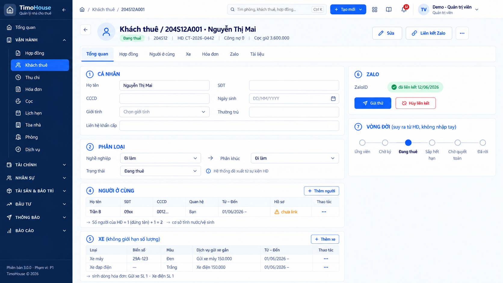
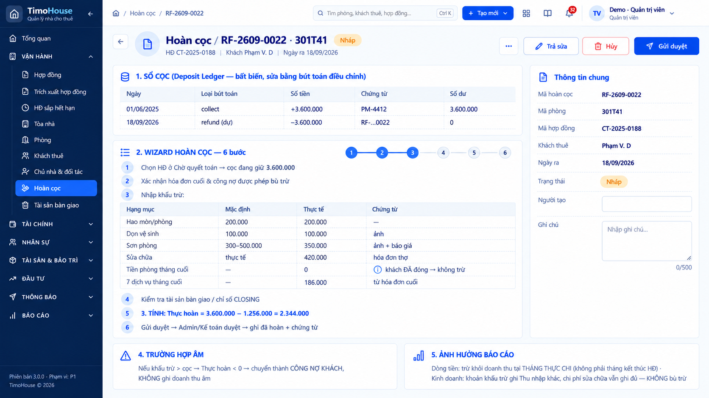

# TIMOHOUSE — SRS · Cụm Khách thuê & hợp đồng

**Phiên bản:** 1.0 · **Ngày lập:** 25/09/2026 · **Trạng thái:** DRAFT, chờ khách hàng xác nhận
**Phạm vi:** FR06 Khách thuê · FR07 Hợp đồng thuê · FR08 OCR/Data Onboarding · FR15 HĐ sắp hết/Gia hạn/Kết thúc · FR16 Cọc & hoàn cọc.

**Nguồn:** [`TimoHouse_UI_Mockup_Spec_v1.0.md`](TimoHouse_UI_Mockup_Spec_v1.0.md) (§4, §6.2, §7, §8.1 *Vòng đời khách thuê*, UI-06, UI-07, UI-08, UI-15, UI-16, §13 F-01 và F-04, §14, §15, §18); dữ liệu mẫu ở [`TimoHouse_Mockup_Seed_Data_v1.0.md`](TimoHouse_Mockup_Seed_Data_v1.0.md) §6, §7, §8; ảnh mockup ở [`ui-imagegen-v1/03-khach-thue-hop-dong/`](ui-imagegen-v1/03-khach-thue-hop-dong/README.md), kết luận từng ảnh theo [`AUDIT.md`](ui-imagegen-v1/AUDIT.md).

Quy ước đọc tài liệu và Common Rules 1–14 xem [`TimoHouse_SRS_v1.0.md`](TimoHouse_SRS_v1.0.md#common-rules-dùng-chung-cho-mọi-fr); tài liệu này chỉ dẫn chiếu, không lặp lại.

> **Tình trạng capture của cụm:** chỉ 2/5 ảnh dùng được: UI-06 và UI-16, cả hai ở mức ĐẠT CÓ LƯU Ý. Ba ảnh UI-07, UI-08, UI-15 KHÔNG ĐẠT theo AUDIT nên không nhúng; mô tả các màn đó dựng từ wireframe của spec. Chỗ ảnh lệch spec được ghi đỏ ngay tại field liên quan; **spec thắng ảnh**.

---

## Quy tắc chung của cụm

Các FR trong file này dẫn chiếu `Cluster Rule 03.N` thay vì lặp lại.

| Mã | Nội dung | Nguồn |
|---|---|---|
| Cluster Rule 03.1 | **Vòng đời khách thuê**: suy ra từ HĐ liên kết, không nhập tay, giữ lịch sử sau khi khách rời. Chuỗi: Ứng viên (chưa có HĐ) → Chờ ký → Đang thuê → Sắp hết hạn → Chờ quyết toán → Đã rời. HĐ bị hủy trước hiệu lực ghi sự kiện `Không tiếp tục`; chấm dứt sớm đi qua Chờ quyết toán. `Ứng viên` và `Không tiếp tục` là nhãn UI đề xuất, cần xác nhận nếu dùng làm trạng thái lưu trữ | §8.1, UI-06 ⑦ |
| Cluster Rule 03.2 | **Trạng thái HĐ thuê**: `Nháp → Chờ ký → Hiệu lực → Sắp hết → Chờ quyết toán → Kết thúc`; nhánh `Chờ ký → Hủy` và `Hiệu lực/Sắp hết → Phá HĐ → Chờ quyết toán`. Thao tác theo trạng thái (§14): Nháp được sửa, hủy; Chờ ký được trả sửa, duyệt; Hiệu lực được gia hạn, kết thúc, không sửa dữ liệu đã snapshot; Kết thúc chỉ xem, điều chỉnh bằng sự kiện | UI-07 State, §14 |
| Cluster Rule 03.3 | **Mô hình 3 lớp của HĐ**, UI không làm phẳng thành 1 bản ghi: • Đầu HĐ `CONTRACT` (bất biến): số HĐ, tòa/phòng, mã khách, ngày vào ở, HĐ trước/sau, nguồn tạo Tay/OCR • Phiên bản `CONTRACT_VERSION` (1 dòng = 1 lần ký/gia hạn): ngày ký, từ–đến, thời hạn, giá niêm yết/QL/giá chốt snapshot, kỳ TT, cọc, dịch vụ + đơn giá snapshot, xe, nội thất, điều khoản TT/gia hạn, file ký • Sự kiện vòng đời `CONTRACT_EVENT`: `new`, `renew`, `transfer`, `end`, `early_termination`, `abandon` | UI-07 |
| Cluster Rule 03.4 | **Ảnh hưởng đếm của sự kiện** (quyết định số liệu Report A; màn nào hiển thị sự kiện cũng phải hiển thị kèm ảnh hưởng đếm): • `new` · ngày vào ở · `NEW_ROOM_COUNT` +1 tại tháng vào ở, kể cả phòng cũ có khách mới (D-23) • `renew` · ngày hiệu lực phiên bản mới · không đếm • `transfer` · ngày đổi phòng · không đếm phòng mới, không đếm phá HĐ (D-26, R-18) • `end` · ngày ra thực tế · không đếm • `early_termination` · ngày ra thực tế hoặc ngày phát hiện bỏ trốn · `EARLY_TERMINATION_COUNT` +1 tại tháng có ngày ra (D-25) • `abandon` · ngày báo bỏ · không đếm phòng mới nếu chưa vào ở; cọc forfeit (D-27) | UI-07 |
| Cluster Rule 03.5 | **Sổ cọc (Deposit Ledger) bất biến**: mỗi dòng gồm HĐ/khách/phòng, loại bút toán, ngày, số tiền, chứng từ, số dư chạy, người tạo. Mọi thay đổi là bút toán mới loại `adjust`, không sửa dòng cũ. Cọc đi theo HĐ: đổi phòng thì cọc chuyển theo, gia hạn thì giữ số dư cọc; cả hai trường hợp **không thu cọc mới** | UI-16 ①, BR-2.06.4, BR-2.06.16 |
| Cluster Rule 03.6 | **Mã khách** = mã phòng + `A` + số thứ tự 3 chữ số, ví dụ `606T42A001`. Số thứ tự = số HĐ mới đã từng có của phòng + 1. Sinh khi HĐ chuyển `Chờ ký` (P-24, Decision Log #25, ASSUMED). Gia hạn giữ nguyên mã (BR-2.05.3); đổi phòng nội bộ cấp mã mới theo phòng đích nhưng giữ số thứ tự, mã cũ lưu lịch sử (BR-2.05.1, BR-2.05.2) | UI-06 |

---
---

# FR06 - Khách thuê

## 1. Business Rule

| | |
|:-:|---|
| **Authorization** | • Admin: toàn hệ thống, kể cả sửa dữ liệu nhạy cảm (CCCD, ngày sinh) • NVVH: khách của tòa được phân công (`BUILDING_ASSIGNMENT`, Common Rule 7); export không kèm cột CCCD/ngày sinh (BR-2.05.9) • Kế toán, TPVH, TNVH/Trưởng khu vực: ## (spec §4 không nêu quyền xem/sửa hồ sơ khách — cần xác nhận) • Cổ đông: không truy cập • Khách thuê không có tài khoản đăng nhập trong Phase 1 |
| **Management Rule** | • Người dùng xem danh sách, xem chi tiết, tạo, import và cập nhật hồ sơ khách thuê, cùng người ở cùng, xe, liên kết Zalo và tài liệu. Hồ sơ khách là nguồn của khách đứng tên HĐ thuê (FR07) • Chức năng chỉ thực hiện được khi người dùng đã đăng nhập với vai trò thuộc Authorization ## • Các cách tạo khách: &nbsp;&nbsp;◦ Tạo tay (Screen 06.3) &nbsp;&nbsp;◦ Import có preview, dò trùng CCCD/SĐT và ghép bản ghi (Common Rule 14) &nbsp;&nbsp;◦ Commit job OCR hợp đồng khách: tạo mới hoặc liên kết khách sau khi reviewer duyệt (refer to FR08, Screen 08.3) &nbsp;&nbsp;◦ Chọn/tạo khách ở bước 2 của wizard tạo HĐ (Screen 07.4) • Mã khách theo Cluster Rule 03.6; vòng đời khách theo Cluster Rule 03.1 • Dò trùng khi tạo: trùng CCCD thì **chặn** tạo mới và đề xuất dùng bản ghi cũ; trùng SĐT chỉ cảnh báo (BR-2.05.4, Đã chốt) • Phân khúc suy ra từ nghề nghiệp nhưng cho sửa • Trạng thái khách do hệ thống **đề xuất** từ sự kiện HĐ (`Sắp hết HĐ`, `Phá HĐ`, `Hoàn cọc`); người dùng ghi đè phải có lý do (BR-2.05.7, Cần chốt). Trạng thái khách là trường lưu, khác với nhãn vòng đời suy ra ở Cluster Rule 03.1 (cần danh sách đầy đủ giá trị trạng thái khách và quan hệ với nhãn vòng đời) • Số người của HĐ = 1 (đứng tên) + số người ở cùng đang hiệu lực. Đây là cơ sở tính nước, vệ sinh, máy giặt, điện chung. Thay đổi giữa kỳ áp dụng **từ kỳ hóa đơn kế tiếp** (BR-2.05.5, D-15, Cần chốt) • Xe **không giới hạn** số lượng. Mỗi xe gắn 1 dịch vụ gửi xe; dòng hóa đơn có SL = số xe cùng loại (BR-2.05.6, Đã chốt) • Zalo: 1 khách ↔ 1 ZaloID. Khách chưa liên kết được gắn cờ để FR17 chuyển sang phương án dự phòng (BR-2.05.11, R-35, Đã chốt) • Bulk update giới hạn trong phạm vi dữ liệu của người thao tác; có preview số bản ghi → xác nhận → audit batch và audit từng khách (BR-2.05.8, Đã chốt) • Export **không** kèm CCCD/ngày sinh nếu vai trò thiếu quyền; lưu điều kiện lọc, thời điểm, người export (BR-2.05.9, Đã chốt) • Merge 2 khách: giữ ID đích, chuyển toàn bộ HĐ/payment/cọc sang bản ghi đích; bản ghi nguồn **đánh dấu merged, không xóa** (BR-2.05.10, Cần chốt) • Dữ liệu nhạy cảm che theo Common Rule 2 • Chuyển nhượng HĐ cho người khác (đổi người thuê trên cùng phòng) chưa có loại sự kiện tương ứng (P-34) — cần chốt cách xử lý hồ sơ khách khi đổi người đứng tên |
| **Management Impact** | • Xem danh sách/chi tiết, tìm kiếm, lọc không làm thay đổi dữ liệu • Tạo khách: tạo `CUSTOMER` với vòng đời `Ứng viên`; mã khách chưa sinh cho tới khi có HĐ `Chờ ký` (cần xác nhận hiển thị gì ở ô mã khách trước thời điểm đó) • HĐ chuyển `Chờ ký`: sinh mã khách theo Cluster Rule 03.6 • Thêm/kết thúc người ở cùng: cập nhật số người của HĐ, áp dụng từ kỳ hóa đơn kế tiếp (refer to FR12) • Thêm/kết thúc xe: tạo/cập nhật `CONTRACT_VEHICLE` gắn dịch vụ gửi xe; dòng gửi xe của hóa đơn cập nhật SL • Ghi đè trạng thái: lưu giá trị đề xuất, giá trị mới và lý do • Merge: chuyển HĐ/payment/cọc sang bản ghi đích; bản ghi nguồn chuyển `merged` • Bulk update: ghi 1 audit batch và audit cho từng khách • Export: ghi log điều kiện lọc, thời điểm, người export • Liên kết Zalo: lưu ZaloID và ngày liên kết; hủy liên kết thì gắn lại cờ chưa liên kết • Mọi thao tác ghi audit theo Common Rule 5 |

## 2. Screen 06.1: Danh sách khách thuê

Chưa có capture — cần bổ sung. Nội dung dựng từ spec (mục Danh sách và Cột của UI-06).

<b>Screen 06.1: Danh sách khách thuê</b>

| **Fields** | **Format** | **Required?** | **Description** |
|:-:|:-:|:-:|:-:|
| Left Menu, Header | | | • Display follows Common Rule 1 • Highlight menu `Khách thuê` • Breadcrumb: `Trang chủ / Khách thuê & hợp đồng / Khách thuê` |
| 🟧 Quản lý khách thuê | | | |
| Tiêu đề trang | Text | No | • Hiển thị "Khách thuê" kèm tổng số khách trong phạm vi quyền (cần nội dung chính xác) |
| + Khách thuê | Button | No | • Always display • Enabled only when người dùng có quyền tạo khách (Common Rule 7) • Click on -> Go to Tạo khách thuê (Screen 06.3) |
| Import | Button | No | • Always display • Enabled only when người dùng có quyền tạo khách • Click on -> Mở luồng import khách theo Common Rule 14 (Screen ## — spec không có phác họa; cần xác nhận dùng chung màn Import jobs của FR33 hay màn riêng) |
| Xuất | Button | No | • Always display • Always enabled • Click on -> Display lựa chọn phạm vi xuất (§7.1): &nbsp;&nbsp;◦ Đã chọn: chỉ các dòng đang tick &nbsp;&nbsp;◦ Toàn bộ kết quả lọc • Vai trò thiếu quyền: file xuất không có cột CCCD và ngày sinh (BR-2.05.9) • Định dạng file: ## (CSV/XLSX?) |
| 🟧 Filter section | | | • Tiêu chí phản ánh lên URL (Common Rule 6) • Chưa có capture để xác định dạng bộ lọc (inline hay popup); danh sách giá trị dưới đây lấy từ spec |
| Phạm vi | Dropdown | No | • Default selection: toàn bộ phạm vi quyền của người dùng • Click on -> Display danh sách đơn vị tổ chức → nhân sự → tòa theo scope (§6.1) • Allow single selection only • Select an option -> Search for all records thuộc phạm vi đã chọn |
| Tòa / phòng | Dropdown | No | • Default selection: Tất cả • Click on -> Display the list of options: Tất cả + các tòa trong phạm vi quyền; chọn tòa rồi chọn phòng • Allow single selection only • Select an option -> Search for all records có HĐ tại tòa/phòng đã chọn |
| Trạng thái | Dropdown | No | • Default selection: Tất cả • Click on -> Display the list of options: Tất cả + ## (spec chỉ ghi "status" — cần xác nhận lọc theo trạng thái khách BR-2.05.7 hay nhãn vòng đời Cluster Rule 03.1) • Allow single selection only • Select an option -> Search for all records with Trạng thái = selected option |
| HĐ hiệu lực | Dropdown | No | • Default selection: Tất cả • Click on -> Display the list of options: Tất cả, Có, Không • Select an option -> Search for all records có/không có HĐ ở trạng thái Hiệu lực hoặc Sắp hết |
| Công nợ | Dropdown | No | • Default selection: Tất cả • Click on -> Display the list of options: Tất cả, Có công nợ, Không có công nợ (cần xác nhận có lọc theo tuổi nợ không) • Select an option -> Search for all records with công nợ thỏa điều kiện |
| Chờ hoàn cọc | Dropdown | No | • Default selection: Tất cả • Click on -> Display the list of options: Tất cả, Có, Không • Có: khách có phiếu hoàn cọc chưa ở trạng thái Đã hoàn (refer to FR16) • Select an option -> Search for all records thỏa điều kiện |
| Zalo | Dropdown | No | • Default selection: Tất cả • Click on -> Display the list of options: Tất cả, Đã liên kết, Chưa liên kết • Select an option -> Search for all records with trạng thái liên kết Zalo = selected option |
| Vai trò | Dropdown | No | • Default selection: Tất cả • Click on -> Display the list of options: Tất cả, Đứng tên, Người ở cùng • Select an option -> Search for all records with vai trò trên HĐ = selected option |
| Search box | Textbox | No | • Placeholder: ## (ví dụ "Tên, SĐT, CCCD, mã khách..." — cần xác nhận) • Max length: 255 characters • Allow entering all types of characters • Cut off the spaces before and after the keyword before performing search • Nhập từ khóa -> sau 300ms (Common Rule 6) Search for all records which satisfy at least one of the following criteria: &nbsp;&nbsp;◦ Mã khách = keyword (Absolute search) &nbsp;&nbsp;◦ Họ tên contains keyword (Relative search) &nbsp;&nbsp;◦ SĐT = keyword (Absolute search) &nbsp;&nbsp;◦ CCCD = keyword (Absolute search) |
| 🟧 Bulk action bar | | | • Display only when có ít nhất 1 dòng được tick (§7.1) • Hiển thị số dòng đang chọn |
| Cập nhật hàng loạt | Button | No | • Display only when có ít nhất 1 dòng được tick • Enabled only when người dùng có quyền sửa khách • Click on -> Display Popup cập nhật hàng loạt (Screen 06.9) |
| 🟦 Danh sách khách thuê | | | • Display the list of khách trong phạm vi quyền • Giá trị trống hiển thị `—` (Common Rule 3) • If there are no khách in the system, display error message E## kèm CTA theo quyền (Common Rule 13) • If no record matches the search and filter criteria, display error message E## kèm bộ lọc đang áp và `Reset filter` • Default sorting: ## (cần xác nhận khóa sắp xếp mặc định và cột sortable) • Phân trang theo Common Rule 6 • Click on một dòng -> Go to Chi tiết khách thuê (Screen 06.2) • Một người có thể xuất hiện ở vai trò Đứng tên hoặc Người ở cùng (cần xác nhận người ở cùng chưa link hồ sơ có hiện thành dòng riêng không) |
| Chọn dòng | Checkbox | No | • Always display • Default status: Unchecked • Tick the checkbox -> Thêm dòng vào vùng chọn, hiện Bulk action bar • Untick the checkbox -> Bỏ dòng khỏi vùng chọn • Checkbox ở header: ## (chọn trang hiện tại hay toàn bộ kết quả lọc?) |
| Mã khách | Text | No | • Mã khách theo Cluster Rule 03.6 • Chưa sinh mã: `—` |
| Tên / SĐT | Text | No | • Dòng 1: họ tên • Dòng 2: SĐT, che theo Common Rule 2 |
| Phòng / tòa hiện tại | Text | No | • Phòng và tòa theo HĐ đang hiệu lực • Không có HĐ hiệu lực: `—` |
| Vai trò | Text | No | • Đứng tên hoặc Người ở cùng |
| HĐ / trạng thái | Text | No | • Số HĐ kèm Tag trạng thái HĐ (Cluster Rule 03.2, Common Rule 4) |
| Số người / xe | Text | No | • Số người của HĐ và số xe đang gắn, ví dụ "2 · 2" |
| Công nợ | Number | No | • Công nợ hiện tại của khách, định dạng Common Rule 8 |
| Cọc giữ | Number | No | • Số dư sổ cọc của HĐ đang gắn (Cluster Rule 03.5), định dạng Common Rule 8 |
| Zalo | Tag | No | • Đã liên kết / Chưa liên kết (Common Rule 4) |
| Quản lý | Text | No | • Quản lý phụ trách chính của tòa tại ngày xem |
| Cập nhật | Text | No | • Thời điểm cập nhật gần nhất. Format: DD/MM/YYYY hh:mm |
| Page number | Text | No | • Click on a page number -> Go to the corresponding page |

## 3. Screen 06.2: Chi tiết khách thuê

<b>Screen 06.2: Chi tiết khách thuê</b>

| **Fields** | **Format** | **Required?** | **Description** |
|:-:|:-:|:-:|:-:|
| Left Menu, Header | | | • Display follows Common Rule 1 • Highlight menu `Khách thuê` • Breadcrumb: `Trang chủ / Khách thuê & hợp đồng / Khách thuê / {Mã khách}` • Capture lệch spec: sidebar dùng nhóm "Vận hành / Tài chính / Tài sản & bảo trì…" thay cho 9 cụm của §6.2, topbar có nút primary "+ Tạo mới" và thiếu bộ chọn Kỳ; mô tả theo spec (Common Rule 1) |
| Back | Icon | No | • Always display • Click on -> Quay lại Danh sách khách thuê (Screen 06.1), giữ bộ lọc và vị trí cuộn (§6.1) |
| Tiêu đề | Text | No | • Hiển thị "Khách thuê / {Mã khách} · {Họ tên}" • Dòng phụ: Tag trạng thái khách · {Mã phòng} · HĐ {Số HĐ} · Công nợ {số tiền} · Cọc giữ {số tiền}, ví dụ theo wireframe: "Đang thuê · 204S12 · HĐ CT-2026-0442 · Công nợ 0 · Cọc giữ 3.600.000" • Mâu thuẫn spec: CT-2026-0442 ở UI-06 là phòng 204S12, nhưng ở UI-07 và UI-15 là phòng 302G6 (khách Ng. T. Mai); cần thống nhất dữ liệu mẫu • Capture lệch spec: Tag trạng thái chỉ có chữ, không có icon; mô tả theo Common Rule 4 |
| Sửa | Button | No | • Always display • Enabled only when người dùng có quyền sửa khách (Common Rule 7) • Click on -> ## (bật sửa tại chỗ các vùng ②③ hay mở Screen 06.3 ở chế độ sửa? Capture vẽ vùng ② dạng ô nhập) |
| Liên kết Zalo | Button | No | • Display only when khách chưa liên kết Zalo (capture vẫn hiện nút khi đã liên kết — cần xác nhận) • Enabled only when người dùng có quyền sửa khách • Click on -> ## (spec chưa mô tả cách liên kết: quét QR follow OA hay nhập ZaloID; Screen ##) |
| ⋯ | Button | No | • Always display • Always enabled • Click on -> Display a dropdown for actions: &nbsp;&nbsp;◦ Merge trùng: Enabled only when người dùng có quyền merge (cần xác nhận vai trò). Click on -> Display Popup merge khách trùng (Screen 06.8) &nbsp;&nbsp;◦ Export: Click on -> Xuất hồ sơ khách; ẩn CCCD/ngày sinh nếu vai trò thiếu quyền (BR-2.05.9). Định dạng file ## &nbsp;&nbsp;◦ Gắn HĐ: Click on -> ## (spec liệt kê action "gắn HĐ" nhưng không mô tả) &nbsp;&nbsp;◦ Các action khác trong menu: ## (cần capture dropdown) |
| Tổng quan | Tab | No | • Default tab • Highlight the tab while being selected • Click on -> Go to Tổng quan |
| Hợp đồng | Tab | No | • Highlight the tab while being selected • Click on -> Go to Hợp đồng: danh sách HĐ của khách, kể cả HĐ đã kết thúc (refer to FR07) • Cần capture nội dung tab |
| Người ở cùng | Tab | No | • Highlight the tab while being selected • Click on -> Go to Người ở cùng • Cần capture nội dung tab (khác gì so với vùng ④ của tab Tổng quan?) |
| Xe | Tab | No | • Highlight the tab while being selected • Click on -> Go to Xe • Cần capture nội dung tab |
| Hóa đơn | Tab | No | • Highlight the tab while being selected • Click on -> Go to Hóa đơn của khách (refer to FR12) • Cần capture nội dung tab |
| Zalo | Tab | No | • Highlight the tab while being selected • Click on -> Go to Zalo: ZaloID/follow OA, ngày liên kết, trạng thái, lịch sử gửi/phản hồi (refer to FR17) • Cần capture nội dung tab |
| Tài liệu | Tab | No | • Highlight the tab while being selected • Click on -> Go to Tài liệu: CCCD mặt trước/sau, tạm trú, tài liệu khác • Cần capture nội dung tab |
| 🟧 Tab Tổng quan | | | • Capture lệch spec: đánh số vùng ① Cá nhân, ② Phân loại, trong khi spec là ② Cá nhân, ③ Phân loại; mô tả theo spec |
| 🟧 ② Cá nhân | | | • Capture không đánh dấu `*` cho trường nào; tạm đặt Họ tên, SĐT, CCCD là bắt buộc vì là khóa dò trùng (BR-2.05.4) — cần xác nhận |
| Họ tên | Textbox | Yes | • Display họ tên khách • Allow entering all types of characters. Max length: 255 • If clicking out of the field while it is blank -> Show error message E## |
| SĐT | Textbox | Yes | • Display SĐT, che theo Common Rule 2 khi xem • Allow entering numeric values. Max length: ## • If clicking out of the field while it is blank -> Show error message E## • Trùng SĐT khách khác -> chỉ cảnh báo, không chặn (BR-2.05.4) |
| CCCD | Textbox | Yes | • Display số CCCD, che theo Common Rule 2 khi xem • Allow entering numeric values. Max length: ## (12 số? cần xác nhận) • If clicking out of the field while it is blank -> Show error message E## • Trùng CCCD khách khác -> chặn lưu, Display Popup khách thuê có thể bị trùng (Screen 06.4) |
| Ngày sinh | Datepicker | No | • Placeholder: "DD/MM/YYYY" • Default selection: None • Disable future dates • Vai trò thiếu quyền: không có trong file export (BR-2.05.9) |
| Giới tính | Dropdown | No | • Placeholder: "Chọn giới tính" • Default selection: None • Click on -> Display the list of following options: ## (cần danh mục) • Allow single selection only |
| Thường trú | Textbox | No | • Allow entering all types of characters. Max length: 255 |
| Liên hệ khẩn cấp | Textbox | No | • Allow entering all types of characters. Max length: 255 • Cần xác nhận là một ô tự do hay gồm tên + SĐT + quan hệ |
| 🟧 ③ Phân loại | | | |
| Nghề nghiệp | Dropdown | No | • Default selection: None; ví dụ trên wireframe "Đi làm" • Click on -> Display the list of following options: ## (cần danh mục nghề nghiệp) • Allow single selection only • Select an option -> Đề xuất Phân khúc tương ứng |
| Phân khúc | Dropdown | No | • Default selection: giá trị suy ra từ Nghề nghiệp • Click on -> Display the list of following options: ## (cần danh mục phân khúc và bảng map nghề nghiệp → phân khúc) • Allow single selection only • Select an option -> Ghi đè phân khúc đề xuất |
| Trạng thái | Dropdown | No | • Default selection: trạng thái hệ thống đề xuất từ sự kiện HĐ (BR-2.05.7) • Ghi chú cố định bên cạnh: "ⓘ Hệ thống đề xuất từ sự kiện HĐ" • Click on -> Display the list of following options: ## (spec chỉ nêu Đang thuê, Sắp hết HĐ, Phá HĐ, Hoàn cọc — cần danh sách đầy đủ) • Allow single selection only • Select an option khác giá trị đề xuất -> Display Popup ghi đè trạng thái khách (Screen 06.7) |
| 🟧 ④ Người ở cùng | | | |
| + Thêm người | Button | No | • Always display • Enabled only when khách có HĐ ở trạng thái Nháp, Chờ ký, Hiệu lực hoặc Sắp hết và người dùng có quyền sửa (cần xác nhận) • Click on -> Display Popup thêm người ở cùng (Screen 06.5) |
| 🟦 Bảng người ở cùng | | | • Display the list of người ở cùng trên HĐ hiện hành, kể cả người đã kết thúc (có ngày Đến) • Không phân trang • Không có người ở cùng: E## • Dòng tổng kết ngay dưới bảng, luôn hiển thị: "→ Số người của HĐ = 1 (đứng tên) + {n} = {tổng} → cơ sở tính nước/vệ sinh" (BR-2.05.5) |
| Họ tên | Text | No | • Họ tên người ở cùng |
| SĐT | Text | No | • SĐT, che theo Common Rule 2 |
| CCCD | Text | No | • CCCD, che theo Common Rule 2 |
| Quan hệ | Text | No | • Quan hệ với người đứng tên, ví dụ "Bạn" |
| Từ – Đến | Text | No | • Khoảng thời gian ở. Format: DD/MM/YYYY – DD/MM/YYYY • Chưa có ngày Đến: để trống sau dấu "–" (đang ở) |
| Hồ sơ | Tag | No | • Đã link: người ở cùng đã gắn với một hồ sơ khách • △ Chưa link: chưa gắn hồ sơ • Click on Tag "chưa link" -> ## (mở tìm/ghép hồ sơ?) |
| Thao tác | Icon | No | • Capture có cột "Thao tác ⋯" nhưng spec không mô tả — cần danh sách action (sửa, kết thúc ở cùng?) |
| 🟧 ⑤ Xe (không giới hạn số lượng) | | | |
| + Thêm xe | Button | No | • Always display • Enabled only when khách có HĐ ở trạng thái Nháp, Chờ ký, Hiệu lực hoặc Sắp hết và người dùng có quyền sửa (cần xác nhận) • Click on -> Display Popup thêm xe (Screen 06.6) |
| 🟦 Bảng xe | | | • Display the list of xe gắn với HĐ hiện hành; không phân trang • Không có xe: E## • Dòng tổng kết ngay dưới bảng: "→ sinh dòng hóa đơn: {dịch vụ} SL {n} · …", ví dụ "Gửi xe SL 1 · Xe điện SL 1" (BR-2.05.6) |
| Loại | Text | No | • Loại xe, ví dụ Xe máy, Xe đạp điện |
| Biển số | Text | No | • Biển số; xe không có biển (ví dụ xe đạp điện) hiển thị `—` |
| Màu | Text | No | • Màu xe |
| Dịch vụ gửi xe gắn | Text | No | • Tên dịch vụ và đơn giá (Common Rule 8), ví dụ "Gửi xe máy 150.000" |
| Từ – Đến | Text | No | • Khoảng thời gian gửi. Format: DD/MM/YYYY – DD/MM/YYYY |
| Thao tác | Icon | No | • Capture có cột "Thao tác ⋯" nhưng spec không mô tả — cần danh sách action |
| 🟧 ⑥ Zalo | | | |
| ZaloID | Tag | No | • Đã liên kết: Tag "đã liên kết {DD/MM/YYYY}" kèm icon ✓ • Chưa liên kết: Tag cảnh báo; khách được gắn cờ để FR17 dùng phương án dự phòng (BR-2.05.11) |
| Gửi thử | Button | No | • Display only when đã liên kết • Enabled only when người dùng có quyền gửi Zalo • Click on -> ## (gửi tin mẫu nào, hiển thị kết quả ở đâu? refer to FR17) |
| Hủy liên kết | Button | No | • Display only when đã liên kết • Enabled only when người dùng có quyền sửa khách • Click on -> Display popup xác nhận hủy liên kết (Screen ## — spec chưa mô tả; cần xác nhận có bắt buộc lý do) |
| 🟧 ⑦ Vòng đời (suy ra từ HĐ, không nhập tay) | | | |
| Vòng đời | Image | No | • Hiển thị 6 mốc theo Cluster Rule 03.1: Ứng viên → Chờ ký → Đang thuê → Sắp hết hạn → Chờ quyết toán → Đã rời • Mốc hiện tại đánh dấu ●, các mốc khác ○ • Chỉ đọc, không click được • Cần xác nhận cách hiển thị sự kiện Không tiếp tục (HĐ bị hủy trước hiệu lực) trên dải mốc |

## 4. Screen 06.3: Tạo khách thuê

Chưa có capture — cần bổ sung. Nội dung dựng từ spec (Field chi tiết của UI-06).

<b>Screen 06.3: Tạo khách thuê</b>

| **Fields** | **Format** | **Required?** | **Description** |
|:-:|:-:|:-:|:-:|
| Left Menu, Header | | | • Display follows Common Rule 1 • Highlight menu `Khách thuê` • Breadcrumb: `Trang chủ / Khách thuê & hợp đồng / Khách thuê / Tạo khách` • Cần xác nhận dạng màn: trang riêng hay drawer (§7.3: form ngắn dùng modal/drawer, form từ 3 nhóm field dùng trang) |
| Back | Button | No | • Always appear • Always enabled • Click on -> check if there are any changes made to input &nbsp;&nbsp;◦ If there are not -> go back to the previous screen &nbsp;&nbsp;◦ If there are -> display a confirmation popup (Common Rule 9) (Provide screen capture ##) (Screen ##) |
| 🟧 Cá nhân | | | |
| Họ tên | Textbox | Yes | • Always display • Placeholder: ## • Allow entering all types of characters. Max length: 255 • If clicking out of the field while it is blank -> Show error message E## |
| SĐT | Textbox | Yes | • Always display • Allow entering numeric values. Max length: ## • If clicking out of the field while it is blank -> Show error message E## • Rời field -> dò trùng theo SĐT; trùng -> Display Popup khách thuê có thể bị trùng (Screen 06.4), trường hợp cảnh báo |
| CCCD | Textbox | Yes | • Always display • Allow entering numeric values. Max length: ## • If clicking out of the field while it is blank -> Show error message E## • Rời field -> dò trùng theo CCCD; trùng -> Display Popup khách thuê có thể bị trùng (Screen 06.4), trường hợp chặn |
| Ngày sinh | Datepicker | No | • Always display • Placeholder: "DD/MM/YYYY" • Default selection: None • Disable future dates |
| Giới tính | Dropdown | No | • Always display • Placeholder: "Chọn giới tính" • Default selection: None • Click on -> Display the list of following options: ## • Allow single selection only |
| Thường trú | Textbox | No | • Always display • Allow entering all types of characters. Max length: 255 |
| Liên hệ khẩn cấp | Textbox | No | • Always display • Allow entering all types of characters. Max length: 255 |
| 🟧 Phân loại | | | |
| Nghề nghiệp | Dropdown | No | • Always display • Default selection: None • Click on -> Display the list of following options: ## • Allow single selection only • Select an option -> Điền sẵn Phân khúc tương ứng |
| Phân khúc | Dropdown | No | • Always display • Default selection: giá trị suy ra từ Nghề nghiệp; cho sửa • Click on -> Display the list of following options: ## • Allow single selection only |
| 🟧 Tài liệu | | | |
| CCCD mặt trước, CCCD mặt sau | File uploader | No | • Instruction text: ## • Allow dragging and dropping file, as well as uploading from local device • Click on "Upload" -> Display a popup to select file from local device (Screen capture ##) • Supported file format: ##. If the selected file is in an unsupported format, display error message E## • Maximum file size: ##. If the file size exceeds the limit, show error message E## • If the file is of valid format and size, display the selected file in the frame |
| Tạm trú, Tài liệu khác | File uploader | No | • Quy tắc như CCCD mặt trước/sau |
| Hủy | Button | No | • Always appear • Always enabled • Click on -> Giống nút Back |
| Lưu | Button | No | • Always appear • Always enabled • Click on -> Validate in the following order: &nbsp;&nbsp;◦ If there are any fields with invalid values, display error messages as mentioned above &nbsp;&nbsp;◦ Trùng CCCD -> Display Popup khách thuê có thể bị trùng (Screen 06.4), không cho lưu bản ghi mới &nbsp;&nbsp;◦ Trùng SĐT chưa được người dùng xác nhận -> Display Popup khách thuê có thể bị trùng (Screen 06.4) &nbsp;&nbsp;◦ If all conditions above are satisfied -> Tạo khách, hiển thị toast thành công và Go to Chi tiết khách thuê (Screen 06.2) |

## 5. Screen 06.4: Popup khách thuê có thể bị trùng

Chưa có capture — cần bổ sung. Nội dung dựng từ spec.

<b>Screen 06.4.1: Popup khách thuê có thể bị trùng (Trùng CCCD — chặn)</b>

<b>Screen 06.4.2: Popup khách thuê có thể bị trùng (Trùng SĐT — cảnh báo)</b>

| **Fields** | **Format** | **Required?** | **Description** |
|:-:|:-:|:-:|:-:|
| 🟧 The popup can be closed by the X icon or by clicking out of the popup. Closing the popup redirects the user to the underlying screen without any changes saved. (cần xác nhận popup có X icon) | | | |
| Message | Text | No | • Trùng CCCD: Content format "##", nêu rõ không thể tạo khách mới cùng CCCD (BR-2.05.4) • Trùng SĐT: Content format "##", nêu rõ chỉ là cảnh báo |
| Bản ghi trùng | Text | No | • Hiển thị mã khách, họ tên, SĐT/CCCD (che theo Common Rule 2), phòng/HĐ hiện tại của khách đang có trong hệ thống • Nhiều bản ghi trùng: ## (cần cách hiển thị) |
| Dùng bản ghi có sẵn | Button | No | • Always appear • Always enabled • Click on -> Đóng popup, không tạo bản ghi mới: &nbsp;&nbsp;◦ Đang ở Screen 06.3: Go to Chi tiết khách thuê (Screen 06.2) của bản ghi có sẵn &nbsp;&nbsp;◦ Đang ở wizard tạo HĐ (Screen 07.4): chọn bản ghi có sẵn làm khách đứng tên |
| Vẫn tạo | Button | No | • Only appear when trùng SĐT (Screen 06.4.2); không bao giờ hiện khi trùng CCCD • Always enabled (cần xác nhận có bắt buộc lý do như chủ nhà ở FR02 không) • Click on -> Đóng popup, tiếp tục tạo khách mới; ghi audit |
| Hủy | Button | No | • Always appear • Always enabled • Click on -> Đóng popup, quay lại màn đang nhập, giữ dữ liệu đã nhập |

## 6. Screen 06.5: Popup thêm người ở cùng

Chưa có capture — cần bổ sung. Nội dung dựng từ spec.

<b>Screen 06.5: Popup thêm người ở cùng</b>

| **Fields** | **Format** | **Required?** | **Description** |
|:-:|:-:|:-:|:-:|
| 🟧 The popup can be closed by the X icon or by clicking out of the popup. Closing the popup redirects the user to the underlying screen without any changes saved. (cần xác nhận popup có X icon) | | | |
| Liên kết hồ sơ khách | Dropdown | No | • Always display • Placeholder: ## • Default selection: None • Click on -> cho nhập từ khóa để tìm khách có sẵn theo họ tên, SĐT, CCCD, mã khách (Max length 255; cắt khoảng trắng đầu/cuối) • Select an option -> Điền Họ tên/SĐT/CCCD từ hồ sơ; người ở cùng có Hồ sơ = Đã link • Để trống -> người ở cùng có Hồ sơ = Chưa link |
| Họ tên | Textbox | Yes | • Always display • Allow entering all types of characters. Max length: 255 • If clicking out of the field while it is blank -> Show error message E## |
| SĐT | Textbox | No | • Always display • Allow entering numeric values. Max length: ## |
| CCCD | Textbox | No | • Always display • Allow entering numeric values. Max length: ## • Cần xác nhận có dò trùng CCCD với khách khác không |
| Quan hệ | Dropdown | No | • Always display • Default selection: None • Click on -> Display the list of following options: ## (wireframe chỉ có ví dụ "Bạn") • Allow single selection only |
| Từ ngày | Datepicker | Yes | • Always display • Default selection: None • If clicking out of the field while it is blank -> Show error message E## • If an end date is selected, disable all dates after the specified end date |
| Đến ngày | Datepicker | No | • Always display • Default selection: None (đang ở) • If a start date is selected, disable all dates before the specified start date |
| Ghi chú số người | Text | No | • Always display • Content format: "Số người của HĐ sau khi thêm = {tổng}. Thay đổi áp dụng từ kỳ hóa đơn kế tiếp." (BR-2.05.5) (cần nội dung chính xác) • Tổng số người > sức chứa phòng -> hiển thị cảnh báo, không chặn (BR-2.04.11, D-17); phần vượt thu qua dòng Thu khác của hóa đơn |
| Hủy | Button | No | • Always appear • Always enabled • Click on -> Đóng popup, không lưu |
| Lưu | Button | No | • Always appear • Always enabled • Click on -> Validate in the following order: &nbsp;&nbsp;◦ If there are any fields with invalid values, display error messages as mentioned above &nbsp;&nbsp;◦ If all conditions above are satisfied -> Lưu người ở cùng, đóng popup, cập nhật bảng ④ và dòng tổng kết số người ở Screen 06.2 |

## 7. Screen 06.6: Popup thêm xe

Chưa có capture — cần bổ sung. Nội dung dựng từ spec.

<b>Screen 06.6: Popup thêm xe</b>

| **Fields** | **Format** | **Required?** | **Description** |
|:-:|:-:|:-:|:-:|
| 🟧 The popup can be closed by the X icon or by clicking out of the popup. Closing the popup redirects the user to the underlying screen without any changes saved. (cần xác nhận popup có X icon) | | | |
| Loại xe | Dropdown | Yes | • Always display • Default selection: None • If clicking out of field while it is blank -> Show error message E## • Click on -> Display the list of following options: ## (wireframe có Xe máy, Xe đạp điện — cần danh mục đầy đủ) • Allow single selection only • Select an option -> Lọc danh sách Dịch vụ gửi xe phù hợp loại xe |
| Biển số | Textbox | No | • Always display • Allow entering all types of characters. Max length: ## • Để trống với xe có biển -> ## (OCR coi "thiếu biển số" là cảnh báo nhẹ; cần xác nhận ở form tay chỉ cảnh báo hay bắt buộc) |
| Màu | Textbox | No | • Always display • Allow entering all types of characters. Max length: 255 |
| Dịch vụ gửi xe | Dropdown | Yes | • Always display • Default selection: None • If clicking out of field while it is blank -> Show error message E## • Click on -> Display danh sách dịch vụ gửi xe có giá hiệu lực tại tòa của HĐ, kèm đơn giá (refer to FR09) • Allow single selection only. Mỗi xe gắn đúng 1 dịch vụ (BR-2.05.6) |
| Từ ngày | Datepicker | Yes | • Always display • Default selection: None • If clicking out of field while it is blank -> Show error message E## • If an end date is selected, disable all dates after the specified end date |
| Đến ngày | Datepicker | No | • Always display • Default selection: None • If a start date is selected, disable all dates before the specified start date |
| Hủy | Button | No | • Always appear • Always enabled • Click on -> Đóng popup, không lưu |
| Lưu | Button | No | • Always appear • Always enabled • Click on -> Validate in the following order: &nbsp;&nbsp;◦ If there are any fields with invalid values, display error messages as mentioned above &nbsp;&nbsp;◦ If all conditions above are satisfied -> Lưu xe, đóng popup, cập nhật bảng ⑤ và dòng tổng kết "sinh dòng hóa đơn" ở Screen 06.2 |

## 8. Screen 06.7: Popup ghi đè trạng thái khách

Chưa có capture — cần bổ sung. Nội dung dựng từ spec (BR-2.05.7).

<b>Screen 06.7: Popup ghi đè trạng thái khách</b>

| **Fields** | **Format** | **Required?** | **Description** |
|:-:|:-:|:-:|:-:|
| 🟧 The popup can be closed by the X icon or by clicking out of the popup. Closing the popup redirects the user to the underlying screen without any changes saved. (cần xác nhận popup có X icon) | | | |
| Message | Text | No | • Content format: "##" (cần nội dung chính xác); nêu rõ đang ghi đè giá trị hệ thống đề xuất |
| Trạng thái đề xuất | Text | No | • Display trạng thái hệ thống đề xuất và sự kiện HĐ làm căn cứ |
| Trạng thái mới | Text | No | • Display giá trị người dùng vừa chọn ở Screen 06.2 |
| Lý do | Textbox | Yes | • Always display • Allow entering all types of characters. Max length: 255 • If clicking out of the field while it is blank -> Show error message E## |
| Hủy | Button | No | • Always appear • Always enabled • Click on -> Đóng popup, Trạng thái ở Screen 06.2 trở về giá trị trước đó |
| Xác nhận | Button | No | • Always appear • Enabled only when đã nhập Lý do • Click on -> Lưu trạng thái mới và lý do, ghi audit, đóng popup |

## 9. Screen 06.8: Popup merge khách trùng

Chưa có capture — cần bổ sung. Nội dung dựng từ spec (BR-2.05.10).

<b>Screen 06.8: Popup merge khách trùng</b>

| **Fields** | **Format** | **Required?** | **Description** |
|:-:|:-:|:-:|:-:|
| 🟧 The popup can be closed by the X icon or by clicking out of the popup. Closing the popup redirects the user to the underlying screen without any changes saved. (cần xác nhận popup có X icon) | | | |
| Message | Text | No | • Content format: "##"; nêu rõ bản ghi nguồn được đánh dấu merged, không bị xóa |
| Bản ghi nguồn | Text | No | • Display khách đang mở: mã, họ tên, SĐT/CCCD (che) (cần xác nhận khách đang mở luôn là nguồn hay người dùng chọn chiều merge) |
| Bản ghi đích | Dropdown | Yes | • Always display • Placeholder: ## • Default selection: None • If clicking out of field while it is blank -> Show error message E## • Click on -> cho nhập từ khóa tìm khách theo họ tên, SĐT, CCCD, mã khách trong phạm vi quyền • Allow single selection only • Select an option -> Hiển thị Dữ liệu sẽ chuyển |
| Dữ liệu sẽ chuyển | Text | No | • Display only when đã chọn Bản ghi đích • Liệt kê số HĐ, payment, bút toán cọc sẽ chuyển sang bản ghi đích |
| Lý do | Textbox | Yes | • Always display • Allow entering all types of characters. Max length: 255 • If clicking out of the field while it is blank -> Show error message E## (spec không nêu bắt buộc — đề xuất theo Common Rule 5) |
| Hủy | Button | No | • Always appear • Always enabled • Click on -> Đóng popup, không thay đổi dữ liệu |
| Merge | Button | No | • Always appear • Enabled only when đã chọn Bản ghi đích và nhập Lý do • Click on -> Chuyển toàn bộ HĐ/payment/cọc sang bản ghi đích, giữ ID đích, đánh dấu bản ghi nguồn `merged`, ghi audit, đóng popup và Go to Chi tiết khách thuê (Screen 06.2) của bản ghi đích |

## 10. Screen 06.9: Popup cập nhật hàng loạt

Chưa có capture — cần bổ sung. Nội dung dựng từ spec (BR-2.05.8).

<b>Screen 06.9: Popup cập nhật hàng loạt</b>

| **Fields** | **Format** | **Required?** | **Description** |
|:-:|:-:|:-:|:-:|
| 🟧 The popup can be closed by the X icon or by clicking out of the popup. Closing the popup redirects the user to the underlying screen without any changes saved. (cần xác nhận popup có X icon) | | | |
| Trường cập nhật | Dropdown | Yes | • Always display • Default selection: None • If clicking out of field while it is blank -> Show error message E## • Click on -> Display the list of following options: ## (spec không nêu trường nào được bulk update) • Allow single selection only • Select an option -> Hiển thị ô Giá trị mới đúng kiểu của trường |
| Giá trị mới | Dropdown | Yes | • Display only when đã chọn Trường cập nhật • Kiểu control theo trường đã chọn • If clicking out of field while it is blank -> Show error message E## |
| Preview | Text | No | • Always display • Content format: "{n} khách sẽ được cập nhật" (cần nội dung chính xác) • Chỉ đếm khách trong phạm vi dữ liệu của người thao tác; dòng ngoài phạm vi bị loại và nêu số bị loại (BR-2.05.8) |
| Hủy | Button | No | • Always appear • Always enabled • Click on -> Đóng popup, không thay đổi dữ liệu |
| Xác nhận | Button | No | • Always appear • Enabled only when đã chọn Trường cập nhật và Giá trị mới • Click on -> Cập nhật các khách trong preview, ghi 1 audit batch và audit từng khách, đóng popup, làm mới Screen 06.1 |

## 11. User Steps

| | |
|:-:|---|
| **Pre-condition** | Người dùng đã đăng nhập với vai trò thuộc Authorization của FR06 |
| **User steps** | **Step 1:** Click menu `Khách thuê` -> display Danh sách khách thuê (Screen 06.1) **Step 2:** Click một dòng -> display Chi tiết khách thuê (Screen 06.2) **Step 3:** Tại vùng ④, click `+ Thêm người` -> display Popup thêm người ở cùng (Screen 06.5) **Step 4:** Click `Lưu` -> quay lại Screen 06.2; tại vùng ⑤, click `+ Thêm xe` -> display Popup thêm xe (Screen 06.6) **Step 5:** Tại vùng ③, chọn Trạng thái khác giá trị đề xuất -> display Popup ghi đè trạng thái khách (Screen 06.7) **Step 6:** Click `⋯` → `Merge trùng` -> display Popup merge khách trùng (Screen 06.8) |

| | |
|:-:|---|
| **Pre-condition** | Người dùng đã đăng nhập với quyền tạo khách |
| **User steps** | **Step 1:** Tại Screen 06.1, click `+ Khách thuê` -> display Tạo khách thuê (Screen 06.3) **Step 2:** Nhập CCCD hoặc SĐT trùng với khách có sẵn rồi rời field -> display Popup khách thuê có thể bị trùng (Screen 06.4) **Step 3:** Click `Dùng bản ghi có sẵn` -> display Chi tiết khách thuê của bản ghi có sẵn (Screen 06.2); hoặc (chỉ khi trùng SĐT) click `Vẫn tạo` -> quay lại Screen 06.3 **Step 4:** Click `Lưu` -> display Chi tiết khách thuê vừa tạo (Screen 06.2) |

| | |
|:-:|---|
| **Pre-condition** | Người dùng đã đăng nhập với quyền sửa khách |
| **User steps** | **Step 1:** Tại Screen 06.1, tick nhiều dòng rồi click `Cập nhật hàng loạt` -> display Popup cập nhật hàng loạt (Screen 06.9) **Step 2:** Click `Xác nhận` -> quay lại Screen 06.1 với dữ liệu đã cập nhật |

Tạo khách từ hợp đồng khách: xem User Steps của FR08.

---
---

# FR07 - Hợp đồng thuê

## 1. Business Rule

| | |
|:-:|---|
| **Authorization** | • NVVH: tạo HĐ, sửa HĐ Nháp, gửi Chờ ký, đổi phòng, kết thúc HĐ trong tòa được phân công (§4) • TNVH/TPVH: duyệt giá chốt thấp hơn giá QL (BR-2.04.3, D-11) • TPVH: duyệt "thiếu cọc" kèm hạn bổ sung (BR-2.06.5) • Admin, Kế toán: ## (spec chưa nêu vai trò được Kích hoạt, Trả sửa, Hủy HĐ — cần xác nhận) • Cổ đông: không truy cập |
| **Management Rule** | • Người dùng tạo HĐ thuê phòng cho khách (tay qua wizard 8 bước, hoặc từ commit OCR ở FR08), gửi Chờ ký, kích hoạt, theo dõi phiên bản, dịch vụ snapshot, cọc, thanh toán và sự kiện vòng đời. Gia hạn và kết thúc đi qua FR15, hoàn cọc đi qua FR16 • Chức năng chỉ thực hiện được khi người dùng đã đăng nhập với vai trò thuộc Authorization ## • Mô hình dữ liệu 3 lớp theo Cluster Rule 03.3; trạng thái theo Cluster Rule 03.2; sự kiện và ảnh hưởng đếm theo Cluster Rule 03.4 • Hai cách tạo HĐ: &nbsp;&nbsp;◦ Wizard 8 bước (Screen 07.3–07.10), có stepper, `Lưu nháp` từng bước, summary trước khi xác nhận &nbsp;&nbsp;◦ Commit job OCR (refer to FR08): tạo HĐ `Nháp`; **OCR không tự kích hoạt** • Điều kiện nhận HĐ khách: tòa ở `Chuẩn bị` hoặc `Đang khai thác`; phòng `Sẵn sàng`; phòng có giá niêm yết và giá QL (refer to FR04, FR05) • Chặn kích hoạt nếu phòng không ở `Sẵn sàng`/`Giữ chỗ` hoặc còn HĐ hiệu lực chồng ngày (BR-2.06.1, Đã chốt) • Checklist kích hoạt 8 điều kiện (BR-2.06.2, Cần chốt): khách đứng tên, giá chốt, kỳ TT, ngày vào ở, cọc phải thu, ≥ 1 dịch vụ điện, chỉ số đầu kỳ điện (và nước nếu phòng có đồng hồ), file HĐ đã ký. Ngoài checklist còn phải có duyệt giá nếu giá chốt < giá QL • Giá chốt < giá QL -> HĐ nằm ở `Chờ ký` tới khi TNVH/TPVH duyệt; UI hiện chip cảnh báo ngay cạnh ô giá (BR-2.04.3, D-11). So sánh trên **giá chốt tháng đủ**, không trên tiền phòng tháng đầu tính theo ngày (ví dụ 202T24: tiền tháng đầu 2.916.667 không bị coi là dưới giá QL vì giá chốt tháng đủ là 3.500.000) • Cọc phải thu mặc định = giá chốt × 1 tháng, sửa được. Kích hoạt khi cọc đã thu ≥ cọc phải thu **hoặc** TPVH duyệt "thiếu cọc" kèm hạn bổ sung (BR-2.06.5, Cần chốt) • Đơn giá dịch vụ **snapshot tại kích hoạt** theo thứ tự ưu tiên: giá HĐ/OCR → override tòa → mặc định hệ thống. Đổi bảng giá sau đó **không** đổi HĐ đang hiệu lực (BR-2.06.3, R-14) • Tòa không có thang máy -> không chọn được dịch vụ thang máy (BR-2.03.9) • Tiền phòng tháng đầu khi vào giữa tháng = giá chốt ÷ 30 × số ngày ở (BR-2.06.7, R-10 → P-03, Decision Log #11, ASSUMED) • Kỳ TT = k > 1: hóa đơn thu `giá × k` và ghi số tháng đã trả trước để (k−1) kỳ sau không lập lại dòng tiền phòng (BR-2.06.17, D-13) • HĐ `Hiệu lực` **không** sửa trực tiếp giá/kỳ TT/ngày; thay đổi đi qua phụ lục = phiên bản mới có ngày hiệu lực (BR-2.06.15, Cần chốt) • Gia hạn tạo phiên bản mới nối tiếp, từ ngày = ngày kết thúc cũ + 1; giữ mã khách và số dư cọc; không ghi đè phiên bản cũ (BR-2.06.4, R-15) — refer to Screen 15.4 • Đổi phòng nội bộ = sự kiện `transfer` trên **cùng HĐ**: phòng cũ → Chờ dọn, phòng mới → Đang thuê, cọc chuyển theo, tạo chỉ số OPENING mới cho phòng đích, **không** thu cọc mới, hoa hồng giữ nguyên (BR-2.06.16, R-18, Cần chốt) • Ngày kết thúc phiên bản hiện hành là nguồn Work Queue "HĐ sắp hết" (FR15). Điều khoản báo trước/tự gia hạn đọc từ OCR **chỉ để cảnh báo**, hệ thống không tự gia hạn (BR-2.06.18, R-15, P-32) • Số người của HĐ theo quy tắc FR06 (BR-2.05.5); vượt sức chứa phòng chỉ cảnh báo, không chặn (BR-2.04.11, D-17) • Chỉ số OPENING điện, và nước nếu có đồng hồ, kèm ảnh là bắt buộc (Decision Log #25, P-25); OPENING phải được duyệt trước hóa đơn đầu tiên (refer to FR10) • Hạng mục chờ chốt ảnh hưởng HĐ: P-30 "dịch vụ chung" gồm cả điện chung (rủi ro thu 2 lần); P-31 nước theo người hay theo đồng hồ; P-34 chuyển nhượng HĐ cho người khác; P-35 mẫu nội dung chuyển khoản • Số HĐ: ## (spec vừa dùng mã hệ thống dạng `CT-2026-0442`, vừa cho nhập "số HĐ" ở bước 3 và OCR ghi số HĐ giấy vào `CONTRACT.code` — cần chốt số HĐ là mã tự sinh hay số trên HĐ giấy) |
| **Management Impact** | • Xem danh sách/chi tiết, tìm kiếm, lọc không làm thay đổi dữ liệu • Lưu nháp: tạo `CONTRACT` + `CONTRACT_VERSION` PB 1 ở trạng thái `Nháp`, nguồn tạo = Tay. Khi đã có bút toán cọc của HĐ Nháp/Chờ ký, phòng chuyển `Giữ chỗ` (BR-2.04.7, D-27; refer to FR05) • Gửi duyệt / Chờ ký: `Nháp` -> `Chờ ký`; sinh mã khách theo Cluster Rule 03.6 • Duyệt giá dưới giá QL: lưu người duyệt, lý do; Trả sửa: `Chờ ký` -> `Nháp` (cần xác nhận trạng thái đích khi trả sửa) • Kích hoạt thành công: &nbsp;&nbsp;◦ `Chờ ký` -> `Hiệu lực` &nbsp;&nbsp;◦ Phòng -> `Đang thuê` (chỉ kích hoạt HĐ mới đặt được trạng thái này, BR-2.04.5) &nbsp;&nbsp;◦ Ghi sự kiện `new` tại ngày vào ở (Cluster Rule 03.4) &nbsp;&nbsp;◦ Snapshot đơn giá dịch vụ &nbsp;&nbsp;◦ Hóa đơn đầu gồm tiền phòng + cọc + dịch vụ, ví dụ `505G6` vào ở 01/09: 7.830.000 = 3.700.000 + 3.700.000 + 430.000 (refer to FR12) • Hủy (`Chờ ký` -> `Hủy`): ghi lý do; vòng đời khách ghi sự kiện `Không tiếp tục` (Cluster Rule 03.1) (cần xác nhận xử lý cọc đã thu và trạng thái phòng Giữ chỗ khi hủy; có ghi sự kiện `abandon` không) • Đổi phòng: ghi sự kiện `transfer`; phòng cũ -> `Chờ dọn`; phòng mới -> `Đang thuê`; bút toán chuyển cọc (Cluster Rule 03.5); tạo OPENING cho phòng đích; cấp mã khách mới theo phòng đích, giữ số thứ tự • Phụ lục / gia hạn: tạo `CONTRACT_VERSION` mới; phiên bản cũ giữ nguyên, vẫn đọc được • Mọi thao tác ghi audit theo Common Rule 5 |

## 2. Screen 07.1: Danh sách hợp đồng thuê

Chưa có capture — cần bổ sung. Nội dung dựng từ spec (mục Danh sách và Cột của UI-07).

<b>Screen 07.1: Danh sách hợp đồng thuê</b>

| **Fields** | **Format** | **Required?** | **Description** |
|:-:|:-:|:-:|:-:|
| Left Menu, Header | | | • Display follows Common Rule 1 • Highlight menu `Hợp đồng thuê` • Breadcrumb: `Trang chủ / Khách thuê & hợp đồng / Hợp đồng thuê` |
| 🟧 Quản lý hợp đồng thuê | | | • Mỗi màn chỉ một CTA chính (§5.1): ## (cần xác nhận CTA chính là "+ Tạo HĐ" hay "Tạo từ HĐ khách (OCR)") |
| Tiêu đề trang | Text | No | • Hiển thị "Hợp đồng thuê" kèm tổng số HĐ trong phạm vi quyền (cần nội dung chính xác) |
| + Tạo HĐ | Button | No | • Always display • Enabled only when người dùng có quyền tạo HĐ (Common Rule 7) • Click on -> Go to Wizard tạo HĐ bước 1 (Screen 07.3) |
| Tạo từ HĐ khách (OCR) | Button | No | • Always display • Enabled only when người dùng có quyền tạo HĐ • Click on -> Go to Danh sách job OCR hợp đồng khách (Screen 08.1, refer to FR08) |
| Xuất | Button | No | • Always display • Always enabled • Click on -> Xuất theo `Đã chọn` hoặc `Toàn bộ kết quả lọc` (§7.1); định dạng ## |
| Tab trạng thái | Tab | No | • Danh sách tab theo trạng thái (Cluster Rule 03.2): ## (cần xác nhận có tab "Tất cả" và tab "Phá HĐ", "Hủy" không), Nháp, Chờ ký, Hiệu lực, Sắp hết, Chờ quyết toán, Kết thúc • Mỗi tab hiển thị số HĐ trong ngoặc • Highlight the tab while being selected • Click on -> Search for all records with Trạng thái = tab đã chọn |
| 🟧 Filter section | | | • Tiêu chí phản ánh lên URL (Common Rule 6) • Chưa có capture để xác định dạng bộ lọc và control từng tiêu chí |
| Kỳ | Dropdown | No | • Default selection: kỳ đang chọn trên Header (Common Rule 1) • Allow single selection only • Select an option -> Search for all records có hiệu lực trong kỳ đã chọn |
| Tòa / phòng | Dropdown | No | • Default selection: Tất cả • Click on -> Display các tòa trong phạm vi quyền, rồi phòng của tòa • Select an option -> Search for all records with tòa/phòng = selected option |
| Khách | Dropdown | No | • Default selection: None • Click on -> cho nhập từ khóa tìm khách theo tên, SĐT, mã khách • Select an option -> Search for all records with khách đứng tên = selected option |
| Quản lý | Dropdown | No | • Default selection: Tất cả • Select an option -> Search for all records có tòa do quản lý đã chọn phụ trách |
| Ngày bắt đầu | Datepicker | No | • Start Date: Placeholder "Từ ngày", Date format DD/MM/YYYY; Click on -> Search for all records with ngày bắt đầu from the specified date onwards • End Date: Placeholder "Đến ngày"; Click on -> Search for all records with ngày bắt đầu from the specified date backwards • Cần xác nhận 1 ô hay 2 ô |
| Ngày kết thúc | Datepicker | No | • Quy tắc như Ngày bắt đầu, áp cho ngày kết thúc của phiên bản hiện hành |
| Giá dưới giá QL | Dropdown | No | • Default selection: Tất cả • Click on -> Display the list of options: Tất cả, Có, Không • Select an option -> Search for all records có giá chốt < giá QL |
| Nguồn | Dropdown | No | • Default selection: Tất cả • Click on -> Display the list of options: Tất cả, OCR, Tay • Select an option -> Search for all records with nguồn tạo = selected option |
| Công nợ | Dropdown | No | • Default selection: Tất cả • Click on -> Display the list of options: Tất cả, Có công nợ, Không có công nợ • Select an option -> Search for all records thỏa điều kiện |
| Sắp hết | Dropdown | No | • Default selection: Tất cả • Click on -> Display the list of options: Tất cả, Có (còn ≤ 35 ngày tới ngày kết thúc phiên bản hiện hành) • Select an option -> Search for all records thỏa điều kiện |
| Search box | Textbox | No | • Placeholder: ## • Max length: 255 characters • Allow entering all types of characters • Cut off the spaces before and after the keyword before performing search • Nhập từ khóa -> sau 300ms Search for all records which satisfy at least one of the following criteria: &nbsp;&nbsp;◦ Số HĐ = keyword (Absolute search) &nbsp;&nbsp;◦ Mã phòng = keyword (Absolute search) &nbsp;&nbsp;◦ Mã khách = keyword (Absolute search) &nbsp;&nbsp;◦ Tên khách contains keyword (Relative search) • Spec không liệt kê trường tìm kiếm cho danh sách HĐ — các tiêu chí trên cần xác nhận |
| 🟦 Danh sách hợp đồng thuê | | | • Display the list of HĐ trong phạm vi quyền • Giá trị trống hiển thị `—` (Common Rule 3) • If there are no HĐ in the system, display error message E## • If no record matches the search and filter criteria, display error message E## • Default sorting: ## • Phân trang theo Common Rule 6 • Click on một dòng -> Go to Chi tiết hợp đồng thuê (Screen 07.2) |
| Số HĐ / lần HĐ | Text | No | • Dòng 1: số HĐ • Dòng 2: lần HĐ / phiên bản hiện hành, ví dụ "PB 2/2" |
| Khách | Text | No | • Họ tên và mã khách đứng tên |
| Phòng / tòa | Text | No | • Mã phòng và tòa |
| Từ – Đến | Text | No | • Từ ngày – đến ngày của phiên bản hiện hành. Format: DD/MM/YYYY |
| Giá chốt | Number | No | • Giá chốt của phiên bản hiện hành (Common Rule 8) • Giá chốt < giá QL: kèm chip cảnh báo; chưa duyệt thì chip ghi rõ chờ duyệt |
| Kỳ TT | Text | No | • Kỳ thanh toán, ví dụ "1 tháng" |
| Cọc phải thu / đã thu | Text | No | • "{phải thu} / {đã thu}" (Common Rule 8); đã thu < phải thu -> cảnh báo △ |
| Trạng thái | Tag | No | • Trạng thái HĐ theo Cluster Rule 03.2, gồm icon và chữ (Common Rule 4) |
| Còn N ngày | Number | No | • Số ngày tới ngày kết thúc phiên bản hiện hành; chỉ tính với HĐ Hiệu lực/Sắp hết, còn lại `—` • < 7 ngày: tô đỏ (P-20, ASSUMED) |
| Công nợ | Number | No | • Công nợ hiện tại của HĐ (Common Rule 8) |
| Quản lý | Text | No | • Quản lý phụ trách chính của tòa tại ngày xem |
| Nguồn | Text | No | • Tay hoặc OCR job #{n} |
| Page number | Text | No | • Click on a page number -> Go to the corresponding page |

## 3. Screen 07.2: Chi tiết hợp đồng thuê

Chưa có capture đạt — ảnh ImageGen UI-07-contract-detail.png KHÔNG ĐẠT (AUDIT: thiếu vùng ②–⑧), không dùng. Nội dung dựng từ spec (wireframe UI-07).

<b>Screen 07.2: Chi tiết hợp đồng thuê</b>

| **Fields** | **Format** | **Required?** | **Description** |
|:-:|:-:|:-:|:-:|
| Left Menu, Header | | | • Display follows Common Rule 1 • Highlight menu `Hợp đồng thuê` • Breadcrumb: `Trang chủ / Khách thuê & hợp đồng / Hợp đồng thuê / {Số HĐ}` |
| Tiêu đề | Text | No | • Hiển thị "HĐ thuê / {Số HĐ} · {Mã phòng}" • Dòng phụ: Tag trạng thái · PB {i}/{n} · {Từ} → {Đến} · Giá chốt {số tiền} · {số người} ng, ví dụ theo wireframe: "Hiệu lực · PB 2/2 · 01/09/2026 → 30/08/2027 · Giá chốt 4.000.000 · 3 ng" |
| Gia hạn | Button | No | • Display only when trạng thái = Hiệu lực hoặc Sắp hết • Enabled only when người dùng có quyền gia hạn và HĐ chưa có phiên bản gia hạn đang chờ (cần xác nhận) • Click on -> Go to Tạo phiên bản gia hạn (Screen 15.4) |
| Kết thúc | Button | No | • Display only when trạng thái = Hiệu lực hoặc Sắp hết • Enabled only when người dùng có quyền kết thúc HĐ • Click on -> Go to Quy trình kết thúc HĐ (Screen 15.5), loại mặc định = Kết thúc đúng hạn |
| Đổi phòng | Button | No | • Display only when trạng thái = Hiệu lực hoặc Sắp hết • Enabled only when người dùng có quyền sửa HĐ • Click on -> Display Popup đổi phòng (Screen 07.12) |
| ⋯ | Button | No | • Always display • Always enabled • Click on -> Display a dropdown for actions: &nbsp;&nbsp;◦ Sửa: Display only when trạng thái = Nháp. Click on -> Go to wizard tạo HĐ ở chế độ sửa (Screen 07.3) &nbsp;&nbsp;◦ Gửi duyệt / Chờ ký: Display only when trạng thái = Nháp. Click on -> confirm nhẹ kèm checklist lỗi còn lại (Common Rule 11) (Screen ##) &nbsp;&nbsp;◦ Duyệt giá / Trả sửa: Display only when trạng thái = Chờ ký và giá chốt < giá QL chưa duyệt; Enabled only when người dùng là TNVH/TPVH. Click on -> Display Popup duyệt giá dưới giá QL (Screen 07.13) &nbsp;&nbsp;◦ Hủy HĐ: Display only when trạng thái = Chờ ký (Nháp có dùng Hủy hay Xóa?). Click on -> Display Popup hủy HĐ (Screen 07.14) &nbsp;&nbsp;◦ Chấm dứt sớm / Phá HĐ: Display only when trạng thái = Hiệu lực hoặc Sắp hết. Click on -> Go to Quy trình kết thúc HĐ (Screen 15.5), loại = Chấm dứt sớm / Phá HĐ &nbsp;&nbsp;◦ Tải file, In/Export: Click on -> ## (mẫu in, định dạng) |
| Tổng quan | Tab | No | • Default tab • Highlight the tab while being selected • Click on -> Go to Tổng quan |
| Phiên bản | Tab | No | • Highlight the tab while being selected • Click on -> Go to Phiên bản |
| Người thuê | Tab | No | • Highlight the tab while being selected • Click on -> Go to Người thuê: khách đứng tên và người ở cùng (dữ liệu từ FR06) • Cần capture nội dung tab |
| Dịch vụ | Tab | No | • Highlight the tab while being selected • Click on -> Go to Dịch vụ • Cần capture nội dung tab (khác gì vùng ⑤ Tổng quan?) |
| Cọc | Tab | No | • Highlight the tab while being selected • Click on -> Go to Cọc: sổ cọc của HĐ (Cluster Rule 03.5, Screen 16.1) • Cần capture nội dung tab |
| Thanh toán | Tab | No | • Highlight the tab while being selected • Click on -> Go to Thanh toán (refer to FR13) • Cần capture nội dung tab |
| Công nợ | Tab | No | • Highlight the tab while being selected • Click on -> Go to Công nợ (refer to FR14) • Cần capture nội dung tab |
| Chỉ số | Tab | No | • Highlight the tab while being selected • Click on -> Go to Chỉ số: OPENING/CLOSING và các kỳ (refer to FR10) • Cần capture nội dung tab |
| Bàn giao | Tab | No | • Highlight the tab while being selected • Click on -> Go to Bàn giao: nội thất/thiết bị bàn giao (tên, số lượng, tình trạng) • Cần capture nội dung tab |
| Gia hạn | Tab | No | • Highlight the tab while being selected • Click on -> Go to Gia hạn: điều khoản gia hạn/báo trước và lịch sử gia hạn • Cần capture nội dung tab |
| Tài liệu | Tab | No | • Highlight the tab while being selected • Click on -> Go to Tài liệu • Cần capture nội dung tab |
| Sự kiện & Audit | Tab | No | • Highlight the tab while being selected • Click on -> Go to Sự kiện & Audit |
| 🟧 Tab Tổng quan | | | |
| 🟧 ② Đầu HĐ (bất biến) | | | • Nhóm trường bất biến qua mọi phiên bản; đổi phòng nội bộ vẫn giữ nguyên bản ghi này (Cluster Rule 03.3) • Hiển thị nhãn `Chỉ đọc`; vẫn copy được (§7.2) |
| Số HĐ | Text | No | • Display số HĐ |
| Tòa / Phòng | Text | No | • Display "Tòa {mã tòa} / Phòng {số phòng}" của phòng hiện tại |
| Mã khách | Text | No | • Display mã khách theo Cluster Rule 03.6, ví dụ `302G6A002` • Click on -> ## (cần xác nhận: mở Chi tiết khách thuê Screen 06.2?) |
| Ngày vào ở | Text | No | • Display ngày vào ở. Format: DD/MM/YYYY |
| Nguồn tạo | Text | No | • Display "Tay" hoặc "OCR job #{n}" • Mâu thuẫn spec: wireframe ghi HĐ CT-2026-0442 · 302G6 có nguồn "OCR job #118", trong khi job #118 ở UI-08 là HĐ DEMO-TH-2026-001 phòng P302 – TH01 • Click on nguồn OCR -> ## (mở Review job OCR Screen 08.3 chỉ đọc?) |
| HĐ trước | Text | No | • Display only when HĐ có HĐ trước • Content format: "HĐ trước: {Số HĐ} ▸" • Click on -> Go to Chi tiết hợp đồng thuê (Screen 07.2) của HĐ trước • Mâu thuẫn spec: gia hạn được mô tả là "phiên bản mới trên cùng HĐ" (PB 2/2) nhưng cũng là "HĐ nối tiếp mới" có liên kết HĐ trước/sau — cần chốt |
| 🟧 ③ Phiên bản đang hiệu lực | | | • Tiêu đề: "PB {i} — {loại}", ví dụ "PB 2 — gia hạn" |
| Ngày ký | Text | No | • Display ngày ký phiên bản. Format: DD/MM/YYYY |
| Từ → Đến · Thời hạn | Text | No | • Display "{Từ} → {Đến} · {n} tháng" • Mâu thuẫn spec: wireframe PB 1 kết thúc 30/08/2026 nhưng PB 2 bắt đầu 01/09/2026; theo BR-2.06.4 PB 2 phải bắt đầu 31/08/2026 |
| Giá niêm yết | Text | No | • Display giá niêm yết snapshot tại phiên bản (Common Rule 8) |
| Giá QL | Text | No | • Display giá QL snapshot tại phiên bản (Common Rule 8) |
| ④ Giá chốt | Text | No | • Display giá chốt (Common Rule 8) • ≥ giá QL hoặc đã duyệt: kèm ✓ • < giá QL chưa duyệt: chip cảnh báo ngay cạnh giá (BR-2.04.3) |
| Kỳ TT | Text | No | • Display kỳ thanh toán, ví dụ "1 tháng" • Wireframe vẽ Kỳ TT dạng Dropdown trên HĐ Hiệu lực, trái BR-2.06.15 (không sửa trực tiếp kỳ TT) — mô tả là Text chỉ đọc; chỉ sửa ở trạng thái Nháp qua wizard |
| Cọc phải thu / đã thu | Text | No | • Content format: "Cọc phải thu {số} / đã thu {số}" • Đã thu ≥ phải thu: kèm ✓ • Đã thu < phải thu: cảnh báo △; nếu TPVH đã duyệt thiếu cọc thì hiển thị hạn bổ sung (BR-2.06.5) |
| Xem PB trước | Button | No | • Display only when HĐ có từ 2 phiên bản • Always enabled • Content format: "Xem PB {i−1} ({Từ}–{Đến}, giá {giá chốt}) ▸" • Click on -> Go to tab Phiên bản, mở phiên bản đó ở chế độ chỉ đọc |
| 🟧 ⑤ Dịch vụ snapshot theo HĐ | | | |
| 🟦 Bảng dịch vụ | | | • Display the list of dịch vụ của phiên bản hiện hành với đơn giá snapshot; không phân trang • Đổi bảng giá tòa sau kích hoạt **không** đổi các dòng này (BR-2.06.3) |
| Dịch vụ | Text | No | • Tên dịch vụ, ví dụ Điện, Nước, Combo, Thang máy |
| Cách tính | Text | No | • Theo đồng hồ, theo người, theo phòng hoặc theo xe |
| SL | Number | No | • Dịch vụ theo người: = số người của HĐ • Dịch vụ theo đồng hồ: `—` |
| Đơn giá | Number | No | • Đơn giá snapshot (Common Rule 8) kèm đơn vị, ví dụ "4.000/kWh", "35.000/m³" |
| Nguồn giá | Text | No | • Một trong: mặc định hệ thống / override tòa {mã tòa} / giá riêng HĐ • Giá riêng HĐ khác giá tòa: kèm △ "khác tòa ({giá tòa})" |
| 🟧 ⑥ Sự kiện vòng đời | | | |
| 🟦 Bảng sự kiện | | | • Display the list of sự kiện của HĐ, cột "ảnh hưởng đếm" theo Cluster Rule 03.4 • Default sorting: theo ngày tăng dần (cần xác nhận); không phân trang |
| Ngày | Text | No | • Ngày ghi nhận sự kiện. Format: DD/MM/YYYY |
| Sự kiện | Text | No | • `new` / `renew` / `transfer` / `end` / `early_termination` / `abandon` (cần xác nhận hiển thị mã tiếng Anh hay nhãn tiếng Việt) |
| Ảnh hưởng đếm | Text | No | • Ví dụ: "phòng mới +1 tại 09/2025", "không đếm" |
| 🟧 ⑦ Checklist kích hoạt | | | • Display only when trạng thái = Nháp hoặc Chờ ký (wireframe vẽ checklist trên HĐ đã Hiệu lực — cần xác nhận) |
| Mục checklist | Text | No | • 8 mục (BR-2.06.2): khách, giá, kỳ TT, ngày vào, cọc, dịch vụ điện, chỉ số đầu kỳ, file HĐ ký • Mỗi mục có ✓ khi đạt hoặc ✕ khi thiếu (Common Rule 4) • Click on một mục thiếu -> nhảy tới chỗ cần bổ sung (bước tương ứng của wizard Screen 07.3–07.10, hoặc tab tương ứng) |
| Kích hoạt | Button | No | • Display only when trạng thái = Chờ ký (cần xác nhận có cho kích hoạt thẳng từ Nháp không) • Enabled only when đủ 8 mục checklist, phòng ở `Sẵn sàng`/`Giữ chỗ`, không có HĐ hiệu lực chồng ngày và giá dưới giá QL (nếu có) đã được duyệt • Khi disabled: tooltip liệt kê điều kiện còn thiếu • Click on -> Display Popup kích hoạt HĐ (Screen 07.11) |
| 🟧 Tab Phiên bản | | | • Chưa có capture; nội dung từ mô hình 3 lớp (Cluster Rule 03.3) |
| 🟦 Bảng phiên bản | | | • Display the list of `CONTRACT_VERSION` của HĐ, mỗi dòng một lần ký/gia hạn; phiên bản đang hiệu lực đánh dấu ● • Phiên bản cũ chỉ đọc, không bị ghi đè • Click on một dòng -> hiển thị chi tiết phiên bản (dịch vụ, xe, nội thất, điều khoản, file ký) ở chế độ chỉ đọc (Screen ##) |
| PB | Text | No | • Số phiên bản, ví dụ "PB 1", "PB 2" |
| Ngày ký | Text | No | • Format: DD/MM/YYYY |
| Từ – Đến · Thời hạn | Text | No | • Format: DD/MM/YYYY – DD/MM/YYYY · {n} tháng |
| Giá niêm yết · QL · chốt | Text | No | • Ba giá snapshot của phiên bản (Common Rule 8) |
| Kỳ TT · Cọc | Text | No | • Kỳ thanh toán và cọc phải thu của phiên bản |
| 🟧 Tab Sự kiện & Audit | | | |
| Sự kiện | Text | No | • Cùng nội dung bảng ⑥ |
| Audit | Text | No | • Nhật ký thao tác theo Common Rule 5 và §16.3: người/vai trò, thời điểm, action, trước/sau, lý do, nguồn (UI/import/OCR), mã job • Cần capture để đặc tả cột và bộ lọc |

## 4. Screen 07.3: Tạo HĐ — Bước 1: Phòng

Chưa có capture — cần bổ sung cho cả 8 bước wizard. Nội dung dựng từ spec (mục Wizard tạo/sửa của UI-07).

<b>Screen 07.3: Tạo HĐ — Bước 1: Phòng</b>

| **Fields** | **Format** | **Required?** | **Description** |
|:-:|:-:|:-:|:-:|
| Left Menu, Header | | | • Display follows Common Rule 1 • Highlight menu `Hợp đồng thuê` • Breadcrumb: `Trang chủ / Khách thuê & hợp đồng / Hợp đồng thuê / Tạo HĐ` |
| Back | Button | No | • Always appear • Always enabled • Click on -> check if there are any changes made to input &nbsp;&nbsp;◦ If there are not -> go back to the previous screen &nbsp;&nbsp;◦ If there are -> display a confirmation popup (Common Rule 9) (Provide screen capture ##) (Screen ##) |
| Progress Bar | Image | No | • Display the current progress in the creation process: 1 Phòng → 2 Khách → 3 Thời hạn → 4 Giá & cọc → 5 Dịch vụ → 6 Người ở/xe/nội thất/chỉ số đầu → 7 Điều khoản TT & gia hạn → 8 Tài liệu • All current and completed steps are highlighted • Wizard luôn có `Lưu nháp`, `Quay lại`, `Tiếp tục`, `Hủy`; nháp tự lưu theo từng bước (§7.3) • Mở từ HĐ Nháp (⋯ → Sửa): mọi field lấy giá trị đã lưu |
| 🟧 Step 1: Phòng | | | |
| Tòa | Dropdown | Yes | • Always display • Default selection: tòa của phòng khi mở từ Chi tiết phòng (refer to FR05); còn lại None • If clicking out of field while it is blank -> Show error message E## • Click on -> Display danh sách tòa ở `Chuẩn bị` hoặc `Đang khai thác` trong phạm vi quyền • Allow single selection only • Select an option -> Nạp danh sách Phòng của tòa |
| Phòng | Dropdown | Yes | • Always display • Default selection: phòng mở từ FR05; còn lại None • If clicking out of field while it is blank -> Show error message E## • Click on -> Display danh sách phòng của tòa đã chọn, kèm Tag trạng thái phòng • Allow single selection only • Select an option -> Hiển thị Kiểm tra phòng |
| Kiểm tra phòng | Text | No | • Display only when đã chọn Phòng • Hiển thị trạng thái phòng, giá niêm yết, giá QL, sức chứa, phòng có/không có đồng hồ nước, tiện ích tòa (ví dụ thang máy) • Phòng không ở `Sẵn sàng`/`Giữ chỗ` hoặc còn HĐ hiệu lực chồng ngày -> hiển thị ✕ và nêu lý do (BR-2.06.1) • Phòng thiếu giá niêm yết hoặc giá QL -> hiển thị ✕ (refer to FR05) |
| Lưu nháp | Button | No | • Always appear • Always enabled • Click on -> Lưu dữ liệu đã nhập ở trạng thái Nháp |
| Tiếp tục | Button | No | • Only appear when the current step is not the last step • Enabled only when Kiểm tra phòng không có ✕ (cần xác nhận: chặn ngay ở bước 1 hay chỉ chặn lúc kích hoạt) • Click on -> Go to the next step (Screen 07.4) |
| Hủy | Button | No | • Always appear • Always enabled • Click on -> Giống nút Back |

## 5. Screen 07.4: Tạo HĐ — Bước 2: Khách

Chưa có capture — cần bổ sung.

<b>Screen 07.4: Tạo HĐ — Bước 2: Khách</b>

| **Fields** | **Format** | **Required?** | **Description** |
|:-:|:-:|:-:|:-:|
| Progress Bar | Image | No | • Như Screen 07.3; bước 2 được highlight |
| 🟧 Step 2: Khách đứng tên | | | |
| Khách đứng tên | Dropdown | Yes | • Always display • Placeholder: ## • Default selection: None (HĐ từ OCR: khách đã Link/Create khi commit) • If clicking out of field while it is blank -> Show error message E## • Click on -> cho nhập từ khóa tìm khách theo họ tên (Relative), SĐT, CCCD, mã khách (Absolute); Max length 255; cắt khoảng trắng đầu/cuối • Allow single selection only • Select an option -> Hiển thị Thông tin khách |
| + Tạo khách mới | Button | No | • Always appear • Always enabled • Click on -> Display form tạo khách với các field như Screen 06.3 (inline trong bước hay mở drawer — cần xác nhận); rời field CCCD/SĐT -> dò trùng, trùng -> Display Popup khách thuê có thể bị trùng (Screen 06.4) |
| Thông tin khách | Text | No | • Display only when đã chọn khách • Hiển thị họ tên, SĐT/CCCD (che theo Common Rule 2), nhãn vòng đời (Cluster Rule 03.1) |
| Lưu nháp, Hủy | Button | No | • Như Screen 07.3 |
| Quay lại | Button | No | • Only appear when the current step is not the first step • Always enabled • Click on -> Go to the previous step (Screen 07.3) |
| Tiếp tục | Button | No | • Only appear when the current step is not the last step • Always enabled • Click on -> Validate các field của bước; hợp lệ -> Go to the next step (Screen 07.5) |

## 6. Screen 07.5: Tạo HĐ — Bước 3: Thời hạn

Chưa có capture — cần bổ sung.

<b>Screen 07.5: Tạo HĐ — Bước 3: Thời hạn</b>

| **Fields** | **Format** | **Required?** | **Description** |
|:-:|:-:|:-:|:-:|
| Progress Bar | Image | No | • Như Screen 07.3; bước 3 được highlight |
| 🟧 Step 3: Thời hạn | | | |
| Loại HĐ | Dropdown | Yes | • Always display • Default selection: None • If clicking out of field while it is blank -> Show error message E## • Click on -> Display the list of following options: ## (spec không nêu danh mục loại HĐ) • Allow single selection only |
| Số HĐ | Textbox | Yes | • Always display • Allow entering all types of characters. Max length: ## • If clicking out of the field while it is blank -> Show error message E## • Trùng số HĐ đã có -> cảnh báo (theo bản đồ trích xuất UI-08) (cần xác nhận chỉ cảnh báo hay chặn; xem ghi chú Số HĐ ở Business Rule) |
| Ngày ký | Datepicker | Yes | • Always display • Default selection: None • If clicking out of field while it is blank -> Show error message E## |
| Ngày vào ở | Datepicker | Yes | • Always display • Default selection: None • If clicking out of field while it is blank -> Show error message E## • Là mốc ghi sự kiện `new` (Cluster Rule 03.4) |
| Ngày tính tiền | Datepicker | Yes | • Always display • Default selection: bằng Ngày vào ở, cho sửa. Hai trường lưu riêng dù trùng ngày • If clicking out of field while it is blank -> Show error message E## |
| Thời hạn (tháng) | Textbox | Yes | • Always display • Allow entering numeric values. Max length: 12 • If clicking out of the field while it is blank -> Show error message E## • If entering 0, display error message E## |
| Từ ngày | Datepicker | Yes | • Always display • Default selection: bằng Ngày tính tiền (cần xác nhận) • If an end date is selected, disable all dates after the specified end date • If clicking out of field while it is blank -> Show error message E## |
| Đến ngày | Datepicker | Yes | • Always display • Default selection: tự tính = Từ ngày + Thời hạn (quy ước "+ n tháng" ra ngày nào, ví dụ 01/09/2026 + 12 tháng = 30/08/2027 hay 31/08/2027 — cần chốt) • If a start date is selected, disable all dates before the specified start date • Kiểm tra chéo Từ + Thời hạn = Đến; lệch -> Show error message E## |
| Lần HĐ | Text | No | • Display số lần HĐ của khách tại phòng, hệ thống tự tính (spec chỉ nêu tên field — cần xác nhận cách tính và có cho sửa không) |
| Lưu nháp, Hủy, Quay lại, Tiếp tục | Button | No | • Như Screen 07.4; Tiếp tục -> Go to the next step (Screen 07.6) |

## 7. Screen 07.6: Tạo HĐ — Bước 4: Giá & cọc

Chưa có capture — cần bổ sung.

<b>Screen 07.6: Tạo HĐ — Bước 4: Giá & cọc</b>

| **Fields** | **Format** | **Required?** | **Description** |
|:-:|:-:|:-:|:-:|
| Progress Bar | Image | No | • Như Screen 07.3; bước 4 được highlight |
| 🟧 Step 4: Giá & cọc | | | |
| Giá niêm yết | Text | No | • Snapshot giá niêm yết hiệu lực của phòng (refer to FR05), chỉ đọc (Common Rule 8) |
| Giá QL | Text | No | • Snapshot giá QL hiệu lực của phòng, chỉ đọc |
| Giá chốt | Textbox | Yes | • Always display • Allow entering numeric values (VND, Common Rule 8). Max length: 12 • If clicking out of the field while it is blank -> Show error message E## • If entering 0, display error message E## • Giá chốt < giá QL -> hiển thị chip cảnh báo cạnh ô giá và hiện field Lý do giá dưới giá QL; HĐ sẽ chờ TNVH/TPVH duyệt (BR-2.04.3) |
| Lý do giá dưới giá QL | Textbox | Yes | • Display only when Giá chốt < Giá QL • Allow entering all types of characters. Max length: 255 • If clicking out of the field while it is blank -> Show error message E## • Đây là action bắt buộc lý do "giá dưới sàn" (Common Rule 12) |
| Kỳ TT | Dropdown | Yes | • Always display • Default selection: 1 tháng • Click on -> Display the list of following options: ## (spec chỉ nêu "kỳ TT = k" — cần danh sách k) • Allow single selection only • Select k > 1 -> hiển thị ghi chú: hóa đơn thu giá × k, (k−1) kỳ sau không lập dòng tiền phòng (BR-2.06.17) |
| Cọc phải thu | Textbox | Yes | • Always display • Default: = Giá chốt × 1 tháng, tự cập nhật khi đổi Giá chốt cho tới khi người dùng sửa tay (BR-2.06.5) • Allow entering numeric values (VND). Max length: 12 • If clicking out of the field while it is blank -> Show error message E## |
| Tiền phòng tháng đầu | Text | No | • Display only when Ngày tính tiền không phải ngày đầu tháng • = Giá chốt ÷ 30 × số ngày ở trong tháng đầu (BR-2.06.7), kèm chip "Cần xác nhận nghiệp vụ · P-03" (§18) • Chỉ để hiển thị; so sánh với giá QL vẫn dùng Giá chốt tháng đủ |
| Lưu nháp, Hủy, Quay lại, Tiếp tục | Button | No | • Như Screen 07.4; Tiếp tục -> Go to the next step (Screen 07.7) |

## 8. Screen 07.7: Tạo HĐ — Bước 5: Dịch vụ

Chưa có capture — cần bổ sung.

<b>Screen 07.7: Tạo HĐ — Bước 5: Dịch vụ</b>

| **Fields** | **Format** | **Required?** | **Description** |
|:-:|:-:|:-:|:-:|
| Progress Bar | Image | No | • Như Screen 07.3; bước 5 được highlight |
| 🟧 Step 5: Dịch vụ | | | |
| Thêm dịch vụ | Button | No | • Always appear • Always enabled • Click on -> Add a new row without data entered at the bottom of the table |
| 🟦 Bảng dịch vụ HĐ | | | • Default: ## (cần xác nhận nạp sẵn dịch vụ theo bảng giá tòa hiệu lực hay bắt đầu trống) • Bắt buộc có ít nhất 1 dịch vụ điện (BR-2.06.2); thiếu -> mục "dịch vụ điện" của checklist kích hoạt ở ✕ • Đơn giá được snapshot khi kích hoạt (BR-2.06.3) |
| Dịch vụ | Dropdown | Yes | • Click on -> Display danh sách dịch vụ có giá hiệu lực tại tòa (refer to FR09) • Tòa không có thang máy -> dịch vụ thang máy bị disable kèm tooltip lý do (BR-2.03.9) • Allow single selection only; mỗi dịch vụ chỉ một dòng (cần xác nhận) • If clicking out of field while it is blank -> Show error message E## |
| Cách tính | Text | No | • Lấy từ danh mục dịch vụ: theo đồng hồ / theo người / theo phòng / theo xe • Nước: phòng có đồng hồ -> tính theo m³; không có -> theo người (P-31). Chọn cách tính nước trái với đồng hồ của phòng -> cảnh báo (cần xác nhận chặn hay cảnh báo) |
| SL | Number | No | • Theo người: = số người của HĐ (bước 6) • Theo xe: = số xe gắn dịch vụ (bước 6) • Theo đồng hồ: `—` |
| Đơn giá | Textbox | Yes | • Default: giá theo thứ tự ưu tiên override tòa → mặc định hệ thống • Allow entering numeric values (VND). Max length: 12 • Sửa khác giá mặc định -> Nguồn giá = Giá riêng HĐ, hiển thị △ "khác tòa ({giá tòa})" |
| Nguồn giá | Text | No | • Mặc định hệ thống / Override tòa {mã tòa} / Giá riêng HĐ |
| Cảnh báo dịch vụ chung | Text | No | • Display only when HĐ có dịch vụ chung dạng combo và tòa có công tơ khu vực chung • Cảnh báo đỏ rủi ro thu điện chung 2 lần: combo 120.000 tách vệ sinh 60.000 + máy giặt 60.000, điện chung là dòng 12 riêng theo công tơ (D-18, D-19, BR-2.07.4, P-30) (cần nội dung chính xác) |
| Lưu nháp, Hủy, Quay lại, Tiếp tục | Button | No | • Như Screen 07.4; Tiếp tục -> Go to the next step (Screen 07.8) |

## 9. Screen 07.8: Tạo HĐ — Bước 6: Người ở, xe, nội thất, chỉ số đầu

Chưa có capture — cần bổ sung.

<b>Screen 07.8: Tạo HĐ — Bước 6: Người ở, xe, nội thất, chỉ số đầu</b>

| **Fields** | **Format** | **Required?** | **Description** |
|:-:|:-:|:-:|:-:|
| Progress Bar | Image | No | • Như Screen 07.3; bước 6 được highlight |
| 🟧 Người ở cùng | | | |
| + Thêm người | Button | No | • Always appear • Always enabled • Click on -> Display Popup thêm người ở cùng (Screen 06.5) |
| 🟦 Bảng người ở cùng | | | • Cột như vùng ④ của Screen 06.2 • Dòng tổng kết: "Số người của HĐ = 1 (đứng tên) + {n} = {tổng}" (BR-2.05.5) • Tổng > sức chứa phòng -> cảnh báo, không chặn (BR-2.04.11) |
| 🟧 Xe | | | |
| + Thêm xe | Button | No | • Always appear • Always enabled • Click on -> Display Popup thêm xe (Screen 06.6) |
| 🟦 Bảng xe | | | • Cột như vùng ⑤ của Screen 06.2; dòng tổng kết dịch vụ gửi xe sẽ lên hóa đơn (BR-2.05.6) |
| 🟧 Nội thất bàn giao | | | |
| 🟦 Bảng nội thất | | | • Default: sao chép danh sách nội thất mặc định của phòng (refer to FR05) • Mỗi dòng: tên, số lượng, tình trạng; cho sửa, thêm, xóa dòng (cần xác nhận) • Dòng chìa khóa phòng/cổng được đánh dấu phải thu hồi khi quyết toán (UI-08 Đ.2.2) |
| 🟧 Chỉ số đầu kỳ (OPENING) | | | • Bắt buộc có ảnh (Decision Log #25, P-25); OPENING phải được duyệt trước hóa đơn đầu tiên (refer to FR10) |
| Chỉ số điện OPENING | Textbox | Yes | • Always display; ghi rõ mã công tơ điện của phòng • Allow entering integer and decimal values. Max length: 16 • If clicking out of the field while it is blank -> Show error message E## |
| Chỉ số nước OPENING | Textbox | Yes | • Display only when phòng có đồng hồ nước • Allow entering integer and decimal values. Max length: 16 • If clicking out of the field while it is blank -> Show error message E## |
| Ảnh chỉ số | File uploader | Yes | • Instruction text: ## • Allow dragging and dropping file, as well as uploading from local device • If clicking out of field while it is blank -> Show error message E## • Supported file format: ##. If the selected file is in an unsupported format, display error message E## • Maximum file size: ##. If the file size exceeds the limit, show error message E## |
| Lưu nháp, Hủy, Quay lại, Tiếp tục | Button | No | • Như Screen 07.4; Tiếp tục -> Go to the next step (Screen 07.9) |

## 10. Screen 07.9: Tạo HĐ — Bước 7: Điều khoản TT & gia hạn

Chưa có capture — cần bổ sung.

<b>Screen 07.9: Tạo HĐ — Bước 7: Điều khoản TT & gia hạn</b>

| **Fields** | **Format** | **Required?** | **Description** |
|:-:|:-:|:-:|:-:|
| Progress Bar | Image | No | • Như Screen 07.3; bước 7 được highlight |
| 🟧 Step 7: Điều khoản thanh toán & gia hạn | | | • Điều khoản trên HĐ được lưu nguyên để tham chiếu; **không** ghi đè rule hệ thống |
| Hạn thanh toán | Text | No | • Display hạn theo rule hệ thống: ngày 25 → ngày cuối tháng (D-09) • Cần xác nhận có cho nhập hạn theo HĐ (ví dụ 25 → 30) để lưu điều khoản không |
| Tài khoản nhận | Text | No | • Display tài khoản nhận mặc định của tòa tại ngày hiệu lực (BR-2.03.4, R-12), che theo Common Rule 2 • HĐ ghi tài khoản khác (từ OCR) -> cảnh báo để Kế toán quyết định |
| Nội dung chuyển khoản | Text | No | • Display mẫu nội dung CK chuẩn hóa về mã phòng, ví dụ `302TH01`, để đối soát tự động (refer to FR13, P-35) |
| Báo trước khi kết thúc (ngày) | Textbox | No | • Always display • Allow entering numeric values. Max length: 12 • Chỉ để cảnh báo; Work Queue vẫn dùng mốc 35 ngày của hệ thống (BR-2.06.18, P-32) |
| Tự gia hạn | Checkbox | No | • Always display • Default status: Unchecked • Tick the checkbox -> lưu điều khoản tự gia hạn và số tháng; hệ thống **không** tự tạo phiên bản gia hạn (R-15) • Untick the checkbox -> bỏ điều khoản |
| Phạt chậm trả | Textbox | No | • Always display • Lưu 3 tham số theo HĐ: mức/ngày, mốc bắt đầu tính, số ngày tối đa • Dòng phạt vẫn do hệ thống đề xuất theo rule chung (P-09, P-33) • Cần xác nhận dạng control (3 ô riêng?) và max length |
| Lưu nháp, Hủy, Quay lại, Tiếp tục | Button | No | • Như Screen 07.4; Tiếp tục -> Go to the next step (Screen 07.10) |

## 11. Screen 07.10: Tạo HĐ — Bước 8: Tài liệu & Summary

Chưa có capture — cần bổ sung.

<b>Screen 07.10: Tạo HĐ — Bước 8: Tài liệu & Summary</b>

| **Fields** | **Format** | **Required?** | **Description** |
|:-:|:-:|:-:|:-:|
| Progress Bar | Image | No | • Như Screen 07.3; bước 8 được highlight |
| 🟧 Step 8: Tài liệu | | | |
| File HĐ đã ký | File uploader | No | • Instruction text: ## • Allow dragging and dropping file, as well as uploading from local device • Không bắt buộc để lưu nháp; bắt buộc để kích hoạt (mục "file HĐ ký" của checklist, BR-2.06.2) • Supported file format: ##. If the selected file is in an unsupported format, display error message E## • Maximum file size: ##. If the file size exceeds the limit, show error message E## |
| Tài liệu khác | File uploader | No | • Quy tắc như File HĐ đã ký |
| 🟧 Summary | | | |
| Tóm tắt | Text | No | • Tóm tắt dữ liệu 7 bước trước: phòng, khách, thời hạn, giá chốt/cọc, dịch vụ, người ở/xe, điều khoản • Hiển thị checklist kích hoạt 8 mục (như vùng ⑦ Screen 07.2) và chip giá dưới giá QL nếu có |
| Lưu nháp | Button | No | • Always appear • Always enabled • Click on -> Lưu HĐ ở trạng thái Nháp, Go to Chi tiết hợp đồng thuê (Screen 07.2) |
| Gửi duyệt / Chờ ký | Button | No | • Always appear • Always enabled • Click on -> Validate in the following order: &nbsp;&nbsp;◦ If there are any fields with invalid values, display error messages as mentioned above &nbsp;&nbsp;◦ ## (cần xác nhận điều kiện tối thiểu để gửi Chờ ký) &nbsp;&nbsp;◦ If all conditions above are satisfied, display confirmation popup kèm checklist lỗi còn lại (Common Rule 11) (Screen ##) -> xác nhận -> HĐ `Chờ ký`, sinh mã khách, Go to Screen 07.2 |
| Quay lại, Hủy | Button | No | • Như Screen 07.4 |

## 12. Screen 07.11: Popup kích hoạt HĐ

Chưa có capture — cần bổ sung. Nội dung dựng từ spec.

<b>Screen 07.11: Popup kích hoạt HĐ</b>

| **Fields** | **Format** | **Required?** | **Description** |
|:-:|:-:|:-:|:-:|
| 🟧 The popup can be closed by the X icon or by clicking out of the popup. Closing the popup redirects the user to the underlying screen without any changes saved. (cần xác nhận popup có X icon) | | | |
| Message | Text | No | • Popup tóm tắt thay đổi và tác động (Common Rule 11) • Content format: "##" |
| Tác động | Text | No | • Liệt kê: HĐ -> Hiệu lực; phòng {mã} -> Đang thuê; ghi sự kiện `new` tại ngày vào ở → "phòng mới +1 tại {MM/YYYY}"; snapshot đơn giá {n} dịch vụ; hóa đơn đầu = tiền phòng + cọc + dịch vụ (refer to FR12) |
| Thiếu cọc | Text | No | • Display only when cọc đã thu < cọc phải thu • Hiển thị số còn thiếu và trạng thái duyệt thiếu cọc của TPVH kèm hạn bổ sung (BR-2.06.5) • Chưa được TPVH duyệt -> không cho kích hoạt (cần xác nhận luồng TPVH duyệt thiếu cọc: Screen ##) |
| Hủy | Button | No | • Always appear • Always enabled • Click on -> Đóng popup, không kích hoạt |
| Kích hoạt | Button | No | • Always appear • Enabled only when đủ điều kiện kích hoạt (Business Rule) • Click on -> Kích hoạt HĐ theo Management Impact, đóng popup, cập nhật Screen 07.2; toast thành công (Common Rule 13) • Server phát hiện phòng không còn khả dụng hoặc có HĐ chồng ngày -> Show error message E## (BR-2.06.1) |

## 13. Screen 07.12: Popup đổi phòng

Chưa có capture — cần bổ sung. Nội dung dựng từ spec (BR-2.06.16).

<b>Screen 07.12: Popup đổi phòng</b>

| **Fields** | **Format** | **Required?** | **Description** |
|:-:|:-:|:-:|:-:|
| 🟧 The popup can be closed by the X icon or by clicking out of the popup. Closing the popup redirects the user to the underlying screen without any changes saved. (cần xác nhận popup có X icon; §7.3: form ≥ 3 nhóm field dùng trang — cần xác nhận dạng) | | | |
| Phòng hiện tại | Text | No | • Display mã phòng hiện tại và mã khách hiện tại |
| Phòng đích | Dropdown | Yes | • Always display • Default selection: None • If clicking out of field while it is blank -> Show error message E## • Click on -> Display danh sách phòng `Sẵn sàng` trong phạm vi quyền (cần xác nhận có giới hạn cùng tòa không) • Allow single selection only • Select an option -> Hiển thị mã khách mới dự kiến theo phòng đích, giữ số thứ tự (Cluster Rule 03.6) |
| Ngày đổi phòng | Datepicker | Yes | • Always display • Default selection: None • If clicking out of field while it is blank -> Show error message E## • Là ngày ghi sự kiện `transfer` |
| Chỉ số OPENING phòng đích | Textbox | Yes | • Always display • Allow entering integer and decimal values. Max length: 16 • Kèm ảnh bắt buộc (P-25) • If clicking out of the field while it is blank -> Show error message E## |
| Chỉ số CLOSING phòng cũ | Textbox | No | • Spec không nêu chốt chỉ số phòng cũ khi đổi phòng — cần xác nhận |
| Giá chốt tại phòng đích | Text | No | • ## (spec không nêu giá khi đổi phòng: giữ giá cũ hay tạo phiên bản mới theo giá phòng đích?) |
| Ghi chú tác động | Text | No | • Always display • Content format: "Phòng cũ → Chờ dọn · Phòng mới → Đang thuê · Cọc chuyển theo, không thu cọc mới · Hoa hồng giữ nguyên · Không đếm phòng mới, không đếm phá HĐ" (BR-2.06.16, D-26) (cần nội dung chính xác) |
| Lý do | Textbox | No | • Always display • Allow entering all types of characters. Max length: 255 |
| Hủy | Button | No | • Always appear • Always enabled • Click on -> Đóng popup, không lưu |
| Xác nhận đổi phòng | Button | No | • Always appear • Enabled only when đã nhập đủ field bắt buộc • Click on -> Validate in the following order: &nbsp;&nbsp;◦ If there are any fields with invalid values, display error messages as mentioned above &nbsp;&nbsp;◦ Phòng đích không còn `Sẵn sàng` -> Show error message E## &nbsp;&nbsp;◦ If all conditions above are satisfied -> ghi sự kiện `transfer` trên cùng HĐ theo Management Impact, đóng popup, cập nhật Screen 07.2 |

## 14. Screen 07.13: Popup duyệt giá dưới giá QL

Chưa có capture — cần bổ sung. Nội dung dựng từ spec (BR-2.04.3) và Common Rule 11.

<b>Screen 07.13: Popup duyệt giá dưới giá QL</b>

| **Fields** | **Format** | **Required?** | **Description** |
|:-:|:-:|:-:|:-:|
| 🟧 The popup can be closed by the X icon or by clicking out of the popup. Closing the popup redirects the user to the underlying screen without any changes saved. (cần xác nhận popup có X icon) | | | |
| Tóm tắt giá | Text | No | • Display giá niêm yết, giá QL, giá chốt, chênh lệch (giá QL − giá chốt) và lý do người lập đã nhập |
| Hành động | Dropdown | Yes | • Always display • Default selection: None • Click on -> Display the list of following options: &nbsp;&nbsp;◦ Duyệt: chấp nhận giá chốt. Select this option -> ẩn Field liên quan &nbsp;&nbsp;◦ Trả sửa: trả HĐ về người lập. Select this option -> hiện Field liên quan • Allow single selection only |
| Field liên quan | Dropdown | No | • Display only when Hành động = Trả sửa • Click on -> Display danh sách field của HĐ; Allow single and multiple selection (Common Rule 11) |
| Lý do | Textbox | Yes | • Always display • Allow entering all types of characters. Max length: 255 • If clicking out of the field while it is blank -> Show error message E## • Cần xác nhận lý do có bắt buộc khi Duyệt không (Common Rule 11 chỉ bắt buộc cho Trả sửa) |
| Hủy | Button | No | • Always appear • Always enabled • Click on -> Đóng popup, không thay đổi |
| Xác nhận | Button | No | • Always appear • Enabled only when đã chọn Hành động và nhập Lý do • Click on -> &nbsp;&nbsp;◦ Duyệt: ghi người duyệt, thời điểm, lý do; chip giá trên Screen 07.2 chuyển ✓ &nbsp;&nbsp;◦ Trả sửa: HĐ trả về người lập (trạng thái đích ##), lưu lý do và field liên quan |

## 15. Screen 07.14: Popup hủy HĐ

Chưa có capture — cần bổ sung. Nội dung dựng từ spec và Common Rule 11.

<b>Screen 07.14: Popup hủy HĐ</b>

| **Fields** | **Format** | **Required?** | **Description** |
|:-:|:-:|:-:|:-:|
| 🟧 The popup can be closed by the X icon or by clicking out of the popup. Closing the popup redirects the user to the underlying screen without any changes saved. (cần xác nhận popup có X icon) | | | |
| Message | Text | No | • Danger popup (Common Rule 11) • Content format: "##" • Nêu tác động: HĐ -> Hủy; khách ghi sự kiện Không tiếp tục; xử lý cọc đã thu và phòng Giữ chỗ: ## |
| Lý do | Textbox | Yes | • Always display • Allow entering all types of characters. Max length: 255 • If clicking out of the field while it is blank -> Show error message E## |
| Đóng | Button | No | • Always appear • Always enabled • Click on -> Đóng popup, không thay đổi |
| Hủy HĐ | Button | No | • Always appear • Enabled only when đã nhập Lý do • Click on -> HĐ `Chờ ký` -> `Hủy`, lưu lý do, ghi audit, đóng popup và cập nhật Screen 07.2 |

## 16. User Steps

| | |
|:-:|---|
| **Pre-condition** | NVVH đã đăng nhập; phòng ở trạng thái Sẵn sàng, tòa ở Chuẩn bị hoặc Đang khai thác, phòng có giá niêm yết và giá QL |
| **User steps** | **Step 1:** Tại Chi tiết phòng (refer to FR05), click `Tạo HĐ` -> display Tạo HĐ — Bước 1: Phòng (Screen 07.3) **Step 2:** Click `Tiếp tục` -> display Bước 2: Khách (Screen 07.4) **Step 3:** Click `Tiếp tục` -> display Bước 3: Thời hạn (Screen 07.5) **Step 4:** Click `Tiếp tục` -> display Bước 4: Giá & cọc (Screen 07.6) **Step 5:** Click `Tiếp tục` -> display Bước 5: Dịch vụ (Screen 07.7) **Step 6:** Click `Tiếp tục` -> display Bước 6: Người ở, xe, nội thất, chỉ số đầu (Screen 07.8) **Step 7:** Click `Tiếp tục` -> display Bước 7: Điều khoản TT & gia hạn (Screen 07.9) **Step 8:** Click `Tiếp tục` -> display Bước 8: Tài liệu & Summary (Screen 07.10) **Step 9:** Click `Gửi duyệt / Chờ ký` và xác nhận -> display Chi tiết hợp đồng thuê ở trạng thái Chờ ký (Screen 07.2) **Step 10:** (Giá chốt < giá QL) TNVH/TPVH click `⋯` → `Duyệt giá / Trả sửa` -> display Popup duyệt giá dưới giá QL (Screen 07.13) **Step 11:** Khi checklist đủ, click `Kích hoạt` -> display Popup kích hoạt HĐ (Screen 07.11) **Step 12:** Click `Kích hoạt` -> quay lại Screen 07.2 ở trạng thái Hiệu lực |

| | |
|:-:|---|
| **Pre-condition** | Người dùng đã đăng nhập với quyền xem HĐ thuê |
| **User steps** | **Step 1:** Click menu `Hợp đồng thuê` -> display Danh sách hợp đồng thuê (Screen 07.1) **Step 2:** Click một dòng -> display Chi tiết hợp đồng thuê (Screen 07.2) **Step 3:** Tại HĐ Hiệu lực, click `Đổi phòng` -> display Popup đổi phòng (Screen 07.12) **Step 4:** Tại HĐ Hiệu lực/Sắp hết, click `Gia hạn` -> display Tạo phiên bản gia hạn (Screen 15.4); hoặc click `Kết thúc` -> display Quy trình kết thúc HĐ (Screen 15.5) |

Tạo HĐ từ file hợp đồng khách: xem User Steps của FR08.

---
---

# FR08 - OCR/Data Onboarding

## 1. Business Rule

| | |
|:-:|---|
| **Authorization** | • NVVH: tải hợp đồng thuê phòng của khách lên job OCR (F-01 bước 1), trong phạm vi tòa được phân công • Reviewer (người rà soát, chọn Create/Link/Update/Ignore, Validate, Commit): ## (spec không nêu vai trò — cần xác nhận NVVH tự review hay cần vai trò khác) • Chọn `Cập nhật giá tòa từ ngày…` cho giá dịch vụ lệch: ## (đổi bảng giá tòa ảnh hưởng mọi HĐ sau này — cần xác nhận quyền) • Cổ đông: không truy cập |
| **Creation Rule** | • Người dùng tải **hợp đồng thuê phòng của khách**; hệ thống trích xuất (OCR khi là bản scan/ảnh) và đề xuất dữ liệu khách và giao dịch thuê phòng; reviewer quyết định từng trường/nhóm rồi commit để tạo khách và HĐ `Nháp` • Chức năng chỉ thực hiện được khi người dùng đã đăng nhập với vai trò thuộc Authorization ## • **Phạm vi job**: chỉ nhận HĐ thuê phòng của khách. HĐ thuê nguyên tòa từ chủ nhà nhập ở FR02/FR03, không đi qua job này. **Không dùng FR08 để tạo chủ nhà** • Chủ nhà / HĐ đầu vào là **dữ liệu đối chiếu đã có**, không phải nhóm entity job này tạo. Người ký đại diện Bên A trên HĐ khách là người đại diện cho thuê phòng: chỉ đối chiếu, **không** suy ra chủ sở hữu tòa, **không** tạo hồ sơ chủ nhà; UI hiện cảnh báo cố định "không tạo hồ sơ chủ nhà" • Nhận PDF có lớp chữ hoặc bản scan/ảnh cần OCR; luôn giữ file gốc và vị trí trang/bbox làm nguồn kiểm tra • Luồng trạng thái job: `Upload → Processing → Ready for review → Reviewing → Validate → Xem payload → Confirm commit → Committed`; lỗi `Failed` / `Commit failed` có Retry • Nhóm trường gom theo **nhóm entity**, không theo thứ tự xuất hiện trong file. Mỗi dòng có: raw, giá trị chuẩn hóa, độ tin cậy, trang/bbox, ứng viên hệ thống, điểm khớp, quyết định `Create / Link / Update / Ignore`, giá trị cuối, reviewer • Bản đồ trích xuất theo Điều (mẫu `Hop_dong_thue_phong_demo_day_du.pdf`, HĐ `DEMO-TH-2026-001`, P302 – TH01): &nbsp;&nbsp;◦ Đầu HĐ: số HĐ, ngày ký, nơi ký → `CONTRACT.code`, ngày ký phiên bản; trùng số HĐ → cảnh báo &nbsp;&nbsp;◦ Bên A: chỉ đối chiếu (xem trên) &nbsp;&nbsp;◦ Bên B: họ tên, ngày sinh, SĐT, CCCD, nơi cấp, HKTT → `CUSTOMER`; `Create/Link/Update` sau dò trùng CCCD → SĐT → tên + ngày sinh &nbsp;&nbsp;◦ Đ.1.1: số phòng, mã tòa → `ROOM` + `BUILDING`; `Link` bản ghi đang có; thiếu thì tạo ứng viên chờ xác nhận, **không kích hoạt** &nbsp;&nbsp;◦ Đ.1.2: mục đích, số người, số người tối đa, quy tắc thêm người, quy tắc chuyển nhượng, số xe theo loại → `CONTRACT.occupant_count`, `CONTRACT_VEHICLE`; số người > sức chứa phòng chỉ cảnh báo; quy tắc "ở quá 5 ngày tính thêm người" lưu dạng điều khoản &nbsp;&nbsp;◦ Đ.2.1: tài sản chung của tòa → ghi chú điều khoản, không tạo tài sản (tài sản tòa ở FR27) &nbsp;&nbsp;◦ Đ.2.2: bảng bàn giao 2 khối song song (nội thất \| thiết bị) × 3 cột → `CONTRACT_HANDOVER_ASSET`; dòng Công tơ điện / Đồng hồ nước là tín hiệu phòng có đồng hồ; dòng Chìa khóa phòng, cổng phải thu hồi khi quyết toán &nbsp;&nbsp;◦ Đ.3.1/3.2: ngày giao nhận phòng, ngày tính tiền → 2 trường riêng dù trùng ngày &nbsp;&nbsp;◦ Đ.3.3: thời hạn, từ, đến → `CONTRACT_VERSION`; kiểm tra chéo từ + thời hạn = đến &nbsp;&nbsp;◦ Đ.3.4: tự gia hạn, số ngày báo trước → `CONTRACT_RENEWAL_CLAUSE`; lưu nguyên văn, chỉ sinh cảnh báo Work Queue, **không tự gia hạn** &nbsp;&nbsp;◦ Đ.4.1: giá thuê → giá chốt; tiền đã thanh toán trước khi ký và tiền đóng thêm khi ký là **candidate đối soát**, không tự ghi nhận đã thu. Gợi ý tách: 1.000.000 + 8.000.000 = 9.000.000 ứng với cọc 4.500.000 + tiền phòng tháng đầu 4.500.000; reviewer xác nhận cách tách &nbsp;&nbsp;◦ Đ.4.2: bảng đơn giá → `CONTRACT_SERVICE` (giá snapshot); so với bảng giá tòa, lệch → `Giá riêng HĐ` / `Cập nhật giá tòa từ ngày…` / `Bỏ qua` &nbsp;&nbsp;◦ Đ.4.2: số điện (kWh), số nước (m³) tại bàn giao → `METER_READING(OPENING)` gắn đúng công tơ của phòng, **bắt buộc duyệt trước hóa đơn đầu tiên**; parser phải bắt cả vị trí cạnh bảng giá &nbsp;&nbsp;◦ Đ.4.3: tiền cọc, SLA hoàn cọc (10 ngày kể từ bàn giao phòng và chìa khóa), điều kiện mất cọc, phí nhượng phòng → `DEPOSIT_LEDGER`, điều khoản hoàn cọc; SLA đưa vào deadline phiếu hoàn cọc ở FR16 (P-36) &nbsp;&nbsp;◦ Đ.4.4: ngày gửi thông báo (25), hạn thanh toán (25 → 30), hình thức, ngân hàng + số tài khoản → `CONTRACT_PAYMENT_TERM`; đối chiếu tài khoản mặc định của tòa, lệch → cảnh báo &nbsp;&nbsp;◦ Đ.4.4.3: nội dung chuyển khoản nguyên văn → chuẩn hóa về mã phòng để auto-match ở FR13 &nbsp;&nbsp;◦ Đ.4.4.4: phạt chậm trả (mức/ngày, mốc bắt đầu, số ngày tối đa, hệ quả) → lưu cả ba tham số, **không** ghi đè rule phạt hệ thống &nbsp;&nbsp;◦ Đ.5.2.4 / 6.2.5: thời hạn bảo hành thiết bị (10 ngày), mức phạt làm bẩn tường, mức bồi thường khấu hao thiết bị tối thiểu → tham số khấu trừ theo HĐ; là nguồn gốc mức hao mòn mặc định ở phiếu hoàn cọc (P-16), chỉ trích để đối chiếu, không tự áp &nbsp;&nbsp;◦ Đ.6.2.11: số ngày báo trước khi chấm dứt → so với mốc Work Queue; Đ.6.2.12: cho khách mới xem phòng 30 ngày cuối → ghi chú (liên quan `Trống hết tháng`) &nbsp;&nbsp;◦ Đ.7.2: số bản, hiệu lực từ ngày ký → metadata; Cuối HĐ: chữ ký hai bên → bằng chứng, giữ trong file nguồn • **8 xung đột giữa điều khoản HĐ và rule hệ thống — UI bắt buộc hiển thị, hệ thống tuyệt đối không tự chọn hộ**: &nbsp;&nbsp;◦ 3 xung đột **chặn Commit** (làm sai tiền mọi hóa đơn về sau): #4 cách tính nước (P-31, BR-2.07.5), #5 điện chung trong "dịch vụ chung" (P-30, D-18, D-19, BR-2.07.4), #6 nội dung chuyển khoản (P-35, R-12, BR-2.10.3) &nbsp;&nbsp;◦ 5 **cảnh báo nhẹ** (cho đi tiếp, ghi nhận để bổ sung tay): #1 tự gia hạn 30 ngày vs mốc hệ thống 35 ngày (R-15, BR-2.06.18, P-32); #2 phạt từ mùng 1, trần 3 ngày vs rule từ ngày thứ 6, không trần (R-13, P-09, P-17, P-33); #3 hạn TT 25 → 30 vs 25 → cuối tháng (D-09); #7 tài khoản trên HĐ ≠ tài khoản mặc định tòa (R-12, BR-2.03.4); #8 chuyển nhượng HĐ cho người khác chưa có loại sự kiện (D-26, R-18, P-34) • Nút Commit bị **khóa** khi còn xung đột chặn chưa được chọn hướng xử lý, kèm tooltip liệt kê xung đột còn lại • Giá trị trong file mẫu **không** được điền mặc định cho HĐ mới • Upload file cùng hash -> cảnh báo job cũ, không tạo HĐ trùng • Work Queue: OCR chờ review > 2 ngày tô đỏ (ASSUMED, refer to FR01) |
| **Creation Impact** | • Upload: tạo job, lưu file gốc + hash + người tải + thời điểm; job `Processing` -> `Ready for review`, hoặc `Failed` (có Retry); sinh việc "OCR chờ review" ở Work Queue (F-01 bước 2) • Review: lưu quyết định, giá trị cuối và reviewer cho từng dòng; job `Reviewing` • Commit (**một transaction**; lỗi entity bắt buộc thì rollback toàn bộ; job `Commit failed`, Retry không tạo bản ghi trùng): &nbsp;&nbsp;◦ Khách: tạo mới / liên kết / cập nhật theo quyết định (FR06) &nbsp;&nbsp;◦ HĐ: `CONTRACT` + `CONTRACT_VERSION` trạng thái `Nháp`, nguồn tạo = OCR job #{n}; **không tự kích hoạt** &nbsp;&nbsp;◦ Người ở, xe, dịch vụ (giá theo lựa chọn), cọc phải thu và điều khoản hoàn cọc, chỉ số OPENING chờ duyệt, tài sản bàn giao, điều khoản TT/gia hạn/phạt/khấu trừ, tài liệu (file gốc) &nbsp;&nbsp;◦ Tòa/phòng chưa có trong danh mục: tạo ứng viên chờ xác nhận nguồn, không ghi đè dữ liệu chuẩn hay giá đã hiệu lực &nbsp;&nbsp;◦ Chọn `Cập nhật giá tòa từ ngày…`: ghi giá mới của tòa có ngày hiệu lực (refer to FR09) &nbsp;&nbsp;◦ **Không** tạo chủ nhà, HĐ đầu vào &nbsp;&nbsp;◦ Hai khoản tiền Đ.4.1: ## (không ghi đã thu; cần xác nhận lưu ở đâu để đối soát với payment ở FR13) &nbsp;&nbsp;◦ Job -> `Committed`, lưu liên kết HĐ kết quả • Sau commit: mở Chi tiết hợp đồng thuê (Screen 07.2) để kiểm tra summary và gửi Chờ ký (F-01 bước 6) |

## 2. Screen 08.1: Danh sách job OCR hợp đồng khách

Chưa có capture — cần bổ sung. Nội dung dựng từ spec (mục Màn danh sách job của UI-08).

<b>Screen 08.1: Danh sách job OCR hợp đồng khách</b>

| **Fields** | **Format** | **Required?** | **Description** |
|:-:|:-:|:-:|:-:|
| Left Menu, Header | | | • Display follows Common Rule 1 • Highlight menu `OCR hợp đồng khách` • Breadcrumb: `Trang chủ / Khách thuê & hợp đồng / OCR hợp đồng khách` |
| 🟧 Quản lý job OCR | | | |
| Tiêu đề trang | Text | No | • Hiển thị "OCR hợp đồng khách" kèm số job (cần nội dung chính xác) |
| Upload | Button | No | • Always display. Đây là CTA chính của màn • Enabled only when người dùng có quyền tải HĐ khách (Common Rule 7) • Click on -> Display Popup tải hợp đồng khách (Screen 08.2) |
| 🟧 Filter section | | | • Spec không nêu bộ lọc và ô tìm kiếm cho danh sách job — cần xác nhận (đề xuất: trạng thái, người tải, khoảng thời gian) |
| 🟦 Danh sách job | | | • Display the list of job OCR trong phạm vi quyền • Giá trị trống hiển thị `—` • If there are no job, display error message E## kèm CTA Upload theo quyền (Common Rule 13) • Default sorting: ## (đề xuất thời gian tải giảm dần — cần xác nhận) • Phân trang theo Common Rule 6 • Click on một dòng -> Go to Review job OCR (Screen 08.3) • Action trên dòng không kích hoạt click dòng |
| File | Text | No | • Tên file, số trang |
| Loại tài liệu | Text | No | • Phạm vi hiện tại chỉ có "Hợp đồng thuê phòng của khách" |
| Hash | Text | No | • Hash rút gọn, ví dụ "9f2c…" • Cần xác nhận định dạng rút gọn và có icon copy không |
| Engine | Text | No | • Engine trích xuất đã dùng (lớp chữ PDF hoặc OCR) |
| Người tải | Text | No | • Họ tên người tải |
| Thời gian | Text | No | • Thời điểm tải. Format: DD/MM/YYYY hh:mm |
| Cần kiểm tra | Number | No | • Số field cần kiểm tra của job |
| Trạng thái | Tag | No | • Trạng thái job theo luồng ở Business Rule, gồm icon và chữ (Common Rule 4) • Cần xác nhận hiển thị mã tiếng Anh (READY_FOR_REVIEW, COMMIT_FAILED) hay nhãn tiếng Việt |
| Lỗi | Text | No | • Nội dung lỗi khi `Failed` / `Commit failed`; còn lại `—` |
| HĐ kết quả | Text | No | • Số HĐ tạo ra khi `Committed`; còn lại `—` |
| Action | Button | No | • Mỗi dòng hiện action theo trạng thái: &nbsp;&nbsp;◦ Mở job: Display only when job chưa Committed. Click on -> Go to Review job OCR (Screen 08.3) &nbsp;&nbsp;◦ Xử lý lại: Display only when trạng thái = Failed. Click on -> Chạy lại trích xuất, job về Processing &nbsp;&nbsp;◦ Thử commit lại: Display only when trạng thái = Commit failed. Click on -> Display Popup xem payload và xác nhận commit (Screen 08.4) &nbsp;&nbsp;◦ Mở kết quả: Display only when trạng thái = Committed. Click on -> Go to Chi tiết hợp đồng thuê (Screen 07.2) |
| Page number | Text | No | • Click on a page number -> Go to the corresponding page |

## 3. Screen 08.2: Popup tải hợp đồng khách

Chưa có capture — cần bổ sung. Nội dung dựng từ spec.

<b>Screen 08.2: Popup tải hợp đồng khách</b>

| **Fields** | **Format** | **Required?** | **Description** |
|:-:|:-:|:-:|:-:|
| 🟧 The popup can be closed by the X icon or by clicking out of the popup. Closing the popup redirects the user to the underlying screen without any changes saved. (cần xác nhận popup có X icon) | | | |
| Loại tài liệu | Text | No | • Content format: "Hợp đồng thuê phòng của khách" • Ghi chú cố định: HĐ thuê nguyên tòa từ chủ nhà nhập ở Trích xuất HĐ chủ nhà (refer to FR03), không tải ở đây (cần nội dung chính xác) |
| File hợp đồng | File uploader | Yes | • Instruction text: ## • Allow dragging and dropping file, as well as uploading from local device • Click on "Upload" -> Display a popup to select file from local device (Screen capture ##) • If clicking out of field while it is blank -> Show error message E## • Supported file format: PDF (có lớp chữ hoặc bản scan) và ảnh (cần danh sách đuôi ảnh cụ thể). If the selected file is in an unsupported format, display error message E## • Maximum file size: ##. If the file size exceeds the limit, show error message E## • If the file is of valid format and size, display the selected file in the frame |
| Cảnh báo trùng hash | Text | No | • Display only when file có hash trùng một job đã có • Hiển thị mã job cũ, trạng thái và HĐ kết quả (nếu có); không tạo HĐ trùng • Link "Mở job cũ": Click on -> Go to Review job OCR (Screen 08.3) của job cũ • Cần xác nhận có cho vẫn tạo job mới với file trùng hash không |
| Hủy | Button | No | • Always appear • Always enabled • Click on -> Đóng popup, không tải |
| Tải lên | Button | No | • Always appear • Enabled only when đã chọn file hợp lệ và không trùng hash • Click on -> Tạo job, trạng thái `Processing`; đóng popup và ## (ở lại Screen 08.1 hay mở ngay Screen 08.3 khi xử lý xong?) |

## 4. Screen 08.3: Review job OCR

Chưa có capture đạt — ảnh ImageGen UI-08-ocr-onboarding.png KHÔNG ĐẠT (AUDIT: bảng 8 xung đột mới hiện 4, thiếu #1, #2, #3, #8; lỗi dấu "ĐỔ THỊ THÙY LINH", "chi đối chiếu", "ĐÔNG HÔ NƯỚC"), không dùng. Nội dung dựng từ spec (wireframe UI-08, specification 1.7).

<b>Screen 08.3: Review job OCR</b>

| **Fields** | **Format** | **Required?** | **Description** |
|:-:|:-:|:-:|:-:|
| Left Menu, Header | | | • Display follows Common Rule 1 • Highlight menu `OCR hợp đồng khách` • Breadcrumb: `Trang chủ / Khách thuê & hợp đồng / OCR hợp đồng khách / Job #{n}` |
| Tiêu đề | Text | No | • Hiển thị "OCR hợp đồng khách / job #{n}" kèm Tag trạng thái job, ví dụ "READY_FOR_REVIEW" • Dòng phụ: "File: {tên file} · {n} trang · hash {rút gọn} · {người tải} tải {DD/MM hh:mm}", ví dụ "File: DEMO-TH-2026-001.pdf · 4 trang · hash 9f2c… · Linh tải 17/09 09:12" |
| Validate | Button | No | • Always display • Enabled only when trạng thái job = Ready for review hoặc Reviewing (cần xác nhận) • Click on -> Kiểm tra lỗi bắt buộc, trùng, thiếu nguồn và lệch giá (F-01 bước 4); job -> `Validate`; kết quả hiển thị tại ## (vùng ③ hay summary lỗi ở đầu trang theo Common Rule 13?) |
| Commit | Button | No | • Always display. Đây là CTA chính của màn • Enabled only when mọi xung đột ở ④ đã được chọn hướng xử lý và Validate không còn lỗi chặn • Khi disabled: tooltip liệt kê xung đột còn lại (⑦), không cho bấm rồi mới báo lỗi • Click on -> Display Popup xem payload và xác nhận commit (Screen 08.4) • Phác họa §8.1 dùng bộ nút khác ("Lưu nháp", "Xem dữ liệu", "Xác nhận tạo HĐ") — cần thống nhất với wireframe UI-08 |
| ⑥ Progress Bar | Image | No | • Display the current progress: Upload → Processing → Ready for review → Reviewing → Validate → Xem payload → Confirm commit → Committed • Nhánh lỗi: Failed / Commit failed, có nút Retry • All current and completed steps are highlighted |
| 🟧 ① Tệp & trang | | | • Luôn giữ file gốc và vị trí trang/bbox làm nguồn kiểm tra |
| Chuyển trang | Icon | No | • Hiển thị "◂ {trang hiện tại}/{tổng trang} ▸" • Click on ◂ / ▸ -> Hiển thị trang trước / trang sau |
| Zoom | Icon | No | • Click on + / − -> Phóng to / thu nhỏ trang • Cần xác nhận mức zoom mặc định và bước zoom |
| Trang HĐ | Image | No | • Display trang của file gốc • Chọn một trường ở ② -> tô sáng vùng bbox tương ứng trên trang |
| Raw, Chuẩn hóa, Độ tin cậy, Trang/bbox, Quyết định | Button | No | • Hiển thị ở cuối cột ① • Click on -> ## (wireframe không nêu; cần xác nhận là nút bật/tắt cột tương ứng ở ② hay bộ lọc) |
| 🟧 ② Nhóm trường (theo Điều của HĐ) | | | • Nhóm theo entity; mỗi nhóm có tiêu đề ▾ thu gọn/mở rộng kèm Điều neo • Default status: Expanded (cần xác nhận) • Click on ▾ -> Collapse / Expand nhóm |
| 🟦 Bảng trường trích xuất | | | • Mỗi dòng là một trường; không phân trang • Dòng có ✕ (xung đột) hoặc △ (cảnh báo) luôn kèm ký hiệu, không chỉ bằng màu (Common Rule 4) • Giá trị nhạy cảm (CCCD, SĐT, STK) che theo Common Rule 2 |
| Raw | Text | No | • Giá trị đọc nguyên văn từ file, giữ chính tả, ví dụ "TRẦN MINH AN" |
| Giá trị chuẩn hóa | Text | No | • Giá trị sau chuẩn hóa, ví dụ ngày về DD/MM/YYYY, số tiền về VND |
| Độ tin cậy | Number | No | • Độ tin cậy của engine, ví dụ 0.98; kèm ✓ khi đạt ngưỡng (ngưỡng ## — spec chưa nêu) |
| Trang/bbox | Text | No | • Vị trí nguồn; Click on -> nhảy ① tới trang và tô sáng vùng |
| Ứng viên hệ thống | Text | No | • Bản ghi hệ thống khớp nhất, ví dụ hồ sơ khách cũ, phòng `302TH01` |
| Điểm khớp | Number | No | • Điểm khớp với ứng viên (cần xác nhận thang điểm) |
| Quyết định | Dropdown | Yes | • Default selection: ## (đề xuất theo điểm khớp hay None?) • Click on -> Display the list of following options: &nbsp;&nbsp;◦ Create: tạo bản ghi mới &nbsp;&nbsp;◦ Link: liên kết bản ghi ứng viên đang có &nbsp;&nbsp;◦ Update: cập nhật bản ghi ứng viên bằng giá trị cuối &nbsp;&nbsp;◦ Ignore: không đưa vào payload • Allow single selection only • Nhóm Bên A: không có Create/Update (chỉ đối chiếu) |
| Giá trị cuối | Textbox | No | • Default: = Giá trị chuẩn hóa • Reviewer sửa được (§17.1); kiểu dữ liệu và max length theo field đích (cần bảng field đích) • Sửa khác giá trị chuẩn hóa -> ghi reviewer và thời điểm |
| Reviewer | Text | No | • Người quyết định dòng này |
| Nhóm Bên B – khách (Điều mở đầu) | Text | No | • Trường: họ tên, ngày sinh, SĐT, CCCD, nơi cấp, HKTT → `CUSTOMER` • Dò trùng CCCD → SĐT → tên + ngày sinh; có ứng viên -> hiện `[Link hồ sơ cũ ▾]` • Trùng CCCD thì không được Create (BR-2.05.4, refer to FR06) |
| Nhóm Bên A – đại diện (chỉ đối chiếu) | Text | No | • Always display cảnh báo cố định "✕ KHÔNG tạo hồ sơ chủ nhà" • Chỉ hiển thị raw để đối chiếu với chủ nhà/HĐ đầu vào đã có |
| Nhóm Phòng / tòa (Đ.1.1) | Dropdown | Yes | • Raw ví dụ "P302 · TH01" • `[Link ▾]`: Click on -> Display danh sách phòng/tòa ứng viên; Select an option -> liên kết • Không có trong danh mục: tạo ứng viên chờ xác nhận, **không kích hoạt** |
| Nhóm Người & xe (Đ.1.2) | Text | No | • Số người, số người tối đa, xe theo loại • Số người > sức chứa phòng -> △, không chặn • Xe thiếu biển số -> △ "thiếu biển số" |
| Nhóm Tài sản bàn giao (Đ.2.2) | Text | No | • Hiển thị số dòng và bố cục, ví dụ "28 dòng · 2 khối × 3 cột" • ⓘ có Công tơ điện, Đồng hồ nước → đối chiếu cách tính nước • ⓘ Chìa khóa {n} bộ → thu hồi khi quyết toán |
| Nhóm Thời hạn (Đ.3) | Text | No | • Ngày giao, ngày tính tiền, thời hạn, đến ngày • Từ + thời hạn ≠ đến -> △ • Điều khoản tự gia hạn -> △ (cảnh báo nhẹ #1) |
| Nhóm Giá & cọc (Đ.4.1) | Text | No | • Giá thuê, tiền cọc, tiền đã thu trước ký, tiền đóng thêm khi ký • Ghi chú cố định: "ⓘ candidate, KHÔNG tự ghi đã thu" • Hiển thị gợi ý tách khoản; control để reviewer xác nhận cách tách: ## |
| Nhóm Dịch vụ & đơn giá (Đ.4.2) | Dropdown | No | • Mỗi dịch vụ so với bảng giá tòa • Lệch giá -> Dropdown bắt buộc chọn: Giá riêng HĐ / Cập nhật giá tòa từ ngày… / Bỏ qua • Chọn "Cập nhật giá tòa từ ngày…" -> hiện Datepicker ngày hiệu lực (Required) |
| Nhóm Chỉ số bàn giao (Đ.4.2) | Text | No | • Điện {n} kWh · Nước {n} m³, ghi rõ loại công tơ, thời điểm bàn giao, bằng chứng (trang/bbox) • → OPENING, phải duyệt trước hóa đơn đầu tiên (refer to FR10) |
| Nhóm Thanh toán & phạt (Đ.4.4) | Text | No | • Hạn thanh toán, ngân hàng + STK (che), mức phạt/mốc/trần • Lưu nguyên tham số; không ghi đè rule phạt hệ thống |
| Nhóm Khấu trừ & bảo hành (Đ.5.2/6.2) | Text | No | • Bảo hành thiết bị, mức phạt bẩn tường, mức khấu hao thiết bị tối thiểu • Trích để đối chiếu với mức mặc định ở FR16 (P-16), không tự áp |
| 🟧 ③ Tổng hợp | | | • Bốn bộ đếm điều hướng người review; xung đột tách riêng vì chặn Commit |
| Trường đọc được | Number | No | • Số trường đọc được, ví dụ 58 |
| Cần kiểm tra | Number | No | • Số trường cần kiểm tra, ví dụ 9 |
| ✕ Xung đột | Number | No | • Số xung đột chặn Commit, ví dụ 3 |
| △ Cảnh báo nhẹ | Number | No | • Số cảnh báo nhẹ, ví dụ 6 (5 cảnh báo #1, #2, #3, #7, #8 + thiếu biển số xe) • Click on bộ đếm -> ## (lọc ② theo loại?) |
| 🟧 ④ Xung đột phải chọn trước commit | | | • Mỗi xung đột là một thẻ gồm tiêu đề, căn cứ trên HĐ và các nút lựa chọn; là lựa chọn nghiệp vụ bắt buộc, không phải cảnh báo thường • Chọn một nút -> đánh dấu xung đột đã xử lý theo hướng đó; bộ đếm ✕ và tooltip Commit cập nhật • Hệ thống tuyệt đối không tự chọn • Thẻ đánh số 1–3 trên màn nhưng tương ứng #4–#6 của bảng xung đột spec — cần thống nhất cách đánh số |
| 1. Nước (#4) | Button | No | • Always display khi HĐ có mâu thuẫn cách tính nước • Căn cứ: "Đ.4.2 ghi 120.000/người, nhưng Đ.2.2 có ĐỒNG HỒ NƯỚC và Đ.4.2 ghi 85 m³" • Lựa chọn: &nbsp;&nbsp;◦ Theo người: Click on -> dịch vụ nước tính theo đầu người &nbsp;&nbsp;◦ Theo đồng hồ: Click on -> dịch vụ nước tính theo m³, dùng chỉ số OPENING nước • Quyết định dòng nước của mọi hóa đơn phòng này (P-31) |
| 2. Điện chung (#5) | Button | No | • Always display khi "dịch vụ chung" trên HĐ gồm điện chung • Căn cứ: "DV chung 120.000/người gồm 4 khoản: máy giặt + ĐIỆN CHUNG + rác + VS → trùng dòng 12 HĐ" • Cảnh báo đỏ: rủi ro thu điện chung hai lần (P-30) • Lựa chọn: &nbsp;&nbsp;◦ Đã gồm trong combo: Click on -> không tính dòng 12 điện chung cho phòng này &nbsp;&nbsp;◦ Tính riêng theo công tơ: Click on -> tách điện chung khỏi combo, tính dòng 12 theo công tơ khu vực chung • Cần xác nhận hệ quả cụ thể lên đơn giá combo khi chọn "Tính riêng theo công tơ" |
| 3. Nội dung CK (#6) | Button | No | • Always display khi mẫu nội dung CK trên HĐ khác mã phòng hệ thống • Căn cứ: HĐ ghi "P302 - TH01 - TRAN MINH AN", hệ thống cần mã phòng "302TH01" • Lựa chọn: Chuẩn hóa mẫu: Click on -> mẫu nội dung CK của HĐ = mã phòng hệ thống (P-35) • Chỉ có một lựa chọn — cần xác nhận có phương án "giữ nguyên văn" không |
| 🟧 ⑤ Cảnh báo nhẹ | | | • Không chặn Commit; ghi nhận để bổ sung tay. Đủ 5 cảnh báo điều khoản phải hiện trên màn |
| Danh sách cảnh báo | Tag | No | • Mỗi dòng gồm ký hiệu △ và nội dung: &nbsp;&nbsp;◦ Thiếu biển số xe &nbsp;&nbsp;◦ #7 Tài khoản trên HĐ ≠ tài khoản mặc định tòa → Kế toán quyết định &nbsp;&nbsp;◦ #1 Tự gia hạn: HĐ báo trước 30 ngày · hệ thống 35 ngày; không tự tạo phiên bản gia hạn (P-32) &nbsp;&nbsp;◦ #2 Phạt: HĐ từ mùng 1, ≤ 3 ngày · hệ thống từ ngày 6, không trần (P-33) &nbsp;&nbsp;◦ #3 Hạn TT: HĐ 25 → 30 · hệ thống 25 → cuối tháng &nbsp;&nbsp;◦ #8 Chuyển nhượng HĐ: chưa có loại sự kiện (P-34) |

## 5. Screen 08.4: Popup xem payload và xác nhận commit

Chưa có capture — cần bổ sung. Nội dung dựng từ spec (bước Xem payload → Confirm commit).

<b>Screen 08.4: Popup xem payload và xác nhận commit</b>

| **Fields** | **Format** | **Required?** | **Description** |
|:-:|:-:|:-:|:-:|
| 🟧 The popup can be closed by the X icon or by clicking out of the popup. Closing the popup redirects the user to the underlying screen without any changes saved. (cần xác nhận popup có X icon) | | | |
| Payload | Text | No | • Liệt kê entity sẽ tạo/liên kết/cập nhật và số lượng: khách (Create/Link/Update), HĐ Nháp, người ở, xe, dịch vụ (kèm nguồn giá), cọc phải thu, chỉ số OPENING, tài sản bàn giao, điều khoản, tài liệu, tòa/phòng ứng viên (nếu có) • Luôn kèm dòng "Không tạo chủ nhà / HĐ đầu vào" • Cần mẫu hiển thị chính xác |
| Xung đột đã chọn | Text | No | • Liệt kê 3 xung đột chặn và hướng đã chọn |
| Cảnh báo ghi nhận | Text | No | • Liệt kê các cảnh báo nhẹ sẽ được ghi nhận để bổ sung tay |
| Message | Text | No | • Content format: "##"; nêu rõ commit là một transaction và OCR không tự kích hoạt HĐ |
| Hủy | Button | No | • Always appear • Always enabled • Click on -> Đóng popup, quay lại Screen 08.3 |
| Xác nhận commit | Button | No | • Always appear • Always enabled • Click on -> Commit theo Creation Impact: &nbsp;&nbsp;◦ Thành công -> job `Committed`, đóng popup, Go to Chi tiết hợp đồng thuê (Screen 07.2) của HĐ Nháp vừa tạo &nbsp;&nbsp;◦ Lỗi -> rollback toàn bộ, job `Commit failed`, hiển thị lỗi kèm correlation ID và nút `Thử lại` (Common Rule 13) |

## 6. User Steps

| | |
|:-:|---|
| **Pre-condition** | NVVH đã đăng nhập, có file hợp đồng thuê phòng của khách (PDF hoặc ảnh) |
| **User steps** | **Step 1:** Click menu `OCR hợp đồng khách` -> display Danh sách job OCR hợp đồng khách (Screen 08.1) **Step 2:** Click `Upload` -> display Popup tải hợp đồng khách (Screen 08.2) **Step 3:** Chọn file, click `Tải lên` -> job ở Processing; khi xong display Danh sách job với trạng thái Ready for review (Screen 08.1) (màn đích cần xác nhận) **Step 4:** Click dòng job hoặc `Mở job` -> display Review job OCR (Screen 08.3) **Step 5:** Chọn quyết định từng nhóm và hướng xử lý 3 xung đột, click `Validate` rồi `Commit` -> display Popup xem payload và xác nhận commit (Screen 08.4) **Step 6:** Click `Xác nhận commit` -> display Chi tiết hợp đồng thuê ở trạng thái Nháp (Screen 07.2) **Step 7:** Kiểm tra summary, click `⋯` → `Gửi duyệt / Chờ ký` -> tiếp tục theo User Steps của FR07 (từ Step 9) |

| | |
|:-:|---|
| **Pre-condition** | Reviewer đã đăng nhập; Work Queue có việc "OCR chờ review" |
| **User steps** | **Step 1:** Tại Work Queue (refer to FR01), click `Mở review` -> display Review job OCR (Screen 08.3) |

---
---

# FR15 - HĐ sắp hết/Gia hạn/Kết thúc

## 1. Business Rule

| | |
|:-:|---|
| **Authorization** | • TNVH/Trưởng khu vực: xác nhận HĐ sắp hết (§4) • NVVH: xử lý việc, gia hạn, kết thúc HĐ và lập hoàn cọc trong tòa được phân công (§4) • TPVH: xem Work Queue đơn vị và cấp dưới • TNVH/TPVH: duyệt giá gia hạn nếu thấp hơn giá QL (BR-2.04.3) • Admin, Kế toán: duyệt và ghi hoàn cọc (refer to FR16) • Vệ sinh, Kỹ thuật: xác nhận dọn / nghiệm thu phòng sau khi khách ra (refer to FR05) • Cổ đông: không truy cập |
| **Processing Rule** | • Người dùng xử lý các HĐ thuê sắp hết hạn trong hàng đợi: liên hệ khách, rồi chọn một trong ba kết quả nghiệp vụ Gia hạn / Kết thúc đúng hạn / Chấm dứt sớm – Phá HĐ, và đi hết luồng tương ứng • Chức năng chỉ thực hiện được khi người dùng đã đăng nhập với vai trò thuộc Authorization ## • Hàng đợi **tự sinh** khi còn ≤ 35 ngày tới ngày kết thúc **của phiên bản đang hiệu lực**; mốc 35 ngày áp dụng toàn hệ thống (BR-2.06.18). Điều khoản báo trước/tự gia hạn trên HĐ (ví dụ 30 ngày, mặc nhiên gia hạn 12 tháng) chỉ sinh cảnh báo và được hiển thị cùng mốc hệ thống; hệ thống **không tự gia hạn** (R-15, P-32) • Việc do hệ thống tự sinh và tự đóng; trạng thái việc `Mở → Đang xử lý → Đã xong`, `Mở/Đang xử lý → Bỏ qua`; bỏ qua bắt buộc lý do và ngày tái mở (refer to FR01) • Ưu tiên: HĐ còn < 7 ngày tô đỏ (P-20, ASSUMED) • Ba kết quả nghiệp vụ là **ba nút riêng**, không gộp vào một dropdown, để tránh chọn nhầm • **Gia hạn**: tạo **phiên bản mới** nối tiếp, từ ngày = ngày kết thúc cũ + 1; sao chép khách, dịch vụ, cọc; cho sửa thời hạn, giá, điều khoản; duyệt giá nếu thấp hơn giá QL; kích hoạt tại ngày hiệu lực. **Không** sửa phiên bản cũ; phiên bản cũ vẫn đọc được. **Không** thu cọc mới nếu chuyển tiếp cọc. Mã khách giữ nguyên (BR-2.06.4, R-15, BR-2.05.3) • **Kết thúc**: 7 bước hiển thị dạng checklist có tiến độ, UI dẫn tuần tự, **không cho nhảy bước** vì hóa đơn cuối phụ thuộc chỉ số CLOSING: &nbsp;&nbsp;◦ 1 Xác nhận loại/ngày/lý do → 2 Nhập chỉ số CLOSING + ảnh (bắt buộc) → 3 Lập hóa đơn cuối (tiền phòng theo ngày nếu hết giữa tháng) → 4 Đối chiếu công nợ còn lại → 5 Nhập khấu trừ được phép → 6 Tạo phiếu hoàn cọc nháp, chuyển FR16 → 7 Phòng sang `Chờ dọn` từ ngày ra • Ảnh công tơ CLOSING bắt buộc (Decision Log #25, P-25) • Tiền phòng theo ngày khi hết giữa tháng = giá chốt ÷ 30 × số ngày ở (P-03, Decision Log #11, ASSUMED) • **Phân biệt Kết thúc và Phá HĐ** (đặt ngay trên màn vì hay phân loại sai, dẫn tới sai cả cọc lẫn số đếm báo cáo): &nbsp;&nbsp;◦ Kết thúc đúng hạn / trả sớm **có báo**: quyết toán bình thường, hoàn cọc &nbsp;&nbsp;◦ Rời **không báo** hoặc rời **trước ngày hết HĐ**: Phá HĐ, mất cọc theo HĐ, không tính tiền phòng các tháng còn lại, nợ theo dõi ở tab nợ phá HĐ (refer to FR14) &nbsp;&nbsp;◦ Mâu thuẫn spec: "trả sớm có báo" (quyết toán bình thường) và "rời trước ngày hết HĐ" (Phá HĐ) chồng lấn nhau — cần chốt tiêu chí, và "trả sớm có báo" ghi sự kiện `end` hay `early_termination` • Sự kiện và ảnh hưởng đếm theo Cluster Rule 03.4: Kết thúc → `end`; Phá HĐ / bỏ trốn → `early_termination` (+1 phá HĐ tại tháng có ngày ra, D-25) • Hoàn cọc hoặc kết thúc HĐ **không** tự đưa phòng về Sẵn sàng; bắt buộc qua Chờ dọn → nghiệm thu (BR-2.04.6, R-17) • Chuyển nhượng HĐ cho người khác (P-34) chưa có loại sự kiện; hiện phải hủy và tạo HĐ mới, làm sai số đếm — cần chốt |
| **Processing Impact** | • Xem hàng đợi, lọc không làm thay đổi dữ liệu • Nhận việc: gán người nhận = người thao tác; việc `Mở` -> `Đang xử lý` • Ghi nhận liên hệ: lưu ngày, kênh, nội dung, kết quả; cột Liên hệ và Kết quả cập nhật • Đặt deadline: lưu deadline của việc • Chưa phản hồi: Kết quả = Chưa phản hồi • Gia hạn: tạo `CONTRACT_VERSION` mới (hoặc HĐ nối tiếp — xem mâu thuẫn ở FR07); sau duyệt và tới ngày hiệu lực thì phiên bản mới hiệu lực, ghi sự kiện `renew` (không đếm); việc -> `Đã xong` • Kết thúc / Phá HĐ: &nbsp;&nbsp;◦ HĐ -> `Chờ quyết toán` (Phá HĐ đi qua `Phá HĐ` -> `Chờ quyết toán`); vòng đời khách -> Chờ quyết toán (Cluster Rule 03.1) &nbsp;&nbsp;◦ Ghi sự kiện `end` hoặc `early_termination` tại ngày ra thực tế &nbsp;&nbsp;◦ Lưu chỉ số CLOSING + ảnh (refer to FR10); lập hóa đơn cuối (refer to FR12) &nbsp;&nbsp;◦ Tạo phiếu hoàn cọc `Nháp` (refer to FR16) &nbsp;&nbsp;◦ Phòng -> `Chờ dọn` từ ngày ra (refer to FR05) &nbsp;&nbsp;◦ HĐ -> `Kết thúc`, khách -> Đã rời khi hoàn cọc được ghi đã hoàn (F-04 bước 5) &nbsp;&nbsp;◦ Phá HĐ: cọc mất theo HĐ (bút toán sổ cọc, Cluster Rule 03.5 — loại bút toán ##); công nợ còn lại chuyển sang theo dõi nợ phá HĐ (FR14) &nbsp;&nbsp;◦ Việc -> `Đã xong` • Mọi thao tác ghi audit theo Common Rule 5 |

## 2. Screen 15.1: Hàng đợi HĐ sắp hết hạn

Chưa có capture đạt — ảnh ImageGen UI-15-expiring-contracts.png KHÔNG ĐẠT (AUDIT: thiếu nhánh Chấm dứt sớm/Phá HĐ, checklist kết thúc 7 bước, bảng Kết thúc vs Phá HĐ, nút Xuất/Nhận việc; có ô "Tiền cọc mới" trái rule chuyển tiếp cọc; số ngày còn lại tính sai), không dùng. Nội dung dựng từ spec (wireframe UI-15).

<b>Screen 15.1: Hàng đợi HĐ sắp hết hạn</b>

| **Fields** | **Format** | **Required?** | **Description** |
|:-:|:-:|:-:|:-:|
| Left Menu, Header | | | • Display follows Common Rule 1 • Highlight menu `Sắp hết hạn/Gia hạn/Kết thúc` • Breadcrumb: `Trang chủ / Khách thuê & hợp đồng / Sắp hết hạn/Gia hạn/Kết thúc` • Có thể mở từ Chuông việc hoặc KPI "Sắp hết 35 ngày" của FR01 với bộ lọc đã áp |
| Tiêu đề | Text | No | • Hiển thị "HĐ sắp hết hạn" kèm "{n} việc · {m} chưa xác nhận", ví dụ "74 việc · 31 chưa xác nhận" (khớp KPI HĐ ở FR01) |
| Xuất | Button | No | • Always display • Always enabled • Click on -> Xuất danh sách việc theo bộ lọc hiện tại (định dạng ##; có tùy chọn Đã chọn/Toàn bộ?) |
| Nhận việc | Button | No | • Always display • Enabled only when đang chọn ít nhất 1 việc chưa có người nhận (cần xác nhận cách chọn việc: checkbox hay dòng đang focus) • Click on -> Gán người nhận = người đang đăng nhập; việc chuyển `Đang xử lý` |
| 🟧 Filter section | | | • Bộ lọc inline, áp ngay khi chọn và phản ánh lên URL (Common Rule 6) |
| Còn | Dropdown | No | • Default selection: Tất cả (≤ 35 ngày) • Click on -> Display the list of options: ## (cần danh sách khoảng, ví dụ ≤ 7 / ≤ 15 / ≤ 35 ngày) • Allow single selection only • Select an option -> Search for all records with số ngày còn lại thuộc khoảng đã chọn |
| Tòa | Dropdown | No | • Default selection: Tất cả • Click on -> Display các tòa trong phạm vi quyền • Select an option -> Search for all records with tòa = selected option |
| Quản lý | Dropdown | No | • Default selection: Tất cả • Select an option -> Search for all records có tòa do quản lý đã chọn phụ trách |
| Kết quả | Dropdown | No | • Default selection: Tất cả • Click on -> Display the list of options: Tất cả, Chưa xử lý, Chưa phản hồi, Sẽ gia hạn + ## (cần danh sách đầy đủ, ví dụ Đã gia hạn, Đã kết thúc theo FR01) • Select an option -> Search for all records with Kết quả = selected option |
| Chỉ việc của tôi | Checkbox | No | • Always display • Default status: Unchecked • Check the checkbox -> filter records có người nhận = người đang đăng nhập • Uncheck -> remove this filter criterion |
| 🟦 ① Hàng đợi 35 ngày | | | • Display the list of HĐ còn ≤ 35 ngày tới ngày kết thúc phiên bản hiện hành, trong phạm vi quyền • If there are no việc, display error message E## (Empty lần đầu: trạng thái tốt kèm link xem HĐ, Common Rule 13) • If no record matches the filter criteria, display error message E## kèm `Reset filter` • Default sorting: ## (theo ưu tiên → tuổi việc như Work Queue FR01, hay theo số ngày còn tăng dần?) • Phân trang theo Common Rule 6 • Click on một dòng -> ## (chọn việc để thao tác ② hay mở Chi tiết hợp đồng thuê Screen 07.2?) • Mâu thuẫn spec: dòng mẫu "…0442 · 302G6 · hết hạn 30/08/27 · còn 26" sai số ngày (ngày hết hạn cách hơn 35 ngày); CT-2026-0442 và 204S12 lệch với UI-06 (…0442 là 204S12, …0377 cũng là 204S12) |
| HĐ | Text | No | • Số HĐ; wireframe rút gọn dạng "…0442" (cần xác nhận quy tắc rút gọn) • Click on -> Go to Chi tiết hợp đồng thuê (Screen 07.2) (cần xác nhận) |
| Khách | Text | No | • Họ tên khách đứng tên, kèm số người ở |
| Phòng | Text | No | • Mã phòng (tòa suy ra từ mã) |
| Hết hạn | Text | No | • Ngày kết thúc phiên bản hiện hành. Format: DD/MM/YYYY (wireframe dùng DD/MM/YY — cần thống nhất với Common Rule 10) |
| Còn | Number | No | • Số ngày còn lại tới ngày hết hạn • < 7 ngày: tô đỏ kèm icon (P-20, Common Rule 4) • Khi HĐ có điều khoản báo trước khác mốc hệ thống: hiển thị cả mốc theo HĐ, ví dụ "HĐ báo trước 30 ng" (P-32) |
| Công nợ | Number | No | • Công nợ hiện tại của HĐ (Common Rule 8); 0 hiển thị "0" |
| Liên hệ | Text | No | • Lần liên hệ gần nhất: ngày + kênh, ví dụ "25/07 gọi", "20/09 nt"; chưa có `—` |
| Kết quả | Tag | No | • Chưa xử lý (● đỏ), Chưa phản hồi, Sẽ gia hạn… (Common Rule 4) |
| Deadline | Text | No | • Deadline đã đặt. Format: DD/MM/YYYY; chưa đặt `—` |
| Người nhận | Text | No | • Người đã nhận việc; chưa nhận `—` |
| Ưu tiên | Tag | No | • Mức ưu tiên của việc (cần danh sách mức và cách tính ngoài ngưỡng < 7 ngày) |
| Quản lý | Text | No | • Quản lý phụ trách chính của tòa tại ngày xem |
| Page number | Text | No | • Click on a page number -> Go to the corresponding page |
| 🟧 ② Hành động trên từng việc | | | • Áp cho việc đang chọn ở ① • Ba kết quả nghiệp vụ là ba nút riêng, không gộp dropdown |
| Ghi nhận liên hệ | Button | No | • Display only when đang chọn một việc • Enabled only when người dùng có quyền xử lý việc • Click on -> Display Popup ghi nhận liên hệ (Screen 15.2) |
| Đặt deadline | Button | No | • Display only when đang chọn một việc • Enabled only when người dùng có quyền xử lý việc • Click on -> Display Popup đặt deadline (Screen 15.3) |
| Chưa phản hồi | Button | No | • Display only when đang chọn một việc • Enabled only when người dùng có quyền xử lý việc • Click on -> Đặt Kết quả = Chưa phản hồi, ghi audit (cần xác nhận có popup xác nhận không) |
| → Gia hạn | Button | No | • Display only when đang chọn một việc • Enabled only when HĐ ở Hiệu lực/Sắp hết và chưa có phiên bản gia hạn đang chờ • Click on -> Go to Tạo phiên bản gia hạn (Screen 15.4) |
| → Kết thúc đúng hạn | Button | No | • Display only when đang chọn một việc • Enabled only when người dùng có quyền kết thúc HĐ • Click on -> Go to Quy trình kết thúc HĐ (Screen 15.5), Loại kết thúc = Kết thúc đúng hạn |
| → Chấm dứt sớm / Phá HĐ | Button | No | • Display only when đang chọn một việc • Enabled only when người dùng có quyền kết thúc HĐ • Click on -> Go to Quy trình kết thúc HĐ (Screen 15.5), Loại kết thúc = Chấm dứt sớm / Phá HĐ |
| 🟧 ③ Luồng gia hạn | | | |
| Mô tả luồng gia hạn | Text | No | • Khối hướng dẫn tĩnh • Content format: "Chọn Gia hạn → tạo PHIÊN BẢN MỚI nối tiếp (từ = ngày kết thúc cũ + 1) → sao chép khách / dịch vụ / cọc → cho sửa thời hạn, giá, điều khoản → duyệt giá nếu thấp hơn giá QL → kích hoạt tại ngày hiệu lực" và "ⓘ KHÔNG thu cọc mới nếu chuyển tiếp cọc · Mã khách giữ nguyên" |
| 🟧 ④ Luồng kết thúc — 7 bước | | | |
| Mô tả luồng kết thúc | Text | No | • Khối hướng dẫn tĩnh, liệt kê 7 bước như Business Rule |
| 🟧 ⑤ Phân biệt Kết thúc vs Phá HĐ | | | |
| Bảng phân biệt | Text | No | • Khối hướng dẫn tĩnh, luôn hiển thị • Content format: "Kết thúc đúng hạn / trả sớm CÓ báo → quyết toán bình thường, hoàn cọc" và "Rời không báo HOẶC rời trước ngày hết HĐ → PHÁ HĐ: mất cọc theo HĐ, không tính tiền phòng các tháng còn lại, nợ theo dõi ở tab nợ phá HĐ" |

## 3. Screen 15.2: Popup ghi nhận liên hệ

Chưa có capture — cần bổ sung. Spec chỉ nêu action "ghi nhận liên hệ"; các field dưới đây suy từ cột Liên hệ và Kết quả của hàng đợi.

<b>Screen 15.2: Popup ghi nhận liên hệ</b>

| **Fields** | **Format** | **Required?** | **Description** |
|:-:|:-:|:-:|:-:|
| 🟧 The popup can be closed by the X icon or by clicking out of the popup. Closing the popup redirects the user to the underlying screen without any changes saved. (cần xác nhận popup có X icon) | | | |
| Việc | Text | No | • Display số HĐ, khách, phòng, ngày hết hạn, số ngày còn |
| Ngày liên hệ | Datepicker | Yes | • Always display • Default selection: ngày hiện tại • Disable future dates • If clicking out of field while it is blank -> Show error message E## |
| Kênh | Dropdown | Yes | • Always display • Default selection: None • Click on -> Display the list of following options: ## (wireframe có "gọi", "nt" — cần danh mục; có gồm Zalo FR17?) • Allow single selection only |
| Kết quả | Dropdown | Yes | • Always display • Default selection: kết quả hiện tại của việc • Click on -> Display the list of following options: Chưa phản hồi, Sẽ gia hạn + ## (cần danh sách đầy đủ, ví dụ Sẽ trả phòng) • Allow single selection only |
| Nội dung | Textbox | No | • Always display • Allow entering all types of characters. Max length: 255 |
| Hủy | Button | No | • Always appear • Always enabled • Click on -> Đóng popup, không lưu |
| Lưu | Button | No | • Always appear • Enabled only when đã nhập đủ field bắt buộc • Click on -> Lưu lần liên hệ, cập nhật cột Liên hệ và Kết quả ở Screen 15.1, đóng popup |

## 4. Screen 15.3: Popup đặt deadline

Chưa có capture — cần bổ sung. Nội dung dựng từ spec (action "đặt deadline").

<b>Screen 15.3: Popup đặt deadline</b>

| **Fields** | **Format** | **Required?** | **Description** |
|:-:|:-:|:-:|:-:|
| 🟧 The popup can be closed by the X icon or by clicking out of the popup. Closing the popup redirects the user to the underlying screen without any changes saved. (cần xác nhận popup có X icon) | | | |
| Deadline | Datepicker | Yes | • Always display • Default selection: deadline hiện tại, nếu chưa có thì None • Disable past dates • Cần xác nhận có chặn deadline sau ngày hết hạn HĐ không • If clicking out of field while it is blank -> Show error message E## |
| Ghi chú | Textbox | No | • Always display • Allow entering all types of characters. Max length: 255 |
| Hủy | Button | No | • Always appear • Always enabled • Click on -> Đóng popup, không lưu |
| Lưu | Button | No | • Always appear • Enabled only when đã chọn Deadline • Click on -> Lưu deadline, cập nhật cột Deadline ở Screen 15.1, đóng popup |

## 5. Screen 15.4: Tạo phiên bản gia hạn

Chưa có capture — cần bổ sung (ảnh UI-15 KHÔNG ĐẠT, không dùng; ảnh có ô "Tiền cọc mới" trái rule). Nội dung dựng từ spec (vùng ③ UI-15, BR-2.06.4).

<b>Screen 15.4: Tạo phiên bản gia hạn</b>

| **Fields** | **Format** | **Required?** | **Description** |
|:-:|:-:|:-:|:-:|
| Left Menu, Header | | | • Display follows Common Rule 1 • Highlight menu `Sắp hết hạn/Gia hạn/Kết thúc` • Breadcrumb: `Trang chủ / Khách thuê & hợp đồng / Hợp đồng thuê / {Số HĐ} / Gia hạn` |
| | | | • Apart from the following points, all logics and processings are similar to those of creation screen (Screen 07.3–07.10) • The default values of all fields are set to those of the latest version (phiên bản đang hiệu lực) |
| Back | Button | No | • Như Screen 07.3 (Common Rule 9) |
| Progress Bar | Image | No | • Cần xác nhận gia hạn dùng đủ 8 bước wizard hay một màn rút gọn gồm các nhóm được sửa |
| Tòa, Phòng | Dropdown | Yes | • Chỉ đọc: gia hạn giữ nguyên phòng. Đổi phòng dùng Popup đổi phòng (Screen 07.12) |
| Khách đứng tên | Dropdown | Yes | • Chỉ đọc; mã khách giữ nguyên (BR-2.05.3, Cluster Rule 03.6) |
| Số HĐ, Ngày vào ở | Text | No | • Chỉ đọc: thuộc Đầu HĐ bất biến (Cluster Rule 03.3) |
| Ngày ký | Datepicker | Yes | • Default selection: None (ngày ký phụ lục/HĐ gia hạn) • If clicking out of field while it is blank -> Show error message E## |
| Từ ngày | Datepicker | Yes | • Chỉ đọc = ngày kết thúc phiên bản hiện hành + 1 (BR-2.06.4) |
| Thời hạn (tháng), Đến ngày | Textbox | Yes | • Cho sửa; kiểm tra chéo Từ + Thời hạn = Đến như Screen 07.5 |
| Giá niêm yết, Giá QL | Text | No | • Please specify any differences in this field from the create screen: snapshot lại theo giá hiệu lực tại ngày Từ của phiên bản mới hay giữ của phiên bản cũ? |
| Giá chốt | Textbox | Yes | • Cho sửa. Giá chốt < giá QL -> chờ TNVH/TPVH duyệt (Screen 07.13) trước khi kích hoạt |
| Kỳ TT | Dropdown | Yes | • Cho sửa |
| Cọc | Text | No | • Chỉ đọc: chuyển tiếp số dư cọc của phiên bản cũ (Cluster Rule 03.5); **không có** ô "Tiền cọc mới" • Cần chốt: khi giá chốt mới cao hơn, cọc phải thu có tăng theo (giá chốt × 1) và phải thu bổ sung phần chênh không |
| Dịch vụ | Dropdown | Yes | • Sao chép từ phiên bản cũ, cho sửa (BR-2.06.4) • Cần xác nhận đơn giá dịch vụ được snapshot lại theo bảng giá tại ngày hiệu lực mới hay giữ đơn giá cũ |
| Người ở, xe, nội thất | Text | No | • Please specify any differences in this field from the create screen. If there are no differences, please remove this row |
| Chỉ số OPENING | Textbox | No | • Không nhập: gia hạn không có bàn giao lại; chỉ số nối kỳ theo công tơ (refer to FR10) (cần xác nhận) |
| Điều khoản TT & gia hạn | Textbox | No | • Cho sửa như Screen 07.9 |
| File ký | File uploader | No | • Bắt buộc để kích hoạt phiên bản mới (cần xác nhận) |
| Lưu nháp | Button | No | • Always appear • Always enabled • Click on -> Lưu phiên bản gia hạn ở trạng thái nháp; phiên bản hiện hành không đổi |
| Gửi duyệt / Chờ ký | Button | No | • Always appear • Always enabled • Click on -> Validate in the following order: &nbsp;&nbsp;◦ If there are any fields with invalid values, display error messages as mentioned above &nbsp;&nbsp;◦ ## &nbsp;&nbsp;◦ If all conditions above are satisfied, display confirmation popup (Common Rule 11) (Screen ##) -> xác nhận -> Go to Chi tiết hợp đồng thuê (Screen 07.2), tab Phiên bản hiện phiên bản mới đang chờ • Phiên bản mới tự hiệu lực tại ngày Từ khi đã đủ điều kiện (cần xác nhận: job tự kích hoạt hay người dùng bấm Kích hoạt) |
| Hủy | Button | No | • Như Back |

## 6. Screen 15.5: Quy trình kết thúc HĐ

Chưa có capture — cần bổ sung. Nội dung dựng từ spec (vùng ④⑤ UI-15, F-04).

<b>Screen 15.5: Quy trình kết thúc HĐ</b>

| **Fields** | **Format** | **Required?** | **Description** |
|:-:|:-:|:-:|:-:|
| Left Menu, Header | | | • Display follows Common Rule 1 • Highlight menu `Sắp hết hạn/Gia hạn/Kết thúc` • Breadcrumb: `Trang chủ / Khách thuê & hợp đồng / Hợp đồng thuê / {Số HĐ} / Kết thúc` |
| Back | Button | No | • Always appear • Always enabled • Click on -> check if there are any changes made to input &nbsp;&nbsp;◦ If there are not -> go back to the previous screen &nbsp;&nbsp;◦ If there are -> display a confirmation popup (Common Rule 9) (Provide screen capture ##) (Screen ##) • Các bước đã hoàn tất được lưu; mở lại màn tiếp tục từ bước dở dang |
| Tiêu đề | Text | No | • Hiển thị "Kết thúc HĐ {Số HĐ} · {Mã phòng} · {Khách}" kèm Tag trạng thái HĐ (cần nội dung chính xác) |
| Progress Bar | Image | No | • Display the current progress: 7 bước dạng checklist có tiến độ • Bước đã xong có ✓; bước hiện tại được highlight; các bước sau bị khóa • Không cho nhảy bước |
| 🟧 Bước 1: Xác nhận loại, ngày, lý do | | | |
| Loại kết thúc | Dropdown | Yes | • Always display • Default selection: theo nút đã bấm ở Screen 15.1 hoặc Screen 07.2 • Click on -> Display the list of following options: &nbsp;&nbsp;◦ Kết thúc đúng hạn: khách ra đúng ngày hết HĐ. Select this option -> sự kiện `end`, quyết toán bình thường, hoàn cọc &nbsp;&nbsp;◦ Trả sớm có báo: ## (xem mâu thuẫn ở Business Rule — sự kiện `end` hay `early_termination`?) &nbsp;&nbsp;◦ Chấm dứt sớm / Phá HĐ: rời không báo hoặc rời trước ngày hết HĐ, kể cả bỏ trốn. Select this option -> sự kiện `early_termination`; mất cọc theo HĐ; không tính tiền phòng các tháng còn lại • Allow single selection only |
| Ngày ra thực tế | Datepicker | Yes | • Always display • Default selection: ngày hết hạn phiên bản hiện hành khi Kết thúc đúng hạn; None với loại khác • Nhãn đổi thành "Ngày phát hiện bỏ trốn" khi lý do = Bỏ trốn (D-25) (cần xác nhận) • If clicking out of field while it is blank -> Show error message E## |
| Lý do | Dropdown | Yes | • Always display • Default selection: None • Click on -> Display the list of following options: ## (cần danh mục; seed §8 quan sát được: bỏ trốn · về quê / nghỉ học về quê · chuyển chỗ làm · chuyển cơ sở học · không đủ tài chính / vỡ nợ · báo tăng giá không ở · thợ xong công trình) • Allow single selection only • If clicking out of field while it is blank -> Show error message E## |
| Ghi chú | Textbox | No | • Always display • Allow entering all types of characters. Max length: 255 |
| Xác nhận bước 1 | Button | No | • Always appear • Enabled only when đã nhập đủ field bắt buộc • Click on -> Lưu loại/ngày/lý do; HĐ -> `Chờ quyết toán` (Phá HĐ: `Phá HĐ` -> `Chờ quyết toán`); mở Bước 2 (cần xác nhận HĐ đổi trạng thái ở bước này hay khi hoàn tất bước 7) |
| 🟧 Bước 2: Chỉ số CLOSING | | | • Enabled only when Bước 1 đã xong |
| Chỉ số điện CLOSING | Textbox | Yes | • Always display; ghi rõ mã công tơ và chỉ số gần nhất • Allow entering integer and decimal values. Max length: 16 • If clicking out of the field while it is blank -> Show error message E## • Nhỏ hơn chỉ số gần nhất -> Show error message E##, nêu nguyên nhân và cách sửa (§16.1) |
| Chỉ số nước CLOSING | Textbox | Yes | • Display only when phòng có đồng hồ nước • Quy tắc như chỉ số điện |
| Ảnh công tơ | File uploader | Yes | • Bắt buộc (Decision Log #25, P-25) • Supported file format: ##. Maximum file size: ##. Lỗi định dạng/kích thước -> E## • If clicking out of field while it is blank -> Show error message E## |
| Xác nhận bước 2 | Button | No | • Always appear • Enabled only when đã nhập chỉ số và ảnh • Click on -> Lưu chỉ số CLOSING (refer to FR10), mở Bước 3 (cần xác nhận CLOSING có phải qua TNVH duyệt trước khi lập hóa đơn cuối không) |
| 🟧 Bước 3: Hóa đơn cuối | | | • Enabled only when Bước 2 đã xong |
| Tiền phòng tháng cuối | Text | No | • Hết giữa tháng: = giá chốt ÷ 30 × số ngày ở, kèm chip "Cần xác nhận nghiệp vụ · P-03" • Phá HĐ: không tính tiền phòng các tháng còn lại • Seed §7 (301T41) chia 31: 1.103.225,806 so với chia 30: 1.140.000 — màn phải hiển thị được cả hai số để khách chốt |
| Lập hóa đơn cuối | Button | No | • Always appear • Enabled only when người dùng có quyền lập hóa đơn • Click on -> Tạo hóa đơn cuối gồm tiền phòng theo ngày và dịch vụ theo chỉ số CLOSING (refer to FR12), mở Bước 4 |
| 🟧 Bước 4: Đối chiếu công nợ | | | • Enabled only when Bước 3 đã xong |
| Công nợ còn lại | Text | No | • Display tổng công nợ còn lại của HĐ gồm hóa đơn cuối (Common Rule 8) • Click on -> Go to Công nợ & phạt của HĐ (refer to FR14) |
| Xác nhận đối chiếu | Button | No | • Always appear • Always enabled • Click on -> Ghi nhận đã đối chiếu, mở Bước 5 |
| 🟧 Bước 5: Khấu trừ được phép | | | • Enabled only when Bước 4 đã xong • Trùng với bước 3 "Nhập khấu trừ" của wizard hoàn cọc FR16 (Screen 16.2) — cần chốt nhập khấu trừ ở màn nào |
| Bảng khấu trừ | Text | No | • Hạng mục và mức mặc định theo tòa (P-16): hao mòn 200.000, vệ sinh 100.000, sơn 300.000–500.000; sửa chữa theo thực tế • Quy tắc nhập như bước 3 của Screen 16.2 |
| 🟧 Bước 6: Tạo phiếu hoàn cọc nháp | | | • Enabled only when Bước 5 đã xong |
| Tạo phiếu hoàn cọc | Button | No | • Always appear • Enabled only when người dùng có quyền lập hoàn cọc • Click on -> Tạo phiếu hoàn cọc `Nháp` với HĐ, cọc đang giữ, hóa đơn cuối và khấu trừ đã nhập; Go to Phiếu hoàn cọc (Screen 16.2) • Phá HĐ (mất cọc theo HĐ): có tạo phiếu hoàn cọc không, hay ghi bút toán mất cọc trực tiếp? • SLA hoàn cọc 10 ngày kể từ bàn giao phòng và chìa khóa (P-36) chưa có deadline trên phiếu |
| 🟧 Bước 7: Phòng sang Chờ dọn | | | • Enabled only when Bước 6 đã xong |
| Xác nhận phòng Chờ dọn | Button | No | • Always appear • Always enabled • Click on -> Phòng -> `Chờ dọn` từ ngày ra (refer to FR05); phòng chỉ về Sẵn sàng sau khi Vệ sinh/Kỹ thuật nghiệm thu (BR-2.04.6) • Mâu thuẫn thứ tự: UI-15 đặt "phòng Chờ dọn" là bước 7 ngay sau khi tạo phiếu nháp, F-04 bước 5 ghi "HĐ Kết thúc, phòng Chờ dọn" sau khi Kế toán/Admin duyệt và ghi hoàn cọc — cần chốt |
| 🟧 Phân biệt Kết thúc vs Phá HĐ | | | |
| Bảng phân biệt | Text | No | • Always display; cùng nội dung vùng ⑤ Screen 15.1 |

## 7. User Steps

| | |
|:-:|---|
| **Pre-condition** | NVVH hoặc TNVH đã đăng nhập; có HĐ còn ≤ 35 ngày tới ngày kết thúc phiên bản hiện hành |
| **User steps** | **Step 1:** Click menu `Sắp hết hạn/Gia hạn/Kết thúc` (hoặc KPI "Sắp hết 35 ngày" ở FR01) -> display Hàng đợi HĐ sắp hết hạn (Screen 15.1) **Step 2:** Chọn một việc, click `Ghi nhận liên hệ` -> display Popup ghi nhận liên hệ (Screen 15.2) **Step 3:** Click `Lưu` -> quay lại Screen 15.1; click `Đặt deadline` -> display Popup đặt deadline (Screen 15.3) **Step 4:** Khách đồng ý gia hạn: click `→ Gia hạn` -> display Tạo phiên bản gia hạn (Screen 15.4) **Step 5:** Click `Gửi duyệt / Chờ ký` và xác nhận -> display Chi tiết hợp đồng thuê (Screen 07.2) với phiên bản mới đang chờ |

| | |
|:-:|---|
| **Pre-condition** | NVVH đã đăng nhập; HĐ ở Hiệu lực hoặc Sắp hết, khách không gia hạn |
| **User steps** | **Step 1:** Tại Screen 15.1, click `→ Kết thúc đúng hạn` (hoặc `→ Chấm dứt sớm / Phá HĐ`) -> display Quy trình kết thúc HĐ (Screen 15.5) **Step 2:** Hoàn tất bước 1–5, click `Tạo phiếu hoàn cọc` -> display Phiếu hoàn cọc ở trạng thái Nháp (Screen 16.2) **Step 3:** Quay lại Screen 15.5, click `Xác nhận phòng Chờ dọn` -> Screen 15.5 hiển thị đủ 7 bước ✓; duyệt và ghi hoàn cọc tiếp theo User Steps của FR16 |

---
---

# FR16 - Cọc & hoàn cọc

## 1. Business Rule

| | |
|:-:|---|
| **Authorization** | • NVVH: lập phiếu hoàn cọc cho HĐ của tòa được phân công; **không** duyệt hoàn cọc (§4) • Admin, Kế toán: **chỉ hai vai trò này** được duyệt phiếu hoàn cọc; Kế toán ghi đã hoàn và chứng từ • TPVH, TNVH/Trưởng khu vực: ## (spec không nêu quyền xem sổ cọc/phiếu hoàn cọc — cần xác nhận) • Cổ đông: không truy cập |
| **Refund Rule** | • Người dùng theo dõi sổ cọc của từng HĐ, lập phiếu hoàn cọc khi HĐ ở `Chờ quyết toán`, gửi duyệt, duyệt và ghi đã hoàn kèm chứng từ • Chức năng chỉ thực hiện được khi người dùng đã đăng nhập với vai trò thuộc Authorization ## • Sổ cọc bất biến theo Cluster Rule 03.5; loại bút toán trên spec: `collect`, `refund`, `adjust` (cần mã loại bút toán cho mất cọc khi Phá HĐ/abandon (D-27), chuyển cọc khi đổi phòng, chuyển tiếp cọc khi gia hạn) • Cọc không là doanh thu AC; cọc bị giữ lại là Thu nhập khác (Decision Log #6, ASSUMED) • Wizard hoàn cọc 6 bước: &nbsp;&nbsp;◦ 1 Chọn HĐ ở `Chờ quyết toán`; lấy cọc đang giữ &nbsp;&nbsp;◦ 2 Xác nhận hóa đơn cuối và công nợ được phép bù trừ &nbsp;&nbsp;◦ 3 Nhập khấu trừ: phạt, sửa chữa, vệ sinh, sơn, hao mòn, khác; mỗi khoản có file/ảnh và lý do &nbsp;&nbsp;◦ 4 Kiểm tra tài sản / chỉ số / bàn giao &nbsp;&nbsp;◦ 5 Tính `Thực hoàn = Cọc giữ − công nợ được bù − phạt − khấu trừ`; công thức hiển thị tường minh &nbsp;&nbsp;◦ 6 Gửi duyệt → duyệt → ghi đã hoàn và chứng từ • Mức khấu trừ mặc định là tham số theo tòa: hao mòn 200.000, vệ sinh 100.000, sơn 300.000–500.000; sửa được từng phiếu, có lý do (P-16, Decision Log #12, ASSUMED). Cột `Mặc định` và `Thực tế` đặt cạnh nhau để thấy độ lệch khỏi mức chuẩn • Mức khấu trừ ghi trên HĐ khách (bảo hành 10 ngày, phạt bẩn tường, khấu hao thiết bị tối thiểu — đọc từ OCR ở FR08) chỉ để đối chiếu, không tự áp • Tiền phòng tháng cuối **chỉ trừ vào cọc khi khách chưa đóng** (Decision Log #13, ASSUMED); UI hiện ghi chú ngay trên dòng để người lập không trừ hai lần • Thực hoàn < 0 (khấu trừ > cọc) -> chuyển thành **Công nợ khách**, **không** ghi doanh thu âm • Ảnh hưởng báo cáo: Dòng tiền trừ khỏi doanh thu tại **tháng thực chi** (không phải tháng kết thúc HĐ); Kinh doanh: khoản khấu trừ ghi Thu nhập khác, chi phí sửa chữa vẫn ghi đủ, **không bù trừ** • Trạng thái phiếu: `Nháp → Chờ duyệt → Đã duyệt → Đã hoàn`; thực hoàn < 0 chuyển `Công nợ khách`; nhánh trả sửa, hủy. Thao tác theo trạng thái (§14): Nháp được sửa; Chờ duyệt được trả sửa/duyệt; Đã duyệt được ghi đã hoàn; Đã hoàn chỉ xem • Gửi duyệt / Duyệt / Trả sửa / Hủy theo Common Rule 11 • SLA hoàn cọc 10 ngày kể từ bàn giao phòng và chìa khóa (HĐ khách Đ.4.3) chưa có deadline trên phiếu và chưa vào Work Queue (P-36) — cần chốt • Mâu thuẫn spec ↔ seed (P-03): wireframe ghi "tiền phòng tháng cuối = 0, khách đã đóng" cho 301T41, trong khi seed §7 có tiền phòng 9 ngày cuối 1.103.225,806 (= 3.800.000 ÷ 31 × 9; chia 30 là 1.140.000) và tiền điện cuối 820.000 (wireframe ghi "7 dịch vụ tháng cuối 186.000") — cần chốt phiếu mẫu dựng theo sổ HOÀN CỌC hay theo wireframe |
| **Refund Impact** | • Xem sổ cọc, xem phiếu không làm thay đổi dữ liệu • Tạo phiếu (từ FR15 bước 6 hoặc tại màn này): phiếu `Nháp`, mã `RF-{…}` ví dụ `RF-2609-0022` (cần xác nhận cách sinh mã); sổ cọc hiện dòng `refund (dự)` với số dư dự kiến, chưa là bút toán chính thức • Gửi duyệt: `Nháp` -> `Chờ duyệt`; sinh việc "Hoàn cọc chờ duyệt" ở Work Queue (FR01) • Trả sửa: `Chờ duyệt` -> `Nháp`, lưu lý do và field/dòng liên quan • Duyệt: `Chờ duyệt` -> `Đã duyệt`, lưu người duyệt • Ghi đã hoàn: `Đã duyệt` -> `Đã hoàn`; ghi bút toán `refund` chính thức kèm chứng từ chi, số dư cọc về 0; HĐ -> `Kết thúc`, khách -> Đã rời (F-04 bước 5) • Thực hoàn < 0: phiếu -> `Công nợ khách`; tạo khoản nợ của khách (refer to FR14) • Hủy: phiếu -> ## (trạng thái đích của nhánh hủy chưa có trong state machine); lưu lý do • Bút toán điều chỉnh: thêm dòng `adjust` mới, không sửa dòng cũ • Mọi thao tác ghi audit theo Common Rule 5 |

## 2. Screen 16.1: Sổ cọc

Chưa có capture — cần bổ sung. Nội dung dựng từ spec (mục Deposit ledger của UI-16, route `#/finance/deposits`).

<b>Screen 16.1: Sổ cọc</b>

| **Fields** | **Format** | **Required?** | **Description** |
|:-:|:-:|:-:|:-:|
| Left Menu, Header | | | • Display follows Common Rule 1 • Highlight menu `Cọc/Hoàn cọc` • Breadcrumb: `Trang chủ / Khách thuê & hợp đồng / Cọc/Hoàn cọc` |
| 🟧 Quản lý cọc | | | • Spec không có phác họa màn danh sách: chưa rõ có danh sách phiếu hoàn cọc riêng (tab) hay phiếu chỉ mở qua route `#/refunds/:id`, Work Queue FR01 và FR15 |
| Tiêu đề trang | Text | No | • Hiển thị "Cọc & hoàn cọc" (cần nội dung chính xác và KPI nếu có, ví dụ tổng cọc đang giữ) |
| Lập phiếu hoàn cọc | Button | No | • Always display • Enabled only when người dùng có quyền lập hoàn cọc • Click on -> Go to Phiếu hoàn cọc mới ở bước 1 chọn HĐ (Screen 16.2) • Spec chỉ suy ra điểm vào này từ bước 1 "Chọn HĐ ở Chờ quyết toán" — cần xác nhận |
| Bút toán điều chỉnh | Button | No | • Always display • Enabled only when người dùng có quyền điều chỉnh sổ cọc (cần xác nhận vai trò; đề xuất Admin/Kế toán) • Click on -> Display Popup bút toán điều chỉnh cọc (Screen 16.7) |
| 🟧 Filter section | | | • Spec không nêu bộ lọc — cần xác nhận (đề xuất: tòa/phòng, khách, HĐ, loại bút toán, khoảng ngày) |
| Search box | Textbox | No | • Placeholder: ## • Max length: 255 characters • Allow entering all types of characters • Cut off the spaces before and after the keyword before performing search • Nhập từ khóa -> sau 300ms Search for all records which satisfy at least one of the following criteria: &nbsp;&nbsp;◦ Số HĐ = keyword (Absolute search) &nbsp;&nbsp;◦ Mã phòng = keyword (Absolute search) &nbsp;&nbsp;◦ Tên khách contains keyword (Relative search) • Tiêu chí tìm kiếm cần xác nhận |
| 🟦 Sổ cọc | | | • Display the list of bút toán cọc trong phạm vi quyền (Cluster Rule 03.5) • Không có nút sửa/xóa dòng; điều chỉnh chỉ bằng bút toán mới • If there are no bút toán, display error message E## • If no record matches the search and filter criteria, display error message E## • Default sorting: ## (theo HĐ rồi ngày tăng dần để số dư chạy đọc được?) • Phân trang theo Common Rule 6 • Click on một dòng -> ## (mở chứng từ hay Chi tiết hợp đồng thuê tab Cọc — Screen 07.2?) |
| HĐ / khách / phòng | Text | No | • Số HĐ, tên khách, mã phòng của bút toán |
| Loại bút toán | Text | No | • `collect` (thu cọc), `refund` (hoàn cọc), `adjust` (điều chỉnh) • Dòng dự kiến của phiếu chưa hoàn hiển thị kèm "(dự)" |
| Ngày | Text | No | • Ngày ghi nhận. Format: DD/MM/YYYY |
| Số tiền | Number | No | • Có dấu: thu `+`, hoàn/giảm `−` (Common Rule 8) |
| Chứng từ | Text | No | • Mã chứng từ tham chiếu, ví dụ `PM-4412`, `RF-…0022` • Click on -> ## (mở phiếu thu FR13 / phiếu hoàn cọc Screen 16.2?) |
| Số dư | Number | No | • Số dư chạy của cọc theo HĐ sau bút toán (Common Rule 8) |
| Người tạo | Text | No | • Người tạo bút toán |
| Page number | Text | No | • Click on a page number -> Go to the corresponding page |

## 3. Screen 16.2: Phiếu hoàn cọc

<b>Screen 16.2: Phiếu hoàn cọc</b>

| **Fields** | **Format** | **Required?** | **Description** |
|:-:|:-:|:-:|:-:|
| Left Menu, Header | | | • Display follows Common Rule 1 • Highlight menu `Cọc/Hoàn cọc` • Breadcrumb: `Trang chủ / Khách thuê & hợp đồng / Cọc/Hoàn cọc / {Mã phiếu}` • Capture lệch spec: sidebar dùng nhóm "Vận hành / Tài chính…" với mục lạ "Chủ nhà & đối tác", topbar có nút primary "+ Tạo mới" và thiếu bộ chọn Kỳ; mô tả theo spec (Common Rule 1) |
| Back | Icon | No | • Always display • Click on -> Quay lại màn trước, giữ bộ lọc (§6.1) |
| Tiêu đề | Text | No | • Hiển thị "Hoàn cọc / {Mã phiếu} · {Mã phòng}" kèm Tag trạng thái phiếu • Dòng phụ: "HĐ {Số HĐ} · Khách {Tên} · Ngày ra {DD/MM/YYYY}", ví dụ "HĐ CT-2025-0188 · Khách Phạm V. D · Ngày ra 18/09/2026" • Capture lệch spec: Tag không có icon (Common Rule 4) và không hiển thị chuỗi trạng thái Nháp → Chờ duyệt → Đã duyệt → Đã hoàn |
| ⋯ | Button | No | • Capture có nút ⋯ nhưng spec không mô tả — Click on -> ## |
| Trả sửa | Button | No | • Display only when trạng thái = Chờ duyệt (wireframe và capture hiện nút trên phiếu Nháp — cần xác nhận) • Enabled only when người dùng là Admin hoặc Kế toán • Click on -> Display Popup trả sửa / hủy phiếu hoàn cọc (Screen 16.5), trường hợp Trả sửa |
| Hủy | Button | No | • Display only when trạng thái = Nháp hoặc Chờ duyệt (cần xác nhận) • Enabled only when người dùng có quyền hủy phiếu (vai trò ##) • Click on -> Display Popup trả sửa / hủy phiếu hoàn cọc (Screen 16.5), trường hợp Hủy |
| Gửi duyệt | Button | No | • Display only when trạng thái = Nháp. Đây là CTA chính khi phiếu Nháp • Enabled only when đã hoàn tất bước 1–5 (cần xác nhận) • Click on -> Display Popup gửi duyệt hoàn cọc (Screen 16.3) |
| Duyệt | Button | No | • Display only when trạng thái = Chờ duyệt. Đây là CTA chính khi phiếu Chờ duyệt • Enabled only when người dùng là Admin hoặc Kế toán • Click on -> Display Popup duyệt hoàn cọc (Screen 16.4) • Chưa có trên capture (capture chỉ có trạng thái Nháp) |
| Ghi đã hoàn | Button | No | • Display only when trạng thái = Đã duyệt • Enabled only when người dùng là Kế toán hoặc Admin • Click on -> Display Popup ghi nhận đã hoàn cọc (Screen 16.6) • Chưa có trên capture |
| 🟧 ① Sổ cọc (Deposit Ledger — bất biến, sửa bằng bút toán điều chỉnh) | | | |
| 🟦 Bảng sổ cọc của HĐ | | | • Display the list of bút toán cọc của HĐ, theo ngày tăng dần; không phân trang • Không sửa/xóa dòng (Cluster Rule 03.5) • Dòng `refund (dự)` hiển thị khi phiếu chưa Đã hoàn, số dư sau dòng này là số dư dự kiến • Capture lệch spec: cọc 301T41 ghi 3.600.000; spec 1.7 và seed §7 là 3.800.000; mô tả theo spec |
| Ngày | Text | No | • Ngày bút toán. Format: DD/MM/YYYY |
| Loại bút toán | Text | No | • `collect`, `refund (dự)`, `refund`, `adjust` |
| Số tiền | Number | No | • Có dấu `+` / `−`, ví dụ "+3.800.000", "−3.800.000" |
| Chứng từ | Text | No | • Mã chứng từ, ví dụ `PM-4412`, `RF-…0022` |
| Số dư | Number | No | • Số dư chạy sau bút toán |
| 🟧 ② Wizard hoàn cọc — 6 bước | | | |
| Stepper | Image | No | • Hiển thị 6 bước; bước đã xong ●, bước chưa làm ○; bước hiện tại được highlight • Cần xác nhận có cho quay lại sửa bước trước khi phiếu còn Nháp |
| Bước 1: Chọn HĐ | Dropdown | Yes | • Display "Chọn HĐ ở Chờ quyết toán → cọc đang giữ {số dư}", ví dụ theo spec "cọc đang giữ 3.800.000" • Phiếu tạo từ FR15 (Screen 15.5): HĐ điền sẵn, chỉ đọc • Phiếu tạo từ Screen 16.1: Click on -> Display danh sách HĐ ở `Chờ quyết toán` chưa có phiếu hoàn cọc, trong phạm vi quyền; Allow single selection only • If clicking out of field while it is blank -> Show error message E## |
| Bước 2: Xác nhận hóa đơn cuối & công nợ được phép bù trừ | Checkbox | Yes | • Display hóa đơn cuối (refer to FR12) và công nợ còn lại được phép bù trừ (refer to FR14) • Default status: Unchecked • Tick the checkbox -> ghi nhận đã xác nhận, mở Bước 3 • Cần xác nhận control thực tế (capture chỉ hiện dòng chữ) và cách chọn khoản công nợ được bù |
| Bước 3: Nhập khấu trừ | Text | No | • Tiêu đề bước; bảng khấu trừ bên dưới |
| 🟦 Bảng khấu trừ | | | • Mỗi dòng một hạng mục, cột Mặc định và Thực tế đặt cạnh nhau • Tổng khấu trừ = Σ cột Thực tế, dùng ở Bước 5 • Spec nêu hạng mục "phạt" và "khác" nhưng capture/wireframe không có dòng tương ứng; cần xác nhận có nút thêm dòng • Spec yêu cầu mỗi khoản có lý do nhưng bảng không có cột Lý do — cần xác nhận vị trí nhập |
| Hạng mục | Text | No | • Theo wireframe: Hao mòn/phòng, Dọn vệ sinh, Sơn phòng, Sửa chữa, Tiền phòng tháng cuối, 7 dịch vụ tháng cuối |
| Mặc định | Text | No | • Mức mặc định theo tòa (P-16): Hao mòn/phòng 200.000; Dọn vệ sinh 100.000; Sơn phòng 300.000–500.000; Sửa chữa "thực tế"; Tiền phòng tháng cuối và dịch vụ tháng cuối `—` |
| Thực tế | Textbox | Yes | • Default: = Mặc định khi Mặc định là một số; Sơn phòng và Sửa chữa: None (cần xác nhận) • Allow entering numeric values (VND, Common Rule 8). Max length: 12 • If clicking out of the field while it is blank -> Show error message E## • Khác Mặc định -> bắt buộc lý do (P-16) (E## nếu thiếu) • Sơn phòng ngoài khoảng 300.000–500.000 -> ## (cảnh báo hay chặn?) |
| Chứng từ | File uploader | No | • Theo wireframe: Hao mòn `—`; Dọn vệ sinh: ảnh; Sơn phòng: ảnh + báo giá; Sửa chữa: hóa đơn thợ • Cần xác nhận hạng mục nào bắt buộc chứng từ, định dạng và dung lượng file (E##) |
| Dòng Tiền phòng tháng cuối | Text | No | • Khách đã đóng tiền phòng tháng cuối: Thực tế = 0, chỉ đọc, ghi chú "ⓘ khách ĐÃ đóng → không trừ" • Khách chưa đóng: Thực tế = tiền phòng tháng cuối theo hóa đơn cuối (P-03) • Không cho trừ hai lần (Decision Log #13) |
| Dòng 7 dịch vụ tháng cuối | Text | No | • Lấy từ hóa đơn cuối, ví dụ 186.000 theo wireframe • Cần chốt: chỉ trừ khi hóa đơn cuối chưa thanh toán (tương tự tiền phòng)? AUDIT F-04 ghi nhận rủi ro trừ tiền điện hai lần khi hoàn cọc |
| Bước 4: Kiểm tra tài sản bàn giao / chỉ số CLOSING | Checkbox | Yes | • Display danh sách tài sản bàn giao của HĐ (gồm chìa khóa phải thu hồi) và chỉ số CLOSING đã nhập ở Screen 15.5 • Default status: Unchecked • Tick the checkbox -> ghi nhận đã kiểm tra, mở Bước 5 • Cần xác nhận control và có cho ghi thiếu/hỏng từng tài sản không |
| Bước 5: ③ Tính | Text | No | • Hiển thị công thức tường minh: "Thực hoàn = {cọc giữ} − {tổng khấu trừ} = {thực hoàn}", theo spec: "Thực hoàn = 3.800.000 − 1.256.000 = 2.544.000" • Công thức đầy đủ: Cọc giữ − công nợ được bù − phạt − khấu trừ • Thực hoàn < 0 -> hiển thị nổi bật và nhãn "chuyển Công nợ khách" (vùng ④) • Capture lệch spec: "3.600.000 − 1.256.000 = 2.344.000"; mô tả theo spec 1.7 |
| Bước 6: Duyệt & ghi hoàn | Text | No | • Content format: "Gửi duyệt → Admin/Kế toán duyệt → ghi đã hoàn + chứng từ" |
| 🟧 Thông tin chung | | | • Khối này có trên capture nhưng spec không có — cần xác nhận giữ hay bỏ |
| Mã hoàn cọc, Mã phòng, Mã hợp đồng, Khách thuê, Ngày ra, Trạng thái | Text | No | • Display thông tin tương ứng của phiếu (lặp lại tiêu đề) |
| Người tạo | Text | No | • Display người lập phiếu, hệ thống tự ghi (Common Rule 5) • Capture vẽ ô nhập — trái nguyên tắc audit, mô tả là Text chỉ đọc |
| Ghi chú | Textbox | No | • Placeholder: "Nhập ghi chú..." • Allow entering all types of characters. Max length: 500 (theo bộ đếm 0/500 trên capture) • Enable only when trạng thái = Nháp (cần xác nhận) |
| 🟧 ④ Trường hợp âm | | | |
| Cảnh báo trường hợp âm | Text | No | • Always display • Content format: "Nếu khấu trừ > cọc → Thực hoàn < 0 → chuyển thành CÔNG NỢ KHÁCH, KHÔNG ghi doanh thu âm" |
| 🟧 ⑤ Ảnh hưởng báo cáo | | | |
| Ghi chú ảnh hưởng báo cáo | Text | No | • Always display • Content format: "Dòng tiền: trừ khỏi doanh thu tại THÁNG THỰC CHI (không phải tháng kết thúc HĐ) · Kinh doanh: khoản khấu trừ ghi Thu nhập khác, chi phí sửa chữa vẫn ghi đủ — KHÔNG bù trừ" |

## 4. Screen 16.3: Popup gửi duyệt hoàn cọc

Chưa có capture — cần bổ sung. Nội dung dựng từ Common Rule 11.

<b>Screen 16.3: Popup gửi duyệt hoàn cọc</b>

| **Fields** | **Format** | **Required?** | **Description** |
|:-:|:-:|:-:|:-:|
| 🟧 The popup can be closed by the X icon or by clicking out of the popup. Closing the popup redirects the user to the underlying screen without any changes saved. (cần xác nhận popup có X icon) | | | |
| Message | Text | No | • Confirm nhẹ (Common Rule 11) • Content format: "##" |
| Tóm tắt | Text | No | • Cọc giữ, tổng khấu trừ, thực hoàn; nếu thực hoàn < 0 nêu rõ phần chuyển Công nợ khách |
| Checklist lỗi còn lại | Text | No | • Liệt kê bước chưa hoàn tất, khoản khác mặc định chưa có lý do, khoản thiếu chứng từ • Không còn lỗi: hiển thị ✓ |
| Hủy | Button | No | • Always appear • Always enabled • Click on -> Đóng popup |
| Gửi duyệt | Button | No | • Always appear • Enabled only when checklist không còn lỗi chặn (cần xác nhận lỗi nào chặn) • Click on -> Phiếu `Nháp` -> `Chờ duyệt`, sinh việc "Hoàn cọc chờ duyệt" (FR01), đóng popup, cập nhật Screen 16.2 |

## 5. Screen 16.4: Popup duyệt hoàn cọc

Chưa có capture — cần bổ sung. Nội dung dựng từ Common Rule 11.

<b>Screen 16.4: Popup duyệt hoàn cọc</b>

| **Fields** | **Format** | **Required?** | **Description** |
|:-:|:-:|:-:|:-:|
| 🟧 The popup can be closed by the X icon or by clicking out of the popup. Closing the popup redirects the user to the underlying screen without any changes saved. (cần xác nhận popup có X icon) | | | |
| Tóm tắt thay đổi và tác động | Text | No | • Popup tóm tắt thay đổi và tác động (Common Rule 11) • Cọc giữ, từng khoản khấu trừ (mặc định → thực tế, lý do), thực hoàn • Tác động: bút toán hoàn cọc sẽ ghi khi xác nhận đã chi; khoản khấu trừ ghi Thu nhập khác; thực hoàn < 0 chuyển Công nợ khách |
| Hủy | Button | No | • Always appear • Always enabled • Click on -> Đóng popup |
| Duyệt | Button | No | • Always appear • Enabled only when người dùng là Admin hoặc Kế toán • Click on -> Phiếu `Chờ duyệt` -> `Đã duyệt` (hoặc `Công nợ khách` nếu thực hoàn < 0), lưu người duyệt, đóng popup, cập nhật Screen 16.2 |

## 6. Screen 16.5: Popup trả sửa / hủy phiếu hoàn cọc

Chưa có capture — cần bổ sung. Nội dung dựng từ Common Rule 11.

<b>Screen 16.5.1: Popup trả sửa / hủy phiếu hoàn cọc (Trả sửa)</b>

<b>Screen 16.5.2: Popup trả sửa / hủy phiếu hoàn cọc (Hủy)</b>

| **Fields** | **Format** | **Required?** | **Description** |
|:-:|:-:|:-:|:-:|
| 🟧 The popup can be closed by the X icon or by clicking out of the popup. Closing the popup redirects the user to the underlying screen without any changes saved. (cần xác nhận popup có X icon) | | | |
| Message | Text | No | • Trả sửa: Content format "##" • Hủy: danger popup, Content format "##" |
| Dòng liên quan | Dropdown | No | • Only appear when trường hợp Trả sửa • Default selection: None • Click on -> Display danh sách bước/dòng khấu trừ của phiếu • Allow single and multiple selection |
| Lý do | Textbox | Yes | • Always display • Allow entering all types of characters. Max length: 255 • If clicking out of the field while it is blank -> Show error message E## |
| Đóng | Button | No | • Always appear • Always enabled • Click on -> Đóng popup, không thay đổi |
| Trả sửa | Button | No | • Only appear when trường hợp Trả sửa • Enabled only when đã nhập Lý do • Click on -> Phiếu `Chờ duyệt` -> `Nháp`, lưu lý do và dòng liên quan, đóng popup |
| Hủy phiếu | Button | No | • Only appear when trường hợp Hủy • Enabled only when đã nhập Lý do • Click on -> Hủy phiếu, xóa dòng `refund (dự)` khỏi sổ cọc hiển thị, lưu lý do, đóng popup (trạng thái đích ##; HĐ có được lập phiếu mới không) |

## 7. Screen 16.6: Popup ghi nhận đã hoàn cọc

Chưa có capture — cần bổ sung. Nội dung dựng từ spec (bước 6 "ghi đã hoàn + chứng từ").

<b>Screen 16.6: Popup ghi nhận đã hoàn cọc</b>

| **Fields** | **Format** | **Required?** | **Description** |
|:-:|:-:|:-:|:-:|
| 🟧 The popup can be closed by the X icon or by clicking out of the popup. Closing the popup redirects the user to the underlying screen without any changes saved. (cần xác nhận popup có X icon) | | | |
| Số tiền thực hoàn | Text | No | • Display thực hoàn đã duyệt (Common Rule 8) |
| Ngày chi | Datepicker | Yes | • Always display • Default selection: ngày hiện tại • Disable future dates • Là tháng thực chi dùng cho báo cáo Dòng tiền • If clicking out of field while it is blank -> Show error message E## |
| Hình thức | Dropdown | Yes | • Always display • Default selection: None • Click on -> Display the list of following options: ## (tiền mặt, chuyển khoản?) • Allow single selection only |
| Chứng từ | File uploader | Yes | • Instruction text: ## • Allow dragging and dropping file, as well as uploading from local device • If clicking out of field while it is blank -> Show error message E## • Supported file format: ##. Maximum file size: ##; lỗi -> E## |
| Hủy | Button | No | • Always appear • Always enabled • Click on -> Đóng popup |
| Xác nhận đã hoàn | Button | No | • Always appear • Enabled only when đã nhập đủ field bắt buộc • Click on -> Ghi bút toán `refund` chính thức, phiếu -> `Đã hoàn`, HĐ -> `Kết thúc` (F-04 bước 5), đóng popup và cập nhật Screen 16.2 |

## 8. Screen 16.7: Popup bút toán điều chỉnh cọc

Chưa có capture — cần bổ sung. Nội dung dựng từ spec ("Ledger bất biến; sửa bằng adjust").

<b>Screen 16.7: Popup bút toán điều chỉnh cọc</b>

| **Fields** | **Format** | **Required?** | **Description** |
|:-:|:-:|:-:|:-:|
| 🟧 The popup can be closed by the X icon or by clicking out of the popup. Closing the popup redirects the user to the underlying screen without any changes saved. (cần xác nhận popup có X icon) | | | |
| HĐ | Dropdown | Yes | • Always display • Default selection: None • Click on -> cho nhập từ khóa tìm HĐ theo số HĐ, mã phòng, tên khách • Allow single selection only • Select an option -> Hiển thị số dư cọc hiện tại của HĐ • If clicking out of field while it is blank -> Show error message E## |
| Số tiền điều chỉnh | Textbox | Yes | • Always display • Allow entering numeric values (VND), cho phép giá trị âm (cần xác nhận cách nhập tăng/giảm). Max length: 12 • If entering 0, display error message E## |
| Chứng từ tham chiếu | Textbox | No | • Always display • Allow entering all types of characters. Max length: 255 |
| Lý do | Textbox | Yes | • Always display • Allow entering all types of characters. Max length: 255 • If clicking out of the field while it is blank -> Show error message E## |
| Hủy | Button | No | • Always appear • Always enabled • Click on -> Đóng popup, không lưu |
| Ghi bút toán | Button | No | • Always appear • Enabled only when đã nhập đủ field bắt buộc • Click on -> Thêm dòng `adjust` mới vào sổ cọc, không sửa dòng cũ, ghi audit, đóng popup và làm mới Screen 16.1 |

## 9. User Steps

| | |
|:-:|---|
| **Pre-condition** | NVVH đã đăng nhập; HĐ ở trạng thái Chờ quyết toán và đã hoàn tất bước 1–5 của Quy trình kết thúc HĐ (Screen 15.5) |
| **User steps** | **Step 1:** Tại Screen 15.5, click `Tạo phiếu hoàn cọc` -> display Phiếu hoàn cọc ở trạng thái Nháp (Screen 16.2) **Step 2:** Hoàn tất bước 2–5 của wizard, click `Gửi duyệt` -> display Popup gửi duyệt hoàn cọc (Screen 16.3) **Step 3:** Click `Gửi duyệt` -> display Screen 16.2 ở trạng thái Chờ duyệt |

| | |
|:-:|---|
| **Pre-condition** | Admin hoặc Kế toán đã đăng nhập; có phiếu hoàn cọc ở trạng thái Chờ duyệt |
| **User steps** | **Step 1:** Tại Work Queue (refer to FR01), click `Duyệt` trên việc "Hoàn cọc chờ duyệt" hoặc mở phiếu -> display Phiếu hoàn cọc (Screen 16.2) **Step 2:** Click `Duyệt` -> display Popup duyệt hoàn cọc (Screen 16.4); hoặc click `Trả sửa` -> display Popup trả sửa / hủy phiếu hoàn cọc (Screen 16.5) **Step 3:** Click `Duyệt` -> display Screen 16.2 ở trạng thái Đã duyệt **Step 4:** Sau khi chi, click `Ghi đã hoàn` -> display Popup ghi nhận đã hoàn cọc (Screen 16.6) **Step 5:** Click `Xác nhận đã hoàn` -> display Screen 16.2 ở trạng thái Đã hoàn |

| | |
|:-:|---|
| **Pre-condition** | Người dùng có quyền xem sổ cọc |
| **User steps** | **Step 1:** Click menu `Cọc/Hoàn cọc` -> display Sổ cọc (Screen 16.1) **Step 2:** Click `Bút toán điều chỉnh` -> display Popup bút toán điều chỉnh cọc (Screen 16.7) |
