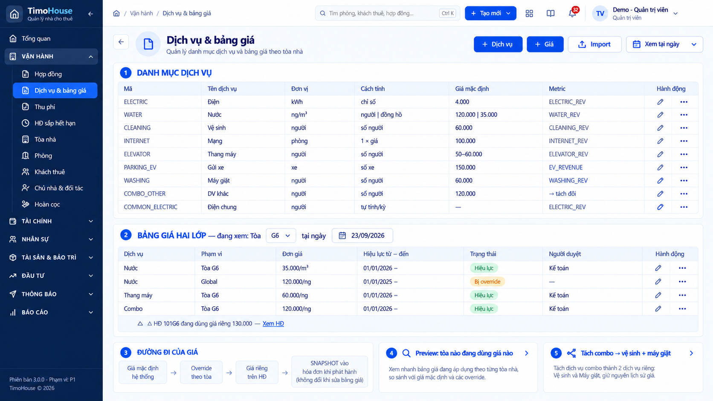
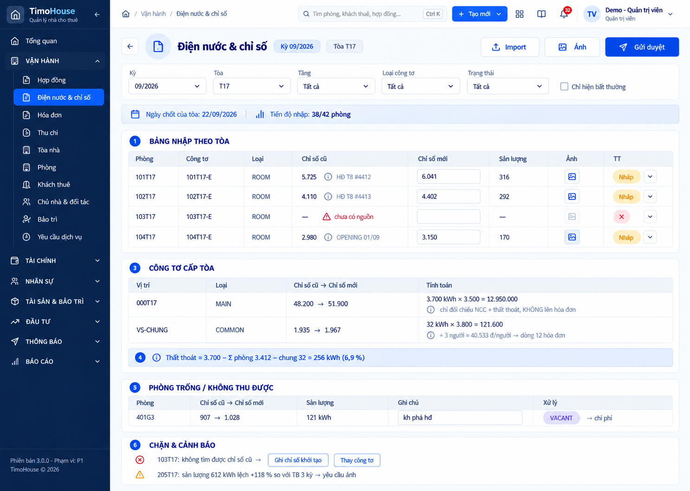

# TIMOHOUSE — SRS · Cụm Dịch vụ & chỉ số

**Phiên bản:** 1.0 · **Ngày lập:** 25/09/2026 · **Trạng thái:** DRAFT, chờ khách hàng xác nhận
**Phạm vi:** FR09 - Dịch vụ & bảng giá, FR10 - Điện nước & chỉ số. Flow liên quan: F-02 Chốt chỉ số và phát hành hóa đơn.

**Nguồn:** [`TimoHouse_UI_Mockup_Spec_v1.0.md`](TimoHouse_UI_Mockup_Spec_v1.0.md) (§4, §6, §7, §8, UI-04 bảng công tơ cấp tòa, UI-09, UI-10, UI-12 phần 12 dòng cố định, §13 F-02, §14, §15, §16, §18); dữ liệu mẫu ở [`TimoHouse_Mockup_Seed_Data_v1.0.md`](TimoHouse_Mockup_Seed_Data_v1.0.md) §4, §6, §16; ảnh mockup ở [`ui-imagegen-v1/04-dich-vu-chi-so/`](ui-imagegen-v1/04-dich-vu-chi-so/README.md), kết luận ảnh theo [`AUDIT.md`](ui-imagegen-v1/AUDIT.md).

Quy ước đọc tài liệu và Common Rules 1–14 xem [`TimoHouse_SRS_v1.0.md`](TimoHouse_SRS_v1.0.md#common-rules-dùng-chung-cho-mọi-fr); tài liệu này chỉ dẫn chiếu, không lặp lại.

> Hai ảnh của cụm là ảnh ImageGen, AUDIT kết luận **ĐẠT CÓ LƯU Ý**. Ảnh được nhúng làm capture, nhưng **spec thắng ảnh**: chỗ ảnh lệch spec ghi đỏ "Capture lệch spec" tại field liên quan. Ví dụ số liệu ưu tiên lấy từ tòa G1 (Seed Data §4, §6).

---

## Quy tắc chung của cụm

| Mã | Nội dung | Nguồn |
|---|---|---|
| Cluster Rule 04.1 | **Hai loại công tơ cấp tòa, không gộp.** • `MAIN` (công tơ tổng): mã `000<mã tòa>`, đơn giá gốc EVN (G1 3.500 đ/kWh, G6 2.700 đ/kWh). Chỉ dùng để đối chiếu hóa đơn nhà cung cấp và tính thất thoát. **Không** lên hóa đơn khách, **không** chia cho phòng (D-03, BR-2.03.5, BR-2.08.14) • `COMMON` (khu vực chung): đơn giá 3.800 đ/kWh; sản lượng chia theo số người thành dòng 12 `Điện chung` của hóa đơn phòng (D-18, BR-2.03.5, BR-2.08.11) • Mọi màn hiển thị hai loại này phải đặt ghi chú khác nhau cạnh từng dòng để không ai nhầm công tơ tổng thành công tơ tính tiền khách • Công tơ phòng có scope `ROOM` | Spec UI-04 (bảng hai loại công tơ), UI-10 ③; Seed §4 |
| Cluster Rule 04.2 | **Điện chung.** Không có giá cố định. Đơn giá/người của kỳ = thành tiền công tơ COMMON ÷ số người chia • Ví dụ G1 kỳ 09/2026, cụm 201G1–202G1: 1.935 → 1.967 = 32 kWh × 3.800 = 121.600 đ ÷ 3 người = 40.533,33 đ/người (Seed §6.3) • Doanh thu điện chung cộng vào doanh thu điện, vẫn drill-down riêng (P-13, **ASSUMED** — Decision Log #5) • Mẫu số chưa thống nhất: UI-09 ghi "÷ tổng số người của tòa", Seed §6.3 chia theo từng cụm phòng. Seed còn chia cụm 201G1–202G1 cho 3 người trong khi Seed §6.1 ghi 201G1 và 202G1 mỗi phòng 2 người (Σ 4). Cần xác nhận nguồn "số người chia" • Seed §6.3 có 3 cách ghi điện chung trong cùng tòa G1 (theo tầng, theo cụm phòng, ghi thẳng 6.000 đ cho 603G1/604G1 với đơn giá 4.000). Cần xác nhận một tòa có nhiều công tơ COMMON hay không và cách xử lý dòng ghi thẳng | Spec UI-09 (dòng Điện chung), UI-10 ③; Seed §6.3, §16 |
| Cluster Rule 04.3 | **Thứ tự ưu tiên đơn giá và snapshot.** Giá mặc định hệ thống → Override theo tòa → Giá riêng trên HĐ (ưu tiên cao nhất) • HĐ thuê snapshot đơn giá dịch vụ **khi kích hoạt** theo thứ tự giá HĐ/OCR → override tòa → mặc định hệ thống (BR-2.06.3, R-14; refer to FR07) • Hóa đơn phòng snapshot đơn giá **khi phát hành**; sửa bảng giá **không** đổi hóa đơn đã phát hành và **không** đổi HĐ đang hiệu lực • Cần xác nhận hóa đơn lấy đơn giá từ snapshot của HĐ (BR-2.06.3) hay từ phiên bản giá tòa hiệu lực tại kỳ (UI-09: "hóa đơn tự lấy phiên bản tòa có hiệu lực"). Hai câu này cho kết quả khác nhau khi tòa đổi giá trong thời hạn HĐ | Spec UI-09 ③, UI-07 rule, §8.1 |

---
---

# FR09 - Dịch vụ & bảng giá

## 1. Business Rule

| | |
|:-:|---|
| **Authorization** | • Admin: tạo và sửa dịch vụ, tạo version giá, duyệt, ngừng hiệu lực, import, xuất (quyền cấu hình, spec §4) • Kế toán: tạo version giá và duyệt giá (cột Người duyệt trên phác họa UI-09 ghi "Kế toán") (cần xác nhận Kế toán có được tạo dịch vụ mới trong danh mục không) • TPVH, TNVH/Trưởng khu vực, NVVH: ## (spec chưa nêu; dự kiến chỉ xem bảng giá của tòa trong phạm vi `BUILDING_ASSIGNMENT`) • Cổ đông, Kỹ thuật, Vệ sinh: ## (spec chưa nêu) |
| **Management Rule** | • Người dùng quản lý danh mục dịch vụ và bảng giá hai lớp có ngày hiệu lực: giá mặc định toàn hệ thống và giá override theo tòa. Đây là nguồn đơn giá cho HĐ thuê (refer to FR07), OCR hợp đồng khách (refer to FR08) và hóa đơn phòng (refer to FR12) • Chức năng chỉ thực hiện được khi người dùng đã đăng nhập với vai trò thuộc Authorization ## • Danh mục dịch vụ gồm: mã, tên, đơn vị, cách tính, metric, giá mặc định, trạng thái. Service chuẩn: điện, nước, vệ sinh, mạng, thang máy, xe điện/gửi xe, máy giặt, combo khác, điện chung • Cột Metric cho biết dịch vụ ghi vào dòng doanh thu nào ở báo cáo, dùng để kiểm tra chéo khi đối soát (refer to FR32) • Bảng giá hai lớp. Giá điện, nước và dịch vụ khác cấu hình hoặc import theo từng tòa, có giá mặc định toàn hệ thống: &nbsp;&nbsp;◦ Scope: Global hoặc Building &nbsp;&nbsp;◦ Tòa: bắt buộc khi scope = Building &nbsp;&nbsp;◦ Đơn giá: > 0, đúng đơn vị và cách tính của dịch vụ &nbsp;&nbsp;◦ Hiệu lực từ/đến: không chồng khoảng trong cùng dịch vụ và cùng scope &nbsp;&nbsp;◦ Mỗi dịch vụ × phạm vi × ngày **chỉ có 1 giá hiệu lực** &nbsp;&nbsp;◦ Người duyệt và lý do: bắt buộc khi giá khác nguồn HĐ/OCR • Trạng thái version giá: &nbsp;&nbsp;◦ Nháp: vừa tạo, được sửa &nbsp;&nbsp;◦ Chờ duyệt: đã gửi duyệt, chờ người có quyền duyệt &nbsp;&nbsp;◦ Hiệu lực: đã duyệt, được áp theo khoảng hiệu lực &nbsp;&nbsp;◦ Hết hiệu lực: đã ngừng hoặc hết ngày hiệu lực &nbsp;&nbsp;◦ Nhãn suy ra, không lưu: `Bị override` = version Global đang bị version của tòa đang xem thay thế tại ngày xem &nbsp;&nbsp;◦ Cần xác nhận trạng thái của version đã duyệt nhưng chưa tới ngày hiệu lực • Thứ tự ưu tiên và snapshot giá theo Cluster Rule 04.3 • **Không sửa trực tiếp** version đã được snapshot vào HĐ hoặc hóa đơn; thay đổi phải tạo version mới • HĐ dùng giá riêng khác giá tòa phải được hiển thị rõ, không che đi. Ví dụ tòa G6 có giá combo 120.000 nhưng HĐ 101G6 dùng giá riêng 130.000: hai mức combo khác nhau trên hai HĐ, bằng chứng cho quy tắc "mỗi HĐ một loại giá" • Điện chung (`COMMON_ELECTRIC`) không có giá cố định, tính lại mỗi kỳ (Cluster Rule 04.2) • Nước: phòng có đồng hồ tính theo m³, không có đồng hồ tính theo đầu người (BR-2.07.5, P-31). Ví dụ G1 tính nước 120.000 đ/người, riêng 304G1 có đồng hồ nước tính 35.000 đ/m³ (Seed §6.4) • Combo `DV khác` 120.000 đ/người = vệ sinh 60.000 + máy giặt 60.000; điện chung là dòng 12 riêng tính theo công tơ, không nằm trong combo (D-18, D-19, BR-2.07.4) • Rủi ro thu điện chung hai lần: "Dịch vụ chung" trên HĐ khách mẫu gồm 4 khoản (máy giặt + điện chung + thu rác + vệ sinh chung) (P-30) (chờ khách chốt) • Tòa không có tiện ích thang máy -> dịch vụ thang máy không được chọn vào HĐ; validate ở FR09 và FR07 (BR-2.03.9, Cần chốt; refer to FR04) • Tách combo là công cụ migration: chuyển dòng `DV khác 120.000` cũ thành vệ sinh 60.000 + máy giặt 60.000 **cho HĐ mới** • Bảng giá áp cho G1 (Seed §6.4): Điện 4.000 đ/kWh theo chỉ số; Nước 120.000 đ/người; Mạng 100.000 đ/phòng; Thang máy 60.000 đ/người; Xe điện 150.000 đ/xe; DV khác 120.000 đ/người; Điện chung tính lại mỗi kỳ |
| **Management Impact** | • Xem danh mục, xem bảng giá theo tòa, đổi ngày xem, xem Preview không làm thay đổi dữ liệu • Tạo dịch vụ: thêm một dịch vụ vào danh mục (cần xác nhận trạng thái mặc định) • Tạo version giá: tạo bản ghi giá ở trạng thái `Nháp` • Gửi duyệt: `Nháp` -> `Chờ duyệt` • Duyệt: `Chờ duyệt` -> `Hiệu lực`, lưu người duyệt và thời điểm duyệt. Version Global cùng dịch vụ hiển thị `Bị override` ở các tòa có version riêng hiệu lực • Trả sửa: `Chờ duyệt` -> `Nháp`, lưu lý do (Common Rule 11) • Ngừng hiệu lực: `Hiệu lực` -> `Hết hiệu lực`; HĐ và hóa đơn đã snapshot giữ nguyên giá cũ • Import: theo Common Rule 14; chỉ commit dòng hợp lệ • Tách combo: ## (spec chưa nêu bản ghi nào được tạo/đổi: version giá mới cho vệ sinh và máy giặt? combo chuyển Hết hiệu lực?) • Mọi thao tác ghi audit theo Common Rule 5 |

## 2. Screen 09.1: Dịch vụ & bảng giá

<b>Screen 09.1: Dịch vụ & bảng giá</b>

| **Fields** | **Format** | **Required?** | **Description** |
|:-:|:-:|:-:|:-:|
| Left Menu, Header | | | • Display follows Common Rule 1 • Highlight menu `Dịch vụ/Bảng giá theo tòa` • Breadcrumb: `Trang chủ / Dịch vụ & chỉ số / Dịch vụ & bảng giá` • Route: `#/settings/catalog?tab=services` (spec §8) (route nằm dưới Cài đặt trong khi menu thuộc cụm Dịch vụ & chỉ số — cần xác nhận breadcrumb) • Capture lệch spec: sidebar là nhóm "Vận hành", breadcrumb "Vận hành / Dịch vụ & bảng giá", topbar có nút primary "+ Tạo mới" và thiếu bộ chọn Kỳ; mô tả theo spec |
| 🟧 Quản lý dịch vụ & bảng giá | | | |
| Back | Icon | No | • Always display • Click on -> ## (spec không có nút Back cho màn cấp menu — cần xác nhận giữ hay bỏ) |
| Tiêu đề trang | Text | No | • Hiển thị "Dịch vụ & bảng giá" • Dòng phụ: "Quản lý danh mục dịch vụ và bảng giá theo tòa nhà" |
| + Dịch vụ | Button | No | • Always display • Enabled only when người dùng có quyền tạo dịch vụ (Common Rule 7) • Click on -> Display Popup tạo / sửa dịch vụ (Screen 09.2) • Capture lệch spec: "+ Dịch vụ" và "+ Giá" cùng là nút primary, trong khi spec §5.1 quy định mỗi màn một CTA chính. Cần xác nhận CTA chính |
| + Giá | Button | No | • Always display • Enabled only when người dùng có quyền tạo version giá • Click on -> Display Popup tạo / sửa version giá (Screen 09.3) |
| Import | Button | No | • Always display • Enabled only when người dùng có quyền tạo version giá • Click on -> Mở luồng import bảng giá theo tòa theo Common Rule 14 (Screen ## — spec chưa mô tả màn import và cột của file mẫu) • Dòng import hợp lệ tạo version giá ở trạng thái `Nháp` (cần xác nhận) |
| Xem tại ngày | Datepicker | No | • Default selection: ngày hiện tại • Click on -> Display a datepicker • Select a date -> Hiển thị giá có hiệu lực tại ngày đã chọn • Cần xác nhận quan hệ với ô "tại ngày" của vùng ②: cùng một control hay hai control riêng |
| Xuất | Button | No | • Capture thiếu nút; spec có action export • Always display • Always enabled • Click on -> Xuất danh mục và bảng giá đang xem ra file ## (định dạng CSV/XLSX?) |
| 🟧 ① Danh mục dịch vụ | | | |
| 🟦 Bảng danh mục dịch vụ | | | • Display the list of dịch vụ trong danh mục; mặc định có 9 service chuẩn • Giá trị trống hiển thị `—` (Common Rule 3) • If there are no dịch vụ in the system, display error message E## • Default sorting: ## (capture xếp theo thứ tự dòng hóa đơn — cần xác nhận khóa sắp xếp) • Phân trang theo Common Rule 6 • Click on một dòng -> ## • Capture lệch spec: thiếu cột Trạng thái; mô tả theo spec |
| Mã | Text | No | • Mã dịch vụ, ví dụ `ELECTRIC`, `WATER`, `CLEANING`, `INTERNET`, `ELEVATOR`, `PARKING_EV`, `WASHING`, `COMBO_OTHER`, `COMMON_ELECTRIC` |
| Tên dịch vụ | Text | No | • Tên dịch vụ, ví dụ "Điện", "Nước", "Vệ sinh", "Mạng", "Thang máy", "Gửi xe", "Máy giặt", "DV khác", "Điện chung" |
| Đơn vị | Text | No | • Đơn vị tính: kWh, m³, người, phòng, xe • Nước hiển thị "ng/m³" vì có hai cách tính |
| Cách tính | Text | No | • Một trong: &nbsp;&nbsp;◦ chỉ số: theo công tơ (Điện) &nbsp;&nbsp;◦ `người \| đồng hồ`: theo đầu người hoặc theo m³ tùy phòng có đồng hồ nước (Nước, P-31) &nbsp;&nbsp;◦ số người: Vệ sinh, Thang máy, Máy giặt, DV khác &nbsp;&nbsp;◦ 1 × giá: theo phòng (Mạng) &nbsp;&nbsp;◦ số xe: Gửi xe &nbsp;&nbsp;◦ tự tính/kỳ: Điện chung (Cluster Rule 04.2) |
| Giá mặc định | Number | No | • Giá mặc định toàn hệ thống, định dạng Common Rule 8 • Ví dụ: Điện 4.000; Nước `120.000 \| 35.000` (theo người \| theo m³); Vệ sinh 60.000; Mạng 100.000; Gửi xe 150.000; Máy giặt 60.000; DV khác 120.000 • Điện chung: `—` vì không có giá cố định • Thang máy ghi khoảng "50–60.000", mâu thuẫn quy tắc mỗi dịch vụ × phạm vi × ngày chỉ có 1 giá. Cần xác nhận giá mặc định (G1 dùng 60.000, Seed §6.4) |
| Metric | Text | No | • Mã metric doanh thu mà dịch vụ ghi vào, ví dụ `ELECTRIC_REV`, `WATER_REV`, `EV_REVENUE` • DV khác: "→ tách đôi" = doanh thu tách vào vệ sinh và máy giặt (cần xác nhận metric đích) • Điện chung ghi vào `ELECTRIC_REV` (P-13, **ASSUMED** — Decision Log #5) • Mã trên phác họa viết tắt `_REV`, còn danh mục metric của UI-32 dùng `ELECTRIC_REVENUE`. Cần thống nhất mã (refer to FR32) |
| Trạng thái | Tag | No | • Trạng thái dịch vụ, chip gồm icon và chữ (Common Rule 4) • Spec chưa liệt kê giá trị trạng thái dịch vụ (ví dụ Đang dùng / Ngừng dùng?) |
| Hành động | Icon | No | • Icon bút: Click on -> Display Popup tạo / sửa dịch vụ ở chế độ sửa (Screen 09.2) • Icon ⋯: Click on -> ## (cần danh sách action, ví dụ ngừng dùng dịch vụ) • Action trên dòng không kích hoạt click dòng (Common Rule 6) |
| Page number | Text | No | • Click on a page number -> Go to the corresponding page |
| 🟧 ② Bảng giá hai lớp | | | • Tiêu đề: "Bảng giá hai lớp — đang xem: Tòa {mã tòa} tại ngày {ngày}" |
| Tòa | Dropdown | No | • Default selection: ## (capture và phác họa: G6; cần xác nhận mặc định là tòa đầu tiên trong phạm vi hay tòa truyền từ shortcut của FR04) • Click on -> Display danh sách tòa trong phạm vi quyền (Common Rule 7) • Allow single selection only. Selecting an option automatically deselects the previous selection • Select an option -> Hiển thị các version giá Global và version theo tòa đã chọn |
| tại ngày | Datepicker | No | • Default selection: ngày hiện tại (capture: 23/09/2026). Format: DD/MM/YYYY (Common Rule 10) • Click on -> Display a datepicker • Select a date -> Xác định version đang hiệu lực và dòng `Bị override` tại ngày đã chọn |
| 🟦 Bảng giá | | | • Display the list of version giá áp được cho tòa đã chọn: version phạm vi tòa và version Global của cùng dịch vụ • Mỗi dịch vụ × phạm vi × ngày chỉ có 1 giá hiệu lực • Dòng Global bị override hiển thị **mờ** kèm Tag `Bị override`, để thấy rõ giá nào đang thực sự áp dụng • Capture lệch spec: dòng "Bị override" hiển thị bình thường, không mờ; mô tả theo spec • Dịch vụ có HĐ dùng giá riêng: thêm dòng cảnh báo ngay dưới dòng dịch vụ đó (xem field Cảnh báo HĐ giá riêng) • If there is no version giá for the selected tòa, display error message E## • Default sorting: ## • Phân trang theo Common Rule 6 |
| Dịch vụ | Text | No | • Tên dịch vụ, ví dụ "Nước", "Thang máy", "Combo" |
| Phạm vi | Text | No | • `Tòa {mã tòa}` hoặc `Global` |
| Đơn giá | Number | No | • Đơn giá của version, Common Rule 8, kèm đơn vị, ví dụ "35.000/m³", "120.000/ng" • Phác họa cho Nước tòa G6 override bằng đơn giá theo m³ trong khi Global tính theo người. Cần xác nhận override theo tòa có được đổi cách tính không (P-31) |
| Hiệu lực từ – đến | Text | No | • Format: `DD/MM/YYYY – DD/MM/YYYY` • Chưa có ngày kết thúc: chỉ hiển thị ngày bắt đầu và dấu "–", ví dụ "01/01/2026 –" |
| Trạng thái | Tag | No | • Hiển thị một trong các nhãn (Common Rule 4): &nbsp;&nbsp;◦ Nháp &nbsp;&nbsp;◦ Chờ duyệt &nbsp;&nbsp;◦ Hiệu lực &nbsp;&nbsp;◦ Hết hiệu lực &nbsp;&nbsp;◦ Bị override: nhãn suy ra cho dòng Global • Capture lệch spec: chip chỉ có chữ, không có icon |
| Người duyệt | Text | No | • Vai trò hoặc tên người đã duyệt version, ví dụ "Kế toán" • Chưa duyệt hoặc không có: `—` |
| Hành động | Icon | No | • Icon bút: Display only when version chưa được snapshot vào HĐ hoặc hóa đơn (cần xác nhận có thêm điều kiện trạng thái = Nháp không). Click on -> Display Popup tạo / sửa version giá ở chế độ sửa (Screen 09.3) • Capture lệch spec: icon bút hiển thị trên mọi dòng, kể cả version Hiệu lực đã snapshot; mô tả theo spec • Icon ⋯: Click on -> Display a dropdown for actions (capture chưa có dropdown — danh sách dựng từ action của spec): &nbsp;&nbsp;◦ Gửi duyệt: Display only when trạng thái = Nháp. Click on -> Confirm nhẹ theo Common Rule 11, rồi chuyển `Chờ duyệt` &nbsp;&nbsp;◦ Duyệt: Display only when trạng thái = Chờ duyệt và người dùng có quyền duyệt. Click on -> Display Popup duyệt version giá (Screen 09.4) &nbsp;&nbsp;◦ Ngừng hiệu lực: Display only when trạng thái = Hiệu lực. Click on -> Display Popup ngừng hiệu lực (Screen 09.5) &nbsp;&nbsp;◦ Xem tòa đang dùng giá này: Click on -> Display Preview tòa đang dùng giá nào (Screen 09.6) |
| Cảnh báo HĐ giá riêng | Text | No | • Display only when có HĐ thuê của tòa đang dùng giá riêng khác giá tòa cho dịch vụ đó • Content format: "△ HĐ {mã phòng} đang dùng giá riêng {đơn giá} — Xem HĐ", ví dụ "△ HĐ 101G6 đang dùng giá riêng 130.000" • Xem HĐ: Click on -> Go to Chi tiết hợp đồng thuê (refer to FR07) • Nhiều HĐ cùng dùng giá riêng: ## (cần xác nhận cách hiển thị) |
| Page number | Text | No | • Click on a page number -> Go to the corresponding page |
| 🟧 ③ Đường đi của giá | | | |
| Sơ đồ đường đi của giá | Text | No | • Always display. Sơ đồ tĩnh, không click được • Content format: "Giá mặc định hệ thống → Override theo tòa → Giá riêng trên HĐ → SNAPSHOT vào hóa đơn khi phát hành (không đổi khi sửa bảng giá)" • Quy tắc đầy đủ: Cluster Rule 04.3 |
| 🟧 ④ Preview | | | |
| Preview: tòa nào đang dùng giá nào | Button | No | • Always display • Always enabled • Content format: "Xem nhanh bảng giá đang áp dụng theo từng tòa nhà, so sánh với giá mặc định và các override." • Click on -> Display Preview tòa đang dùng giá nào (Screen 09.6) |
| 🟧 ⑤ Tách combo | | | |
| Tách combo → vệ sinh + máy giặt | Button | No | • Always display • Enabled only when người dùng có quyền tạo version giá (cần xác nhận quyền) • Content format: "Tách dịch vụ combo thành 2 dịch vụ riêng: Vệ sinh và Máy giặt, giữ nguyên lịch sử giá." • Click on -> Display Tách combo (Screen 09.7) |

## 3. Screen 09.2: Popup tạo / sửa dịch vụ

Chưa có capture — cần bổ sung. Nội dung dựng từ spec (danh sách field của danh mục dịch vụ).

<b>Screen 09.2: Popup tạo / sửa dịch vụ</b>

| **Fields** | **Format** | **Required?** | **Description** |
|:-:|:-:|:-:|:-:|
| 🟧 The popup can be closed by the X icon or by clicking out of the popup. Closing the popup redirects the user to the underlying screen without any changes saved. (cần xác nhận popup có X icon) | | | |
| Tiêu đề | Text | No | • Chế độ tạo: "Tạo dịch vụ"; chế độ sửa: "Sửa dịch vụ {Mã}" • Chế độ sửa mở từ icon bút trên Screen 09.1; mọi field mặc định bằng giá trị hiện tại |
| Mã dịch vụ | Textbox | Yes | • Always display • Enable only when chế độ tạo (cần xác nhận mã bất biến sau khi lưu) • Placeholder: ## • Allow entering ## (ký tự cho phép; danh mục mẫu dùng chữ in hoa và `_`). Max length: ## • If clicking out of the field while it is blank -> Show error message E## • Trùng mã dịch vụ khác -> Show error message E## |
| Tên dịch vụ | Textbox | Yes | • Always display • Allow entering all types of characters. Max length: 255 • If clicking out of the field while it is blank -> Show error message E## |
| Đơn vị | Dropdown | Yes | • Always display • Default selection: None • If clicking out of field while it is blank -> Show error message E## • Click on -> Display the list of following options: kWh, m³, người, phòng, xe (lấy từ danh mục mẫu — cần xác nhận danh sách đầy đủ) • Allow single selection only |
| Cách tính | Dropdown | Yes | • Always display • Default selection: None • If clicking out of field while it is blank -> Show error message E## • Click on -> Display the list of following options: &nbsp;&nbsp;◦ Chỉ số: tính theo sản lượng công tơ. Select this option -> dịch vụ cần công tơ khai báo ở FR10 &nbsp;&nbsp;◦ Số người: Select this option -> số lượng lấy theo số người HĐ &nbsp;&nbsp;◦ 1 × giá: Select this option -> tính một lần theo phòng &nbsp;&nbsp;◦ Số xe: Select this option -> số lượng lấy theo số xe của HĐ &nbsp;&nbsp;◦ Người \| đồng hồ: Select this option -> hiển thị hai ô giá theo người và theo m³ (cần xác nhận) &nbsp;&nbsp;◦ Tự tính/kỳ: Select this option -> ẩn Giá mặc định (Cluster Rule 04.2) • Allow single selection only |
| Giá mặc định | Textbox | Yes | • Display only when Cách tính ≠ Tự tính/kỳ • Allow entering numeric values (VND, Common Rule 8). Max length: 12 • If clicking out of the field while it is blank -> Show error message E## • If entering 0, display error message E## (đơn giá > 0) |
| Metric | Dropdown | Yes | • Always display • Default selection: None • If clicking out of field while it is blank -> Show error message E## • Click on -> Display danh mục metric doanh thu (refer to FR32) • Allow single selection only |
| Trạng thái | Dropdown | No | • Display only when chế độ sửa (cần xác nhận) • Click on -> Display the list of following options: ## • Allow single selection only |
| Hủy | Button | No | • Always appear • Always enabled • Click on -> Đóng popup, không lưu |
| Lưu | Button | No | • Always appear • Always enabled • Click on -> Validate in the following order: &nbsp;&nbsp;◦ If there are any fields with invalid values, display error messages as mentioned above &nbsp;&nbsp;◦ ## &nbsp;&nbsp;◦ If all conditions above are satisfied -> lưu dịch vụ, đóng popup, cập nhật bảng ① của Screen 09.1 và hiển thị toast thành công (Common Rule 13) |

## 4. Screen 09.3: Popup tạo / sửa version giá

Chưa có capture — cần bổ sung. Nội dung dựng từ spec (bảng field của bảng giá hai lớp).

<b>Screen 09.3: Popup tạo / sửa version giá</b>

| **Fields** | **Format** | **Required?** | **Description** |
|:-:|:-:|:-:|:-:|
| 🟧 The popup can be closed by the X icon or by clicking out of the popup. Closing the popup redirects the user to the underlying screen without any changes saved. (cần xác nhận popup có X icon) | | | |
| Tiêu đề | Text | No | • Chế độ tạo: "Tạo version giá"; chế độ sửa: "Sửa version giá" • Chế độ sửa chỉ mở được với version chưa snapshot vào HĐ/hóa đơn |
| Dịch vụ | Dropdown | Yes | • Always display • Placeholder: ## • Default selection: None • If clicking out of field while it is blank -> Show error message E## • Click on -> Display danh sách dịch vụ trong danh mục, trừ Điện chung (không có giá cố định) • Allow single selection only • Select an option -> Hiển thị đơn vị và cách tính của dịch vụ cạnh ô Đơn giá |
| Phạm vi | Dropdown | Yes | • Always display • Default selection: ## • Click on -> Display the list of following options: &nbsp;&nbsp;◦ Global: giá mặc định toàn hệ thống. Select this option -> ẩn field Tòa &nbsp;&nbsp;◦ Tòa: giá override theo tòa. Select this option -> hiển thị field Tòa • Allow single selection only |
| Tòa | Dropdown | Yes | • Display only when Phạm vi = Tòa • Default selection: tòa đang xem ở vùng ② của Screen 09.1 (cần xác nhận) • If clicking out of field while it is blank -> Show error message E## • Click on -> Display danh sách tòa trong phạm vi quyền. Allow single selection only • Dịch vụ = Thang máy và tòa không có tiện ích thang máy -> Show error message E## (BR-2.03.9, Cần chốt) |
| Đơn giá | Textbox | Yes | • Always display, hậu tố đơn vị của dịch vụ (ví dụ "/m³", "/người") • Allow entering numeric values (VND, Common Rule 8). Max length: 12 • If clicking out of the field while it is blank -> Show error message E## • If entering 0, display error message E## |
| Hiệu lực từ | Datepicker | Yes | • Always display • Placeholder: DD/MM/YYYY • Default selection: None • Click on -> Display a datepicker • If clicking out of field while it is blank -> Show error message E## • If an end date is selected, disable all dates after the specified end date • Khoảng hiệu lực chồng với version khác cùng dịch vụ và cùng phạm vi -> Show error message E## • Cần xác nhận hệ thống có tự đóng version đang hiệu lực (điền ngày kết thúc) hay bắt buộc người dùng ngừng version cũ trước |
| Hiệu lực đến | Datepicker | No | • Always display • Placeholder: DD/MM/YYYY • Default selection: None; để trống = không thời hạn • Click on -> Display a datepicker • If a start date is selected, disable all dates before the specified start date |
| Lý do | Textbox | Yes | • Display only when đơn giá khác giá nguồn HĐ/OCR (cần xác nhận cách so sánh khi version tạo trực tiếp ở màn này, không từ HĐ/OCR) • Allow entering all types of characters. Max length: 255 • If clicking out of the field while it is blank -> Show error message E## |
| Hủy | Button | No | • Always appear • Always enabled • Click on -> check if there are any changes made to input &nbsp;&nbsp;◦ If there are not -> đóng popup &nbsp;&nbsp;◦ If there are -> display a confirmation popup (Common Rule 9) (Screen ##) |
| Lưu nháp | Button | No | • Always appear • Always enabled • Click on -> Validate the fields above; hợp lệ -> lưu version ở trạng thái `Nháp`, đóng popup, cập nhật Screen 09.1 |
| Gửi duyệt | Button | No | • Always appear. Đây là CTA chính của popup • Always enabled • Click on -> Validate in the following order: &nbsp;&nbsp;◦ If there are any fields with invalid values, display error messages as mentioned above &nbsp;&nbsp;◦ ## &nbsp;&nbsp;◦ If all conditions above are satisfied -> lưu version ở trạng thái `Chờ duyệt` (Common Rule 11), đóng popup, cập nhật Screen 09.1 |

## 5. Screen 09.4: Popup duyệt version giá

Chưa có capture — cần bổ sung. Nội dung dựng từ spec (action duyệt, Common Rule 11).

<b>Screen 09.4: Popup duyệt version giá</b>

| **Fields** | **Format** | **Required?** | **Description** |
|:-:|:-:|:-:|:-:|
| 🟧 The popup can be closed by the X icon or by clicking out of the popup. Closing the popup redirects the user to the underlying screen without any changes saved. (cần xác nhận popup có X icon) | | | |
| Tóm tắt thay đổi | Text | No | • Hiển thị dịch vụ, phạm vi, đơn giá mới, đơn giá đang hiệu lực của cùng dịch vụ và phạm vi, hiệu lực từ – đến, người tạo, lý do (nếu có) |
| Tác động | Text | No | • Hiển thị số tòa sẽ dùng giá mới từ ngày hiệu lực, theo cách tính của Preview (Screen 09.6) • Luôn kèm câu: "HĐ đang hiệu lực và hóa đơn đã phát hành không đổi giá" (Cluster Rule 04.3) • Content format chính xác: ## |
| Lý do trả sửa | Textbox | Yes | • Display only when người dùng click `Trả sửa` • Allow entering all types of characters. Max length: 255 • If clicking out of the field while it is blank -> Show error message E## |
| Trả sửa | Button | No | • Always appear • Always enabled; khi ô Lý do trả sửa đang hiển thị: Enabled only when đã nhập lý do • Click on -> Lần đầu: hiển thị ô Lý do trả sửa. Lần sau: chuyển version `Chờ duyệt` -> `Nháp`, lưu lý do, đóng popup và cập nhật Screen 09.1 |
| Duyệt | Button | No | • Always appear • Enabled only when người dùng có quyền duyệt giá • Click on -> Chuyển version `Chờ duyệt` -> `Hiệu lực`, ghi người duyệt và thời điểm, đóng popup, cập nhật Screen 09.1 |

## 6. Screen 09.5: Popup ngừng hiệu lực

Chưa có capture — cần bổ sung. Nội dung dựng từ spec (action ngừng hiệu lực).

<b>Screen 09.5: Popup ngừng hiệu lực</b>

| **Fields** | **Format** | **Required?** | **Description** |
|:-:|:-:|:-:|:-:|
| 🟧 The popup can be closed by the X icon or by clicking out of the popup. Closing the popup redirects the user to the underlying screen without any changes saved. (cần xác nhận popup có X icon) | | | |
| Message | Text | No | • Content format: "##" (cần nội dung chính xác) • Nêu dịch vụ, phạm vi, đơn giá của version sắp ngừng • Nhắc: HĐ và hóa đơn đã snapshot giá này giữ nguyên; sau ngày ngừng, tòa quay về giá có ưu tiên thấp hơn theo Cluster Rule 04.3 |
| Ngày hết hiệu lực | Datepicker | Yes | • Always display • Default selection: ## • Click on -> Display a datepicker • Disable dates before ngày bắt đầu hiệu lực của version • If clicking out of field while it is blank -> Show error message E## |
| Lý do | Textbox | ## | • Always display • Allow entering all types of characters. Max length: 255 • Spec không nêu ngừng hiệu lực có bắt buộc lý do hay không (Common Rule 12 không liệt kê action này) |
| Hủy | Button | No | • Always appear • Always enabled • Click on -> Đóng popup, không thay đổi dữ liệu |
| Ngừng hiệu lực | Button | No | • Always appear • Enabled only when đã chọn Ngày hết hiệu lực • Click on -> Chuyển version `Hiệu lực` -> `Hết hiệu lực` từ ngày đã chọn, đóng popup và cập nhật Screen 09.1 |

## 7. Screen 09.6: Preview tòa đang dùng giá nào

Chưa có capture — cần bổ sung. Spec chỉ nêu mục đích của vùng ④ ("tòa nào đang dùng giá nào tại ngày nào"); cột và bố cục dưới đây là đề xuất, cần xác nhận.

<b>Screen 09.6: Preview tòa đang dùng giá nào</b>

| **Fields** | **Format** | **Required?** | **Description** |
|:-:|:-:|:-:|:-:|
| 🟧 The popup can be closed by the X icon or by clicking out of the popup. Closing the popup redirects the user to the underlying screen without any changes saved. (cần xác nhận đây là popup, drawer hay trang riêng) | | | |
| Tại ngày | Datepicker | No | • Default selection: ngày đang xem ở Screen 09.1 • Click on -> Display a datepicker • Select a date -> Search for all records with giá hiệu lực tại ngày đã chọn |
| Dịch vụ | Dropdown | No | • Default selection: dịch vụ của dòng đã mở (nếu mở từ ⋯ của một version); nếu mở từ vùng ④ thì Tất cả • Click on -> Display the list of options: Tất cả + danh mục dịch vụ • Allow single selection only • Select an option -> Search for all records with Dịch vụ = selected option |
| 🟦 Bảng tòa đang dùng giá | | | • Display the list of tòa trong phạm vi quyền, mỗi tòa × dịch vụ một dòng • If no record matches, display error message E## • Default sorting: ## • Phân trang theo Common Rule 6 |
| Tòa | Text | No | • Mã tòa |
| Dịch vụ | Text | No | • Tên dịch vụ |
| Đơn giá đang áp | Number | No | • Đơn giá hiệu lực tại ngày chọn (Common Rule 8) |
| Nguồn giá | Tag | No | • Một trong: Mặc định hệ thống, Override theo tòa |
| So với mặc định | Number | No | • Chênh lệch giữa đơn giá đang áp và giá mặc định hệ thống; không có override hiển thị `—` |
| HĐ giá riêng | Number | No | • Số HĐ của tòa đang dùng giá riêng cho dịch vụ này • Click on -> ## (mở danh sách HĐ lọc theo tòa và dịch vụ ở FR07?) |

## 8. Screen 09.7: Tách combo

Chưa có capture — cần bổ sung. Spec chỉ nêu mục đích của vùng ⑤ (công cụ migration); các field dưới đây dựng từ mục đích đó, cần xác nhận.

<b>Screen 09.7: Tách combo</b>

| **Fields** | **Format** | **Required?** | **Description** |
|:-:|:-:|:-:|:-:|
| 🟧 The popup can be closed by the X icon or by clicking out of the popup. Closing the popup redirects the user to the underlying screen without any changes saved. (cần xác nhận đây là popup hay wizard) | | | |
| Mô tả | Text | No | • Content format: "Chuyển dòng DV khác 120.000 cũ thành Vệ sinh 60.000 + Máy giặt 60.000 cho HĐ mới." (D-19, BR-2.07.4) • Ghi chú: HĐ đang hiệu lực giữ combo đã snapshot (Cluster Rule 04.3) |
| Cảnh báo điện chung | Text | No | • Always display • Content format: "##". Nội dung: "Dịch vụ chung" trên HĐ khách có thể gồm cả điện chung; điện chung tính riêng ở dòng 12 theo công tơ, nguy cơ thu hai lần (P-30) |
| Phạm vi áp dụng | Dropdown | Yes | • Always display • Default selection: None • Click on -> Display the list of options: Global, các tòa trong phạm vi quyền (cần xác nhận cho chọn nhiều tòa không) • If clicking out of field while it is blank -> Show error message E## |
| Áp dụng từ ngày | Datepicker | Yes | • Always display • Default selection: None • Click on -> Display a datepicker • If clicking out of field while it is blank -> Show error message E## |
| Preview tách | Text | No | • Hiển thị: "COMBO_OTHER {đơn giá cũ} → CLEANING {giá} + WASHING {giá}" cho phạm vi đã chọn • Tổng hai dịch vụ mới ≠ giá combo cũ -> ## (cảnh báo hay chặn?) |
| Hủy | Button | No | • Always appear • Always enabled • Click on -> Đóng popup, không thay đổi dữ liệu |
| Xác nhận tách | Button | No | • Always appear • Enabled only when đã chọn Phạm vi áp dụng và Áp dụng từ ngày • Click on -> ## (spec chưa nêu kết quả: tạo version giá Nháp cho Vệ sinh, Máy giặt? chuyển combo Hết hiệu lực?) |

## 9. User Steps

| | |
|:-:|---|
| **Pre-condition** | Người dùng đã đăng nhập với quyền tạo version giá (Admin hoặc Kế toán) |
| **User steps** | **Step 1:** Click menu `Dịch vụ/Bảng giá theo tòa` -> display Dịch vụ & bảng giá (Screen 09.1) **Step 2:** Chọn Tòa ở vùng ②, click `+ Giá` -> display Popup tạo / sửa version giá (Screen 09.3) **Step 3:** Nhập đơn giá, hiệu lực, click `Gửi duyệt` -> display Screen 09.1 với version mới ở trạng thái `Chờ duyệt` **Step 4:** Người có quyền duyệt click `⋯` → `Duyệt` trên dòng đó -> display Popup duyệt version giá (Screen 09.4) **Step 5:** Click `Duyệt` -> display Screen 09.1, version ở trạng thái `Hiệu lực`, dòng Global cùng dịch vụ mang nhãn `Bị override` |

| | |
|:-:|---|
| **Pre-condition** | Người dùng đã đăng nhập với quyền xem bảng giá |
| **User steps** | **Step 1:** Tại Screen 09.1, click thẻ `Preview: tòa nào đang dùng giá nào` -> display Preview tòa đang dùng giá nào (Screen 09.6) **Step 2:** Đóng Preview, click thẻ `Tách combo → vệ sinh + máy giặt` -> display Tách combo (Screen 09.7) |

Vào bảng giá từ shortcut ở Chi tiết tòa nhà (refer to FR04): ## (cần xác nhận shortcut mở Screen 09.1 với Tòa = tòa đang xem).

---
---

# FR10 - Điện nước & chỉ số

## 1. Business Rule

| | |
|:-:|---|
| **Authorization** | • NVVH: nhập chỉ số, tải ảnh, lưu nháp, gửi duyệt cho tòa được phân công (spec §4) • TNVH/Trưởng khu vực: duyệt, trả sửa chỉ số của đơn vị và cấp dưới (spec §4, F-02 bước 2) • Kế toán: xử lý điều chỉnh khi hóa đơn liên quan đã phát hành (spec UI-10 Validation) • Admin: toàn quyền (cần xác nhận) • Ghi chỉ số khởi tạo, thay công tơ, mở lại: "người có quyền" ## (spec chưa nêu vai trò) • TPVH, Cổ đông, Kỹ thuật, Vệ sinh: ## (spec chưa nêu) |
| **Entry Rule** | • Người dùng nhập và duyệt chỉ số điện, nước theo kỳ × tòa cho công tơ phòng (`ROOM`), công tơ khu vực chung (`COMMON`) và công tơ tổng (`MAIN`). Chỉ số `Đã duyệt` là đầu vào của dòng điện, nước và điện chung trên hóa đơn phòng (refer to FR11, FR12) • Chức năng chỉ thực hiện được khi người dùng đã đăng nhập với vai trò thuộc Authorization ## • Công tơ cấp tòa theo Cluster Rule 04.1; điện chung theo Cluster Rule 04.2 • Loại chỉ số (reading type): &nbsp;&nbsp;◦ OPENING: chỉ số bàn giao khi khách vào ở, lấy từ HĐ/OCR và phải duyệt trước hóa đơn đầu tiên (refer to FR07, FR08) &nbsp;&nbsp;◦ PERIODIC: chỉ số kỳ &nbsp;&nbsp;◦ CLOSING: chỉ số khi kết thúc HĐ, là đầu vào của hóa đơn cuối (refer to FR15) &nbsp;&nbsp;◦ `VACANT`: phòng trống / không thu được (cần xác nhận VACANT là reading type hay loại xử lý) • Kỳ chỉ số gắn với ngày chốt của tòa, mặc định ngày 22, cấu hình theo tòa; đổi ngày chỉ áp cho kỳ chưa chốt (BR-2.03.6, R-11; refer to FR04). Hóa đơn tháng N dùng dịch vụ kỳ chốt ngày 22 tháng N−1 (BR-2.09.4, D-09) • **Nguồn chỉ số cũ** (theo từng `meter_id`), không phải ô nhập tự do: &nbsp;&nbsp;◦ Ưu tiên `new_reading` của hóa đơn phòng hợp lệ gần nhất trước kỳ hiện tại, kể cả bản điều chỉnh được duyệt &nbsp;&nbsp;◦ Hóa đơn đầu của công tơ dùng chỉ số OPENING đã duyệt của HĐ/bàn giao &nbsp;&nbsp;◦ Hiển thị `kỳ nguồn – số hóa đơn – chỉ số mới – ngày chốt` cạnh ô chỉ số cũ, kèm link mở hóa đơn/chứng từ &nbsp;&nbsp;◦ Khi hóa đơn phát hành, chỉ số mới trở thành nguồn chỉ số cũ mặc định của kỳ sau cùng công tơ (F-02 bước 5) &nbsp;&nbsp;◦ **Không bao giờ** tự lấy chỉ số của công tơ hoặc phòng khác • **Blocker (✕)** được tạo khi: chưa có nguồn chỉ số cũ, thiếu kỳ giữa (đứt kỳ), thay công tơ, hoặc số mới nhỏ hơn số cũ. Người có quyền xử lý bằng ghi chỉ số khởi tạo, thay công tơ hoặc điều chỉnh có lý do. Blocker phải xử lý xong mới phát hành được hóa đơn liên quan (BR-2.09.8) • **Cảnh báo (△)**: sản lượng lệch quá ±50 % so với trung bình 3 kỳ -> chỉ yêu cầu bổ sung ảnh, không chặn • Validation: &nbsp;&nbsp;◦ Chỉ số mới ≥ chỉ số cũ &nbsp;&nbsp;◦ Không trùng `meter + kỳ + reading type` &nbsp;&nbsp;◦ Ảnh bắt buộc với OPENING và CLOSING vì là bằng chứng khi tranh chấp hoàn cọc; PERIODIC chỉ khuyến nghị (P-25, **ASSUMED** — Decision Log #25) • Sản lượng = chỉ số mới − chỉ số cũ. Sản lượng 0 là hợp lệ: khách mới vào 01/09 (303G1, 304G1, 403G1, 604G1) có chỉ số đầu bằng chỉ số cuối, hóa đơn vẫn lập dòng điện = 0 (Seed §6.2) • Nước: phòng có đồng hồ tính theo m³ và có công tơ nước; không có đồng hồ tính theo đầu người, không nhập chỉ số (P-31). Ví dụ 304G1: 18 → 18 m³, đơn giá 35.000 (Seed §6.4) • Thất thoát = sản lượng MAIN − Σ sản lượng phòng − sản lượng khu vực chung, tính ngay trên màn • Phòng trống / không thu được: ghi loại `VACANT`, **không tạo hóa đơn**, sinh dòng chi phí đề xuất sang FR24 &nbsp;&nbsp;◦ Mâu thuẫn spec: UI-24 ghi "Điện nước phòng trống không tách dòng riêng — đã nằm trong giá gốc của tòa; chỉ thống kê thất thoát ở UI-10" (BR-4.01.5, R-04, Đã chốt). Cần chốt có sinh dòng chi phí đề xuất hay không • Trạng thái chỉ số: `Nháp → Chờ duyệt → Đã duyệt → Đã dùng hóa đơn`. Hóa đơn chỉ lấy chỉ số `Đã duyệt` • Trạng thái kỳ tòa: `Đang nhập → Đã duyệt → Đã lập hóa đơn` • Không mở lại chỉ số nếu hóa đơn liên quan đã phát hành, trừ flow điều chỉnh của Kế toán (refer to FR12) • Kỳ đã khóa: chỉ đọc theo Common Rule 12 |
| **Entry Impact** | • Lưu nháp: tạo hoặc cập nhật `METER_READING` ở trạng thái `Nháp`, lưu người nhập và thời điểm • Gửi duyệt: chỉ số `Nháp` -> `Chờ duyệt` • Duyệt: `Chờ duyệt` -> `Đã duyệt`; lưu người duyệt và thời điểm &nbsp;&nbsp;◦ Mọi chỉ số của tòa trong kỳ đã duyệt -> kỳ tòa `Đang nhập` -> `Đã duyệt` (spec chỉ nêu các trạng thái kỳ tòa, chưa nêu điều kiện chuyển — cần xác nhận) • Trả sửa: `Chờ duyệt` -> `Nháp`, lưu lý do và dòng liên quan (Common Rule 11) • Lập hóa đơn từ chỉ số (FR11, FR12): chỉ số `Đã duyệt` -> `Đã dùng hóa đơn`; kỳ tòa -> `Đã lập hóa đơn`. Dòng điện hóa đơn snapshot `meter_id`, `old_reading`, `new_reading`, sản lượng, đơn giá và `source_reading_id` • Ghi chỉ số khởi tạo: tạo chỉ số khởi tạo có lý do làm nguồn chỉ số cũ; gỡ blocker tương ứng • Thay công tơ: đóng công tơ cũ với chỉ số cuối, tạo công tơ mới với chỉ số đầu, lưu lý do; lịch sử và lineage của công tơ cũ vẫn xem được • `VACANT`: không tạo hóa đơn; dòng chi phí đề xuất sang FR24 (xem mâu thuẫn ở Entry Rule) • Mở lại: ## (spec chưa nêu trạng thái đích: Đã duyệt -> Nháp?), bắt buộc lý do • Mọi thao tác ghi audit theo Common Rule 5 |

## 2. Screen 10.1: Điện nước & chỉ số

<b>Screen 10.1.1: Điện nước & chỉ số (Đang nhập)</b>

Screen 10.1.2: Điện nước & chỉ số (Chờ duyệt — góc nhìn TNVH) — chưa có capture

Screen 10.1.3: Điện nước & chỉ số (Đã duyệt / Đã lập hóa đơn — chỉ đọc) — chưa có capture

| **Fields** | **Format** | **Required?** | **Description** |
|:-:|:-:|:-:|:-:|
| Left Menu, Header | | | • Display follows Common Rule 1 • Highlight menu `Điện nước & lịch sử công tơ` • Breadcrumb: `Trang chủ / Dịch vụ & chỉ số / Điện nước & chỉ số` • Route: `#/meters` (spec §8) • Capture lệch spec: sidebar là nhóm "Vận hành", breadcrumb "Vận hành / Điện nước & chỉ số", topbar có nút primary "+ Tạo mới" và thiếu bộ chọn Kỳ; mô tả theo spec |
| 🟧 Quản lý chỉ số | | | |
| Back | Icon | No | • Always display • Click on -> ## (spec không có nút Back cho màn cấp menu — cần xác nhận) |
| Tiêu đề | Text | No | • Hiển thị "Điện nước & chỉ số" kèm chip kỳ và tòa đang xem, ví dụ `Kỳ 09/2026`, `Tòa T17` • Hiển thị Tag trạng thái kỳ tòa: Đang nhập / Đã duyệt / Đã lập hóa đơn (Common Rule 4) (capture chưa có — cần xác nhận vị trí) |
| Import | Button | No | • Always display • Enabled only when người dùng có quyền nhập chỉ số và kỳ tòa = Đang nhập • Click on -> Mở luồng paste/import chỉ số theo Common Rule 14 (Screen ## — spec chưa mô tả màn import và cột của file) • Dòng import hợp lệ vào trạng thái `Nháp`; vẫn áp mọi validation của cột Chỉ số mới |
| Ảnh | Button | No | • Always display • Enabled only when người dùng có quyền nhập chỉ số • Click on -> ## (tải ảnh hàng loạt? cách ghép ảnh với từng công tơ — spec chưa mô tả) |
| Lưu nháp | Button | No | • Capture thiếu nút; spec có action lưu nháp • Display only when kỳ tòa = Đang nhập • Enabled only when có thay đổi chưa lưu • Click on -> Lưu mọi dòng đã nhập ở trạng thái `Nháp`; hiển thị toast thành công (Common Rule 13) |
| Gửi duyệt | Button | No | • Display only when kỳ tòa = Đang nhập. Đây là CTA chính của Screen 10.1.1 • Enabled only when có ít nhất 1 chỉ số `Nháp` đã có chỉ số mới và người dùng có quyền nhập • Click on -> Display Popup gửi duyệt (Screen 10.5) |
| Duyệt | Button | No | • Capture thiếu nút; spec có action duyệt • Display only when có chỉ số `Chờ duyệt` và người dùng có quyền duyệt (TNVH/Trưởng khu vực). Đây là CTA chính của Screen 10.1.2 • Always enabled • Click on -> Display Popup duyệt chỉ số (Screen 10.6) |
| Trả sửa | Button | No | • Capture thiếu nút; spec có action trả sửa • Display only when có chỉ số `Chờ duyệt` và người dùng có quyền duyệt • Always enabled • Click on -> Display Popup trả sửa (Screen 10.7) |
| Mở lại | Button | No | • Capture thiếu nút; spec có action mở lại có lý do • Display only when có chỉ số `Đã duyệt` và người dùng có quyền mở lại • Enabled only when hóa đơn liên quan chưa phát hành; khi disabled, tooltip: hóa đơn đã phát hành, điều chỉnh qua Kế toán (refer to FR12) • Click on -> Display Popup mở lại (Screen 10.8) |
| Xuất | Button | No | • Capture thiếu nút; spec có action export • Always display • Always enabled • Click on -> Xuất bảng chỉ số đang lọc ra file ## (định dạng CSV/XLSX?) |
| 🟧 Filter section | | | • Bộ lọc luôn hiển thị, không có icon đóng/mở • Tiêu chí được áp ngay khi chọn và phản ánh lên URL (Common Rule 6) |
| Kỳ | Dropdown | No | • Default selection: kỳ hiện tại, đồng bộ với bộ chọn Kỳ ở Header (Common Rule 1), ví dụ `09/2026` • Click on -> Display danh sách kỳ • Allow single selection only. Selecting an option automatically deselects the previous selection • Select an option -> Search for all records with Kỳ = selected option • Kỳ đã khóa -> toàn bộ màn chỉ đọc (Common Rule 12) |
| Tòa | Dropdown | No | • Default selection: ## (capture: T17; cần xác nhận mặc định khi người dùng phụ trách nhiều tòa) • Click on -> Display danh sách tòa trong phạm vi quyền (`BUILDING_ASSIGNMENT`, Common Rule 7) • Allow single selection only • Select an option -> Tải bảng nhập, công tơ cấp tòa và thất thoát của tòa đã chọn |
| Tầng | Dropdown | No | • Default selection: Tất cả • Click on -> Display the list of options: Tất cả + các tầng của tòa đã chọn • Allow single selection only • Select an option -> Search for all records with Tầng = selected option |
| Loại công tơ | Dropdown | No | • Default selection: Tất cả • Click on -> Display the list of options: ## (Điện / Nước hay ROOM / COMMON / MAIN? Spec ghi cả "loại meter" và "scope ROOM/COMMON/MAIN") • Allow single selection only • Select an option -> Search for all records with Loại công tơ = selected option |
| Trạng thái | Dropdown | No | • Default selection: Tất cả • Click on -> Display the list of options: Tất cả, Nháp, Chờ duyệt, Đã duyệt, Đã dùng hóa đơn • Allow single selection only • Select an option -> Search for all records with Trạng thái = selected option |
| Chỉ hiện bất thường | Checkbox | No | • Always display • Default status: Unchecked • Check the checkbox -> filter records having blocker ✕ hoặc cảnh báo △ • Uncheck -> remove this filter criterion |
| Thiếu ảnh | Checkbox | No | • Capture lệch spec: thiếu bộ lọc "thiếu ảnh"; mô tả theo spec (cần xác nhận control) • Always display • Default status: Unchecked • Check the checkbox -> filter records having chỉ số bắt buộc hoặc được yêu cầu ảnh nhưng chưa có ảnh • Uncheck -> remove this filter criterion |
| 🟧 Băng thông tin kỳ | | | |
| Ngày chốt của tòa | Text | No | • Content format: "Ngày chốt của tòa: {DD/MM/YYYY}", ví dụ "22/09/2026" • Lấy từ ngày chốt chỉ số của tòa, mặc định 22 (refer to FR04) • Mâu thuẫn spec: UI-10 ghi "Kỳ 09/2026" với ngày chốt 22/09/2026, trong khi UI-12 gọi chỉ số chốt 22/08 là "chỉ số kỳ 09" và Seed §6 ghi hóa đơn kỳ 09/2026 dùng kỳ dịch vụ chốt 22/08/2026. Cần chốt quy ước đặt tên kỳ chỉ số |
| Tiến độ nhập | Text | No | • Content format: "Tiến độ nhập: {n}/{tổng} phòng", ví dụ "38/42 phòng" • Cần xác nhận "đã nhập" tính theo phòng có chỉ số mới, đã gửi duyệt hay đã duyệt |
| 🟧 ① Bảng nhập theo tòa | | | |
| 🟦 Bảng nhập chỉ số | | | • Bảng editable, mỗi dòng một công tơ phòng (`ROOM`) × kỳ × reading type • Phòng có đồng hồ nước có thêm dòng công tơ nước (m³), ví dụ 304G1; phòng không có đồng hồ không có dòng nước (P-31) (cần quy ước mã công tơ nước; capture chỉ có công tơ điện `-E`) • Cho phép nhập bằng bàn phím và paste nhiều dòng liên tiếp (action paste của spec) • If there are no công tơ in the selected tòa, display error message E## • If no record matches the filter criteria, display error message E## kèm bộ lọc đang áp và `Reset filter` (Common Rule 13) • Default sorting: ## (capture xếp theo mã phòng tăng dần) • Phân trang theo Common Rule 6 (cần xác nhận bảng nhập có phân trang hay cuộn liên tục) • Capture lệch spec: thiếu các cột Khách/HĐ, Reading type, Ngày chốt, Đơn giá, Thành tiền tham khảo, Số người, Người nhập, Cảnh báo; mô tả theo spec |
| Phòng | Text | No | • Mã phòng = số phòng + mã tòa, ví dụ `101T17` |
| Khách / HĐ | Text | No | • Khách đứng tên và mã HĐ hiệu lực của phòng; phòng không có HĐ hiển thị `—` • Click on -> ## (mở Chi tiết HĐ thuê, refer to FR07?) |
| Công tơ | Text | No | • Mã công tơ, ví dụ `101T17-E` • Click on -> ## (cần xác nhận đây có phải điểm mở Lịch sử công tơ Screen 10.9) |
| Loại | Text | No | • Scope của công tơ: `ROOM`, `COMMON` hoặc `MAIN` |
| Reading type | Text | No | • OPENING / PERIODIC / CLOSING (Entry Rule) |
| Ngày chốt | Text | No | • Ngày chốt của chỉ số. Format: DD/MM/YYYY (Common Rule 10) |
| Chỉ số cũ | Text | No | • Không phải ô nhập tự do; hệ thống tự lấy theo nguồn chỉ số cũ (Entry Rule) • Hiển thị số kèm icon ⓘ và nhãn nguồn, ví dụ "5.725 ⓘ HĐ T8 #4412" (hóa đơn kỳ 08, số #4412) hoặc "2.980 ⓘ OPENING 01/09" • Hover on icon ⓘ -> Display tooltip: `kỳ nguồn – số hóa đơn – chỉ số mới – ngày chốt` • Click on nhãn nguồn -> Go to hóa đơn nguồn (refer to FR12) hoặc chứng từ OPENING của HĐ (refer to FR07) • Capture lệch spec: nhãn nguồn không có link mở chứng từ; mô tả theo spec. Capture viết tắt "HĐ" cho hóa đơn, dễ nhầm với hợp đồng — cần xác nhận nhãn • Không tìm được nguồn: hiển thị `—` kèm "△ chưa có nguồn" và tạo blocker ✕ ở vùng ⑥ |
| Chỉ số mới | Textbox | Yes | • Always display • Enable only when dòng ở trạng thái `Nháp`, kỳ tòa = Đang nhập, kỳ chưa khóa và người dùng có quyền nhập • Cần xác nhận dòng đang có blocker "chưa có nguồn" có cho nhập chỉ số mới trước khi xử lý blocker không (capture để ô trống và enabled) • Allow entering numeric values (cần xác nhận có cho số thập phân không; Seed §6.3 có sản lượng 1,5 kWh). Max length: 12 • Để trống khi Gửi duyệt -> Show error message E## • Chỉ số mới < chỉ số cũ -> Show error message E##, content format: "Chỉ số mới {mới} nhỏ hơn chỉ số cũ {cũ}. Kiểm tra lại hoặc chọn Thay công tơ." (spec §16.1) • Trùng `meter + kỳ + reading type` -> Show error message E## • Sản lượng lệch quá ±50 % so với trung bình 3 kỳ -> tạo cảnh báo △ ở vùng ⑥ và yêu cầu ảnh; không chặn lưu • Validate format khi nhập, validate nghiệp vụ khi rời ô (Common Rule 13) |
| Sản lượng | Number | No | • = Chỉ số mới − Chỉ số cũ, tự tính khi nhập • Chưa có chỉ số mới hoặc chỉ số cũ: `—` • Sản lượng 0 hợp lệ, ví dụ 303G1: 1.578 → 1.578 (Seed §6.2) |
| Đơn giá | Number | No | • Đơn giá dịch vụ điện/nước hiệu lực của tòa tại kỳ, theo Cluster Rule 04.3 (refer to FR09). Ví dụ G1: điện 4.000 đ/kWh |
| Thành tiền tham khảo | Number | No | • = Sản lượng × Đơn giá, định dạng Common Rule 8; chỉ để tham khảo, số tiền chính thức tính ở hóa đơn (refer to FR12) • Ví dụ spec: 101T17 = 316 kWh × 4.000 = 1.264.000 |
| Số người | Number | No | • Số người theo HĐ tại ngày chốt (BR-2.09.17); dùng cho nước theo đầu người và điện chung |
| Ảnh | Icon | No | • Có ảnh: icon ảnh đậm; chưa có ảnh: icon mờ • Click on -> Display Popup ảnh công tơ (Screen 10.4) • Ảnh bắt buộc với OPENING/CLOSING và với dòng có cảnh báo △; PERIODIC khuyến nghị (P-25, **ASSUMED**) |
| Người nhập | Text | No | • Người nhập chỉ số và thời điểm. Format: DD/MM/YYYY hh:mm |
| TT | Tag | No | • Trạng thái chỉ số: Nháp, Chờ duyệt, Đã duyệt, Đã dùng hóa đơn (Common Rule 4) • Capture lệch spec: chip chỉ có chữ; dòng blocker hiển thị "✕" thay cho trạng thái, trong khi spec tách trạng thái và cảnh báo thành hai cột; mô tả theo spec • Icon ▾ cạnh chip: Click on -> ## (capture có, spec không mô tả — menu action theo dòng?) |
| Cảnh báo | Tag | No | • ✕ Blocker hoặc △ Cảnh báo, nội dung chi tiết ở vùng ⑥; không có hiển thị `—` |
| Page number | Text | No | • Click on a page number -> Go to the corresponding page |
| 🟧 ③ Công tơ cấp tòa | | | • Một khối hai loại dòng, mỗi loại có ghi chú riêng (Cluster Rule 04.1) • Spec chưa nêu nguồn chỉ số cũ của MAIN và COMMON (quy tắc nguồn chỉ số cũ dựa trên hóa đơn phòng, trong khi MAIN không lên hóa đơn) và nơi nhập chỉ số mới của hai loại này (capture chỉ hiển thị, không có ô nhập) |
| Vị trí | Text | No | • MAIN: mã `000<mã tòa>`, ví dụ `000T17`, `000G1` • COMMON: tên công tơ khu vực chung, ví dụ `VS-CHUNG` |
| Loại | Text | No | • `MAIN` hoặc `COMMON` |
| Chỉ số cũ → Chỉ số mới | Text | No | • Format: "{cũ} → {mới}", ví dụ "48.200 → 51.900" |
| Tính toán | Text | No | • MAIN: "{SL} kWh × {đơn giá} = {thành tiền}" và ghi chú cố định "ⓘ chỉ đối chiếu NCC + thất thoát, KHÔNG lên hóa đơn". Ví dụ G1: 882 kWh × 3.500 = 3.087.000 (Seed §6.2) • COMMON: "{SL} kWh × 3.800 = {thành tiền}" và "÷ {n} người = {đơn giá/người} đ/người → dòng 12 hóa đơn". Ví dụ G1: 32 kWh × 3.800 = 121.600 ÷ 3 người = 40.533,33 đ/người • Capture/spec lệch seed: số COMMON 1.935 → 1.967 của G1 bị đặt vào tòa T17 (AUDIT). Capture hiển thị 40.533 còn seed 40.533,33 — cần quy tắc làm tròn đơn giá/người |
| 🟧 ④ Thất thoát | | | |
| Dòng thất thoát | Text | No | • Always display • Content format: "Thất thoát = {SL MAIN} − Σ phòng {Σ SL ROOM} − chung {SL COMMON} = {X} kWh ({Y} %)"; Y = X ÷ SL MAIN, tối đa 2 chữ số thập phân (Common Rule 8) • Ví dụ spec: 3.700 − 3.412 − 32 = 256 kWh (6,9 %) • Cần xác nhận Σ phòng có gồm sản lượng phòng trống ở vùng ⑤ không • Seed G1 kỳ 09/2026 cho thất thoát âm: 882 − 1.771 (Σ 15 phòng, Seed §6.2) − 98,5 (Σ ba cụm điện chung, Seed §6.3) = −987,5 kWh. Spec chưa nêu cách hiển thị/xử lý thất thoát âm (có thể do kỳ hóa đơn NCC lệch kỳ chốt) |
| 🟧 ⑤ Phòng trống / không thu được | | | |
| 🟦 Bảng phòng trống | | | • Display only when tòa có phòng trống hoặc không thu được có sản lượng trong kỳ • Mỗi dòng ghi loại `VACANT`, **không tạo hóa đơn**, sinh dòng chi phí đề xuất sang FR24 (mâu thuẫn BR-4.01.5 — xem Entry Rule) • Phác họa và capture hiển thị phòng 401G3 (tòa G3) trong màn đang xem tòa T17 — cần sửa ví dụ |
| Phòng | Text | No | • Mã phòng |
| Chỉ số cũ → Chỉ số mới | Text | No | • Format: "{cũ} → {mới}", ví dụ "907 → 1.028" |
| Sản lượng | Number | No | • Sản lượng kỳ kèm đơn vị, ví dụ "121 kWh" |
| Ghi chú | Textbox | No | • Always display • Enable only when kỳ tòa = Đang nhập • Allow entering all types of characters. Max length: 255 • Ví dụ "kh phá hđ" • Cần xác nhận ghi chú có bắt buộc không |
| Xử lý | Tag | No | • Hiển thị `VACANT` và đích "→ chi phí" • Click on -> ## (mở dòng chi phí đề xuất ở FR24?) |
| 🟧 ⑥ Chặn & cảnh báo | | | • Blocker ✕ phải xử lý xong mới phát hành được hóa đơn liên quan (BR-2.09.8) • Cảnh báo △ chỉ yêu cầu bổ sung ảnh • Không bao giờ tự lấy chỉ số của công tơ hoặc phòng khác |
| Blocker | Text | No | • Display only when có ít nhất 1 blocker • Content format: "✕ {phòng}: {nguyên nhân}", ví dụ "✕ 103T17: không tìm được chỉ số cũ" • Nguyên nhân: chưa có nguồn, thiếu kỳ giữa, thay công tơ, số mới nhỏ hơn số cũ |
| Ghi chỉ số khởi tạo | Button | No | • Display only when blocker do chưa có nguồn chỉ số cũ hoặc đứt kỳ • Enabled only when người dùng có quyền ghi chỉ số khởi tạo (vai trò: ##) • Click on -> Display Popup ghi chỉ số khởi tạo (Screen 10.2) |
| Thay công tơ | Button | No | • Display only when có blocker ✕ • Enabled only when người dùng có quyền thay công tơ (vai trò: ##) • Click on -> Display Popup thay công tơ (Screen 10.3) |
| Điều chỉnh có lý do | Button | No | • Capture thiếu; spec nêu blocker "số mới nhỏ hơn số cũ" được xử lý bằng điều chỉnh có lý do nhưng chưa mô tả màn/popup (Screen ##) |
| Cảnh báo | Text | No | • Display only when có ít nhất 1 cảnh báo • Content format: "△ {phòng}: sản lượng {SL} kWh lệch {±%} so với TB 3 kỳ → yêu cầu ảnh", ví dụ spec "△ 205T17: sản lượng 612 kWh lệch +118 % so với TB 3 kỳ → yêu cầu ảnh" • Ca kiểm thử G1: 301G1 chỉ 3 kWh, thấp bất thường (Seed §6.2) • Click on -> ## (mở Popup ảnh công tơ Screen 10.4 của dòng đó?) |

## 3. Screen 10.2: Popup ghi chỉ số khởi tạo

Chưa có capture — cần bổ sung. Nội dung dựng từ spec (action ghi nhận chỉ số khởi tạo có lý do).

<b>Screen 10.2: Popup ghi chỉ số khởi tạo</b>

| **Fields** | **Format** | **Required?** | **Description** |
|:-:|:-:|:-:|:-:|
| 🟧 The popup can be closed by the X icon or by clicking out of the popup. Closing the popup redirects the user to the underlying screen without any changes saved. (cần xác nhận popup có X icon) | | | |
| Thông tin công tơ | Text | No | • Hiển thị phòng, mã công tơ, kỳ và nguyên nhân blocker, ví dụ "103T17 · 103T17-E · Kỳ 09/2026 · không tìm được chỉ số cũ" |
| Chỉ số khởi tạo | Textbox | Yes | • Always display • Allow entering numeric values. Max length: 12 • If clicking out of the field while it is blank -> Show error message E## |
| Ngày ghi | Datepicker | Yes | • Always display • Default selection: ## • Click on -> Display a datepicker • Disable future dates • If clicking out of field while it is blank -> Show error message E## |
| Ảnh công tơ | File uploader | ## | • Instruction text: ## • Allow dragging and dropping file, as well as uploading from local device • Supported file format: ##. If the selected file is in an unsupported format, display error message E## • Maximum file size: ##. If the file size exceeds the limit, show error message E## • Cần xác nhận ảnh có bắt buộc như OPENING không |
| Lý do | Textbox | Yes | • Always display • Allow entering all types of characters. Max length: 255 • If clicking out of the field while it is blank -> Show error message E## |
| Hủy | Button | No | • Always appear • Always enabled • Click on -> Đóng popup, không lưu |
| Lưu | Button | No | • Always appear • Enabled only when đã nhập Chỉ số khởi tạo, Ngày ghi và Lý do • Click on -> Validate in the following order: &nbsp;&nbsp;◦ If there are any fields with invalid values, display error messages as mentioned above &nbsp;&nbsp;◦ ## &nbsp;&nbsp;◦ If all conditions above are satisfied -> lưu chỉ số khởi tạo làm nguồn chỉ số cũ của công tơ, ghi audit, gỡ blocker, đóng popup và cập nhật Screen 10.1 (cần xác nhận chỉ số khởi tạo có phải qua duyệt không) |

## 4. Screen 10.3: Popup thay công tơ

Chưa có capture — cần bổ sung. Nội dung dựng từ spec (action thay công tơ có lý do).

<b>Screen 10.3: Popup thay công tơ</b>

| **Fields** | **Format** | **Required?** | **Description** |
|:-:|:-:|:-:|:-:|
| 🟧 The popup can be closed by the X icon or by clicking out of the popup. Closing the popup redirects the user to the underlying screen without any changes saved. (cần xác nhận popup có X icon) | | | |
| Công tơ cũ | Text | No | • Hiển thị mã công tơ cũ, phòng và chỉ số cũ hiện tại |
| Chỉ số cuối công tơ cũ | Textbox | Yes | • Always display • Allow entering numeric values. Max length: 12 • If clicking out of the field while it is blank -> Show error message E## • Nhỏ hơn chỉ số cũ hiện tại -> Show error message E## |
| Mã công tơ mới | Textbox | Yes | • Always display • Allow entering all types of characters. Max length: ## • If clicking out of the field while it is blank -> Show error message E## • Trùng mã công tơ khác -> Show error message E## |
| Chỉ số đầu công tơ mới | Textbox | Yes | • Always display • Allow entering numeric values. Max length: 12 • If clicking out of the field while it is blank -> Show error message E## |
| Ngày thay | Datepicker | Yes | • Always display • Default selection: None • Click on -> Display a datepicker • Disable future dates • If clicking out of field while it is blank -> Show error message E## |
| Ảnh | File uploader | ## | • Ảnh công tơ cũ và công tơ mới (cần xác nhận số ảnh, định dạng, dung lượng và mã lỗi E##) • Allow dragging and dropping file, as well as uploading from local device |
| Lý do | Textbox | Yes | • Always display • Allow entering all types of characters. Max length: 255 • If clicking out of the field while it is blank -> Show error message E## |
| Hủy | Button | No | • Always appear • Always enabled • Click on -> Đóng popup, không lưu |
| Xác nhận thay | Button | No | • Always appear • Enabled only when đã nhập đủ các field bắt buộc • Click on -> Validate the fields above; hợp lệ -> đóng công tơ cũ, tạo công tơ mới, ghi audit, gỡ blocker, đóng popup và cập nhật Screen 10.1 • Lịch sử và lineage của công tơ cũ vẫn xem được ở Screen 10.9 • Cần xác nhận cách tính sản lượng kỳ có thay công tơ, ví dụ (cuối cũ − cũ) + (mới − đầu mới) |

## 5. Screen 10.4: Popup ảnh công tơ

Chưa có capture — cần bổ sung. Nội dung dựng từ spec (cột Ảnh, P-25).

<b>Screen 10.4: Popup ảnh công tơ</b>

| **Fields** | **Format** | **Required?** | **Description** |
|:-:|:-:|:-:|:-:|
| 🟧 The popup can be closed by the X icon or by clicking out of the popup. Closing the popup redirects the user to the underlying screen without any changes saved. (cần xác nhận popup có X icon) | | | |
| Thông tin chỉ số | Text | No | • Hiển thị "{phòng} · {mã công tơ} · {reading type} · chỉ số mới {giá trị}" |
| Ảnh công tơ | File uploader | Yes | • Required khi reading type = OPENING/CLOSING hoặc dòng có cảnh báo △; PERIODIC không bắt buộc (P-25, **ASSUMED**) • Instruction text: ## • Allow dragging and dropping file, as well as uploading from local device • Click on "Upload" -> Display a popup to select file from local device (Screen capture ##) • Supported file format: ##. If the selected file is in an unsupported format, display error message E## • Maximum file size: ##. If the file size exceeds the limit, show error message E## • If the file is of valid format and size, display the selected file in the frame • Click on ảnh -> Open a popup to view the image in full • Thay / xóa ảnh: ## (ảnh OPENING/CLOSING là bằng chứng hoàn cọc, refer to FR16 — cần xác nhận có cho xóa sau khi duyệt không) |
| Hủy | Button | No | • Always appear • Always enabled • Click on -> Đóng popup, không lưu |
| Lưu | Button | No | • Always appear • Enabled only when đã chọn file hợp lệ • Click on -> Lưu ảnh vào chỉ số, đóng popup, cập nhật icon ở cột Ảnh của Screen 10.1 |

## 6. Screen 10.5: Popup gửi duyệt

Chưa có capture — cần bổ sung. Nội dung dựng từ spec (Common Rule 11: confirm nhẹ + checklist lỗi còn lại).

<b>Screen 10.5: Popup gửi duyệt</b>

| **Fields** | **Format** | **Required?** | **Description** |
|:-:|:-:|:-:|:-:|
| 🟧 The popup can be closed by the X icon or by clicking out of the popup. Closing the popup redirects the user to the underlying screen without any changes saved. (cần xác nhận popup có X icon) | | | |
| Message | Text | No | • Content format: "##" (cần nội dung chính xác) • Nêu tòa, kỳ và số chỉ số `Nháp` sẽ gửi duyệt |
| Checklist lỗi còn lại | Text | No | • Liệt kê: số blocker ✕ chưa xử lý, số cảnh báo △ chưa có ảnh, số chỉ số OPENING/CLOSING thiếu ảnh, số phòng chưa nhập chỉ số mới • Mỗi mục: Click on -> đóng popup, áp bộ lọc tương ứng trên Screen 10.1 • Cần xác nhận mục nào chặn gửi duyệt (spec: blocker chặn phát hành hóa đơn, không nói chặn gửi duyệt; ảnh OPENING/CLOSING là validation bắt buộc) |
| Hủy | Button | No | • Always appear • Always enabled • Click on -> Đóng popup, không thay đổi dữ liệu |
| Gửi duyệt | Button | No | • Always appear • Enabled only when ## • Click on -> Chuyển các chỉ số `Nháp` đã có chỉ số mới -> `Chờ duyệt`, đóng popup, cập nhật Screen 10.1 và hiển thị toast thành công (Common Rule 13) • Thông báo người duyệt (TNVH/Trưởng khu vực): ## (qua Chuông việc / Work Queue FR01?) |

## 7. Screen 10.6: Popup duyệt chỉ số

Chưa có capture — cần bổ sung. Nội dung dựng từ spec (Common Rule 11: modal tóm tắt thay đổi và tác động).

<b>Screen 10.6: Popup duyệt chỉ số</b>

| **Fields** | **Format** | **Required?** | **Description** |
|:-:|:-:|:-:|:-:|
| 🟧 The popup can be closed by the X icon or by clicking out of the popup. Closing the popup redirects the user to the underlying screen without any changes saved. (cần xác nhận popup có X icon) | | | |
| Tóm tắt | Text | No | • Hiển thị tòa, kỳ, số chỉ số `Chờ duyệt`, Σ sản lượng ROOM, sản lượng MAIN, sản lượng COMMON và dòng thất thoát (vùng ④ của Screen 10.1) |
| Danh sách bất thường | Text | No | • Liệt kê dòng có cảnh báo △ kèm ảnh đã tải; click ảnh -> Open a popup to view the image in full • Còn blocker ✕: hiển thị số lượng và nhắc "hóa đơn liên quan sẽ bị chặn phát hành" (BR-2.09.8) |
| Tác động | Text | No | • Content format: "##". Nội dung: chỉ số `Đã duyệt` được dùng để lập hóa đơn kỳ (refer to FR11, FR12) |
| Hủy | Button | No | • Always appear • Always enabled • Click on -> Đóng popup, không thay đổi dữ liệu |
| Duyệt | Button | No | • Always appear • Enabled only when người dùng có quyền duyệt chỉ số • Click on -> Chuyển các chỉ số `Chờ duyệt` -> `Đã duyệt`, ghi người duyệt và thời điểm, đóng popup, cập nhật Screen 10.1 • Cần xác nhận duyệt toàn bộ tòa × kỳ hay cho chọn từng dòng |

## 8. Screen 10.7: Popup trả sửa

Chưa có capture — cần bổ sung. Nội dung dựng từ spec (Common Rule 11: trả sửa bắt buộc lý do, chọn dòng liên quan).

<b>Screen 10.7: Popup trả sửa</b>

| **Fields** | **Format** | **Required?** | **Description** |
|:-:|:-:|:-:|:-:|
| 🟧 The popup can be closed by the X icon or by clicking out of the popup. Closing the popup redirects the user to the underlying screen without any changes saved. (cần xác nhận popup có X icon) | | | |
| Dòng liên quan | Checkbox | No | • Always display • Hiển thị danh sách chỉ số `Chờ duyệt` của tòa × kỳ, mỗi dòng một checkbox • Default status: Unchecked • Tick the checkbox -> Đánh dấu dòng cần sửa • Untick the checkbox -> Bỏ đánh dấu • Không chọn dòng nào -> trả sửa toàn bộ (cần xác nhận) |
| Lý do | Textbox | Yes | • Always display • Allow entering all types of characters. Max length: 255 • If clicking out of the field while it is blank -> Show error message E## |
| Hủy | Button | No | • Always appear • Always enabled • Click on -> Đóng popup, không thay đổi dữ liệu |
| Trả sửa | Button | No | • Always appear • Enabled only when đã nhập Lý do • Click on -> Chuyển các chỉ số liên quan `Chờ duyệt` -> `Nháp`, lưu lý do, đóng popup, cập nhật Screen 10.1 |

## 9. Screen 10.8: Popup mở lại

Chưa có capture — cần bổ sung. Nội dung dựng từ spec (action mở lại có lý do; Common Rule 11 danger popup).

<b>Screen 10.8: Popup mở lại</b>

| **Fields** | **Format** | **Required?** | **Description** |
|:-:|:-:|:-:|:-:|
| 🟧 The popup can be closed by the X icon or by clicking out of the popup. Closing the popup redirects the user to the underlying screen without any changes saved. (cần xác nhận popup có X icon) | | | |
| Message | Text | No | • Danger modal (spec §7.4) • Content format: "##" (cần nội dung chính xác) • Nêu chỉ số sẽ mở lại và nhắc: không mở lại được khi hóa đơn liên quan đã phát hành |
| Lý do | Textbox | Yes | • Always display • Allow entering all types of characters. Max length: 255 • If clicking out of the field while it is blank -> Show error message E## |
| Hủy | Button | No | • Always appear • Always enabled • Click on -> Đóng popup, không thay đổi dữ liệu |
| Mở lại | Button | No | • Always appear • Enabled only when đã nhập Lý do • Click on -> Validate in the following order: &nbsp;&nbsp;◦ Hóa đơn liên quan đã phát hành -> display error message E##, không mở lại (điều chỉnh qua Kế toán, refer to FR12) &nbsp;&nbsp;◦ If all conditions above are satisfied -> chuyển chỉ số về ## (Nháp?), lưu lý do và audit, đóng popup, cập nhật Screen 10.1 |

## 10. Screen 10.9: Lịch sử công tơ

Chưa có capture — cần bổ sung. Spec chỉ nêu action "mở lịch sử meter" và yêu cầu lineage còn xem được sau khi thay công tơ; cột dưới đây dựng từ field của UI-10, cần xác nhận.

<b>Screen 10.9: Lịch sử công tơ</b>

| **Fields** | **Format** | **Required?** | **Description** |
|:-:|:-:|:-:|:-:|
| 🟧 The popup can be closed by the X icon or by clicking out of the popup. Closing the popup redirects the user to the underlying screen without any changes saved. (cần xác nhận đây là popup, drawer hay trang riêng, và điểm mở) | | | |
| 🟧 Thông tin công tơ | | | |
| Mã công tơ | Text | No | • Display mã công tơ, ví dụ `304G1-E` |
| Loại · scope | Text | No | • Display loại điện/nước và scope ROOM/COMMON/MAIN |
| Gắn với | Text | No | • Display phòng hoặc tòa của công tơ |
| Trạng thái công tơ | Tag | No | • ## (spec chưa liệt kê trạng thái công tơ, ví dụ Đang dùng / Đã thay) |
| 🟦 Lịch sử chỉ số | | | • Display the list of chỉ số của công tơ, mới nhất trước (cần xác nhận) • Sự kiện thay công tơ hiển thị thành dòng riêng kèm lý do • Không có dữ liệu: E## • Phân trang theo Common Rule 6 |
| Kỳ | Text | No | • Kỳ của chỉ số |
| Reading type | Text | No | • OPENING / PERIODIC / CLOSING / khởi tạo |
| Chỉ số cũ → mới | Text | No | • Format: "{cũ} → {mới}" |
| Sản lượng | Number | No | • Chỉ số mới − chỉ số cũ |
| Nguồn chỉ số cũ | Text | No | • Kỳ nguồn – số hóa đơn, hoặc OPENING, hoặc chỉ số khởi tạo • Click on -> Go to chứng từ nguồn (refer to FR12, FR07) |
| Trạng thái | Tag | No | • Nháp / Chờ duyệt / Đã duyệt / Đã dùng hóa đơn (Common Rule 4) |
| Người nhập · người duyệt | Text | No | • Tên và thời điểm. Format: DD/MM/YYYY hh:mm |
| Ảnh | Icon | No | • Display only when chỉ số có ảnh • Click on -> Open a popup to view the image in full |

## 11. User Steps

| | |
|:-:|---|
| **Pre-condition** | NVVH đã đăng nhập; tòa thuộc phạm vi phân công; kỳ tòa ở trạng thái Đang nhập |
| **User steps** | **Step 1:** Click menu `Điện nước & lịch sử công tơ` -> display Điện nước & chỉ số (Screen 10.1.1) **Step 2:** Nhập chỉ số mới; tại dòng có cảnh báo △, click icon ở cột Ảnh -> display Popup ảnh công tơ (Screen 10.4) **Step 3:** Lưu ảnh, tại vùng ⑥ click `Ghi chỉ số khởi tạo` của dòng blocker -> display Popup ghi chỉ số khởi tạo (Screen 10.2) **Step 4:** Lưu chỉ số khởi tạo, click `Gửi duyệt` -> display Popup gửi duyệt (Screen 10.5) **Step 5:** Click `Gửi duyệt` -> display Screen 10.1 với các chỉ số ở trạng thái `Chờ duyệt` |

| | |
|:-:|---|
| **Pre-condition** | TNVH/Trưởng khu vực đã đăng nhập; tòa có chỉ số `Chờ duyệt` trong kỳ |
| **User steps** | **Step 1:** Click menu `Điện nước & lịch sử công tơ`, chọn Kỳ và Tòa -> display Điện nước & chỉ số (Screen 10.1.2) **Step 2:** Click `Duyệt` -> display Popup duyệt chỉ số (Screen 10.6); hoặc click `Trả sửa` -> display Popup trả sửa (Screen 10.7) **Step 3:** Click `Duyệt` -> display Screen 10.1 với các chỉ số ở trạng thái `Đã duyệt` (Screen 10.1.3). Bước tiếp theo của F-02: preflight và lập hóa đơn (refer to FR11, FR12) |

| | |
|:-:|---|
| **Pre-condition** | Kế toán/NVVH đang chạy preflight kỳ hóa đơn và gặp blocker chỉ số (refer to FR11) |
| **User steps** | **Step 1:** Tại Kỳ hóa đơn, click `Xử lý` trên blocker chỉ số -> display ## (cần xác nhận màn đích; dự kiến Screen 10.1 lọc theo tòa và phòng bị chặn) **Step 2:** Tại vùng ⑥, click `Thay công tơ` -> display Popup thay công tơ (Screen 10.3) |
