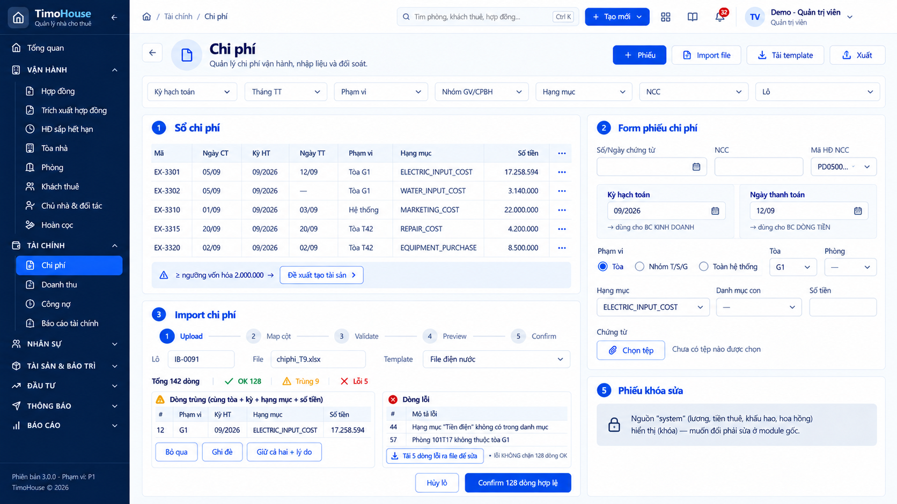
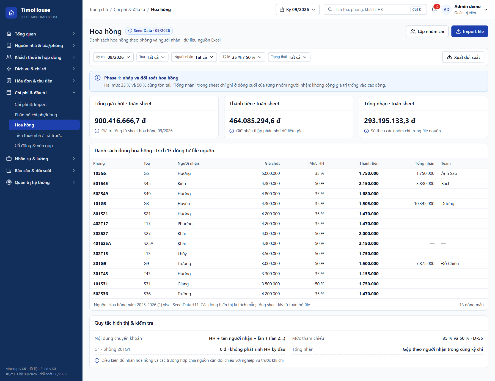
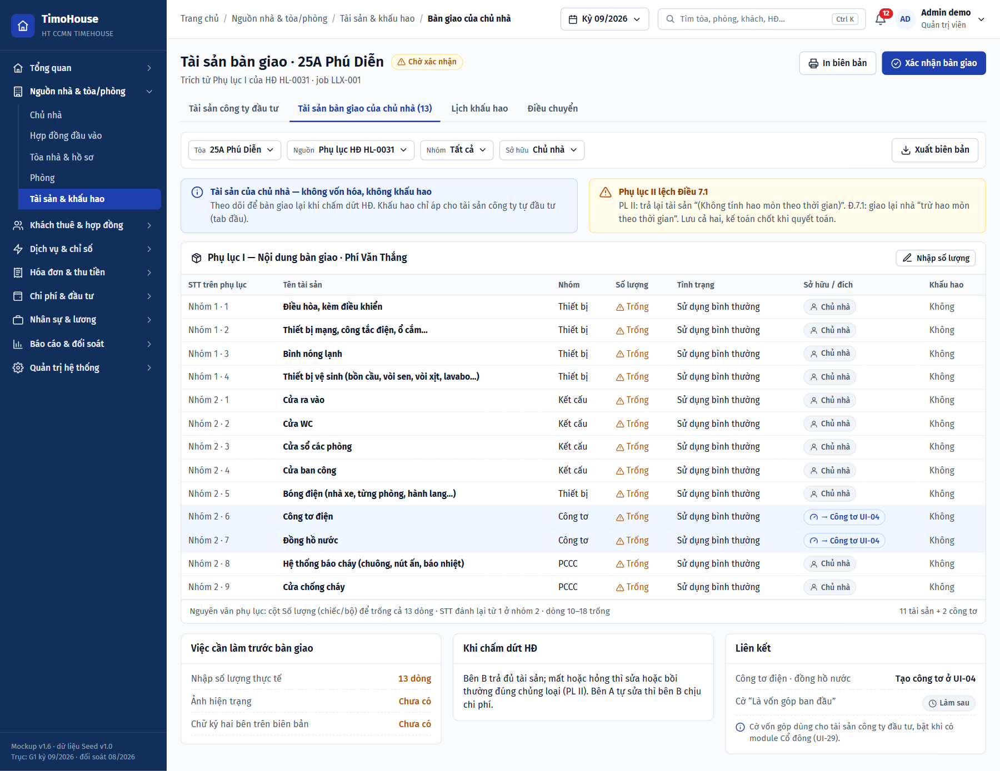

# TIMOHOUSE — SRS · Cụm Chi phí, tài sản & cổ đông

**Phiên bản:** 1.0 · **Ngày lập:** 25/09/2026 · **Trạng thái:** DRAFT, chờ khách hàng xác nhận
**Phạm vi:** FR24 Chi phí & Import · FR25 Phân bổ chi phí và lương · FR26 Hoa hồng · FR27 Tài sản & khấu hao · FR28 Tiền thuê nhà và chi phí trả trước · FR29 Cổ đông, cổ phần, góp vốn, phân phối. Flow liên quan: F-06 (Chi phí, phân bổ và khóa báo cáo), F-07 (Góp vốn và phân phối lợi nhuận).

**Nguồn:** [`TimoHouse_UI_Mockup_Spec_v1.0.md`](TimoHouse_UI_Mockup_Spec_v1.0.md) bản 1.9: §4, §6.2, §7, §8, UI-24…UI-29, mục *Chuỗi Nguồn nhà* (tài sản bàn giao UI-27), §13 F-06/F-07, §14, §15, §18. Dữ liệu mẫu ở [`TimoHouse_Mockup_Seed_Data_v1.0.md`](TimoHouse_Mockup_Seed_Data_v1.0.md) §4, §4.1, §5, §11, §16, §17.3. Ảnh mockup ở [`ui-imagegen-v1/06-chi-phi-dau-tu/`](ui-imagegen-v1/06-chi-phi-dau-tu/README.md) và [`ui-imagegen-v1/02-nguon-nha-toa-phong/`](ui-imagegen-v1/02-nguon-nha-toa-phong/README.md) (riêng UI-27). Kết luận từng ảnh theo [`AUDIT.md`](ui-imagegen-v1/AUDIT.md): chỉ nhúng `UI-24-expenses-import.png` (ĐẠT CÓ LƯU Ý) và `UI-27-handover-assets-verified.png` (verified). Các ảnh UI-25, UI-26 (cả bản verified), UI-27 khấu hao, UI-28, UI-29 và flow F-06, F-07 đều KHÔNG ĐẠT nên không dùng.

Quy ước đọc tài liệu và Common Rules 1–14 xem [`TimoHouse_SRS_v1.0.md`](TimoHouse_SRS_v1.0.md#common-rules-dùng-chung-cho-mọi-fr); tài liệu này chỉ dẫn chiếu, không lặp lại.

---

## Quy tắc chung của cụm

| Mã | Nội dung | Nguồn |
|---|---|---|
| Cluster Rule 06.1 | **Hai basis báo cáo, không gộp.** CF (Báo cáo dòng tiền) và AC (Báo cáo kinh doanh) tính riêng từ cùng chứng từ: • FR24: mỗi phiếu có 2 ô `Kỳ hạch toán` (AC) và `Ngày thanh toán` (CF), không gộp • FR25: phân bổ chạy riêng cho 2 basis, cùng phiên bản rule, khác tập phiếu đầu vào • FR26: kỳ ghi nhận hoa hồng (cả CF và AC) = tháng của ngày chi • FR27: khấu hao chỉ ảnh hưởng AC; CF ghi hết vào tháng mua • FR28: CF ghi tiền thuê theo tháng HĐ; AC dàn đều toàn thời hạn • FR29: phân phối lợi nhuận dùng basis AC; CF chỉ là cột tham khảo | BR-4.01.2, BR-4.02.14, BR-4.03.3, UI-27, UI-28, BR-4.06.8 |
| Cluster Rule 06.2 | **Tham số chờ chốt.** Mọi số liệu phụ thuộc một `P-xx` chưa chốt hiển thị chip `Cần xác nhận nghiệp vụ` kèm mã tham số và đọc từ trang cấu hình (refer to FR33), không hard-code. Tham số của cụm: P-02 (tháng khấu hao), P-03 (prorate ÷30), P-05 (hai mẫu số phòng), P-07 (hoa hồng nhiều đợt, mức ngoài tham chiếu), P-10 (chia lợi nhuận cổ đông), P-11 (ngưỡng vốn hóa), P-15 (HĐ nhiều tòa), P-23 (nhắc trả chủ nhà), P-29 (thành phần Đã góp) | §18 |
| Cluster Rule 06.3 | **Phiếu chi phí nguồn system.** Phiếu sinh từ module gốc (lương FR22, tiền thuê nhà FR28, khấu hao FR27, hoa hồng FR26) hiển thị ở FR24 với biểu tượng khóa, không sửa và không hủy tay; muốn đổi phải sửa ở module gốc | BR-4.01.10, BR-4.01.12 |
| Cluster Rule 06.4 | **Không cân bằng ngầm.** Mọi chênh lệch được hiển thị riêng kèm nơi xử lý, không tự điều chỉnh: phần dư làm tròn phân bổ (FR25), lệch số tiền hoa hồng file ↔ hệ thống và mẫu số ÷30/÷31 (FR26), hai cách tính khấu hao (FR27), chênh CF − AC lũy kế có dấu (FR28), chênh lệch mở sổ vốn (FR29) | §17.3, Seed §16 |
| Cluster Rule 06.5 | **Snapshot kỳ khóa.** Khi Admin khóa kỳ (refer to FR30), hệ thống freeze rule phân bổ, kết quả phân bổ, % cổ phần, lịch khấu hao đã ghi và payroll của kỳ đó; báo cáo (refer to FR31) đọc snapshot, không tính lại lúc render. Kỳ Reopened phải chạy lại phân bổ và tính lại phân phối chưa chi (Common Rule 12) | F-06 bước 5, BR-4.02.8, BR-4.02.13, BR-4.06.7 |

---
---

# FR24 - Chi phí & Import

## 1. Business Rule

| | |
|:-:|---|
| **Authorization** | • Admin, Kế toán: toàn quyền (tạo, import, xác nhận, hủy/đảo, xuất) • TPVH: ## (§4 chỉ nêu TPVH "xem báo cáo", không nêu quyền xem sổ chi phí — cần xác nhận) • NVVH: ## (UI-10 sinh "dòng chi phí đề xuất" sang màn này — cần xác nhận NVVH có quyền xem/tạo nháp không) • NV nguồn, Vệ sinh: không xem dữ liệu tài chính (§4) • Cổ đông: không truy cập (suy từ §4, cần xác nhận) |
| **Management Rule** | • Người dùng ghi nhận mọi chi phí không sinh tự động bằng phiếu tạo tay hoặc import file, xác nhận và hủy/đảo phiếu. Phiếu phạm vi Nhóm/Toàn hệ thống được chuyển sang phân bổ (refer to FR25, Screen 25.1) • Chức năng chỉ thực hiện được khi người dùng đã đăng nhập với vai trò thuộc Authorization ## • Ba nguồn phiếu: &nbsp;&nbsp;◦ Tạo tay: form phiếu (Screen 24.1, vùng ②) &nbsp;&nbsp;◦ Import: theo Common Rule 14, năm bước cố định Upload → Map cột → Validate → Preview → Confirm. Template ánh xạ cột **lưu lại được** để tái dùng cho file cùng cấu trúc. Import idempotent theo source key/hash &nbsp;&nbsp;◦ System: lương, tiền thuê nhà, khấu hao, hoa hồng. Khóa sửa theo Cluster Rule 06.3 (BR-4.01.10, Cần chốt) • **Lương không nhập ở đây**; lấy từ bảng lương đã khóa (refer to FR22) (BR-4.01.1, R-25, Đã chốt) • Phiếu tiền thuê nhà **chỉ sinh từ FR28**, không import tay để tránh trùng (BR-4.01.12, Cần chốt) • Hai kỳ trên mỗi phiếu, UI có đủ 2 ô và không gộp (Cluster Rule 06.1, BR-4.01.2, Đã chốt): &nbsp;&nbsp;◦ `Kỳ hạch toán` (MM/YYYY): bắt buộc; dùng cho báo cáo kinh doanh (AC) &nbsp;&nbsp;◦ `Ngày thanh toán`: bắt buộc khi đã trả; trống = `Chưa trả`; dùng cho báo cáo dòng tiền (CF) • Hạng mục phải nằm trong danh mục metric; **không cho tạo hạng mục tự do**. Danh mục con mở rộng được (BR-4.01.3) • Giá gốc điện/nước/mạng/rác/môi trường/thang máy: kỳ AC = **tháng hóa đơn NCC**, CF = ngày thực trả (BR-4.01.4, Cần chốt) • Điện nước phòng trống **không tách dòng riêng**; đã nằm trong giá gốc của tòa, chỉ thống kê thất thoát ở FR10 (BR-4.01.5, R-04, Đã chốt). Mâu thuẫn: spec UI-10 vùng ⑤ ghi phòng trống "VACANT … sinh dòng chi phí đề xuất sang UI-24" — cần thống nhất • Phạm vi phiếu: &nbsp;&nbsp;◦ Tòa: vào báo cáo tòa 100% &nbsp;&nbsp;◦ Nhóm T/S/G, Toàn hệ thống: **bắt buộc qua FR25** trước khi lên báo cáo (BR-4.01.6, Đã chốt) &nbsp;&nbsp;◦ Marketing và Thuê & DV văn phòng mặc định `Toàn hệ thống`; file import có cột phạm vi để ghi đè (BR-4.01.7, Cần chốt) • Phát hiện trùng: cùng tòa/phạm vi + kỳ hạch toán + hạng mục + số tiền (thêm `external_ref` nếu có). Người dùng chọn **Bỏ qua / Ghi đè / Giữ cả hai kèm lý do**; hệ thống không tự quyết (BR-4.01.8, Đã chốt) • Dòng lỗi **không chặn cả lô**: chỉ dòng OK được confirm, dòng lỗi xuất lại thành file để sửa (BR-4.01.9, Cần chốt) • Vốn hóa: mua thiết bị từ ngưỡng 2.000.000 đ/đơn vị trở lên (P-11, Cluster Rule 06.2) -> tự đề xuất tạo tài sản (refer to FR27, Screen 27.3); dưới ngưỡng ghi chi phí cả CF lẫn AC trong tháng mua (BR-4.01.11, Cần chốt) • Chi phí sửa chữa/dọn/sơn do khách gây ra vẫn ghi **đủ**; khoản khấu trừ cọc ghi thu nhập khác, **không bù trừ** (BR-4.01.13, R-29) • Chứng từ về muộn sau khi kỳ gốc đã khóa: kỳ hạch toán = **kỳ hiện tại**, ghi chú "chứng từ kỳ MM/YYYY" (BR-4.01.14, R-08; Common Rule 12) • Khoản trả trước nhiều tháng (ví dụ mạng G1 3.000.000 đ/6 tháng, Seed §4): kỳ hạch toán là **kỳ bắt đầu**; việc dàn đều do FR28 xử lý (BR-4.01.17) • Số tiền nhập **VND nguyên**, không nhận thập phân; làm tròn ở bước phân bổ (BR-4.01.18) • Schema file import chuẩn (thứ tự cột tự do, ánh xạ bằng template): &nbsp;&nbsp;◦ Mã phiếu (tùy chọn) → `external_ref`: dùng để phát hiện trùng &nbsp;&nbsp;◦ Ngày chứng từ → `document_date`: ngày hợp lệ, không thuộc kỳ đã khóa (mâu thuẫn với BR-4.01.14 cho phép chứng từ về muộn của kỳ đã khóa — cần xác nhận) &nbsp;&nbsp;◦ Kỳ hạch toán → `accounting_period`: `MM/YYYY`, kỳ chưa khóa &nbsp;&nbsp;◦ Ngày thanh toán → `payment_date`: trống → `Chưa trả` &nbsp;&nbsp;◦ Tòa / Phạm vi → `scope_type` + tòa/nhóm: `TOÀN HỆ THỐNG`, `NHÓM T`, hoặc mã tòa tồn tại &nbsp;&nbsp;◦ Nhóm (GV / CPBH): kiểm tra chéo với hạng mục &nbsp;&nbsp;◦ Hạng mục → `category_code`: metric code hợp lệ, chấp nhận tên tiếng Việt &nbsp;&nbsp;◦ Danh mục con → `subcategory_code`: ví dụ `ROOM_CLEANING`, `ROOM_PAINT`, `RESIDENCE_REG`, `SIGNAGE_SECURITY`, `MISC` &nbsp;&nbsp;◦ Nội dung → `description` &nbsp;&nbsp;◦ Số tiền → `amount`: số nguyên VND > 0 &nbsp;&nbsp;◦ NCC / Người nhận → `supplier_name` &nbsp;&nbsp;◦ Mã HĐ NCC → `supplier_contract_code`: khớp HĐ NCC của **đúng tòa**; gợi ý hạng mục mặc định &nbsp;&nbsp;◦ Phương thức → `payment_method`: CK / TM / Tự động &nbsp;&nbsp;◦ Chứng từ → `document_url`: link hoặc tên file trong zip &nbsp;&nbsp;◦ Phòng → `room_id`: mã phòng phải thuộc tòa đã chọn • Trạng thái phiếu: &nbsp;&nbsp;◦ Nháp: được sửa, hủy &nbsp;&nbsp;◦ Đã xác nhận: vào tập phiếu đầu vào của phân bổ/báo cáo &nbsp;&nbsp;◦ Đã phân bổ: đã được run phân bổ FR25 sử dụng (phiếu phạm vi Tòa không qua FR25 — có chuyển Đã phân bổ không?) &nbsp;&nbsp;◦ Đã khóa: thuộc kỳ Locked; chỉ điều chỉnh ở kỳ hiện tại, tham chiếu kỳ gốc (Common Rule 12) &nbsp;&nbsp;◦ Hủy • Trạng thái lô import: Đang mapping → Đã preview → Đã confirm → Hủy • Mã phiếu dạng `EX-xxxx` (ví dụ `EX-3301`), mã lô dạng `IB-xxxx` (ví dụ `IB-0091`) (cần xác nhận cách sinh mã) |
| **Management Impact** | • Xem, lọc, xuất không làm thay đổi dữ liệu; lọc chỉ tác động tới hiển thị hiện tại • Lưu phiếu tạo tay: tạo phiếu nguồn = Tạo tay (trạng thái ban đầu Nháp hay Đã xác nhận — spec không nêu) • Confirm lô: ghi các dòng OK và các dòng trùng đã chọn `Ghi đè` / `Giữ cả hai`; dòng `Bỏ qua` và dòng lỗi không ghi. Lô -> `Đã confirm`, lưu tên file, người tải, thời điểm, template, tổng dòng / OK / lỗi / trùng &nbsp;&nbsp;◦ Ghi đè: cập nhật phiếu có sẵn, lưu giá trị trước/sau (được ghi đè phiếu Đã xác nhận / Đã phân bổ không?) &nbsp;&nbsp;◦ Giữ cả hai: tạo phiếu mới, lưu lý do vào audit • Hủy lô: lô -> `Hủy`, không ghi dòng nào • Xác nhận phiếu: `Nháp` -> `Đã xác nhận` • Chạy phân bổ ở FR25: phiếu `Đã xác nhận` -> `Đã phân bổ` • Khóa kỳ (refer to FR30): phiếu của kỳ -> `Đã khóa` • Hủy/đảo: phiếu -> `Hủy` kèm lý do; phiếu thuộc kỳ đã khóa thì sinh bút toán đối ứng ở kỳ hiện tại (Common Rule 12) • Đề xuất tạo tài sản: mở Tạo tài sản (Screen 27.3) với nguồn chi phí = phiếu đang chọn. Cần xác nhận phiếu gốc được loại khỏi AC thế nào để không ghi trùng với khấu hao (CF vẫn ghi hết tháng mua) • Mọi thao tác ghi audit theo Common Rule 5 |

## 2. Screen 24.1: Chi phí & Import

<b>Screen 24.1: Chi phí & Import</b>

| **Fields** | **Format** | **Required?** | **Description** |
|:-:|:-:|:-:|:-:|
| Left Menu, Header | | | • Display follows Common Rule 1 • Highlight menu `Chi phí & Import` • Breadcrumb: `Trang chủ / Chi phí & đầu tư / Chi phí & Import` • Capture lệch spec: sidebar không theo §6.2, breadcrumb ghi "Tài chính / Chi phí", topbar có nút primary "+ Tạo mới" và thiếu bộ chọn Kỳ; mô tả theo Common Rule 1 |
| 🟧 Quản lý chi phí | | | |
| Back | Icon | No | • Always display • Click on -> ## (màn cấp 1 của menu, spec không có nút Back — cần xác nhận giữ hay bỏ) |
| Tiêu đề trang | Text | No | • Hiển thị "Chi phí" • Dòng phụ: ## (capture ghi "Quản lý chi phí vận hành, nhập liệu và đối soát" — spec không có, cần xác nhận) |
| + Phiếu | Button | No | • Always display. Đây là CTA chính của màn • Enabled only when người dùng có quyền tạo phiếu (Common Rule 7) • Click on -> ## (làm trống form ② để nhập phiếu mới, hay mở form riêng?) |
| Import file | Button | No | • Always display • Enabled only when người dùng có quyền import • Click on -> Tạo lô import mới và hiển thị bước Upload ở vùng ③ (Common Rule 14) (chưa có capture bước Upload, Map cột) |
| Tải template | Button | No | • Always display • Always enabled • Click on -> Tải file template theo schema import chuẩn (Business Rule) (định dạng file ##) |
| Xuất | Button | No | • Always display • Always enabled • Click on -> Xuất toàn bộ phiếu theo bộ lọc hiện tại (định dạng CSV/XLSX ##) |
| 🟧 Filter section | | | • Bộ lọc luôn hiển thị, không có icon đóng/mở • Tiêu chí được áp ngay khi chọn và phản ánh lên URL (Common Rule 6) • Không có ô tìm kiếm theo từ khóa (spec và capture đều không có) |
| Kỳ hạch toán | Dropdown | No | • Default selection: kỳ đang chọn trên Header (Common Rule 1) • Click on -> Display the list of options: Tất cả + các kỳ `MM/YYYY`; kỳ đã khóa kèm biểu tượng khóa • Allow single selection only. Selecting an option automatically deselects the previous selection • Select an option -> Search for all records with Kỳ hạch toán = selected option |
| Tháng TT | Dropdown | No | • Default selection: Tất cả • Click on -> Display the list of options: Tất cả + các tháng `MM/YYYY` (cần xác nhận có lựa chọn "Chưa trả" cho phiếu trống ngày thanh toán) • Allow single selection only • Select an option -> Search for all records with tháng của Ngày thanh toán = selected option |
| Phạm vi | Dropdown | No | • Default selection: Tất cả • Click on -> Display the list of options: Tất cả, Toàn hệ thống, Nhóm T, Nhóm S, Nhóm G, các tòa trong phạm vi quyền • Allow single selection only • Select an option -> Search for all records with Phạm vi = selected option |
| Nhóm GV/CPBH | Dropdown | No | • Default selection: Tất cả • Click on -> Display the list of options: Tất cả, GV (giá vốn), CPBH (chi phí bán hàng) • Allow single selection only • Select an option -> Search for all records with nhóm của hạng mục = selected option |
| Hạng mục | Dropdown | No | • Default selection: Tất cả • Click on -> Display the list of options: Tất cả + danh mục metric, ví dụ `ELECTRIC_INPUT_COST`, `WATER_INPUT_COST`, `MARKETING_COST`, `REPAIR_COST`, `EQUIPMENT_PURCHASE` • Allow single selection only • Select an option -> Search for all records with Hạng mục = selected option |
| NCC | Dropdown | No | • Default selection: Tất cả • Click on -> Display the list of options: Tất cả + danh sách NCC (nguồn danh mục NCC — cần xác nhận) • Allow single selection only • Select an option -> Search for all records with NCC = selected option |
| Lô | Dropdown | No | • Default selection: Tất cả • Click on -> Display the list of options: Tất cả + mã lô import, ví dụ `IB-0091` • Allow single selection only • Select an option -> Search for all records thuộc lô đã chọn |
| 🟧 ① Sổ chi phí | | | • Sổ hiển thị **cả kỳ hạch toán lẫn ngày thanh toán** vì một chứng từ phục vụ đồng thời hai biến thể báo cáo (Cluster Rule 06.1) |
| 🟦 Bảng sổ chi phí | | | • Display the list of phiếu chi phí trong phạm vi quyền, gồm cả phiếu nguồn system (hiển thị biểu tượng khóa, Cluster Rule 06.3) • Giá trị trống hiển thị `—` (Common Rule 3) • If there are no phiếu in the system, display error message E## • If no record matches the filter criteria, display error message E## • Default sorting: ## (cần xác nhận khóa sắp xếp và cột sortable) • Phân trang theo Common Rule 6 • Click on một dòng -> ## (nạp phiếu vào form ② để xem/sửa? spec không có màn chi tiết phiếu) • Spec liệt kê thêm cột NCC, category/metric mapping, mô tả, amount/VAT, scope phân bổ, attachment — capture chưa có, cần xác nhận bộ cột |
| Mã | Text | No | • Mã phiếu `EX-xxxx` |
| Ngày CT | Text | No | • Ngày chứng từ. Format: DD/MM/YYYY (Common Rule 10) (capture hiển thị rút gọn DD/MM) |
| Kỳ HT | Text | No | • Kỳ hạch toán. Format: MM/YYYY |
| Ngày TT | Text | No | • Ngày thanh toán; trống hiển thị `—` = Chưa trả |
| Phạm vi | Text | No | • "Tòa {mã tòa}", "Nhóm {T/S/G}" hoặc "Hệ thống" |
| Hạng mục | Text | No | • Metric code của hạng mục, ví dụ `ELECTRIC_INPUT_COST` |
| Số tiền | Number | No | • Số tiền VND nguyên, định dạng Common Rule 8 |
| Trạng thái | Tag | No | • Một trong: Nháp, Đã xác nhận, Đã phân bổ, Đã khóa, Hủy (Common Rule 4) • Capture thiếu cột Trạng thái (AUDIT); mô tả theo spec |
| Lô | Text | No | • Mã lô import của phiếu; phiếu tạo tay hiển thị "Tạo tay"; phiếu system hiển thị module nguồn • Capture thiếu cột Lô (AUDIT); mô tả theo spec |
| ⋯ | Icon | No | • Always display • Click on -> Display a dropdown for actions; không kích hoạt click dòng (Common Rule 6) • Danh sách action ## (cần capture dropdown); theo spec dự kiến: Xác nhận (phiếu Nháp), Hủy/đảo -> Display Popup hủy/đảo phiếu chi phí (Screen 24.3). Phiếu nguồn system không có Sửa/Hủy |
| Cảnh báo vốn hóa | Text | No | • Display only when phiếu có hạng mục mua thiết bị (`EQUIPMENT_PURCHASE`) và số tiền/đơn vị ≥ ngưỡng vốn hóa (P-11, Cluster Rule 06.2) • Hiển thị ngay dưới dòng phiếu liên quan. Content format: "△ ≥ ngưỡng vốn hóa 2.000.000 → Đề xuất tạo tài sản" • Capture lệch spec: cảnh báo đặt thành băng chung dưới bảng, chưa gắn vào dòng EX-3320; mô tả theo spec • Phiếu không có trường số lượng — cần xác nhận cách tính "đơn vị" |
| Đề xuất tạo tài sản | Button | No | • Display only when Cảnh báo vốn hóa hiển thị • Enabled only when người dùng có quyền tạo tài sản • Click on -> Go to Tạo tài sản (Screen 27.3, refer to FR27), nguồn chi phí = phiếu đang chọn |
| Page number | Text | No | • Click on a page number -> Go to the corresponding page |
| 🟧 ② Form phiếu chi phí | | | • Hai ô kỳ đóng khung cạnh nhau kèm chú thích dùng cho báo cáo nào, chống việc điền một ô rồi bỏ trống ô kia |
| Số / Ngày chứng từ | Datepicker | Yes | • Always display • Ngày chứng từ: Placeholder: none. Default selection: None. Click on -> Display a datepicker. Format: DD/MM/YYYY • If clicking out of the field while it is blank -> Show error message E## • Capture gộp số và ngày chứng từ vào một ô có icon lịch; spec Form ghi "số/ngày chứng từ" — cần xác nhận tách thành 2 field (Số chứng từ: Textbox, max length 255, map `external_ref`?) |
| NCC | Textbox | No | • Always display • Allow entering all types of characters. Max length: 255 • Cần xác nhận nhập tự do hay chọn từ danh mục NCC |
| Mã HĐ NCC | Dropdown | No | • Always display • Default selection: None • Click on -> Display the list of HĐ nhà cung cấp của **đúng tòa** đã chọn, ví dụ `PD0500…` • Allow single selection only • Select an option -> Gợi ý Hạng mục mặc định theo HĐ NCC • Mã không thuộc tòa đã chọn -> Show error message E## |
| Kỳ hạch toán | Datepicker | Yes | • Always display. Nhãn phụ: "→ dùng cho BC KINH DOANH" • Chọn tháng. Format: MM/YYYY • Default selection: ## (capture hiển thị 09/2026 = kỳ hiện tại) • Kỳ đã khóa bị disable; chứng từ về muộn của kỳ đã khóa -> kỳ hạch toán = kỳ hiện tại, kèm ghi chú "chứng từ kỳ MM/YYYY" (BR-4.01.14) • If clicking out of the field while it is blank -> Show error message E## |
| Ngày thanh toán | Datepicker | No | • Always display. Nhãn phụ: "→ dùng cho BC DÒNG TIỀN" • Default selection: None. Format: DD/MM/YYYY • Để trống = Chưa trả; bắt buộc khi phiếu đã trả (BR-4.01.2) • Cần xác nhận căn cứ xác định "đã trả" (theo Phương thức hay trường riêng) |
| Phạm vi | Radio button | Yes | • Always display • Default selection: Tòa; hạng mục Marketing và Thuê & DV văn phòng mặc định Toàn hệ thống (BR-4.01.7) • Options: &nbsp;&nbsp;◦ Tòa: chi phí vào báo cáo tòa 100%. Select this option -> Display Tòa và Phòng &nbsp;&nbsp;◦ Nhóm T/S/G: chi phí chia theo số phòng các tòa trong nhóm qua FR25. Select this option -> Display Nhóm T/S/G, ẩn Tòa và Phòng &nbsp;&nbsp;◦ Toàn hệ thống: chi phí chia qua FR25. Select this option -> Ẩn Tòa, Phòng và Nhóm |
| Tòa | Dropdown | Yes | • Display only when Phạm vi = Tòa • Default selection: None • Click on -> Display the list of tòa trong phạm vi quyền. Allow single selection only • Select an option -> Làm mới danh sách Phòng và Mã HĐ NCC • If clicking out of the field while it is blank -> Show error message E## |
| Nhóm T/S/G | Dropdown | Yes | • Display only when Phạm vi = Nhóm T/S/G • Click on -> Display the list of following options: T, S, G. Allow single selection only • If clicking out of the field while it is blank -> Show error message E## • Capture chưa có field này |
| Phòng | Dropdown | No | • Display only when Phạm vi = Tòa • Default selection: `—` • Click on -> Display the list of phòng thuộc tòa đã chọn. Allow single selection only • Phòng không thuộc tòa -> Show error message E## |
| Hạng mục | Dropdown | Yes | • Always display • Default selection: None (hoặc gợi ý từ Mã HĐ NCC) • Click on -> Display danh mục metric; không cho nhập hạng mục tự do (BR-4.01.3) • Allow single selection only • Select an option -> Xác định nhóm GV/CPBH và danh sách Danh mục con; hạng mục mua thiết bị và số tiền ≥ ngưỡng vốn hóa -> hiển thị Cảnh báo vốn hóa • If clicking out of the field while it is blank -> Show error message E## |
| Danh mục con | Dropdown | No | • Always display • Default selection: `—` • Click on -> Display the list of following options: `ROOM_CLEANING`, `ROOM_PAINT`, `RESIDENCE_REG`, `SIGNAGE_SECURITY`, `MISC`; danh mục mở rộng được (refer to FR33) • Allow single selection only |
| Số tiền | Textbox | Yes | • Always display • Allow entering numeric values (VND nguyên, không thập phân, Common Rule 8). Max length: 12 • If clicking out of the field while it is blank -> Show error message E## • If entering 0, display error message E## |
| Chứng từ | File uploader | No | • Instruction text: "Chọn tệp" · "Chưa có tệp nào được chọn" • Allow dragging and dropping file, as well as uploading from local device • Click on "Chọn tệp" -> Display a popup to select file from local device (Screen capture ##) • Supported file format: ##. If the selected file is in an unsupported format, display error message E## • Maximum file size: ##. If the file size exceeds the limit, show error message E## • If the file is of valid format and size, display the selected file in the frame |
| Trường khác theo spec | Textbox | No | • Spec Form liệt kê thêm: nội dung/mô tả, phương thức (CK/TM/Tự động), VAT, allocation rule, tài sản liên quan, ghi chú — capture chưa có; cần xác nhận vị trí, control và bắt buộc |
| Lưu phiếu | Button | No | • Capture và wireframe chưa có nút lưu trên form ② — cần xác nhận (Lưu nháp / Xác nhận chi phí), điều kiện enable và popup xác nhận (Screen ##) |
| 🟧 ③ Import chi phí | | | • Luồng import theo Common Rule 14 |
| Progress Bar | Image | No | • Display the current progress: Upload → Map cột → Validate → Preview → Confirm • Bước đã xong có dấu check; bước hiện tại được highlight • Capture lệch spec: stepper đang highlight bước Upload trong khi màn đã hiển thị kết quả Preview; mô tả theo spec • Chưa có capture các bước Upload, Map cột, Validate |
| Lô | Text | No | • Mã lô tự sinh, ví dụ `IB-0091` |
| File | Text | No | • Tên file đang import, ví dụ `chiphi_T9.xlsx` |
| Template | Dropdown | No | • Default selection: ## • Click on -> Display the list of template ánh xạ cột đã lưu, ví dụ "File điện nước" • Allow single selection only • Select an option -> Áp ánh xạ cột của template cho file đang import • Chưa có nút/thao tác lưu template mới — cần capture bước Map cột |
| Tổng hợp validate | Text | No | • Content format: "Tổng {n} dòng │ ✓ OK {a} │ △ Trùng {b} │ ✕ Lỗi {c}", ví dụ 142 / 128 / 9 / 5 • Ký hiệu luôn đi cùng chữ (Common Rule 4) |
| 🟦 Bảng dòng trùng | | | • Tiêu đề: "Dòng trùng (cùng tòa + kỳ + hạng mục + số tiền)" • Display the list of dòng trong file trùng với phiếu đã có theo khóa BR-4.01.8 • Capture chỉ thấy 1/9 dòng: cần xác nhận phân trang/cuộn, có hiển thị mã phiếu bị trùng không, và các nút xử lý áp theo từng dòng hay cả nhóm |
| # | Number | No | • Số dòng trong file gốc |
| Phạm vi | Text | No | • Phạm vi đọc từ file, ví dụ G1 |
| Kỳ HT | Text | No | • Kỳ hạch toán đọc từ file |
| Hạng mục | Text | No | • Hạng mục đọc từ file |
| Số tiền | Number | No | • Số tiền đọc từ file (Common Rule 8) |
| Bỏ qua | Button | No | • Always display • Always enabled • Click on -> Đánh dấu dòng trùng không được ghi khi confirm |
| Ghi đè | Button | No | • Always display • Always enabled • Click on -> Đánh dấu dòng sẽ ghi đè phiếu có sẵn khi confirm (cần xác nhận có popup xác nhận riêng không) |
| Giữ cả hai + lý do | Button | No | • Always display • Always enabled • Click on -> Display Popup giữ cả hai dòng trùng (Screen 24.2) |
| 🟦 Bảng dòng lỗi | | | • Display the list of dòng không qua validate, mỗi dòng kèm mô tả lỗi • Lỗi **không chặn** các dòng OK (BR-4.01.9) |
| # | Number | No | • Số dòng trong file gốc |
| Mô tả lỗi | Text | No | • Nguyên nhân lỗi, ví dụ "Hạng mục "Tiền điện" không có trong danh mục", "Phòng 101T17 không thuộc tòa G1" |
| Tải dòng lỗi ra file | Button | No | • Display only when có ít nhất 1 dòng lỗi. Nhãn: "Tải {n} dòng lỗi ra file để sửa" • Always enabled • Click on -> Tải file chứa các dòng lỗi kèm lý do (định dạng file ##) • Ghi chú cạnh nút: "lỗi KHÔNG chặn {m} dòng OK" |
| Hủy lô | Button | No | • Display only when lô chưa ở trạng thái Đã confirm hoặc Hủy • Always enabled • Click on -> Display popup xác nhận hủy lô (Screen ##); xác nhận -> lô chuyển `Hủy`, không ghi dòng nào |
| Confirm {n} dòng hợp lệ | Button | No | • Display only when lô ở bước Preview. Nhãn hiển thị số dòng sẽ ghi • Enabled only when có ít nhất 1 dòng hợp lệ (cần xác nhận có bắt buộc chọn hướng xử lý cho mọi dòng trùng trước khi confirm, và số {n} có cộng dòng trùng đã chọn Ghi đè/Giữ cả hai không) • Click on -> Validate in the following order: &nbsp;&nbsp;◦ Kỳ hạch toán của dòng thuộc kỳ đã khóa -> đưa dòng sang nhóm lỗi &nbsp;&nbsp;◦ If all conditions above are satisfied, display confirmation popup (Screen ##); xác nhận -> ghi phiếu, lô chuyển `Đã confirm` |
| 🟧 ⑤ Phiếu khóa sửa | | | |
| Nội dung | Text | No | • Always display • Content format: "Nguồn "system" (lương, tiền thuê, khấu hao, hoa hồng) hiển thị (khóa) — muốn đổi phải sửa ở module gốc." (Cluster Rule 06.3) |

## 3. Screen 24.2: Popup giữ cả hai dòng trùng

Chưa có capture — cần bổ sung. Nội dung dựng từ spec.

<b>Screen 24.2: Popup giữ cả hai dòng trùng</b>

| **Fields** | **Format** | **Required?** | **Description** |
|:-:|:-:|:-:|:-:|
| 🟧 The popup can be closed by the X icon or by clicking out of the popup. Closing the popup redirects the user to the underlying screen without any changes saved. (cần xác nhận popup có X icon) | | | |
| Message | Text | No | • Content format: "##" (cần nội dung chính xác) |
| Dòng import | Text | No | • Hiển thị số dòng, phạm vi, kỳ hạch toán, hạng mục, số tiền của dòng trùng |
| Phiếu có sẵn | Text | No | • ## (cần xác nhận có hiển thị mã phiếu đang có trong sổ bị trùng không) |
| Lý do | Textbox | Yes | • Always display • Placeholder: ## • Allow entering all types of characters. Max length: 255 • If clicking out of the field while it is blank -> Show error message E## |
| Hủy | Button | No | • Always appear • Always enabled • Click on -> Đóng popup, dòng giữ trạng thái chưa xử lý |
| Giữ cả hai | Button | No | • Always appear • Enabled only when đã nhập Lý do • Click on -> Đánh dấu dòng sẽ được ghi thành phiếu mới khi confirm lô, lưu lý do vào audit (BR-4.01.8), đóng popup |

## 4. Screen 24.3: Popup hủy/đảo phiếu chi phí

Chưa có capture — cần bổ sung. Nội dung dựng từ spec (§7.4, §14).

<b>Screen 24.3: Popup hủy/đảo phiếu chi phí</b>

| **Fields** | **Format** | **Required?** | **Description** |
|:-:|:-:|:-:|:-:|
| 🟧 The popup can be closed by the X icon or by clicking out of the popup. Closing the popup redirects the user to the underlying screen without any changes saved. | | | |
| Message | Text | No | • Danger popup (Common Rule 11) • Content format: "##" (cần nội dung chính xác) |
| Phiếu | Text | No | • Hiển thị mã phiếu, kỳ hạch toán, ngày thanh toán, hạng mục, số tiền, trạng thái |
| Kỳ ghi bút toán đối ứng | Text | No | • Display only when phiếu thuộc kỳ đã khóa • Content format: "Bút toán đối ứng ghi vào kỳ hiện tại {MM/YYYY}, tham chiếu kỳ gốc {MM/YYYY}" (Common Rule 12) |
| Lý do | Textbox | Yes | • Always display • Allow entering all types of characters. Max length: 255 • If clicking out of the field while it is blank -> Show error message E## |
| Hủy | Button | No | • Always appear • Always enabled • Click on -> Đóng popup, không thay đổi dữ liệu |
| Xác nhận hủy/đảo | Button | No | • Always appear • Enabled only when đã nhập Lý do và phiếu không phải nguồn system (Cluster Rule 06.3) • Click on -> Phiếu chuyển `Hủy` (hoặc sinh bút toán đối ứng ở kỳ hiện tại nếu kỳ gốc đã khóa), lưu lý do, đóng popup và cập nhật Screen 24.1 • Phiếu đã được run phân bổ sử dụng: cần xác nhận có bắt buộc chạy lại FR25 không |

## 5. User Steps

| | |
|:-:|---|
| **Pre-condition** | Kế toán đã đăng nhập, có file chi phí của kỳ cần import |
| **User steps** | **Step 1:** Click menu `Chi phí & Import` -> display Chi phí & Import (Screen 24.1) **Step 2:** Click `Import file`, upload file và chọn template -> display vùng ③ ở bước Preview (Screen 24.1) (chưa có capture các bước Upload, Map cột, Validate) **Step 3:** Tại một dòng trùng, click `Giữ cả hai + lý do` -> display Popup giữ cả hai dòng trùng (Screen 24.2) **Step 4:** Click `Confirm {n} dòng hợp lệ` và xác nhận -> display Screen 24.1 với sổ chi phí đã cập nhật (popup xác nhận Screen ##) **Step 5 (F-06):** Click menu `Phân bổ chi phí/lương` -> display Phân bổ chi phí & lương (Screen 25.1, refer to FR25) |

| | |
|:-:|---|
| **Pre-condition** | Kế toán đã đăng nhập; sổ chi phí có phiếu cần xử lý |
| **User steps** | **Step 1:** Tại Screen 24.1, click `⋯` trên một dòng → `Hủy/đảo` -> display Popup hủy/đảo phiếu chi phí (Screen 24.3) **Step 2:** Tại dòng mua thiết bị có cảnh báo vốn hóa, click `Đề xuất tạo tài sản` -> display Tạo tài sản (Screen 27.3, refer to FR27) |

---
---

# FR25 - Phân bổ chi phí và lương

## 1. Business Rule

| | |
|:-:|---|
| **Authorization** | • Kế toán: tạo phiên bản rule, mô phỏng, chạy, so sánh run, xuất • Admin: toàn quyền; riêng phương pháp `Tỷ lệ nhập tay` chỉ Admin nhập (BR-4.02.12); khóa kỳ ở FR30 • Người duyệt run: ## (spec có action "duyệt" nhưng không nêu vai trò — cần xác nhận) • TPVH, Trưởng khu vực: ## (quyền xem kết quả phân bổ — cần xác nhận) • NVVH, NV nguồn, Cổ đông: không truy cập (suy từ §4, cần xác nhận) |
| **Allocation Rule** | • Người dùng phân bổ chi phí phạm vi Nhóm/Toàn hệ thống và lương cố định theo level về từng tòa theo phiên bản rule; kết quả mỗi kỳ là snapshot để báo cáo đọc (refer to FR31) • Chức năng chỉ thực hiện được khi người dùng đã đăng nhập với vai trò thuộc Authorization ## • Rule gồm: mã/tên, nguồn chi phí (source category), phạm vi, basis, phương pháp, phần cố định, ngày hiệu lực, version, trạng thái • Phương pháp: &nbsp;&nbsp;◦ Theo số phòng N: công thức chuẩn bên dưới &nbsp;&nbsp;◦ Nhóm T/S/G: chia theo số phòng trong phạm vi các tòa của nhóm (BR-4.02.11, Cần chốt) &nbsp;&nbsp;◦ Tỷ lệ nhập tay: chỉ khi Admin nhập tỷ lệ theo tòa tổng 100% kèm lý do (BR-4.02.12, Cần chốt; Common Rule 12 "ghi đè phân bổ") &nbsp;&nbsp;◦ Ghi thẳng tòa: lương hiệu suất của quản lý tòa, không phân bổ &nbsp;&nbsp;◦ Theo doanh thu, theo số tòa: **tắt ở Phase 1** (BR-4.02.12). Mâu thuẫn: wireframe ① có dòng "Vệ sinh · Theo tòa · 550.000/tòa" — cần xác nhận "Theo tòa" là phương pháp riêng hay chỉ là phần cố định • Công thức hiển thị tường minh: `allocated = (Tổng chi phí ÷ N) × n + phần cố định` &nbsp;&nbsp;◦ N = tổng phòng đang quản lý cuối kỳ, **kể cả phòng trống** &nbsp;&nbsp;◦ n = số phòng của tòa cuối kỳ &nbsp;&nbsp;◦ N và n **tính tự động** từ master phòng (refer to FR05) và phân công (refer to FR20) tại ngày cuối kỳ; không có ô nhập tay N (BR-4.02.2 → P-05, Cần chốt) • Phần cố định theo rule version (tham số, không hard-code): TPVH `+10.000 × n`; kế toán `10.000 × n + 10.000/tòa`; vệ sinh `550.000/tòa` • Tổng đem chia = Σ phiếu `Đã xác nhận` cùng hạng mục, phạm vi toàn hệ thống trong kỳ (refer to FR24, Screen 24.1); **không nhập tay tổng** (BR-4.02.3, Đã chốt) • Lương cố định theo chức danh = Σ kết quả **bảng lương đã khóa** (refer to FR22); không nhập số cứng (BR-4.02.4, BR-4.02.6). Lương hiệu suất của quản lý tòa **ghi thẳng tòa**, dòng rule ghi rõ "không phân bổ" • Lương phân bổ về tòa dùng **kỳ lương** cho cả CF và AC; tháng chi lương chỉ là sổ quỹ (BR-4.02.15, Cần chốt) • Phiên bản rule áp cho kỳ = phiên bản hiệu lực **ngày cuối kỳ**; phiên bản đã dùng bởi kỳ Locked **không sửa được**, chỉ tạo phiên bản mới (BR-4.02.7, Cần chốt) • Σ phân bổ của mọi tòa = tổng nguồn; sai số làm tròn ≤ số tòa (VND); **phần dư gán vào tòa có n lớn nhất** và hiển thị công khai (BR-4.02.9; Cluster Rule 06.4). Làm tròn VND ở cấp dòng tòa; đối soát golden chấp nhận dung sai ≤ 1 VND/dòng (BR-4.02.16) • Tòa đã trả chủ nhà trước cuối tháng (n = 0) **không nhận phân bổ và không đếm vào N**; tòa mới nhận từ tháng có phòng đưa vào quản lý (BR-4.02.10, Cần chốt) • Phân bổ chạy **riêng cho 2 basis**: CF theo tháng thanh toán, AC theo kỳ hạch toán; cùng phiên bản rule, khác tập phiếu đầu vào (BR-4.02.14; Cluster Rule 06.1) • Hai mẫu số khác nhau, UI không dùng lẫn: N phân bổ (1.303 của T6/2026, 1.382 của T8/2026) ≠ số phòng tính hiệu suất lương (1.079 của T8). Con số 1.343 ở dòng lương sửa chữa T8 là chênh lệch nguồn cần đánh dấu (P-05; Decision Log #20, ASSUMED). Wireframe kỳ 09/2026 dùng N = 1.382 là số của T8 — N kỳ 09 chưa có nguồn • Kết quả mỗi kỳ là **snapshot** lưu tổng, N, n, phiên bản; báo cáo đọc snapshot chứ không tính lại lúc render (BR-4.02.8; Cluster Rule 06.5) • Kỳ `Reopened` **bắt buộc chạy lại** phân bổ trước khi khóa lại; bảng chênh lệch với run cũ phải được duyệt (BR-4.02.13, R-08) • Trạng thái: &nbsp;&nbsp;◦ Rule: Nháp → Hiệu lực → Hết hiệu lực &nbsp;&nbsp;◦ Run: Nháp → Đã duyệt → Đã khóa; mở lại kỳ sinh run mới và lưu trữ run cũ |
| **Allocation Impact** | • Xem, đổi basis, xem so sánh không làm thay đổi dữ liệu • Mô phỏng: tính và hiển thị kết quả theo rule hiện tại (spec không định nghĩa "Mô phỏng" — cần xác nhận không lưu run/snapshot) • Chạy thành công: tạo run `Nháp` cho từng basis, lưu tổng nguồn, N, n từng tòa, phần cố định, phiên bản rule, chênh làm tròn và tòa nhận phần dư. Phiếu nguồn ở FR24 -> `Đã phân bổ` (khi run Nháp hay khi Duyệt?) • Duyệt: run `Nháp` -> `Đã duyệt` • Khóa kỳ (FR30): run `Đã duyệt` -> `Đã khóa`, freeze theo Cluster Rule 06.5 • Kỳ Reopened: sinh run mới, run cũ chuyển lưu trữ • Tạo phiên bản rule: rule mới `Nháp`, chuyển `Hiệu lực` từ ngày hiệu lực; phiên bản trước -> `Hết hiệu lực` (cần xác nhận có bước duyệt rule không) • Mọi thao tác ghi audit theo Common Rule 5 |

## 2. Screen 25.1: Phân bổ chi phí & lương

Chưa có capture đạt — ảnh ImageGen UI-25-expense-salary-allocation.png KHÔNG ĐẠT (AUDIT: thiếu gần hết vùng ①–⑦, N = 1.240 sai (đúng 1.382), dùng phương pháp phân bổ không có trong spec, G1 "347 căn" trái seed 15 phòng), không dùng. Nội dung dựng từ spec (wireframe UI-25).

<b>Screen 25.1: Phân bổ chi phí & lương</b>

| **Fields** | **Format** | **Required?** | **Description** |
|:-:|:-:|:-:|:-:|
| Left Menu, Header | | | • Display follows Common Rule 1 • Highlight menu `Phân bổ chi phí/lương` • Breadcrumb: `Trang chủ / Chi phí & đầu tư / Phân bổ chi phí/lương` • Route chuẩn `#/expenses?tab=allocation` là tab của trang Chi phí trong khi menu là mục riêng — cần xác nhận |
| Tiêu đề | Text | No | • Hiển thị "Phân bổ chi phí & lương · Kỳ {MM/YYYY}", kỳ theo bộ chọn Kỳ trên Header • Kèm Tag trạng thái run của basis đang xem (Nháp / Đã duyệt / Đã khóa) |
| Mô phỏng | Button | No | • Always display • Enabled only when kỳ chưa khóa và người dùng có quyền chạy • Click on -> Tính kết quả theo rule hiện tại và hiển thị ở vùng ③ (cần xác nhận nhãn phân biệt kết quả mô phỏng với run đã lưu) |
| Chạy | Button | No | • Always display. Đây là CTA chính của màn • Enabled only when kỳ đang mở hoặc Reopened và người dùng có quyền chạy • Click on -> Display popup xác nhận chạy phân bổ (Screen ##); xác nhận -> tạo run `Nháp` cho cả CF và AC |
| Duyệt | Button | No | • Display only when run = Nháp • Enabled only when người dùng có quyền duyệt (vai trò ##); kỳ Reopened thì phải đã mở bảng so sánh với run trước • Click on -> Display Popup duyệt kết quả phân bổ (Screen 25.4) |
| Xuất | Button | No | • Spec có action "export" nhưng wireframe chưa có nút — cần xác nhận vị trí và định dạng |
| 🟧 ① Rule đang áp dụng | | | |
| Phiên bản rule | Text | No | • Content format: "Allocation Rule v{n} (hiệu lực {DD/MM/YYYY})", ví dụ "Allocation Rule v4 (hiệu lực 01/01/2026)" • Phiên bản hiển thị = phiên bản hiệu lực ngày cuối kỳ (BR-4.02.7) |
| Tạo phiên bản mới | Button | No | • Spec có action "tạo version rule" nhưng wireframe chưa có nút — cần xác nhận vị trí • Enabled only when người dùng có quyền cấu hình rule • Click on -> Display Popup tạo phiên bản rule phân bổ (Screen 25.2) |
| 🟦 Bảng rule | | | • Mỗi nguồn chi phí/lương một dòng; không phân trang • Click on một dòng -> ## (xem chi tiết rule?) |
| Nguồn | Text | No | • Nguồn chi phí/lương, ví dụ Lương cố định level, Kế toán, Vệ sinh, Marketing, Thuê & DV văn phòng, Lương hiệu suất QL |
| Phạm vi | Text | No | • Hệ thống / Nhóm / Tòa |
| Phương pháp | Text | No | • Theo số phòng / Nhóm T/S/G / Tỷ lệ nhập tay / Ghi thẳng tòa; lương hiệu suất QL hiển thị "GHI THẲNG TÒA" |
| Phần cố định | Text | No | • Ví dụ "TPVH +10.000×n", "10.000×n + 10.000/tòa", "550.000/tòa"; không có hiển thị `—`; dòng ghi thẳng tòa hiển thị "không phân bổ" |
| 🟧 ② Công thức hiển thị tường minh | | | • Hiển thị N ngay cạnh công thức kèm định nghĩa đầy đủ, vì hiểu sai N là nguyên nhân lệch số phổ biến |
| Công thức | Text | No | • Always display • Content format: "allocated = (Tổng chi phí ÷ N) × n + phần cố định" |
| N | Text | No | • Content format: "N = {N} (tổng phòng đang quản lý cuối kỳ, KỂ CẢ phòng trống)" • Tự tính, không nhập tay (BR-4.02.2); kèm chip `Cần xác nhận nghiệp vụ` P-05 (Cluster Rule 06.2) |
| 🟧 ③ Kết quả run | | | |
| Nguồn đang xem | Dropdown | No | • Default selection: ## • Click on -> Display danh sách nguồn trong rule. Allow single selection only • Select an option -> Hiển thị kết quả của nguồn đã chọn kèm tổng, ví dụ "nguồn "Marketing" · tổng 22.000.000" • Wireframe chỉ ghi tên nguồn trên tiêu đề — cần xác nhận control chọn nguồn |
| 🟦 Bảng kết quả | | | • Mỗi tòa có n > 0 một dòng; tòa n = 0 không có dòng (BR-4.02.10) • Default sorting: ## • Chưa có run: display error message E## • Dòng cuối là dòng tổng Σ |
| Tòa | Text | No | • Mã tòa, ví dụ T42, T24, G1 |
| n | Number | No | • Số phòng của tòa cuối kỳ |
| n/N | Number | No | • Tỷ lệ phần trăm để kiểm tra nhanh bằng mắt, ví dụ 42 ÷ 1.382 = 3,039 % • Wireframe hiển thị 3 chữ số thập phân, trái Common Rule 8 (tối đa 2) — cần xác nhận |
| Phân bổ | Number | No | • = (Tổng chi phí ÷ N) × n, làm tròn VND ở cấp dòng, ví dụ T42: 668.596; G1 (15 phòng): 238.784 • Wireframe dòng T24 (38 phòng) ghi 605.000, trong khi 22.000.000 ÷ 1.382 × 38 = 604.920 — cần sửa số minh họa |
| Cố định | Number | No | • Phần cố định theo rule của nguồn; không có hiển thị 0 |
| Tổng dòng | Number | No | • = Phân bổ + Cố định |
| Dòng tổng | Text | No | • Content format: "Σ {N} │ 100,00 % │ {Σ phân bổ} │ {Σ cố định}", ví dụ Σ 1.382 · 21.999.994 |
| ④ Chênh làm tròn | Text | No | • Display only when Σ phân bổ ≠ tổng nguồn • Content format: "+{d} đ dồn vào {tòa} (tòa có n lớn nhất)", ví dụ "+6 đ dồn vào T42" • Không điều chỉnh âm thầm (Cluster Rule 06.4) |
| 🟧 ⑤ Hai basis chạy riêng | | | |
| Basis | Radio button | No | • Always display • Default selection: CF — theo tháng thanh toán • Options: &nbsp;&nbsp;◦ CF — theo tháng thanh toán. Select this option -> Hiển thị run CF (tập phiếu theo Ngày thanh toán) &nbsp;&nbsp;◦ AC — theo kỳ hạch toán. Select this option -> Hiển thị run AC (tập phiếu theo Kỳ hạch toán) • Ghi chú: "Cùng rule version, khác tập phiếu đầu vào" |
| 🟧 ⑥ Cảnh báo | | | • Hai tình huống trông như lỗi nhưng đúng thiết kế, nói rõ để người kiểm tra không đi sửa nhầm |
| Tòa n = 0 | Text | No | • Display only when có tòa trả chủ nhà trước cuối kỳ • Content format: "△ Tòa {mã} đã trả chủ nhà {DD/MM} → n = 0 → không nhận phân bổ và KHÔNG đếm vào N", ví dụ G9 trả 15/09 |
| Hai mẫu số | Text | No | • Always display • Content format: "△ N kỳ này ({N}) khác số phòng tính hiệu suất lương ({m}) — đúng thiết kế, không phải lỗi" (P-05) |
| Thiếu tòa | Text | No | • Spec run detail có "cảnh báo thiếu tòa" nhưng chưa nêu điều kiện và nội dung — cần bổ sung |
| 🟧 ⑦ So sánh và khóa | | | |
| So sánh với run trước | Button | No | • Display only when kỳ đã có run trước (kỳ Reopened) (cần xác nhận có hiển thị cho kỳ thường không) • Always enabled • Click on -> Display So sánh với run trước (Screen 25.3) |
| Khóa theo kỳ | Button | No | • Display only when run = Đã duyệt • Click on -> ## (khác gì với Khóa kỳ ở FR30? F-06 ghi Admin khóa kỳ sẽ freeze allocation — cần xác nhận nút này có còn cần) |
| Trạng thái | Tag | No | • Trạng thái run: Nháp / Đã duyệt / Đã khóa (Common Rule 4) |

## 3. Screen 25.2: Popup tạo phiên bản rule phân bổ

Chưa có capture — cần bổ sung. Nội dung dựng từ spec (Rule list, Phương pháp).

<b>Screen 25.2: Popup tạo phiên bản rule phân bổ</b>

| **Fields** | **Format** | **Required?** | **Description** |
|:-:|:-:|:-:|:-:|
| 🟧 The popup can be closed by the X icon or by clicking out of the popup. Closing the popup redirects the user to the underlying screen without any changes saved. (cần xác nhận popup có X icon) | | | |
| Mã / tên rule | Textbox | Yes | • Always display • Allow entering all types of characters. Max length: 255 • If clicking out of the field while it is blank -> Show error message E## |
| Nguồn chi phí/lương | Dropdown | Yes | • Always display • Default selection: None • Click on -> Display the list of following options: hạng mục chi phí phạm vi Nhóm/Toàn hệ thống và nguồn lương cố định level (cần danh sách chính xác) • Allow single selection only • If clicking out of field while it is blank -> Show error message E## |
| Phạm vi | Dropdown | Yes | • Always display • Click on -> Display the list of following options: Hệ thống, Nhóm T/S/G, Tòa • Allow single selection only |
| Basis | Dropdown | No | • Rule list của spec có trường "basis" nhưng BR-4.02.14 nói cùng phiên bản rule áp cho cả CF và AC — cần xác nhận ý nghĩa trường này |
| Phương pháp | Dropdown | Yes | • Always display • Default selection: Theo số phòng • Click on -> Display the list of following options: &nbsp;&nbsp;◦ Theo số phòng N. Select this option -> ẩn Bảng tỷ lệ theo tòa &nbsp;&nbsp;◦ Nhóm T/S/G: chia theo số phòng các tòa trong nhóm. Select this option -> ẩn Bảng tỷ lệ theo tòa &nbsp;&nbsp;◦ Tỷ lệ nhập tay: chỉ Admin. Select this option -> Display Bảng tỷ lệ theo tòa và Lý do &nbsp;&nbsp;◦ Ghi thẳng tòa: dùng cho lương hiệu suất QL. Select this option -> ẩn Phần cố định &nbsp;&nbsp;◦ Theo doanh thu, Theo số tòa: hiển thị disabled, tooltip "Tắt ở Phase 1" (BR-4.02.12) • Allow single selection only |
| Phần cố định | Textbox | No | • Display only when Phương pháp ≠ Ghi thẳng tòa • Allow entering numeric values (VND). Max length: 12 • Cần xác nhận cách nhập công thức dạng "10.000 × n + 10.000/tòa" (một hay hai ô: theo phòng, theo tòa) |
| Ngày hiệu lực | Datepicker | Yes | • Always display • Default selection: None. Format: DD/MM/YYYY • If clicking out of field while it is blank -> Show error message E## • Không cho chọn ngày thuộc kỳ đã khóa (cần xác nhận) |
| Bảng tỷ lệ theo tòa | Textbox | Yes | • Display only when Phương pháp = Tỷ lệ nhập tay • Mỗi tòa một dòng: Tòa (Text), Tỷ lệ % (Textbox, integer và decimal, max length 6, tối đa 2 chữ số thập phân theo Common Rule 8) • Tổng ≠ 100% -> display error message E## |
| Lý do | Textbox | Yes | • Display only when Phương pháp = Tỷ lệ nhập tay • Allow entering all types of characters. Max length: 255 • If clicking out of field while it is blank -> Show error message E## |
| Hủy | Button | No | • Always appear • Always enabled • Click on -> Đóng popup, không lưu |
| Lưu phiên bản | Button | No | • Always appear • Always enabled • Click on -> Validate in the following order: &nbsp;&nbsp;◦ If there are any fields with invalid values, display error messages as mentioned above &nbsp;&nbsp;◦ ## &nbsp;&nbsp;◦ If all conditions above are satisfied -> tạo phiên bản rule mới (không sửa phiên bản đã dùng bởi kỳ khóa), đóng popup và cập nhật vùng ① |

## 4. Screen 25.3: So sánh với run trước

Chưa có capture — cần bổ sung. Spec chỉ nêu "bảng chênh lệch với run cũ phải được duyệt" (BR-4.02.13); bố cục dựng từ spec.

<b>Screen 25.3: So sánh với run trước</b>

| **Fields** | **Format** | **Required?** | **Description** |
|:-:|:-:|:-:|:-:|
| 🟧 The popup can be closed by the X icon or by clicking out of the popup. Closing the popup redirects the user to the underlying screen without any changes saved. (cần xác nhận là popup hay trang riêng) | | | |
| Thông tin so sánh | Text | No | • Hiển thị kỳ, basis, nguồn, phiên bản rule và N của run cũ (đã lưu trữ) và run mới |
| 🟦 Bảng chênh lệch | | | • Mỗi tòa một dòng; tòa chỉ có ở một run vẫn hiển thị, run còn lại `—` • Cột và sắp xếp chưa được spec mô tả — dưới đây là đề xuất tối thiểu |
| Tòa | Text | No | • Mã tòa |
| Run cũ | Number | No | • Tổng dòng của tòa ở run cũ |
| Run mới | Number | No | • Tổng dòng của tòa ở run mới |
| Chênh lệch | Number | No | • = Run mới − Run cũ, hiển thị kèm dấu |
| Đóng | Button | No | • Always appear • Always enabled • Click on -> Quay lại Screen 25.1; ghi nhận người dùng đã xem bảng so sánh (điều kiện enable `Duyệt`) |

## 5. Screen 25.4: Popup duyệt kết quả phân bổ

Chưa có capture — cần bổ sung. Nội dung dựng từ spec (§7.4, Common Rule 11).

<b>Screen 25.4: Popup duyệt kết quả phân bổ</b>

| **Fields** | **Format** | **Required?** | **Description** |
|:-:|:-:|:-:|:-:|
| 🟧 The popup can be closed by the X icon or by clicking out of the popup. Closing the popup redirects the user to the underlying screen without any changes saved. | | | |
| Tóm tắt thay đổi và tác động | Text | No | • Hiển thị kỳ, basis, phiên bản rule, N, số nguồn, tổng nguồn, Σ phân bổ, chênh làm tròn và tòa nhận phần dư (Common Rule 11) • Kỳ Reopened: kèm tổng chênh lệch so với run cũ |
| Hủy | Button | No | • Always appear • Always enabled • Click on -> Đóng popup, run giữ `Nháp` |
| Duyệt | Button | No | • Always appear • Always enabled • Click on -> Run -> `Đã duyệt`, đóng popup và cập nhật Screen 25.1 |

## 6. User Steps

| | |
|:-:|---|
| **Pre-condition** | Kế toán đã đăng nhập; phiếu chi phí phạm vi Nhóm/Toàn hệ thống của kỳ đã `Đã xác nhận` ở FR24; bảng lương kỳ đã khóa (refer to FR22) |
| **User steps** | **Step 1:** Click menu `Phân bổ chi phí/lương` -> display Phân bổ chi phí & lương (Screen 25.1) **Step 2:** Click `Tạo phiên bản mới` -> display Popup tạo phiên bản rule phân bổ (Screen 25.2) **Step 3:** Click `Chạy` và xác nhận -> display Screen 25.1 với run `Nháp` (popup xác nhận Screen ##) **Step 4:** Click `Duyệt` -> display Popup duyệt kết quả phân bổ (Screen 25.4) **Step 5 (F-06):** Sau ngày 20, Kế toán mở Kỳ báo cáo & khóa kỳ để kiểm checklist và gửi Reviewing -> display Kỳ báo cáo (refer to FR30) |

| | |
|:-:|---|
| **Pre-condition** | Kỳ đã khóa được Admin mở lại (`Reopened`) |
| **User steps** | **Step 1:** Tại Screen 25.1, click `Chạy` -> display Screen 25.1 với run mới `Nháp` **Step 2:** Click `So sánh với run trước` -> display So sánh với run trước (Screen 25.3) **Step 3:** Click `Đóng` rồi `Duyệt` -> display Popup duyệt kết quả phân bổ (Screen 25.4) |

---
---

# FR26 - Hoa hồng

## 1. Business Rule

| | |
|:-:|---|
| **Authorization** | • Kế toán: import, tạo tay, ghép HĐ/phòng, xác nhận, xác nhận thủ công điều kiện đủ, lập nhóm chi, ghi đã chi, hủy dòng chưa chi, xuất • Admin: toàn quyền • Người duyệt dòng có mức ngoài tham chiếu: ## (spec ghi "yêu cầu duyệt" nhưng không nêu vai trò) • TPVH: không sửa hoa hồng (§4); quyền xem ## (cần xác nhận) • NVKD/Sale: chỉ xem bản ghi hoa hồng của bản thân; không sửa, không duyệt (§4) • Cổ đông, NV nguồn, Vệ sinh: không truy cập (suy từ §4, cần xác nhận) |
| **Management Rule** | • Kế toán nhập các dòng hoa hồng từ file nguồn (hoặc tạo tay), hệ thống đối chiếu điều kiện đủ và số tiền, kế toán lập nhóm chi theo người nhận và ghi đã chi. Phase 1 **chỉ import**: không có Commission Engine, hệ thống không tự tính mức và không tự split theo policy (BR-4.03.1 → X-02, Đã chốt) • Chức năng chỉ thực hiện được khi người dùng đã đăng nhập với vai trò thuộc Authorization ## • Entity `COMMISSION_IMPORT_LINE`. Mỗi dòng gồm: deal key, số đợt (`installment_no/total`), kỳ/tháng trả, tòa/phòng, khách/HĐ, người nhận, giá chốt, cơ sở tính, tỷ lệ, số tiền, điều kiện đủ, trạng thái chi và ngày chi, cờ "mức ngoài tham chiếu", cờ "chưa gắn HĐ", trạng thái • Tòa của dòng suy ra từ mã phòng; mã có chữ (`401S4A`) phải tra master phòng (refer to FR05) (BR-4.03.4) • Số tiền lấy theo file. Hệ thống tính `giá chốt × tỷ lệ − giảm trừ` để **đối chiếu**; lệch > 1.000 đ thì cảnh báo và **không tự ghi đè** (BR-4.03.5; Cluster Rule 06.4) • Mức tham chiếu, chỉ để cảnh báo, **không chặn** (BR-4.03.6 → P-07, Cần chốt): &nbsp;&nbsp;◦ Đối tác / lead: 50% &nbsp;&nbsp;◦ Nhân viên: 35% &nbsp;&nbsp;◦ HĐ dưới 6 tháng: mức ÷ 6 × số tháng &nbsp;&nbsp;◦ Trùng n nguồn: mức ÷ n; mỗi nguồn 1 dòng; kế toán nhập n, hệ thống chỉ kiểm tra (BR-4.03.13) &nbsp;&nbsp;◦ Tính theo phần trăm, **không có bậc thang** &nbsp;&nbsp;◦ Mức ngoài tham chiếu (ví dụ 65%) -> cảnh báo và yêu cầu duyệt, không chặn import • Bỏ cọc: cơ sở tính = cọc − giá ÷ 30 × số ngày đã ở; hoa hồng = cơ sở × 50%. **Hiển thị song song** số theo file (đang ÷ 31) và số chuẩn hóa để đối chiếu (BR-4.03.7 → P-03; Decision Log #11, ASSUMED). AUDIT §4 mục 5: ba bộ số D-P601 chưa thống nhất (nghiep_vu/04 "P601 bỏ cọc 500.000"; Report A seed hoa hồng P601 = 1.365.000; wireframe cọc 3.600.000) — cần một bộ số • Điều kiện đủ = HĐ thuê đã ký/hiệu lực (refer to FR07) **và** cọc đã thu = cọc phải thu (refer to FR16). Chỉ ghi chi phí khi đủ điều kiện; file ghi "đủ" nhưng hệ thống chưa thấy HĐ đã ký -> cảnh báo, kế toán xác nhận thủ công (BR-4.03.2, D-56, Đã chốt) • Kỳ ghi nhận chi phí hoa hồng (**cả CF và AC**) = tháng của ngày chi; chưa trả thì treo, **không vào chi phí** (BR-4.03.3, R-30; Cluster Rule 06.1). Mâu thuẫn: vòng đời có trạng thái `Đã ghi chi phí` đứng trước `Đã chi`, và BR-4.03.15 cho dòng chưa gắn HĐ "vẫn tính chi phí tòa" trái BR-4.03.2 — cần chốt thời điểm ghi chi phí • Trả nhiều đợt: mỗi đợt 1 dòng cùng deal key, đánh số `đợt/tổng`; **mỗi đợt là 1 phiếu chi phí riêng** ở tháng trả đợt đó (phiếu nguồn system ở FR24, Cluster Rule 06.3) (BR-4.03.10 → P-07) • Hoa hồng tính theo **cá nhân người nhận**, không theo team; quản lý tòa không mặc nhiên nhận (BR-4.03.11, D-07, Đã chốt). File nguồn (Seed §11) có cột Team và "Tổng nhận" chỉ ghi ở dòng cuối nhóm — cần xác nhận cách map khi import • Tổng nhận = Σ số tiền các dòng cùng người nhận trong cùng kỳ chi; nội dung CK chuẩn `HH + tên người nhận + lần n` (BR-4.03.12) • **Không thu hồi** hoa hồng đã trả khi khách bỏ/phá HĐ sau đó (BR-4.03.8; Decision Log #21, ASSUMED) • **Không có hoa hồng cho HĐ gia hạn**; dòng import gắn vào HĐ gia hạn -> cảnh báo (BR-4.03.9) • Khách đổi phòng sau khi chốt: hoa hồng giữ theo phòng chốt ban đầu, ghi chú phòng thực ở (BR-4.03.14) • Mỗi dòng phải gắn được HĐ trước khi khóa kỳ; không gắn được thì giữ `Đã xác nhận` kèm cờ "chưa gắn HĐ" (BR-4.03.15) • Phát hiện trùng khi import: cùng phòng + người nhận + số tiền + tháng, hoặc cùng deal key + số đợt (BR-4.03.16); luồng import theo Common Rule 14 • Hoa hồng là **chi phí bán hàng**, không thuộc chi phí lương, kể cả khi người nhận là nhân viên (BR-4.03.17, Đã chốt) • Trạng thái dòng: Nháp → Đã xác nhận → Đã ghi chi phí → Đã chi → Đã khóa; nhánh Hủy khi kỳ chưa khóa, chỉ áp cho dòng chưa chi |
| **Management Impact** | • Xem, lọc, xuất không làm thay đổi dữ liệu • Import/tạo tay thành công: tạo dòng `Nháp`, gắn cờ mức ngoài tham chiếu, chưa gắn HĐ, lệch số tiền; dòng trùng xử lý theo Common Rule 14 • Confirm: dòng `Nháp` -> `Đã xác nhận` • Xác nhận thủ công điều kiện đủ: ghi điều kiện đủ = đạt (thủ công), người xác nhận, thời điểm, lý do • Lập nhóm chi: gộp dòng đủ điều kiện, chưa chi theo người nhận trong kỳ chi; sinh nội dung CK chuẩn • Ghi đã chi: dòng -> `Đã chi`, lưu ngày chi; mỗi đợt sinh 1 phiếu chi phí nguồn system ở FR24 với kỳ = tháng của ngày chi (cả CF và AC) • Hủy: dòng chưa chi -> `Hủy`, lưu lý do • Khóa kỳ (FR30): dòng của kỳ -> `Đã khóa` • Mọi thao tác ghi audit theo Common Rule 5 |

## 2. Screen 26.1: Hoa hồng

<b>Screen 26.1: Hoa hồng</b>

Capture chỉ phủ một phần màn hình (AUDIT: KHÔNG ĐẠT vì thiếu vùng — số liệu khớp Seed §11). Thiếu: nút `+ Tạo tay`, bộ lọc Điều kiện đủ/Cảnh báo, cột Deal/Đợt/TT chi và vùng ②④⑤⑥; tổng nhận gộp theo team không gắn cảnh báo. Các vùng thiếu mô tả theo spec. Bản nháp UI-26-commissions.png không dùng.

| **Fields** | **Format** | **Required?** | **Description** |
|:-:|:-:|:-:|:-:|
| Left Menu, Header | | | • Display follows Common Rule 1 • Highlight menu `Hoa hồng` • Breadcrumb: `Trang chủ / Chi phí & đầu tư / Hoa hồng` |
| 🟧 Quản lý hoa hồng | | | |
| Tiêu đề | Text | No | • Hiển thị "Hoa hồng" |
| Import file | Button | No | • Always display. Đây là CTA chính (Phase 1 chỉ import) • Enabled only when người dùng có quyền import • Click on -> Mở luồng import hoa hồng theo Common Rule 14 (Screen ## — spec chưa có wireframe/capture màn import, template và cách map cột) |
| + Tạo tay | Button | No | • Always display • Enabled only when người dùng có quyền tạo • Click on -> Display Popup tạo tay dòng hoa hồng (Screen 26.2) |
| Lập nhóm chi | Button | No | • Always display • Enabled only when có ít nhất 1 dòng `Đã xác nhận`, đủ điều kiện, chưa chi trong kỳ trả đang lọc (cần xác nhận) • Click on -> Gộp các dòng theo người nhận và hiển thị vùng ⑤ |
| Xuất | Button | No | • Always display • Always enabled • Click on -> Xuất các dòng theo bộ lọc hiện tại (định dạng ##) |
| 🟧 Filter section | | | • Bộ lọc luôn hiển thị; tiêu chí áp ngay khi chọn và phản ánh lên URL (Common Rule 6) |
| Kỳ trả | Dropdown | No | • Default selection: kỳ đang chọn trên Header • Click on -> Display the list of options: Tất cả + các kỳ `MM/YYYY` • Allow single selection only • Select an option -> Search for all records with Kỳ trả = selected option |
| Tòa | Dropdown | No | • Default selection: Tất cả • Click on -> Display the list of options: Tất cả + các tòa trong phạm vi quyền • Allow single selection only • Select an option -> Search for all records with Tòa = selected option |
| Người nhận | Dropdown | No | • Default selection: Tất cả • Click on -> Display the list of options: Tất cả + danh sách người nhận có trong dữ liệu • Allow single selection only • Select an option -> Search for all records with Người nhận = selected option |
| Điều kiện đủ | Dropdown | No | • Default selection: Tất cả • Click on -> Display the list of options: ## (spec không liệt kê giá trị; đề xuất Tất cả, Đủ, Chưa đủ, Xác nhận thủ công) • Allow single selection only • Select an option -> Search for all records with Điều kiện đủ = selected option |
| Trạng thái chi | Dropdown | No | • Default selection: Tất cả • Click on -> Display the list of options: Tất cả, Chưa chi, Đã chi • Allow single selection only • Select an option -> Search for all records with Trạng thái chi = selected option |
| △ Cảnh báo | Dropdown | No | • Default selection: Tất cả • Click on -> Display the list of options: Tất cả, Mức ngoài tham chiếu, Chưa gắn HĐ, Lệch số tiền > 1.000 đ, HĐ gia hạn (tổng hợp từ rule spec — cần xác nhận danh sách) • Allow single selection only • Select an option -> Search for all records có cờ cảnh báo = selected option |
| Băng Phase 1 | Text | No | • Always display • Content format: "ⓘ Phase 1 CHỈ IMPORT — không có Commission Engine, không tự tính mức" |
| 🟧 ① Danh sách dòng hoa hồng | | | • Mỗi đợt trả là **một dòng riêng** cùng deal key, đánh số `đợt/tổng`; mỗi đợt sinh một phiếu chi phí ở tháng trả đợt đó |
| 🟦 Bảng dòng hoa hồng | | | • Display the list of dòng hoa hồng trong phạm vi quyền; NVKD/Sale chỉ thấy dòng của mình • Dưới dòng có thể có dòng ghi chú (└▸), xem field "Dòng ghi chú" • If there are no records, display error message E## • If no record matches the filter criteria, display error message E## • Default sorting: ## (wireframe nhóm các đợt cùng deal liền nhau) • Phân trang theo Common Rule 6 • Click on một dòng -> ## (spec không có màn chi tiết dòng) • Spec liệt kê thêm kỳ/tháng trả, khách/HĐ, cơ sở tính, điều kiện đủ, ngày chi, trạng thái — wireframe chưa đặt cột; cần xác nhận bộ cột. Action hủy dòng chưa chi chưa có vị trí (Screen 26.5) |
| Deal | Text | No | • Deal key, ví dụ `D-202G13` |
| Đợt | Text | No | • Format: "{đợt}/{tổng}", ví dụ 1/2 |
| Tòa | Text | No | • Tòa suy ra từ mã phòng (BR-4.03.4) |
| Phòng | Text | No | • Mã phòng chốt ban đầu |
| Người nhận | Text | No | • Cá nhân nhận hoa hồng |
| Giá chốt | Number | No | • Giá chốt của HĐ (Common Rule 8) • Dòng bỏ cọc hiển thị "bỏ cọc" |
| Tỷ lệ | Number | No | • Tỷ lệ hoa hồng theo file, ví dụ 35% |
| Số tiền | Number | No | • Số tiền theo file (Common Rule 8) |
| TT chi | Tag | No | • Chưa chi / Đã chi (Common Rule 4) |
| Dòng ghi chú | Text | No | • Display only when dòng có một trong các trường hợp: &nbsp;&nbsp;◦ Nhiều đợt: "Σ {n} đợt = {tổng} = {giá chốt} × {tỷ lệ}", ví dụ "Σ 2 đợt = 1.225.000 = 3.500.000 × 35%" &nbsp;&nbsp;◦ Mức ngoài tham chiếu: "△ Mức 65% ngoài tham chiếu (50%/35%) — cần duyệt" &nbsp;&nbsp;◦ Trùng nguồn: "ⓘ Trùng 2 nguồn → tỷ lệ 50% ÷ 2 = 25%" &nbsp;&nbsp;◦ ② Bỏ cọc: "Cơ sở = cọc 3.600.000 − (3.600.000÷30×22) = 960.000" và "△ File gốc chia 31 → 1.045.161 · HH 522.581. Hiện cả hai số, chờ chốt mẫu số (P-03)" &nbsp;&nbsp;◦ Lệch số tiền > 1.000 đ, chưa gắn HĐ, HĐ gia hạn: Content format "##" (spec chưa có mẫu câu) |
| Page number | Text | No | • Click on a page number -> Go to the corresponding page |
| 🟧 ③ Mức tham chiếu | | | • Đặt ngay trên màn để người import biết vì sao một dòng bị gắn cảnh báo |
| Nội dung | Text | No | • Always display • Content format: "Đối tác / lead 50% · Nhân viên 35%" + "HĐ dưới 6 tháng: mức ÷ 6 × số tháng · Trùng n nguồn: mức ÷ n" + "Tính theo phần trăm, KHÔNG có bậc thang" • Kèm chip `Cần xác nhận nghiệp vụ` P-07 (Cluster Rule 06.2) |
| 🟧 ④ Kiểm tra điều kiện đủ | | | • Hệ thống đối chiếu ngược về hợp đồng và sổ cọc; file ghi "đủ" **không đủ** để ghi chi phí |
| Danh sách dòng chưa đủ | Text | No | • Display only when có dòng chưa đạt điều kiện đủ • Content format: "{Deal}: file ghi "đủ" nhưng hệ thống chưa thấy HĐ đã ký → ✕ chưa ghi chi phí", ví dụ D-404S22 |
| Kế toán xác nhận thủ công | Button | No | • Display only when dòng chưa đạt điều kiện đủ • Enabled only when người dùng là Kế toán • Click on -> Display Popup xác nhận thủ công điều kiện đủ (Screen 26.3) |
| Ghi chú điều kiện | Text | No | • Always display • Content format: "Điều kiện chuẩn = HĐ đã ký/hiệu lực VÀ cọc đã thu = cọc phải thu" |
| 🟧 ⑤ Nhóm chi theo người nhận | | | • Display only when đã `Lập nhóm chi`. Tiêu đề: "Nhóm chi theo người nhận — kỳ trả {MM/YYYY}" • Gộp theo người nhận trong cùng kỳ chi, sinh nội dung chuyển khoản chuẩn (BR-4.03.12) |
| 🟦 Bảng nhóm chi | | | • Mỗi người nhận một dòng; chỉ gồm dòng đủ điều kiện, chưa chi |
| Người nhận | Text | No | • Tên người nhận |
| Số dòng | Number | No | • Số dòng hoa hồng trong nhóm, ví dụ "1 dòng" |
| Tổng | Number | No | • Σ số tiền các dòng của người nhận trong kỳ chi |
| ND CK | Text | No | • Nội dung CK chuẩn `HH + tên người nhận + lần n`, ví dụ "HH Tú lần 2 (đợt 1 đã chi)", "HH Lan lần 1" |
| Ghi đã chi | Button | No | • Spec có action "ghi đã chi" nhưng wireframe chưa có nút — cần xác nhận vị trí (theo nhóm hay theo dòng) • Enabled only when người dùng là Kế toán • Click on -> Display Popup ghi đã chi (Screen 26.4) |
| 🟧 ⑥ Quy tắc hiển thị cố định | | | |
| Nội dung | Text | No | • Always display • Content format: "Hoa hồng theo CÁ NHÂN người nhận, không theo team" · "Không có hoa hồng cho HĐ gia hạn" · "Đã chi thì KHÔNG thu hồi khi khách bỏ/phá HĐ sau đó" · "Là chi phí bán hàng, KHÔNG thuộc chi phí lương dù người nhận là NV" |

## 3. Screen 26.2: Popup tạo tay dòng hoa hồng

Chưa có capture — cần bổ sung. Nội dung dựng từ spec (trường Danh sách/import).

<b>Screen 26.2: Popup tạo tay dòng hoa hồng</b>

| **Fields** | **Format** | **Required?** | **Description** |
|:-:|:-:|:-:|:-:|
| 🟧 The popup can be closed by the X icon or by clicking out of the popup. Closing the popup redirects the user to the underlying screen without any changes saved. (cần xác nhận popup có X icon) | | | |
| Deal key | Textbox | Yes | • Always display • Allow entering all types of characters. Max length: 255 • If clicking out of the field while it is blank -> Show error message E## |
| Đợt / Tổng đợt | Textbox | Yes | • Always display. Hai ô số: đợt thứ, tổng số đợt; mặc định 1/1 • Allow entering numeric values. Max length: 12 • Đợt > Tổng đợt -> display error message E## • Trùng deal key + số đợt -> display error message E## (BR-4.03.16) |
| Kỳ trả | Datepicker | Yes | • Always display. Chọn tháng, format MM/YYYY • Default selection: kỳ đang chọn trên Header • Kỳ đã khóa bị disable |
| Phòng | Dropdown | Yes | • Always display • Searchable: nhập mã phòng; max length 255; tìm theo mã phòng chứa từ khóa (Relative search) • Click on -> Display danh sách phòng. Allow single selection only • Select an option -> Tự điền Tòa theo master phòng (BR-4.03.4) và làm mới danh sách Khách/HĐ • If clicking out of field while it is blank -> Show error message E## |
| Khách / HĐ | Dropdown | No | • Always display • Click on -> Display danh sách HĐ thuê của phòng (refer to FR07). Allow single selection only • Select an option -> Kiểm tra điều kiện đủ; HĐ gia hạn -> hiển thị cảnh báo (BR-4.03.9) • Để trống -> dòng mang cờ "chưa gắn HĐ" (BR-4.03.15) |
| Người nhận | Dropdown | Yes | • Always display • Click on -> Display danh sách người nhận (nguồn danh mục: nhân viên FR19 và đối tác? — CRM/lead ngoài phạm vi, X-01) • If clicking out of field while it is blank -> Show error message E## • Cần xác nhận cách xác định loại người nhận (Đối tác/lead 50% hay Nhân viên 35%) để so mức tham chiếu |
| Giá chốt | Textbox | Yes | • Always display • Allow entering numeric values (VND). Max length: 12 • If entering 0, display error message E## |
| Bỏ cọc | Checkbox | No | • Always display • Default status: Unchecked • Tick the checkbox -> Display Cọc và Số ngày đã ở; hệ thống tính cơ sở = cọc − giá ÷ 30 × số ngày đã ở (P-03) • Untick the checkbox -> Ẩn hai field trên • Spec không có field riêng cho bỏ cọc — cần xác nhận |
| Số nguồn trùng (n) | Textbox | No | • Always display. Default: 1 • Allow entering numeric values. Max length: 12 • If entering 0, display error message E## |
| Tỷ lệ | Textbox | Yes | • Always display • Allow entering integer and decimal values (%), tối đa 2 chữ số thập phân (Common Rule 8). Max length: 6 • If entering a value exceeding 100, display error message E## • Ngoài mức tham chiếu -> hiển thị cảnh báo, không chặn (BR-4.03.6) |
| Số tiền | Textbox | Yes | • Always display • Allow entering numeric values (VND). Max length: 12 • Hiển thị số đối chiếu `giá chốt × tỷ lệ − giảm trừ`; lệch > 1.000 đ -> cảnh báo, không tự sửa (BR-4.03.5) |
| Ghi chú | Textbox | No | • Always display. Max length: 255 • Dùng ghi phòng thực ở khi khách đổi phòng (BR-4.03.14) |
| Hủy | Button | No | • Always appear • Always enabled • Click on -> Đóng popup, không lưu |
| Lưu | Button | No | • Always appear • Always enabled • Click on -> Validate in the following order: &nbsp;&nbsp;◦ If there are any fields with invalid values, display error messages as mentioned above &nbsp;&nbsp;◦ Trùng phòng + người nhận + số tiền + tháng -> display error message E## (BR-4.03.16) &nbsp;&nbsp;◦ If all conditions above are satisfied -> tạo dòng `Nháp` kèm các cờ cảnh báo, đóng popup và cập nhật Screen 26.1 |

## 4. Screen 26.3: Popup xác nhận thủ công điều kiện đủ

Chưa có capture — cần bổ sung. Nội dung dựng từ spec (vùng ④, BR-4.03.2).

<b>Screen 26.3: Popup xác nhận thủ công điều kiện đủ</b>

| **Fields** | **Format** | **Required?** | **Description** |
|:-:|:-:|:-:|:-:|
| 🟧 The popup can be closed by the X icon or by clicking out of the popup. Closing the popup redirects the user to the underlying screen without any changes saved. | | | |
| Message | Text | No | • Content format: "##" (cần nội dung chính xác) |
| Dòng hoa hồng | Text | No | • Hiển thị deal, đợt, phòng, người nhận, số tiền |
| Kết quả đối chiếu | Text | No | • HĐ: trạng thái HĐ hệ thống thấy được, ví dụ "chưa thấy HĐ đã ký" • Cọc: "đã thu {x} / phải thu {y}" (refer to FR16) |
| Lý do | Textbox | Yes | • Always display • Allow entering all types of characters. Max length: 255 • If clicking out of the field while it is blank -> Show error message E## • Spec chưa nêu bắt buộc lý do — cần xác nhận |
| Hủy | Button | No | • Always appear • Always enabled • Click on -> Đóng popup, không thay đổi |
| Xác nhận đủ điều kiện | Button | No | • Always appear • Enabled only when đã nhập Lý do • Click on -> Ghi điều kiện đủ = đạt (thủ công), lưu người xác nhận và lý do, đóng popup, cập nhật vùng ④ |

## 5. Screen 26.4: Popup ghi đã chi

Chưa có capture — cần bổ sung. Nội dung dựng từ spec (action "ghi đã chi", BR-4.03.3, BR-4.03.10).

<b>Screen 26.4: Popup ghi đã chi</b>

| **Fields** | **Format** | **Required?** | **Description** |
|:-:|:-:|:-:|:-:|
| 🟧 The popup can be closed by the X icon or by clicking out of the popup. Closing the popup redirects the user to the underlying screen without any changes saved. | | | |
| Nhóm chi | Text | No | • Hiển thị người nhận, số dòng, tổng tiền, nội dung CK |
| Ngày chi | Datepicker | Yes | • Always display • Default selection: None. Format: DD/MM/YYYY • Disable future dates • If clicking out of field while it is blank -> Show error message E## • Tháng của ngày chi = kỳ ghi chi phí cả CF và AC (BR-4.03.3); tháng thuộc kỳ đã khóa -> ## (chặn hay ghi kỳ hiện tại theo Common Rule 12?) |
| Phương thức | Dropdown | No | • ## (spec chưa nêu; cần xác nhận có trường CK/TM) |
| Chứng từ | File uploader | No | • Allow dragging and dropping file, as well as uploading from local device • Supported file format: ##. Maximum file size: ##; vượt giới hạn -> error message E## |
| Hủy | Button | No | • Always appear • Always enabled • Click on -> Đóng popup, không thay đổi |
| Ghi đã chi | Button | No | • Always appear • Enabled only when đã chọn Ngày chi • Click on -> Các dòng trong nhóm -> `Đã chi`, lưu ngày chi; mỗi đợt sinh 1 phiếu chi phí nguồn system ở FR24 (Screen 24.1); đóng popup và cập nhật Screen 26.1 |

## 6. Screen 26.5: Popup hủy dòng hoa hồng

Chưa có capture — cần bổ sung. Nội dung dựng từ spec (§7.4, State UI-26).

<b>Screen 26.5: Popup hủy dòng hoa hồng</b>

| **Fields** | **Format** | **Required?** | **Description** |
|:-:|:-:|:-:|:-:|
| 🟧 The popup can be closed by the X icon or by clicking out of the popup. Closing the popup redirects the user to the underlying screen without any changes saved. | | | |
| Message | Text | No | • Danger popup (Common Rule 11) • Content format: "##" (cần nội dung chính xác) |
| Dòng hoa hồng | Text | No | • Hiển thị deal, đợt, phòng, người nhận, số tiền, trạng thái |
| Lý do | Textbox | Yes | • Always display • Allow entering all types of characters. Max length: 255 • If clicking out of the field while it is blank -> Show error message E## |
| Hủy | Button | No | • Always appear • Always enabled • Click on -> Đóng popup, không thay đổi |
| Hủy dòng | Button | No | • Always appear • Enabled only when đã nhập Lý do, dòng chưa chi và kỳ chưa khóa • Click on -> Dòng -> `Hủy`, lưu lý do, đóng popup và cập nhật Screen 26.1 |

## 7. User Steps

| | |
|:-:|---|
| **Pre-condition** | Kế toán đã đăng nhập; có file hoa hồng của kỳ (ví dụ `Hoa hồng năm 2025-2026 (1).xlsx`, Seed §11) |
| **User steps** | **Step 1:** Click menu `Hoa hồng` -> display Hoa hồng (Screen 26.1) **Step 2:** Click `Import file` -> display luồng import hoa hồng (Screen ## — chưa có đặc tả); commit xong quay lại Screen 26.1 **Step 3:** Tại vùng ④, click `Kế toán xác nhận thủ công` -> display Popup xác nhận thủ công điều kiện đủ (Screen 26.3) **Step 4:** Click `Lập nhóm chi` -> display Screen 26.1 với vùng ⑤ Nhóm chi theo người nhận **Step 5:** Click `Ghi đã chi` -> display Popup ghi đã chi (Screen 26.4) |

| | |
|:-:|---|
| **Pre-condition** | Kế toán đã đăng nhập |
| **User steps** | **Step 1:** Tại Screen 26.1, click `+ Tạo tay` -> display Popup tạo tay dòng hoa hồng (Screen 26.2) **Step 2:** Tại một dòng chưa chi, chọn action hủy (vị trí ##) -> display Popup hủy dòng hoa hồng (Screen 26.5) |

---
---

# FR27 - Tài sản & khấu hao

## 1. Business Rule

| | |
|:-:|---|
| **Authorization** | • Admin, Kế toán: ## (§4 không nêu quyền riêng cho tài sản; đề xuất toàn quyền — cần xác nhận) • NV nguồn: tạo gián tiếp tài sản bàn giao qua commit job trích xuất HĐ chủ nhà (refer to FR03); quyền nhập số lượng / xác nhận bàn giao ## • Kỹ thuật: cập nhật hiện trạng/nghiệm thu (§4); cần xác nhận có được ghi condition tài sản không • Cổ đông: chỉ xem thống kê tài sản của tòa có cổ phần, read-only (BR-4.06.15, refer to FR29); không truy cập chuỗi màn Nguồn nhà |
| **Management Rule** | • Người dùng quản lý hai loại tài sản của tòa: &nbsp;&nbsp;◦ Tài sản công ty đầu tư: vốn hóa từ chi phí/đầu tư, khấu hao, điều chuyển, thanh lý &nbsp;&nbsp;◦ Tài sản bàn giao của chủ nhà: sinh từ Phụ lục I của HĐ đầu vào khi commit job trích xuất (refer to FR03); chỉ theo dõi số lượng/tình trạng để bàn giao lại • Chức năng chỉ thực hiện được khi người dùng đã đăng nhập với vai trò thuộc Authorization ## • **Tài sản công ty đầu tư**: &nbsp;&nbsp;◦ Nguồn: phiếu mua thiết bị từ ngưỡng vốn hóa (đề xuất từ FR24, Screen 24.1), đầu tư ban đầu / cải tạo gắn tòa, tạo tay &nbsp;&nbsp;◦ Ngưỡng vốn hóa 2.000.000 đ/đơn vị (P-11; Decision Log #4, ASSUMED): từ ngưỡng tạo tài sản; dưới ngưỡng ghi chi phí cả CF và AC trong tháng mua &nbsp;&nbsp;◦ Số tháng khấu hao (P-02, đề xuất chờ khách chốt; Decision Log #3, ASSUMED): thiết bị rời < 10 triệu/đơn vị = 12 tháng; thiết bị rời ≥ 10 triệu/đơn vị = 36 tháng; cải tạo / đầu tư ban đầu = theo thời gian HĐ đầu vào còn lại, tối đa 60 tháng. Ngưỡng 10 triệu tính từng đơn vị &nbsp;&nbsp;◦ Khấu hao bắt đầu từ tháng đưa vào sử dụng; trả tòa sớm -> ghi hết phần còn lại (BR-2.02.11, R-28; refer to FR03) &nbsp;&nbsp;◦ Khấu hao **chỉ ảnh hưởng báo cáo kinh doanh (AC)**; dòng tiền giữ nguyên, ghi hết vào tháng mua (Cluster Rule 06.1) &nbsp;&nbsp;◦ Giá trị hiển thị tách `Nguyên giá`, `Khấu hao lũy kế`, `Giá trị còn lại` = nguyên giá − lũy kế &nbsp;&nbsp;◦ Ví dụ G1 (Seed §4.1): 8 hạng mục đầu tư ban đầu tổng 38.862.000 đ, từ 10/2025, tách hạng mục: 6 thiết bị rời 23.062.000 ÷ 12 + tủ bếp 12.600.000 ÷ 36 + thạch cao 3.200.000 ÷ 60 = 2.325.167 đ/tháng trong 12 tháng (lũy kế 27.902.000 tại 09/2026), từ 10/2026 còn 403.333 đ/tháng. Cách gộp theo HĐ đầu vào ÷ 60 = 647.700 đ/tháng — chênh lệch lớn, chờ khách xác nhận (P-02; Cluster Rule 06.4) &nbsp;&nbsp;◦ Mâu thuẫn: hạng mục "Lắp máy bơm áp sân thượng" 1.175.000 đ nhỏ hơn ngưỡng vốn hóa 2.000.000 nhưng vẫn nằm trong 6 thiết bị rời 23.062.000 được khấu hao — cần xác nhận &nbsp;&nbsp;◦ Cờ "Là vốn góp ban đầu": chỉ áp cho tài sản công ty đầu tư, liên kết FR29; **Làm sau**, bật khi có module Cổ đông &nbsp;&nbsp;◦ Không có kiểm kê định kỳ và lịch bảo dưỡng ở Phase 1 (X-03); tab Bảo trì/kiểm kê không hiển thị &nbsp;&nbsp;◦ Trạng thái tài sản: Nháp → Đang dùng → Đã khấu hao hết / Đã thanh lý / Đã chuyển tòa; tài sản khấu hao hết vẫn giữ để thống kê tài sản của tòa &nbsp;&nbsp;◦ Trạng thái lịch khấu hao: Dự kiến → Đã ghi → Đã khóa; kỳ đã khóa không sửa được (Common Rule 12) • **Tài sản bàn giao của chủ nhà**: &nbsp;&nbsp;◦ Sinh khi commit job trích xuất HĐ chủ nhà, mỗi hạng mục Phụ lục I một dòng (refer to FR03). Mẫu tùng sói (Seed §17.3): 13 hạng mục = **11 tài sản của chủ nhà** + 2 dòng công tơ điện / đồng hồ nước &nbsp;&nbsp;◦ `ownership = Chủ nhà`: **không vốn hóa, không khấu hao** &nbsp;&nbsp;◦ Dòng công tơ điện / đồng hồ nước chuyển thành công tơ cấp tòa (refer to FR04), không tính là tài sản &nbsp;&nbsp;◦ Mẫu để trống cột số lượng -> **bắt buộc bổ sung** trước `Xác nhận bàn giao`; giá trị người dùng tự điền ghi audit (Common Rule 3) &nbsp;&nbsp;◦ Trạng thái: Chờ xác nhận → Đã bàn giao → Đã trả lại (spec mục Chuỗi Nguồn nhà) &nbsp;&nbsp;◦ PL II "không tính hao mòn theo thời gian" ≠ Đ.7.1 "trừ hao mòn theo thời gian": lưu cả hai, hiển thị cảnh báo Lệch; kế toán chốt khi quyết toán (Seed §17.4 ca 5) &nbsp;&nbsp;◦ Khi chấm dứt HĐ: bên B trả đủ tài sản; mất hoặc hỏng thì sửa hoặc bồi thường đúng chủng loại (PL II) &nbsp;&nbsp;◦ Sơ đồ Chuỗi Nguồn nhà đặt bước ⑥ "Xác nhận bàn giao (UI-27) · tòa Chuẩn bị → Đang khai thác" nhưng điều kiện chuyển Đang khai thác (FR04, ASSUMED) không gồm xác nhận bàn giao — cần xác nhận |
| **Management Impact** | • Xem, lọc, xuất không làm thay đổi dữ liệu • Commit job trích xuất (FR03): tạo tài sản bàn giao `ownership = Chủ nhà`, trạng thái `Chờ xác nhận` • Nhập số lượng tài sản bàn giao: lưu giá trị kèm audit (người, lúc, nguồn) • Xác nhận bàn giao: `Chờ xác nhận` -> `Đã bàn giao` • Trả lại khi chấm dứt HĐ: `Đã bàn giao` -> `Đã trả lại` (spec chưa nêu thao tác và màn thực hiện) • Tạo tài sản: `ASSET` trạng thái `Nháp`; kích hoạt -> `Đang dùng`, sinh lịch khấu hao `Dự kiến` từ tháng đưa vào sử dụng • Chạy khấu hao kỳ: các dòng lịch của kỳ `Dự kiến` -> `Đã ghi`; sinh phiếu chi phí khấu hao nguồn system ở FR24 (Cluster Rule 06.3) (cần xác nhận phiếu khấu hao chỉ vào AC hiển thị thế nào với 2 ô kỳ của FR24) • Khóa kỳ (FR30): dòng lịch `Đã ghi` -> `Đã khóa` • Đủ số tháng khấu hao: tài sản -> `Đã khấu hao hết` • Điều chuyển tòa: tài sản -> `Đã chuyển tòa` (cần xác nhận cách ghi nhận ở tòa mới và lịch khấu hao còn lại) • Thanh lý: tài sản -> `Đã thanh lý` (xử lý giá trị còn lại ##) • Trả tòa sớm (FR03 thanh lý HĐ đầu vào): ghi hết khấu hao còn lại • Mọi thao tác ghi audit theo Common Rule 5 |

## 2. Screen 27.1: Tài sản & khấu hao

Screen 27.1.1: Tài sản & khấu hao (Tài sản công ty đầu tư) — Chưa có capture đạt — ảnh ImageGen UI-27-assets-depreciation.png KHÔNG ĐẠT (AUDIT: AS-0301 mang nguyên giá của cả 8 hạng mục 38.862.000, ghi 48 tháng, lũy kế sai; có mục sidebar "Bảo trì" trái X-03; 2 nút primary), không dùng. Nội dung dựng từ spec (wireframe UI-27).

<b>Screen 27.1.2: Tài sản & khấu hao (Tài sản bàn giao của chủ nhà)</b>

| **Fields** | **Format** | **Required?** | **Description** |
|:-:|:-:|:-:|:-:|
| Left Menu, Header | | | • Display follows Common Rule 1 • Highlight menu `Tài sản & khấu hao` (cụm Nguồn nhà & tòa/phòng, spec §6.2) • Breadcrumb: `Trang chủ / Nguồn nhà & tòa/phòng / Tài sản & khấu hao`; tab bàn giao thêm cấp `/ Bàn giao của chủ nhà` |
| Tiêu đề | Text | No | • Tab Tài sản công ty đầu tư: hiển thị "Tài sản & khấu hao" • Tab Tài sản bàn giao của chủ nhà: hiển thị "Tài sản bàn giao · {Tên tòa}" kèm Tag trạng thái bàn giao (Chờ xác nhận / Đã bàn giao / Đã trả lại); dòng phụ "Trích từ Phụ lục I của HĐ {mã HĐ} · job {mã job}", ví dụ "HL-0031 · job LLX-001" |
| + Tài sản | Button | No | • Display only when tab = Tài sản công ty đầu tư. Đây là CTA chính của tab • Enabled only when người dùng có quyền tạo tài sản • Click on -> Go to Tạo tài sản (Screen 27.3) |
| Chạy khấu hao kỳ | Button | No | • Display only when tab = Tài sản công ty đầu tư hoặc Lịch khấu hao • Enabled only when kỳ đang chọn chưa khóa và có dòng lịch `Dự kiến` • Click on -> Display popup xác nhận chạy khấu hao kỳ (Screen ##); xác nhận -> dòng lịch của kỳ -> `Đã ghi` |
| Xuất | Button | No | • Display only when tab = Tài sản công ty đầu tư • Always enabled • Click on -> Xuất danh sách theo bộ lọc (định dạng ##) |
| In biên bản | Button | No | • Display only when tab = Tài sản bàn giao của chủ nhà • Always enabled • Click on -> ## (mẫu biên bản bàn giao cần cung cấp) |
| Xác nhận bàn giao | Button | No | • Display only when tab = Tài sản bàn giao của chủ nhà và trạng thái = Chờ xác nhận. Đây là CTA chính của tab • Enabled only when mọi dòng tài sản (không tính dòng công tơ) đã có số lượng; khi disabled, tooltip liệt kê điều kiện còn thiếu • Cần xác nhận ảnh hiện trạng và chữ ký hai bên có là điều kiện bắt buộc không • Click on -> Display Popup xác nhận bàn giao (Screen 27.4) |
| Tài sản công ty đầu tư | Tab | No | • Default tab • Highlight the tab while being selected • Click on -> Go to Tài sản công ty đầu tư |
| Tài sản bàn giao của chủ nhà ({n}) | Tab | No | • Hiển thị số dòng phụ lục trong ngoặc, ví dụ (13) • Highlight the tab while being selected • Click on -> Go to Tài sản bàn giao của chủ nhà • Số trong ngoặc đếm cả 2 dòng công tơ (13) trong khi FR03 ghi "Tài sản chủ nhà 11" — cần thống nhất |
| Lịch khấu hao | Tab | No | • Highlight the tab while being selected • Click on -> Go to Lịch khấu hao |
| Điều chuyển | Tab | No | • Highlight the tab while being selected • Click on -> Go to Điều chuyển • Cần capture nội dung tab |
| Ghi chú tab | Text | No | • Spec ④ liệt kê tab Tổng quan / Lịch khấu hao / Điều chuyển / Tài liệu / Audit (dạng tab chi tiết tài sản, xem Screen 27.2), còn capture verified dùng tab cấp trang như trên — cần xác nhận |
| 🟧 Tab Tài sản công ty đầu tư | | | |
| Tòa | Dropdown | No | • Default selection: Tất cả • Click on -> Display the list of options: Tất cả + các tòa trong phạm vi quyền • Allow single selection only • Select an option -> Search for all records with Tòa = selected option |
| Nhóm tài sản | Dropdown | No | • Default selection: Tất cả • Click on -> Display the list of options: Tất cả + danh mục nhóm tài sản (cần danh mục; wireframe ② gợi ý Thiết bị rời, Cải tạo / đầu tư ban đầu) • Allow single selection only • Select an option -> Search for all records with Nhóm tài sản = selected option |
| Trạng thái | Dropdown | No | • Default selection: Tất cả • Click on -> Display the list of options: Tất cả, Nháp, Đang dùng, Đã khấu hao hết, Đã thanh lý, Đã chuyển tòa • Allow single selection only • Select an option -> Search for all records with Trạng thái = selected option |
| Là vốn góp ban đầu | Checkbox | No | • Always display • Default status: Unchecked • Tick the checkbox -> Search for all records có cờ vốn góp ban đầu; Untick -> remove this filter criterion • Cờ đang "Làm sau" — cần xác nhận hiển thị disabled cho tới khi có module Cổ đông |
| Băng phạm vi ảnh hưởng | Text | No | • Always display • Content format: "ⓘ Khấu hao CHỈ ảnh hưởng báo cáo KINH DOANH (AC). Dòng tiền giữ nguyên: ghi hết vào tháng mua." |
| 🟦 ① Danh sách tài sản | | | • Display the list of tài sản công ty đầu tư trong phạm vi quyền • Giá trị trống hiển thị `—` (Common Rule 3) • If there are no records, display error message E##; no match -> E## • Default sorting: ## • Phân trang theo Common Rule 6 • Click on một dòng -> Go to Chi tiết tài sản (Screen 27.2) • Spec liệt kê thêm category, phòng/khu vực, ownership, nguyên giá đơn vị, condition, status — wireframe chưa có cột; cần xác nhận bộ cột |
| Mã | Text | No | • Mã tài sản `AS-xxxx`, ví dụ AS-0412 (cách sinh mã ##) |
| Tên | Text | No | • Tên tài sản, ví dụ "Điều hòa LG", "Tủ bếp trên", "Máy giặt" |
| Tòa | Text | No | • Mã tòa của tài sản |
| SL | Number | No | • Số lượng đơn vị |
| Nguyên giá | Number | No | • Tổng nguyên giá (Common Rule 8) |
| Ngày dùng | Text | No | • Ngày đưa vào sử dụng. Format: DD/MM/YYYY |
| Số th | Number | No | • Số tháng khấu hao theo quy tắc ② |
| Lũy kế | Number | No | • Khấu hao lũy kế tới kỳ hiện tại, ví dụ AS-0301 tủ bếp 12.600.000 ÷ 36 × 12 = 4.200.000 • Wireframe viết tắt số tiền (4.200, 8.400k) trái Common Rule 8 — hiển thị đủ VND |
| Còn lại | Number | No | • Giá trị còn lại = Nguyên giá − Lũy kế, ví dụ AS-0301: 8.400.000 |
| 🟧 ② Quy tắc khấu hao đang áp dụng | | | • Hiển thị đầy đủ bảng quy tắc kèm mã tham số chờ chốt thay vì chôn trong code; đọc từ cấu hình (refer to FR33) |
| Nội dung quy tắc | Text | No | • Always display. Tiêu đề: "Quy tắc khấu hao đang áp dụng (đề xuất, chờ khách chốt — P-02)" • Content format: "Thiết bị rời < 10 triệu/đơn vị: 12 tháng" · "Thiết bị rời ≥ 10 triệu/đơn vị: 36 tháng" · "Cải tạo / đầu tư ban đầu: theo HĐ đầu vào còn lại, tối đa 60 tháng" · "Ngưỡng vốn hóa (chi phí → tài sản): 2.000.000 đ/đơn vị (P-11)" · "Bắt đầu từ tháng đưa vào sử dụng · Trả tòa sớm → ghi hết phần còn lại" • Kèm chip `Cần xác nhận nghiệp vụ` P-02, P-11 (Cluster Rule 06.2) |
| 🟧 Tab Lịch khấu hao | | | • Wireframe đặt ③ Lịch khấu hao cùng trang với danh sách; capture verified tách thành tab — cần xác nhận |
| Phạm vi lịch | Text | No | • Content format: "Lịch khấu hao — {tòa} · {n} tài sản {nhóm} · {tổng nguyên giá}", ví dụ "G1 · 8 tài sản đầu tư ban đầu · 38.862.000" • Cần xác nhận control chọn tòa/nhóm tài sản cho lịch |
| 🟦 Bảng lịch khấu hao | | | • Mỗi kỳ một dòng; kỳ đã khóa không sửa được • Phân trang / thu gọn các kỳ giữa ("…") cần xác nhận |
| Kỳ | Text | No | • Format: MM/YYYY |
| Số tiền | Number | No | • Khấu hao của kỳ, ví dụ 10/2025: 2.325.167; 10/2026: 403.333 |
| Lũy kế | Number | No | • Khấu hao lũy kế tới hết kỳ, ví dụ 09/2026: 27.902.000 |
| Còn lại | Number | No | • Giá trị còn lại sau kỳ, ví dụ 09/2026: 10.960.000 |
| Trạng thái | Tag | No | • Dự kiến / Đã ghi / Đã khóa, kèm ghi chú, ví dụ "Dự kiến · TB rời hết", "Dự kiến · tủ bếp+TC" • Wireframe ghi "Đã ghi · kỳ Locked" trong khi vòng đời lịch có trạng thái Đã khóa — cần thống nhất |
| Ghi chú tách hạng mục | Text | No | • Always display • Content format: "ⓘ Tách hạng mục (P-02): 6 TB rời 23.062.000÷12 + tủ bếp 12.600.000÷36 + thạch cao 3.200.000÷60 = 2.325.167/th. Gộp theo HĐ đầu vào ÷60 = 647.700/th — chênh lệch lớn, đang chờ khách xác nhận (P-02)" |
| 🟧 Tab Điều chuyển | | | • Chưa có capture và spec chưa mô tả trường — cần bổ sung |
| 🟧 Tab Tài sản bàn giao của chủ nhà | | | |
| Tòa | Dropdown | No | • Default selection: tòa đang mở, ví dụ 25A Phú Diễn • Click on -> Display the list of tòa có tài sản bàn giao. Allow single selection only • Select an option -> Hiển thị tài sản bàn giao của tòa đã chọn |
| Nguồn | Dropdown | No | • Default selection: phụ lục HĐ của tòa, ví dụ "Phụ lục HĐ HL-0031" • Click on -> Display the list of HĐ đầu vào của tòa. Allow single selection only • Select an option -> Search for all records sinh từ phụ lục đã chọn |
| Nhóm | Dropdown | No | • Default selection: Tất cả • Click on -> Display the list of options: Tất cả, Thiết bị, Kết cấu, Công tơ, PCCC • Allow single selection only • Select an option -> Search for all records with Nhóm = selected option |
| Sở hữu | Dropdown | No | • Default selection: Chủ nhà • Click on -> Display the list of options: ## (capture chỉ thấy "Chủ nhà") • Allow single selection only |
| Xuất biên bản | Button | No | • Always display • Always enabled • Click on -> ## (định dạng biên bản) |
| Băng không khấu hao | Text | No | • Always display • Content format: "Tài sản của chủ nhà — không vốn hóa, không khấu hao" + "Theo dõi để bàn giao lại khi chấm dứt HĐ. Khấu hao chỉ áp cho tài sản công ty tự đầu tư (tab đầu)." |
| Băng lệch PL II ↔ Đ.7.1 | Text | No | • Display only when HĐ có mâu thuẫn điều khoản trả tài sản • Content format: "Phụ lục II lệch Điều 7.1" + "PL II: trả lại tài sản "(Không tính hao mòn theo thời gian)". Đ.7.1: giao lại nhà "trừ hao mòn theo thời gian". Lưu cả hai, kế toán chốt khi quyết toán." |
| 🟧 Phụ lục I — Nội dung bàn giao · {Chủ nhà} | | | • Ví dụ "Phụ lục I — Nội dung bàn giao · Phí Văn Thắng" |
| Nhập số lượng | Button | No | • Display only when trạng thái = Chờ xác nhận • Enabled only when người dùng có quyền sửa • Click on -> ## (bật sửa tại dòng cột Số lượng hay mở popup?) |
| 🟦 Bảng tài sản bàn giao | | | • Mỗi hạng mục của Phụ lục I một dòng, giữ thứ tự phụ lục; không phân trang • Dòng công tơ nền nổi bật • Footer: "Nguyên văn phụ lục: cột Số lượng (chiếc/bộ) để trống cả 13 dòng · STT đánh lại từ 1 ở nhóm 2 · dòng 10–18 trống" và "{n} tài sản + {m} công tơ", ví dụ "11 tài sản + 2 công tơ" |
| STT trên phụ lục | Text | No | • Format: "Nhóm {x} · {stt}", giữ nguyên STT của phụ lục |
| Tên tài sản | Text | No | • Tên nguyên văn trên phụ lục, ví dụ "Điều hòa, kèm điều khiển", "Công tơ điện" |
| Nhóm | Text | No | • Thiết bị / Kết cấu / Công tơ / PCCC (cần xác nhận nguồn danh mục phân nhóm) |
| Số lượng | Textbox | Yes | • Trống trên HĐ: hiển thị "△ Trống" (Common Rule 3) • Allow entering numeric values. Max length: 12 • Bắt buộc trước `Xác nhận bàn giao` • If entering 0, display error message E## |
| Tình trạng | Text | No | • Tình trạng nguyên văn, ví dụ "Sử dụng bình thường" |
| Sở hữu / đích | Tag | No | • "Chủ nhà" với tài sản của chủ nhà • "→ Công tơ UI-04" với dòng công tơ điện / đồng hồ nước; Click on -> ## (mở công tơ cấp tòa ở FR04?) |
| Khấu hao | Text | No | • Luôn hiển thị "Không" |
| 🟧 Việc cần làm trước bàn giao | | | |
| Nhập số lượng thực tế | Text | No | • Số dòng còn trống số lượng, ví dụ "13 dòng" |
| Ảnh hiện trạng | Text | No | • "Chưa có" / ## (spec không có trường ảnh hiện trạng tài sản bàn giao; cần xác nhận nơi tải ảnh) |
| Chữ ký hai bên trên biên bản | Text | No | • "Chưa có" / ## (cần xác nhận cách ghi nhận chữ ký) |
| 🟧 Khi chấm dứt HĐ | | | |
| Nội dung | Text | No | • Always display • Content format: "Bên B trả đủ tài sản; mất hoặc hỏng thì sửa hoặc bồi thường đúng chủng loại (PL II). Bên A tự sửa thì bên B chịu chi phí." |
| 🟧 Liên kết | | | |
| Công tơ điện · đồng hồ nước | Text | No | • Content format: "Tạo công tơ ở UI-04" (refer to FR04) |
| Cờ "Là vốn góp ban đầu" | Tag | No | • Always display Tag "Làm sau" • Ghi chú: "Cờ vốn góp dùng cho tài sản công ty đầu tư, bật khi có module Cổ đông (UI-29)." (refer to FR29) |

## 3. Screen 27.2: Chi tiết tài sản

Chưa có capture — cần bổ sung. Nội dung dựng từ spec (vùng ④, Danh sách, Tabs, Action của UI-27).

<b>Screen 27.2: Chi tiết tài sản</b>

| **Fields** | **Format** | **Required?** | **Description** |
|:-:|:-:|:-:|:-:|
| Left Menu, Header | | | • Display follows Common Rule 1 • Highlight menu `Tài sản & khấu hao` • Breadcrumb: `Trang chủ / Nguồn nhà & tòa/phòng / Tài sản & khấu hao / {Mã tài sản}` |
| Tiêu đề | Text | No | • Hiển thị "{Mã} · {Tên}" kèm Tag trạng thái tài sản (Common Rule 4) |
| Kích hoạt | Button | No | • Display only when trạng thái = Nháp. Đây là CTA chính khi Nháp • Enabled only when đủ ngày đưa vào sử dụng, nguyên giá và số tháng khấu hao • Click on -> Display popup xác nhận kích hoạt (Screen ##); xác nhận -> `Đang dùng`, sinh lịch khấu hao |
| Điều chuyển tòa | Button | No | • Display only when trạng thái = Đang dùng • Click on -> Display popup điều chuyển (Screen ##) — spec chưa mô tả trường |
| Ghi tình trạng | Button | No | • Display only when trạng thái = Đang dùng • Click on -> ## (spec có action "ghi condition" nhưng chưa mô tả) |
| Thanh lý | Button | No | • Display only when trạng thái = Đang dùng hoặc Đã khấu hao hết • Click on -> Display popup thanh lý (Screen ##), bắt buộc lý do theo Common Rule 11 |
| Tổng quan | Tab | No | • Default tab • Highlight the tab while being selected • Click on -> Go to Tổng quan |
| Lịch khấu hao | Tab | No | • Highlight the tab while being selected • Click on -> Go to Lịch khấu hao của tài sản; cột như Bảng lịch khấu hao ở Screen 27.1 |
| Điều chuyển | Tab | No | • Highlight the tab while being selected • Click on -> Go to lịch sử điều chuyển (cần capture nội dung tab) |
| Tài liệu | Tab | No | • Highlight the tab while being selected • Click on -> Go to Tài liệu (cần capture nội dung tab) |
| Audit | Tab | No | • Highlight the tab while being selected • Click on -> Go to Audit (Common Rule 5) |
| Ghi chú Phase 1 | Text | No | • Always display • Content format: "ⓘ Không có kiểm kê định kỳ và lịch bảo dưỡng ở Phase 1 (X-03)"; tab Bảo trì/kiểm kê không hiển thị |
| 🟧 Tab Tổng quan | | | |
| Nhóm · loại | Text | No | • Category và loại: thiết bị rời / cải tạo gắn tòa |
| Tòa · phòng · khu vực | Text | No | • Vị trí tài sản; không có hiển thị `—` |
| Sở hữu | Text | No | • Ownership, ví dụ Công ty |
| Số lượng · nguyên giá đơn vị · nguyên giá | Text | No | • Common Rule 8 |
| Ngày dùng · số tháng khấu hao | Text | No | • Ngày đưa vào sử dụng (DD/MM/YYYY) và useful life |
| Lũy kế · còn lại | Text | No | • Khấu hao lũy kế và giá trị còn lại tại kỳ hiện tại |
| Tình trạng | Text | No | • Condition gần nhất |
| Nguồn chi phí | Text | No | • Mã phiếu chi phí gốc, ví dụ EX-3320 -> AS-0412 • Click on -> Go to Chi phí & Import lọc theo phiếu (Screen 24.1) |
| HĐ đầu vào liên quan | Text | No | • Display only when tài sản là cải tạo / đầu tư ban đầu • Click on -> Go to Chi tiết HĐ đầu vào (refer to FR03) |
| Là vốn góp ban đầu | Tag | No | • Tag "Làm sau" cho tới khi có module Cổ đông (refer to FR29) |

## 4. Screen 27.3: Tạo tài sản

Chưa có capture — cần bổ sung. Nội dung dựng từ spec (Form UI-27).

<b>Screen 27.3: Tạo tài sản</b>

| **Fields** | **Format** | **Required?** | **Description** |
|:-:|:-:|:-:|:-:|
| Left Menu, Header | | | • Display follows Common Rule 1 • Highlight menu `Tài sản & khấu hao` • Breadcrumb: `Trang chủ / Nguồn nhà & tòa/phòng / Tài sản & khấu hao / Tạo tài sản` |
| Back | Button | No | • Always appear • Always enabled • Click on -> check if there are any changes made to input &nbsp;&nbsp;◦ If there are not -> go back to the previous screen &nbsp;&nbsp;◦ If there are -> display a confirmation popup (Common Rule 9) (Provide screen capture ##) (Screen ##) |
| 🟧 Nguồn | | | |
| Nguồn tài sản | Dropdown | Yes | • Always display • Default selection: Phiếu chi phí khi mở từ `Đề xuất tạo tài sản` (Screen 24.1); còn lại None • Click on -> Display the list of following options: Phiếu chi phí, Đầu tư ban đầu, Tạo tay (spec ghi "nguồn chi phí/đầu tư" — cần xác nhận danh sách) • Allow single selection only • Select an option -> Phiếu chi phí: Display Phiếu chi phí liên quan |
| Phiếu chi phí liên quan | Text | No | • Display only when Nguồn = Phiếu chi phí • Hiển thị mã phiếu, hạng mục, số tiền, kỳ hạch toán, ngày thanh toán; tự điền Tòa, Nguyên giá, Ngày dùng gợi ý |
| 🟧 Thông tin tài sản | | | |
| Tên tài sản | Textbox | Yes | • Always display • Allow entering all types of characters. Max length: 255 • If clicking out of the field while it is blank -> Show error message E## |
| Loại | Radio button | Yes | • Always display • Options: &nbsp;&nbsp;◦ Thiết bị rời: khấu hao 12/36 tháng theo nguyên giá đơn vị. Select this option -> ẩn HĐ đầu vào liên quan &nbsp;&nbsp;◦ Cải tạo gắn tòa: khấu hao theo HĐ đầu vào còn lại, tối đa 60 tháng. Select this option -> Display HĐ đầu vào liên quan |
| Tòa | Dropdown | Yes | • Always display • Click on -> Display the list of tòa trong phạm vi quyền. Allow single selection only • If clicking out of field while it is blank -> Show error message E## |
| Phòng / khu vực | Dropdown | No | • Always display • Click on -> Display the list of phòng của tòa và khu vực chung (danh mục khu vực ##) |
| Số lượng | Textbox | Yes | • Always display. Default: 1 • Allow entering numeric values. Max length: 12 • If entering 0, display error message E## |
| Nguyên giá | Textbox | Yes | • Always display • Allow entering numeric values (VND nguyên). Max length: 12 • If entering 0, display error message E## |
| Quyết định ngưỡng | Text | No | • Tự tính nguyên giá đơn vị = Nguyên giá ÷ Số lượng • ≥ 2.000.000 đ/đơn vị: "Tạo tài sản"; < 2.000.000: "Dưới ngưỡng vốn hóa — ghi chi phí cả CF và AC" (P-11) • Dưới ngưỡng: chặn tạo hay chỉ cảnh báo? — cần xác nhận |
| Ngày đưa vào sử dụng | Datepicker | Yes | • Always display • Default selection: None. Format: DD/MM/YYYY • If clicking out of field while it is blank -> Show error message E## |
| Số tháng khấu hao | Textbox | Yes | • Default: theo quy tắc P-02 từ Loại, nguyên giá đơn vị và HĐ còn lại • Allow entering numeric values. Max length: 12 • Cần xác nhận có cho sửa giá trị mặc định (kèm lý do) không • Cải tạo: vượt 60 hoặc vượt số tháng HĐ còn lại -> display error message E## |
| HĐ đầu vào liên quan | Dropdown | Yes | • Display only when Loại = Cải tạo gắn tòa • Click on -> Display the list of HĐ đầu vào hiệu lực của tòa (refer to FR03). Allow single selection only • Select an option -> Tính số tháng HĐ còn lại làm mặc định Số tháng khấu hao |
| Là vốn góp ban đầu | Checkbox | No | • Always display, disabled kèm Tag "Làm sau" cho tới khi có module Cổ đông (refer to FR29) • Default status: Unchecked |
| File | File uploader | No | • Allow dragging and dropping file, as well as uploading from local device • Supported file format: ##. Maximum file size: ##; lỗi -> error message E## |
| Hủy | Button | No | • Always appear • Always enabled • Click on -> Giống nút Back |
| Tạo tài sản | Button | No | • Always appear • Always enabled • Click on -> Validate in the following order: &nbsp;&nbsp;◦ If there are any fields with invalid values, display error messages as mentioned above &nbsp;&nbsp;◦ Specify additional validations## &nbsp;&nbsp;◦ If all conditions above are satisfied, display confirmation popup (Screen ##); xác nhận -> tạo tài sản `Nháp`, go to Chi tiết tài sản (Screen 27.2) |

## 5. Screen 27.4: Popup xác nhận bàn giao

Chưa có capture — cần bổ sung. Nội dung dựng từ spec (Tài sản bàn giao của chủ nhà).

<b>Screen 27.4: Popup xác nhận bàn giao</b>

| **Fields** | **Format** | **Required?** | **Description** |
|:-:|:-:|:-:|:-:|
| 🟧 The popup can be closed by the X icon or by clicking out of the popup. Closing the popup redirects the user to the underlying screen without any changes saved. (cần xác nhận popup có X icon) | | | |
| Message | Text | No | • Content format: "##" (cần nội dung chính xác) |
| Tóm tắt | Text | No | • Hiển thị tòa, HĐ đầu vào, chủ nhà, số tài sản bàn giao, số dòng công tơ chuyển FR04, tình trạng ảnh hiện trạng và chữ ký |
| Hủy | Button | No | • Always appear • Always enabled • Click on -> Đóng popup, không thay đổi |
| Xác nhận | Button | No | • Always appear • Always enabled • Click on -> Tài sản bàn giao `Chờ xác nhận` -> `Đã bàn giao`, lưu người xác nhận và thời điểm, đóng popup và cập nhật Screen 27.1 |

## 6. User Steps

| | |
|:-:|---|
| **Pre-condition** | Job trích xuất HĐ chủ nhà đã commit (refer to FR03); tòa có 13 dòng phụ lục ở trạng thái Chờ xác nhận |
| **User steps** | **Step 1:** Click menu `Tài sản & khấu hao` -> display Tài sản & khấu hao, tab Tài sản công ty đầu tư (Screen 27.1) **Step 2:** Click tab `Tài sản bàn giao của chủ nhà` và chọn tòa -> display Screen 27.1, tab bàn giao (Screen 27.1.2). Có thể vào từ tab Tài sản của Chi tiết tòa nhà (refer to FR04) **Step 3:** Click `Nhập số lượng`, nhập đủ số lượng -> display Screen 27.1 với `Xác nhận bàn giao` enabled (cách nhập ##) **Step 4:** Click `Xác nhận bàn giao` -> display Popup xác nhận bàn giao (Screen 27.4) |

| | |
|:-:|---|
| **Pre-condition** | Kế toán đã đăng nhập; có phiếu mua thiết bị ≥ ngưỡng vốn hóa ở FR24 |
| **User steps** | **Step 1:** Tại Chi phí & Import (Screen 24.1), click `Đề xuất tạo tài sản` -> display Tạo tài sản (Screen 27.3) **Step 2:** Nhập đủ thông tin, click `Tạo tài sản` và xác nhận -> display Chi tiết tài sản (Screen 27.2) **Step 3:** Click `Kích hoạt` -> display popup xác nhận kích hoạt (Screen ##) **Step 4:** Cuối kỳ, tại Screen 27.1 click `Chạy khấu hao kỳ` -> display popup xác nhận (Screen ##) |

---
---

# FR28 - Tiền thuê nhà và chi phí trả trước

## 1. Business Rule

| | |
|:-:|---|
| **Authorization** | • Admin, Kế toán: xem, ghi nhận đã trả, điều chỉnh lịch, tải chứng từ, nhắc cổ đông, xuất • Cổ đông: xem lịch góp của tòa có cổ phần, read-only (§4) (cần xác nhận cổ đông có vào màn này hay chỉ xem ở FR29) • TPVH, Trưởng khu vực, NVVH: ## (spec không nêu — cần xác nhận) • NV nguồn: không xem tài chính tòa (§4) |
| **Management Rule** | • Kế toán theo dõi tiền thuê nhà của từng HĐ đầu vào theo **ba con số khác nhau**: chi phí CF theo tháng HĐ, chi phí AC dàn đều, và lịch trả thực tế (sổ quỹ); ghi nhận trả chủ nhà và theo dõi nghĩa vụ góp của cổ đông trên từng kỳ • Chức năng chỉ thực hiện được khi người dùng đã đăng nhập với vai trò thuộc Authorization ## • Nguồn: HĐ đầu vào `Hiệu lực` và lịch đóng tiền `HEAD_LEASE_PAYMENT_SCHEDULE` sinh khi kích hoạt (refer to FR03) • CF (`HEAD_LEASE_COST`): ghi theo **tháng hợp đồng**, mỗi tháng hiệu lực ghi tiền thuê 1 tháng, **không** theo ngày trả thực (khớp Excel, chuẩn đối soát golden); tháng miễn = 0; giảm giá đợt theo rule chứng từ (Decision Log #1, ASSUMED; BR-2.02.4, R-27; Cluster Rule 06.1) • AC (`HEAD_LEASE_COST_AC`): dàn đều tổng tiền thuê toàn HĐ trên toàn thời hạn, **kể cả tháng miễn** • Lịch trả thực tế chỉ là view sổ quỹ, **không** phải dòng chi phí; trả lời câu hỏi "bao giờ phải chuyển tiền" • Chênh CF − AC lũy kế hiển thị kèm dấu: **dương** = chi phí trả trước; **âm** = chi phí dồn tích phải trả; dấu phụ thuộc tháng miễn nằm đầu hay cuối HĐ. Ví dụ G1 01–06/2026: 240.000.000 − 264.000.000 = −24.000.000 (dồn tích) (Cluster Rule 06.4) • Phiếu tiền thuê nhà **chỉ sinh từ màn này**, không import tay ở FR24 (BR-4.01.12; Cluster Rule 06.3) • Khoản trả trước nhiều tháng khác (ví dụ mạng G1 3.000.000 đ/6 tháng, Seed §4): kỳ hạch toán là kỳ bắt đầu, việc dàn đều do màn này xử lý (BR-4.01.17). Wireframe chỉ có tiền thuê nhà — chưa có vùng hiển thị khoản trả trước khác • HĐ gắn nhiều tòa: mặc định phân bổ theo số phòng, cho override bằng phụ lục; tổng phân bổ phải đúng 100% (P-15; Decision Log #14, ASSUMED; BR-2.02.2) • Trạng thái kỳ trả: Chưa đến hạn → Sắp đến hạn (≤ 15 ngày) → Đã trả / Trả một phần / Quá hạn (refer to FR03) • Nhắc hạn trả chủ nhà trước 15/7/1 ngày; quá hạn cảnh báo đỏ ở FR01 (P-23; Decision Log #15, ASSUMED) • Điều chỉnh lịch bằng version, có lý do; **không sửa kỳ đã trả** (BR-2.02.3) • Nghĩa vụ cổ đông: mỗi đợt trả chủ nhà sinh 1 nghĩa vụ góp = % cổ phần hiệu lực tại ngày đến hạn × số tiền đợt (BR-4.06.4, R-31; refer to FR29). Góp thiếu/quá hạn **không chặn** trả chủ nhà — công ty ứng trước; không tính lãi ở Phase 1 (BR-4.06.14) • Mâu thuẫn phạm vi: mục Chuỗi Nguồn nhà (nguyên tắc 6) và FR03 ghi "Nghĩa vụ góp ở UI-28 và UI-29: Làm sau", trong khi wireframe ⑦ hiển thị đủ trạng thái góp từng kỳ — cần chốt phase của module Cổ đông • Wireframe HL-0021 (G1): kỳ 1 (01–03/2026) hạn 10/03/2026, trong khi quy tắc FR03 đặt hạn = ngày 10 tháng đầu kỳ; AC 44.000.000 hàm ý HĐ có tháng miễn nhưng thời hạn HL-0021 chưa có nguồn — dùng làm minh họa, cần xác nhận |
| **Management Impact** | • Xem, đổi tòa/năm, xuất không làm thay đổi dữ liệu • Sinh/cập nhật dòng CF và AC theo HĐ và lịch hiệu lực (spec có action "xem/generate lịch" — cần xác nhận khi nào generate) • Ghi nhận đã trả: cập nhật Đã trả, Còn lại, trạng thái kỳ trên lịch đóng tiền (FR03); lưu chứng từ; sinh phiếu tiền thuê nhà nguồn system ở FR24 (phiếu theo tháng HĐ hay theo lần trả?) • Điều chỉnh lịch: tạo version lịch mới, lưu lý do; các kỳ chưa trả tính lại • Tải chứng từ: tạo `DOCUMENT` gắn kỳ trả • Nhắc cổ đông: gửi nhắc tới cổ đông còn thiếu nghĩa vụ góp của kỳ (kênh gửi ##) • Mọi thao tác ghi audit theo Common Rule 5 |

## 2. Screen 28.1: Tiền thuê nhà & chi phí trả trước

Chưa có capture đạt — ảnh ImageGen UI-28-head-lease-prepayments.png KHÔNG ĐẠT (AUDIT: chênh CF − AC ghi "+24.000.000 = trả trước" trong khi đúng là −24.000.000 dồn tích; cổ đông A/B/C trái seed 9 cổ đông; kỳ 3 chưa Quá hạn; panel S19A/B/C trên màn G1; 3 CTA primary), không dùng. Nội dung dựng từ spec (wireframe UI-28).

<b>Screen 28.1: Tiền thuê nhà & chi phí trả trước</b>

| **Fields** | **Format** | **Required?** | **Description** |
|:-:|:-:|:-:|:-:|
| Left Menu, Header | | | • Display follows Common Rule 1 • Highlight menu `Tiền thuê nhà / Trả trước` • Breadcrumb: `Trang chủ / Chi phí & đầu tư / Tiền thuê nhà / Trả trước` |
| Tiêu đề | Text | No | • Hiển thị "Tiền thuê nhà & chi phí trả trước" |
| Tòa | Dropdown | Yes | • Always display • Default selection: ## (tòa đầu tiên trong phạm vi quyền?) • Click on -> Display the list of tòa có HĐ đầu vào trong phạm vi quyền. Allow single selection only • Select an option -> Tải HĐ đầu vào và các bảng của tòa đã chọn |
| Năm | Dropdown | Yes | • Always display • Default selection: năm hiện tại • Click on -> Display the list of năm trong thời hạn HĐ. Allow single selection only • Select an option -> Hiển thị các tháng của năm đã chọn |
| Thông tin HĐ | Text | No | • Content format: "HĐ đầu vào {mã HĐ} · {tiền thuê} đ/tháng · trả {n} tháng/lần", ví dụ "HĐ đầu vào HL-0021 · 48.000.000 đ/tháng · trả 3 tháng/lần" • Click on mã HĐ -> Go to Chi tiết HĐ đầu vào (refer to FR03) • Tòa có nhiều HĐ trong năm (gia hạn = HĐ mới): ## cách hiển thị |
| 🟧 ① Ba cột số khác nhau | | | • Thiết kế trung tâm của màn: cùng một hợp đồng cho **ba con số khác nhau** tùy mục đích, đặt cạnh nhau để kế toán đối chiếu trực tiếp |
| 🟦 Bảng tháng | | | • Mỗi tháng của năm đã chọn một dòng; không phân trang • Tháng ngoài thời hạn HĐ: ## (ẩn hay hiển thị `—`) • Dòng cuối là dòng chênh lũy kế ⑤ |
| Tháng | Text | No | • Format: MM/YYYY |
| Tiền thuê theo HĐ | Number | No | • Tiền thuê tháng theo HĐ (Common Rule 8) • Tháng miễn hiển thị "MIỄN" |
| ② CF: ghi theo tháng | Number | No | • = tiền thuê tháng theo HĐ; tháng miễn = 0 |
| ③ AC: thẳng hàng | Number | No | • = tổng tiền thuê toàn HĐ ÷ tổng số tháng, ví dụ 44.000.000 |
| ④ Lịch trả thực tế (sổ quỹ) | Text | No | • Số tiền phải chuyển trong tháng kèm "(kỳ {n})", ví dụ "144.000.000 (kỳ 1)"; tháng không có hiển thị `—` • Đây là view sổ quỹ, không phải chi phí |
| ⑤ Chênh CF − AC lũy kế | Text | No | • Content format: "Chênh CF − AC lũy kế {từ}–{đến} = {Σ CF} − {Σ AC} = {chênh kèm dấu}", ví dụ "01–06/26 = 240tr − 264tr = −24.000.000" • Ghi chú: "Âm = chi phí dồn tích (AC ghi trước CF); dương mới là trả trước" • Spec ghi "kèm dấu tại mỗi thời điểm" — cần xác nhận có cột lũy kế theo từng tháng hay chỉ dòng cuối |
| 🟧 ⑥ Giải thích hiển thị cố định | | | • Quy tắc hay bị hiểu ngược nhất trong toàn hệ thống |
| Nội dung | Text | No | • Always display • Content format: "Dòng tiền ghi theo THÁNG HỢP ĐỒNG (mỗi tháng hiệu lực ghi tiền thuê 1 tháng), KHÔNG ghi theo ngày trả thực → khớp Excel" · "Tháng miễn: dòng tiền = 0" · "Kinh doanh: dàn đều tổng tiền thuê toàn HĐ trên toàn thời hạn, KỂ CẢ tháng miễn" · "Cột "lịch trả thực tế" chỉ là view sổ quỹ, không phải chi phí" |
| 🟧 ⑦ Lịch đóng tiền & nghĩa vụ cổ đông | | | • Trạng thái góp của cổ đông hiện ngay trên dòng kỳ |
| 🟦 Bảng lịch đóng tiền | | | • Mỗi kỳ trả của HĐ một dòng, lấy từ lịch đóng tiền (refer to FR03) • Click on một dòng -> ## |
| Kỳ | Number | No | • Số thứ tự kỳ trả |
| Đến hạn | Text | No | • Ngày đến hạn. Format: DD/MM/YYYY |
| Phải trả | Number | No | • Số tiền phải trả của kỳ, ví dụ 144.000.000; kỳ có tháng miễn 96.000.000 |
| Đã trả | Text | No | • "đủ" khi đã trả đủ; còn lại hiển thị số tiền đã trả, ví dụ 0 |
| Trạng thái | Tag | No | • Chưa đến hạn / Sắp đến hạn / Đã trả / Trả một phần / Quá hạn (Common Rule 4); Quá hạn hiển thị ✕ |
| Cổ đông đã góp | Text | No | • Content format: "{a}/{b} cổ đông ✓", "{a}/{b} ✓ · {c} △ góp thiếu" hoặc "chưa góp"; ví dụ G1 có 9 cổ đông (Seed §5) • Click on -> ## (mở tab Nghĩa vụ góp của Screen 29.1 lọc theo kỳ?) |
| Ghi chú góp thiếu | Text | No | • Always display • Content format: "ⓘ Góp thiếu KHÔNG chặn trả chủ nhà — công ty ứng trước" |
| Ghi nhận đã trả | Button | No | • Always display. Đây là CTA chính của màn (cần xác nhận; spec §5.1 chỉ một CTA chính) • Enabled only when có kỳ chưa trả đủ và người dùng có quyền • Click on -> Display Popup ghi nhận đã trả (Screen 28.2) |
| Nhắc cổ đông | Button | No | • Always display • Enabled only when có kỳ còn cổ đông góp thiếu hoặc chưa góp • Click on -> ## (kênh nhắc, nội dung và popup xác nhận) |
| Tải chứng từ | Button | No | • Always display • Enabled only when người dùng có quyền • Click on -> Display popup tải chứng từ (Screen ##) — cần xác nhận dùng chung popup tải tài liệu của FR04 |
| Điều chỉnh lịch | Button | No | • Spec có action "điều chỉnh lịch bằng version" nhưng wireframe chưa có nút — cần xác nhận vị trí • Enabled only when có kỳ chưa trả • Click on -> Display Popup điều chỉnh lịch đóng tiền (Screen 28.3) |
| Drill-down Report A, Xuất | Button | No | • Spec có action "drill-down Report A" (refer to FR31) và "export" nhưng wireframe chưa có vị trí — cần xác nhận |
| 🟧 ⑧ HĐ gắn nhiều tòa | | | • Tổng phân bổ phải đúng 100%, hiển thị cố định để dễ phát hiện lệch |
| Phân bổ tòa | Text | No | • Always display • Content format: "{mã HĐ} → {tòa} {tỷ lệ} % ✓", ví dụ "HL-0021 → G1 100 % ✓"; HĐ nhiều tòa liệt kê từng tòa (ví dụ minh họa HL-0044: S19A/B/C) • Tổng ≠ 100% -> hiển thị ✕ kèm cảnh báo |

## 3. Screen 28.2: Popup ghi nhận đã trả

Chưa có capture — cần bổ sung. Nội dung dựng từ spec (action "ghi trả").

<b>Screen 28.2: Popup ghi nhận đã trả</b>

| **Fields** | **Format** | **Required?** | **Description** |
|:-:|:-:|:-:|:-:|
| 🟧 The popup can be closed by the X icon or by clicking out of the popup. Closing the popup redirects the user to the underlying screen without any changes saved. (cần xác nhận popup có X icon) | | | |
| Kỳ trả | Dropdown | Yes | • Always display • Default selection: ## (kỳ đến hạn sớm nhất chưa trả đủ?) • Click on -> Display the list of kỳ chưa trả đủ. Allow single selection only • Select an option -> Hiển thị Phải trả, Đã trả, Còn lại của kỳ |
| Phải trả · Đã trả · Còn lại | Text | No | • Số tiền của kỳ đã chọn (Common Rule 8) |
| Số tiền trả | Textbox | Yes | • Always display. Default: số Còn lại • Allow entering numeric values (VND). Max length: 12 • If entering 0, display error message E## • Vượt số Còn lại -> display error message E## |
| Ngày trả | Datepicker | Yes | • Always display • Default selection: None. Format: DD/MM/YYYY • Disable future dates • If clicking out of field while it is blank -> Show error message E## |
| Phương thức | Dropdown | No | • Click on -> Display the list of following options: ## (CK / Tiền mặt?) |
| Chứng từ | File uploader | No | • Allow dragging and dropping file, as well as uploading from local device • Supported file format: ##. Maximum file size: ##; lỗi -> error message E## |
| Ghi chú | Textbox | No | • Always display. Max length: 255 |
| Hủy | Button | No | • Always appear • Always enabled • Click on -> Đóng popup, không lưu |
| Lưu | Button | No | • Always appear • Always enabled • Click on -> Validate in the following order: &nbsp;&nbsp;◦ If there are any fields with invalid values, display error messages as mentioned above &nbsp;&nbsp;◦ If all conditions above are satisfied -> ghi nhận trả; kỳ trả đủ -> `Đã trả`, còn thiếu -> `Trả một phần`; đóng popup và cập nhật Screen 28.1 |

## 4. Screen 28.3: Popup điều chỉnh lịch đóng tiền

Chưa có capture — cần bổ sung. Nội dung dựng từ spec (action "điều chỉnh lịch bằng version", BR-2.02.3).

<b>Screen 28.3: Popup điều chỉnh lịch đóng tiền</b>

| **Fields** | **Format** | **Required?** | **Description** |
|:-:|:-:|:-:|:-:|
| 🟧 The popup can be closed by the X icon or by clicking out of the popup. Closing the popup redirects the user to the underlying screen without any changes saved. | | | |
| Kỳ trả | Dropdown | Yes | • Always display • Click on -> Display the list of kỳ **chưa trả**; kỳ đã trả không có trong danh sách (BR-2.02.3). Allow single selection only |
| Số tiền mới | Textbox | No | • Always display. Default: số tiền hiện tại của kỳ • Allow entering numeric values (VND). Max length: 12 • If entering 0, display error message E## |
| Ngày đến hạn mới | Datepicker | No | • Always display. Default: ngày đến hạn hiện tại. Format: DD/MM/YYYY |
| Lý do | Textbox | Yes | • Always display • Allow entering all types of characters. Max length: 255 • If clicking out of the field while it is blank -> Show error message E## |
| Hủy | Button | No | • Always appear • Always enabled • Click on -> Đóng popup, không lưu |
| Lưu phiên bản | Button | No | • Always appear • Enabled only when có ít nhất một giá trị thay đổi và đã nhập Lý do • Click on -> Tạo version lịch mới, lưu lý do và audit, tính lại nghĩa vụ góp của kỳ (cần xác nhận), đóng popup và cập nhật Screen 28.1 |

## 5. User Steps

| | |
|:-:|---|
| **Pre-condition** | Kế toán đã đăng nhập; HĐ đầu vào đã kích hoạt và có lịch đóng tiền (refer to FR03) |
| **User steps** | **Step 1:** Click menu `Tiền thuê nhà / Trả trước` -> display Tiền thuê nhà & chi phí trả trước (Screen 28.1) **Step 2:** Chọn Tòa và Năm -> display Screen 28.1 với ba cột CF, AC, sổ quỹ của HĐ **Step 3:** Click `Ghi nhận đã trả` -> display Popup ghi nhận đã trả (Screen 28.2) **Step 4:** Click `Lưu` -> display Screen 28.1 với trạng thái kỳ đã cập nhật **Step 5 (F-07):** Tại kỳ có cổ đông góp thiếu, click `Nhắc cổ đông` -> display ## (popup/kênh nhắc); theo dõi góp ở Cổ đông & góp vốn (Screen 29.1) |

| | |
|:-:|---|
| **Pre-condition** | Kế toán đã đăng nhập; HĐ có kỳ chưa trả cần sửa |
| **User steps** | **Step 1:** Tại Screen 28.1, click `Điều chỉnh lịch` -> display Popup điều chỉnh lịch đóng tiền (Screen 28.3) **Step 2:** Click `Lưu phiên bản` -> display Screen 28.1 với lịch đã cập nhật |

---
---

# FR29 - Cổ đông, cổ phần, góp vốn, phân phối

## 1. Business Rule

| | |
|:-:|---|
| **Authorization** | • Admin: toàn quyền; duyệt phân phối, điều chỉnh vốn (§4) • Kế toán: thêm/sửa cổ đông, tạo phiên bản cổ phần, ghi nhận góp, lập phân phối, gửi duyệt, ghi đã chi (F-07 bước 5) (spec không tách quyền từng action — cần xác nhận) • Người duyệt phiên bản cổ phần: ## (Tabs ghi "Tạo version, duyệt" nhưng không nêu vai trò) • Cổ đông: chỉ xem tòa mình có cổ phần (hiệu lực hoặc lịch sử), read-only; không xem tòa khác, không xem lương (BR-4.06.12, R-34, Đã chốt); không xem Report B (BR-4.06.13) • Nhân viên là cổ đông: quyền như Cổ đông trên màn này • Các vai trò khác: ## (cần xác nhận) |
| **Management Rule** | • Người dùng quản lý cổ đông theo từng tòa: hồ sơ cổ đông, cổ phần có phiên bản, nghĩa vụ góp theo lịch trả chủ nhà, tài khoản vốn và phân phối lợi nhuận theo quý • Chức năng chỉ thực hiện được khi người dùng đã đăng nhập với vai trò thuộc Authorization ## • Cổ phần gắn **từng tòa**, không cấp công ty; một cổ đông vào nhiều tòa; % **nhập tay**; Σ % mỗi tòa tại mọi ngày = 100% (BR-4.06.1, D-08, R-31, Đã chốt). Σ ≠ 100% **chặn khóa kỳ** báo cáo (refer to FR30). Ví dụ G1 có 9 cổ đông: Chung 10, Hằng 20, Tùng 15, Ngọc 5, Mạnh 15, Hào 10, A Điệp 5, Lâm 10, Huy Anh 10 (Seed §5) • Đổi cơ cấu = **phiên bản mới có ngày hiệu lực**; không sửa phiên bản đã dùng bởi kỳ khóa; kỳ/quý dùng % hiệu lực **ngày cuối kỳ**, không prorate (BR-4.06.2, R-32, Cần chốt). Đổi % cổ phần bắt buộc confirm + lý do (Common Rule 12) • Nhân viên là cổ đông: phần chia đi qua màn này, **không vào chi phí lương và không vào bảng lương** (BR-4.06.3, R-24; refer to FR22) • Nghĩa vụ góp: mỗi đợt trả chủ nhà sinh **1 nghĩa vụ** = % hiệu lực tại ngày đến hạn × số tiền đợt (BR-4.06.4, R-31; refer to FR03, FR28). Trạng thái: Chưa góp → Góp một phần → Đủ / Quá hạn. Góp thiếu/quá hạn **không chặn** trả chủ nhà, chỉ hiển thị dư nợ và nhắc; **không tính lãi** ở Phase 1 (BR-4.06.14) • "Đã góp" gồm cọc chủ nhà, tiền nhà các kỳ, phí môi giới, đầu tư ban đầu, góp thêm; theo dõi **lũy kế**, không phải chi phí tháng (BR-4.06.5 → P-29, Cần chốt thành phần). Cọc chủ nhà là tài sản/vốn; phí môi giới là đầu tư ban đầu và phân bổ AC theo HĐ (Decision Log #22, ASSUMED) • Tài khoản vốn: sổ lũy kế theo cổ đông × tòa, mỗi loại khoản góp một dòng để truy nguồn gốc. Số dư = đã góp − đã chia − đã rút; số âm -> **cảnh báo rút quá vốn** (BR-4.06.10). Điều chỉnh bằng bút toán, confirm + lý do (Common Rule 12) • Vốn G1 (ASSUMED): số dư mở sổ 230.400.000 đ; các khoản liệt kê cộng 232.262.000 đ; chênh **1.862.000 đ** hiển thị `Chênh lệch mở sổ chờ đối soát`, không phân cho cổ đông/chi phí cho tới khi có chứng từ (P-29; Cluster Rule 06.4) • Hoàn vốn góp chỉ khi kết thúc HĐ đầu vào hoặc thoái vốn; cọc chủ nhà hoàn về chia theo % tại ngày hoàn (BR-4.06.11) • Phân phối theo **quý**, trên lũy kế lợi nhuận ròng AC **dương** sau bù lỗ kỳ trước và trừ phần đã chia; không gồm cọc; % tại ngày cuối quý, không prorate. Lũy kế âm -> có thể phân phối = 0 nhưng **vẫn lập bản ghi để lưu vết** (BR-4.06.6, R-32 → P-10; Decision Log #23, ASSUMED) • Phân phối chỉ sinh từ **3 kỳ báo cáo đã Locked** (refer to FR30). Kỳ Reopened -> phân phối quý đó về `Nháp` và tính lại nếu chưa chi; đã chi thì chênh lệch điều chỉnh vào quý sau (BR-4.06.7; Cluster Rule 06.5) • Basis phân phối = **AC**; số CF chỉ là cột tham khảo; không trộn basis trong một quý (BR-4.06.8 → P-10; Cluster Rule 06.1) • Bảng cổ phần tháng (`Vốn = % × tiền thuê 1 tháng`, `LNR × %`, `Tổng nhận`) và cột "Thực nhận" là **tham khảo, không sinh lệnh chi** (BR-4.06.9, BR-4.06.16; refer to FR31) • Phase 1 **không có cổ đông cấp công ty** (BR-4.06.13 → P-10) • Thống kê tài sản & tiền cọc liên kết tòa cho cổ đông (nguyên giá, giá trị còn lại, cọc khách đang giữ, cọc chủ nhà) là chỉ đọc, lọc theo nhà và thời gian (BR-4.06.15; refer to FR27, FR16) (wireframe chưa có vị trí hiển thị) • Trạng thái: phiên bản cổ phần Nháp → Hiệu lực → Hết hiệu lực; phân phối Nháp → Đã duyệt → Đã chi → Đã khóa • Mục Chuỗi Nguồn nhà ghi module Cổ đông góp vốn "Làm sau" — cần chốt FR29 thuộc Phase 1 hay phase sau • Wireframe UI-29 dùng 3 cổ đông minh họa A/B/C (40/35/25 %) cho G1, trái Seed §5 (9 cổ đông); ví dụ tài khoản vốn "Phí môi giới +2.400.000" ≠ 40% × 14.400.000 = 5.760.000, và số dư 94.744.800 sau 4 dòng đã lớn hơn "Đã góp lũy kế 92.160.000" — không dùng làm số mẫu |
| **Management Impact** | • Xem, đổi tab, lọc, xuất không làm thay đổi dữ liệu • Thêm cổ đông: tạo hồ sơ cổ đông; ngừng: cổ đông không nhận phiên bản cổ phần mới (spec chưa mô tả điều kiện ngừng) • Tạo phiên bản cổ phần: phiên bản `Nháp`; được duyệt -> `Hiệu lực` từ ngày hiệu lực, phiên bản trước -> `Hết hiệu lực` • Lịch trả chủ nhà sinh kỳ (FR03/FR28): tạo nghĩa vụ góp `Chưa góp` cho từng cổ đông của tòa • Ghi nhận góp: cập nhật nghĩa vụ (`Góp một phần` / `Đủ`), thêm dòng tăng vào tài khoản vốn; quá ngày đến hạn chưa đủ -> `Quá hạn` • Điều chỉnh vốn: thêm bút toán tăng/giảm kèm lý do • Lập phân phối: bản ghi `Nháp` với snapshot % cuối quý, LN AC lũy kế, bù lỗ, đã chia, có thể phân phối • Admin duyệt: `Nháp` -> `Đã duyệt`; Ghi chi: -> `Đã chi`, thêm dòng "đã chia" vào tài khoản vốn; khóa kỳ -> `Đã khóa` • Mọi thao tác ghi audit theo Common Rule 5 |

## 2. Screen 29.1: Cổ đông & góp vốn

Chưa có capture đạt — ảnh ImageGen UI-29-shareholders-capital.png KHÔNG ĐẠT (AUDIT: phân phối theo tháng 08/2026 trái BR-4.06.6/7; cột Vốn đã góp sai seed; vốn cam kết 480 triệu là số bịa; thiếu vùng ③④⑦ và 232.262.000/P-29), không dùng. Nội dung dựng từ spec (wireframe UI-29).

<b>Screen 29.1: Cổ đông & góp vốn</b>

| **Fields** | **Format** | **Required?** | **Description** |
|:-:|:-:|:-:|:-:|
| Left Menu, Header | | | • Display follows Common Rule 1 • Highlight menu `Cổ đông & vốn góp` • Breadcrumb: `Trang chủ / Chi phí & đầu tư / Cổ đông & vốn góp` • Người dùng là Cổ đông: chỉ thấy dữ liệu tòa có cổ phần; mọi nút tạo/sửa/duyệt ẩn |
| Tiêu đề | Text | No | • Hiển thị "Cổ đông & góp vốn" |
| + Cổ đông | Button | No | • Display only when người dùng không phải Cổ đông • Enabled only when người dùng có quyền thêm cổ đông • Click on -> Display Popup thêm cổ đông (Screen 29.2) |
| Xuất | Button | No | • Always display • Always enabled • Click on -> Xuất dữ liệu của tab đang mở (định dạng ##) |
| Cổ đông | Tab | No | • Default tab • Highlight the tab while being selected • Click on -> Go to Cổ đông |
| Cổ phần theo tòa | Tab | No | • Highlight the tab while being selected • Click on -> Go to Cổ phần theo tòa |
| Nghĩa vụ góp | Tab | No | • Highlight the tab while being selected • Click on -> Go to Nghĩa vụ góp |
| Tài khoản vốn | Tab | No | • Highlight the tab while being selected • Click on -> Go to Tài khoản vốn |
| Phân phối | Tab | No | • Highlight the tab while being selected • Click on -> Go to Phân phối |
| 🟧 Tab Cổ đông | | | • Wireframe không phác họa tab này; nội dung theo bảng Tabs của spec |
| 🟦 Bảng cổ đông | | | • Display the list of cổ đông trong phạm vi quyền • If there are no records, display error message E## • Default sorting: ##; phân trang theo Common Rule 6 • Action Sửa / Ngừng: ## (vị trí và popup chưa mô tả) |
| Mã | Text | No | • Mã cổ đông (cách sinh mã ##) |
| Tên | Text | No | • Họ tên cổ đông |
| CCCD/MST | Text | No | • Che theo Common Rule 2 |
| SĐT | Text | No | • Che theo Common Rule 2 |
| Email | Text | No | • Email; trống hiển thị `—` |
| STK | Text | No | • Tài khoản nhận, che theo Common Rule 2 |
| Tài liệu | Text | No | • Số tài liệu đính kèm |
| 🟧 Tab Cổ phần theo tòa | | | • Cổ phần gắn **từng tòa**; % nhập tay và có phiên bản theo ngày hiệu lực |
| Tòa | Dropdown | No | • Default selection: ## • Click on -> Display the list of tòa trong phạm vi quyền (Cổ đông: chỉ tòa có cổ phần). Allow single selection only • Select an option -> Hiển thị phiên bản cổ phần hiệu lực của tòa |
| Phiên bản | Text | No | • Content format: "Phiên bản hiệu lực từ {DD/MM/YYYY}", ví dụ "01/01/2026" • Cách xem phiên bản cũ / Nháp chờ duyệt: ## |
| 🟦 Bảng cổ phần | | | • Mỗi cổ đông của phiên bản một dòng; không phân trang |
| Cổ đông | Text | No | • Tên cổ đông |
| % | Number | No | • Tỷ lệ cổ phần, tối đa 2 chữ số thập phân (Common Rule 8) |
| Từ ngày | Text | No | • Ngày hiệu lực. Format: DD/MM/YYYY |
| Trạng thái | Tag | No | • Nháp / Hiệu lực / Hết hiệu lực (Common Rule 4) |
| Ghi chú | Text | No | • Ví dụ "nhân viên NV-008" khi cổ đông là nhân viên |
| ③ Tổng | Text | No | • Always display • Content format: "TỔNG {Σ %}" + ✓ khi = 100; khác 100 hiển thị ✕ và "Σ ≠ 100 sẽ CHẶN khóa kỳ" |
| Tạo phiên bản mới có ngày hiệu lực | Button | No | • Display only when người dùng không phải Cổ đông • Enabled only when người dùng có quyền • Click on -> Display Popup tạo phiên bản cổ phần (Screen 29.3) • Ghi chú cạnh nút: "ⓘ không sửa đè" |
| 🟧 Tab Nghĩa vụ góp | | | • Wireframe không phác họa tab này; nội dung theo bảng Tabs của spec |
| 🟦 Bảng nghĩa vụ góp | | | • Mỗi cổ đông × kỳ trả một dòng; sinh từ lịch trả chủ nhà (refer to FR03, FR28) • If there are no records, display error message E## • Default sorting: ## • Action "Tạo từ lịch trả" của spec: tự động hay nút thủ công? — cần xác nhận |
| Kỳ / HĐ đầu vào | Text | No | • Kỳ trả và mã HĐ đầu vào |
| Cổ đông | Text | No | • Tên cổ đông |
| Ngày đến hạn | Text | No | • Format: DD/MM/YYYY |
| Số phải góp | Number | No | • = % hiệu lực tại ngày đến hạn × số tiền đợt |
| Đã góp · Còn | Number | No | • Số đã góp và số còn lại |
| Trạng thái | Tag | No | • Chưa góp / Góp một phần / Đủ / Quá hạn (Common Rule 4) |
| Ghi nhận góp | Button | No | • Display only when trạng thái ≠ Đủ và người dùng không phải Cổ đông • Enabled only when người dùng có quyền • Click on -> Display Popup ghi nhận góp (Screen 29.4) |
| 🟧 Tab Tài khoản vốn | | | • Sổ lũy kế theo cổ đông × tòa; mỗi loại khoản góp là một dòng để truy được nguồn gốc |
| Cổ đông · Tòa | Dropdown | No | • Hai dropdown chọn cổ đông và tòa, ví dụ tiêu đề "Tài khoản vốn — {cổ đông} tại tòa {tòa}" • Allow single selection only • Select an option -> Hiển thị sổ của cặp cổ đông × tòa |
| 🟦 Bảng tài khoản vốn | | | • Mỗi khoản một dòng theo thứ tự ngày; không phân trang (cần xác nhận) |
| Ngày | Text | No | • Format: DD/MM/YYYY |
| Loại | Text | No | • Cọc chủ nhà, Đầu tư ban đầu, Phí môi giới, Tiền nhà kỳ {n} ( × {tổng đã góp của tòa})", ví dụ G1: tổng đã góp 230.400.000 |
| Chênh lệch mở sổ | Text | No | • Display only when Σ các khoản liệt kê ≠ số dư mở sổ • Content format: "△ Σ các khoản liệt kê = 232.262.000 ≠ 230.400.000 → chênh 1.862.000 hiển thị "Chênh lệch mở sổ chờ đối soát", KHÔNG tự phân bổ cho ai (P-29)" • Kèm chip `Cần xác nhận nghiệp vụ` P-29 (Cluster Rule 06.2) |
| Cảnh báo rút quá vốn | Text | No | • Display only when số dư < 0 • Content format: "##" (cần nội dung chính xác) |
| Điều chỉnh bằng bút toán | Button | No | • Spec có action "Điều chỉnh bằng bút toán" nhưng wireframe chưa có nút — cần xác nhận vị trí • Enabled only when người dùng có quyền điều chỉnh vốn • Click on -> Display Popup điều chỉnh tài khoản vốn (Screen 29.5) |
| 🟧 Tab Phân phối | | | • Chỉ chạy được khi **cả ba kỳ trong quý đã khóa**; basis mặc định là báo cáo kinh doanh |
| Quý | Dropdown | No | • Default selection: ## (quý gần nhất?) • Click on -> Display the list of quý, ví dụ "Quý III/2026". Allow single selection only • Select an option -> Hiển thị phân phối của quý |
| Điều kiện | Text | No | • Content format: "Điều kiện: 3 kỳ {MM, MM, MM/YYYY} đều đã Locked" kèm ✓ cho từng kỳ đã khóa, ✕ cho kỳ chưa khóa (refer to FR30) |
| Basis | Radio button | No | • Always display • Default selection: AC — Báo cáo kinh doanh • Options: &nbsp;&nbsp;◦ AC — Báo cáo kinh doanh: basis phân phối. Select this option -> Hiển thị bậc thang tính theo AC &nbsp;&nbsp;◦ CF (chỉ tham khảo). Select this option -> Hiển thị số CF dạng tham khảo, không dùng để lập phân phối (BR-4.06.8) |
| ⑦ Bậc thang tính | Text | No | • Trình bày từng bước trừ dần để cổ đông tự kiểm tra con số cuối: &nbsp;&nbsp;◦ LN ròng lũy kế (AC), ví dụ +124.500.000 &nbsp;&nbsp;◦ Bù lỗ kỳ trước, ví dụ −18.200.000 &nbsp;&nbsp;◦ Đã chia các quý trước, ví dụ −60.000.000 &nbsp;&nbsp;◦ CÓ THỂ PHÂN PHỐI = 46.300.000 • Lũy kế âm: hiển thị "ⓘ Lũy kế âm → có thể phân phối = 0 nhưng VẪN lập bản ghi để lưu vết" |
| 🟦 Bảng phân phối | | | • Mỗi cổ đông của tòa một dòng theo % cuối quý • Wireframe không có bộ chọn tòa cho phân phối — cần xác nhận phân phối theo từng tòa (cổ phần gắn tòa) • Quy tắc làm tròn và phần dư khi chia chưa có |
| Cổ đông | Text | No | • Tên cổ đông |
| % cuối quý | Number | No | • % hiệu lực ngày cuối quý (snapshot) |
| Số được chia | Number | No | • = Có thể phân phối × % cuối quý, ví dụ 46.300.000 × 40% = 18.520.000 |
| Trạng thái | Tag | No | • Nháp / Đã duyệt / Đã chi / Đã khóa (Common Rule 4) |
| Lập phân phối | Button | No | • Spec có action "Lập" nhưng wireframe chưa có nút — cần xác nhận • Enabled only when 3 kỳ của quý đã Locked • Click on -> Tạo bản ghi phân phối `Nháp` với snapshot % cuối quý |
| Gửi duyệt | Button | No | • Display only when phân phối = Nháp • Enabled only when người dùng có quyền lập phân phối • Click on -> Display confirm nhẹ kèm checklist (Common Rule 11, Screen ##) • Vòng đời phân phối không có trạng thái "Chờ duyệt" dù có bước Gửi duyệt — cần bổ sung |
| Admin duyệt | Button | No | • Display only when phân phối đã gửi duyệt • Enabled only when người dùng là Admin • Click on -> Display popup Duyệt tóm tắt thay đổi và tác động (Common Rule 11, Screen ##) |
| Ghi chi | Button | No | • Display only when phân phối = Đã duyệt • Enabled only when người dùng là Kế toán • Click on -> Display popup ghi chi (ngày chi, chứng từ) (Screen ##) |
| Hủy phân phối | Button | No | • Spec có action "hủy" nhưng wireframe chưa có nút; điều kiện hủy và popup (Common Rule 11) cần xác nhận |

## 3. Screen 29.2: Popup thêm cổ đông

Chưa có capture — cần bổ sung. Nội dung dựng từ spec (bảng Tabs, tab Cổ đông).

<b>Screen 29.2: Popup thêm cổ đông</b>

| **Fields** | **Format** | **Required?** | **Description** |
|:-:|:-:|:-:|:-:|
| 🟧 The popup can be closed by the X icon or by clicking out of the popup. Closing the popup redirects the user to the underlying screen without any changes saved. (cần xác nhận popup có X icon) | | | |
| Tên | Textbox | Yes | • Always display • Allow entering all types of characters. Max length: 255 • If clicking out of the field while it is blank -> Show error message E## |
| CCCD/MST | Textbox | ## | • Always display • Allow entering numeric values. Max length: ## • Trùng cổ đông khác -> E## |
| SĐT | Textbox | No | • Always display • Allow entering numeric values. Max length: ## |
| Email | Textbox | No | • Always display. Max length: 255 • Sai định dạng -> Show error message E## |
| Ngân hàng · Số TK · Chủ TK | Textbox | No | • Always display. Max length: 255 mỗi ô |
| Nhân viên liên kết | Dropdown | No | • Always display • Click on -> Display danh sách nhân sự (refer to FR19). Allow single selection only • Select an option -> Đánh dấu cổ đông là nhân viên; phần chia không vào lương (BR-4.06.3) • Spec chỉ có ghi chú "nhân viên NV-008" — cần xác nhận có trường liên kết |
| Tài liệu | File uploader | No | • Allow dragging and dropping file, as well as uploading from local device • Supported file format: ##. Maximum file size: ##; lỗi -> error message E## |
| Hủy | Button | No | • Always appear • Always enabled • Click on -> Đóng popup, không lưu |
| Lưu | Button | No | • Always appear • Always enabled • Click on -> Validate in the following order: &nbsp;&nbsp;◦ If there are any fields with invalid values, display error messages as mentioned above &nbsp;&nbsp;◦ If all conditions above are satisfied -> tạo cổ đông, đóng popup và cập nhật tab Cổ đông (Screen 29.1) |

## 4. Screen 29.3: Popup tạo phiên bản cổ phần

Chưa có capture — cần bổ sung. Nội dung dựng từ spec (vùng ②③, BR-4.06.1, BR-4.06.2).

<b>Screen 29.3: Popup tạo phiên bản cổ phần</b>

| **Fields** | **Format** | **Required?** | **Description** |
|:-:|:-:|:-:|:-:|
| 🟧 The popup can be closed by the X icon or by clicking out of the popup. Closing the popup redirects the user to the underlying screen without any changes saved. | | | |
| Tòa | Text | No | • Tòa đang chọn ở tab Cổ phần theo tòa |
| Ngày hiệu lực | Datepicker | Yes | • Always display • Default selection: None. Format: DD/MM/YYYY • If clicking out of field while it is blank -> Show error message E## • Ngày thuộc kỳ đã khóa -> E## (không sửa phiên bản đã dùng bởi kỳ khóa) |
| 🟦 Bảng % cổ phần | | | • Default: các dòng copy từ phiên bản hiệu lực hiện tại |
| Cổ đông | Dropdown | Yes | • Click on -> Display danh sách cổ đông. Allow single selection only • Một cổ đông xuất hiện hai lần -> E## |
| % | Textbox | Yes | • Allow entering integer and decimal values, tối đa 2 chữ số thập phân. Max length: 6 • If entering 0, display error message E## • If entering a value exceeding 100, display error message E## |
| Thêm dòng | Button | No | • Always appear • Always enabled • Click on -> Add a new row without data entered at the bottom of the table |
| Tổng | Text | No | • Σ % cập nhật tức thì; = 100 hiển thị ✓, khác 100 hiển thị ✕ |
| Lý do | Textbox | Yes | • Always display (đổi % cổ phần bắt buộc lý do, Common Rule 12) • Allow entering all types of characters. Max length: 255 • If clicking out of the field while it is blank -> Show error message E## |
| Hủy | Button | No | • Always appear • Always enabled • Click on -> Đóng popup, không lưu |
| Lưu phiên bản | Button | No | • Always appear • Always enabled • Click on -> Validate in the following order: &nbsp;&nbsp;◦ If there are any fields with invalid values, display error messages as mentioned above &nbsp;&nbsp;◦ Σ % ≠ 100 -> display error message E## &nbsp;&nbsp;◦ If all conditions above are satisfied -> tạo phiên bản `Nháp` (bước duyệt ##), đóng popup và cập nhật Screen 29.1 |

## 5. Screen 29.4: Popup ghi nhận góp

Chưa có capture — cần bổ sung. Nội dung dựng từ spec (tab Nghĩa vụ góp, F-07 bước 2).

<b>Screen 29.4: Popup ghi nhận góp</b>

| **Fields** | **Format** | **Required?** | **Description** |
|:-:|:-:|:-:|:-:|
| 🟧 The popup can be closed by the X icon or by clicking out of the popup. Closing the popup redirects the user to the underlying screen without any changes saved. | | | |
| Nghĩa vụ | Text | No | • Hiển thị kỳ / HĐ đầu vào, cổ đông, ngày đến hạn, số phải góp, đã góp, còn lại |
| Số tiền góp | Textbox | Yes | • Always display. Default: số còn lại • Allow entering numeric values (VND). Max length: 12 • If entering 0, display error message E## • Vượt số còn lại -> ## (chặn hay ghi nhận góp thêm?) |
| Ngày góp | Datepicker | Yes | • Always display • Default selection: None. Format: DD/MM/YYYY • Disable future dates • If clicking out of field while it is blank -> Show error message E## |
| Chứng từ | File uploader | No | • Allow dragging and dropping file, as well as uploading from local device • Supported file format: ##. Maximum file size: ##; lỗi -> error message E## |
| Ghi chú | Textbox | No | • Always display. Max length: 255 |
| Hủy | Button | No | • Always appear • Always enabled • Click on -> Đóng popup, không lưu |
| Lưu | Button | No | • Always appear • Always enabled • Click on -> Validate in the following order: &nbsp;&nbsp;◦ If there are any fields with invalid values, display error messages as mentioned above &nbsp;&nbsp;◦ If all conditions above are satisfied -> cập nhật nghĩa vụ (`Góp một phần` / `Đủ`), thêm dòng tăng vào tài khoản vốn, đóng popup và cập nhật Screen 29.1 |

## 6. Screen 29.5: Popup điều chỉnh tài khoản vốn

Chưa có capture — cần bổ sung. Nội dung dựng từ spec (tab Tài khoản vốn, §14 "điều chỉnh vốn").

<b>Screen 29.5: Popup điều chỉnh tài khoản vốn</b>

| **Fields** | **Format** | **Required?** | **Description** |
|:-:|:-:|:-:|:-:|
| 🟧 The popup can be closed by the X icon or by clicking out of the popup. Closing the popup redirects the user to the underlying screen without any changes saved. | | | |
| Cổ đông · Tòa | Text | No | • Cặp cổ đông × tòa đang xem |
| Loại khoản | Dropdown | Yes | • Always display • Click on -> Display the list of following options: Cọc chủ nhà, Đầu tư ban đầu, Phí môi giới, Góp thêm, Đã rút, Hoàn vốn, Điều chỉnh khác (cần xác nhận danh sách — P-29) • Allow single selection only • If clicking out of field while it is blank -> Show error message E## |
| Tăng / Giảm | Radio button | Yes | • Always display • Default selection: Tăng • Options: Tăng, Giảm |
| Số tiền | Textbox | Yes | • Always display • Allow entering numeric values (VND). Max length: 12 • If entering 0, display error message E## • Sau điều chỉnh số dư < 0 -> hiển thị cảnh báo rút quá vốn (BR-4.06.10) |
| Ngày | Datepicker | Yes | • Always display. Format: DD/MM/YYYY • If clicking out of field while it is blank -> Show error message E## |
| Chứng từ | File uploader | No | • Supported file format: ##. Maximum file size: ## |
| Lý do | Textbox | Yes | • Always display (Common Rule 12) • Allow entering all types of characters. Max length: 255 • If clicking out of the field while it is blank -> Show error message E## |
| Hủy | Button | No | • Always appear • Always enabled • Click on -> Đóng popup, không lưu |
| Lưu bút toán | Button | No | • Always appear • Enabled only when đã nhập Lý do • Click on -> Thêm bút toán vào tài khoản vốn, lưu audit, đóng popup và cập nhật tab Tài khoản vốn (Screen 29.1) |

## 7. User Steps

| | |
|:-:|---|
| **Pre-condition** | Admin hoặc Kế toán đã đăng nhập |
| **User steps** | **Step 1:** Click menu `Cổ đông & vốn góp` -> display Cổ đông & góp vốn, tab Cổ đông (Screen 29.1) **Step 2:** Click `+ Cổ đông` -> display Popup thêm cổ đông (Screen 29.2) **Step 3:** Tại tab Cổ phần theo tòa, click `Tạo phiên bản mới có ngày hiệu lực` -> display Popup tạo phiên bản cổ phần (Screen 29.3) **Step 4:** Tại tab Tài khoản vốn, click `Điều chỉnh bằng bút toán` -> display Popup điều chỉnh tài khoản vốn (Screen 29.5) |

| | |
|:-:|---|
| **Pre-condition** | Lịch trả chủ nhà đã sinh nghĩa vụ góp theo % cổ phần hiệu lực (refer to FR03, FR28) — F-07 |
| **User steps** | **Step 1:** Tại Screen 29.1 tab Nghĩa vụ góp, click `Ghi nhận góp` -> display Popup ghi nhận góp (Screen 29.4) **Step 2:** Click `Lưu` -> display Screen 29.1 với nghĩa vụ và tài khoản vốn đã cập nhật **Step 3:** Cuối quý, sau khi 3 kỳ đã Locked (refer to FR30), tại tab Phân phối click `Lập phân phối` -> display Screen 29.1 với phân phối `Nháp` **Step 4:** Click `Gửi duyệt` -> display confirm gửi duyệt (Screen ##) **Step 5:** Admin click `Admin duyệt` -> display popup Duyệt (Screen ##) **Step 6:** Kế toán click `Ghi chi` -> display popup ghi chi (Screen ##) |

| | |
|:-:|---|
| **Pre-condition** | Cổ đông đã đăng nhập |
| **User steps** | **Step 1:** Click menu `Cổ đông & vốn góp` -> display Screen 29.1 ở chế độ chỉ đọc, chỉ gồm tòa có cổ phần |
