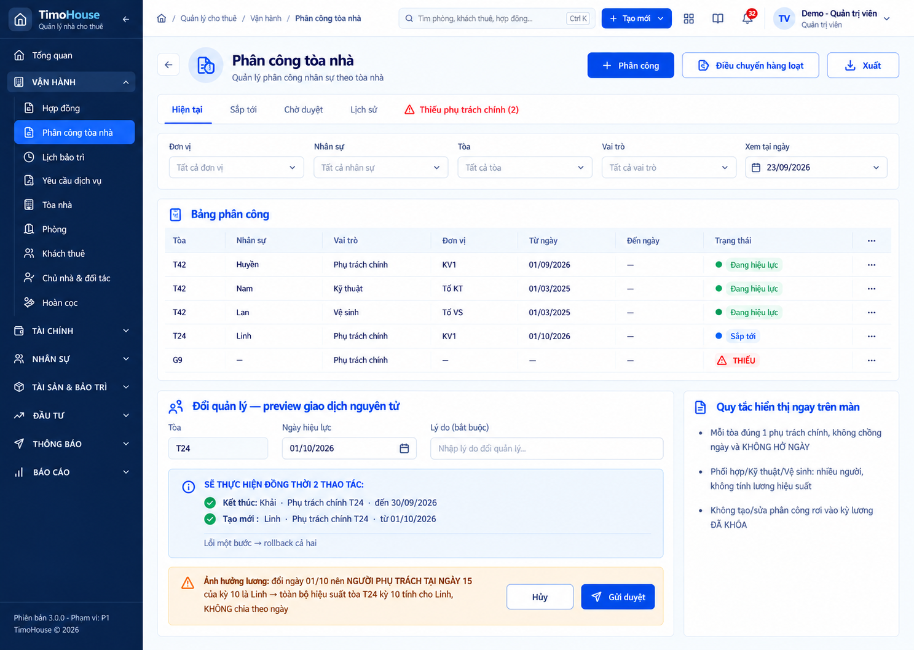

# TIMOHOUSE — SRS · Cụm Nhân sự & lương

**Phiên bản:** 1.0 · **Ngày lập:** 25/09/2026 · **Trạng thái:** DRAFT, chờ khách hàng xác nhận
**Phạm vi:** cụm **Nhân sự & lương**, gồm FR18 Cơ cấu tổ chức, FR19 Nhân sự, FR20 Phân công tòa nhà, FR21 Hiệu suất thu tiền, FR22 Bảng lương, FR23 Chi lương.

**Nguồn:** [`TimoHouse_UI_Mockup_Spec_v1.0.md`](TimoHouse_UI_Mockup_Spec_v1.0.md) bản 1.9 (§4, §6, §7, UI-18…UI-23, §13 flow F-05 và F-08, §14, §15 Decision Log #16, #17, #18, #19, #20, #25, §16, §18); dữ liệu mẫu ở [`TimoHouse_Mockup_Seed_Data_v1.0.md`](TimoHouse_Mockup_Seed_Data_v1.0.md) §9, §15, §16; ảnh mockup ở [`ui-imagegen-v1/07-nhan-su-luong/`](ui-imagegen-v1/07-nhan-su-luong/README.md), kết luận từng ảnh theo [`AUDIT.md`](ui-imagegen-v1/AUDIT.md). Chỉ ảnh UI-20 (ĐẠT CÓ LƯU Ý) được nhúng; 5 ảnh còn lại KHÔNG ĐẠT nên không dùng. Ảnh flow F-05 (KHÔNG ĐẠT) và F-08 (ĐẠT CÓ LƯU Ý) chỉ dùng để đối chiếu bước, không nhúng.

Quy ước đọc tài liệu và Common Rules 1–14 xem [`TimoHouse_SRS_v1.0.md`](TimoHouse_SRS_v1.0.md#common-rules-dùng-chung-cho-mọi-fr); tài liệu này chỉ dẫn chiếu, không lặp lại.

---

## Quy tắc chung của cụm

Các FR bên dưới dẫn chiếu `Cluster Rule 07.N` thay vì lặp lại.

| Mã | Nội dung | Nguồn |
|---|---|---|
| Cluster Rule 07.1 | **Dữ liệu có hiệu lực theo thời gian**: đơn vị tổ chức, Lead, đơn vị/chức danh/level của nhân sự, cấu phần lương theo level và phân công tòa đều lưu theo khoảng hiệu lực từ–đến. Mọi thay đổi tạo dòng hoặc phiên bản mới, không ghi đè dòng cũ. Control `Xem tại ngày` mặc định là hôm nay, chọn được ngày quá khứ và tương lai; đổi ngày -> tải lại dữ liệu hiệu lực tại ngày đó. Thay đổi có hiệu lực tương lai không tác động tới cây tổ chức, quyền, cascading filter, dashboard và hiệu suất tạm tính trước ngày hiệu lực | BR-3.01.2, BR-3.01.4, BR-3.02.4, BR-3.03.13 |
| Cluster Rule 07.2 | **Kỳ lương và ngày tham chiếu** (**ASSUMED**): kỳ lương N đi theo đợt hóa đơn tiền phòng tháng N; ngày chốt kỳ là 16/N (P-06). Hiệu suất và lương hiệu suất **cả tháng** của một tòa thuộc về người là phụ trách chính tại **ngày 15** của kỳ (P-21), không chia theo ngày. Lương cố định lấy giá trị level hiệu lực tại ngày chốt, không prorate theo ngày công | Decision Log #18; BR-3.02.3, BR-3.03.5, R-23 |
| Cluster Rule 07.3 | **Quyền xem lương**: lương là dữ liệu nhạy cảm, phân quyền theo từng cấu phần chứ không theo cả màn. NV chỉ xem của mình; TNVH xem lương hiệu suất của cấp dưới nhưng **không** xem lương cố định; chỉ Admin/Kế toán sửa. HR và Quản lý tổng gộp vào Admin/Kế toán (**ASSUMED**, P-22). Cấu phần người dùng không có quyền xem: ## (ẩn cột, che giá trị hay hiển thị `•••` — cần xác nhận) | BR-3.02.10, R-34; Decision Log #25 |
| Cluster Rule 07.4 | **Tham số chờ chốt**: mọi số liệu phụ thuộc một `P-xx` chưa chốt hiển thị chip `Cần xác nhận nghiệp vụ` kèm mã tham số; giá trị đọc từ trang cấu hình tham số (refer to FR33), không hard-code | §18 |
| Cluster Rule 07.5 | **Ba mẫu số phòng, không dùng lẫn**: • N phân bổ chi phí = phòng đang quản lý, kể cả phòng trống (tháng 8: 1.382) • Số phòng tính hiệu suất = phòng có hóa đơn trong kỳ (tháng 8: 1.079) • Số phòng dưới quyền của Lead = Σ tổng phòng đang quản lý, kể cả trống, tại snapshot ngày 15 (P-12) • Số 1.343 trong file Excel gốc là lỗi nguồn, không dùng | P-05, P-12; Decision Log #17, #20 |
| Cluster Rule 07.6 | **Không sửa trực tiếp số tổng**: hiệu suất, lương hiệu suất và tổng bảng lương chỉ thay đổi qua đề nghị điều chỉnh có lý do và được duyệt. Kỳ lương đã khóa giữ snapshot, không tính lại | UI-21, UI-22 |

---
---

# FR18 - Cơ cấu tổ chức

## 1. Business Rule

| | |
|:-:|---|
| **Authorization** | • Admin: sửa cây, di chuyển và ngừng đơn vị, bổ nhiệm/thay Lead (BR-3.01.9, Cần chốt) • TPVH: chỉ tạo đề xuất dạng nháp trong khối Vận hành (BR-3.01.9, Cần chốt) • Kế toán: ## (HR gộp vào Admin/Kế toán theo Decision Log #25 — cần xác nhận Kế toán có quyền sửa cây không) • Các vai trò còn lại: ## (spec chưa nêu quyền xem cây tổ chức) |
| **Management Rule** | • Người dùng xem và quản lý cây tổ chức có lịch sử theo ngày hiệu lực. Cây phục vụ 3 việc: xác định Lead của từng đơn vị, làm trục cho cascading filter toàn hệ thống, và phân quyền theo đơn vị • Chức năng chỉ thực hiện được khi người dùng đã đăng nhập với vai trò thuộc Authorization ## • Cây tổ chức **không** quyết định ai quản lý tòa nào; việc đó thuộc Phân công tòa (refer to FR20, R-33) • Dữ liệu cây có hiệu lực theo thời gian (Cluster Rule 07.1) • Cây mẫu Phase 1: &nbsp;&nbsp;◦ Công ty (HT CCMN TIMEHOUSE) &nbsp;&nbsp;◦ Quản lý tổng (Admin) &nbsp;&nbsp;◦ Phòng Vận hành, Lead TPVH, gồm: Nhóm vận hành / Khu vực 1 (Lead TNVH), Nhóm vận hành / Khu vực 2 (Lead TNVH/Trưởng khu vực), Tổ Kỹ thuật, Tổ Vệ sinh &nbsp;&nbsp;◦ Phòng Tài chính – Kế toán &nbsp;&nbsp;◦ Phòng Kinh doanh, Phòng Thị trường: lương ngoài phạm vi (X-05) • Field đơn vị: `code` (ví dụ `OPS`, `OPS-KV1`, `TECH`, `CLEAN`, `FIN`, `SALES`, `MKT`), tên, `type` (`COMPANY`/`DEPARTMENT`/`TEAM`/`AREA`), đơn vị cha, `area_code`, Lead đang hiệu lực, hiệu lực từ/đến, trạng thái, mô tả • Đơn vị Kinh doanh/Kỹ thuật/Thị trường/TC-KT có mặt trong cây để phân quyền và lọc, nhưng lương thuộc X-05 (BR-3.01.8) • "Khu vực" là `area_code` gắn ở đơn vị cấp `TEAM`/`AREA` khối Vận hành và là nguồn của bộ lọc "Khu vực" toàn hệ thống. Trưởng khu vực = Lead của đơn vị đó. Một NVVH thuộc đúng 1 khu vực tại một thời điểm (BR-3.01.6, Cần chốt) • Cascading filter chuẩn dùng lại ở mọi màn: Khu vực → Trưởng nhóm → Quản lý → Tòa → Loại nhà (T/S/G, L1–L3). Chọn cấp trên thu hẹp cấp dưới. Cặp Quản lý → Tòa lấy từ FR20 tại ngày xem (BR-3.01.7, R-34) • Lead: &nbsp;&nbsp;◦ Mỗi đơn vị có **đúng một Lead** hiệu lực tại một thời điểm; bổ nhiệm mới tự đóng Lead cũ vào ngày liền trước (BR-3.01.1) &nbsp;&nbsp;◦ Lịch sử Lead không ghi đè: mọi thay đổi tạo dòng mới, giữ nguyên dòng cũ (BR-3.01.2) &nbsp;&nbsp;◦ Lead phải là nhân viên `PROBATION`/`ACTIVE` có `management_level ≥ 1` (BR-3.01.10, Cần chốt) &nbsp;&nbsp;◦ Dòng Lead gồm: đơn vị, nhân viên, hiệu lực từ/đến không chồng lấn, số quyết định, lý do, người tạo/người duyệt • Chức danh (`POSITION`): mã `TPVH`, `TNVH`, `TKV`, `NVVH`, `KT`, `VS`, `KETOAN`, `TNKD`, `NVKD`, `SALE`, `ADMIN`; `management_level` 0 nhân viên · 1 trưởng nhóm/khu vực · 2 trưởng phòng · 3 quản lý tổng; loại đơn vị được gán; cờ `is_ops_payroll` quyết định nhân sự được tính lương ở FR22 hay thuộc X-05 • Cây không có chu trình; đơn vị cha phải `ACTIVE` tại ngày hiệu lực của đơn vị con (BR-3.01.3) • Chặn ngừng đơn vị còn đơn vị con hoặc nhân viên có phân công hiệu lực (BR-3.01.5, Cần chốt) • Số phòng "dưới quyền" của Lead = Σ tổng phòng đang quản lý (kể cả trống) của các tòa do NVVH thuộc đơn vị phụ trách chính, đệ quy xuống đơn vị con, lấy tại snapshot ngày 15; TPVH tính toàn hệ thống. Đây là mẫu số riêng (Cluster Rule 07.5), dùng tính lương trưởng nhóm = số phòng dưới quyền × 10.000 (BR-3.01.11, R-22 → P-12; Decision Log #17, **ASSUMED**) • Mâu thuẫn spec ↔ seed: Seed §9.1 ghi TPVH 774 phòng và TNVH 408 phòng (tổng 1.182); nếu "TPVH tính toàn hệ thống" thì số của TPVH phải không nhỏ hơn 1.079 (hoặc 1.382) — cần xác nhận định nghĩa • Trạng thái đơn vị: &nbsp;&nbsp;◦ PLANNED: đơn vị có hiệu lực tương lai; tự chuyển `ACTIVE` khi đến ngày hiệu lực &nbsp;&nbsp;◦ ACTIVE: đang hoạt động &nbsp;&nbsp;◦ INACTIVE: đã ngừng; không quay lại, muốn dùng lại phải tạo đơn vị mới • Trạng thái dòng Lead theo ngày đang xem: Sắp tới / Hiệu lực / Đã kết thúc • Ngoại lệ: Lead nghỉ việc trước khi có người thay -> đơn vị vào trạng thái "thiếu Lead", Work Queue cảnh báo Admin (refer to FR01). Phân công tòa và lương hiệu suất của NVVH không bị ảnh hưởng; riêng lương trưởng nhóm kỳ đó = 0 cho vị trí trống |
| **Management Impact** | • Xem cây, đổi `Xem tại ngày`, xem nhân sự/tòa thuộc đơn vị, xem lịch sử và export không làm thay đổi dữ liệu • Tạo đơn vị: tạo `ORG_UNIT`; hiệu lực từ ngày tương lai -> trạng thái `PLANNED`, đến ngày hiệu lực tự chuyển `ACTIVE` • Sửa hoặc di chuyển đơn vị: ## (spec chưa nêu sửa thuộc tính đơn vị tạo phiên bản mới hay ghi đè; chỉ nêu "lập thay đổi có hiệu lực tương lai") • Bổ nhiệm/thay Lead: tạo dòng mới trong `ORG_UNIT_LEAD_HISTORY`; dòng Lead đang hiệu lực tự đóng vào ngày liền trước ngày hiệu lực mới • TPVH tạo đề xuất: lưu dạng nháp (luồng Admin duyệt đề xuất chưa được mô tả — cần bổ sung) • Ngừng đơn vị: `ACTIVE` -> `INACTIVE`, lưu lý do • Mọi thao tác ghi audit theo Common Rule 5 |

## 2. Screen 18.1: Cơ cấu tổ chức

Chưa có capture đạt — ảnh ImageGen UI-18-organization-structure.png KHÔNG ĐẠT (AUDIT: cây tổ chức do AI tự đặt, thiếu Kinh doanh/Thị trường X-05; thiếu Xem tại ngày, timeline Lead, 408 phòng dưới quyền, băng lọc liên cấp; sai tên TPVH/TNVH), không dùng. Nội dung dựng từ spec (wireframe UI-18).

<b>Screen 18.1: Cơ cấu tổ chức</b>

| **Fields** | **Format** | **Required?** | **Description** |
|:-:|:-:|:-:|:-:|
| Left Menu, Header | | | • Display follows Common Rule 1 • Highlight menu `Cơ cấu tổ chức` • Breadcrumb: `Trang chủ / Nhân sự & lương / Cơ cấu tổ chức` |
| Tiêu đề trang | Text | No | • Hiển thị "Cơ cấu tổ chức" |
| ① Xem tại ngày | Datepicker | No | • Always display. Đây là điều khiển quan trọng nhất của màn • Default selection: ngày hôm nay, ví dụ `23/09/2026` • Date format: DD/MM/YYYY (Common Rule 10) • Click on -> Display a datepicker; cho phép chọn ngày quá khứ và tương lai • Select a date -> Tải lại cây ②, chi tiết đơn vị ③, timeline Lead ④, nhân sự ⑤ và số phòng ⑥ theo dữ liệu hiệu lực tại ngày đã chọn (Cluster Rule 07.1) |
| + Đơn vị | Button | No | • Always display • Enabled only when người dùng là Admin, hoặc TPVH (chỉ tạo đề xuất nháp trong khối Vận hành); không có quyền -> disabled kèm tooltip (Common Rule 7) • Click on -> Display Popup tạo/sửa đơn vị ở chế độ tạo (Screen 18.2) |
| Xuất | Button | No | • Spec có action "export cây + lịch sử Lead" nhưng wireframe chưa vẽ nút • Vị trí nút, điều kiện hiển thị và định dạng file (CSV/XLSX?): ## — cần xác nhận |
| 🟧 ② Cây tổ chức | | | |
| Cây tổ chức | Text | No | • Display cây đơn vị hiệu lực tại ngày ở ①, theo cây mẫu Phase 1 (Business Rule) • Mỗi nút gồm tên đơn vị và nhãn Lead dạng `[Chức danh: Tên]`, ví dụ "Phòng Vận hành [TPVH]", "KV1 [TNVH: Huy]" • Đơn vị Phòng Kinh doanh, Phòng Thị trường gắn nhãn `X-05` (lương ngoài phạm vi Phase 1) • Nút có đơn vị con hiển thị icon ▾/▸. Click on icon -> Expand / Collapse nhánh con • Default status: ## (wireframe mở tới cấp Phòng Vận hành — cần xác nhận mức mở mặc định) • Đơn vị đang chọn được đánh dấu ● và highlight • Click on một đơn vị -> Hiển thị thông tin đơn vị đó ở ③, ④, ⑤, ⑥ • Đơn vị được chọn mặc định khi mở màn: ## • Đơn vị ở trạng thái "thiếu Lead": ## (cần xác nhận cách hiển thị cảnh báo trên cây) • Đơn vị `PLANNED` hoặc `INACTIVE` tại ngày xem: ## (ẩn hay hiển thị kèm chip trạng thái?) |
| 🟧 ③ Chi tiết đơn vị | | | • Tiêu đề khối: "Chi tiết đơn vị: {Mã đơn vị}" • Wireframe vẽ Loại và Khu vực dạng Dropdown ngay trên khối nhưng không có nút Lưu — cần xác nhận sửa tại chỗ hay qua Screen 18.2 |
| Mã | Text | No | • Display mã đơn vị, ví dụ `OPS-KV1` |
| Tên | Text | No | • Display tên đơn vị, ví dụ "Nhóm vận hành / Khu vực 1" |
| Loại | Dropdown | No | • Display loại đơn vị hiện hành • Enabled only when người dùng là Admin • Click on -> Display the list of options: COMPANY, DEPARTMENT, TEAM, AREA • Allow single selection only • Select an option -> ## (lưu ngay kèm ngày hiệu lực hay chờ xác nhận?) |
| Cha | Text | No | • Display tên đơn vị cha, ví dụ "Phòng Vận hành" • Đổi đơn vị cha (di chuyển đơn vị) thực hiện ở Screen 18.2 |
| Khu vực | Dropdown | No | • Display only when Loại = TEAM hoặc AREA (BR-3.01.6) • Kèm ghi chú "← nguồn bộ lọc" vì đây là nguồn của bộ lọc Khu vực toàn hệ thống • Enabled only when người dùng là Admin • Click on -> Display danh mục khu vực, ví dụ "Mỹ Đình" (cần nguồn danh mục khu vực) • Allow single selection only • Select an option -> ## |
| Hiệu lực | Text | No | • Display khoảng hiệu lực "{từ ngày} – {đến ngày}", ví dụ "01/01/2025 –" • Đến ngày trống = còn hiệu lực |
| Trạng thái | Tag | No | • Display trạng thái đơn vị tại ngày xem (Common Rule 4): &nbsp;&nbsp;◦ PLANNED: có hiệu lực tương lai &nbsp;&nbsp;◦ ACTIVE: đang hoạt động &nbsp;&nbsp;◦ INACTIVE: đã ngừng, không mở lại được |
| Mô tả | Text | No | • Display mô tả đơn vị; trống hiển thị `—` (Common Rule 3) • Có trong danh sách field của spec, chưa có trên wireframe |
| Action đơn vị | Button | No | • Spec liệt kê action sửa, di chuyển, ngừng đơn vị và xem lịch sử nhưng wireframe chưa có vị trí nút (cần xác nhận: nút riêng hay menu ⋯) • Sửa / Di chuyển: Display only when trạng thái ≠ INACTIVE. Enabled only when người dùng là Admin. Click on -> Display Popup tạo/sửa đơn vị ở chế độ sửa (Screen 18.2) • Ngừng đơn vị: Display only when trạng thái = ACTIVE. Enabled only when người dùng là Admin. Click on -> Display Popup ngừng đơn vị (Screen 18.4) • Xem lịch sử: Always display. Click on -> Display lịch sử thay đổi đơn vị (Screen ##) |
| 🟧 ④ Timeline Lead (không ghi đè) | | | |
| 🟦 Bảng timeline Lead | | | • Display mọi dòng Lead của đơn vị đang chọn; mỗi dòng giữ nguyên, không ghi đè (BR-3.01.2) • Thứ tự: ## (wireframe xếp theo ngày bắt đầu tăng dần — cần xác nhận) • Đơn vị chưa từng có Lead: E## • Mâu thuẫn trong wireframe: dòng "09/2026– Trần Q.Huy · Hiệu lực" không có ngày kết thúc dù đã có dòng "01/2027– (chưa có) · Sắp tới"; theo BR-3.01.1 dòng 09/2026 phải tự đóng vào 31/12/2026. Cần xác nhận ý nghĩa dòng tương lai "(chưa có)" |
| Khoảng hiệu lực | Text | No | • "{từ} – {đến}"; đến trống = còn hiệu lực • Wireframe hiển thị dạng MM/YYYY (ví dụ "01/2025–08/2026"), Common Rule 10 dùng DD/MM/YYYY — cần xác nhận |
| Nhân viên | Text | No | • Họ tên Lead của khoảng hiệu lực; khoảng chưa có người hiển thị "(chưa có)" |
| Trạng thái | Tag | No | • Tính theo ngày ở ① (Common Rule 4): &nbsp;&nbsp;◦ Đã kết thúc: đến ngày < ngày xem &nbsp;&nbsp;◦ Hiệu lực: ngày xem nằm trong khoảng hiệu lực &nbsp;&nbsp;◦ Sắp tới: từ ngày > ngày xem |
| Số quyết định · Lý do · Người tạo/duyệt | Text | No | • Các field của dòng Lead theo spec; wireframe chưa có cột • Cần xác nhận hiển thị thành cột, tooltip hay màn lịch sử |
| Bổ nhiệm / Thay Lead | Button | No | • Always display • Enabled only when người dùng là Admin, hoặc TPVH (tạo đề xuất nháp) và đơn vị ở trạng thái ACTIVE hoặc PLANNED • Click on -> Display Popup bổ nhiệm / thay Lead (Screen 18.3) |
| 🟧 ⑤ Nhân sự thuộc đơn vị | | | |
| Nhân sự thuộc đơn vị | Text | No | • Chỉ đọc • Hiển thị số nhân sự theo chức danh, ví dụ "7 NVVH" • Số tính tại ngày ở ① (cần xác nhận có tính đệ quy đơn vị con không) |
| Xem ▸ | Button | No | • Always display • Always enabled • Click on -> Go to Danh sách nhân sự, lọc sẵn theo đơn vị đang chọn (Screen 19.1) |
| 🟧 ⑥ Số phòng dưới quyền | | | • Display only when ## (đơn vị khối Vận hành có Lead `management_level ≥ 1`? — cần xác nhận) |
| Số phòng dưới quyền | Text | No | • Content format: "Số phòng dưới quyền: {n} (snapshot 15)" + dòng cách tính "→ lương trưởng nhóm {n} × 10.000", ví dụ "408 (snapshot 15) → lương trưởng nhóm 408 × 10.000" • Luôn hiển thị kèm cách tính vì đây là mẫu số riêng, khác số phòng tính hiệu suất (Cluster Rule 07.5) • Hiển thị chip `Cần xác nhận nghiệp vụ · P-12` (Cluster Rule 07.4) • Snapshot ngày 15 của kỳ nào khi ngày xem ≠ hôm nay: ## |
| 🟧 ⑦ Băng cascading filter | | | |
| Băng cascading | Text | No | • Always display • Content format: "Cascading filter sinh ra từ màn này, dùng lại ở MỌI màn khác: Khu vực → Trưởng nhóm → Quản lý → Tòa → Loại nhà (T/S/G, L1–L3)" • Nhắc rằng cặp Quản lý → Tòa lấy từ Phân công tòa (Screen 20.1) |

## 3. Screen 18.2: Popup tạo/sửa đơn vị

Chưa có capture — cần bổ sung. Nội dung dựng từ spec (danh sách field đơn vị UI-18).

<b>Screen 18.2: Popup tạo/sửa đơn vị</b>

| **Fields** | **Format** | **Required?** | **Description** |
|:-:|:-:|:-:|:-:|
| 🟧 The popup can be closed by the X icon or by clicking out of the popup. Closing the popup redirects the user to the underlying screen without any changes saved. (cần xác nhận popup có X icon, và dạng modal hay drawer theo spec §7.3) | | | |
| Mã | Textbox | Yes | • Always display • Enable only when đang tạo mới (cần xác nhận mã có sửa được sau khi tạo) • Placeholder: ## • Allow entering ## (ký tự cho phép; ví dụ mã `OPS-KV1`). Max length: ## • If clicking out of the field while it is blank -> Show error message E## • Trùng mã đơn vị khác -> Show error message E## |
| Tên | Textbox | Yes | • Always display • Allow entering all types of characters. Max length: 255 • If clicking out of the field while it is blank -> Show error message E## |
| Loại | Dropdown | Yes | • Always display • Default selection: None • Click on -> Display the list of following options: COMPANY, DEPARTMENT, TEAM, AREA • Allow single selection only • Select an option -> Hiện field Khu vực khi Loại = TEAM hoặc AREA; ẩn khi chọn loại khác • If clicking out of field while it is blank -> Show error message E## |
| Đơn vị cha | Dropdown | Yes | • Always display. Không bắt buộc với đơn vị gốc loại COMPANY • Default selection: đơn vị đang chọn trên cây (khi tạo); đơn vị cha hiện hành (khi sửa) • Click on -> Display danh sách đơn vị `ACTIVE` tại ngày Hiệu lực từ (BR-3.01.3) • Allow single selection only • Chọn đơn vị cha là chính nó hoặc một đơn vị con của nó (tạo chu trình) -> Show error message E## • If clicking out of field while it is blank -> Show error message E## |
| Khu vực | Dropdown | No | • Display only when Loại = TEAM hoặc AREA • Default selection: None • Click on -> Display danh mục khu vực. Allow single selection only • Cần xác nhận bắt buộc khi đơn vị thuộc khối Vận hành (BR-3.01.6) |
| Hiệu lực từ | Datepicker | Yes | • Always display • Default selection: ## (hôm nay hay ngày 1 tháng kế?) • Click on -> Display a datepicker; cho phép ngày tương lai. Chọn ngày tương lai = lập thay đổi có hiệu lực tương lai; đơn vị mới ở trạng thái PLANNED (BR-3.01.4) • If an end date is selected, disable all dates after the specified end date • If clicking out of field while it is blank -> Show error message E## |
| Hiệu lực đến | Datepicker | No | • Always display • Default selection: None (không thời hạn) • If a start date is selected, disable all dates before the specified start date |
| Mô tả | Textbox | No | • Always display • Allow entering all types of characters. Max length: 255 |
| Hủy | Button | No | • Always appear • Always enabled • Click on -> Đóng popup, không lưu |
| Lưu | Button | No | • Always appear • Always enabled • Click on -> Validate in the following order: &nbsp;&nbsp;◦ If there are any fields with invalid values, display error messages as mentioned above &nbsp;&nbsp;◦ Đơn vị cha không `ACTIVE` tại ngày Hiệu lực từ -> display error message E## &nbsp;&nbsp;◦ Di chuyển tạo chu trình cha–con -> display error message E## &nbsp;&nbsp;◦ If all conditions above are satisfied: &nbsp;&nbsp;&nbsp;&nbsp;- Người dùng là Admin -> lưu đơn vị, đóng popup, cập nhật cây ở Screen 18.1, toast thành công (Common Rule 13) &nbsp;&nbsp;&nbsp;&nbsp;- Người dùng là TPVH -> lưu thành đề xuất nháp (nơi hiển thị đề xuất nháp: ##) |

## 4. Screen 18.3: Popup bổ nhiệm / thay Lead

Chưa có capture — cần bổ sung. Nội dung dựng từ spec (vùng ④ và field dòng Lead UI-18).

<b>Screen 18.3: Popup bổ nhiệm / thay Lead</b>

| **Fields** | **Format** | **Required?** | **Description** |
|:-:|:-:|:-:|:-:|
| 🟧 The popup can be closed by the X icon or by clicking out of the popup. Closing the popup redirects the user to the underlying screen without any changes saved. (cần xác nhận popup có X icon) | | | |
| Đơn vị | Text | No | • Display "{Mã} · {Tên}" của đơn vị đang chọn ở Screen 18.1 |
| Lead hiện tại | Text | No | • Display only when đơn vị có Lead hiệu lực tại ngày xem • Display họ tên và ngày bắt đầu của Lead hiện tại |
| Nhân viên | Dropdown | Yes | • Always display • Placeholder: ## • Default selection: None • Click on -> Display danh sách nhân viên trạng thái Thử việc/Đang làm có `management_level ≥ 1` (BR-3.01.10) • Allow single selection only • Cần xác nhận dropdown có ô tìm kiếm • If clicking out of field while it is blank -> Show error message E## |
| Hiệu lực từ | Datepicker | Yes | • Always display • Default selection: ## • Click on -> Display a datepicker; cho phép ngày tương lai (dòng Lead hiển thị "Sắp tới") • Select a date -> Cập nhật dòng xem trước bên dưới • If clicking out of field while it is blank -> Show error message E## |
| Số quyết định | Textbox | No | • Always display • Allow entering all types of characters. Max length: 255 • Cần xác nhận có bắt buộc không |
| Lý do | Textbox | No | • Always display • Allow entering all types of characters. Max length: 255 • Cần xác nhận có bắt buộc không |
| Xem trước thay đổi | Text | No | • Display only when đơn vị đang có Lead hiệu lực • Content format: "Kết thúc: {Lead cũ} đến {Hiệu lực từ − 1 ngày}" và "Bắt đầu: {Lead mới} từ {Hiệu lực từ}" (BR-3.01.1) • Spec chưa có phác họa khối này — cần xác nhận |
| Hủy | Button | No | • Always appear • Always enabled • Click on -> Đóng popup, không lưu |
| Lưu | Button | No | • Always appear • Always enabled • Click on -> Validate in the following order: &nbsp;&nbsp;◦ If there are any fields with invalid values, display error messages as mentioned above &nbsp;&nbsp;◦ Khoảng hiệu lực chồng với dòng Lead tương lai đã có -> display error message E## &nbsp;&nbsp;◦ If all conditions above are satisfied -> tạo dòng Lead mới, tự đóng dòng cũ vào ngày liền trước, đóng popup và cập nhật timeline ④ ở Screen 18.1. TPVH: lưu thành đề xuất nháp |

## 5. Screen 18.4: Popup ngừng đơn vị

Chưa có capture — cần bổ sung. Nội dung dựng từ spec (ràng buộc "Khi ngừng đơn vị" UI-18).

<b>Screen 18.4: Popup ngừng đơn vị</b>

| **Fields** | **Format** | **Required?** | **Description** |
|:-:|:-:|:-:|:-:|
| 🟧 The popup can be closed by the X icon or by clicking out of the popup. Closing the popup redirects the user to the underlying screen without any changes saved. | | | |
| Message | Text | No | • Danger popup (Common Rule 11) • Content format: "##" (cần nội dung chính xác) • Nêu rõ đơn vị INACTIVE không mở lại được, muốn dùng lại phải tạo đơn vị mới |
| Danh sách chặn | Text | No | • Display only when đơn vị còn đơn vị con hoặc nhân viên có phân công hiệu lực (BR-3.01.5) • Liệt kê đơn vị con và nhân viên còn phân công, kèm hướng xử lý • Khi hiển thị: nút `Ngừng đơn vị` bị disabled |
| Ngày ngừng | Datepicker | Yes | • Always display • Default selection: ## • Spec chưa nêu field ngày ngừng — cần xác nhận ngừng theo ngày hiệu lực đến hay ngừng ngay |
| Lý do | Textbox | Yes | • Always display • Allow entering all types of characters. Max length: 255 • If clicking out of the field while it is blank -> Show error message E## |
| Hủy | Button | No | • Always appear • Always enabled • Click on -> Đóng popup, không thay đổi dữ liệu |
| Ngừng đơn vị | Button | No | • Always appear • Enabled only when đã nhập Lý do và không có Danh sách chặn • Click on -> Chuyển đơn vị sang `INACTIVE`, lưu lý do, đóng popup và cập nhật Screen 18.1 |

## 6. User Steps

| | |
|:-:|---|
| **Pre-condition** | Người dùng đã đăng nhập với vai trò Admin |
| **User steps** | **Step 1:** Click menu `Cơ cấu tổ chức` -> display Cơ cấu tổ chức (Screen 18.1) **Step 2:** Chọn một đơn vị trên cây, click `Bổ nhiệm / Thay Lead` ở ④ -> display Popup bổ nhiệm / thay Lead (Screen 18.3) **Step 3:** Chọn nhân viên, ngày hiệu lực rồi click `Lưu` -> đóng popup, display Cơ cấu tổ chức với timeline Lead đã cập nhật (Screen 18.1) **Step 4:** Click `+ Đơn vị` -> display Popup tạo/sửa đơn vị (Screen 18.2) **Step 5:** Tại ⑤, click `Xem ▸` -> display Danh sách nhân sự lọc theo đơn vị (Screen 19.1) |

| | |
|:-:|---|
| **Pre-condition** | Admin muốn ngừng một đơn vị đang ACTIVE |
| **User steps** | **Step 1:** Tại Screen 18.1, chọn đơn vị rồi click action `Ngừng đơn vị` -> display Popup ngừng đơn vị (Screen 18.4) **Step 2:** Nhập lý do, click `Ngừng đơn vị` -> display Cơ cấu tổ chức, đơn vị ở trạng thái INACTIVE (Screen 18.1) |

---
---

# FR19 - Nhân sự

## 1. Business Rule

| | |
|:-:|---|
| **Authorization** | • Admin, Kế toán: thêm/sửa hồ sơ, điều chuyển, quản lý phiên bản lương theo level, tài khoản ngân hàng, ghi nghỉ/đi làm lại (BR-3.02.10; HR gộp vào Admin/Kế toán theo Decision Log #25) • Admin: nhập tay bậc/level NVVH kèm lý do (BR-3.02.11 → P-01) • NV: chỉ xem hồ sơ và lương của mình • TNVH: xem lương hiệu suất của cấp dưới, **không** xem lương cố định (Cluster Rule 07.3) • TPVH: ## (spec chưa nêu quyền xem hồ sơ và lương của TPVH) • Cổ đông: ## (spec chưa nêu) |
| **Management Rule** | • Người dùng quản lý hồ sơ nhân sự: hồ sơ cá nhân, việc làm (đơn vị, chức danh, level có ngày hiệu lực), ngân hàng, cấu phần lương theo level, tài khoản đăng nhập, và xem liên kết tới phân công, hiệu suất, kết quả lương, chi lương • Chức năng chỉ thực hiện được khi người dùng đã đăng nhập với vai trò thuộc Authorization ## • Mã NV duy nhất, **không tái sử dụng** sau khi nghỉ việc (BR-3.02.1, Cần chốt). Ví dụ `NV-021` (cần xác nhận cách sinh mã) • Mỗi NV có đúng một đơn vị chính tại một thời điểm; kiêm nhiệm qua dòng phân công phụ (BR-3.02.2) • Đơn vị, chức danh, level gán có ngày hiệu lực (Cluster Rule 07.1) • Trạng thái nhân sự: &nbsp;&nbsp;◦ Thử việc (PROBATION): vẫn được phân công tòa và tính lương hiệu suất như NV chính thức (BR-3.02.12, Cần chốt) &nbsp;&nbsp;◦ Đang làm (ACTIVE) &nbsp;&nbsp;◦ Nghỉ việc (RESIGNED): không tạo phân công mới sau ngày nghỉ &nbsp;&nbsp;◦ Ngày nghỉ ở tương lai hiển thị `Sắp nghỉ (dd/mm)` &nbsp;&nbsp;◦ Nhân viên quay lại dùng lại hồ sơ cũ với `start_date` mới • Bảng lương cố định theo level `SALARY_LEVEL` (R-19): &nbsp;&nbsp;◦ `level_code` · `position_code`: Level = chức danh + bậc, ví dụ `TPVH`, `TNVH`, `NVVH-1`, `NVVH-2` &nbsp;&nbsp;◦ Lương cơ bản · Ăn trưa · Xăng xe: ba cấu phần cố định của kỳ lương &nbsp;&nbsp;◦ Lương hỗ trợ mặc định: chỉ là **giá trị gợi ý**; số thật nhập tay theo NV × kỳ kèm lý do (BR-3.02.5) &nbsp;&nbsp;◦ Cột đơn giá/phòng: trỏ tới cột trong bảng bậc của Payroll Rule ở FR22 (bậc 1 = 130k, bậc 2 = 120k tại ngưỡng 100) &nbsp;&nbsp;◦ Hiệu lực từ/đến · version • Sửa level luôn **tạo phiên bản mới có ngày hiệu lực**, không sửa đè; kỳ lương đã khóa giữ snapshot (BR-3.02.4) • Lương cố định của kỳ = giá trị level hiệu lực tại ngày chốt kỳ (16); Phase 1 không prorate theo ngày công (BR-3.02.3 → P-06; Cluster Rule 07.2) • Giá trị hiện hành (bảng lương tháng 8): TPVH và TNVH cùng LCB 10.000.000 + ăn trưa 500.000 + xăng xe 700.000, khác nhau ở lương trưởng nhóm = số phòng dưới quyền × 10.000 (refer to FR18); NVVH có LCB 0 + ăn trưa 500.000 + xăng xe 500.000, thu nhập chính đến từ lương hiệu suất • Level NVVH quyết định cột đơn giá/phòng; chưa có tiêu chí lên bậc nên Phase 1 Admin nhập tay kèm lý do (BR-3.02.11 → P-01) • Nghỉ việc: &nbsp;&nbsp;◦ Nhập ngày nghỉ -> tự kết thúc mọi phân công tòa hiệu lực và sinh cảnh báo "tòa chưa có phụ trách chính từ ngày X" cho TPVH (BR-3.02.6, Cần chốt) &nbsp;&nbsp;◦ NV nghỉ giữa kỳ **vẫn có dòng lương** kỳ đó nếu còn là phụ trách chính của ≥ 1 tòa tại snapshot ngày 15; lương cố định tính đủ, không prorate (BR-3.02.7, Cần chốt) &nbsp;&nbsp;◦ Toàn bộ hệ quả dây chuyền phải hiển thị trước khi lưu • Ngân hàng: chỉ một tài khoản mặc định tại một thời điểm; phiếu chi lương snapshot số tài khoản tại thời điểm chi (BR-3.02.8, Cần chốt). Số TK che theo Common Rule 2 • Cờ "là cổ đông" chỉ đọc từ module Cổ đông (refer to FR29); phần cổ phần **không** xuất hiện trong bảng lương hay chi phí lương (BR-3.02.9, R-24) • "Số tòa & phòng đang quản lý" là giá trị tính động từ phân công vai trò phụ trách chính hiệu lực hôm nay, không có ô nhập tay (BR-3.02.13) • Quyền xem lương theo Cluster Rule 07.3 • Tài khoản đăng nhập: liên kết user, role/permission; không lưu mật khẩu tại hồ sơ (refer to FR33) • NV ngoài khối Vận hành (X-05) chỉ giữ 1 dòng lương cố định nhập tay ở FR22 |
| **Management Impact** | • Xem danh sách/chi tiết, tìm kiếm, lọc và xuất không làm thay đổi dữ liệu • Thêm NV: tạo hồ sơ với mã NV mới; trạng thái khởi tạo ## (Thử việc hay Đang làm theo ngày nhập?) • Gán/đổi đơn vị, chức danh, level (điều chuyển): tạo dòng mới có ngày hiệu lực, dòng cũ giữ trong lịch sử • Xác nhận hết thử việc: `Thử việc` -> `Đang làm` • Ghi nghỉ việc: &nbsp;&nbsp;◦ Trạng thái -> `Nghỉ việc` từ ngày nghỉ; ngày tương lai hiển thị `Sắp nghỉ (dd/mm)` &nbsp;&nbsp;◦ Kết thúc mọi phân công tòa hiệu lực vào ngày nghỉ (FR20) &nbsp;&nbsp;◦ Sinh cảnh báo Work Queue cho TPVH, mỗi tòa một cảnh báo (FR01) • Đi làm lại: dùng lại hồ sơ cũ, giữ mã NV, ghi `start_date` mới • Tạo phiên bản cấu phần lương: tạo version mới của `SALARY_LEVEL` có ngày hiệu lực; version cũ ## (tự đóng vào ngày liền trước?); kỳ đã khóa giữ snapshot • Thêm/đổi tài khoản ngân hàng: tạo bản ghi mới; bản ghi cũ giữ trong lịch sử • Tạo user: ## (refer to FR33) • Mọi thao tác ghi audit theo Common Rule 5 |

## 2. Screen 19.1: Danh sách nhân sự

Chưa có capture — cần bổ sung. Nội dung dựng từ spec (mục "Danh sách" UI-19).

<b>Screen 19.1: Danh sách nhân sự</b>

| **Fields** | **Format** | **Required?** | **Description** |
|:-:|:-:|:-:|:-:|
| Left Menu, Header | | | • Display follows Common Rule 1 • Highlight menu `Nhân sự` • Breadcrumb: `Trang chủ / Nhân sự & lương / Nhân sự` |
| 🟧 Quản lý nhân sự | | | |
| Tiêu đề trang | Text | No | • Hiển thị "Nhân sự" kèm chip `{n} nhân sự` = tổng nhân sự trong phạm vi quyền |
| + Nhân sự | Button | No | • Always display. Đây là CTA chính của màn • Enabled only when người dùng là Admin hoặc Kế toán (Common Rule 7) • Click on -> Go to Thêm / sửa nhân sự ở chế độ thêm (Screen 19.3) |
| Xuất | Button | No | • Always display • Always enabled • Click on -> Xuất toàn bộ kết quả đang lọc ## (định dạng CSV/XLSX? Cột lương xuất theo Cluster Rule 07.3?) |
| 🟧 Filter section | | | • Spec chưa liệt kê bộ lọc của danh sách nhân sự. Theo BR-3.01.7 cascading filter chuẩn (Khu vực → Trưởng nhóm → Quản lý → Tòa → Loại nhà) dùng lại ở mọi màn — cần xác nhận áp dụng, cùng các bộ lọc Đơn vị, Chức danh, Trạng thái • Tiêu chí được áp ngay khi chọn và phản ánh lên URL (Common Rule 6) |
| Search box | Textbox | No | • Placeholder: ## • Max length: 255 characters • Allow entering all types of characters • Cut off the spaces before and after the keyword before performing search • Nhập từ khóa -> sau 300ms (Common Rule 6) Search for all records which satisfy at least one of the following criteria: ## (cần xác nhận; đề xuất Mã NV = keyword (Absolute search), Họ tên contains keyword (Relative search), SĐT = keyword (Absolute search)) |
| 🟦 Danh sách nhân sự | | | • Display the list of nhân sự trong phạm vi quyền • Giá trị trống hiển thị `—` (Common Rule 3) • If there are no nhân sự in the system, display error message E## • If no record matches the search and filter criteria, display error message E## • Default sorting: ## • Phân trang theo Common Rule 6 • Click on một dòng -> Go to Chi tiết nhân sự (Screen 19.2) |
| Mã NV | Text | No | • Mã nhân viên, ví dụ `NV-021` |
| Họ tên | Text | No | • Họ tên nhân viên |
| SĐT/email | Text | No | • Dòng 1: SĐT, che theo Common Rule 2 • Dòng 2: email |
| Chức danh | Text | No | • Chức danh hiệu lực hôm nay, ví dụ `NVVH` |
| Level | Text | No | • Level hiệu lực hôm nay, ví dụ `NVVH-1` |
| Đơn vị | Text | No | • Đơn vị chính hiệu lực hôm nay, ví dụ `KV1` |
| Lead | Text | No | • Lead của đơn vị, lấy từ FR18 tại ngày hôm nay |
| Ngày vào | Text | No | • Ngày vào làm. Format: DD/MM/YYYY |
| Trạng thái | Tag | No | • Hiển thị một trong các nhãn (Common Rule 4): &nbsp;&nbsp;◦ Thử việc &nbsp;&nbsp;◦ Đang làm &nbsp;&nbsp;◦ Sắp nghỉ (dd/mm): đã nhập ngày nghỉ ở tương lai &nbsp;&nbsp;◦ Nghỉ việc |
| Số tòa/phòng phụ trách | Text | No | • Content format: "{n} tòa / {m} phòng", ví dụ "9 tòa / 135 phòng" • Tính động từ phân công Phụ trách chính hiệu lực hôm nay (BR-3.02.13) |
| Tài khoản | Text | No | • ## (spec ghi "tài khoản" — cần xác nhận là tài khoản ngân hàng mặc định (che theo Common Rule 2) hay user đăng nhập liên kết) |
| Bảng lương kỳ gần nhất | Text | No | • ## (cần xác nhận nội dung: kỳ + trạng thái bảng lương, hay số thực nhận — nếu là số tiền thì áp Cluster Rule 07.3) • Click on -> ## (mở Drawer chi tiết lương Screen 22.2?) |
| Page number | Text | No | • Click on a page number -> Go to the corresponding page |

## 3. Screen 19.2: Chi tiết nhân sự

Chưa có capture đạt — ảnh ImageGen UI-19-employee-profile.png KHÔNG ĐẠT (AUDIT: 9 tòa ghi G1…G9, Lead và Level sai seed; thiếu cấu phần lương ⑥, cảnh báo nghỉ việc ⑦, băng quyền xem ⑧, cờ cổ đông), không dùng. Nội dung dựng từ spec (wireframe UI-19).

<b>Screen 19.2: Chi tiết nhân sự</b>

| **Fields** | **Format** | **Required?** | **Description** |
|:-:|:-:|:-:|:-:|
| Left Menu, Header | | | • Display follows Common Rule 1 • Highlight menu `Nhân sự` • Breadcrumb: `Trang chủ / Nhân sự & lương / Nhân sự / {Mã NV}` |
| Tiêu đề | Text | No | • Hiển thị "{Mã NV} · {Họ tên}", ví dụ "NV-021 · Nguyễn Thị Thương Huyền" • Dòng phụ: "{Chức danh} · Level {Level} · {Đơn vị} · {Trạng thái} từ {ngày} · Là cổ đông ✓", ví dụ "NVVH · Level NVVH-1 · KV1 · Đang làm từ 01/03/2024" |
| Trạng thái | Tag | No | • Trạng thái nhân sự: Thử việc / Đang làm / Sắp nghỉ (dd/mm) / Nghỉ việc (Common Rule 4) |
| Là cổ đông | Tag | No | • Display only when nhân sự là cổ đông • Chỉ đọc, lấy từ module Cổ đông (refer to FR29) • Phần chia cổ tức đi qua FR29, không xuất hiện trong bảng lương hay chi phí lương (BR-3.02.9) |
| Sửa | Button | No | • Display only when trạng thái ≠ Nghỉ việc (cần xác nhận) • Enabled only when người dùng là Admin hoặc Kế toán (Common Rule 7) • Click on -> Go to Thêm / sửa nhân sự ở chế độ sửa (Screen 19.3) |
| Điều chuyển | Button | No | • Display only when trạng thái = Thử việc hoặc Đang làm • Enabled only when người dùng là Admin hoặc Kế toán • Click on -> Display Popup điều chuyển (Screen 19.4) |
| ⋯ | Button | No | • Always display • Always enabled • Click on -> Display a dropdown for actions: &nbsp;&nbsp;◦ Xác nhận hết thử việc: Display only when trạng thái = Thử việc. Click on -> Display popup xác nhận (Screen ##) &nbsp;&nbsp;◦ Ghi nghỉ việc: Display only when trạng thái = Thử việc hoặc Đang làm. Click on -> Display Popup ghi nghỉ việc (Screen 19.6) &nbsp;&nbsp;◦ Đi làm lại: Display only when trạng thái = Nghỉ việc. Click on -> Display popup nhập `start_date` mới (Screen ##) &nbsp;&nbsp;◦ Bổ nhiệm Lead: Display only when `management_level ≥ 1`. Click on -> Go to Cơ cấu tổ chức (Screen 18.1) &nbsp;&nbsp;◦ Tạo user: Click on -> ## (refer to FR33) &nbsp;&nbsp;◦ Xuất: Click on -> ## (định dạng?) &nbsp;&nbsp;◦ Các action khác trong menu: ## (cần capture dropdown) |
| Tổng quan | Tab | No | • Default tab • Highlight the tab while being selected • Click on -> Go to Tổng quan |
| Phân công | Tab | No | • Highlight the tab while being selected • Click on -> Go to Phân công: danh sách phân công tòa của NV, dữ liệu từ FR20 • Cần capture nội dung tab |
| Cấu phần lương | Tab | No | • Highlight the tab while being selected • Click on -> Go to Cấu phần lương: các phiên bản cấu phần theo level • Cần capture nội dung tab |
| Kỳ lương | Tab | No | • Highlight the tab while being selected • Click on -> Go to Kỳ lương: kết quả lương từng kỳ (FR22) và chi lương (FR23) • Cần capture nội dung tab |
| Hồ sơ | Tab | No | • Highlight the tab while being selected • Click on -> Go to Hồ sơ: tài liệu của nhân viên • Cần capture nội dung tab |
| Lịch sử | Tab | No | • Highlight the tab while being selected • Click on -> Go to Lịch sử (audit theo Common Rule 5) • Cần capture nội dung tab |
| 🟧 Tab Tổng quan | | | |
| 🟧 ② Hồ sơ | | | |
| Mã NV | Text | No | • Display mã NV kèm ghi chú "(không tái sử dụng)" (BR-3.02.1) |
| Họ tên | Text | No | • Display họ tên |
| Ngày sinh | Text | No | • Display ngày sinh. Format: DD/MM/YYYY • Có trong field spec, chưa có trên wireframe |
| CCCD | Text | No | • Display số CCCD, che theo Common Rule 2 |
| SĐT | Text | No | • Display SĐT, che theo Common Rule 2 |
| Email | Text | No | • Display email; trống hiển thị `—` |
| Địa chỉ | Text | No | • Display địa chỉ • Có trong field spec, chưa có trên wireframe |
| 🟧 ③ Việc làm | | | • Wireframe vẽ Chức danh và Level dạng Dropdown ngay trên trang; mọi thay đổi cần ngày hiệu lực (Cluster Rule 07.1) — cần xác nhận đổi tại chỗ hay chỉ qua Điều chuyển (Screen 19.4) |
| Ngày vào · thử việc · chính thức · nghỉ | Text | No | • Display các mốc ngày, ví dụ "Vào 01/03/2024 · Chính thức 01/06/2024 · Nghỉ —" • Chưa có ngày nghỉ hiển thị `—` |
| Chức danh | Dropdown | No | • Display chức danh hiệu lực hôm nay, ví dụ `NVVH` • Enabled only when người dùng là Admin hoặc Kế toán • Click on -> Display danh sách chức danh (`POSITION`). Allow single selection only • Select an option -> ## (mở Screen 19.4 để nhập ngày hiệu lực?) |
| Level | Dropdown | No | • Display level hiệu lực hôm nay, ví dụ `NVVH-1` • Enabled only when người dùng là Admin (BR-3.02.11) • Click on -> Display danh sách level của chức danh. Allow single selection only • Select an option -> ## (bắt buộc lý do; mở Screen 19.4?) |
| Đơn vị | Text | No | • Display đơn vị chính hiệu lực hôm nay, ví dụ `KV1` |
| Lead | Text | No | • Display Lead của đơn vị theo FR18, ví dụ "Trần Quang Huy"; chỉ đọc |
| 🟧 ④ Ngân hàng | | | |
| Tài khoản mặc định | Text | No | • Display "{Ngân hàng} · {Số TK} · {Chủ TK}" và dấu "mặc định ✓"; Số TK che theo Common Rule 2, ví dụ "Techcombank · 1903****21 · mặc định ✓" • Chưa có: ## |
| Lịch sử | Button | No | • Always display • Always enabled • Click on -> Display popup lịch sử tài khoản ngân hàng (Screen ##) |
| Thêm/đổi tài khoản | Button | No | • Có trong danh sách action của spec, chưa có trên wireframe • Enabled only when người dùng là Admin hoặc Kế toán • Click on -> Display popup thêm/đổi tài khoản (Screen ##) |
| 🟧 ⑤ Chỉ số | | | |
| Đang quản lý | Text | No | • Content format: "Đang quản lý {n} tòa / {m} phòng", ví dụ "9 tòa / 135 phòng" • Icon ⓘ: Hover -> Display tooltip "##" (nội dung giải thích "tính động") • Tính động từ phân công Phụ trách chính hiệu lực hôm nay; không có ô nhập tay (BR-3.02.13) |
| HS tạm tính | Text | No | • Content format: "HS tạm tính kỳ {MM}: {x} %", lấy từ FR21 • Hiển thị theo Cluster Rule 07.3 • Click on -> ## (mở Hiệu suất thu tiền Screen 21.1 lọc theo NV?) |
| 🟧 ⑥ Cấu phần lương | | | • Tiêu đề khối: "Cấu phần lương — theo Level {Level}, hiệu lực {ngày}", ví dụ "theo Level NVVH-1, hiệu lực 01/01/2026" • Hiển thị theo Cluster Rule 07.3: TNVH không xem các cấu phần cố định • Tiền theo Common Rule 8 |
| Lương cơ bản | Text | No | • Display lương cơ bản của level • NVVH có giá trị 0: luôn kèm ghi chú ⓘ "NVVH thu nhập chính từ hiệu suất" vì nhìn số 0 dễ tưởng nhập thiếu |
| Phụ cấp ăn trưa | Text | No | • Display phụ cấp ăn trưa, ví dụ 500.000 |
| Phụ cấp xăng xe | Text | No | • Display phụ cấp xăng xe, ví dụ 500.000 |
| Lương trưởng nhóm | Text | No | • Display lương trưởng nhóm; chỉ TPVH/TNVH có giá trị, các chức danh khác hiển thị 0 kèm ghi chú "(chỉ TPVH/TNVH)" • Giá trị = số phòng dưới quyền × 10.000 (refer to FR18, P-12) |
| Lương hỗ trợ | Text | No | • Display lương hỗ trợ, ví dụ 2.000.000, kèm ghi chú "nhập tay theo kỳ, BẮT BUỘC lý do" (BR-3.02.5) • Cần xác nhận số hiển thị là "Lương hỗ trợ mặc định" (gợi ý của level) hay số đã nhập cho kỳ hiện tại, và nơi nhập số theo kỳ (Screen 22.1 hay tab Kỳ lương) |
| Cột đơn giá/phòng | Text | No | • Display cột đơn giá/phòng của level, ví dụ "bậc 1 (130k tại ngưỡng 100)" • Chip `Cần xác nhận nghiệp vụ · P-01` (Cluster Rule 07.4) |
| Tạo phiên bản mới có ngày hiệu lực | Button | No | • Always display, kèm ghi chú ⓘ "không sửa đè phiên bản" • Enabled only when người dùng là Admin hoặc Kế toán • Click on -> Display Popup tạo phiên bản cấu phần lương (Screen 19.5) |
| 🟧 ⑦ Cảnh báo khi nghỉ việc | | | • Wireframe đặt khối preview này ngay trên trang chi tiết; tài liệu này mô tả khối trong Popup ghi nghỉ việc (Screen 19.6) • Cần xác nhận: khối ⑦ nằm trên trang (hiện khi nhập ngày nghỉ ở chế độ sửa) hay nằm trong popup |
| 🟧 ⑧ Quyền xem | | | |
| Băng quyền xem | Text | No | • Always display • Content format: "NV xem của mình · TNVH xem lương hiệu suất cấp dưới nhưng KHÔNG xem lương cố định · Admin/Kế toán sửa" (Cluster Rule 07.3) |

## 4. Screen 19.3: Thêm / sửa nhân sự

Chưa có capture — cần bổ sung. Nội dung dựng từ spec (bảng "Field chi tiết" UI-19). Form có từ 3 nhóm field nên dùng dạng trang theo spec §7.3; cần xác nhận có chia wizard không.

<b>Screen 19.3: Thêm / sửa nhân sự</b>

| **Fields** | **Format** | **Required?** | **Description** |
|:-:|:-:|:-:|:-:|
| Left Menu, Header | | | • Display follows Common Rule 1 • Highlight menu `Nhân sự` • Breadcrumb: `Trang chủ / Nhân sự & lương / Nhân sự / Thêm nhân sự` (chế độ sửa: `/ {Mã NV} / Sửa`) |
| Chế độ sửa | | | • Apart from the following points, all logics and processings are similar to those of the creation mode (Screen 19.3) • The default values of all fields are set to those of the latest version • Mã NV chỉ đọc • Chức danh, Level, Đơn vị: ## (sửa tại đây hay chỉ qua Điều chuyển Screen 19.4 vì cần ngày hiệu lực?) • Ngày nghỉ: nhập qua Popup ghi nghỉ việc (Screen 19.6) |
| Back | Button | No | • Always appear • Always enabled • Click on -> check if there are any changes made to input &nbsp;&nbsp;◦ If there are not -> go back to the previous screen &nbsp;&nbsp;◦ If there are -> display a confirmation popup (Common Rule 9) (Provide screen capture ##) (Screen ##) |
| 🟧 Hồ sơ | | | • Spec chưa nêu field bắt buộc — cột Required? dưới đây cần BA xác nhận |
| Mã NV | Text | No | • Chế độ thêm: hiển thị "Tự sinh khi lưu" (cần xác nhận mã tự sinh hay nhập tay) • Mã không tái sử dụng (BR-3.02.1) |
| Họ tên | Textbox | Yes | • Always display • Placeholder: ## • Allow entering all types of characters. Max length: 255 • If clicking out of the field while it is blank -> Show error message E## |
| Ngày sinh | Datepicker | No | • Always display • Default selection: None • Disable future dates |
| CCCD | Textbox | No | • Always display • Allow entering numeric values. Max length: 12 • Sai độ dài -> Show error message E## • Trùng CCCD với nhân sự khác: ## (chặn hay cảnh báo?) |
| SĐT | Textbox | No | • Always display • Allow entering numeric values. Max length: ## |
| Email | Textbox | No | • Always display. Max length: 255 • Sai định dạng -> Show error message E## |
| Địa chỉ | Textbox | No | • Always display. Max length: 255 |
| Tài liệu | File uploader | No | • Instruction text: ## • Allow dragging and dropping file, as well as uploading from local device • Click on "Upload" -> Display a popup to select file from local device (Screen capture ##) • Supported file format: ##. If the selected file is in an unsupported format, display error message E## • Maximum file size: ##. If the file size exceeds the limit, show error message E## |
| 🟧 Việc làm | | | |
| Ngày vào | Datepicker | Yes | • Always display • Default selection: None • If clicking out of field while it is blank -> Show error message E## |
| Ngày thử việc | Datepicker | No | • Always display • If a start date is selected, disable all dates before Ngày vào (cần xác nhận quan hệ giữa ngày vào và ngày thử việc) |
| Ngày chính thức | Datepicker | No | • Always display • Disable all dates before Ngày vào |
| Chức danh | Dropdown | Yes | • Always display • Default selection: None • Click on -> Display danh sách chức danh: TPVH, TNVH, TKV, NVVH, KT, VS, KETOAN, TNKD, NVKD, SALE, ADMIN • Allow single selection only • Select an option -> Lọc danh sách Level và Đơn vị theo chức danh (loại đơn vị được gán của `POSITION`) • If clicking out of field while it is blank -> Show error message E## |
| Level | Dropdown | Yes | • Always display • Enable only when đã chọn Chức danh • Click on -> Display danh sách level của chức danh, ví dụ NVVH-1, NVVH-2 • Allow single selection only • Select an option -> Hiển thị cấu phần lương hiện hành của level (chỉ đọc) • If clicking out of field while it is blank -> Show error message E## |
| Đơn vị | Dropdown | Yes | • Always display • Click on -> Display danh sách đơn vị ACTIVE phù hợp chức danh (FR18). Allow single selection only • Mỗi NV đúng một đơn vị chính (BR-3.02.2) • If clicking out of field while it is blank -> Show error message E## |
| Lead | Text | No | • Tự hiển thị Lead của đơn vị đã chọn tại ngày vào (FR18); không nhập tay |
| 🟧 Ngân hàng | | | |
| Ngân hàng | Dropdown | No | • Always display • Click on -> Display danh mục ngân hàng (cần nguồn danh mục). Allow single selection only |
| Số tài khoản | Textbox | No | • Always display • Allow entering numeric values. Max length: ## • Hiển thị che theo Common Rule 2 sau khi lưu |
| Chủ tài khoản | Textbox | No | • Always display. Max length: 255 |
| 🟧 Tài khoản đăng nhập | | | |
| User liên kết | Dropdown | No | • Always display • ## (chọn user có sẵn hay tạo user mới; role/permission cấu hình ở FR33) • Không lưu mật khẩu tại hồ sơ |
| Hủy | Button | No | • Always appear • Always enabled • Click on -> Giống nút Back |
| Lưu | Button | No | • Always appear • Always enabled • Click on -> Validate in the following order: &nbsp;&nbsp;◦ If there are any fields with invalid values, display error messages as mentioned above &nbsp;&nbsp;◦ ## (validate nghiệp vụ bổ sung) &nbsp;&nbsp;◦ If all conditions above are satisfied -> lưu hồ sơ, toast thành công và Go to Chi tiết nhân sự (Screen 19.2) (cần xác nhận màn đích) |

## 5. Screen 19.4: Popup điều chuyển

Chưa có capture — cần bổ sung. Nội dung dựng từ spec (action "gán đơn vị/chức danh/level có ngày hiệu lực, điều chuyển tổ chức" UI-19).

<b>Screen 19.4: Popup điều chuyển</b>

| **Fields** | **Format** | **Required?** | **Description** |
|:-:|:-:|:-:|:-:|
| 🟧 The popup can be closed by the X icon or by clicking out of the popup. Closing the popup redirects the user to the underlying screen without any changes saved. (cần xác nhận popup có X icon) | | | |
| Nhân sự | Text | No | • Display "{Mã NV} · {Họ tên}" |
| Hiện tại | Text | No | • Display "{Đơn vị} · {Chức danh} · {Level}" đang hiệu lực |
| Đơn vị mới | Dropdown | Yes | • Always display • Default selection: đơn vị hiện tại • Click on -> Display danh sách đơn vị ACTIVE tại Ngày hiệu lực (FR18). Allow single selection only • If clicking out of field while it is blank -> Show error message E## |
| Chức danh | Dropdown | Yes | • Always display • Default selection: chức danh hiện tại • Click on -> Display danh sách chức danh. Allow single selection only • Select an option -> Lọc lại danh sách Level |
| Level | Dropdown | Yes | • Always display • Default selection: level hiện tại • Enable only when người dùng là Admin (BR-3.02.11) • Click on -> Display danh sách level của chức danh. Allow single selection only |
| Ngày hiệu lực | Datepicker | Yes | • Always display • Default selection: ## (ngày 1 tháng kế?) • Ngày rơi vào kỳ lương đã khóa -> Show error message E## (cần xác nhận có chặn như phân công tòa không) • If clicking out of field while it is blank -> Show error message E## |
| Lý do | Textbox | No | • Always display • Allow entering all types of characters. Max length: 255 • Bắt buộc khi đổi Level (BR-3.02.11); các trường hợp khác ## (cần xác nhận) • Đổi Level mà để trống -> Show error message E## |
| Ảnh hưởng phân công | Text | No | • Display only when đổi Đơn vị mà NV còn phân công tòa hiệu lực • ## (spec chưa mô tả xử lý phân công khi điều chuyển; BR-3.03.4 yêu cầu NV thuộc đơn vị phù hợp vai trò — cần xác nhận cảnh báo hay tự kết thúc phân công) |
| Hủy | Button | No | • Always appear • Always enabled • Click on -> Đóng popup, không lưu |
| Lưu | Button | No | • Always appear • Always enabled • Click on -> Validate in the following order: &nbsp;&nbsp;◦ If there are any fields with invalid values, display error messages as mentioned above &nbsp;&nbsp;◦ Không có thay đổi nào so với hiện tại -> display error message E## &nbsp;&nbsp;◦ If all conditions above are satisfied -> tạo dòng đơn vị/chức danh/level mới có ngày hiệu lực, đóng popup và cập nhật Screen 19.2 |

## 6. Screen 19.5: Popup tạo phiên bản cấu phần lương

Chưa có capture — cần bổ sung. Nội dung dựng từ spec (vùng ⑥ và bảng SALARY_LEVEL UI-19).

<b>Screen 19.5: Popup tạo phiên bản cấu phần lương</b>

| **Fields** | **Format** | **Required?** | **Description** |
|:-:|:-:|:-:|:-:|
| 🟧 The popup can be closed by the X icon or by clicking out of the popup. Closing the popup redirects the user to the underlying screen without any changes saved. (cần xác nhận popup có X icon) | | | |
| Level | Text | No | • Display `level_code` · `position_code`, ví dụ "NVVH-1 · NVVH" • Ghi chú: "Phiên bản mới áp cho mọi nhân sự cùng Level từ ngày hiệu lực" |
| Phiên bản hiện hành | Text | No | • Display version và ngày hiệu lực của phiên bản đang dùng |
| Lương cơ bản | Textbox | Yes | • Always display • Default: giá trị phiên bản hiện hành • Allow entering numeric values (VND, Common Rule 8). Max length: 12 • Cho phép 0 (NVVH) • If clicking out of the field while it is blank -> Show error message E## |
| Phụ cấp ăn trưa | Textbox | Yes | • Always display • Default: giá trị phiên bản hiện hành • Allow entering numeric values (VND). Max length: 12 • If clicking out of the field while it is blank -> Show error message E## |
| Phụ cấp xăng xe | Textbox | Yes | • Always display • Default: giá trị phiên bản hiện hành • Allow entering numeric values (VND). Max length: 12 • If clicking out of the field while it is blank -> Show error message E## |
| Lương hỗ trợ mặc định | Textbox | No | • Always display, kèm ghi chú "Chỉ là giá trị gợi ý; số thật nhập tay theo NV × kỳ kèm lý do" • Allow entering numeric values (VND). Max length: 12 |
| Cột đơn giá/phòng | Dropdown | Yes | • Display only when chức danh = NVVH (Level NVVH quyết định cột đơn giá/phòng, BR-3.02.11) • Default selection: cột của phiên bản hiện hành • Click on -> Display danh sách cột trong bảng bậc của Payroll Rule (FR22), ví dụ "bậc 1 (130k tại ngưỡng 100)", "bậc 2 (120k tại ngưỡng 100)" • Allow single selection only • Chip `Cần xác nhận nghiệp vụ · P-01` |
| Hiệu lực từ | Datepicker | Yes | • Always display • Default selection: None • Kỳ lương dùng giá trị hiệu lực tại ngày chốt 16 (Cluster Rule 07.2). Ví dụ: ăn trưa 600.000 hiệu lực 01/10/2026 thì kỳ 09 vẫn 500.000, kỳ 10 là 600.000 • Ngày hiệu lực rơi vào kỳ lương đã khóa: ## (chặn hay cho phép vì kỳ khóa đã giữ snapshot?) • If clicking out of field while it is blank -> Show error message E## |
| Hủy | Button | No | • Always appear • Always enabled • Click on -> Đóng popup, không lưu |
| Tạo phiên bản | Button | No | • Always appear • Always enabled • Click on -> Validate in the following order: &nbsp;&nbsp;◦ If there are any fields with invalid values, display error messages as mentioned above &nbsp;&nbsp;◦ Trùng ngày hiệu lực với phiên bản khác -> display error message E## &nbsp;&nbsp;◦ If all conditions above are satisfied -> tạo phiên bản mới, không sửa đè phiên bản cũ; đóng popup và cập nhật khối ⑥ ở Screen 19.2 |

## 7. Screen 19.6: Popup ghi nghỉ việc

Chưa có capture — cần bổ sung. Nội dung dựng từ spec (vùng ⑦ "Cảnh báo khi nghỉ việc" UI-19).

<b>Screen 19.6: Popup ghi nghỉ việc</b>

| **Fields** | **Format** | **Required?** | **Description** |
|:-:|:-:|:-:|:-:|
| 🟧 The popup can be closed by the X icon or by clicking out of the popup. Closing the popup redirects the user to the underlying screen without any changes saved. (cần xác nhận popup có X icon) | | | |
| Ngày nghỉ | Datepicker | Yes | • Always display • Default selection: None • Click on -> Display a datepicker; cho phép ngày tương lai (trạng thái hiển thị `Sắp nghỉ (dd/mm)`) • Select a date -> Hiển thị khối preview ⑦ bên dưới • If clicking out of field while it is blank -> Show error message E## |
| 🟧 ⑦ Cảnh báo khi nghỉ việc (preview trước khi lưu) | | | • Display only when đã chọn Ngày nghỉ • Hiện **toàn bộ hệ quả dây chuyền trước khi lưu** vì đây là thao tác ảnh hưởng nhiều module nhất trong khối nhân sự |
| Preview hệ quả | Text | No | • Content format: "Nhập ngày nghỉ {DD/MM/YYYY} sẽ:" và các dòng: &nbsp;&nbsp;◦ "kết thúc {n} phân công tòa vào {ngày nghỉ}" &nbsp;&nbsp;◦ "sinh {n} cảnh báo "tòa chưa có phụ trách chính từ {ngày nghỉ + 1}"" (BR-3.02.6) &nbsp;&nbsp;◦ "kỳ lương {MM/YYYY} VẪN tính đủ (còn phụ trách tại ngày 15)" (BR-3.02.7) • Ví dụ spec: ngày nghỉ 31/10/2026, 9 phân công, 9 cảnh báo từ 01/11, kỳ 10/2026 vẫn tính đủ • Ngày nghỉ trước ngày 15 của kỳ: ## (nội dung dòng kỳ lương khi NV không còn phụ trách tại ngày 15 — cần xác nhận) |
| Đề xuất chuyển {n} tòa cho người khác ▸ | Button | No | • Display only when NV còn ít nhất 1 phân công Phụ trách chính hiệu lực • Enabled only when người dùng có quyền phân công (FR20) • Click on -> Go to Điều chuyển hàng loạt với các tòa của NV đã điền sẵn (Screen 20.3) (cần xác nhận dữ liệu ngày nghỉ có được giữ khi rời popup) |
| Hủy | Button | No | • Always appear • Always enabled • Click on -> Đóng popup, không lưu |
| Xác nhận nghỉ việc | Button | No | • Always appear • Enabled only when đã chọn Ngày nghỉ • Click on -> Validate in the following order: &nbsp;&nbsp;◦ If there are any fields with invalid values, display error messages as mentioned above &nbsp;&nbsp;◦ Ngày nghỉ trước Ngày vào -> display error message E## &nbsp;&nbsp;◦ If all conditions above are satisfied -> lưu ngày nghỉ, kết thúc phân công, sinh cảnh báo, đóng popup và cập nhật Screen 19.2 |

## 8. User Steps

| | |
|:-:|---|
| **Pre-condition** | Người dùng đã đăng nhập với vai trò Admin hoặc Kế toán |
| **User steps** | **Step 1:** Click menu `Nhân sự` -> display Danh sách nhân sự (Screen 19.1) **Step 2:** Click một dòng -> display Chi tiết nhân sự (Screen 19.2) **Step 3:** Tại khối ⑥, click `Tạo phiên bản mới có ngày hiệu lực` -> display Popup tạo phiên bản cấu phần lương (Screen 19.5) **Step 4:** Click `Điều chuyển` -> display Popup điều chuyển (Screen 19.4) |

| | |
|:-:|---|
| **Pre-condition** | Người dùng đã đăng nhập với vai trò Admin hoặc Kế toán |
| **User steps** | **Step 1:** Tại Screen 19.1, click `+ Nhân sự` -> display Thêm / sửa nhân sự (Screen 19.3) **Step 2:** Nhập đủ thông tin, click `Lưu` -> display Chi tiết nhân sự vừa tạo (Screen 19.2) (màn đích cần xác nhận) |

| | |
|:-:|---|
| **Pre-condition** | Nhân sự đang là phụ trách chính của ít nhất 1 tòa và sắp nghỉ việc |
| **User steps** | **Step 1:** Tại Screen 19.2, click `⋯` → `Ghi nghỉ việc` -> display Popup ghi nghỉ việc (Screen 19.6) **Step 2:** Chọn ngày nghỉ, xem preview ⑦ rồi click `Đề xuất chuyển {n} tòa cho người khác ▸` -> display Điều chuyển hàng loạt (Screen 20.3) **Step 3:** Quay lại Screen 19.6, click `Xác nhận nghỉ việc` -> display Chi tiết nhân sự với trạng thái `Sắp nghỉ (dd/mm)` hoặc `Nghỉ việc` (Screen 19.2) |

---
---

# FR20 - Phân công tòa nhà

## 1. Business Rule

| | |
|:-:|---|
| **Authorization** | • Tạo phân công, đổi quản lý, điều chuyển hàng loạt, gửi duyệt: ## (spec chưa nêu vai trò được tạo; §4 ghi Kế toán không thay assignment vận hành nếu không có quyền riêng) • Duyệt: người có quyền duyệt, người tạo ≠ người duyệt; Admin duyệt khi nhân sự là Lead hoặc chuyển giữa hai nhóm (BR-3.03.7, Cần chốt) • Phân công lùi ngày: cần Admin duyệt (BR-3.03.14) • Xem: ## (spec chưa nêu vai trò được xem màn này) |
| **Assignment Rule** | • Người dùng tạo, thay đổi, duyệt và kết thúc phân công nhân sự theo tòa. `BUILDING_ASSIGNMENT` là nguồn duy nhất xác định phạm vi tòa của người dùng (spec §4) • Chức năng chỉ thực hiện được khi người dùng đã đăng nhập với vai trò thuộc Authorization ## • Vai trò phân công: &nbsp;&nbsp;◦ Phụ trách chính: người quản lý tòa; là người hưởng hiệu suất và lương hiệu suất của tòa &nbsp;&nbsp;◦ Phối hợp, Kỹ thuật, Vệ sinh: nhiều người trên cùng tòa, không bắt buộc có, **không** tham gia tính lương hiệu suất Phase 1 (BR-3.03.2) • Mỗi tòa có **đúng một** phụ trách chính hiệu lực mọi ngày trong thời gian vận hành: không chồng ngày, **không hở ngày**. Tạo dòng chồng ngày -> tự kết thúc dòng cũ vào `from − 1` và yêu cầu xác nhận (BR-3.03.1) • Cột "Quản lý" ở sổ tòa, hóa đơn, thu tiền, công nợ, báo cáo và cascading filter **đọc** từ màn này theo ngày dữ liệu; không màn nào có ô nhập tay tên quản lý (BR-3.03.3, R-33) • NV được phân công phải Đang làm/Thử việc suốt khoảng hiệu lực và thuộc đơn vị phù hợp vai trò (BR-3.03.4, Cần chốt) • Ngày hiệu lực mặc định là ngày 1 tháng kế. Đổi giữa tháng thì hiệu suất và lương HS cả tháng thuộc về người là phụ trách chính tại ngày 15, không chia theo ngày (BR-3.03.5, R-23 → P-21; Cluster Rule 07.2) • Chặn tạo/sửa phân công có ngày hiệu lực rơi vào **kỳ lương đã khóa**; muốn sửa phải mở khóa kỳ lương (refer to FR22) (BR-3.03.6, Cần chốt) • Đổi quản lý là **giao dịch nguyên tử**: kết thúc người cũ và tạo người mới cùng lý do, cùng thời điểm; lỗi một bước -> rollback cả hai (BR-3.03.8) • Điều chuyển hàng loạt tạo n cặp kết thúc/tạo mới cùng ngày hiệu lực, **một lần duyệt**; từng dòng vẫn từ chối riêng được (BR-3.03.9) • `Hủy` chỉ cho dòng đã duyệt **chưa đến** ngày hiệu lực; dòng đang hiệu lực chỉ được `Kết thúc` kèm lý do (BR-3.03.10) • Tòa đang vận hành mà không có phụ trách chính -> Work Queue cảnh báo TPVH (refer to FR01); bảng lương kỳ đó bỏ tòa khỏi mọi NV và ghi cảnh báo "tòa không có người hưởng HS" (BR-3.03.12, Cần chốt) • Thay đổi hiệu lực tương lai không ảnh hưởng dashboard, quyền, hiệu suất tạm tính trước ngày hiệu lực (BR-3.03.13; Cluster Rule 07.1) • Phân công **lùi ngày** chỉ được phép trong kỳ lương chưa khóa và cần Admin duyệt; hiệu suất tạm tính được tính lại (BR-3.03.14, Cần chốt) • Validation: mỗi tòa chỉ một Phụ trách chính tại một thời điểm; nhân sự còn làm việc; scope đơn vị phù hợp; ngày không chồng; mọi thay đổi phải có lý do (đổi phân công thuộc nhóm action bắt buộc confirm + lý do, Common Rule 12) • Trạng thái phân công: &nbsp;&nbsp;◦ Draft: vừa tạo, chưa gửi duyệt &nbsp;&nbsp;◦ Chờ duyệt: đã gửi, chờ người duyệt &nbsp;&nbsp;◦ Đã duyệt: đã duyệt, chưa đến ngày hiệu lực; được Hủy &nbsp;&nbsp;◦ Đang hiệu lực: job kích hoạt khi đến ngày hiệu lực (F-08); chỉ được Kết thúc &nbsp;&nbsp;◦ Hết hiệu lực: đã qua ngày kết thúc &nbsp;&nbsp;◦ Từ chối / Đã hủy • Dữ liệu kỳ Locked không đổi khi phân công hiện tại thay đổi; payroll dùng snapshot ngày 15 (F-08) |
| **Assignment Impact** | • Xem, lọc, đổi `Xem tại ngày` và xuất không làm thay đổi dữ liệu • Tạo phân công: tạo `BUILDING_ASSIGNMENT` trạng thái `Draft`; gửi duyệt -> `Chờ duyệt` • Đổi quản lý / điều chuyển hàng loạt: tạo đồng thời cặp (kết thúc người cũ tại `from − 1`, tạo người mới từ `from`) cùng lý do, ở trạng thái `Chờ duyệt` • Duyệt: `Chờ duyệt` -> `Đã duyệt`; khi duyệt Phụ trách chính mới, hệ thống kết thúc người cũ tại effective date − 1 • Đến ngày hiệu lực: job chuyển `Đã duyệt` -> `Đang hiệu lực`; dashboard và scope dùng phân công theo ngày • Trả sửa: ## (trạng thái đích sau Trả sửa — Draft?); lưu lý do • Từ chối: -> `Từ chối`, lưu lý do • Hủy: `Đã duyệt` (chưa hiệu lực) -> `Đã hủy`, lưu lý do • Kết thúc: `Đang hiệu lực` -> `Hết hiệu lực` tại ngày kết thúc, lưu lý do • Duyệt phân công lùi ngày: hiệu suất tạm tính của kỳ chưa khóa được tính lại (FR21) • Nghỉ việc ở FR19 tự kết thúc mọi phân công hiệu lực của NV • Mọi thao tác ghi audit theo Common Rule 5 |

## 2. Screen 20.1: Phân công tòa nhà

<b>Screen 20.1: Phân công tòa nhà</b>

| **Fields** | **Format** | **Required?** | **Description** |
|:-:|:-:|:-:|:-:|
| Left Menu, Header | | | • Display follows Common Rule 1 • Highlight menu `Phân công tòa` • Breadcrumb: `Trang chủ / Nhân sự & lương / Phân công tòa` • Capture lệch spec: sidebar nhóm "VẬN HÀNH" với các mục không có trong §6.2 (Lịch bảo trì, Yêu cầu dịch vụ…), breadcrumb "Quản lý cho thuê / Vận hành / Phân công tòa nhà", topbar có nút primary "+ Tạo mới" và thiếu bộ chọn Kỳ; mô tả theo spec |
| Back | Button | No | • Capture có nút ← cạnh tiêu đề, wireframe không có — cần xác nhận có giữ không |
| 🟧 Quản lý phân công | | | |
| Tiêu đề trang | Text | No | • Hiển thị "Phân công tòa nhà" • Dòng phụ: "Quản lý phân công nhân sự theo tòa nhà" |
| + Phân công | Button | No | • Always display. Đây là CTA chính của màn • Enabled only when người dùng có quyền tạo phân công (Common Rule 7) • Click on -> Display Popup tạo phân công (Screen 20.2) |
| Điều chuyển hàng loạt | Button | No | • Always display • Enabled only when người dùng có quyền tạo phân công • Click on -> Go to Điều chuyển hàng loạt (Screen 20.3) |
| Xuất | Button | No | • Always display • Always enabled • Click on -> Xuất toàn bộ kết quả đang lọc ## (định dạng CSV/XLSX?) |
| Hiện tại | Tab | No | • Default tab • Highlight the tab while being selected • Click on -> Hiển thị phân công hiệu lực tại ngày ở `Xem tại ngày` • Wireframe và capture đặt cả dòng "Sắp tới" (T24) và dòng "THIẾU" (G9) trong tab Hiện tại — cần xác nhận tập dòng của tab |
| Sắp tới | Tab | No | • Highlight the tab while being selected • Click on -> Hiển thị phân công đã duyệt có ngày hiệu lực sau ngày xem |
| Chờ duyệt | Tab | No | • Highlight the tab while being selected • Click on -> Hiển thị phân công ở trạng thái Chờ duyệt |
| Lịch sử | Tab | No | • Highlight the tab while being selected • Click on -> Hiển thị phân công Hết hiệu lực, Từ chối, Đã hủy (cần xác nhận) |
| △ Thiếu phụ trách chính (n) | Tab | No | • Hiển thị icon △, chữ đỏ và badge đếm số tòa đang vận hành không có phụ trách chính tại ngày xem, ví dụ "Thiếu phụ trách chính (2)" • Highlight the tab while being selected • Click on -> Hiển thị danh sách tòa thiếu phụ trách chính • Tòa thiếu phụ trách chính sẽ bị loại khỏi bảng lương kỳ đó kèm cảnh báo (BR-3.03.12) |
| 🟧 Filter section | | | • Bộ lọc luôn hiển thị, không có icon đóng/mở • Tiêu chí được áp ngay khi chọn và phản ánh lên URL (Common Rule 6) • Chọn cấp trên thu hẹp danh sách cấp dưới theo cascading filter chuẩn (BR-3.01.7) |
| Đơn vị | Dropdown | No | • Placeholder: "Tất cả đơn vị" • Default selection: None • Click on -> Display the list of options: Tất cả đơn vị + các đơn vị trong cây tổ chức (FR18) • Allow single selection only. Selecting an option automatically deselects the previous selection • Select an option -> Search for all records with Đơn vị = selected option |
| Nhân sự | Dropdown | No | • Placeholder: "Tất cả nhân sự" • Default selection: None • Click on -> Display the list of options: Tất cả nhân sự + nhân sự thuộc đơn vị đã chọn • Allow single selection only • Select an option -> Search for all records with Nhân sự = selected option |
| Tòa | Dropdown | No | • Placeholder: "Tất cả tòa" • Default selection: None • Click on -> Display the list of options: Tất cả tòa + các tòa trong phạm vi quyền • Allow single selection only • Select an option -> Search for all records with Tòa = selected option |
| Vai trò | Dropdown | No | • Placeholder: "Tất cả vai trò" • Default selection: None • Click on -> Display the list of options: Tất cả vai trò, Phụ trách chính, Phối hợp, Kỹ thuật, Vệ sinh • Allow single selection only • Select an option -> Search for all records with Vai trò = selected option |
| Xem tại ngày | Datepicker | No | • Default selection: ngày hôm nay, ví dụ `23/09/2026` • Date format: DD/MM/YYYY • Click on -> Display a datepicker; cho phép ngày quá khứ và tương lai • Select a date -> Hiển thị tập phân công hiệu lực tại ngày đã chọn (Cluster Rule 07.1) |
| 🟦 Bảng phân công | | | • Display the list of phân công theo tab và bộ lọc đang chọn • Giá trị trống hiển thị `—` (Common Rule 3) • If there are no phân công in the system, display error message E## • If no record matches the search and filter criteria, display error message E## • Default sorting: ## (capture nhóm theo tòa — cần xác nhận khóa sắp xếp và cột sortable) • Phân trang theo Common Rule 6 • Click on một dòng -> ## (mở chi tiết phân công hay không có hành động?) • Capture thiếu các cột spec yêu cầu: Nguồn/yêu cầu, Lý do, Người tạo/duyệt; mô tả theo spec |
| Tòa | Text | No | • Mã tòa, ví dụ `T42` |
| Nhân sự | Text | No | • Tên nhân sự được phân công; dòng thiếu phụ trách chính hiển thị `—` • Mâu thuẫn spec: wireframe/capture ghi T42 · Huyền là Phụ trách chính, trong khi UI-04 (spec 1.7, theo Seed §8, §9.3) ghi quản lý T42 là Khải — cần thống nhất dữ liệu mẫu |
| Vai trò | Text | No | • Một trong: Phụ trách chính, Phối hợp, Kỹ thuật, Vệ sinh |
| Đơn vị | Text | No | • Đơn vị của nhân sự, ví dụ `KV1`, `Tổ KT`, `Tổ VS` |
| Từ ngày | Text | No | • Ngày bắt đầu hiệu lực. Format: DD/MM/YYYY |
| Đến ngày | Text | No | • Ngày kết thúc; trống hiển thị `—` nghĩa là còn hiệu lực |
| Trạng thái | Tag | No | • Hiển thị icon và chữ (Common Rule 4): &nbsp;&nbsp;◦ ● Đang hiệu lực &nbsp;&nbsp;◦ ○ Sắp tới: đã duyệt, chưa đến ngày hiệu lực &nbsp;&nbsp;◦ △ THIẾU: tòa đang vận hành không có phụ trách chính tại ngày xem; dòng này không phải bản ghi phân công &nbsp;&nbsp;◦ Draft, Chờ duyệt, Hết hiệu lực, Từ chối, Đã hủy theo Business Rule • "Sắp tới" và "THIẾU" là nhãn hiển thị, không nằm trong state machine của spec — cần xác nhận cách map |
| Nguồn/yêu cầu | Text | No | • Nguồn tạo phân công hoặc mã yêu cầu (capture chưa có cột; cần xác nhận nội dung) |
| Lý do | Text | No | • Lý do tạo/thay đổi phân công (capture chưa có cột) |
| Người tạo / duyệt | Text | No | • Người tạo và người duyệt (capture chưa có cột) |
| ⋯ | Icon | No | • Click on -> Display a dropdown for actions theo trạng thái dòng (action nhanh không kích hoạt click dòng, Common Rule 6): &nbsp;&nbsp;◦ Gửi duyệt: Display only when Draft. Click on -> confirm nhẹ kèm checklist lỗi còn lại (Common Rule 11) &nbsp;&nbsp;◦ Duyệt / Trả sửa / Từ chối: Display only when Chờ duyệt và người dùng có quyền duyệt, khác người tạo. Click on -> Display Popup duyệt phân công (Screen 20.4) &nbsp;&nbsp;◦ Đổi quản lý: Display only when dòng Phụ trách chính Đang hiệu lực. Click on -> Hiển thị khối ③ với tòa của dòng đã điền sẵn &nbsp;&nbsp;◦ Hủy: Display only when Đã duyệt và chưa đến ngày hiệu lực. Click on -> Display Popup kết thúc / hủy phân công (Screen 20.5) &nbsp;&nbsp;◦ Kết thúc: Display only when Đang hiệu lực. Click on -> Display Popup kết thúc / hủy phân công (Screen 20.5) &nbsp;&nbsp;◦ Phân công: Display only when dòng THIẾU. Click on -> Display Popup tạo phân công với tòa đã điền sẵn (Screen 20.2) • Capture chỉ có icon ⋯, chưa có nội dung dropdown — cần capture để xác nhận danh sách action |
| Page number | Text | No | • Click on a page number -> Go to the corresponding page |
| 🟧 ③ Đổi quản lý — preview giao dịch nguyên tử | | | • Display only when ## (spec và capture chưa nêu cách mở khối: từ ⋯ → Đổi quản lý của dòng Phụ trách chính, hay luôn hiển thị?) • Đổi quản lý là một giao dịch nguyên tử; UI phải cho thấy cả hai vế trước khi xác nhận |
| Tòa | Text | No | • Display tòa đang đổi quản lý, chỉ đọc, ví dụ `T24` |
| Nhân sự mới | Dropdown | Yes | • Wireframe và capture không có field chọn người mới dù preview ghi "Tạo mới: Linh" — cần bổ sung • Click on -> Display danh sách nhân sự Đang làm/Thử việc thuộc đơn vị phù hợp vai trò (BR-3.03.4). Allow single selection only • If clicking out of field while it is blank -> Show error message E## |
| Ngày hiệu lực | Datepicker | Yes | • Always display • Default selection: ngày 1 tháng kế, ví dụ `01/10/2026` (BR-3.03.5) • Date format: DD/MM/YYYY • Ngày rơi vào kỳ lương đã khóa -> Show error message E## (BR-3.03.6) • Ngày trong quá khứ (lùi ngày): chỉ cho phép trong kỳ lương chưa khóa; gắn cờ cần Admin duyệt (BR-3.03.14) • Select a date -> Cập nhật preview giao dịch và cảnh báo ④ |
| Lý do | Textbox | Yes | • Always display. Nhãn "Lý do (bắt buộc)" • Placeholder: "Nhập lý do đổi quản lý..." • Allow entering all types of characters. Max length: 255 • If clicking out of the field while it is blank -> Show error message E## |
| Preview giao dịch | Text | No | • Content format: "SẼ THỰC HIỆN ĐỒNG THỜI 2 THAO TÁC:" và hai dòng có dấu ✓: &nbsp;&nbsp;◦ "Kết thúc: {Người cũ} · Phụ trách chính {Tòa} · đến {Ngày hiệu lực − 1}" &nbsp;&nbsp;◦ "Tạo mới: {Người mới} · Phụ trách chính {Tòa} · từ {Ngày hiệu lực}" • Dòng chú thích: "Lỗi một bước → rollback cả hai" (BR-3.03.8) • Mâu thuẫn spec ↔ seed: ví dụ "Khải → Linh" ở T24, nhưng Seed §9.3 xếp T24 cho Huyền (AUDIT §4 mục 3) — cần đổi ví dụ sang một tòa của Khải |
| ④ Ảnh hưởng lương | Text | No | • Always display trong khối ③; bắt buộc hiển thị trước khi gửi duyệt • Hiển thị icon △ trên nền cảnh báo • Content format: "Ảnh hưởng lương: đổi ngày {dd/mm} nên NGƯỜI PHỤ TRÁCH TẠI NGÀY 15 của kỳ {MM} là {Người mới} → toàn bộ hiệu suất tòa {Tòa} kỳ {MM} tính cho {Người mới}, KHÔNG chia theo ngày" (Cluster Rule 07.2) • Ngày hiệu lực sau ngày 15 của tháng: ## (nội dung khi người phụ trách tại ngày 15 vẫn là người cũ) |
| Hủy | Button | No | • Always appear • Always enabled • Click on -> Đóng khối ③, không lưu (có thay đổi thì hỏi xác nhận theo Common Rule 9?) |
| Gửi duyệt | Button | No | • Always appear • Enabled only when đã chọn Nhân sự mới, Ngày hiệu lực và nhập Lý do • Click on -> Validate in the following order: &nbsp;&nbsp;◦ If there are any fields with invalid values, display error messages as mentioned above &nbsp;&nbsp;◦ Nhân sự mới không Đang làm/Thử việc suốt khoảng hiệu lực hoặc không thuộc đơn vị phù hợp -> display error message E## &nbsp;&nbsp;◦ If all conditions above are satisfied -> confirm nhẹ kèm checklist (Common Rule 11), tạo cặp kết thúc/tạo mới ở trạng thái Chờ duyệt, toast thành công |
| 🟧 ⑤ Quy tắc hiển thị ngay trên màn | | | |
| Băng quy tắc | Text | No | • Always display • Content format: &nbsp;&nbsp;◦ "Mỗi tòa đúng 1 phụ trách chính, không chồng ngày và KHÔNG HỞ NGÀY" &nbsp;&nbsp;◦ "Phối hợp/Kỹ thuật/Vệ sinh: nhiều người, không tính lương hiệu suất" &nbsp;&nbsp;◦ "Không tạo/sửa phân công rơi vào kỳ lương ĐÃ KHÓA" |

## 3. Screen 20.2: Popup tạo phân công

Chưa có capture — cần bổ sung. Nội dung dựng từ spec (cột/field và validation UI-20).

<b>Screen 20.2: Popup tạo phân công</b>

| **Fields** | **Format** | **Required?** | **Description** |
|:-:|:-:|:-:|:-:|
| 🟧 The popup can be closed by the X icon or by clicking out of the popup. Closing the popup redirects the user to the underlying screen without any changes saved. (cần xác nhận popup có X icon, modal hay drawer) | | | |
| Tòa | Dropdown | Yes | • Always display • Default selection: None; mở từ dòng THIẾU thì điền sẵn tòa đó • Click on -> Display danh sách tòa trong phạm vi quyền. Allow single selection only • If clicking out of field while it is blank -> Show error message E## |
| Vai trò | Dropdown | Yes | • Always display • Default selection: ## • Click on -> Display the list of following options: &nbsp;&nbsp;◦ Phụ trách chính: quản lý tòa, hưởng hiệu suất; mỗi tòa đúng một người. Select this option -> kiểm tra chồng ngày và hiển thị cảnh báo lương &nbsp;&nbsp;◦ Phối hợp: nhiều người, không tính lương HS. Select this option -> ẩn cảnh báo lương &nbsp;&nbsp;◦ Kỹ thuật: nhiều người, không tính lương HS. Select this option -> ẩn cảnh báo lương &nbsp;&nbsp;◦ Vệ sinh: nhiều người, không tính lương HS. Select this option -> ẩn cảnh báo lương • Allow single selection only |
| Nhân sự | Dropdown | Yes | • Always display • Click on -> Display danh sách nhân sự Đang làm/Thử việc thuộc đơn vị phù hợp vai trò (BR-3.03.4). Allow single selection only • If clicking out of field while it is blank -> Show error message E## |
| Đơn vị | Text | No | • Tự hiển thị đơn vị chính của nhân sự tại Từ ngày (cần xác nhận tự điền hay chọn) |
| Từ ngày | Datepicker | Yes | • Always display • Default selection: ngày 1 tháng kế (BR-3.03.5) • Ngày rơi vào kỳ lương đã khóa -> Show error message E## • Ngày trong quá khứ: chỉ trong kỳ lương chưa khóa, cần Admin duyệt (BR-3.03.14) • If an end date is selected, disable all dates after the specified end date |
| Đến ngày | Datepicker | No | • Always display • Default selection: None (không thời hạn) • If a start date is selected, disable all dates before the specified start date • Sau ngày nghỉ của nhân sự -> Show error message E## |
| Nguồn/yêu cầu | Textbox | No | • Always display. Max length: 255 • Cần xác nhận ý nghĩa field |
| Lý do | Textbox | Yes | • Always display • Allow entering all types of characters. Max length: 255 • If clicking out of the field while it is blank -> Show error message E## |
| Cảnh báo chồng ngày | Text | No | • Display only when Vai trò = Phụ trách chính và tòa đã có phụ trách chính trùng khoảng • Content format: "Sẽ kết thúc {Người cũ} · Phụ trách chính {Tòa} · đến {Từ ngày − 1}" (BR-3.03.1) • Yêu cầu người dùng xác nhận trước khi lưu |
| Cảnh báo lương | Text | No | • Display only when Vai trò = Phụ trách chính • Nội dung như khối ④ ở Screen 20.1 |
| Hủy | Button | No | • Always appear • Always enabled • Click on -> Đóng popup, không lưu |
| Lưu nháp | Button | No | • Always appear • Always enabled • Click on -> Lưu phân công ở trạng thái Draft (cần xác nhận có nút này hay chỉ Gửi duyệt) |
| Gửi duyệt | Button | No | • Always appear • Always enabled • Click on -> Validate in the following order: &nbsp;&nbsp;◦ If there are any fields with invalid values, display error messages as mentioned above &nbsp;&nbsp;◦ Chồng ngày với phụ trách chính khác mà chưa xác nhận -> yêu cầu xác nhận kết thúc dòng cũ &nbsp;&nbsp;◦ If all conditions above are satisfied -> confirm nhẹ (Common Rule 11), lưu ở trạng thái Chờ duyệt, đóng popup và cập nhật Screen 20.1 |

## 4. Screen 20.3: Điều chuyển hàng loạt

Chưa có capture — cần bổ sung. Nội dung dựng từ spec (BR-3.03.9). Cần xác nhận dạng trang hay popup.

<b>Screen 20.3: Điều chuyển hàng loạt</b>

| **Fields** | **Format** | **Required?** | **Description** |
|:-:|:-:|:-:|:-:|
| Left Menu, Header | | | • Display follows Common Rule 1 • Highlight menu `Phân công tòa` • Breadcrumb: `Trang chủ / Nhân sự & lương / Phân công tòa / Điều chuyển hàng loạt` |
| Back | Button | No | • Always appear • Always enabled • Click on -> check if there are any changes made to input &nbsp;&nbsp;◦ If there are not -> go back to the previous screen &nbsp;&nbsp;◦ If there are -> display a confirmation popup (Common Rule 9) (Provide screen capture ##) (Screen ##) |
| Ngày hiệu lực | Datepicker | Yes | • Always display • Default selection: ngày 1 tháng kế • Áp chung cho mọi cặp trong đợt (BR-3.03.9) • Ngày rơi vào kỳ lương đã khóa -> Show error message E## • If clicking out of field while it is blank -> Show error message E## |
| Lý do | Textbox | Yes | • Always display • Allow entering all types of characters. Max length: 255 • Áp chung cho mọi cặp (cần xác nhận có cho lý do riêng từng dòng) • If clicking out of the field while it is blank -> Show error message E## |
| 🟦 Bảng cặp điều chuyển | | | • Default: 1 row without data entered; mở từ Screen 19.6 thì điền sẵn các tòa của nhân sự sắp nghỉ • Mỗi dòng là một cặp kết thúc người cũ / tạo người mới cho vai trò Phụ trách chính |
| Tòa | Dropdown | Yes | • Click on -> Display danh sách tòa trong phạm vi quyền. Allow single selection only • Tòa đã có trong dòng khác -> Show error message E## |
| Người hiện tại | Text | No | • Tự hiển thị phụ trách chính của tòa tại ngày liền trước Ngày hiệu lực; không có hiển thị `—` |
| Người mới | Dropdown | Yes | • Click on -> Display danh sách nhân sự Đang làm/Thử việc thuộc đơn vị phù hợp. Allow single selection only • Trùng Người hiện tại -> Show error message E## |
| Ảnh hưởng lương | Text | No | • Nội dung như khối ④ ở Screen 20.1, theo từng tòa |
| Xóa dòng | Icon | No | • Always display • Click on -> Xóa dòng khỏi bảng |
| Thêm dòng | Button | No | • Always appear • Always enabled • Click on -> Add a new row without data entered at the bottom of the table |
| Tổng hợp | Text | No | • Content format: "Sẽ thực hiện {n} cặp kết thúc/tạo mới cùng ngày {Ngày hiệu lực} · một lần duyệt" |
| Hủy | Button | No | • Always appear • Always enabled • Click on -> Giống nút Back |
| Gửi duyệt | Button | No | • Always appear • Enabled only when có ít nhất 1 dòng hợp lệ • Click on -> Validate in the following order: &nbsp;&nbsp;◦ If there are any fields with invalid values, display error messages as mentioned above &nbsp;&nbsp;◦ ## (validate bổ sung) &nbsp;&nbsp;◦ If all conditions above are satisfied -> confirm nhẹ (Common Rule 11), tạo n cặp ở trạng thái Chờ duyệt trong một lần duyệt và Go to Phân công tòa nhà, tab Chờ duyệt (Screen 20.1) |

## 5. Screen 20.4: Popup duyệt phân công

Chưa có capture — cần bổ sung. Nội dung dựng từ spec (action duyệt/trả sửa/từ chối UI-20 và Common Rule 11).

<b>Screen 20.4: Popup duyệt phân công</b>

| **Fields** | **Format** | **Required?** | **Description** |
|:-:|:-:|:-:|:-:|
| 🟧 The popup can be closed by the X icon or by clicking out of the popup. Closing the popup redirects the user to the underlying screen without any changes saved. | | | |
| Tóm tắt thay đổi | Text | No | • Display tòa, nhân sự, vai trò, từ ngày – đến ngày, lý do, người tạo • Khi là Phụ trách chính mới: preview việc kết thúc người cũ tại ngày hiệu lực − 1 • Hiển thị cảnh báo lương như khối ④ ở Screen 20.1 |
| Nhãn cần Admin | Tag | No | • Display only when nhân sự là Lead, chuyển giữa hai nhóm, hoặc phân công lùi ngày (BR-3.03.7, BR-3.03.14) • Khi hiển thị: chỉ Admin được Duyệt |
| Danh sách cặp (điều chuyển hàng loạt) | Checkbox | No | • Display only when phân công thuộc một đợt điều chuyển hàng loạt • Mỗi dòng một cặp kèm checkbox "Từ chối dòng này" • Default status: Unchecked • Tick the checkbox -> đánh dấu dòng bị từ chối riêng khi Duyệt (BR-3.03.9) • Untick the checkbox -> bỏ đánh dấu |
| Lý do | Textbox | No | • Always display • Allow entering all types of characters. Max length: 255 • Bắt buộc khi Trả sửa, Từ chối hoặc có dòng bị từ chối riêng (Common Rule 11) • Trả sửa/Từ chối khi để trống -> Show error message E## |
| Trả sửa | Button | No | • Always appear • Always enabled • Click on -> Validate Lý do; hợp lệ -> trả phân công về người tạo (trạng thái đích ##), đóng popup |
| Từ chối | Button | No | • Always appear • Always enabled • Click on -> Danger confirm (Common Rule 11); hợp lệ -> phân công chuyển `Từ chối`, lưu lý do, đóng popup |
| Duyệt | Button | No | • Always appear • Enabled only when người dùng khác người tạo và, nếu có Nhãn cần Admin, người dùng là Admin • Click on -> phân công chuyển `Đã duyệt`; dòng bị từ chối riêng chuyển `Từ chối`; đóng popup và cập nhật Screen 20.1 • Ngày hiệu lực đã đến hoặc đã qua tại lúc duyệt: ## (chuyển ngay Đang hiệu lực?) |

## 6. Screen 20.5: Popup kết thúc / hủy phân công

Chưa có capture — cần bổ sung. Nội dung dựng từ spec (BR-3.03.10).

<b>Screen 20.5: Popup kết thúc / hủy phân công</b>

| **Fields** | **Format** | **Required?** | **Description** |
|:-:|:-:|:-:|:-:|
| 🟧 The popup can be closed by the X icon or by clicking out of the popup. Closing the popup redirects the user to the underlying screen without any changes saved. | | | |
| Message | Text | No | • Danger popup (Common Rule 11) • Content format: "##" (cần nội dung chính xác cho hai trường hợp Kết thúc và Hủy) |
| Ngày kết thúc | Datepicker | Yes | • Display only when action = Kết thúc • Default selection: ## • Ngày rơi vào kỳ lương đã khóa -> Show error message E## • If clicking out of field while it is blank -> Show error message E## |
| Cảnh báo hở ngày | Text | No | • Display only when kết thúc dòng Phụ trách chính mà chưa có người thay từ ngày kế tiếp • Nêu tòa sẽ thiếu phụ trách chính và bị loại khỏi bảng lương kỳ có ngày 15 bị hở (BR-3.03.1, BR-3.03.12) • Spec chưa nêu chặn hay chỉ cảnh báo — cần xác nhận |
| Lý do | Textbox | Yes | • Always display • Allow entering all types of characters. Max length: 255 • If clicking out of the field while it is blank -> Show error message E## |
| Hủy | Button | No | • Always appear • Always enabled • Click on -> Đóng popup, không thay đổi dữ liệu |
| Xác nhận | Button | No | • Always appear • Enabled only when đã nhập Lý do (và Ngày kết thúc với action Kết thúc) • Click on: &nbsp;&nbsp;◦ Kết thúc -> phân công chuyển `Hết hiệu lực` tại ngày kết thúc, lưu lý do &nbsp;&nbsp;◦ Hủy -> phân công `Đã duyệt` chuyển `Đã hủy`, lưu lý do &nbsp;&nbsp;◦ Đóng popup và cập nhật Screen 20.1 |

## 7. User Steps

| | |
|:-:|---|
| **Pre-condition** | Người dùng đã đăng nhập với quyền tạo phân công; tòa có phụ trách chính đang hiệu lực (flow F-08) |
| **User steps** | **Step 1:** Click menu `Phân công tòa` (hoặc nút `Phân công` ở Chi tiết tòa nhà, refer to FR04) -> display Phân công tòa nhà (Screen 20.1) **Step 2:** Tại dòng Phụ trách chính, click `⋯` → `Đổi quản lý`, nhập người mới, ngày hiệu lực, lý do rồi click `Gửi duyệt` -> display Phân công tòa nhà, cặp mới ở tab Chờ duyệt (Screen 20.1) **Step 3:** Người duyệt mở tab `Chờ duyệt`, click `⋯` → `Duyệt` -> display Popup duyệt phân công (Screen 20.4) **Step 4:** Click `Duyệt` -> display Phân công tòa nhà, dòng mới ở trạng thái Sắp tới; đến ngày hiệu lực job chuyển Đang hiệu lực (Screen 20.1) |

| | |
|:-:|---|
| **Pre-condition** | Có tòa đang vận hành không có phụ trách chính |
| **User steps** | **Step 1:** Tại Screen 20.1, click tab `△ Thiếu phụ trách chính (n)` -> display danh sách tòa thiếu (Screen 20.1) **Step 2:** Click `⋯` → `Phân công` trên dòng THIẾU -> display Popup tạo phân công với tòa đã điền sẵn (Screen 20.2) |

| | |
|:-:|---|
| **Pre-condition** | Cần chuyển nhiều tòa cùng ngày hiệu lực |
| **User steps** | **Step 1:** Tại Screen 20.1, click `Điều chuyển hàng loạt` -> display Điều chuyển hàng loạt (Screen 20.3) **Step 2:** Nhập các cặp, click `Gửi duyệt` -> display Phân công tòa nhà, tab Chờ duyệt (Screen 20.1) |

---
---

# FR21 - Hiệu suất thu tiền

## 1. Business Rule

| | |
|:-:|---|
| **Authorization** | • NV (NVVH): xem hiệu suất và lương hiệu suất của mình (Cluster Rule 07.3) • TNVH: xem hiệu suất và lương hiệu suất của cấp dưới • TPVH: xem hiệu suất trong đơn vị và toàn bộ cấp dưới (spec §4) • Admin, Kế toán: xem toàn hệ thống; Kế toán duyệt DT thu thêm nhập tay • Tạo, duyệt/từ chối đề nghị điều chỉnh: ## (spec chưa nêu vai trò) |
| **View Rule** | • Người dùng xem hiệu suất thu tiền theo NV × tòa của một kỳ lương, kèm diễn giải công thức, DT thu thêm, bậc và lương hiệu suất; drill-down về payment và hóa đơn; tạo đề nghị điều chỉnh. Không sửa trực tiếp số tổng (Cluster Rule 07.6) • Chức năng chỉ thực hiện được khi người dùng đã đăng nhập với vai trò thuộc Authorization ## • NV/Tòa: gán theo phân công phụ trách chính tại ngày 15 (**ASSUMED**, Cluster Rule 07.2) • Số phòng = phòng có hóa đơn trong kỳ; tách khỏi tổng phòng quản lý và khác mẫu số N của phân bổ chi phí (Cluster Rule 07.5) • DT niêm yết (D-45) · DT phải thu (D-46) • Mốc thu M1/M2/M3 = tiền thu đã xác nhận đến 23:59 ngày 5/10/15 (**ASSUMED**, P-19). Payment xác nhận tự gắn mốc (F-05). Mốc được chụp tự động, **không chỉnh tay** • Tiền mặt NV giữ chưa được Kế toán xác nhận thì chưa vào mốc (P-26, Decision Log #10) • DT 3 mốc: trọng số 100/90/70 % (Mâu thuẫn: bảng cột spec ghi trọng số 100/90/70 %, nhưng diễn giải ③ và Seed §9.3, §9.5 cộng thẳng M1 + M2 + M3 (ví dụ 132.886.000 + 4.059.000 + 0 = 136.945.000) — cần xác nhận giá trị Mốc hiển thị là số đã nhân trọng số hay số thu gốc) • Công thức (D-48, D-49): &nbsp;&nbsp;◦ Hệ số dịch vụ = 1 − (Dịch vụ ÷ DT phải thu) &nbsp;&nbsp;◦ Tổng DT thu được = Tổng 3 mốc × Hệ số dịch vụ + DT thu thêm &nbsp;&nbsp;◦ Hiệu suất % = Tổng DT thu được ÷ DT niêm yết &nbsp;&nbsp;◦ Ví dụ tòa T3 kỳ 08/2026: 1 − (40.996.000 ÷ 137.396.000) = 0,7016216; 136.945.000 × 0,7016216 + 1.016.129 = 97.099.698; 97.099.698 ÷ 103.000.000 = 94,27 % • DT thu thêm gồm 2 nguồn, hiển thị tách: &nbsp;&nbsp;◦ (a) Hệ thống sinh: prorate hóa đơn đầu của khách mới đã thu đến ngày 15. Hệ thống chia 30 (P-03, Decision Log #11); sổ gốc chia 31 thì hiển thị cảnh báo &nbsp;&nbsp;◦ (b) Nhập tay có lý do, Kế toán duyệt • Bậc lương xếp theo **hiệu suất của từng tòa**, không theo hiệu suất gộp của nhân viên; dùng % chưa làm tròn để xếp dải (**ASSUMED**) • Mức/phòng = Hiệu suất × Đơn giá ÷ Ngưỡng; Lương HS tòa = Mức/phòng × Số phòng (Seed §9.4, khớp wireframe ⑥) • Bảng bậc theo Payroll Rule version tại kỳ (P-01, Decision Log #16, **ASSUMED**): &nbsp;&nbsp;◦ ≥ 98 %: đơn giá 130.000, ngưỡng 100 &nbsp;&nbsp;◦ 95 – < 98 %: 120.000, ngưỡng 95 &nbsp;&nbsp;◦ 93 – < 95 %: 119.000, ngưỡng 95 &nbsp;&nbsp;◦ 90 – < 93 %: 110.000, ngưỡng 90 &nbsp;&nbsp;◦ Dưới 75 %: không trả lương hiệu suất &nbsp;&nbsp;◦ Dải 75 – < 90 % chưa có dữ liệu quan sát — cần khách hàng cung cấp • Trạng thái số liệu: &nbsp;&nbsp;◦ Tạm tính: tới thời điểm xem, cho tới khi bảng lương kỳ được khóa (FR22) &nbsp;&nbsp;◦ Thực tế: sau khi bảng lương kỳ khóa; số liệu khóa lại • Nợ phá HĐ thu hồi ở tháng sau: CF ghi tháng thu, không hồi tố hiệu suất (P-27) • Phân công lùi ngày được duyệt (FR20) -> hiệu suất tạm tính được tính lại (BR-3.03.14) |
| **View Impact** | • Xem, lọc, đổi chế độ xem, bung diễn giải, drill-down và xuất không làm thay đổi dữ liệu; tìm kiếm và lọc chỉ tác động tới hiển thị hiện tại • Tạo đề nghị điều chỉnh: tạo đề nghị có lý do ở trạng thái chờ duyệt (spec chưa định nghĩa state của đề nghị điều chỉnh) • Duyệt đề nghị: áp vào số hiệu suất/lương hiệu suất của kỳ chưa khóa (FR22); Từ chối: lưu lý do • DT thu thêm nhập tay (b) được Kế toán duyệt -> cộng vào Tổng DT thu được của tòa • Khóa bảng lương kỳ (FR22): số liệu `Tạm tính` -> `Thực tế` • Mọi thao tác ghi audit theo Common Rule 5 |

## 2. Screen 21.1: Hiệu suất thu tiền

Chưa có capture đạt — ảnh ImageGen UI-21-collection-performance.png KHÔNG ĐẠT (AUDIT: toàn bộ số do AI tự đặt — Huyền 220 phòng, HS 93,22 %, lương HS 11.830.000; mọi tòa đều 130.000/phòng trái rule bậc; thiếu ①③④⑤⑥), không dùng. Nội dung dựng từ spec (wireframe UI-21).

<b>Screen 21.1: Hiệu suất thu tiền</b>

| **Fields** | **Format** | **Required?** | **Description** |
|:-:|:-:|:-:|:-:|
| Left Menu, Header | | | • Display follows Common Rule 1 • Highlight menu `Hiệu suất thu tiền` • Breadcrumb: `Trang chủ / Nhân sự & lương / Hiệu suất thu tiền` |
| Tiêu đề | Text | No | • Hiển thị "Hiệu suất thu tiền · Kỳ lương {MM/YYYY}", ví dụ "Kỳ lương 09/2026" • ① Tag trạng thái số liệu (Common Rule 4): &nbsp;&nbsp;◦ Tạm tính: tới thời điểm xem, cho tới khi bảng lương kỳ được khóa &nbsp;&nbsp;◦ Thực tế: bảng lương kỳ đã khóa; số liệu khóa lại |
| Xuất | Button | No | • Always display • Always enabled • Click on -> Xuất toàn bộ kết quả đang lọc ## (định dạng CSV/XLSX?) |
| 🟧 Filter section | | | • Bộ lọc luôn hiển thị • Tiêu chí được áp ngay khi chọn và phản ánh lên URL (Common Rule 6); chọn cấp trên thu hẹp cấp dưới (BR-3.01.7) |
| Kỳ lương | Dropdown | No | • Default selection: ## (kỳ hiện tại theo bộ chọn Kỳ ở Header?) • Click on -> Display danh sách kỳ lương. Allow single selection only • Select an option -> Search for all records with Kỳ lương = selected option • Có trong danh sách bộ lọc spec, wireframe đặt kỳ ở tiêu đề |
| Đơn vị | Dropdown | No | • Default selection: None ("Tất cả") • Click on -> Display Tất cả + các đơn vị (FR18). Allow single selection only • Select an option -> Search for all records with Đơn vị = selected option |
| Nhân sự | Dropdown | No | • Default selection: None ("Tất cả") • Click on -> Display Tất cả + nhân sự thuộc đơn vị đã chọn. Allow single selection only • Select an option -> Search for all records with Nhân sự = selected option |
| Tòa | Dropdown | No | • Default selection: None ("Tất cả") • Click on -> Display Tất cả + tòa trong phạm vi quyền. Allow single selection only • Select an option -> Search for all records with Tòa = selected option |
| Vai trò | Dropdown | No | • Default selection: None ("Tất cả") • Click on -> Display Tất cả + vai trò phân công. Allow single selection only • Select an option -> Search for all records with Vai trò = selected option • Chỉ Phụ trách chính tính lương HS (BR-3.03.2) — cần xác nhận ý nghĩa bộ lọc này trên màn hiệu suất |
| Trạng thái số liệu | Dropdown | No | • Default selection: None ("Tất cả") • Click on -> Display Tất cả, Tạm tính, Thực tế. Allow single selection only • Select an option -> Search for all records with trạng thái = selected option |
| Chế độ xem | Button | No | • Hai lựa chọn: Theo NV (mặc định), Theo tòa • Click on -> Chuyển chế độ xem, giữ nguyên bộ lọc • Chế độ Theo tòa chưa có phác họa — cần mô tả bộ cột và nhóm dòng |
| Ghi chú tạm tính | Text | No | • Display only when trạng thái số liệu = Tạm tính • Content format: "ⓘ Số liệu tạm tính tới thời điểm xem; chốt Thực tế sau ngày 16" |
| 🟦 ② Bảng NV × tòa | | | • Display the list of tòa của từng nhân sự trong phạm vi quyền; tiêu đề nhóm "{Tên NV}, kỳ {MM/YYYY}" • Dòng TỔNG của mỗi nhân sự nằm ngay dưới các tòa của người đó • Giá trị trống hiển thị `—` (Common Rule 3); tiền theo Common Rule 8 • Hiển thị theo Cluster Rule 07.3 • If there are no records in the selected period, display error message E## • If no record matches the filter criteria, display error message E## • Default sorting: ## • Phân trang theo Common Rule 6 • Click on một dòng tòa -> Bung diễn giải công thức của tòa đó ở ③ • Wireframe chỉ vẽ cột Tòa, Phòng, DT niêm yết, DT phải thu, Mốc 1, Mốc 2, HS %; spec liệt kê đủ các cột dưới đây — cần xác nhận bộ cột mặc định |
| NV/Tòa | Text | No | • Mã tòa; phụ trách chính tại ngày 15 (**ASSUMED**) |
| Số phòng | Number | No | • Số phòng có hóa đơn trong kỳ, ví dụ T3 = 22 |
| DT niêm yết | Number | No | • Doanh thu niêm yết (D-45) |
| DT phải thu | Number | No | • Doanh thu phải thu (D-46) |
| M1 / M2 / M3 | Number | No | • Tiền thu đã xác nhận đến 23:59 ngày 5 / 10 / 15 (**ASSUMED**, P-19) • Không chỉnh tay |
| DT 3 mốc | Number | No | • Tổng 3 mốc theo trọng số 100/90/70 % (xem mâu thuẫn ở View Rule) |
| Dịch vụ / Thu thêm | Number | No | • Dịch vụ: phần dịch vụ trong DT phải thu, dùng tính hệ số dịch vụ (D-48) • Thu thêm: DT thu thêm (a) + (b) đã duyệt |
| Tổng DT thu được | Number | No | • Theo công thức D-49 |
| Hiệu suất % | Number | No | • Tổng DT thu được ÷ DT niêm yết; hiển thị 2 chữ số thập phân (Common Rule 8), xếp dải dùng giá trị chưa làm tròn |
| Bậc/đơn giá | Text | No | • "{Đơn giá} / {Ngưỡng}" theo Payroll Rule version tại kỳ, ví dụ "119.000 / 95" • Chip `Cần xác nhận nghiệp vụ · P-01` |
| Lương hiệu suất | Number | No | • Mức/phòng × Số phòng của tòa • Click on -> Bung diễn giải ③ |
| Dòng TỔNG | Text | No | • Σ Số phòng, Σ DT niêm yết, Σ DT phải thu, Hiệu suất gộp và Σ Lương hiệu suất của nhân sự; ví dụ Huyền kỳ 08/2026: 135 phòng · 539.200.000 · 692.010.267 · 95,01 % • Cách tính hiệu suất gộp: ## (Σ Tổng DT thu được ÷ Σ DT niêm yết? — cần xác nhận) • Hiệu suất gộp chỉ để tham khảo, không dùng xếp bậc |
| Page number | Text | No | • Click on a page number -> Go to the corresponding page |
| 🟧 ③ Diễn giải công thức — bung tòa {Tòa} | | | • Display only when đã chọn một dòng tòa ở ② • Bung ngay trên màn để nhân viên tự kiểm tra được công thức lõi quyết định lương |
| Tổng 3 mốc | Text | No | • Content format: "Tổng 3 mốc = {M1} + {M2} + {M3} = {tổng}", ví dụ "132.886.000 + 4.059.000 + 0 = 136.945.000" |
| Hệ số dịch vụ | Text | No | • Content format: "Hệ số dịch vụ = 1 − ({Dịch vụ} ÷ {DT phải thu}) = {hệ số}", ví dụ "1 − (40.996.000 ÷ 137.396.000) = 0,7016216" • Hiển thị 7 chữ số thập phân như wireframe (cần xác nhận) |
| Tổng DT thu được | Text | No | • Content format: "Tổng DT thu được = {Tổng 3 mốc} × {Hệ số} + {DT thu thêm} (thu thêm) = {kết quả}" |
| ④ Hiệu suất | Text | No | • Content format: "HIỆU SUẤT = {Tổng DT thu được} ÷ {DT niêm yết} = {x} %", ví dụ "97.099.698 ÷ 103.000.000 = 94,27 %" |
| Xem từng payment ▸ | Button | No | • Always display • Always enabled • Click on -> Display Danh sách payment của tòa (Screen 21.2) |
| 🟧 ⑤ DT thu thêm — 2 nguồn, hiển thị tách | | | • Hai nguồn hiển thị tách bạch để kiểm soát khoản dễ bị lạm dụng |
| (a) Hệ thống sinh | Text | No | • Content format: "{Tòa} · {tiền phòng} ÷ {số ngày chia} × {số ngày} = {kết quả}"; nguồn: prorate hóa đơn đầu khách mới đã thu đến ngày 15 • Khi sổ gốc chia khác 30: dòng cảnh báo △ "sổ chia 31; hệ thống dự kiến chia 30 → {kết quả chia 30}" kèm chip `Cần xác nhận nghiệp vụ · P-03`, ví dụ T3: 3.150.000 ÷ 31 × 10 = 1.016.129, chia 30 → 1.050.000 |
| (b) Nhập tay có lý do | Text | No | • Content format: "{Tòa} · {số tiền} · duyệt bởi {người/vai trò duyệt}" • Chỉ khoản Kế toán đã duyệt mới cộng vào Tổng DT thu được • Khoản chưa duyệt: ## (hiển thị kèm Tag Chờ duyệt?) • Nơi nhập khoản (b): ## (spec chưa mô tả — dùng Screen 21.3?) |
| 🟧 ⑥ Bậc & lương hiệu suất | | | • Tiêu đề khối: "Bậc & lương hiệu suất — bảng bậc theo Payroll Rule v{n}" |
| Ghi chú bậc | Text | No | • Always display • Content format: "Bậc theo HS CỦA TỪNG TÒA, không theo HS gộp của nhân viên" + "({Tên NV} HS gộp {x} nhưng {n} tòa rơi vào {m} bậc khác nhau)" |
| Bảng bậc áp dụng | Text | No | • Mỗi dải một nhóm: "{dải} → {đơn giá}/{ngưỡng} : {Tòa} {HS} → {Mức/phòng} × {Số phòng} = {Lương HS tòa}", ví dụ "93–95 → 119.000/95 : T3 94,27 → 118.088 × 22 = 2.597.925" • Chip `Cần xác nhận nghiệp vụ · P-01` |
| Cảnh báo dải chưa có dữ liệu | Text | No | • Display only when P-01 chưa chốt • Content format: "△ Dải dưới 90 chưa có dữ liệu quan sát → vẫn phải hỏi khách (P-01)" |
| Xem rule version | Button | No | • Có trong danh sách action spec, chưa có trên wireframe • Click on -> ## (mở cấu hình Payroll Rule ở FR33?) |
| Tạo đề nghị điều chỉnh | Button | No | • Always display, kèm dòng "✕ Không sửa trực tiếp số tổng — chỉ [Tạo đề nghị điều chỉnh]" • Enabled only when trạng thái số liệu = Tạm tính và người dùng có quyền (vai trò ##) • Click on -> Display Popup tạo đề nghị điều chỉnh (Screen 21.3) |
| Duyệt / từ chối điều chỉnh | Button | No | • Có trong danh sách action spec, chưa có vị trí trên màn • Theo Common Rule 11 (Duyệt: popup tóm tắt; Từ chối: danger popup, bắt buộc lý do) • Cần xác nhận nơi hiển thị danh sách đề nghị chờ duyệt và vai trò duyệt |

## 3. Screen 21.2: Danh sách payment của tòa

Chưa có capture — cần bổ sung. Nội dung dựng từ spec (vùng ④ drill-down UI-21).

<b>Screen 21.2: Danh sách payment của tòa</b>

| **Fields** | **Format** | **Required?** | **Description** |
|:-:|:-:|:-:|:-:|
| 🟧 The popup can be closed by the X icon or by clicking out of the popup. Closing the popup redirects the user to the underlying screen without any changes saved. (cần xác nhận dạng popup, drawer hay trang riêng) | | | |
| Tiêu đề | Text | No | • Hiển thị "{Tòa} · kỳ {MM/YYYY} · {Tên NV}" |
| 🟦 Bảng payment | | | • Display the list of payment đã gắn mốc M1/M2/M3 của tòa trong kỳ; đi ngược từ hiệu suất về từng payment rồi về hóa đơn • Cột: ## (spec chưa liệt kê; tối thiểu cần mã payment, hóa đơn liên kết, số tiền, ngày xác nhận và mốc được gắn — cần xác nhận) • Payment tiền mặt chưa được Kế toán xác nhận: ## (hiển thị kèm nhãn "chưa vào mốc" hay ẩn?) • No data: E## • Click on mã payment -> Go to chi tiết payment (refer to FR13) • Click on mã hóa đơn -> Go to chi tiết hóa đơn (refer to FR12) |

## 4. Screen 21.3: Popup tạo đề nghị điều chỉnh

Chưa có capture — cần bổ sung. Spec chỉ nêu action "tạo đề nghị điều chỉnh", chưa có field; nội dung dưới đây là khung tối thiểu cần BA bổ sung.

<b>Screen 21.3: Popup tạo đề nghị điều chỉnh</b>

| **Fields** | **Format** | **Required?** | **Description** |
|:-:|:-:|:-:|:-:|
| 🟧 The popup can be closed by the X icon or by clicking out of the popup. Closing the popup redirects the user to the underlying screen without any changes saved. (cần xác nhận popup có X icon) | | | |
| Nhân sự · Tòa · Kỳ | Text | No | • Tự điền theo tòa đang bung ở Screen 21.1; chỉ đọc |
| Nội dung điều chỉnh | Dropdown | Yes | • ## (spec chưa nêu đối tượng điều chỉnh: DT thu thêm (b), số mốc, hiệu suất hay lương hiệu suất — cần danh sách lựa chọn) • If clicking out of field while it is blank -> Show error message E## |
| Số tiền | Textbox | Yes | • Always display • Allow entering numeric values (VND, Common Rule 8). Max length: 12 • Cho phép số âm không: ## • If entering 0, display error message E## |
| Lý do | Textbox | Yes | • Always display • Allow entering all types of characters. Max length: 255 • If clicking out of the field while it is blank -> Show error message E## |
| Hủy | Button | No | • Always appear • Always enabled • Click on -> Đóng popup, không lưu |
| Gửi đề nghị | Button | No | • Always appear • Always enabled • Click on -> Validate in the following order: &nbsp;&nbsp;◦ If there are any fields with invalid values, display error messages as mentioned above &nbsp;&nbsp;◦ Kỳ đã khóa (số liệu Thực tế) -> display error message E## &nbsp;&nbsp;◦ If all conditions above are satisfied -> tạo đề nghị điều chỉnh chờ duyệt, đóng popup và toast thành công |

## 5. User Steps

| | |
|:-:|---|
| **Pre-condition** | Người dùng đã đăng nhập với vai trò NVVH, TNVH, TPVH, Kế toán hoặc Admin; kỳ lương có payment đã xác nhận (flow F-05 bước 1–2) |
| **User steps** | **Step 1:** Click menu `Hiệu suất thu tiền` -> display Hiệu suất thu tiền (Screen 21.1) **Step 2:** Click một dòng tòa để bung ③, rồi click `Xem từng payment ▸` -> display Danh sách payment của tòa (Screen 21.2) **Step 3:** Click một mã payment -> display chi tiết payment (refer to FR13) |

| | |
|:-:|---|
| **Pre-condition** | Số liệu kỳ đang ở trạng thái Tạm tính; người dùng có quyền tạo đề nghị điều chỉnh |
| **User steps** | **Step 1:** Tại Screen 21.1, click `Tạo đề nghị điều chỉnh` ở ⑥ -> display Popup tạo đề nghị điều chỉnh (Screen 21.3) **Step 2:** Nhập nội dung, lý do rồi click `Gửi đề nghị` -> display Hiệu suất thu tiền (Screen 21.1) |

---
---

# FR22 - Bảng lương

## 1. Business Rule

| | |
|:-:|---|
| **Authorization** | • Admin, Kế toán: mở kỳ, refresh snapshot, sửa cấu phần được phép, thêm điều chỉnh/khấu trừ, gửi review, trả sửa, khóa, export bảng lương/UNC (flow F-05: HR/Admin review adjustment, Kế toán/Admin khóa payroll; HR gộp vào Admin/Kế toán theo Decision Log #25) • Mở lại bảng lương đã khóa: ## (spec chỉ nêu "mở lại với lý do"; Common Rule 12 quy định mở khóa kỳ chỉ Admin — cần xác nhận áp dụng cho bảng lương) • Duyệt ma trận lương (Payroll Rule): Admin (Decision Log #16) • TPVH: không sửa lương (spec §4); quyền xem ## • TNVH: xem lương hiệu suất của cấp dưới, không xem lương cố định; NV xem dòng lương của mình (Cluster Rule 07.3) |
| **Payroll Rule** | • Người dùng lập, rà soát và khóa bảng lương của một kỳ cho khối Vận hành, từ snapshot phân công ngày 15, cấu phần lương theo level (FR19) và hiệu suất từng tòa (FR21) • Chức năng chỉ thực hiện được khi người dùng đã đăng nhập với vai trò thuộc Authorization ## • Kỳ lương, ngày chốt 16/N, người hưởng HS tại ngày 15, không prorate: Cluster Rule 07.2 (Decision Log #18). Ngày 16 mở/chốt payroll, snapshot phân công ngày 15 và rule version (F-05) • Mỗi kỳ gắn với **một phiên bản Payroll Rule**; phiên bản đã dùng bởi kỳ Locked không sửa được • Phạm vi dòng lương: nhân sự có `is_ops_payroll` (FR18). Nhân sự ngoài khối Vận hành (X-05) chỉ giữ 1 dòng lương cố định nhập tay • Cấu phần một dòng lương: chức danh/level snapshot, lương cơ bản, ăn trưa, xăng xe, lương lead (trưởng nhóm), hỗ trợ, lương hiệu suất, điều chỉnh, khấu trừ, tổng gross, thực nhận, trạng thái chi &nbsp;&nbsp;◦ Lương cơ bản, ăn trưa, xăng xe: giá trị level hiệu lực tại ngày chốt (FR19) &nbsp;&nbsp;◦ Lương trưởng nhóm = số phòng dưới quyền × 10.000 (FR18, P-12) &nbsp;&nbsp;◦ Hỗ trợ: nhập tay theo NV × kỳ, bắt buộc lý do (BR-3.02.5) &nbsp;&nbsp;◦ Lương hiệu suất = Σ lương HS tòa, bậc xếp theo hiệu suất từng tòa (FR21) • Ví dụ kỳ 08/2026 (Seed §9): Mạnh (TPVH) = 10.000.000 + 500.000 + 700.000 + 7.740.000 = 18.940.000; Huyền (NVVH) = 16.152.297 + 500.000 + 500.000 + 2.000.000 = 19.152.297 • Công thức Tổng gross và Thực nhận khi có điều chỉnh, khấu trừ, tạm ứng: ## (spec chưa nêu) • Drawer chi tiết hiển thị **snapshot phân công tại ngày 15**, không phải phân công hiện tại • Tòa không có phụ trách chính tại ngày 15 -> bị loại khỏi mọi NV, ghi cảnh báo (BR-3.03.12) • Tòa mới dùng 100.000 đ/phòng cố định tối đa 2 tháng, kết thúc sớm khi lấp đầy ≥ 70 % (**ASSUMED**, Decision Log #19, P-08) • Dưới 75 % không trả lương hiệu suất; dùng % chưa làm tròn để xếp dải (**ASSUMED**, Decision Log #16, P-01) • Hai mẫu số hiển thị tách, tuyệt đối không dùng lẫn (Cluster Rule 07.5, Decision Log #20): tháng 8 N phân bổ = 1.382, số phòng tính hiệu suất = 1.079; 1.343 là lỗi nguồn • Không sửa trực tiếp số tổng; mọi thay đổi qua đề nghị điều chỉnh có lý do và được duyệt (Cluster Rule 07.6) • Cổ phần/cổ tức không xuất hiện trong bảng lương (BR-3.02.9) • Trạng thái bảng lương: &nbsp;&nbsp;◦ Nháp/Open: refresh snapshot, sửa cấu phần được phép, thêm điều chỉnh/khấu trừ &nbsp;&nbsp;◦ Reviewing: trả sửa, khóa &nbsp;&nbsp;◦ Locked: chỉ đọc (Common Rule 12); được tạo đợt chi lương (FR23) &nbsp;&nbsp;◦ Reopened: mở lại có lý do, tạo version mới. Nếu đã chi một phần, phải tạo **phiếu bổ sung hoặc thu hồi** ở FR23, không sửa phiếu đã chi • Bảng lương khóa -> chặn tạo/sửa phân công có ngày hiệu lực rơi vào kỳ (FR20) |
| **Payroll Impact** | • Mở kỳ: tạo bảng lương kỳ ở trạng thái Nháp/Open; snapshot phân công ngày 15 và rule version • Refresh snapshot: tính lại từ dữ liệu hiện tại; chỉ khi Open (và Reopened?) • Thêm điều chỉnh/khấu trừ: tạo dòng điều chỉnh có lý do (chờ duyệt hay áp ngay — cần xác nhận) • Gửi review: Open -> Reviewing • Trả sửa: Reviewing -> Open, lưu lý do (cần xác nhận trạng thái đích) • Khóa: Reviewing -> Locked; freeze snapshot; hiệu suất FR21 chuyển `Thực tế`; cho phép tạo đợt chi FR23 • Mở lại: Locked -> Reopened, lưu lý do, tạo version mới • Export bảng lương/UNC không làm thay đổi dữ liệu • Mọi thao tác ghi audit theo Common Rule 5 |

## 2. Screen 22.1: Bảng lương kỳ

Chưa có capture đạt — ảnh ImageGen UI-22-payroll-review.png KHÔNG ĐẠT (AUDIT: LCB NVVH 12–13 triệu (seed 0), thực nhận và tổng sai seed; drawer liệt kê G1…G9; thiếu cảnh báo trước khi khóa và hai mẫu số 1.382/1.079; trạng thái Đang rà soát vẫn có nút Gửi rà soát), không dùng. Nội dung dựng từ spec (wireframe UI-22).

<b>Screen 22.1: Bảng lương kỳ</b>

| **Fields** | **Format** | **Required?** | **Description** |
|:-:|:-:|:-:|:-:|
| Left Menu, Header | | | • Display follows Common Rule 1 • Highlight menu `Bảng lương` • Breadcrumb: `Trang chủ / Nhân sự & lương / Bảng lương / Kỳ {MM/YYYY}` • Chọn kỳ qua bộ chọn Kỳ ở Header (Common Rule 1) |
| 🟧 Header kỳ | | | |
| Tiêu đề | Text | No | • Hiển thị "Bảng lương / Kỳ {MM/YYYY}" kèm Tag trạng thái Nháp/Open, Reviewing, Locked, Reopened (Common Rule 4) |
| Thông tin kỳ | Text | No | • Content format: "Ngày chốt {16/MM} · Rule v{n} · N phân bổ {N} · {n} nhân sự", ví dụ "Ngày chốt 16/09 · Rule v3 · N phân bổ 1.382 · 14 nhân sự" • Chip `Cần xác nhận nghiệp vụ` cho P-05, P-06 (Cluster Rule 07.4) |
| Tổng thực nhận · cảnh báo | Text | No | • Content format: "Tổng thực nhận {tổng} · △ {n} cảnh báo" • Click on "△ {n} cảnh báo" -> ## (cuộn tới khối ③?) • Mâu thuẫn: số 198.412.000 trên wireframe không có trong Seed Data và không khớp tổng cấu phần Seed §9.5 (LCB 91.434.616 + ăn trưa 17.919.231 + xăng 9.400.000 + trưởng nhóm 11.820.000 + lương HS 146.302.950 = 276.876.797); "14 nhân sự" cũng không khớp tổng LCB toàn bảng — cần xác nhận phạm vi dòng tổng |
| Banner kỳ đã khóa | Text | No | • Display only when trạng thái = Locked • Hiển thị theo Common Rule 12 (persistent, kèm lý do, vẫn cho copy/xuất) |
| Mở kỳ | Button | No | • Display only when kỳ chưa có bảng lương • Enabled only when người dùng là Admin hoặc Kế toán • Click on -> Tạo bảng lương kỳ ở trạng thái Nháp/Open, snapshot phân công ngày 15 và rule version • Có trong action spec, chưa có vị trí trên wireframe |
| Refresh snapshot | Button | No | • Display only when trạng thái = Nháp/Open • Enabled only when người dùng là Admin hoặc Kế toán • Click on -> ## (confirm trước khi tính lại? vị trí nút chưa có trên wireframe) |
| Gửi review | Button | No | • Display only when trạng thái = Nháp/Open hoặc Reopened • Enabled only when người dùng là Admin hoặc Kế toán • Click on -> confirm nhẹ kèm checklist lỗi còn lại (Common Rule 11); xác nhận -> chuyển Reviewing |
| Khóa | Button | No | • Display only when trạng thái = Reviewing. Đây là CTA chính khi Reviewing • Enabled only when người dùng là Admin hoặc Kế toán • Click on -> Display Popup khóa bảng lương (Screen 22.4) |
| Trả sửa | Button | No | • Display only when trạng thái = Reviewing • Enabled only when người dùng là Admin hoặc Kế toán • Click on -> Display Popup trả sửa bảng lương (Screen 22.5) |
| Mở lại | Button | No | • Display only when trạng thái = Locked • Enabled only when ## (vai trò được mở lại) • Click on -> Display Popup mở lại bảng lương (Screen 22.6) |
| Xuất UNC | Button | No | • Display only when ## (wireframe đặt nút ở trạng thái Reviewing, trong khi FR23 chỉ cho tạo đợt chi từ bảng lương Locked — cần xác nhận) • Always enabled • Click on -> Xuất file ủy nhiệm chi (định dạng file ##) |
| Xuất bảng lương | Button | No | • Always display • Always enabled • Click on -> Xuất bảng lương kỳ (định dạng ##; cột theo Cluster Rule 07.3?) |
| 🟦 ① Bảng kết quả | | | • Display the list of dòng lương của kỳ, tách đủ cấu phần để đối chiếu với bảng lương Excel theo từng cột • Hiển thị theo Cluster Rule 07.3; tiền theo Common Rule 8 • Giá trị trống hiển thị `—` (Common Rule 3) • If the period has no payroll lines, display error message E## • Default sorting: ## (wireframe xếp TPVH, TNVH rồi NVVH — cần xác nhận) • Phân trang theo Common Rule 6 • Click on một dòng -> Display Drawer chi tiết lương nhân viên (Screen 22.2) |
| Nhân sự | Text | No | • Họ tên nhân sự |
| Chức vụ / Level | Text | No | • Chức danh và level snapshot tại kỳ, ví dụ "TPVH", "NVVH · NVVH-1" |
| LCB | Number | No | • Lương cơ bản theo level hiệu lực tại ngày chốt |
| Ăn trưa | Number | No | • Phụ cấp ăn trưa |
| Xăng xe | Number | No | • Phụ cấp xăng xe |
| Tr.nhóm | Number | No | • Lương trưởng nhóm = số phòng dưới quyền × 10.000; chỉ TPVH/TNVH có giá trị |
| Hỗ trợ | Number | No | • Lương hỗ trợ nhập tay theo NV × kỳ, bắt buộc lý do • Cần xác nhận nhập tại ô này (Textbox, chỉ khi Open) hay qua Screen 22.3 |
| Lương hiệu suất | Number | No | • Σ lương HS tòa của nhân sự (FR21) • Có trong danh sách cột spec, wireframe chưa vẽ cột |
| Điều chỉnh | Number | No | • Tổng các điều chỉnh đã duyệt |
| Khấu trừ | Number | No | • Tổng các khoản khấu trừ |
| Tổng gross | Number | No | • ## (công thức chưa nêu) |
| Thực nhận | Number | No | • Số thực nhận của nhân sự, ví dụ Huyền kỳ 08/2026 = 19.152.297 |
| Trạng thái chi | Tag | No | • Trạng thái chi lương từ FR23: Chưa chi / Chi một phần / Đã chi (Common Rule 4) |
| Tổng toàn bảng | Text | No | • Content format: "Tổng toàn bảng: LCB {…} · ăn trưa {…} · xăng {…} · trưởng nhóm {…} · lương hiệu suất {…}"; ví dụ tháng 8: LCB 91.434.616 · ăn trưa 17.919.231 · xăng 9.400.000 · trưởng nhóm 11.820.000 · lương hiệu suất 146.302.950 |
| Page number | Text | No | • Click on a page number -> Go to the corresponding page |
| 🟧 ③ Cảnh báo trước khi khóa | | | • Display only when có ít nhất 1 cảnh báo • Hai tình huống làm lệch lương mà không lỗi kỹ thuật • Cảnh báo có chặn Khóa không: ## |
| Tòa thiếu phụ trách chính | Text | No | • Content format: "△ Tòa {mã} không có phụ trách chính tại ngày 15 → bị loại khỏi mọi NV" (BR-3.03.12) • Click on -> ## (mở Phân công tòa, tab Thiếu phụ trách chính Screen 20.1?) |
| Tòa mới | Text | No | • Content format: "△ Tòa {mã} là tòa mới → áp 100.000/phòng cố định" kèm chip `Cần xác nhận nghiệp vụ · P-08` |
| 🟧 ④ Hai mẫu số | | | |
| Hai mẫu số | Text | No | • Always display, đặt cạnh nhau ở cuối màn để người kiểm tra không lấy nhầm • Content format: "N phân bổ chi phí (kể cả phòng trống) ........ {N}" và "Số phòng tính hiệu suất (có hóa đơn kỳ) ...... {n}", ví dụ 1.382 và 1.079 • Chip `Cần xác nhận nghiệp vụ · P-05` |

## 3. Screen 22.2: Drawer chi tiết lương nhân viên

Chưa có capture đạt — drawer trong ảnh UI-22-payroll-review.png liệt kê tòa G1…G9 trái seed (T3, T10, T20, T22, T24, T41, S26, G3, G6), không dùng. Nội dung dựng từ spec (vùng ② UI-22).

<b>Screen 22.2: Drawer chi tiết lương nhân viên</b>

| **Fields** | **Format** | **Required?** | **Description** |
|:-:|:-:|:-:|:-:|
| 🟧 The drawer can be closed by the `Đóng ×` icon or by clicking out of the drawer (cần xác nhận click ra ngoài). Closing the drawer redirects the user to Bảng lương kỳ (Screen 22.1) without any changes saved. | | | |
| Tiêu đề | Text | No | • Hiển thị "Drawer chi tiết — {Họ tên}" |
| Phân công tại ngày 15 | Text | No | • Content format: "Phân công tại ngày 15/{MM}: {n} tòa · {m} phòng (snapshot, không đổi)", ví dụ "15/08: 9 tòa · 135 phòng" • Luôn là snapshot ngày 15, không phải phân công hiện tại |
| 🟦 Bảng tòa | | | • Display mọi tòa trong snapshot; không phân trang • Dòng cuối Σ lương HS • Hiển thị theo Cluster Rule 07.3 |
| Tòa | Text | No | • Mã tòa |
| Phòng | Number | No | • Số phòng có hóa đơn kỳ |
| HS % | Number | No | • Hiệu suất của tòa, 2 chữ số thập phân |
| Bậc/đơn giá | Text | No | • "{Đơn giá} / {Ngưỡng}", ví dụ "119.000 / 95" |
| Mức/phòng | Number | No | • HS × Đơn giá ÷ Ngưỡng, ví dụ 118.088 |
| Lương HS tòa | Number | No | • Mức/phòng × Phòng, ví dụ 2.597.925 |
| Công thức thực nhận | Text | No | • Content format: "Thực nhận = {Σ lương HS} + {ăn trưa} + {xăng xe} + {hỗ trợ} = {thực nhận}", ví dụ "16.152.297 + 500.000 + 500.000 + 2.000.000 = 19.152.297" • TPVH/TNVH: "Thực nhận = LCB + ăn trưa + xăng xe + lương trưởng nhóm" • Có điều chỉnh/khấu trừ: ## (công thức chưa nêu) |
| Ghi chú bậc | Text | No | • Always display • Content format: "ⓘ Bậc xếp theo HS CỦA TỪNG TÒA — HS gộp của {NV} là {x} nhưng {n} tòa rơi vào {m} bậc đơn giá khác nhau" |
| Điều chỉnh có lý do | Text | No | • Display danh sách điều chỉnh/khấu trừ của NV trong kỳ: số tiền, lý do, người tạo, trạng thái duyệt • Chưa có: `—` |
| Audit | Text | No | • Display lịch sử thay đổi dòng lương (Common Rule 5) • Cần xác nhận cách hiển thị |
| + Thêm điều chỉnh có lý do | Button | No | • Display only when trạng thái bảng lương = Nháp/Open hoặc Reopened • Enabled only when người dùng là Admin hoặc Kế toán • Click on -> Display Popup thêm điều chỉnh / khấu trừ (Screen 22.3) |
| Xem đề nghị điều chỉnh đang chờ | Button | No | • Always display • Always enabled • Click on -> Display danh sách đề nghị điều chỉnh chờ duyệt của NV (Screen ##) |

## 4. Screen 22.3: Popup thêm điều chỉnh / khấu trừ

Chưa có capture — cần bổ sung. Nội dung dựng từ spec (action "thêm adjustment/khấu trừ" UI-22).

<b>Screen 22.3: Popup thêm điều chỉnh / khấu trừ</b>

| **Fields** | **Format** | **Required?** | **Description** |
|:-:|:-:|:-:|:-:|
| 🟧 The popup can be closed by the X icon or by clicking out of the popup. Closing the popup redirects the user to the underlying screen without any changes saved. (cần xác nhận popup có X icon) | | | |
| Nhân sự · Kỳ | Text | No | • Tự điền theo drawer đang mở; chỉ đọc |
| Loại | Dropdown | Yes | • Always display • Default selection: None • Click on -> Display the list of following options: Điều chỉnh, Khấu trừ (cần xác nhận có tách loại Hỗ trợ) • Allow single selection only • If clicking out of field while it is blank -> Show error message E## |
| Số tiền | Textbox | Yes | • Always display • Allow entering numeric values (VND, Common Rule 8). Max length: 12 • If entering 0, display error message E## • If clicking out of the field while it is blank -> Show error message E## |
| Lý do | Textbox | Yes | • Always display • Allow entering all types of characters. Max length: 255 • If clicking out of the field while it is blank -> Show error message E## |
| Hủy | Button | No | • Always appear • Always enabled • Click on -> Đóng popup, không lưu |
| Lưu | Button | No | • Always appear • Always enabled • Click on -> Validate in the following order: &nbsp;&nbsp;◦ If there are any fields with invalid values, display error messages as mentioned above &nbsp;&nbsp;◦ Bảng lương không ở trạng thái Open/Reopened -> display error message E## &nbsp;&nbsp;◦ If all conditions above are satisfied -> tạo đề nghị điều chỉnh có lý do (Cluster Rule 07.6), đóng popup và cập nhật Screen 22.2 |

## 5. Screen 22.4: Popup khóa bảng lương

Chưa có capture — cần bổ sung. Nội dung dựng từ spec (action "khóa" UI-22, Common Rule 11 Duyệt).

<b>Screen 22.4: Popup khóa bảng lương</b>

| **Fields** | **Format** | **Required?** | **Description** |
|:-:|:-:|:-:|:-:|
| 🟧 The popup can be closed by the X icon or by clicking out of the popup. Closing the popup redirects the user to the underlying screen without any changes saved. | | | |
| Tóm tắt | Text | No | • Display kỳ, rule version, số nhân sự, tổng thực nhận và số cảnh báo còn lại ở khối ③ |
| Tác động | Text | No | • Content format: "##" (cần nội dung chính xác) • Nêu các tác động: snapshot bảng lương không đổi; hiệu suất kỳ chuyển Thực tế; chặn phân công có ngày hiệu lực rơi vào kỳ; cho phép tạo đợt chi lương (FR23) |
| Hủy | Button | No | • Always appear • Always enabled • Click on -> Đóng popup, không thay đổi dữ liệu |
| Khóa | Button | No | • Always appear • Always enabled • Click on -> Validate in the following order: &nbsp;&nbsp;◦ ## (điều kiện chặn khóa, ví dụ còn đề nghị điều chỉnh chờ duyệt?) &nbsp;&nbsp;◦ If all conditions above are satisfied -> chuyển bảng lương sang Locked, đóng popup, cập nhật Screen 22.1 và toast thành công |

## 6. Screen 22.5: Popup trả sửa bảng lương

Chưa có capture — cần bổ sung. Nội dung dựng từ spec (action "trả sửa" UI-22, Common Rule 11).

<b>Screen 22.5: Popup trả sửa bảng lương</b>

| **Fields** | **Format** | **Required?** | **Description** |
|:-:|:-:|:-:|:-:|
| 🟧 The popup can be closed by the X icon or by clicking out of the popup. Closing the popup redirects the user to the underlying screen without any changes saved. | | | |
| Dòng liên quan | Dropdown | No | • Always display • Default selection: None • Click on -> Display danh sách nhân sự trong bảng lương • Allow single and multiple selection (Common Rule 11: chọn dòng liên quan nếu có) |
| Lý do | Textbox | Yes | • Always display • Allow entering all types of characters. Max length: 255 • If clicking out of the field while it is blank -> Show error message E## |
| Hủy | Button | No | • Always appear • Always enabled • Click on -> Đóng popup, không thay đổi dữ liệu |
| Trả sửa | Button | No | • Always appear • Enabled only when đã nhập Lý do • Click on -> Chuyển bảng lương về Nháp/Open (cần xác nhận trạng thái đích), lưu lý do, đóng popup và cập nhật Screen 22.1 |

## 7. Screen 22.6: Popup mở lại bảng lương

Chưa có capture — cần bổ sung. Nội dung dựng từ spec (trạng thái Reopened UI-22, Common Rule 11 Mở khóa).

<b>Screen 22.6: Popup mở lại bảng lương</b>

| **Fields** | **Format** | **Required?** | **Description** |
|:-:|:-:|:-:|:-:|
| 🟧 The popup can be closed by the X icon or by clicking out of the popup. Closing the popup redirects the user to the underlying screen without any changes saved. | | | |
| Message | Text | No | • Danger popup (Common Rule 11) • Content format: "##" (cần nội dung chính xác) |
| Snapshot bị ảnh hưởng | Text | No | • Always display • Liệt kê snapshot sẽ mở lại: bảng lương kỳ, hiệu suất kỳ (FR21), khóa phân công kỳ (FR20) |
| Cảnh báo đã chi | Text | No | • Display only when kỳ đã có đợt chi ở trạng thái Đã chi • Content format: "##"; nội dung nêu rõ phải tạo phiếu bổ sung hoặc thu hồi ở Chi lương (Screen 23.1), không sửa phiếu đã chi |
| Lý do | Textbox | Yes | • Always display • Allow entering all types of characters. Max length: 255 • If clicking out of the field while it is blank -> Show error message E## |
| Hủy | Button | No | • Always appear • Always enabled • Click on -> Đóng popup, không thay đổi dữ liệu |
| Mở lại | Button | No | • Always appear • Enabled only when đã nhập Lý do • Click on -> Chuyển bảng lương sang Reopened, tạo version mới, lưu lý do, đóng popup và cập nhật Screen 22.1 |

## 8. User Steps

| | |
|:-:|---|
| **Pre-condition** | Người dùng đã đăng nhập với vai trò Kế toán hoặc Admin; đã qua ngày chốt 16 của kỳ (flow F-05 bước 3–4) |
| **User steps** | **Step 1:** Click menu `Bảng lương` -> display Bảng lương kỳ (Screen 22.1) **Step 2:** Click một dòng nhân sự -> display Drawer chi tiết lương nhân viên (Screen 22.2) **Step 3:** Click `+ Thêm điều chỉnh có lý do` -> display Popup thêm điều chỉnh / khấu trừ (Screen 22.3) **Step 4:** Click `Lưu` -> display Drawer chi tiết lương nhân viên đã cập nhật (Screen 22.2) **Step 5:** Đóng drawer, khi bảng lương ở Reviewing click `Khóa` -> display Popup khóa bảng lương (Screen 22.4) **Step 6:** Click `Khóa` -> display Bảng lương kỳ ở trạng thái Locked (Screen 22.1); tiếp tục tạo đợt chi ở Chi lương (Screen 23.1) |

| | |
|:-:|---|
| **Pre-condition** | Bảng lương kỳ ở trạng thái Reviewing hoặc Locked |
| **User steps** | **Step 1:** Tại Screen 22.1 (Reviewing), click `Trả sửa` -> display Popup trả sửa bảng lương (Screen 22.5) **Step 2:** Tại Screen 22.1 (Locked), click `Mở lại` -> display Popup mở lại bảng lương (Screen 22.6) |

---
---

# FR23 - Chi lương

## 1. Business Rule

| | |
|:-:|---|
| **Authorization** | • Kế toán: tạo đợt chi, tạo tạm ứng, gửi duyệt, đánh dấu đã chi, import kết quả ngân hàng, ghép giao dịch, hủy phiếu chưa chi, tạo thu hồi (flow F-05 bước 5–6) • Admin: duyệt đợt chi trước khi đánh dấu `Đã chi` (**ASSUMED**, P-28) • Các vai trò khác: ## (spec chưa nêu) |
| **Payment Rule** | • Người dùng lập đợt chi lương theo kỳ, trình Admin duyệt, ghi nhận đã chi và đối chiếu kết quả ngân hàng • Chức năng chỉ thực hiện được khi người dùng đã đăng nhập với vai trò thuộc Authorization ## • Chỉ tạo được đợt chi từ bảng lương đã **Locked** (refer to FR22); màn nêu rõ nguồn để không chi theo số nháp. Ngoại lệ: tạm ứng được phép tạo trước khi khóa kỳ (P-28) • Lương kỳ N chi ngày 20–25 tháng N+1; tạm ứng được liên kết và trừ khi khóa (**ASSUMED**, P-18, Decision Log #2) • Bốn loại phiếu: &nbsp;&nbsp;◦ Tạm ứng: chi trước một phần lương; được tạo trước khi khóa kỳ &nbsp;&nbsp;◦ Thanh toán: chi phần lương còn lại sau khi bảng lương khóa &nbsp;&nbsp;◦ Bổ sung: chi thêm khi bảng lương mở lại tăng số thực nhận &nbsp;&nbsp;◦ Thu hồi: **phiếu mới mang số âm**; không sửa phiếu đã chi • Số tài khoản được snapshot tại thời điểm chi (BR-3.02.8) • Trạng thái theo NV × kỳ: &nbsp;&nbsp;◦ Chưa chi: chưa có khoản nào đã chi &nbsp;&nbsp;◦ Chi một phần: đã chi nhưng còn lại > 0 &nbsp;&nbsp;◦ Đã chi: còn lại = 0 • Trạng thái phiếu: Nháp → Đã duyệt → Đã chi; nhánh Hủy (chỉ phiếu chưa chi) • Đối chiếu ngân hàng: khớp theo bộ ba (số tài khoản, số tiền, ngày) -> tự đánh dấu Đã chi; dòng lệch phải xử lý thủ công, **không tự làm tròn** • Import kết quả ngân hàng theo Common Rule 14 • Ngày chi **chỉ** vào sổ quỹ / dòng tiền quỹ. Chi phí lương trên báo cáo tòa dùng **kỳ lương** cho cả hai biến thể CF/AC: chi tháng 10 vẫn là chi phí lương của kỳ 09 (refer to FR31) • Bảng lương mở lại sau khi đã chi một phần -> tạo phiếu bổ sung hoặc thu hồi, không sửa phiếu đã chi (FR22) |
| **Payment Impact** | • Xem, lọc và xuất không làm thay đổi dữ liệu • Tạo đợt chi: tạo phiếu ở trạng thái Nháp • Gửi duyệt: ## (vòng đời phiếu Nháp → Đã duyệt → Đã chi không có trạng thái "Chờ duyệt"; wireframe có nút Gửi duyệt — cần xác nhận trạng thái trung gian) • Admin duyệt: -> Đã duyệt • Đánh dấu đã chi hoặc import khớp: -> Đã chi; snapshot số tài khoản; cập nhật Đã chi, Còn lại và trạng thái NV; ghi sổ quỹ • Hủy phiếu chưa chi: -> Hủy, lưu lý do • Thu hồi: tạo phiếu mới số âm liên kết phiếu đã chi • Mọi thao tác ghi audit theo Common Rule 5 |

## 2. Screen 23.1: Chi lương kỳ

Chưa có capture đạt — ảnh ImageGen UI-23-salary-payments.png KHÔNG ĐẠT (AUDIT: số lặp lỗi của UI-22; duyệt 3 cấp do AI tự đặt trong khi spec là Admin duyệt; lệnh 04 chi trùng lệnh 01; lệnh Chờ duyệt mà NV đã Đã chi; thiếu loại phiếu, nội dung CK, băng ④), không dùng. Nội dung dựng từ spec (wireframe UI-23).

<b>Screen 23.1: Chi lương kỳ</b>

| **Fields** | **Format** | **Required?** | **Description** |
|:-:|:-:|:-:|:-:|
| Left Menu, Header | | | • Display follows Common Rule 1 • Highlight menu `Chi lương` • Breadcrumb: `Trang chủ / Nhân sự & lương / Chi lương / Kỳ {MM/YYYY}` |
| Tiêu đề | Text | No | • Hiển thị "Chi lương / Kỳ {MM/YYYY}" |
| Nguồn | Text | No | • Content format: "Nguồn: bảng lương kỳ {MM} đã KHÓA · Tổng phải chi {tổng}" và "Đã chi {…} · Còn lại {…}" • Bảng lương kỳ chưa khóa: ## (nội dung hiển thị khi chỉ có tạm ứng) • Tổng phải chi 198.412.000 trên wireframe chưa đối chiếu được với Seed Data (xem ghi chú Screen 22.1) |
| + Tạo đợt chi | Button | No | • Always display. Đây là CTA chính của màn • Enabled only when người dùng là Kế toán và (bảng lương kỳ Locked, hoặc tạo loại Tạm ứng) • Click on -> Hiển thị khối ② với một đợt chi mới ở trạng thái Nháp (cần xác nhận hiển thị tại chỗ hay mở popup) |
| Import kết quả NH | Button | No | • Always display • Enabled only when người dùng là Kế toán • Click on -> Display Popup import kết quả ngân hàng (Screen 23.2) |
| 🟦 ① Theo nhân viên | | | • Display the list of nhân sự có dòng lương kỳ • Cột Tạm ứng tách riêng để thấy phần đã ứng trước • Tiền theo Common Rule 8; giá trị trống hiển thị `—` • No data: E## • Default sorting: ## • Phân trang theo Common Rule 6 • Click on một dòng -> ## (xem các đợt chi của NV?) • Mâu thuẫn trong spec: wireframe UI-23 ghi thực nhận Huyền 19.284.000 và Linh 17.402.000, trong khi UI-22 và Seed §9.3 ghi Huyền 19.152.297, UI-22 ghi Linh 21.953.000 — cần thống nhất |
| NV | Text | No | • Họ tên nhân sự |
| Thực nhận | Number | No | • Số thực nhận từ bảng lương kỳ (FR22) |
| Tạm ứng | Number | No | • Tổng tạm ứng đã chi trong kỳ |
| Đã chi | Number | No | • Tổng đã chi, gồm cả tạm ứng |
| Còn lại | Number | No | • Thực nhận − Đã chi, ví dụ 19.284.000 − 5.000.000 = 14.284.000 theo wireframe |
| Ngân hàng/STK | Text | No | • Ngân hàng viết tắt và số tài khoản mặc định, che theo Common Rule 2, ví dụ "TCB 1903…21" |
| Trạng thái | Tag | No | • Chưa chi / Chi một phần / Đã chi (Common Rule 4) |
| Đợt gần nhất | Text | No | • Mã đợt chi gần nhất của NV • Có trong danh sách cột spec, wireframe chưa vẽ |
| Page number | Text | No | • Click on a page number -> Go to the corresponding page |
| 🟧 ② Đợt chi {Mã đợt} | | | • Display only when đang tạo hoặc đang xem một đợt chi • Tiêu đề: "Đợt chi {Mã đợt}" kèm Tag trạng thái phiếu, ví dụ "SP-2609-02 · Nháp" • Cách sinh mã đợt: ## (ví dụ `SP-2609-02` — cần xác nhận quy tắc) • Chọn đợt khác để xem: ## (spec chưa có danh sách đợt chi) |
| Loại | Dropdown | Yes | • Always display • Default selection: Thanh toán • Enable only when phiếu ở trạng thái Nháp • Click on -> Display the list of following options: &nbsp;&nbsp;◦ Tạm ứng: chi trước một phần lương, được tạo trước khi khóa kỳ. Select this option -> số tiền mặc định để trống &nbsp;&nbsp;◦ Thanh toán: chi phần còn lại từ bảng lương Locked. Select this option -> số tiền mặc định = Còn lại của từng NV &nbsp;&nbsp;◦ Bổ sung: chi thêm sau khi bảng lương mở lại. Select this option -> ## &nbsp;&nbsp;◦ Thu hồi: phiếu mới số âm. Select this option -> ## (chọn phiếu đã chi để thu hồi?) • Allow single selection only |
| Ngày dự kiến | Datepicker | Yes | • Always display • Default selection: ## (trong khoảng 20–25 tháng N+1 theo P-18?); ví dụ 22/10/2026 • Date format: DD/MM/YYYY • If clicking out of field while it is blank -> Show error message E## |
| Ngân hàng chi | Dropdown | Yes | • Always display • Default selection: ##; ví dụ Techcombank • Click on -> Display danh sách tài khoản chi của công ty (cần nguồn danh mục). Allow single selection only |
| Nội dung CK | Textbox | No | • Always display • Default: mẫu "LUONG T{MM} <tên NV>", ví dụ "LUONG T09 <tên NV>"; `<tên NV>` được thay theo từng người • Max length: ## (giới hạn ký tự của ngân hàng) |
| 🟦 Danh sách NV trong đợt | Checkbox | No | • Mỗi dòng một NV: checkbox, tên, số tiền, ngân hàng/STK (Common Rule 2) • Default status: Checked với NV còn lại > 0; NV đã chi hết hiển thị Unchecked, disabled, kèm "(đã chi ở đợt trước)" • Tick the checkbox -> đưa NV vào đợt; Untick the checkbox -> bỏ NV khỏi đợt; Tổng đợt cập nhật • NV có tạm ứng: kèm ghi chú ⓘ "đã trừ tạm ứng {số tiền}" • Số tiền từng dòng: ## (sửa được hay cố định = Còn lại?) • Số tài khoản snapshot tại thời điểm chi (BR-3.02.8) |
| Tổng đợt | Text | No | • Content format: "Tổng đợt: {tổng} · {n} người", ví dụ "31.686.000 · 2 người" |
| File đính kèm | File uploader | No | • Có trong field phiếu của spec, chưa có trên wireframe • Supported file format, maximum file size, thời điểm đính kèm: ## |
| Hủy | Button | No | • Always appear • Always enabled • Click on -> ## (bỏ thao tác tạo đợt, hay "Hủy phiếu chưa chi" theo action spec — cần xác nhận; nếu là hủy phiếu thì danger popup, bắt buộc lý do theo Common Rule 11) |
| Gửi duyệt | Button | No | • Display only when phiếu ở trạng thái Nháp • Enabled only when có ít nhất 1 NV được tick • Click on -> Validate in the following order: &nbsp;&nbsp;◦ If there are any fields with invalid values, display error messages as mentioned above &nbsp;&nbsp;◦ Loại khác Tạm ứng mà bảng lương kỳ chưa Locked -> display error message E## &nbsp;&nbsp;◦ If all conditions above are satisfied -> confirm nhẹ kèm checklist (Common Rule 11), gửi đợt cho Admin duyệt |
| Duyệt | Button | No | • Display only when đợt đã gửi duyệt và người dùng là Admin • Always enabled • Click on -> Display Popup duyệt đợt chi (Screen 23.4) |
| Đánh dấu đã chi | Button | No | • Display only when phiếu ở trạng thái Đã duyệt • Enabled only when người dùng là Kế toán • Click on -> Display popup ghi đã chi (ngày thực tế, chứng từ) (Screen ##) |
| Tạo thu hồi | Button | No | • Display only when phiếu ở trạng thái Đã chi • Enabled only when người dùng là Kế toán • Click on -> Tạo đợt chi mới Loại = Thu hồi, số tiền âm, liên kết phiếu gốc (cần xác nhận) |
| 🟧 ③ Đối chiếu ngân hàng | | | |
| Import file kết quả | Button | No | • Always display • Enabled only when người dùng là Kế toán • Click on -> Display Popup import kết quả ngân hàng (Screen 23.2) |
| Quy tắc khớp | Text | No | • Always display • Content format: "Khớp theo (STK, số tiền, ngày) → tự đánh dấu Đã chi" |
| Dòng lệch | Text | No | • Display only when có dòng lệch sau import • Content format: "Lệch: {n} dòng — {NV}, NH báo {số NH} vs phiếu {số phiếu}", ví dụ "Linh, NH báo 17.400.000 vs phiếu 17.402.000" • Không tự làm tròn |
| Xử lý ▸ | Button | No | • Display only when có dòng lệch • Enabled only when người dùng là Kế toán • Click on -> Display Popup xử lý dòng lệch (Screen 23.3) |
| 🟧 ④ Lưu ý ảnh hưởng báo cáo | | | |
| Băng lưu ý | Text | No | • Always display, đặt cố định vì đây là điểm dễ hiểu nhầm nhất • Content format: "Ngày chi CHỈ vào sổ quỹ / dòng tiền quỹ." + "Chi phí lương trên báo cáo tòa dùng KỲ LƯƠNG cho cả hai biến thể → chi tháng 10 vẫn là chi phí lương của kỳ 09" |

## 3. Screen 23.2: Popup import kết quả ngân hàng

Chưa có capture — cần bổ sung. Nội dung dựng từ spec (vùng ③ UI-23 và Common Rule 14).

<b>Screen 23.2: Popup import kết quả ngân hàng</b>

| **Fields** | **Format** | **Required?** | **Description** |
|:-:|:-:|:-:|:-:|
| 🟧 The popup can be closed by the X icon or by clicking out of the popup. Closing the popup redirects the user to the underlying screen without any changes saved. (cần xác nhận popup có X icon) | | | |
| Progress Bar | Image | No | • Display the current progress: Upload → Map cột → Validate → Preview → Commit (Common Rule 14) • All current and completed steps are highlighted |
| File kết quả | File uploader | Yes | • Instruction text: ## • Allow dragging and dropping file, as well as uploading from local device • Click on "Upload" -> Display a popup to select file from local device (Screen capture ##) • If clicking out of field while it is blank -> Show error message E## • Supported file format: ## (định dạng sao kê/kết quả của từng ngân hàng). If the selected file is in an unsupported format, display error message E## • Maximum file size: ##. If the file size exceeds the limit, show error message E## |
| 🟦 Preview kết quả | | | • Mỗi dòng file được ghép với phiếu chi theo bộ ba (STK, số tiền, ngày) • Phân loại dòng theo Common Rule 14; với đối chiếu lương: Khớp (sẽ đánh dấu Đã chi), Lệch (cần xử lý thủ công), Không tìm thấy phiếu (cần xác nhận tên nhóm) • Cột: ## (tối thiểu STK, số tiền NH, ngày, phiếu khớp, kết quả) • Ghi mã job import, nguồn và người thực hiện (Common Rule 14) |
| Hủy | Button | No | • Always appear • Always enabled • Click on -> Đóng popup, không ghi nhận |
| Commit | Button | No | • Always appear • Enabled only when có ít nhất 1 dòng Khớp • Click on -> Đánh dấu Đã chi các phiếu khớp, snapshot STK; dòng lệch hiển thị ở khối ③ Screen 23.1; đóng popup |

## 4. Screen 23.3: Popup xử lý dòng lệch

Chưa có capture — cần bổ sung. Nội dung dựng từ spec (action "ghép giao dịch" và nút Xử lý ▸ UI-23).

<b>Screen 23.3: Popup xử lý dòng lệch</b>

| **Fields** | **Format** | **Required?** | **Description** |
|:-:|:-:|:-:|:-:|
| 🟧 The popup can be closed by the X icon or by clicking out of the popup. Closing the popup redirects the user to the underlying screen without any changes saved. (cần xác nhận popup có X icon) | | | |
| So sánh | Text | No | • Display hai cột: giao dịch ngân hàng (STK, số tiền, ngày) và phiếu chi (NV, STK snapshot, số tiền, ngày dự kiến) • Tô nổi trường lệch; không tự làm tròn |
| Hướng xử lý | Dropdown | Yes | • Always display • Default selection: None • Click on -> Display the list of following options: ## (spec chỉ nêu "ghép giao dịch" — cần danh sách hướng xử lý, ví dụ ghép thủ công với phiếu, tạo phiếu bổ sung/thu hồi phần chênh) • Allow single selection only |
| Lý do | Textbox | Yes | • Always display • Allow entering all types of characters. Max length: 255 • If clicking out of the field while it is blank -> Show error message E## |
| Hủy | Button | No | • Always appear • Always enabled • Click on -> Đóng popup, không thay đổi dữ liệu |
| Xác nhận | Button | No | • Always appear • Enabled only when đã chọn Hướng xử lý và nhập Lý do • Click on -> Áp hướng xử lý, ghi audit, đóng popup và cập nhật khối ③ Screen 23.1 |

## 5. Screen 23.4: Popup duyệt đợt chi

Chưa có capture — cần bổ sung. Nội dung dựng từ spec (Admin duyệt đợt chi, P-28, Common Rule 11).

<b>Screen 23.4: Popup duyệt đợt chi</b>

| **Fields** | **Format** | **Required?** | **Description** |
|:-:|:-:|:-:|:-:|
| 🟧 The popup can be closed by the X icon or by clicking out of the popup. Closing the popup redirects the user to the underlying screen without any changes saved. | | | |
| Tóm tắt đợt | Text | No | • Display mã đợt, loại phiếu, kỳ, số NV, tổng tiền, ngân hàng chi, ngày dự kiến, người tạo • Nguồn: bảng lương kỳ đã khóa (hoặc nhãn "Tạm ứng trước khóa") |
| Danh sách NV | Text | No | • Display từng NV: số tiền, STK (Common Rule 2), ghi chú trừ tạm ứng |
| Hủy | Button | No | • Always appear • Always enabled • Click on -> Đóng popup, không thay đổi dữ liệu |
| Duyệt | Button | No | • Always appear • Enabled only when người dùng là Admin • Click on -> Phiếu chuyển `Đã duyệt`, đóng popup và cập nhật Screen 23.1 |
| Trả sửa / Từ chối | Button | No | • Spec chưa nêu nhánh trả sửa hoặc từ chối đợt chi — cần xác nhận (nếu có thì theo Common Rule 11, bắt buộc lý do) |

## 6. User Steps

| | |
|:-:|---|
| **Pre-condition** | Bảng lương kỳ đã Locked (refer to FR22); người dùng đăng nhập với vai trò Kế toán (flow F-05 bước 5–6) |
| **User steps** | **Step 1:** Click menu `Chi lương` -> display Chi lương kỳ (Screen 23.1) **Step 2:** Click `+ Tạo đợt chi`, chọn loại, ngày, ngân hàng và danh sách NV rồi click `Gửi duyệt` -> display Chi lương kỳ với đợt chờ Admin duyệt (Screen 23.1) **Step 3:** Admin mở đợt, click `Duyệt` -> display Popup duyệt đợt chi (Screen 23.4) **Step 4:** Sau khi chi, Kế toán click `Import kết quả NH` -> display Popup import kết quả ngân hàng (Screen 23.2) **Step 5:** Click `Commit` rồi, nếu có dòng lệch, click `Xử lý ▸` -> display Popup xử lý dòng lệch (Screen 23.3) |

| | |
|:-:|---|
| **Pre-condition** | Bảng lương kỳ chưa khóa; Kế toán cần chi tạm ứng |
| **User steps** | **Step 1:** Tại Screen 23.1, click `+ Tạo đợt chi`, chọn Loại = Tạm ứng rồi click `Gửi duyệt` -> display Chi lương kỳ với đợt tạm ứng chờ duyệt (Screen 23.1) |
