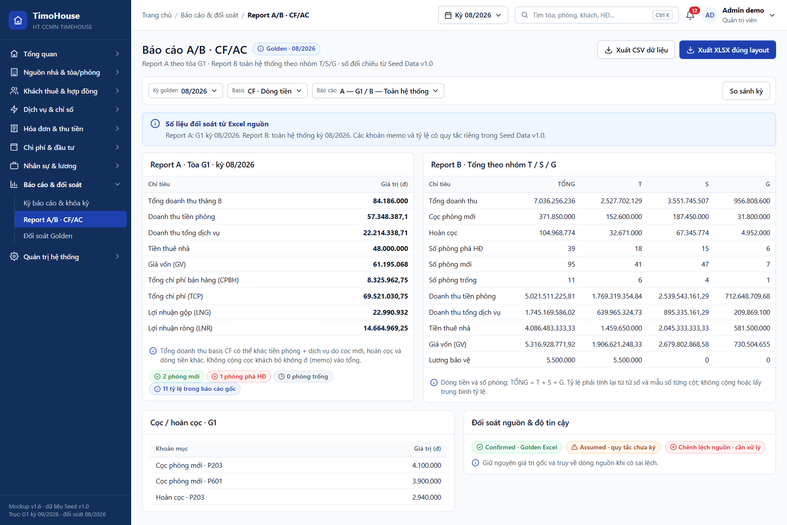
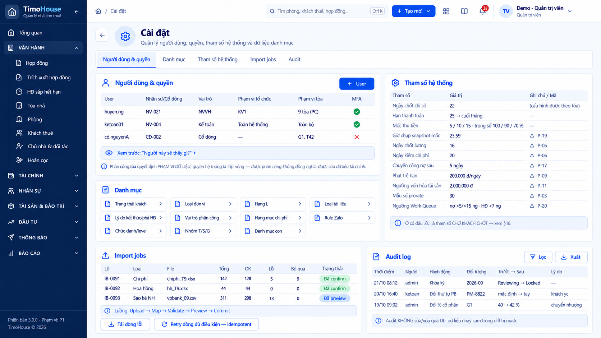

# TIMOHOUSE — SRS · Cụm Báo cáo, đối soát & quản trị hệ thống

**Phiên bản:** 1.0 · **Ngày lập:** 25/09/2026 · **Trạng thái:** DRAFT, chờ khách hàng xác nhận

**Phạm vi:** FR30 Kỳ báo cáo & khóa kỳ · FR31 Report A/B và CF/AC · FR32 Đối soát Golden & Metric definitions · FR33 Cài đặt, User/Quyền, Import Job và Audit.

**Nguồn:** [`TimoHouse_UI_Mockup_Spec_v1.0.md`](TimoHouse_UI_Mockup_Spec_v1.0.md) bản 1.9 (§4, §6, §7, §12 UI-30…UI-33, §13 F-06, §14, §15, §16, §18); dữ liệu mẫu ở [`TimoHouse_Mockup_Seed_Data_v1.0.md`](TimoHouse_Mockup_Seed_Data_v1.0.md) §5, §13, §14; ảnh mockup ở [`ui-imagegen-v1/08-bao-cao-doi-soat/`](ui-imagegen-v1/08-bao-cao-doi-soat/README.md) và [`ui-imagegen-v1/09-quan-tri-he-thong/`](ui-imagegen-v1/09-quan-tri-he-thong/README.md), kết luận từng ảnh theo [`AUDIT.md`](ui-imagegen-v1/AUDIT.md). Ảnh responsive `R-04-report-breakpoints.png` KHÔNG ĐẠT (AUDIT: lặp lỗi số của UI-32, thu gọn sidebar ở 1024px), chỉ tham khảo bố cục; hành vi responsive theo spec §5.3.

Quy ước đọc tài liệu và Common Rules 1–14 xem [`TimoHouse_SRS_v1.0.md`](TimoHouse_SRS_v1.0.md#common-rules-dùng-chung-cho-mọi-fr); tài liệu này chỉ dẫn chiếu, không lặp lại.

---

## Quy tắc chung của cụm

Các FR30–FR33 dẫn chiếu `Cluster Rule 08.N` bên dưới. Các quy tắc này bổ sung, không thay thế Common Rules.

| Mã | Nội dung | Nguồn |
|---|---|---|
| Cluster Rule 08.1 | **Nhãn độ tin cậy**: mỗi dòng/metric trên báo cáo mang một trong 4 nhãn, luôn gồm icon + chữ (Common Rule 4): `✓ Confirmed`, `~ Assumed`, `△ Cần xác nhận nghiệp vụ` (Need confirmation), `✕ Chênh lệch nguồn` (Source difference). Metric cần xác nhận nghiệp vụ vẫn tính theo công thức đề xuất nhưng giữ nhãn cảnh báo trên màn, trong file xuất và API. Mọi dòng thuộc biến thể kinh doanh (AC) chưa được khách ký đều mang nhãn cảnh báo | UI-31 ⑧, BR-5.02.14, BR-5.03.16 |
| Cluster Rule 08.2 | **Số liệu snapshot**: kỳ Locked đọc `REPORT_SNAPSHOT`, không tính lại khi xem hay khi xuất file. Kỳ Open/Reviewing hiển thị số tạm tính kèm nhãn "tạm tính", chỉ dùng nội bộ. Cổ đông chỉ thấy snapshot Locked của tòa mình có cổ phần; khi kỳ Reopened, cổ đông vẫn xem version Locked cũ cho tới khi khóa version mới | BR-5.01.4, BR-5.01.12, R-34, UI-31 ⑨ |
| Cluster Rule 08.3 | **Hiển thị metric**: VND/count/% theo locale vi-VN (Common Rule 8); số âm có màu kèm dấu ngoặc hoặc icon; tỷ lệ hiển thị 2 số lẻ, riêng CP/LNG dạng "lần"; mẫu số = 0 -> hiển thị `n/a`, không chia cho 0. Giá trị tiền lưu số thực không làm tròn, chỉ làm tròn khi hiển thị/xuất (BR-5.03.15, Cần chốt) (số chữ số thập phân khi hiển thị tiền: ## — capture hiển thị 1–2 số lẻ, ví dụ 57.348.387,1) | UI-31 "Hiển thị metric", BR-5.03.14 |
| Cluster Rule 08.4 | **Drill-down**: mọi ô số trên Report A/B (kể cả tỷ lệ, bảng cổ phần, cột nhóm) mở được drill-down về chứng từ nguồn (Screen 31.2), tổng kiểm bằng đúng giá trị ô. Ô không drill-down được là **lỗi nghiệm thu** | BR-5.06.4, R-37 |
| Cluster Rule 08.5 | **Tham số chờ chốt**: mọi số liệu phụ thuộc một `P-xx` chưa chốt mang chip `Cần xác nhận nghiệp vụ` kèm mã tham số, đọc giá trị từ trang Tham số hệ thống (Screen 33.5), không hard-code | §18 |

---
---

# FR30 - Kỳ báo cáo & khóa kỳ

## 1. Business Rule

| | |
|:-:|---|
| **Authorization** | • Kế toán: kiểm checklist và gửi Reviewing (F-06 bước 3); tính preview • Admin: khóa kỳ (F-06 bước 5); mở khóa kỳ — **chỉ Admin**, bắt buộc lý do (BR-5.01.6) • TPVH: xem báo cáo (§4) (cần xác nhận quyền xem màn kỳ báo cáo) • NVVH: không khóa kỳ (§4) • Cổ đông: chỉ xem snapshot Locked tại FR31 (BR-5.01.12) (cần xác nhận cổ đông không truy cập màn kỳ) • Vai trò được `Tạo kỳ` và `Trả về Open`; quyền xem màn kỳ của TNVH/Trưởng khu vực, NVVH, NV nguồn, NVKD, Kỹ thuật, Vệ sinh: ## (spec chưa nêu) |
| **Locking Rule** | • Người dùng quản lý vòng đời kỳ báo cáo: theo dõi tiến độ dữ liệu đầu vào, kiểm checklist, gửi Reviewing, khóa kỳ để đóng băng số liệu, mở khóa và khóa lại thành version mới • Chức năng chỉ thực hiện được khi người dùng đã đăng nhập với vai trò thuộc Authorization ## • Kỳ = tháng dương lịch; mỗi tháng **đúng 1 kỳ**, dùng chung cho Report A, Report B, cả CF/AC và phân phối lợi nhuận (BR-5.01.1, Đã chốt) • Trạng thái kỳ chuyển **đúng thứ tự**, không nhảy cóc; không xóa kỳ đã có snapshot (BR-5.01.2, R-08, Cần chốt): &nbsp;&nbsp;◦ Open: đang thu thập dữ liệu; được tính lại (§14) &nbsp;&nbsp;◦ Reviewing: khóa mềm, chờ Admin duyệt khóa (§14); có thể trả về Open &nbsp;&nbsp;◦ Locked: đã đóng băng bằng snapshot; chỉ đọc (Common Rule 12) &nbsp;&nbsp;◦ Reopened: Admin đã mở khóa; phải qua Reviewing để khóa lại &nbsp;&nbsp;◦ Chuyển hợp lệ: Open → Reviewing → Locked → Reopened → Reviewing; Reviewing → Open (trả về) • Hệ thống **không tự khóa kỳ** (§3, ngoài phạm vi) • Điều kiện chuyển Reviewing (BR-5.01.3, Cần chốt): &nbsp;&nbsp;◦ Bảng lương kỳ đã khóa &nbsp;&nbsp;◦ Mọi import chi phí đã confirmed &nbsp;&nbsp;◦ Không còn hóa đơn kỳ ở trạng thái `Nháp` &nbsp;&nbsp;◦ Tiền thuê nhà kỳ đã có lịch • Checklist trước khóa: mọi mục phải đạt mới bật nút `Khóa kỳ`; nút **disabled kèm tooltip** khi còn mục chưa đạt, không cho bấm rồi báo lỗi: &nbsp;&nbsp;◦ Bảng lương kỳ đã Locked &nbsp;&nbsp;◦ Chỉ số/hóa đơn hoàn tất; không còn batch lỗi nghiêm trọng &nbsp;&nbsp;◦ Chi phí confirmed và phân bổ đã duyệt &nbsp;&nbsp;◦ Hoàn cọc/hoa hồng của kỳ đã xử lý hoặc có ngoại lệ &nbsp;&nbsp;◦ Rule/metric version hợp lệ; các dòng `NEED_BUSINESS_CONFIRMATION` được cảnh báo &nbsp;&nbsp;◦ Σ % cổ phần của mọi tòa = 100 tại ngày cuối kỳ; khác 100 -> chặn khóa với thông báo "Tòa X: tổng cổ phần = y %" (BR-5.05.2, Đã chốt) &nbsp;&nbsp;◦ Golden reconciliation không còn source difference chưa giải quyết (refer Screen 32.1) &nbsp;&nbsp;◦ Kỳ N−1 đã Locked — kỳ tháng N chỉ khóa được khi kỳ N−1 đã Locked (BR-5.01.11, Cần chốt) &nbsp;&nbsp;◦ Danh sách checklist ở spec (6 mục) và wireframe ② (7 mục) lệch nhau: mục "Rule/metric version hợp lệ" chỉ có ở danh sách; mục "Σ % = 100" và "Kỳ N−1 Locked" chỉ có ở wireframe. Tài liệu gộp đủ 8 mục — cần xác nhận; cần xác nhận mục NEED_BUSINESS_CONFIRMATION chỉ cảnh báo hay chặn khóa • Khi khóa, đóng băng **đủ 8 mục** freeze list bằng snapshot, không tham chiếu bảng sống (BR-5.01.4, Đã chốt): &nbsp;&nbsp;◦ 1. Phiên bản Metric Definition (R-08) &nbsp;&nbsp;◦ 2. Phiên bản Allocation Rule + kết quả phân bổ (N, n, số tiền từng tòa) (R-26) &nbsp;&nbsp;◦ 3. Loại tòa T/S/G và hạng L resolve tại ngày cuối kỳ (D-02) &nbsp;&nbsp;◦ 4. Snapshot lương: bảng lương kỳ đã khóa + phân bổ lương về tòa (R-23) &nbsp;&nbsp;◦ 5. % cổ đông tại ngày cuối kỳ (R-32) &nbsp;&nbsp;◦ 6. Giá trị mọi metric, cả CF và AC &nbsp;&nbsp;◦ 7. Phân công tòa — snapshot ngày 15, phục vụ drill-down lương hiệu suất (R-23) &nbsp;&nbsp;◦ 8. Người khóa và thời điểm khóa • Báo cáo đã khóa **không tự tính lại** khi master data, phân công, % cổ đông hay loại tòa đổi sau đó (BR-5.01.4, Cluster Rule 08.2) • Chứng từ có ngày rơi vào kỳ Locked bị **khóa sửa/xóa**; sửa chỉ qua bút toán điều chỉnh ở kỳ hiện tại có tham chiếu chứng từ gốc (BR-5.01.5, Đã chốt; Common Rule 12) • **Chỉ Admin** được mở khóa, bắt buộc lý do; snapshot cũ giữ nguyên read-only có số version; khóa lại sinh version mới **kèm bảng chênh lệch từng metric giữa 2 version** (BR-5.01.6, Cần chốt) • Khi Reopened, cổ đông vẫn xem version Locked cũ cho tới khi khóa version mới • Lịch mặc định: 16 chốt lương → 20 kiểm chi phí → khóa sau ngày 20; các ngày là **tham số hệ thống**, không hard-code (BR-5.01.7 → P-06, Cần chốt; cấu hình tại Screen 33.5) • Bản ghi nhập sau `cutoff` nhưng có ngày trong kỳ -> cảnh báo "phát sinh sau cutoff"; chỉ vào kỳ nếu kỳ **chưa** Locked (BR-5.01.8, Cần chốt) • **Không dùng ngày tạo bản ghi** để xác định kỳ; mỗi metric dùng đúng `date_basis` của nó (BR-5.01.9, Đã chốt) • N phân bổ chốt tại ngày cuối kỳ, kể cả phòng trống, không kể tòa đã trả chủ nhà; **một N duy nhất** cho mọi dòng phân bổ trong kỳ (BR-5.01.10 → P-05) • Cổ đông chỉ thấy snapshot Locked; số ở Open/Reviewing gắn nhãn "tạm tính" và chỉ nội bộ (BR-5.01.12, R-34) |
| **Locking Impact** | • Xem danh sách/chi tiết kỳ không làm thay đổi dữ liệu • Tạo kỳ: tạo kỳ mới trạng thái `Open`, chưa có version (cutoff mặc định lấy từ đâu: ##) • Tính preview: tính lại số tạm tính của kỳ `Open` (cần xác nhận kết quả preview có được lưu) • Gửi Reviewing: `Open`/`Reopened` -> `Reviewing`; dữ liệu kỳ khóa mềm • Trả về Open: `Reviewing` -> `Open`, lưu lý do • Khóa kỳ: `Reviewing` -> `Locked` &nbsp;&nbsp;◦ Snapshot đủ 8 mục freeze list, version = v1 (lần khóa đầu) hoặc v{n+1} (khóa lại) &nbsp;&nbsp;◦ Ghi người khóa và thời điểm khóa &nbsp;&nbsp;◦ Chứng từ thuộc kỳ chuyển khóa sửa/xóa &nbsp;&nbsp;◦ Khóa lại: sinh bảng chênh lệch từng metric giữa v{n} và v{n+1} • Mở khóa: `Locked` -> `Reopened`, lưu lý do; snapshot cũ giữ read-only • Mọi thao tác ghi audit theo Common Rule 5 (xem tại Screen 33.7) |

## 2. Screen 30.1: Danh sách kỳ báo cáo

Chưa có capture — cần bổ sung. Nội dung dựng từ spec (mục "Danh sách" của UI-30).

<b>Screen 30.1: Danh sách kỳ báo cáo</b>

| **Fields** | **Format** | **Required?** | **Description** |
|:-:|:-:|:-:|:-:|
| Left Menu, Header | | | • Display follows Common Rule 1 • Highlight menu `Kỳ báo cáo/Khóa kỳ` • Breadcrumb: `Trang chủ / Báo cáo & đối soát / Kỳ báo cáo` |
| 🟧 Quản lý kỳ báo cáo | | | |
| Tiêu đề trang | Text | No | • Hiển thị "Kỳ báo cáo" (dòng phụ và chip đếm: ##) |
| + Tạo kỳ | Button | No | • Always display. Đây là CTA chính của màn • Enabled only when người dùng có quyền tạo kỳ (Common Rule 7) (vai trò: ##) • Click on -> Display Popup tạo kỳ báo cáo (Screen 30.3) |
| 🟧 Filter section | | | • Spec không mô tả bộ lọc/tìm kiếm của danh sách kỳ (§17.1 yêu cầu mọi list có search/filter/sort) — cần xác nhận tiêu chí, ví dụ năm, trạng thái |
| 🟦 Danh sách kỳ báo cáo | | | • Display the list of kỳ báo cáo đã tạo • Giá trị trống hiển thị `—` (Common Rule 3) • If there are no kỳ in the system, display error message E## kèm CTA `+ Tạo kỳ` theo quyền (Common Rule 13) • Default sorting: ## (đề xuất kỳ mới nhất trước — cần xác nhận) • Phân trang theo Common Rule 6 • Click on một dòng -> Go to Chi tiết kỳ báo cáo (Screen 30.2) |
| Kỳ | Text | No | • Mã kỳ dạng `YYYY-MM`, ví dụ `2026-09` • Kỳ Locked hiển thị biểu tượng khóa |
| Từ / Đến | Text | No | • Ngày đầu và ngày cuối tháng dương lịch của kỳ (BR-5.01.1). Format: DD/MM/YYYY |
| Cutoff | Text | No | • Thời điểm cutoff của kỳ. Format: DD/MM/YYYY hh:mm |
| Trạng thái | Tag | No | • Một trong: Open, Reviewing, Locked, Reopened; gồm icon + chữ (Common Rule 4) |
| Version | Text | No | • Version snapshot hiện tại, ví dụ `v1` • Kỳ chưa khóa lần nào: `—` |
| Tiến độ lương · chi phí · chỉ số · hóa đơn | Text | No | • Tiến độ 4 nguồn dữ liệu của kỳ: bảng lương, import chi phí, chỉ số, hóa đơn • Cần xác nhận cách hiển thị (4 cột riêng hay 1 cột dạng biểu tượng) và giá trị từng ô |
| Lỗi đối soát | Number | No | • Số chênh lệch golden chưa xử lý của kỳ (refer Screen 32.1) • Bằng 0: hiển thị `0` |
| Người khóa / thời gian | Text | No | • Người khóa và thời điểm khóa gần nhất (freeze mục 8). Format: DD/MM/YYYY hh:mm • Chưa khóa: `—` |
| Page number | Text | No | • Click on a page number -> Go to the corresponding page |

## 3. Screen 30.2: Chi tiết kỳ báo cáo & khóa kỳ

Chưa có capture đạt — ảnh ImageGen UI-30-reporting-period-lock.png KHÔNG ĐẠT (AUDIT: thiếu vùng ⑥, cutoff/version, lịch 16/20; checklist thiếu Σ % = 100 và "kỳ N−1 Locked"; freeze mục 5 ghi "cấu trúc hiện hành"; mở lại ghi "về Open"), không dùng. Nội dung dựng từ spec (wireframe UI-30). Cần capture cho 4 trạng thái Open / Reviewing / Locked / Reopened.

<b>Screen 30.2: Chi tiết kỳ báo cáo & khóa kỳ</b>

| **Fields** | **Format** | **Required?** | **Description** |
|:-:|:-:|:-:|:-:|
| Left Menu, Header | | | • Display follows Common Rule 1 • Highlight menu `Kỳ báo cáo/Khóa kỳ` • Breadcrumb: `Trang chủ / Báo cáo & đối soát / Kỳ báo cáo / {YYYY-MM}` |
| Tiêu đề | Text | No | • Hiển thị "Kỳ báo cáo / {YYYY-MM}" kèm Tag trạng thái kỳ (Common Rule 4) • Dòng phụ: "Từ {DD/MM} → {DD/MM} · Cutoff {DD/MM hh:mm} · Version hiện tại: {v n}"; chưa khóa lần nào hiển thị `—`, ví dụ "Từ 01/09 → 30/09 · Cutoff 20/10 08:00 · Version hiện tại: —" |
| Banner kỳ đã khóa | Text | No | • Display only when trạng thái = Locked • Banner persistent theo Common Rule 12: kỳ chỉ đọc, vẫn cho copy/xuất • Content format: "##" (cần nội dung chính xác) |
| Banner mở khóa | Text | No | • Display only when trạng thái = Reopened • Nêu lý do mở khóa, người mở, thời điểm và version Locked cổ đông đang xem (Cluster Rule 08.2) • Content format: "##" |
| Tính preview | Button | No | • Display only when trạng thái = Open (cần xác nhận có hiển thị ở Reopened) • Enabled only when người dùng có quyền (Common Rule 7) • Click on -> Tính lại toàn bộ metric tạm tính của kỳ; số hiển thị ở FR31 mang nhãn "tạm tính" (Cluster Rule 08.2) • Cần xác nhận phạm vi tính (mọi tòa?), chạy nền hay đồng bộ và thông báo khi xong |
| Gửi Reviewing | Button | No | • Display only when trạng thái = Open hoặc Reopened. Đây là CTA chính ở hai trạng thái này • Enabled only when đủ 4 điều kiện chuyển Reviewing (BR-5.01.3); khi disabled, tooltip liệt kê điều kiện còn thiếu • Click on -> Display Popup gửi Reviewing (Screen 30.4) |
| Khóa kỳ | Button | No | • Display only when trạng thái = Reviewing. Đây là CTA chính ở trạng thái này • Enabled only when mọi mục ở ② Checklist trước khóa đạt và người dùng là Admin • Khi disabled: tooltip liệt kê mục chưa đạt, ví dụ "Golden không còn chênh lệch nguồn chưa giải quyết"; Σ % sai hiển thị "Tòa X: tổng cổ phần = y %" • Click on -> Display Popup xác nhận khóa kỳ (Screen 30.6) |
| Trả về Open | Button | No | • Display only when trạng thái = Reviewing • Enabled only when người dùng có quyền (vai trò: ##) • Click on -> Display Popup trả về Open (Screen 30.5) |
| Mở khóa | Button | No | • Display only when trạng thái = Locked • Enabled only when người dùng là Admin (BR-5.01.6); vai trò khác hiển thị disabled kèm tooltip nêu quyền thiếu (Common Rule 7) • Click on -> Display Popup mở khóa kỳ (Screen 30.7) |
| So sánh version | Button | No | • Display only when kỳ có từ 2 version trở lên • Always enabled • Click on -> Go to So sánh version (Screen 30.8) |
| Xuất snapshot | Button | No | • Display only when kỳ đã có ít nhất 1 version • Always enabled • Click on -> Xuất snapshot của version đang xem; số xuất là số snapshot (Cluster Rule 08.2) (định dạng và nội dung file: ##) |
| 🟧 ① Tiến độ đầu vào | | | • Sáu nguồn dữ liệu phải sẵn sàng; mỗi dòng gồm tên nguồn, icon trạng thái (✓ đạt / △ còn vướng) kèm chữ (Common Rule 4) • Mỗi dòng là link tới module tương ứng để đi xử lý |
| Bảng lương kỳ | Text | No | • Trạng thái bảng lương của kỳ, ví dụ "✓ Đã khóa" • Click on -> Go to Bảng lương (refer to FR22) |
| Import chi phí | Text | No | • Số lô import chi phí đã Confirmed trên tổng số lô, ví dụ "✓ 14/14 lô Confirmed" • Click on -> Go to Chi phí & Import (refer to FR24) |
| Hóa đơn kỳ | Text | No | • Số hóa đơn kỳ còn ở `Nháp`, ví dụ "✓ 0 hóa đơn còn Nháp" • Click on -> Go to Kỳ hóa đơn (refer to FR11) (hay Hóa đơn FR12 lọc trạng thái Nháp — cần xác nhận) |
| Tiền thuê nhà | Text | No | • Số tòa đã có lịch tiền thuê nhà của kỳ, ví dụ "✓ đã có lịch đủ 42 tòa" • Click on -> Go to Tiền thuê nhà/Trả trước (refer to FR28) |
| Phân bổ chi phí | Text | No | • Trạng thái chạy phân bổ và version rule, ví dụ "✓ chạy với rule v4" • Click on -> Go to Phân bổ chi phí/lương (refer to FR25) |
| Đối soát golden | Text | No | • Số chênh lệch chưa xử lý, ví dụ "△ 2 chênh lệch chưa xử lý" • Click on -> Go to Đối soát Golden (Screen 32.1) |
| Cảnh báo phát sinh sau cutoff | Text | No | • Display only when có bản ghi nhập sau cutoff nhưng có ngày thuộc kỳ (BR-5.01.8) • Content format: "phát sinh sau cutoff" kèm số bản ghi • Kỳ chưa Locked: bản ghi vẫn vào kỳ; kỳ Locked: bản ghi ghi vào kỳ hiện tại bằng bút toán điều chỉnh • Vị trí hiển thị và cách xem danh sách bản ghi: ## (wireframe không có) |
| 🟧 ② Checklist trước khóa | | | • Tiêu đề: "Checklist trước khóa (phải xanh hết mới bật nút Khóa)" • Mục chưa đạt đánh dấu "← đang vướng" |
| Checklist | Checkbox | No | • Always display. Chỉ đọc: trạng thái từng mục do hệ thống kiểm, người dùng không tick tay (cần xác nhận) • Danh sách 8 mục theo thứ tự: &nbsp;&nbsp;◦ Bảng lương đã Locked &nbsp;&nbsp;◦ Chỉ số & hóa đơn hoàn tất, không còn batch lỗi nghiêm trọng &nbsp;&nbsp;◦ Chi phí confirmed và phân bổ đã duyệt &nbsp;&nbsp;◦ Hoàn cọc / hoa hồng của kỳ đã xử lý hoặc có ngoại lệ &nbsp;&nbsp;◦ Rule/metric version hợp lệ; dòng `NEED_BUSINESS_CONFIRMATION` được cảnh báo &nbsp;&nbsp;◦ Σ % cổ phần của mọi tòa = 100; chưa đạt liệt kê "Tòa X: tổng cổ phần = y %" &nbsp;&nbsp;◦ Golden không còn chênh lệch nguồn chưa giải quyết &nbsp;&nbsp;◦ Kỳ {N−1} đã Locked (kỳ trước phải khóa trước), ví dụ "Kỳ 08/2026 đã Locked" • Checked: mục đạt; Unchecked: mục chưa đạt • Click on một mục chưa đạt -> ## (đi tới module xử lý như ở ①?) |
| 🟧 ③ Freeze list | | | • Tiêu đề: "Freeze list — 8 mục sẽ đóng băng khi khóa" |
| Freeze list | Text | No | • Always display đủ 8 mục theo thứ tự ở Business Rule, mỗi mục kèm mã tham chiếu • Khi trạng thái = Locked: mỗi mục hiển thị trạng thái đã snapshot • Ghi chú cố định: "Sau khi khóa, báo cáo KHÔNG tự tính lại dù master data đổi" |
| 🟧 ④ Vòng đời kỳ | | | |
| Sơ đồ vòng đời | Image | No | • Display sơ đồ: Open ─gửi duyệt→ Reviewing ─admin duyệt→ Locked → Reopened (chỉ Admin, BẮT BUỘC lý do); Reviewing ─trả về→ Open; Reopened → Reviewing • Trạng thái hiện tại được highlight • Không cho nhảy cóc trạng thái; không xóa kỳ đã có snapshot (BR-5.01.2) |
| 🟧 ⑤ Bảng chênh lệch giữa version | | | • Display only when kỳ đã khóa lại từ version 2 trở lên |
| Bảng chênh lệch | Text | No | • Content format: "Khóa lại → version n+1 + BẢNG CHÊNH LỆCH từng metric giữa 2 bản" • Click on -> Go to So sánh version (Screen 30.8) |
| 🟧 ⑥ Sau khi khóa | | | |
| Băng sau khóa | Text | No | • Always display • Content format: "Chứng từ thuộc kỳ bị khóa sửa/xóa. Phát sinh muộn ghi BÚT TOÁN ĐIỀU CHỈNH vào KỲ HIỆN TẠI, tham chiếu chứng từ gốc" (BR-5.01.5) |
| 🟧 Lịch mốc mặc định | | | • Có trong chú giải vùng của spec nhưng không có vị trí trên wireframe — cần xác nhận vị trí |
| Lịch mốc | Text | No | • Display "16 chốt lương → 20 kiểm chi phí → khóa sau ngày 20" • Giá trị đọc từ tham số (Screen 33.5), kèm chip `Cần xác nhận nghiệp vụ · P-06` (Cluster Rule 08.5) |

## 4. Screen 30.3: Popup tạo kỳ báo cáo

Chưa có capture — cần bổ sung. Nội dung dựng từ spec (action "tạo kỳ" của UI-30).

<b>Screen 30.3: Popup tạo kỳ báo cáo</b>

| **Fields** | **Format** | **Required?** | **Description** |
|:-:|:-:|:-:|:-:|
| 🟧 The popup can be closed by the X icon or by clicking out of the popup. Closing the popup redirects the user to the underlying screen without any changes saved. (cần xác nhận popup có X icon) | | | |
| Tháng | Datepicker | Yes | • Always display • Placeholder: ## • Default selection: None • Click on -> Display a month picker (tháng/năm) (cần xác nhận dạng chọn tháng) • If clicking out of the field while it is blank -> Show error message E## • Tháng đã có kỳ -> Show error message E## (mỗi tháng đúng 1 kỳ, BR-5.01.1) |
| Từ ngày – Đến ngày | Text | No | • Tự hiển thị ngày đầu và ngày cuối của tháng đã chọn; không sửa được (BR-5.01.1). Format: DD/MM/YYYY |
| Cutoff | Datepicker | Yes | • Always display • Default selection: ## (spec chưa nêu cutoff mặc định; wireframe ví dụ "20/10 08:00" cho kỳ 09/2026) • Format: DD/MM/YYYY hh:mm • If clicking out of the field while it is blank -> Show error message E## |
| Hủy | Button | No | • Always appear • Always enabled • Click on -> Đóng popup, không tạo kỳ |
| Tạo kỳ | Button | No | • Always appear • Enabled only when đã chọn Tháng • Click on -> Validate in the following order: &nbsp;&nbsp;◦ If there are any fields with invalid values, display error messages as mentioned above &nbsp;&nbsp;◦ ## (có bắt buộc kỳ N−1 đã tồn tại không?) &nbsp;&nbsp;◦ If all conditions above are satisfied -> tạo kỳ trạng thái `Open`, đóng popup, hiển thị toast thành công (Common Rule 13) và ## (mở Screen 30.2 của kỳ mới hay ở lại Screen 30.1?) |

## 5. Screen 30.4: Popup gửi Reviewing

Chưa có capture — cần bổ sung. Nội dung dựng từ spec (BR-5.01.3, Common Rule 11 "Gửi duyệt").

<b>Screen 30.4: Popup gửi Reviewing</b>

| **Fields** | **Format** | **Required?** | **Description** |
|:-:|:-:|:-:|:-:|
| 🟧 The popup can be closed by the X icon or by clicking out of the popup. Closing the popup redirects the user to the underlying screen without any changes saved. (cần xác nhận popup có X icon) | | | |
| Message | Text | No | • Confirm nhẹ theo Common Rule 11 • Content format: "##" (cần nội dung chính xác); nêu kỳ {YYYY-MM} sẽ chuyển Reviewing và dữ liệu kỳ bị khóa mềm |
| Điều kiện chuyển Reviewing | Text | No | • Always display 4 điều kiện của BR-5.01.3, mỗi điều kiện kèm icon ✓ / ✕ và chữ: &nbsp;&nbsp;◦ Bảng lương kỳ đã khóa &nbsp;&nbsp;◦ Mọi import chi phí đã confirmed &nbsp;&nbsp;◦ Không còn hóa đơn kỳ ở Nháp &nbsp;&nbsp;◦ Tiền thuê nhà kỳ đã có lịch |
| Checklist lỗi còn lại | Text | No | • Display only when còn mục ở ② Checklist trước khóa chưa đạt • Liệt kê các mục chưa đạt; đây là thông tin để xử lý trước khi Admin khóa, không chặn gửi Reviewing (cần xác nhận) • Các metric `NEED_BUSINESS_CONFIRMATION` được liệt kê dạng cảnh báo |
| Hủy | Button | No | • Always appear • Always enabled • Click on -> Đóng popup, không đổi trạng thái |
| Gửi Reviewing | Button | No | • Always appear • Enabled only when đủ 4 điều kiện chuyển Reviewing • Click on -> Chuyển kỳ `Open`/`Reopened` -> `Reviewing`, ghi audit, đóng popup, cập nhật Screen 30.2 và hiển thị toast thành công |

## 6. Screen 30.5: Popup trả về Open

Chưa có capture — cần bổ sung. Nội dung dựng từ spec (action "trả về open" của UI-30).

<b>Screen 30.5: Popup trả về Open</b>

| **Fields** | **Format** | **Required?** | **Description** |
|:-:|:-:|:-:|:-:|
| 🟧 The popup can be closed by the X icon or by clicking out of the popup. Closing the popup redirects the user to the underlying screen without any changes saved. (cần xác nhận popup có X icon) | | | |
| Message | Text | No | • Content format: "##" (cần nội dung chính xác); nêu kỳ {YYYY-MM} sẽ về Open để chỉnh sửa và tính lại |
| Lý do | Textbox | Yes | • Always display. Áp Common Rule 11 "Trả sửa" (bắt buộc lý do) (cần xác nhận "Trả về Open" được coi là Trả sửa) • Allow entering all types of characters. Max length: 255 • If clicking out of the field while it is blank -> Show error message E## |
| Hủy | Button | No | • Always appear • Always enabled • Click on -> Đóng popup, không đổi trạng thái |
| Trả về Open | Button | No | • Always appear • Enabled only when đã nhập Lý do • Click on -> Chuyển kỳ `Reviewing` -> `Open`, lưu lý do vào audit, đóng popup và cập nhật Screen 30.2 |

## 7. Screen 30.6: Popup xác nhận khóa kỳ

Chưa có capture — cần bổ sung. Nội dung dựng từ spec (UI-30 ③, Common Rule 11 "Duyệt").

<b>Screen 30.6: Popup xác nhận khóa kỳ</b>

| **Fields** | **Format** | **Required?** | **Description** |
|:-:|:-:|:-:|:-:|
| 🟧 The popup can be closed by the X icon or by clicking out of the popup. Closing the popup redirects the user to the underlying screen without any changes saved. (cần xác nhận popup có X icon) | | | |
| Message | Text | No | • Popup tóm tắt thay đổi và tác động theo Common Rule 11 • Content format: "##" (cần nội dung chính xác) |
| Tóm tắt | Text | No | • Hiển thị kỳ {YYYY-MM}, version sẽ tạo (v1 hoặc v{n+1}), người khóa (người dùng hiện tại) |
| Freeze list | Text | No | • Liệt kê đủ 8 mục sẽ được snapshot (Business Rule) |
| Tác động | Text | No | • Content format gồm các ý: báo cáo không tự tính lại sau khi khóa; chứng từ thuộc kỳ bị khóa sửa/xóa; phát sinh muộn ghi bút toán điều chỉnh ở kỳ hiện tại • Display only when đây là lần khóa lại: thêm ý "Hệ thống sinh bảng chênh lệch từng metric giữa v{n} và v{n+1}" |
| Hủy | Button | No | • Always appear • Always enabled • Click on -> Đóng popup, kỳ giữ `Reviewing` |
| Khóa kỳ | Button | No | • Always appear • Always enabled • Click on -> Validate in the following order: &nbsp;&nbsp;◦ Kiểm lại checklist ở server; còn mục chưa đạt -> display error message E## kèm danh sách mục (Common Rule 13, xung đột 409 nếu dữ liệu đã đổi) &nbsp;&nbsp;◦ If all conditions above are satisfied -> Chuyển kỳ `Reviewing` -> `Locked`, snapshot 8 mục, tạo version, ghi người và thời điểm khóa, đóng popup và cập nhật Screen 30.2 |

## 8. Screen 30.7: Popup mở khóa kỳ

Chưa có capture — cần bổ sung. Nội dung dựng từ spec (BR-5.01.6, Common Rule 11 "Mở khóa").

<b>Screen 30.7: Popup mở khóa kỳ</b>

| **Fields** | **Format** | **Required?** | **Description** |
|:-:|:-:|:-:|:-:|
| 🟧 The popup can be closed by the X icon or by clicking out of the popup. Closing the popup redirects the user to the underlying screen without any changes saved. (cần xác nhận popup có X icon) | | | |
| Message | Text | No | • Danger popup theo Common Rule 11 • Content format: "##" (cần nội dung chính xác) |
| Snapshot bị ảnh hưởng | Text | No | • Liệt kê version Locked hiện tại (v{n}), thời điểm snapshot và các mục freeze thuộc version đó • Ghi chú cố định: snapshot v{n} giữ nguyên read-only; cổ đông vẫn xem v{n} cho tới khi khóa version mới • Cần xác nhận mức chi tiết (liệt kê theo tòa/báo cáo hay chỉ theo mục freeze) |
| Lý do | Textbox | Yes | • Always display • Allow entering all types of characters. Max length: 255 • If clicking out of the field while it is blank -> Show error message E## |
| Hủy | Button | No | • Always appear • Always enabled • Click on -> Đóng popup, kỳ giữ `Locked` |
| Mở khóa | Button | No | • Always appear. Kiểu danger • Enabled only when đã nhập Lý do • Click on -> Chuyển kỳ `Locked` -> `Reopened`, lưu lý do vào audit, đóng popup và cập nhật Screen 30.2 |

## 9. Screen 30.8: So sánh version

Chưa có capture — cần bổ sung. Nội dung dựng từ spec (UI-30 vùng ⑤, BR-5.01.6). Spec chưa nêu dạng hiển thị (trang riêng hay popup) — tài liệu tạm mô tả như trang riêng.

<b>Screen 30.8: So sánh version</b>

| **Fields** | **Format** | **Required?** | **Description** |
|:-:|:-:|:-:|:-:|
| Left Menu, Header | | | • Display follows Common Rule 1 • Highlight menu `Kỳ báo cáo/Khóa kỳ` • Breadcrumb: `Trang chủ / Báo cáo & đối soát / Kỳ báo cáo / {YYYY-MM} / So sánh version` |
| Tiêu đề | Text | No | • Hiển thị "So sánh version · Kỳ {YYYY-MM}" |
| Version so sánh | Dropdown | No | • Default selection: version mới nhất so với version liền trước • Cần xác nhận có cho chọn 2 version bất kỳ không |
| Basis | Dropdown | No | • Default selection: ## • Options: CF, AC • Allow single selection only • Select an option -> Hiển thị chênh lệch của basis đã chọn |
| 🟦 Bảng chênh lệch | | | • Display mỗi dòng là một metric × phạm vi (tòa hoặc nhóm) có trong 2 version • Mặc định chỉ hiển thị dòng có chênh lệch (cần xác nhận) • Default sorting: ## • Không có chênh lệch: display error message E## • Click on một dòng -> ## (mở drill-down Screen 31.2 của từng version?) |
| Metric | Text | No | • Mã metric, ví dụ `TOTAL_REVENUE` |
| Phạm vi | Text | No | • Tòa hoặc nhóm T/S/G |
| Giá trị v{n} | Number | No | • Giá trị ở version cũ (Cluster Rule 08.3) |
| Giá trị v{n+1} | Number | No | • Giá trị ở version mới |
| Chênh tuyệt đối | Number | No | • = v{n+1} − v{n}; số âm theo Cluster Rule 08.3 |
| Chênh % | Number | No | • = chênh tuyệt đối ÷ v{n} × 100 %; v{n} = 0 -> `n/a` |
| Page number | Text | No | • Click on a page number -> Go to the corresponding page |

## 10. User Steps

| | |
|:-:|---|
| **Pre-condition** | Kế toán đã đăng nhập; kỳ đã được tạo ở trạng thái Open; đã qua ngày 20 của tháng kế tiếp (P-06) |
| **User steps** | **Step 1:** Click menu `Kỳ báo cáo/Khóa kỳ` -> display Danh sách kỳ báo cáo (Screen 30.1) **Step 2:** Click một dòng kỳ -> display Chi tiết kỳ báo cáo & khóa kỳ (Screen 30.2) **Step 3:** Click `Gửi Reviewing` -> display Popup gửi Reviewing (Screen 30.4) **Step 4:** Click `Gửi Reviewing` trên popup -> display Screen 30.2 ở trạng thái Reviewing |

| | |
|:-:|---|
| **Pre-condition** | Admin đã đăng nhập; kỳ ở trạng thái Reviewing và mọi mục checklist đạt |
| **User steps** | **Step 1:** Tại Screen 30.2, click `Khóa kỳ` -> display Popup xác nhận khóa kỳ (Screen 30.6) **Step 2:** Click `Khóa kỳ` trên popup -> display Screen 30.2 ở trạng thái Locked **Step 3:** Click `Mở khóa` -> display Popup mở khóa kỳ (Screen 30.7) **Step 4:** Nhập lý do, click `Mở khóa` -> display Screen 30.2 ở trạng thái Reopened; gửi Reviewing và khóa lại theo các bước trên **Step 5:** Sau khi khóa lại, click `So sánh version` -> display So sánh version (Screen 30.8) |

| | |
|:-:|---|
| **Pre-condition** | Người dùng có quyền tạo kỳ đã đăng nhập; tháng cần tạo chưa có kỳ |
| **User steps** | **Step 1:** Tại Screen 30.1, click `+ Tạo kỳ` -> display Popup tạo kỳ báo cáo (Screen 30.3) **Step 2:** Chọn tháng, click `Tạo kỳ` -> display ## (màn đích sau khi tạo cần xác nhận) |

Luồng đầy đủ Chi phí → phân bổ → khóa báo cáo theo F-06: nhập chi phí (refer to FR24) → phân bổ (refer to FR25) → FR30 gửi Reviewing → chạy golden (Screen 32.1) → Admin khóa kỳ → xuất báo cáo (Screen 31.1).

---
---

# FR31 - Report A/B và CF/AC

## 1. Business Rule

| | |
|:-:|---|
| **Authorization** | • Admin, Kế toán: xem Report A/B cả CF và AC, drill-down, so sánh, xuất file (§4) • TPVH: xem báo cáo (§4) (cần xác nhận phạm vi: đơn vị và cấp dưới hay toàn hệ thống; có xem Report B không) • Cổ đông: chỉ xem Report A và bảng cổ phần của tòa mình có cổ phần, **chỉ snapshot Locked**, read-only; không xem Report B toàn hệ thống (§4, BR-5.01.12, R-34) • TNVH/Trưởng khu vực, NVVH, NV nguồn, NVKD, Kỹ thuật, Vệ sinh: ## (spec chưa nêu) • Phạm vi tòa áp ở server theo `BUILDING_ASSIGNMENT` (Common Rule 7) |
| **View Rule** | • Người dùng xem báo cáo lợi nhuận theo tòa (Report A) và báo cáo tổng theo nhóm T/S/G (Report B), ở hai biến thể CF (dòng tiền) và AC (kinh doanh); mọi số drill-down được về chứng từ • Chức năng chỉ thực hiện được khi người dùng đã đăng nhập với vai trò thuộc Authorization ## • Một màn, hai biến thể basis; công thức tổng hợp **giống hệt nhau**, chỉ khác dữ liệu đầu vào • Report A tính cho `(kỳ, tòa, basis)`; **không có ô nhập tay số tổng** (BR-5.03.1, Đã chốt) • Report A gồm 12 khối, giữ đúng thứ tự khối theo mẫu Excel để đối soát theo hàng: Doanh thu; Cọc/Hoàn; Đếm phòng; Doanh thu tiền nhà; Doanh thu dịch vụ; Giá vốn; Chi phí bán hàng/vận hành; Tổng chi phí; Lợi nhuận gộp; Lợi nhuận ròng; Tỷ lệ; Cổ đông • Ba điều dễ làm sai nhất: &nbsp;&nbsp;◦ `TOTAL_REVENUE` ≠ `RENT_REVENUE` + `SERVICE_REVENUE` là bình thường ở CF (tổng lấy theo payment, các dòng lấy theo dòng hóa đơn). Chênh lệch = cọc mới − hoàn cọc + nợ cũ/thu khác đã thu − hóa đơn kỳ chưa thu; hiển thị dòng đối chiếu trong drill-down, không ép hai số bằng nhau (BR-5.03.2) &nbsp;&nbsp;◦ Không cộng/trừ tay phòng ở dòng tiền phòng; hóa đơn cuối và hóa đơn đầu prorate là dòng hóa đơn bình thường của kỳ (BR-5.03.3, BR-5.02.9) &nbsp;&nbsp;◦ Tỷ lệ ở Report B tính lại từ tử số và mẫu số của tổng, không lấy trung bình tỷ lệ các tòa (BR-5.04.3, R-07) • `ELECTRIC_REVENUE` **luôn gồm** dòng điện chung; tách dòng riêng thì đổi theo tham số (BR-5.03.6 → P-13, Cần chốt) • Dòng "Cọc khách bỏ không ở" là **memo**: hiển thị và drill-down được nhưng không cộng vào tổng doanh thu, không sinh hoàn cọc; ở AC chuyển thành thu nhập khác (BR-5.03.7, BR-5.02.8) • Hoàn cọc trừ khỏi doanh thu CF ở **tháng thực chi**; hoàn cọc âm -> công nợ, không âm hóa doanh thu (BR-5.03.8) • Cọc phòng mới hiển thị **từng phòng một dòng**, metric là tổng các dòng (BR-5.03.5) • Đếm phòng: 1 phòng vừa phá HĐ vừa có khách mới trong tháng đếm **cả 2**; đổi phòng nội bộ và gia hạn không đếm; phòng trống đếm tại ngày cuối kỳ theo 3 loại Trống ở luôn / Trống hết tháng / Đang chờ (BR-5.03.9, R-06, D-24; refer to FR05) • Giá vốn (tiền thuê nhà, thiết bị, 6 giá gốc dịch vụ) gắn **thẳng tòa**, không qua phân bổ (BR-5.03.10) • 10 dòng lương là **dòng con** của chi phí lương; lương hiệu suất quản lý tòa ghi thẳng tòa, lương cố định theo level đi qua phân bổ (BR-5.03.11) (Seed §13 của G1 chỉ có 9 dòng lương; dòng "Lương bảo vệ" có ở Report B §14 — cần xác nhận danh sách 10 dòng) • Hiển thị tỷ lệ, số âm, `n/a`, làm tròn theo Cluster Rule 08.3 (BR-5.03.14, BR-5.03.15) • Biến thể AC: thay dòng tiền thuê bằng bản thẳng hàng, thêm dòng khấu hao, thêm "Thu nhập khác" và dòng memo "Doanh thu chưa thực hiện"; mọi dòng AC chưa được KH xác nhận mang nhãn cảnh báo (BR-5.03.16, Cần chốt) • Tòa chưa có HĐ đầu vào hiệu lực hoặc chưa có phòng tại ngày cuối kỳ -> **không sinh Report A** (BR-5.03.17, Cần chốt) • Report B = Σ Report A trong scope; không có số nào chỉ tồn tại ở Report B (BR-5.04.1) • Nhóm T/S/G của tòa resolve theo **lịch sử loại tòa tại ngày cuối kỳ**, không dùng giá trị hiện tại (BR-5.04.2; ý nghĩa nhóm theo P-04) • Chi phí chung và lương cố định phải qua phân bổ trước khi gộp; Report B không tự phân bổ lại (BR-5.04.5) • Hai tỷ lệ `SERVICE_REVENUE_OVER_INPUT_COST` (mẫu số gồm 6 giá gốc **+ lương vệ sinh**) và `RENT_REVENUE_OVER_HEAD_LEASE` **chỉ hiển thị ở Report B**; Report A vẫn tính để phục vụ drill-down (BR-5.04.6) • Nhãn tin cậy theo Cluster Rule 08.1 (BR-5.02.14); số liệu snapshot theo Cluster Rule 08.2; drill-down theo Cluster Rule 08.4 • Bảng cổ phần (khối 12): &nbsp;&nbsp;◦ % dùng tại **ngày cuối kỳ**, không prorate (BR-5.05.1, Cần chốt) &nbsp;&nbsp;◦ Σ % của tòa phải = 100 tại ngày cuối kỳ; khác 100 -> chặn khóa kỳ (BR-5.05.2; refer Screen 30.2) &nbsp;&nbsp;◦ Vốn = % × tiền thuê nhà 1 tháng (AC vẫn dùng số CF của tiền thuê) — là số trình bày, không phải vốn góp lũy kế (BR-5.05.3, D-43) &nbsp;&nbsp;◦ LN gộp/LN ròng cổ đông = % × giá trị của snapshot cùng basis; Σ các dòng phải đúng bằng tổng (BR-5.05.4) &nbsp;&nbsp;◦ Tổng nhận = Vốn + LN ròng × % là **tham khảo, không phải số chi**; số chi thực ở FR29 (BR-5.05.5, D-44) &nbsp;&nbsp;◦ Khi khóa kỳ, % và 5 cột giá trị được snapshot; đổi % sau đó không đổi bảng đã khóa (BR-5.05.6) &nbsp;&nbsp;◦ LN ròng âm -> không có dòng phân phối nhưng bảng vẫn hiển thị số âm (BR-5.05.7, Cần chốt) • Quyết định **ASSUMED** ảnh hưởng report: điện chung cộng `ELECTRIC_REVENUE` (Decision Log #5); cọc không vào doanh thu AC, cọc giữ vào `OTHER_INCOME`, khách trả trước phân bổ theo tháng (#6); lương theo kỳ trên cả CF/AC (#2); ngưỡng tài sản/khấu hao (#3, #4, P-02, P-11); tiền thuê CF theo tháng HĐ và AC dàn đều (#1) • Số minh họa trên wireframe UI-31 (Tổng doanh thu 148.320.000, cổ đông "Ng.V.A 40 %", biên LN ròng 25,90 %…) không khớp Seed §13 (G1 kỳ 08/2026: tổng doanh thu 84.186.000, 9 cổ đông, LNR/DT 17,42 %). Tài liệu dùng Seed §13, §14 làm ví dụ |
| **View Impact** | • Xem, đổi basis/kỳ/scope, expand khối, drill-down và so sánh không làm thay đổi dữ liệu; chỉ tác động tới hiển thị hiện tại • Xuất file lấy số snapshot, không tính lại lúc xuất (Cluster Rule 08.2) • Cần xác nhận thao tác xuất báo cáo có ghi audit không |

## 2. Screen 31.1: Báo cáo Report A/B · CF/AC

<b>Screen 31.1: Báo cáo Report A/B · CF/AC</b>

Capture chỉ phủ một phần màn hình (AUDIT: KHÔNG ĐẠT vì thiếu vùng — số liệu khớp Seed §13, §14). Thiếu: cấu trúc 12 khối, 11 tỷ lệ, bảng cổ phần, vùng ⑦, toggle CF/AC, trạng thái Locked/version, nhãn tin cậy từng dòng, drill-down. Các vùng thiếu mô tả theo spec.

| **Fields** | **Format** | **Required?** | **Description** |
|:-:|:-:|:-:|:-:|
| Left Menu, Header | | | • Display follows Common Rule 1 • Highlight menu `Report A/B, CF/AC` • Breadcrumb: `Trang chủ / Báo cáo & đối soát / Report A/B · CF/AC` • Route: `#/reports/building-profit` (Report A), `#/reports/business-summary` (Report B) (spec có 2 route nhưng wireframe và capture hiển thị cả hai báo cáo trên một màn — cần xác nhận bố cục) |
| Tiêu đề | Text | No | • Hiển thị "Báo cáo A/B · CF/AC" • Capture lệch spec: chip "Golden · 08/2026" và băng "Số liệu đối soát từ Excel nguồn" là nội dung demo, spec không có; mô tả theo spec |
| 🟧 Header chung | | | • Gồm: kỳ, basis CF/AC, báo cáo, version, trạng thái, scope, thời điểm snapshot, so sánh, xuất file |
| Kỳ | Dropdown | No | • Default selection: ## (kỳ đang chọn trên Header hay kỳ Locked gần nhất?) • Click on -> Display danh sách kỳ; kỳ Locked hiển thị biểu tượng khóa và version • Cổ đông: chỉ liệt kê kỳ Locked (Cluster Rule 08.2) • Allow single selection only • Select an option -> Tải lại báo cáo theo kỳ đã chọn và đồng bộ với bộ chọn Kỳ trên Header (Common Rule 1) • Capture lệch spec: nhãn "Kỳ golden"; mô tả theo spec |
| ① Basis | Button | No | • Nút chuyển 2 lựa chọn: &nbsp;&nbsp;◦ CF · Dòng tiền: Default selection. Select this option -> Hiển thị báo cáo với dữ liệu đầu vào theo dòng tiền &nbsp;&nbsp;◦ AC · Kinh doanh: Select this option -> Hiển thị báo cáo với dữ liệu đầu vào theo kinh doanh; hiện các dòng riêng của AC (khối 6, 10) và nhãn cảnh báo trên dòng chưa được KH xác nhận • Chip CF/AC có tooltip mô tả nguyên tắc basis (nội dung tooltip: ##) • Capture lệch spec: dùng dropdown "Basis CF · Dòng tiền" thay cho toggle; mô tả theo spec |
| ② Chọn báo cáo | Dropdown | No | • Hai lựa chọn: &nbsp;&nbsp;◦ Report A — theo tòa: kèm dropdown chọn tòa trong phạm vi quyền, ví dụ "G1". Select a tòa -> Hiển thị ③ Report A của tòa đó &nbsp;&nbsp;◦ Report B — tổng T/S/G: Select this option -> Hiển thị ⑤ Report B. Không hiển thị với Cổ đông • Allow single selection only • Cần xác nhận khi chọn một báo cáo thì báo cáo kia có bị ẩn không |
| Trạng thái kỳ | Text | No | • Kỳ Locked: "● Locked v{n} · snapshot {DD/MM/YYYY hh:mm}" • Kỳ Open/Reviewing: hiển thị nhãn "tạm tính", chỉ người dùng nội bộ (Cluster Rule 08.2) • Kỳ Reopened: hiển thị version Locked cũ và nhãn đang mở khóa (nội dung: ##) |
| So sánh | Dropdown | No | • Default selection: None • Click on -> Display the list of options: &nbsp;&nbsp;◦ Kỳ trước: Select this option -> Thêm cột giá trị kỳ trước, chênh tuyệt đối và chênh % &nbsp;&nbsp;◦ Version: Display only when kỳ có từ 2 version. Select this option -> Go to So sánh version (Screen 30.8) &nbsp;&nbsp;◦ Ngân sách: Display only when có ngân sách. Select this option -> Thêm cột ngân sách, chênh tuyệt đối và chênh % (nguồn ngân sách chưa có trong spec) • Allow single selection only |
| Bộ lọc Report B | Dropdown | No | • Display only when đang xem Report B • Tiêu chí: khu vực, lead, quản lý, tòa, hạng L1/L2/L3 • Mỗi tiêu chí: Default selection: Tất cả. Select an option -> Tính Report B = Σ Report A của các tòa thỏa tiêu chí (BR-5.04.1) • Cần capture để xác định control và giá trị từng tiêu chí |
| 🟧 ③ Report A — Tòa {mã} · 12 khối | | | • Display only when đã chọn Report A và một tòa • Mỗi khối có thể thu/mở: Default status: ## (Expanded?). Click on tiêu đề khối -> Collapse / Expand khối • Mỗi dòng mang nhãn tin cậy (Cluster Rule 08.1); mỗi ô số click được để drill-down (Cluster Rule 08.4, Screen 31.2) • Mỗi quy tắc dễ gây tranh cãi có chú thích ⓘ ngay cạnh con số • Tòa không đủ điều kiện sinh Report A (BR-5.03.17) -> display error message E## • Ví dụ dưới đây lấy từ Seed §13 (G1 kỳ 08/2026, CF) |
| 1. Doanh thu | Text | No | • Tổng doanh thu (`TOTAL_REVENUE`), ví dụ 84.186.000 • Link "▸ chứng từ": Click on -> Display Drill-down metric (Screen 31.2) • ④ Ghi chú đối chiếu đặt ngay dưới dòng tổng: "Tổng DT ≠ tiền phòng + dịch vụ là BÌNH THƯỜNG ở basis CF. Chênh = cọc mới − hoàn cọc + nợ cũ/thu khác đã thu − hóa đơn kỳ chưa thu" (cần xác nhận ghi chú có hiển thị ở AC) • "Xem dòng đối chiếu ▸": Click on -> Display Drill-down metric (Screen 31.2) ở phần Dòng đối chiếu |
| 2. Cọc / Hoàn | Text | No | • Cọc phòng mới: mỗi phòng một dòng, metric = tổng các dòng, ví dụ "P203 4.100.000 · P601 3.900.000" • Cọc khách bỏ không ở: nhãn △ "MEMO — KHÔNG cộng vào tổng"; ở AC chuyển thành thu nhập khác • Hoàn cọc: hiển thị số âm, ghi chú ⓘ "trừ ở THÁNG THỰC CHI", ví dụ P203 2.940.000 |
| 3. Đếm phòng | Number | No | • Phòng mới, Phá HĐ, Trống chia 3 loại "ở luôn + hết tháng + chờ", ví dụ phòng mới 2, phá HĐ 1, trống 0 • Ghi chú ⓘ: phòng vừa phá HĐ vừa có khách mới đếm cả hai • Không hiển thị một con số trống gộp thiếu 3 loại (refer to FR05) |
| 4. Doanh thu tiền nhà | Text | No | • Doanh thu tiền phòng (`RENT_REVENUE`), ví dụ 57.348.387,1 • Lấy nguyên dòng hóa đơn, không cộng/trừ tay phòng (BR-5.03.3) |
| 5. Doanh thu dịch vụ | Text | No | • 7 dòng: điện, nước, vệ sinh, mạng, xe điện, thang máy, máy giặt; tổng ví dụ 22.214.338,71 • Dòng điện có ghi chú ⓘ "ĐÃ GỒM điện chung" kèm chip P-13 (Cluster Rule 08.5) |
| 6. Giá vốn | Text | No | • Tiền thuê nhà (ghi chú ⓘ "CF theo tháng HĐ"; AC dàn đều), thiết bị, 6 giá gốc dịch vụ; tổng ví dụ 61.195.068 • Giá gốc điện ghi chú ⓘ "đã gồm điện phòng trống" • Display only when basis = AC: tiền thuê nhà hiển thị bản thẳng hàng (refer to FR28) |
| 7. Chi phí bán hàng/vận hành | Text | No | • Các dòng có thể bung: Lương (10 dòng con ▸), Hoa hồng ▸, Sửa chữa ▸, Chi phí khác ▸; tổng CPBH ví dụ 8.325.962,75 • Click on ▸ -> Expand dòng con |
| 8. Tổng chi phí | Text | No | • Tổng chi phí (TCP), ví dụ 69.521.030,75 (= GV + CPBH theo Seed §13) |
| 9. Lợi nhuận gộp | Text | No | • LN gộp (LNG), ví dụ 22.990.932 |
| 10. Lợi nhuận ròng | Text | No | • LN ròng (LNR), ví dụ 14.664.969,25 • Display only when basis = AC: thêm dòng khấu hao (P-02), "Thu nhập khác" và dòng memo "Doanh thu chưa thực hiện" (BR-5.03.16) (cần xác nhận khối đặt từng dòng AC) |
| 11. Tỷ lệ | Text | No | • 11 tỷ lệ, ví dụ theo Seed §13.1: LNR/DT 17,42 %; LNG/DT 27,31 %; LNR/GV 23,96 %; LNR/LNG 63,79 %; CP/LNG 3,02 lần; GV/DT 72,69 %; CPBH/DT 9,89 %; TCP/DT 82,58 %; Lương/CPBH 47,68 %; HH/CPBH 44,10 %; CPK/CPBH 0 % • Định dạng theo Cluster Rule 08.3 • Hai tỷ lệ riêng của Report B không hiển thị ở đây |
| 12. Bảng cổ phần | Text | No | • Bảng gồm cột: Cổ đông, %, Vốn, LN gộp × %, LN ròng × %, Tổng nhận; dòng cuối là Tổng • Ví dụ Seed §13.2: Hằng · 20 · 9.600.000 · 4.598.186,40 · 2.932.993,85 · 12.532.993,85; Tổng 100 · 48.000.000 · 22.990.932 · 14.664.969,25 · 62.664.969,25 • Ghi chú ⓘ: "Vốn = % × tiền thuê 1 tháng · Tổng nhận là THAM KHẢO, không phải lệnh chi (số chi thực ở UI-29)" (refer to FR29) • LN ròng âm: vẫn hiển thị số âm (BR-5.05.7) • Cổ đông: ## (thấy toàn bộ bảng hay chỉ dòng của mình?) |
| 🟧 ⑤ Report B — Tổng theo nhóm | | | • Display only when đã chọn Report B; không hiển thị với Cổ đông |
| 🟦 Bảng Report B | | | • Display mỗi dòng là một chỉ tiêu, cột `TỔNG / T / S / G`; ví dụ dưới lấy từ Seed §14 (kỳ 08/2026) • Dòng tiền và dòng đếm: TỔNG = T + S + G tuyệt đối • Dòng tỷ lệ: tính lại từ tử số và mẫu số của từng cột, không cộng, không lấy trung bình • Nhóm = 0 vẫn hiển thị `0`, không ẩn dòng (ví dụ Lương bảo vệ: T 5.500.000, S 0, G 0) • Mọi ô drill-down được về các tòa đóng góp (Cluster Rule 08.4) |
| Chỉ tiêu | Text | No | • Tên chỉ tiêu theo mẫu Excel Report B, kèm nhãn tin cậy (Cluster Rule 08.1) |
| TỔNG | Number | No | • Giá trị toàn scope, ví dụ Tổng doanh thu 7.036.256.236; Số phòng mới 95 |
| T | Number | No | • Giá trị nhóm T, ví dụ Tổng doanh thu 2.527.702.129; Số phòng mới 41 • Nhóm của tòa resolve tại ngày cuối kỳ (BR-5.04.2) |
| S | Number | No | • Giá trị nhóm S, ví dụ 3.551.745.507; Số phòng mới 47 |
| G | Number | No | • Giá trị nhóm G, ví dụ 956.808.600; Số phòng mới 7 |
| ⑥ Ghi chú tỷ lệ | Text | No | • Always display dưới bảng • Content format: "Dòng tiền/đếm CỘNG từ tòa. Tỷ lệ TÍNH LẠI từ tử/mẫu của tổng, KHÔNG lấy trung bình tỷ lệ các tòa" |
| ⑦ Hai tỷ lệ riêng | Text | No | • Display only when đang xem Report B • `SERVICE_REVENUE_OVER_INPUT_COST` = DT dịch vụ ÷ giá gốc (mẫu số gồm 6 giá gốc + lương vệ sinh) • `RENT_REVENUE_OVER_HEAD_LEASE` = Tiền phòng ÷ tiền thuê nhà |
| 🟧 ⑧ Nhãn độ tin cậy | | | |
| Chú giải nhãn | Tag | No | • Always display 4 nhãn theo Cluster Rule 08.1 • Capture chỉ có khối chú giải (3 nhãn), chưa gắn nhãn trên từng dòng; mô tả theo spec |
| 🟧 ⑨ Xuất file | | | • Số xuất là số snapshot, không tính lại (Cluster Rule 08.2); nhãn cảnh báo giữ nguyên trong file (BR-5.02.14) |
| Xuất XLSX đúng layout | Button | No | • Always display. Đây là CTA chính của màn • Enabled only when người dùng có quyền xuất (cổ đông có được xuất? kỳ chưa Locked có được xuất?) • Click on -> Tải file xlsx dùng đúng vị trí ô và nhãn của mẫu A/B, tên file `BC_<tòa\|TONG>_<YYYY-MM>_<CF\|AC>_v<n>.xlsx` (BR-5.06.5, Cần chốt) |
| Xuất CSV dữ liệu | Button | No | • Always display • Enabled only when người dùng có quyền xuất • Click on -> Tải file CSV dữ liệu của báo cáo đang xem (cấu trúc cột CSV: ##) |
| So sánh kỳ trước | Button | No | • Always display • Always enabled • Click on -> Hiển thị như lựa chọn "Kỳ trước" của dropdown So sánh • Capture lệch spec: nút đặt ở thanh bộ chọn, nhãn "So sánh kỳ" |

## 3. Screen 31.2: Drill-down metric

Chưa có capture — cần bổ sung. Nội dung dựng từ spec (UI-31 "Hiển thị metric", BR-5.03.2, BR-5.06.4). Spec chưa nêu dạng hiển thị (drawer hay popup).

<b>Screen 31.2: Drill-down metric</b>

| **Fields** | **Format** | **Required?** | **Description** |
|:-:|:-:|:-:|:-:|
| 🟧 The popup can be closed by the X icon or by clicking out of the popup. Closing the popup redirects the user to the underlying screen without any changes saved. (cần xác nhận popup có X icon) | | | |
| Tiêu đề | Text | No | • Hiển thị mã và nhãn metric, phạm vi (tòa hoặc nhóm), kỳ, basis, version, giá trị ô và nhãn tin cậy (Cluster Rule 08.1) |
| Filter expression | Text | No | • Hiển thị biểu thức lọc chứng từ nguồn của metric (theo Metric Definition, Screen 32.2) |
| Tử số / Mẫu số | Text | No | • Display only when metric là tỷ lệ • Hiển thị giá trị tử số, mẫu số và kết quả; mẫu số = 0 -> `n/a` |
| N / n | Text | No | • Display only when metric có đi qua phân bổ • N là một giá trị duy nhất của kỳ (BR-5.01.10 → P-05) |
| Dòng đối chiếu | Text | No | • Display only when metric = `TOTAL_REVENUE` và basis = CF • Hiển thị: Tiền phòng + Dịch vụ, + Cọc mới, − Hoàn cọc, + Nợ cũ/thu khác đã thu, − Hóa đơn kỳ chưa thu, = Tổng doanh thu • Không ép hai số bằng nhau (BR-5.03.2) |
| Tổ hợp tòa | Text | No | • Display only when ô thuộc Report B • Danh sách tòa đóng góp vào ô và giá trị từng tòa • Click on một tòa -> Hiển thị Report A của tòa đó (Screen 31.1) |
| 🟦 Bảng chứng từ nguồn | | | • Display danh sách chứng từ tạo nên giá trị ô • Tổng kiểm bằng đúng giá trị ô (BR-5.06.4); không khớp -> ## (hiển thị cảnh báo lỗi nghiệm thu thế nào) • Cột, sắp xếp, phân trang của bảng chứng từ: ## (spec chưa mô tả) |
| Xem chứng từ | Icon | No | • Click on -> Go to chi tiết chứng từ gốc, ví dụ hóa đơn (refer to FR12), thu tiền (refer to FR13), chi phí (refer to FR24), hoàn cọc (refer to FR16) (cần xác nhận danh sách loại chứng từ) |
| Đóng | Button | No | • Always appear • Always enabled • Click on -> Đóng, quay lại Screen 31.1 giữ vị trí cuộn |

## 4. User Steps

| | |
|:-:|---|
| **Pre-condition** | Kế toán hoặc Admin đã đăng nhập; kỳ đã Locked (F-06 bước 5) |
| **User steps** | **Step 1:** Click menu `Report A/B, CF/AC` -> display Báo cáo Report A/B · CF/AC (Screen 31.1) **Step 2:** Chọn kỳ, basis và tòa, click một ô số hoặc "▸ chứng từ" -> display Drill-down metric (Screen 31.2) **Step 3:** Click icon Xem chứng từ -> display chi tiết chứng từ gốc (refer to FR12, FR13, FR24) **Step 4:** Quay lại Screen 31.1, chọn So sánh → Version -> display So sánh version (Screen 30.8) |

| | |
|:-:|---|
| **Pre-condition** | Cổ đông đã đăng nhập; có cổ phần ở ít nhất 1 tòa; kỳ đã Locked |
| **User steps** | **Step 1:** Click menu `Report A/B, CF/AC` -> display Screen 31.1, chỉ có Report A của tòa mình và kỳ Locked **Step 2:** Click một ô số -> display Drill-down metric (Screen 31.2) (cần xác nhận cổ đông có quyền drill-down tới chứng từ) |

---
---

# FR32 - Đối soát Golden & Metric definitions

## 1. Business Rule

| | |
|:-:|---|
| **Authorization** | • Admin, Kế toán: ## (spec chưa nêu quyền riêng cho UI-32; F-06 bước 4 không nêu người thực hiện — cần xác nhận người import golden, chạy đối soát, xác nhận ngoại lệ, giao xử lý, tạo phiên bản metric) • Cổ đông và vai trò vận hành: ## (đề xuất không truy cập — cần xác nhận) |
| **Reconciliation Rule** | • Người dùng đối chiếu từng dòng báo cáo hệ thống với file Excel golden, xử lý chênh lệch và quản lý định nghĩa metric theo phiên bản • Chức năng chỉ thực hiện được khi người dùng đã đăng nhập với vai trò thuộc Authorization ## • **Hai golden dataset bắt buộc**: Report A của G1 kỳ 06/2026 và Report B kỳ 08/2026 (biến thể CF); mỗi lần deploy/migration chạy lại đối soát và lưu kết quả theo phiên bản rule (BR-5.06.1, Đã chốt) &nbsp;&nbsp;◦ Mâu thuẫn: Seed §13 và ảnh verified dùng Report A G1 kỳ 08/2026 (AUDIT §4 mục 1) — cần chốt kỳ golden của Report A hoặc giữ cả hai bộ • Golden kiểm **từng dòng** — kể cả 10 dòng lương, 7 dịch vụ, 6 giá gốc và bảng cổ phần — không chỉ kiểm số tổng (BR-5.06.2) • Đếm phải khớp **tuyệt đối**; mọi chênh lệch phải có status và ghi chú; **không được đạt MATCH nhờ nới dung sai** (BR-5.06.3) • Dung sai làm tròn ≤ 1 VND/dòng (BR-4.02.16, Cần chốt) • Năm trạng thái, luôn gồm icon + chữ (Common Rule 4) (định nghĩa từng trạng thái suy từ ví dụ trên wireframe — cần xác nhận): &nbsp;&nbsp;◦ ✓ MATCH: giá trị hệ thống bằng giá trị nguồn Excel &nbsp;&nbsp;◦ ✓ ROUNDING_DIFFERENCE: chênh do làm tròn, trong dung sai, ví dụ +1 ở `SALARY_COST[REPAIR]` &nbsp;&nbsp;◦ △ RULE_DIFFERENCE: chênh do quy tắc tính khác nhau giữa nguồn và hệ thống, ví dụ điện chung 100.000 mẫu T6 chưa cộng, mẫu T8 đã cộng &nbsp;&nbsp;◦ ✕ SOURCE_DATA_DIFFERENCE: chênh do dữ liệu nguồn; phải giao xử lý; còn chưa giải quyết thì chặn khóa kỳ (refer Screen 30.2) &nbsp;&nbsp;◦ △ NEED_BUSINESS_CONFIRMATION: metric chưa có golden hoặc rule chưa được KH ký, ví dụ metric AC `DEPRECIATION_COST` • Mọi ô số trên 2 báo cáo drill-down được về chứng từ (BR-5.06.4, R-37; Cluster Rule 08.4) • Export xlsx dùng đúng vị trí ô và nhãn của 2 mẫu, số snapshot, đặt tên `BC_<tòa\|TONG>_<YYYY-MM>_<CF\|AC>_v<n>.xlsx` (BR-5.06.5) • Metric AC **chưa có golden** -> luôn ở trạng thái cần xác nhận nghiệp vụ cho tới khi KH ký bộ rule AC; sau đó mới tạo golden AC từ kỳ đầu tiên được duyệt (BR-5.06.6) • Chênh lệch `RULE_DIFFERENCE` đã được KH chấp nhận (ví dụ điện chung kỳ T6; N = 1.343 ở dòng lương sửa chữa T8 — Decision Log #20) lưu thành **"ngoại lệ golden có xác nhận"** để lần sau tự MATCH kèm note (BR-5.06.7, Cần chốt) • Dữ liệu onboarding cho golden **import qua các module nguồn**, không nhập thẳng vào bảng giá trị metric (BR-5.06.8) • Chỉ dòng MATCH / rounding / ngoại lệ đã xác nhận mới cho nghiệm thu • Metric Definition: mỗi metric là **một mã, hai chiều basis** — không tạo hai họ mã riêng cho CF và AC; version Active đã dùng trong kỳ Locked **không sửa được**, chỉ tạo bản mới; phiên bản metric được đóng băng khi khóa kỳ (freeze mục 1, R-08) |
| **Reconciliation Impact** | • Import golden: lưu bộ giá trị nguồn Excel của golden dataset (có version bộ golden, thay thế hay giữ bản cũ: ##) • Chạy đối soát / Chạy lại: tạo một lần chạy mới, lưu kết quả từng dòng theo phiên bản rule; không sửa số liệu nghiệp vụ • Xác nhận ngoại lệ: lưu "ngoại lệ golden có xác nhận" gắn với dòng/metric; lần chạy sau dòng đó tự MATCH kèm note • Giao xử lý: gán người xử lý cho dòng chênh lệch (có tạo việc trong Work Queue FR01 không: ##) • Xuất evidence: đóng gói bằng chứng nghiệm thu, không đổi dữ liệu • Tạo phiên bản metric: tạo version mới trạng thái Draft, không sửa version Active đang dùng (quy trình Draft -> Active: ##) • Mọi thao tác ghi audit theo Common Rule 5 |

## 2. Screen 32.1: Đối soát Golden

Chưa có capture đạt — ảnh ImageGen UI-32-golden-reconciliation.png KHÔNG ĐẠT (AUDIT: SALARY_COST 3,34 tỷ sai, DEPRECIATION_COST là metric AC lại có golden, ELECTRIC_REVENUE chênh ngược dấu, % KPI sai mẫu số, version metric sai, không hiện đủ hai bộ golden), không dùng. Nội dung dựng từ spec (wireframe UI-32).

<b>Screen 32.1: Đối soát Golden</b>

| **Fields** | **Format** | **Required?** | **Description** |
|:-:|:-:|:-:|:-:|
| Left Menu, Header | | | • Display follows Common Rule 1 • Highlight menu `Đối soát` • Breadcrumb: `Trang chủ / Báo cáo & đối soát / Đối soát Golden` |
| Tiêu đề | Text | No | • Hiển thị "Đối soát Golden" |
| Bộ golden | Dropdown | No | • Default selection: ## • Click on -> Display the list of options: "Report A · G1 · 06/2026 · CF", "Report B · 08/2026 · CF" • Allow single selection only • Select an option -> Hiển thị kết quả lần chạy gần nhất của bộ golden đã chọn |
| Chạy đối soát | Button | No | • Always display. Đây là CTA chính của màn • Enabled only when bộ golden đã được import và người dùng có quyền (vai trò: ##) • Click on -> Chạy đối soát toàn bộ dòng của bộ golden, lưu kết quả theo phiên bản rule, cập nhật bảng ③ và dòng Kết quả |
| Bộ golden bắt buộc | Text | No | • Always display • Content format: "Bộ golden bắt buộc: ① Report A G1 06/2026 · ② Report B 08/2026 (CF)" (xem mâu thuẫn kỳ ở Business Rule) |
| Kết quả | Text | No | • Số dòng theo từng trạng thái, mỗi trạng thái kèm icon + chữ, ví dụ "118 MATCH · 3 RULE_DIFF · 1 SOURCE_DIFF · 2 NEED_CONFIRM" • Cần xác nhận hiển thị thêm ROUNDING_DIFFERENCE, thời điểm chạy và phiên bản rule của lần chạy |
| 🟧 ③ Bảng đối soát | | | • Tiêu đề: "Bảng đối soát — kiểm TỪNG DÒNG, không chỉ tổng" |
| 🟦 Bảng đối soát | | | • Display mọi dòng của bộ golden, gồm 10 dòng lương, 7 dịch vụ, 6 giá gốc và bảng cổ phần • Default sorting: theo thứ tự dòng của mẫu Excel (cần xác nhận) • Phân trang: ## (đề xuất không phân trang để đối soát theo hàng) • Chưa chạy lần nào: display error message E## kèm CTA `Chạy đối soát` (Common Rule 13) • Click on một dòng có trạng thái khác MATCH -> Expand / Collapse dòng giải thích • Cơ chế chọn dòng cho các nút ở ⑥ (checkbox hay click dòng): ## |
| Metric | Text | No | • Mã metric, ví dụ `TOTAL_REVENUE`, `ELECTRIC_REVENUE`, `SALARY_COST[REPAIR]`, "Bảng cổ phần — A" |
| Ô Excel | Text | No | • Ô hoặc vùng của file gốc đang đem so, ví dụ `C2`, `C3:C5` • Metric chưa có golden: `—` |
| Nguồn Excel | Number | No | • Giá trị trong file golden (Common Rule 8); không có: `—` |
| Hệ thống | Number | No | • Giá trị hệ thống tính cho cùng scope/basis/kỳ |
| Chênh | Number | No | • = Hệ thống − Nguồn Excel, có dấu +/− • Không có nguồn: `n/a` • Wireframe viết tắt "+100k" — cần xác nhận định dạng hiển thị |
| Trạng thái | Tag | No | • Một trong 5 trạng thái ở Business Rule, gồm icon + chữ |
| Cột bổ sung | Text | No | • Theo spec, mỗi dòng còn có: scope, basis, tolerance, note, evidence, assignee, confirmation • Không có trên wireframe — cần xác nhận hiển thị thành cột hay trong dòng giải thích |
| Dòng giải thích | Text | No | • Display only when trạng thái khác MATCH • Mỗi chênh lệch có diễn giải và hành động, không để trống, ví dụ "Điện chung 100.000: mẫu T6 chưa cộng, mẫu T8 đã cộng. Hệ thống theo T8."; "Metric AC chưa có golden → luôn cần khách xác nhận bộ rule AC" |
| Xác nhận là ngoại lệ đã duyệt | Button | No | • Display only when trạng thái = RULE_DIFFERENCE và chưa có xác nhận • Enabled only when người dùng có quyền (vai trò: ##) • Click on -> Display Popup xác nhận ngoại lệ golden (Screen 32.4) |
| 🟧 ④ 5 trạng thái | | | |
| Chú giải trạng thái | Tag | No | • Always display 5 trạng thái kèm icon + chữ: ✓ MATCH · ✓ ROUNDING_DIFFERENCE · △ RULE_DIFFERENCE · ✕ SOURCE_DATA_DIFFERENCE · △ NEED_BUSINESS_CONFIRMATION • Câu nhắc cố định: "KHÔNG được đạt MATCH bằng cách nới dung sai" |
| 🟧 ⑤ Metric definition | | | • Hiển thị bảng Metric Definition, nội dung như Screen 32.2 • Spec có route riêng `#/reports/metrics` nhưng wireframe đặt ⑤ trên cùng trang đối soát — cần xác nhận bố cục |
| 🟧 ⑥ Hành động | | | • Ghi chú cố định: "Chỉ dòng MATCH / rounding / ngoại lệ đã xác nhận mới cho nghiệm thu" |
| Import golden | Button | No | • Always display • Enabled only when người dùng có quyền • Click on -> Display Popup import golden (Screen 32.3) |
| Drill-down ô | Button | No | • Always display • Enabled only when đã chọn một dòng • Click on -> Display Drill-down metric của giá trị hệ thống (Screen 31.2) |
| Giao xử lý | Button | No | • Always display • Enabled only when dòng đang chọn có trạng thái SOURCE_DATA_DIFFERENCE (cần xác nhận có giao cho trạng thái khác) • Click on -> Display Popup giao xử lý (Screen 32.5) |
| Chạy lại | Button | No | • Always display • Enabled only when bộ golden đã có ít nhất 1 lần chạy • Click on -> Chạy lại đối soát như nút `Chạy đối soát`, lưu thành lần chạy mới |
| Xuất evidence | Button | No | • Always display • Enabled only when đã có kết quả đối soát • Click on -> Tải gói bằng chứng nghiệm thu của lần chạy đang xem (định dạng và thành phần gói: ##) |
| Gắn nguồn | Button | No | • Action "gắn nguồn" có trong danh sách action của spec nhưng không có trên wireframe — cần mô tả vị trí và hành vi |

## 3. Screen 32.2: Metric definitions

Chưa có capture đạt — vùng Metric Definition trên ảnh UI-32-golden-reconciliation.png KHÔNG ĐẠT (AUDIT: version metric sai), không dùng. Nội dung dựng từ spec (wireframe UI-32 vùng ⑤, mục "Metric definition").

<b>Screen 32.2: Metric definitions</b>

| **Fields** | **Format** | **Required?** | **Description** |
|:-:|:-:|:-:|:-:|
| Left Menu, Header | | | • Display follows Common Rule 1 • Highlight menu `Đối soát` • Breadcrumb: `Trang chủ / Báo cáo & đối soát / Metric definitions` |
| Tiêu đề | Text | No | • Hiển thị "Metric definition" |
| + Phiên bản | Button | No | • Always display • Enabled only when người dùng có quyền (vai trò: ##; tạo phiên bản cho metric đang chọn hay tạo metric mới?) • Click on -> Go to Tạo phiên bản metric (Screen 32.6) |
| 🟧 Filter section | | | • Spec không mô tả tìm kiếm/lọc của danh sách metric — cần xác nhận (ví dụ theo group, basis, trạng thái) |
| 🟦 Bảng Metric Definition | | | • Display the list of metric, mỗi dòng là một version của metric • Version Active đã dùng trong kỳ Locked hiển thị biểu tượng khóa, ghi chú "Version Active đã dùng trong kỳ Locked KHÔNG sửa được" • Default sorting: ## • Click on một dòng -> ## (xem chi tiết metric và lịch sử version?) |
| Code | Text | No | • Mã metric, ví dụ `ELECTRIC_REVENUE`, `NET_MARGIN`, `DEPRECIATION_COST` |
| Basis | Text | No | • Chiều basis áp dụng: `CF/AC`, `AC` |
| Đơn vị | Text | No | • VND, %, count |
| Công thức / nguồn | Text | No | • Biểu thức công thức hoặc nguồn, ví dụ "Σ dòng 3 + dòng 12 hóa đơn", "NET_PROFIT ÷ TOTAL_REVENUE", "Σ bút toán khấu hao kỳ" |
| Version | Text | No | • Số version, ví dụ `v4` |
| TT | Tag | No | • Trạng thái version: Active, Draft (danh sách trạng thái đầy đủ: ##) |
| Trường bổ sung | Text | No | • Theo spec, metric còn có: label, group, formula type, source entity / date field / filter, additive, Excel cell mapping, effective date, business confirmation • Không có trên wireframe — cần xác nhận hiển thị ở bảng hay ở màn chi tiết |
| Page number | Text | No | • Click on a page number -> Go to the corresponding page |

## 4. Screen 32.3: Popup import golden

Chưa có capture — cần bổ sung. Nội dung dựng từ spec (action "import golden" của UI-32).

<b>Screen 32.3: Popup import golden</b>

| **Fields** | **Format** | **Required?** | **Description** |
|:-:|:-:|:-:|:-:|
| 🟧 The popup can be closed by the X icon or by clicking out of the popup. Closing the popup redirects the user to the underlying screen without any changes saved. (cần xác nhận popup có X icon) | | | |
| Bộ golden | Dropdown | Yes | • Always display • Default selection: bộ golden đang chọn ở Screen 32.1 • Click on -> Display the list of following options: "Report A · G1 · 06/2026 · CF", "Report B · 08/2026 · CF" • Allow single selection only • If clicking out of field while it is blank -> Show error message E## |
| Basis | Text | No | • Hiển thị "CF"; golden AC chỉ tạo sau khi KH ký bộ rule AC (BR-5.06.6) |
| File golden | File uploader | Yes | • Instruction text: ## • Allow dragging and dropping file, as well as uploading from local device • Click on "Upload" -> Display a popup to select file from local device (Screen capture ##) • If clicking out of field while it is blank -> Show error message E## • Supported file format: ## (xlsx mẫu báo cáo?). If the selected file is in an unsupported format, display error message E## • Maximum file size: ##. If the file size exceeds the limit, show error message E## • If the file is of valid format and size, display the selected file in the frame |
| Ghi chú | Text | No | • Content format: "Golden là số tham chiếu lấy từ file Excel đã chốt. Dữ liệu onboarding để hệ thống tính số phải import qua các module nguồn (BR-5.06.8)." (cần nội dung chính xác) |
| Hủy | Button | No | • Always appear • Always enabled • Click on -> Đóng popup, không import |
| Import | Button | No | • Always appear • Enabled only when đã chọn file hợp lệ • Click on -> Validate in the following order: &nbsp;&nbsp;◦ If there are any fields with invalid values, display error messages as mentioned above &nbsp;&nbsp;◦ Không đọc được ô theo Excel cell mapping của Metric Definition -> display error message E## kèm danh sách ô lỗi (cần xác nhận) &nbsp;&nbsp;◦ If all conditions above are satisfied -> lưu bộ giá trị golden, đóng popup, cập nhật Screen 32.1 |

## 5. Screen 32.4: Popup xác nhận ngoại lệ golden

Chưa có capture — cần bổ sung. Nội dung dựng từ spec (BR-5.06.7, nút "Xác nhận là ngoại lệ đã duyệt" trên wireframe).

<b>Screen 32.4: Popup xác nhận ngoại lệ golden</b>

| **Fields** | **Format** | **Required?** | **Description** |
|:-:|:-:|:-:|:-:|
| 🟧 The popup can be closed by the X icon or by clicking out of the popup. Closing the popup redirects the user to the underlying screen without any changes saved. (cần xác nhận popup có X icon) | | | |
| Thông tin dòng | Text | No | • Hiển thị metric, ô Excel, giá trị nguồn, giá trị hệ thống, chênh và diễn giải của dòng RULE_DIFFERENCE đang xác nhận |
| Ghi chú ngoại lệ | Textbox | Yes | • Always display • Nội dung note hiển thị kèm khi dòng tự MATCH ở các lần chạy sau (BR-5.06.7) • Allow entering all types of characters. Max length: 255 • If clicking out of the field while it is blank -> Show error message E## |
| Căn cứ KH chấp nhận | File uploader | No | • Spec yêu cầu ngoại lệ "đã được KH chấp nhận" nhưng không nêu trường lưu căn cứ (người xác nhận phía KH, file/biên bản) — cần xác nhận |
| Hủy | Button | No | • Always appear • Always enabled • Click on -> Đóng popup, không lưu |
| Xác nhận ngoại lệ | Button | No | • Always appear • Enabled only when đã nhập Ghi chú ngoại lệ • Click on -> Lưu "ngoại lệ golden có xác nhận", ghi audit, đóng popup và cập nhật dòng trên Screen 32.1 |

## 6. Screen 32.5: Popup giao xử lý

Chưa có capture — cần bổ sung. Nội dung dựng từ spec (action "giao xử lý source difference", trường assignee của bảng đối soát).

<b>Screen 32.5: Popup giao xử lý</b>

| **Fields** | **Format** | **Required?** | **Description** |
|:-:|:-:|:-:|:-:|
| 🟧 The popup can be closed by the X icon or by clicking out of the popup. Closing the popup redirects the user to the underlying screen without any changes saved. (cần xác nhận popup có X icon) | | | |
| Thông tin dòng | Text | No | • Hiển thị metric, ô Excel, giá trị nguồn, giá trị hệ thống, chênh và diễn giải |
| Người xử lý | Dropdown | Yes | • Always display • Placeholder: ## • Default selection: None • If clicking out of field while it is blank -> Show error message E## • Click on -> Display danh sách người dùng (giới hạn theo vai trò nào: ##) • Allow single selection only |
| Ghi chú | Textbox | No | • Always display • Allow entering all types of characters. Max length: 255 |
| Hạn xử lý | Datepicker | No | • Spec chưa nêu — cần xác nhận có trường hạn xử lý |
| Hủy | Button | No | • Always appear • Always enabled • Click on -> Đóng popup, không lưu |
| Giao | Button | No | • Always appear • Enabled only when đã chọn Người xử lý • Click on -> Lưu assignee cho dòng, ghi audit, đóng popup và cập nhật Screen 32.1 |

## 7. Screen 32.6: Tạo phiên bản metric

Chưa có capture — cần bổ sung. Nội dung dựng từ spec (nút "+ Phiên bản", mục "Metric definition" của UI-32). Spec chưa nêu dạng form (trang hay popup) và control của từng trường.

<b>Screen 32.6: Tạo phiên bản metric</b>

| **Fields** | **Format** | **Required?** | **Description** |
|:-:|:-:|:-:|:-:|
| Left Menu, Header | | | • Display follows Common Rule 1 • Highlight menu `Đối soát` • Breadcrumb: `Trang chủ / Báo cáo & đối soát / Metric definitions / + Phiên bản` |
| Back | Button | No | • Always appear • Always enabled • Click on -> check if there are any changes made to input &nbsp;&nbsp;◦ If there are not -> go back to the previous screen &nbsp;&nbsp;◦ If there are -> display a confirmation popup (Common Rule 9) (Provide screen capture ##) (Screen ##) |
| 🟧 Định danh | | | |
| Code | Textbox | Yes | • Always display • Tạo phiên bản của metric có sẵn: chỉ đọc, lấy code của metric • Allow entering ## (ký tự cho phép, ví dụ chữ in hoa và `_`). Max length: ## • If clicking out of the field while it is blank -> Show error message E## • Một mã dùng cho cả hai basis; không tạo mã riêng cho CF và AC |
| Label | Textbox | Yes | • Always display • Allow entering all types of characters. Max length: 255 • If clicking out of the field while it is blank -> Show error message E## |
| Basis | Checkbox | Yes | • Always display • Options: CF, AC. Default status: ## • Nếu không chọn basis nào -> Show error message E## |
| Group | Dropdown | Yes | • Click on -> Display the list of following options: ## (danh sách group) • Allow single selection only |
| Unit | Dropdown | Yes | • Click on -> Display the list of following options: VND, %, count (cần xác nhận thêm "lần") • Allow single selection only |
| 🟧 Công thức & nguồn | | | |
| Formula type | Dropdown | Yes | • Click on -> Display the list of following options: ## • Allow single selection only |
| Expression | Textbox | Yes | • Biểu thức công thức, ví dụ "NET_PROFIT ÷ TOTAL_REVENUE" • Cú pháp và cách validate biểu thức: ## |
| Source entity · date field · filter | Textbox | No | • Entity nguồn, trường ngày (`date_basis`, BR-5.01.9) và filter • Control cụ thể từng phần: ## |
| Additive | Toggle | No | • Default status: ## • Toggle on: metric được cộng từ tòa lên nhóm/tổng; Toggle off: metric dạng tỷ lệ, tính lại từ tử/mẫu (BR-5.04.3) |
| Excel cell mapping | Textbox | No | • Ô hoặc vùng của mẫu Excel A/B, ví dụ `C14` • Dùng cho đối soát golden (cột Ô Excel ở Screen 32.1) |
| 🟧 Phiên bản | | | |
| Version | Text | No | • Tự sinh = version lớn nhất của metric + 1 |
| Effective date | Datepicker | Yes | • Default selection: None • If clicking out of the field while it is blank -> Show error message E## • Có cho ngày hiệu lực rơi vào kỳ đã Locked không: ## |
| Business confirmation | Tag | No | • Hiển thị trạng thái xác nhận nghiệp vụ; chưa xác nhận mang nhãn `△ Cần xác nhận nghiệp vụ` (Cluster Rule 08.1) |
| Hủy | Button | No | • Always appear • Always enabled • Click on -> Giống nút Back |
| Tạo phiên bản | Button | No | • Always appear • Always enabled • Click on -> Validate in the following order: &nbsp;&nbsp;◦ If there are any fields with invalid values, display error messages as mentioned above &nbsp;&nbsp;◦ Specify additional validations## &nbsp;&nbsp;◦ If all conditions above are satisfied -> tạo version trạng thái Draft và quay lại Screen 32.2 (có popup xác nhận không: Screen ##) |

## 8. User Steps

| | |
|:-:|---|
| **Pre-condition** | Người dùng có quyền đối soát đã đăng nhập; kỳ đang Reviewing (F-06 bước 4) |
| **User steps** | **Step 1:** Click menu `Đối soát` -> display Đối soát Golden (Screen 32.1) **Step 2:** Click `Import golden` -> display Popup import golden (Screen 32.3) **Step 3:** Chọn file, click `Import` -> display Screen 32.1; click `Chạy đối soát` để cập nhật kết quả **Step 4:** Click dòng RULE_DIFFERENCE, click `Xác nhận là ngoại lệ đã duyệt` -> display Popup xác nhận ngoại lệ golden (Screen 32.4) **Step 5:** Chọn dòng SOURCE_DATA_DIFFERENCE, click `Giao xử lý` -> display Popup giao xử lý (Screen 32.5) **Step 6:** Chọn một dòng, click `Drill-down ô` -> display Drill-down metric (Screen 31.2) **Step 7:** Khi hết chênh lệch nguồn, quay lại kỳ báo cáo -> display Chi tiết kỳ báo cáo & khóa kỳ (Screen 30.2) |

| | |
|:-:|---|
| **Pre-condition** | Người dùng có quyền quản lý metric đã đăng nhập |
| **User steps** | **Step 1:** Mở Metric definitions -> display Screen 32.2 (điểm vào: menu, vùng ⑤ của Screen 32.1 hay route trực tiếp — cần xác nhận) **Step 2:** Click `+ Phiên bản` -> display Tạo phiên bản metric (Screen 32.6) **Step 3:** Click `Tạo phiên bản` -> display Screen 32.2 với version Draft mới |

---
---

# FR33 - Cài đặt, User/Quyền, Import Job và Audit

## 1. Business Rule

| | |
|:-:|---|
| **Authorization** | • Admin: cấu hình hệ thống và phân quyền (§4) — toàn quyền các khu vực của FR33 • HR và Quản lý Tổng chưa tách vai trò riêng; gộp vào Admin/Kế toán và mở rộng bằng permission (§4, P-22) • Audit: lọc và xuất theo quyền • Kế toán và các vai trò khác: ## (spec chưa nêu quyền trên từng tab; ví dụ Kế toán có xem Import jobs của lô mình tải, có xem Audit không) |
| **Management Rule** | • Người dùng quản trị tài khoản và quyền, danh mục dùng chung, tham số hệ thống, theo dõi mọi lô import và tra cứu audit log • Chức năng chỉ thực hiện được khi người dùng đã đăng nhập với vai trò thuộc Authorization ## • Màn Cài đặt gồm 5 tab: Người dùng & quyền, Danh mục, Tham số hệ thống, Import jobs, Audit • **Người dùng & quyền**: &nbsp;&nbsp;◦ User liên kết tới hồ sơ nhân sự (refer to FR19) hoặc cổ đông (refer to FR29) &nbsp;&nbsp;◦ Phạm vi tổ chức và phạm vi tòa là **hai trục riêng** &nbsp;&nbsp;◦ Hai lớp quyền: `BUILDING_ASSIGNMENT` là nguồn duy nhất xác định phạm vi tòa (Phân công tòa, refer to FR20); permission hệ thống là lớp độc lập quyết định được sửa gì; được phân công không đồng nghĩa được sửa dữ liệu tài chính (§4) &nbsp;&nbsp;◦ Vai trò (§4): Admin, Kế toán, TPVH, TNVH/Trưởng khu vực, NVVH, NV nguồn, NVKD/Sale, Kỹ thuật, Vệ sinh, Cổ đông &nbsp;&nbsp;◦ Trường của user: user, liên kết nhân sự/cổ đông, roles, permission overrides, phạm vi tổ chức, phạm vi tòa, active/MFA, last login &nbsp;&nbsp;◦ Có preview "Người này sẽ thấy gì?" mô phỏng phạm vi dữ liệu trước khi lưu, giảm rủi ro cấp nhầm quyền tài chính • **Tham số hệ thống**: tập trung mọi con số nghiệp vụ về một chỗ; mỗi tham số **có ngày hiệu lực**, không hard-code; tham số chờ khách chốt gắn dấu △ và mã `P-xx` trỏ về §18 (Cluster Rule 08.5). Các quyết định `ASSUMED` hiển thị trong trang cấu hình/rule và truy vết được tới Decision Log (§17.3) • **Danh mục**: các enum dùng chung toàn hệ thống; sửa danh mục **không được làm hỏng dữ liệu lịch sử** • **Import jobs**: một màn theo dõi mọi loại import theo Common Rule 14; lỗi từng dòng tải xuống được; `Retry` chỉ chạy dòng đủ điều kiện và **idempotent**; commit lỗi -> job `COMMIT_FAILED`, Retry không tạo bản ghi trùng (F-01) • **Audit**: mỗi log gồm actor/user/role, scope, timestamp, entity type/id/code, action, before/after, reason, nguồn thao tác (UI/import/API), IP/device nếu có, correlation/job ID, version kỳ (§16.3); dữ liệu nhạy cảm trong diff bị mask theo quyền (Common Rule 2); **audit không sửa/xóa được qua giao diện** |
| **Management Impact** | • Tạo/sửa user: tạo hoặc cập nhật tài khoản, vai trò, permission overrides, phạm vi; ghi audit giá trị trước/sau (Common Rule 5) • Xem trước "Người này sẽ thấy gì?": không lưu dữ liệu • Đổi tham số: tạo giá trị mới có ngày hiệu lực, giữ giá trị cũ trong lịch sử; kỳ đã Locked không đổi (BR-5.01.4) • Sửa danh mục: ## (cơ chế giữ dữ liệu lịch sử — ngừng dùng thay vì xóa? giữ nhãn cũ trên bản ghi cũ?) • Retry import: chỉ xử lý dòng đủ điều kiện, không tạo bản ghi trùng; cập nhật số dòng và trạng thái job • Xem, lọc, xuất audit: không thay đổi dữ liệu (thao tác xuất audit có được ghi audit không: ##) |

## 2. Screen 33.1: Cài đặt — Người dùng & quyền

<b>Screen 33.1: Cài đặt — Người dùng & quyền</b>

Capture gộp đủ vùng ①–⑦ trên một trang (AUDIT: ĐẠT CÓ LƯU Ý); các Screen 33.4–33.7 dùng chung ảnh này. Chỗ lệch spec ghi ở từng field.

| **Fields** | **Format** | **Required?** | **Description** |
|:-:|:-:|:-:|:-:|
| Left Menu, Header | | | • Display follows Common Rule 1 • Highlight menu `Quản trị hệ thống` • Breadcrumb: `Trang chủ / Quản trị hệ thống / Cài đặt` • Capture lệch spec: sidebar dùng nhóm VẬN HÀNH/TÀI CHÍNH/… không theo §6.2; topbar có nút primary "+ Tạo mới" (2 CTA chính trên màn) và thiếu bộ chọn Kỳ; mô tả theo Common Rule 1 |
| Back | Button | No | • Capture có nút ← cạnh tiêu đề nhưng spec không mô tả — cần xác nhận có giữ và đích quay về |
| Tiêu đề | Text | No | • Hiển thị "Cài đặt" • Dòng phụ: "Quản lý người dùng, quyền, tham số hệ thống và dữ liệu danh mục" |
| ① Người dùng & quyền | Tab | No | • Default tab • Highlight the tab while being selected • Click on -> Go to Người dùng & quyền (Screen 33.1) • Capture hiển thị đồng thời cả 5 khu vực bên dưới thanh tab, trong khi spec ① là thanh tab — tài liệu mô tả mỗi tab một Screen; cần xác nhận bố cục |
| Danh mục | Tab | No | • Highlight the tab while being selected • Click on -> Go to Danh mục (Screen 33.4) |
| Tham số hệ thống | Tab | No | • Highlight the tab while being selected • Click on -> Go to Tham số hệ thống (Screen 33.5) |
| Import jobs | Tab | No | • Highlight the tab while being selected • Click on -> Go to Import jobs (Screen 33.6) |
| Audit | Tab | No | • Highlight the tab while being selected • Click on -> Go to Audit log (Screen 33.7) |
| 🟧 ② Người dùng & quyền | | | |
| + User | Button | No | • Always display. Đây là CTA chính của tab • Enabled only when người dùng là Admin (Common Rule 7) • Click on -> Go to Tạo / sửa người dùng (Screen 33.2) |
| 🟧 Filter section | | | • Spec và capture không có tìm kiếm/lọc user (§17.1 yêu cầu mọi list có search/filter/sort/export) — cần xác nhận |
| 🟦 Danh sách người dùng | | | • Display the list of user trong hệ thống • Giá trị trống hiển thị `—` (Common Rule 3) • If no record matches the search and filter criteria, display error message E## • Default sorting: ## • Phân trang theo Common Rule 6 • Click on một dòng -> Go to Tạo / sửa người dùng ở chế độ sửa (Screen 33.2) (cần xác nhận) |
| User | Text | No | • Tên đăng nhập, ví dụ `huyen.ng`, `ketoan01`, `cd.nguyenA` |
| Nhân sự/Cổ đông | Text | No | • Mã hồ sơ liên kết: nhân sự `NV-xxx` (refer to FR19) hoặc cổ đông `CĐ-xxx` (refer to FR29), ví dụ `NV-021`, `CĐ-002` |
| Vai trò | Text | No | • Vai trò của user, ví dụ NVVH, Kế toán, Cổ đông |
| Phạm vi tổ chức | Text | No | • Đơn vị tổ chức của user, ví dụ `KV1`, "Toàn hệ thống" • Cổ đông: `—` |
| Phạm vi tòa | Text | No | • Số tòa hoặc danh sách tòa, ví dụ "9 tòa (PC)", "Toàn bộ", "G1, T42" • Nhãn "(PC)" hiểu là lấy từ Phân công tòa (FR20) — cần xác nhận • Cổ đông: các tòa có cổ phần |
| MFA | Icon | No | • ✓ đã bật MFA; ✕ chưa bật; icon có accessible name và tooltip (§5.4) |
| Trạng thái | Tag | No | • Active / Inactive (Common Rule 4) • Capture lệch spec: thiếu cột active; mô tả theo spec |
| Last login | Text | No | • Thời điểm đăng nhập gần nhất. Format: DD/MM/YYYY hh:mm; chưa đăng nhập `—` • Capture lệch spec: thiếu cột last login; mô tả theo spec |
| Page number | Text | No | • Click on a page number -> Go to the corresponding page |
| ③ Xem trước: "Người này sẽ thấy gì?" | Button | No | • Always display • Enabled only when ## (đã chọn một user? — nút đặt dưới bảng, không theo dòng) • Click on -> Display Popup xem trước phạm vi dữ liệu (Screen 33.3) |
| Băng hai lớp quyền | Text | No | • Always display • Content format: "Phân công tòa quyết định PHẠM VI DỮ LIỆU; quyền hệ thống là lớp riêng — được phân công không đồng nghĩa được sửa dữ liệu tài chính" |

## 3. Screen 33.2: Tạo / sửa người dùng

Chưa có capture — cần bổ sung. Nội dung dựng từ spec (mục "User & quyền" của UI-33). Spec chưa nêu dạng form (modal/drawer hay trang).

<b>Screen 33.2: Tạo / sửa người dùng</b>

| **Fields** | **Format** | **Required?** | **Description** |
|:-:|:-:|:-:|:-:|
| Left Menu, Header | | | • Display follows Common Rule 1 • Highlight menu `Quản trị hệ thống` • Breadcrumb: `Trang chủ / Quản trị hệ thống / Cài đặt / + User` |
| Back | Button | No | • Always appear • Always enabled • Click on -> check if there are any changes made to input &nbsp;&nbsp;◦ If there are not -> go back to the previous screen &nbsp;&nbsp;◦ If there are -> display a confirmation popup (Common Rule 9) (Provide screen capture ##) (Screen ##) |
| Chế độ sửa | Text | No | • Display only when mở từ một dòng user có sẵn • Apart from the following points, all logics and processings are similar to those of creation mode; the default values of all fields are set to those of the latest version • Trường nào không được sửa sau khi tạo (ví dụ User): ## |
| 🟧 Tài khoản | | | |
| User | Textbox | Yes | • Always display • Placeholder: ## • Allow entering ## (ký tự cho phép). Max length: ## • If clicking out of the field while it is blank -> Show error message E## • Trùng user có sẵn -> Show error message E## |
| Liên kết hồ sơ | Dropdown | Yes | • Always display • Chọn loại Nhân sự hoặc Cổ đông, sau đó chọn hồ sơ `NV-xxx` (refer to FR19) hoặc `CĐ-xxx` (refer to FR29) • Searchable dropdown: Max length 255, support entering all types of characters, cut off the spaces before and after the keyword; mã = keyword (Absolute search), tên contains keyword (Relative search) • Allow single selection only • If clicking out of the field while it is blank -> Show error message E## • Cần xác nhận tài khoản không gắn hồ sơ (ví dụ Admin hệ thống) có được phép không |
| Vai trò | Dropdown | Yes | • Always display • Click on -> Display the list of following options: Admin, Kế toán, TPVH, TNVH/Trưởng khu vực, NVVH, NV nguồn, NVKD/Sale, Kỹ thuật, Vệ sinh, Cổ đông • Allow single and multiple selection (spec ghi "roles" số nhiều — cần xác nhận một user có nhiều vai trò) • If clicking out of the field while it is blank -> Show error message E## • Liên kết Cổ đông -> chỉ cho chọn vai trò Cổ đông (cần xác nhận) |
| Permission overrides | Checkbox | No | • Spec chỉ nêu trường "permission overrides" — cần danh sách quyền, cách hiển thị và default |
| 🟧 Phạm vi | | | • Phạm vi tổ chức và phạm vi tòa là hai trục riêng |
| Phạm vi tổ chức | Dropdown | Yes | • Always display • Click on -> Display "Toàn hệ thống" và danh sách đơn vị theo Cơ cấu tổ chức (refer to FR18) • Allow single selection only • Cổ đông: không áp dụng, hiển thị `—` |
| Phạm vi tòa | Text | No | • Nhân sự: chỉ đọc, suy từ Phân công tòa hiệu lực (refer to FR20); không nhập tay (§4) • Cổ đông: chỉ đọc, các tòa có cổ phần (refer to FR29) • Kế toán "toàn hệ thống hoặc tòa được cấp" (§4): cấp tòa cho Kế toán ở đâu — ## |
| 🟧 Bảo mật | | | |
| Active | Toggle | No | • Always display • Default status: Toggle on (cần xác nhận) • Toggle off -> ## (khóa đăng nhập ngay, phiên đang mở xử lý thế nào?) |
| MFA | Toggle | No | • Always display • Default status: ## • Vai trò nào bắt buộc MFA: ## |
| Xem trước: "Người này sẽ thấy gì?" | Button | No | • Always appear • Enabled only when đã chọn Liên kết hồ sơ và Vai trò • Click on -> Display Popup xem trước phạm vi dữ liệu (Screen 33.3) với giá trị đang nhập, chưa lưu |
| Hủy | Button | No | • Always appear • Always enabled • Click on -> Giống nút Back |
| Lưu | Button | No | • Always appear • Always enabled • Click on -> Validate in the following order: &nbsp;&nbsp;◦ If there are any fields with invalid values, display error messages as mentioned above &nbsp;&nbsp;◦ ## (có bắt buộc đã mở Xem trước trước khi lưu không? cấp quyền tài chính có cần xác nhận thêm không?) &nbsp;&nbsp;◦ If all conditions above are satisfied -> lưu user, ghi audit trước/sau, quay lại Screen 33.1 và hiển thị toast thành công |

## 4. Screen 33.3: Popup xem trước "Người này sẽ thấy gì?"

Chưa có capture — cần bổ sung. Nội dung dựng từ spec (UI-33 vùng ③). Capture Screen 33.1 chỉ có nút mở.

<b>Screen 33.3: Popup xem trước "Người này sẽ thấy gì?"</b>

| **Fields** | **Format** | **Required?** | **Description** |
|:-:|:-:|:-:|:-:|
| 🟧 The popup can be closed by the X icon or by clicking out of the popup. Closing the popup redirects the user to the underlying screen without any changes saved. (cần xác nhận popup có X icon) | | | |
| Tóm tắt | Text | No | • Hiển thị user, vai trò, phạm vi tổ chức và phạm vi tòa, resolve tại ngày xem (§6.1 Scope) |
| Phạm vi dữ liệu | Text | No | • Liệt kê đơn vị và tòa người này sẽ thấy dữ liệu |
| Quyền thao tác | Text | No | • Liệt kê những gì người này được sửa/duyệt theo permission; làm nổi bật quyền trên dữ liệu tài chính |
| Ghi chú | Text | No | • Nội dung chi tiết và cách trình bày (theo module, theo màn) chưa có trong spec — cần xác nhận |
| Đóng | Button | No | • Always appear • Always enabled • Click on -> Đóng popup, quay lại màn trước, không lưu |

## 5. Screen 33.4: Cài đặt — Danh mục

Capture: vùng ⑤ "Danh mục" trên ảnh Screen 33.1.

<b>Screen 33.4: Cài đặt — Danh mục</b>

| **Fields** | **Format** | **Required?** | **Description** |
|:-:|:-:|:-:|:-:|
| Left Menu, Header, Tabs | | | • Giống Screen 33.1 • Highlight tab `Danh mục` |
| 🟧 ⑤ Danh mục | | | • Các enum dùng chung toàn hệ thống; sửa danh mục không được làm hỏng dữ liệu lịch sử |
| Danh sách danh mục | Button | No | • Always display. Mỗi danh mục là một thẻ có icon, tên và mũi tên, theo thứ tự trên capture: &nbsp;&nbsp;◦ Trạng thái khách (refer to FR06) &nbsp;&nbsp;◦ Lý do kết thúc/phá HĐ (refer to FR15) &nbsp;&nbsp;◦ Chức danh/level (refer to FR19; bậc lương P-01) &nbsp;&nbsp;◦ Loại đơn vị (refer to FR18) &nbsp;&nbsp;◦ Vai trò phân công (refer to FR20) &nbsp;&nbsp;◦ Nhóm T/S/G (ý nghĩa P-04; lịch sử theo tòa ở FR04) &nbsp;&nbsp;◦ Hạng L (L1 cũ, L2 trung bình, L3 mới) &nbsp;&nbsp;◦ Hạng mục chi phí (refer to FR24) &nbsp;&nbsp;◦ Danh mục con &nbsp;&nbsp;◦ Loại tài liệu (refer to FR04) &nbsp;&nbsp;◦ Rule Zalo (refer to FR17) • Click on một thẻ -> ## (màn danh sách giá trị và thêm/sửa/ngừng dùng giá trị chưa có trong spec) • Spec còn nêu "mốc M1/M2/M3" trong nhóm Danh mục/tham số, và route Dịch vụ & bảng giá `#/settings/catalog?tab=services` (refer to FR09) nằm dưới Cài đặt — capture không có thẻ tương ứng, cần xác nhận |

## 6. Screen 33.5: Cài đặt — Tham số hệ thống

Capture: vùng ④ "Tham số hệ thống" trên ảnh Screen 33.1.

<b>Screen 33.5: Cài đặt — Tham số hệ thống</b>

| **Fields** | **Format** | **Required?** | **Description** |
|:-:|:-:|:-:|:-:|
| Left Menu, Header, Tabs | | | • Giống Screen 33.1 • Highlight tab `Tham số hệ thống` |
| 🟧 ④ Tham số hệ thống | | | • Tiêu đề: "Tham số hệ thống — tất cả có ngày hiệu lực, KHÔNG hard-code" |
| 🟦 Bảng tham số | | | • Display mọi tham số nghiệp vụ, mỗi tham số một dòng; không phân trang • Click on một dòng -> ## (popup cập nhật giá trị mới kèm ngày hiệu lực chưa có trong spec; xem lịch sử giá trị ở đâu?) • Danh sách tham số theo wireframe/capture: &nbsp;&nbsp;◦ Ngày chốt chỉ số: 22 (cấu hình được theo tòa, refer to FR04) &nbsp;&nbsp;◦ Hạn thanh toán: 25 → cuối tháng &nbsp;&nbsp;◦ Mốc thu tiền: 5 / 10 / 15 · trọng số 100 / 90 / 70 % &nbsp;&nbsp;◦ Giờ chụp snapshot mốc: 23:59 · △ P-19 &nbsp;&nbsp;◦ Ngày chốt lương: 16 · △ P-06 &nbsp;&nbsp;◦ Ngày kiểm chi phí: 20 · △ P-06 &nbsp;&nbsp;◦ Chuyển công nợ sau: 5 ngày · △ P-17 &nbsp;&nbsp;◦ Phạt trễ hạn: 200.000 đ/ngày · △ P-09 &nbsp;&nbsp;◦ Ngưỡng vốn hóa tài sản: 2.000.000 đ · △ P-11 &nbsp;&nbsp;◦ Mẫu số prorate: 30 · △ P-03 &nbsp;&nbsp;◦ Ngưỡng Work Queue: nợ >5/>15 ngày · HĐ <7 ngày · △ P-20 • Cần xác nhận có đưa các P-xx khác thuộc §18 (ví dụ P-02, P-05, P-13, P-23) và các quyết định ASSUMED (§17.3) vào trang này |
| Tham số | Text | No | • Tên tham số |
| Giá trị | Text | No | • Giá trị đang hiệu lực; tiền theo Common Rule 8 |
| Ngày hiệu lực | Text | No | • Ngày bắt đầu hiệu lực của giá trị. Format: DD/MM/YYYY • Capture lệch spec: thiếu cột ngày hiệu lực (bắt buộc); mô tả theo spec |
| Ghi chú / Mã | Tag | No | • Tham số chờ khách chốt: dấu △ kèm mã `P-xx` và chip `Cần xác nhận nghiệp vụ` (Cluster Rule 08.5) • Tham số khác: ghi chú phạm vi, ví dụ "(cấu hình được theo tòa)"; không có hiển thị `—` |
| Ghi chú chờ chốt | Text | No | • Always display • Content format: "Ô có dấu △ là tham số CHỜ KHÁCH CHỐT — xem §18" |

## 7. Screen 33.6: Cài đặt — Import jobs

Capture: vùng ⑥ "Import jobs" trên ảnh Screen 33.1.

<b>Screen 33.6: Cài đặt — Import jobs</b>

| **Fields** | **Format** | **Required?** | **Description** |
|:-:|:-:|:-:|:-:|
| Left Menu, Header, Tabs | | | • Giống Screen 33.1 • Highlight tab `Import jobs` |
| 🟧 ⑥ Import jobs | | | • Một màn theo dõi mọi loại import (Common Rule 14) |
| 🟧 Filter section | | | • Spec và capture không có tìm kiếm/lọc lô import — cần xác nhận (ví dụ theo loại, trạng thái, người tải, thời gian) |
| 🟦 Bảng import jobs | | | • Display the list of lô import của mọi loại • No data: display error message E## • Default sorting: ## (đề xuất lô mới nhất trước) • Phân trang theo Common Rule 6 • Click on một dòng -> ## (xem log job? mở lại màn preview của module nguồn?) |
| Lô | Text | No | • Mã lô, ví dụ `IB-0091` (cách sinh mã: ##) |
| Loại | Text | No | • Loại import, ví dụ Chi phí (refer to FR24), Hoa hồng (refer to FR26), Sao kê NH (refer to FR13) • Danh sách loại import đầy đủ: ## (ví dụ phòng FR05, kết quả chi lương FR23) |
| File | Text | No | • Tên file, ví dụ `chiphi_T9.xlsx` • Hash file (theo spec) — Capture lệch spec: thiếu hash; mô tả theo spec |
| Người tải · thời gian | Text | No | • Người tải và thời điểm tải. Format: DD/MM/YYYY hh:mm • Capture lệch spec: thiếu cột này; mô tả theo spec |
| Tổng | Number | No | • Tổng số dòng đọc được từ file • Tổng = OK + Lỗi + Bỏ qua, ví dụ `IB-0091`: 142 = 128 + 5 + 9 |
| OK | Number | No | • Số dòng hợp lệ |
| Lỗi | Number | No | • Số dòng lỗi |
| Bỏ qua | Number | No | • Số dòng bỏ qua |
| Trạng thái | Tag | No | • Trạng thái job, gồm icon + chữ (Common Rule 4), ví dụ Đã preview, Đã confirm; commit lỗi: `COMMIT_FAILED` (F-01) • Danh sách trạng thái đầy đủ: ##. Capture lệch spec: chip chỉ có chữ, không có icon |
| Page number | Text | No | • Click on a page number -> Go to the corresponding page |
| Luồng import | Text | No | • Always display • Content format: "Luồng: Upload → Map → Validate → Preview → Commit" |
| Tải dòng lỗi | Button | No | • Always display • Enabled only when lô đang chọn có ít nhất 1 dòng lỗi (cơ chế chọn lô: nút đặt dưới bảng, không theo dòng — ##) • Click on -> Tải file các dòng lỗi kèm lý do (Common Rule 14) (định dạng file: ##) |
| Retry dòng đủ điều kiện — idempotent | Button | No | • Always display • Enabled only when lô đang chọn có dòng đủ điều kiện chạy lại (định nghĩa "đủ điều kiện": ##) • Click on -> Chạy lại chỉ các dòng đủ điều kiện; chạy lại nhiều lần không tạo bản ghi trùng; cập nhật số dòng và trạng thái lô |

## 8. Screen 33.7: Cài đặt — Audit log

Capture: vùng ⑦ "Audit log" trên ảnh Screen 33.1.

<b>Screen 33.7: Cài đặt — Audit log</b>

| **Fields** | **Format** | **Required?** | **Description** |
|:-:|:-:|:-:|:-:|
| Left Menu, Header, Tabs | | | • Giống Screen 33.1 • Highlight tab `Audit` |
| 🟧 ⑦ Audit log | | | |
| Lọc | Button | No | • Always display • Always enabled • Click on -> Open Popup lọc audit (Screen 33.8). If filter criteria are being applied, display the number of applied criteria in a red badge on the button |
| Xuất | Button | No | • Always display • Enabled only when người dùng có quyền xuất audit • Click on -> Xuất toàn bộ kết quả đang lọc, dữ liệu nhạy cảm mask theo quyền (định dạng CSV/XLSX: ##) |
| 🟦 Bảng audit | | | • Display the list of audit log trong phạm vi quyền; chỉ đọc, không có action sửa/xóa • No match: display error message E## kèm bộ lọc đang áp và `Reset filter` (Common Rule 13) • Default sorting: Thời điểm, mới nhất trước (cần xác nhận) • Phân trang theo Common Rule 6 • Click on một dòng -> ## (xem chi tiết diff đầy đủ?) |
| Thời điểm | Text | No | • Thời điểm thao tác. Format: DD/MM/YYYY hh:mm (Common Rule 10) • Capture và wireframe hiển thị "21/10 08:12" không có năm — cần thống nhất |
| Người | Text | No | • Actor thực hiện, ví dụ `admin`, `ketoan` |
| Hành động | Text | No | • Hành động, ví dụ Khóa kỳ, Đổi thứ tự PB, Đổi % cổ phần |
| Đối tượng | Text | No | • Mã đối tượng, ví dụ `2026-09`, `PM-8822`, `G1` |
| Trước → Sau | Text | No | • Giá trị trước và sau, ví dụ "Reviewing → Locked", "40 → 42 %" • Dữ liệu nhạy cảm bị mask theo quyền (Common Rule 2) |
| Lý do | Text | No | • Lý do nhập khi thao tác; không có hiển thị `—` |
| Trường bổ sung | Text | No | • Theo §16.3: role, scope, entity type, nguồn thao tác (UI/import/API), IP/device nếu có, correlation/job ID, version kỳ • Capture lệch spec: thiếu correlation ID và các trường này; cần xác nhận hiển thị thành cột hay ở chi tiết dòng |
| Page number | Text | No | • Click on a page number -> Go to the corresponding page |
| Ghi chú audit | Text | No | • Always display • Content format: "Audit KHÔNG sửa/xóa qua UI · dữ liệu nhạy cảm trong diff bị mask" |

## 9. Screen 33.8: Popup lọc audit

Chưa có capture — cần bổ sung. Spec chỉ nêu "Filter và export theo quyền", không liệt kê tiêu chí; danh sách dưới suy từ các trường audit §16.3 — cần xác nhận.

<b>Screen 33.8: Popup lọc audit</b>

| **Fields** | **Format** | **Required?** | **Description** |
|:-:|:-:|:-:|:-:|
| 🟧 The popup can be closed by clicking out of it. Closing the popup redirects to the underlying screen (Screen 33.7) | | | |
| Thời điểm | Datepicker | No | **Start Date** • Placeholder: `Thời điểm từ` • Date format: DD/MM/YYYY • Click on -> Display a datepicker • Disable future dates • If an end date is already selected, disable all dates after it • Click on -> Search for all records with Thời điểm from the specified date onwards |
| | | | **End Date** • Placeholder: `Thời điểm đến` • Date format: DD/MM/YYYY • Click on -> Display a datepicker • Disable future dates • If a start date is already selected, disable all dates before it • Click on -> Search for all records with Thời điểm from the specified date backwards |
| Người | Dropdown | No | • Placeholder: `Select Người` • Default selection: None • Click on -> Display the list of options: `All Người` + danh sách user • Allow single selection only • Click on -> Search for all records with Người = selected option |
| Hành động | Dropdown | No | • Placeholder: `Select Hành động` • Default selection: None • Click on -> Display the list of options: `All Hành động` + ## (danh mục hành động) • Allow single selection only • Click on -> Search for all records with Hành động = selected option |
| Loại đối tượng | Dropdown | No | • Placeholder: `Select Loại đối tượng` • Default selection: None • Click on -> Display the list of options: `All Loại đối tượng` + ## (danh sách entity type) • Allow single selection only • Click on -> Search for all records with Loại đối tượng = selected option |
| Mã đối tượng / Correlation ID | Textbox | No | • Max length: 255 characters • Cut off the spaces before and after the keyword • Search for all records with Mã đối tượng = keyword (Absolute search) or Correlation/job ID = keyword (Absolute search) |
| Apply | Button | No | • Click on -> Search for all records which satisfy all the specified filter criteria |

## 10. User Steps

| | |
|:-:|---|
| **Pre-condition** | Admin đã đăng nhập |
| **User steps** | **Step 1:** Click menu `Quản trị hệ thống` -> display Cài đặt — Người dùng & quyền (Screen 33.1) **Step 2:** Click `+ User` -> display Tạo / sửa người dùng (Screen 33.2) **Step 3:** Click `Xem trước: "Người này sẽ thấy gì?"` -> display Popup xem trước (Screen 33.3) **Step 4:** Đóng popup, click `Lưu` -> display Screen 33.1 với user mới |

| | |
|:-:|---|
| **Pre-condition** | Admin đã đăng nhập, đang ở Screen 33.1 |
| **User steps** | **Step 1:** Click tab `Danh mục` -> display Cài đặt — Danh mục (Screen 33.4) **Step 2:** Click tab `Tham số hệ thống` -> display Cài đặt — Tham số hệ thống (Screen 33.5) **Step 3:** Click tab `Import jobs` -> display Cài đặt — Import jobs (Screen 33.6) **Step 4:** Click tab `Audit` -> display Cài đặt — Audit log (Screen 33.7) **Step 5:** Click `Lọc` -> display Popup lọc audit (Screen 33.8) **Step 6:** Chọn tiêu chí, click `Apply` -> display Screen 33.7 với kết quả đã lọc |
